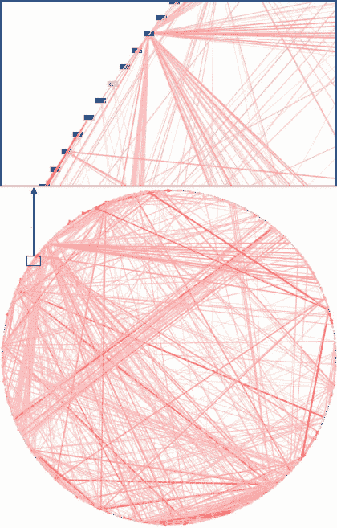
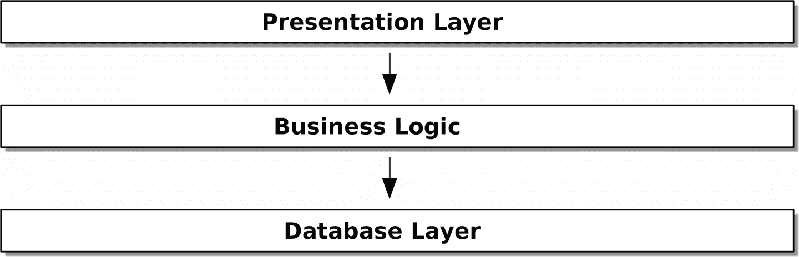

# 引言

> 原文：[Introduction](https://www.cosmicpython.com/book/introduction.html)
> 
> 译者：[飞龙](https://github.com/wizardforcel)
> 
> 协议：[CC BY-NC-SA 4.0](https://creativecommons.org/licenses/by-nc-sa/4.0/)

# 为什么我们的设计会出错？

当你听到*混乱*这个词时，你会想到什么？也许你会想到喧闹的股票交易所，或者早上的厨房——一切都混乱不堪。当你想到*秩序*这个词时，也许你会想到一个空旷的房间，宁静而平静。然而，对于科学家来说，混乱的特征是同质性（相同），而秩序的特征是复杂性（不同）。

例如，一个精心照料的花园是一个高度有序的系统。园丁用小路和篱笆定义边界，并标出花坛或菜园。随着时间的推移，花园会不断发展，变得更加丰富和茂密；但如果没有刻意的努力，花园就会变得狂野。杂草和草会扼杀其他植物，覆盖小路，最终每个部分看起来都一样——野生和无管理。

软件系统也倾向于混乱。当我们开始构建一个新系统时，我们有很大的想法，认为我们的代码会整洁有序，但随着时间的推移，我们发现它积累了垃圾和边缘情况，最终变成了令人困惑的混乱的经理类和工具模块。我们发现我们明智地分层的架构已经像过于湿润的杂果布丁一样崩溃了。混乱的软件系统的特征是功能的相同性：具有领域知识并发送电子邮件和执行日志记录的 API 处理程序；“业务逻辑”类不进行计算但执行 I/O；以及一切与一切耦合，以至于改变系统的任何部分都充满了危险。这是如此普遍，以至于软件工程师有自己的术语来描述混乱：大泥球反模式（图 P-1）。



###### 图 P-1\. 真实的依赖关系图（来源：[“企业依赖：大毛线球”](https://oreil.ly/dbGTW) by Alex Papadimoulis）

###### 提示

软件的自然状态就像你的花园的自然状态一样，都是一团大泥巴。阻止崩溃需要能量和方向。

幸运的是，避免创建一团大泥巴的技术并不复杂。

# 封装和抽象

封装和抽象是我们作为程序员本能地使用的工具，即使我们并不都使用这些确切的词语。让我们稍微停留一下，因为它们是本书中不断出现的背景主题。

术语*封装*涵盖了两个密切相关的概念：简化行为和隐藏数据。在这个讨论中，我们使用的是第一个意义。我们通过识别代码中需要完成的任务，并将该任务交给一个明确定义的对象或函数来封装行为。我们称该对象或函数为*抽象*。

看一下以下两个 Python 代码片段：

*使用 urllib 进行搜索*

```py
import json
from urllib.request import urlopen
from urllib.parse import urlencode

params = dict(q='Sausages', format='json')
handle = urlopen('http://api.duckduckgo.com' + '?' + urlencode(params))
raw_text = handle.read().decode('utf8')
parsed = json.loads(raw_text)

results = parsed['RelatedTopics']
for r in results:
    if 'Text' in r:
        print(r['FirstURL'] + ' - ' + r['Text'])
```

*使用 requests 进行搜索*

```py
import requests

params = dict(q='Sausages', format='json')
parsed = requests.get('http://api.duckduckgo.com/', params=params).json()

results = parsed['RelatedTopics']
for r in results:
    if 'Text' in r:
        print(r['FirstURL'] + ' - ' + r['Text'])
```

这两个代码清单都做同样的事情：它们提交表单编码的值到一个 URL，以便使用搜索引擎 API。但第二个更容易阅读和理解，因为它在更高的抽象级别上操作。

我们可以进一步迈出这一步，通过识别和命名我们希望代码为我们执行的任务，并使用更高级别的抽象来明确地执行它：

*使用 duckduckgo 模块进行搜索*

```py
import duckduckgo
for r in duckduckgo.query('Sausages').results:
    print(r.url + ' - ' + r.text)
```

通过使用抽象来封装行为是使代码更具表现力、更易于测试和更易于维护的强大工具。

###### 注意

在面向对象（OO）世界的文献中，这种方法的经典特征之一被称为[*责任驱动设计*](http://www.wirfs-brock.com/Design.html)；它使用*角色*和*责任*这些词，而不是*任务*。主要观点是以行为的方式思考代码，而不是以数据或算法的方式。¹

本书中的大多数模式都涉及选择抽象，因此您将在每一章中看到很多例子。此外，第三章专门讨论了选择抽象的一些一般启发法。

# 分层

封装和抽象通过隐藏细节和保护数据的一致性来帮助我们，但我们还需要注意对象和函数之间的交互。当一个函数、模块或对象使用另一个时，我们说一个*依赖于*另一个。这些依赖形成一种网络或图。

在一个巨大的泥球中，依赖关系失控（正如您在图 P-1 中看到的）。改变图的一个节点变得困难，因为它有可能影响系统的许多其他部分。分层架构是解决这个问题的一种方式。在分层架构中，我们将代码分成离散的类别或角色，并引入关于哪些代码类别可以相互调用的规则。

最常见的例子之一是图 P-2 中显示的*三层架构*。



###### 图 P-2。分层架构

```py
[ditaa,apwp_0002]
+----------------------------------------------------+
|                Presentation Layer                  |
+----------------------------------------------------+
                          |
                          V
+----------------------------------------------------+
|                 Business Logic                     |
+----------------------------------------------------+
                          |
                          V
+----------------------------------------------------+
|                  Database Layer                    |
+----------------------------------------------------+
```

分层架构可能是构建业务软件最常见的模式。在这个模型中，我们有用户界面组件，可以是网页、API 或命令行；这些用户界面组件与包含我们的业务规则和工作流程的业务逻辑层进行通信；最后，我们有一个负责存储和检索数据的数据库层。

在本书的其余部分，我们将通过遵循一个简单的原则系统地将这个模型颠倒过来。

# 依赖反转原则

您可能已经熟悉*依赖反转原则*（DIP），因为它是 SOLID 中的*D*。²

不幸的是，我们无法像我们为封装所做的那样使用三个小的代码清单来说明 DIP。然而，[第 I 部分](part01.xhtml#part1)的整个内容本质上是一个在整个应用程序中实现 DIP 的示例，因此您将得到大量具体的例子。

与此同时，我们可以谈谈 DIP 的正式定义：

1.  高级模块不应该依赖于低级模块。两者都应该依赖于抽象。

1.  抽象不应该依赖于细节。相反，细节应该依赖于抽象。

但这意味着什么呢？让我们一点一点来看。

*高级模块*是您的组织真正关心的代码。也许您在制药公司工作，您的高级模块处理患者和试验。也许您在银行工作，您的高级模块管理交易和交易所。软件系统的高级模块是处理我们真实世界概念的函数、类和包。

相比之下，*低级模块*是您的组织不关心的代码。您的人力资源部门不太可能对文件系统或网络套接字感到兴奋。您不经常与财务团队讨论 SMTP、HTTP 或 AMQP。对于我们的非技术利益相关者来说，这些低级概念并不有趣或相关。他们关心的只是高级概念是否正常工作。如果工资按时发放，您的业务不太可能关心这是一个 cron 作业还是在 Kubernetes 上运行的临时函数。

*依赖于*并不一定意味着*导入*或*调用*，而是一个更一般的想法，即一个模块*知道*或*需要*另一个模块。

我们已经提到了*抽象*：它们是简化的接口，封装了行为，就像我们的 duckduckgo 模块封装了搜索引擎的 API 一样。

> 计算机科学中的所有问题都可以通过增加另一个间接层来解决。
>
> ——大卫·惠勒

因此，DIP 的第一部分表示我们的业务代码不应该依赖于技术细节；相反，两者都应该使用抽象。

为什么？大体上，因为我们希望能够独立地对它们进行更改。高级模块应该易于根据业务需求进行更改。低级模块（细节）在实践中通常更难更改：想想重构以更改函数名称与定义、测试和部署数据库迁移以更改列名称之间的区别。我们不希望业务逻辑的更改因为与低级基础设施细节紧密耦合而变慢。但同样地，当需要时，重要的是*能够*更改基础设施细节（例如考虑分片数据库），而不需要对业务层进行更改。在它们之间添加一个抽象（著名的额外间接层）允许它们更独立地进行更改。

第二部分更加神秘。“抽象不应该依赖于细节”似乎很清楚，但“细节应该依赖于抽象”很难想象。我们怎么可能有一个不依赖于它所抽象的细节的抽象呢？到了第四章，我们将有一个具体的例子，这应该会让这一切更加清晰一些。

# 我们所有业务逻辑的归宿：领域模型

但在我们能够将我们的三层架构颠倒过来之前，我们需要更多地讨论中间层：高级模块或业务逻辑。我们设计出错的最常见原因之一是业务逻辑分散在应用程序的各个层中，使得很难识别、理解和更改。

第一章展示了如何使用*领域模型*模式构建业务层。[第一部分](part01.xhtml#part1)中的其余模式展示了我们如何通过选择正确的抽象并持续应用 DIP 来保持领域模型易于更改并且不受低级关注的影响。

¹ 如果你遇到过类-责任-协作（CRC）卡，它们指的是同样的事情：思考*责任*可以帮助你决定如何分割事物。

² SOLID 是 Robert C. Martin 关于面向对象设计的五个原则的首字母缩写：单一职责、开放封闭、里氏替换、接口隔离和依赖反转。参见 Samuel Oloruntoba 的文章[“S.O.L.I.D: The First 5 Principles of Object-Oriented Design”](https://oreil.ly/UFM7U)。
