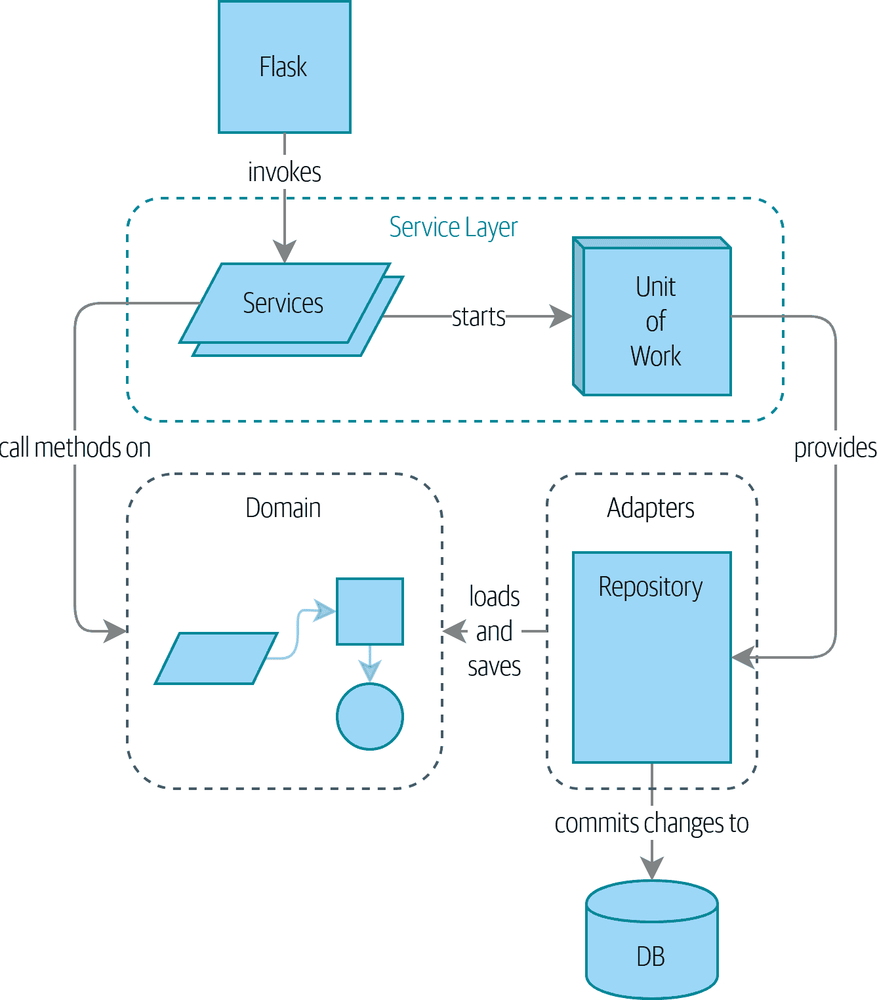

# 第一部分：构建支持领域建模的架构

> 原文：[Part 1: Building an Architecture to Support Domain Modeling](https://www.cosmicpython.com/book/part1.html)
> 
> 译者：[飞龙](https://github.com/wizardforcel)
> 
> 协议：[CC BY-NC-SA 4.0](https://creativecommons.org/licenses/by-nc-sa/4.0/)

> 大多数开发人员从未见过领域模型，只见过数据模型。
>
> ——Cyrille Martraire, DDD EU 2017

我们与关于架构的开发人员交谈时，他们常常有一种隐隐的感觉，觉得事情本可以更好。他们经常试图拯救一些出了问题的系统，并试图将一些结构重新放入一团混乱之中。他们知道他们的业务逻辑不应该分散在各个地方，但他们不知道如何解决。

我们发现许多开发人员在被要求设计一个新系统时，会立即开始构建数据库模式，将对象模型视为事后补充。这就是问题的根源。相反，*行为应该首先驱动我们的存储需求*。毕竟，我们的客户不关心数据模型。他们关心系统*做什么*；否则他们就会使用电子表格。

本书的第一部分介绍了如何通过 TDD 构建丰富的对象模型（在第一章中），然后我们将展示如何将该模型与技术关注点解耦。我们展示了如何构建与持久性无关的代码，以及如何围绕我们的领域创建稳定的 API，以便我们可以进行积极的重构。

为此，我们介绍了四个关键的设计模式：

+   [存储库模式](ch02.xhtml#chapter_02_repository)，是对持久性存储概念的抽象

+   [服务层模式](ch04.xhtml#chapter_04_service_layer)清晰地定义了我们的用例从何处开始和结束

+   [工作单元模式](ch06.xhtml#chapter_06_uow)提供原子操作

+   [聚合模式](ch07.xhtml#chapter_07_aggregate)以强制执行我们数据的完整性

如果你想知道我们的目标是什么，请看一下图 I-1，但如果现在还一头雾水也不要担心！我们会在本书的这一部分逐一介绍图中的每个框。

###### 图 I-1：我们应用程序的组件图在第 I 部分结束时

我们还抽出一点时间来谈论[耦合和抽象](ch03.xhtml#chapter_03_abstractions)，并用一个简单的例子来说明我们选择抽象的方式及原因。

三个附录进一步探讨了第一部分的内容：

+   附录 B 是我们示例代码的基础设施的描述：我们如何构建和运行 Docker 镜像，我们在哪里管理配置信息，以及我们如何运行不同类型的测试。

+   附录 C 是一种“见证成败”的内容，展示了如何轻松地更换我们整个基础架构——Flask API、ORM 和 Postgres——以完全不同的 I/O 模型，涉及 CLI 和 CSV。

+   最后，附录 D 可能会引起兴趣，如果你想知道使用 Django 而不是 Flask 和 SQLAlchemy 时这些模式会是什么样子。
