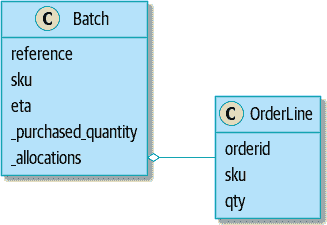
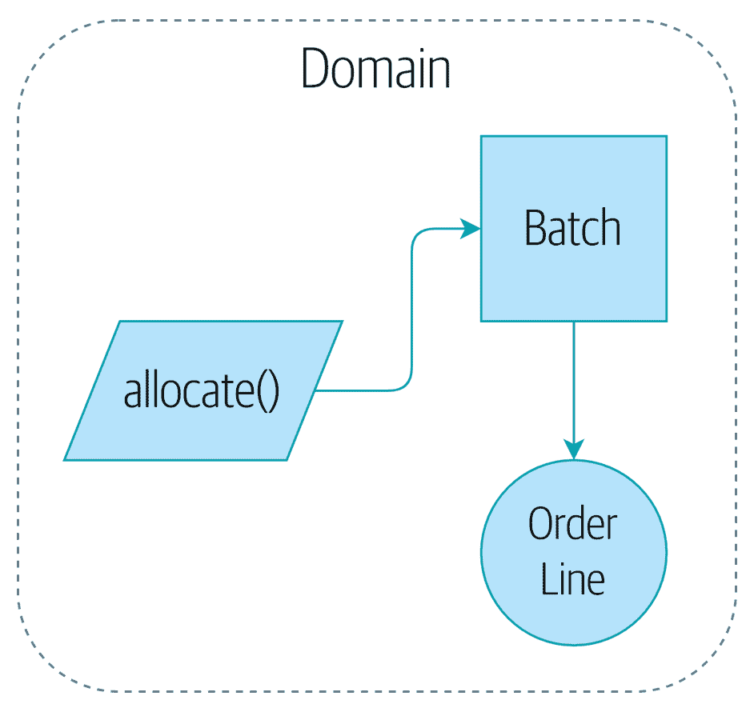

# 第一章：领域建模

> 原文：[1: Domain Modeling](https://www.cosmicpython.com/book/chapter_01_domain_model.html)
> 
> 译者：[飞龙](https://github.com/wizardforcel)
> 
> 协议：[CC BY-NC-SA 4.0](https://creativecommons.org/licenses/by-nc-sa/4.0/)

本章将探讨如何用代码对业务流程进行建模，以一种与 TDD 高度兼容的方式。我们将讨论领域建模的重要性，并将介绍一些建模领域的关键模式：实体、值对象和领域服务。

图 1-1 是我们领域模型模式的一个简单的视觉占位符。在本章中，我们将填写一些细节，随着我们继续其他章节，我们将围绕领域模型构建东西，但您应该始终能够在核心找到这些小形状。


###### 图 1-1：我们领域模型的一个占位符插图

# 什么是领域模型？

在[介绍](preface02.xhtml#introduction)中，我们使用了术语*业务逻辑层*来描述三层架构的中心层。在本书的其余部分，我们将使用术语*领域模型*。这是 DDD 社区的一个术语，更能准确地捕捉我们的意思（有关 DDD 的更多信息，请参见下一个侧边栏）。

*领域*是说*您正在尝试解决的问题*的一种花哨的说法。您的作者目前为一家家具在线零售商工作。根据您所谈论的系统，领域可能是采购和采购、产品设计或物流和交付。大多数程序员都在努力改进或自动化业务流程；领域是支持这些流程的一系列活动。

*模型*是捕捉有用属性的过程或现象的地图。人类在脑海中制作事物的模型非常擅长。例如，当有人向您扔球时，您能够几乎下意识地预测其运动，因为您对物体在空间中移动的方式有一个模型。您的模型并不完美。人类对物体在接近光速或真空中的行为有着糟糕的直觉，因为我们的模型从未设计来涵盖这些情况。这并不意味着模型是错误的，但这确实意味着一些预测超出了其领域。

领域模型是业务所有者对其业务的心智地图。所有的商业人士都有这些心智地图——这是人类思考复杂流程的方式。

当他们在这些地图上导航时，您可以通过他们使用商业用语来判断。术语在协作处理复杂系统的人群中自然产生。

想象一下，您，我们不幸的读者，突然被传送到光年之外的外星飞船上，与您的朋友和家人一起，不得不从头开始弄清楚如何回家。

在最初的几天里，您可能只是随机按按钮，但很快您会学会哪些按钮做什么，这样您就可以给彼此指示。“按下闪烁的小玩意旁边的红色按钮，然后把雷达小玩意旁边的大杠杆扔过去”，您可能会说。

在几周内，您会变得更加精确，因为您采用了用于描述船舶功能的词汇：“增加货舱三的氧气水平”或“打开小推进器”。几个月后，您将采用整个复杂流程的语言：“开始着陆序列”或“准备跃迁”。这个过程会很自然地发生，而不需要任何正式的努力来建立共享词汇表。

因此，在日常商业世界中也是如此。商业利益相关者使用的术语代表了对领域模型的精炼理解，复杂的想法和流程被简化为一个词或短语。

当我们听到我们的业务利益相关者使用陌生的词汇，或者以特定方式使用术语时，我们应该倾听以理解更深层的含义，并将他们辛苦获得的经验编码到我们的软件中。

在本书中，我们将使用一个真实的领域模型，具体来说是我们目前的雇主的模型。MADE.com 是一家成功的家具零售商。我们从世界各地的制造商那里采购家具，并在整个欧洲销售。

当您购买沙发或咖啡桌时，我们必须想出如何最好地将您的商品从波兰、中国或越南运送到您的客厅。

在高层次上，我们有独立的系统负责购买库存、向客户销售库存和向客户发货。中间的一个系统需要通过将库存分配给客户的订单来协调这个过程；参见图 1-2。


###### 图 1-2：分配服务的上下文图

```py
[plantuml, apwp_0102]
@startuml Allocation Context Diagram
!include images/C4_Context.puml

System(systema, "Allocation", "Allocates stock to customer orders")

Person(customer, "Customer", "Wants to buy furniture")
Person(buyer, "Buying Team", "Needs to purchase furniture from suppliers")

System(procurement, "Purchasing", "Manages workflow for buying stock from suppliers")
System(ecom, "E-commerce", "Sells goods online")
System(warehouse, "Warehouse", "Manages workflow for shipping goods to customers.")

Rel(buyer, procurement, "Uses")
Rel(procurement, systema, "Notifies about shipments")
Rel(customer, ecom, "Buys from")
Rel(ecom, systema, "Asks for stock levels")
Rel(ecom, systema, "Notifies about orders")
Rel_R(systema, warehouse, "Sends instructions to")
Rel_U(warehouse, customer, "Dispatches goods to")

@enduml
```

为了本书的目的，我们想象业务决定实施一种令人兴奋的新的库存分配方式。到目前为止，业务一直根据仓库中实际可用的库存和交货时间来展示库存和交货时间。如果仓库用完了，产品就被列为“缺货”，直到下一批从制造商那里到货。

这里的创新是：如果我们有一个系统可以跟踪我们所有的货物运输及其到达时间，我们就可以将这些货物视为真实库存和我们库存的一部分，只是交货时间稍长一些。更少的商品将显示为缺货，我们将销售更多商品，业务可以通过在国内仓库保持较低的库存来节省成本。

但是分配订单不再是在仓库系统中减少单个数量的琐事。我们需要一个更复杂的分配机制。是时候进行一些领域建模了。

# 探索领域语言

理解领域模型需要时间、耐心和便利贴。我们与业务专家进行了初步对话，并就领域模型的第一个最小版本的术语表和一些规则达成一致。在可能的情况下，我们要求提供具体的例子来说明每条规则。

我们确保用业务行话（在 DDD 术语中称为*普遍语言*）来表达这些规则。我们为我们的对象选择了易于讨论的可记忆的标识符，以便更容易地讨论示例。

“分配的一些注释”显示了我们在与领域专家讨论分配时可能做的一些注释。

# 领域模型的单元测试

我们不会在这本书中向您展示 TDD 的工作原理，但我们想向您展示我们如何从这次业务对话中构建模型。

我们的第一个测试可能如下所示：

*分配的第一个测试（`test_batches.py`）*

```py
def test_allocating_to_a_batch_reduces_the_available_quantity():
    batch = Batch("batch-001", "SMALL-TABLE", qty=20, eta=date.today())
    line = OrderLine('order-ref', "SMALL-TABLE", 2)

    batch.allocate(line)

    assert batch.available_quantity == 18
```

我们的单元测试的名称描述了我们希望从系统中看到的行为，我们使用的类和变量的名称取自业务行话。我们可以向非技术同事展示这段代码，他们会同意这正确地描述了系统的行为。

这是一个满足我们要求的领域模型：

*批次的领域模型的初步版本（`model.py`）*

```py
@dataclass(frozen=True)  #(1) (2)
class OrderLine:
    orderid: str
    sku: str
    qty: int


class Batch:
    def __init__(self, ref: str, sku: str, qty: int, eta: Optional[date]):  #(2)
        self.reference = ref
        self.sku = sku
        self.eta = eta
        self.available_quantity = qty

    def allocate(self, line: OrderLine):  #(3)
        self.available_quantity -= line.qty
```

①

`OrderLine`是一个没有行为的不可变数据类。²

②

我们在大多数代码清单中不显示导入，以保持其整洁。我们希望您能猜到这是通过`from dataclasses import dataclass`导入的；同样，`typing.Optional`和`datetime.date`也是如此。如果您想要进行双重检查，可以在其分支中查看每个章节的完整工作代码（例如，[chapter_01_domain_model](https://github.com/python-leap/code/tree/chapter_01_domain_model)）。

③

类型提示在 Python 世界仍然是一个有争议的问题。对于领域模型，它们有时可以帮助澄清或记录预期的参数是什么，而且使用 IDE 的人通常会对它们表示感激。您可能会认为在可读性方面付出的代价太高。

我们的实现在这里是微不足道的：`Batch`只是包装了一个整数`available_quantity`，并在分配时减少该值。我们写了相当多的代码来从另一个数字中减去一个数字，但我们认为精确建模我们的领域将会得到回报。³

让我们写一些新的失败测试：

*测试我们可以分配什么的逻辑（`test_batches.py`）*

```py
def make_batch_and_line(sku, batch_qty, line_qty):
    return (
        Batch("batch-001", sku, batch_qty, eta=date.today()),
        OrderLine("order-123", sku, line_qty)
    )

def test_can_allocate_if_available_greater_than_required():
    large_batch, small_line = make_batch_and_line("ELEGANT-LAMP", 20, 2)
    assert large_batch.can_allocate(small_line)

def test_cannot_allocate_if_available_smaller_than_required():
    small_batch, large_line = make_batch_and_line("ELEGANT-LAMP", 2, 20)
    assert small_batch.can_allocate(large_line) is False

def test_can_allocate_if_available_equal_to_required():
    batch, line = make_batch_and_line("ELEGANT-LAMP", 2, 2)
    assert batch.can_allocate(line)

def test_cannot_allocate_if_skus_do_not_match():
    batch = Batch("batch-001", "UNCOMFORTABLE-CHAIR", 100, eta=None)
    different_sku_line = OrderLine("order-123", "EXPENSIVE-TOASTER", 10)
    assert batch.can_allocate(different_sku_line) is False
```

这里没有太多意外。我们重构了我们的测试套件，以便我们不再重复相同的代码行来为相同的 SKU 创建批次和行；我们为一个新方法`can_allocate`编写了四个简单的测试。再次注意，我们使用的名称与我们的领域专家的语言相呼应，并且我们商定的示例直接写入了代码。

我们也可以直接实现这一点，通过编写`Batch`的`can_allocate`方法：

*模型中的一个新方法（`model.py`）*

```py
    def can_allocate(self, line: OrderLine) -> bool:
        return self.sku == line.sku and self.available_quantity >= line.qty
```

到目前为止，我们可以通过增加和减少`Batch.available_quantity`来管理实现，但是当我们进入`deallocate()`测试时，我们将被迫采用更智能的解决方案：

*这个测试将需要一个更智能的模型（`test_batches.py`）*

```py
def test_can_only_deallocate_allocated_lines():
    batch, unallocated_line = make_batch_and_line("DECORATIVE-TRINKET", 20, 2)
    batch.deallocate(unallocated_line)
    assert batch.available_quantity == 20
```

在这个测试中，我们断言从批次中取消分配一行，除非批次先前分配了该行，否则不会产生任何影响。为了使其工作，我们的`Batch`需要了解哪些行已经被分配。让我们来看看实现：

*领域模型现在跟踪分配（`model.py`）*

```py
class Batch:
    def __init__(
        self, ref: str, sku: str, qty: int, eta: Optional[date]
    ):
        self.reference = ref
        self.sku = sku
        self.eta = eta
        self._purchased_quantity = qty
        self._allocations = set()  # type: Set[OrderLine]

    def allocate(self, line: OrderLine):
        if self.can_allocate(line):
            self._allocations.add(line)

    def deallocate(self, line: OrderLine):
        if line in self._allocations:
            self._allocations.remove(line)

    @property
    def allocated_quantity(self) -> int:
        return sum(line.qty for line in self._allocations)

    @property
    def available_quantity(self) -> int:
        return self._purchased_quantity - self.allocated_quantity

    def can_allocate(self, line: OrderLine) -> bool:
        return self.sku == line.sku and self.available_quantity >= line.qty
```

图 1-3 显示了 UML 中的模型。



###### 图 1-3\. 我们的 UML 模型

```py
[plantuml, apwp_0103, config=plantuml.cfg]

left to right direction
hide empty members

class Batch {
    reference
    sku
    eta
    _purchased_quantity
    _allocations
}

class OrderLine {
    orderid
    sku
    qty
}

Batch::_allocations o-- OrderLine
```

现在我们有了进展！批次现在跟踪一组已分配的`OrderLine`对象。当我们分配时，如果我们有足够的可用数量，我们只需添加到集合中。我们的`available_quantity`现在是一个计算属性：购买数量减去分配数量。

是的，我们还可以做很多事情。令人不安的是，`allocate()`和`deallocate()`都可能悄悄失败，但我们已经掌握了基础知识。

顺便说一句，使用`._allocations`的集合使我们能够简单地处理最后一个测试，因为集合中的项目是唯一的：

*最后的批次测试！（`test_batches.py`）*

```py
def test_allocation_is_idempotent():
    batch, line = make_batch_and_line("ANGULAR-DESK", 20, 2)
    batch.allocate(line)
    batch.allocate(line)
    assert batch.available_quantity == 18
```

目前，可以说领域模型太琐碎，不值得费心去做 DDD（甚至是面向对象！）。在现实生活中，会出现任意数量的业务规则和边缘情况：客户可以要求在特定未来日期交付，这意味着我们可能不想将它们分配给最早的批次。一些 SKU 不在批次中，而是直接从供应商那里按需订购，因此它们具有不同的逻辑。根据客户的位置，我们只能分配给其地区内的一部分仓库和货运，除了一些 SKU，如果我们在本地区域缺货，我们可以从不同地区的仓库交付。等等。现实世界中的真实企业知道如何比我们在页面上展示的更快地增加复杂性！

但是，将这个简单的领域模型作为更复杂东西的占位符，我们将在本书的其余部分扩展我们简单的领域模型，并将其插入到 API 和数据库以及电子表格的真实世界中。我们将看到，严格遵守封装和谨慎分层的原则将帮助我们避免一团泥。

## 数据类非常适合值对象

在先前的代码列表中，我们大量使用了`line`，但是什么是 line？在我们的业务语言中，一个*订单*有多个*行*项目，每行都有一个 SKU 和数量。我们可以想象，一个包含订单信息的简单 YAML 文件可能如下所示：

*订单信息作为 YAML*

```py
Order_reference: 12345
Lines:
  - sku: RED-CHAIR
    qty: 25
  - sku: BLU-CHAIR
    qty: 25
  - sku: GRN-CHAIR
    qty: 25
```

请注意，订单具有唯一标识它的*引用*，而*线路*没有。（即使我们将订单引用添加到`OrderLine`类中，它也不是唯一标识线路本身的东西。）

每当我们有一个具有数据但没有身份的业务概念时，我们通常选择使用*价值对象*模式来表示它。*价值对象*是任何由其持有的数据唯一标识的领域对象；我们通常使它们是不可变的：

*OrderLine 是一个价值对象*

```py
@dataclass(frozen=True)
class OrderLine:
    orderid: OrderReference
    sku: ProductReference
    qty: Quantity
```

数据类（或命名元组）给我们带来的一个好处是*值相等*，这是说“具有相同`orderid`、`sku`和`qty`的两行是相等的”这种花哨的方式。

*价值对象的更多示例*

```py
from dataclasses import dataclass
from typing import NamedTuple
from collections import namedtuple

@dataclass(frozen=True)
class Name:
    first_name: str
    surname: str

class Money(NamedTuple):
    currency: str
    value: int

Line = namedtuple('Line', ['sku', 'qty'])

def test_equality():
    assert Money('gbp', 10) == Money('gbp', 10)
    assert Name('Harry', 'Percival') != Name('Bob', 'Gregory')
    assert Line('RED-CHAIR', 5) == Line('RED-CHAIR', 5)
```

这些价值对象与我们对其值如何工作的现实世界直觉相匹配。讨论的是*哪张*10 英镑钞票并不重要，因为它们都有相同的价值。同样，如果名字的名和姓都匹配，两个名字是相等的；如果客户订单、产品代码和数量相同，两行是等价的。不过，我们仍然可以在价值对象上有复杂的行为。事实上，在值上支持操作是很常见的；例如，数学运算符：

*使用价值对象进行数学运算*

```py
fiver = Money('gbp', 5)
tenner = Money('gbp', 10)

def can_add_money_values_for_the_same_currency():
    assert fiver + fiver == tenner

def can_subtract_money_values():
    assert tenner - fiver == fiver

def adding_different_currencies_fails():
    with pytest.raises(ValueError):
        Money('usd', 10) + Money('gbp', 10)

def can_multiply_money_by_a_number():
    assert fiver * 5 == Money('gbp', 25)

def multiplying_two_money_values_is_an_error():
    with pytest.raises(TypeError):
        tenner * fiver
```

## 价值对象和实体

订单行通过其订单 ID、SKU 和数量唯一标识；如果我们更改其中一个值，现在我们有了一个新的行。这就是价值对象的定义：任何仅由其数据标识并且没有长期身份的对象。不过，批次呢？那*是*由一个引用标识的。

我们使用术语*实体*来描述具有长期身份的领域对象。在上一页中，我们介绍了`Name`类作为一个价值对象。如果我们把哈利·珀西瓦尔的名字改变一个字母，我们就得到了新的`Name`对象巴里·珀西瓦尔。

哈利·珀西瓦尔显然不等于巴里·珀西瓦尔：

*名字本身是不能改变的...*

```py
def test_name_equality():
    assert Name("Harry", "Percival") != Name("Barry", "Percival")
```

但是作为*人*的哈利呢？人们确实会改变他们的名字，婚姻状况，甚至性别，但我们仍然认为他们是同一个个体。这是因为人类，与名字不同，具有持久的*身份*：

*但一个人可以！*

```py
class Person:

    def __init__(self, name: Name):
        self.name = name

def test_barry_is_harry():
    harry = Person(Name("Harry", "Percival"))
    barry = harry

    barry.name = Name("Barry", "Percival")

    assert harry is barry and barry is harry
```

实体，与值不同，具有*身份相等*。我们可以改变它们的值，它们仍然可以被识别为同一件事物。在我们的例子中，批次是实体。我们可以为批次分配线路，或更改我们期望它到达的日期，它仍然是同一个实体。

我们通常通过在实体上实现相等运算符来在代码中明确表示这一点：

*实现相等运算符（`model.py`）*

```py
class Batch:
    ...

    def __eq__(self, other):
        if not isinstance(other, Batch):
            return False
        return other.reference == self.reference

    def __hash__(self):
        return hash(self.reference)
```

Python 的`__eq__`魔术方法定义了类在`==`运算符下的行为。⁵

对于实体和价值对象，思考`__hash__`的工作方式也很重要。这是 Python 用来控制对象在添加到集合或用作字典键时的行为的魔术方法；你可以在[Python 文档](https://oreil.ly/YUzg5)中找到更多信息。

对于价值对象，哈希应该基于所有值属性，并且我们应该确保对象是不可变的。通过在数据类上指定`@frozen=True`，我们可以免费获得这一点。

对于实体，最简单的选择是说哈希是`None`，这意味着对象是不可哈希的，不能用于集合中。如果出于某种原因，你决定确实想要使用集合或字典操作与实体，哈希应该基于定义实体在一段时间内的唯一身份的属性（如`.reference`）。你还应该尝试以某种方式使*那个*属性只读。

###### 警告

这是一个棘手的领域；你不应该修改`__hash__`而不修改`__eq__`。如果你不确定自己在做什么，建议进一步阅读。我们的技术审阅员 Hynek Schlawack 的[“Python Hashes and Equality”](https://oreil.ly/vxkgX)是一个很好的起点。

# 并非所有的东西都必须是一个对象：领域服务函数

我们已经制作了一个表示批次的模型，但我们实际上需要做的是针对代表我们所有库存的特定一组批次分配订单行。

> 有时，这只是一种事情。
>
> ——Eric Evans，领域驱动设计

Evans 讨论了领域服务操作的概念，这些操作在实体或值对象中没有自然的归属地。⁶ 分配订单行的东西，给定一组批次，听起来很像一个函数，我们可以利用 Python 是一种多范式语言的事实，只需将其变成一个函数。

让我们看看如何测试驱动这样一个函数：

*测试我们的领域服务（`test_allocate.py`）*

```py
def test_prefers_current_stock_batches_to_shipments():
    in_stock_batch = Batch("in-stock-batch", "RETRO-CLOCK", 100, eta=None)
    shipment_batch = Batch("shipment-batch", "RETRO-CLOCK", 100, eta=tomorrow)
    line = OrderLine("oref", "RETRO-CLOCK", 10)

    allocate(line, [in_stock_batch, shipment_batch])

    assert in_stock_batch.available_quantity == 90
    assert shipment_batch.available_quantity == 100

def test_prefers_earlier_batches():
    earliest = Batch("speedy-batch", "MINIMALIST-SPOON", 100, eta=today)
    medium = Batch("normal-batch", "MINIMALIST-SPOON", 100, eta=tomorrow)
    latest = Batch("slow-batch", "MINIMALIST-SPOON", 100, eta=later)
    line = OrderLine("order1", "MINIMALIST-SPOON", 10)

    allocate(line, [medium, earliest, latest])

    assert earliest.available_quantity == 90
    assert medium.available_quantity == 100
    assert latest.available_quantity == 100

def test_returns_allocated_batch_ref():
    in_stock_batch = Batch("in-stock-batch-ref", "HIGHBROW-POSTER", 100, eta=None)
    shipment_batch = Batch("shipment-batch-ref", "HIGHBROW-POSTER", 100, eta=tomorrow)
    line = OrderLine("oref", "HIGHBROW-POSTER", 10)
    allocation = allocate(line, [in_stock_batch, shipment_batch])
    assert allocation == in_stock_batch.reference
```

我们的服务可能看起来像这样：

*我们的领域服务的独立函数（`model.py`）*

```py
def allocate(line: OrderLine, batches: List[Batch]) -> str:
    batch = next(
        b for b in sorted(batches) if b.can_allocate(line)
    )
    batch.allocate(line)
    return batch.reference
```

## Python 的魔术方法让我们可以使用我们的模型与惯用的 Python

你可能会喜欢或不喜欢在前面的代码中使用`next()`，但我们非常确定你会同意在我们的批次列表上使用`sorted()`是很好的，符合 Python 的惯用法。

为了使其工作，我们在我们的领域模型上实现`__gt__`：

*魔术方法可以表达领域语义（`model.py`）*

```py
class Batch:
    ...

    def __gt__(self, other):
        if self.eta is None:
            return False
        if other.eta is None:
            return True
        return self.eta > other.eta
```

太棒了。

## 异常也可以表达领域概念

我们还有一个最后的概念要涵盖：异常也可以用来表达领域概念。在与领域专家的对话中，我们了解到订单无法分配的可能性，因为我们*缺货*，我们可以通过使用*领域异常*来捕获这一点：

*测试缺货异常（`test_allocate.py`）*

```py
def test_raises_out_of_stock_exception_if_cannot_allocate():
    batch = Batch('batch1', 'SMALL-FORK', 10, eta=today)
    allocate(OrderLine('order1', 'SMALL-FORK', 10), [batch])

    with pytest.raises(OutOfStock, match='SMALL-FORK'):
        allocate(OrderLine('order2', 'SMALL-FORK', 1), [batch])
```

我们不会让你对实现感到厌烦，但需要注意的主要事情是，我们在通用语言中命名我们的异常，就像我们对实体、值对象和服务一样：

*引发领域异常（`model.py`）*

```py
class OutOfStock(Exception):
    pass

def allocate(line: OrderLine, batches: List[Batch]) -> str:
    try:
        batch = next(
        ...
    except StopIteration:
        raise OutOfStock(f'Out of stock for sku {line.sku}')
```

图 1-4 是我们最终达到的视觉表示。



###### 图 1-4：本章结束时的我们的领域模型

现在可能就够了！我们有一个可以用于我们的第一个用例的域服务。但首先我们需要一个数据库...

¹ DDD 并非起源于领域建模。Eric Evans 提到了 2002 年 Rebecca Wirfs-Brock 和 Alan McKean 的书*Object Design*（Addison-Wesley Professional），该书介绍了责任驱动设计，而 DDD 是处理领域的特殊情况。但即使如此，这也太晚了，OO 爱好者会告诉你要更进一步地回溯到 Ivar Jacobson 和 Grady Booch；这个术语自上世纪 80 年代中期就已经存在了。

² 在以前的 Python 版本中，我们可能会使用一个命名元组。您还可以查看 Hynek Schlawack 的优秀的[attrs](https://pypi.org/project/attrs)。

³ 或者也许你认为代码还不够？`OrderLine`中的 SKU 与`Batch.sku`匹配的某种检查呢？我们在附录 E 中保存了一些关于验证的想法。

⁴ 这太糟糕了。请，拜托，不要这样做。 ——Harry

⁵ `__eq__`方法的发音是“dunder-EQ”。至少有些人是这么说的。

⁶ 领域服务与[服务层](ch04.xhtml#chapter_04_service_layer)中的服务不是同一回事，尽管它们经常密切相关。领域服务代表了一个业务概念或流程，而服务层服务代表了应用程序的用例。通常，服务层将调用领域服务。
