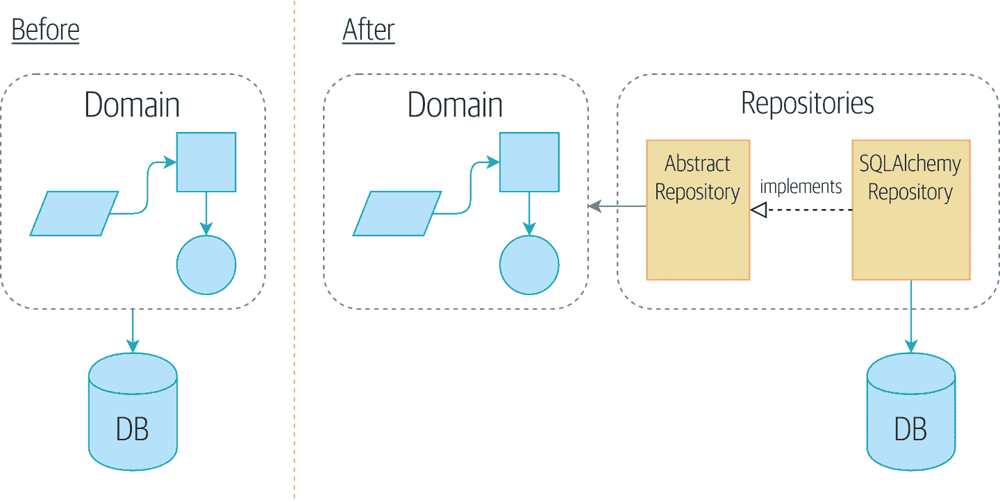
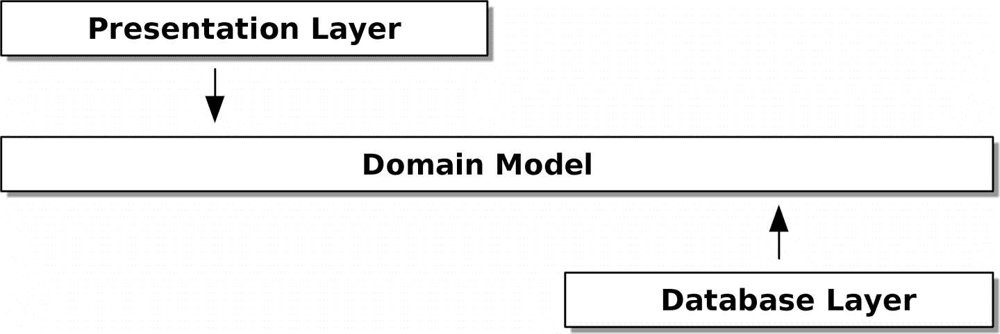
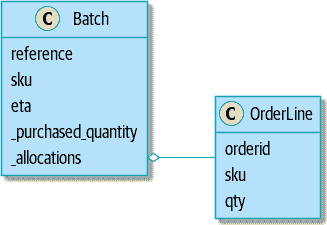
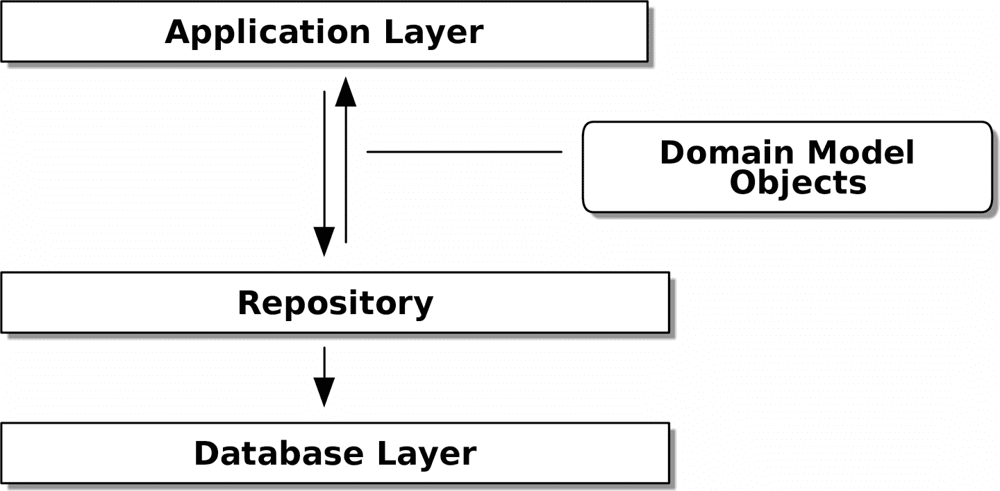
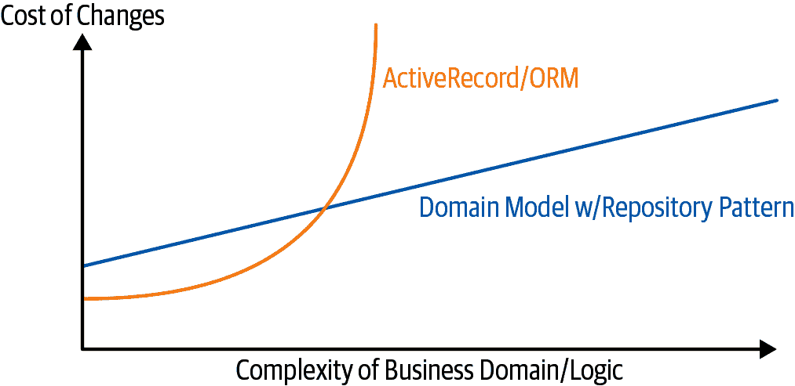

# 第二章：仓储模式

> 原文：[2: Repository Pattern](https://www.cosmicpython.com/book/chapter_02_repository.html)
> 
> 译者：[飞龙](https://github.com/wizardforcel)
> 
> 协议：[CC BY-NC-SA 4.0](https://creativecommons.org/licenses/by-nc-sa/4.0/)

是时候兑现我们使用依赖倒置原则来将核心逻辑与基础设施问题解耦的承诺了。

我们将引入*仓储*模式，这是对数据存储的简化抽象，允许我们将模型层与数据层解耦。我们将通过一个具体的例子来展示这种简化的抽象如何通过隐藏数据库的复杂性使我们的系统更具可测试性。

图 2-1 显示了我们将要构建的一个小预览：一个`Repository`对象，位于我们的领域模型和数据库之间。



###### 图 2-1：仓储模式之前和之后

###### 提示

本章的代码在 GitHub 的 chapter_02_repository 分支中。

```py
git clone https://github.com/cosmicpython/code.git
cd code
git checkout chapter_02_repository
# or to code along, checkout the previous chapter:
git checkout chapter_01_domain_model
```

# 持久化我们的领域模型

在第一章中，我们构建了一个简单的领域模型，可以将订单分配给库存批次。我们很容易对这段代码编写测试，因为没有任何依赖或基础设施需要设置。如果我们需要运行数据库或 API 并创建测试数据，我们的测试将更难编写和维护。

不幸的是，我们总有一天需要把我们完美的小模型交到用户手中，并应对电子表格、Web 浏览器和竞争条件的现实世界。在接下来的几章中，我们将看看如何将我们理想化的领域模型连接到外部状态。

我们期望以敏捷的方式工作，因此我们的优先任务是尽快实现最小可行产品。在我们的情况下，这将是一个 Web API。在一个真实的项目中，你可能会直接进行一些端到端的测试，并开始插入一个 Web 框架，从外到内进行测试驱动。

但是我们知道，无论如何，我们都需要某种形式的持久存储，这是一本教科书，所以我们可以允许自己多一点自下而上的开发，并开始考虑存储和数据库。

# 一些伪代码：我们需要什么？

当我们构建我们的第一个 API 端点时，我们知道我们将会有一些看起来更或多少像以下的代码。

*我们的第一个 API 端点将是什么样子*

```py
@flask.route.gubbins
def allocate_endpoint():
    # extract order line from request
    line = OrderLine(request.params, ...)
    # load all batches from the DB
    batches = ...
    # call our domain service
    allocate(line, batches)
    # then save the allocation back to the database somehow
    return 201
```

###### 注意

我们使用 Flask 是因为它很轻量，但你不需要是 Flask 用户才能理解这本书。事实上，我们将向你展示如何使你选择的框架成为一个细节。

我们需要一种方法从数据库中检索批次信息，并从中实例化我们的领域模型对象，我们还需要一种将它们保存回数据库的方法。

*什么？哦，“gubbins”是一个英国词，意思是“东西”。你可以忽略它。这是伪代码，好吗？*

# 应用 DIP 到数据访问

如[介绍](preface02.xhtml#introduction)中提到的，分层架构是一种常见的系统结构方法，该系统具有 UI、一些逻辑和数据库（见图 2-2）。


###### 图 2-2：分层架构

Django 的模型-视图-模板结构是密切相关的，就像模型-视图-控制器（MVC）一样。无论如何，目标是保持各层分离（这是一件好事），并且使每一层仅依赖于其下面的一层。

但是我们希望我们的领域模型*完全没有任何依赖*。我们不希望基础设施问题渗入我们的领域模型，从而减慢我们的单元测试或我们进行更改的能力。

相反，正如在介绍中讨论的那样，我们将把我们的模型视为“内部”，并将依赖项向内流动；这就是人们有时称之为*洋葱架构*的东西（见图 2-3）。



###### 图 2-3：洋葱架构

```py
[ditaa, apwp_0203]
+------------------------+
|   Presentation Layer   |
+------------------------+
           |
           V
+--------------------------------------------------+
|                  Domain Model                    |
+--------------------------------------------------+
                                        ^
                                        |
                             +---------------------+
                             |    Database Layer   |
                             +---------------------+
```

# 提醒：我们的模型

让我们回顾一下我们的领域模型（见图 2-4）：分配是将`OrderLine`链接到`Batch`的概念。我们将分配存储为我们`Batch`对象的集合。



###### 图 2-4：我们的模型

让我们看看如何将其转换为关系数据库。

## “正常”的 ORM 方式：模型依赖于 ORM

如今，您的团队成员不太可能手工编写自己的 SQL 查询。相反，您几乎肯定是在基于模型对象生成 SQL 的某种框架上使用。

这些框架被称为“对象关系映射器”（ORMs），因为它们存在的目的是弥合对象和领域建模世界与数据库和关系代数世界之间的概念差距。

ORM 给我们最重要的东西是“持久性无知”：即我们的精巧领域模型不需要知道如何加载或持久化数据。这有助于保持我们的领域不受特定数据库技术的直接依赖。³

但是，如果您遵循典型的 SQLAlchemy 教程，最终会得到类似于这样的东西：

SQLAlchemy 的“声明性”语法，模型依赖于 ORM（`orm.py`）

```py
from sqlalchemy import Column, ForeignKey, Integer, String
from sqlalchemy.ext.declarative import declarative_base
from sqlalchemy.orm import relationship

Base = declarative_base()

class Order(Base):
    id = Column(Integer, primary_key=True)

class OrderLine(Base):
    id = Column(Integer, primary_key=True)
    sku = Column(String(250))
    qty = Integer(String(250))
    order_id = Column(Integer, ForeignKey('order.id'))
    order = relationship(Order)

class Allocation(Base):
    ...
```

您无需了解 SQLAlchemy 就能看到我们的原始模型现在充满了对 ORM 的依赖，并且看起来非常丑陋。我们真的能说这个模型对数据库一无所知吗？当我们的模型属性直接耦合到数据库列时，它怎么能与存储问题分离？

## 反转依赖关系：ORM 依赖于模型

幸运的是，这并不是使用 SQLAlchemy 的唯一方式。另一种方法是分别定义架构，并定义一个显式的*映射器*，用于在架构和我们的领域模型之间进行转换，SQLAlchemy 称之为[经典映射](https://oreil.ly/ZucTG)：

使用 SQLAlchemy Table 对象显式 ORM 映射（`orm.py`）

```py
from sqlalchemy.orm import mapper, relationship

import model  #(1)


metadata = MetaData()

order_lines = Table(  #(2)
    "order_lines",
    metadata,
    Column("id", Integer, primary_key=True, autoincrement=True),
    Column("sku", String(255)),
    Column("qty", Integer, nullable=False),
    Column("orderid", String(255)),
)

...

def start_mappers():
    lines_mapper = mapper(model.OrderLine, order_lines)  #(3)
```

①

ORM 导入（或“依赖”或“了解”）领域模型，而不是相反。

②

我们通过使用 SQLAlchemy 的抽象来定义我们的数据库表和列。⁴

③

当我们调用`mapper`函数时，SQLAlchemy 会通过其魔术将我们的领域模型类绑定到我们定义的各种表上。

最终结果将是，如果我们调用`start_mappers`，我们将能够轻松地从数据库加载和保存领域模型实例。但如果我们从未调用该函数，我们的领域模型类将幸福地不知道数据库的存在。

这为我们带来了 SQLAlchemy 的所有好处，包括能够使用`alembic`进行迁移，并且能够透明地使用我们的领域类进行查询，我们将会看到。

当您首次尝试构建 ORM 配置时，编写测试可能会很有用，如以下示例所示：

直接测试 ORM（一次性测试）（`test_orm.py`）

```py
def test_orderline_mapper_can_load_lines(session):  #(1)
    session.execute(
        "INSERT INTO order_lines (orderid, sku, qty) VALUES "
        '("order1", "RED-CHAIR", 12),'
        '("order1", "RED-TABLE", 13),'
        '("order2", "BLUE-LIPSTICK", 14)'
    )
    expected = [
        model.OrderLine("order1", "RED-CHAIR", 12),
        model.OrderLine("order1", "RED-TABLE", 13),
        model.OrderLine("order2", "BLUE-LIPSTICK", 14),
    ]
    assert session.query(model.OrderLine).all() == expected


def test_orderline_mapper_can_save_lines(session):
    new_line = model.OrderLine("order1", "DECORATIVE-WIDGET", 12)
    session.add(new_line)
    session.commit()

    rows = list(session.execute('SELECT orderid, sku, qty FROM "order_lines"'))
    assert rows == [("order1", "DECORATIVE-WIDGET", 12)]
```

①

如果您还没有使用 pytest，需要解释此测试的`session`参数。您无需担心 pytest 或其固定装置的细节，但简单的解释是，您可以将测试的常见依赖项定义为“固定装置”，pytest 将通过查看其函数参数将它们注入到需要它们的测试中。在这种情况下，它是一个 SQLAlchemy 数据库会话。

您可能不会保留这些测试，因为很快您将看到，一旦您采取了反转 ORM 和领域模型的步骤，实现另一个称为存储库模式的抽象只是一个小的额外步骤，这将更容易编写测试，并将为以后的测试提供一个简单的接口。

但我们已经实现了我们颠倒传统依赖的目标：领域模型保持“纯粹”并且不受基础设施问题的影响。我们可以放弃 SQLAlchemy 并使用不同的 ORM，或者完全不同的持久性系统，领域模型根本不需要改变。

根据您在领域模型中所做的工作，特别是如果您偏离 OO 范式，您可能会发现越来越难以使 ORM 产生您需要的确切行为，并且您可能需要修改您的领域模型。⁵就像经常发生的架构决策一样，您需要考虑权衡。正如 Python 之禅所说：“实用性胜过纯粹！”

不过，此时我们的 API 端点可能看起来像下面这样，并且我们可以让它正常工作：

*在我们的 API 端点直接使用 SQLAlchemy*

```py
@flask.route.gubbins
def allocate_endpoint():
    session = start_session()

    # extract order line from request
    line = OrderLine(
        request.json['orderid'],
        request.json['sku'],
        request.json['qty'],
    )

    # load all batches from the DB
    batches = session.query(Batch).all()

    # call our domain service
    allocate(line, batches)

    # save the allocation back to the database
    session.commit()

    return 201
```

# 引入存储库模式

*存储库*模式是对持久性存储的抽象。它通过假装我们所有的数据都在内存中来隐藏数据访问的无聊细节。

如果我们的笔记本电脑有无限的内存，我们就不需要笨拙的数据库了。相反，我们可以随时使用我们的对象。那会是什么样子？

*你必须从某处获取你的数据*

```py
import all_my_data

def create_a_batch():
    batch = Batch(...)
    all_my_data.batches.add(batch)

def modify_a_batch(batch_id, new_quantity):
    batch = all_my_data.batches.get(batch_id)
    batch.change_initial_quantity(new_quantity)
```

尽管我们的对象在内存中，但我们需要将它们放在*某个地方*，以便我们可以再次找到它们。我们的内存中的数据可以让我们添加新对象，就像列表或集合一样。因为对象在内存中，我们永远不需要调用`.save()`方法；我们只需获取我们关心的对象并在内存中修改它。

## 抽象中的存储库

最简单的存储库只有两种方法：`add()`用于将新项目放入存储库，`get()`用于返回先前添加的项目。⁶我们严格遵守在我们的领域和服务层中使用这些方法进行数据访问。这种自我施加的简单性阻止了我们将领域模型与数据库耦合。

这是我们存储库的抽象基类（ABC）会是什么样子：

*最简单的存储库（`repository.py`）*

```py
class AbstractRepository(abc.ABC):
    @abc.abstractmethod  #(1)
    def add(self, batch: model.Batch):
        raise NotImplementedError  #(2)

    @abc.abstractmethod
    def get(self, reference) -> model.Batch:
        raise NotImplementedError
```

①

Python 提示：`@abc.abstractmethod`是 Python 中使抽象基类实际“工作”的少数几件事之一。Python 将拒绝让您实例化未实现其父类中定义的所有`abstractmethods`的类。⁷

②

`raise NotImplementedError`很好，但既不是必要的也不是充分的。实际上，如果您真的想要，您的抽象方法可以具有子类可以调用的真实行为。

## 这是一种权衡吗？

> 你知道他们说经济学家知道一切的价格，但对任何价值一无所知吗？嗯，程序员知道一切的好处，但对任何权衡一无所知。
>
> ——Rich Hickey

每当我们在本书中引入一个架构模式时，我们总是会问：“我们从中得到了什么？以及我们付出了什么代价？”

通常情况下，我们至少会引入一个额外的抽象层，尽管我们可能希望它会减少整体复杂性，但它确实会增加局部复杂性，并且在移动部件的原始数量和持续维护方面会有成本。

存储库模式可能是本书中最容易的选择之一，尽管如果您已经在走领域驱动设计和依赖反转的路线。就我们的代码而言，我们实际上只是将 SQLAlchemy 抽象（`session.query(Batch)`）替换为我们设计的另一个抽象（`batches_repo.get`）。

每当我们添加一个新的领域对象想要检索时，我们将不得不在我们的存储库类中写入几行代码，但作为回报，我们得到了一个简单的抽象层，我们可以控制。存储库模式将使我们能够轻松地对存储方式进行根本性的更改（参见附录 C），正如我们将看到的，它很容易为单元测试伪造出来。

此外，存储库模式在 DDD 世界中是如此常见，以至于，如果你与从 Java 和 C#世界转到 Python 的程序员合作，他们可能会认识它。图 2-5 说明了这种模式。



###### 图 2-5：存储库模式

```py
[ditaa, apwp_0205]
  +-----------------------------+
  |      Application Layer      |
  +-----------------------------+
                 |^
                 ||          /------------------\
                 ||----------|   Domain Model   |
                 ||          |      Objects     |
                 ||          \------------------/
                 V|
  +------------------------------+
  |          Repository          |
  +------------------------------+
                 |
                 V
  +------------------------------+
  |        Database Layer        |
  +------------------------------+
```

与往常一样，我们从测试开始。这可能被归类为集成测试，因为我们正在检查我们的代码（存储库）是否与数据库正确集成；因此，测试往往会在我们自己的代码上混合原始 SQL 调用和断言。

###### 提示

与之前的 ORM 测试不同，这些测试是长期留在代码库中的好选择，特别是如果领域模型的任何部分意味着对象关系映射是非平凡的。

*保存对象的存储库测试（`test_repository.py`）*

```py
def test_repository_can_save_a_batch(session):
    batch = model.Batch("batch1", "RUSTY-SOAPDISH", 100, eta=None)

    repo = repository.SqlAlchemyRepository(session)
    repo.add(batch)  #(1)
    session.commit()  #(2)

    rows = session.execute(  #(3)
        'SELECT reference, sku, _purchased_quantity, eta FROM "batches"'
    )
    assert list(rows) == [("batch1", "RUSTY-SOAPDISH", 100, None)]
```

①

`repo.add()`是这里测试的方法。

②

我们将`.commit()`放在存储库之外，并将其作为调用者的责任。这样做有利有弊；当我们到达第六章时，我们的一些原因将变得更加清晰。

③

我们使用原始 SQL 来验证已保存正确的数据。

下一个测试涉及检索批次和分配，所以它更复杂：

*检索复杂对象的存储库测试（`test_repository.py`）*

```py
def insert_order_line(session):
    session.execute(  #(1)
        "INSERT INTO order_lines (orderid, sku, qty)"
        ' VALUES ("order1", "GENERIC-SOFA", 12)'
    )
    [[orderline_id]] = session.execute(
        "SELECT id FROM order_lines WHERE orderid=:orderid AND sku=:sku",
        dict(orderid="order1", sku="GENERIC-SOFA"),
    )
    return orderline_id


def insert_batch(session, batch_id):  #(2)
    ...

def test_repository_can_retrieve_a_batch_with_allocations(session):
    orderline_id = insert_order_line(session)
    batch1_id = insert_batch(session, "batch1")
    insert_batch(session, "batch2")
    insert_allocation(session, orderline_id, batch1_id)  #(2)

    repo = repository.SqlAlchemyRepository(session)
    retrieved = repo.get("batch1")

    expected = model.Batch("batch1", "GENERIC-SOFA", 100, eta=None)
    assert retrieved == expected  # Batch.__eq__ only compares reference  #(3)
    assert retrieved.sku == expected.sku  #(4)
    assert retrieved._purchased_quantity == expected._purchased_quantity
    assert retrieved._allocations == {  #(4)
        model.OrderLine("order1", "GENERIC-SOFA", 12),
    }
```

①

这些测试是读取方面的，因此原始 SQL 正在准备数据以供`repo.get()`读取。

②

我们将不详细介绍`insert_batch`和`insert_allocation`；重点是创建一对批次，并且对我们感兴趣的批次，有一个现有的订单行分配给它。

③

这就是我们在这里验证的。第一个`assert ==`检查类型是否匹配，并且引用是否相同（因为你记得，`Batch`是一个实体，我们为它有一个自定义的`*eq*`）。

④

因此，我们还明确检查它的主要属性，包括`._allocations`，它是`OrderLine`值对象的 Python 集合。

无论你是否费心为每个模型编写测试都是一个判断调用。一旦你为创建/修改/保存测试了一个类，你可能会很高兴地继续做其他类的最小往返测试，甚至什么都不做，如果它们都遵循相似的模式。在我们的情况下，设置`._allocations`集的 ORM 配置有点复杂，所以它值得一个特定的测试。

你最终会得到这样的东西：

*典型的存储库（`repository.py`）*

```py
class SqlAlchemyRepository(AbstractRepository):

    def __init__(self, session):
        self.session = session

    def add(self, batch):
        self.session.add(batch)

    def get(self, reference):
        return self.session.query(model.Batch).filter_by(reference=reference).one()

    def list(self):
        return self.session.query(model.Batch).all()
```

现在我们的 Flask 端点可能看起来像下面这样：

*直接在 API 端点中使用我们的存储库*

```py
@flask.route.gubbins
def allocate_endpoint():
    batches = SqlAlchemyRepository.list()
    lines = [
        OrderLine(l['orderid'], l['sku'], l['qty'])
         for l in request.params...
    ]
    allocate(lines, batches)
    session.commit()
    return 201
```

# 为测试构建一个假存储库现在变得轻而易举！

这是存储库模式最大的好处之一：

*使用集合的简单假存储库（`repository.py`）*

```py
class FakeRepository(AbstractRepository):

    def __init__(self, batches):
        self._batches = set(batches)

    def add(self, batch):
        self._batches.add(batch)

    def get(self, reference):
        return next(b for b in self._batches if b.reference == reference)

    def list(self):
        return list(self._batches)
```

因为它是一个围绕`set`的简单包装器，所有方法都是一行代码。

在测试中使用假存储库真的很容易，而且我们有一个简单易用且易于理解的抽象：

*假存储库的示例用法（`test_api.py`）*

```py
fake_repo = FakeRepository([batch1, batch2, batch3])
```

你将在下一章中看到这个假存储库的实际应用。

###### 提示

为你的抽象构建假对象是获得设计反馈的一个绝佳方式：如果很难伪造，那么这个抽象可能太复杂了。

# 什么是端口，什么是适配器，在 Python 中？

我们不想在这里过多地纠缠术语，因为我们想要专注于依赖反转，您使用的技术的具体细节并不太重要。此外，我们知道不同的人使用略有不同的定义。

端口和适配器来自 OO 世界，我们坚持的定义是*端口*是我们的应用程序与我们希望抽象的任何东西之间的*接口*，*适配器*是该接口或抽象背后的*实现*。

现在 Python 本身没有接口，因此虽然通常很容易识别适配器，但定义端口可能更难。如果您使用抽象基类，那就是端口。如果没有，端口就是您的适配器符合并且您的核心应用程序期望的鸭子类型——使用的函数和方法名称，以及它们的参数名称和类型。

具体来说，在本章中，`AbstractRepository`是端口，`SqlAlchemyRepository`和`FakeRepository`是适配器。

# 总结

牢记 Rich Hickey 的话，在每一章中，我们总结介绍的每种架构模式的成本和收益。我们想要明确的是，我们并不是说每个应用程序都需要以这种方式构建；只有在应用程序和领域的复杂性使得值得投入时间和精力来添加这些额外的间接层时，才会这样。

考虑到这一点，表 2-1 显示了存储库模式和我们的持久性无关模型的一些优缺点。

表 2-1\. 存储库模式和持久性无知：权衡

| 优点 | 缺点 |
| --- | --- |
| 我们在持久存储和我们的领域模型之间有一个简单的接口。 | ORM 已经为您购买了一些解耦。更改外键可能很困难，但如果有必要，应该很容易在 MySQL 和 Postgres 之间进行切换。 |
| 很容易为单元测试制作存储库的虚假版本，或者交换不同的存储解决方案，因为我们已经完全将模型与基础设施问题解耦。 | 手动维护 ORM 映射需要额外的工作和额外的代码。 |
| 在考虑持久性之前编写领域模型有助于我们专注于手头的业务问题。如果我们想要彻底改变我们的方法，我们可以在模型中做到这一点，而无需担心外键或迁移直到以后。 | 任何额外的间接层都会增加维护成本，并为以前从未见过存储库模式的 Python 程序员增加“WTF 因素”。 |
| 我们的数据库模式非常简单，因为我们完全控制了如何将对象映射到表。 | |


图 2-6 显示了基本的论点：是的，对于简单情况，解耦的领域模型比简单的 ORM/ActiveRecord 模式更难工作。⁸

###### 提示

如果您的应用程序只是一个简单的围绕数据库的 CRUD（创建-读取-更新-删除）包装器，那么您不需要领域模型或存储库。

但是，领域越复杂，从基础设施问题中解放自己的投资将在进行更改方面产生更大的回报。



###### 图 2-6\. 领域模型权衡的图表

```py
[ditaa, apwp_0206]

Cost of Changes

     ^                         /
     |      ActiveRecord/ORM |
     |                         |                             ----/
     |                        /                         ----/
     |                        |                    ----/
     |                       /                ----/
     |                       |           ----/  Domain model w/ Repository pattern
     |                      /       ----/
     |                      |  ----/
     |                    ----/
     |               ----/ /
     |          ----/     /
     |     ----/        -/
     |----/          --/
     |           ---/
     |       ----/
     |------/
     |
     +--------------------------------------------------------------->
                      Complexity of business domain/logic
```

我们的示例代码并不复杂，无法给出图表右侧的更多提示，但提示已经存在。例如，想象一下，如果有一天我们决定要将分配更改为存在于`OrderLine`而不是`Batch`对象上：如果我们正在使用 Django，我们必须在运行任何测试之前定义并思考数据库迁移。因为我们的模型只是普通的 Python 对象，所以我们可以将`set()`更改为一个新属性，而无需考虑数据库直到以后。

你可能会想，我们如何实例化这些存储库，是虚拟的还是真实的？我们的 Flask 应用实际上会是什么样子？在下一个激动人心的部分中，[服务层模式](ch04.xhtml#chapter_04_service_layer)中会有答案。

但首先，让我们稍作偏离一下。

¹ 我想我们的意思是“不依赖有状态的依赖关系”。依赖于辅助库是可以的；依赖 ORM 或 Web 框架则不行。

² Mark Seemann 在这个主题上有一篇[优秀的博客文章](https://oreil.ly/LpFS9)。

³ 从这个意义上讲，使用 ORM 已经是 DIP 的一个例子。我们不依赖硬编码的 SQL，而是依赖于 ORM 这种抽象。但对我们来说还不够——至少在这本书中不够！

⁴ 即使在我们不使用 ORM 的项目中，我们经常会在 Python 中使用 SQLAlchemy 和 Alembic 来声明性地创建模式，并管理迁移、连接和会话。

⁵ 向 SQLAlchemy 的维护者表示感谢，特别是向 Mike Bayer 表示感谢。

⁶ 你可能会想，“那`list`或`delete`或`update`呢？”然而，在理想的世界中，我们一次修改一个模型对象，删除通常是以软删除的方式处理——即`batch.cancel()`。最后，更新由工作单元模式处理，你将在第六章中看到。

⁷ 要真正享受 ABCs（尽管它们可能如此），请运行诸如`pylint`和`mypy`之类的辅助工具。

⁸ 图表灵感来自 Rob Vens 的一篇名为“全局复杂性，本地简单性”的帖子。
