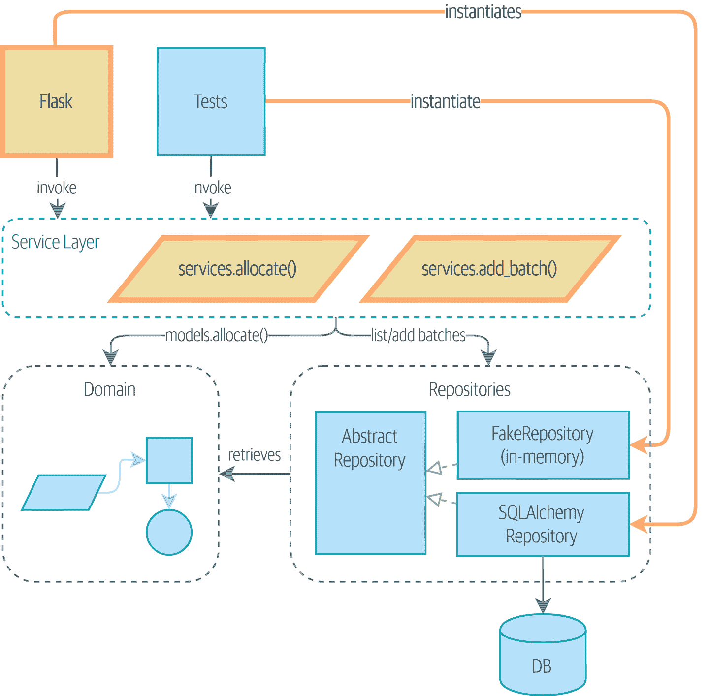

# 第四章：我们的第一个用例：Flask API 和服务层

> 原文：[4: Our First Use Case: Flask API and Service Layer](https://www.cosmicpython.com/book/chapter_04_service_layer.html)
> 
> 译者：[飞龙](https://github.com/wizardforcel)
> 
> 协议：[CC BY-NC-SA 4.0](https://creativecommons.org/licenses/by-nc-sa/4.0/)

回到我们的分配项目！图 4-1 显示了我们在第二章结束时达到的点，该章节涵盖了存储库模式。


###### 图 4-1：之前：我们通过与存储库和领域模型交谈来驱动我们的应用程序

在本章中，我们将讨论编排逻辑、业务逻辑和接口代码之间的区别，并介绍*服务层*模式来处理编排我们的工作流程并定义我们系统的用例。

我们还将讨论测试：通过将服务层与我们对数据库的存储库抽象结合起来，我们能够编写快速测试，不仅测试我们的领域模型，还测试整个用例的工作流程。

图 4-2 显示我们的目标：我们将添加一个 Flask API，它将与服务层交互，服务层将作为我们领域模型的入口。因为我们的服务层依赖于`AbstractRepository`，我们可以使用`FakeRepository`对其进行单元测试，但在生产代码中使用`SqlAlchemyRepository`。



###### 图 4-2：服务层将成为我们应用程序的主要入口

在我们的图表中，我们使用的约定是用粗体文本/线条（如果您正在阅读数字版本，则为黄色/橙色）突出显示新组件。

###### 提示

本章的代码位于 GitHub 上的 chapter_04_service_layer 分支中（https://oreil.ly/TBRuy）：

```py
git clone https://github.com/cosmicpython/code.git
cd code
git checkout chapter_04_service_layer
# or to code along, checkout Chapter 2:
git checkout chapter_02_repository
```

# 将我们的应用程序连接到现实世界

像任何一个优秀的敏捷团队一样，我们正在努力尝试推出一个 MVP 并让用户开始收集反馈意见。我们已经拥有了我们的领域模型的核心和我们需要分配订单的领域服务，以及永久存储的存储库接口。

让我们尽快将所有的部分组合在一起，然后重构以实现更清晰的架构。这是我们的计划：

1.  使用 Flask 在我们的`allocate`领域服务前面放置一个 API 端点。连接数据库会话和我们的存储库。使用端到端测试和一些快速而肮脏的 SQL 来准备测试数据进行测试。

1.  重构出一个可以作为抽象来捕捉用例的服务层，并将其放置在 Flask 和我们的领域模型之间。构建一些服务层测试，并展示它们如何使用`FakeRepository`。

1.  尝试使用不同类型的参数来调用我们的服务层函数；显示使用原始数据类型允许服务层的客户端（我们的测试和我们的 Flask API）与模型层解耦。

# 第一个端到端测试

没有人对什么算作端到端（E2E）测试与功能测试、验收测试、集成测试、单元测试之间的术语辩论感兴趣。不同的项目需要不同的测试组合，我们已经看到完全成功的项目将事情分成“快速测试”和“慢速测试”。

目前，我们希望编写一个或两个测试，这些测试将运行一个“真实”的 API 端点（使用 HTTP）并与真实数据库交互。让我们称它们为*端到端测试*，因为这是最直观的名称之一。

以下是第一次尝试：

*第一个 API 测试（`test_api.py`）*

```py
@pytest.mark.usefixtures("restart_api")
def test_api_returns_allocation(add_stock):
    sku, othersku = random_sku(), random_sku("other")  #(1)
    earlybatch = random_batchref(1)
    laterbatch = random_batchref(2)
    otherbatch = random_batchref(3)
    add_stock(  #(2)
        [
            (laterbatch, sku, 100, "2011-01-02"),
            (earlybatch, sku, 100, "2011-01-01"),
            (otherbatch, othersku, 100, None),
        ]
    )
    data = {"orderid": random_orderid(), "sku": sku, "qty": 3}
    url = config.get_api_url()  #(3)

    r = requests.post(f"{url}/allocate", json=data)

    assert r.status_code == 201
    assert r.json()["batchref"] == earlybatch
```

①

`random_sku()`、`random_batchref()`等都是使用`uuid`模块生成随机字符的小助手函数。因为我们现在正在运行实际的数据库，这是防止各种测试和运行相互干扰的一种方法。

②

`add_stock`是一个辅助装置，只是隐藏了使用 SQL 手动插入行的细节。我们将在本章后面展示更好的方法。

③

*config.py*是一个模块，我们在其中保存配置信息。

每个人以不同的方式解决这些问题，但您需要一种方法来启动 Flask，可能是在容器中，并与 Postgres 数据库进行通信。如果您想了解我们是如何做到的，请查看附录 B。

# 直接实现

以最明显的方式实现，您可能会得到这样的东西：

*Flask 应用程序的第一次尝试（`flask_app.py`）*

```py
from flask import Flask, jsonify, request
from sqlalchemy import create_engine
from sqlalchemy.orm import sessionmaker

import config
import model
import orm
import repository

orm.start_mappers()
get_session = sessionmaker(bind=create_engine(config.get_postgres_uri()))
app = Flask(__name__)

@app.route("/allocate", methods=['POST'])
def allocate_endpoint():
    session = get_session()
    batches = repository.SqlAlchemyRepository(session).list()
    line = model.OrderLine(
        request.json['orderid'],
        request.json['sku'],
        request.json['qty'],
    )

    batchref = model.allocate(line, batches)

    return jsonify({'batchref': batchref}), 201
```

到目前为止，一切都很好。你可能会认为，“不需要太多你们的‘架构宇航员’废话，鲍勃和哈里。”

但等一下——没有提交。我们实际上没有将我们的分配保存到数据库中。现在我们需要第二个测试，要么检查数据库状态之后（不太黑盒），要么检查我们是否无法分配第二行，如果第一行应该已经耗尽了批次：

*测试分配被持久化（`test_api.py`）*

```py
@pytest.mark.usefixtures('restart_api')
def test_allocations_are_persisted(add_stock):
    sku = random_sku()
    batch1, batch2 = random_batchref(1), random_batchref(2)
    order1, order2 = random_orderid(1), random_orderid(2)
    add_stock([
        (batch1, sku, 10, '2011-01-01'),
        (batch2, sku, 10, '2011-01-02'),
    ])
    line1 = {'orderid': order1, 'sku': sku, 'qty': 10}
    line2 = {'orderid': order2, 'sku': sku, 'qty': 10}
    url = config.get_api_url()

    # first order uses up all stock in batch 1
    r = requests.post(f'{url}/allocate', json=line1)
    assert r.status_code == 201
    assert r.json()['batchref'] == batch1

    # second order should go to batch 2
    r = requests.post(f'{url}/allocate', json=line2)
    assert r.status_code == 201
    assert r.json()['batchref'] == batch2
```

不是那么可爱，但这将迫使我们添加提交。

# 需要数据库检查的错误条件

不过，如果我们继续这样做，事情会变得越来越丑陋。

假设我们想要添加一些错误处理。如果领域引发了一个错误，对于一个缺货的 SKU 呢？或者甚至不存在的 SKU 呢？这不是领域甚至知道的事情，也不应该是。这更像是我们应该在调用领域服务之前在数据库层实现的一个理智检查。

现在我们正在看另外两个端到端测试：

*在 E2E 层进行更多的测试（`test_api.py`）*

```py
@pytest.mark.usefixtures("restart_api")
def test_400_message_for_out_of_stock(add_stock):  #(1)
    sku, small_batch, large_order = random_sku(), random_batchref(), random_orderid()
    add_stock(
        [(small_batch, sku, 10, "2011-01-01"),]
    )
    data = {"orderid": large_order, "sku": sku, "qty": 20}
    url = config.get_api_url()
    r = requests.post(f"{url}/allocate", json=data)
    assert r.status_code == 400
    assert r.json()["message"] == f"Out of stock for sku {sku}"


@pytest.mark.usefixtures("restart_api")
def test_400_message_for_invalid_sku():  #(2)
    unknown_sku, orderid = random_sku(), random_orderid()
    data = {"orderid": orderid, "sku": unknown_sku, "qty": 20}
    url = config.get_api_url()
    r = requests.post(f"{url}/allocate", json=data)
    assert r.status_code == 400
    assert r.json()["message"] == f"Invalid sku {unknown_sku}"
```

①

在第一个测试中，我们试图分配比我们库存中有的单位更多。

②

在第二个测试中，SKU 不存在（因为我们从未调用`add_stock`），因此在我们的应用程序看来是无效的。

当然，我们也可以在 Flask 应用程序中实现它：

*Flask 应用程序开始变得混乱（`flask_app.py`）*

```py
def is_valid_sku(sku, batches):
    return sku in {b.sku for b in batches}

@app.route("/allocate", methods=['POST'])
def allocate_endpoint():
    session = get_session()
    batches = repository.SqlAlchemyRepository(session).list()
    line = model.OrderLine(
        request.json['orderid'],
        request.json['sku'],
        request.json['qty'],
    )

    if not is_valid_sku(line.sku, batches):
        return jsonify({'message': f'Invalid sku {line.sku}'}), 400

    try:
        batchref = model.allocate(line, batches)
    except model.OutOfStock as e:
        return jsonify({'message': str(e)}), 400

    session.commit()
    return jsonify({'batchref': batchref}), 201
```

但是我们的 Flask 应用程序开始变得有些笨重。我们的 E2E 测试数量开始失控，很快我们将以倒置的测试金字塔（或者鲍勃喜欢称之为“冰淇淋锥模型”）结束。

# 引入服务层，并使用 FakeRepository 进行单元测试

如果我们看看我们的 Flask 应用程序在做什么，我们会发现有很多我们可能称之为*编排*的东西——从我们的存储库中获取东西，根据数据库状态验证我们的输入，处理错误，并在正常情况下进行提交。这些大部分事情与拥有 Web API 端点无关（例如，如果您正在构建 CLI，您会需要它们；请参阅附录 C），它们不是真正需要通过端到端测试来测试的东西。

有时将服务层拆分出来是有意义的，有时被称为*编排层*或*用例层*。

您还记得我们在第三章中准备的`FakeRepository`吗？

*我们的假存储库，一个内存中的批次集合（`test_services.py`）*

```py
class FakeRepository(repository.AbstractRepository):

    def __init__(self, batches):
        self._batches = set(batches)

    def add(self, batch):
        self._batches.add(batch)

    def get(self, reference):
        return next(b for b in self._batches if b.reference == reference)

    def list(self):
        return list(self._batches)
```

这就是它将会派上用场的地方；它让我们可以使用快速的单元测试来测试我们的服务层：

*在服务层使用伪造进行单元测试（`test_services.py`）*

```py
def test_returns_allocation():
    line = model.OrderLine("o1", "COMPLICATED-LAMP", 10)
    batch = model.Batch("b1", "COMPLICATED-LAMP", 100, eta=None)
    repo = FakeRepository([batch])  #(1)

    result = services.allocate(line, repo, FakeSession())  #(2) (3)
    assert result == "b1"


def test_error_for_invalid_sku():
    line = model.OrderLine("o1", "NONEXISTENTSKU", 10)
    batch = model.Batch("b1", "AREALSKU", 100, eta=None)
    repo = FakeRepository([batch])  #(1)

    with pytest.raises(services.InvalidSku, match="Invalid sku NONEXISTENTSKU"):
        services.allocate(line, repo, FakeSession())  #(2) (3)
```

①

`FakeRepository`保存了我们测试中将使用的`Batch`对象。

②

我们的服务模块（*services.py*）将定义一个`allocate()`服务层函数。它将位于 API 层中的`allocate_endpoint()`函数和领域模型中的`allocate()`领域服务函数之间。¹

③

我们还需要一个`FakeSession`来伪造数据库会话，如下面的代码片段所示。

*一个假的数据库会话（`test_services.py`）*

```py
class FakeSession():
    committed = False

    def commit(self):
        self.committed = True
```

这个假的会话只是一个临时解决方案。我们将摆脱它，并很快让事情变得更好，在第六章。但与此同时，假的`.commit()`让我们从 E2E 层迁移了第三个测试：

*服务层的第二个测试（`test_services.py`）*

```py
def test_commits():
    line = model.OrderLine('o1', 'OMINOUS-MIRROR', 10)
    batch = model.Batch('b1', 'OMINOUS-MIRROR', 100, eta=None)
    repo = FakeRepository([batch])
    session = FakeSession()

    services.allocate(line, repo, session)
    assert session.committed is True
```

## 典型的服务函数

我们将编写一个类似于以下内容的服务函数：

*基本分配服务（`services.py`）*

```py
class InvalidSku(Exception):
    pass


def is_valid_sku(sku, batches):
    return sku in {b.sku for b in batches}


def allocate(line: OrderLine, repo: AbstractRepository, session) -> str:
    batches = repo.list()  #(1)
    if not is_valid_sku(line.sku, batches):  #(2)
        raise InvalidSku(f"Invalid sku {line.sku}")
    batchref = model.allocate(line, batches)  #(3)
    session.commit()  #(4)
    return batchref
```

典型的服务层函数有类似的步骤：

①

我们从存储库中提取一些对象。

②

我们对请求针对当前世界的状态进行一些检查或断言。

③

我们调用一个领域服务。

④

如果一切顺利，我们保存/更新我们已经改变的状态。

目前，最后一步有点不尽如人意，因为我们的服务层与数据库层紧密耦合。我们将在第六章中通过工作单元模式改进这一点。

但服务层的基本内容都在那里，我们的 Flask 应用现在看起来更加清晰：

*Flask 应用委托给服务层（`flask_app.py`）*

```py
@app.route("/allocate", methods=["POST"])
def allocate_endpoint():
    session = get_session()  #(1)
    repo = repository.SqlAlchemyRepository(session)  #(1)
    line = model.OrderLine(
        request.json["orderid"], request.json["sku"], request.json["qty"],  #(2)
    )

    try:
        batchref = services.allocate(line, repo, session)  #(2)
    except (model.OutOfStock, services.InvalidSku) as e:
        return {"message": str(e)}, 400  #(3)

    return {"batchref": batchref}, 201  #(3)
```

①

我们实例化一个数据库会话和一些存储库对象。

②

我们从 Web 请求中提取用户的命令，并将其传递给领域服务。

③

我们返回一些带有适当状态代码的 JSON 响应。

Flask 应用的职责只是标准的网络内容：每个请求的会话管理，解析 POST 参数中的信息，响应状态码和 JSON。所有的编排逻辑都在用例/服务层中，领域逻辑保留在领域中。

最后，我们可以自信地将我们的 E2E 测试简化为只有两个，一个是快乐路径，一个是不快乐路径：

*只有快乐和不快乐路径的 E2E 测试（`test_api.py`）*

```py
@pytest.mark.usefixtures('restart_api')
def test_happy_path_returns_201_and_allocated_batch(add_stock):
    sku, othersku = random_sku(), random_sku('other')
    earlybatch = random_batchref(1)
    laterbatch = random_batchref(2)
    otherbatch = random_batchref(3)
    add_stock([
        (laterbatch, sku, 100, '2011-01-02'),
        (earlybatch, sku, 100, '2011-01-01'),
        (otherbatch, othersku, 100, None),
    ])
    data = {'orderid': random_orderid(), 'sku': sku, 'qty': 3}
    url = config.get_api_url()
    r = requests.post(f'{url}/allocate', json=data)
    assert r.status_code == 201
    assert r.json()['batchref'] == earlybatch

@pytest.mark.usefixtures('restart_api')
def test_unhappy_path_returns_400_and_error_message():
    unknown_sku, orderid = random_sku(), random_orderid()
    data = {'orderid': orderid, 'sku': unknown_sku, 'qty': 20}
    url = config.get_api_url()
    r = requests.post(f'{url}/allocate', json=data)
    assert r.status_code == 400
    assert r.json()['message'] == f'Invalid sku {unknown_sku}'
```

我们成功地将我们的测试分成了两个广泛的类别：关于网络内容的测试，我们实现端到端；关于编排内容的测试，我们可以针对内存中的服务层进行测试。

# 为什么一切都叫服务？

此时，你们中的一些人可能正在思考领域服务和服务层之间的确切区别是什么。

很抱歉——我们没有选择这些名称，否则我们会有更酷更友好的方式来谈论这些事情。

在本章中，我们使用了两个称为*service*的东西。第一个是*应用服务*（我们的服务层）。它的工作是处理来自外部世界的请求，并*编排*一个操作。我们的意思是服务层通过遵循一系列简单的步骤*驱动*应用程序：

+   从数据库获取一些数据

+   更新领域模型

+   持久化任何更改

这是系统中每个操作都必须进行的无聊工作，将其与业务逻辑分开有助于保持事物的整洁。

第二种类型的服务是*领域服务*。这是指属于领域模型但不自然地位于有状态实体或值对象内部的逻辑部分的名称。例如，如果您正在构建一个购物车应用程序，您可能会选择将税收规则构建为领域服务。计算税收是与更新购物车分开的工作，它是模型的重要部分，但似乎不应该为该工作创建一个持久化实体。而是一个无状态的 TaxCalculator 类或`calculate_tax`函数可以完成这项工作。

# 将事物放入文件夹中以查看它们的归属

随着我们的应用程序变得更大，我们需要不断整理我们的目录结构。我们项目的布局为我们提供了关于每个文件中可能包含的对象类型的有用提示。

这是我们可以组织事物的一种方式：

*一些子文件夹*

```py
.
├── config.py
├── domain ① 
│   ├── __init__.py
│   └── model.py
├── service_layer ② 
│   ├── __init__.py
│   └── services.py
├── adapters ③ 
│   ├── __init__.py
│   ├── orm.py
│   └── repository.py
├── entrypoints ④ 
│   ├── __init__.py
│   └── flask_app.py
└── tests
    ├── __init__.py
    ├── conftest.py
    ├── unit
    │   ├── test_allocate.py
    │   ├── test_batches.py
    │   └── test_services.py
    ├── integration
    │   ├── test_orm.py
    │   └── test_repository.py
    └── e2e
        └── test_api.py
```

①

让我们为我们的领域模型创建一个文件夹。目前只有一个文件，但对于更复杂的应用程序，您可能会为每个类创建一个文件；您可能会为`Entity`、`ValueObject`和`Aggregate`创建帮助父类，并且您可能会添加一个*exceptions.py*用于领域层异常，以及如您将在[第二部分](part02.xhtml#part2)中看到的*commands.py*和*events.py*。

②

我们将区分服务层。目前只有一个名为*services.py*的文件用于我们的服务层函数。您可以在这里添加服务层异常，并且正如您将在第五章中看到的那样，我们将添加*unit_of_work.py*。

③

*适配器*是对端口和适配器术语的一种称呼。这将填充任何其他关于外部 I/O 的抽象（例如*redis_client.py*）。严格来说，您可以将这些称为*secondary*适配器或*driven*适配器，有时也称为*inward-facing*适配器。

④

入口点是我们驱动应用程序的地方。在官方端口和适配器术语中，这些也是适配器，并被称为*primary*、*driving*或*outward-facing*适配器。

端口呢？您可能还记得，它们是适配器实现的抽象接口。我们倾向于将它们与实现它们的适配器放在同一个文件中。

# 总结

添加服务层确实为我们带来了很多好处：

+   我们的 Flask API 端点变得非常轻量且易于编写：它们唯一的责任就是做“网络事务”，比如解析 JSON 并为 happy 或 unhappy 情况生成正确的 HTTP 代码。

+   我们为我们的领域定义了一个清晰的 API，一组用例或入口点，可以被任何适配器使用，而无需了解我们的领域模型类的任何信息 - 无论是 API、CLI（参见附录 C），还是测试！它们也是我们领域的适配器。

+   通过使用服务层，我们可以以“高速”编写测试，从而使我们可以自由地以任何我们认为合适的方式重构领域模型。只要我们仍然可以提供相同的用例，我们就可以尝试新的设计，而无需重写大量的测试。

+   我们的测试金字塔看起来不错 - 我们大部分的测试都是快速的单元测试，只有最少量的 E2E 和集成测试。

## DIP 的实际应用

图 4-3 显示了我们服务层的依赖关系：领域模型和`AbstractRepository`（在端口和适配器术语中称为端口）。

当我们运行测试时，图 4-4 显示了我们如何使用`FakeRepository`（适配器）来实现抽象依赖。

当我们实际运行我们的应用程序时，我们会在图 4-5 中显示的“真实”依赖项中进行交换。


###### 图 4-3\. 服务层的抽象依赖

```py
[ditaa, apwp_0403]
        +-----------------------------+
        |         Service Layer       |
        +-----------------------------+
           |                   |
           |                   | depends on abstraction
           V                   V
+------------------+     +--------------------+
|   Domain Model   |     | AbstractRepository |
|                  |     |       (Port)       |
+------------------+     +--------------------+
```


###### 图 4-4\. 测试提供了抽象依赖的实现

```py
[ditaa, apwp_0404]
        +-----------------------------+
        |           Tests             |-------------\
        +-----------------------------+             |
                       |                            |
                       V                            |
        +-----------------------------+             |
        |         Service Layer       |    provides |
        +-----------------------------+             |
           |                     |                  |
           V                     V                  |
+------------------+     +--------------------+     |
|   Domain Model   |     | AbstractRepository |     |
+------------------+     +--------------------+     |
                                    ^               |
                         implements |               |
                                    |               |
                         +----------------------+   |
                         |    FakeRepository    |<--/
                         |      (in-memory)     |
                         +----------------------+
```


###### 图 4-5\. 运行时的依赖关系

```py
[ditaa, apwp_0405]
       +--------------------------------+
       | Flask API (Presentation Layer) |-----------\
       +--------------------------------+           |
                       |                            |
                       V                            |
        +-----------------------------+             |
        |         Service Layer       |             |
        +-----------------------------+             |
           |                     |                  |
           V                     V                  |
+------------------+     +--------------------+     |
|   Domain Model   |     | AbstractRepository |     |
+------------------+     +--------------------+     |
              ^                     ^               |
              |                     |               |
       gets   |          +----------------------+   |
       model  |          | SqlAlchemyRepository |<--/
   definitions|          +----------------------+
       from   |                | uses
              |                V
           +-----------------------+
           |          ORM          |
           | (another abstraction) |
           +-----------------------+
                       |
                       | talks to
                       V
           +------------------------+
           |       Database         |
           +------------------------+
```

太棒了。

让我们暂停一下，看看表 4-1，在其中我们考虑是否要有一个服务层的利弊。

表 4-1\. 服务层：权衡

| 优点 | 缺点 |
| --- | --- |
| 我们有一个捕获应用程序所有用例的单一位置。 | 如果你的应用程序*纯粹*是一个 Web 应用程序，你的控制器/视图函数可以是捕获所有用例的唯一位置。 |
| 我们将聪明的领域逻辑放在了一个 API 后面，这使我们可以自由地进行重构。 | 这是另一种抽象层。 |
| 我们已经清晰地将“与 HTTP 通信的东西”与“与分配通信的东西”分开。 | 将太多的逻辑放入服务层可能会导致*贫血领域*反模式。最好在发现编排逻辑渗入控制器后引入这一层。 |
| 与存储库模式和`FakeRepository`结合使用时，我们有了一种很好的方法来以比领域层更高的级别编写测试；我们可以在不需要使用集成测试的情况下测试我们的工作流程（详见第五章以获取更多关于此的阐述）。 | 通过简单地将逻辑从控制器推到模型层，你可以获得丰富领域模型带来的许多好处，而无需在中间添加额外的层（即“胖模型，瘦控制器”）。 |

但仍然有一些需要整理的不便之处：

+   服务层仍然与领域紧密耦合，因为其 API 是以`OrderLine`对象表示的。在第五章中，我们将解决这个问题，并讨论服务层如何实现更高效的 TDD。

+   服务层与`session`对象紧密耦合。在第六章中，我们将介绍另一种与存储库和服务层模式紧密配合的模式，即工作单元模式，一切都会非常美好。你会看到的！

¹ 服务层服务和领域服务的名称确实非常相似。我们稍后会解决这个问题，详见“为什么一切都被称为服务？”。
