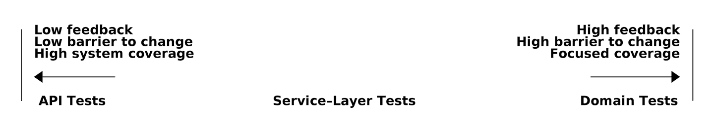

# 第五章：高档和低档的 TDD

> 原文：[5: TDD in High Gear and Low Gear](https://www.cosmicpython.com/book/chapter_05_high_gear_low_gear.html)
> 
> 译者：[飞龙](https://github.com/wizardforcel)
> 
> 协议：[CC BY-NC-SA 4.0](https://creativecommons.org/licenses/by-nc-sa/4.0/)

我们引入了服务层来捕获我们从工作应用程序中需要的一些额外的编排责任。服务层帮助我们清晰地定义我们的用例以及每个用例的工作流程：我们需要从我们的存储库中获取什么，我们应该进行什么预检和当前状态验证，以及我们最终保存了什么。

但目前，我们的许多单元测试是在更低的级别上操作，直接作用于模型。在本章中，我们将讨论将这些测试提升到服务层级别涉及的权衡以及一些更一般的测试准则。

# 我们的测试金字塔看起来怎么样？

让我们看看将这一举措转向使用服务层及其自己的服务层测试对我们的测试金字塔有何影响：

*测试类型计数*

```py
$ grep -c test_ test_*.py
tests/unit/test_allocate.py:4
tests/unit/test_batches.py:8
tests/unit/test_services.py:3

tests/integration/test_orm.py:6
tests/integration/test_repository.py:2

tests/e2e/test_api.py:2
```

不错！我们有 15 个单元测试，8 个集成测试，只有 2 个端到端测试。这已经是一个看起来很健康的测试金字塔了。

# 领域层测试应该移动到服务层吗？

让我们看看如果我们再进一步会发生什么。由于我们可以针对服务层测试我们的软件，我们实际上不再需要对领域模型进行测试。相反，我们可以将第一章中的所有领域级测试重写为服务层的术语：

*在服务层重写领域测试（`tests/unit/test_services.py`）*

```py
# domain-layer test:
def test_prefers_current_stock_batches_to_shipments():
    in_stock_batch = Batch("in-stock-batch", "RETRO-CLOCK", 100, eta=None)
    shipment_batch = Batch("shipment-batch", "RETRO-CLOCK", 100, eta=tomorrow)
    line = OrderLine("oref", "RETRO-CLOCK", 10)

    allocate(line, [in_stock_batch, shipment_batch])

    assert in_stock_batch.available_quantity == 90
    assert shipment_batch.available_quantity == 100

# service-layer test:
def test_prefers_warehouse_batches_to_shipments():
    in_stock_batch = Batch("in-stock-batch", "RETRO-CLOCK", 100, eta=None)
    shipment_batch = Batch("shipment-batch", "RETRO-CLOCK", 100, eta=tomorrow)
    repo = FakeRepository([in_stock_batch, shipment_batch])
    session = FakeSession()

    line = OrderLine('oref', "RETRO-CLOCK", 10)

    services.allocate(line, repo, session)

    assert in_stock_batch.available_quantity == 90
    assert shipment_batch.available_quantity == 100
```

为什么我们要这样做呢？

测试应该帮助我们无畏地改变我们的系统，但通常我们看到团队对其领域模型编写了太多测试。当他们来改变他们的代码库时，这会导致问题，并发现他们需要更新数十甚至数百个单元测试。

如果停下来思考自动化测试的目的，这是有道理的。我们使用测试来强制系统的某个属性在我们工作时不会改变。我们使用测试来检查 API 是否继续返回 200，数据库会话是否继续提交，以及订单是否仍在分配。

如果我们意外更改了其中一个行为，我们的测试将会失败。另一方面，如果我们想要更改代码的设计，任何直接依赖于该代码的测试也将失败。

随着我们深入了解本书，您将看到服务层如何形成我们系统的 API，我们可以以多种方式驱动它。针对此 API 进行测试可以减少我们在重构领域模型时需要更改的代码量。如果我们限制自己只针对服务层进行测试，我们将没有任何直接与模型对象上的“私有”方法或属性交互的测试，这使我们更自由地对其进行重构。

###### 提示

我们在测试中放入的每一行代码都像是一团胶水，将系统保持在特定的形状中。我们拥有的低级别测试越多，改变事物就会越困难。

# 关于决定编写何种测试

您可能会问自己，“那我应该重写所有的单元测试吗？针对领域模型编写测试是错误的吗？” 要回答这些问题，重要的是要理解耦合和设计反馈之间的权衡（见图 5-1）。



###### 图 5-1：测试谱

```py
[ditaa, apwp_0501]
| Low feedback                                                   High feedback |
| Low barrier to change                                 High barrier to change |
| High system coverage                                        Focused coverage |
|                                                                              |
| <---------                                                       ----------> |
|                                                                              |
| API Tests                  Service-Layer Tests                  Domain Tests |
```

极限编程（XP）敦促我们“倾听代码”。当我们编写测试时，我们可能会发现代码很难使用或注意到代码味道。这是我们进行重构并重新考虑设计的触发器。

然而，只有当我们与目标代码密切合作时才能获得这种反馈。针对 HTTP API 的测试对我们的对象的细粒度设计毫无帮助，因为它处于更高的抽象级别。

另一方面，我们可以重写整个应用程序，只要我们不更改 URL 或请求格式，我们的 HTTP 测试就会继续通过。这使我们有信心进行大规模的更改，比如更改数据库架构，不会破坏我们的代码。

在另一端，我们在第一章中编写的测试帮助我们充分了解我们需要的对象。测试引导我们设计出一个合理的、符合领域语言的设计。当我们的测试以领域语言阅读时，我们感到我们的代码与我们对问题解决的直觉相匹配。

因为测试是用领域语言编写的，它们充当我们模型的活文档。新团队成员可以阅读这些测试，快速了解系统的工作原理以及核心概念的相互关系。

我们经常通过在这个级别编写测试来“勾勒”新的行为，以查看代码可能的外观。然而，当我们想要改进代码的设计时，我们将需要替换或删除这些测试，因为它们与特定实现紧密耦合。

# 高档和低档

大多数情况下，当我们添加新功能或修复错误时，我们不需要对领域模型进行广泛的更改。在这些情况下，我们更喜欢针对服务编写测试，因为耦合度较低，覆盖范围较高。

例如，当编写`add_stock`函数或`cancel_order`功能时，我们可以通过针对服务层编写测试来更快地进行工作，并减少耦合。

当开始一个新项目或遇到一个特别棘手的问题时，我们会回到对领域模型编写测试，这样我们就能更好地得到反馈和我们意图的可执行文档。

我们使用的比喻是换挡。在开始旅程时，自行车需要处于低档位，以克服惯性。一旦我们开始跑，我们可以通过换到高档位来更快、更有效地行驶；但如果我们突然遇到陡峭的山坡或被危险迫使减速，我们再次降到低档位，直到我们可以再次加速。

# 将服务层测试与领域完全解耦

我们在服务层测试中仍然直接依赖于领域，因为我们使用领域对象来设置我们的测试数据并调用我们的服务层函数。

为了使服务层与领域完全解耦，我们需要重写其 API，以基本类型的形式工作。

我们的服务层目前接受一个`OrderLine`领域对象：

*之前：allocate 接受一个领域对象（`service_layer/services.py`）*

```py
def allocate(line: OrderLine, repo: AbstractRepository, session) -> str:
```

如果它的参数都是基本类型，它会是什么样子？

*之后：allocate 接受字符串和整数（`service_layer/services.py`）*

```py
def allocate(
        orderid: str, sku: str, qty: int, repo: AbstractRepository, session
) -> str:
```

我们也用这些术语重写了测试：

*测试现在在函数调用中使用基本类型（`tests/unit/test_services.py`）*

```py
def test_returns_allocation():
    batch = model.Batch("batch1", "COMPLICATED-LAMP", 100, eta=None)
    repo = FakeRepository([batch])

    result = services.allocate("o1", "COMPLICATED-LAMP", 10, repo, FakeSession())
    assert result == "batch1"
```

但是我们的测试仍然依赖于领域，因为我们仍然手动实例化`Batch`对象。因此，如果有一天我们决定大规模重构我们的`Batch`模型的工作方式，我们将不得不更改一堆测试。

## 缓解：将所有领域依赖项保留在固定装置函数中

我们至少可以将其抽象为测试中的一个辅助函数或固定装置。以下是一种你可以做到这一点的方式，即在`FakeRepository`上添加一个工厂函数：

固定装置的工厂函数是一种可能性（`tests/unit/test_services.py`）

```py
class FakeRepository(set):

    @staticmethod
    def for_batch(ref, sku, qty, eta=None):
        return FakeRepository([
            model.Batch(ref, sku, qty, eta),
        ])

    ...

def test_returns_allocation():
    repo = FakeRepository.for_batch("batch1", "COMPLICATED-LAMP", 100, eta=None)
    result = services.allocate("o1", "COMPLICATED-LAMP", 10, repo, FakeSession())
    assert result == "batch1"
```

至少这将把我们所有测试对领域的依赖放在一个地方。

## 添加一个缺失的服务

不过，我们可以再进一步。如果我们有一个添加库存的服务，我们可以使用它，并使我们的服务层测试完全按照服务层的官方用例来表达，消除对领域的所有依赖：

测试新的 add_batch 服务（`tests/unit/test_services.py`）

```py
def test_add_batch():
    repo, session = FakeRepository([]), FakeSession()
    services.add_batch("b1", "CRUNCHY-ARMCHAIR", 100, None, repo, session)
    assert repo.get("b1") is not None
    assert session.committed
```

###### 提示

一般来说，如果你发现自己需要在服务层测试中直接进行领域层操作，这可能表明你的服务层是不完整的。

而实现只是两行代码：

*为 add_batch 添加一个新服务（`service_layer/services.py`）*

```py
def add_batch(
        ref: str, sku: str, qty: int, eta: Optional[date],
        repo: AbstractRepository, session,
):
    repo.add(model.Batch(ref, sku, qty, eta))
    session.commit()

def allocate(
        orderid: str, sku: str, qty: int, repo: AbstractRepository, session
) -> str:
    ...
```

###### 注意

你应该仅仅因为它有助于从你的测试中移除依赖而写一个新的服务吗？可能不。但在这种情况下，我们几乎肯定会在某一天需要一个`add_batch`服务。

现在我们可以纯粹地用服务本身来重写*所有*我们的服务层测试，只使用原语，而不依赖于模型：

*服务测试现在只使用服务（`tests/unit/test_services.py`）*

```py
def test_allocate_returns_allocation():
    repo, session = FakeRepository([]), FakeSession()
    services.add_batch("batch1", "COMPLICATED-LAMP", 100, None, repo, session)
    result = services.allocate("o1", "COMPLICATED-LAMP", 10, repo, session)
    assert result == "batch1"

def test_allocate_errors_for_invalid_sku():
    repo, session = FakeRepository([]), FakeSession()
    services.add_batch("b1", "AREALSKU", 100, None, repo, session)

    with pytest.raises(services.InvalidSku, match="Invalid sku NONEXISTENTSKU"):
        services.allocate("o1", "NONEXISTENTSKU", 10, repo, FakeSession())
```

这真是一个很好的地方。我们的服务层测试只依赖于服务层本身，让我们完全自由地根据需要重构模型。

# 将改进带入端到端测试

就像添加`add_batch`帮助我们将服务层测试与模型解耦一样，添加一个 API 端点来添加批次将消除对丑陋的`add_stock`装置的需求，我们的端到端测试可以摆脱那些硬编码的 SQL 查询和对数据库的直接依赖。

由于我们的服务函数，添加端点很容易，只需要一点 JSON 处理和一个函数调用：

*用于添加批次的 API（`entrypoints/flask_app.py`）*

```py
@app.route("/add_batch", methods=['POST'])
def add_batch():
    session = get_session()
    repo = repository.SqlAlchemyRepository(session)
    eta = request.json['eta']
    if eta is not None:
        eta = datetime.fromisoformat(eta).date()
    services.add_batch(
        request.json['ref'], request.json['sku'], request.json['qty'], eta,
        repo, session
    )
    return 'OK', 201
```

###### 注意

你是否在想，向*/add_batch*发 POST 请求？这不太符合 RESTful！你是对的。我们很随意，但如果你想让它更符合 RESTful，也许是向*/batches*发 POST 请求，那就尽管去做吧！因为 Flask 是一个薄适配器，所以很容易。参见下一个侧边栏。

而且我们在 conftest.py 中的硬编码 SQL 查询被一些 API 调用所取代，这意味着 API 测试除了 API 之外没有任何依赖，这也很好：

API 测试现在可以添加自己的批次（`tests/e2e/test_api.py`）

```py
def post_to_add_batch(ref, sku, qty, eta):
    url = config.get_api_url()
    r = requests.post(
        f'{url}/add_batch',
        json={'ref': ref, 'sku': sku, 'qty': qty, 'eta': eta}
    )
    assert r.status_code == 201

@pytest.mark.usefixtures('postgres_db')
@pytest.mark.usefixtures('restart_api')
def test_happy_path_returns_201_and_allocated_batch():
    sku, othersku = random_sku(), random_sku('other')
    earlybatch = random_batchref(1)
    laterbatch = random_batchref(2)
    otherbatch = random_batchref(3)
    post_to_add_batch(laterbatch, sku, 100, '2011-01-02')
    post_to_add_batch(earlybatch, sku, 100, '2011-01-01')
    post_to_add_batch(otherbatch, othersku, 100, None)
    data = {'orderid': random_orderid(), 'sku': sku, 'qty': 3}
    url = config.get_api_url()
    r = requests.post(f'{url}/allocate', json=data)
    assert r.status_code == 201
    assert r.json()['batchref'] == earlybatch
```

# 总结

一旦你有了一个服务层，你真的可以将大部分的测试覆盖移到单元测试，并且建立一个健康的测试金字塔。

一些事情将会帮助你：

+   用原语而不是领域对象来表达你的服务层。

+   在理想的世界里，你将拥有所有你需要的服务，能够完全针对服务层进行测试，而不是通过存储库或数据库来修改状态。这在你的端到端测试中也会得到回报。

进入下一章！

¹ 关于在更高层编写测试的一个有效担忧是，对于更复杂的用例，可能会导致组合爆炸。在这些情况下，降级到各种协作领域对象的低级单元测试可能会有用。但也参见第八章和“可选：使用虚假消息总线单独测试事件处理程序”。
