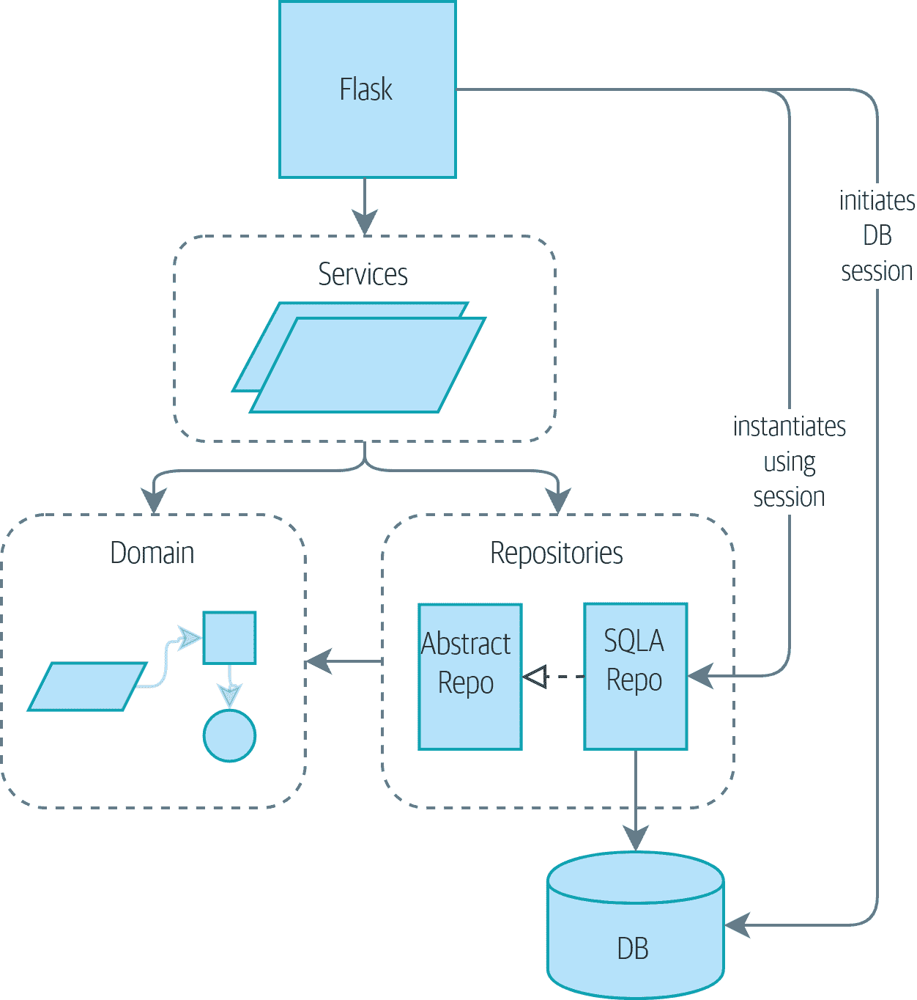
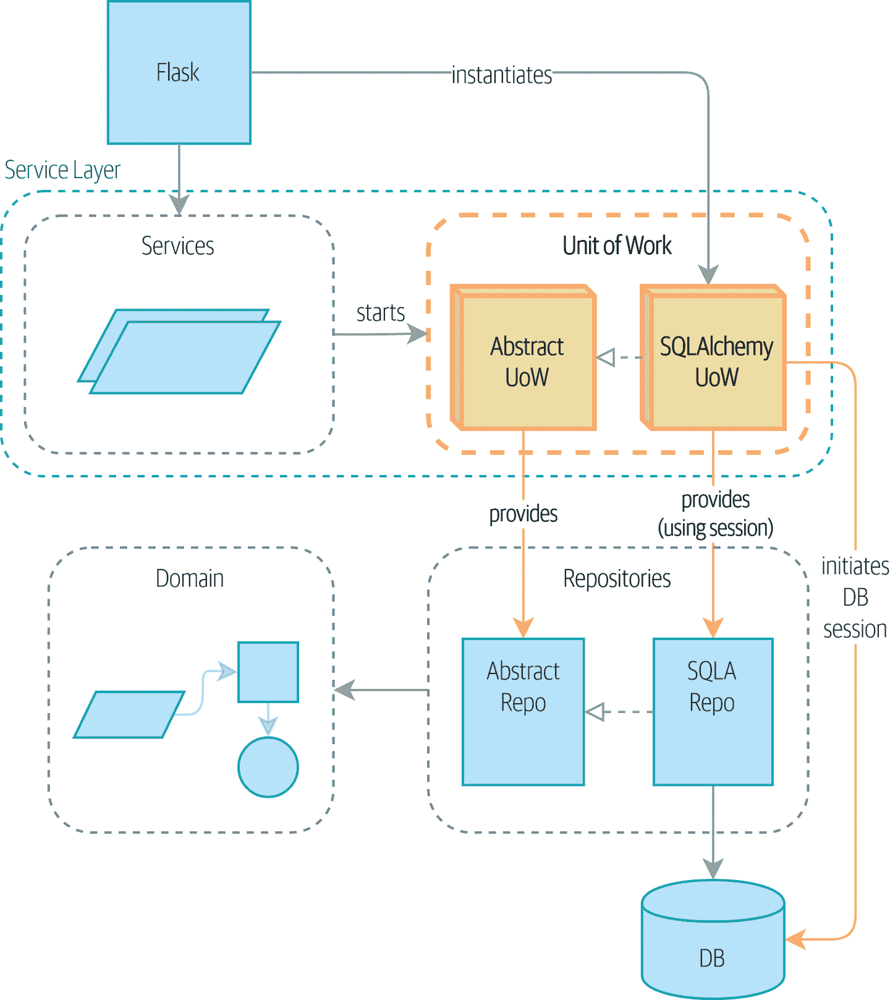

# 第六章：工作单元模式

> 原文：[6: Unit of Work Pattern](https://www.cosmicpython.com/book/chapter_06_uow.html)
> 
> 译者：[飞龙](https://github.com/wizardforcel)
> 
> 协议：[CC BY-NC-SA 4.0](https://creativecommons.org/licenses/by-nc-sa/4.0/)

在本章中，我们将介绍将存储库和服务层模式联系在一起的最后一块拼图：*工作单元*模式。

如果存储库模式是我们对持久存储概念的抽象，那么工作单元（UoW）模式就是我们对*原子操作*概念的抽象。它将允许我们最终完全将服务层与数据层解耦。

图 6-1 显示，目前我们的基础设施层之间存在大量的通信：API 直接与数据库层交互以启动会话，它与存储库层交互以初始化`SQLAlchemyRepository`，并且它与服务层交互以请求分配。

###### 提示

本章的代码位于 GitHub 的 chapter_06_uow 分支中[（https://oreil.ly/MoWdZ）](https://oreil.ly/MoWdZ)：

```py
git clone https://github.com/cosmicpython/code.git
cd code
git checkout chapter_06_uow
# or to code along, checkout Chapter 4:
git checkout chapter_04_service_layer
```



###### 图 6-1：没有 UoW：API 直接与三层交互

图 6-2 显示了我们的目标状态。Flask API 现在只执行两件事：初始化工作单元，并调用服务。服务与 UoW 合作（我们喜欢认为 UoW 是服务层的一部分），但服务函数本身或 Flask 现在都不需要直接与数据库交互。

我们将使用 Python 语法的一个可爱的部分，即上下文管理器。



###### 图 6-2：使用 UoW：UoW 现在管理数据库状态

# 工作单元与存储库合作

让我们看看工作单元（或 UoW，我们发音为“you-wow”）的实际操作。完成后，服务层将如何看起来：

*工作单元在操作中的预览（`src/allocation/service_layer/services.py`）*

```py
def allocate(
    orderid: str, sku: str, qty: int,
    uow: unit_of_work.AbstractUnitOfWork,
) -> str:
    line = OrderLine(orderid, sku, qty)
    with uow:  #(1)
        batches = uow.batches.list()  #(2)
        ...
        batchref = model.allocate(line, batches)
        uow.commit()  #(3)
```

①

我们将启动 UoW 作为上下文管理器。

②

`uow.batches`是批处理存储库，因此 UoW 为我们提供了对永久存储的访问。

③

完成后，我们使用 UoW 提交或回滚我们的工作。

UoW 充当了我们持久存储的单一入口点，并跟踪了加载的对象和最新状态。¹

这给了我们三个有用的东西：

+   一个稳定的数据库快照，以便我们使用的对象在操作中途不会发生更改

+   一种一次性持久化所有更改的方法，因此如果出现问题，我们不会处于不一致的状态

+   对我们的持久化问题提供了一个简单的 API 和一个方便的获取存储库的地方

# 通过集成测试驱动 UoW

这是我们的 UOW 集成测试：

*UoW 的基本“往返”测试（`tests/integration/test_uow.py`）*

```py
def test_uow_can_retrieve_a_batch_and_allocate_to_it(session_factory):
    session = session_factory()
    insert_batch(session, "batch1", "HIPSTER-WORKBENCH", 100, None)
    session.commit()

    uow = unit_of_work.SqlAlchemyUnitOfWork(session_factory)  #(1)
    with uow:
        batch = uow.batches.get(reference="batch1")  #(2)
        line = model.OrderLine("o1", "HIPSTER-WORKBENCH", 10)
        batch.allocate(line)
        uow.commit()  #(3)

    batchref = get_allocated_batch_ref(session, "o1", "HIPSTER-WORKBENCH")
    assert batchref == "batch1"
```

①

我们通过使用自定义会话工厂来初始化 UoW，并获得一个`uow`对象来在我们的`with`块中使用。

②

UoW 通过`uow.batches`为我们提供对批处理存储库的访问。

③

当完成时，我们调用`commit()`。

对于好奇的人，`insert_batch`和`get_allocated_batch_ref`辅助程序如下：

*执行 SQL 操作的辅助程序（`tests/integration/test_uow.py`）*

```py
def insert_batch(session, ref, sku, qty, eta):
    session.execute(
        'INSERT INTO batches (reference, sku, _purchased_quantity, eta)'
        ' VALUES (:ref, :sku, :qty, :eta)',
        dict(ref=ref, sku=sku, qty=qty, eta=eta)
    )

def get_allocated_batch_ref(session, orderid, sku):
    [[orderlineid]] = session.execute(
        'SELECT id FROM order_lines WHERE orderid=:orderid AND sku=:sku',
        dict(orderid=orderid, sku=sku)
    )
    [[batchref]] = session.execute(
        'SELECT b.reference FROM allocations JOIN batches AS b ON batch_id = b.id'
        ' WHERE orderline_id=:orderlineid',
        dict(orderlineid=orderlineid)
    )
    return batchref
```

# 工作单元及其上下文管理器

在我们的测试中，我们隐式地定义了 UoW 需要执行的接口。让我们通过使用抽象基类来明确定义：

*抽象 UoW 上下文管理器（`src/allocation/service_layer/unit_of_work.py`）*

```py
lass AbstractUnitOfWork(abc.ABC):
    batches: repository.AbstractRepository  #(1)

    def __exit__(self, *args):  #(2)
        self.rollback()  #(4)

    @abc.abstractmethod
    def commit(self):  #(3)
        raise NotImplementedError

    @abc.abstractmethod
    def rollback(self):  #(4)
        raise NotImplementedError
```

①

UoW 提供了一个名为`.batches`的属性，它将为我们提供对批处理存储库的访问。

②

如果您从未见过上下文管理器，`__enter__`和`__exit__`是我们进入`with`块和退出`with`块时执行的两个魔术方法。它们是我们的设置和拆卸阶段。

③

当我们准备好时，我们将调用这个方法来显式提交我们的工作。

④

如果我们不提交，或者通过引发错误退出上下文管理器，我们将执行`rollback`。（如果调用了`commit()`，则`rollback`不起作用。继续阅读更多关于此的讨论。）

## 真正的工作单元使用 SQLAlchemy 会话

我们具体实现的主要内容是数据库会话：

*真正的 SQLAlchemy UoW（`src/allocation/service_layer/unit_of_work.py`）*

```py
DEFAULT_SESSION_FACTORY = sessionmaker(  #(1)
    bind=create_engine(
        config.get_postgres_uri(),
    )
)


class SqlAlchemyUnitOfWork(AbstractUnitOfWork):
    def __init__(self, session_factory=DEFAULT_SESSION_FACTORY):
        self.session_factory = session_factory  #(1)

    def __enter__(self):
        self.session = self.session_factory()  # type: Session  #(2)
        self.batches = repository.SqlAlchemyRepository(self.session)  #(2)
        return super().__enter__()

    def __exit__(self, *args):
        super().__exit__(*args)
        self.session.close()  #(3)

    def commit(self):  #(4)
        self.session.commit()

    def rollback(self):  #(4)
        self.session.rollback()
```

①

该模块定义了一个默认的会话工厂，将连接到 Postgres，但我们允许在集成测试中进行覆盖，以便我们可以改用 SQLite。

②

`__enter__`方法负责启动数据库会话并实例化一个可以使用该会话的真实存储库。

③

我们在退出时关闭会话。

④

最后，我们提供使用我们的数据库会话的具体`commit()`和`rollback()`方法。

## 用于测试的假工作单元

这是我们在服务层测试中如何使用假 UoW 的方式：

*假 UoW（`tests/unit/test_services.py`）*

```py
class FakeUnitOfWork(unit_of_work.AbstractUnitOfWork):
    def __init__(self):
        self.batches = FakeRepository([])  #(1)
        self.committed = False  #(2)

    def commit(self):
        self.committed = True  #(2)

    def rollback(self):
        pass


def test_add_batch():
    uow = FakeUnitOfWork()  #(3)
    services.add_batch("b1", "CRUNCHY-ARMCHAIR", 100, None, uow)  #(3)
    assert uow.batches.get("b1") is not None
    assert uow.committed


def test_allocate_returns_allocation():
    uow = FakeUnitOfWork()  #(3)
    services.add_batch("batch1", "COMPLICATED-LAMP", 100, None, uow)  #(3)
    result = services.allocate("o1", "COMPLICATED-LAMP", 10, uow)  #(3)
    assert result == "batch1"
```

①

`FakeUnitOfWork`和`FakeRepository`紧密耦合，就像真正的`UnitofWork`和`Repository`类一样。这没关系，因为我们认识到这些对象是协作者。

②

注意与`FakeSession`中的假`commit()`函数的相似性（现在我们可以摆脱它）。但这是一个重大的改进，因为我们现在是在模拟我们编写的代码，而不是第三方代码。有些人说，“不要模拟你不拥有的东西”。

③

在我们的测试中，我们可以实例化一个 UoW 并将其传递给我们的服务层，而不是传递存储库和会话。这要简单得多。

# 在服务层使用 UoW

我们的新服务层看起来是这样的：

*使用 UoW 的服务层（`src/allocation/service_layer/services.py`）*

```py
def add_batch(
    ref: str, sku: str, qty: int, eta: Optional[date],
    uow: unit_of_work.AbstractUnitOfWork,  #(1)
):
    with uow:
        uow.batches.add(model.Batch(ref, sku, qty, eta))
        uow.commit()


def allocate(
    orderid: str, sku: str, qty: int,
    uow: unit_of_work.AbstractUnitOfWork,  #(1)
) -> str:
    line = OrderLine(orderid, sku, qty)
    with uow:
        batches = uow.batches.list()
        if not is_valid_sku(line.sku, batches):
            raise InvalidSku(f"Invalid sku {line.sku}")
        batchref = model.allocate(line, batches)
        uow.commit()
    return batchref
```

①

我们的服务层现在只有一个依赖，再次依赖于*抽象* UoW。

# 显式测试提交/回滚行为

为了确信提交/回滚行为有效，我们编写了一些测试：

*回滚行为的集成测试（`tests/integration/test_uow.py`）*

```py
def test_rolls_back_uncommitted_work_by_default(session_factory):
    uow = unit_of_work.SqlAlchemyUnitOfWork(session_factory)
    with uow:
        insert_batch(uow.session, 'batch1', 'MEDIUM-PLINTH', 100, None)

    new_session = session_factory()
    rows = list(new_session.execute('SELECT * FROM "batches"'))
    assert rows == []

def test_rolls_back_on_error(session_factory):
    class MyException(Exception):
        pass

    uow = unit_of_work.SqlAlchemyUnitOfWork(session_factory)
    with pytest.raises(MyException):
        with uow:
            insert_batch(uow.session, 'batch1', 'LARGE-FORK', 100, None)
            raise MyException()

    new_session = session_factory()
    rows = list(new_session.execute('SELECT * FROM "batches"'))
    assert rows == []
```

###### 提示

我们没有在这里展示它，但值得测试一些更“晦涩”的数据库行为，比如事务，针对“真实”的数据库，也就是相同的引擎。目前，我们使用 SQLite 代替 Postgres，但在第七章中，我们将一些测试切换到使用真实数据库。我们的 UoW 类使这变得很方便！

# 显式提交与隐式提交

现在我们简要地偏离一下实现 UoW 模式的不同方式。

我们可以想象 UoW 的一个稍微不同的版本，默认情况下进行提交，只有在发现异常时才进行回滚：

*具有隐式提交的 UoW…（`src/allocation/unit_of_work.py`）*

```py
class AbstractUnitOfWork(abc.ABC):

    def __enter__(self):
        return self

    def __exit__(self, exn_type, exn_value, traceback):
        if exn_type is None:
            self.commit()  #(1)
        else:
            self.rollback()  #(2)
```

①

在正常情况下，我们应该有一个隐式提交吗？

②

并且只在异常时回滚？

这将允许我们节省一行代码，并从客户端代码中删除显式提交：

*...将为我们节省一行代码（`src/allocation/service_layer/services.py`）*

```py
def add_batch(ref: str, sku: str, qty: int, eta: Optional[date], uow):
    with uow:
        uow.batches.add(model.Batch(ref, sku, qty, eta))
        # uow.commit()
```

这是一个判断调用，但我们倾向于要求显式提交，这样我们就必须选择何时刷新状态。

虽然我们使用了额外的一行代码，但这使得软件默认情况下是安全的。默认行为是*不改变任何东西*。反过来，这使得我们的代码更容易推理，因为只有一条代码路径会导致系统的更改：完全成功和显式提交。任何其他代码路径，任何异常，任何从 UoW 范围的早期退出都会导致安全状态。

同样，我们更喜欢默认情况下回滚，因为这样更容易理解；这将回滚到上次提交，所以要么用户进行了提交，要么我们取消他们的更改。严厉但简单。

# 示例：使用 UoW 将多个操作分组为一个原子单元

以下是一些示例，展示了 UoW 模式的使用。您可以看到它如何导致对代码块何时发生在一起的简单推理。

## 示例 1：重新分配

假设我们想要能够取消分配然后重新分配订单：

*重新分配服务功能*

```py
def reallocate(
    line: OrderLine,
    uow: AbstractUnitOfWork,
) -> str:
    with uow:
        batch = uow.batches.get(sku=line.sku)
        if batch is None:
            raise InvalidSku(f'Invalid sku {line.sku}')
        batch.deallocate(line)  #(1)
        allocate(line)  #(2)
        uow.commit()
```

①

如果`deallocate()`失败，显然我们不想调用`allocate()`。

②

如果`allocate()`失败，我们可能不想实际提交`deallocate()`。

## 示例 2：更改批量数量

我们的航运公司给我们打电话说，一个集装箱门打开了，我们的沙发有一半掉进了印度洋。糟糕！

*更改数量*

```py
def change_batch_quantity(
    batchref: str, new_qty: int,
    uow: AbstractUnitOfWork,
):
    with uow:
        batch = uow.batches.get(reference=batchref)
        batch.change_purchased_quantity(new_qty)
        while batch.available_quantity < 0:
            line = batch.deallocate_one()  #(1)
        uow.commit()
```

①

在这里，我们可能需要取消分配任意数量的行。如果在任何阶段出现故障，我们可能不想提交任何更改。

# 整理集成测试

现在我们有三组测试，基本上都指向数据库：*test_orm.py*、*test_repository.py*和*test_uow.py*。我们应该放弃其中的任何一个吗？

```py
└── tests
    ├── conftest.py
    ├── e2e
    │   └── test_api.py
    ├── integration
    │   ├── test_orm.py
    │   ├── test_repository.py
    │   └── test_uow.py
    ├── pytest.ini
    └── unit
        ├── test_allocate.py
        ├── test_batches.py
        └── test_services.py
```

如果您认为测试长期内不会增加价值，那么您应该随时放弃测试。我们会说 *test_orm.py* 主要是帮助我们学习 SQLAlchemy 的工具，所以我们长期不需要它，特别是如果它正在做的主要事情已经在 *test_repository.py* 中涵盖了。最后一个测试，您可能会保留，但我们当然可以看到只保持在最高可能的抽象级别上的论点（就像我们为单元测试所做的那样）。

###### 提示

这是来自第五章的另一个教训的例子：随着我们构建更好的抽象，我们可以将我们的测试运行到它们所针对的抽象，这样我们就可以自由地更改底层细节。*  *# 总结

希望我们已经说服了您，单位工作模式是有用的，并且上下文管理器是一种非常好的 Pythonic 方式，可以将代码可视化地分组到我们希望以原子方式发生的块中。

这种模式非常有用，事实上，SQLAlchemy 已经使用了 UoW，形式为`Session`对象。SQLAlchemy 中的`Session`对象是您的应用程序从数据库加载数据的方式。

每次从数据库加载新实体时，会话开始*跟踪*对实体的更改，当会话*刷新*时，所有更改都会一起持久化。如果 SQLAlchemy 已经实现了我们想要的模式，为什么我们要努力抽象出 SQLAlchemy 会话呢？

Table 6-1 讨论了一些权衡。

表 6-1\. 单元工作模式：权衡

| 优点 | 缺点 |
| --- | --- |
| 我们对原子操作的概念有一个很好的抽象，上下文管理器使得很容易直观地看到哪些代码块被原子地分组在一起。 | 您的 ORM 可能已经围绕原子性有一些完全合适的抽象。SQLAlchemy 甚至有上下文管理器。只需传递一个会话就可以走得很远。 |
| 我们可以明确控制事务何时开始和结束，我们的应用程序默认以一种安全的方式失败。我们永远不必担心某个操作部分提交。 | 我们让它看起来很容易，但您必须仔细考虑回滚、多线程和嵌套事务等问题。也许只需坚持 Django 或 Flask-SQLAlchemy 给您的东西，就可以让您的生活更简单。 |
| 这是一个很好的地方，可以将所有的存储库放在一起，这样客户端代码就可以访问它们。 | |
| 正如您将在后面的章节中看到的那样，原子性不仅仅是关于事务；它可以帮助我们处理事件和消息总线。 | |


首先，会话 API 非常丰富，支持我们在领域中不需要或不需要的操作。我们的`UnitOfWork`简化了会话到其基本核心：它可以启动、提交或丢弃。

另外，我们使用`UnitOfWork`来访问我们的`Repository`对象。这是一个很好的开发人员可用性的技巧，我们无法使用普通的 SQLAlchemy`Session`来实现。

最后，我们再次受到依赖反转原则的激励：我们的服务层依赖于一个薄抽象，并且我们在系统的外围附加一个具体的实现。这与 SQLAlchemy 自己的[建议](https://oreil.ly/tS0E0)非常契合：

> 保持会话的生命周期（通常也是事务）分离和外部化。最全面的方法，建议用于更实质性的应用程序，将尽可能将会话、事务和异常管理的细节与执行其工作的程序的细节分开。
>
> ——SQLALchemy“会话基础”文档

¹ 您可能已经遇到过使用“合作者”一词来描述一起实现目标的对象。工作单元和存储库是对象建模意义上的合作者的绝佳示例。在责任驱动设计中，以其角色协作的对象群集被称为“对象邻域”，在我们的专业意见中，这是非常可爱的。
