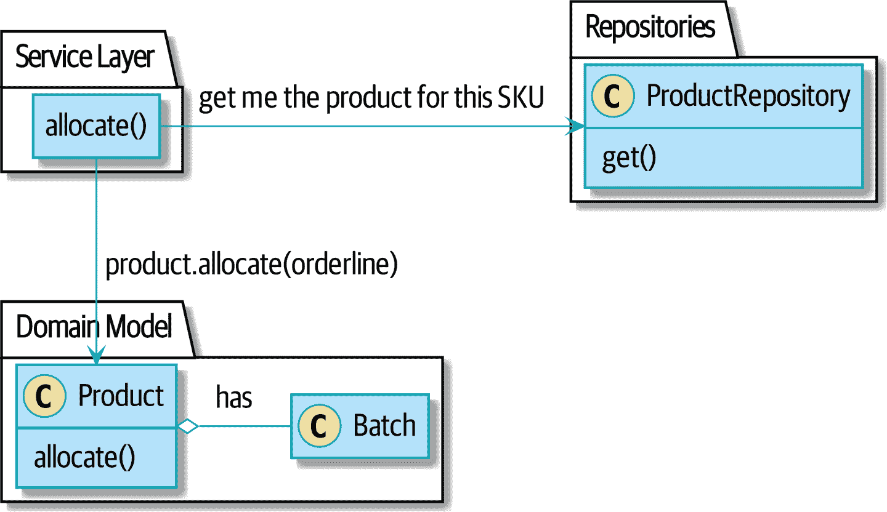

# 第七章：聚合和一致性边界

> 原文：[7: Aggregates and Consistency Boundaries](https://www.cosmicpython.com/book/chapter_07_aggregate.html)
> 
> 译者：[飞龙](https://github.com/wizardforcel)
> 
> 协议：[CC BY-NC-SA 4.0](https://creativecommons.org/licenses/by-nc-sa/4.0/)

在本章中，我们想重新审视我们的领域模型，讨论不变量和约束，并看看我们的领域对象如何在概念上和持久存储中保持自己的内部一致性。我们将讨论*一致性边界*的概念，并展示如何明确地做出这一点可以帮助我们构建高性能软件，而不会影响可维护性。

图 7-1 显示了我们的目标：我们将引入一个名为`Product`的新模型对象来包装多个批次，并且我们将使旧的`allocate()`领域服务作为`Product`的方法可用。


###### 图 7-1\. 添加产品聚合

为什么？让我们找出原因。

###### 提示

本章的代码在[GitHub](https://oreil.ly/vlnGg)的 appendix_csvs 分支中：

```py
git clone https://github.com/cosmicpython/code.git
cd code
git checkout appendix_csvs
# or to code along, checkout the previous chapter:
git checkout chapter_06_uow
```

# 为什么不只在电子表格中运行所有东西？

领域模型的意义是什么？我们试图解决的根本问题是什么？

我们难道不能只在电子表格中运行所有东西吗？我们的许多用户会对此感到高兴。业务用户*喜欢*电子表格，因为它们简单、熟悉，但又非常强大。

事实上，大量的业务流程确实是通过手动在电子邮件中来回发送电子表格来操作的。这种“CSV 通过 SMTP”架构具有较低的初始复杂性，但往往不容易扩展，因为很难应用逻辑和保持一致性。

谁有权查看特定字段？谁有权更新它？当我们尝试订购-350 把椅子或者 1000 万张桌子时会发生什么？员工可以有负薪水吗？

这些是系统的约束条件。我们编写的许多领域逻辑存在的目的是为了强制执行这些约束条件，以维护系统的不变量。*不变量*是每当我们完成一个操作时必须为真的事物。

# 不变量、约束和一致性

这两个词在某种程度上是可以互换的，但*约束*是限制我们的模型可能进入的可能状态的规则，而*不变量*更精确地定义为始终为真的条件。

如果我们正在编写酒店预订系统，我们可能会有一个约束，即不允许双重预订。这支持了一个不变量，即一个房间在同一天晚上不能有多个预订。

当然，有时我们可能需要暂时*违反*规则。也许我们需要因为贵宾预订而重新安排房间。当我们在内存中移动预订时，我们可能会被双重预订，但我们的领域模型应该确保，当我们完成时，我们最终处于一个一致的状态，其中不变量得到满足。如果我们找不到一种方法来容纳所有客人，我们应该引发错误并拒绝完成操作。

让我们从我们的业务需求中看一些具体的例子；我们将从这个开始：

> 订单行一次只能分配给一个批次。
>
> ——业务

这是一个强加不变量的业务规则。不变量是订单行必须分配给零个或一个批次，但绝不能超过一个。我们需要确保我们的代码永远不会意外地对同一行调用`Batch.allocate()`两个不同的批次，并且目前没有任何东西明确阻止我们这样做。

## 不变量、并发和锁

让我们再看看我们的另一个业务规则：

> 如果可用数量小于订单行的数量，我们就不能分配给批次。
>
> ——业务

这里的约束是我们不能分配超过批次可用数量的库存，因此我们永远不会通过将两个客户分配给同一个实际垫子而超卖库存。每当我们更新系统的状态时，我们的代码需要确保我们不会破坏不变量，即可用数量必须大于或等于零。

在单线程、单用户的应用程序中，我们相对容易地维护这个不变量。我们可以一次分配一行库存，并在没有库存可用时引发错误。

当我们引入*并发*的概念时，这就变得更加困难。突然间，我们可能同时为多个订单行分配库存。甚至可能在处理对批次本身的更改的同时分配订单行。

通常，我们通过在数据库表上应用*锁*来解决这个问题。这可以防止在同一行或同一表上同时发生两个操作。

当我们开始考虑扩展我们的应用程序时，我们意识到我们针对所有可用批次分配行的模型可能无法扩展。如果我们每小时处理数万个订单，以及数十万个订单行，我们无法为每一个订单行在整个`batches`表上持有锁定——至少会出现死锁或性能问题。

# 什么是聚合？

好吧，如果我们每次想要分配一个订单行都不能锁定整个数据库，那我们应该做什么呢？我们希望保护系统的不变量，但又允许最大程度的并发。维护我们的不变量不可避免地意味着防止并发写入；如果多个用户可以同时分配`DEADLY-SPOON`，我们就有可能过度分配。

另一方面，我们可以同时分配`DEADLY-SPOON`和`FLIMSY-DESK`。同时分配两种产品是安全的，因为它们没有共同的不变量。我们不需要它们彼此一致。

*聚合*模式是来自 DDD 社区的设计模式，它帮助我们解决这种紧张关系。*聚合*只是一个包含其他领域对象的领域对象，它让我们将整个集合视为一个单一单位。

修改聚合内部对象的唯一方法是加载整个对象，并在聚合本身上调用方法。

随着模型变得更加复杂，实体和值对象之间相互引用，形成了一个纠缠的图形，很难跟踪谁可以修改什么。特别是当我们在模型中有*集合*（我们的批次是一个集合）时，提名一些实体作为修改其相关对象的唯一入口是一个好主意。如果您提名一些对象负责其他对象的一致性，系统在概念上会更简单，更容易理解。

例如，如果我们正在构建一个购物网站，购物车可能是一个很好的聚合：它是一组商品，我们可以将其视为一个单一单位。重要的是，我们希望从数据存储中以单个块加载整个购物篮。我们不希望两个请求同时修改购物篮，否则我们就有可能出现奇怪的并发错误。相反，我们希望每次对购物篮的更改都在单个数据库事务中运行。

我们不希望在一个事务中修改多个购物篮，因为没有用例需要同时更改几个客户的购物篮。每个购物篮都是一个单一的*一致性边界*，负责维护自己的不变量。

> 聚合是一组相关对象的集合，我们将其视为数据更改的单元。
>
> ——埃里克·埃文斯，《领域驱动设计》蓝皮书

根据埃里克·埃文斯（Eric Evans）的说法，我们的聚合有一个根实体（购物车），它封装了对商品的访问。每个商品都有自己的身份，但系统的其他部分将始终将购物车视为一个不可分割的整体。

###### 提示

就像我们有时使用`*_leading_underscores*`来标记方法或函数为“私有”一样，您可以将聚合视为我们模型的“公共”类，而其他实体和值对象则为“私有”。

# 选择聚合

我们的系统应该使用哪个聚合？选择有点随意，但很重要。聚合将是我们确保每个操作都以一致状态结束的边界。这有助于我们推理我们的软件并防止奇怪的竞争问题。我们希望在一小部分对象周围划定边界——越小越好，以提高性能——这些对象必须彼此保持一致，并且我们需要给这个边界一个好名字。

我们在幕后操作的对象是`Batch`。我们如何称呼一组批次？我们应该如何将系统中的所有批次划分为一致性的离散岛屿？

我们*可以*使用`Shipment`作为我们的边界。每个发货包含多个批次，它们同时运送到我们的仓库。或者我们可以使用`Warehouse`作为我们的边界：每个仓库包含许多批次，同时对所有库存进行计数可能是有意义的。

然而，这两个概念都不能满足我们。即使它们在同一个仓库或同一批次中，我们也应该能够同时分配`DEADLY-SPOONs`和`FLIMSY-DESKs`。这些概念的粒度不对。

当我们分配订单行时，我们只对具有与订单行相同 SKU 的批次感兴趣。类似`GlobalSkuStock`的概念可能有效：给定 SKU 的所有批次的集合。

然而，这是一个笨重的名称，所以在通过`SkuStock`、`Stock`、`ProductStock`等进行一些讨论后，我们决定简单地称其为`Product`——毕竟，这是我们在第一章中探索领域语言时遇到的第一个概念。

因此，计划是这样的：当我们想要分配订单行时，我们不再使用图 7-2，在那里我们查找世界上所有的`Batch`对象并将它们传递给`allocate()`领域服务...


###### 图 7-2\.之前：使用领域服务对所有批次进行分配

```py
[plantuml, apwp_0702, config=plantuml.cfg]
@startuml

hide empty members

package "Service Layer" as services {
    class "allocate()" as allocate {
    }
    hide allocate circle
    hide allocate members
}

package "Domain Model" as domain_model {

  class Batch {
  }

  class "allocate()" as allocate_domain_service {
  }
    hide allocate_domain_service circle
    hide allocate_domain_service members
}

package repositories {

  class BatchRepository {
    list()
  }

}

allocate -> BatchRepository: list all batches
allocate --> allocate_domain_service: allocate(orderline, batches)

@enduml
```

...我们将转向图 7-3 的世界，在那里有一个特定 SKU 的新`Product`对象，它将负责所有*该 SKU*的批次，并且我们可以在其上调用`.allocate()`方法。



###### 图 7-3\.之后：要求 Product 根据其批次进行分配

```py
[plantuml, apwp_0703, config=plantuml.cfg]
@startuml

hide empty members

package "Service Layer" as services {
    class "allocate()" as allocate {
    }
}

hide allocate circle
hide allocate members

package "Domain Model" as domain_model {

  class Product {
    allocate()
  }

  class Batch {
  }
}

package repositories {

  class ProductRepository {
    get()
  }

}

allocate -> ProductRepository: get me the product for this sku
allocate --> Product: product.allocate(orderline)
Product o- Batch: has

@enduml
```

让我们看看代码形式是什么样子的：

*我们选择的聚合，Product (`src/allocation/domain/model.py`)*

```py
class Product:
    def __init__(self, sku: str, batches: List[Batch]):
        self.sku = sku  #(1)
        self.batches = batches  #(2)

    def allocate(self, line: OrderLine) -> str:  #(3)
        try:
            batch = next(b for b in sorted(self.batches) if b.can_allocate(line))
            batch.allocate(line)
            return batch.reference
        except StopIteration:
            raise OutOfStock(f"Out of stock for sku {line.sku}")
```

①

`Product`的主要标识符是`sku`。

②

我们的`Product`类持有对该 SKU 的一组`batches`的引用。

③

最后，我们可以将`allocate()`领域服务移动到`Product`聚合的方法上。

###### 注

这个`Product`看起来可能不像你期望的`Product`模型。没有价格，没有描述，没有尺寸。我们的分配服务不关心这些东西。这就是有界上下文的力量；一个应用中的产品概念可能与另一个应用中的产品概念非常不同。请参阅以下侧边栏以进行更多讨论。

# 一个聚合=一个存储库

一旦您定义了某些实体为聚合，我们需要应用一个规则，即它们是唯一对外界可访问的实体。换句话说，我们允许的唯一存储库应该是返回聚合的存储库。

###### 注

存储库只返回聚合是我们强制执行聚合是进入我们领域模型的唯一方式的主要地方。要小心不要违反它！

在我们的案例中，我们将从`BatchRepository`切换到`ProductRepository`：

*我们的新 UoW 和存储库（unit_of_work.py 和 repository.py）*

```py
class AbstractUnitOfWork(abc.ABC):
    products: repository.AbstractProductRepository

...

class AbstractProductRepository(abc.ABC):

    @abc.abstractmethod
    def add(self, product):
        ...

    @abc.abstractmethod
    def get(self, sku) -> model.Product:
        ...
```

ORM 层将需要一些调整，以便正确的批次自动加载并与`Product`对象关联。好处是，存储库模式意味着我们不必担心这个问题。我们可以只使用我们的`FakeRepository`，然后将新模型传递到我们的服务层，看看它作为其主要入口点的`Product`是什么样子：

*服务层（`src/allocation/service_layer/services.py`）*

```py
def add_batch(
        ref: str, sku: str, qty: int, eta: Optional[date],
        uow: unit_of_work.AbstractUnitOfWork
):
    with uow:
        product = uow.products.get(sku=sku)
        if product is None:
            product = model.Product(sku, batches=[])
            uow.products.add(product)
        product.batches.append(model.Batch(ref, sku, qty, eta))
        uow.commit()

def allocate(
        orderid: str, sku: str, qty: int,
        uow: unit_of_work.AbstractUnitOfWork
) -> str:
    line = OrderLine(orderid, sku, qty)
    with uow:
        product = uow.products.get(sku=line.sku)
        if product is None:
            raise InvalidSku(f'Invalid sku {line.sku}')
        batchref = product.allocate(line)
        uow.commit()
    return batchref
```

# 性能如何？

我们已经多次提到，我们正在使用聚合进行建模，因为我们希望拥有高性能的软件，但是在这里，我们加载了*所有*批次，而我们只需要一个。你可能会认为这是低效的，但我们在这里感到舒适的原因有几个。

首先，我们有意地对我们的数据进行建模，以便我们可以对数据库进行单个查询来读取，并进行单个更新以保存我们的更改。这往往比发出许多临时查询的系统性能要好得多。在不以这种方式建模的系统中，我们经常发现随着软件的发展，事务变得越来越长，越来越复杂。

其次，我们的数据结构是最小的，每行包括一些字符串和整数。我们可以在几毫秒内轻松加载数十甚至数百个批次。

第三，我们预计每种产品一次只有大约 20 个批次左右。一旦批次用完，我们可以从我们的计算中剔除它。这意味着我们获取的数据量不应该随着时间的推移而失控。

如果我们*确实*预计某种产品会有成千上万个活跃的批次，我们将有几个选择。首先，我们可以对产品中的批次使用延迟加载。从我们代码的角度来看，没有任何变化，但在后台，SQLAlchemy 会为我们分页数据。这将导致更多的请求，每个请求获取更少的行。因为我们只需要找到一个足够容量的批次来满足我们的订单，这可能效果很好。

如果一切都失败了，我们只需寻找一个不同的聚合。也许我们可以按地区或仓库拆分批次。也许我们可以围绕装运概念重新设计我们的数据访问策略。聚合模式旨在帮助管理一些围绕一致性和性能的技术约束。并没有*一个*正确的聚合，如果发现我们的边界导致性能问题，我们应该放心改变我们的想法。

# 使用版本号进行乐观并发

我们有了我们的新聚合，所以我们解决了选择一个对象负责一致性边界的概念问题。现在让我们花点时间谈谈如何在数据库级别强制执行数据完整性。

###### 注意

这一部分包含了许多实现细节；例如，其中一些是特定于 Postgres 的。但更一般地，我们展示了一种管理并发问题的方法，但这只是一种方法。这一领域的实际要求在项目之间变化很大。你不应该期望能够将代码从这里复制粘贴到生产环境中。

我们不想在整个`batches`表上持有锁，但是我们如何实现仅在特定 SKU 的行上持有锁？

一个解决方案是在`Product`模型上有一个单一属性，作为整个状态变化完成的标记，并将其用作并发工作者可以争夺的单一资源。如果两个事务同时读取`batches`的世界状态，并且都想要更新`allocations`表，我们强制两者也尝试更新`products`表中的`version_number`，以便只有一个可以获胜，世界保持一致。

图 7-4 说明了两个并发事务同时进行读取操作，因此它们看到的是一个具有，例如，`version=3`的`Product`。它们都调用`Product.allocate()`来修改状态。但我们设置了数据库完整性规则，只允许其中一个使用`commit`提交带有`version=4`的新`Product`，而另一个更新将被拒绝。

###### 提示

版本号只是实现乐观锁定的一种方式。你可以通过将 Postgres 事务隔离级别设置为`SERIALIZABLE`来实现相同的效果，但这通常会带来严重的性能成本。版本号还可以使隐含的概念变得明确。


###### 图 7-4：序列图：两个事务尝试并发更新`Product`

```py
[plantuml, apwp_0704, config=plantuml.cfg]
@startuml

entity Model
collections Transaction1
collections Transaction2
database Database

Transaction1 -> Database: get product
Database -> Transaction1: Product(version=3)
Transaction2 -> Database: get product
Database -> Transaction2: Product(version=3)
Transaction1 -> Model: Product.allocate()
Model -> Transaction1: Product(version=4)
Transaction2 -> Model: Product.allocate()
Model -> Transaction2: Product(version=4)
Transaction1 -> Database: commit Product(version=4)
Database -[#green]> Transaction1: OK
Transaction2 -> Database: commit Product(version=4)
Database -[#red]>x Transaction2: Error! version is already 4

@enduml
```

## 版本号的实现选项

基本上有三种实现版本号的选项：

1.  `version_number`存在于领域中；我们将其添加到`Product`构造函数中，`Product.allocate()`负责递增它。

1.  服务层可以做到！版本号并不*严格*是一个领域问题，所以我们的服务层可以假设当前版本号是由存储库附加到`Product`上的，并且服务层在执行`commit()`之前会递增它。

1.  由于这可以说是一个基础设施问题，UoW 和存储库可以通过魔法来做到这一点。存储库可以访问它检索的任何产品的版本号，当 UoW 提交时，它可以递增它所知道的任何产品的版本号，假设它们已经更改。

选项 3 并不理想，因为没有真正的方法可以做到这一点，而不必假设*所有*产品都已更改，所以我们将在不必要的时候递增版本号。¹

选项 2 涉及在服务层和领域层之间混合变更状态的责任，因此也有点混乱。

因此，最终，即使版本号不一定是一个领域关注的问题，你可能会决定最干净的权衡是将它们放在领域中：

*我们选择的聚合，Product（`src/allocation/domain/model.py`）*

```py
class Product:
    def __init__(self, sku: str, batches: List[Batch], version_number: int = 0):  #(1)
        self.sku = sku
        self.batches = batches
        self.version_number = version_number  #(1)

    def allocate(self, line: OrderLine) -> str:
        try:
            batch = next(b for b in sorted(self.batches) if b.can_allocate(line))
            batch.allocate(line)
            self.version_number += 1  #(1)
            return batch.reference
        except StopIteration:
            raise OutOfStock(f"Out of stock for sku {line.sku}")
```

①

就是这样！

###### 提示

如果你对版本号这个业务感到困惑，也许记住*号码*并不重要会有所帮助。重要的是，每当我们对`Product`聚合进行更改时，`Product`数据库行都会被修改。版本号是一种简单的、人类可理解的方式来模拟每次写入时都会发生变化的事物，但它也可以是每次都是一个随机 UUID。

# 测试我们的数据完整性规则

现在要确保我们可以得到我们想要的行为：如果我们有两个并发尝试针对同一个`Product`进行分配，其中一个应该失败，因为它们不能同时更新版本号。

首先，让我们使用一个执行分配然后显式休眠的函数来模拟“慢”事务：²

*time.sleep 可以复制并发行为（`tests/integration/test_uow.py`）*

```py
def try_to_allocate(orderid, sku, exceptions):
    line = model.OrderLine(orderid, sku, 10)
    try:
        with unit_of_work.SqlAlchemyUnitOfWork() as uow:
            product = uow.products.get(sku=sku)
            product.allocate(line)
            time.sleep(0.2)
            uow.commit()
    except Exception as e:
        print(traceback.format_exc())
        exceptions.append(e)
```

然后我们的测试使用线程并发两次调用这个慢分配：

*并发行为的集成测试（`tests/integration/test_uow.py`）*

```py
def test_concurrent_updates_to_version_are_not_allowed(postgres_session_factory):
    sku, batch = random_sku(), random_batchref()
    session = postgres_session_factory()
    insert_batch(session, batch, sku, 100, eta=None, product_version=1)
    session.commit()

    order1, order2 = random_orderid(1), random_orderid(2)
    exceptions = []  # type: List[Exception]
    try_to_allocate_order1 = lambda: try_to_allocate(order1, sku, exceptions)
    try_to_allocate_order2 = lambda: try_to_allocate(order2, sku, exceptions)
    thread1 = threading.Thread(target=try_to_allocate_order1)  #(1)
    thread2 = threading.Thread(target=try_to_allocate_order2)  #(1)
    thread1.start()
    thread2.start()
    thread1.join()
    thread2.join()

    [[version]] = session.execute(
        "SELECT version_number FROM products WHERE sku=:sku",
        dict(sku=sku),
    )
    assert version == 2  #(2)
    [exception] = exceptions
    assert "could not serialize access due to concurrent update" in str(exception)  #(3)

    orders = session.execute(
        "SELECT orderid FROM allocations"
        " JOIN batches ON allocations.batch_id = batches.id"
        " JOIN order_lines ON allocations.orderline_id = order_lines.id"
        " WHERE order_lines.sku=:sku",
        dict(sku=sku),
    )
    assert orders.rowcount == 1  #(4)
    with unit_of_work.SqlAlchemyUnitOfWork() as uow:
        uow.session.execute("select 1")
```

①

我们启动两个线程，它们将可靠地产生我们想要的并发行为：`read1, read2, write1, write2`。

②

我们断言版本号只被递增了一次。

③

我们也可以检查特定的异常，如果我们愿意的话。

④

然后我们再次检查，只有一个分配已经完成。

## 通过使用数据库事务隔离级别来强制执行并发规则

为了使测试通过，我们可以在会话中设置事务隔离级别：

*为会话设置隔离级别 (src/allocation/service_layer/unit_of_work.py)*

```py
DEFAULT_SESSION_FACTORY = sessionmaker(bind=create_engine(
    config.get_postgres_uri(),
    isolation_level="REPEATABLE READ",
))
```

###### 提示

事务隔离级别是棘手的东西，所以值得花时间了解[Postgres 文档](https://oreil.ly/5vxJA)。³

## 悲观并发控制示例：SELECT FOR UPDATE

有多种方法可以解决这个问题，但我们将展示一种方法。[`SELECT FOR UPDATE`](https://oreil.ly/i8wKL)会产生不同的行为；两个并发事务将不被允许同时对相同的行进行读取。

`SELECT FOR UPDATE`是一种选择行作为锁定的方法（尽管这些行不一定是你要更新的行）。如果两个事务同时尝试`SELECT FOR UPDATE`一行，一个会获胜，另一个会等待直到锁定被释放。因此，这是一种悲观并发控制的例子。

以下是您可以使用 SQLAlchemy DSL 在查询时指定`FOR UPDATE`的方法：

*SQLAlchemy with_for_update (src/allocation/adapters/repository.py)*

```py
    def get(self, sku):
        return self.session.query(model.Product) \
                           .filter_by(sku=sku) \
                           .with_for_update() \
                           .first()
```

这将改变并发模式

```py
read1, read2, write1, write2(fail)
```

到

```py
read1, write1, read2, write2(succeed)
```

有些人将这称为“读取-修改-写入”故障模式。阅读[“PostgreSQL 反模式：读取-修改-写入周期”](https://oreil.ly/uXeZI)以获得一个很好的概述。

我们真的没有时间讨论`REPEATABLE READ`和`SELECT FOR UPDATE`之间的所有权衡，或者乐观与悲观锁定。但是，如果你有一个像我们展示的那样的测试，你可以指定你想要的行为并查看它是如何改变的。你也可以使用测试作为执行一些性能实验的基础。

# 总结

围绕并发控制的具体选择根据业务情况和存储技术选择而有很大的不同，但我们想把这一章重新带回到聚合的概念上：我们明确地将一个对象建模为我们模型的某个子集的主要入口点，并负责强制执行适用于所有这些对象的不变量和业务规则。

选择正确的聚合是关键，这是一个你可能随时间重新考虑的决定。你可以在多本 DDD 书籍中了解更多。我们还推荐 Vaughn Vernon（“红皮书”作者）的这三篇关于[有效聚合设计](https://dddcommunity.org/library/vernon_2011)的在线论文。

表 7-1 对实现聚合模式的权衡有一些想法。

表 7-1. 聚合：权衡

| 优点 | 缺点 |
| --- | --- |
| Python 可能没有“官方”的公共和私有方法，但我们有下划线约定，因为通常有用的是尝试指示什么是“内部”使用和什么是“外部代码”使用。选择聚合只是更高一级的：它让你决定你的领域模型类中哪些是公共的，哪些不是。 | 对于新开发人员来说，又是一个新概念。解释实体与值对象已经是一种心理负担；现在又出现了第三种领域模型对象？ |
| 围绕显式一致性边界建模我们的操作有助于避免 ORM 的性能问题。 | 严格遵守我们一次只修改一个聚合的规则是一个很大的心理转变。 |
| 将聚合单独负责对其子模型的状态更改使系统更容易理解，并使其更容易控制不变量。 | 处理聚合之间的最终一致性可能会很复杂。 |


# 第一部分总结

你还记得图 7-5 吗？这是我们在[第一部分](part01.xhtml#part1)开始时展示的图表，预览我们的方向的。


###### 图 7-5：第一部分结束时我们应用的组件图

这就是我们在第一部分结束时所处的位置。我们取得了什么成就？我们看到了如何构建一个领域模型，通过一组高级单元测试来验证。我们的测试是活的文档：它们描述了我们系统的行为——我们与业务利益相关者达成一致的规则——以易于阅读的代码形式。当我们的业务需求发生变化时，我们有信心我们的测试将帮助我们证明新功能，当新的开发人员加入项目时，他们可以阅读我们的测试来理解事物是如何工作的。

我们已经解耦了系统的基础部分，如数据库和 API 处理程序，以便我们可以将它们插入到我们应用程序的外部。这有助于我们保持我们的代码库组织良好，并阻止我们构建一个大泥球。

通过应用依赖反转原则，并使用端口和适配器启发的模式，如存储库和工作单元，我们已经使得在高档和低档都可以进行 TDD，并保持一个健康的测试金字塔。我们可以对我们的系统进行端到端的测试，对集成和端到端测试的需求保持最低限度。

最后，我们谈到了一致性边界的概念。我们不希望在进行更改时锁定整个系统，因此我们必须选择哪些部分彼此一致。

对于一个小系统来说，这就是你需要去尝试领域驱动设计理念的一切。现在你有了工具来构建与数据库无关的领域模型，代表了你的业务专家的共享语言。万岁！

###### 注意

冒着重复的风险，我们一再强调每个模式都有成本。每一层间接性都会在我们的代码中产生复杂性和重复，并且对于从未见过这些模式的程序员来说会很困惑。如果你的应用本质上只是一个简单的 CRUD 包装器，围绕数据库，未来也不太可能成为其他东西，*你不需要这些模式*。继续使用 Django，省去很多麻烦。

在第二部分中，我们将放大并讨论一个更大的话题：如果聚合是我们的边界，我们只能一次更新一个，那么我们如何建模跨一致性边界的过程呢？

¹也许我们可以通过 ORM/SQLAlchemy 魔术告诉我们对象何时是脏的，但在通用情况下，这将如何工作——例如对于`CsvRepository`？

²`time.sleep()`在我们的用例中效果很好，但它并不是再现并发错误最可靠或高效的方式。考虑使用信号量或类似的同步原语，在线程之间共享，以获得更好的行为保证。

³如果你没有使用 Postgres，你需要阅读不同的文档。令人恼火的是，不同的数据库都有相当不同的定义。例如，Oracle 的`SERIALIZABLE`等同于 Postgres 的`REPEATABLE READ`。
