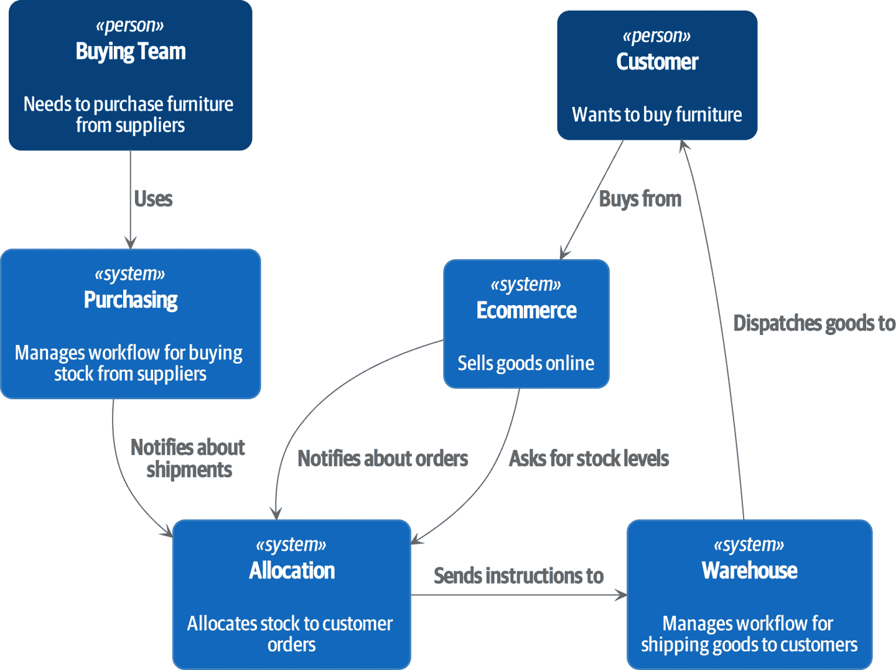

# 第二部分：事件驱动架构

> 原文：[Part 2: Event-Driven Architecture](https://www.cosmicpython.com/book/part2.html)
> 
> 译者：[飞龙](https://github.com/wizardforcel)
> 
> 协议：[CC BY-NC-SA 4.0](https://creativecommons.org/licenses/by-nc-sa/4.0/)

> 很抱歉我很久以前为这个主题创造了“对象”这个术语，因为它让很多人关注了次要的想法。
>
> 重要的想法是“消息传递”……设计出伟大且可扩展的系统的关键更多地在于设计其模块之间的通信方式，而不是它们的内部属性和行为应该是什么。
>
> ——艾伦·凯

能够编写*一个*领域模型来管理一个业务流程的一小部分是非常好的，但当我们需要编写*许多*模型时会发生什么？在现实世界中，我们的应用程序位于一个组织中，并且需要与系统的其他部分交换信息。您可能还记得我们在图 II-1 中显示的上下文图。

面对这个要求，许多团队会选择通过 HTTP API 集成的微服务。但如果他们不小心，最终会产生最混乱的分布式大泥球。

在第二部分中，我们将展示如何将第一部分的技术扩展到分布式系统。我们将放大看看如何通过异步消息传递来组合一个系统的许多小组件之间的交互。

我们将看到我们的服务层和工作单元模式如何允许我们重新配置我们的应用程序以作为异步消息处理器运行，以及事件驱动系统如何帮助我们将聚合和应用程序相互解耦。

###### 图 II-1：但所有这些系统究竟如何相互通信呢？

我们将研究以下模式和技术：

领域事件

触发跨一致性边界的工作流。

消息总线

提供了一个统一的方式从任何端点调用用例。

CQRS

分离读和写避免了事件驱动架构中的尴尬妥协，并实现了性能和可扩展性的改进。

此外，我们将添加一个依赖注入框架。这与事件驱动架构本身无关，但它整理了许多松散的尾巴。
