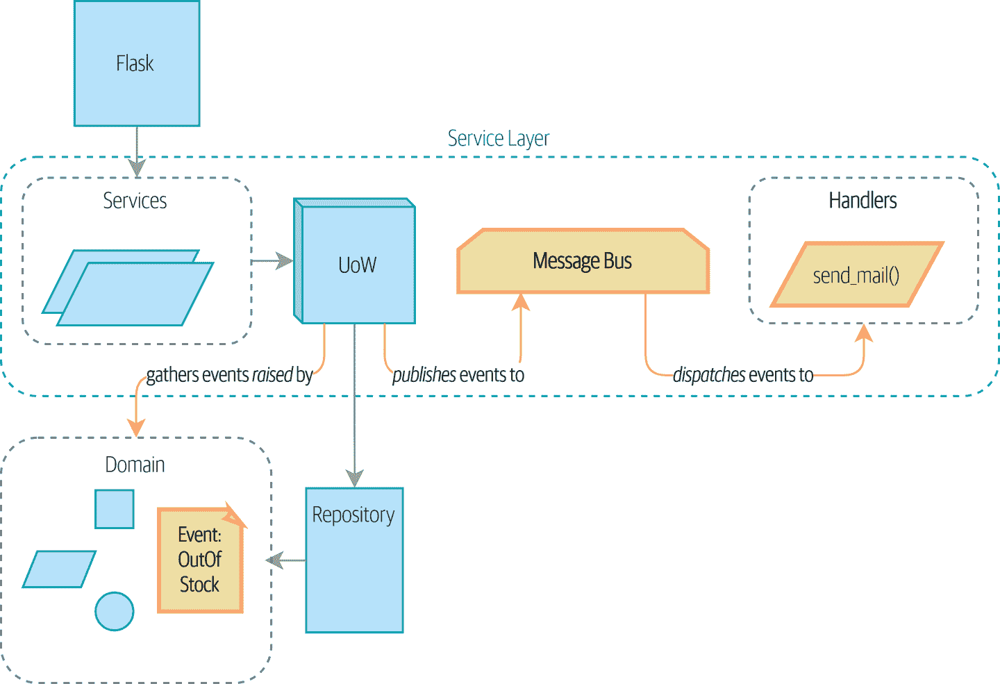

# 第八章：事件和消息总线

> 原文：[8: Events and the Message Bus](https://www.cosmicpython.com/book/chapter_08_events_and_message_bus.html)
> 
> 译者：[飞龙](https://github.com/wizardforcel)
> 
> 协议：[CC BY-NC-SA 4.0](https://creativecommons.org/licenses/by-nc-sa/4.0/)

到目前为止，我们已经花了很多时间和精力解决一个我们本可以很容易用 Django 解决的简单问题。你可能会问，增加的可测试性和表现力是否*真的*值得所有的努力。

然而，在实践中，我们发现搞乱我们代码库的并不是明显的功能，而是边缘的混乱。它是报告、权限和涉及无数对象的工作流。

我们的例子将是一个典型的通知要求：当我们因为库存不足而无法分配订单时，我们应该通知采购团队。他们会去解决问题，购买更多的库存，一切都会好起来。

对于第一个版本，我们的产品所有者说我们可以通过电子邮件发送警报。

让我们看看当我们需要插入一些构成我们系统很大一部分的平凡事物时，我们的架构是如何保持的。

我们将首先做最简单、最迅速的事情，并讨论为什么正是这种决定导致了我们的大泥球。

然后我们将展示如何使用*领域事件*模式将副作用与我们的用例分离，并如何使用简单的*消息总线*模式来触发基于这些事件的行为。我们将展示一些创建这些事件的选项以及如何将它们传递给消息总线，最后我们将展示如何修改工作单元模式以优雅地将这两者连接在一起，正如图 8-1 中预览的那样。



###### 图 8-1：事件在系统中流动

###### 提示

本章的代码在 GitHub 的 chapter_08_events_and_message_bus 分支中[（https://oreil.ly/M-JuL）](https://oreil.ly/M-JuL)：

```py
git clone https://github.com/cosmicpython/code.git
cd code
git checkout chapter_08_events_and_message_bus
# or to code along, checkout the previous chapter:
git checkout chapter_07_aggregate
```

# 避免搞乱

所以。当我们库存不足时发送电子邮件提醒。当我们有新的要求，比如*真的*与核心领域无关的要求时，很容易开始将这些东西倒入我们的网络控制器中。

## 首先，让我们避免把我们的网络控制器搞乱

作为一次性的黑客，这*可能*还可以：

*只是把它放在端点上——会有什么问题吗？(src/allocation/entrypoints/flask_app.py)*

```py
@app.route("/allocate", methods=['POST'])
def allocate_endpoint():
    line = model.OrderLine(
        request.json['orderid'],
        request.json['sku'],
        request.json['qty'],
    )
    try:
        uow = unit_of_work.SqlAlchemyUnitOfWork()
        batchref = services.allocate(line, uow)
    except (model.OutOfStock, services.InvalidSku) as e:
        send_mail(
            'out of stock',
            'stock_admin@made.com',
            f'{line.orderid} - {line.sku}'
        )
        return jsonify({'message': str(e)}), 400

    return jsonify({'batchref': batchref}), 201
```

...但很容易看出，我们很快就会因为这样修补东西而陷入混乱。发送电子邮件不是我们的 HTTP 层的工作，我们希望能够对这个新功能进行单元测试。

## 还有，让我们不要搞乱我们的模型

假设我们不想把这段代码放到我们的网络控制器中，因为我们希望它们尽可能薄，我们可以考虑把它放在源头，即模型中：

*我们模型中的发送电子邮件代码也不够好(src/allocation/domain/model.py)*

```py
    def allocate(self, line: OrderLine) -> str:
        try:
            batch = next(
                b for b in sorted(self.batches) if b.can_allocate(line)
            )
            #...
        except StopIteration:
            email.send_mail('stock@made.com', f'Out of stock for {line.sku}')
            raise OutOfStock(f'Out of stock for sku {line.sku}')
```

但这甚至更糟！我们不希望我们的模型对`email.send_mail`这样的基础设施问题有任何依赖。

这个发送电子邮件的东西是不受欢迎的*混乱*，破坏了我们系统的干净流程。我们希望的是保持我们的领域模型专注于规则“你不能分配比实际可用的东西更多”。

领域模型的工作是知道我们的库存不足，但发送警报的责任属于其他地方。我们应该能够打开或关闭此功能，或者切换到短信通知，而无需更改我们领域模型的规则。

## 或者服务层！

要求“尝试分配一些库存，并在失败时发送电子邮件”是工作流编排的一个例子：这是系统必须遵循的一组步骤，以实现一个目标。

我们编写了一个服务层来为我们管理编排，但即使在这里，这个功能也感觉不合适：

*而在服务层，它是不合适的(src/allocation/service_layer/services.py)*

```py
def allocate(
        orderid: str, sku: str, qty: int,
        uow: unit_of_work.AbstractUnitOfWork
) -> str:
    line = OrderLine(orderid, sku, qty)
    with uow:
        product = uow.products.get(sku=line.sku)
        if product is None:
            raise InvalidSku(f'Invalid sku {line.sku}')
        try:
            batchref = product.allocate(line)
            uow.commit()
            return batchref
        except model.OutOfStock:
            email.send_mail('stock@made.com', f'Out of stock for {line.sku}')
            raise
```

捕获异常并重新引发它？这可能更糟，但肯定会让我们不开心。为什么这么难找到一个合适的家来放置这段代码呢？

# 单一责任原则

实际上，这是*单一责任原则*（SRP）的违反。¹我们的用例是分配。我们的端点、服务函数和领域方法都称为`allocate`，而不是`allocate_and_send_mail_if_out_of_stock`。

###### 提示

经验法则：如果你不能在不使用“然后”或“和”这样的词语描述你的函数做什么，你可能会违反 SRP。

SRP 的一个表述是每个类只应该有一个改变的原因。当我们从电子邮件切换到短信时，我们不应该更新我们的`allocate()`函数，因为这显然是一个单独的责任。

为了解决这个问题，我们将把编排分成单独的步骤，这样不同的关注点就不会纠缠在一起。²领域模型的工作是知道我们的库存不足，但发送警报的责任属于其他地方。我们应该能够随时打开或关闭此功能，或者切换到短信通知，而无需更改我们领域模型的规则。

我们也希望保持服务层不受实现细节的影响。我们希望将依赖倒置原则应用于通知，使我们的服务层依赖于一个抽象，就像我们通过使用工作单元来避免依赖于数据库一样。

# 全体乘客上车！

我们要介绍的模式是*领域事件*和*消息总线*。我们可以以几种方式实现它们，所以我们将展示一些方式，然后选择我们最喜欢的方式。

## 模型记录事件

首先，我们的模型不再关心电子邮件，而是负责记录*事件*——关于已发生事情的事实。我们将使用消息总线来响应事件并调用新的操作。

## 事件是简单的数据类

*事件*是一种*值对象*。事件没有任何行为，因为它们是纯数据结构。我们总是用领域的语言命名事件，并将其视为我们领域模型的一部分。

我们可以将它们存储在*model.py*中，但我们可能会将它们保留在它们自己的文件中（现在可能是考虑重构出一个名为*domain*的目录的好时机，这样我们就有*domain/model.py*和*domain/events.py*）：

*事件类（`src/allocation/domain/events.py`）*

```py
from dataclasses import dataclass


class Event:  #(1)
    pass


@dataclass
class OutOfStock(Event):  #(2)
    sku: str
```

①

一旦我们有了一些事件，我们会发现有一个可以存储共同属性的父类很有用。它对于我们消息总线中的类型提示也很有用，您很快就会看到。

②

`dataclasses`对于领域事件也很好。

## 模型引发事件

当我们的领域模型记录发生的事实时，我们说它*引发*了一个事件。

从外部看，它将是这样的；如果我们要求`Product`分配但无法分配，它应该*引发*一个事件：

*测试我们的聚合以引发事件（`tests/unit/test_product.py`）*

```py
def test_records_out_of_stock_event_if_cannot_allocate():
    batch = Batch("batch1", "SMALL-FORK", 10, eta=today)
    product = Product(sku="SMALL-FORK", batches=[batch])
    product.allocate(OrderLine("order1", "SMALL-FORK", 10))

    allocation = product.allocate(OrderLine("order2", "SMALL-FORK", 1))
    assert product.events[-1] == events.OutOfStock(sku="SMALL-FORK")  #(1)
    assert allocation is None
```

①

我们的聚合将公开一个名为`.events`的新属性，其中包含关于发生了什么事情的事实列表，以`Event`对象的形式。

模型在内部的样子如下：

*模型引发领域事件（`src/allocation/domain/model.py`）*

```py
class Product:
    def __init__(self, sku: str, batches: List[Batch], version_number: int = 0):
        self.sku = sku
        self.batches = batches
        self.version_number = version_number
        self.events = []  # type: List[events.Event]  #(1)

    def allocate(self, line: OrderLine) -> str:
        try:
            #...
        except StopIteration:
            self.events.append(events.OutOfStock(line.sku))  #(2)
            # raise OutOfStock(f"Out of stock for sku {line.sku}")  #(3)
            return None
```

①

这是我们新的`.events`属性的用法。

②

我们不是直接调用一些发送电子邮件的代码，而是在事件发生的地方记录这些事件，只使用领域的语言。

③

我们还将停止为缺货情况引发异常。事件将执行异常的工作。

###### 注意

实际上，我们正在解决到目前为止我们一直存在的代码异味，即我们一直在[使用异常进行控制流](https://oreil.ly/IQB51)。一般来说，如果你正在实现领域事件，不要引发异常来描述相同的领域概念。正如你将在稍后处理工作单元模式中处理事件时所看到的，必须同时考虑事件和异常是令人困惑的。

## 消息总线将事件映射到处理程序

消息总线基本上是说：“当我看到这个事件时，我应该调用以下处理程序函数。”换句话说，这是一个简单的发布-订阅系统。处理程序*订阅*接收事件，我们将其发布到总线上。听起来比实际困难，我们通常用字典来实现它：

*简单消息总线（`src/allocation/service_layer/messagebus.py`）*

```py
def handle(event: events.Event):
    for handler in HANDLERS[type(event)]:
        handler(event)

def send_out_of_stock_notification(event: events.OutOfStock):
    email.send_mail(
        'stock@made.com',
        f'Out of stock for {event.sku}',
    )

HANDLERS = {
    events.OutOfStock: [send_out_of_stock_notification],

}  # type: Dict[Type[events.Event], List[Callable]]
```

###### 注意

请注意，实现的消息总线并不会给我们并发性，因为一次只有一个处理程序会运行。我们的目标不是支持并行线程，而是在概念上分离任务，并尽可能使每个 UoW 尽可能小。这有助于我们理解代码库，因为每个用例的运行“配方”都写在一个地方。请参阅以下侧边栏。

# 选项 1：服务层从模型中获取事件并将其放在消息总线上

我们的领域模型会触发事件，我们的消息总线会在事件发生时调用正确的处理程序。现在我们需要的是连接这两者。我们需要某种方式来捕捉模型中的事件并将它们传递给消息总线——*发布*步骤。

最简单的方法是在我们的服务层中添加一些代码：

*具有显式消息总线的服务层（`src/allocation/service_layer/services.py`）*

```py
from . import messagebus
...

def allocate(
    orderid: str, sku: str, qty: int,
    uow: unit_of_work.AbstractUnitOfWork,
) -> str:
    line = OrderLine(orderid, sku, qty)
    with uow:
        product = uow.products.get(sku=line.sku)
        if product is None:
            raise InvalidSku(f"Invalid sku {line.sku}")
        try:  #(1)
            batchref = product.allocate(line)
            uow.commit()
            return batchref
        finally:  #(1)
            messagebus.handle(product.events)  #(2)
```

①

我们保留了我们丑陋的早期实现中的`try/finally`（我们还没有摆脱*所有*异常，只是`OutOfStock`）。

②

但现在，服务层不再直接依赖于电子邮件基础设施，而是负责将模型中的事件传递到消息总线。

这已经避免了我们在天真的实现中遇到的一些丑陋，我们有几个系统都是这样工作的，其中服务层明确地从聚合中收集事件并将其传递给消息总线。

# 选项 2：服务层引发自己的事件

我们使用的另一种变体是让服务层负责直接创建和触发事件，而不是由领域模型触发：

*服务层直接调用 messagebus.handle（`src/allocation/service_layer/services.py`）*

```py
def allocate(
    orderid: str, sku: str, qty: int,
    uow: unit_of_work.AbstractUnitOfWork,
) -> str:
    line = OrderLine(orderid, sku, qty)
    with uow:
        product = uow.products.get(sku=line.sku)
        if product is None:
            raise InvalidSku(f"Invalid sku {line.sku}")
        batchref = product.allocate(line)
        uow.commit() #(1)

        if batchref is None:
            messagebus.handle(events.OutOfStock(line.sku))
        return batchref
```

①

与以前一样，即使我们无法分配，我们也会提交，因为这样代码更简单，更容易理解：除非出现问题，我们总是提交。在我们没有做任何更改时提交是安全的，并且保持代码整洁。

同样，我们的生产应用程序以这种方式实现了该模式。对你来说，适合你的方式将取决于你面临的特定权衡，但我们想向你展示我们认为最优雅的解决方案，即让工作单元负责收集和引发事件。

# 选项 3：UoW 将事件发布到消息总线

UoW 已经有了`try/finally`，并且它知道当前正在使用的所有聚合，因为它提供对存储库的访问。因此，这是一个很好的地方来发现事件并将它们传递给消息总线：

*UoW 遇到消息总线（`src/allocation/service_layer/unit_of_work.py`）*

```py
class AbstractUnitOfWork(abc.ABC):
    ...

    def commit(self):
        self._commit()  #(1)
        self.publish_events()  #(2)

    def publish_events(self):  #(2)
        for product in self.products.seen:  #(3)
            while product.events:
                event = product.events.pop(0)
                messagebus.handle(event)

    @abc.abstractmethod
    def _commit(self):
        raise NotImplementedError

...

class SqlAlchemyUnitOfWork(AbstractUnitOfWork):
    ...

    def _commit(self):  #(1)
        self.session.commit()
```

①

我们将更改我们的提交方法，要求子类需要一个私有的`._commit()`方法。

②

提交后，我们遍历存储库所见的所有对象，并将它们的事件传递给消息总线。

③

这依赖于存储库跟踪已使用新属性`.seen`加载的聚合，正如您将在下一个清单中看到的那样。

###### 注意

您是否想知道如果其中一个处理程序失败会发生什么？我们将在第十章中详细讨论错误处理。

*存储库跟踪通过它的聚合（`src/allocation/adapters/repository.py`）*

```py
class AbstractRepository(abc.ABC):
    def __init__(self):
        self.seen = set()  # type: Set[model.Product]  #(1)

    def add(self, product: model.Product):  #(2)
        self._add(product)
        self.seen.add(product)

    def get(self, sku) -> model.Product:  #(3)
        product = self._get(sku)
        if product:
            self.seen.add(product)
        return product

    @abc.abstractmethod
    def _add(self, product: model.Product):  #(2)
        raise NotImplementedError

    @abc.abstractmethod  #(3)
    def _get(self, sku) -> model.Product:
        raise NotImplementedError


class SqlAlchemyRepository(AbstractRepository):
    def __init__(self, session):
        super().__init__()
        self.session = session

    def _add(self, product):  #(2)
        self.session.add(product)

    def _get(self, sku):  #(3)
        return self.session.query(model.Product).filter_by(sku=sku).first()
```

①

为了使 UoW 能够发布新事件，它需要能够询问存储库在此会话期间使用了哪些`Product`对象。我们使用一个名为`.seen`的`set`来存储它们。这意味着我们的实现需要调用`super().__init__()`。

②

父`add()`方法将事物添加到`.seen`，现在需要子类实现`._add()`。

③

同样，`.get()`委托给一个`._get()`函数，由子类实现，以捕获已看到的对象。

###### 注意

使用`*._underscorey()*`方法和子类化绝对不是您可以实现这些模式的唯一方式。在本章中尝试一下读者练习，并尝试一些替代方法。

在这种方式下，UoW 和存储库协作，自动跟踪实时对象并处理它们的事件后，服务层可以完全摆脱事件处理方面的问题：

*服务层再次清洁（`src/allocation/service_layer/services.py`）*

```py
def allocate(
        orderid: str, sku: str, qty: int,
        uow: unit_of_work.AbstractUnitOfWork
) -> str:
    line = OrderLine(orderid, sku, qty)
    with uow:
        product = uow.products.get(sku=line.sku)
        if product is None:
            raise InvalidSku(f'Invalid sku {line.sku}')
        batchref = product.allocate(line)
        uow.commit()
        return batchref
```

我们还必须记住在服务层更改伪造品并在正确的位置调用`super()`，并实现下划线方法，但更改是最小的：

*需要调整服务层伪造（`tests/unit/test_services.py`）*

```py
class FakeRepository(repository.AbstractRepository):

    def __init__(self, products):
        super().__init__()
        self._products = set(products)

    def _add(self, product):
        self._products.add(product)

    def _get(self, sku):
        return next((p for p in self._products if p.sku == sku), None)

...

class FakeUnitOfWork(unit_of_work.AbstractUnitOfWork):
    ...

    def _commit(self):
        self.committed = True
```

您可能开始担心维护这些伪造品将成为一项维护负担。毫无疑问，这是一项工作，但根据我们的经验，这并不是很多工作。一旦您的项目启动并运行，存储库和 UoW 抽象的接口实际上并不会有太大变化。如果您使用 ABCs，它们将在事情变得不同步时提醒您。

# 总结

领域事件为我们提供了一种处理系统中工作流程的方式。我们经常发现，听取我们的领域专家的意见，他们以因果或时间方式表达需求，例如，“当我们尝试分配库存但没有可用时，我们应该向采购团队发送电子邮件。”

“当 X 时，然后 Y”这几个神奇的词经常告诉我们关于我们可以在系统中具体化的事件。在我们的模型中将事件作为第一类事物对我们有助于使我们的代码更具可测试性和可观察性，并有助于隔离关注点。

和表 8-1 显示了我们认为的权衡。

表 8-1. 领域事件：权衡

| 优点 | 缺点 |
| --- | --- |
| 当我们必须对请求做出多个动作的响应时，消息总线为我们提供了一种很好的分离责任的方式。 | 消息总线是一个额外的需要理解的东西；我们的实现中，工作单元为我们引发事件是*巧妙*但也是神奇的。当我们调用`commit`时，我们并不明显地知道我们还将去发送电子邮件给人们。 |
| 事件处理程序与“核心”应用程序逻辑很好地解耦，这样以后更改它们的实现就变得很容易。 | 更重要的是，隐藏的事件处理代码执行*同步*，这意味着直到所有事件的处理程序完成为止，您的服务层函数才能完成。这可能会在您的 Web 端点中引起意外的性能问题（添加异步处理是可能的，但会使事情变得更加混乱）。 |
| 领域事件是模拟现实世界的一种好方法，我们可以在与利益相关者建模时将其作为我们的业务语言的一部分使用。 | 更一般地说，基于事件驱动的工作流可能会令人困惑，因为在事物被分割到多个处理程序链之后，系统中就没有一个单一的地方可以理解请求将如何被满足。 |
| | 你还会面临事件处理程序之间的循环依赖和无限循环的可能性。 |

事件不仅仅用于发送电子邮件。在第七章中，我们花了很多时间说服你应该定义聚合，或者我们保证一致性的边界。人们经常问，“如果我需要在一个请求的过程中更改多个聚合，我该怎么办？”现在我们有了回答这个问题所需的工具。

如果我们有两个可以在事务上隔离的事物（例如，订单和产品），那么我们可以通过使用事件使它们*最终一致*。当订单被取消时，我们应该找到为其分配的产品并移除这些分配。

在第九章中，我们将更详细地研究这个想法，因为我们将使用我们的新消息总线构建一个更复杂的工作流。

¹这个原则是[SOLID](https://oreil.ly/AIdSD)中的*S*。

²我们的技术审阅员 Ed Jung 喜欢说，从命令式到基于事件的流程控制的转变将以前的*编排*变成了*编舞*。
