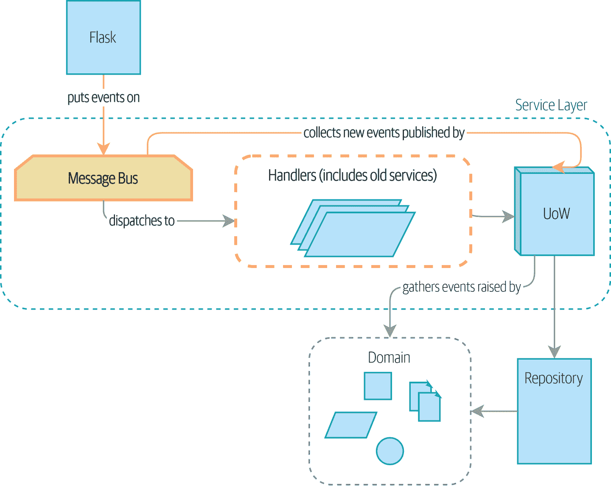
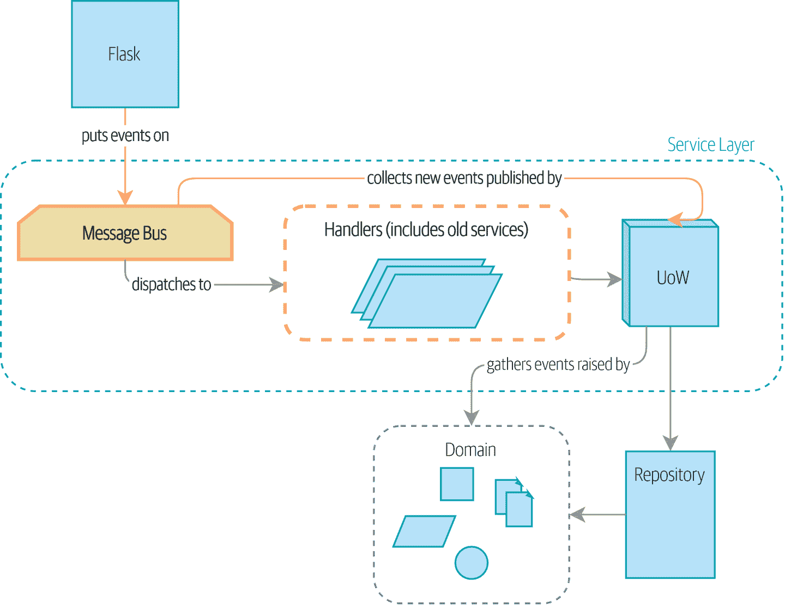
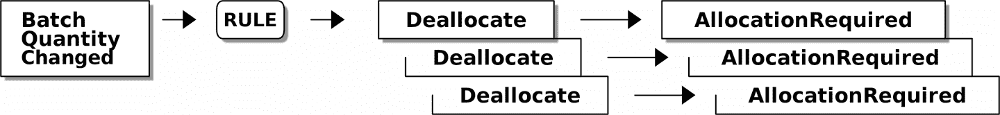
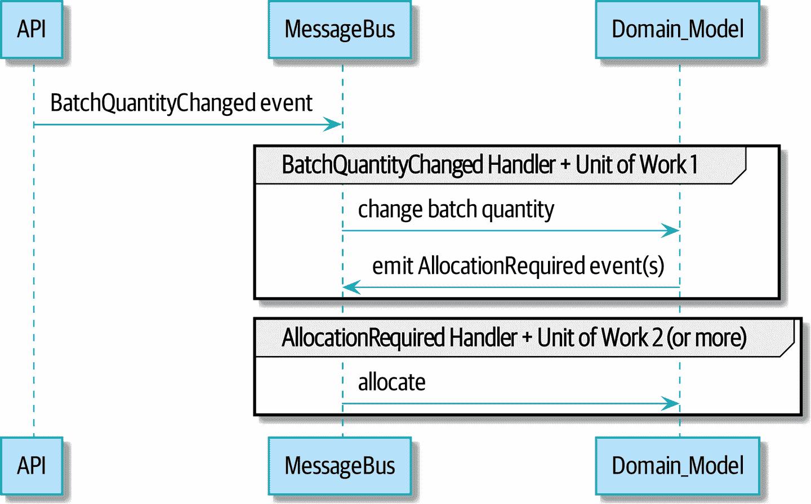

# 第九章：深入研究消息总线

> 原文：[9: Going to Town on the Message Bus](https://www.cosmicpython.com/book/chapter_09_all_messagebus.html)
> 
> 译者：[飞龙](https://github.com/wizardforcel)
> 
> 协议：[CC BY-NC-SA 4.0](https://creativecommons.org/licenses/by-nc-sa/4.0/)

在本章中，我们将开始使事件对我们应用程序的内部结构更加重要。我们将从图 9-1 中的当前状态开始，其中事件是一个可选的副作用…



###### 图 9-1：之前：消息总线是一个可选的附加组件

…到图 9-2 中的情况，所有内容都通过消息总线进行，我们的应用程序已经从根本上转变为消息处理器。



###### 图 9-2：消息总线现在是服务层的主要入口点

###### 提示

本章的代码在 GitHub 的 chapter_09_all_messagebus 分支中[查看](https://oreil.ly/oKNkn)：

```py
git clone https://github.com/cosmicpython/code.git
cd code
git checkout chapter_09_all_messagebus
# or to code along, checkout the previous chapter:
git checkout chapter_08_events_and_message_bus
```

# 一个新需求引领我们走向新的架构

Rich Hickey 谈到了*定位软件*，指的是长时间运行，管理真实世界流程的软件。例子包括仓库管理系统、物流调度器和工资系统。

这个软件很难编写，因为在现实世界的物理对象和不可靠的人类中经常发生意外。例如：

+   在盘点期间，我们发现三个`SPRINGY-MATTRESS`被漏水的屋顶水损坏了。

+   一批`RELIABLE-FORK`缺少所需的文件，并被海关扣押了几周。随后有三个`RELIABLE-FORK`未能通过安全测试并被销毁。

+   全球缎带短缺意味着我们无法制造下一批`SPARKLY-BOOKCASE`。

在这些情况下，我们了解到当批次已经在系统中时需要更改批次数量。也许有人在清单中弄错了数字，或者也许有些沙发从卡车上掉下来。在与业务的对话后，¹我们将情况建模为图 9-3 中的情况。



###### 图 9-3：批次数量更改意味着取消分配和重新分配

```py
[ditaa, apwp_0903]
+----------+    /----\      +------------+       +--------------------+
| Batch    |--> |RULE| -->  | Deallocate | ----> | AllocationRequired |
| Quantity |    \----/      +------------+-+     +--------------------+-+
| Changed  |                  | Deallocate | ----> | AllocationRequired |
+----------+                  +------------+-+     +--------------------+-+
                                | Deallocate | ----> | AllocationRequired |
                                +------------+       +--------------------+
```

我们将称之为`BatchQuantityChanged`的事件应该导致我们改变批次的数量，是的，但也要应用*业务规则*：如果新数量降到已分配的总数以下，我们需要从该批次*取消分配*这些订单。然后每个订单将需要新的分配，我们可以将其捕获为`AllocationRequired`事件。

也许你已经预料到我们的内部消息总线和事件可以帮助实现这一要求。我们可以定义一个名为`change_batch_quantity`的服务，它知道如何调整批次数量，还知道如何*取消分配*任何多余的订单行，然后每个取消分配可以发出一个`AllocationRequired`事件，可以在单独的事务中转发给现有的`allocate`服务。再一次，我们的消息总线帮助我们执行单一责任原则，并且它允许我们对事务和数据完整性做出选择。

## 想象一种架构变化：一切都将成为事件处理程序

但在我们着手之前，想想我们要走向何方。我们的系统有两种流程：

+   由服务层函数处理的 API 调用

+   内部事件（可能作为服务层函数的副作用引发）及其处理程序（反过来调用服务层函数）

如果一切都是事件处理程序，会不会更容易？如果我们重新思考我们的 API 调用作为捕获事件，服务层函数也可以成为事件处理程序，我们不再需要区分内部和外部事件处理程序：

+   `services.allocate()`可能是`AllocationRequired`事件的处理程序，并且可以发出`Allocated`事件作为其输出。

+   `services.add_batch()`可能是`BatchCreated`事件的处理程序。²

我们的新需求将符合相同的模式：

+   名为`BatchQuantityChanged`的事件可以调用名为`change_batch_quantity()`的处理程序。

+   它可能引发的新`AllocationRequired`事件也可以传递给`services.allocate()`，因此从 API 中产生的全新分配和内部由取消分配触发的重新分配之间没有概念上的区别。

听起来有点多？让我们逐渐朝着这个方向努力。我们将遵循[预备重构](https://oreil.ly/W3RZM)工作流程，又称“使变化变得容易；然后进行容易的变化”：

1.  我们将我们的服务层重构为事件处理程序。我们可以习惯于事件是描述系统输入的方式。特别是，现有的`services.allocate()`函数将成为名为`AllocationRequired`的事件的处理程序。

1.  我们构建了一个端到端测试，将`BatchQuantityChanged`事件放入系统，并查找输出的`Allocated`事件。

1.  我们的实现在概念上将非常简单：`BatchQuantityChanged`事件的新处理程序，其实现将发出`AllocationRequired`事件，然后将由 API 使用的分配的确切相同的处理程序处理。

在此过程中，我们将对消息总线和 UoW 进行小的调整，将将新事件放入消息总线的责任移到消息总线本身。

# 将服务函数重构为消息处理程序

我们首先定义了两个事件，捕捉我们当前的 API 输入——`AllocationRequired`和`BatchCreated`：

*BatchCreated 和 AllocationRequired 事件（`src/allocation/domain/events.py`）*

```py
@dataclass
class BatchCreated(Event):
    ref: str
    sku: str
    qty: int
    eta: Optional[date] = None

...

@dataclass
class AllocationRequired(Event):
    orderid: str
    sku: str
    qty: int
```

然后我们将*services.py*重命名为*handlers.py*；我们添加了`send_out_of_stock_notification`的现有消息处理程序；最重要的是，我们更改了所有处理程序，使它们具有相同的输入，即事件和 UoW：

*处理程序和服务是相同的东西（`src/allocation/service_layer/handlers.py`）*

```py
def add_batch(
        event: events.BatchCreated, uow: unit_of_work.AbstractUnitOfWork
):
    with uow:
        product = uow.products.get(sku=event.sku)
        ...

def allocate(
        event: events.AllocationRequired, uow: unit_of_work.AbstractUnitOfWork
) -> str:
    line = OrderLine(event.orderid, event.sku, event.qty)
    ...

def send_out_of_stock_notification(
        event: events.OutOfStock, uow: unit_of_work.AbstractUnitOfWork,
):
    email.send(
        'stock@made.com',
        f'Out of stock for {event.sku}',
    )
```

这个变化可能更清晰地显示为一个差异：

*从服务更改为处理程序（`src/allocation/service_layer/handlers.py`）*

```py
 def add_batch(
-        ref: str, sku: str, qty: int, eta: Optional[date],
-        uow: unit_of_work.AbstractUnitOfWork
+        event: events.BatchCreated, uow: unit_of_work.AbstractUnitOfWork
 ):
     with uow:
-        product = uow.products.get(sku=sku)
+        product = uow.products.get(sku=event.sku)
     ...

 def allocate(
-        orderid: str, sku: str, qty: int,
-        uow: unit_of_work.AbstractUnitOfWork
+        event: events.AllocationRequired, uow: unit_of_work.AbstractUnitOfWork
 ) -> str:
-    line = OrderLine(orderid, sku, qty)
+    line = OrderLine(event.orderid, event.sku, event.qty)
     ...

+
+def send_out_of_stock_notification(
+        event: events.OutOfStock, uow: unit_of_work.AbstractUnitOfWork,
+):
+    email.send(
     ...
```

在此过程中，我们使我们的服务层 API 更加结构化和一致。它曾经是一堆原语，现在使用了定义明确的对象（见下面的侧边栏）。

## 消息总线现在从 UoW 收集事件

我们的事件处理程序现在需要一个 UoW。此外，随着我们的消息总线变得更加核心于我们的应用程序，明智的做法是明确地负责收集和处理新事件。到目前为止，UoW 和消息总线之间存在一种循环依赖，因此这将使其成为单向：

*处理接受 UoW 并管理队列（`src/allocation/service_layer/messagebus.py`）*

```py
def handle(
    event: events.Event,
    uow: unit_of_work.AbstractUnitOfWork,  #(1)
):
    queue = [event]  #(2)
    while queue:
        event = queue.pop(0)  #(3)
        for handler in HANDLERS[type(event)]:  #(3)
            handler(event, uow=uow)  #(4)
            queue.extend(uow.collect_new_events())  #(5)
```

①

每次启动时，消息总线现在都会传递 UoW。

②

当我们开始处理我们的第一个事件时，我们启动一个队列。

③

我们从队列的前面弹出事件并调用它们的处理程序（`HANDLERS`字典没有改变；它仍将事件类型映射到处理程序函数）。

④

消息总线将 UoW 传递给每个处理程序。

⑤

每个处理程序完成后，我们收集生成的任何新事件，并将它们添加到队列中。

在*unit_of_work.py*中，`publish_events()`变成了一个不太活跃的方法，`collect_new_events()`：

*UoW 不再直接将事件放入总线（`src/allocation/service_layer/unit_of_work.py`）*

```py
-from . import messagebus  #(1)


 class AbstractUnitOfWork(abc.ABC):
@@ -22,13 +21,11 @@ class AbstractUnitOfWork(abc.ABC):

     def commit(self):
         self._commit()
-        self.publish_events()  #(2)

-    def publish_events(self):
+    def collect_new_events(self):
         for product in self.products.seen:
             while product.events:
-                event = product.events.pop(0)
-                messagebus.handle(event)
+                yield product.events.pop(0)  #(3)
```

①

`unit_of_work`模块现在不再依赖于`messagebus`。

②

我们不再自动在提交时`publish_events`。消息总线现在跟踪事件队列。

③

而 UoW 不再主动将事件放在消息总线上；它只是使它们可用。

## 我们的测试也都是以事件为基础编写的

我们的测试现在通过创建事件并将它们放在消息总线上来操作，而不是直接调用服务层函数：

*处理程序测试使用事件（`tests/unit/test_handlers.py`）*

```py
 class TestAddBatch:

     def test_for_new_product(self):
         uow = FakeUnitOfWork()
-        services.add_batch("b1", "CRUNCHY-ARMCHAIR", 100, None, uow)
+        messagebus.handle(
+            events.BatchCreated("b1", "CRUNCHY-ARMCHAIR", 100, None), uow
+        )
         assert uow.products.get("CRUNCHY-ARMCHAIR") is not None
         assert uow.committed

...

 class TestAllocate:

     def test_returns_allocation(self):
         uow = FakeUnitOfWork()
-        services.add_batch("batch1", "COMPLICATED-LAMP", 100, None, uow)
-        result = services.allocate("o1", "COMPLICATED-LAMP", 10, uow)
+        messagebus.handle(
+            events.BatchCreated("batch1", "COMPLICATED-LAMP", 100, None), uow
+        )
+        result = messagebus.handle(
+            events.AllocationRequired("o1", "COMPLICATED-LAMP", 10), uow
+        )
         assert result == "batch1"
```

## 临时丑陋的黑客：消息总线必须返回结果

我们的 API 和服务层目前希望在调用我们的`allocate()`处理程序时知道分配的批次参考。这意味着我们需要在我们的消息总线上进行临时修改，让它返回事件：

*消息总线返回结果（`src/allocation/service_layer/messagebus.py`）*

```py
 def handle(event: events.Event, uow: unit_of_work.AbstractUnitOfWork):
+    results = []
     queue = [event]
     while queue:
         event = queue.pop(0)
         for handler in HANDLERS[type(event)]:
-            handler(event, uow=uow)
+            results.append(handler(event, uow=uow))
             queue.extend(uow.collect_new_events())
+    return results
```

这是因为我们在系统中混合了读取和写入责任。我们将在第十二章中回来修复这个瑕疵。

## 修改我们的 API 以与事件配合使用

*Flask 将消息总线更改为差异（`src/allocation/entrypoints/flask_app.py`）*

```py
 @app.route("/allocate", methods=["POST"])
 def allocate_endpoint():
     try:
-        batchref = services.allocate(
-            request.json["orderid"],  #(1)
-            request.json["sku"],
-            request.json["qty"],
-            unit_of_work.SqlAlchemyUnitOfWork(),
+        event = events.AllocationRequired(  #(2)
+            request.json["orderid"], request.json["sku"], request.json["qty"]
         )
+        results = messagebus.handle(event, unit_of_work.SqlAlchemyUnitOfWork())  #(3)
+        batchref = results.pop(0)
     except InvalidSku as e:
```

①

而不是使用从请求 JSON 中提取的一堆基元调用服务层…

②

我们实例化一个事件。

③

然后我们将其传递给消息总线。

我们应该回到一个完全功能的应用程序，但现在是完全事件驱动的：

+   曾经是服务层函数现在是事件处理程序。

+   这使它们与我们的领域模型引发的内部事件处理的函数相同。

+   我们使用事件作为捕获系统输入的数据结构，以及内部工作包的交接。

+   整个应用现在最好被描述为消息处理器，或者如果您愿意的话，是事件处理器。我们将在[下一章](ch10.xhtml#chapter_10_commands)中讨论区别。

# 实施我们的新需求

我们已经完成了重构阶段。让我们看看我们是否真的“使变化变得容易”。让我们实施我们的新需求，如图 9-4 所示：我们将接收一些新的`BatchQuantityChanged`事件作为我们的输入，并将它们传递给一个处理程序，然后该处理程序可能会发出一些`AllocationRequired`事件，然后这些事件将返回到我们现有的重新分配处理程序。



###### 图 9-4：重新分配流程的序列图

```py
[plantuml, apwp_0904, config=plantuml.cfg]
@startuml
API -> MessageBus : BatchQuantityChanged event

group BatchQuantityChanged Handler + Unit of Work 1
    MessageBus -> Domain_Model : change batch quantity
    Domain_Model -> MessageBus : emit AllocationRequired event(s)
end

group AllocationRequired Handler + Unit of Work 2 (or more)
    MessageBus -> Domain_Model : allocate
end

@enduml
```

###### 警告

当您将这些事情分开到两个工作单元时，您现在有两个数据库事务，因此您会面临完整性问题：可能会发生某些事情，导致第一个事务完成，但第二个事务没有完成。您需要考虑这是否可以接受，以及是否需要注意它何时发生并采取措施。有关更多讨论，请参见[“Footguns”](afterword01.xhtml#footguns)。

## 我们的新事件

告诉我们批次数量已更改的事件很简单；它只需要批次参考和新数量：

*新事件（`src/allocation/domain/events.py`）*

```py
@dataclass
class BatchQuantityChanged(Event):
    ref: str
    qty: int
```

# 通过测试驱动新的处理程序

遵循第四章中学到的教训，我们可以以“高速”运行，并以事件为基础的最高抽象级别编写我们的单元测试。它们可能看起来像这样：

*处理程序测试用于 change_batch_quantity（`tests/unit/test_handlers.py`）*

```py
class TestChangeBatchQuantity:
    def test_changes_available_quantity(self):
        uow = FakeUnitOfWork()
        messagebus.handle(
            events.BatchCreated("batch1", "ADORABLE-SETTEE", 100, None), uow
        )
        [batch] = uow.products.get(sku="ADORABLE-SETTEE").batches
        assert batch.available_quantity == 100  #(1)

        messagebus.handle(events.BatchQuantityChanged("batch1", 50), uow)

        assert batch.available_quantity == 50  #(1)

    def test_reallocates_if_necessary(self):
        uow = FakeUnitOfWork()
        event_history = [
            events.BatchCreated("batch1", "INDIFFERENT-TABLE", 50, None),
            events.BatchCreated("batch2", "INDIFFERENT-TABLE", 50, date.today()),
            events.AllocationRequired("order1", "INDIFFERENT-TABLE", 20),
            events.AllocationRequired("order2", "INDIFFERENT-TABLE", 20),
        ]
        for e in event_history:
            messagebus.handle(e, uow)
        [batch1, batch2] = uow.products.get(sku="INDIFFERENT-TABLE").batches
        assert batch1.available_quantity == 10
        assert batch2.available_quantity == 50

        messagebus.handle(events.BatchQuantityChanged("batch1", 25), uow)

        # order1 or order2 will be deallocated, so we'll have 25 - 20
        assert batch1.available_quantity == 5  #(2)
        # and 20 will be reallocated to the next batch
        assert batch2.available_quantity == 30  #(2)
```

①

简单情况将非常容易实现；我们只需修改数量。

②

但是，如果我们尝试将数量更改为少于已分配的数量，我们将需要至少取消分配一个订单，并且我们期望重新分配到一个新批次。

## 实施

我们的新处理程序非常简单：

*处理程序委托给模型层（`src/allocation/service_layer/handlers.py`）*

```py
def change_batch_quantity(
        event: events.BatchQuantityChanged, uow: unit_of_work.AbstractUnitOfWork
):
    with uow:
        product = uow.products.get_by_batchref(batchref=event.ref)
        product.change_batch_quantity(ref=event.ref, qty=event.qty)
        uow.commit()
```

我们意识到我们将需要在我们的存储库上有一个新的查询类型：

*我们的存储库上有一个新的查询类型（`src/allocation/adapters/repository.py`）*

```py
class AbstractRepository(abc.ABC):
    ...

    def get(self, sku) -> model.Product:
        ...

    def get_by_batchref(self, batchref) -> model.Product:
        product = self._get_by_batchref(batchref)
        if product:
            self.seen.add(product)
        return product

    @abc.abstractmethod
    def _add(self, product: model.Product):
        raise NotImplementedError

    @abc.abstractmethod
    def _get(self, sku) -> model.Product:
        raise NotImplementedError

    @abc.abstractmethod
    def _get_by_batchref(self, batchref) -> model.Product:
        raise NotImplementedError
    ...

class SqlAlchemyRepository(AbstractRepository):
    ...

    def _get(self, sku):
        return self.session.query(model.Product).filter_by(sku=sku).first()

    def _get_by_batchref(self, batchref):
        return self.session.query(model.Product).join(model.Batch).filter(
            orm.batches.c.reference == batchref,
        ).first()
```

还有我们的`FakeRepository`：

*也更新了虚假存储库（`tests/unit/test_handlers.py`）*

```py
class FakeRepository(repository.AbstractRepository):
    ...

    def _get(self, sku):
        return next((p for p in self._products if p.sku == sku), None)

    def _get_by_batchref(self, batchref):
        return next((
            p for p in self._products for b in p.batches
            if b.reference == batchref
        ), None)
```

###### 注意

我们正在向我们的存储库添加一个查询，以使这个用例更容易实现。只要我们的查询返回单个聚合，我们就不会违反任何规则。如果你发现自己在存储库上编写复杂的查询，你可能需要考虑不同的设计。特别是像`get_most_popular_products`或`find_products_by_order_id`这样的方法肯定会触发我们的警觉。第十一章和[结语](afterword01.xhtml#epilogue_1_how_to_get_there_from_here)中有一些关于管理复杂查询的提示。

## 领域模型上的新方法

我们向模型添加了新的方法，该方法在内部进行数量更改和取消分配，并发布新事件。我们还修改了现有的分配函数以发布事件：

*我们的模型发展以满足新的需求（`src/allocation/domain/model.py`）*

```py
class Product:
    ...

    def change_batch_quantity(self, ref: str, qty: int):
        batch = next(b for b in self.batches if b.reference == ref)
        batch._purchased_quantity = qty
        while batch.available_quantity < 0:
            line = batch.deallocate_one()
            self.events.append(
                events.AllocationRequired(line.orderid, line.sku, line.qty)
            )
...

class Batch:
    ...

    def deallocate_one(self) -> OrderLine:
        return self._allocations.pop()
```

我们连接了我们的新处理程序：

*消息总线增长（`src/allocation/service_layer/messagebus.py`）*

```py
HANDLERS = {
    events.BatchCreated: [handlers.add_batch],
    events.BatchQuantityChanged: [handlers.change_batch_quantity],
    events.AllocationRequired: [handlers.allocate],
    events.OutOfStock: [handlers.send_out_of_stock_notification],

}  # type: Dict[Type[events.Event], List[Callable]]
```

而且我们的新需求已经完全实现了。

# 可选：使用虚假消息总线孤立地对事件处理程序进行单元测试

我们对重新分配工作流的主要测试是*边缘到边缘*（参见“测试驱动新处理程序”中的示例代码）。它使用真实的消息总线，并测试整个流程，其中`BatchQuantityChanged`事件处理程序触发取消分配，并发出新的`AllocationRequired`事件，然后由它们自己的处理程序处理。一个测试覆盖了一系列多个事件和处理程序。

根据您的事件链的复杂性，您可能会决定要对一些处理程序进行孤立测试。您可以使用“虚假”消息总线来实现这一点。

在我们的情况下，我们实际上通过修改`FakeUnitOfWork`上的`publish_events()`方法来进行干预，并将其与真实消息总线解耦，而是让它记录它看到的事件：

*在 UoW 中实现的虚假消息总线（`tests/unit/test_handlers.py`）*

```py
class FakeUnitOfWorkWithFakeMessageBus(FakeUnitOfWork):

    def __init__(self):
        super().__init__()
        self.events_published = []  # type: List[events.Event]

    def publish_events(self):
        for product in self.products.seen:
            while product.events:
                self.events_published.append(product.events.pop(0))
```

现在当我们使用`FakeUnitOfWorkWithFakeMessageBus`调用`messagebus.handle()`时，它只运行该事件的处理程序。因此，我们可以编写更加孤立的单元测试：不再检查所有的副作用，而是只检查`BatchQuantityChanged`是否导致已分配的总量下降到以下`AllocationRequired`：

*在孤立环境中测试重新分配（`tests/unit/test_handlers.py`）*

```py
def test_reallocates_if_necessary_isolated():
    uow = FakeUnitOfWorkWithFakeMessageBus()

    # test setup as before
    event_history = [
        events.BatchCreated("batch1", "INDIFFERENT-TABLE", 50, None),
        events.BatchCreated("batch2", "INDIFFERENT-TABLE", 50, date.today()),
        events.AllocationRequired("order1", "INDIFFERENT-TABLE", 20),
        events.AllocationRequired("order2", "INDIFFERENT-TABLE", 20),
    ]
    for e in event_history:
        messagebus.handle(e, uow)
    [batch1, batch2] = uow.products.get(sku="INDIFFERENT-TABLE").batches
    assert batch1.available_quantity == 10
    assert batch2.available_quantity == 50

    messagebus.handle(events.BatchQuantityChanged("batch1", 25), uow)

    # assert on new events emitted rather than downstream side-effects
    [reallocation_event] = uow.events_published
    assert isinstance(reallocation_event, events.AllocationRequired)
    assert reallocation_event.orderid in {'order1', 'order2'}
    assert reallocation_event.sku == 'INDIFFERENT-TABLE'
```

是否要这样做取决于您的事件链的复杂性。我们建议，首先进行边缘到边缘的测试，只有在必要时才使用这种方法。

# 总结

让我们回顾一下我们取得了什么成就，并思考为什么我们这样做。

## 我们取得了什么成就？

事件是简单的数据类，定义了我们系统中的输入和内部消息的数据结构。从 DDD 的角度来看，这是非常强大的，因为事件通常在业务语言中表达得非常好（如果你还没有了解*事件风暴*，请查阅）。

处理程序是我们对事件做出反应的方式。它们可以调用我们的模型或调用外部服务。如果需要，我们可以为单个事件定义多个处理程序。处理程序还可以触发其他事件。这使我们可以非常细粒度地控制处理程序的操作，并真正遵守 SRP。

## 我们取得了什么成就？

我们使用这些架构模式的持续目标是尝试使我们应用程序的复杂性增长速度比其大小慢。当我们全力投入消息总线时，我们总是在架构复杂性方面付出代价（参见表 9-1），但我们为自己购买了一种可以处理几乎任意复杂需求的模式，而无需对我们做事情的方式进行任何进一步的概念或架构变化。

在这里，我们增加了一个相当复杂的用例（更改数量，取消分配，启动新事务，重新分配，发布外部通知），但在架构上，复杂性没有成本。我们增加了新的事件，新的处理程序和一个新的外部适配器（用于电子邮件），所有这些都是我们架构中现有的*事物*类别，我们知道如何理解和推理，并且很容易向新手解释。我们的各个部分各自有一个工作，它们以明确定义的方式相互连接，没有意外的副作用。

表 9-1\. 整个应用程序是一个消息总线：权衡

| 优点 | 缺点 |
| --- | --- |
| 处理程序和服务是相同的，所以这更简单。 | 消息总线从 Web 的角度来看仍然是一种稍微不可预测的方式。您事先不知道什么时候会结束。 |
| 我们有一个很好的数据结构，用于系统的输入。 | 模型对象和事件之间将存在字段和结构的重复，这将产生维护成本。向一个对象添加字段通常意味着至少向另一个对象添加字段。  |


现在，您可能会想知道，那些`BatchQuantityChanged`事件将从哪里产生？答案将在几章后揭晓。但首先，让我们谈谈[事件与命令](ch10.xhtml#chapter_10_commands)。

¹ 基于事件的建模如此受欢迎，以至于出现了一种称为*事件风暴*的实践，用于促进基于事件的需求收集和领域模型阐述。

² 如果您对事件驱动架构有所了解，您可能会想，“其中一些事件听起来更像命令！” 请耐心等待！我们试图一次引入一个概念。在[下一章](ch10.xhtml#chapter_10_commands)中，我们将介绍命令和事件之间的区别。

³ 本章中的“简单”实现基本上使用*messagebus.py*模块本身来实现单例模式。
