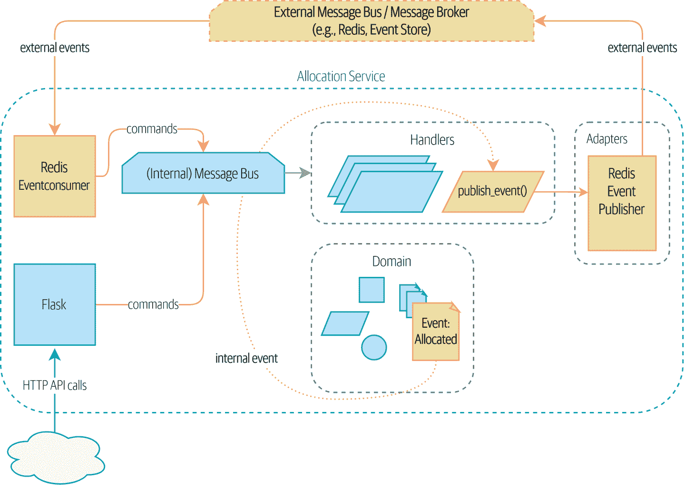
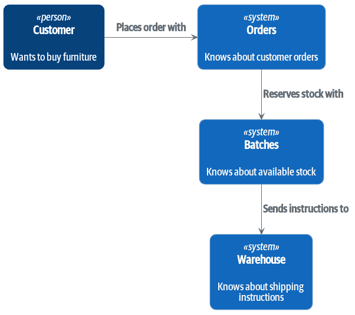
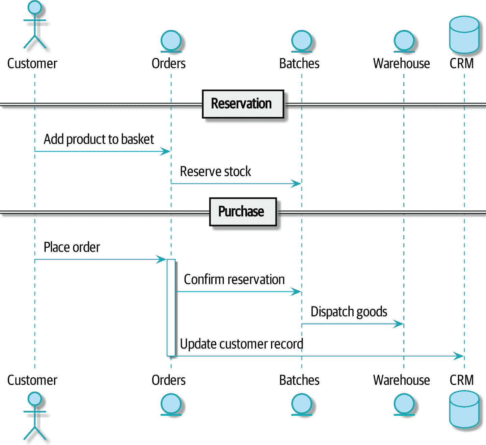
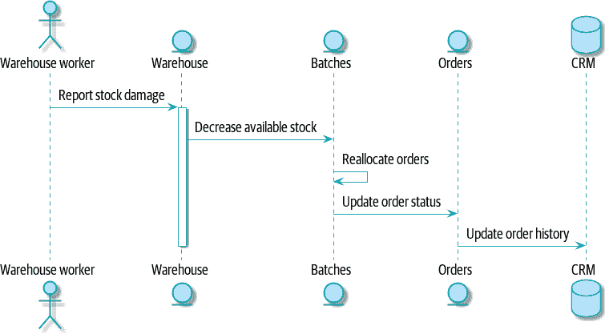
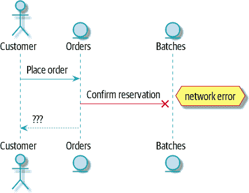
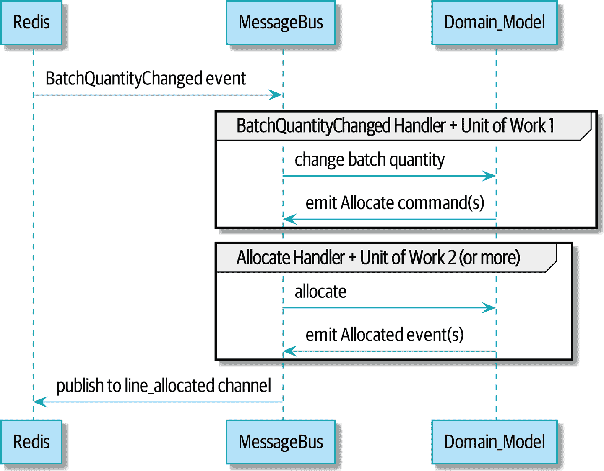

# 第十一章：事件驱动架构：使用事件集成微服务

> 原文：[11: Event-Driven Architecture: Using Events to Integrate Microservices](https://www.cosmicpython.com/book/chapter_11_external_events.html)
> 
> 译者：[飞龙](https://github.com/wizardforcel)
> 
> 协议：[CC BY-NC-SA 4.0](https://creativecommons.org/licenses/by-nc-sa/4.0/)

在前一章中，我们实际上从未讨论过我们将如何接收“批量数量更改”事件，或者如何通知外部世界有关重新分配的情况。

我们有一个带有 Web API 的微服务，但是如何与其他系统进行通信呢？如果，比如说，发货延迟或数量被修改，我们将如何知道？我们将如何告诉仓库系统已经分配了订单并需要发送给客户？

在本章中，我们想展示事件隐喻如何扩展到涵盖我们处理系统中的传入和传出消息的方式。在内部，我们应用的核心现在是一个消息处理器。让我们跟进，使其在*外部*也成为一个消息处理器。如图 11-1 所示，我们的应用将通过外部消息总线（我们将使用 Redis pub/sub 队列作为示例）从外部来源接收事件，并将其输出以事件的形式发布回去。



###### 图 11-1：我们的应用是一个消息处理器

###### 提示

本章的代码在 GitHub 的 chapter_11_external_events 分支中。[GitHub 链接](https://oreil.ly/UiwRS)

```py
git clone https://github.com/cosmicpython/code.git
cd code
git checkout chapter_11_external_events
# or to code along, checkout the previous chapter:
git checkout chapter_10_commands
```

# 分布式泥球和名词思维

在我们深入讨论之前，让我们谈谈其他选择。我们经常与试图构建微服务架构的工程师交谈。通常，他们正在从现有应用程序迁移，并且他们的第一反应是将系统拆分为*名词*。

到目前为止，我们在系统中引入了哪些名词？嗯，我们有库存批次、订单、产品和客户。因此，对系统进行天真的尝试可能看起来像图 11-2（请注意，我们将系统命名为一个名词，*Batches*，而不是*Allocation*）。



###### 图 11-2：基于名词的服务的上下文图

```py
[plantuml, apwp_1102, config=plantuml.cfg]
@startuml Batches Context Diagram
!include images/C4_Context.puml

System(batches, "Batches", "Knows about available stock")
Person(customer, "Customer", "Wants to buy furniture")
System(orders, "Orders", "Knows about customer orders")
System(warehouse, "Warehouse", "Knows about shipping instructions")

Rel_R(customer, orders, "Places order with")
Rel_D(orders, batches, "Reserves stock with")
Rel_D(batches, warehouse, "Sends instructions to")

@enduml
```

我们系统中的每个“东西”都有一个关联的服务，它公开了一个 HTTP API。

让我们通过图 11-3 中的一个示例顺畅流程来工作：我们的用户访问网站，可以从库存中选择产品。当他们将商品添加到购物篮时，我们将为他们保留一些库存。当订单完成时，我们确认预订，这会导致我们向仓库发送发货指示。我们还可以说，如果这是客户的第三个订单，我们希望更新客户记录以将其标记为 VIP。



###### 图 11-3：命令流程 1

```py
[plantuml, apwp_1103, config=plantuml.cfg]
@startuml

actor Customer
entity Orders
entity Batches
entity Warehouse
database CRM

== Reservation ==

  Customer -> Orders: Add product to basket
  Orders -> Batches: Reserve stock

== Purchase ==

  Customer -> Orders: Place order
  activate Orders
  Orders -> Batches: Confirm reservation
  Batches -> Warehouse: Dispatch goods
  Orders -> CRM: Update customer record
  deactivate Orders

@enduml
```

我们可以将这些步骤中的每一个都视为我们系统中的一个命令：`ReserveStock`、`ConfirmReservation`、`DispatchGoods`、`MakeCustomerVIP`等等。

这种架构风格，即我们为每个数据库表创建一个微服务，并将我们的 HTTP API 视为贫血模型的 CRUD 接口，是人们最常见的初始服务设计方法。

这对于非常简单的系统来说是*很好*的，但很快就会变成一个分布式的泥球。

为了理解原因，让我们考虑另一种情况。有时，当库存到达仓库时，我们发现货物在运输过程中受潮。我们无法出售受潮的沙发，因此我们不得不将它们丢弃并向合作伙伴请求更多库存。我们还需要更新我们的库存模型，这可能意味着我们需要重新分配客户的订单。

这个逻辑应该放在哪里？

嗯，仓库系统知道库存已经受损，所以也许它应该拥有这个过程，就像图 11-4 中所示的那样。



###### 图 11-4：命令流程 2

```py
[plantuml, apwp_1104, config=plantuml.cfg]
@startuml

actor w as "Warehouse worker"
entity Warehouse
entity Batches
entity Orders
database CRM

  w -> Warehouse: Report stock damage
  activate Warehouse
  Warehouse -> Batches: Decrease available stock
  Batches -> Batches: Reallocate orders
  Batches -> Orders: Update order status
  Orders -> CRM: Update order history
  deactivate Warehouse

@enduml
```

这种方法也可以，但现在我们的依赖图是一团糟。为了分配库存，订单服务驱动批次系统，批次系统驱动仓库；但为了处理仓库的问题，我们的仓库系统驱动批次，批次驱动订单。

将这种情况乘以我们需要提供的所有其他工作流程，你就会看到服务很快会变得混乱。

# 分布式系统中的错误处理

“事情会出错”是软件工程的普遍规律。当我们的请求失败时，我们的系统会发生什么？假设我们在为三个`MISBEGOTTEN-RUG`下订单后发生网络错误，如图 11-5 所示。

我们有两个选择：我们可以无论如何下订单并将其保留未分配，或者我们可以拒绝接受订单，因为无法保证分配。我们的批次服务的失败状态已经上升，并影响了我们订单服务的可靠性。

当两件事必须一起改变时，我们说它们是*耦合*的。我们可以将这种失败级联看作一种*时间耦合*：系统的每个部分都必须同时工作才能使系统的任何部分工作。随着系统变得越来越大，某个部分受损的可能性呈指数增长。



###### 图 11-5：带错误的命令流

```py
[plantuml, apwp_1105, config=plantuml.cfg]
@startuml

actor Customer
entity Orders
entity Batches

Customer -> Orders: Place order
Orders -[#red]x Batches: Confirm reservation
hnote right: network error
Orders --> Customer: ???

@enduml
```

# 另一种选择：使用异步消息进行时间解耦

我们如何获得适当的耦合？我们已经看到了部分答案，即我们应该从动词的角度思考，而不是名词。我们的领域模型是关于建模业务流程的。它不是关于一个静态事物的静态数据模型；它是一个动词的模型。

因此，我们不是考虑订单系统和批次系统，而是考虑*下订单*系统和*分配*系统，等等。

当我们以这种方式分离事物时，更容易看清哪个系统应该负责什么。在考虑*顺序*时，我们真的希望确保当我们下订单时，订单已经下了。其他事情可以*稍后*发生，只要它发生了。

###### 注意

如果这听起来很熟悉，那就对了！分离责任是我们设计聚合和命令时经历的相同过程。

像聚合一样，微服务应该是*一致性边界*。在两个服务之间，我们可以接受最终一致性，这意味着我们不需要依赖同步调用。每个服务都接受来自外部世界的命令，并引发事件来记录结果。其他服务可以监听这些事件来触发工作流程的下一步。

为了避免分布式泥球反模式，我们不想使用临时耦合的 HTTP API 调用，而是想要使用异步消息传递来集成我们的系统。我们希望我们的`BatchQuantityChanged`消息作为来自上游系统的外部消息传入，并且我们希望我们的系统发布`Allocated`事件供下游系统监听。

为什么这样做更好？首先，因为事情可以独立失败，处理降级行为更容易：如果分配系统出现问题，我们仍然可以接受订单。

其次，我们正在减少系统之间的耦合强度。如果我们需要改变操作顺序或者在流程中引入新步骤，我们可以在本地进行。

# 使用 Redis Pub/Sub 频道进行集成

让我们看看它将如何具体运作。我们需要某种方式将一个系统的事件传递到另一个系统，就像我们的消息总线一样，但是针对服务。这种基础设施通常被称为*消息代理*。消息代理的作用是接收发布者的消息并将其传递给订阅者。

在 MADE.com，我们使用[Event Store](https://eventstore.org)；Kafka 或 RabbitMQ 也是有效的替代方案。基于 Redis [pub/sub 频道](https://redis.io/topics/pubsub)的轻量级解决方案也可以很好地工作，因为 Redis 对大多数人来说更加熟悉，所以我们决定在本书中使用它。

###### 注意

我们忽略了选择正确的消息平台涉及的复杂性。像消息排序、故障处理和幂等性等问题都需要仔细考虑。有关一些建议，请参见[“Footguns”](afterword01.xhtml#footguns)。

我们的新流程将如下所示图 11-6：Redis 提供了`BatchQuantityChanged`事件，它启动了整个流程，并且我们的`Allocated`事件最终再次发布到 Redis。



###### 图 11-6：重新分配流程的序列图

```py
[plantuml, apwp_1106, config=plantuml.cfg]

@startuml

Redis -> MessageBus : BatchQuantityChanged event

group BatchQuantityChanged Handler + Unit of Work 1
    MessageBus -> Domain_Model : change batch quantity
    Domain_Model -> MessageBus : emit Allocate command(s)
end

group Allocate Handler + Unit of Work 2 (or more)
    MessageBus -> Domain_Model : allocate
    Domain_Model -> MessageBus : emit Allocated event(s)
end

MessageBus -> Redis : publish to line_allocated channel
@enduml
```

# 使用端到端测试来测试驱动所有内容

以下是我们可能如何开始端到端测试。我们可以使用我们现有的 API 创建批次，然后我们将测试入站和出站消息：

*我们的发布/订阅模型的端到端测试（`tests/e2e/test_external_events.py`）*

```py
def test_change_batch_quantity_leading_to_reallocation():
    # start with two batches and an order allocated to one of them  #(1)
    orderid, sku = random_orderid(), random_sku()
    earlier_batch, later_batch = random_batchref("old"), random_batchref("newer")
    api_client.post_to_add_batch(earlier_batch, sku, qty=10, eta="2011-01-01")  #(2)
    api_client.post_to_add_batch(later_batch, sku, qty=10, eta="2011-01-02")
    response = api_client.post_to_allocate(orderid, sku, 10)  #(2)
    assert response.json()["batchref"] == earlier_batch

    subscription = redis_client.subscribe_to("line_allocated")  #(3)

    # change quantity on allocated batch so it's less than our order  #(1)
    redis_client.publish_message(  #(3)
        "change_batch_quantity",
        {"batchref": earlier_batch, "qty": 5},
    )

    # wait until we see a message saying the order has been reallocated  #(1)
    messages = []
    for attempt in Retrying(stop=stop_after_delay(3), reraise=True):  #(4)
        with attempt:
            message = subscription.get_message(timeout=1)
            if message:
                messages.append(message)
                print(messages)
            data = json.loads(messages[-1]["data"])
            assert data["orderid"] == orderid
            assert data["batchref"] == later_batch
```

①

您可以从注释中阅读此测试中正在进行的操作的故事：我们希望向系统发送一个事件，导致订单行被重新分配，并且我们也看到该重新分配作为一个事件出现在 Redis 中。

②

`api_client`是一个小助手，我们对其进行了重构，以便在两种测试类型之间共享；它包装了我们对`requests.post`的调用。

③

`redis_client`是另一个小测试助手，其详细信息并不重要；它的工作是能够从各种 Redis 频道发送和接收消息。我们将使用一个名为`change_batch_quantity`的频道来发送我们的更改批次数量的请求，并且我们将监听另一个名为`line_allocated`的频道，以寻找预期的重新分配。

④

由于系统测试的异步性质，我们需要再次使用`tenacity`库添加重试循环 - 首先，因为我们的新的`line_allocated`消息可能需要一些时间才能到达，但也因为它不会是该频道上唯一的消息。

## Redis 是我们消息总线周围的另一个薄适配器

我们的 Redis 发布/订阅监听器（我们称其为*事件消费者*）非常类似于 Flask：它将外部世界转换为我们的事件：

*简单的 Redis 消息监听器（`src/allocation/entrypoints/redis_eventconsumer.py`）*

```py
r = redis.Redis(**config.get_redis_host_and_port())


def main():
    orm.start_mappers()
    pubsub = r.pubsub(ignore_subscribe_messages=True)
    pubsub.subscribe("change_batch_quantity")  #(1)

    for m in pubsub.listen():
        handle_change_batch_quantity(m)


def handle_change_batch_quantity(m):
    logging.debug("handling %s", m)
    data = json.loads(m["data"])  #(2)
    cmd = commands.ChangeBatchQuantity(ref=data["batchref"], qty=data["qty"])  #(2)
    messagebus.handle(cmd, uow=unit_of_work.SqlAlchemyUnitOfWork())
```

①

`main()`在加载时订阅了`change_batch_quantity`频道。

②

我们作为系统的入口点的主要工作是反序列化 JSON，将其转换为`Command`，并将其传递到服务层 - 就像 Flask 适配器一样。

我们还构建了一个新的下游适配器来执行相反的工作 - 将领域事件转换为公共事件：

*简单的 Redis 消息发布者（`src/allocation/adapters/redis_eventpublisher.py`）*

```py
r = redis.Redis(**config.get_redis_host_and_port())


def publish(channel, event: events.Event):  #(1)
    logging.debug("publishing: channel=%s, event=%s", channel, event)
    r.publish(channel, json.dumps(asdict(event)))
```

①

我们在这里采用了一个硬编码的频道，但您也可以存储事件类/名称与适当频道之间的映射，从而允许一个或多个消息类型发送到不同的频道。

## 我们的新出站事件

`Allocated`事件将如下所示：

*新事件（`src/allocation/domain/events.py`）*

```py
@dataclass
class Allocated(Event):
    orderid: str
    sku: str
    qty: int
    batchref: str
```

它捕获了我们需要了解的有关分配的一切内容：订单行的详细信息，以及它被分配到哪个批次。

我们将其添加到我们模型的`allocate()`方法中（自然地先添加了一个测试）：

产品分配()发出新事件来记录发生了什么（`src/allocation/domain/model.py`）

```py
class Product:
    ...
    def allocate(self, line: OrderLine) -> str:
        ...

            batch.allocate(line)
            self.version_number += 1
            self.events.append(events.Allocated(
                orderid=line.orderid, sku=line.sku, qty=line.qty,
                batchref=batch.reference,
            ))
            return batch.reference
```

`ChangeBatchQuantity`的处理程序已经存在，所以我们需要添加的是一个处理程序，用于发布出站事件：

*消息总线增长（`src/allocation/service_layer/messagebus.py`）*

```py
HANDLERS = {
    events.Allocated: [handlers.publish_allocated_event],
    events.OutOfStock: [handlers.send_out_of_stock_notification],
}  # type: Dict[Type[events.Event], List[Callable]]
```

发布事件使用我们从 Redis 包装器中的辅助函数：

*发布到 Redis（`src/allocation/service_layer/handlers.py`）*

```py
def publish_allocated_event(
        event: events.Allocated, uow: unit_of_work.AbstractUnitOfWork,
):
    redis_eventpublisher.publish('line_allocated', event)
```

# 内部与外部事件

清楚地保持内部和外部事件之间的区别是个好主意。一些事件可能来自外部，一些事件可能会升级并在外部发布，但并非所有事件都会这样。如果你涉足[事件溯源](https://oreil.ly/FXVil)（尽管这是另一本书的主题），这一点尤为重要。

###### 提示

出站事件是重要的应用验证的地方之一。参见附录 E 了解一些验证哲学和示例。

# 总结

事件可以来自外部，但也可以在外部发布——我们的`publish`处理程序将事件转换为 Redis 通道上的消息。我们使用事件与外部世界交流。这种时间解耦为我们的应用集成带来了很大的灵活性，但是，像往常一样，这是有代价的。

> 事件通知很好，因为它意味着低耦合，并且设置起来相当简单。然而，如果真的有一个在各种事件通知上运行的逻辑流，这可能会成为问题……很难看到这样的流，因为它在任何程序文本中都不是显式的……这可能会使调试和修改变得困难。
>
> ——Martin Fowler，[“你所说的‘事件驱动’是什么意思”](https://oreil.ly/uaPNt)

表 11-1 显示了一些需要考虑的权衡。

表 11-1. 基于事件的微服务集成：权衡

| 优点 | 缺点 |
| --- | --- |
| 避免分布式的大泥球。 | 信息的整体流更难以看到。 |
| 服务是解耦的：更容易更改单个服务并添加新服务。 | 最终一致性是一个新的概念来处理。 |
| | 消息可靠性和至少一次与至多一次交付的选择需要深思熟虑。 |

更一般地，如果你从同步消息传递模型转移到异步模型，你也会遇到一系列与消息可靠性和最终一致性有关的问题。继续阅读[“Footguns”](afterword01.xhtml#footguns)。
