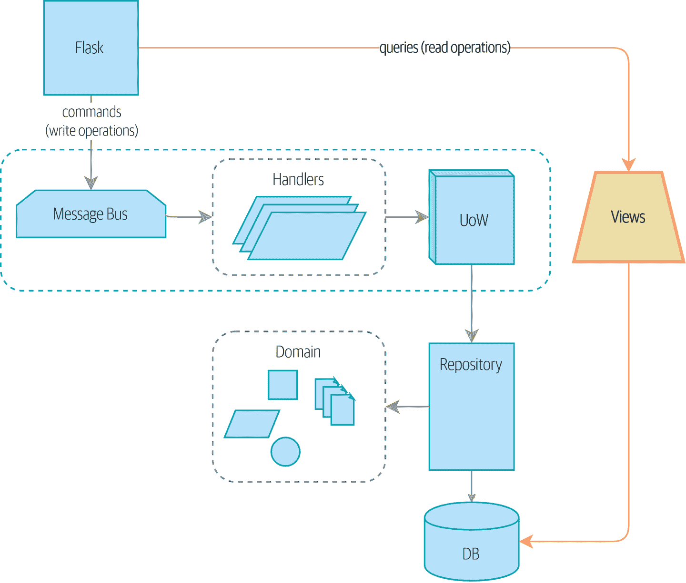
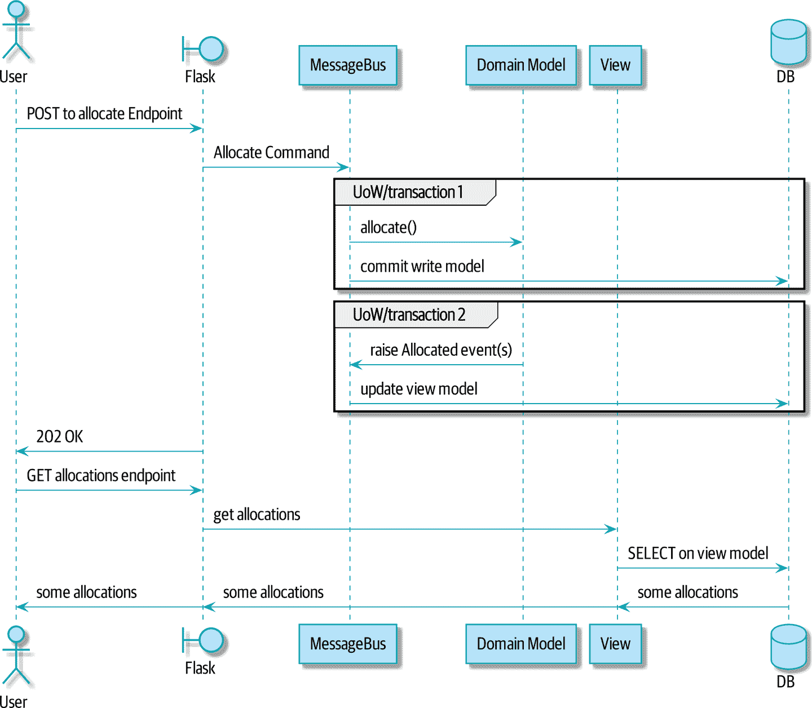

# 第十二章：命令-查询责任分离（CQRS）

> 原文：[12: Command-Query Responsibility Segregation (CQRS)](https://www.cosmicpython.com/book/chapter_12_cqrs.html)
> 
> 译者：[飞龙](https://github.com/wizardforcel)
> 
> 协议：[CC BY-NC-SA 4.0](https://creativecommons.org/licenses/by-nc-sa/4.0/)

在本章中，我们将从一个相当无争议的观点开始：读取（查询）和写入（命令）是不同的，因此它们应该被不同对待（或者说它们的责任应该被分开，如果你愿意的话）。然后我们将尽可能地推动这一观点。

如果你像哈利一样，起初这一切都会显得极端，但希望我们能够证明这并不是*完全*不合理。

图 12-1 显示了我们可能会达到的地方。

###### 提示

本章的代码位于 GitHub 的 chapter_12_cqrs 分支中（https://oreil.ly/YbWGT）。

```py
git clone https://github.com/cosmicpython/code.git
cd code
git checkout chapter_12_cqrs
# or to code along, checkout the previous chapter:
git checkout chapter_11_external_events
```

不过，首先，为什么要费这个劲呢？



###### 图 12-1\. 将读取与写入分开

# 领域模型是用于写入的

在本书中，我们花了很多时间讨论如何构建强制执行我们领域规则的软件。这些规则或约束对于每个应用程序都是不同的，它们构成了我们系统的有趣核心。

在本书中，我们已经明确规定了“你不能分配超过可用库存的库存”，以及“每个订单行都分配给一个批次”等隐含约束。

我们在书的开头将这些规则写成了单元测试：

我们的基本领域测试（`tests/unit/test_batches.py`）

```py
def test_allocating_to_a_batch_reduces_the_available_quantity():
    batch = Batch("batch-001", "SMALL-TABLE", qty=20, eta=date.today())
    line = OrderLine('order-ref', "SMALL-TABLE", 2)

    batch.allocate(line)

    assert batch.available_quantity == 18

...

def test_cannot_allocate_if_available_smaller_than_required():
    small_batch, large_line = make_batch_and_line("ELEGANT-LAMP", 2, 20)
    assert small_batch.can_allocate(large_line) is False
```

为了正确应用这些规则，我们需要确保操作是一致的，因此我们引入了*工作单元*和*聚合*等模式，这些模式帮助我们提交小块工作。

为了在这些小块之间传达变化，我们引入了领域事件模式，这样我们就可以编写规则，比如“当库存损坏或丢失时，调整批次上的可用数量，并在必要时重新分配订单。”

所有这些复杂性存在是为了在我们改变系统状态时强制执行规则。我们已经构建了一套灵活的工具来编写数据。

那么读取呢？

# 大多数用户不会购买你的家具

在 MADE.com，我们有一个与分配服务非常相似的系统。在繁忙的一天，我们可能每小时处理一百个订单，并且我们有一个庞大的系统来为这些订单分配库存。

然而，在同一忙碌的一天，我们可能每*秒*有一百次产品浏览。每当有人访问产品页面或产品列表页面时，我们都需要弄清产品是否仍有库存以及我们需要多长时间才能将其交付。

*领域*是相同的——我们关心库存批次、它们的到货日期以及仍然可用的数量——但访问模式却大不相同。例如，我们的客户不会注意到查询是否过时几秒钟，但如果我们的分配服务不一致，我们将搞乱他们的订单。我们可以利用这种差异，通过使我们的读取*最终一致*来使它们的性能更好。

我们可以将这些要求看作是系统的两个部分：读取端和写入端，如表 12-1 所示。

对于写入方面，我们的精密领域架构模式帮助我们随着时间的推移发展我们的系统，但到目前为止我们建立的复杂性对于读取数据并没有带来任何好处。服务层、工作单元和聪明的领域模型只是多余的。

表 12-1\. 读取与写入

|  | 读取端 | 写入端 |
| --- | --- | --- |
| 行为 | 简单读取 | 复杂业务逻辑 |
| 可缓存性 | 高度可缓存 | 不可缓存 |
| 一致性 | 可能过时 | 必须具有事务一致性 |

# Post/Redirect/Get 和 CQS

如果你从事 Web 开发，你可能熟悉 Post/Redirect/Get 模式。在这种技术中，Web 端点接受 HTTP POST 并响应重定向以查看结果。例如，我们可能接受 POST 到*/batches*来创建一个新批次，并将用户重定向到*/batches/123*来查看他们新创建的批次。

这种方法修复了当用户在浏览器中刷新结果页面或尝试将结果页面加为书签时出现的问题。在刷新的情况下，它可能导致我们的用户重复提交数据，从而购买两张沙发，而他们只需要一张。在书签的情况下，我们的不幸顾客将在尝试获取 POST 端点时得到一个损坏的页面。

这两个问题都是因为我们在响应写操作时返回数据。Post/Redirect/Get 通过将操作的读取和写入阶段分开来规避了这个问题。

这种技术是命令查询分离（CQS）的一个简单示例。在 CQS 中，我们遵循一个简单的规则：函数应该要么修改状态，要么回答问题，但不能两者兼而有之。这使得软件更容易推理：我们应该始终能够询问，“灯亮了吗？”而不用去拨动开关。

###### 注意

在构建 API 时，我们可以通过返回 201 Created 或 202 Accepted，并在 Location 标头中包含新资源的 URI 来应用相同的设计技术。这里重要的不是我们使用的状态代码，而是将工作逻辑上分为写入阶段和查询阶段。

正如你将看到的，我们可以使用 CQS 原则使我们的系统更快、更可扩展，但首先，让我们修复现有代码中的 CQS 违规。很久以前，我们引入了一个`allocate`端点，它接受一个订单并调用我们的服务层来分配一些库存。在调用结束时，我们返回一个 200 OK 和批次 ID。这导致了一些丑陋的设计缺陷，以便我们可以获得我们需要的数据。让我们将其更改为返回一个简单的 OK 消息，并提供一个新的只读端点来检索分配状态：

API 测试在 POST 之后进行 GET（`tests/e2e/test_api.py`）

```py
@pytest.mark.usefixtures('postgres_db')
@pytest.mark.usefixtures('restart_api')
def test_happy_path_returns_202_and_batch_is_allocated():
    orderid = random_orderid()
    sku, othersku = random_sku(), random_sku('other')
    earlybatch = random_batchref(1)
    laterbatch = random_batchref(2)
    otherbatch = random_batchref(3)
    api_client.post_to_add_batch(laterbatch, sku, 100, '2011-01-02')
    api_client.post_to_add_batch(earlybatch, sku, 100, '2011-01-01')
    api_client.post_to_add_batch(otherbatch, othersku, 100, None)

    r = api_client.post_to_allocate(orderid, sku, qty=3)
    assert r.status_code == 202

    r = api_client.get_allocation(orderid)
    assert r.ok
    assert r.json() == [
        {'sku': sku, 'batchref': earlybatch},
    ]

@pytest.mark.usefixtures('postgres_db')
@pytest.mark.usefixtures('restart_api')
def test_unhappy_path_returns_400_and_error_message():
    unknown_sku, orderid = random_sku(), random_orderid()
    r = api_client.post_to_allocate(
        orderid, unknown_sku, qty=20, expect_success=False,
    )
    assert r.status_code == 400
    assert r.json()['message'] == f'Invalid sku {unknown_sku}'

    r = api_client.get_allocation(orderid)
    assert r.status_code == 404
```

好的，Flask 应用可能是什么样子？

*用于查看分配的端点 (`src/allocation/entrypoints/flask_app.py`)*

```py
from allocation import views
...

@app.route("/allocations/<orderid>", methods=["GET"])
def allocations_view_endpoint(orderid):
    uow = unit_of_work.SqlAlchemyUnitOfWork()
    result = views.allocations(orderid, uow)  #(1)
    if not result:
        return "not found", 404
    return jsonify(result), 200
```

①

好吧，*views.py*，可以，我们可以将只读内容放在那里，它将是一个真正的*views.py*，不像 Django 的那样，它知道如何构建我们数据的只读视图…

# 坚持住你的午餐，伙计们

嗯，我们可能只需向我们现有的存储库对象添加一个列表方法： 

*Views do…raw SQL? (src/allocation/views.py)*

```py
from allocation.service_layer import unit_of_work

def allocations(orderid: str, uow: unit_of_work.SqlAlchemyUnitOfWork):
    with uow:
        results = list(uow.session.execute(
            'SELECT ol.sku, b.reference'
            ' FROM allocations AS a'
            ' JOIN batches AS b ON a.batch_id = b.id'
            ' JOIN order_lines AS ol ON a.orderline_id = ol.id'
            ' WHERE ol.orderid = :orderid',
            dict(orderid=orderid)
        ))
    return [{'sku': sku, 'batchref': batchref} for sku, batchref in results]
```

“对不起？原始 SQL？”

如果你像哈里第一次遇到这种模式一样，你会想知道鲍勃到底在抽什么烟。我们现在自己手动编写 SQL，并直接将数据库行转换为字典？在构建一个漂亮的领域模型时，我们付出了那么多的努力？存储库模式呢？它不是应该是我们围绕数据库的抽象吗？为什么我们不重用它？

好吧，让我们先探索这个看似更简单的替代方案，看看它在实践中是什么样子。

我们仍将保留我们的视图在一个单独的*views.py*模块中；在应用程序中强制执行读取和写入之间的明确区分仍然是一个好主意。我们应用命令查询分离，很容易看出哪些代码修改了状态（事件处理程序），哪些代码只是检索只读状态（视图）。

###### 提示

将只读视图与修改状态的命令和事件处理程序分离出来可能是一个好主意，即使你不想完全实现 CQRS。

# 测试 CQRS 视图

在探索各种选项之前，让我们先谈谈测试。无论你决定采用哪种方法，你可能至少需要一个集成测试。就像这样：

*用于视图的集成测试 (`tests/integration/test_views.py`)*

```py
def test_allocations_view(sqlite_session_factory):
    uow = unit_of_work.SqlAlchemyUnitOfWork(sqlite_session_factory)
    messagebus.handle(commands.CreateBatch("sku1batch", "sku1", 50, None), uow)  #(1)
    messagebus.handle(commands.CreateBatch("sku2batch", "sku2", 50, today), uow)
    messagebus.handle(commands.Allocate("order1", "sku1", 20), uow)
    messagebus.handle(commands.Allocate("order1", "sku2", 20), uow)
    # add a spurious batch and order to make sure we're getting the right ones
    messagebus.handle(commands.CreateBatch("sku1batch-later", "sku1", 50, today), uow)
    messagebus.handle(commands.Allocate("otherorder", "sku1", 30), uow)
    messagebus.handle(commands.Allocate("otherorder", "sku2", 10), uow)

    assert views.allocations("order1", uow) == [
        {"sku": "sku1", "batchref": "sku1batch"},
        {"sku": "sku2", "batchref": "sku2batch"},
    ]
```

①

我们通过使用应用程序的公共入口点——消息总线来设置集成测试的环境。这样可以使我们的测试与任何关于如何存储事物的实现/基础设施细节解耦。

# “显而易见”的替代方案 1：使用现有存储库

我们如何向我们的`products`存储库添加一个辅助方法呢？

*一个使用存储库的简单视图（`src/allocation/views.py`）*

```py
from allocation import unit_of_work

def allocations(orderid: str, uow: unit_of_work.AbstractUnitOfWork):
    with uow:
        products = uow.products.for_order(orderid=orderid)  #(1)
        batches = [b for p in products for b in p.batches]  #(2)
        return [
            {'sku': b.sku, 'batchref': b.reference}
            for b in batches
            if orderid in b.orderids  #(3)
        ]
```

①

我们的存储库返回`Product`对象，我们需要为给定订单中的 SKU 找到所有产品，因此我们将在存储库上构建一个名为`.for_order()`的新辅助方法。

②

现在我们有产品，但实际上我们想要批次引用，因此我们使用列表推导式获取所有可能的批次。

③

我们再次进行过滤，以获取我们特定订单的批次。这又依赖于我们的`Batch`对象能够告诉我们它已分配了哪些订单 ID。

我们使用`.orderid`属性来实现最后一个：

*我们模型上一个可以说是不必要的属性（`src/allocation/domain/model.py`）*

```py
class Batch:
    ...

    @property
    def orderids(self):
        return {l.orderid for l in self._allocations}
```

您可以开始看到，重用我们现有的存储库和领域模型类并不像您可能认为的那样简单。我们不得不向两者都添加新的辅助方法，并且我们在 Python 中进行了大量的循环和过滤，而这些工作在数据库中可以更有效地完成。

所以是的，好的一面是我们在重用现有的抽象，但坏的一面是，这一切都感觉非常笨拙。

# 您的领域模型并非针对读操作进行了优化

我们在这里看到的是，领域模型主要设计用于写操作，而我们对读取的需求在概念上通常是完全不同的。

这是下巴抚摸式架构师对 CQRS 的辩解。正如我们之前所说，领域模型不是数据模型——我们试图捕捉业务的运作方式：工作流程，状态变化规则，交换的消息；对系统如何对外部事件和用户输入做出反应的关注。*这些大部分内容对只读操作来说是完全无关紧要的*。

###### 提示

这种对 CQRS 的辩解与对领域模型模式的辩解有关。如果您正在构建一个简单的 CRUD 应用程序，读取和写入将是密切相关的，因此您不需要领域模型或 CQRS。但是，您的领域越复杂，您就越有可能需要两者。

为了做出一个肤浅的观点，您的领域类将有多个修改状态的方法，而您对只读操作不需要其中任何一个。

随着领域模型的复杂性增加，您将发现自己需要做出越来越多关于如何构建该模型的选择，这使得它对于读操作变得越来越笨拙。

# “显而易见”的备选方案 2：使用 ORM

您可能会想，好吧，如果我们的存储库很笨拙，与`Products`一起工作也很笨拙，那么至少我可以使用我的 ORM 并与`Batches`一起工作。这就是它的用途！

*一个使用 ORM 的简单视图（`src/allocation/views.py`）*

```py
from allocation import unit_of_work, model

def allocations(orderid: str, uow: unit_of_work.AbstractUnitOfWork):
    with uow:
        batches = uow.session.query(model.Batch).join(
            model.OrderLine, model.Batch._allocations
        ).filter(
            model.OrderLine.orderid == orderid
        )
        return [
            {'sku': b.sku, 'batchref': b.batchref}
            for b in batches
        ]
```

但是，与代码示例中的原始 SQL 版本相比，这样写或理解起来是否*实际上*更容易呢？在上面看起来可能还不错，但我们可以告诉您，这花了好几次尝试，以及大量查阅 SQLAlchemy 文档。SQL 就是 SQL。

但 ORM 也可能使我们面临性能问题。

# SELECT N+1 和其他性能考虑

所谓的[`SELECT N+1`](https://oreil.ly/OkBOS)问题是 ORM 的常见性能问题：当检索对象列表时，您的 ORM 通常会执行初始查询，例如，获取它所需对象的所有 ID，然后为每个对象发出单独的查询以检索它们的属性。如果您的对象上有任何外键关系，这种情况尤其可能发生。

###### 注意

公平地说，我们应该说 SQLAlchemy 在避免`SELECT N+1`问题方面做得相当不错。它在前面的示例中没有显示出来，而且当处理连接的对象时，您可以显式请求[急切加载](https://oreil.ly/XKDDm)以避免这种问题。

除了`SELECT N+1`，您可能还有其他原因希望将状态更改的持久化方式与检索当前状态的方式解耦。一组完全规范化的关系表是确保写操作永远不会导致数据损坏的好方法。但是，使用大量连接来检索数据可能会很慢。在这种情况下，通常会添加一些非规范化的视图，构建读取副本，甚至添加缓存层。

# 完全跳进大白鲨的时间

在这一点上：我们是否已经说服您，我们的原始 SQL 版本并不像最初看起来那么奇怪？也许我们是夸大其词了？等着瞧吧。

因此，无论合理与否，那个硬编码的 SQL 查询都相当丑陋，对吧？如果我们让它更好……

*一个更好的查询（`src/allocation/views.py`）*

```py
def allocations(orderid: str, uow: unit_of_work.SqlAlchemyUnitOfWork):
    with uow:
        results = list(uow.session.execute(
            'SELECT sku, batchref FROM allocations_view WHERE orderid = :orderid',
            dict(orderid=orderid)
        ))
        ...
```

…通过*保持一个完全独立的、非规范化的数据存储来构建我们的视图模型*？

*嘿嘿嘿，没有外键，只有字符串，YOLO（`src/allocation/adapters/orm.py`）*

```py
allocations_view = Table(
    'allocations_view', metadata,
    Column('orderid', String(255)),
    Column('sku', String(255)),
    Column('batchref', String(255)),
)
```

好吧，更好看的 SQL 查询不会成为任何事情的理由，但是一旦您达到了使用索引的极限，构建一个针对读操作进行优化的非规范化数据的副本并不罕见。

即使使用调整良好的索引，关系数据库在执行连接时会使用大量 CPU。最快的查询将始终是`SELECT * from *mytable* WHERE *key* = :*value*`。

然而，这种方法不仅仅是为了提高速度，而是为了扩展规模。当我们向关系数据库写入数据时，我们需要确保我们在更改的行上获得锁定，以免出现一致性问题。

如果多个客户端同时更改数据，我们将出现奇怪的竞争条件。然而，当我们*读取*数据时，可以同时执行的客户端数量是没有限制的。因此，只读存储可以进行水平扩展。

###### 提示

由于读取副本可能不一致，我们可以拥有无限数量的读取副本。如果您正在努力扩展具有复杂数据存储的系统，请问您是否可以构建一个更简单的读模型。

保持读模型的最新状态是挑战！数据库视图（实体化或其他）和触发器是常见的解决方案，但这将限制您在数据库中的操作。我们想向您展示如何重用我们的事件驱动架构。

## 使用事件处理程序更新读模型表

我们在`Allocated`事件上添加了第二个处理程序：

*Allocated 事件获得了一个新的处理程序（`src/allocation/service_layer/messagebus.py`）*

```py
EVENT_HANDLERS = {
    events.Allocated: [
        handlers.publish_allocated_event,
        handlers.add_allocation_to_read_model
    ],
```

我们的更新视图模型代码如下：

*更新分配（`src/allocation/service_layer/handlers.py`）*

```py
def add_allocation_to_read_model(
        event: events.Allocated, uow: unit_of_work.SqlAlchemyUnitOfWork,
):
    with uow:
        uow.session.execute(
            'INSERT INTO allocations_view (orderid, sku, batchref)'
            ' VALUES (:orderid, :sku, :batchref)',
            dict(orderid=event.orderid, sku=event.sku, batchref=event.batchref)
        )
        uow.commit()
```

信不信由你，这基本上会起作用！*而且它将与我们的其他选项的完全相同的集成测试一起工作。*

好吧，您还需要处理`Deallocated`：

*读模型更新的第二个监听器*

```py
events.Deallocated: [
    handlers.remove_allocation_from_read_model,
    handlers.reallocate
],

...

def remove_allocation_from_read_model(
        event: events.Deallocated, uow: unit_of_work.SqlAlchemyUnitOfWork,
):
    with uow:
        uow.session.execute(
            'DELETE FROM allocations_view '
            ' WHERE orderid = :orderid AND sku = :sku',
```

图 12-2 显示了两个请求之间的流程。



###### 图 12-2\. 读模型的序列图

```py
[plantuml, apwp_1202, config=plantuml.cfg]
@startuml
actor User order 1
boundary Flask order 2
participant MessageBus order 3
participant "Domain Model" as Domain order 4
participant View order 9
database DB order 10

User -> Flask: POST to allocate Endpoint
Flask -> MessageBus : Allocate Command

group UoW/transaction 1
    MessageBus -> Domain : allocate()
    MessageBus -> DB: commit write model
end

group UoW/transaction 2
    Domain -> MessageBus : raise Allocated event(s)
    MessageBus -> DB : update view model
end

Flask -> User: 202 OK

User -> Flask: GET allocations endpoint
Flask -> View: get allocations
View -> DB: SELECT on view model
DB -> View: some allocations
View -> Flask: some allocations
Flask -> User: some allocations

@enduml
```

在图 12-2 中，您可以看到在 POST/write 操作中有两个事务，一个用于更新写模型，另一个用于更新读模型，GET/read 操作可以使用。

# 更改我们的读模型实现很容易

让我们通过看看我们的事件驱动模型在实际中带来的灵活性，来看看如果我们决定使用完全独立的存储引擎 Redis 来实现读模型会发生什么。

只需观看：

*处理程序更新 Redis 读模型（`src/allocation/service_layer/handlers.py`）*

```py
def add_allocation_to_read_model(event: events.Allocated, _):
    redis_eventpublisher.update_readmodel(event.orderid, event.sku, event.batchref)

def remove_allocation_from_read_model(event: events.Deallocated, _):
    redis_eventpublisher.update_readmodel(event.orderid, event.sku, None)
```

我们 Redis 模块中的辅助程序只有一行代码：

*Redis 读模型读取和更新（`src/allocation/adapters/redis_eventpublisher.py`）*

```py
def update_readmodel(orderid, sku, batchref):
    r.hset(orderid, sku, batchref)

def get_readmodel(orderid):
    return r.hgetall(orderid)
```

（也许现在*redis_eventpublisher.py*的名称有点不准确，但您明白我的意思。）

而且视图本身也略有变化，以适应其新的后端：

*适应 Redis 的视图（`src/allocation/views.py`）*

```py
def allocations(orderid):
    batches = redis_eventpublisher.get_readmodel(orderid)
    return [
        {'batchref': b.decode(), 'sku': s.decode()}
        for s, b in batches.items()
    ]
```

而且，我们之前编写的*完全相同*的集成测试仍然通过，因为它们是以与实现解耦的抽象级别编写的：设置将消息放入消息总线，断言针对我们的视图。

###### 提示

如果您决定需要，事件处理程序是管理对读模型的更新的好方法。它们还可以轻松地在以后更改该读模型的实现。

# 总结

表 12-2 提出了我们各种选项的一些利弊。

事实上，MADE.com 的分配服务确实使用了“全面的”CQRS，在 Redis 中存储了一个读模型，甚至还提供了由 Varnish 提供的第二层缓存。但其用例与我们在这里展示的情况相当不同。对于我们正在构建的分配服务，似乎不太可能需要使用单独的读模型和事件处理程序进行更新。

但随着您的领域模型变得更加丰富和复杂，简化的读模型变得更加引人注目。

表 12-2。各种视图模型选项的权衡

| 选项 | 优点 | 缺点 |
| --- | --- | --- |
| 只使用存储库 | 简单、一致的方法。 | 预期在复杂的查询模式中出现性能问题。 |
| 使用 ORM 自定义查询 | 允许重用 DB 配置和模型定义。 | 添加另一种具有自己怪癖和语法的查询语言。 |
| 使用手动编写的 SQL | 通过标准查询语法可以对性能进行精细控制。 | 必须对手动编写的查询和 ORM 定义进行数据库模式更改。高度规范化的模式可能仍然存在性能限制。 |
| 使用事件创建单独的读取存储 | 只读副本易于扩展。在数据更改时可以构建视图，以使查询尽可能简单。 | 复杂的技术。哈里将永远怀疑你的品味和动机。 |

通常，您的读操作将作用于与写模型相同的概念对象，因此可以使用 ORM，在存储库中添加一些读取方法，并对读取操作使用领域模型类*非常好*。

在我们的书例中，读操作涉及的概念实体与我们的领域模型非常不同。分配服务以单个 SKU 的“批次”为单位思考，但用户关心的是整个订单的分配，包括多个 SKU，因此使用 ORM 最终有点尴尬。我们可能会倾向于选择我们在本章开头展示的原始 SQL 视图。

在这一点上，让我们继续进入我们的最后一章。
