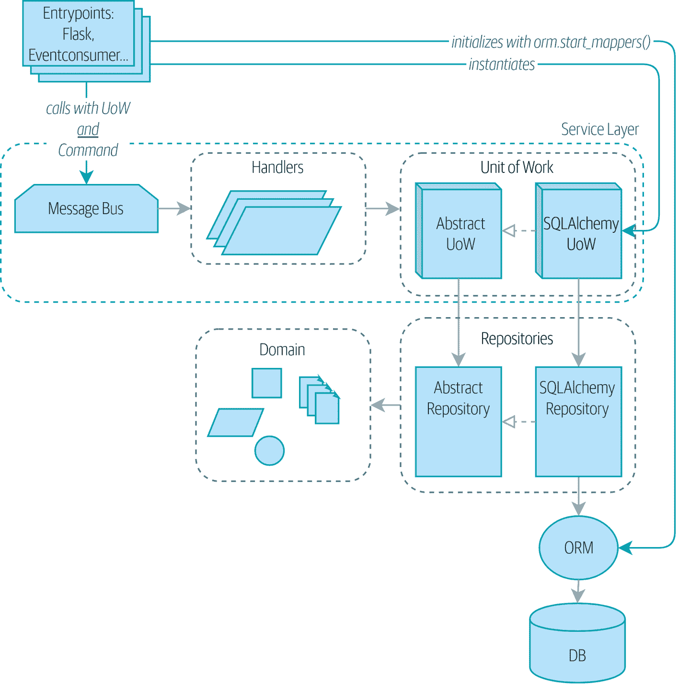
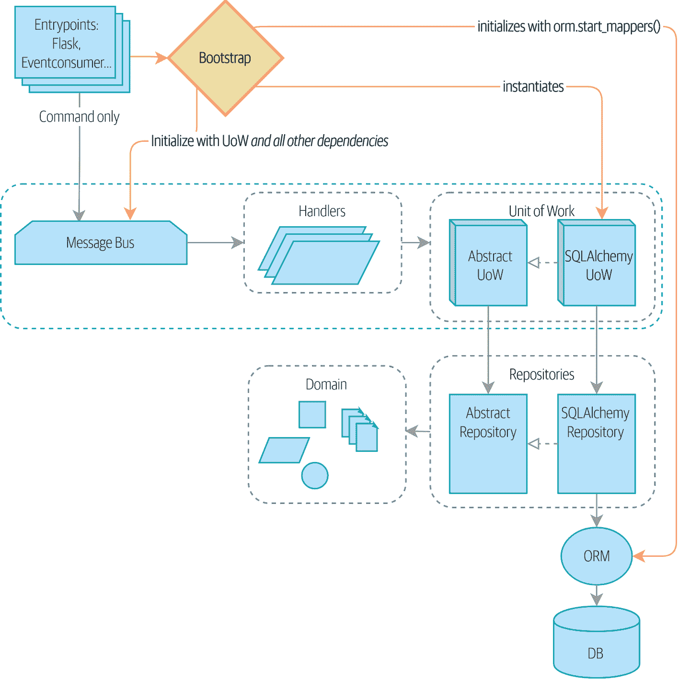
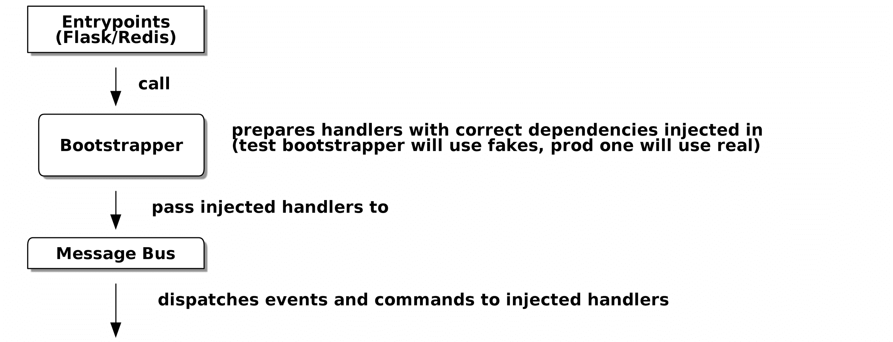

# 第十三章：依赖注入（和引导）

> 原文：[13: Dependency Injection (and Bootstrapping)](https://www.cosmicpython.com/book/chapter_13_dependency_injection.html)
> 
> 译者：[飞龙](https://github.com/wizardforcel)
> 
> 协议：[CC BY-NC-SA 4.0](https://creativecommons.org/licenses/by-nc-sa/4.0/)

依赖注入（DI）在 Python 世界中备受怀疑。迄今为止，我们在本书的示例代码中一直*很好*地没有使用它！

在本章中，我们将探讨代码中的一些痛点，这些痛点导致我们考虑使用 DI，并提出一些如何实现它的选项，让您选择最符合 Python 风格的方式。

我们还将向我们的架构添加一个名为*bootstrap.py*的新组件；它将负责依赖注入，以及我们经常需要的一些其他初始化工作。我们将解释为什么这种东西在面向对象语言中被称为*组合根*，以及为什么*引导脚本*对我们的目的来说是完全合适的。

图 13-1 显示了我们的应用程序在没有引导程序的情况下的样子：入口点做了很多初始化和传递我们的主要依赖项 UoW。

###### 提示

如果您还没有这样做，建议在继续本章之前阅读第三章，特别是功能与面向对象依赖管理的讨论。



###### 图 13-1：没有引导：入口点做了很多事情

###### 提示

本章的代码位于 GitHub 上的 chapter_13_dependency_injection 分支中[（https://oreil.ly/-B7e6）](https://oreil.ly/-B7e6)：

```py
git clone https://github.com/cosmicpython/code.git
cd code
git checkout chapter_13_dependency_injection
# or to code along, checkout the previous chapter:
git checkout chapter_12_cqrs
```

图 13-2 显示了我们的引导程序接管了这些责任。



###### 图 13-2：引导程序在一个地方处理所有这些

# 隐式依赖与显式依赖

根据您特定的大脑类型，您可能在心中略感不安。让我们把它公开化。我们向您展示了两种管理依赖项并对其进行测试的方式。

对于我们的数据库依赖，我们建立了一个明确的依赖关系框架，并提供了易于在测试中覆盖的选项。我们的主处理程序函数声明了对 UoW 的明确依赖：

*我们的处理程序对 UoW 有明确的依赖（`src/allocation/service_layer/handlers.py`）*

```py
def allocate(
        cmd: commands.Allocate, uow: unit_of_work.AbstractUnitOfWork
):
```

这使得在我们的服务层测试中轻松替换虚假 UoW 成为可能：

*针对虚假 UoW 的服务层测试：（`tests/unit/test_services.py`）*

```py
    uow = FakeUnitOfWork()
    messagebus.handle([...], uow)
```

UoW 本身声明了对会话工厂的明确依赖：

*UoW 依赖于会话工厂（`src/allocation/service_layer/unit_of_work.py`）*

```py
class SqlAlchemyUnitOfWork(AbstractUnitOfWork):

    def __init__(self, session_factory=DEFAULT_SESSION_FACTORY):
        self.session_factory = session_factory
        ...
```

我们利用它在我们的集成测试中，有时可以使用 SQLite 而不是 Postgres：

*针对不同数据库的集成测试（`tests/integration/test_uow.py`）*

```py
def test_rolls_back_uncommitted_work_by_default(sqlite_session_factory):
    uow = unit_of_work.SqlAlchemyUnitOfWork(sqlite_session_factory)  #(1)
```

①

集成测试将默认的 Postgres `session_factory`替换为 SQLite。

# 显式依赖完全奇怪和 Java 风格吗？

如果您习惯于 Python 中通常发生的事情，您可能会觉得这有点奇怪。标准做法是通过简单导入隐式声明我们的依赖，然后如果我们需要在测试中更改它，我们可以进行 monkeypatch，这在动态语言中是正确和正确的：

*电子邮件发送作为正常的基于导入的依赖（`src/allocation/service_layer/handlers.py`）*

```py
from allocation.adapters import email, redis_eventpublisher  #(1)
...

def send_out_of_stock_notification(
    event: events.OutOfStock,
    uow: unit_of_work.AbstractUnitOfWork,
):
    email.send(  #(2)
        "stock@made.com",
        f"Out of stock for {event.sku}",
    )
```

①

硬编码导入

②

直接调用特定的电子邮件发送器

为了我们的测试，为什么要用不必要的参数污染我们的应用程序代码？`mock.patch`使得 monkeypatch 变得简单而容易：

*模拟点补丁，谢谢 Michael Foord（`tests/unit/test_handlers.py`）*

```py
    with mock.patch("allocation.adapters.email.send") as mock_send_mail:
        ...
```

问题在于，我们让它看起来很容易，因为我们的玩具示例不发送真正的电子邮件（`email.send_mail`只是`print`），但在现实生活中，您最终将不得不为*每个可能引起缺货通知的测试*调用`mock.patch`。如果您曾经在大量使用模拟以防止不需要的副作用的代码库上工作过，您将知道那些模拟的样板代码有多讨厌。

您会知道模拟将我们紧密耦合到实现。通过选择对`email.send_mail`进行 monkeypatch，我们将绑定到执行`import email`，如果我们想要执行`from email import send_mail`，一个微不足道的重构，我们将不得不更改所有我们的模拟。

因此这是一个权衡。是的，严格来说，声明显式依赖是不必要的，并且使用它们会使我们的应用代码稍微更复杂。但作为回报，我们将获得更容易编写和管理的测试。

此外，声明显式依赖是依赖倒置原则的一个例子 - 而不是对*特定*细节的（隐式）依赖，我们对*抽象*有一个（显式）依赖：

> 显式胜于隐式。
>
> ——Python 之禅

*显式依赖更抽象（`src/allocation/service_layer/handlers.py`）*

```py
def send_out_of_stock_notification(
        event: events.OutOfStock, send_mail: Callable,
):
    send_mail(
        'stock@made.com',
        f'Out of stock for {event.sku}',
    )
```

但是，如果我们改为显式声明所有这些依赖关系，谁会注入它们，以及如何注入？到目前为止，我们真的只是在传递 UoW：我们的测试使用`FakeUnitOfWork`，而 Flask 和 Redis 事件消费者入口使用真正的 UoW，并且消息总线将它们传递给我们的命令处理程序。如果我们添加真实和假的电子邮件类，谁会创建它们并传递它们？

这对于 Flask、Redis 和我们的测试来说是额外的（重复的）累赘。此外，将所有传递依赖项到正确处理程序的责任都放在消息总线上，感觉像是违反了 SRP。

相反，我们将寻找一种称为*组合根*（对我们来说是引导脚本）的模式，¹，我们将进行一些“手动 DI”（无需框架的依赖注入）。请参阅图 13-3。²



###### 图 13-3：入口点和消息总线之间的引导程序

# 准备处理程序：使用闭包和部分函数进行手动 DI

将具有依赖关系的函数转换为一个准备好以后使用这些依赖项*已注入*的函数的方法之一是使用闭包或部分函数将函数与其依赖项组合起来：

*使用闭包或部分函数进行 DI 的示例*

```py
# existing allocate function, with abstract uow dependency
def allocate(
    cmd: commands.Allocate,
    uow: unit_of_work.AbstractUnitOfWork,
):
    line = OrderLine(cmd.orderid, cmd.sku, cmd.qty)
    with uow:
        ...

# bootstrap script prepares actual UoW

def bootstrap(..):
    uow = unit_of_work.SqlAlchemyUnitOfWork()

    # prepare a version of the allocate fn with UoW dependency captured in a closure
    allocate_composed = lambda cmd: allocate(cmd, uow)

    # or, equivalently (this gets you a nicer stack trace)
    def allocate_composed(cmd):
        return allocate(cmd, uow)

    # alternatively with a partial
    import functools
    allocate_composed = functools.partial(allocate, uow=uow)  #(1)

# later at runtime, we can call the partial function, and it will have
# the UoW already bound
allocate_composed(cmd)
```

①

闭包（lambda 或命名函数）和`functools.partial`之间的区别在于前者使用[变量的延迟绑定](https://docs.python-guide.org/writing/gotchas/#late-binding-closures)，如果任何依赖项是可变的，这可能会导致混淆。

这里是`send_out_of_stock_notification()`处理程序的相同模式，它具有不同的依赖项：

*另一个闭包和部分函数的例子*

```py
def send_out_of_stock_notification(
        event: events.OutOfStock, send_mail: Callable,
):
    send_mail(
        'stock@made.com',
        ...

# prepare a version of the send_out_of_stock_notification with dependencies
sosn_composed  = lambda event: send_out_of_stock_notification(event, email.send_mail)

...
# later, at runtime:
sosn_composed(event)  # will have email.send_mail already injected in
```

# 使用类的替代方法

对于那些有一些函数式编程经验的人来说，闭包和部分函数会让人感到熟悉。这里有一个使用类的替代方法，可能会吸引其他人。尽管如此，它需要将所有我们的处理程序函数重写为类：

*使用类进行 DI*

```py
# we replace the old `def allocate(cmd, uow)` with:

class AllocateHandler:
    def __init__(self, uow: unit_of_work.AbstractUnitOfWork):  #(2)
        self.uow = uow

    def __call__(self, cmd: commands.Allocate):  #(1)
        line = OrderLine(cmd.orderid, cmd.sku, cmd.qty)
        with self.uow:
            # rest of handler method as before
            ...

# bootstrap script prepares actual UoW
uow = unit_of_work.SqlAlchemyUnitOfWork()

# then prepares a version of the allocate fn with dependencies already injected
allocate = AllocateHandler(uow)

...
# later at runtime, we can call the handler instance, and it will have
# the UoW already injected
allocate(cmd)
```

①

该类旨在生成可调用函数，因此它具有`*call*`方法。

②

但我们使用`init`来声明它需要的依赖项。如果您曾经制作过基于类的描述符，或者接受参数的基于类的上下文管理器，这种事情会让您感到熟悉。

使用您和您的团队感觉更舒适的那个。

# 引导脚本

我们希望我们的引导脚本执行以下操作：

1.  声明默认依赖项，但允许我们覆盖它们

1.  做我们需要启动应用程序的“init”工作

1.  将所有依赖项注入到我们的处理程序中

1.  给我们返回应用程序的核心对象，消息总线

这是第一步：

*一个引导函数（`src/allocation/bootstrap.py`）*

```py
def bootstrap(
    start_orm: bool = True,  #(1)
    uow: unit_of_work.AbstractUnitOfWork = unit_of_work.SqlAlchemyUnitOfWork(),  #(2)
    send_mail: Callable = email.send,
    publish: Callable = redis_eventpublisher.publish,
) -> messagebus.MessageBus:

    if start_orm:
        orm.start_mappers()  #(1)

    dependencies = {"uow": uow, "send_mail": send_mail, "publish": publish}
    injected_event_handlers = {  #(3)
        event_type: [
            inject_dependencies(handler, dependencies)
            for handler in event_handlers
        ]
        for event_type, event_handlers in handlers.EVENT_HANDLERS.items()
    }
    injected_command_handlers = {  #(3)
        command_type: inject_dependencies(handler, dependencies)
        for command_type, handler in handlers.COMMAND_HANDLERS.items()
    }

    return messagebus.MessageBus(  #(4)
        uow=uow,
        event_handlers=injected_event_handlers,
        command_handlers=injected_command_handlers,
    )
```

①

`orm.start_mappers()`是我们需要在应用程序开始时执行一次的初始化工作的示例。我们还看到一些设置`logging`模块的事情。

②

我们可以使用参数默认值来定义正常/生产默认值。将它们放在一个地方很好，但有时依赖项在构建时会产生一些副作用，这种情况下，您可能更喜欢将它们默认为`None`。

③

我们通过使用一个名为`inject_dependencies()`的函数来构建我们注入的处理程序映射的版本，接下来我们将展示它。

④

我们返回一个配置好的消息总线，可以立即使用。

这是我们通过检查将依赖项注入处理程序函数的方法：

*通过检查函数签名进行 DI（`src/allocation/bootstrap.py`）*

```py
def inject_dependencies(handler, dependencies):
    params = inspect.signature(handler).parameters  #(1)
    deps = {
        name: dependency
        for name, dependency in dependencies.items()  #(2)
        if name in params
    }
    return lambda message: handler(message, **deps)  #(3)
```

①

我们检查我们的命令/事件处理程序的参数。

②

我们按名称将它们与我们的依赖项匹配。

③

我们将它们作为 kwargs 注入以产生一个 partial。

# 消息总线在运行时被赋予处理程序

我们的消息总线将不再是静态的；它需要已经注入的处理程序。因此，我们将其从模块转换为可配置的类：

*MessageBus 作为一个类（`src/allocation/service_layer/messagebus.py`）*

```py
class MessageBus:  #(1)
    def __init__(
        self,
        uow: unit_of_work.AbstractUnitOfWork,
        event_handlers: Dict[Type[events.Event], List[Callable]],  #(2)
        command_handlers: Dict[Type[commands.Command], Callable],  #(2)
    ):
        self.uow = uow
        self.event_handlers = event_handlers
        self.command_handlers = command_handlers

    def handle(self, message: Message):  #(3)
        self.queue = [message]  #(4)
        while self.queue:
            message = self.queue.pop(0)
            if isinstance(message, events.Event):
                self.handle_event(message)
            elif isinstance(message, commands.Command):
                self.handle_command(message)
            else:
                raise Exception(f"{message} was not an Event or Command")
```

①

消息总线变成了一个类...

②

...它已经注入了依赖项。

③

主要的`handle()`函数基本相同，只是一些属性和方法移到了`self`上。

④

像这样使用`self.queue`是不线程安全的，如果您使用线程可能会有问题，因为我们已经将总线实例在 Flask 应用程序上下文中全局化了。这是需要注意的问题。

总线中还有什么变化？

*事件和命令处理逻辑保持不变（`src/allocation/service_layer/messagebus.py`）*

```py
    def handle_event(self, event: events.Event):
        for handler in self.event_handlers[type(event)]:  #(1)
            try:
                logger.debug("handling event %s with handler %s", event, handler)
                handler(event)  #(2)
                self.queue.extend(self.uow.collect_new_events())
            except Exception:
                logger.exception("Exception handling event %s", event)
                continue

    def handle_command(self, command: commands.Command):
        logger.debug("handling command %s", command)
        try:
            handler = self.command_handlers[type(command)]  #(1)
            handler(command)  #(2)
            self.queue.extend(self.uow.collect_new_events())
        except Exception:
            logger.exception("Exception handling command %s", command)
            raise
```

①

`handle_event`和`handle_command`基本相同，但是不再索引静态的`EVENT_HANDLERS`或`COMMAND_HANDLERS`字典，而是使用`self`上的版本。

②

我们不再将 UoW 传递给处理程序，我们期望处理程序已经具有了所有它们的依赖项，因此它们只需要一个参数，即特定的事件或命令。

# 在我们的入口点中使用 Bootstrap

在我们应用程序的入口点中，我们现在只需调用`bootstrap.bootstrap()`，就可以得到一个准备就绪的消息总线，而不是配置 UoW 和其他内容：

*Flask 调用 bootstrap（`src/allocation/entrypoints/flask_app.py`）*

```py
-from allocation import views
+from allocation import bootstrap, views

 app = Flask(__name__)
-orm.start_mappers()  #(1)
+bus = bootstrap.bootstrap()


 @app.route("/add_batch", methods=["POST"])
@@ -19,8 +16,7 @@ def add_batch():
     cmd = commands.CreateBatch(
         request.json["ref"], request.json["sku"], request.json["qty"], eta
     )
-    uow = unit_of_work.SqlAlchemyUnitOfWork()  #(2)
-    messagebus.handle(cmd, uow)
+    bus.handle(cmd)  #(3)
     return "OK", 201
```

①

我们不再需要调用`start_orm()`；启动脚本的初始化阶段会处理这个问题。

②

我们不再需要显式构建特定类型的 UoW；启动脚本的默认值会处理这个问题。

③

现在我们的消息总线是一个特定的实例，而不是全局模块。³

# 在我们的测试中初始化 DI

在测试中，我们可以使用`bootstrap.bootstrap()`并覆盖默认值以获得自定义消息总线。以下是集成测试中的一个示例：

*覆盖引导默认值（`tests/integration/test_views.py`）*

```py
@pytest.fixture
def sqlite_bus(sqlite_session_factory):
    bus = bootstrap.bootstrap(
        start_orm=True,  #(1)
        uow=unit_of_work.SqlAlchemyUnitOfWork(sqlite_session_factory),  #(2)
        send_mail=lambda *args: None,  #(3)
        publish=lambda *args: None,  #(3)
    )
    yield bus
    clear_mappers()


def test_allocations_view(sqlite_bus):
    sqlite_bus.handle(commands.CreateBatch("sku1batch", "sku1", 50, None))
    sqlite_bus.handle(commands.CreateBatch("sku2batch", "sku2", 50, today))
    ...
    assert views.allocations("order1", sqlite_bus.uow) == [
        {"sku": "sku1", "batchref": "sku1batch"},
        {"sku": "sku2", "batchref": "sku2batch"},
    ]
```

①

我们确实希望启动 ORM…

②

…因为我们将使用真实的 UoW，尽管使用的是内存数据库。

③

但我们不需要发送电子邮件或发布，所以我们将它们设置为 noops。

在我们的单元测试中，相反，我们可以重用我们的`FakeUnitOfWork`：

*在单元测试中引导（`tests/unit/test_handlers.py`）*

```py
def bootstrap_test_app():
    return bootstrap.bootstrap(
        start_orm=False,  #(1)
        uow=FakeUnitOfWork(),  #(2)
        send_mail=lambda *args: None,  #(3)
        publish=lambda *args: None,  #(3)
    )
```

①

不需要启动 ORM…

②

…因为虚假的 UoW 不使用它。

③

我们也想伪造我们的电子邮件和 Redis 适配器。

这样就消除了一些重复，并且我们将一堆设置和合理的默认值移到了一个地方。

# “正确”构建适配器的示例

为了真正了解它是如何工作的，让我们通过一个示例来演示如何“正确”构建适配器并进行依赖注入。

目前，我们有两种类型的依赖关系：

*两种类型的依赖关系（`src/allocation/service_layer/messagebus.py`）*

```py
    uow: unit_of_work.AbstractUnitOfWork,  #(1)
    send_mail: Callable,  #(2)
    publish: Callable,  #(2)
```

①

UoW 有一个抽象基类。这是声明和管理外部依赖关系的重量级选项。当依赖关系相对复杂时，我们将使用它。

②

我们的电子邮件发送器和发布/订阅发布者被定义为函数。这对于简单的依赖关系完全有效。

以下是我们在工作中发现自己注入的一些东西：

+   一个 S3 文件系统客户端

+   一个键/值存储客户端

+   一个`requests`会话对象

其中大多数将具有更复杂的 API，无法将其捕获为单个函数：读取和写入，GET 和 POST 等等。

尽管它很简单，但让我们以`send_mail`为例，讨论如何定义更复杂的依赖关系。

## 定义抽象和具体实现

我们将想象一个更通用的通知 API。可能是电子邮件，可能是短信，也可能是 Slack 帖子。

*一个 ABC 和一个具体的实现（`src/allocation/adapters/notifications.py`）*

```py
class AbstractNotifications(abc.ABC):

    @abc.abstractmethod
    def send(self, destination, message):
        raise NotImplementedError

...

class EmailNotifications(AbstractNotifications):

    def __init__(self, smtp_host=DEFAULT_HOST, port=DEFAULT_PORT):
        self.server = smtplib.SMTP(smtp_host, port=port)
        self.server.noop()

    def send(self, destination, message):
        msg = f'Subject: allocation service notification\n{message}'
        self.server.sendmail(
            from_addr='allocations@example.com',
            to_addrs=[destination],
            msg=msg
        )
```

我们在引导脚本中更改了依赖项：

*消息总线中的通知（`src/allocation/bootstrap.py`）*

```py
 def bootstrap(
     start_orm: bool = True,
     uow: unit_of_work.AbstractUnitOfWork = unit_of_work.SqlAlchemyUnitOfWork(),
-    send_mail: Callable = email.send,
+    notifications: AbstractNotifications = EmailNotifications(),
     publish: Callable = redis_eventpublisher.publish,
 ) -> messagebus.MessageBus:
```

## 为您的测试创建一个虚假版本

我们通过并为单元测试定义一个虚假版本：

*虚假通知（`tests/unit/test_handlers.py`）*

```py
class FakeNotifications(notifications.AbstractNotifications):

    def __init__(self):
        self.sent = defaultdict(list)  # type: Dict[str, List[str]]

    def send(self, destination, message):
        self.sent[destination].append(message)
...
```

并在我们的测试中使用它：

*测试稍作更改（`tests/unit/test_handlers.py`）*

```py
    def test_sends_email_on_out_of_stock_error(self):
        fake_notifs = FakeNotifications()
        bus = bootstrap.bootstrap(
            start_orm=False,
            uow=FakeUnitOfWork(),
            notifications=fake_notifs,
            publish=lambda *args: None,
        )
        bus.handle(commands.CreateBatch("b1", "POPULAR-CURTAINS", 9, None))
        bus.handle(commands.Allocate("o1", "POPULAR-CURTAINS", 10))
        assert fake_notifs.sent['stock@made.com'] == [
            f"Out of stock for POPULAR-CURTAINS",
        ]
```

## 弄清楚如何集成测试真实的东西

现在我们测试真实的东西，通常使用端到端或集成测试。我们在 Docker 开发环境中使用[MailHog](https://github.com/mailhog/MailHog)作为真实的电子邮件服务器：

*具有真实虚假电子邮件服务器的 Docker-compose 配置（docker-compose.yml）*

```py
version: "3"

services:

  redis_pubsub:
    build:
      context: .
      dockerfile: Dockerfile
    image: allocation-image
    ...

  api:
    image: allocation-image
    ...

  postgres:
    image: postgres:9.6
    ...

  redis:
    image: redis:alpine
    ...

  mailhog:
    image: mailhog/mailhog
    ports:
      - "11025:1025"
      - "18025:8025"
```

在我们的集成测试中，我们使用真正的`EmailNotifications`类，与 Docker 集群中的 MailHog 服务器通信：

*电子邮件的集成测试（`tests/integration/test_email.py`）*

```py
@pytest.fixture
def bus(sqlite_session_factory):
    bus = bootstrap.bootstrap(
        start_orm=True,
        uow=unit_of_work.SqlAlchemyUnitOfWork(sqlite_session_factory),
        notifications=notifications.EmailNotifications(),  #(1)
        publish=lambda *args: None,
    )
    yield bus
    clear_mappers()


def get_email_from_mailhog(sku):  #(2)
    host, port = map(config.get_email_host_and_port().get, ["host", "http_port"])
    all_emails = requests.get(f"http://{host}:{port}/api/v2/messages").json()
    return next(m for m in all_emails["items"] if sku in str(m))


def test_out_of_stock_email(bus):
    sku = random_sku()
    bus.handle(commands.CreateBatch("batch1", sku, 9, None))  #(3)
    bus.handle(commands.Allocate("order1", sku, 10))
    email = get_email_from_mailhog(sku)
    assert email["Raw"]["From"] == "allocations@example.com"  #(4)
    assert email["Raw"]["To"] == ["stock@made.com"]
    assert f"Out of stock for {sku}" in email["Raw"]["Data"]
```

①

我们使用我们的引导程序构建一个与真实通知类交互的消息总线。

②

我们弄清楚如何从我们的“真实”电子邮件服务器中获取电子邮件。

③

我们使用总线来进行测试设置。

④

出乎意料的是，这实际上非常顺利地完成了！

就是这样。

# 总结

一旦你有了多个适配器，除非你进行某种*依赖注入*，否则手动传递依赖关系会让你感到很痛苦。

设置依赖注入只是在启动应用程序时需要做的许多典型设置/初始化活动之一。将所有这些放在一个*引导脚本*中通常是一个好主意。

引导脚本也是一个很好的地方，可以为适配器提供合理的默认配置，并且作为一个单一的地方，可以用虚假的适配器覆盖测试。

如果你发现自己需要在多个级别进行 DI，例如，如果你有一系列组件的链式依赖需要 DI，那么依赖注入框架可能会很有用。

本章还提供了一个实际示例，将隐式/简单的依赖关系改变为“适当”的适配器，将 ABC 分离出来，定义其真实和虚假的实现，并思考集成测试。

这些是我们想要覆盖的最后几个模式，这将我们带到了[第二部分](part02.xhtml#part2)的结尾。在[结语](afterword01.xhtml#epilogue_1_how_to_get_there_from_here)中，我们将尝试为您提供一些在现实世界中应用这些技术的指导。

¹ 因为 Python 不是一个“纯”面向对象的语言，Python 开发人员并不一定习惯于需要将一组对象*组合*成一个工作应用程序的概念。我们只是选择我们的入口点，然后从上到下运行代码。

² Mark Seemann 将这称为[*Pure DI*](https://oreil.ly/iGpDL)，有时也称为*Vanilla DI*。 

³ 但是，如果有意义的话，它仍然是`flask_app`模块范围内的全局变量。如果你想要使用 Flask 测试客户端而不是像我们一样使用 Docker 来测试你的 Flask 应用程序，这可能会导致问题。如果你遇到这种情况，值得研究[Flask 应用程序工厂](https://oreil.ly/_a6Kl)。
