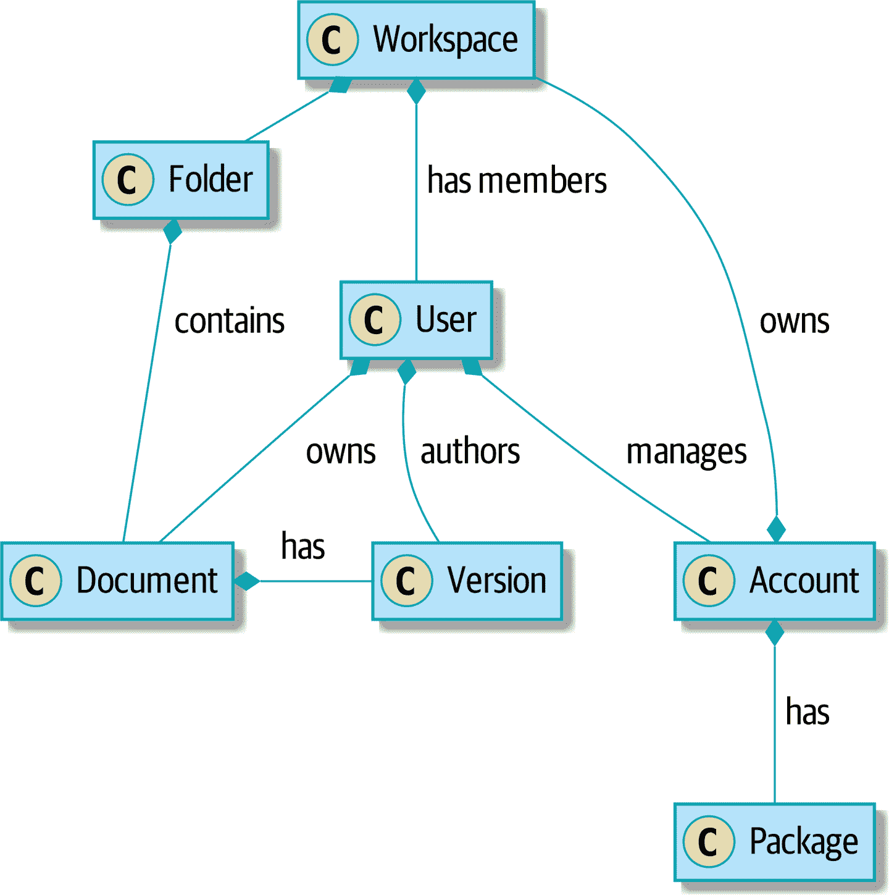
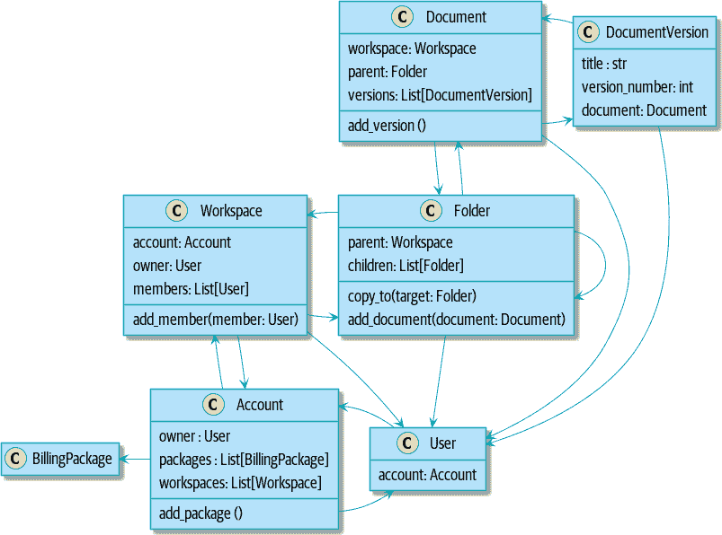
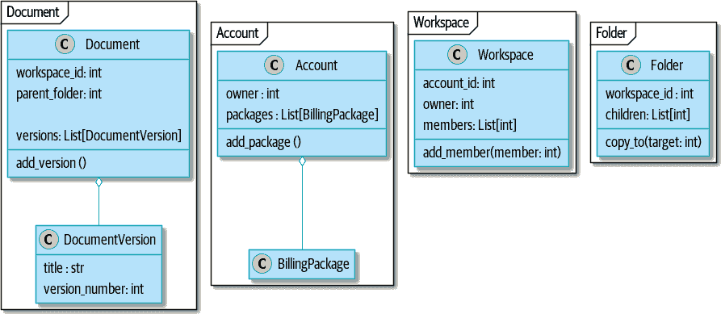
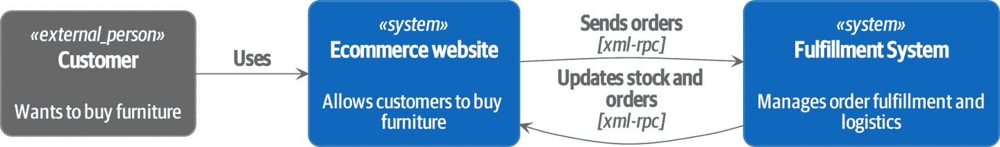
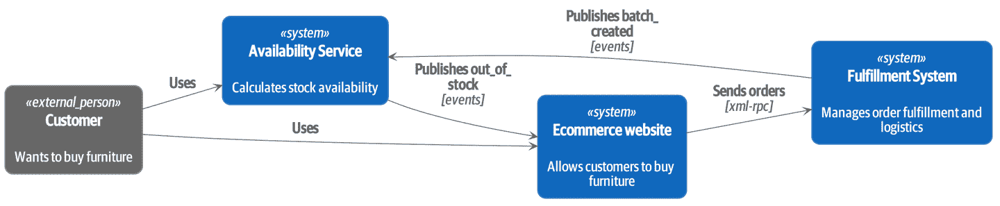
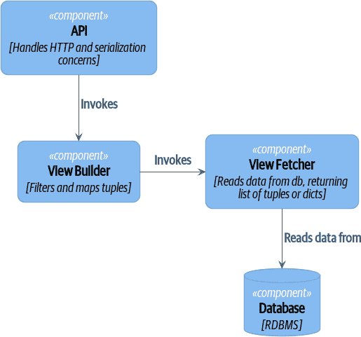

# 结语

> 原文：[Epilogue: Epilogue](https://www.cosmicpython.com/book/epilogue_1_how_to_get_there_from_here.html)
> 
> 译者：[飞龙](https://github.com/wizardforcel)
> 
> 协议：[CC BY-NC-SA 4.0](https://creativecommons.org/licenses/by-nc-sa/4.0/)

# 现在怎么办？

哇！在这本书中，我们涵盖了很多内容，对于我们的大多数读者来说，所有这些想法都是新的。考虑到这一点，我们不能希望让您成为这些技术的专家。我们真正能做的只是向您展示大致的想法，并提供足够的代码让您可以开始从头写东西。

我们在这本书中展示的代码并不是经过严格测试的生产代码：它是一组乐高积木，你可以用它来建造你的第一个房子、太空飞船和摩天大楼。

这给我们留下了两项重要任务。我们想讨论如何在现有系统中真正应用这些想法，并且我们需要警告您有些我们不得不跳过的事情。我们已经给了您一整套新的自毁方式，所以我们应该讨论一些基本的枪支安全知识。

# 我怎样才能从这里到那里？

很多人可能会想到这样的问题：

“好的鲍勃和哈里，这一切都很好，如果我有机会被聘用来开发一个全新的服务，我知道该怎么做。但与此同时，我在这里面对我的 Django 泥球，我看不到任何办法可以达到你们的干净、完美、无瑕、简单的模型。从这里没有办法。”

我们明白你的想法。一旦您已经*构建*了一个大球泥，就很难知道如何开始改进。实际上，我们需要一步一步地解决问题。

首先要明确的是：您要解决什么问题？软件是否太难更改？性能是否令人无法接受？是否有奇怪的、无法解释的错误？

有一个明确的目标将有助于您优先处理需要完成的工作，并且重要的是，向团队的其他成员传达做这些工作的原因。企业倾向于对技术债务和重构采取务实的方法，只要工程师能够就修复问题提出合理的论据。

###### 提示

对系统进行复杂的更改通常更容易推销，如果将其与功能工作联系起来。也许您正在推出新产品或将您的服务开放给新市场？这是在修复基础设施上花费工程资源的正确时机。在一个需要交付的六个月项目中，更容易争取三周的清理工作。鲍勃称之为*架构税*。

# 分离纠缠的责任

在书的开头，我们说大球泥的主要特征是同质性：系统的每个部分看起来都一样，因为我们没有明确每个组件的责任。为了解决这个问题，我们需要开始分离责任并引入明确的边界。我们可以做的第一件事之一是开始构建一个服务层（图 E-1）。



###### 图 E-1. 协作系统的领域

```py
[plantuml, apwp_ep01, config=plantuml.cfg]
@startuml
hide empty members
Workspace *- Folder : contains
Account *- Workspace : owns
Account *-- Package : has
User *-- Account : manages
Workspace *-- User : has members
User *-- Document : owns
Folder *-- Document : contains
Document *- Version: has
User *-- Version: authors
@enduml
```

这就是鲍勃第一次学会如何分解泥球的系统，而且这是一个难题。逻辑*无处不在*——在网页中，在经理对象中，在辅助程序中，在我们编写的用于抽象经理和辅助程序的庞大服务类中，以及在我们编写的用于分解服务的复杂命令对象中。

如果您正在处理已经到达这一步的系统，情况可能会让人感到绝望，但开始清理一个长满杂草的花园永远不会太晚。最终，我们雇了一个知道自己在做什么的架构师，他帮助我们重新控制了局面。

首先要做的是弄清楚系统的*用例*。如果您有用户界面，它执行了哪些操作？如果您有后端处理组件，也许每个 cron 作业或 Celery 作业都是一个单独的用例。您的每个用例都需要有一个命令式的名称：例如，应用计费费用、清理废弃账户或提高采购订单。

在我们的情况下，大多数用例都是经理类的一部分，名称如创建工作空间或删除文档版本。每个用例都是从 Web 前端调用的。

我们的目标是为每个支持的操作创建一个单独的函数或类，用于*编排*要执行的工作。每个用例应执行以下操作：

+   如有需要，启动自己的数据库事务

+   获取所需的任何数据

+   检查任何前提条件（请参阅[附录 E]中的确保模式（app05.xhtml#appendix_validation））

+   更新领域模型

+   持久化任何更改

每个用例应作为一个原子单元成功或失败。您可能需要从另一个用例中调用一个用例。没问题；只需做个记录，并尽量避免长时间运行的数据库事务。

###### 注意

我们遇到的最大问题之一是管理器方法调用其他管理器方法，并且数据访问可以发生在模型对象本身。很难在不跨越整个代码库进行寻宝之旅的情况下理解每个操作的含义。将所有逻辑汇总到一个方法中，并使用 UoW 来控制我们的事务，使系统更容易理解。

###### 提示

如果在用例函数中存在重复，也没关系。我们不是要编写完美的代码；我们只是试图提取一些有意义的层。在几个地方重复一些代码要比让用例函数在长链中相互调用要好。

这是一个很好的机会，可以将任何数据访问或编排代码从领域模型中提取出来，并放入用例中。我们还应该尝试将 I/O 问题（例如发送电子邮件、写文件）从领域模型中提取出来，并放入用例函数中。我们应用第三章中关于抽象的技术，以便在执行 I/O 时保持我们的处理程序可单元测试。

这些用例函数主要涉及日志记录、数据访问和错误处理。完成此步骤后，您将了解程序实际*执行*的操作，并且有一种方法来确保每个操作都有明确定义的开始和结束。我们将迈出一步，朝着构建纯领域模型迈进。

阅读 Michael C. Feathers 的《与遗留代码有效地工作》（Prentice Hall）以获取有关对遗留代码进行测试和开始分离责任的指导。

# 识别聚合和有界上下文

在我们的案例研究中，代码库的一部分问题是对象图高度连接。每个帐户都有许多工作空间，每个工作空间都有许多成员，所有这些成员都有自己的帐户。每个工作空间包含许多文档，每个文档都有许多版本。

你无法在类图中表达事物的全部恐怖。首先，实际上并没有一个与用户相关的单个帐户。相反，有一个奇怪的规则要求您通过工作空间枚举与用户关联的所有帐户，并选择创建日期最早的帐户。

系统中的每个对象都是继承层次结构的一部分，其中包括`SecureObject`和`Version`。这种继承层次结构直接在数据库模式中进行了镜像，因此每个查询都必须跨越 10 个不同的表进行连接，并查看鉴别器列，以便确定正在处理的对象的类型。

代码库使得可以像这样“点”穿过这些对象：

```py
user.account.workspaces[0].documents.versions[1].owner.account.settings[0];
```

使用 Django ORM 或 SQLAlchemy 构建系统很容易，但应该避免。尽管这很*方便*，但很难理解性能，因为每个属性可能触发对数据库的查找。

###### 提示

聚合是*一致性边界*。一般来说，每个用例应一次只更新一个聚合。一个处理程序从存储库中获取一个聚合，修改其状态，并引发任何作为结果发生的事件。如果您需要来自系统其他部分的数据，完全可以使用读取模型，但要避免在单个事务中更新多个聚合。当我们选择将代码分离为不同的聚合时，我们明确选择使它们*最终一致*。

一堆操作需要我们以这种方式循环遍历对象，例如：

```py
# Lock a user's workspaces for nonpayment

def lock_account(user):
    for workspace in user.account.workspaces:
        workspace.archive()
```

甚至可以递归遍历文件夹和文档的集合：

```py
def lock_documents_in_folder(folder):

    for doc in folder.documents:
         doc.archive()

     for child in folder.children:
         lock_documents_in_folder(child)
```

这些操作*严重*影响了性能，但修复它们意味着放弃我们的单个对象图。相反，我们开始识别聚合并打破对象之间的直接链接。

###### 注意

我们在[第十二章](ch12.xhtml#chapter_12_cqrs)中谈到了臭名昭著的`SELECT N+1`问题，以及在查询数据和命令数据时可能选择使用不同的技术。

大多数情况下，我们通过用标识符替换直接引用来实现这一点。

在聚合之前：



```py
[plantuml, apwp_ep02, config=plantuml.cfg]
@startuml
hide empty members

class Document {

  add_version ()

  workspace: Workspace
  parent: Folder

  versions: List[DocumentVersion]

}

class DocumentVersion {

  title : str
  version_number: int

  document: Document

}

class Account {
  add_package ()

  owner : User
  packages : List[BillingPackage]
  workspaces: List[Workspace]
}

class BillingPackage {
}

class Workspace {

  add_member(member: User)

  account: Account
  owner: User
  members: List[User]

}

class Folder {
  parent: Workspace
  children: List[Folder]

  copy_to(target: Folder)
  add_document(document: Document)
}

class User {
  account: Account
}

Account --> Workspace
Account --> BillingPackage
Account --> User
Workspace --> User
Workspace --> Folder
Workspace --> Account
Folder --> Folder
Folder --> Document
Folder --> Workspace
Folder --> User
Document --> DocumentVersion
Document --> Folder
Document --> User
DocumentVersion --> Document
DocumentVersion --> User
User --> Account

@enduml
```

建模后：



```py
[plantuml, apwp_ep03, config=plantuml.cfg]
@startuml
hide empty members

frame Document {

  class Document {

    add_version ()

    workspace_id: int
    parent_folder: int

    versions: List[DocumentVersion]

  }

  class DocumentVersion {

    title : str
    version_number: int

  }
}

frame Account {

  class Account {
    add_package ()

    owner : int
    packages : List[BillingPackage]
  }

  class BillingPackage {
  }

}

frame Workspace {
   class Workspace {

     add_member(member: int)

     account_id: int
     owner: int
     members: List[int]

   }
}

frame Folder {

  class Folder {
    workspace_id : int
    children: List[int]

    copy_to(target: int)
  }

}

Document o-- DocumentVersion
Account o-- BillingPackage

@enduml
```

###### 提示

双向链接通常表明您的聚合不正确。在我们的原始代码中，`Document`知道其包含的`Folder`，而`Folder`有一组`Documents`。这使得遍历对象图很容易，但阻止我们正确思考我们需要的一致性边界。我们通过使用引用来拆分聚合。在新模型中，`Document`引用其`parent_folder`，但无法直接访问`Folder`。

如果我们需要*读取*数据，我们会避免编写复杂的循环和转换，并尝试用直接的 SQL 替换它们。例如，我们的一个屏幕是文件夹和文档的树形视图。

这个屏幕在数据库上非常重，因为它依赖于触发延迟加载的 ORM 的嵌套`for`循环。

###### 提示

我们在[第十一章](ch11.xhtml#chapter_11_external_events)中使用了相同的技术，用一个简单的 SQL 查询替换了对 ORM 对象的嵌套循环。这是 CQRS 方法的第一步。

经过长时间的思考，我们用一个又大又丑的存储过程替换了 ORM 代码。代码看起来很糟糕，但速度要快得多，并有助于打破`Folder`和`Document`之间的联系。

当我们需要*写入*数据时，我们逐个更改单个聚合，并引入消息总线来处理事件。例如，在新模型中，当我们锁定一个账户时，我们可以首先查询所有受影响的工作空间。通过`SELECT *id* FROM *workspace* WHERE *account_id* = ?`。

然后我们可以为每个工作空间提出一个新的命令：

```py
for workspace_id in workspaces:
    bus.handle(LockWorkspace(workspace_id))
```

# 通过 Strangler 模式实现微服务的事件驱动方法

*Strangler Fig*模式涉及在旧系统的边缘创建一个新系统，同时保持其运行。逐渐拦截和替换旧功能，直到旧系统完全无事可做，可以关闭。

在构建可用性服务时，我们使用了一种称为*事件拦截*的技术，将功能从一个地方移动到另一个地方。这是一个三步过程：

1.  引发事件来表示系统中发生的变化。

1.  构建一个消耗这些事件并使用它们构建自己领域模型的第二个系统。

1.  用新的系统替换旧的系统。

我们使用事件拦截从图 E-2 移动…



###### 图 E-2。之前：基于 XML-RPC 的强大的双向耦合

```py
[plantuml, apwp_ep04, config=plantuml.cfg]
@startuml E-Commerce Context
!include images/C4_Context.puml

Person_Ext(customer, "Customer", "Wants to buy furniture")

System(fulfilment, "Fulfilment System", "Manages order fulfilment and logistics")
System(ecom, "E-commerce website", "Allows customers to buy furniture")

Rel(customer, ecom, "Uses")
Rel(fulfilment, ecom, "Updates stock and orders", "xml-rpc")
Rel(ecom, fulfilment, "Sends orders", "xml-rpc")

@enduml
```

到图 E-3。



###### 图 E-3。之后：与异步事件的松散耦合（您可以在 cosmicpython.com 找到此图的高分辨率版本）

```py
[plantuml, apwp_ep05, config=plantuml.cfg]
@startuml E-Commerce Context
!include images/C4_Context.puml

Person_Ext(customer, "Customer", "Wants to buy furniture")

System(av, "Availability Service", "Calculates stock availability")
System(fulfilment, "Fulfilment System", "Manages order fulfilment and logistics")
System(ecom, "E-commerce website", "Allows customers to buy furniture")

Rel(customer, ecom, "Uses")
Rel(customer, av, "Uses")
Rel(fulfilment, av, "Publishes batch_created", "events")
Rel(av, ecom, "Publishes out_of_stock", "events")
Rel(ecom, fulfilment, "Sends orders", "xml-rpc")

@enduml
```

实际上，这是一个长达几个月的项目。我们的第一步是编写一个可以表示批次、装运和产品的领域模型。我们使用 TDD 构建了一个玩具系统，可以回答一个问题：“如果我想要 N 个单位的 HAZARDOUS_RUG，它们需要多长时间才能被交付？”

###### 提示

在部署事件驱动系统时，从“walking skeleton”开始。部署一个只记录其输入的系统迫使我们解决所有基础设施问题，并开始在生产中工作。

一旦我们有了一个可行的领域模型，我们就转而构建一些基础设施。我们的第一个生产部署是一个可以接收`batch_created`事件并记录其 JSON 表示的小型系统。这是事件驱动架构的“Hello World”。它迫使我们部署消息总线，连接生产者和消费者，构建部署管道，并编写一个简单的消息处理程序。

有了部署管道、我们需要的基础设施和一个基本的领域模型，我们就开始了。几个月后，我们投入生产并为真正的客户提供服务。

# 说服利益相关者尝试新事物

如果你正在考虑从一个庞大的泥球中切割出一个新系统，你可能正在遭受可靠性、性能、可维护性或三者同时出现的问题。深层次的、棘手的问题需要采取激烈的措施！

我们建议首先进行*领域建模*。在许多庞大的系统中，工程师、产品所有者和客户不再使用相同的语言交流。业务利益相关者用抽象的、流程为中心的术语谈论系统，而开发人员被迫谈论系统在其野生和混乱状态下的实际存在。

弄清楚如何对领域进行建模是一个复杂的任务，这是许多不错的书籍的主题。我们喜欢使用诸如事件风暴和 CRC 建模之类的互动技术，因为人类擅长通过玩耍来合作。*事件建模*是另一种技术，它将工程师和产品所有者聚集在一起，以命令、查询和事件的方式来理解系统。

###### 提示

查看*www.eventmodeling.org*和*www.eventstorming.org*，了解一些关于使用事件进行系统可视化建模的很好的指南。

目标是能够通过使用相同的通用语言来谈论系统，这样你就可以就复杂性所在达成一致。

我们发现将领域问题视为 TDD kata 非常有价值。例如，我们为可用性服务编写的第一行代码是批处理和订单行模型。你可以将其视为午餐时间的研讨会，或者作为项目开始时的一个突发事件。一旦你能够证明建模的价值，就更容易为优化项目结构提出论点。

# 我们的技术审阅者提出的问题，我们无法融入散文中

以下是我们在起草过程中听到的一些问题，我们无法在书中其他地方找到一个好地方来解决：

我需要一次做完所有这些吗？我可以一次只做一点吗？

不，你绝对可以逐步采用这些技术。如果你有一个现有的系统，我们建议建立一个服务层，试图将编排保持在一个地方。一旦你有了这个，将逻辑推入模型并将边缘关注点（如验证或错误处理）推入入口点就容易得多。

即使你仍然有一个庞大混乱的 Django ORM，也值得拥有一个服务层，因为这是开始理解操作边界的一种方式。

提取用例将破坏我现有的大量代码；它太混乱了

只需复制粘贴。在短期内造成更多的重复是可以的。把这看作一个多步过程。你的代码现在处于糟糕的状态，所以将其复制粘贴到一个新的地方，然后使新代码变得干净整洁。

一旦你做到了这一点，你可以用新代码替换旧代码的使用，最终删除混乱。修复庞大的代码库是一个混乱而痛苦的过程。不要指望事情会立即变得更好，如果你的应用程序的某些部分保持混乱，也不要担心。

我需要做 CQRS 吗？那听起来很奇怪。我不能只是使用存储库吗？

当然可以！我们在这本书中提出的技术旨在让你的生活变得*更轻松*。它们不是一种用来惩罚自己的苦行修行。

在我们的第一个案例研究系统中，我们有很多*视图构建器*对象，它们使用存储库来获取数据，然后执行一些转换以返回愚蠢的读取模型。优点是，当您遇到性能问题时，很容易重写视图构建器以使用自定义查询或原始 SQL。

用例在一个更大的系统中如何交互？一个调用另一个会有问题吗？

这可能是一个临时步骤。同样，在第一个案例研究中，我们有一些处理程序需要调用其他处理程序。然而，这会变得非常混乱，最好的方法是使用消息总线来分离这些关注点。

通常，您的系统将有一个单一的消息总线实现和一堆以特定聚合或一组聚合为中心的子域。当您的用例完成时，它可以引发一个事件，然后其他地方的处理程序可以运行。

如果一个用例使用多个存储库/聚合，这是一种代码异味吗？如果是，为什么？

聚合是一致性边界，所以如果你的用例需要在同一个事务中原子地更新两个聚合，那么严格来说你的一致性边界是错误的。理想情况下，你应该考虑将其移动到一个新的聚合中，该聚合将同时更改所有你想要更改的内容。

如果您实际上只更新一个聚合并使用其他聚合进行只读访问，那么这是可以的，尽管您可以考虑构建一个读取/视图模型来获取这些数据——如果每个用例只有一个聚合，这样做会使事情变得更清晰。

如果你确实需要修改两个聚合，但这两个操作不必在同一个事务/UoW 中，那么考虑将工作拆分成两个不同的处理程序，并使用领域事件在两者之间传递信息。您可以在[Vaughn Vernon 的这些聚合设计论文](https://oreil.ly/sufKE)中阅读更多内容。

如果我有一个只读但业务逻辑复杂的系统呢？

视图模型中可能包含复杂的逻辑。在本书中，我们鼓励您将读取模型和写入模型分开，因为它们具有不同的一致性和吞吐量要求。大多数情况下，我们可以对读取使用更简单的逻辑，但并非总是如此。特别是，权限和授权模型可能会给我们的读取端增加很多复杂性。

我们编写了需要进行广泛单元测试的视图模型的系统。在这些系统中，我们将*视图构建器*与*视图获取器*分开，如图 E-4 所示。



###### 图 E-4. 视图构建器和视图获取器（您可以在 cosmicpython.com 找到此图的高分辨率版本）

```py
[plantuml, apwp_ep06, config=plantuml.cfg]
@startuml View Fetcher Component Diagram
!include images/C4_Component.puml

LAYOUT_LEFT_RIGHT

ComponentDb(db, "Database", "RDBMS")
Component(fetch, "View Fetcher", "Reads data from db, returning list of tuples or dicts")
Component(build, "View Builder", "Filters and maps tuples")
Component(api, "API", "Handles HTTP and serialization concerns")

Rel(fetch, db, "Read data from")
Rel(build, fetch, "Invokes")
Rel(api, build, "Invokes")

@enduml
```

+ 这使得通过提供模拟数据（例如，字典列表）来测试视图构建器变得很容易。“Fancy CQRS”与事件处理程序实际上是一种在写入时运行我们复杂的视图逻辑的方法，以便我们在读取时避免运行它。

我需要构建微服务来做这些事情吗？

天哪，不！这些技术早在十年前就出现了微服务。聚合、领域事件和依赖反转是控制大型系统复杂性的方法。恰好当您构建了一组用例和业务流程模型时，将其移动到自己的服务相对容易，但这并不是必需的。

我正在使用 Django。我还能做到这一点吗？

我们为您准备了整个附录：附录 D!

# 脚枪

好的，所以我们给了你一堆新玩具来玩。这是详细说明。Harry 和 Bob 不建议您将我们的代码复制粘贴到生产系统中，并在 Redis pub/sub 上重建您的自动交易平台。出于简洁和简单起见，我们对许多棘手的主题进行了手波。在尝试这个之前，这是我们认为您应该知道的一些事情的清单。

可靠的消息传递很困难

Redis pub/sub 不可靠，不应作为通用消息工具使用。我们选择它是因为它熟悉且易于运行。在 MADE，我们将 Event Store 作为我们的消息工具，但我们也有 RabbitMQ 和 Amazon EventBridge 的经验。

Tyler Treat 在他的网站*bravenewgeek.com*上有一些优秀的博客文章；您至少应该阅读[“您无法实现精确一次交付”](https://oreil.ly/pcstD)和[“您想要的是您不想要的：理解分布式消息传递中的权衡”](https://oreil.ly/j8bmF)。

我们明确选择了可以独立失败的小型、专注的交易

在第八章中，我们更新了我们的流程，以便*释放*订单行和*重新分配*行发生在两个单独的工作单元中。您将需要监控以了解这些事务失败的时间，并使用工具重放事件。使用交易日志作为您的消息代理（例如 Kafka 或 EventStore）可以使其中一些变得更容易。您还可以查看[Outbox 模式](https://oreil.ly/sLfnp)。

我们没有讨论幂等性

我们还没有认真考虑处理程序重试时会发生什么。在实践中，您将希望使处理程序幂等，这样重复调用它们不会对状态进行重复更改。这是构建可靠性的关键技术，因为它使我们能够在事件失败时安全地重试事件。

关于幂等消息处理有很多好的材料，可以从[“如何确保在最终一致的 DDD/CQRS 应用程序中的幂等性”](https://oreil.ly/yERzR)和[“消息传递中的（不）可靠性”](https://oreil.ly/Ekuhi)开始阅读。

您的事件将需要随时间改变其模式

您需要找到一种方式来记录您的事件并与消费者共享模式。我们喜欢使用 JSON 模式和 markdown，因为它简单易懂，但也有其他先前的技术。Greg Young 写了一整本关于随时间管理事件驱动系统的书籍：*事件驱动系统中的版本控制*（Leanpub）。

# 更多必读书籍

我们还想推荐一些书籍，以帮助您更好地理解：

+   Leonardo Giordani（Leanpub）在 2019 年出版的《Python 中的干净架构》是 Python 应用架构的少数几本先前的书籍之一。

+   Gregor Hohpe 和 Bobby Woolf（Addison-Wesley Professional）的*企业集成模式*是消息模式的一个很好的起点。

+   Sam Newman 的*从单体到微服务*（O'Reilly）和 Newman 的第一本书*构建微服务*（O'Reilly）。Strangler Fig 模式被提及为一个喜欢的模式，还有许多其他模式。如果您正在考虑转向微服务，这些都是值得一看的，它们也对集成模式和异步消息传递的考虑非常有帮助。

# 总结

哇！这是很多警告和阅读建议；我们希望我们没有完全吓到您。我们撰写本书的目标是为您提供足够的知识和直觉，让您能够开始为自己构建一些东西。我们很乐意听听您的进展以及您在自己系统中使用这些技术时遇到的问题，所以为什么不通过*www.cosmicpython.com*与我们联系呢？
