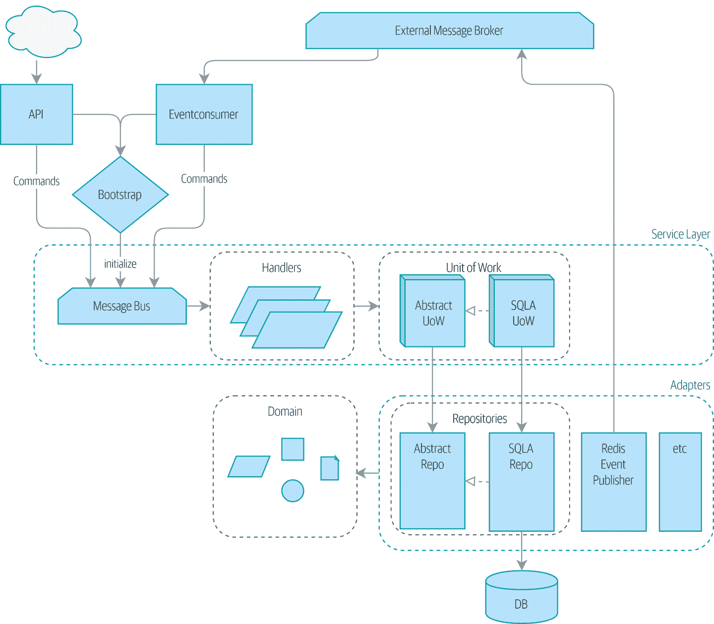

# 附录 A：摘要图和表

> 原文：[Appendix A: Summary Diagram and Table](https://www.cosmicpython.com/book/appendix_ds1_table.html)
> 
> 译者：[飞龙](https://github.com/wizardforcel)
> 
> 协议：[CC BY-NC-SA 4.0](https://creativecommons.org/licenses/by-nc-sa/4.0/)

这是我们在书的最后看到的架构：

表 A-1 总结了每个模式及其功能。

表 A-1. 我们的架构组件及其功能

| 层 | 组件 | 描述 |
| --- | --- | --- |
| **领域** | *定义业务逻辑。* | |
| | 实体 | 一个领域对象，其属性可能会改变，但随着时间的推移具有可识别的身份。 |
| | 值对象 | 一个不可变的领域对象，其属性完全定义它。它可以与其他相同的对象互换。 |
| | 聚合 | 一组相关对象，我们将其视为数据更改的一个单元。定义和强制一致性边界。 |
| | 事件 | 代表发生的事情。 |
| | 命令 | 代表系统应执行的作业。 |
| **服务层** | *定义系统应执行的作业并协调不同的组件。* | |
| | 处理程序 | 接收命令或事件并执行需要发生的操作。 |
| | 工作单元 | 围绕数据完整性的抽象。每个工作单元代表一个原子更新。使存储库可用。跟踪检索到的聚合上的新事件。 |
| | 消息总线（内部） | 通过将命令和事件路由到适当的处理程序来处理命令和事件。 |
| **适配器**（次要） | *接口的具体实现，从我们的系统到外部世界（I/O）。* | |
| | 存储库 | 围绕持久存储的抽象。每个聚合都有自己的存储库。 |
| | 事件发布者 | 将事件推送到外部消息总线上。 |
| **入口点**（主要适配器） |  *将外部输入转换为对服务层的调用。* | |
| | Web | 接收 Web 请求并将其转换为命令，将其传递到内部消息总线。 |
| | 事件消费者 | 从外部消息总线读取事件并将其转换为命令，将其传递到内部消息总线。 |
| | N/A | 外部消息总线（消息代理） | 不适用 | 不适用 | 不适用 |
