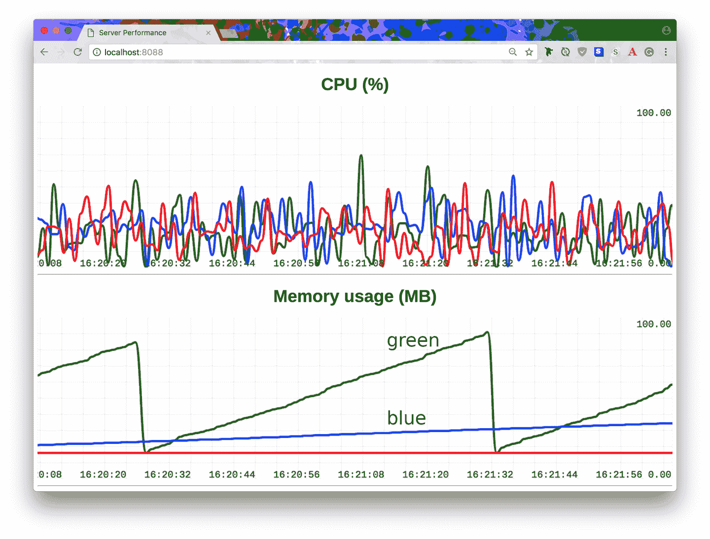

# 第四章。20 个你没有使用的 Asyncio 库（但...哦，没关系）

在本章中，我们将看到使用新的 Python 异步编程功能的案例研究。我们将利用几个第三方库，就像你在自己的项目中会做的那样。

本章的标题是我之前写过的一本书的标题的变形，那本书叫[*20 Python Libraries You Aren’t Using (But Should)*](https://oreil.ly/HLsvb)（O’Reilly）。其中许多库在您的`asyncio`应用程序中也会很有用，但本章重点介绍专为 Python 新异步特性设计的库。

在短代码片段中展示基于`asyncio`的代码是困难的。正如您在本书中所有先前的代码示例中看到的那样，我尝试使每个示例成为一个完整可运行的程序，因为应用程序生命周期管理是正确使用异步编程的核心考虑因素。

因此，本章的大多数案例研究在代码行数上都比这类书籍通常的要大。我采用这种方法的目标是通过给出“整体视图”来使案例研究更有用，而不是让你去揣摩如何将独立的片段组合在一起。

###### 注意

本章中的一些代码示例在样式上可能会妥协以节省空间。我像其他 Pythonista 一样喜欢 PEP8，但实用性胜过纯粹！

# 流（标准库）

在看第三方库之前，让我们从标准库开始。[流 API](https://oreil.ly/mnMZD)是用于异步套接字编程的高级接口，正如下面的案例研究所示，它非常容易使用。然而，由于领域的本质，应用设计仍然复杂。

下面的案例研究展示了消息代理的实现，首先是初始的朴素设计，然后是更加深思熟虑的设计。无论哪种都不应被视为生产就绪；我的目标是帮助您考虑在设计此类应用程序时需要考虑的并发网络编程的各个方面。

## 案例研究：消息队列

*消息队列服务*是一个后端应用程序，它接收来自其他应用程序的连接，并在这些连接的服务之间传递消息，通常称为*发布者*和*订阅者*。订阅者通常监听特定频道以获取消息，通常可以配置不同频道中消息的分发方式有两种：消息可以发送到频道上的所有订阅者（*发布-订阅*），或者每个订阅者一次发送一个不同的消息（*点对点*）。

最近，我参与了一个项目，使用[ActiveMQ](https://oreil.ly/yiaK0)作为微服务间通信的消息代理。在基本层面上，这样的代理（服务器）：

+   维护到多个客户端的持久套接字连接

+   从客户端接收带有目标*频道名称*的消息

+   将这些消息发送给所有订阅了相同频道名称的*其他*客户端

我记得曾经想过创建这样的应用有多难。作为一个额外的补充，ActiveMQ 可以执行消息分发的两种模式，并且这两种模式通常通过频道名称区分：

+   具有前缀 `/topic`（例如，`/topic/customer/registration`）的频道名称使用[发布-订阅](https://oreil.ly/y6cYr)模式管理，其中所有频道订阅者都会收到所有消息。

+   具有前缀 `/queue` 的频道名称采用[点对点](http://bit.ly/2CeNbxr)模式处理，在该模式中，频道上的消息以循环方式分配给频道订阅者：每个订阅者都收到一个唯一的消息。

在我们的案例研究中，我们将构建一个具有这些基本特征的玩具消息代理。我们必须首先解决的问题是 TCP 不是一种消息传递协议：我们只是在网络上传输字节流。我们需要为消息结构创建自己的协议，最简单的协议是为每个消息前缀加上一个大小标头，然后是该大小的消息有效载荷。示例 4-1 中的实用程序库提供了这些消息的 *读* 和 *写* 功能。

##### 示例 4-1\. 消息协议：读和写

```py
# msgproto.py
from asyncio import StreamReader, StreamWriter

async def read_msg(stream: StreamReader) -> bytes:
    size_bytes = await stream.readexactly(4)  
    size = int.from_bytes(size_bytes, byteorder='big')  
    data = await stream.readexactly(size)  
    return data

async def send_msg(stream: StreamWriter, data: bytes):
    size_bytes = len(data).to_bytes(4, byteorder='big')
    stream.writelines([size_bytes, data])  
    await stream.drain()
```


获取前 4 个字节。这是大小前缀。


这些 4 个字节必须转换为整数。


现在我们知道了有效载荷的大小，所以我们从流中读取它。


*写* 是 *读* 的反义词：首先我们发送数据的长度，编码为 4 个字节，然后发送数据。

现在我们有了一个基本的消息协议，我们可以专注于 示例 4-2 中的消息代理应用。

##### 示例 4-2\. 一个 40 行的原型服务器

```py
# mq_server.py
import asyncio
from asyncio import StreamReader, StreamWriter, gather
from collections import deque, defaultdict
from typing import Deque, DefaultDict
from msgproto import read_msg, send_msg  

SUBSCRIBERS: DefaultDict[bytes, Deque] = defaultdict(deque) 

async def client(reader: StreamReader, writer: StreamWriter):
  peername = writer.get_extra_info('peername')  
  subscribe_chan = await read_msg(reader)  
  SUBSCRIBERS[subscribe_chan].append(writer)  
  print(f'Remote {peername} subscribed to {subscribe_chan}')
  try:
    while channel_name := await read_msg(reader):  
      data = await read_msg(reader)  
      print(f'Sending to {channel_name}: {data[:19]}...')
      conns = SUBSCRIBERS[channel_name]  
      if conns and channel_name.startswith(b'/queue'):  
          conns.rotate()  
          conns = [conns[0]]  
      await gather(*[send_msg(c, data) for c in conns]) 
  except asyncio.CancelledError:
    print(f'Remote {peername} closing connection.')
    writer.close()
    await writer.wait_closed()
  except asyncio.IncompleteReadError:
    print(f'Remote {peername} disconnected')
  finally:
    print(f'Remote {peername} closed')
    SUBSCRIBERS[subscribe_chan].remove(writer)  

async def main(*args, **kwargs):
    server = await asyncio.start_server(*args, **kwargs)
    async with server:
        await server.serve_forever()

try:
    asyncio.run(main(client, host='127.0.0.1', port=25000))
except KeyboardInterrupt:
    print('Bye!')
```


从我们的 *msgproto.py* 模块导入。


当前活动订阅者的全局集合。每次客户端连接时，他们必须首先发送一个他们订阅的频道名称。一个双端队列将保存特定频道的所有订阅者。


`client()` 协程函数将为每个新连接生成一个长期运行的协程。将其视为在 `main()` 中启动的 TCP 服务器的回调函数。在这一行中，我展示了如何获取远程对等体的主机和端口，例如，用于日志记录。


我们对客户端的协议如下：

+   在首次连接时，客户端*必须*发送包含要订阅的频道的消息（这里是`subscribe_chan`）。

+   之后，在连接的整个生命周期中，客户端通过首先发送包含目标频道名称的消息，然后是包含数据的消息，向频道发送消息。我们的代理将这些数据消息发送给订阅该频道名称的每个客户端。


将`StreamWriter`实例添加到全局订阅者集合中。


一个无限循环，等待来自该客户端的数据。客户端的第一条消息必须是目标频道名称。


接下来是要分发到频道的实际数据。


获取目标频道的订阅者双端队列。


如果频道名称以魔法词`/queue`开头，则会进行一些特殊处理：在这种情况下，我们只向*一个*订阅者发送数据，而不是所有订阅者。这可用于在一群工作者之间共享工作，而不是通常的发布-订阅通知方案，在该方案中频道上的所有订阅者都会收到所有消息。


我们之所以使用双端队列而不是列表，是因为双端队列的旋转是我们用来跟踪哪个客户端下一个应接收`/queue`分发的方式。这看起来很昂贵，直到你意识到单个双端队列旋转是 O(1)操作。


仅针对第一个客户端目标；这在每次旋转后会改变。


创建一个用于向每个写入者发送消息的协程列表，然后将它们解包到`gather()`中，以便等待所有发送完成。

这行代码是我们程序中的一个严重缺陷，但可能不明显原因是：尽管每个订阅者的发送可能会并发进行，但如果我们有一个非常慢的客户端会发生什么？在这种情况下，`gather()`只有在最慢的订阅者收到其数据后才会完成。在所有这些`send_msg()`协程完成之前，我们无法从发送客户端接收任何更多数据。这将导致所有消息分发速度都受制于最慢的订阅者速度。


在离开`client()`协程时，我们确保将自己从全局的`SUBSCRIBERS`集合中移除。不幸的是，这是一个 O(*n*)操作，对于非常大的*n*来说可能有点昂贵。不同的数据结构可以解决这个问题，但目前我们只能安慰自己的是连接应该是长期存在的——因此，应该很少有断开连接的事件——并且*n*不太可能非常大（例如，粗略估计为~10,000），而且这段代码至少很容易理解。

那么这就是我们的服务器；现在我们需要客户端，然后我们可以展示一些输出。为了演示目的，我将制作两种类型的客户端：一个*发送者*和一个*监听者*。服务器不区分；所有客户端都是相同的。发送者和监听者行为之间的区别仅用于教育目的。Example 4-3 显示了监听应用程序的代码。

##### Example 4-3\. 监听器：用于监听消息代理上的消息的工具包

```py
# mq_client_listen.py
import asyncio
import argparse, uuid
from msgproto import read_msg, send_msg

async def main(args):
  me = uuid.uuid4().hex[:8] 
  print(f'Starting up {me}')
  reader, writer = await asyncio.open_connection(
    args.host, args.port) 
  print(f'I am {writer.get_extra_info("sockname")}')
  channel = args.listen.encode()  
  await send_msg(writer, channel)  
  try:
    while data := await read_msg(reader):  
      print(f'Received by {me}: {data[:20]}')
    print('Connection ended.')
  except asyncio.IncompleteReadError:
    print('Server closed.')
  finally:
    writer.close()
    await writer.wait_closed()

if __name__ == '__main__':
  parser = argparse.ArgumentParser() 
  parser.add_argument('--host', default='localhost')
  parser.add_argument('--port', default=25000)
  parser.add_argument('--listen', default='/topic/foo')
  try:
    asyncio.run(main(parser.parse_args()))
  except KeyboardInterrupt:
    print('Bye!')
```


`uuid`标准库模块是创建此监听器的“身份”的方便方式。如果启动多个实例，则每个实例都将有自己的身份，并且您将能够跟踪日志中发生的情况。


打开到服务器的连接。


订阅的频道是一个输入参数，存储在`args.listen`中。在发送之前将其编码为字节。


根据我们的协议规则（如前文所述的代理程序代码分析），连接后要做的第一件事是发送要订阅的频道名称。


这个循环除了等待套接字上出现数据之外什么也不做。


该程序的命令行参数使得指定主机、端口和要监听的频道名称变得很容易。

另一个客户端的代码，也就是在 Example 4-4 中展示的发送程序，结构类似于监听器模块。

##### Example 4-4\. 发送者：用于向消息代理发送数据的工具包

```py
# mq_client_sender.py
import asyncio
import argparse, uuid
from itertools import count
from msgproto import send_msg

async def main(args):
    me = uuid.uuid4().hex[:8]  
    print(f'Starting up {me}')
    reader, writer = await asyncio.open_connection(
        host=args.host, port=args.port)  
    print(f'I am {writer.get_extra_info("sockname")}')

    channel = b'/null'  
    await send_msg(writer, channel) 

    chan = args.channel.encode()  
    try:
        for i in count():  
            await asyncio.sleep(args.interval)  
            data = b'X'*args.size or f'Msg {i} from {me}'.encode()
            try:
                await send_msg(writer, chan)
                await send_msg(writer, data) 
            except OSError:
                print('Connection ended.')
                break
    except asyncio.CancelledError:
        writer.close()
        await writer.wait_closed()

if __name__ == '__main__':
  parser = argparse.ArgumentParser()  
  parser.add_argument('--host', default='localhost')
  parser.add_argument('--port', default=25000, type=int)
  parser.add_argument('--channel', default='/topic/foo')
  parser.add_argument('--interval', default=1, type=float)
  parser.add_argument('--size', default=0, type=int)
  try:
    asyncio.run(main(parser.parse_args()))
  except KeyboardInterrupt:
    print('Bye!')
```


与监听器一样，要声明一个身份。


联系并建立连接。


根据我们的协议规则，连接到服务器后的第一件事是提供要订阅的频道的名称；然而，由于我们是发送者，我们并不真的关心订阅任何频道。尽管如此，协议要求这样做，所以只需提供一个空频道来订阅（我们实际上不会监听任何内容）。


发送要订阅的频道。


命令行参数`args.channel`提供我们想要发送消息的频道。在发送之前，它必须先转换为字节。


使用`itertools.count()`就像使用`while True`循环一样，只是我们得到一个迭代变量来使用。我们在调试消息中使用它，因为这样可以更容易地跟踪从哪里发送了哪个消息。


发送消息之间的延迟是一个输入参数，即`args.interval`。下一行生成消息负载。它可以是指定大小的字节串（`args.size`），也可以是描述性消息。这种灵活性只是为了测试。


请注意这里发送了*两条*消息：第一条是目标频道名称，第二条是负载。


与监听器一样，有一堆命令行选项可以调整发送者：`channel`确定要发送到的目标频道，而`interval`控制发送之间的延迟。`size`参数控制每个消息负载的大小。

现在我们有了一个代理、一个监听器和一个发送者；是时候看到一些输出了。为了产生以下代码片段，我启动了服务器，然后启动了两个监听器，然后启动了一个发送者。然后，在发送了几条消息后，我用 Ctrl-C 停止了服务器。服务器输出显示在示例 4-5 中，发送者输出显示在示例 4-6 中，监听器输出显示在示例 4-7 和 4-8 中。

##### 示例 4-5\. 消息代理（服务器）输出

```py
$ mq_server.py
Remote ('127.0.0.1', 55382) subscribed to b'/queue/blah'
Remote ('127.0.0.1', 55386) subscribed to b'/queue/blah'
Remote ('127.0.0.1', 55390) subscribed to b'/null'
Sending to b'/queue/blah': b'Msg 0 from 6b5a8e1d'...
Sending to b'/queue/blah': b'Msg 1 from 6b5a8e1d'...
Sending to b'/queue/blah': b'Msg 2 from 6b5a8e1d'...
Sending to b'/queue/blah': b'Msg 3 from 6b5a8e1d'...
Sending to b'/queue/blah': b'Msg 4 from 6b5a8e1d'...
Sending to b'/queue/blah': b'Msg 5 from 6b5a8e1d'...
^CBye!
Remote ('127.0.0.1', 55382) closing connection.
Remote ('127.0.0.1', 55382) closed
Remote ('127.0.0.1', 55390) closing connection.
Remote ('127.0.0.1', 55390) closed
Remote ('127.0.0.1', 55386) closing connection.
Remote ('127.0.0.1', 55386) closed

```

##### 示例 4-6\. 发送者（客户端）输出

```py
$ mq_client_sender.py --channel /queue/blah
Starting up 6b5a8e1d
I am ('127.0.0.1', 55390)
Connection ended.

```

##### 示例 4-7\. 监听器 1（客户端）输出

```py
$ mq_client_listen.py --listen /queue/blah
Starting up 9ae04690
I am ('127.0.0.1', 55382)
Received by 9ae04690: b'Msg 1 from 6b5a8e1d'
Received by 9ae04690: b'Msg 3 from 6b5a8e1d'
Received by 9ae04690: b'Msg 5 from 6b5a8e1d'
Server closed.

```

##### 示例 4-8\. 监听器 2（客户端）输出

```py
$ mq_client_listen.py --listen /queue/blah
Starting up bd4e3baa
I am ('127.0.0.1', 55386)
Received by bd4e3baa: b'Msg 0 from 6b5a8e1d'
Received by bd4e3baa: b'Msg 2 from 6b5a8e1d'
Received by bd4e3baa: b'Msg 4 from 6b5a8e1d'
Server closed.

```

我们的玩具消息代理可以工作了。考虑到如此复杂的问题域，代码也相当容易理解，但不幸的是，代理代码本身的设计存在问题。

对于某个特定的客户端来说，我们在同一个协程中发送消息给订阅者，就像接收新消息的协程一样。这意味着如果有任何一个订阅者消费速度慢，那么在 示例 4-2 中的`await gather(...)`行可能需要很长时间才能完成，而在等待期间我们无法接收和处理更多消息。

相反，我们需要将消息接收与消息发送解耦。在下一个案例研究中，我们将重构我们的代码以实现这一点。

## 案例研究：改进消息队列

在这个案例研究中，我们改进了我们的玩具消息代理的设计。监听器和发送程序保持不变。在新代理设计中的具体改进是解耦发送和接收消息；这将解决慢订阅者导致新消息接收缓慢的问题，正如前一节所讨论的。新代码显示在 示例 4-9 中，代码长度略长但不是特别多。

##### 示例 4-9\. 消息代理：改进的设计

```py
# mq_server_plus.py
import asyncio
from asyncio import StreamReader, StreamWriter, Queue
from collections import deque, defaultdict
from contextlib import suppress
from typing import Deque, DefaultDict, Dict
from msgproto import read_msg, send_msg

SUBSCRIBERS: DefaultDict[bytes, Deque] = defaultdict(deque)
SEND_QUEUES: DefaultDict[StreamWriter, Queue] = defaultdict(Queue)
CHAN_QUEUES: Dict[bytes, Queue] = {}  

async def client(reader: StreamReader, writer: StreamWriter):
  peername = writer.get_extra_info('peername')
  subscribe_chan = await read_msg(reader)
  SUBSCRIBERS[subscribe_chan].append(writer)  
  send_task = asyncio.create_task(
      send_client(writer, SEND_QUEUES[writer]))  
  print(f'Remote {peername} subscribed to {subscribe_chan}')
  try:
    while channel_name := await read_msg(reader):
      data = await read_msg(reader)
      if channel_name not in CHAN_QUEUES:  
        CHAN_QUEUES[channel_name] = Queue(maxsize=10)  
        asyncio.create_task(chan_sender(channel_name))  
      await CHAN_QUEUES[channel_name].put(data)  
  except asyncio.CancelledError:
    print(f'Remote {peername} connection cancelled.')
  except asyncio.IncompleteReadError:
    print(f'Remote {peername} disconnected')
  finally:
    print(f'Remote {peername} closed')
    await SEND_QUEUES[writer].put(None)  
    await send_task  
    del SEND_QUEUES[writer]  
    SUBSCRIBERS[subscribe_chan].remove(writer)

async def send_client(writer: StreamWriter, queue: Queue):  
    while True:
        try:
            data = await queue.get()
        except asyncio.CancelledError:
            continue

        if not data:
            break

        try:
            await send_msg(writer, data)
        except asyncio.CancelledError:
            await send_msg(writer, data)

    writer.close()
    await writer.wait_closed()

async def chan_sender(name: bytes):
    with suppress(asyncio.CancelledError):
        while True:
            writers = SUBSCRIBERS[name]
            if not writers:
                await asyncio.sleep(1)
                continue  
            if name.startswith(b'/queue'):  
                writers.rotate()
                writers = [writers[0]]
            if not (msg := await CHAN_QUEUES[name].get()): 
                break
            for writer in writers:
                if not SEND_QUEUES[writer].full():
                    print(f'Sending to {name}: {msg[:19]}...')
                    await SEND_QUEUES[writer].put(msg)  

async def main(*args, **kwargs):
    server = await asyncio.start_server(*args, **kwargs)
    async with server:
        await server.serve_forever()
try:
    asyncio.run(main(client, host='127.0.0.1', port=25000))
except KeyboardInterrupt:
    print('Bye!')
```


在先前的实现中，只有`SUBSCRIBERS`；现在有`SEND_QUEUES`和`CHAN_QUEUES`作为全局集合。这是完全解耦*接收*和*发送*数据的结果。`SEND_QUEUES`为每个客户端连接保存一个队列条目：所有必须发送到该客户端的数据都必须放入该队列中。（如果您提前查看，`send_client()`协程将从`SEND_QUEUES`中拉取数据并发送。）


在 `client()` 协程函数中直到此刻，代码与简单服务器中的代码相同：接收订阅的通道名称，并将新客户端的`StreamWriter`实例添加到全局的`SUBSCRIBERS`集合中。


这是新的内容：我们创建了一个长期任务，将所有数据发送给这个客户端。该任务将作为一个独立的协程独立运行，并从提供的队列`SEND_QUEUES[writer]`中拉取消息进行发送。


现在我们进入接收数据的循环中。请记住我们总是接收两条消息：一条是目标通道名称，另一条是数据。我们将为每个目标通道创建一个新的专用`Queue`，这就是`CHAN_QUEUES`的作用：当任何客户端想要向通道推送数据时，我们将该数据放入适当的队列中，然后立即返回以继续监听更多数据。这种方法将消息的分发与从该客户端接收消息的过程解耦。


如果目标频道还没有队列，就创建一个。


为该频道创建一个专用且长期存在的任务。协程`chan_sender()` 将负责从频道队列中取出数据并将其分发给订阅者。


把新接收的数据放到特定频道的队列中。如果队列已满，我们会在此等待，直到有空间来存放新数据。在此等待意味着我们不会从套接字读取任何新数据，这意味着客户端必须等待在其端口将新数据发送到套接字。这不一定是件坏事，因为它向客户端传达所谓的*反压*。（或者，如果使用场景可以接受的话，你也可以选择在此处丢弃消息。）


当连接关闭时，是时候进行清理了。我们为向此客户端发送数据创建的长期任务`send_task`可以通过将`None`放入其队列`SEND_QUEUES[writer]`（请检查`send_client()`的代码）来关闭。重要的是要在队列上使用一个值，而不是直接取消，因为可能已经有数据在该队列上，我们希望在结束`send_client()`之前发送出这些数据。


等待该发送任务完成……


然后从`SEND_QUEUES`集合中移除条目（接着在下一行，我们也像之前那样从`SUBSCRIBERS`集合中移除`sock`）。


`send_client()` 协程函数几乎是从队列中获取工作的教科书式示例。请注意协程只有在将`None`放入队列时才会退出。还请注意我们在循环内部抑制了`CancelledError`：这是因为我们希望只有在队列上接收到`None`时才关闭此任务。这样，在关闭之前可以发送队列上的所有待处理数据。


`chan_sender()` 是频道的分发逻辑：它从专用频道的`Queue`实例向所有订阅者发送数据。但是如果该频道还没有订阅者会发生什么呢？我们会稍等一会儿然后再尝试。（请注意，该频道的队列`CHAN_QUEUES[name]`会持续填充。）


与我们先前的代理实现类似，对于名称以`/queue`开头的通道，我们会旋转 deque 并仅发送到第一个条目。这就像一个简单的负载平衡系统，因为每个订阅者从同一个队列中获取不同的消息。对于所有其他通道，所有订阅者都会收到所有消息。


我们将在此等待队列的数据，并在接收到`None`时退出。目前没有任何地方触发这个行为（所以这些`chan_sender()`协程将永远存在），但如果在某段不活跃的时间后增加逻辑来清理这些通道任务，那就是如何完成的。


数据已接收，所以现在是发送给订阅者的时候了。我们不在这里发送：相反，我们将数据放置在每个订阅者自己的发送队列上。这种解耦是必要的，以确保慢订阅者不会减慢其他接收数据的速度。而且，如果订阅者太慢以至于他们的发送队列填满了，我们不会将数据放入他们的队列中；即，它会丢失。

前述的设计产生了与之前简单实现相同的输出，但现在我们可以确保慢监听器不会干扰消息分发到其他监听器。

这两个案例研究展示了在消息分发系统设计中思考的进展。一个关键方面是意识到根据用例，发送和接收数据可能最好由不同的协程处理。在这种情况下，队列非常有用，可以在这些不同的协程之间移动数据并提供缓冲以解耦它们。

这些案例研究的更重要目标是展示`asyncio`中的流 API 如何非常容易地构建基于套接字的应用程序。

# Twisted

[Twisted](https://oreil.ly/Y3dY2) 项目比`asyncio`标准库要早很多，大约已经在 Python 中推广了 14 年。该项目不仅提供基本构建块，如事件循环，还提供像*deferreds*这样的原语，类似于`asyncio`中的 futures。`asyncio`的设计深受 Twisted 及其领导者和维护者的影响。

注意，[`asyncio`并不取代 Twisted](https://oreil.ly/J0ezC)。Twisted 包含大量高质量的互联网协议实现，不仅包括通常的 HTTP，还包括 XMPP、NNTP、IMAP、SSH、IRC 和 FTP（服务器和客户端）。还有更多：DNS？有。SMTP？有。POP3？有。这些优秀的互联网协议实现的可用性使 Twisted 依然引人注目。

在代码层面上，除了历史和历史背景之外，Twisted 和 `asyncio` 之间的主要区别在于很长一段时间内，Python 缺乏对协程的语言支持，这意味着 Twisted 和类似项目不得不找出适用于标准 Python 语法的处理异步性的方法。

在 Twisted 的大部分历史中，*回调函数* 是完成异步编程的手段，具有非线性复杂性；然而，当可以使用生成器作为临时协程时，就突然有可能使用 Twisted 的 `@defer.inlineCallbacks` 装饰器以线性方式编写代码，如 Example 4-10 所示。

##### Example 4-10\. 更多带内联回调的 Twisted

```py
@defer.inlineCallbacks  
def f():
    yield
    defer.returnValue(123)  

@defer.inlineCallbacks
def my_coro_func():
    value = yield f()  
    assert value == 123
```


通常情况下，Twisted 需要创建 `Deferred` 实例并向这些实例添加回调函数来构建异步程序的方法。几年前，添加了 `@inlineCallbacks` 装饰器，它将生成器重新用作协程。


虽然 `@inlineCallbacks` *确实* 允许您编写外观上线性的代码（不像回调函数那样），但是需要一些技巧，例如调用 `defer.returnValue()`，这是您必须从 `@inlineCallbacks` 协程中返回值的方式。


这里我们可以看到 `yield` 使这个函数成为一个生成器。为了使 `@inlineCallbacks` 起作用，被装饰的函数中必须至少有一个 `yield`。

自从原生协程出现在 Python 3.5 中以来，Twisted 团队（特别是 [Amber Brown](https://atleastfornow.net)）一直在努力添加支持，使 Twisted 可以在 `asyncio` 事件循环上运行。

这是一个持续的努力，本节的目标不是说服你将所有应用程序都创建为 Twisted-`asyncio` 混合体，而是让你意识到当前正在进行工作，以在两者之间提供显著的互操作性。

对于那些有 Twisted 使用经验的人来说，Example 4-11 可能会感到突兀。

##### Example 4-11\. Twisted 中对 asyncio 的支持

```py
# twisted_asyncio.py
from time import ctime
from twisted.internet import asyncioreactor
asyncioreactor.install()  
from twisted.internet import reactor, defer, task  

async def main():  
    for i in range(5):
        print(f'{ctime()} Hello {i}')
        await task.deferLater(reactor, 1, lambda: None)  

defer.ensureDeferred(main())  
reactor.run()  
```


这是告诉 Twisted 使用 `asyncio` 事件循环作为其主 `reactor` 的方式。请注意，这一行必须在以下行中从 `twisted.internet` 导入 `reactor` 之前。


任何熟悉 Twisted 编程的人都会认出这些导入。我们在这里没有空间对它们进行深入介绍，但简而言之，`reactor`是`Twisted`版本的`asyncio` *loop*，而`defer`和`task`是用于处理调度协程的工具的命名空间。


在 Twisted 程序中看到`async def`看起来很奇怪，但这确实是新的对`async/await`的支持带给我们的：直接在 Twisted 程序中使用本机协程的能力。


在较旧的`@inlineCallbacks`世界中，你会在这里使用`yield from`，但现在我们可以使用`await`，与`asyncio`代码中的一样。这行的另一部分，`deferLater()`，是一个执行与`asyncio.sleep(1)`相同操作的替代方法。我们等待一个未来，在一秒钟后，一个什么都不做的回调将触发。


`ensureDeferred()`是 Twisted 版本的调度协程。这类似于`loop.create_task()`或`asyncio.ensure_future()`。


运行`reactor`与在`asyncio`中运行`loop.run_forever()`是一样的。

运行此脚本会产生以下输出：

```py
$ twisted_asyncio.py
Mon Oct 16 16:19:49 2019 Hello 0
Mon Oct 16 16:19:50 2019 Hello 1
Mon Oct 16 16:19:51 2019 Hello 2
Mon Oct 16 16:19:52 2019 Hello 3
Mon Oct 16 16:19:53 2019 Hello 4

```

还有很多关于 Twisted 的东西要学习。特别是，值得花时间去研究它实现的网络协议列表。还有一些工作要做，但是 Twisted 和`asyncio`之间的互操作的未来看起来非常光明。

`asyncio`已经被设计成这样一种方式，以便我们可以期待未来，未来将能够将来自许多异步框架（如 Twisted 和 Tornado）的代码合并到单个应用程序中，在同一个事件循环上运行所有代码。

# Janus 队列

Janus 队列（通过`pip install janus`安装）为线程和协程之间的通信提供了解决方案。在 Python 标准库中，有两种类型的队列：

`queue.Queue`

一个*阻塞*队列，通常用于线程之间的通信和缓冲

`asyncio.Queue`

一个`async`兼容的队列，通常用于协程之间的通信和缓冲

不幸的是，这两者都不适用于线程和协程之间的通信！这就是 Janus 发挥作用的地方：它是一个单一的队列，公开了两种 API，一个是阻塞的*，另一个是异步的。示例 4-12 从线程内部生成数据，将该数据放入队列中，然后从协程中消耗该数据。

##### 示例 4-12\. 使用 Janus 队列连接协程和线程

```py
# janus_demo.py
import asyncio
import random
import time

import janus

async def main():
    loop = asyncio.get_running_loop()
    queue = janus.Queue(loop=loop)  
    future = loop.run_in_executor(None, data_source, queue)
    while (data := await queue.async_q.get()) is not None:  
        print(f'Got {data} off queue')  
    print('Done.')

def data_source(queue):
    for i in range(10):
        r = random.randint(0, 4)
        time.sleep(r)  
        queue.sync_q.put(r)  
    queue.sync_q.put(None)

asyncio.run(main())
```


创建一个 Janus 队列。请注意，就像`asyncio.Queue`一样，Janus 队列将与特定的事件循环关联。通常情况下，如果不提供`loop`参数，内部将使用标准的`get_event_loop()`调用。


我们的`main()`协程函数简单地等待队列中的数据。这一行将暂停，直到有数据，就像在`asyncio.Queue`实例上调用`get()`一样。队列对象有两个*面孔*：这个称为`async_q`，提供了异步兼容的队列 API。


打印一条消息。


在`data_source()`函数内部，生成一个随机的`int`，用作睡眠持续时间和数据值。注意，`time.sleep()`调用是阻塞的，因此这个函数必须在一个线程中执行。


将数据放入 Janus 队列。这展示了 Janus 队列的另一个*面孔*：`sync_q`，它提供了标准的阻塞`Queue` API。

这里是输出：

```py
$ <name>
Got 2 off queue
Got 4 off queue
Got 4 off queue
Got 2 off queue
Got 3 off queue
Got 4 off queue
Got 1 off queue
Got 1 off queue
Got 0 off queue
Got 4 off queue
Done.

```

如果可以的话，最好目标是拥有短的执行任务，而在这些情况下，队列（用于通信）不是必需的。尽管如此，在这种情况下，Janus 队列可以是在线程和协程之间缓冲和分发数据最方便的解决方案。

# aiohttp

`aiohttp`将所有 HTTP 相关的功能带入了`asyncio`，包括对 HTTP 客户端和服务器的支持，以及 WebSocket 支持。让我们直接看代码示例，从简单的“Hello World”开始。

## 案例研究：Hello World

示例 4-13 展示了使用`aiohttp`的最简单的 Web 服务器。

##### 示例 4-13\. aiohttp 最小示例

```py
from aiohttp import web

async def hello(request):
    return web.Response(text="Hello, world")

app = web.Application()  
app.router.add_get('/', hello)  
web.run_app(app, port=8080)  
```


创建一个`Application`实例。


创建一个路由，目标协程`hello()`作为处理程序。


启动 Web 应用程序。

注意，此代码中没有提到循环、任务或未来：`aiohttp`框架的开发者已经把所有这些都隐藏起来，留下了一个非常清洁的 API。这在大多数构建在`asyncio`之上的框架中都很常见，这个框架设计旨在允许框架设计者仅选择他们需要的部分，并将其封装在他们喜欢的 API 中。

## 案例研究：抓取新闻

`aiohttp` 可以像非常流行的（但是阻塞的！）[`requests`](https://oreil.ly/E2s9d) 库一样，同时作为服务器和客户端库使用。我想通过一个同时包含这两个特性的示例来展示 `aiohttp`。

在这个案例研究中，我们将实现一个在幕后进行网页抓取的网站。该应用程序将抓取两个新闻网站，并将标题组合成一个结果页面。这是我们的策略：

1.  浏览器客户端向 *http://localhost:8080/news* 发送 Web 请求。

1.  我们的 Web 服务器接收请求，然后在后端从多个新闻网站获取 HTML 数据。

1.  每个页面的数据都被用于抓取头条新闻。

1.  标题被排序并格式化为我们发送回浏览器客户端的响应 HTML。

Figure 4-1 显示了输出结果。


###### 图 4-1\. 我们新闻抓取器的最终产品：CNN 的标题以一种颜色显示，Al Jazeera 的标题以另一种颜色显示。

如今，网页抓取变得非常困难。例如，如果您尝试 `requests.get('http://edition.cnn.com')`，您会发现响应包含的可用数据非常少！如今，执行 JavaScript 以获取数据变得越来越必要，因为许多网站使用 JavaScript 加载其实际内容。执行这种 JavaScript 以生成最终完整的 HTML 输出的过程称为*渲染*。

为了实现渲染，我们使用一个名为 [Splash](https://oreil.ly/1IAie) 的不错的项目，它自称是一个“JavaScript 渲染服务”。它可以在 [Docker](https://www.docker.com) 容器中运行，并提供用于渲染其他站点的 API。在内部，它使用一个（支持 JavaScript 的）WebKit 引擎来完全加载和渲染网站。这是我们将用来获取网站数据的工具。我们的 `aiohttp` 服务器，在 Example 4-14 中显示，将调用这个 Splash API 来获取页面数据。

###### 提示

要获取并运行 Splash 容器，请在您的 shell 中运行以下命令：

```py
$ docker pull scrapinghub/splash
$ docker run --rm -p 8050:8050 scrapinghub/splash

```

我们的服务器后端将调用 Splash API，网址为 *http://localhost:8050*。

##### Example 4-14\. 新闻抓取器的代码

```py
from asyncio import gather, create_task
from string import Template
from aiohttp import web, ClientSession
from bs4 import BeautifulSoup

async def news(request):  
    sites = 
        ('http://edition.cnn.com', cnn_articles),  ![2
        ('http://www.aljazeera.com', aljazeera_articles),
    ]
    tasks = [create_task(news_fetch(*s)) for s in sites] 
    await gather(*tasks)  

    items = {  
        text: (  
            f'<div class="box {kind}">'
            f'<span>'
            f'<a href="{href}">{text}</a>'
            f'</span>'
            f'</div>'
        )
        for task in tasks for href, text, kind in task.result()
    }
    content = ''.join(items[x] for x in sorted(items))

    page = Template(open('index.html').read())  
    return web.Response(
        body=page.safe_substitute(body=content),  
        content_type='text/html',
    )

async def news_fetch(url, postprocess):
    proxy_url = (
        f'http://localhost:8050/render.html?'  
        f'url={url}&timeout=60&wait=1'
    )
    async with ClientSession() as session:
        async with session.get(proxy_url) as resp:  
            data = await resp.read()
            data = data.decode('utf-8')
    return postprocess(url, data)  

def cnn_articles(url, page_data):  
    soup = BeautifulSoup(page_data, 'lxml')
    def match(tag):
        return (
            tag.text and tag.has_attr('href')
            and tag['href'].startswith('/')
            and tag['href'].endswith('.html')
            and tag.find(class_='cd__headline-text')
        )
    headlines = soup.find_all(match)  
    return [(url + hl['href'], hl.text, 'cnn')
            for hl in headlines]

def aljazeera_articles(url, page_data):  
    soup = BeautifulSoup(page_data, 'lxml')
    def match(tag):
        return (
            tag.text and tag.has_attr('href')
            and tag['href'].startswith('/news')
            and tag['href'].endswith('.html')
        )
    headlines = soup.find_all(match)
    return [(url + hl['href'], hl. text, 'aljazeera')
            for hl in headlines]

app = web.Application()
app.router.add_get('/news', news)
web.run_app(app, port=8080)
```


`news()` 函数是我们服务器上 */news* URL 的处理程序。它返回显示所有标题的 HTML 页面。


在这里，我们只有两个要抓取的新闻网站：CNN 和 Al Jazeera。可以很容易地添加更多，但是必须添加额外的后处理器，就像定制的 `cnn_articles()` 和 `aljazeera_articles()` 函数一样，用于提取标题数据。


对于每个新闻站点，我们创建一个任务来获取并处理其首页的 HTML 页面数据。注意，我们解包元组（`(*s)`），因为`news_fetch()`协程函数接受 URL 和后处理函数作为参数。每个`news_fetch()`调用将返回一个*元组列表*作为标题结果，格式为*`<article URL>`*, *`<article title>`*。


所有任务都聚集在一个单独的`Future`中（`gather()`返回表示所有任务状态的 future），然后我们立即`await`该 future 的完成。这行代码将暂停，直到 future 完成。


由于所有`news_fetch()`任务现在已完成，我们将所有结果收集到一个字典中。请注意如何使用嵌套推导来迭代任务，然后迭代每个任务返回的元组列表。我们还使用 *f-strings* 直接替换数据，包括页面的类型，这将用于 CSS 来着色`div`的背景。


在这个字典中，*key* 是头条标题，*value* 是将显示在我们结果页面中的`div`的 HTML 字符串。


我们的 Web 服务器将返回 HTML。我们正在从名为 *index.html* 的本地文件加载 HTML 数据。如果您想重新创建这个案例研究，请参考 Example B-1 中的文件。


我们将收集的头条`div`替换到模板中，并将页面返回给浏览器客户端。这生成了示例 Figure 4-1 中展示的页面。


在`news_fetch()`协程函数内部，我们有一个小模板，用于调用运行在本地 Docker 容器端口 8050 上的 Splash API。这演示了如何使用`aiohttp`作为 HTTP 客户端。


标准方式是创建一个`ClientSession()`实例，然后在会话实例上使用`get()`方法执行 REST 调用。在下一行，获取响应数据。请注意，由于我们始终在协程上操作，使用`async with`和`await`，这个协程不会阻塞：我们可以处理成千上万的这些请求，即使这个操作（`news_fetch()`）可能相对较慢，因为我们在内部进行网络调用。


获取数据后，我们调用后处理函数。对于 CNN，将是 `cnn_articles()`，对于 Al Jazeera，将是 `aljazeera_articles()`。


我们只有时间简要介绍后处理。获取页面数据后，我们使用 Beautiful Soup 4 库提取标题。


`match()` 函数将返回所有匹配的标签（我手动检查了这些新闻网站的 HTML 源代码，以找出哪种过滤器组合提取最佳标签），然后我们返回一个符合格式 *`<文章 URL>`*、*`<文章标题>`* 的元组列表。


这是 Al Jazeera 的类似后处理器。`match()` 条件略有不同，但除此之外与 CNN 的相同。

通常，你会发现 `aiohttp` 具有简单的 API 并且在你开发应用程序时“不会干扰你”。

在下一节中，我们将看看如何在 `asyncio` 中使用 ZeroMQ，这使得套接字编程变得非常有趣。

# ØMQ（ZeroMQ）

> 编程是一门打扮成艺术的科学，因为我们大多数人不了解软件的物理学，而且很少有人教过。软件的物理学不是算法、数据结构、语言和抽象。这些只是我们制作、使用和丢弃的工具。软件的真正物理学是人的物理学。具体而言，它是关于我们在复杂性方面的限制以及我们希望一起解决大问题的愿望的物理学。这就是编程的科学：制作人们能够轻松理解和使用的构建块，人们将共同努力解决最大的问题。
> 
> Pieter Hintjens，《ZeroMQ: Messaging for Many Applications》

ØMQ（或[ZeroMQ](http://zeromq.org)）是一个流行的与语言无关的网络应用程序库：它提供“智能”套接字。当你在代码中创建 ØMQ 套接字时，它们类似于常规套接字，具有可识别的方法名称，如 `recv()` 和 `send()` 等，但在内部，这些套接字处理了一些更烦人和乏味的任务，以便与传统套接字一起工作。

它提供的功能之一是管理消息传递，因此您不必发明自己的协议并计算字节，以确定何时到达特定消息的所有字节 - 您只需发送您认为是“消息”的内容，整个消息都会完整地到达另一端。

另一个很棒的特性是自动重新连接逻辑。如果服务器宕机后稍后恢复，客户端 ØMQ socket 将*自动*重新连接。更好的是，在断开连接期间，您的代码发送到 socket 的消息将被缓存，因此服务器恢复时仍然可以发送它们出去。这些是 ØMQ 有时被称为[*无中介*消息传递](https://oreil.ly/oQE4x)的原因之一：它直接在 socket 对象本身提供了一些消息代理软件的功能。

ØMQ sockets 已经在内部实现为异步的（因此它们可以在线程代码中维护许多千次连接），但这一点被 ØMQ API 隐藏了。尽管如此，对于 ØMQ 库的 Python 绑定 [PyZMQ](https://oreil.ly/N8w7J) 添加了对 Asyncio 的支持，在本节中，我们将看几个例子，演示如何将这些智能 sockets 整合到您的 Python 应用程序中。

## 案例研究：多个 sockets

这里有一个让人费解的问题：如果 ØMQ 提供的 sockets 已经是异步的，并且可以与线程一起使用，那么使用 `asyncio` 还有什么意义呢？答案是代码更清晰。

为了演示，让我们看一个小案例研究，在这个案例中，您可以在同一个应用程序中使用多个 ØMQ sockets。首先，示例 4-15 展示了阻塞版本（此示例摘自 [zguide](https://oreil.ly/qXAj8)，ØMQ 的官方指南）。

##### 示例 4-15\. 传统的 ØMQ 方法

```py
# poller.py
import zmq

context = zmq.Context()
receiver = context.socket(zmq.PULL)  
receiver.connect("tcp://localhost:5557")

subscriber = context.socket(zmq.SUB)  
subscriber.connect("tcp://localhost:5556")
subscriber.setsockopt_string(zmq.SUBSCRIBE, '')

poller = zmq.Poller()  
poller.register(receiver, zmq.POLLIN)
poller.register(subscriber, zmq.POLLIN)

while True:
    try:
        socks = dict(poller.poll())  
    except KeyboardInterrupt:
        break

    if receiver in socks:
        message = receiver.recv_json()
        print(f'Via PULL: {message}')

    if subscriber in socks:
        message = subscriber.recv_json()
        print(f'Via SUB: {message}')
```


ØMQ sockets 有*类型*。这是一个 `PULL` socket。您可以把它想象成一种*仅接收*的 socket，它将由另一个*仅发送*的 socket，即 `PUSH` 类型的 socket 提供数据。


`SUB` socket 是另一种接收-only socket，它将接收一个仅发送的 `PUB` socket 提供的数据。


如果您需要在多个线程的 ØMQ 应用程序中移动数据，您将需要一个*轮询器*。这是因为这些 sockets 不是线程安全的，所以您不能在不同的线程上的不同 sockets 上执行 `recv()` 操作。¹


它的工作方式类似于 `select()` 系统调用。当注册的 socket 中有数据可以接收时，轮询器将解除阻塞，然后您可以取出数据并对其进行处理。大的 `if` 块是用来检测正确的 socket 的方法。

使用轮询器循环加上显式的套接字选择块使得代码看起来有些笨拙，但这种方法通过确保同一套接字不会从不同线程中使用来避免线程安全问题。

示例 4-16 显示了服务器代码。

##### 示例 4-16\. 服务器代码

```py
# poller_srv.py
import zmq, itertools, time

context = zmq.Context()
pusher = context.socket(zmq.PUSH)
pusher.bind("tcp://*:5557")

publisher = context.socket(zmq.PUB)
publisher.bind("tcp://*:5556")

for i in itertools.count():
    time.sleep(1)
    pusher.send_json(i)
    publisher.send_json(i)
```

对于讨论来说，这段代码并不重要，但简要来说：有一个 `PUSH` 套接字和一个 `PUB` 套接字，正如我之前所说，内部循环每秒向这两个套接字发送数据。这里是 *poller.py* 的样本输出（注意：*两个*程序都必须在运行）：

```py
$ poller.py
Via PULL: 0
Via SUB: 0
Via PULL: 1
Via SUB: 1
Via PULL: 2
Via SUB: 2
Via PULL: 3
Via SUB: 3

```

代码是可以运行的；然而，我们关心的不是代码是否运行，而是 `asyncio` 对 *poller.py* 结构是否有所贡献。要理解的关键是，我们的 `asyncio` 代码将在单个线程中运行，这意味着可以在不同的 *协程* 中处理不同的套接字——事实上，这正是我们将要做的。

当然，要使其工作，[有人必须努力工作](http://bit.ly/2sPCihI) 将协程支持添加到 `pyzmq`（ØMQ 的 Python 客户端库）本身中。因此这并非是免费的。但我们可以利用这些努力来改进“传统”的代码结构，正如 示例 4-17 中所示。

##### 示例 4-17\. 使用 asyncio 进行清晰分离

```py
# poller_aio.py
import asyncio
import zmq
from zmq.asyncio import Context

context = Context()

async def do_receiver():
    receiver = context.socket(zmq.PULL)  
    receiver.connect("tcp://localhost:5557")
    while message := await receiver.recv_json():  
        print(f'Via PULL: {message}')

async def do_subscriber():
    subscriber = context.socket(zmq.SUB)  
    subscriber.connect("tcp://localhost:5556")
    subscriber.setsockopt_string(zmq.SUBSCRIBE, '')
    while message := await subscriber.recv_json():  
        print(f'Via SUB: {message}')

async def main():
    await asyncio.gather(
        do_receiver(),
        do_subscriber(),
    )

asyncio.run(main())
```


此代码示例与 示例 4-15 相同，只是现在我们利用协程重新结构化了一切。现在我们可以单独处理每个套接字。我创建了两个协程函数，一个用于每个套接字；这个是用于 `PULL` 套接字的。


我正在使用 `pyzmq` 中的 `asyncio` 支持，这意味着所有的 `send()` 和 `recv()` 调用必须使用 `await` 关键字。`Poller` 不再出现在任何地方，因为它已经集成到了 `asyncio` 事件循环中。


这是 `SUB` 套接字的处理程序。其结构与 `PULL` 套接字的处理程序非常相似，但这并非必然。如果需要更复杂的逻辑，我可以轻松地在这里添加，完全封装在 `SUB` 处理程序代码内。


再次，`asyncio` 兼容的套接字需要使用 `await` 关键字进行发送和接收。

输出与之前相同，因此我不会再次展示它。

在我看来，使用协程对这些示例中的代码布局有着惊人的积极影响。在具有许多 ØMQ 套接字的实际生产代码中，每个协程处理程序甚至可以在单独的文件中，提供更多改善代码结构的机会。即使对于只有一个读/写套接字的程序，如果需要，使用单独的协程进行读取和写入也非常容易。

改进后的代码看起来非常像线程化的代码，实际上，对于这里展示的特定示例，相同的重构将适用于线程化：在单独的线程中运行阻塞的 `do_receiver()` 和 `do_subscriber()` 函数。但是，您真的想要处理*潜在的*竞争条件吗，尤其是随着您的应用程序随着时间的推移而功能和复杂性增加？

这里有很多可以探索的地方，正如我之前所说的，这些神奇的套接字非常有趣。在下一个案例研究中，我们将看到 ØMQ 的更实际的用途。

## 案例研究：应用性能监控

随着现代、容器化的、基于微服务的部署实践的发展，一些以前微不足道的事情，比如监视您的应用程序的 CPU 和内存使用情况，现在已经比运行 `top` 更加复杂。在过去几年中出现了一些商业产品来解决这些问题，但是它们的成本对于小型初创团队和业余爱好者来说可能是禁碍的。

在这个案例研究中，我将利用 ØMQ 和 `asyncio` 来构建一个用于分布式应用监控的玩具原型。我们的设计有三个部分：

应用层

这一层包含了我们所有的应用程序。例如可能是“客户”微服务，“预订”微服务，“电子邮件”微服务等。我将为我们的每个应用程序添加一个 ØMQ “传输”套接字。该套接字将向中央服务器发送性能指标。

收集层

中央服务器将公开一个 ØMQ 套接字，以收集所有正在运行的应用程序实例的数据。服务器还将提供一个网页，显示随时间变化的性能图表，并实时传输数据。

可视化层

这是正在提供的网页。我们将在一组图表中显示收集的数据，并且图表将实时更新。为了简化代码示例，我将使用方便的[Smoothie Charts](http://smoothiecharts.org) JavaScript 库，它提供了所有必要的客户端特性。

生成指标的后端应用（应用层）在 示例 4-18 中显示。

##### 示例 4-18\. 应用层：生成指标

```py
import argparse
import asyncio
from random import randint, uniform
from datetime import datetime as dt
from datetime import timezone as tz
from contextlib import suppress
import zmq, zmq.asyncio, psutil

ctx = zmq.asyncio.Context()

async def stats_reporter(color: str):  
    p = psutil.Process()
    sock = ctx.socket(zmq.PUB)  
    sock.setsockopt(zmq.LINGER, 1)
    sock.connect('tcp://localhost:5555')  
    with suppress(asyncio.CancelledError):  
        while True:  
            await sock.send_json(dict(  
                color=color,
                timestamp=dt.now(tz=tz.utc).isoformat(),  
                cpu=p.cpu_percent(),
                mem=p.memory_full_info().rss / 1024 / 1024
            ))
            await asyncio.sleep(1)
    sock.close()  

async def main(args):
    asyncio.create_task(stats_reporter(args.color))
    leak = []
    with suppress(asyncio.CancelledError):
        while True:
            sum(range(randint(1_000, 10_000_000)))  
            await asyncio.sleep(uniform(0, 1))
            leak += [0] * args.leak

if __name__ == '__main__':
    parser = argparse.ArgumentParser()
    parser.add_argument('--color', type=str)  
    parser.add_argument('--leak', type=int, default=0)
    args = parser.parse_args()
    try:
        asyncio.run(main(args))
    except KeyboardInterrupt:
        print('Leaving...')
        ctx.term()  
```


这个协程函数将作为一个长期运行的协程，不断地向服务器进程发送数据。


创建一个 ØMQ 套接字。正如您所知，套接字有不同的类型；这个是 `PUB` 类型，允许将单向消息发送到另一个 ØMQ 套接字。正如 ØMQ 指南所说，这种套接字具有超级能力，将自动处理所有的重新连接和缓冲逻辑。


连接到服务器。


我们的关闭序列由 `KeyboardInterrupt` 驱动，稍后处理。当接收到该信号时，所有任务将被取消。在这里，我使用了 `contextlib` 标准库模块中方便的 `suppress()` 上下文管理器来处理引发的 `CancelledError`。


永远迭代，向服务器发送数据。


由于 ØMQ 知道如何处理完整的消息，而不仅仅是字节流的块，这为通常的 `sock.send()` 惯用语提供了许多有用的包装器的可能性：在这里，我使用了其中一个帮助方法 `send_json()`，它将自动将参数序列化为 JSON。这允许我们直接使用 `dict()`。


通过 ISO 8601 格式传输日期时间信息是一种可靠的方法。特别是如果需要在不同语言编写的软件之间传递日期时间数据，因为绝大多数语言实现都能处理这种标准。


要结束到这里，我们必须收到由任务取消引起的 `CancelledError` 异常。必须关闭 ØMQ 套接字以允许程序关闭。


`main()` 函数象征着实际的微服务应用程序。通过对随机数求和来生成假工作，只是为了稍后在可视化层中查看一些非零数据。


我将创建此应用的多个实例，因此最好能够使用 `--color` 参数在图表中区分它们（稍后）。


最后，可以终止 ØMQ 上下文。

主要关注点是 `stats_reporter()` 函数。这是用来流出度量数据的（由有用的 `psutil` 库收集）。代码的其余部分可以假定是典型的微服务应用程序。

示例 4-19 中的服务器代码收集所有数据并提供给 Web 客户端。

##### 示例 4-19\. 这个服务器是收集层：该服务器收集进程统计信息。

```py
# metric-server.py
import asyncio
from contextlib import suppress
import zmq
import zmq.asyncio
import aiohttp
from aiohttp import web
from aiohttp_sse import sse_response
from weakref import WeakSet
import json

# zmq.asyncio.install()
ctx = zmq.asyncio.Context()
connections = WeakSet()  

async def collector():
    sock = ctx.socket(zmq.SUB)  
    sock.setsockopt_string(zmq.SUBSCRIBE, '')  
    sock.bind('tcp://*:5555')  
    with suppress(asyncio.CancelledError):
        while data := await sock.recv_json():  
            print(data)
            for q in connections:
                await q.put(data)  
    sock.close()

async def feed(request):  
    queue = asyncio.Queue()
    connections.add(queue)  
    with suppress(asyncio.CancelledError):
        async with sse_response(request) as resp:  
            while data := await queue.get():  
                print('sending data:', data)
                resp.send(json.dumps(data))  
    return resp

async def index(request):  
    return aiohttp.web.FileResponse('./charts.html')

async def start_collector(app):  
    app['collector'] = app.loop.create_task(collector())

async def stop_collector(app):
    print('Stopping collector...')
    app['collector'].cancel()  
    await app['collector']
    ctx.term()

if __name__ == '__main__':
    app = web.Application()
    app.router.add_route('GET', '/', index)
    app.router.add_route('GET', '/feed', feed)
    app.on_startup.append(start_collector)  
    app.on_cleanup.append(stop_collector)
    web.run_app(app, host='127.0.0.1', port=8088)
```


这个程序的一部分将从其他应用程序接收数据，另一部分将通过*服务器发送事件*（SSEs）向浏览器客户端提供数据。我使用`WeakSet()`来跟踪当前连接的所有 Web 客户端。每个连接的客户端将有一个关联的`Queue()`实例，因此这个`connections`标识符实际上是一组队列。


记住，在应用层中，我使用了`zmq.PUB`套接字；而在收集层中，我使用了它的配对项`zmq.SUB`套接字类型。这个 ØMQ 套接字只能接收数据，不能发送。


对于`zmq.SUB`套接字类型，需要提供订阅名称，但出于我们的目的，我们将接收所有传入的内容——因此订阅主题名称为空。


我*绑定*了`zmq.SUB`套接字。仔细想想这一点。在发布-订阅配置中，通常需要将*发布*端作为服务器(`bind()`)，而*订阅*端作为客户端(`connect()`)。 ØMQ 不同：任一端点都可以是服务器。对于我们的用例，这一点很重要，因为我们的每个应用层实例将连接到相同的收集服务器域名，而不是相反的情况。


`pyzmq`中对`asyncio`的支持使我们能够从连接的应用程序中`await`数据。不仅如此，传入的数据将自动从 JSON 反序列化（是的，这意味着`data`是一个`dict()`）。


记住，我们的`connections`集合为每个连接的 Web 客户端维护了一个队列。现在数据已经接收到，是时候将其发送给所有客户端了：数据被放入每个队列中。


`feed()`协程函数将为每个连接的 Web 客户端创建协程。内部使用[服务器发送事件](https://mzl.la/2omEs3t)将数据推送到 Web 客户端。


正如之前描述的那样，每个 Web 客户端都会有自己的`queue`实例，以便从`collector()`协程接收数据。`queue`实例被添加到`connections`集合中，但因为`connections`是一个*弱*集合，当`queue`超出作用域时——即 Web 客户端断开连接时——条目将自动从`connections`中删除。[Weakrefs](https://oreil.ly/fRmdu) 对于简化这类簿记任务非常有用。


`aiohttp_sse`包提供了`sse_response()`上下文管理器。这为我们提供了一个范围，用于向 Web 客户端推送数据。


我们保持与 Web 客户端的连接，并等待该特定客户端队列中的数据。


一旦数据进来（在`collector()`内部），它将被发送到连接的 Web 客户端。请注意，我在这里重新序列化了`data`字典。优化此代码的一个方法是避免在`collector()`中反序列化 JSON，而是使用`sock.recv_string()`来避免序列化往返。当然，在真实场景中，您可能希望在收集器中进行反序列化，并在将数据发送到浏览器客户端之前对数据进行一些验证。选择太多了！


`index()`端点是主要页面加载点，在这里我们提供一个名为*charts.html*的静态文件。


`aiohttp`库为我们提供了便利设施，用于挂接我们可能需要的额外长期存在的协程。有了`collector()`协程，我们正好有了这种情况，所以我创建了一个启动协程`start_collector()`和一个关闭协程。这些将在`aiohttp`的启动和关闭序列的特定阶段调用。请注意，我将收集器任务添加到`app`本身，它实现了映射协议，以便您可以像使用字典一样使用它。


我从`app`标识符获取我们的`collector()`协程，并在其上调用`cancel()`。


最后，您可以看到自定义启动和关闭协程的挂钩位置：`app`实例提供了可以附加我们自定义协程的挂钩。

唯一剩下的就是可视化层，显示在示例 4-20 中。我正在使用[Smoothie Charts 库](http://smoothiecharts.org)生成滚动图表，并且我们的主要（也是唯一的）网页 *charts.html* 的完整 HTML 提供在示例 B-1 中。这里有太多的 HTML、CSS 和 JavaScript 要展示在本节中，但我确实想强调一下在浏览器客户端中如何处理服务器发送的事件。

##### 示例 4-20。可视化层，这是一种说法，即“浏览器”

```py
<snip>
var evtSource = new EventSource("/feed");  
evtSource.onmessage = function(e) {
    var obj = JSON.parse(e.data);  
    if (!(obj.color in cpu)) {
        add_timeseries(cpu, cpu_chart, obj.color);
    }
    if (!(obj.color in mem)) {
        add_timeseries(mem, mem_chart, obj.color);
    }
    cpu[obj.color].append(
        Date.parse(obj.timestamp), obj.cpu);  
    mem[obj.color].append(
        Date.parse(obj.timestamp), obj.mem);
};
<snip>
```


在 */feed* URL 上创建一个新的 `EventSource()` 实例。浏览器将连接到我们服务器上的 */feed*（*metric_server.py*）。请注意，如果连接丢失，浏览器将自动尝试重新连接。服务器发送的事件经常被忽视，但在许多情况下，它们的简单性使它们比 WebSockets 更可取。


每当服务器发送数据时，`onmessage` 事件将触发。这里的数据被解析为 JSON。


`cpu` 标识符是颜色到 `TimeSeries()` 实例的映射（有关更多信息，请参见示例 B-1）。在这里，我们获取了该时间序列并向其追加数据。我们还获取时间戳并解析它以获取图表所需的正确格式。

现在我们可以运行代码了。要让整个流程启动起来，需要一堆命令行指令，其中第一个是启动数据收集器进程：

```py
$ metric-server.py
======== Running on http://127.0.0.1:8088 ========
(Press CTRL+C to quit)

```

下一步是启动所有微服务实例。它们将向收集器发送它们的 CPU 和内存使用情况指标。每个微服务将由不同的颜色标识，这是在命令行上指定的。注意两个微服务如何被告知泄漏一些内存：

```py
$ backend-app.py --color red &
$ backend-app.py --color blue --leak 10000 &
$ backend-app.py --color green --leak 100000 &

```

图 4-2 在浏览器中显示了我们的最终产品。您只能相信图形确实是动画的。您会注意到在前面的命令行中，我向蓝色添加了一些内存泄漏，并且向绿色添加了很多内存泄漏。我甚至不得不几次重新启动绿色服务以防止其超过 100 MB。



###### 图 4-2。我们最好尽快找个 SRE 来处理绿色！

这个项目特别有趣的地方在于：*这个堆栈中的任何部分中运行的任何实例*都可以重新启动，而且不需要重新连接处理代码。ØMQ sockets 以及浏览器中的 `EventSource()` JavaScript 实例会自动重新连接并继续上次断开的地方。

在下一节中，我们将把注意力转向数据库，以及如何使用 `asyncio` 设计一个用于缓存失效的系统。

# asyncpg 和 Sanic

[`asyncpg` 库](https://oreil.ly/yGdNh) 提供了访问 PostgreSQL 数据库的客户端，但与其他 `asyncio` 兼容的 Postgres 客户端库不同，它侧重于速度。`asyncpg` 的作者是 [Yury Selivanov](https://twitter.com/1st1)，他是核心 `asyncio` Python 开发人员之一，也是 uvloop 项目的作者。它没有第三方依赖，但如果您从源代码安装，需要 [Cython](http://cython.org)。

`asyncpg` 通过直接使用 PostgreSQL 二进制协议来实现其速度优势，这种低级方法的其他优势包括支持 [预处理语句](http://bit.ly/2sMNlIz) 和 [可滚动游标](http://bit.ly/2Chr0H5)。

我们将通过使用 `asyncpg` 进行缓存失效的案例研究，但在此之前，理解 `asyncpg` 提供的 API 基础知识将非常有用。在本节的所有代码中，我们需要一个正在运行的 PostgreSQL 实例。可以通过 Docker 最轻松地实现这一点，使用以下命令：

```py
$ docker run -d --rm -p 55432:5432 postgres

```

请注意，我暴露了端口 55432，而不是默认的 5432，以防万一您已经在默认端口上运行了数据库实例。示例 4-21 简要演示了如何使用 `asyncpg` 与 PostgreSQL 进行通信。

##### 示例 4-21\. `asyncpg` 的基本演示

```py
# asyncpg-basic.py
import asyncio
import asyncpg
import datetime
from util import Database  

async def main():
    async with Database('test', owner=True) as conn:  
        await demo(conn)

async def demo(conn: asyncpg.Connection):
    await conn.execute('''
 CREATE TABLE users(
 id serial PRIMARY KEY,
 name text,
 dob date
 )'''
    )  

    pk = await conn.fetchval(  
        'INSERT INTO users(name, dob) VALUES($1, $2) '
        'RETURNING id', 'Bob', datetime.date(1984, 3, 1)
    )

    async def get_row():  
        return await conn.fetchrow(  
            'SELECT * FROM users WHERE name = $1',
            'Bob'
        )
    print('After INSERT:', await get_row())  

    await conn.execute(
        'UPDATE users SET dob = $1 WHERE id=1',
        datetime.date(1985, 3, 1)  
    )
    print('After UPDATE:', await get_row())

    await conn.execute(
        'DELETE FROM users WHERE id=1'
    )
    print('After DELETE:', await get_row())

if __name__ == '__main__':
    asyncio.run(main())
```


我已经将一些样板代码隐藏在一个小的 `util` 模块中，以简化事务并保持核心信息。


`Database` 类为我们提供了一个上下文管理器，该管理器将为我们创建一个新数据库，本例中命名为 `test`，并在退出上下文管理器时销毁该数据库。在代码中尝试不同想法时，这非常有用。由于在实验之间没有状态传递，每次都从一个干净的数据库开始。请注意，这是一个 `async with` 上下文管理器；稍后我们会详细讨论这一点，但现在，这个演示的焦点区域是 `demo()` 协程内部发生的事情。


`Database` 上下文管理器为我们提供了一个 `Connection` 实例，该实例立即用于创建一个新表 `users`。


我使用 `fetchval()` 来插入新记录。虽然我可以使用 `execute()` 来执行插入操作，但使用 `fetchval()` 的好处在于我可以获取新插入记录的 `id`，并将其存储在 `pk` 标识符中。

请注意，我使用 *参数* (`$1` 和 `$2`) 将数据传递给 SQL 查询。永远不要使用字符串插值或串联来构建查询，因为这会造成安全风险！


在此演示的其余部分中，我将操作`users`表中的数据，所以在这里我创建一个新的实用协程函数，用于从表中获取记录。这将被多次调用。


*检索*数据时，使用`fetch`系列方法要更有用，因为这些将返回`Record`对象。`asyncpg`将自动将数据类型转换为 Python 中最合适的类型。


我立即使用`get_row()`辅助函数显示新插入的记录。


我使用 SQL 的`UPDATE`命令修改数据。这是一个微小的修改：出生日期中的年份加了一年。与之前一样，这是通过连接的`execute()`方法执行的。代码演示的其余部分与迄今为止所见相同的结构，并在几行下面进行`DELETE`，然后又一个`print()`。

运行此脚本的输出如下：

```py
$ asyncpg-basic.py
After INSERT: <Record id=1 name='Bob' dob=datetime.date(1984, 3, 1)>
After UPDATE: <Record id=1 name='Bob' dob=datetime.date(1985, 3, 1)>
After DELETE: None

```

注意我们的`Record`对象中检索的日期值已转换为 Python 的`date`对象：`asyncpg`已自动将数据类型从 SQL 类型转换为其 Python 对应类型。在`asyncpg`文档中，一个[类型转换](http://bit.ly/2sQszaQ)的大表格描述了所有内置到库中的类型映射。

前面的代码非常简单，如果您习惯于对象关系映射器（ORM）（如 SQLAlchemy 或 Django web 框架的内置 ORM）的便利，甚至可能有点粗糙。在本章的最后，我提到了几个第三方库，它们提供了访问 ORM 或类似 ORM 功能的`asyncpg`的功能。

示例 4-22 显示了我在`utils`模块中的样板`Database`对象；您可能会发现制作类似的东西对您自己的实验很有用。

##### 示例 4-22\. 用于您的 asyncpg 实验的有用工具

```py
# util.py
import argparse, asyncio, asyncpg
from asyncpg.pool import Pool

DSN = 'postgresql://{user}@{host}:{port}'
DSN_DB = DSN + '/{name}'
CREATE_DB = 'CREATE DATABASE {name}'
DROP_DB = 'DROP DATABASE {name}'

class Database:
    def __init__(self, name, owner=False, **kwargs):
        self.params = dict(
            user='postgres', host='localhost',
            port=55432, name=name)  
        self.params.update(kwargs)
        self.pool: Pool = None
        self.owner = owner
        self.listeners = []

    async def connect(self) -> Pool:
        if self.owner:
            await self.server_command(
                CREATE_DB.format(**self.params))  

        self.pool = await asyncpg.create_pool(  
            DSN_DB.format(**self.params))
        return self.pool

    async def disconnect(self):
        """Destroy the database"""
        if self.pool:
            releases = [self.pool.release(conn)
                        for conn in self.listeners]
            await asyncio.gather(*releases)
            await self.pool.close()  
        if self.owner:
            await self.server_command(  
                DROP_DB.format(**self.params))

    async def __aenter__(self) -> Pool:  
        return await self.connect()

    async def __aexit__(self, *exc):
        await self.disconnect()

    async def server_command(self, cmd):  
        conn = await asyncpg.connect(
            DSN.format(**self.params))
        await conn.execute(cmd)
        await conn.close()

    async def add_listener(self, channel, callback):  
        conn: asyncpg.Connection = await self.pool.acquire()
        await conn.add_listener(channel, callback)
        self.listeners.append(conn)

if __name__ == '__main__':
    parser = argparse.ArgumentParser()
    parser.add_argument('--cmd', choices=['create', 'drop'])
    parser.add_argument('--name', type=str)
    args = parser.parse_args()
    d = Database(args.name, owner=True)
    if args.cmd == 'create':
        asyncio.run(d.connect())
    elif args.cmd == 'drop':
        asyncio.run(d.disconnect())
    else:
        parser.print_help()
```


`Database`类只是一个炫酷的上下文管理器，用于从 PostgreSQL 实例中创建和删除数据库。数据库名称传递到构造函数中。


（注意：代码中的注释序列与此列表有意不同。）这是一个*异步*上下文管理器。我使用它们的`__aenter__()`和`__aexit__()`对应方法，而不是通常的`__enter__()`和`__exit__()`方法。


在这里，我将在进入侧创建新的数据库，并返回一个连接到这个新数据库的对象。`server_command()` 是另一个帮助方法，在几行下面定义。我使用它来运行创建新数据库的命令。


然后我连接到新创建的数据库。请注意，我已经硬编码了关于连接的一些细节：这是故意的，因为我想保持代码示例的简洁。你可以通过为用户名、主机名和端口创建字段来轻松地泛化这些细节。


在上下文管理器的退出侧，我关闭连接并且


…销毁数据库。


为了完整起见，这是我们用于在 PostgreSQL 服务器本身运行命令的实用方法。它创建一个连接，运行给定的命令，然后退出。


这个函数创建了一个长期存在的套接字连接到数据库，用于监听事件。这种机制将在即将到来的案例研究中展示。

###### 注意

在上述代码的第 8 点中，我为每个我想监听的频道创建了一个专用连接。这是昂贵的，因为这意味着每个被监听的频道都将完全占用一个 PostgreSQL 工作进程。一个更好的设计是为多个频道使用一个连接。当你完成这个例子后，请尝试修改代码，以便使用单个连接来监听多个频道。

现在你已经了解了`asyncpg`的基本构建块，我们可以通过一个非常有趣的案例研究来进一步探索它：使用 PostgreSQL 内置的支持发送事件通知以执行缓存失效！

## 案例研究：缓存失效

> 计算机科学中有两件难事：缓存失效、命名事物和 off-by-one 错误。
> 
> Phil Karlton

在 Web 服务和 Web 应用程序中，持久层即后端数据库（DB）通常比堆栈中的任何其他部分更快成为性能瓶颈。应用层通常可以通过运行更多实例来实现水平扩展，而对于数据库来说，这样做就比较棘手了。

这就是为什么通常要考虑设计选项，以限制与数据库的过度交互。最常见的选项是使用*caching*来“记住”先前获取的数据库结果，并在需要时重播它们，从而避免再次调用 DB 获取相同的信息。

但是，如果你的一个应用实例在另一个应用实例仍然从其内部缓存返回旧的陈旧数据时写入新数据到数据库会发生什么呢？这是一个经典的*缓存失效*问题，在稳健的解决方案中可能非常难以解决。

我们的攻击策略如下：

1.  每个应用实例都有一个内存中的数据库查询缓存。

1.  当某个应用实例向数据库写入新数据时，数据库会通知所有连接的应用实例新数据的情况。

1.  然后，每个应用实例相应地更新其内部缓存。

这个案例研究将重点介绍如何利用 PostgreSQL 的内置支持通过[`LISTEN`](http://bit.ly/2EP9yeJ)和[`NOTIFY`](http://bit.ly/2BN5lp1)命令进行事件更新，可以简单地*告诉我们*数据何时发生了变化。

`asyncpg`已经支持`LISTEN`/`NOTIFY` API。PostgreSQL 的这一特性允许你的应用订阅命名通道上的事件，并在命名通道上发布事件。PostgreSQL 几乎可以成为[RabbitMQ](https://oreil.ly/jvDgm)或[ActiveMQ](https://oreil.ly/yiaK0)的一个轻量级版本！

这个案例研究的部件比通常的要复杂得多，这使得以通常的线性格式呈现起来很尴尬。相反，我们将从最终产品开始查看，并向后工作到底层实现。

我们的应用为管理我们机器人餐厅客户最喜爱菜肴提供基于 JSON 的 API 服务器。后台数据库只有一个名为`patron`的表，只有两个字段：`name`和`fav_dish`。我们的 API 将允许四种常见操作：*创建*、*读取*、*更新*和*删除*（CRUD）。

以下是使用`curl`与我们 API 的样例交互，展示如何在我们的数据库中创建新条目（我还没有展示如何在*localhost:8000*上启动运行的服务器；稍后会详细说明）：

```py
$ curl -d '{"name": "Carol", "fav_dish": "SPAM Bruschetta"}' \
    -H "Content-Type: application/json" \
    -X POST \
    http://localhost:8000/patron
{"msg":"ok","id":37}
```

`-d`参数用于数据，² `-H`用于 HTTP 头部，`-X`用于 HTTP 请求方法（其他选择包括`GET`、`DELETE`、`PUT`和几个其他方法），URL 用于我们的 API 服务器。我们稍后会详细介绍其代码。

在输出中，我们看到创建是`ok`，返回的`id`是数据库中新记录的主键。

在接下来的几个 Shell 代码段中，我们将运行另外三个操作：*读取*、*更新*和*删除*。我们可以使用以下命令读取我们刚刚创建的客户记录：

```py
$ curl -X GET http://localhost:8000/patron/37
```

```py
{"id":37,"name":"Carol","fav_dish":"SPAM Bruschetta"}
```

读取数据非常简单。请注意，在 URL 中必须提供所需记录的`id`。

接下来，我们将更新记录并检查结果：

```py
$ curl -d '{"name": "Eric", "fav_dish": "SPAM Bruschetta"}' \
    -H "Content-Type: application/json" \
    -X PUT \
    http://localhost:8000/patron/37
$ curl -X GET http://localhost:8000/patron/37
{"msg":"ok"}
{"id":37,"name":"Eric","fav_dish":"SPAM Bruschetta"}
```

更新资源类似于创建资源，但有两个关键区别：

+   HTTP 请求方法（`-X`）是`PUT`，而不是`POST`。

+   现在，URL 需要`id`字段来指定要更新的资源。

最后，我们可以删除记录并使用以下命令验证其删除：

```py
$ curl -X DELETE http://localhost:8000/patron/37
$ curl -X GET http://localhost:8000/patron/37
{"msg":"ok"}
null
```

正如你所看到的，尝试`GET`不存在的记录时会返回`null`。

到目前为止，一切看起来很普通，但我们的目标不仅仅是创建一个 CRUD API — 我们想要研究缓存失效。因此，让我们将注意力转向缓存。现在我们对应用程序的 API 有了基本的理解，我们可以查看应用程序日志，查看每个请求的时间数据：这将告诉我们哪些请求是缓存的，哪些是命中数据库的。

当服务器首次启动时，缓存是空的；毕竟它是一个内存缓存。我们将启动服务器，然后在另一个 shell 中快速连续运行两个`GET`请求：

```py
$ curl -X GET http://localhost:8000/patron/29
$ curl -X GET http://localhost:8000/patron/29
{"id":29,"name":"John Cleese","fav_dish":"Gravy on Toast"}
{"id":29,"name":"John Cleese","fav_dish":"Gravy on Toast"}
```

我们期望第一次检索记录时，会发生缓存未命中，第二次则会命中。我们可以在 API 服务器本身的日志中看到这一点的证据（第一个运行在 *localhost:8000* 上的 Sanic web 服务器）：

```py
$ sanic_demo.py
2019-09-29 16:20:33 - (sanic)[DEBUG]:
                 ▄▄▄▄▄
        ▀▀▀██████▄▄▄       _______________
      ▄▄▄▄▄  █████████▄  /                 \
     ▀▀▀▀█████▌ ▀▐▄ ▀▐█ |   Gotta go fast!  |
   ▀▀█████▄▄ ▀██████▄██ | _________________/
   ▀▄▄▄▄▄  ▀▀█▄▀█════█▀ |/
        ▀▀▀▄  ▀▀███ ▀       ▄▄
     ▄███▀▀██▄████████▄ ▄▀▀▀▀▀▀█▌
   ██▀▄▄▄██▀▄███▀ ▀▀████      ▄██
▄▀▀▀▄██▄▀▀▌████▒▒▒▒▒▒███     ▌▄▄▀
▌    ▐▀████▐███▒▒▒▒▒▐██▌
▀▄▄▄▄▀   ▀▀████▒▒▒▒▄██▀
          ▀▀█████████▀
        ▄▄██▀██████▀█
      ▄██▀     ▀▀▀  █
     ▄█             ▐▌
 ▄▄▄▄█▌              ▀█▄▄▄▄▀▀▄
▌     ▐                ▀▀▄▄▄▀
 ▀▀▄▄▀

2019-09-29 16:20:33 (sanic): Goin' Fast @ http://0.0.0.0:8000
2019-09-29 16:20:33 (sanic): Starting worker [10366]  
2019-09-29 16:25:27 (perf): id=37 Cache miss  
2019-09-29 16:25:27 (perf): get Elapsed: 4.26 ms 
2019-09-29 16:25:27 (perf): get Elapsed: 0.04 ms 
```


到这一行为止，是默认的`sanic`启动日志消息。


如描述的那样，第一次`GET`导致缓存未命中，因为服务器刚刚启动。


这是我们第一次`curl -X GET`的结果。我已经为 API 端点添加了一些时间功能。在这里，我们可以看到处理`GET`请求的处理程序花费了约 4 毫秒。


第二次`GET`从缓存返回数据，并且时间数据明显更快（快了 100 倍！）。

到目前为止，还没有什么异常。许多 Web 应用程序都会以这种方式使用缓存。

现在让我们在端口 8001 上启动第二个应用实例（第一个实例在端口 8000 上）：

```py
$ sanic_demo.py --port 8001
<snip>
2017-10-02 08:09:56 - (sanic): Goin' Fast @ http://0.0.0.0:8001
2017-10-02 08:09:56 - (sanic): Starting worker [385]

```

当然，两个实例都连接到同一个数据库。现在，两个 API 服务器实例正在运行，让我们修改“John”用户的数据，他显然缺乏足够的 Spam（垃圾邮件）在他的饮食中。在这里，我们对端口 8000 上的第一个应用实例执行`UPDATE`：

```py
$ curl -d '{"name": "John Cleese", "fav_dish": "SPAM on toast"}' \
    -H "Content-Type: application/json" \
    -X PUT \
    http://localhost:8000/patron/29
{"msg":"ok"}
```

在仅一个应用实例上的此更新事件之后，*两个* API 服务器，8000 和 8001，在各自的日志中都报告了这一事件：

```py
2019-10-02 08:35:49 - (perf)[INFO]: Got DB event:
{
    "table": "patron",
    "id": 29,
    "type": "UPDATE",
    "data": {
        "old": {
            "id": 29,
            "name": "John Cleese",
            "fav_dish": "Gravy on Toast"
        },
        "new": {
            "id": 29,
            "name": "John Cleese",
            "fav_dish": "SPAM on toast"
        },
        "diff": {
            "fav_dish": "SPAM on toast"
        }
    }
}
```

数据库已经将更新事件返回到两个应用实例。尽管我们还没有对 8001 端口的应用实例做任何请求，这是否意味着新数据已经缓存在那里？

为了检查，我们可以在第二个服务器，端口 8001 上执行`GET`：

```py
$ curl -X GET http://localhost:8001/patron/29
{"id":29,"name":"John Cleese","fav_dish":"SPAM on toast"}
```

在日志输出的时间信息显示，尽管这是我们的第一次请求，我们确实从缓存中直接获取了数据：

```py
2019-10-02 08:46:45 - (perf)[INFO]: get Elapsed: 0.04 ms
```

结论是，当数据库发生更改时，*所有连接的应用实例* 都会收到通知，从而更新它们的缓存。

有了这个解释之后，我们现在可以看一下实际上需要使我们的缓存失效的`asyncpg`代码实现。在 示例 4-23 中显示的服务器代码的基本设计如下：

1.  我们使用新的、与`asyncio`兼容的 [Sanic Web 框架](https://oreil.ly/q5eA4) 创建了一个简单的 Web API。

1.  数据将存储在后端的 PostgreSQL 实例中，但 API 将由多个 Web API 应用服务器实例提供。

1.  应用服务器将缓存来自数据库的数据。

1.  应用服务器将通过`asyncpg`在特定表上订阅事件，并在数据库表中的数据更改时接收更新通知。这使得应用服务器能够更新其各自的内存缓存。

##### 示例 4-23\. Sanic API 服务器

```py
# sanic_demo.py
import argparse
from sanic import Sanic
from sanic.views import HTTPMethodView
from sanic.response import json
from util import Database  
from perf import aelapsed, aprofiler  
import model

app = Sanic()  

@aelapsed
async def new_patron(request):  
    data = request.json  
    id = await model.add_patron(app.pool, data)  
    return json(dict(msg='ok', id=id))  

class PatronAPI(HTTPMethodView, metaclass=aprofiler):  
    async def get(self, request, id):
        data = await model.get_patron(app.pool, id)  
        return json(data)

    async def put(self, request, id):
        data = request.json
        ok = await model.update_patron(app.pool, id, data)
        return json(dict(msg='ok' if ok else 'bad'))  

    async def delete(self, request, id):
        ok = await model.delete_patron(app.pool, id)
        return json(dict(msg='ok' if ok else 'bad'))

@app.listener('before_server_start')  
async def db_connect(app, loop):
    app.db = Database('restaurant', owner=False)  
    app.pool = await app.db.connect()  
    await model.create_table_if_missing(app.pool)  
    await app.db.add_listener('chan_patron', model.db_event)  

@app.listener('after_server_stop')  
async def db_disconnect(app, loop):
    await app.db.disconnect()

if __name__ == "__main__":
    parser = argparse.ArgumentParser()
    parser.add_argument('--port', type=int, default=8000)
    args = parser.parse_args()
    app.add_route(
        new_patron, '/patron', methods=['POST'])  
    app.add_route(
        PatronAPI.as_view(), '/patron/<id:int>')  
    app.run(host="0.0.0.0", port=args.port)
```


正如之前描述的，`Database`实用工具助手。这将提供连接到数据库所需的方法。


我又打造了两个工具，用来记录每个 API 端点的经过时间。在之前的讨论中，我用它来检测是否从缓存中返回了`GET`请求。`aelapsed()`和`aprofiler()`的实现对本案例不重要，但你可以在示例 B-1 中找到它们。


我们创建主要的 Sanic 应用实例。


这个协程函数用于创建新的顾客条目。在代码底部的`add_route()`调用中，`new_patron()`与端点`/patron`相关联，仅限于`POST` HTTP 方法。`@aelapsed`装饰器不是 Sanic API 的一部分：这是我自己的发明，仅用于记录每次调用的时间。


Sanic 通过在`request`对象上使用`.json`属性，立即对接收到的 JSON 数据进行反序列化。


我导入的`model`模块是我们数据库中`patron`表的*模型*。我将在下一个代码列表中详细介绍它；现在只需了解所有数据库查询和 SQL 都在这个`model`模块中。这里我传递了数据库连接池，并且在这个函数和稍后的`PatronAPI`类中与数据库模型的所有交互都使用了相同的模式。


将创建一个新的主键`id`，并以 JSON 形式返回给调用者。


虽然创建在 `new_patron()` 函数中处理，但所有其他交互都在这个 *基于类的视图* 中处理，这是 Sanic 提供的便利。此类中的所有方法都与同一个 URL `/patron/<id:int>` 相关联，你可以在接近底部的 `add_route()` 函数中看到。请注意，`id` URL 参数将被传递给这些方法中的每一个，并且对于所有三个端点，此参数都是必需的。

你可以安全地忽略 `metaclass` 参数：它的作用只是用 `@aelapsed` 装饰器包装每个方法，以便在日志中打印时间。同样，这不是 Sanic API 的一部分；这是我为了记录时间数据而发明的。


如前所述，模型交互是在 `model` 模块内执行的。


如果模型报告更新操作失败，我会修改响应数据。我特意包含了这一点，以便还未见过 Python 版本的 *三元运算符* 的读者能够了解。


`@app.listener` 装饰器是 Sanic 提供的钩子，用于在启动和关闭序列期间添加额外的操作。其中的 `before_server_start` 钩子在 API 服务器启动前被调用。这似乎是初始化数据库连接的好地方。


使用 `Database` 辅助程序来连接到我们的 PostgreSQL 实例。我们连接的数据库是 `restaurant`。


获取到连接池以连接到我们的数据库。


使用我们的模型（用于 `patron` 表）来创建表格，如果表格不存在的话。


使用我们的模型创建一个专用的监听器来监听数据库事件，监听的频道是 `chan_patron`。这些事件的回调函数是 `model.db_event()`，我将在下一个清单中详细介绍它。每当数据库更新通道时，都会调用此回调函数。


`after_server_stop` 是在关闭期间必须执行的任务的钩子。在这里我们断开与数据库的连接。


此 `add_route()` 调用将 `POST` 请求发送到 `/patron` URL，以执行 `new_patron()` 协程函数。


这个 `add_route()` 调用将所有 `/patron/<id:int>` URL 的请求发送到基于类的视图 `PatronAPI`。该类中的方法名称决定调用哪个方法：`GET` HTTP 请求将调用 `PatronAPI.get()` 方法，依此类推。

前述代码包含了服务器的所有 HTTP 处理，以及启动和关闭任务，比如设置到数据库的连接池，并且关键的是，在数据库服务器的 `chan_patron` 通道上设置了 `db-event` 监听器。

示例 4-24 展示了数据库中 `patron` 表的模型。

##### 示例 4-24\. “patron” 表的数据库模型

```py
# model.py
import logging
from json import loads, dumps
from triggers import (
    create_notify_trigger, add_table_triggers)  
from boltons.cacheutils import LRU  

logger = logging.getLogger('perf')

CREATE_TABLE = ('CREATE TABLE IF NOT EXISTS patron('  
                'id serial PRIMARY KEY, name text, '
                'fav_dish text)')
INSERT = ('INSERT INTO patron(name, fav_dish) '
          'VALUES ($1, $2) RETURNING id')
SELECT = 'SELECT * FROM patron WHERE id = $1'
UPDATE = 'UPDATE patron SET name=$1, fav_dish=$2 WHERE id=$3'
DELETE = 'DELETE FROM patron WHERE id=$1'
EXISTS = "SELECT to_regclass('patron')"

CACHE = LRU(max_size=65536)  

async def add_patron(conn, data: dict) -> int:  
    return await conn.fetchval(
        INSERT, data['name'], data['fav_dish'])

async def update_patron(conn, id: int, data: dict) -> bool:
    result = await conn.execute(  
        UPDATE, data['name'], data['fav_dish'], id)
    return result == 'UPDATE 1'

async def delete_patron(conn, id: int):  
    result = await conn.execute(DELETE, id)
    return result == 'DELETE 1'

async def get_patron(conn, id: int) -> dict:  
    if id not in CACHE:
        logger.info(f'id={id} Cache miss')
        record = await conn.fetchrow(SELECT, id)  
        CACHE[id] = record and dict(record.items())
    return CACHE[id]

def db_event(conn, pid, channel, payload):  
    event = loads(payload)  
    logger.info('Got DB event:\n' + dumps(event, indent=4))
    id = event['id']
    if event['type'] == 'INSERT':
        CACHE[id] = event['data']
    elif event['type'] == 'UPDATE':
        CACHE[id] = event['data']['new']  
    elif event['type'] == 'DELETE':
        CACHE[id] = None

async def create_table_if_missing(conn):  
    if not await conn.fetchval(EXISTS):
        await conn.fetchval(CREATE_TABLE)
        await create_notify_trigger(
            conn, channel='chan_patron')
        await add_table_triggers(
            conn, table='patron')
```


在数据库中添加触发器以便在数据更改时获得通知是非常相似的。我已经创建了这些方便的助手函数来创建触发器函数本身（使用 `create_notify_trigger`）和将触发器添加到特定表中（使用 `add_table_triggers`）。这本书不会详细讨论如何执行此操作，但是理解这个案例研究的关键性是非常重要的。我在附录 B 中包含了这些触发器的注释代码。


第三方 `boltons` 包提供了一堆有用的工具，其中包括 `LRU` 缓存，比 `functools` 标准库模块中的 `@lru_cache` 装饰器更加灵活的选择。³


此文本块包含了标准 CRUD 操作的所有 SQL。请注意，我在参数中使用了原生的 PostgreSQL 语法：`$1`、`$2` 等等。这里没有什么新颖的东西，不会再进一步讨论。


为此应用程序实例创建缓存。


在添加新的客户端的 `new_patron()` 端点内，我从 Sanic 模块调用了这个函数。在函数内部，我使用了 `fetchval()` 方法来插入新数据。为什么用 `fetchval()`而不是 `execute()`？因为 `fetchval()` 返回新插入记录的主键！⁴


更新现有记录。当这成功时，PostgreSQL 将返回 `UPDATE 1`，所以我用它作为检查更新成功的标志。


删除与更新非常相似。


这是读取操作。这是我们 CRUD 接口中唯一关心缓存的部分。想想这个：在插入、更新或删除时，我们不更新缓存。这是因为我们依赖来自数据库的异步通知（通过安装的触发器）来更新缓存，如果数据有任何更改的话。


当然，在第一次 `GET` 后我们仍然希望使用缓存。


`db_event()` 函数是 `asyncpg` 在我们的数据库通知通道 `chan_patron` 上发生事件时调用的回调函数。`asyncpg` 要求的特定参数列表包括：`conn` 是发送事件的连接，`pid` 是发送事件的 PostgreSQL 实例的进程 ID，`channel` 是通道的名称（在本例中将是 `chan_patron`），payload 是在通道上发送的数据。


将 JSON 数据反序列化为字典。


缓存填充通常非常简单，但请注意更新事件包含新旧数据，因此我们需要确保仅缓存新数据。


这是我做的一个小实用函数，可以轻松重新创建表格，如果它丢失了的话。如果你经常需要这样做，比如在为本书编写代码示例时，这将非常有用！

这也是数据库通知触发器被创建并添加到我们的 `patron` 表的地方。有关这些函数的带注释的清单，请参见 示例 B-1。

这就是本案例研究的结束。我们看到 Sanic 如何简单地创建 API 服务器，以及如何使用 `asyncpg` 通过连接池执行查询，以及如何利用 PostgreSQL 的异步通知特性在长连接上接收回调。

很多人喜欢使用对象关系映射器来操作数据库，在这方面，[SQLAlchemy](https://www.sqlalchemy.org) 是领导者。越来越多的第三方库支持使用 SQLAlchemy 与 `asyncpg` 结合，比如 [`asyncpgsa`](https://oreil.ly/TAKwC) 和 [GINO](https://oreil.ly/a4qOR)。另一个流行的 ORM，[Peewee](https://oreil.ly/pl0Gn)，通过 [`aiopeewee`](https://oreil.ly/76dzO) 包也支持 `asyncio`。

# 其他库和资源

还有许多未在本书中涵盖的 `asyncio` 库。想要了解更多信息，你可以查看管理近 40 个库的 [`aio-libs` 项目](https://oreil.ly/40Uf_)，以及收藏了许多与 `asyncio` 模块兼容的其他项目的 [Awesome `asyncio` 项目](https://oreil.ly/SsC_0)。

特别要提到的一个库是 [`aiofiles`](https://oreil.ly/6ThkG)。正如你可能还记得我们之前的讨论，为了在 Asyncio 中实现高并发，循环永远不能被阻塞是非常重要的。在这个背景下，我们关注的阻塞操作一直是基于网络的 I/O，但事实证明，磁盘访问也是会阻塞的操作，在非常高的并发水平下会影响性能。解决这个问题的方法是使用 `aiofiles`，它为在线程中执行磁盘访问提供了一个方便的包装器。这有效是因为 Python 在文件操作期间会释放 GIL，因此你的主线程（运行 `asyncio` 循环的线程）不会受到影响。

Asyncio 最重要的领域将是网络编程。因此，学习一些套接字编程并不是一个坏主意，即使经过这么多年，Gordon McMillan 的 [“Socket Programming HOWTO”](http://bit.ly/2sQt2d6) 仍然是标准 Python 文档中最好的入门教程之一。

我从各种来源学习了 Asyncio，其中许多已在前面的部分提到。每个人的学习方式都不同，因此探索不同类型的学习材料是值得的。以下是我发现有用的几个：

+   Robert Smallshire 在 2017 年 1 月的 NDC London 上的 [“Get to Grips with Asyncio in Python 3” talk](https://oreil.ly/S5jRX)。这绝对是我看过的关于 Asyncio 的最好的 YouTube 视频。这个讲座可能对初学者来说有些高级，但确实清晰地描述了 Asyncio 的设计原理。

+   Nikolay Novik 在 PyCon UA 2016 年的 [“Building Apps with Asyncio” slides](https://oreil.ly/ufpft)。这些幻灯片信息丰富，捕捉到了大量实际经验。

+   在 Python 的 REPL 中进行无休止的会话，尝试各种可能性并“看看会发生什么”。

鼓励你继续学习，如果有概念记不住，继续寻找新的来源，直到找到适合你的解释。

¹ 实际上，只要不同线程中使用的套接字完全在各自的线程中创建、使用和销毁，是可以的。这是可能的，但很难做到，很多人在这方面遇到困难。这也是为什么强烈建议使用单线程和轮询机制的原因。

² 可以在 UKTV 网站上找到这道菜的食谱，以及其他美味的基于 Spam 的食谱。

³ 使用 `pip install boltons` 安装 `boltons`。

⁴ *你也需要* SQL 中的 `RETURNING id` 部分哦！
