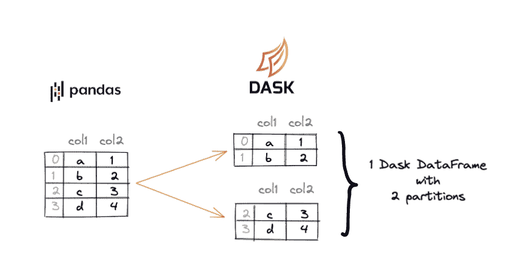

# 第一章：理解 Dask DataFrames 的架构

Dask DataFrames 允许您扩展您的 pandas 工作流。Dask DataFrames 克服了 pandas 的两个关键限制：

+   pandas 无法运行大于内存的数据集

+   在运行分析时，pandas 只使用一个核心，这可能会很慢。

Dask DataFrames 的设计目的是克服这些 pandas 的限制。它们可以运行在大于内存的数据集上，并默认使用所有核心进行快速执行。以下是允许 Dask 克服 pandas 限制的关键 Dask DataFrame 架构组件：

+   数据分区

+   懒执行

+   不一次性加载所有数据到内存中

让我们首先查看 pandas 的架构，以便更好地理解它与 Dask DataFrames 的关系。

您需要构建一些新的关于分布式处理的思维模型，以充分利用 Dask DataFrames 的强大功能。幸运的是，对于 pandas 程序员来说，Dask 的语法意图设计为具有相似性。只需在使用分布式计算系统时学习关键差异，就能轻松过渡到 Dask。

# pandas 架构

pandas DataFrames 今天广泛使用部分是因为它们易于使用、功能强大且高效。我们在本书中不深入探讨它们，但将快速回顾一些其关键特征。首先，它们包含具有索引的行和值。

让我们创建一个带有 `name` 和 `balance` 列的 pandas DataFrame 来说明：

```py
import pandas as pd
df = pd.DataFrame({"name": ["li", "sue", "john", "carlos"], "balance": [10, 20, 30, 40]})
```

此 DataFrame 有 4 行数据，如图 1-1 所示。


###### 图 1-1。带有四行数据的 pandas DataFrame

在图 1-2 中的 DataFrame 也有一个索引。


###### 图 1-2。pandas DataFrame 具有索引

pandas 可以轻松运行数据的分析查询。它还可用于构建复杂模型，并且对于小数据集是一个很好的选择，但对于较大的数据集效果不佳。让我们看看为什么 pandas 对于更大的数据集效果不佳。

# pandas 的限制

pandas 有两个关键限制：

+   它的 DataFrame 受计算机内存量的限制

+   它的计算仅使用单个核心，这对于大型数据集来说速度较慢

pandas DataFrames 加载到单台计算机的内存中。单台计算机 RAM 中可以存储的数据量受限于计算机 RAM 的大小。例如，具有 8 GB 内存的计算机只能在内存中存储 8 GB 的数据。实际上，pandas 要求内存远大于数据集大小。例如，一个 2 GB 的数据集可能需要 8 GB 的内存（确切的内存需求取决于执行的操作和 pandas 版本）。图 1-3 说明了 16 GB RAM 计算机上 pandas 可以处理的数据集类型。


###### 图 1-3。16 GB RAM 计算机上 pandas 可以处理的数据集大小

此外，pandas 不支持并行处理。这意味着即使 CPU 中有多个核心，使用 pandas 时始终限制为一次仅使用一个 CPU 核心。这意味着您经常未能充分利用硬件潜力（见图 3-4）。


###### 图 1-4。pandas 仅使用单个核心，不充分利用所有可用的计算能力

让我们转向 Dask，看看它是如何设计来克服 pandas 的扩展性和性能限制的。

# Dask DataFrames 与 pandas 的不同之处

Dask DataFrames 与 pandas DataFrames 具有相同的逻辑结构，并共享许多相同的内部结构，但在架构上有几个重要的差异。正如您在图 1-5 中所看到的，pandas 将所有数据存储在单个 DataFrame 中，而 Dask 将数据集拆分为许多小的 pandas DataFrames。


###### 图 1-5。每个 Dask DataFrame 中的分区都是一个 pandas DataFrame

假设您有一个 pandas DataFrame，内容如下：

```py
	col1	col2
0	a	1
1	b	2
2	c	3
3	d	4
```

这个 pandas DataFrame 可以转换为 Dask DataFrame，它将数据拆分为许多较小的分区。每个 Dask DataFrame 中的分区都是一个 pandas DataFrame。一个 Dask DataFrame 由许多较小的 pandas DataFrames 组成。

与 pandas DataFrame 类似，Dask DataFrame 也有列、值和索引。请注意，Dask 通过行将 pandas DataFrame 拆分。

Dask DataFrames 可以并行地协调多个 pandas DataFrames。它们将许多 pandas 数据帧按索引拆分排列。

因为现在数据分成了许多不同的片段，所以 Dask DataFrames 不必一次性加载到内存中。图 1-6 展示了 Dask DataFrames 如何逐个加载这些片段，使我们能够处理比内存更大的数据集。


###### 图 1-6\. Dask DataFrames 可以处理的数据集大小

因为数据被分成多个片段，所以 Dask DataFrames 也可以并行处理，这通常导致处理速度更快。图 1-7 展示了每个 Dask DataFrame 分区（即 pandas DataFrame）如何在单独的 CPU 核心上进行处理。


###### 图 1-7\. Dask DataFrames 使用所有可用核心运行计算

然而，由于并非所有数据同时存在于内存中，因此某些操作可能会变慢或变得更加复杂。例如，像排序 DataFrame 或查找中位数值这样的操作可能会更加困难。有关更多信息和最佳实践，请参阅第四章。

# 示例说明了 Dask DataFrame 的架构组件。

让我们通过一个简单的代码示例来说明前一节讨论的架构概念。我们将创建一个 pandas DataFrame，然后将其转换为 Dask DataFrame 以突显其区别。

下面是创建带有`col1`和`col2`列的 pandas DataFrame 的代码：

```py
import pandas as pd
df = pd.DataFrame({"col1": ["a", "b", "c", "d"], "col2": [1, 2, 3, 4]})
	col1	col2
0	a	1
1	b	2
2	c	3
3	d	4
```

现在将 pandas DataFrame 转换为具有两个分区的 Dask DataFrame（`ddf`）。

```py
import dask.dataframe as dd
ddf = dd.from_pandas(df, npartitions=2)
```

Dask DataFrame 中的数据被分成两个分区，因为我们在创建 Dask DataFrame 时设置了`npartitions=2`。

Dask 故意将数据分成不同的分区，以便可以并行运行分区上的计算。Dask 的速度和可伸缩性取决于其能够将计算分解为较小的块并利用机器上所有可用的计算核心来运行它们。

图 1-8 展示了 Dask DataFrame 如何分成两个分区，每个分区都是一个 pandas DataFrame：



###### 图 1-8\. pandas DataFrame 被拆分成 Dask DataFrame 分区

Dask 将数据分成不同分区的架构还允许惰性执行计算。

# 惰性执行

Dask DataFrames 使用*惰性*执行，而 pandas 使用*急切*执行。Dask 会推迟运行计算直到最后一刻，与 pandas 立即执行计算的方式形成对比。这使得 Dask 可以做到两件 pandas 无法做到的事情：

1.  处理比内存更大的数据集

1.  收集关于要运行的计算尽可能多的数据，然后优化计算以实现最大性能。

让我们创建一个 pandas DataFrame，并运行一个过滤操作来演示它立即运行计算（急切执行）。然后让我们在 Dask DataFrame 上运行相同的过滤操作，以观察延迟执行：

```py
import pandas as pd
df = pd.DataFrame({"letter": ["a", "b", "c", "d"], "number": [10, 20, 30, 40]})
```

过滤 pandas DataFrame，仅包括`number`值大于 25 的行。

```py
df[df.number > 25]
	letter  number
2	c	  30
3	d	  40
```

pandas 会立即执行计算并返回结果。

让我们将 pandas DataFrame 转换为具有两个分区的 Dask DataFrame：

```py
import dask.dataframe as dd
ddf = dd.from_pandas(df, npartitions=2)
```

现在让我们在 Dask DataFrame 上运行相同的过滤操作，并看到实际上没有返回任何结果：

```py
ddf[ddf.number > 25]
```

这是输出的内容：

```py
Dask DataFrame Structure:
               letter   number
npartitions=2  
            0  object   int64
            2     ...     ...
            3     ...     ...
Dask Name: loc-series, 8 tasks
```

除非显式请求结果，否则 Dask 不会运行过滤操作的计算。在这种情况下，你只是要求 Dask 进行过滤，但并没有要求返回结果，这就是为什么生成的 Dask DataFrame 目前不包含数据。pandas 用户起初会觉得 Dask 的延迟执行很奇怪，需要一段时间才能习惯显式请求结果（而不是急切地接收结果）。

在这种情况下，您可以通过调用`compute()`方法来获取结果，该方法告诉 Dask 执行过滤操作并在 pandas DataFrame 中收集结果：

```py
ddf[ddf.number > 25].compute()
	letter  number
2	c	  30
3	d	  40
```

让我们将注意力转向 Dask DataFrames 和 pandas 之间的另一个关键架构差异。

# Dask DataFrame 的分区

pandas 索引是许多高性能操作的关键，如时间序列操作、高效的连接、快速查找特定值等等。Dask DataFrames 不会将整个 pandas 索引存储在内存中，但它们确实跟踪每个分区的索引范围，称为*分区*。

图 1-9 显示了一个按月分区的 Dask DataFrame 示例，以及存储在 Dask DataFrame 中的分区。Dask 分区跟踪每个分区的起始索引值以及最后一个分区的结束索引值。


###### 图 1-9\. 按月分区的 Dask DataFrame

分区对于 Dask DataFrames 非常重要，正如 pandas 索引对于 pandas DataFrames 的重要性一样。第四章将向您展示良好的索引/分区信息跟踪如何显著提高性能。

图 1-10 查看之前的同一个 Dask DataFrame，并更详细地探索 DataFrame 的分区。


###### 图 1-10\. 带有分区的 Dask DataFrame

注意，第一个分区包含索引 0 和索引 1 的行，第二个分区包含索引 2 和索引 3 的行。

您可以访问 `known_divisions` 属性，以确定 Dask 是否意识到给定 DataFrame 的分区边界。在本例中，`ddf.known_divisions` 将返回 `True`，因为 Dask 知道分区边界。

`divisions` 属性将告诉您 DataFrame 的确切分区边界：

```py
ddf.divisions # (0, 2, 3)
```

下面是如何解释返回的 `(0, 2, 3)` 元组的内容：

+   第一个分区包含从零到二（不含上界）的索引值

+   第二个分区包含从两到三（含上界）的索引值

假设您要求 Dask 获取索引为 3 的行。Dask 无需扫描所有分区来查找该值。它知道索引为 3 的行在 `divisions` 元数据的第二个分区中，因此可以将索引 3 的搜索缩小到单个分区。这是一个重要的性能优化，特别是当存在数千个分区时。

###### 注

[提示] 在优化 Dask DataFrame 性能时，正确设置索引和管理分区是必要的。

# pandas 与 Dask DataFrame 在大于内存的数据集上的比较

本节创建了一个大于内存的数据集，并演示了 pandas 无法对该数据运行查询，但是 Dask 可以查询数据。

让我们使用 Dask 在本地机器上的 *~/data/timeseries/20-years/parquet/* 目录下创建 1,095 个 Snappy 压缩的 Parquet 文件（58.2 GB）：

```py
import os
import dask
home = os.path.expanduser("~")
ddf_20y = dask.datasets.timeseries(
    start="2000-01-01",
    end="2020-12-31",
    freq="1s",
    partition_freq="7d",
    seed=42,
)
ddf_20y.to_parquet(
    f"{home}/data/timeseries/20-years/parquet/",
    compression="snappy",
    engine="pyarrow",
)
```

这里是输出到磁盘的文件：

```py
data/timeseries/20-years/parquet/
  part.0.parquet
  part.1.parquet
  …
  part.1095.parquet
```

这是数据的样子：

| 时间戳 | id | 名称 | x | y |
| --- | --- | --- | --- | --- |
| 2000-01-01 00:00:00 | 1008 | 丹 | -0.259374 | -0.118314 |
| 2000-01-01 00:00:01 | 987 | 帕特里夏 | 0.069601 | 0.755351 |
| 2000-01-01 00:00:02 | 980 | 赛尔达 | -0.281843 | -0.510507 |
| 2000-01-01 00:00:03 | 1020 | 乌苏拉 | -0.569904 | 0.523132 |
| 2000-01-01 00:00:04 | 967 | 迈克尔 | -0.251460 | 0.810930 |

每秒有一行数据持续 20 年，因此整个数据集包含 6.62 亿行。

让我们使用 pandas 计算一个数据文件中 `id` 列的平均值：

```py
path = f"{home}/data/timeseries/20-years/parquet/part.0.parquet"
df = pd.read_parquet(path)
df["id"].mean() # 999.96
```

pandas 在分析单个数据文件时效果很好。现在让我们尝试在所有数据文件上使用 pandas 运行相同的计算：

```py
import glob
path = f"{home}/data/timeseries/20-years/parquet"
all_files = glob.glob(path + "/*.parquet")
df = pd.concat((pd.read_parquet(f) for f in all_files))
```

糟糕！这个计算因内存不足而出错。大多数个人计算机甚至远远不够容纳 58.2 GB 的数据集。这个 pandas 计算将填满所有计算机的 RAM，然后出错。

让我们用 Dask 运行相同的计算：

```py
ddf = dd.read_parquet(f"{home}/data/timeseries/20-years/parquet", engine="pyarrow")
ddf["id"].mean().compute()# returns 1000.00
```

这个计算在具有 8 GB RAM 和四个核心的计算机上执行需要 8 秒。具有更多核心的计算机能够以更多的并行性执行 Dask 计算，并且运行得更快。

正如本例所示，Dask 可以轻松地将本地主机工作流扩展到机器的所有核心。Dask 不会一次性加载所有数据到内存中，可以以流式方式运行查询。这使得 Dask 能够对比内存更大的数据集执行分析查询。

此示例显示了 Dask 如何扩展本地主机计算，但这并不是 Dask 允许的唯一类型的扩展。

# 扩展 vs 分布

Dask DataFrame 可以通过两种不同的方式扩展 pandas 计算：

+   *Scale up:* 使用计算机的所有核心，而不是像 pandas 一样使用单个核心。

+   *Scale out:* 在多台计算机（称为集群）上执行查询，而不是在单台计算机上执行。

正如之前讨论的，pandas 工作流只使用单台计算机的单个核心。因此，即使有 8 或 96 个可用，pandas 也只会使用一个核心。Dask 通过并行运行计算，使用所有核心，从而扩展了单机工作流。因此，如果在具有 96 个核心的计算机上运行 Dask，它将分割工作并利用所有可用的硬件来处理计算。

Dask DataFrame 的架构允许并行处理。在一台拥有 96 核心的机器上，Dask 可以将数据分割成 96 个分区，并同时处理每个分区。

Dask 还可以将计算扩展到多台计算机上运行。假设您有一个拥有 3 台计算机的集群，每台计算机有 24 个核心。Dask 可以将数据分割到多台不同的计算机上，并在集群中所有 72 个可用核心上运行计算。

扩展是将工作流从使用单个核心扩展到使用给定机器的所有核心。分布是将工作流扩展到在集群中的多台计算机上运行。Dask 允许您扩展或分布，两者在不同场景中都很有用。

# 总结

本章解释了 Dask DataFrames 如何通过架构来克服 pandas 的扩展和大数据性能问题。对 Dask DataFrames 有一个良好的基础理解将帮助您有效地利用它们的功能。

Dask DataFrames 增加了额外的开销，因此并不总是比 pandas 更快。对于小数据集，将数据加载到内存并运行计算非常快，pandas 的性能也相当不错。随着数据集大小的增加和使用更强大的机器，Dask 获得了性能优势。数据越大，计算机核心越多，并行处理效果越好。

当数据集大于内存时，显然 Dask 是更好的选择。pandas 无法处理大于内存的数据集。正如我们的例子所示，Dask 可以在比内存大得多的数据集上运行查询。

第四章继续深入探讨 Dask DataFrames。第四章将展示更多重要的操作，帮助您操作数据。现在您已经了解了 Dask DataFrames 的架构，能够深入理解不同类型的 Dask DataFrame 操作。
