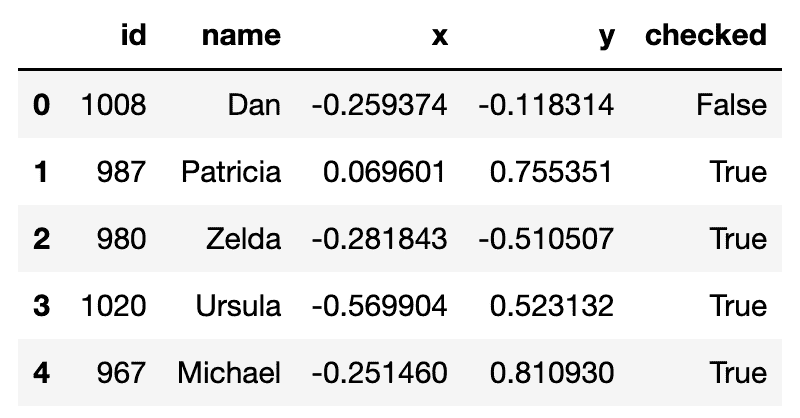

# 第二章：如何使用 Dask DataFrames

在上一章中，我们解释了 Dask DataFrames 的架构以及它们是如何构建在 pandas DataFrames 上的。我们看到 pandas 无法扩展到大于内存的数据集，以及 Dask 如何克服这种扩展限制。现在是时候深入研究我们在处理 Dask DataFrames 时需要掌握的具体策略了。

在本章中，我们将应用我们学到的经验来处理使用 Dask 处理大型表格数据集。我们将通过实际的代码示例来读取、检查、处理和写入大型数据集，使用 Dask DataFrames。通过解决这些示例，我们将深入了解 Dask DataFrame API，并建立起在实际项目中使用 Dask 时实施最佳实践的理解。这是对我们在第二章中处理的端到端示例 Dask DataFrame 的一种‘幕后’深入挖掘。

从上一章中带给我们的一个重要教训是，pandas 只使用一个核心来处理计算，而 Dask 可以通过多个核心上的并行处理加快查询执行时间。使用 Dask 因此意味着进入*并行计算*的世界。

这意味着，即使 Dask DataFrame API 的许多语法对于 pandas 用户来说可能看起来很熟悉，但需要注意重要的底层架构差异。前一章对这些差异进行了概念层面的解释。本章从那里开始，深入探讨了 Dask API 的实际应用。它将解释如何实践利用并行计算的威力。

随着我们在本章的进行，记住：

+   Dask DataFrames 由**多个分区**组成，每个分区都是一个 pandas DataFrame。

+   这些分区由多个核心**并行处理**。

+   Dask 使用**惰性求值**来优化大规模计算以进行并行计算。

这些基本概念将是理解如何最优地利用 Dask DataFrame API 函数的重要基础。

# 将数据读入 Dask DataFrame

想象一下，您正在为一家为其客户处理大规模时间序列数据集的公司工作。您正在 Data Analysis 团队工作，刚刚从同事 Azeem 那里收到了文件 `0000.csv` 的副本，并要求分析其中的数据模式。这个示例文件包含 1 周的数据，仅 90 MB 大，这意味着您可以使用 pandas 来分析这个子集：

```py
import pandas as pd
df = pd.read_csv("0000.csv")
```

一旦文件加载到 DataFrame 中，您就可以使用 pandas 分析其中包含的数据。例如，使用 head() 方法查看 DataFrame 中的前几行数据：

```py
>>> df.head()
                       id     name         x         y
timestamp
1990-01-01 00:00:00  1066    Edith -0.789146  0.742478
1990-01-01 00:00:01   988   Yvonne  0.520779 -0.301681
1990-01-01 00:00:02  1022      Dan  0.523654 -0.438432
1990-01-01 00:00:03   944      Bob -0.768837  0.537302
1990-01-01 00:00:04   942   Hannah  0.990359  0.477812
...                   ...      ...       ...       ...
1990-01-03 23:59:55   927    Jerry -0.116351  0.456426
1990-01-03 23:59:56  1002    Laura -0.870446  0.962673
1990-01-03 23:59:57  1005  Michael -0.481907  0.015189
1990-01-03 23:59:58   975   Ingrid -0.468270  0.406451
1990-01-03 23:59:59  1059      Ray -0.739538  0.798155
```

或计算某一列中具有正值记录的数量：

```py
>>> len(df[df.x > 0])

302316
```

现在确认可以对数据进行分析后，Azeem 要求你处理年初的数据。他已经从服务器下载了一个单个约 2.4GB 大小的 CSV 文件。你可能仍然可以用 pandas 处理它，但这会推动你的机器到极限，分析速度很慢。这是个问题，因为 Azeem 的截止日期临近，他需要快速得到结果。

幸运的是，Dask 可以将这个单个大约 2.4GB 的文件切分成小块，并并行处理这些块。而 pandas 必须在单个核心上处理所有数据，Dask 可以将计算分布到机器的所有核心上。这样会快得多。

## 将单个文件读入 Dask DataFrame

你可以使用以下语法将 Azeem 的 2.4GB 的单个 CSV 文件 `6M.csv` 读入 Dask DataFrame 中：

```py
import dask.dataframe as dd
ddf = dd.read_csv("6M.csv")
```

###### 注意

[注意] 注意：我们使用 `ddf` 表示 **D**ask **D**ata**F**rames，使用传统的 `df` 表示 pandas DataFrames。

Dask 将这个大型单个 CSV 文件的数据读入 Dask DataFrame。Dask DataFrame 总是被切分成适当大小的称为 **partitions** 的‘块’。通过将数据切分为这些方便的小块，Dask DataFrame 可以在多个核心上分布计算。这就是使 Dask 能够处理比 pandas 更大数据集的原因。详见处理分区数据一节。


###### 图 2-1\. Dask 将 CSV 文件读入分区 DataFrame。

一旦你加载了这个 2.4GB 的 CSV 文件，你可以使用 Dask DataFrame 分析其中包含的数据。这在外观和感觉上与 pandas 差不多，不过你不再受到机器内存容量的限制，可以在数百万行而不是数千行上运行分析。而且最重要的是，你可以在 Azeem 的重要截止日期之前进行分析。

## 将多个文件读入 Dask DataFrame

在成功处理了包含 Q1 和 Q2 数据的 `6M.csv` 文件后，Azeem 开始看到 Dask 的强大之处。他现在要求你查看他所有可用的数据。这是二十年的时间序列数据，总计近 60GB，分布在 1,095 个单独的 CSV 文件中。这在 pandas 中是不可能完成的任务，但 Dask 在这里为你打开了全新的可能性。

你要求 Azeem 指出包含其余数据的目录，看起来是这样的：

```py
$  ls
0000.csv
0001.csv
0002.csv
…
1094.csv
```

Dask DataFrame 允许你使用 * 作为 glob 字符串一次性读取所有这些单独的 CSV 文件到 Dask DataFrame 中：

```py
ddf = dd.read_csv("*.csv")
```


###### 图 2-2\. Dask 将多个 CSV 文件读入分区 DataFrame。

就像我们在单个 CSV 文件中看到的那样，Dask 将跨所有这些单独的 CSV 文件读取数据到一个单独的 Dask DataFrame 中。DataFrame 将被划分为适当大小的‘块’，称为**分区**。让我们更仔细地看看如何处理 Dask 分区。

## 使用分区数据工作

Dask 故意并自动地将数据分割成分区，以便可以并行地在数据的分区上执行操作。这是无论原始文件格式如何都会进行的操作。了解如何影响数据分区以选择适合您数据集的分区策略至关重要，以提供最佳性能。

运行`ddf.partitions`可以查看数据分成了多少个分区。

```py
>> ddf.partitions
1095
```

## 设置分区大小

默认情况下，Dask 将根据可用内存和机器上的核数计算出最佳的`blocksize`来将数据分成一定数量的分区。这意味着在不同的机器上处理同一数据集时，分区的数量可能会有所不同。Dask 将确保分区足够小以便快速处理，但又不至于过小以致造成不必要的开销。Dask 默认计算的最大`blocksize`为 64 MB。

Dask 将 CSV 文件的数据分割成每个文件一个分区。


###### 图 2-3\. Dask 将一个大的 CSV 文件读取为多个分区。

您可以使用`blocksize`参数手动设置 DataFrame 包含的分区数量。您可以调整分区大小以获得最佳性能。

```py
>>> ddf = dd.read_csv("*.csv", blocksize="16MB")
>>> ddf.npartitions
2190
```

当块大小设置为 16 MB 时，这个数据集将被读入一个包含 2190 个分区的 Dask DataFrame 中。当块大小减小时，分区数量会增加。


###### 图 2-4\. 随着分区变小，分区数量增加。

###### 注意

[提示] 作为一个经验法则，我们建议使用每个分区不超过 100MB 的大小。这样可以确保分区足够小，避免瓶颈，但又不至于过小导致不必要的开销。

## 检查数据类型

成功将 1,095 个 CSV 文件读取到一个单独的 Dask DataFrame 后，您现在想知道使用 pandas 分析的单个`0000.csv`文件中的数据类型是否与文件夹中其他 1,094 个文件的数据类型相同。请记住，`df`是一个包含 93MB 样本数据的 pandas DataFrame，`ddf`是一个包含 58GB 数据的 Dask DataFrame。

您可以使用`dtypes`方法在 pandas 中检查数据类型：

```py
	>> df.dtypes
timestamp     	object
id            	int64
name         	object
x            	float64
y            	float64
dtype: object
```

pandas 扫描所有数据以获取数据类型。对于一个容易适应本地内存的 93MB 文件来说，这是可以接受的。然而，在处理 Dask DataFrames 时，我们希望避免将所有数据读入内存。加载所有 CSV 文件到内存中以获取数据类型将导致 `MemoryError`。

相反，Dask *推断* 列数据类型（如果用户没有明确设置的话）。它通过将 DataFrame 的前 *n* 行读入内存，并使用内容推断其余行的数据类型。这里的 *n* 由 `sample` 或 `sample_rows` 参数的值确定，`sample` 定义要读取的字节数，`sample_rows` 定义要读取的行数。

让我们检查一下我们的 Dask DataFrame 的数据类型：

```py
ddf = dd.read_csv("*.csv")
ddf.dtypes
timestamp     	object
id             	int64
name         	object
x            	float64
y            	float64
dtype: object
```

###### 注意

[警告] 你应该意识到基于少量行样本推断数据类型是容易出错的。Dask 可能会根据少量行的样本错误地推断数据类型，这将导致下游计算出错。

例如，一个列 `id` 的前 1000 行可能只包含整数，而第 1001 行可能是字符串。如果 Dask 只读取了前 1000 行，那么 `id` 的 dtype 将被推断为 `int64`。当试图对列上的整数运行操作时，这将导致下游错误，因为它包含至少一个字符串。这个列的正确 dtype 应该是 `object`。

当读取 CSV 文件时，你可以通过明确指定 dtypes 来避免数据类型推断。

让我们手动将 name 列设置为字符串，这比对象类型列更有效率：

```py
>>> ddf = dd.read_csv(
    "*.csv",
    dtype={
        "name": "string[pyarrow]",
    },
)
>>> ddf.dtypes
timestamp     object
id             int64
name          string
x            float64
y            float64
dtype: object
```

Dask 将推断那些你没有手动指定数据类型的列的数据类型。如果你为所有列指定了数据类型，那么 Dask 将不会进行任何数据类型推断。

## 从云中读取远程数据

在向团队领导展示了 Dask 的强大之后，你现在被要求在生产环境中对所有数据进行分析。现在问题是，Azeem 实际上已经从公司的 S3 存储桶中下载了 CSV 文件。这在生产环境中运行这些关键分析时是不可接受的，而且也违反了公司的数据管理最佳实践。你被要求重新进行分析，而不是将数据下载到本地。

Dask 读取器可以轻松读取存储在远程对象数据存储中的数据，比如 AWS S3。

下面是如何将存储在公共 S3 存储桶中的 CSV 文件读取到本地机器上的方法：

```py
ddf = dd.read_csv(
    "s3://coiled-datasets/timeseries/20-years/csv/*.part"    
)
```

###### 注意

[提示] Dask DataFrame 读取器暴露了一个 `storage_options` 关键字，允许你将额外的配置传递给远程数据存储，比如从私有存储桶读取时的凭据或者是否使用 SSL 加密连接。当与私有存储桶一起工作或者你的 IT 部门有特定的安全政策时，这将非常有用。

由于 Dask 的惰性评估，运行上述命令将很快完成。但对于后续的操作，请记住数据实际上需要从远程云存储下载到你的本地机器上进行计算。这称为“将数据移动到计算”，通常效率不高。

因此，通常最好在云计算环境中运行远程数据上的计算。

这里是如何使用 Coiled 在云端启动 Dask 集群并运行这些计算任务。你需要一个 Coiled 账户来启动这些资源。如果你已购买本书，将获得 XXX 免费的 Coiled 信用额度。请访问链接 [LINK](https://www.coiled.io) 注册你的个人 Coiled 账户。

我们将导入 Dask 和 Coiled：

```py
import coiled
import dask
```

然后启动一个包含 5 个 worker 的 Dask 集群：

```py
cluster = coiled.Cluster(
    name="demo-cluster", 
    n_workers=5
)
```

最后，我们将把我们的本地 Dask 客户端连接到远程集群：

```py
client = dask.distributed.Client(cluster)
```

所有后续的 Dask 计算现在将在云端执行，而不是在你的本地机器上。

# 使用 Dask DataFrames 处理数据

在前一节中，我们看到了如何从各种来源和文件格式加载数据到 Dask DataFrame，并强调了分区和数据类型推断的考虑。现在你已经将 CSV 数据加载到你的 Dask DataFrame 中，并准备好深入研究这些数据了。

Dask 是有意设计成可以无缝扩展现有流行的 PyData 库，如 NumPy、scikit-learn 和 pandas。这意味着使用 Dask DataFrames 处理数据将看起来和感觉上与在 pandas 中一样。

例如，下面的代码演示了如何使用 Dask DataFrames 来过滤行、计算减少和执行分组聚合：

```py
# filter rows
ddf[ddf.x > 0]
# compute max
ddf.x.max()
# perform groupby aggregation
ddf.groupby(“id”).x.mean()
```

但是，有一些情况需要额外考虑 Dask 操作，主要是因为我们现在在并行计算环境中操作。接下来的部分深入探讨了这些特定情况。

## 转换为 Parquet 文件

Azeem 听说 Parquet 文件比 CSV 文件查询更快更有效。他还不确定提供的性能优势，但在同事的帮助下，他相对容易地完成了转换：

```py
ddf.to_parquet("s3://coiled-datasets/timeseries/20-years/parquet", engine=”pyarrow”)
```

有关更多详细信息，请参阅 Parquet 部分的优势。

让我们看看 Azeem 如何查询和操作这个 20 年的 Parquet 数据集的各种方式。

## 在内存中实现计算结果

你可以使用 `compute()` 将 Dask DataFrame 转换为 pandas DataFrame。当数据集较小时，将其转换为 pandas DataFrame 是可以接受的。总的来说，你不应该将 Dask DataFrames 转换为 pandas DataFrames，因为这样会失去 Dask 的所有并行性和惰性执行的优势。

在本章的前面部分，我们看到 Dask DataFrames 由一组基础的 pandas DataFrames（分区）组成。调用 `compute()` 将所有 Dask DataFrame 分区连接成单个 Pandas DataFrame。

当 Dask DataFrame 包含分布在集群中多个节点上的数据时，`compute()` 可能运行缓慢。如果数据不能小到足以适应单台机器的内存，它还可能导致内存错误。

Dask 的创建目的是解决在单台机器上使用 pandas 时的内存问题。当你运行 `compute()` 时，你将面临 pandas 的所有正常内存限制。

让我们看一些例子，看看在分析中何时最好使用 compute()。

### 小型 DataFrame 示例

`compute()` 将 Dask DataFrame 转换为 pandas DataFrame。我们通过一个小例子来演示。

创建一个包含两列的 Dask DataFrame，然后将其转换为 pandas DataFrame：

```py
>>> import dask.dataframe as dd
>>> import pandas as pd
>>> df = pd.DataFrame({
"col1": ["a", "b", "c", "d"], 
"col2": [1, 2, 3, 4]
    })
>>> ddf = dd.from_pandas(df, npartitions=2)
>>> ddf.compute()
  col1  col2
0    a     1
1    b     2
2    c     3
3    d     4
```

验证 `compute()` 返回一个 pandas DataFrame：

```py
>>> type(ddf.compute())
pandas.core.frame.DataFrame
```

Dask DataFrames 由许多底层的 pandas DataFrames 组成，每个称为一个分区。当数据足够小以适应单个 pandas DataFrame 的内存时，调用 `compute()` 是没有问题的，但是一旦数据过大以至于不能在单台机器的内存中容纳，这种方法就会失败。

让我们在云集群环境中对一个大 DataFrame 运行 `compute()` 并查看错误信息。

### 大型 DataFrame 示例

创建一个包含 662 百万行数据的 Dask DataFrame，并将其读入一个 5 节点的 Dask 集群中：

```py
cluster = coiled.Cluster(name="demo-cluster", n_workers=5)
client = dask.distributed.Client(cluster)
ddf = dd.read_parquet(
    "s3://coiled-datasets/timeseries/20-years/parquet",
    storage_options={"anon": True, "use_ssl": True},
    engine="pyarrow",
)
```

对 Dask DataFrame 进行过滤操作，然后使用 `compute()` 将结果收集到一个单独的 pandas DataFrame 中：

```py
res = ddf.loc[ddf["id"] > 1150]
res.compute()
```

这个操作之所以有效，是因为 `res` 只有 1,103 行数据。这样小规模的数据集可以轻松地收集到一个单独的 pandas DataFrame 中。

如果我们试图将整个 663 百万行数据集收集到一个 pandas DataFrame 中，`ddf.compute()` 将会报错。

Azeem 的数据集有 58 GB，这对于单台机器来说太大了。

### Compute 的直觉

这里有一个图示直观地展示了 compute() 的工作原理，帮助你更好地理解。

假设你有一个包含 4 个分区的 3 节点集群。你运行一个 compute() 操作将所有数据收集到一个单独的 Pandas DataFrame 中。


###### 图 2-5\. 调用 compute() 可能会导致内存错误。

这个图示清楚地说明了为什么 compute() 操作可能会导致内存异常。数据在集群中分布时可以拆分到多台机器上，但在单台机器的单个 pandas DataFrame 中可能无法容纳。

### 减少 compute() 调用次数

compute() 可能是一个昂贵的操作，因此尽可能减少 compute() 的调用次数是明智的。

下面的代码片段运行了两次 compute()，在一个包含 5 个节点的 Dask 集群上运行时间为 63 秒。

```py
%%time
id_min = ddf.id.min().compute()
id_max = ddf.id.max().compute()
CPU times: user 442 ms, sys: 31.4 ms, total: 473 ms
Wall time: 1min 20s
```

我们可以重构这段代码，只运行一次 compute()，运行时间为 33 秒。

```py
%%time
id_min, id_max = dask.compute(ddf.id.min(), ddf.id.max())
CPU times: user 222 ms, sys: 19.1 ms, total: 241 ms
Wall time: 35.5 s
```

比起多次调用 compute()，少调用 compute() 总是更快的，因为 Dask 可以优化共享任务的计算。

### 何时调用 compute()

如果您执行了大型过滤操作或其他减小整体数据集大小的操作，则可以调用`compute()`。如果您的数据适合内存，那么您不需要使用 Dask。如果您的数据足够小，请坚持使用 pandas。

当您希望强制 Dask 执行计算并返回结果时，您还将调用`compute()`。Dask 默认惰性执行计算。它将避免运行昂贵的计算，直到您运行像`compute()`这样的方法，强制执行计算。

## 使用`persist()`将结果在内存中实现。

您可以使用`persist()`将 Dask 数据框架存储在内存中，而不是调用`compute()`。这将把 Dask 数据框架的内容存储在集群内存中，从而使依赖于持久化数据的下游查询更快。当您执行一些昂贵的计算并希望将结果保存在内存中以避免多次重新运行时，这将非常有用。

###### 注意

[注意] 在本地工作时要小心使用`persist()`。调用`persist()`将计算结果加载到内存中，因为您没有操作集群以提供额外的资源，这可能意味着`persist()`会导致内存错误。当使用远程集群时，使用`persist()`效果最佳。

###### 注意

[注意] 请注意，`persist()`命令不会阻塞。这意味着您可以立即继续运行其他命令，`persist()`计算将在后台运行。

许多 Dask 用户错误地认为 Dask 数据框架默认存储在内存中，这是不正确的。Dask 在内存中运行计算。除非显式调用`persist()`，否则它不会将数据存储在内存中。

让我们从对小型数据框架上的`persist()`示例开始，然后转向对较大数据框架的示例，这样您就可以看到一些真实的性能基准。

### 简单的例子

让我们创建一个小型 Dask 数据框架来演示`persist()`的工作原理：

```py
>>> import dask.dataframe as dd
>>> import pandas as pd
>>> df = pd.DataFrame({
        "col1": ["a", "b", "c", "d"], 
   "col2": [1, 2, 3, 4]
    })
>>> ddf = dd.from_pandas(df, npartitions=2)
>>> persisted_ddf = ddf.persist()
>>> len(persisted_ddf)
4
```

当调用`persist()`时，`persisted_ddf`保存在内存中。后续基于`persisted_ddf`运行的查询将比没有调用`persist()`时执行速度更快。

让我们在较大的数据框架上运行`persist()`，以查看一些真实的计算运行时间。

### 大数据集的示例

让我们对一个尚未持久化的数据集运行一些查询，以获取一些基准查询运行时间。然后让我们持久化数据集，运行相同的查询，并量化持久化数据集带来的性能提升。

这些查询在 Azeem 的 20 年 Parquet 时间序列数据集上运行。

这是创建计算集群、读入数据框架，然后创建过滤数据框架的代码。

```py
import coiled
import dask
import dask.dataframe as dd
cluster = coiled.Cluster(name="powers", n_workers=5) 

client = dask.distributed.Client(cluster)
ddf = dd.read_parquet(
    "s3://coiled-datasets/timeseries/20-years/parquet",
    storage_options={"anon": True, "use_ssl": True},
    engine="pyarrow",
)
```

让我们计时一些分析查询。

```py
>>> res = ddf.loc[ddf["id"] > 1150]
>>> len(res)
87 seconds
>>> res.name.nunique().compute()
62 seconds
```

让我们将数据集持久化到集群内存中，然后运行相同的查询，看看它们执行需要多长时间。

```py
>>> persisted_res = res.persist()
>>> len(persisted_res)
2 seconds
>>> persisted_res.name.nunique().compute()
2 seconds
```

在数据持久化之前，这些查询执行需要超过一分钟，但在持久化数据集上只需 2 秒即可完成。

当然，持久化数据需要一些时间。让我们看看为什么这个特定的示例在持久化时给了我们很好的结果。

###### 注意

[注意] 持久化的绝佳机会

持久化有时会有所帮助，但有时会引起问题。让我们看一看通常何时会有帮助，何时通常会引起问题的高级模式。

我们的示例使用以下模式：

+   从一个大型数据集开始

+   将其过滤为一个比集群内存还小得多的数据集

+   在经过筛选的数据集上运行分析查询

您可以期待在这种情况下从 persist() 获得良好的结果。

这是一个不太可能产生如此好结果的不同模式。

+   读入一个大于内存的大型数据集

+   持久化整个数据集

+   运行单个分析操作

在这种情况下，运行持久化操作的成本将大于使单个查询运行速度稍快的好处。持久化并不总是有帮助的。

### 写入磁盘 vs 持久化在内存中

我们还可以通过将结果写入磁盘而不是保存数据在内存中来“持久化”结果。

让我们将经过筛选的数据集持久化到 S3，并运行分析查询以量化节省的时间。

```py
>>> res.repartition(2).to_parquet(
        "s3://coiled-datasets/tmp/matt/disk-persist", 
        engine="pyarrow"
    )
>>>> df = dd.read_parquet(
        "s3://coiled-datasets/tmp/matt/disk-persist",
        storage_options={"anon": True, "use_ssl": True},
        engine="pyarrow",
    )
>>> len(df) 
0.4 seconds
>>> df.name.nunique().compute()
0.3 seconds
```

写入磁盘的经过筛选的数据集可以在亚秒级的响应时间内进行查询。

将临时文件写入磁盘并不总是理想的，因为这样您就会有过时的文件挂在那里，需要稍后清理。

### 重新分区和持久化

我们还可以在持久化之前重新分区，这将使我们在这个示例中运行的分析查询速度更快。

```py
>>> res2 = res.repartition(2)
>>> persisted_res2 = res2.persist()
>>> len(persisted_res2)
0.3 seconds
>>> persisted_res2.name.nunique().compute()
0.3 seconds
```

经过筛选的数据集很小，不需要很多分区。这就是为什么在这个示例中，重新分区将查询时间从大约 2 秒降低到 0.3 秒的原因。

### 持久化摘要

持久化是您 Dask 工具包中强大的优化技术。

当您执行了一些昂贵的操作以减少数据集大小，并且随后的操作从存储的计算中受益时，这将非常有用。

一些新的 Dask 程序员可能会误用 persist()，通过过于频繁地持久化或尝试持久化大量数据集来减慢分析速度。有时它确实有所帮助，但如果使用不正确，则可能导致分析运行速度变慢。

当以下一项或多项事实为真时，持久化通常会加快分析速度：

+   您执行了减少数据集大小的昂贵计算

+   减少的数据集可以舒适地适应内存

+   您希望在减少的数据集上运行多个查询

## 重新分区 Dask DataFrames

本节解释了如何使用重新分区在 Dask DataFrame 中重新分配数据。当数据在分区之间分布不均匀时，分析速度会变慢，而重新分区可以平滑数据并提供显著的性能提升。

Dask DataFrames 包含多个分区，每个分区都是一个 pandas DataFrame。如果有很多太小的分区或者有一些太大的分区，Dask 的性能会受到影响。重新分区 Dask DataFrame 可以解决“分区不平衡”的问题。

让我们从一些简单的示例开始，让你熟悉 repartition() 的语法。

### 简单的示例

让我们创建一个包含六行数据的 Dask DataFrame，分为三个分区：

```py
import pandas as pd
import dask.dataframe as dd
df = pd.DataFrame({
    "nums":[1, 2, 3, 4, 5, 6], 
    "letters":["a", "b", "c", "d", "e", "f"]
})
ddf = dd.from_pandas(df, npartitions=3)
```

打印每个 DataFrame 分区的内容：

```py
>>>> for i in range(ddf.npartitions):
        print(ddf.partitions[i].compute())
  nums letters
0     1       a
1     2       b
   nums letters
2     3       c
3     4       d
   nums letters
4     5       e
5     6       f
```

将 DataFrame 重新分区为两个分区：

```py
>>> ddf2 = ddf.repartition(2)
>>> for i in range(ddf2.npartitions):
        print(ddf2.partitions[i].compute())
  nums letters
0     1       a
1     2       b
   nums letters
2     3       c
3     4       d
4     5       e
5     6       f
```

repartition(2) 导致 Dask 将分区 1 和分区 2 合并为一个单独的分区。Dask 的重新分区算法能够智能地合并现有分区并避免完全的数据洗牌。

你也可以通过重新分区来增加分区的数量。将 DataFrame 重新分区为 5 个分区：

```py
>>> ddf5 = ddf.repartition(5)
>>> for i in range(ddf5.npartitions):
        print(ddf5.partitions[i].compute())
  nums letters
0     1       a
   nums letters
1     2       b
   nums letters
2     3       c
   nums letters
3     4       d
   nums letters
4     5       e
5     6       f
```

在实践中，通过指定每个分区的目标大小（例如每个分区 100MB）来重新分区更为简单。你希望 Dask 完成确定数据集最佳分区数量的繁重工作。以下是重新分区为 100MB 分区的语法：

```py
ddf.repartition(partition_size="100MB")
```

### 何时重新分区

当然，重新分区并非免费，需要时间。执行完整数据洗牌的成本可能会超过后续查询性能的好处。

当数据集不平衡时，并非总是应该进行重新分区。重新分区应该根据具体情况逐案评估，并且只有在利大于弊的情况下才进行。

### 分区不平衡的常见原因

筛选是导致 DataFrame 分区不平衡的常见原因。

假设你有一个包含 first_name 列和以下数据的 DataFrame：

+   第 0 分区：每个人的名字都是“Allie”

+   第 1 分区：每个人的名字都是“Matt”

+   第 2 分区：每个人的名字都是“Sam”

如果你筛选出所有名字为“Allie”的行，那么第 1 分区和第 2 分区将会是空的。空的分区会导致 Dask 执行效率低下。通常在筛选后重新分区是明智的选择。

## 筛选 Dask DataFrame

本节说明了如何根据 DataFrame 的索引和列值使用 loc() 进行筛选 Dask DataFrame。

筛选 Dask DataFrame 可能会导致数据在分区之间不平衡，从性能的角度来看这是不可取的。本节说明了筛选可能引起的“空分区问题”，以及如何通过前面学习的重新分区技术消除空分区。

### 索引筛选

Dask DataFrames 包含多个分区，每个分区都是一个 pandas DataFrame。每个 pandas DataFrame 都有一个索引。Dask 允许你并行地根据它们的索引筛选多个 pandas DataFrame，速度非常快。

让我们创建一个包含 6 行数据的 Dask DataFrame，分为两个分区：

```py
import pandas as pd
import dask.dataframe as dd
df = pd.DataFrame({
"nums":[1, 2, 3, 4, 5, 6], 
"letters":["a", "b", "c", "d", "e", "f"]
})
ddf = dd.from_pandas(df, npartitions=2)
```

让我们可视化每个分区中的数据：

```py
>>> for i in range(ddf.npartitions):
        print(ddf.partitions[i].compute())
  nums letters
0     1       a
1     2       b
2     3       c
   nums letters
3     4       d
4     5       e
5     6       f
```

Dask 自动为我们的数据添加了一个整数索引列。

从 DataFrame 中获取第 2 和第 5 行：

```py
>>> ddf.loc[[2, 5]].compute()
  nums letters
2     3       c
5     6       f
```

从 DataFrame 中获取第 3、4 和第 5 行：

```py
>>> ddf.loc[3:5].compute()
  nums letters
3     4       d
4     5       e
5     6       f
```

让我们更多地了解 Dask 如何跟踪排序的 DataFrame 中关于分区的信息，以便高效执行`loc`过滤。

### 分区刷新器

我们已经在架构章节中讨论了 Dask DataFrame 的分区，但我们在这里要进行全面的复习，因为在处理 Dask DataFrame 索引时它们非常关键。

Dask 知道 DataFrame 每个分区的起始和结束索引值，并存储此分区的元数据以便快速过滤。

通过运行`ddf.known_divisions`并看到它返回`True`，您可以验证 Dask 知道这个特定 DataFrame 的分区。Dask 并非总是知道 DataFrame 的分区。

打印 DataFrame 的所有分区：

```py
>>> ddf.divisions
(0, 3, 5)
```

查看 DataFrame 每个分区中的值，以更好地理解这些分区的输出。

```py
>>> for i in range(ddf.npartitions):
        print(ddf.partitions[i].compute())
  nums letters
0     1       a
1     2       b
2     3       c
   nums letters
3     4       d
4     5       e
5     6       f
```

第一个分区是从 0 到 3，第二个分区是从 3 到 5。这意味着第一个分区包含行 0 到 2，最后一个分区包含行 3 到 5。

在这个例子中，Dask 的分区意识让它精确地知道在过滤时需要从哪些分区获取数据。

### 基于列值的过滤

您不总是能够基于索引值进行过滤。有时需要基于实际列值进行过滤。

获取 DataFrame 中所有`nums`为偶数的行：

```py
>>> ddf.loc[ddf["nums"] % 2 == 0].compute()
  nums letters
1     2       b
3     4       d
5     6       f
```

查找所有`nums`为偶数，并且`letters`包含`b`或`f`的行：

```py
>>> ddf.loc[(ddf["nums"] % 2 == 0) & (ddf["letters"].isin(["b", "f"]))].compute()
  nums letters
1     2       b
5     6       f
```

在过滤时，Dask 使应用多个逻辑条件变得容易。

### 空分区问题

让我们读取 Azeem 的 662 百万行 Parquet 数据集到一个 Dask DataFrame，并执行过滤操作以说明空分区问题。

读取数据并创建 Dask DataFrame：

```py
ddf = dd.read_parquet(
    "s3://coiled-datasets/timeseries/20-years/parquet",
    storage_options={"anon": True, 'use_ssl': True}
)
```

`ddf.npartitions`显示 DataFrame 有 1,095 个分区：

```py
>>> ddf.npartitions
1095
```

下面是如何过滤 DataFrame 以仅包含 id 大于 1150 的行：

```py
res = ddf.loc[ddf["id"] > 1150]
```

运行`len(res)`以查看在此过滤操作后 DataFrame 只有 1,103 行：

```py
>>> len(res)
1103
```

这是一个大的过滤操作，仅剩下原始 662 百万行的一小部分。

我们可以运行`res.npartitions`来查看 DataFrame 仍然有 1,095 个分区。过滤操作没有改变分区数目：

```py
>>> res.npartitions
1095
```

运行`res.map_partitions(len).compute()`来直观地检查每个分区中有多少行数据：

```py
>>> res.map_partitions(len).compute()
0       0
1       1
2       0
3       0
4       2
       ..
1090    0
1091    2
1092    0
1093    0
1094    0
Length: 1095, dtype: int64
```

许多分区是空的，其他分区只有少量数据行。

在大多数情况下，Dask 最适合至少 100MB 的分区大小。让我们将数据重新分区为两个分区并将其持久化到内存中：

```py
res2 = res.repartition(2).persist()
```

对`res2`的后续操作将非常快，因为数据存储在内存中。`len(res)`花费了 57 秒，而`len(res2)`仅花费了 0.3 秒。

在这个例子中，过滤后的数据集非常小，您甚至可以将其转换为 pandas DataFrame，使用`res3 = res.compute()`仅需 0.000011 秒执行`len(res3)`。

###### 注意

[提示] 您无需在计算引擎级别过滤数据集。您也可以在数据库级别进行过滤，并只将部分数据发送到计算引擎。

### 查询下推

查询下推是指在将数据发送到 Dask 集群之前执行数据操作。工作的一部分被“下推”到数据库级别。

这里是使用 Dask 集群进行过滤的高级流程：

+   将所有数据从磁盘读入集群

+   执行过滤操作

+   重新分区经过过滤的 DataFrame

+   可能将结果写入磁盘（ETL 类型工作流）或持久化在内存中。

组织通常需要优化数据存储，并以针对其查询模式和延迟需求优化的方式利用查询下推。

### 最佳实践

Dask 可以轻松过滤 DataFrame，但您需要意识到大过滤操作的影响。

在过滤大量数据后，您应考虑重新分区并将数据持久化在内存中。

您还应考虑在数据库级别进行过滤，并完全绕过集群过滤。许多 Dask 分析的运行速度比预期慢，因为执行了大量的过滤操作，并且分析师在处理具有大量空分区的 DataFrame 上运行操作。

## 设置索引

索引被普通的 pandas DataFrame、Dask DataFrame 和许多一般数据库使用。索引让您可以高效地找到具有特定值的行，而无需扫描每一行。

在普通的 pandas 中，这意味着在`set_index("col")`之后，`df.loc["foo"]`比之前的`df[df.col == "foo"]`更快。loc() 使用了一个高效的数据结构，只需检查几行即可找出“foo”在哪里。而`df[df.col == "foo"]`则必须扫描每一行以查看哪些匹配。

问题在于，计算机在扫描内存时非常快，因此在单台机器上运行 pandas 计算时，索引优化并不重要。但在多台分布式计算机上扫描内存却不快。因此，pandas 中您可能察觉不到的索引优化在 Dask 中会产生巨大差异。

### Dask DataFrame 分区

要记住，Dask DataFrame 由许多 pandas DataFrame 组成，这些 DataFrame 可能存在于不同的机器上，每个称为一个分区。这些分区是具有自己索引的 pandas DataFrame。


###### 图 2-6\. 需要图标题。

Dask DataFrame 对于分布式 DataFrame 有自己的版本索引，称为`divisions`。`divisions` 类似于索引的索引，它跟踪每个分区的索引边界，因此您可以轻松地确定哪个分区包含给定值（就像 pandas 的索引跟踪哪行将包含给定值一样）。


###### 图 2-7\. 需要图标题。

当数百台机器上分布着数百万行时，跟踪每一行就太多了。我们只想大概知道——哪台机器将持有这个值？——然后告诉那台机器去找到这行数据。

因此 `divisions` 只是一个简单的列表，给出了每个分区包含的值的下限和上限。利用这一点，Dask 在本地进行快速二分搜索，以确定包含给定值的分区。

就像使用 pandas 索引一样，有了已知的分区，我们可以将一个扫描每一行的搜索（`df``[df.col == "foo"]`）改为一个快速定位到正确位置的搜索（`df.loc``["foo"]`）。

### 如何设置索引

你可以使用 `set_index()` 方法设置 Dask DataFrame 的索引：

```py
ddf2 = ddf.set_index("id")
```

注意 `ddf.set_index("id")` 没有指定分区，因此 Dask 需要去找出它们。为此，它必须立即加载和计算整个 `ddf` 来查看其值的分布。然后，当你稍后调用 `.compute``()` 时，它将再次加载和计算 `ddf`。总体而言，这是慢的，特别是如果 DataFrame 已经应用了许多操作——所有这些操作也必须运行两次。

相反，当传递分区时，Dask 不需要计算整个 DataFrame 来找出它们，这显然快得多。要选择良好的分区，你必须利用对数据集的了解。列的值范围是什么？它们遵循什么样的一般分布——正态钟形曲线，连续分布？是否存在已知的异常值？

另一种策略是让 Dask 首次计算分区，然后复制粘贴它们以便稍后重用：

```py
dask_computed_divisions = ddf3.set_index("id").divisions
unique_divisions =  list(dict.fromkeys(list(dask_computed_divisions)))
print(repr(unique_divisions))
# ^ copy this and reuse
```

如果你将在相同（或类似）的数据上多次运行脚本或笔记本，这将特别有帮助。然而，如果你处理的数据非常不可预测，那么最好花费额外时间，让 Dask 每次重新计算良好的分区。

### 何时设置索引

由于 `set_index()` 是一个昂贵的操作，你应该仅在它能帮助后续计算更快时才运行它。

这些是当设置索引后将运行得更快的主要操作：

+   在索引上进行过滤

+   按索引连接

+   按索引分组

+   map_partitions 中的复杂自定义代码（高级用例）

无论如何，只要能加速分析，就应该设置索引。只是不要无谓地运行这些昂贵的计算。

例如，你不应该总是在 `.``loc` 前使用 `set_index()`。如果你只需要提取一个值，那么完全没必要进行整个洗牌的代价。但如果你需要多次提取值，那么就有意义了。与 merge 类似：如果只是将一个 DataFrame 与另一个合并，那么不需要先 `set_index()`（合并会在内部进行这个操作）。但如果多次合并同一个 DataFrame，那么 `set_index()` 是值得的。

作为一个经验法则，如果你将在重新索引的 DataFrame 上执行 merge、groupby(df.index) 或 .loc 操作超过一次，你应该使用 `set_index()`。你可能还希望在将数据写入像 Parquet 这样的分区格式存储之前重新索引数据。这样，当你稍后读取数据时，它已经按照你想要的方式进行了分区，并且你不必每次都重新索引它。

## 连接 Dask DataFrames

在本节中，我们将讨论如何合并 Dask DataFrames 并讨论在进行大型连接时的重要考虑因素。我们将学习如何将一个大型 Dask DataFrame 与一个小型 pandas DataFrame 进行连接，如何连接两个大型 Dask DataFrames 以及如何为了最佳性能结构化我们的连接。

### 将 Dask DataFrame 连接到 pandas DataFrame

我们可以通过使用以下语法将 Dask DataFrame 连接到一个小型 pandas DataFrame

`dask.dataframe.merge()` 方法，类似于 pandas API。以下我们执行一个左连接，将我们的 Dask DataFrame `ddf` 与一个包含数据集中每个名称布尔值的小型 pandas DataFrame `df` 进行连接：

```py
>>> # load in small pandas dataframe
>>> df = pd.read_csv("small_df.csv", index_col=0)
>>> # merge dask dataframe to pandas dataframe
>>> join = ddf.merge(
        df,
        how="left", 
        on=["name"]
    )
>>> # materialize first 5 results
>>> join.head()
```



###### 图 2-8\. 需要图标题。

如果你使用的是小型 Dask DataFrame 而不是 pandas DataFrame，则有两个选项。你可以使用 compute() 方法将其转换为 pandas DataFrame。这将加载 DataFrame 到内存中。或者，如果你不能或不想将其加载到单个机器内存中，则可以使用 repartition() 方法将小型 Dask DataFrame 转换为单个分区。这两个操作在程序上是等效的，这意味着它们在性能上没有显著差异。分别查看 Compute 和 Repartitioning 部分以获取更多详细信息。


###### 图 2-9\. 需要图标题。

### 连接两个 Dask DataFrames

要连接两个大型 Dask DataFrames，你可以使用完全相同的语法。在这种情况下，我们正在指定 `left_index` 和 `right_index` 关键字，告诉 Dask 使用两个 DataFrame 的索引作为要连接的列。这将根据时间戳列连接数据：

```py
>>> large_join = ddf.merge(
        ddf_2, 
        how="left", 
        left_index=True, 
        right_index=True
    )
>>> # materialize first 5 results
>>> large_join.head()
```


###### 图 2-10\. 需要图标题。

然而，合并两个大型 Dask DataFrames 需要仔细考虑你的数据结构和你感兴趣的最终结果。连接是昂贵的操作，特别是在分布式计算环境中。了解你的数据和你期望的最终结果可以帮助你有效地设置计算以优化性能。最重要的考虑因素是在执行连接之前是否以及如何设置你的 DataFrame 索引。

### 连接 Dask DataFrames 时需要考虑的因素

连接两个 DataFrame 可能非常昂贵，也可能非常便宜，这取决于情况。在以下情况下，连接是便宜的：

+   将 Dask DataFrame 与 Pandas DataFrame 进行连接

+   将一个 Dask DataFrame 与另一个单分区的 Dask DataFrame 进行连接

+   沿着它们的索引连接 Dask DataFrames

正如本书前面所解释的那样，Dask DataFrames 被分为分区，其中每个单个分区是一个 pandas DataFrame。Dask 可以使用 DataFrame 的 divisions 跟踪数据如何分区（即一个分区从哪里开始，下一个从哪里开始）。如果知道 Dask DataFrame 的 divisions，则 Dask 知道每个分区索引的最小值和最后一个分区索引的最大值。这使得 Dask 在查找特定值时可以采取高效的快捷方式。它不必搜索整个数据集，而是可以通过查看 divisions 找出值所在的分区，并限制其搜索范围仅限于该特定分区。这称为排序连接。

如果不知道分区，那么 Dask 将需要移动所有数据，使得连接列中具有匹配值的行最终在同一分区。这称为未排序连接，这是一个极耗内存的过程，特别是如果机器内存不足，Dask 将不得不读写数据到磁盘。这是一个要避免的情况。

如果计划对大型 Dask DataFrame 进行重复连接，最好先使用 `set_index()` 方法对 Dask DataFrame 进行排序以提高性能。详见上述第 2.5 节关于 `set_index()` 方法和 `divisions` 的内容。

最好将排序后的 DataFrame 写入 Apache Parquet 文件格式，以保留索引。有关使用此数据格式的好处，请参见与 Parquet 一起工作的部分。

## 映射自定义函数

本节快速刷新了如何在 pandas DataFrame 上运行自定义函数，然后演示了如何在 Dask DataFrame 上并行化这些操作。Dask 可以轻松地在其包含的每个基础 pandas DataFrame 上应用自定义函数。

### pandas 的 apply 刷新器

pandas 的 apply 允许您将函数应用于 pandas DataFrame 中的每一行。让我们创建一个函数，该函数将查看所有列，找到最大值，找到最小值，并计算 pandas DataFrame 中每一行的差异。

首先创建一个具有三列和三行数据的 pandas DataFrame：

```py
df = pd.DataFrame({"a": [23, 2, 8], "b": [99, 6, 1], "c": [1, 2, 3]})
```

这里是 DataFrame 的内容：

```py
>>> df

   a   b   c 
0  23  99  1
1  2   6   2
2  8   1   3
```

定义一个 `minmax` 函数，该函数将取最大值和最小值之差，然后使用 pandas 的 `apply()` 方法在 DataFrame 的每一行上运行此函数：

```py
def minmax(x):
    return x.max() - x.min()
```

这是结果：

```py
>>> df.apply(minmax, axis=1)
0  98
1  4
2  7
dtype: int64
```

pandas 的 apply() 函数将结果作为 Series 对象返回。

```py
>> type(df.apply(minmax, axis=1))
pandas.core.series.Series
```

让我们看看如何使用 Dask 并行化这个函数。

### 使用 `map_partitions` 并行化 pandas 的 apply

将 pandas DataFrame 转换为具有两个分区的 Dask DataFrame：

```py
ddf = dd.from_pandas(df, npartitions=2)
```

创建一个 minmax2 函数，它包装了原始的 minmax 函数，并使用 map_partitions() 在 Dask DataFrame 的每个分区上运行它。

```py
def minmax2(df):
    return df.apply(minmax, axis=1)
```

在 Dask DataFrame 的所有分区上映射函数：

```py
>>> ddf.map_partitions(minmax2, meta=(None, "int64")).compute()
0  98
1  4
2  7
dtype: int64
```

`map_partitions()`在所有分区上并行运行 pandas 的`apply()`操作，因此`map_partitions()`是并行化 pandas `apply()`操作并使其运行更快的好方法。

###### 注意

[注意] 在玩具示例中，Dask 版本可能不会比 pandas 版本运行得更快，因为数据量太小，而且 Dask 调度器的开销很小。请记住，Dask 是为大数据集设计的，其中并行计算（处理速度）的优势超过了成本（开销）。

### 使用`map_partitions`计算 DataFrame 的内存使用量

让我们看看如何计算 662 百万行数据集每个分区的内存。你不需要实际使用这种方法来计算 DataFrame 的内存使用量，因为 Dask 有一个更方便的内置`memory_usage()`方法。尽管如此，这个示例是演示`map_partitions()`方法强大之处的好方法：

```py
>>> ddf = dd.read_parquet(
        "s3://coiled-datasets/timeseries/20-years/parquet",
        storage_options={"anon": True, 'use_ssl': True}
    )
>>> ddf.map_partitions(lambda x: x.memory_usage(deep=True).sum()).compute()
0       57061027
1       57060857
2       57059768
3       57059342
4       57060737
          ...   
1090    57059834
1091    57061111
1092    57061001
1093    57058404
1094    57061989
Length: 1095, dtype: int64
```

这个计算在一个 5 节点集群上需要 124 秒。

Dask 有一个`sizeof()`函数，可以估算每个分区的大小并运行得更快。

```py
>>> ddf.map_partitions(lambda x: dask.sizeof.sizeof(x)).compute()
0       56822960
1       57125360
2       56822960
3       57246320
4       57306800
          ...   
1090    56974160
1091    57004400
1092    57337040
1093    56822960
1094    57004400
Length: 1095, dtype: int64
```

这需要 92 秒才能运行，比相同数据集上的`memory_usage()`快 21%。

`sizeof()`的结果是一个近似值，但它们非常接近，正如你所见。

## 分组聚合

本节介绍了如何在 Dask DataFrames 中执行`groupby()`聚合操作。

你将学习如何使用一个或多个列执行`groupby()`操作。你还将学习如何计算诸如总和、平均值和计数等聚合操作。

在学习基本语法之后，我们将讨论执行`groupby()`操作时的最佳实践。

### Dask DataFrame 的分组求和

让我们从 S3 中读取一个示例数据集到一个 Dask DataFrame 中，以执行一些示例的 groupby 计算。我们将使用 Coiled 启动一个包含 5 个节点的 Dask 计算集群。

```py
import coiled
import dask
import dask.dataframe as dd
cluster = coiled.Cluster(name="demo-cluster", n_workers=5)
client = dask.distributed.Client(cluster)
ddf = dd.read_parquet(
    "s3://coiled-datasets/h2o/G1_1e7_1e2_0_0/parquet",
    storage_options={"anon": True, "use_ssl": True},
    engine="pyarrow",
)
```

让我们按`id`列中的值进行分组，然后对 x 列中的值求和。

```py
>>> ddf.groupby("id").x.sum().compute()
id
858	-8.741694
862	 4.377649
863	-0.858438
866	-0.332073
869	-27.662715
	...
```

你还可以使用另一种语法，并得到相同的结果。

```py
ddf.groupby("id").agg({"x": "sum"}).compute()
```

在 Dask 中，`agg`采用了更复杂的代码路径，因此除非需要执行多个聚合操作，否则通常应坚持使用简单的语法。

对于单列的 Dask DataFrame groupby 非常简单。让我们看看如何按多列进行分组。

### Dask DataFrame 多列分组

这是如何按`id`和`name`列进行分组，然后对 x 列中的值求和：

```py
>>> ddf.groupby(["id", "name"]).x.sum().compute()
id	name
858	Xavier    -0.459693
862	Frank      0.409465
	Ingrid     1.067823
863	Bob        0.048593
866	Norbert   -0.051115
                  ...
```

你可以将一个列表传递给 Dask 的 groupby 方法，以按多列进行分组。

现在让我们看看如何在分组之后执行多个聚合操作。

### Dask 多列分组

这里是如何按`id`分组并计算 x 的总和和`y`的平均值：

```py
>>> ddf.groupby("id").agg({"x": "sum", "y": "mean"}).compute()
```


###### 图 2-11\. 需要图标题。

你可以将一个字典传递给`agg`方法，以执行不同类型的聚合。

让我们关注 Dask 如何实现 groupby 计算。具体来说，让我们看看当执行 groupby 操作时，Dask 如何改变 DataFrame 的分区数量。这很重要，因为当聚合的 DataFrame 很大时，您需要手动设置正确的分区数量。

### Dask groupby 如何影响 npartitions

Dask 事先不知道 DataFrame 的内容。因此，它不知道 groupby 操作将产生多少组。默认情况下，它假设您将拥有相对较少的组，因此行数显著减少，结果可以轻松地适合单个分区。

但是，当您的数据具有许多组时，您需要告诉 Dask 将结果分割成多个分区，以避免压倒一个不幸的工作节点。

默认情况下，Dask DataFrame groupby 将返回一个具有单个分区的 DataFrame。让我们看一个 DataFrame，确认它有多个分区，运行一个 groupby 操作，然后观察结果 DataFrame 只有一个分区。

我们正在查询的 DataFrame 有 1,095 个分区：

```py
>> ddf.npartitions
1095
```

现在让我们对 DataFrame 运行一个 groupby 操作，看看结果有多少分区。

```py
>>> res = ddf.groupby("id").x.sum()
>>> res.npartitions
1
```

默认情况下，Dask 将 groupby 结果输出到单个分区的 Dask DataFrame。在大多数情况下，单个分区的 DataFrame 就足够了。`groupby` 操作通常会显著减少 DataFrame 中的行数，因此它们可以保存在单个分区的 DataFrame 中。

如果 groupby 操作的结果太大，以至于单个分区的 Dask DataFrame 无法容纳，您可以设置 `split_out` 参数以返回具有多个分区的 DataFrame：

```py
>>> res2 = ddf.groupby("id").x.sum(split_out=2)
>>> res2.npartitions
2
```

在本示例中，`split_out` 设置为两个，因此 groupby 操作的结果是一个具有两个分区的 DataFrame。**当生成的** **DataFrame** **很大时，您有责任正确设置** **`split_out`** **大小。**

### 性能考虑

Dask DataFrames 被分成许多分区，每个分区都是一个 pandas DataFrame。Dask 通过在每个单独的 pandas DataFrame 上运行 groupby，然后聚合所有结果来执行 groupby 操作。Dask DataFrame 在多个数据子集上并行执行 groupby，使其比 pandas 更具可扩展性，通常也更快。

## 内存使用情况

这一节展示了如何计算 Dask DataFrame 的内存使用情况，并根据数据的分布制定分区策略。

Dask DataFrames 将数据分布在分区中，因此可以并行运行计算。Dask DataFrame 中的每个分区都是一个 pandas DataFrame。本节解释了如何测量每个 Dask 分区中的数据量。智能地分布数据在分区中对性能至关重要。

没有关于最佳分区大小的硬性规则。这取决于集群中节点的计算能力和您正在运行的分析。

一个经验法则是在集群中的每个内存分区目标为 100 MB 的数据。本节展示了如何测量集群中数据的分布，以便知道何时以及是否需要重新分区。

以下是本节中你将学到的内容：

1.  计算小型 Dask DataFrame 的内存使用情况

1.  大型 Dask DataFrame 的内存使用情况

1.  过滤可能会导致分区不平衡

1.  评估 Dask DataFrame 的内存使用是否不均匀分布

1.  使用重新分区修复不均衡

1.  其他计算分区内存使用的方法

### 小型 Dask DataFrame 的内存使用情况

创建一个包含两个分区的小型 Dask DataFrame：

```py
import pandas as pd
from dask import dataframe as dd 
df = pd.DataFrame({
    "nums": [1, 2, 3, 4, 5, 6], 
    "letters": ["a", "b", "c", "d", "e", "f"]
})
ddf = dd.from_pandas(df, npartitions=2)
```

打印每个分区中的数据：

```py
>>> for i in range(ddf.npartitions):
        print(ddf.partitions[i].compute())
  nums letters
0     1       a
1     2       b
2     3       c
   nums letters
3     4       d
4     5       e
5     6       f
```

使用 pandas 的 `memory_usage` 方法来打印第一个分区每列使用的内存字节数：

```py
>>> ddf.partitions[0].memory_usage(deep=True).compute()
Index      128
letters    174
nums        24
dtype: int64
```

使用 Dask 的 `memory_usage_per_partition` 方法打印 DataFrame 中每个分区使用的总内存：

```py
>>> ddf.memory_usage_per_partition(deep=True).compute()
0    326
1    330
dtype: int64
```

这两个分区都很小，因为整个 DataFrame 只包含六行数据。

如果 deep 设置为 False，则不计算对象列的内存使用量：

```py
>>> ddf.memory_usage_per_partition(deep=False).compute()
0    176
1    180
dtype: int64
```

计算对象列的内存使用是很慢的，所以你可以将 `deep` 设置为 `False`，使计算更快速运行。我们关心所有列使用了多少内存，所以我们的示例使用了 `deep=True`。

### 大型 Dask DataFrame 的内存使用情况

让我们计算数据集每个分区的内存。

```py
>>> ddf = dd.read_parquet(
        "s3://coiled-datasets/timeseries/20-years/parquet",
        storage_options={"anon": True, 'use_ssl': True}
    )
>>> ddf.memory_usage_per_partition(deep=True).compute()
0       57061027
1       57060857
2       57059768
3       57059342
4       57060737
          ...   
1090    57059834
1091    57061111
1092    57061001
1093    57058404
1094    57061989
Length: 1095, dtype: int64
```

DataFrame 有 1,095 个分区，每个分区有 57 MB 的数据。

DataFrame 中每个分区之间的数据是均匀分布的。没有大量的小型、空的或者巨大的分区。你可能不需要重新分区这个 DataFrame，因为所有的内存分区都是合理大小且数据分布均匀。

## 关于管理内存的提示

让我们看看 Azeem 如何减少大型 Parquet DataFrame 的内存使用，以便他的分析不消耗太多资源并且运行更有效。

Azeem 可以通过发送更少的数据到集群或使用更节省内存的数据类型来限制其分析占用的内存量。

让我们看看 Azeem 的 Parquet 数据集在内存中使用了多少内存：

```py
>>> from dask.utils import format_bytes
>>> format_bytes(ddf.memory_usage(deep=True).sum().compute()) 
‘58.19 GiB'
```

数据集在内存中占用 58 GB。让我们看看每列占用多少内存：

```py
>>> ddf.memory_usage(deep=True).compute().apply(format_bytes)
Index    4.93 GiB
id       4.93 GiB
name    38.45 GiB
x        4.93 GiB
y        4.93 GiB
dtype: object
```

名称列远比其他所有列加起来都需要更多的内存。让我们查看此 DataFrame 的数据类型，看看为什么 `name` 列占用如此之多内存：

```py
>>> ddf.dtypes
id      int64
name   object
x     float64
y     float64
dtype: object
```

`name` 是一个对象列，这并不奇怪，因为对象列以消耗大量内存而著称。让我们将 `name` 列更改为其他类型，看看是否有所帮助。

### 字符串类型

让我们将名字列改为字符串，并看看这如何影响 DataFrame 的内存使用：

```py
>>> ddf.name = ddf.name.astype("string[pyarrow]")
>>> ddf.memory_usage(deep=True).compute().apply(format_bytes)
Index    4.93 GiB
id       4.93 GiB
name     5.76 GiB
x        4.93 GiB
y        4.93 GiB
dtype: object
```

现在 `name` 列只占用了 5.76 GiB 的内存。之前它占用了 38.45 GiB。这是显著的 6.7 倍内存减少。尽量避免使用对象列，因为它们非常浪费内存。

### 更小的数值类型

您还可以对不需要 64 位的列使用更小的数值类型。让我们查看 id 列中的值，并看看它是否真的需要被类型化为 int64。

这是如何计算 id 列的最小值和最大值：

```py
>>> dd.compute(ddf.id.min(), ddf.id.max())
815, 119
```

对于保存这样小的值，我们不需要 int64。让我们转换为 int16 并量化内存节省：

```py
>>> ddf.id = ddf.id.astype("int16")
>>> ddf.memory_usage(deep=True).compute().apply(format_bytes)
Index    4.93 GiB
id       1.23 GiB
name    38.45 GiB
x        4.93 GiB
y        4.93 GiB
dtype: object
```

id 列以前占用了 4.93 GiB，现在只占用了 1.23 GiB。这是缩小了 4 倍，这并不奇怪，因为 16 位数字比 64 位数字小四倍。

我们已经看到列类型如何减少 DataFrame 的内存需求。现在让我们看看如何将更少的数据加载到集群中也可以减少内存需求。

### 列修剪

假设你需要运行一个只需要 x 列并且不会使用其他列数据的查询。

您不需要将所有数据读入集群，您可以只读取带有列修剪的 x 列：

```py
>>> ddf = dd.read_parquet(
        "s3://coiled-datasets/timeseries/20-years/parquet",
        storage_options={"anon": True, "use_ssl": True},
        engine="pyarrow",
        columns=["x"],
    )
>>> format_bytes(ddf.memory_usage(deep=True).sum().compute())
9.87 GiB
```

此 DataFrame 仅包含 x 列和索引：

```py
>>> ddf.memory_usage(deep=True).compute().apply(format_bytes)
Index    4.93 GiB
x        4.93 GiB
dtype: object
```

仅存储部分列显然会大大降低整体内存占用。

### 谓词推送过滤器

Parquet 文件还可以让您跳过某些查询的整个行组，这也限制了发送到计算集群的数据量。

这是如何读取数据，并且只包括至少包含一个 id 大于 1170 的值的行组的方法：

```py
ddf = dd.read_parquet(
    "s3://coiled-datasets/timeseries/20-years/parquet",
    storage_options={"anon": True, "use_ssl": True},
    engine="pyarrow",
    filters=[[('id', '>', 1170)]],
)
```

对于此数据集，id 大于 1170 的数据并不多，因此这个谓词推送过滤器极大地减少了内存中数据的大小。

```py
>>> format_bytes(ddf.memory_usage(deep=True).sum().compute())
'5.99 kiB'
```

谓词推送过滤器排除的行组越多，内存中的 DataFrame 就越小。

## 使用 to_numeric 转换为数字列

本节说明了如何使用 `to_numeric()` 将 Dask DataFrame 对象列转换为浮点列，以及在某些情况下为什么它比 `astype()` 更灵活。当您使用文本文件格式如 CSV 中的数据时，这种设计模式尤其有用。您通常会将存储在 CSV 文件中的数值列作为对象列读入，因为数据混乱，然后将数值列转换为浮点值以清空坏数据。您不能对类型为对象的列执行数值操作。您可以在数据抓取、转换和加载（ETL）管道中使用本节中概述的策略。

清理数据通常是数据项目的第一步。幸运的是，Dask 提供了像 `to_numeric` 这样的很好的辅助方法，使得清理数据和正确类型化列变得容易。

### 转换带有 to_numeric 的对象列

让我们看一个简单的例子，DataFrame 中包含一个应该只包含数字的列中的无效字符串值。让我们首先创建一个带有 `nums` 和 `letters` 列的 DataFrame：

```py
import dask.dataframe as dd
import pandas as pd
df = pd.DataFrame({
"nums": [1, 2.8, 3, 4, "hi", 6], 
"letters": ["a", "b", "c", "d", "e", "f"]
})
ddf = dd.from_pandas(df, npartitions=2)
```

现在让我们打印 DataFrame 的内容，这样就可以轻松可视化：

```py
>>> print(ddf.compute())
 nums letters
0    1       a
1  2.8       b
2    3       c
3    4       d
4   hi       e
5    6       f
```

注意 nums 列中的第 4 行具有值“hi”。这是 Python 无法将其转换为数值的字符串值。

让我们查看列的数据类型，并看到 Dask 正将 `nums` 和 `letters` 都视为对象类型的列：

```py
>>> ddf.dtypes
nums       object
letters    object
```

让我们使用 `to_numeric` 将 `nums` 列转换为数值列：

```py
>>> ddf["nums"] = dd.to_numeric(ddf["nums"], errors="coerce")
>>> ddf.dtypes
nums        int64
letters    object
>>> print(ddf.compute())
  nums letters
0   1.0       a
1   2.8       b
2   3.0       c
3   4.0       d
4   NaN       e
5   6.0       f
```

Dask 已经方便地将第 4 行中的“hi”值设为 NaN。将无法轻松转换为数值的值设为 NaN 是你经常需要的。或者，你可以设置 `errors=“raise”` 来在无法将值转换为数值类型时引发错误。

### `astype` 的限制

许多初学者倾向于使用 `astype` 方法将对象列转换为数值列。这有重要的限制。

让我们创建另一个 DataFrame，看看在什么情况下 `astype` 可以将对象列转换为数值列，以及什么情况下它不起作用：

```py
>>> df2 = pd.DataFrame({
        "n1": ["bye", 2.8, 3], 
        "n2": ["7.7", "8", 9.2]
})
>>> ddf2 = dd.from_pandas(df, npartitions=2)
>>> print(ddf2.compute())
   n1    n2
0  bye  7.7
1  2.8    8
2    3  9.2
```

你可以运行 `ddf2.dtypes` 来查看 `n1` 和 `n2` 都是对象列：

```py
>>> ddf2.dtypes
n1    object
n2    object
```

`n2` 是一个对象类型的列，因为它包含字符串和浮点值。

让我们使用 `astype` 将 `n2` 转换为 `float64` 列：

```py
>>> ddf2["n2"] = ddf2["n2"].astype("float64")
>>> ddf2.dtypes
n1     object
n2    float64
dtype: object
>>> print(ddf2.compute())
   n1   n2
0  bye  7.7
1  2.8  8.0
2    3  9.2
```

`astype` 可以将 `n2` 转换为一个浮点数列，没有问题。

现在让我们尝试使用 `astype` 将 `n1` 转换为浮点列：

```py
>>> ddf2["n1"] = ddf2["n1"].astype("float64")
>>> print(ddf2.compute())
```

这会导致以下错误消息：

```py
ValueError: could not convert string to float: 'bye'
```

当列包含无法转换为数字的字符串值时，`astype` 会引发错误。它不会将字符串值强制转换为 `NaN`。

`to_numeric` 也具有相同的默认行为，这段代码也会出错：

```py
>>> ddf2["n1"] = dd.to_numeric(ddf["n1"])
>>> print(ddf2.compute())

“ValueError: Unable to parse string "bye" at position 0”.
```

你需要设置 `errors="coerce"` 才能成功调用 `to_numeric`：

```py
>>> ddf2["n1"] = dd.to_numeric(ddf["n1"], errors="coerce")
>>> print(ddf2.compute())
   n1   n2
0  NaN  7.7
1  2.8  8.0
2  3.0  9.2
```

### 数值列的最佳实践

Dask 可以轻松地使用 `to_numeric` 将对象列转换为数值列。

`to_numeric` 可以根据不同的错误行为定制化，当值无法转换为数字时。你可以将这些值强制转换为 `NaN`，引发错误或忽略这些值。选择最适合你的应用程序的行为。

在执行分析之前，确保所有数值列都正确地进行了类型转换是一个好习惯，这样你就不会遇到奇怪的下游错误。

## 垂直合并 Dask DataFrame

本节教你如何使用 `concat` 垂直合并 Dask DataFrames 及其相关重要技术细节。垂直合并将 DataFrames 合并，类似于 SQL 中 UNION 运算符合并表格，这在连接用于报告和机器学习的数据集时很常见。当你有两个具有相同模式的表格，并想将它们合并为一个 DataFrame 时，这非常有用。

本节中提到的策略将帮助你将两个具有相同或相似模式的 DataFrame 合并为一个单一的 DataFrame。这是你工具箱中有用的设计模式。

以下是关于垂直合并的章节的组织方式：

+   合并具有相同模式/数据类型的 DataFrame

+   交错分区以保持分区完整性

+   合并具有不同模式的 DataFrame

+   合并大型 DataFrame

### 合并具有相同模式的 DataFrame

创建两个具有相同模式的 Dask DataFrame：

```py
import dask.dataframe as dd
import pandas as pd
df = pd.DataFrame({
    "nums": [1, 2, 3, 4, 5, 6], 
    "letters": ["a", "b", "c", "d", "e", "f"]
})
ddf1 = dd.from_pandas(df, npartitions=2)
df = pd.DataFrame({"nums": [88, 99], "letters": ["xx", "yy"]})
ddf2 = dd.from_pandas(df, npartitions=1)
```

现在将两个 DataFrame 合并为一个单一的 DataFrame：

```py
ddf3 = dd.concat([ddf1, ddf2])
```

打印`ddf3`的内容以验证它包含了`ddf1`和`ddf2`的所有行：

```py
>>> print(ddf3.compute())
  nums letters
0     1       a
1     2       b
2     3       c
3     4       d
4     5       e
5     6       f
0    88      xx
1    99      yy
```

`ddf1`有两个分区，`ddf2`有一个分区。将`ddf1`和`ddf2`合并成`ddf3`，总共有三个分区：

```py
>>> ddf3.npartitions
3
```

Dask 可以使用分区信息加快某些查询。上面创建的`ddf3`清除了有关数据框分区的信息。让我们看看如何在连接数据框时交错分区以避免丢失分区数据。

### 交错分区

让我们重新审视我们的示例，重点关注数据框分区，以说明`concat`默认情况下如何清除数据框的分区。

重新创建`ddf1`数据框并查看其分区：

```py
>>> df = pd.DataFrame({
        "nums": [1, 2, 3, 4, 5, 6], 
        "letters": ["a", "b", "c", "d", "e", "f"]
})
ddf1 = dd.from_pandas(df, npartitions=2)
>>> ddf1.divisions
(0, 3, 5)
```

以下是如何解释这些分区输出的方式：

+   第一个分区的索引值介于 0 到 2 之间

+   第二个分区的索引值介于 3 到 5 之间

让我们打印数据框的每个分区，以可视化实际数据并推理分区的值：

```py
>>> def print_partitions(ddf):
        for i in range(ddf.npartitions):
            print(ddf.partitions[i].compute())
>>> print_partitions(ddf1)
  nums letters
0     1       a
1     2       b
2     3       c
   nums letters
3     4       d
4     5       e
5     6       f
```

让我们重新创建`ddf2`并查看其分区：

```py
>>> df = pd.DataFrame({"nums": [88, 99], "letters": ["xx", "yy"]})
>>> ddf2 = dd.from_pandas(df, npartitions=1)
>>> ddf2.divisions
(0, 1)
```

`ddf2`有一个单独的分区，索引值介于零和一之间：

```py
>>> print_partitions(ddf2)
   nums letters
0    88      xx
1    99      yy
```

让我们连接这些数据框，并查看分区的情况：

```py
>>> ddf3 = dd.concat([ddf1, ddf2])
>>> ddf3.divisions
(None, None, None, None)
```

Dask 对`ddf3`的分区信息已全部丢失，并且将无法对后续计算使用分区相关的优化。

您可以在连接数据框时将`interleave_partitions`设置为`True`，以避免丢失关于分区的信息：

```py
>>> ddf3_interleave = dd.concat([ddf1, ddf2], interleave_partitions=True)
>>> ddf3_interleave.divisions
(0, 1, 3, 5)
```

查看`ddf3_interleave`中数据在分区中的分布方式：

```py
>>> print_partitions(ddf3_interleave)
  nums letters
0     1       a
0    88      xx
   nums letters
1     2       b
2     3       c
1    99      yy
   nums letters
3     4       d
4     5       e
5     6       f
```

当存在分区时，Dask 可以优化某些计算。如果希望在连接数据框后利用这些优化，请将`interleave_partitions`设置为`True`。

### 连接具有不同模式的数据框

您还可以连接具有不同模式的数据框。让我们创建两个具有不同模式的数据框，将它们连接起来，并查看 Dask 的行为。

首先创建两个数据框：

```py
df = pd.DataFrame(
    {
        "animal": ["cat", "dolphin", "shark", "starfish"],
        "is_mammal": [True, True, False, False],
    }
)
ddf1 = dd.from_pandas(df, npartitions=2)
df = pd.DataFrame({"animal": ["hippo", "lion"], "likes_water": [True, False]})
ddf2 = dd.from_pandas(df, npartitions=1)
```

连接数据框并打印结果：

```py
>>> ddf3 = dd.concat([ddf1, ddf2])
>>> print(ddf3.compute())
    animal is_mammal likes_water
0       cat      True         NaN
1   dolphin      True         NaN
2     shark     False         NaN
3  starfish     False         NaN
0     hippo       NaN        True
1      lion       NaN       False
```

Dask 使用`NaN`填充缺失的值以便进行连接。

### 连接大型数据框

让我们创建一个 Dask 集群，并将包含 1990 年 1 月 1 日至 1999 年 12 月 31 日的 311 百万行时间序列数据的数据框与包含 20 年数据的数据框进行连接。本节展示了`concat`可以扩展到多节点工作流程。

创建一个 5 节点的 Coiled 集群，并将 Parquet 数据集读入数据框：

```py
import coiled
import dask
cluster = coiled.Cluster(name="concat-cluster", n_workers=5)
client = dask.distributed.Client(cluster)
ddf1990s = dd.read_parquet(
    "s3://coiled-datasets/timeseries/7d/parquet/1990s",
    storage_options={"anon": True, "use_ssl": True},
    engine="pyarrow"
)
```

运行`ddf1990s.head()`以视觉检查数据框的内容：

```py
>>> ddf1990s.head()
```


###### 图 2-12\. 需要图标题。

让我们对`ddf1990s`运行一些分析查询，以更好地理解其中包含的数据：

```py
>>> len(ddf1990s)
311,449,600
>>> ddf1990s.npartitions
552
```

现在让我们看一下我们的原始 Parquet 数据集，其中包含从 2000 年 1 月 1 日至 2020 年 12 月 31 日的数据：

```py
>>> len(ddf)
661,449,600
>>> ddf.npartitions
1050
```

连接这两个数据框并检查结果数据框的内容：

```py
>>> ddf = dd.concat([ddf1990s, ddf])
>>> len(ddf)
972,899,200

>>> ddf.npartitions
1602
>>> ddf.divisions
(Timestamp('1990-01-01 00:00:00'),
 Timestamp('1990-01-08 00:00:00'),
 Timestamp('1990-01-15 00:00:00'),
 …
 Timestamp('2020-12-17 00:00:00'),
 Timestamp('2020-12-24 00:00:00'),
 Timestamp('2020-12-30 23:59:59'))
```

这些 DataFrames 是在没有`interleave_partitions=True`的情况下连接的，并且分区的元数据没有像我们之前看到的那样丢失。

在这个示例中，DataFrames 没有重叠的分区，因此不需要设置`interleave_partitions=True`。

# 使用 Dask DataFrames 写入数据

您已完成所有分析工作，并希望存储在您的 Dask DataFrames 中的结果。您可以将 Dask DataFrames 的内容写入 CSV 文件、Parquet 文件、HDF 文件、SQL 表，并将它们转换为其他 Dask 集合，如 Dask Bags、Dask Arrays 和 Dask Delayed。在本章中，我们将介绍前两个选项（CSV 和 Parquet）。有关其他选项的更多信息，请参阅 Dask 文档。

###### 注意

[注意] 根据您正在运行的分析，此时您的结果可能足够小以适应本地内存。例如，如果您在数据集上运行了 groupby 聚合。在这种情况下，您应该停止使用 Dask，并通过调用`results.compute()`切换回普通的 pandas。

`to_csv`和`to_parquet`函数有许多不同的关键字参数，超出我们将在此处讨论的范围。但是，有几个必要的关键字参数您应该知道，我们将在下面讨论它们：文件压缩选项、写入多个文件与单个文件以及在特定列上分区。

让我们从基础知识开始。

您可以使用`to_csv`和`to_parquet`方法将 Dask DataFrame 写入 CSV 或 Parquet 文件，分别如下：

```py
ddf.to_parquet(“filename.parquet”)
ddf.to_csv(“filename.csv”)
```

可以将 Dask DataFrames 写入各种不同的源和文件格式。我们将在第七章中更详细地讨论使用不同文件格式的工作。

## 文件压缩

`to_csv`和`to_parquet`写入器都具有多个文件压缩选项。`to_csv`写入器允许以下压缩选项：gzip、bz2 和 xz。

`to_parquet`写入器默认为‘snappy’。它还接受其他 Parquet 压缩选项，如 gzip 和 blosc。您还可以将字典传递给此关键字参数，以将列映射到压缩器，例如：`{"name": "gzip", "values": "snappy"}`。我们建议使用默认的“snappy”压缩器。

## to_csv：single_file

Dask DataFrames 由多个分区组成。默认情况下，将 Dask DataFrame 写入 CSV 将每个分区写入单独的 CSV 文件。

让我们来说明一下。我们将从创建一个分区化的 Dask DataFrame 开始：

```py
>>> df = pd.DataFrame({
            "nums": [1, 2, 3, 4, 5, 6], 
            "letters": ["a", "b", "c", "d", "e", "f"]
    })
>>> ddf = dd.from_pandas(df, npartitions=2)
>>> ddf.npartitions
2
```

让我们检查第一个分区的内容：

```py
>>> ddf.partitions[0].compute()
     nums   letters
0    1      a
1    2      b
2    3      c
```

现在让我们使用默认设置将整个 Dask DataFrame 写入 CSV：

```py
ddf.to_csv("data.csv")
```

现在切换到终端，`cd`进入 data.csv 文件夹，然后`ls`查看内容：

```py
>>> $ cd data.csv
>>> $ ls
0.part	1.part
```

我们清楚地看到这里有两个部分的 CSV 文件。为了确认，让我们只加载 0.part 文件并检查内容：

```py
>>> ddf_1 = dd.read_csv('data.csv/0.part')
>>> ddf_1.compute()
     0: unnamed   nums   letters
0    0            1      a
1    1            2      b
2    2            3      c
```

如预期的那样，内容与我们原始的 Dask DataFrame ddf 的第一个分区匹配，**但** Dask 似乎复制了索引列。这是因为与 pandas 类似，`to_csv` 默认将索引作为单独的列写入。您可以通过将 index 关键字设置为 False 来更改此设置，就像在 pandas 中一样：

```py
>>> ddf.to_csv("data.csv", index=False)
>>> ddf_1 = dd.read_csv('data.csv/0.part')
>>> ddf_1.compute()
     nums   letters
0    1      a
1    2      b
2    3      c
```

###### 注意

[注意] `dask.dataframe.to_csv` 的写入器和 `dask.dataframe.read_csv` 的读取器接受许多与 pandas 等效的关键字参数。

幸运的是，Dask 让您可以轻松地将位于单个目录中的多个 CSV 文件读入 Dask DataFrame，使用 `*` 字符作为通配符字符串：

```py
>>> ddf = dd.read_csv('data.csv/*')
>>> ddf.compute()
     nums   letters
0    1      a
1    2      b
2    3      c
0    4      d
1    5      e
2    6      f
```

将你的数据分散在多个 CSV 文件中一开始可能看起来不实际，特别是如果你习惯于在 pandas 中使用 CSV 文件。但请记住，你可能正在使用 Dask 是因为你的数据集太大而无法装入内存，或者你想要享受并行处理的好处 — 或者两者兼而有之！将 CSV 文件分割成较小的部分意味着 Dask 可以并行处理文件并最大化性能。

然而，如果您想将数据写入单个 CSV 文件，您可以通过将 `single_file` 设置为 `True` 来更改默认设置：

```py
ddf.to_csv(
"single_file.csv", 
index=False, 
single_file=True
)
```

###### 注意

[警告] 当文件名冲突时，`to_csv` 写入器会覆盖现有文件。无论何时写入包含现有数据的文件夹时，请特别小心，特别是如果使用默认文件名。

## `to_parquet: engine`

`engine` 关键字可以用于选择将 Dask DataFrame 写入 Parquet 时要使用的 Parquet 库。我们强烈建议使用 `pyarrow` 引擎，从而成为默认设置。

## `to_parquet: partition_on`

Dask DataFrame 的 `to_parquet` 写入器允许您根据特定列的值对生成的 Parquet 文件进行分区。

让我们举个例子。我们将创建一个具有字母和数字列的 Dask DataFrame，并将其写入磁盘，以字母列进行分区：

```py
df = pd.DataFrame({
"letter": ["a", "b", "c", "a", "a", "d"], 
"number": [1, 2, 3, 4, 5, 6]
})
ddf = dd.from_pandas(df, npartitions=3)
ddf.to_parquet(
"output/partition_on", 
partition_on="letter"
)
```

这里是写入磁盘的文件：

```py
output/partition_on
  letter=a/
    part.0.parquet
    part.1.parquet
    part.2.parquet
  letter=b/
    part.0.parquet
  letter=c/
    part.1.parquet
  letter=d/
    part.2.parquet
```

将数据组织在这种目录结构中可以让您在某些读取操作中轻松跳过文件。例如，如果您只想要字母等于 a 的数据，那么您可以查看 `tmp/partition/1/letter=a` 目录并跳过其他 Parquet 文件。

在这个例子中，字母列被称为分区键。

这里是如何读取字母为 a 的磁盘分区中的数据：

```py
>>> ddf = dd.read_parquet(
       "tmp/partition/1", 
       engine="pyarrow", 
       filters=[("letter", "==", "a")]
    )
>>> print(ddf.compute())
  number letter
0       1      a
3       4      a
4       5      a
```

Dask 足够智能，可以根据 filters 参数应用分区过滤。Dask 只会从 `output/partition_on/letters=a` 中读取数据到 DataFrame 中，并跳过其他分区中的所有文件。

###### 注意

[警告] 磁盘分区对于过滤分区键的查询可以提高性能。但通常会降低不过滤分区键的查询性能。

在磁盘分区的湖中运行更快的示例查询：

```py
ddf = dd.read_parquet(
   "output/partition_on", 
   engine="pyarrow", 
   filters=[("letter", "==", "a")]
)
```

在磁盘分区的湖中运行较慢的示例查询：

```py
ddf = dd.read_parquet(
    "output/partition_on", 
    engine="pyarrow"
)
ddf.loc[ddf["number"] == 2]
```

在没有过滤分区键的情况下查询分区湖可能会导致性能下降，这取决于底层文件系统。类 Unix 文件系统在执行嵌套目录的文件列表操作时表现良好。因此，在本地机器上可能不会注意到性能下降。

基于云的对象存储，如 AWS S3，并非类 Unix 文件系统。它们将数据存储为键值对，在使用通配符字符（也称为 globbing）列出嵌套文件时速度较慢。

在评估磁盘分区的成本/效益时，您需要仔细考虑组织的查询模式。如果您总是在分区键上进行过滤，则分区湖通常是最佳选择。如果您只是偶尔在分区键上进行过滤，则可能不值得进行磁盘分区。

## 其他关键字

您现在熟悉了 to_csv 和 to_parquet 写入器的最重要的关键字参数。这些工具将帮助您有效地将您的 Dask DataFrames 写入到两种最流行的表格文件格式，并实现最大性能。

有关其他关键字参数的更多信息，请参阅 Dask 文档。有关使用其他文件格式的详细信息，请参阅第七章。

# 摘要

本章结束了本书的 Dask DataFrame 部分。回顾一下，在第二章中，我们通过一个真实的端到端示例来说明了 Dask DataFrames 如何帮助您处理大量表格数据以获得有价值的见解。第三章退后一步解释了 Dask DataFrame 的架构以及如何超越 pandas 的可扩展性限制。最后，本章为您提供了深入的工具和一系列处理 Dask 表格数据的最佳实践。您可以将这最后一章视为 Dask DataFrames 的权威指南，由多年来构建、维护和优化 Dask 的团队呈现给您。总之，这三章内容涵盖了您在使用 Dask DataFrame 时所需的一切，使您能够在未开发的领域中尝试并开辟自己的道路。

在本章中，您学到了：

+   如何从各种来源和文件格式读取数据到 Dask DataFrames

+   如何使用 Dask DataFrames 执行常见的数据处理操作，包括分组聚合、连接、数据类型转换以及在数据上映射自定义 Python 函数。

+   如何通过设置索引、重新分区和管理内存使用来优化数据结构，以实现最大性能。

+   如何将处理过的数据写入 CSV 和 Parquet 文件中。

接下来的两章将介绍如何使用 Dask Array 处理数组数据。第五章将通过一个真实的端到端示例进行讲解，而第六章将结合对 Dask Array 架构的解释和我们权威的最佳实践集合。
