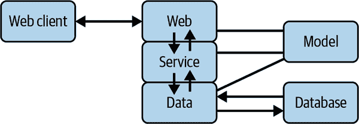
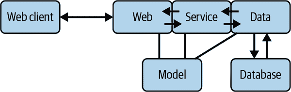

# 第一章：现代网络

> 我所设想的网络，我们还没有见到。未来比过去要大得多。
> 
> Tim Berners-Lee

# 预览

曾经，互联网小而简单。开发者们喜欢在单个文件中混合使用 PHP、HTML 和 MySQL 调用，并自豪地告诉每个人去查看他们的网站。但随着时间的推移，网络变得庞大无比，页面数达到数不清、甚至是数不尽的数量——早期的游乐场成为了一个主题公园的元宇宙。

在本章中，我将指出一些对现代网络越来越重要的领域：

+   服务和 API

+   并发

+   层次

+   数据

下一章将展示 Python 在这些领域提供了什么。之后，我们将深入了解 FastAPI Web 框架及其提供的功能。

# 服务和 API

网络是一个连接的伟大结构。虽然大量活动仍然发生在*内容*方面——HTML、JavaScript、图片等，但越来越重视连接这些内容的应用程序接口（APIs）。

通常，一个网络*服务*负责低级数据库访问和中级业务逻辑（通常被合称为*后端*），而 JavaScript 或移动应用程序提供丰富的顶级*前端*（交互式用户界面）。这两个世界已变得更加复杂和分化，通常需要开发人员专注于其中之一。比以往更难成为*全栈*开发者了。¹

这两个世界通过 API 彼此交流。在现代网络中，API 设计与网站设计同样重要。API 是一种合同，类似于数据库模式。定义和修改 API 现在是一项主要工作。

## API 的种类

每个 API 定义如下内容：

协议

控制结构

格式

内容结构

随着技术的发展，多种 API 方法已经发展，从孤立的机器到多任务系统，再到网络服务器。在某些时候，您可能会遇到其中的一种或多种，因此以下是在*HTTP*及其朋友中特别介绍的简要总结：

+   在网络出现之前，API 通常意味着非常紧密的连接，就像在应用程序中与*库*中的函数调用一样——比如在数学库中计算平方根。

+   *远程过程调用（RPCs）*的发明是为了在调用应用程序时调用其他进程中的函数，无论是在同一台机器上还是其他机器上。一个流行的现代例子是[gRPC](https://grpc.io)。

+   *消息传递*在进程之间的管道中发送小块数据。消息可能是类似动词的命令，也可能仅仅是感兴趣的名词*事件*。当前流行的消息传递解决方案广泛变化，从工具包到完整的服务器，包括[Apache Kafka](https://kafka.apache.org)，[RabbitMQ](https://www.rabbitmq.com)，[NATS](https://nats.io)和[ZeroMQ](https://zeromq.org)。通信可以遵循不同的模式：

    请求-响应

    一对一，如 Web 浏览器调用 Web 服务器。

    发布-订阅，或 *pub-sub*

    *发布者* 发布消息，*订阅者* 根据消息中的某些数据（如主题）对每条消息作出响应。

    队列

    类似于 pub-sub，但仅有一个池中的订阅者获取消息并对其作出响应。

任何这些都可以与 Web 服务一起使用，例如执行像发送电子邮件或创建缩略图图像这样的慢速后端任务。

## HTTP

伯纳斯-李为他的万维网提出了三个组件：

HTML

一种用于显示数据的语言

HTTP

客户端-服务器协议

URL

用于 Web 资源的寻址方案

尽管这些在回顾中显而易见，但它们事实上是一个极其有用的组合。随着 Web 的发展，人们进行了各种尝试，一些想法，如 `IMG` 标签，经历了达尔文式的竞争。随着需求变得更加清晰，人们开始严格定义标准。

## REST（ful）

Roy Fielding 博士论文中的一个章节定义了 *表现状态转移（REST）* —— 一种用于 HTTP 的 *架构风格*。² 尽管经常被引用，但它往往被广泛 [误解](https://oreil.ly/bsSry)。

一个粗略共享的适应已经演变并主导了现代网络。它被称为 *RESTful*，具有以下特点：

+   使用 HTTP 和客户端-服务器协议

+   无状态（每个连接都是独立的）

+   可缓存的

+   基于资源的

*资源* 是可以区分并执行操作的数据。Web 服务为每个要公开的功能提供一个 *终端点* —— 一个独特的 URL 和 HTTP *动词*（操作）。终端点也被称为 *路由*，因为它将 URL 路由到一个功能。

数据库用户熟悉 *CRUD* 缩写的过程：创建、读取、更新、删除。HTTP 动词非常 CRUD：

`POST`

创建（写入）

`PUT`

完全修改（替换）

`PATCH`

部分修改（更新）

`GET`

嗯，获取（读取、检索）

`DELETE`

嗯，删除

客户端通过 RESTful 终端点向服务器发送 *请求*，数据位于 HTTP 消息的以下区域之一：

+   头部信息

+   URL 字符串

+   查询参数

+   主体数值

接着，HTTP *响应* 返回这些内容：

+   一个整数 [*状态码*](https://oreil.ly/oBena) 指示以下内容：

    100s

    信息，请继续

    200s

    成功

    300s

    重定向

    400s

    客户端错误

    500s

    服务器错误

+   各种头部信息

+   一个可能为空、单一或 *分块* 的主体（以连续的片段）

至少有一个状态码是一个复活节彩蛋：`418`（我是 [茶壶](https://www.google.com/teapot)）应该由一个连接到网络的茶壶返回，如果被要求煮咖啡。

您将会发现很多关于 RESTful API 设计的网站和书籍，它们都有有用的经验法则。本书将在途中提供一些。

## JSON 和 API 数据格式

前端应用程序可以与后端 Web 服务交换纯 ASCII 文本，但如何表示像列表这样的数据结构呢？

正是在我们真正需要的时候，*JavaScript 对象表示法（JSON）*横空出世——又一个简单的想法解决了一个重要问题，在事后看来显得显而易见。尽管 *J* 代表 *JavaScript*，其语法看起来也很像 Python。

JSON 已经大量取代了像 XML 和 SOAP 这样的旧尝试。在本书的其余部分，你会看到 JSON 是默认的 Web 服务输入和输出格式。

## JSON:API

RESTful 设计与 JSON 数据格式的结合现在很常见。但在模糊性和书呆子之间仍然有一些余地。最近的[JSON:API](https://jsonapi.org)提案旨在稍微加强规范。本书将使用宽松的 RESTful 方法，但如果你有重大争论，JSON:API 或类似严格的方法可能会有所帮助。

## GraphQL

对于某些目的来说，RESTful 接口可能很笨重。Facebook（现在是 Meta）设计了[图形查询语言（*GraphQL*）](https://graphql.org)来指定更灵活的服务查询。本书不会深入讲解 GraphQL，但如果你觉得 RESTful 设计对你的应用不足够，你可能需要深入了解一下。

# 并发

除了服务导向的增长外，连接到 Web 服务的数量的快速扩展要求更好的效率和规模。

我们希望减少以下内容：

延迟

前期等待时间

吞吐量

服务与其调用者之间每秒传输的字节数

在早期的网络时代，³ 人们梦想支持数百个同时连接，后来又担心“10K 问题”，现在却假定可以同时处理数百万个连接。

*并发*并不意味着完全的并行处理。多个处理不会在同一微秒内在单个 CPU 上发生。相反，并发主要避免*忙等*（即空闲 CPU 直到收到响应）。CPU 是很快的，但网络和磁盘慢了成千上万倍。所以，每当我们与网络或磁盘通信时，我们不希望只是一动不动地等待响应。

正常的 Python 执行是*同步*的：按代码指定的顺序一次处理一件事。有时我们希望是*异步*的：一会儿做一件事，然后做另一件事，再回到第一件事，依此类推。如果我们所有的代码都用 CPU 来计算事物（*CPU bound*），那么没有多余的时间去异步。但是如果我们执行某些让 CPU 等待外部事物完成的操作（*I/O bound*），我们就可以异步执行。

异步系统提供一个*事件循环*：将慢操作的请求发送并记录下来，但我们不会阻塞 CPU 等待它们的响应。相反，每次循环通过时都会进行一些即时处理，接下来处理在这段时间内收到的任何响应。

这些效果可能非常显著。本书后面会介绍，FastAPI 支持异步处理，使其比典型的 Web 框架快得多。

异步处理并不是魔法。在事件循环中仍需小心，避免进行过多的 CPU 密集型工作，因为那会拖慢一切。在本书的后面，你将看到 Python 的`async`和`await`关键字的用法，以及 FastAPI 如何让你混合使用同步和异步处理。

# 层次

*绿巨人*的粉丝可能还记得他提到自己的层次性格，对此驴子回答道：“像洋葱一样？”

嗯，如果食人魔和泪眼汪汪的蔬菜都有层次，那么软件也可以有。为了管理大小和复杂性，许多应用程序长期以来一直使用所谓的*三层模型*。⁴ 这并不是特别新鲜。术语可能有所不同，⁵ 但在本书中，我使用以下简单的术语分离（见图 1-1）：

Web

HTTP 上的输入/输出层，组装客户端请求，调用服务层，并返回响应

服务

业务逻辑在需要时调用数据层

数据

访问数据存储和其他服务

模型

所有层共享的数据定义

Web 客户端

Web 浏览器或其他 HTTP 客户端软件

数据库

数据存储，通常是 SQL 或 NoSQL 服务器

###### 图 1-1\. 垂直层次

这些组件将帮助你在无需从头开始的情况下扩展你的站点。它们不是量子力学的法则，所以请将它们视作本书阐述的指南。

各层通过 API 进行通信。这些可以是简单的函数调用到分离的 Python 模块，也可以通过任何方法访问外部代码。如前所述，这可能包括 RPC、消息等。在本书中，我假设一个单一的 Web 服务器，Python 代码导入其他 Python 模块。模块处理分离和信息隐藏。

*Web 层*是用户通过*客户端*应用程序和 API 看到的层面。通常我们讨论的是一个符合 RESTful 标准的 Web 接口，包括 URL 和 JSON 编码的请求与响应。但也可以在 Web 层之外构建替代文本（或命令行界面，CLI）客户端。Python Web 代码可以导入服务层模块，但不应导入数据模块。

*服务层*包含这个网站提供的实际细节。这一层本质上看起来像一个*库*。它导入数据模块来访问数据库和外部服务，但不应知道具体细节。

*数据层*通过文件或客户端调用其他服务为服务层提供数据访问。还可能存在替代的数据层，与单一的服务层通信。

*模型框*并不是实际的层，而是各层共享的数据定义来源。如果你在它们之间传递内置的 Python 数据结构，则不需要这一层。正如你将看到的，FastAPI 包含 Pydantic，可以定义具有许多有用特性的数据结构。

为什么要进行这些分层？有很多原因，其中之一是每个层次可以：

+   由专家撰写。

+   在隔离环境中进行测试。

+   替换或补充：你可以添加第二个 Web 层，使用不同的 API，比如 gRPC，与一个 Web 层并行使用。

遵循*幽灵剧组*的一条规则：不要交叉流动。也就是说，不要让 Web 层的细节泄露到 Web 外，或者数据库层的细节泄露到数据层外。

你可以将*层次*想象成一个垂直堆叠，就像英国烘焙大赛中的蛋糕^（6）。

这里有分层分离的一些原因：

+   如果你不分离这些层，预期将会出现一个广为传播的网络模因：*现在你有两个问题*。

+   一旦层次混合，稍后分离将会非常*困难*。

+   如果代码逻辑混乱，你需要了解两个或更多专业知识来理解和编写测试将会很困难。

顺便说一句，虽然我称它们为*层*，但你不需要假设一个层次是“高于”或“低于”另一个，并且命令是沿着重力流动的。垂直沙文主义！你也可以将层次视为侧向通信的盒子（图 1-2）。

###### 图 1-2\. 侧向通信的盒子

无论你如何想象它们，盒子/层之间唯一的通信路径是箭头（API）。这对于测试和调试非常重要。如果工厂中存在未记录的门，夜间看守员将不可避免地感到惊讶。

Web 客户端与 Web 层之间的箭头使用 HTTP 或 HTTPS 传输大多数 JSON 文本。数据层与数据库之间的箭头使用特定于数据库的协议，并携带 SQL（或其他）文本。层之间的箭头是传递数据模型的函数调用。

此外，通过箭头流动的推荐数据格式如下：

客户端 ⇔ Web

使用 JSON 的 RESTful HTTP

Web ⇔ 服务

模型

服务 ⇔ 数据

模型

数据 ⇔ 数据库和服务

特定的 API

根据我自己的经验，这是我选择在本书中构建主题结构的方式。它是可行的，并且已经扩展到相当复杂的站点，但并不是神圣不可侵犯的。你可能有更好的设计！不管你如何做，以下是重要的几点：

+   分开领域特定的细节。

+   定义层次之间的标准 API。

+   不作弊；不泄露。

有时候决定代码的最佳归属层次是一个挑战。例如，第十一章 讨论了认证和授权需求以及如何实现它们——作为 Web 和服务之间的额外层，或者在其中一个中。软件开发有时与艺术同样重要。

# 数据

虽然 Web 经常被用作关系数据库的前端，但随着 NoSQL 或 NewSQL 数据库等多种存储和访问数据的方式的发展，其它方式也在增多。

但除了数据库外，*机器学习（ML）* — 或者 *深度学习* 或仅仅 *AI* — 正在从根本上改变技术景观。开发大型模型需要 *大量* 处理数据，这在传统上被称为提取、转换、加载（ETL）。

作为一种通用的服务架构，网络可以帮助解决许多 ML 系统的琐碎问题。

# 复习

网络使用许多 API，特别是 RESTful 的 API。异步调用允许更好的并发性，这加快了整体过程。Web 服务应用通常足够大，可以划分为多个层次。数据已经成为一个独立的重要领域。所有这些概念都在 Python 编程语言中得到了解决，在下一章中详细介绍。

¹ 几年前我放弃了尝试。

² *风格* 意味着一个更高级别的模式，如 *客户端-服务器*，而不是一个特定的设计。

³ 大约在穴居人与巨型地懒一起踢毽子的时候。

⁴ 选择你自己的方言：层/层次，番茄/番茄/感谢。

⁵ 你经常会看到 *模型-视图-控制器（MVC）* 及其变体。通常伴随着宗教战争，我对此持不可知论立场。

⁶ 正如观众所知，如果你的层次结构松散，可能下周就不会回到帐篷了。
