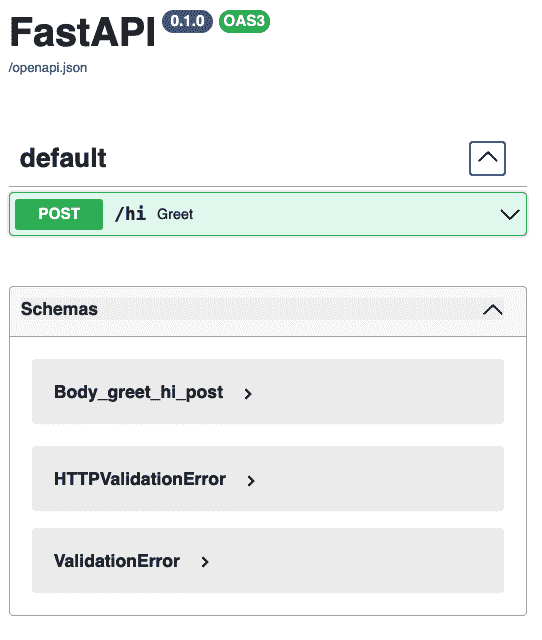
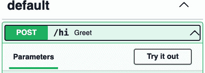
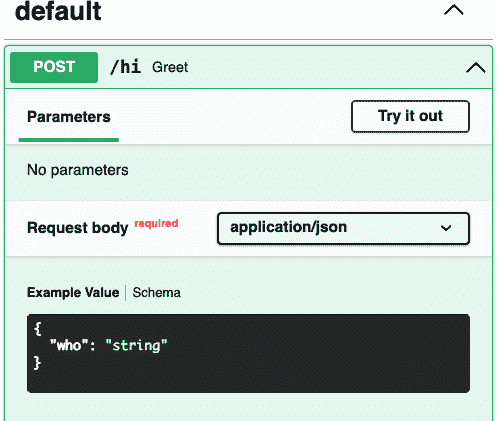
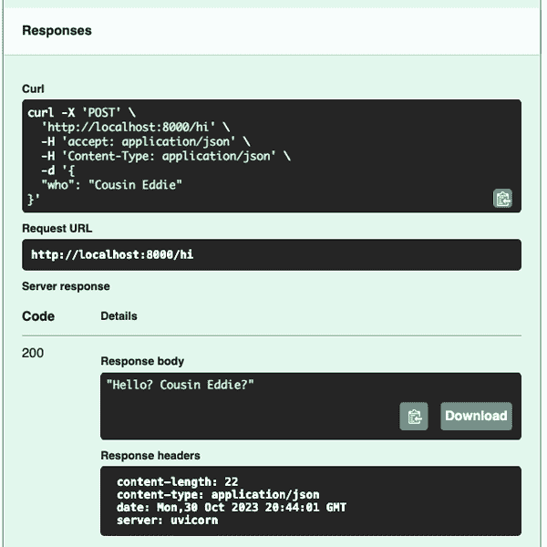

# 第三章：FastAPI 指南

> FastAPI 是一个现代的、快速（高性能）的 Web 框架，用于使用 Python 3.6+ 标准的类型提示构建 API。
> 
> FastAPI 的创始人 Sebastián Ramírez

# 预览

[FastAPI](https://fastapi.tiangolo.com) 由 [Sebastián Ramírez](https://tiangolo.com) 在 2018 年发布。在许多方面，它比大多数 Python Web 框架更现代化——利用了最近几年内添加到 Python 3 中的功能。本章是 FastAPI 主要特性的快速概述，重点是你需要了解的首要内容：如何处理 Web 请求和响应。

# FastAPI 是什么？

与任何 Web 框架一样，FastAPI 帮助您构建 Web 应用程序。每个框架都设计了一些操作以使某些操作更加简便——通过功能、省略和默认设置。顾名思义，FastAPI 的目标是开发 Web API，尽管您也可以将其用于传统的 Web 内容应用程序。

FastAPI 网站声称具有以下优势：

性能

在某些情况下，速度与 Node.js 和 Go 一样快，这在 Python 框架中是不寻常的。

更快的开发速度

没有锋利的边缘或怪异行为。

更好的代码质量

类型提示和模型有助于减少错误。

自动生成的文档和测试页面

比手动编辑 OpenAPI 描述更容易。

FastAPI 使用以下内容：

+   Python 类型提示

+   Starlette 用于 Web 机制，包括异步支持

+   Pydantic 用于数据定义和验证

+   特殊集成以利用和扩展其他功能

这种组合为 Web 应用程序，特别是 RESTful Web 服务，提供了令人愉悦的开发环境。

# 一个 FastAPI 应用程序

让我们编写一个微小的 FastAPI 应用——一个只有一个端点的 Web 服务。目前，我们处于我所谓的 Web 层，仅处理 Web 请求和响应。首先，安装我们将要使用的基本 Python 包：

+   [FastAPI](https://fastapi.tiangolo.com) 框架：`pip install fastapi`

+   [Uvicorn](https://www.uvicorn.org) Web 服务器：`pip install uvicorn`

+   [HTTPie](https://httpie.io) 文本 Web 客户端：`pip install httpie`

+   [Requests](https://requests.readthedocs.io) 同步 Web 客户端包：`pip install requests`

+   [HTTPX](https://www.python-httpx.org) 同步/异步 Web 客户端包：`pip install httpx`

虽然 [curl](https://curl.se) 是最著名的文本 Web 客户端，但我认为 HTTPie 更易于使用。此外，它默认使用 JSON 编码和解码，这与 FastAPI 更匹配。本章后面，你将看到一个包含访问特定端点所需 curl 命令行语法的截图。

让我们在 示例 3-1 中跟随一个内向的 Web 开发者，并将此代码保存为文件 *hello.py*。

##### 示例 3-1\. 一个害羞的端点（hello.py）

```py
from fastapi import FastAPI

app = FastAPI()

@app.get("/hi")
def greet():
    return "Hello? World?"
```

以下是需要注意的一些要点：

+   `app` 是代表整个 Web 应用程序的顶级 FastAPI 对象。

+   `@app.get("/hi")` 是一个 *路径装饰器*。它告诉 FastAPI 如下内容：

    +   对于此服务器上的 `"/hi"` URL 的请求应该被指向以下函数。

    +   此装饰器仅适用于 HTTP 的 `GET` 动词。您还可以使用其他 HTTP 动词（`PUT`、`POST` 等）响应 `"/hi"` URL，每个对应一个单独的函数。

+   `def greet()` 是一个 *path function*，它是 HTTP 请求和响应的主要接触点。在本例中，它没有参数，但后续章节将展示 FastAPI 更多功能。

下一步是在 Web 服务器中运行此 Web 应用程序。FastAPI 本身不包含 Web 服务器，但推荐使用 Uvicorn。您可以以两种方式启动 Uvicorn 和 FastAPI Web 应用程序：外部或内部。

要通过命令行外部启动 Uvicorn，请参阅 示例 3-2。

##### Example 3-2\. 使用命令行启动 Uvicorn

```py
$ uvicorn hello:app --reload
```

`hello` 指的是 *hello.py* 文件，而 `app` 是其中的 FastAPI 变量名。

或者，您可以在应用程序本身内部启动 Uvicorn，如 示例 3-3。

##### Example 3-3\. 在内部启动 Uvicorn

```py
from fastapi import FastAPI

app = FastAPI()

@app.get("/hi")
def greet():
    return "Hello? World?"

if __name__ == "__main__":
    import uvicorn
    uvicorn.run("hello:app", reload=True)
```

在任一情况下，`reload` 告诉 Uvicorn 如果 *hello.py* 更改了，重新启动 Web 服务器。在本章中，我们将频繁使用此自动重新加载功能。

无论您使用外部还是内部方法，默认情况下都将在您的计算机（名为 `localhost`）上使用端口 8000。如果您希望使用其他设置，两种方法都有 `host` 和 `port` 参数。

现在服务器有一个单一的端点（*/hi*），并准备接受请求。

让我们用多个 web 客户端测试：

+   对于浏览器，在顶部地址栏输入 URL。

+   对于 HTTPie，请输入显示的命令（`$` 表示您系统 shell 的命令提示符）。

+   对于 Requests 或 HTTPX，请在交互模式下使用 Python，并在 `>>>` 提示后输入。

如前言所述，您输入的内容位于一个

```py
bold monospaced font
```

并且输出在一个

```py
normal monospaced font
```

示例 3-4 到 3-7 展示了测试 Web 服务器全新 */hi* 端点的不同方式。

##### Example 3-4\. 在浏览器中测试 /hi

```py
http://localhost:8000/hi
```

##### Example 3-5\. 使用 Requests 测试 /hi

```py
>>> import requests
>>> r = requests.get("http://localhost:8000/hi")
>>> r.json()
'Hello? World?'
```

##### Example 3-6\. 使用 HTTPX 测试 /hi，这几乎与 Requests 相同

```py
>>> import httpx
>>> r = httpx.get("http://localhost:8000/hi")
>>> r.json()
'Hello? World?'
```

###### 注意

无论您使用 Requests 还是 HTTPX 来测试 FastAPI 路由都无所谓。但是 第十三章 展示了在进行其他异步调用时使用 HTTPX 的情况。因此，本章的其余示例使用 Requests。

##### Example 3-7\. 使用 HTTPie 测试 /hi

```py
$ http localhost:8000/hi
HTTP/1.1 200 OK
content-length: 15
content-type: application/json
date: Thu, 30 Jun 2022 07:38:27 GMT
server: uvicorn

"Hello? World?"
```

使用 `-b` 参数在 示例 3-8 中跳过响应头，并只打印主体。

##### Example 3-8\. 使用 HTTPie 测试 /hi，仅打印响应主体

```py
$ http -b localhost:8000/hi
"Hello? World?"
```

示例 3-9 获取完整的请求头和响应，带有 `-v`。

##### Example 3-9\. 使用 HTTPie 测试 /hi 并获取所有内容

```py
$ http -v localhost:8000/hi
GET /hi HTTP/1.1
Accept: /
Accept-Encoding: gzip, deflate
Connection: keep-alive
Host: localhost:8000
User-Agent: HTTPie/3.2.1

HTTP/1.1 200 OK
content-length: 15
content-type: application/json
date: Thu, 30 Jun 2022 08:05:06 GMT
server: uvicorn

"Hello? World?"
```

本书中的一些示例显示了默认的 HTTPie 输出（响应头和主体），而其他示例仅显示主体。

# HTTP 请求

示例 3-9 仅包含一个特定请求：对 `localhost` 服务器上端口 `8000` 的 `GET` 请求 */hi* URL。

Web 请求在 HTTP 请求的不同部分中存储数据，而 FastAPI 允许您顺利访问它们。从 示例 3-9 中的示例请求开始，示例 3-10 显示了 `http` 命令发送到 Web 服务器的 HTTP 请求。

##### 示例 3-10\. HTTP 请求

```py
GET /hi HTTP/1.1
Accept: /
Accept-Encoding: gzip, deflate
Connection: keep-alive
Host: localhost:8000
User-Agent: HTTPie/3.2.1
```

本请求包含以下内容：

+   动词 (`GET`) 和路径 (`/hi`)

+   任何*查询参数*（在此例中任何 `?` 后面的文本，无）

+   其他 HTTP 标头

+   没有请求体内容

FastAPI 将其解析为方便的定义：

`Header`

HTTP 标头

`Path`

URL

`Query`

查询参数（在 URL 结尾的 `?` 后面）

`Body`

HTTP body

###### 注意

FastAPI 提供数据来自 HTTP 请求的各个部分的方式是其最佳特性之一，也是大多数 Python Web 框架改进的一部分。所有需要的参数可以在路径函数内声明和直接提供，使用之前列表中的定义 (`Path`, `Query` 等)，以及你编写的函数。这使用了一种称为*依赖注入*的技术，我们将在接下来的内容中讨论，并在 第六章 中详细展开。

通过添加一个名为 `who` 的参数，让我们的早期应用程序变得更加个性化，以回应那个哀求般的 `Hello?`。我们将尝试不同的方法来传递这个新参数：

+   在 URL *路径* 中

+   作为*查询*参数，在 URL 的 `?` 后面

+   在 HTTP *body* 中

+   作为 HTTP *标头*

## URL 路径

在 示例 3-11 中编辑 *hello.py*。

##### 示例 3-11\. 返回问候路径

```py
from fastapi import FastAPI

app = FastAPI()

@app.get("/hi/{who}")
def greet(who):
    return f"Hello? {who}?"
```

一旦从编辑器保存此更改，Uvicorn 应该重新启动。（否则，我们将创建 *hello2.py* 等，并每次重新运行 Uvicorn。）如果有拼写错误，请不断尝试直到修复，Uvicorn 不会对你造成困扰。

在 URL 中添加 `{who}`（在 `@app.get` 后面）告诉 FastAPI 在该位置期望一个名为 `who` 的变量。FastAPI 然后将其分配给下面 `greet()` 函数中的 `who` 参数。这显示了路径装饰器和路径函数之间的协调。

###### 注意

此处不要使用 Python f-string 来修改 URL 字符串 (`"/hi/{who}"`)。大括号由 FastAPI 本身用于匹配作为路径参数的 URL 片段。

在示例 3-12 到 3-14 中，使用先前讨论的各种方法测试这个修改后的端点。

##### 示例 3-12\. 在浏览器中测试 /hi/Mom

```py
localhost:8000/hi/Mom
```

##### 示例 3-13\. 使用 HTTPie 测试 /hi/Mom

```py
$ http localhost:8000/hi/Mom
HTTP/1.1 200 OK
content-length: 13
content-type: application/json
date: Thu, 30 Jun 2022 08:09:02 GMT
server: uvicorn

"Hello? Mom?"
```

##### 示例 3-14\. 使用 Requests 测试 /hi/Mom

```py
>>> import requests
>>> r = requests.get("http://localhost:8000/hi/Mom")
>>> r.json()
'Hello? Mom?'
```

在每种情况下，字符串 `"Mom"` 被作为 URL 的一部分传递，并作为 `greet()` 路径函数中的 `who` 变量传递，并作为响应的一部分返回。

在每种情况下，响应都是 JSON 字符串（取决于使用的测试客户端是单引号还是双引号） `"Hello? Mom?"`。

## 查询参数

*查询参数*是在 URL 中 `*name=value*` 字符串之后的 `?` 后面，用 `&` 字符分隔。在 示例 3-15 中再次编辑 *hello.py*。

##### 示例 3-15\. 返回问候查询参数

```py
from fastapi import FastAPI

app = FastAPI()

@app.get("/hi")
def greet(who):
    return f"Hello? {who}?"
```

端点函数再次被定义为 `greet(who)`，但是这次在前一个装饰器行中 URL 上没有 `{who}`，所以 FastAPI 现在假设 `who` 是一个查询参数。测试示例 3-16 和 3-17。

##### 示例 3-16\. 使用浏览器测试 示例 3-15

```py
localhost:8000/hi?who=Mom
```

##### 示例 3-17\. 使用 HTTPie 测试 示例 3-15

```py
$ http -b localhost:8000/hi?who=Mom
"Hello? Mom?"
```

在 示例 3-18 中，您可以使用查询参数调用 HTTPie（注意 `==`）。

##### 示例 3-18\. 使用 HTTPie 和参数测试 示例 3-15

```py
$ http -b localhost:8000/hi who==Mom
"Hello? Mom?"
```

您可以在 HTTPie 中使用多个这些参数，将它们作为空格分隔的参数更容易输入。

示例 3-19 和 3-20 展示了 Requests 的相同替代方案。

##### 示例 3-19\. 使用 Requests 测试 示例 3-15

```py
>>> import requests
>>> r = requests.get("http://localhost:8000/hi?who=Mom")
>>> r.json()
'Hello? Mom?'
```

##### 示例 3-20\. 使用 Requests 和参数测试 示例 3-15

```py
>>> import requests
>>> params = {"who": "Mom"}
>>> r = requests.get("http://localhost:8000/hi", params=params)
>>> r.json()
'Hello? Mom?'
```

在每种情况下，您以一种新的方式提供字符串 `"Mom"`，并将其传递给路径函数并通过最终的响应。

## 主体

我们可以向 `GET` 端点提供路径或查询参数，但不能从请求体中获取值。在 HTTP 中，`GET` 应该是 *幂等* 的——一个计算机术语，意思是 *询问相同的问题，得到相同的答案*。HTTP `GET` 应该只返回内容。请求体用于在创建（`POST`）或更新（`PUT` 或 `PATCH`）时将内容发送到服务器。第九章 展示了绕过此限制的方法。

因此，在 示例 3-21 中，让我们将端点从 `GET` 更改为 `POST`。（严格来说，我们没有创建任何内容，所以 `POST` 不合适，但如果 RESTful 大师起诉我们，那么嘿，看看酷炫的法院。）

##### 示例 3-21\. 返回问候主体

```py
from fastapi import FastAPI, Body

app = FastAPI()

@app.post("/hi")
def greet(who:str = Body(embed=True)):
    return f"Hello? {who}?"
```

###### 注意

这次需要 `Body(embed=True)` 告诉 FastAPI，我们这次从 JSON 格式的请求体中获取 `who` 的值。`embed` 部分意味着它应该像 `{"who": "Mom"}` 这样看起来，而不只是 `"Mom"`。

尝试在 示例 3-22 中使用 HTTPie 进行测试，使用 `-v` 显示生成的请求体（注意单个 `=` 参数表示 JSON 主体数据）。

##### 示例 3-22\. 使用 HTTPie 测试 示例 3-21

```py
$ http -v localhost:8000/hi who=Mom
POST /hi HTTP/1.1
Accept: application/json, /;q=0.5
Accept-Encoding: gzip, deflate
Connection: keep-alive
Content-Length: 14
Content-Type: application/json
Host: localhost:8000
User-Agent: HTTPie/3.2.1

{
    "who": "Mom"
}

HTTP/1.1 200 OK
content-length: 13
content-type: application/json
date: Thu, 30 Jun 2022 08:37:00 GMT
server: uvicorn

"Hello? Mom?"
```

最后，在 示例 3-23 中使用 Requests 进行测试，其中使用其 `json` 参数将 JSON 编码数据传递到请求体中。

##### 示例 3-23\. 使用 Requests 测试 示例 3-21

```py
>>> import requests
>>> r = requests.post("http://localhost:8000/hi", json={"who": "Mom"})
>>> r.json()
'Hello? Mom?'
```

## HTTP 头信息

最后，在 示例 3-24 中尝试将问候参数作为 HTTP 头信息传递。

##### 示例 3-24\. 返回问候头信息

```py
from fastapi import FastAPI, Header

app = FastAPI()

@app.post("/hi")
def greet(who:str = Header()):
    return f"Hello? {who}?"
```

让我们在 示例 3-25 中只使用 HTTPie 进行测试。它使用 `*name:value*` 来指定 HTTP 头信息。

##### 示例 3-25\. 使用 HTTPie 测试 示例 3-24

```py
$ http -v localhost:8000/hi who:Mom
GET /hi HTTP/1.1
Accept: */\*
Accept-Encoding: gzip, deflate
Connection: keep-alive
Host: localhost:8000
User-Agent: HTTPie/3.2.1
who: Mom

HTTP/1.1 200 OK
content-length: 13
content-type: application/json
date: Mon, 16 Jan 2023 05:14:46 GMT
server: uvicorn

"Hello? Mom?"
```

FastAPI 将 HTTP 头键转换为小写，并将连字符 (`-`) 转换为下划线 (`_`)。因此，您可以在示例 3-26 和 3-27 中像这样打印 HTTP `User-Agent` 头信息的值。

##### 示例 3-26\. 返回 `User-Agent` 头信息（hello.py）

```py
from fastapi import FastAPI, Header

app = FastAPI()

@app.post("/agent")
def get_agent(user_agent:str = Header()):
    return user_agent
```

##### 示例 3-27\. 使用 HTTPie 测试 `User-Agent` 头信息

```py
$ http -v localhost:8000/agent
GET /agent HTTP/1.1
Accept: */\*
Accept-Encoding: gzip, deflate
Connection: keep-alive
Host: localhost:8000
User-Agent: HTTPie/3.2.1

HTTP/1.1 200 OK
content-length: 14
content-type: application/json
date: Mon, 16 Jan 2023 05:21:35 GMT
server: uvicorn

"HTTPie/3.2.1"
```

## 多个请求数据

您可以在同一个路径函数中使用多个方法。也就是说，您可以从 URL、查询参数、HTTP 主体、HTTP 头部、cookie 等获取数据。并且您可以编写自己的依赖函数，以特殊方式处理和组合它们，例如用于分页或身份验证。您将在 第六章 和 第 III 部分 的各个章节中看到其中的一些。

## 哪种方法最好？

这里有一些建议：

+   在传递 URL 中的参数时，遵循 RESTful 准则是标准做法。

+   查询字符串通常用于提供可选参数，如分页。

+   通常用于更大输入的主体，例如整体或部分模型。

在每种情况下，如果您在数据定义中提供类型提示，您的参数将由 Pydantic 自动进行类型检查。这确保它们既存在又正确。

# HTTP 响应

默认情况下，FastAPI 将从端点函数返回的任何内容转换为 JSON；HTTP 响应具有标题行 `Content-type: application/json`。因此，虽然 `greet()` 函数最初返回字符串 `"Hello? World?"`，但 FastAPI 将其转换为 JSON。这是 FastAPI 为简化 API 开发选择的默认之一。

在这种情况下，Python 字符串 `"Hello? World?"` 被转换为其等效的 JSON 字符串 `"Hello? World?"`，它仍然是同样的字符串。但是无论您返回什么，FastAPI 都会将其转换为 JSON，无论是内置的 Python 类型还是 Pydantic 模型。

## 状态码

默认情况下，FastAPI 返回 `200` 状态码；异常会引发 `4*xx*` 代码。

在路径装饰器中，指定应该在一切顺利时返回的 HTTP 状态码（异常将生成自己的代码并覆盖它）。将 示例 3-28 中的代码添加到您的 *hello.py* 中的某个位置，并使用 示例 3-29 进行测试。

##### 示例 3-28\. 指定 HTTP 状态码（添加到 hello.py）

```py
@app.get("/happy")
def happy(status_code=200):
    return ":)"
```

##### 示例 3-29\. 测试 HTTP 状态码

```py
$ http localhost:8000/happy
HTTP/1.1 200 OK
content-length: 4
content-type: application/json
date: Sun, 05 Feb 2023 04:37:32 GMT
server: uvicorn

":)"
```

## 头部

您可以像 示例 3-30 中那样注入 HTTP 响应头部（您不需要返回 `response`）。

##### 示例 3-30\. 设置 HTTP 头部（添加到 hello.py）

```py
from fastapi import Response

@app.get("/header/{name}/{value}")
def header(name: str, value: str, response:Response):
    response.headers[name] = value
    return "normal body"
```

让我们看看是否成功（示例 3-31）。

##### 示例 3-31\. 测试响应的 HTTP 头部

```py
$ http localhost:8000/header/marco/polo
HTTP/1.1 200 OK
content-length: 13
content-type: application/json
date: Wed, 31 May 2023 17:47:38 GMT
marco: polo
server: uvicorn

"normal body"
```

## 响应类型

响应类型（从 `fastapi.responses` 导入这些类）包括以下内容：

+   `JSONResponse`（默认）

+   `HTMLResponse`

+   `PlainTextResponse`

+   `RedirectResponse`

+   `FileResponse`

+   `StreamingResponse`

我将在 第十五章 中进一步讨论最后两点。

对于其他输出格式（也称为 *MIME 类型*），您可以使用一个通用的 `Response` 类，需要以下内容：

`content`

字符串或字节

`media_type`

字符串 MIME 类型

`status_code`

HTTP 整数状态码

`headers`

一个字符串 `dict`

## 类型转换

路径函数可以返回任何内容，默认情况下（使用`JSONResponse`），FastAPI 将其转换为 JSON 字符串并返回，包括任何 Pydantic 模型类。

但是它是如何做到的呢？如果你使用过 Python 的 json 库，可能已经看到它在给定某些数据类型（如`datetime`）时会引发异常。FastAPI 使用名为`jsonable_encoder()`的内部函数将任何数据结构转换为“可 JSON 化”的 Python 数据结构，然后调用通常的`json.dumps()`将其转换为 JSON 字符串。示例 3-32 展示了一个可以用 pytest 运行的测试。

##### 示例 3-32\. 使用`jsonable_encoder()`避免 JSON 爆炸

```py
import datetime
import pytest
from fastapi.encoders import jsonable_encoder
import json

@pytest.fixture
def data():
    return datetime.datetime.now()

def test_json_dump(data):
    with pytest.raises(Exception):
        _ = json.dumps(data)

def test_encoder(data):
    out = jsonable_encoder(data)
    assert out
    json_out = json.dumps(out)
    assert json_out
```

## 模型类型和`response_model`

可能存在具有许多相同字段但一个专门用于用户输入、一个用于输出和一个用于内部使用的不同类。这些变体的一些原因可能包括以下几点：

+   从输出中删除一些敏感信息，比如*去识别*个人医疗数据，如果你遇到了《健康保险可移植性和责任法案》（HIPAA）的要求。

+   向用户输入添加字段（例如创建日期和时间）。

示例 3-33 展示了一个虚构案例的三个相关类：

+   `TagIn` 是定义用户需要提供的类（在本例中仅为名为`tag`的字符串）。

+   `Tag` 是基于`TagIn`创建的，增加了两个字段：`created`（创建此`Tag`的时间）和`secret`（一个内部字符串，可能存储在数据库中，但不应该对外界公开）。

+   `TagOut` 是定义可以返回给用户（通过查找或搜索端点）的类。它包含原始`TagIn`对象的`tag`字段及其派生的`Tag`对象，还有为`Tag`生成的`created`字段，但不包括`secret`。

##### 示例 3-33\. 模型变体（model/tag.py）

```py
from datetime import datetime
from pydantic import BaseClass

class TagIn(BaseClass):
    tag: str

class Tag(BaseClass):
    tag: str
    created: datetime
    secret: str

class TagOut(BaseClass):
    tag: str
    created: datetime
```

你可以以不同的方式从 FastAPI 路径函数返回除默认 JSON 以外的数据类型。一种方法是在路径装饰器中使用`response_model`参数，让 FastAPI 返回其他内容。FastAPI 将删除你返回的对象中出现但未在`response_model`指定对象中的任何字段。

在示例 3-34 中，假设你编写了一个名为*service/tag.py*的新服务模块，其中包含 `create()` 和 `get()` 函数，为这个 web 模块提供调用。这些低层次的细节在此不重要。重要的是底部的`get_one()`路径函数以及其路径装饰器中的`response_model=TagOut`。这会自动将内部的`Tag`对象转换为经过清理的`TagOut`对象。

##### 示例 3-34\. 使用`response_model`返回不同的响应类型（web/tag.py）

```py
import datetime
from model.tag import TagIn, Tag, TagOut
import service.tag as service

@app.post('/')
def create(tag_in: TagIn) -> TagIn:
    tag: Tag = Tag(tag=tag_in.tag, created=datetime.utcnow(),
        secret="shhhh")
    service.create(tag)
    return tag_in

@app.get('/{tag_str}', response_model=TagOut)
def get_one(tag_str: str) -> TagOut:
    tag: Tag = service.get(tag_str)
    return tag
```

尽管我们返回了一个`Tag`，`response_model`将其转换为`TagOut`。

# 自动化文档

本节假设您正在运行来自示例 3-21 的 Web 应用程序版本，该版本通过`POST`请求将`who`参数发送到 *http://localhost:8000/hi*。

说服你的浏览器访问 URL **`http://localhost:8000/docs`**。

你会看到一些类似于图 3-1 的东西（我裁剪了以下截图，以强调特定区域）。



###### 图 3-1\. 生成的文档页面

那是从哪里来的？

FastAPI 从你的代码生成 OpenAPI 规范，并包括此页面来显示和测试所有你的端点。这只是它秘密酱料的一部分。

点击绿色框右侧的下箭头以打开它以进行测试（图 3-2）。



###### 图 3-2\. 打开文档页面

点击右侧的“试一试”按钮。现在你会看到一个区域，让你在主体部分输入一个值（图 3-3）。



###### 图 3-3\. 数据输入页面

点击那个`"string"`。将它改成`**"Cousin Eddie"**`（保持双引号）。然后点击底部的蓝色执行按钮。

现在看看执行按钮下面的响应部分（图 3-4）。

“响应主体”框显示了出现了 Cousin Eddie。

所以，这是测试网站的另一种方式（除了之前使用浏览器、HTTPie 和 Requests 的例子）。



###### 图 3-4\. 响应页面

顺便提一下，在响应显示的 Curl 框中可以看到，与使用 HTTPie 相比，使用 curl 进行命令行测试需要更多的输入。HTTPie 的自动 JSON 编码在这里非常有帮助。

###### 提示

这种自动化文档实际上非常重要。随着您的 Web 服务增长到数百个端点，一个始终更新的文档和测试页面将非常有帮助。

# 复杂数据

这些示例仅展示了如何将一个字符串传递给端点。许多端点，特别是`GET`或`DELETE`端点，可能根本不需要参数，或者只需要一些简单的参数，如字符串和数字。但是，在创建（`POST`）或修改（`PUT`或`PATCH`）资源时，我们通常需要更复杂的数据结构。第五章展示了 FastAPI 如何使用 Pydantic 和数据模型来实现这些操作的清洁方法。

# 复习

在这一章中，我们使用了 FastAPI 来创建一个只有一个端点的网站。多个 Web 客户端进行了测试：一个是网页浏览器，另外还有 HTTPie 文本程序、Requests Python 包和 HTTPX Python 包。从一个简单的`GET`调用开始，请求参数通过 URL 路径、查询参数和 HTTP 头部发送到服务器。然后，HTTP 主体用于向`POST`端点发送数据。接着，本章展示了如何返回不同类型的 HTTP 响应。最后，一个自动生成的表单页面为第四个测试客户端提供了文档和实时表单。

这份 FastAPI 概述将在 第八章 中进一步展开。
