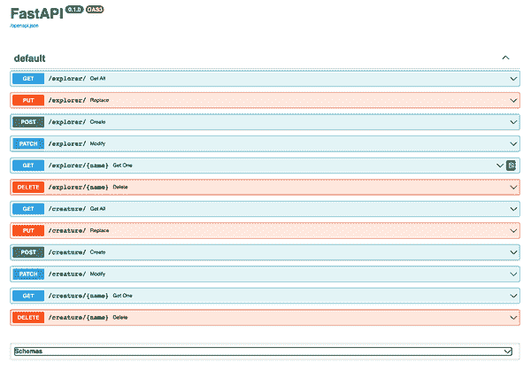
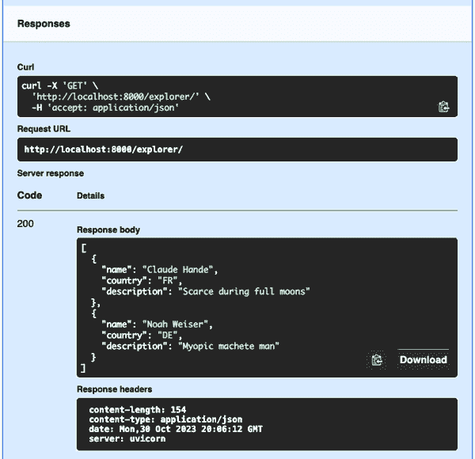

# 第八章：网页层

# 预览

第三章快速查看如何定义 FastAPI 的 Web 端点，将简单的字符串输入传递给它们，并获得响应。本章进一步探讨了 FastAPI 应用程序的顶层（也可以称为*接口*或*路由器*层）及其与服务和数据层的集成。

正如之前一样，我将从小例子开始。然后，我会引入一些结构，将层次划分为子部分，以便进行更清晰的开发和扩展。我们写的代码越少，以后需要记住和修复的就越少。

本书中基本的示例数据涉及想象中的生物，或称为*神秘动物*，以及它们的探险者。你可能会发现与其他信息领域的类似之处。

一般情况下，我们如何处理信息？与大多数网站一样，我们的网站将提供以下方式来做以下事情：

+   检索

+   创建

+   修改

+   替换

+   删除

从顶部开始，我们将创建 Web 端点来执行这些功能对我们的数据。起初，我们将提供虚假数据使端点能够与任何 Web 客户端一起工作。在接下来的章节中，我们将把虚假数据的代码移动到较低层次。在每个步骤中，我们将确保网站仍然能够正确地传递数据。最后，在第十章中，我们将放弃伪造，并在真实数据库中存储真实数据，以实现完整的端到端（Web → 服务 → 数据）网站。

###### 注意

允许任何匿名访问者执行所有这些操作将成为“为什么我们不能拥有好东西”的一个教训。第十一章讨论了*auth*（身份验证和授权）需要定义角色和限制谁可以做什么。在本章的其余部分中，我们将避开认证，只展示如何处理原始的网页功能。

# 插曲：自上而下，自下而上，中间到外围？

在设计网站时，你可以从以下之一开始：

+   网页层及以下工作

+   数据层及以上

+   服务层及两端工作

你已经有一个安装和加载数据的数据库，只是渴望找到一种与世界分享的方法吗？如果是这样，你可能想先处理数据层的代码和测试，然后是服务层，最后编写网页层。

如果你遵循[领域驱动设计](https://oreil.ly/iJu9Q)，你可能会从中间的服务层开始，定义你的核心实体和数据模型。或者你可能想先演化 Web 界面，并伪造调用低层，直到你知道它们的预期结果。

你会在这些书中找到非常好的设计讨论和建议：

+   [*Python 中的清晰架构*](https://oreil.ly/5KrL9) 作者：Leonardo Giordani（Digital Cat Books）

+   [*使用 Python 的架构模式*](https://www.cosmicpython.com) 作者：Harry J.W. Percival 和 Bob Gregory（O’Reilly）

+   [*微服务 API*](https://oreil.ly/Gk0z2) 作者：José Haro Peralta（Manning）

在这些和其他来源中，您将看到诸如 *六边形架构*、*端口* 和 *适配器* 等术语。您如何继续的选择主要取决于您已有的数据及您希望如何处理构建站点的工作。

我猜您中的许多人主要是想尝试 FastAPI 及其相关技术，并不一定有一个预定义的成熟数据域，想要立即开始设置。

因此，在本书中，我采用了 Web 优先方法——逐步，从基本部分开始，根据需要逐步添加其他部分。有时实验有效，有时不有效。我将避免一开始就把所有内容塞进这个 Web 层。

###### 注意

此 Web 层只是将数据在用户和服务之间传递的一种方式。还存在其他方式，例如 CLI 或软件开发工具包（SDK）。在其他框架中，您可能会看到此 Web 层称为 *视图* 或 *演示* 层。

# RESTful API 设计

HTTP 是在 Web 客户端和服务器之间传递命令和数据的一种方式。但是，就像您可以将冰箱中的食材以从可怕到美味的方式组合一样，HTTP 的一些用法比其他用法更有效。

在 第一章 中，我提到 *RESTful* 成为 HTTP 开发中有用的，尽管有时模糊的模型。RESTful 设计具有以下核心组件：

资源

您的应用程序管理的数据元素

标识符

唯一资源标识符

URL

结构化资源和 ID 字符串

动词或操作

伴随 URL 的用途术语：

`GET`

检索资源。

`POST`

创建新资源。

`PUT`

完全替换资源。

`PATCH`

部分替换资源。

`DELETE`

资源爆炸。

###### 注意

关于 `PUT` 和 `PATCH` 的相对优点，存在不同意见。如果您不需要区分部分修改和完全替换，可能不需要两者。

用于结合动词和包含资源和标识符的 URL 的一般 RESTful 规则使用路径参数的这些模式（URL 中 `/` 之间的内容）：

动词 /资源/

将 *动词* 应用于所有 *资源* 类型的资源。

动词 /资源/id

将 *动词* 应用于带有 ID *id* 的 *资源*。

使用本书示例数据，对端点 */thing* 的 `GET` 请求将返回所有探险者的数据，但对 */thing/abc* 的 `GET` 请求将仅返回 ID 为 `abc` 的 `thing` 资源的数据。

最后，Web 请求通常包含更多信息，指示要执行以下操作：

+   对结果进行排序

+   分页结果

+   执行另一个功能

这些参数有时可以表示为 *路径* 参数（附加到另一个 `/` 后面），但通常作为 *查询* 参数（URL 中 `?` 后面的 *var=val* 格式）。因为 URL 有大小限制，所以大请求通常通过 HTTP 主体传递。

###### 注意

大多数作者建议在命名资源和相关的命名空间（如 API 部分和数据库表）时使用复数。我长期以来遵循这个建议，但现在感觉使用单数名称在许多方面更简单（包括英语语言的怪异性）：

+   一些词是它们自己的复数形式：`series`，`fish`

+   一些词具有不规则的复数形式：`children`，`people`

+   您需要在许多地方编写定制的单数到复数转换代码

由于这些原因，本书中许多地方我都使用了单数命名方案。这与通常的 RESTful 建议相悖，如果您不同意，可以自由忽略。

# 文件和目录站点布局

我们的数据主要涉及生物和探险者。最初，我们可以在单个 Python 文件中定义所有 URL 及其 FastAPI 路径函数，以访问它们的数据。让我们抵制这种诱惑，开始就像我们已经是神秘动物网站空间的新星一样。有了良好的基础，添加新功能就容易多了。

首先，在您的计算机上选择一个目录。将其命名为*fastapi*，或任何有助于您记住您将从本书中的代码中混合的地方。在其中，创建以下子目录：

源码

包含所有网站代码

网络

FastAPI Web 层

服务

业务逻辑层

数据

存储接口层

模型

Pydantic 模型定义

虚构的

早期硬编码（*stub*）数据

这些目录中的每一个很快都会增加三个文件：

__init__.py

必须将此目录视为一个包

creature.py

为这一层创建的代码

explorer.py

为这一层的探险者代码

*许多*意见存在于如何布置开发站点的问题上。此设计旨在显示层次分离并为将来的增加留出空间。

现在需要一些解释。首先，*__init__.py*文件是空的。它们是 Python 的一种黑客，因此应该将它们的目录视为 Python *package*，可以从中导入。其次，*fake*目录为较高层提供了一些 stub 数据，因为较低层正在构建。

此外，Python 的*import*逻辑并不严格遵循目录层次结构。它依赖于 Python 的*packages*和*modules*。之前描述的树状结构中列出的*.py*文件是 Python 模块（源文件）。如果它们包含一个*__init__.py*文件，则它们的父目录是包。（这是一个约定，告诉 Python，如果你有一个叫*sys*的目录，你键入`import sys`，你实际上想要系统的还是你本地的一个。）

Python 程序可以导入包和模块。Python 解释器有一个内置的 `sys.path` 变量，其中包括标准 Python 代码的位置。环境变量 `PYTHONPATH` 是一个空字符串或以冒号分隔的目录名称字符串，告诉 Python 在检查 `sys.path` 之前要检查哪些父目录以查找导入的模块或包。因此，如果切换到新的 *fastapi* 目录，可以在 Linux 或 macOS 上输入以下内容，以确保在导入时首先检查其下的新代码：

```py
$ export PYTHONPATH=$PWD/src
```

那个 `$PWD` 意味着 *打印当前工作目录*，可以避免您输入 *fastapi* 目录的完整路径，尽管如果愿意，您也可以输入。而 `src` 部分表示仅在其中查找要导入的模块和包。

要在 Windows 下设置 `PWD` 环境变量，请参阅[“Python 软件基金会网站上的环境变量设置”](https://oreil.ly/9NRBA)。

哇。

# 第一个网站代码

本节讨论如何使用 FastAPI 为 RESTful API 站点编写请求和响应。然后，我们将开始将这些应用到我们实际的，变得越来越复杂的站点上。

让我们从 Example 8-1 开始。在 *src* 中，创建这个新的顶层 *main.py* 程序，它将启动 Uvicorn 程序和 FastAPI 包。

##### Example 8-1\. 主程序，main.py

```py
from fastapi import FastAPI

app = FastAPI()

@app.get("/")
def top():
    return "top here"

if __name__ == "__main__":
    import uvicorn
    uvicorn.run("main:app", reload=True)
```

那个 `app` 就是将一切连接在一起的 FastAPI 对象。Uvicorn 的第一个参数是 `"main:app"`，因为文件名为 *main.py*，第二个参数是 `app`，FastAPI 对象的名称。

Uvicorn 将继续运行，并在同一目录或任何子目录中进行代码更改后重新启动。如果没有 `reload=True`，每次修改代码后，您都需要手动杀死并重新启动 Uvicorn。在接下来的许多示例中，您将仅仅保持对同一个 *main.py* 文件的更改并强制重新启动，而不是创建 *main2.py*、*main3.py* 等等。

在 Example 8-2 中启动 *main.py*。

##### Example 8-2\. 运行主程序

```py
$ python main.py &
INFO:     Will watch for changes in these directories: [.../fastapi']
INFO:     Uvicorn running on http://127.0.0.1:8000 (Press CTRL+C to quit)
INFO:     Started reloader process [92543] using StatReload
INFO:     Started server process [92551]
INFO:     Waiting for application startup.
INFO:     Application startup complete.
```

最后那个 `&` 将程序放入后台，您可以在同一个终端窗口中运行其他程序（如果愿意的话）。或者省略 `&` 并在不同的窗口或标签页中运行其他代码。

现在，您可以使用浏览器或到目前为止看到的任何测试程序访问站点 `localhost:8000`。Example 8-3 使用 HTTPie：

##### Example 8-3\. 测试主程序

```py
$ http localhost:8000
HTTP/1.1 200 OK
content-length: 8
content-type: application/json
date: Sun, 05 Feb 2023 03:54:29 GMT
server: uvicorn

"top here"
```

从现在开始，当您进行更改时，Web 服务器应该会自动重新启动。如果出错导致其停止，请再次使用 `python main.py` 来重新启动它。

Example 8-4 添加了另一个测试端点，使用了 *path* 参数（URL 的一部分）。

##### Example 8-4\. 添加一个端点

```py
import uvicorn
from fastapi import FastAPI

app = FastAPI()

@app.get("/")
def top():
    return "top here"

@app.get("/echo/{thing}")
def echo(thing):
    return f"echoing {thing}"

if __name__ == "__main__":
    uvicorn.run("main:app", reload=True)
```

一旦您在编辑器中保存对 *main.py* 的更改，运行您的 Web 服务器的窗口应该会打印类似这样的内容：

```py
WARNING:  StatReload detected changes in 'main.py'. Reloading...
INFO:     Shutting down
INFO:     Waiting for application shutdown.
INFO:     Application shutdown complete.
INFO:     Finished server process [92862]
INFO:     Started server process [92872]
INFO:     Waiting for application startup.
INFO:     Application startup complete.
```

Example 8-5 显示了新端点是否被正确处理（`-b` 仅打印响应正文）。

##### Example 8-5\. 测试新的端点

```py
$ http -b localhost:8000/echo/argh
"echoing argh"
```

在接下来的几节中，我们将在 *main.py* 中添加更多的端点。

# 请求

HTTP 请求由文本 *header* 后跟一个或多个 *body* 部分组成。你可以编写自己的代码将 HTTP 解析为 Python 数据结构，但你不会是第一个这样做的人。在你的 Web 应用程序中，让框架为你完成这些细节更具生产力。

FastAPI 的依赖注入在这里特别有用。数据可以来自 HTTP 消息的不同部分，你已经看到可以指定其中一个或多个依赖项来说明数据的位置：

`Header`

在 HTTP 头部中

`Path`

在 URL 中

`Query`

在 URL 中的 `?` 后面

`Body`

在 HTTP body 中

其他更间接的来源包括以下内容：

+   环境变量

+   配置设置

示例 8-6 展示了一个 HTTP 请求，使用我们的老朋友 HTTPie，并忽略返回的 HTML body 数据。

##### 示例 8-6\. HTTP 请求和响应头部

```py
$ `http -p HBh http://example.com/` GET / HTTP/1.1
Accept: `/` Accept-Encoding: gzip, deflate
Connection: keep-alive
Host: example.com
User-Agent: HTTPie/3.2.1

HTTP/1.1 200 OK
Age: 374045
Cache-Control: max-age=604800
Content-Encoding: gzip
Content-Length: 648
Content-Type: text/html; charset=UTF-8
Date: Sat, 04 Feb 2023 01:00:21 GMT
Etag: "3147526947+gzip"
Expires: Sat, 11 Feb 2023 01:00:21 GMT
Last-Modified: Thu, 17 Oct 2019 07:18:26 GMT
Server: ECS (cha/80E2)
Vary: Accept-Encoding
X-Cache: HIT
```

第一行要求在 *example.com* 上获取顶层页面（一个任何人都可以在示例中使用的免费网站）。它只请求一个 URL，没有任何其他参数。第一块行是发送到网站的 HTTP 请求头部，下一块包含 HTTP 响应头部。

###### 注意

从这里开始的大多数测试示例不需要所有这些请求和响应头部，因此你会看到更多的使用 `http -b`。

# 多个路由器

大多数 Web 服务处理多种资源类型。虽然你可以将所有路径处理代码都放在一个文件中，然后去愉快的时光中度过，但通常使用多个 *子路由器* 比起大多数到目前为止使用的单个 `app` 变量更方便。

在 *web* 目录下（与你迄今修改的 *main.py* 文件相同的目录中），创建一个名为 *explorer.py* 的文件，就像 示例 8-7 中的那样。

##### 示例 8-7\. 在 web/explorer.py 中使用 `APIRouter`

```py
from fastapi import APIRouter

router = APIRouter(prefix = "/explorer")

@router.get("/")
def top():
    return "top explorer endpoint"
```

现在，示例 8-8 让顶级应用程序 *main.py* 知道有一个新的子路由器出现了，它将处理所有以 */explorer* 开头的 URL：

##### 示例 8-8\. 连接主应用程序（main.py）到子路由器

```py
from fastapi import FastAPI
from .web import explorer

app = FastAPI()

app.include_router(explorer.router)
```

这个新文件将被 Uvicorn 捡起。像往常一样，在 示例 8-9 中进行测试，而不是假设它会起作用。

##### 示例 8-9\. 测试新的子路由器

```py
$ http -b localhost:8000/explorer/
"top explorer endpoint"
```

# 构建 Web 层

现在让我们开始向 Web 层添加实际的核心函数。最初，在 Web 函数本身中假装所有的数据都是假的。在 第九章 中，我们将把假数据移到相应的服务函数中，然后在 第十章 中移到数据函数中。最后，将添加一个真实的数据库供数据层访问。在每个开发步骤中，对 Web 端点的调用仍然应该有效。

# 定义数据模型

首先，定义我们将在各个级别之间传递的数据。我们的*领域*包含探险家和生物，所以让我们为它们定义最小的初始 Pydantic 模型。稍后可能会出现其他想法，例如探险、日志或咖啡杯的电子商务销售。但现在，只包括 示例 8-10 中的两个呼吸（通常是生物）模型。

##### 示例 8-10\. 在 model/explorer.py 中的模型定义

```py
from pydantic import BaseModel

class Explorer(BaseModel):
    name: str
    country: str
    description: str
```

示例 8-11 从早期章节中复活了`Creature`的定义。

##### 示例 8-11\. 在 model/creature.py 中的模型定义

```py
from pydantic import BaseModel

class Creature(BaseModel):
    name: str
    country: str
    area: str
    description: str
    aka: str
```

这些是非常简单的初始模型。你没有使用任何 Pydantic 的特性，比如必需与可选，或受限制的值。稍后可以通过不进行大规模逻辑变动来增强这段简单的代码。

对于`country`值，你将使用 ISO 两位字符的国家代码；这样做可以节省一些输入，但代价是查找不常见的国家。

# 存根和假数据

也称为*mock 数据*，*存根*是返回而不调用正常“实时”模块的预制结果。它们是测试路由和响应的快速方式。

*假数据*是真实数据源的替代品，它执行至少一些相同的功能。一个例子是模拟数据库的内存中类。在这一章和接下来的几章中，你将制作一些假数据，填写定义层及其通信的代码。在第十章中，你将定义一个真实的生数据存储（数据库）来替换这些假数据。

# 通过堆栈创建通用函数

与数据示例类似，构建此站点的方法是探索性的。通常不清楚最终需要什么，所以让我们从一些对类似站点常见的部分开始。通常情况下，提供数据前端通常需要以下操作方式：

+   *获取*一个、一些、全部

+   *创建*

+   *完全替换*

+   部分*修改*

+   *删除*

本质上，这些是来自数据库的 CRUD 基础知识，尽管我已经将 U 分成了部分(*modify*)和完整(*replace*)函数。也许这种区别是不必要的！这取决于数据的方向。

# 创建假数据

自上而下地工作，你将在所有三个级别中重复一些函数。为了节省输入，示例 8-12 引入了名为*fake*的顶级目录，其中的模块提供了关于探险家和生物的假数据。

##### 示例 8-12\. 新模块 fake/explorer.py

```py
from model.explorer import Explorer

# fake data, replaced in Chapter 10 by a real database and SQL
_explorers = [
    Explorer(name="Claude Hande",
             country="FR",
             description="Scarce during full moons"),
    Explorer(name="Noah Weiser",
             country="DE",
             description="Myopic machete man"),
    ]

def get_all() -> list[Explorer]:
    """Return all explorers"""
    return _explorers

def get_one(name: str) -> Explorer | None:
    for _explorer in _explorers:
        if _explorer.name == name:
            return _explorer
    return None

# The following are nonfunctional for now,
# so they just act like they work, without modifying
# the actual fake _explorers list:
def create(explorer: Explorer) -> Explorer:
    """Add an explorer"""
    return explorer

def modify(explorer: Explorer) -> Explorer:
    """Partially modify an explorer"""
    return explorer

def replace(explorer: Explorer) -> Explorer:
    """Completely replace an explorer"""
    return explorer

def delete(name: str) -> bool:
    """Delete an explorer; return None if it existed"""
    return None
```

在示例 8-13 中的生物设置是类似的。

##### 示例 8-13\. 新模块 fake/creature.py

```py
from model.creature import Creature

# fake data, until we use a real database and SQL
_creatures = [
    Creature(name="Yeti",
             aka="Abominable Snowman",
             country="CN",
             area="Himalayas",
             description="Hirsute Himalayan"),
    Creature(name="Bigfoot",
             description="Yeti's Cousin Eddie",
             country="US",
             area="*",
             aka="Sasquatch"),
    ]

def get_all() -> list[Creature]:
    """Return all creatures"""
    return _creatures

def get_one(name: str) -> Creature | None:
    """Return one creature"""
    for _creature in _creatures:
        if _creature.name == name:
            return _creature
    return None

# The following are nonfunctional for now,
# so they just act like they work, without modifying
# the actual fake _creatures list:
def create(creature: Creature) -> Creature:
    """Add a creature"""
    return creature

def modify(creature: Creature) -> Creature:
    """Partially modify a creature"""
    return creature

def replace(creature: Creature) -> Creature:
    """Completely replace a creature"""
    return creature

def delete(name: str):
    """Delete a creature; return None if it existed"""
    return None
```

###### 注意

是的，模块函数几乎是相同的。当真正的数据库到来并且必须处理两个模型的不同字段时，它们将会改变。此外，你在这里使用的是单独的函数，而不是定义一个`Fake`类或抽象类。模块有自己的命名空间，因此它是捆绑数据和函数的等效方式。

现在让我们修改示例 8-12 和 8-13 中的 Web 函数。在构建稍后的层（服务和数据）时，导入刚刚定义的虚假数据提供程序，但在这里将其命名为 `service`：`import fake.explorer as service`（示例 8-14）。在 第九章 中，你将执行以下操作：

+   创建一个新的 *service/explorer.py* 文件。

+   在那里导入虚假数据。

+   使 *web/explorer.py* 导入新的服务模块，而不是虚假模块。

在 第十章 中，你将在数据层做同样的事情。所有这些只是添加部分并将它们连接在一起，尽可能少地重构代码。直到稍后的 第十章 才打开电（即实时数据库和持久数据）。

##### 示例 8-14\. *web/explorer.py* 的新端点

```py
from fastapi import APIRouter
from model.explorer import Explorer
import fake.explorer as service

router = APIRouter(prefix = "/explorer")

@router.get("/")
def get_all() -> list[Explorer]:
    return service.get_all()

@router.get("/{name}")
def get_one(name) -> Explorer | None:
    return service.get_one(name)

# all the remaining endpoints do nothing yet:
@router.post("/")
def create(explorer: Explorer) -> Explorer:
    return service.create(explorer)

@router.patch("/")
def modify(explorer: Explorer) -> Explorer:
    return service.modify(explorer)

@router.put("/")
def replace(explorer: Explorer) -> Explorer:
    return service.replace(explorer)

@router.delete("/{name}")
def delete(name: str):
    return None
```

现在，为 */creature* 终点做同样的事情（示例 8-15）。是的，目前这只是类似的剪切和粘贴代码，但事先这样做简化了以后的更改——而且以后总会有更改。

##### 示例 8-15\. *web/creature.py* 的新端点

```py
from fastapi import APIRouter
from model.creature import Creature
import fake.creature as service

router = APIRouter(prefix = "/creature")

@router.get("/")
def get_all() -> list[Creature]:
    return service.get_all()

@router.get("/{name}")
def get_one(name) -> Creature:
    return service.get_one(name)

# all the remaining endpoints do nothing yet:
@router.post("/")
def create(creature: Creature) -> Creature:
    return service.create(creature)

@router.patch("/")
def modify(creature: Creature) -> Creature:
    return service.modify(creature)

@router.put("/")
def replace(creature: Creature) -> Creature:
    return service.replace(creature)

@router.delete("/{name}")
def delete(name: str):
    return service.delete(name)
```

上次我们修改 *main.py* 是为了添加 */explorer* URL 的子路由器。现在，让我们为 */creature* 在 示例 8-16 中再添加一个。

##### 示例 8-16\. 在 main.py 中添加 creature 子路由器

```py
import uvicorn
from fastapi import FastAPI
from web import explorer, creature

app = FastAPI()

app.include_router(explorer.router)
app.include_router(creature.router)

if __name__ == "__main__":
    uvicorn.run("main:app", reload=True)
```

所有这些工作都做好了吗？如果你精确地输入或粘贴了所有内容，Uvicorn 应该已经重新启动了应用程序。让我们试试手动测试。

# 测试！

第十二章 将展示如何使用 pytest 在各个层级自动化测试。示例 8-17 到 8-21 进行了一些手动的 Web 层测试，使用 HTTPie 测试了探险者终点。

##### 示例 8-17\. 测试获取所有终点

```py
$ http -b localhost:8000/explorer/
[
    {
        "country": "FR",
        "name": "Claude Hande",
        "description": "Scarce during full moons"
    },
    {
        "country": "DE",
        "name": "Noah Weiser",
        "description": "Myopic machete man"
    }
]
```

##### 示例 8-18\. 测试获取单个终点

```py
$ http -b localhost:8000/explorer/"Noah Weiser"
{
    "country": "DE",
    "name": "Noah Weiser",
    "description": "Myopic machete man"
}
```

##### 示例 8-19\. 测试替换终点

```py
$ http -b PUT localhost:8000/explorer/"Noah Weiser"
{
    "country": "DE",
    "name": "Noah Weiser",
    "description": "Myopic machete man"
}
```

##### 示例 8-20\. 测试修改终点

```py
$ http -b PATCH localhost:8000/explorer/"Noah Weiser"
{
    "country": "DE",
    "name": "Noah Weiser",
    "description": "Myopic machete man"
}
```

##### 示例 8-21\. 测试删除终点

```py
$ http -b DELETE localhost:8000/explorer/Noah%20Weiser
true

$ http -b DELETE localhost:8000/explorer/Edmund%20Hillary
false
```

对于 */creature* 终点，你可以做同样的事情。

# 使用 FastAPI 自动化测试表单

除了大多数示例中使用的手动测试外，FastAPI 还提供了 */docs* 和 */redocs* 端点非常好的自动化测试表单。它们是同样信息的两种不同样式，所以我将在 图 8-1 中只展示 */docs* 页面的一点内容。



###### 图 8-1\. 生成的文档页面

尝试第一个测试：

1.  在上方 GET `/explorer/` 部分右侧的下箭头下点击。那将打开一个大的浅蓝色表单。

1.  点击左侧的蓝色执行按钮。你将在 图 8-2 中看到结果的顶部部分。



###### 图 8-2\. GET /explorer/ 生成的结果页面

在下面的 “响应体” 部分，你将看到到目前为止你定义的（虚假的）探险者数据返回的 JSON：

```py
[
  {
    "name": "Claude Hande",
    "country": "FE",
    "description": "Scarce during full moons"
  },
  {
    "name": "Noah Weiser",
    "country": "DE",
    "description": "Myopic machete man"
  }
]
```

尝试所有其他事情。 对于一些（例如`GET /explorer/{name}`），您需要提供一个输入值。 您将为每个请求得到一个响应，尽管在添加数据库代码之前，有些仍然无效。 您可以在第九章和第十章结束时重复这些测试，以确保在这些代码更改期间未损坏数据管道。

# 与服务层和数据层交流

每当 Web 层中的函数需要由数据层管理的数据时，该函数应请求服务层作为中介。 这需要更多的代码，可能看起来是不必要的，但这是个好主意：

+   就像罐子上的标签所说，Web 层处理 Web，数据层处理外部数据存储和服务。 完全将它们各自的详细信息保持分开，这样更安全。

+   各层可以独立测试。 层次机制的分离允许此操作。

###### 注意

对于非常小的站点，如果没有增加任何价值，可以跳过服务层。 第九章 最初定义了几乎只传递请求和响应的服务函数，位于 Web 和数据层之间。 至少保持 Web 和数据层分离。

服务层函数做什么？ 您将在下一章中看到。 提示：它与数据层通信，但声音很低，以便 Web 层不知道确切内容。 它还定义了任何特定的业务逻辑，例如资源之间的交互。 主要是，Web 和数据层不应关心其中发生的事情。（服务层是特工机构。）

# 分页和排序

在 Web 界面中，当使用像`GET` *`/resource`*这样的 URL 模式返回许多或所有内容时，通常希望请求查找并返回以下内容：

+   只有一件事

+   可能很多事情

+   所有事物

如何让我们那位心地善良但又极度直接的计算机做这些事情？ 对于第一种情况，我之前提到的 RESTful 模式是在 URL 路径中包含资源的 ID。 当获取多个资源时，我们可能希望按特定顺序查看结果：

排序

排列所有的结果，即使您一次只得到一组结果。

分页

仅返回部分结果，并遵守任何排序。

在每种情况下，一组用户指定的参数表示您想要的内容。 常见的做法是将这些参数提供为查询参数。 以下是一些示例：

排序

`GET` `/explorer?sort=country`：按国家代码排序获取所有探险者。

分页

`GET` `/explorer?offset=10&size=10`：返回（在这种情况下，未排序的）整个列表中第 10 到第 19 个位置的探险者。

两者

`GET` `/explorer?sort=country&offset=10&size=10`

尽管您可以将这些指定为单独的查询参数，但 FastAPI 的依赖注入可以提供帮助：

+   将排序和分页参数定义为 Pydantic 模型。

+   将参数模型提供给带有路径函数参数中的`Depends`功能的`get_all()`路径函数。

排序和分页应该发生在哪里？ 起初，将完整结果传递到 Web 层，并在那里使用 Python 来划分数据似乎最简单。 但那不太高效。 这些任务通常最适合在数据层中进行，因为数据库擅长处理这些事情。 我最终将在第十七章中提供一些关于这些任务的代码，该章节除了第十章中介绍的内容之外，还有更多数据库方面的小提示。

# 回顾

本章更详细地填补了第三章和其他章节的细节。 它开始了创建一个完整站点的过程，用于提供有关虚构生物及其探险者的信息。 从 Web 层开始，您使用 FastAPI 路径装饰器和路径函数定义了端点。 路径函数从 HTTP 请求字节的任何位置收集请求数据。 模型数据由 Pydantic 自动检查和验证。 路径函数通常将参数传递给相应的服务函数，这将在下一章中介绍。
