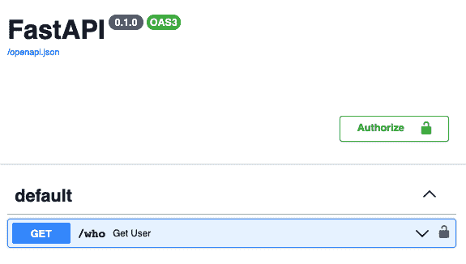

# 第十一章：认证与授权

> 尊重我的权威！
> 
> 艾瑞克·卡特曼，*南方公园*

# 预览

有时一个网站是完全开放的，任何访客都可以访问任何页面。但如果网站的内容可能被修改，某些端点将被限制只允许特定的人或组访问。如果任何人都能修改亚马逊的页面，想象一下会出现什么奇怪的物品，以及某些人突然获得的惊人销量。不幸的是，这是人类的本性——对于一些人来说，他们会利用其他人支付他们活动的隐藏税。

我们应该让我们的神秘动物网站对任何用户开放访问吗？不！几乎任何规模的网络服务最终都需要处理以下问题：

认证（authn）

你是谁？

授权（authz）

你想要什么？

认证和授权（auth）代码是否应该有自己的新层，例如在 Web 和服务之间添加一个新层？还是应该所有东西都由 Web 或服务层自己处理？本章将涉及认证技术及其放置位置的讨论。

往往关于 Web 安全的描述似乎比必要的复杂得多。攻击者可以非常狡猾，而反制措施可能并不简单。

###### 注意

正如我多次提到的，官方的 FastAPI 文档非常出色。如果本章提供的细节不足以满足您的需求，请查看[安全部分](https://oreil.ly/oYsKl)。

因此，让我们一步步地进行这次讲解。我将从简单的技术开始，这些技术仅用于将认证挂接到 Web 端点以进行测试，但不能在公共网站上使用。

# 插曲 1：您是否需要认证？

再次强调，*认证* 关注的是 *身份*：你是谁？要实施认证，我们需要将秘密信息映射到唯一的身份。有许多方法可以做到这一点，复杂度也有很多变化。让我们从简单开始逐步深入。

往往关于 Web 开发的书籍和文章会立即深入到认证和授权的细节中，有时会把它们弄混。它们有时会跳过第一个问题：您真的需要吗？

您可以允许完全匿名访问所有网站页面。但这将使您容易受到拒绝服务攻击等攻击的威胁。尽管某些保护措施（如速率限制）可以在 Web 服务器外部实施（参见第十三章），几乎所有公共 API 提供者都至少需要一些身份验证。

除了安全之外，我们还想知道网站的效果如何：

+   有多少独立访问者？

+   哪些页面最受欢迎？

+   某些更改是否会增加页面浏览量？

+   哪些页面序列是常见的？

这些问题的答案需要对特定访问者进行认证。否则，您只能得到总计数。

###### 注意

如果您的网站需要身份验证或授权，访问它应该是加密的（使用 HTTPS 而不是 HTTP），以防止攻击者从明文中提取机密数据。有关设置 HTTPS 的详细信息，请参见第十三章。

# 认证方法

有许多网络身份验证方法和工具：

用户名/电子邮件和密码

使用经典的 HTTP 基本和摘要身份验证

API 密钥

一个不透明的长字符串，带有一个附带的 *秘密*

OAuth2

一组用于身份验证和授权的标准

JavaScript Web Tokens（JWT）

一种包含经过加密签名的用户信息的编码格式

在本节中，我将回顾前两种方法，并向你展示如何传统地实现它们。但是在填写 API 和数据库代码之前，我会停下来。相反，我们将完全实现一个更现代的方案，使用 OAuth2 和 JWT。

# 全局身份验证：共享秘密

最简单的身份验证方法是传递一个通常只有 web 服务器知道的秘密。如果匹配，你就能进入。如果你的 API 网站暴露在公共网络中，使用 HTTP 而不是 HTTPS 是不安全的。如果它被隐藏在一个前端网站背后，而该前端网站本身是公开的，前端和后端可以使用一个共享的常量秘密进行通信。但是如果你的前端网站被黑客攻击了，那就麻烦了。让我们看看 FastAPI 如何处理简单的身份验证。

创建一个名为 *auth.py* 的新顶级文件。检查一下，你之前的章节中是否仍然有另一个仍在运行的 FastAPI 服务器，该服务器来自于那些不断变化的 *main.py* 文件。示例 11-1 实现了一个服务器，只是使用 HTTP 基本身份验证返回发送给它的任何 `username` 和 `password`——这是网络原始时代的一种方法。

##### 示例 11-1\. 使用 HTTP 基本身份验证获取用户信息：auth.py

```py
import uvicorn
from fastapi import Depends, FastAPI
from fastapi.security import HTTPBasic, HTTPBasicCredentials

app = FastAPI()

basic = HTTPBasic()

@app.get("/who")
def get_user(
    creds: HTTPBasicCredentials = Depends(basic)):
    return {"username": creds.username, "password": creds.password}

if __name__ == "__main__":
    uvicorn.run("auth:app", reload=True)
```

在示例 11-2 中，告诉 HTTPie 发送这个基本身份验证请求（这需要参数 `-a` *`name:password`*）。在这里，让我们使用名称 `me` 和密码 `secret`。

##### 示例 11-2\. 使用 HTTPie 进行测试

```py
$ http -q -a me:secret localhost:8000/who
{
    "password": "secret",
    "username": "me"
}
```

使用 示例 11-3 中的 Requests 包进行测试类似，使用 `auth` 参数。

##### 示例 11-3\. 使用 Requests 进行测试

```py
>>> import requests
>>> r = requests.get("http://localhost:8000/who",
    auth=("me", "secret"))
>>> r.json()
{'username': 'me', 'password': 'secret'}
```

你还可以使用自动文档页面（*http://localhost:8000/docs*）测试 示例 11-1，如 图 11-1 所示。



###### 图 11-1\. 简单身份验证的文档页面

点击右边的下箭头，然后点击尝试按钮，然后点击执行按钮。你会看到一个请求用户名和密码的表单。输入任何内容。文档表单将命中该服务器端点，并在响应中显示这些值。

这些测试表明你可以将用户名和密码发送到服务器并返回（虽然这些测试实际上没有检查任何内容）。服务器中的某些东西需要验证这个名称和密码是否与批准的值匹配。因此，在示例 11-4 中，我将在 Web 服务器中包含一个单一的秘密用户名和密码。你现在传递的用户名和密码需要与它们匹配（每个都是一个 *共享的秘密*），否则你会得到一个异常。HTTP 状态码 `401` 官方称为 `Unauthorized`，但实际上它的意思是*未经验证*。

###### 注意

而不是记忆所有的 HTTP 状态码，你可以导入 FastAPI 的 status 模块（该模块直接从 Starlette 导入）。因此，你可以在示例 11-4 中使用更加解释性的`sta⁠tus_code=​HTTP_401_UNAUTHORIZED`，而不是简单的`sta⁠tus_​code=401`。

##### 示例 11-4\. 在 auth.py 中添加一个秘密的用户名和密码

```py
import uvicorn
from fastapi import Depends, FastAPI, HTTPException
from fastapi.security import HTTPBasic, HTTPBasicCredentials

app = FastAPI()

secret_user: str = "newphone"
secret_password: str = "whodis?"

basic: HTTPBasicCredentials = HTTPBasic()

@app.get("/who")
def get_user(
    creds: HTTPBasicCredentials = Depends(basic)) -> dict:
    if (creds.username == secret_user and
        creds.password == secret_password):
        return {"username": creds.username,
            "password": creds.password}
    raise HTTPException(status_code=401, detail="Hey!")

if __name__ == "__main__":
    uvicorn.run("auth:app", reload=True)
```

在示例 11-5 中，如果用户名和密码猜测错误，会收到轻微的`401`警告。

##### 示例 11-5\. 使用 HTTPie 测试不匹配的用户名/密码

```py
$ http -a me:secret localhost:8000/who
HTTP/1.1 401 Unauthorized
content-length: 17
content-type: application/json
date: Fri, 03 Mar 2023 03:25:09 GMT
server: uvicorn

{
    "detail": "Hey!"
}
```

使用这种魔法组合返回用户名和密码，如以前在示例 11-6 中所示。

##### 示例 11-6\. 使用 HTTPie 测试正确的用户名/密码

```py
$ http -q -a newphone:whodis? localhost:8000/who
{
    "password": "whodis?",
    "username": "newphone"
}
```

# 简单的个人认证

前一节展示了如何使用共享秘密来控制访问。这是一种广义的方法，安全性不高。它并没有告诉你有关个体访问者的任何信息，只是它们（或有感知的人工智能）知道这个秘密。

许多网站希望执行以下操作：

+   某种方式定义个别访问者

+   标识特定访问者在访问某些端点时（认证）

+   可能为某些访问者和端点分配不同的权限（授权）

+   可能保存每个访问者的特定信息（兴趣，购买等）

如果你的访问者是人类，你可能希望他们提供用户名或电子邮件以及密码。如果它们是外部程序，你可能希望它们提供 API 密钥和密钥。

###### 注意

从现在开始，我将仅使用*用户名*来指代用户选择的名称或电子邮件。

要认证真实的个人用户而不是虚拟用户，你需要做更多工作：

+   将用户值（名称和密码）作为 HTTP 标头传递给 API 服务器端点。

+   使用 HTTPS 而不是 HTTP，以避免任何人窥视这些标头的文本。

+   *哈希*密码为不同的字符串。其结果是不可“解哈希化”的——你不能从其哈希值推导出原始密码。

+   创建一个真实的数据库存储一个`User`数据库表，包含用户名和哈希密码（绝不是原始明文密码）。

+   对新输入的密码进行哈希处理，并将结果与数据库中的哈希密码进行比较。

+   如果用户名和哈希密码匹配，将匹配的`User`对象传递到堆栈上。如果它们不匹配，则返回`None`或引发异常。

+   在服务层中，触发与个人用户认证相关的任何指标/日志等。

+   在 Web 层中，将认证用户信息发送给需要的任何函数。

我将在接下来的章节中向你展示如何使用 OAuth2 和 JWT 等最新工具来完成所有这些事情。

# 更复杂的个人认证

如果你想要认证个体，你必须在某处存储一些个体信息，例如在一个包含至少一个键（用户名或 API 密钥）和一个密钥（密码或 API 密钥）的数据库中。当访问受保护的 URL 时，你的网站访问者将提供这些信息，而你需要在数据库中找到匹配项。

官方的 FastAPI 安全文档（[入门](https://oreil.ly/kkTUB) 和 [高级](https://oreil.ly/biKwy)）详细描述了如何为多个用户设置认证，使用本地数据库。但是，示例网络功能模拟了实际数据库访问。

在这里，你将会做相反的操作：从数据层开始，逐步向上。你将定义用户/访客的定义、存储和访问方式。然后逐步向上到 Web 层，讨论用户身份验证的传递、评估和认证。

## OAuth2

> OAuth 2.0，即“开放授权”，是一个标准，旨在允许网站或应用程序代表用户访问其他网站应用程序托管的资源。
> 
> Auth0

在早期信任的 Web 时代，你可以将你在一个网站（我们称之为 B）的登录名和密码提供给另一个网站（当然是 A），让其代表你访问 B 上的资源。这会让 A 获得对 B 的*完全访问权限*，尽管它只被信任访问它应该访问的内容。B 和资源的例子包括 Twitter 的粉丝、Facebook 的好友、电子邮件联系人等。当然，这种做法不可能长久存在，所以各种公司和组织联合起来定义了 OAuth。它最初的设计目的只是允许网站 A 访问网站 B 上特定（而非全部）的资源。

[OAuth2](https://oauth.net/2) 是一个流行但复杂的*授权*标准，适用于 A/B 例子之外的多种情况。有许多对它的解释，从[轻量级](https://oreil.ly/ehmuf)到[深入](https://oreil.ly/qAUaM)。

###### 注意

曾经有一个 [OAuth1](https://oauth.net/1)，但它不再使用。一些最初的 OAuth2 建议现在已被弃用（计算机术语，意思是*不要使用它们*）。在未来，还会有 [OAuth2.1](https://oauth.net/2.1) 和更远的 [txauth](https://oreil.ly/5PW2T)。

OAuth 提供了各种[流程](https://oreil.ly/kRiWh)以应对不同的情况。本节将使用*授权码流*来进行实现，逐步迈出平均大小的步骤。

首先，你需要安装这些第三方 Python 包：

JWT 处理

`pip install python-jose[cryptography]`

安全的密码处理

`pip install passlib`

表单处理

`pip install python-multipart`

以下部分从用户数据模型和数据库管理开始，逐步向上到服务和 Web 层，其中包括 OAuth。

## 用户模型

让我们从 示例 11-7 中的极简用户模型定义开始。这些将在所有层中使用。

##### 示例 11-7\. 用户定义：model/user.py

```py
from pydantic import BaseModel

class User(BaseModel):
    name: str
    hash: str
```

`User` 对象包含一个任意的 `name` 和一个 `hash` 字符串（经过哈希处理的密码，而不是原始的明文密码），这是保存在数据库中的内容。我们需要这两者来验证访客。

## 用户数据层

示例 11-8 包含了用户数据库代码。

###### 注意

代码创建了 `user`（活跃用户）和 `xuser`（已删除用户）表。通常开发者会向用户表添加一个布尔类型的 `deleted` 字段，以指示用户不再活跃，而实际上并没有从表中删除记录。我更倾向于将删除的用户数据移动到另一个表中。这样可以避免在所有用户查询中重复检查 `deleted` 字段。它还有助于加快查询速度：对于像布尔类型这样的低基数字段，创建索引并不会带来实质的好处。

##### 示例 11-8\. 数据层：data/user.py

```py
from model.user import User
from .init import (conn, curs, get_db, IntegrityError)
from error import Missing, Duplicate

curs.execute("""create table if not exists
 user(
 name text primary key,
 hash text)""")
curs.execute("""create table if not exists
 xuser(
 name text primary key,
 hash text)""")

def row_to_model(row: tuple) -> User:
    name, hash = row
    return User(name=name, hash=hash)

def model_to_dict(user: User) -> dict:
    return user.dict()

def get_one(name: str) -> User:
    qry = "select * from user where name=:name"
    params = {"name": name}
    curs.execute(qry, params)
    row = curs.fetchone()
    if row:
        return row_to_model(row)
    else:
        raise Missing(msg=f"User {name} not found")

def get_all() -> list[User]:
    qry = "select * from user"
    curs.execute(qry)
    return [row_to_model(row) for row in curs.fetchall()]

def create(user: User, table:str = "user"):
    """Add <user> to user or xuser table"""
    qry = f"""insert into {table}
 (name, hash)
 values
 (:name, :hash)"""
    params = model_to_dict(user)
    try:
        curs.execute(qry, params)
    except IntegrityError:
        raise Duplicate(msg=
            f"{table}: user {user.name} already exists")

def modify(name: str, user: User)  -> User:
    qry = """update user set
 name=:name, hash=:hash
 where name=:name0"""
    params = {
        "name": user.name,
        "hash": user.hash,
        "name0": name}
    curs.execute(qry, params)
    if curs.rowcount == 1:
        return get_one(user.name)
    else:
        raise Missing(msg=f"User {name} not found")

def delete(name: str) -> None:
    """Drop user with <name> from user table, add to xuser table"""
    user = get_one(name)
    qry = "delete from user where name = :name"
    params = {"name": name}
    curs.execute(qry, params)
    if curs.rowcount != 1:
        raise Missing(msg=f"User {name} not found")
    create(user, table="xuser")
```

## 用户伪数据层

在排除数据库但需要一些用户数据的测试中使用了 示例 11-9 模块。

##### 示例 11-9\. 伪数据层：fake/user.py

```py
from model.user import User
from error import Missing, Duplicate

# (no hashed password checking in this module)
fakes = [
    User(name="kwijobo",
         hash="abc"),
    User(name="ermagerd",
         hash="xyz"),
    ]

def find(name: str) -> User | None:
    for e in fakes:
        if e.name == name:
            return e
    return None

def check_missing(name: str):
    if not find(name):
        raise Missing(msg=f"Missing user {name}")

def check_duplicate(name: str):
    if find(name):
        raise Duplicate(msg=f"Duplicate user {name}")

def get_all() -> list[User]:
    """Return all users"""
    return fakes

def get_one(name: str) -> User:
    """Return one user"""
    check_missing(name)
    return find(name)

def create(user: User) -> User:
    """Add a user"""
    check_duplicate(user.name)
    return user

def modify(name: str, user: User) -> User:
    """Partially modify a user"""
    check_missing(name)
    return user

def delete(name: str) -> None:
    """Delete a user"""
    check_missing(name)
    return None
```

## 用户服务层

示例 11-10 定义了用户的服务层。与其他服务层模块的不同之处在于增加了 OAuth2 和 JWT 函数。我认为将它们放在这里比放在 Web 层中更清晰，尽管一些 OAuth2 Web 层函数位于即将到来的 *web/user.py* 中。

CRUD 函数目前仍然是传递功能，但将来可以根据需求进行调整。请注意，与生物和探险者服务类似，这种设计支持在运行时使用伪数据层或真实数据层访问用户数据。

##### 示例 11-10\. 服务层：service/user.py

```py
from datetime import timedelta, datetime
import os
from jose import jwt
from model.user import User

if os.getenv("CRYPTID_UNIT_TEST"):
    from fake import user as data
else:
    from data import user as data

# --- New auth stuff

from passlib.context import CryptContext

# Change SECRET_KEY for production!
SECRET_KEY = "keep-it-secret-keep-it-safe"
ALGORITHM = "HS256"
pwd_context = CryptContext(schemes=["bcrypt"], deprecated="auto")

def verify_password(plain: str, hash: str) -> bool:
    """Hash <plain> and compare with <hash> from the database"""
    return pwd_context.verify(plain, hash)

def get_hash(plain: str) -> str:
    """Return the hash of a <plain> string"""
    return pwd_context.hash(plain)

def get_jwt_username(token:str) -> str | None:
    """Return username from JWT access <token>"""
    try:
        payload = jwt.decode(token, SECRET_KEY, algorithms=[ALGORITHM])
        if not (username := payload.get("sub")):
            return None
    except jwt.JWTError:
        return None
    return username

def get_current_user(token: str) -> User | None:
    """Decode an OAuth access <token> and return the User"""
    if not (username := get_jwt_username(token)):
        return None
    if (user := lookup_user(username)):
        return user
    return None

def lookup_user(username: str) -> User | None:
    """Return a matching User from the database for <name>"""
    if (user := data.get(username)):
        return user
    return None

def auth_user(name: str, plain: str) -> User | None:
    """Authenticate user <name> and <plain> password"""
    if not (user := lookup_user(name)):
        return None
    if not verify_password(plain, user.hash):
        return None
    return user

def create_access_token(data: dict,
    expires: timedelta | None = None
):
    """Return a JWT access token"""
    src = data.copy()
    now = datetime.utcnow()
    if not expires:
        expires = timedelta(minutes=15)
    src.update({"exp": now + expires})
    encoded_jwt = jwt.encode(src, SECRET_KEY, algorithm=ALGORITHM)
    return encoded_jwt

# --- CRUD passthrough stuff

def get_all() -> list[User]:
    return data.get_all()

def get_one(name) -> User:
    return data.get_one(name)

def create(user: User) -> User:
    return data.create(user)

def modify(name: str, user: User) -> User:
    return data.modify(name, user)

def delete(name: str) -> None:
    return data.delete(name)
```

## 用户 Web 层

示例 11-11 在 Web 层中定义了基础用户模块。它使用了来自 *service/user.py* 模块中 示例 11-10 的新授权代码。

##### 示例 11-11\. Web 层：web/user.py

```py
import os
from fastapi import APIRouter, HTTPException
from fastapi.security import OAuth2PasswordBearer, OAuth2PasswordRequestForm
from model.user import User
if os.getenv("CRYPTID_UNIT_TEST"):
    from fake import user as service
else:
    from service import user as service
from error import Missing, Duplicate

ACCESS_TOKEN_EXPIRE_MINUTES = 30

router = APIRouter(prefix = "/user")

# --- new auth stuff

# This dependency makes a post to "/user/token"
# (from a form containing a username and password)
# and returns an access token.
oauth2_dep = OAuth2PasswordBearer(tokenUrl="token")

def unauthed():
    raise HTTPException(
        status_code=401,
        detail="Incorrect username or password",
        headers={"WWW-Authenticate": "Bearer"},
        )

# This endpoint is directed to by any call that has the
# oauth2_dep() dependency:
@router.post("/token")
async def create_access_token(
    form_data: OAuth2PasswordRequestForm =  Depends()
):
    """Get username and password from OAuth form,
 return access token"""
    user = service.auth_user(form_data.username, form_data.password)
    if not user:
        unauthed()
    expires = timedelta(minutes=ACCESS_TOKEN_EXPIRE_MINUTES)
    access_token = service.create_access_token(
        data={"sub": user.username}, expires=expires
    )
    return {"access_token": access_token, "token_type": "bearer"}

@app.get("/token")
def get_access_token(token: str = Depends(oauth2_dep)) -> dict:
    """Return the current access token"""
    return {"token": token}

# --- previous CRUD stuff

@router.get("/")
def get_all() -> list[User]:
    return service.get_all()

@router.get("/{name}")
def get_one(name) -> User:
    try:
        return service.get_one(name)
    except Missing as exc:
        raise HTTPException(status_code=404, detail=exc.msg)

@router.post("/", status_code=201)
def create(user: User) -> User:
    try:
        return service.create(user)
    except Duplicate as exc:
        raise HTTPException(status_code=409, detail=exc.msg)

@router.patch("/")
def modify(name: str, user: User) -> User:
    try:
        return service.modify(name, user)
    except Missing as exc:
        raise HTTPException(status_code=404, detail=exc.msg)

@router.delete("/{name}")
def delete(name: str) -> None:
    try:
        return service.delete(name)
    except Missing as exc:
        raise HTTPException(status_code=404, detail=exc.msg)
```

## 测试！

对于这个新用户组件的单元测试和完整测试与你已经看过的生物和探险者的测试类似。与其在这里使用墨水和纸张，不如在本书附带的网站上查看它们。¹

## 顶层

前一节为以 */user* 开头的 URL 定义了一个新的 `router` 变量，所以 示例 11-12 添加了这个子路由器。

##### 示例 11-12\. 顶层：main.py

```py
from fastapi import FastAPI
from web import explorer, creature, user

app = FastAPI()
app.include_router(explorer.router)
app.include_router(creature.router)
app.include_router(user.router)
```

当 Uvicorn 自动重载时，*/user/…* 终端现在应该是可用的。

那真是有趣，按一种拉伸的定义来说是有趣的。考虑到刚刚创建的所有用户代码，让我们给它一些事情做。

## 认证步骤

下面是前面章节中大量代码的回顾：

+   如果一个端点依赖于 `oauth2_dep()`（在 *web/user.py* 中），则会生成一个包含用户名和密码字段的表单，并发送给客户端。

+   在客户端填写并提交此表单后，用户名和密码（与本地数据库中已存储的相同算法的哈希值）将与本地数据库匹配。

+   如果匹配成功，将生成一个访问令牌（JWT 格式）并返回。

+   此访问令牌作为`Authorization` HTTP 头传回 Web 服务器。此 JWT 令牌在本地服务器上被解码为用户名和其他详细信息。这个名称不需要再次在数据库中查找。

+   用户名已经过认证，服务器可以对其进行任意操作。

服务器可以如何处理这些辛苦获得的认证信息？服务器可以执行以下操作：

+   生成指标（此用户、此端点、此时段），以帮助研究谁查看了什么内容，持续多长时间等等。

+   保存用户特定信息。

## JWT

此部分包含 JWT 的一些详细信息。在本章中，您实际上不需要这些信息来使用所有之前的代码，但如果您有点好奇……

[JWT](https://jwt.io)是一种编码方案，而不是一种认证方法。其低级细节在[RFC 7519](https://oreil.ly/_op1j)中有定义。它可用于传达 OAuth2（以及其他方法）的认证信息，在这里我将展示出来。

JWT 是一个可读的字符串，由三部分点分隔而成：

+   *Header*：使用的加密算法和令牌类型

+   *Payload*：……

+   *Signature*：……

每个部分由一个 JSON 字符串组成，以[Base 64 URL](https://www.base64url.com)格式编码。这里有一个示例（已在点处拆分以适应本页）：

```py
eyJhbGciOiJIUzI1NiIsInR5cCI6IkpXVCJ9.
eyJzdWIiOiIxMjM0NTY3ODkwIiwibmFtZSI6IkpvaG4gRG9lIiwiaWF0IjoxNTE2MjM5MDIyfQ.
SflKxwRJSMeKKF2QT4fwpMeJf36POk6yJV_adQssw5c
```

作为纯 ASCII 字符串，它也可以安全地用作 URL 的一部分、查询参数、HTTP 头、Cookie 等，传递给 Web 服务器。

JWT 避免了数据库查找，但这也意味着您无法直接检测到已撤销的授权。

## 第三方认证：OIDC

您经常会看到一些网站，让您使用 ID 和密码登录，或者让您通过不同网站的账户登录，比如 Google、Facebook/Meta、LinkedIn 或许多其他网站。这些通常使用一个称为[OpenID Connect (OIDC)](https://openid.net/connect)的标准，它是建立在 OAuth2 之上的。当您连接到外部支持 OIDC 的站点时，您将收到一个 OAuth2 访问令牌（如本章的示例中所示），还会收到一个*ID 令牌*。

官方的 FastAPI 文档不包含与 OIDC 集成的示例代码。如果您想尝试，一些第三方包（特定于 FastAPI 和更通用的）将比自行实现节省时间：

+   [FastAPI OIDC](https://oreil.ly/TDABr)

+   [fastapi-third-party-auth](https://oreil.ly/yGaO6)

+   [FastAPI 资源服务器](https://oreil.ly/THByF)

+   [oauthlib](https://oreil.ly/J-pDB)

+   [oic](https://oreil.ly/AgYKZ)

+   [OIDC 客户端](https://oreil.ly/e9QGb)

+   [oidc-op](https://oreil.ly/cJCF4)

+   [OpenID Connect](https://oreil.ly/WH49I)

[FastAPI Repo Issues 页面](https://oreil.ly/ztR3r)包含多个代码示例，以及来自 tiangelo（Sebastián Ramírez）的评论，未来 FastAPI OIDC 示例将包含在官方文档和教程中。

# 授权

认证处理*who*（身份），授权处理*what*：您允许访问哪些资源（Web 端点）以及以何种方式？*who*和*what*的组合数量可能很大。

在本书中，探险者和生物一直是主要资源。查找探险者或列出它们通常比添加或修改现有资源更“开放”。如果网站应该是一种可靠的接口到某些数据，写访问应该比读访问受到更严格的限制。因为，唉，人们。

如果每个端点完全开放，您不需要授权，可以跳过此部分。最简单的授权可能是一个简单的布尔值（这个用户是否是管理员？）；对于本书中的示例，您可能需要管理员授权来添加、删除或修改探险者或生物。如果您的数据库条目很多，您可能还希望为非管理员限制`get_all()`函数的进一步权限。随着网站变得更加复杂，权限可能变得更加细粒度化。

让我们看一下授权案例的进展。我们将使用`User`表，其中`name`可以是电子邮件、用户名或 API 密钥；“配对”表是关系数据库匹配两个单独表条目的方式。

+   如果您只想跟踪管理员访问者并让其他人匿名：

    +   使用`Admin`表进行经过身份验证的用户名。您可以从`Admin`表中查找名称，并且如果匹配，则与`User`表中的哈希密码进行比较。

+   如果*所有*访问者都应该经过身份验证，但您只需为某些端点授权管理员：

    +   与之前示例中的每个人进行身份验证（来自`User`表），然后检查`Admin`表以查看此用户是否也是管理员。

+   对于多种类型的权限（如只读、读取、写入）：

    +   使用`Permission`定义表。

    +   使用`UserPermission`表对用户和权限进行配对。这有时被称为访问控制列表（ACL）。

+   如果权限组合复杂，添加一个级别并定义*角色*（独立的权限集合）：

    +   创建一个`Role`表。

    +   创建一个`UserRole`表，配对`User`和`Role`条目。这有时被称为基于角色的访问控制（RBAC）。

# 中间件。

FastAPI 允许在 Web 层插入代码执行以下操作：

+   拦截请求。

+   处理请求的某些操作。

+   将请求传递给路径函数。

+   拦截由补丁函数返回的响应。

+   对响应执行某些操作。

+   返回响应给调用者。

它类似于 Python 装饰器对其“包装”的函数所做的事情。

在某些情况下，您可以使用中间件或依赖注入与`Depends()`。中间件更方便处理像 CORS 这样的全局安全问题，这也提出了...​​

## 跨源资源共享（CORS）。

*跨源资源共享*（CORS）涉及与其他受信任的服务器和您的网站之间的通信。如果您的站点将所有前端和后端代码放在一个地方，那就没问题了。但是现在，将 JavaScript 前端与 FastAPI 等后端进行通信已经很普遍了。这些服务器将不具有相同的*源*：

协议

`http` 或 `https`

域名

互联网域名，比如 `google.com` 或 `localhost`

端口

在该域上的数字 TCP/IP 端口，比如 `80`、`443` 或 `8000`

后端如何知道可信任的前端和一个充满霉菌的萝卜箱或一个胡子拨弄的攻击者之间的区别？这是 CORS 的工作，它指定了后端信任的内容，最重要的是以下内容：

+   来源

+   HTTP 方法

+   HTTP 头部

+   CORS 缓存超时

你在 Web 层级上连接到 CORS。示例 11-13 展示了如何允许只有一个前端服务器（具有域名 *https://ui.cryptids.com*）以及任何 HTTP 头部或方法。

##### 示例 11-13\. 激活 CORS 中间件。

```py
from fastapi import FastAPI, Request
from fastapi.middleware.cors import CORSMiddleware

app = FastAPI()

app.add_middleware(
    CORSMiddleware,
    allow_origins=["https://ui.cryptids.com",],
    allow_credentials=True,
    allow_methods=["*"],
    allow_headers=["*"],
    )

@app.get("/test_cors")
def test_cors(request: Request):
    print(request)
```

一旦完成，任何试图直接联系您的后端站点的其他域都将被拒绝。

## 第三方包

你现在已经阅读了如何使用 FastAPI 编写身份验证和授权解决方案的示例。但也许你不需要自己做所有的事情。FastAPI 生态系统发展迅速，可能已经有可用的包来为你做大部分工作了。

以下是一些未经测试的示例。不能保证此列表中的任何包在未来仍然存在并得到支持，但可能值得一看：

+   [FastAPI Users](https://oreil.ly/ueVfq) 是 FastAPI 的用户管理模块。

+   [FastAPI JWT Auth](https://oreil.ly/ooGSK) 是一个与 FastAPI 集成的 JWT 认证模块。

+   [FastAPI-Login](https://oreil.ly/oWA3p) 是一个用于 FastAPI 的登录认证模块。

+   [fastapi-auth0](https://oreil.ly/fHfkU)

+   [AuthX](https://authx.yezz.me)

+   [FastAPI-User-Auth](https://oreil.ly/J57xu) 是 FastAPI 的用户认证模块。

+   [fastapi-authz](https://oreil.ly/aAGzW)

+   [fastapi-opa](https://oreil.ly/Bvzv3)

+   [FastAPI-key-auth](https://oreil.ly/s-Ui5)

+   [FastAPI Auth Middleware](https://oreil.ly/jnR-s) 是 FastAPI 的认证中间件。

+   [fastapi-jwt](https://oreil.ly/RrxUZ) 是 FastAPI 的 JWT 认证模块。

+   [fastapi_auth2](https://oreil.ly/5DXkB)

+   [fastapi-sso](https://oreil.ly/GLTdt) 是一个 FastAPI 单点登录（SSO）模块。

+   [Fief](https://www.fief.dev)

# 回顾

这是一个比大多数更重的章节。它展示了你可以对访问者进行身份验证并授权他们执行某些操作的方式。这是 Web 安全的两个方面。该章还讨论了 CORS，另一个重要的 Web 安全主题。

¹ 如果我按行收费，命运可能会干涉。
