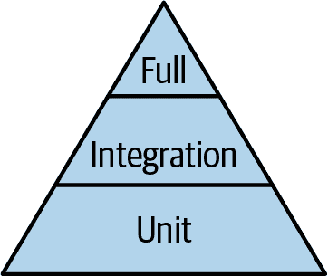

# 第十二章。测试

> 一个 QA 工程师走进一家酒吧。点了一杯啤酒。点了 0 杯啤酒。点了 99999999999 杯啤酒。点了一只蜥蜴。点了 -1 杯啤酒。点了一个 ueicbksjdhd。
> 
> 第一个真正的客户走进来问洗手间在哪里。酒吧突然起火，所有人都死了。
> 
> Brenan Keller，Twitter

# 预览

本章讨论了在 FastAPI 站点上进行的各种测试类型：*单元*，*集成* 和 *完整*。它以 *pytest* 和自动化测试开发为特色。

# Web API 测试

您已经看到几个手动 API 测试工具，因为已经添加了端点：

+   HTTPie

+   请求

+   HTTPX

+   Web 浏览器

还有许多其他测试工具可用：

+   [Curl](https://curl.se) 是非常有名的，尽管在本书中我使用了更简单语法的 HTTPie。

+   [Httpbin](http://httpbin.org)，由 Requests 的作者编写，是一个提供许多视图来查看您的 HTTP 请求的免费测试服务器。

+   [Postman](https://www.postman.com) 是一个完整的 API 测试平台。

+   [Chrome DevTools](https://oreil.ly/eUK_R) 是 Chrome 浏览器的一个丰富工具集。

这些都可以用于完整（端到端）测试，例如您在前几章中看到的那些。那些手动测试在代码刚敲完后迅速验证是非常有用的。

但是如果您稍后进行的更改破坏了早期的某些手动测试（*回归*）怎么办？您不想在每次代码更改后重新运行数十个测试。这时*自动化*测试变得重要。本章的其余部分将重点介绍这些内容，并讲解如何使用 pytest 构建它们。

# 测试位置

我已经提到了各种测试：

单元

在一个层内，测试单个函数

集成

跨层测试连接性

完整

测试完整的 API 和其下的堆栈

有时这些被称为*测试金字塔*，宽度表示每个组中应该有的相对测试数量（图 12-1）。



###### 图 12-1。测试金字塔

# 什么要测试

在编写代码时，您应该测试什么？基本上，对于给定的输入，请确认您得到了正确的输出。您可以检查以下内容：

+   缺少输入

+   重复输入

+   不正确的输入类型

+   不正确的输入顺序

+   无效的输入值

+   大输入或输出

错误可能发生在任何地方：

Web 层

Pydantic 将捕获模型不匹配，并返回 `422` HTTP 状态码。

数据层

数据库将因为缺失或重复数据，以及 SQL 查询语法错误而引发异常。当一次传递大量数据结果而不是使用生成器或分页时，可能会发生超时或内存耗尽。

任何层

可能发生普通的错误和疏忽。

章节 8 到 10 包含了一些这样的测试：

+   *完全手动测试*，使用像 HTTPie 这样的工具

+   *单元手动测试*，作为 Python 片段

+   *自动化测试*，使用 pytest 脚本

接下来的几节将详细介绍 pytest。

# Pytest

Python 一直拥有标准包 [unittest](https://oreil.ly/3u0M_)。稍后的第三方包称为 [nose](https://nose.readthedocs.io)，试图对其进行改进。现在大多数 Python 开发者更喜欢 [pytest](https://docs.pytest.org)，它比这两者都更强大且更易于使用。它没有内置在 Python 中，因此如果没有安装，你需要运行 `pip install pytest`。此外，运行 `pip install pytest-mock` 可获取自动的 `mocker` 固定装置；稍后在本章中你将看到这一点。

pytest 提供了什么？其中包括以下不错的自动功能：

测试发现

Python 文件名中的测试前缀或测试后缀将自动运行。此文件名匹配会进入子目录，执行那里的所有测试。

断言失败的详细信息

一个失败的 `assert` 语句会打印预期的内容和实际发生的内容。

固定装置

这些函数可以为整个测试脚本运行一次，或者为每个测试运行一次（其*作用域*），为测试函数提供参数，如标准测试数据或数据库初始化。固定装置类似于依赖注入，就像 FastAPI 为 Web 路径函数提供的那样：特定的数据传递给通用的测试函数。

参数化

这为测试函数提供了多个测试数据。

# 布局

你应该把测试放在哪里？似乎没有广泛的一致意见，但这里有两种合理的设计：

+   顶层有一个 *test* 目录，其中包含被测试的代码区域的子目录（如 *web*、*service* 等）。

+   在每个代码目录下都有一个 *test* 目录（如 *web*、*service* 等）。

此外，在特定的子目录中（如 *test/web*），是否应该为不同的测试类型（如 *unit*、*integration* 和 *full*）创建更多目录？在本书中，我使用了这种层次结构：

```py
test
├── unit
│   ├── web
│   ├── service
│   └── data
├── integration
└── full
```

各个测试脚本存放在底层目录中。这些在本章中。

# 自动化单元测试

单元测试应该检查一个事物，在一个层次内。通常意味着向函数传递参数，并断言应该返回什么。

单元测试要求对被测试的代码进行*隔离*。如果不这样做，你也在测试其他东西。那么，如何为单元测试隔离代码呢？

## 模拟

在本书的代码堆栈中，通过 Web API 访问 URL 通常会调用 Web 层中的函数，该函数调用服务层中的函数，后者调用数据层中的函数，后者访问数据库。结果通过链条向上流动，最终从 Web 层返回给调用者。

单元测试听起来很简单。对于代码库中的每个函数，传入测试参数并确认其返回预期值即可。这对于*纯函数*（仅接受输入参数并返回响应，不引用任何外部代码）非常有效。但大多数函数还会调用其他函数，那么如何控制这些其他函数的操作？那么这些来自外部来源的数据如何处理？最常见的外部因素是控制数据库访问，但实际上可以是任何东西。

一种方法是*模拟*每个外部函数调用。因为在 Python 中函数是一级对象，你可以用另一个函数替换一个函数。unittest 包有一个 mock 模块可以做到这一点。

许多开发者认为模拟是隔离单元测试的最佳方法。我将首先在这里展示模拟的例子，并且提出一个论点：模拟往往需要对*代码如何运作*有太多了解，而不是其结果。你可能会听到*结构化测试*（如模拟，其中被测试的代码非常可见）和*行为测试*（其中代码内部不需要）这些术语。

示例 12-1 和 12-2 定义了*mod1.py* 和 *mod2.py* 这两个模块。

##### 示例 12-1\. 被调用的模块（mod1.py）

```py
def preamble() -> str:
    return "The sum is "
```

##### 示例 12-2\. 被调用的模块（mod2.py）

```py
import mod1

def summer(x: int, y:int) -> str:
    return mod1.preamble() + f"{x+y}"
```

`summer()`函数计算其参数的和，并返回一个包含前文和总和的字符串。示例 12-3 是一个最小化的 pytest 脚本，用于验证`summer()`。

##### 示例 12-3\. Pytest 脚本 test_summer1.py

```py
import mod2

def test_summer():
    assert "The sum is 11" == mod2.summer(5,6)
```

示例 12-4 成功运行了测试。

##### 示例 12-4\. 运行 pytest 脚本

```py
$ pytest -q test_summer1.py
.                                                                    [100%]
1 passed in 0.04s
```

（`-q` 可以安静地运行测试，不会输出大量额外的细节。）好的，测试通过了。但`summer()`函数从`preamble`函数中得到了一些文本。如果我们只是想测试加法是否成功呢？

我们可以编写一个新函数，它只返回两个数字的字符串化的和，然后重写`summer()`函数将其返回附加到`preamble()`字符串中。

或者，我们可以模拟`preamble()`以消除其效果，正如在示例 12-5 中展示的多种方式那样。

##### 示例 12-5\. Pytest 中的模拟（test_summer2.py）

```py
from unittest import mock
import mod1
import mod2

def test_summer_a():
    with mock.patch("mod1.preamble", return_value=""):
        assert "11" == mod2.summer(5,6)

def test_summer_b():
    with mock.patch("mod1.preamble") as mock_preamble:
        mock_preamble.return_value=""
        assert "11" == mod2.summer(5,6)

@mock.patch("mod1.preamble", return_value="")
def test_summer_c(mock_preamble):
    assert "11" == mod2.summer(5,6)

@mock.patch("mod1.preamble")
def test_caller_d(mock_preamble):
    mock_preamble.return_value = ""
    assert "11" == mod2.summer(5,6)
```

这些测试显示，模拟对象可以通过多种方式创建。`test_caller_a()`函数使用`mock.patch()`作为 Python 的*上下文管理器*（使用`with`语句）。其参数列在此处：

`"mod1.preamble"`

在模块`mod1`中，`preamble()`函数的完整字符串名称。

`return_value=""`

使得这个模拟版本返回一个空字符串。

`test_caller_b()`函数几乎相同，但在下一行添加了`as mock_preamble`来使用模拟对象。

`test_caller_c()`函数使用 Python 的*装饰器*定义了模拟对象。模拟对象作为参数传递给了`test_caller2()`。

`test_caller_d()`函数类似于`test_caller_b()`，但在对`mock_preamble`进行单独调用设置`return_value`时添加了`as mock_preamble`。

在每种情况下，要模拟的事物的字符串名称必须与在正在测试的代码中调用它的方式匹配——在本例中是`summer()`。模拟库将该字符串名称转换为一个变量，该变量将拦截对原始具有该名称的任何变量的引用。（请记住，在 Python 中，变量只是对真实对象的引用。）

当运行示例 12-6 时，在所有四个`summer()`测试函数中，当调用`summer(5,6)`时，替代的变身模拟`preamble()`被调用而不是真正的函数。模拟版本会丢弃该字符串，因此测试可以确保`summer()`返回其两个参数的字符串版本的和。

##### 示例 12-6\. 运行模拟的 pytest

```py
$ pytest -q test_summer2.py
....                                                                 [100%]
4 passed in 0.13s
```

###### 注意

那是一个刻意的案例，为了简单起见。模拟可以非常复杂；查看像 [“Understanding the Python Mock Object Library” by Alex Ronquillo](https://oreil.ly/I0bkd) 这样的文章，以及官方的 [Python 文档](https://oreil.ly/hN9lZ) 获取详细信息。

## 测试 Doubles 和 Fakes

要执行该模拟，您需要知道`summer()`函数从模块`mod1`导入了函数`preamble()`。这是一个结构测试，需要了解特定变量和模块名称。

是否有一种不需要这样做的行为测试方法？

一种方法是定义一个 *double*：在测试中执行我们希望的操作的独立代码——在本例中，使`preamble()`返回一个空字符串。其中一种方法是使用导入。在接下来的三个部分的层中使用它进行单元测试之前，首先将其应用于此示例。

首先，在示例 12-7 中重新定义 *mod2.py*。

##### 示例 12-7\. 如果进行单元测试，使 mod2.py 导入一个 double

```py
import os
if os.get_env("UNIT_TEST"):
    import fake_mod1 as mod1
else:
    import mod1

def summer(x: int, y:int) -> str:
    return mod1.preamble() + f"{x+y}"
```

示例 12-8 定义了双重模块 *fake_mod1.py*。

##### 示例 12-8\. 双重 fake_mod1.py

```py
def preamble() -> str:
    return ""
```

而示例 12-9 是测试。

##### 示例 12-9\. 测试脚本 test_summer_fake.py

```py
import os
os.environ["UNIT_TEST"] = "true"
import mod2

def test_summer_fake():
    assert "11" == mod2.summer(5,6)
```

…​.运行示例 12-10。

##### 示例 12-10\. 运行新的单元测试

```py
$ pytest -q test_summer_fake.py
.                                                                    [100%]
1 passed in 0.04s
```

这种导入切换方法确实需要添加一个环境变量的检查，但避免了必须为函数调用编写特定的模拟。您可以自行决定喜欢哪种方法。接下来的几节将使用`import`方法，这与我在定义代码层时使用的 *fake* 包非常匹配。

总结一下，这些示例将`preamble()`替换为测试脚本中的模拟，或者导入了一个 *double*。您可以以其他方式隔离被测试的代码，但这些方法工作起来并不像 Google 可能为您找到的其他方法那么棘手。

## Web

该层实现了站点的 API。理想情况下，每个路径函数（终点）都应至少有一个测试——也许更多，如果该函数可能以多种方式失败。在 Web 层，您通常希望查看端点是否存在，是否能够使用正确的参数工作，并返回正确的状态代码和数据。

###### 注意

这些都是浅层 API 测试，仅在 Web 层内部进行测试。因此，需要拦截服务层调用（这些调用将进一步调用数据层和数据库），以及任何其他退出 Web 层的调用。

使用上一节的 `import` 思想，使用环境变量 `CRYPTID_UNIT_TEST` 将 *fake* 包作为 `service` 导入，而不是真正的 `service`。这样一来，Web 函数不再调用 Service 函数，而是直接绕过它们到达 *fake*（双重）版本。然后，较低的数据层和数据库也不参与其中。我们得到了想要的单元测试。例子 12-11 有修改后的 *web/creature.py* 文件。

##### 例子 12-11\. 修改后的 web/creature.py

```py
import os
from fastapi import APIRouter, HTTPException
from model.creature import Creature
if os.getenv("CRYPTID_UNIT_TEST"):
    from fake import creature as service
else:
    from service import creature as service
from error import Missing, Duplicate

router = APIRouter(prefix = "/creature")

@router.get("/")
def get_all() -> list[Creature]:
    return service.get_all()

@router.get("/{name}")
def get_one(name) -> Creature:
    try:
        return service.get_one(name)
    except Missing as exc:
        raise HTTPException(status_code=404, detail=exc.msg)

@router.post("/", status_code=201)
def create(creature: Creature) -> Creature:
    try:
        return service.create(creature)
    except Duplicate as exc:
        raise HTTPException(status_code=409, detail=exc.msg)

@router.patch("/")
def modify(name: str, creature: Creature) -> Creature:
    try:
        return service.modify(name, creature)
    except Missing as exc:
        raise HTTPException(status_code=404, detail=exc.msg)

@router.delete("/{name}")
def delete(name: str) -> None:
    try:
        return service.delete(name)
    except Missing as exc:
        raise HTTPException(status_code=404, detail=exc.msg)
```

例子 12-12 有两个 pytest fixtures 的测试：

`sample()`

一个新的 `Creature` 对象

`fakes()`

一个“现有”生物列表

假物是从一个更低层次的模块中获取的。通过设置环境变量 `CRYPTID_UNIT_TEST`，Web 模块从 例子 12-11 导入假服务版本（提供虚假数据而不调用数据库），而不是真实的版本。这隔离了测试，这正是它的目的。

##### 例子 12-12\. 用于生物的 Web 单元测试，使用 fixtures

```py
from fastapi import HTTPException
import pytest
import os
os.environ["CRYPTID_UNIT_TEST"] = "true"
from model.creature import Creature
from web import creature

@pytest.fixture
def sample() -> Creature:
    return Creature(name="dragon",
        description="Wings! Fire! Aieee!",
        country="*")

@pytest.fixture
def fakes() -> list[Creature]:
    return creature.get_all()

def assert_duplicate(exc):
    assert exc.value.status_code == 404
    assert "Duplicate" in exc.value.msg

def assert_missing(exc):
    assert exc.value.status_code == 404
    assert "Missing" in exc.value.msg

def test_create(sample):
    assert creature.create(sample) == sample

def test_create_duplicate(fakes):
    with pytest.raises(HTTPException) as exc:
        _ = creature.create(fakes[0])
        assert_duplicate(exc)

def test_get_one(fakes):
    assert creature.get_one(fakes[0].name) == fakes[0]

def test_get_one_missing():
    with pytest.raises(HTTPException) as exc:
        _ = creature.get_one("bobcat")
        assert_missing(exc)

def test_modify(fakes):
    assert creature.modify(fakes[0].name, fakes[0]) == fakes[0]

def test_modify_missing(sample):
    with pytest.raises(HTTPException) as exc:
        _ = creature.modify(sample.name, sample)
        assert_missing(exc)

def test_delete(fakes):
    assert creature.delete(fakes[0].name) is None

def test_delete_missing(sample):
    with pytest.raises(HTTPException) as exc:
        _ = creature.delete("emu")
        assert_missing(exc)
```

## 服务

从某种角度来看，服务层是重要的一层，可以连接到不同的 Web 和数据层。例子 12-13 类似于 例子 12-11，主要区别在于 `import` 和对较低级数据模块的使用。它还没有捕捉到可能来自数据层的任何异常，这些异常留待 Web 层处理。

##### 例子 12-13\. 修改后的 service/creature.py

```py
import os
from model.creature import Creature
if os.getenv("CRYPTID_UNIT_TEST"):
    from fake import creature as data
else:
    from data import creature as data

def get_all() -> list[Creature]:
    return data.get_all()

def get_one(name) -> Creature:
    return data.get_one(name)

def create(creature: Creature) -> Creature:
    return data.create(creature)

def modify(name: str, creature: Creature) -> Creature:
    return data.modify(name, creature)

def delete(name: str) -> None:
    return data.delete(name)
```

例子 12-14 有相应的单元测试。

##### 例子 12-14\. 在 test/unit/service/test_creature.py 中的服务测试

```py
import os
os.environ["CRYPTID_UNIT_TEST"]= "true"
import pytest

from model.creature import Creature
from error import Missing, Duplicate
from data import creature as data

@pytest.fixture
def sample() -> Creature:
    return Creature(name="yeti",
        aka:"Abominable Snowman",
        country="CN",
        area="Himalayas",
        description="Handsome Himalayan")

def test_create(sample):
    resp = data.create(sample)
    assert resp == sample

def test_create_duplicate(sample):
    resp = data.create(sample)
    assert resp == sample
    with pytest.raises(Duplicate):
        resp = data.create(sample)

def test_get_exists(sample):
    resp = data.create(sample)
    assert resp == sample
    resp = data.get_one(sample.name)
    assert resp == sample

def test_get_missing():
    with pytest.raises(Missing):
        _ = data.get_one("boxturtle")

def test_modify(sample):
    sample.country = "CA" # Canada!
    resp = data.modify(sample.name, sample)
    assert resp == sample

def test_modify_missing():
    bob: Creature = Creature(name="bob", country="US", area="*",
        description="some guy", aka="??")
    with pytest.raises(Missing):
        _ = data.modify(bob.name, bob)
```

## 数据

数据层更容易在隔离环境中进行测试，因为不必担心意外调用更低层的函数。单元测试应覆盖该层中的函数以及它们使用的具体数据库查询。到目前为止，SQLite 一直是数据库“服务器”，SQL 是查询语言。但正如我在 第十四章 中提到的，您可能决定使用像 SQLAlchemy 这样的包，并使用其 SQLAlchemy 表达语言或其 ORM。那么这些需要完整的测试。到目前为止，我一直保持在最低层次：Python 的 DB-API 和原始的 SQL 查询。

与 Web 和服务单元测试不同，这次我们不需要“fake”模块来替换现有的数据层模块。相反，设置一个不同的环境变量，使数据层使用内存中的 SQLite 实例而不是基于文件的实例。这不需要对现有的数据模块进行任何更改，只需在 例子 12-15 的测试 *之前* 设置。

##### 例子 12-15\. 数据单元测试 test/unit/data/test_creature.py

```py
import os
import pytest
from model.creature import Creature
from error import Missing, Duplicate

# set this before data import below
os.environ["CRYPTID_SQLITE_DB"] = ":memory:"
from data import creature

@pytest.fixture
def sample() -> Creature:
    return Creature(name="yeti",
        aka="Abominable Snowman",
        country="CN",
        area="Himalayas",
        description="Hapless Himalayan")

def test_create(sample):
    resp = creature.create(sample)
    assert resp == sample

def test_create_duplicate(sample):
    with pytest.raises(Duplicate):
        _ = creature.create(sample)

def test_get_one(sample):
    resp = creature.get_one(sample.name)
    assert resp == sample

def test_get_one_missing():
    with pytest.raises(Missing):
        resp = creature.get_one("boxturtle")

def test_modify(sample):
    creature.country = "JP"  # Japan!
    resp = creature.modify(sample.name, sample)
    assert resp == sample

def test_modify_missing():
    thing: Creature = Creature(name="snurfle",
        description="some thing", country="somewhere")
    with pytest.raises(Missing):
        _ = creature.modify(thing.name, thing)

def test_delete(sample):
    resp = creature.delete(sample.name)
    assert resp is None

def test_delete_missing(sample):
    with pytest.raises(Missing):
        _ = creature.delete(sample.name)
```

# 自动化集成测试

集成测试展示了不同代码在层之间交互的良好程度。但是如果你寻找这方面的例子，你会得到许多不同的答案。你是否应该测试像 Web → Service、Web → Data 等部分调用轨迹的例子呢？

要完全测试 A → B → C 管道中的每个连接，您需要测试以下内容：

+   A → B

+   B → C

+   A → C

如果您有更多的三个连接点，箭头将填充箭袋。

或者集成测试应该基本上是完整的测试，但最后一部分——磁盘上的数据存储——被模拟了吗？

到目前为止，你一直在使用 SQLite 作为数据库，你可以使用内存中的 SQLite 作为磁盘上 SQLite 数据库的双倍（假）模拟。如果您的查询非常标准的 SQL，SQLite-in-memory 可能是其他数据库的足够模拟。如果不是，这些模块专门用于模拟特定的数据库：

PostgreSQL

[pgmock](https://pgmock.readthedocs.io)

MongoDB

[Mongomock](https://github.com/mongomock/mongomock)

许多

[Pytest Mock Resources](https://pytest-mock-resources.readthedocs.io) 在 Docker 容器中启动各种测试数据库，并与 pytest 集成。

最后，您可以只需启动与生产相同类型的测试数据库。环境变量可以包含具体信息，就像您一直在使用的单元测试/假技巧一样。

# 仓储模式

尽管我没有在本书中实现它，但[仓储模式](https://oreil.ly/3JMKH)是一个有趣的方法。*仓储* 是一个简单的内存中间数据存储器——就像你到目前为止在这里看到的假数据层一样。然后它与真实数据库的可插拔后端进行通信。它伴随着 [*工作单元* 模式](https://oreil.ly/jHGV8)，它确保单个 *会话* 中的一组操作要么全部提交，要么全部回滚。

到目前为止，本书中的数据库查询都是原子性的。对于真实世界的数据库工作，您可能需要多步查询，并进行某种形式的会话处理。仓储模式还与[依赖注入](https://oreil.ly/0f0Q3)结合，这是您在本书的其他地方已经看到并且现在可能已经有点欣赏了。

# 自动化完整测试

完整的测试将所有层次一起练习，尽可能接近生产使用。这本书中大多数你已经看过的测试都是完整的：调用 Web 端点，通过 Servicetown 到市中心 Dataville，然后返回带有杂货。这些是封闭的测试。一切都是真实的，你不关心它是如何做到的，只关心它是否做到了。

您可以通过两种方式完全测试整体 API 中的每个端点：

通过 HTTP/HTTPS

编写独立的 Python 测试客户端来访问服务器。本书中的许多示例都已经这样做了，使用像 HTTPie 这样的独立客户端，或者在使用 Requests 的脚本中。

使用 `TestClient`

使用这个内置的 FastAPI/Starlette 对象直接访问服务器，而无需显式的 TCP 连接。

但这些方法需要为每个端点编写一个或多个测试。这可能有点过时，我们现在已经过了几个世纪。一个更近代的方法基于 *基于属性的测试*。它利用 FastAPI 自动生成的文档。每次在 Web 层更改路径函数或路径装饰器时，FastAPI 都会创建一个名为 *openapi.json* 的 OpenAPI *模式*。此模式详细描述了每个端点的所有内容：参数、返回值等等。这就是 OpenAPI 的作用，正如[OpenAPI Initiative’s FAQ page](https://www.openapis.org/faq)所述：

> OAS 定义了一个标准的、与编程语言无关的接口描述，用于 REST API，允许人类和计算机在不需要访问源代码、额外文档或检查网络流量的情况下发现和理解服务的能力。
> 
> OAS（OpenAPI 规范）

需要两个包：

[Hypothesis](https://hypothesis.works)

`pip install hypothesis`

[Schemathesis](https://schemathesis.readthedocs.io)

`pip install schemathesis`

假设是基础库，而 Schemathesis 则将其应用于 FastAPI 生成的 OpenAPI 3.0 模式。运行 Schemathesis 读取此模式，使用不同的数据生成大量测试（无需自行生成！），并与 pytest 协同工作。

为了简洁起见，示例 12-16 首先将 *main.py* 精简到其基础的 creature 和 explorer 端点。

##### 示例 12-16\. 简化后的 main.py

```py
from fastapi import FastAPI
from web import explorer, creature

app = FastAPI()
app.include_router(explorer.router)
app.include_router(creature.router)
```

示例 12-17 运行测试。

##### 示例 12-17\. 运行 Schemathesis 测试

```py
$ schemathesis http://localhost:8000/openapi.json
===================== Schemathesis test session starts =====================
Schema location: http://localhost:8000/openapi.json
Base URL: http://localhost:8000/
Specification version: Open API 3.0.2
Workers: 1
Collected API operations: 12

GET /explorer/ .                                                      [  8%]
POST /explorer/ .                                                     [ 16%]
PATCH /explorer/ F                                                    [ 25%]
GET /explorer .                                                       [ 33%]
POST /explorer .                                                      [ 41%]
GET /explorer/{name} .                                                [ 50%]
DELETE /explorer/{name} .                                             [ 58%]
GET /creature/ .                                                      [ 66%]
POST /creature/ .                                                     [ 75%]
PATCH /creature/ F                                                    [ 83%]
GET /creature/{name} .                                                [ 91%]
DELETE /creature/{name} .                                             [100%]
```

我得到两个 F，都是在 `PATCH` 调用中 (`modify()` 函数)。真尴尬。

这个输出部分后面是一个标记为 `FAILURES` 的部分，显示任何失败测试的详细堆栈跟踪。这些需要修复。最后一个部分标记为 `SUMMARY`：  

```py
Performed checks:
    not_a_server_error                    717 / 727 passed          FAILED

Hint: You can visualize test results in Schemathesis.io
by using `--report` in your CLI command.
```

这真是太快了，每个端点并不需要多个测试，只需想象可能导致它们出错的输入即可。基于属性的测试从 API 模式中读取输入参数的类型和约束，并为每个端点生成一系列值。

这是类型提示的又一个意想不到的好处，最初它们似乎只是一些美好的东西：

+   类型提示 → OpenAPI 模式 → 生成的文档 *和* 测试

# 安全测试

安全不是单一的事物，而是一切。你需要防范恶意行为，也要防止简单的错误，甚至是无法控制的事件。让我们把扩展性问题推迟到下一节，主要在这里分析潜在威胁。

第十一章 讨论了认证和授权。这些因素总是混乱且容易出错。诱人的是使用聪明的方法来对抗聪明的攻击，设计易于理解和实施的保护措施总是一种挑战。

但现在您已了解了 Schemathesis，请阅读其关于身份验证基于属性的测试的[文档](https://oreil.ly/v_O-Q)。就像它极大地简化了大多数 API 的测试一样，它可以自动化需要身份验证的端点的大部分测试。

# 负载测试

负载测试展示您的应用程序如何处理大量流量：

+   API 调用

+   数据库读取或写入

+   内存使用

+   磁盘使用

+   网络延迟和带宽

一些可以是*完整*测试，模拟一群用户争先使用您的服务；在那一天到来之前，您需要做好准备。本节内容与“性能”和“故障排除”中的内容有所重叠。

有很多优秀的负载测试工具，但我在这里推荐[Locust](https://locust.io)。使用 Locust，您可以用简单的 Python 脚本定义所有测试。它可以模拟数十万用户同时访问您的网站，甚至多台服务器。

使用`pip install locust`在本地安装它。您的第一个测试可能是您的网站可以处理多少并发访问者。这就像在面对飓风/地震/暴风雪或其他家庭保险事件时测试建筑物能承受多少极端天气。因此，您需要一些网站结构测试。查看 Locust 的[文档](https://docs.locust.io)获取所有详细信息。

但正如电视上所说的，这还不是全部！最近，[Grasshopper](https://github.com/alteryx/locust-grasshopper)扩展了 Locust，可以测量跨多个 HTTP 调用的时间等功能。要尝试此扩展，请使用`pip install locust-grasshopper`进行安装。

# 回顾

本章详细介绍了各种测试类型，并举例说明了 pytest 在单元测试、集成测试和完整测试中的自动化代码测试。API 测试可以使用 Schemathesis 进行自动化。本章还讨论了如何在问题出现之前暴露安全性和性能问题。
