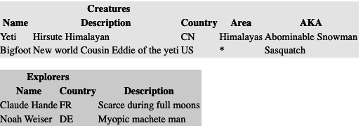

# 第十六章\. 表单和模板

# 预览

尽管 *FastAPI* 中的 *API* 暗示了其主要关注点，FastAPI 也能处理传统的 Web 内容。本章讨论了用于将数据插入 HTML 的标准 HTML 表单和模板。

# 表单

正如你所见，FastAPI 主要设计用于构建 API，并且其默认输入是 JSON。但这并不意味着它不能提供标准的香蕉 HTML、表单和朋友们。

FastAPI 支持来自 HTML 表单的数据，就像支持来自 `Query` 和 `Path` 的数据一样，使用 `Form` 依赖项。

你将需要安装 Python-Multipart 包来处理任何 FastAPI 表单工作，所以如果需要的话，请运行 `pip install python-multipart`。此外，第十五章 中的 *static* 目录将用于存放本章中的测试表单。

让我们重新做 示例 3-11，但是通过表单而不是 JSON 字符串提供 `who` 的值。（如果旧的 `greet()` 路径函数仍然存在，请将其命名为 `greet2()`。）将 示例 16-1 添加到 *main.py*。

##### 示例 16-1\. 从 `GET` 表单获取值

```py
from fastapi import FastAPI, Form

app = FastAPI()

@app.get("/who2")
def greet2(name: str = Form()):
    return f"Hello, {name}?"
```

主要的区别在于值来自 `Form` 而不是来自 第三章 的 `Path`、`Query` 和其他内容。

在 示例 16-2 中，使用 HTTPie 尝试一个初始的表单测试（你需要 `-f` 来使用表单编码而不是 JSON）。

##### 示例 16-2\. 使用 HTTPie 进行的表单 `GET` 请求

```py
$ http -f -b GET localhost:8000/who2 name="Bob Frapples"
"Hello, Bob Frapples?"
```

你还可以从标准的 HTML 表单文件发送请求。第十五章 展示了如何创建一个名为 *static* 的目录（在 URL */static* 下访问），可以存放任何内容，包括 HTML 文件，所以在 示例 16-3 中，我们把这个文件（*form1.html*）放在那里。

##### 示例 16-3\. 表单 `GET` 请求（static/form1.html）

```py
<form action="http://localhost:8000/who2" method="get">
Say hello to my little friend:
<input type="text" name="name" value="Bob Frapples">
<input type="submit">
</form>
```

如果你请求浏览器加载 *http://localhost:8000/static/form1.html*，你将会看到一个表单。如果你填入任何测试字符串，你会得到以下结果：

```py
"detail":[{"loc":["body","name"],
           "msg":"field required",
           "type":"value_error.missing"}]}
```

嗯？

查看 Uvicorn 运行时窗口中的日志信息：

```py
INFO:     127.0.0.1:63502 -
  "GET /who2?name=rr23r23 HTTP/1.1"
  422 Unprocessable Entity
```

当我们在表单字段中有 `name` 时，为什么这个表单发送了 `name` 作为查询参数？这是一个 HTML 的怪事，记录在 [W3C 网站](https://oreil.ly/e6CJb) 上。此外，如果你的 URL 中有任何查询参数，它将擦除它们并替换为 `name`。

那么，为什么 HTTPie 能够如预期地处理它？我不知道。这是一个需要注意的不一致性。

官方的 HTML 咒语是将动作从 `GET` 改为 `POST`。因此，让我们在 示例 16-4 中为 */who2* 添加一个 `POST` 端点到 *main.py* 中。

##### 示例 16-4\. 从 `POST` 表单获取值

```py
from fastapi import FastAPI, Form

app = FastAPI()

@app.post("/who2")
def greet3(name: str = Form()):
    return f"Hello, {name}?"
```

示例 16-5 是 *stuff/form2.html*，将 `get` 更改为 `post`。

##### 示例 16-5\. 表单 `POST` 请求（static/form2.html）

```py
<form action="http://localhost:8000/who2" method="post">
Say hello to my little friend:
<input type="text" name="name">
<input type="submit">
</form>
```

请求你的浏览器摆脱数字后腿，并为你获取这个新的表单。填写 `**Bob Frapples**` 并提交表单。这一次，你将会得到从 HTTPie 得到的结果：

```py
"Hello, Bob Frapples?"
```

因此，如果你从 HTML 文件提交表单，请使用 `POST`。

# 模板

你可能见过词语游戏 *Mad Libs*。你要求人们提供一系列词语 — 名词、动词或更具体的东西 — 然后将它们输入到文本页面的标记位置。一旦你有了所有的词语，你就可以读取插入值的文本，然后就会发生欢乐，有时还会出现尴尬。

好吧，一个 Web *模板* 类似，尽管通常不会尴尬。模板包含一堆文本，其中有服务器插入数据的位置。它通常的目的是生成包含可变内容的 HTML，与 Chapter 15 的 *静态* HTML 不同。

Flask 的用户对其伴随项目，模板引擎 [Jinja](https://jinja.palletsprojects.com)（也经常称为 *Jinja2*）非常熟悉。FastAPI 支持 Jinja，以及其他模板引擎。

在 *main.py* 旁边创建一个名为 *template* 的目录，用于存放增强了 Jinja 的 HTML 文件。在其中创建一个名为 *list.html* 的文件，就像 Example 16-6 中的那样。

##### Example 16-6\. 定义一个模板文件（template/list.html）

```py
<html>
<table bgcolor="#eeeeee">
  <tr>
    <th colspan=3>Creatures</th>
  </tr>
  <tr>
    <th>Name</th>
    <th>Description</th>
    <th>Country</th>
    <th>Area</th>
    <th>AKA</th>
  </tr>

  <tr>
    <td>{{ creature.name }}</td>
    <td>{{ creature.description }}</td>
    <td>{{ creature.country }}</td>
    <td>{{ creature.area }}</td>
    <td>{{ creature.aka }}</td>
  </tr>

</table>

<br>

<table bgcolor="#dddddd">
  <tr>
    <th colspan=2>Explorers</th>
  </tr>
  <tr>
    <th>Name</th>
    <th>Country</th>
    <th>Description</th>
  </tr>

  <tr>
    <td>{{ explorer.name }}</td>
    <td>{{ explorer.country }}</td>
    <td>{{ explorer.description }}</td>
  </tr>

</table>
</html>
```

我不关心它的外观，所以没有 CSS，只有古老的不使用 CSS 的 `bgcolor` 表格属性来区分两个表格。

双大括号包含应插入的 Python 变量，而 `` 则包含 `if` 语句、`for` 循环和其他控制语句。请参阅 Jinja 的 [documentation](https://jinja.palletsprojects.com) 以获取语法和示例。

这个模板期望传递名为 `creatures` 和 `explorers` 的 Python 变量，它们是 `Creature` 和 `Explorer` 对象的列表。

Example 16-7 显示了要添加到 *main.py* 中设置模板并使用 Example 16-6 中的模板的内容。它将 `creatures` 和 `explorers` 提供给模板，使用前几章提供的 *fake* 目录下的模块，如果数据库为空或未连接，则提供测试数据。

##### Example 16-7\. 配置模板并使用一个（main.py）

```py
from pathlib import Path
from fastapi import FastAPI, Request
from fastapi.templating import Jinja2Templates

app = FastAPI()

top = Path(__file__).resolve().parent

template_obj = Jinja2Templates(directory=f"{top}/template")

# Get some small predefined lists of our buddies:
from fake.creature import fakes as fake_creatures
from fake.explorer import fakes as fake_explorers

@app.get("/list")
def explorer_list(request: Request):
    return template_obj.TemplateResponse("list.html",
        {"request": request,
        "explorers": fake_explorers,
        "creatures": fake_creatures})
```

请求你喜欢的浏览器，甚至是你不太喜欢的浏览器，访问 *http://localhost:8000/list*，你应该会得到 Figure 16-1 返回。



###### Figure 16-1\. /list 的输出

# 复习

本章是关于 FastAPI 如何处理非 API 主题，如表单和模板的快速概述。以及前一章关于文件的内容，这些都是你经常会遇到的传统 Web 任务。
