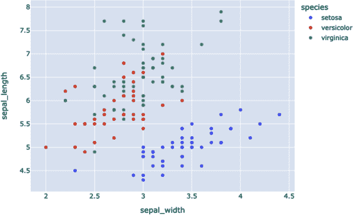
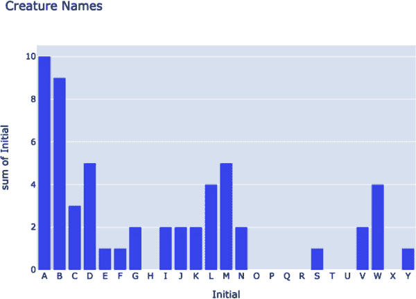

# 第十七章：数据发现与可视化

# 预览

虽然 FastAPI 的名称中确实有*API*，但它可以提供的不仅限于 API。本章将向您展示如何使用世界各地想象中生物的小型数据库从数据生成表格、图表、图形和地图。

# Python 和数据

几年来，Python 因为许多原因变得非常流行：

+   学习的容易程度

+   干净的语法

+   丰富的标准库

+   大量高质量的第三方包

+   特别强调数据操作、转换和内省

最后一点一直与传统的 ETL 任务和数据库创建相关。一个名为[PyData](https://pydata.org)的非营利组织甚至组织会议并开发用于 Python 开源数据分析的工具。Python 的流行也反映了近年来 AI 的激增以及准备供应 AI 模型的数据所需工具的需求。

在本章中，我们将尝试一些 Python 数据包，并了解它们与现代 Python Web 开发和 FastAPI 的关系。

# PSV 文本输出

在本节中，我们将使用附录 B 中列出的生物。数据位于本书的 GitHub 存储库中，以管道分隔的文件 *cryptid.psv* 和 SQLite 数据库 *cryptid.db* 中。逗号分隔（*.csv*）和制表符分隔（*.tsv*）文件很常见，但数据单元格内部使用逗号，并且有时很难将制表符与其他空白字符区分开。管道字符（`|`）是独特的，在标准文本中很少见，因此可用作良好的分隔符。

让我们先尝试*.psv*文本文件，只使用文本输出示例以简化操作，然后继续使用 SQLite 数据库进行完整的 Web 示例。

*.psv* 文件的初始标题行包含字段的名称：

+   `name`

+   `country`（`*`表示多个国家）

+   `area`（可选，美国州或其他国家地区）

+   `description`

+   `aka`（也称为）

文件中的其余行描述了每次一个生物，按照指定顺序的字段，由`|`字符分隔。

## csv

示例 17-1 将生物数据读入 Python 数据结构中。首先，管道分隔的文件 *cryptids.psv* 可以使用标准 Python csv 包读取，生成一个元组列表，其中每个元组表示文件中的一行数据。（csv 包还包括一个`DictReader`，返回一个字典列表。）此文件的第一行是带有列名的标题；即使没有这个，我们仍然可以通过 csv 函数的参数提供标题。

在示例中包含类型提示，但如果您使用的是旧版本的 Python，可以将其省略，代码仍然可以正常工作。我们只打印标题和前五行，以节省一些树木。¹

##### 示例 17-1 用 csv 读取 PSV 文件（load_csv.py）

```py
import csv
import sys

def read_csv(fname: str) -> list[tuple]:
    with open(fname) as file:
        data = [row for row in csv.reader(file, delimiter="|")]
    return data

if __name__ == "__main__":
    data = read_csv(sys.argv[1])
    for row in data[0:5]:
        print(row)
```

现在运行示例 17-2 中的测试。

##### 示例 17-2 测试 CSV 数据库加载

```py
$ python load_csv.py cryptid.psv
['name', 'country', 'area', 'description', 'aka']
['Abaia', 'FJ', ' ', 'Lake eel', ' ']
['Afanc', 'UK', 'CYM', 'Welsh lake monster', ' ']
['Agropelter', 'US', 'ME', 'Forest twig flinger', ' ']
['Akkorokamui', 'JP', ' ', 'Giant Ainu octopus', ' ']
['Albatwitch', 'US', 'PA', 'Apple stealing mini Bigfoot', ' ']
```

## python-tabulate

让我们再尝试一个开源工具，[python-tabulate](https://oreil.ly/L0f6k)，专门用于表格输出。您需要先运行`pip install tabulate`。示例 17-3 展示了代码。

##### 示例 17-3。用 python-tabulate（load_tabulate.py）读取 PSV 文件

```py
from tabulate import tabulate
import sys

def read_csv(fname: str) -> list[tuple]:
    with open(fname) as file:
        data = [row for row in csv.reader(file, delimiter="|")]
    return data

if __name__ == "__main__":
    data = read_csv(sys.argv[1])
    print(tabulate(data[0:5]))
```

在示例 17-4 中运行示例 17-3。

##### 示例 17-4。运行表格加载脚本

```py
$ python load_tabulate.py cryptid.psv
-----------  -------  ----  -------------------  ---
Name         Country  Area  Description          AKA
Abaia        FJ             Lake eel
Afanc        UK       CYM   Welsh lake monster
Agropelter   US       ME    Forest twig flinger
Akkorokamui  JP             Giant Ainu octopus
-----------  -------  ----  -------------------  ---
```

## pandas

前两个示例大部分是输出格式化程序。[Pandas](https://pandas.pydata.org)是一个非常好的工具，用于切片和切块数据。它超越了标准的 Python 数据结构，具有像[DataFrame](https://oreil.ly/j-8eh)这样的高级结构：表格、字典和系列的组合。它还可以读取*.csv*和其他字符分隔文件。示例 17-5 与前面的示例类似，但 Pandas 返回的是 DataFrame 而不是元组列表。

##### 示例 17-5。用 pandas（load_pandas.py）读取 PSV 文件

```py
import pandas
import sys

def read_pandas(fname: str) -> pandas.DataFrame:
    data = pandas.read_csv(fname, sep="|")
    return data

if __name__ == "__main__":
    data = read_pandas(sys.argv[1])
    print(data.head(5))
```

在示例 17-6 中运行示例 17-5。

##### 示例 17-6。运行 pandas 加载脚本

```py
$ python load_pandas.py cryptid.psv
          name country area                  description aka
0        Abaia      FJ                          Lake eel
1        Afanc      UK  CYM           Welsh lake monster
2   Agropelter      US   ME          Forest twig flinger
3  Akkorokamui      JP                Giant Ainu octopus
4   Albatwitch      US   PA  Apple stealing mini Bigfoot
```

Pandas 有很多有趣的功能，所以可以看一看。

# SQLite 数据源和 Web 输出

在本章的其余示例中，您将从 SQLite 数据库中读取生物数据，使用前几章的一些网站代码。然后，您将用不同的方法切割、切块和腌制数据。而不是简单的文本输出，您将把每个示例安装到我们不断增长的神秘生物网站中。您需要对现有的 Web、服务和数据级别进行一些补充。

首先，您需要一个 Web 级别的函数和一个相关的 HTTP `GET`路由来返回所有生物数据。而且您已经有了！让我们做一个网络调用获取所有内容，但再次仅显示前几行（树，你知道的）。这就是示例 17-7，就在这里。

##### 示例 17-7。运行生物下载测试（截断；树正在观察）

```py
$ http -b localhost:8000/creature
[
    {
        "aka": "AKA",
        "area": "Area",
        "country": "Country",
        "description": "Description",
        "name": "Name"
    },
    {
        "aka": " ",
        "area": " ",
        "country": "FJ",
        "description": "Lake eel",
        "name": "Abaia"
    },
...
]
```

## 图表/图形包

现在我们可以超越文本进入 GUI。一些用于图形数据显示的最有用和最流行的 Python 包包括以下几个：

[Matplotlib](https://matplotlib.org)

非常广泛，但需要一些调整才能获得最漂亮的结果

[Plotly](https://plotly.com/python)

类似于 Matplotlib 和 Seaborn，侧重于交互式图形

[Dash](https://dash.plotly.com)

基于 Plotly 构建的一种数据仪表盘

[Seaborn](https://seaborn.pydata.org)

基于 Matplotlib 构建，并提供一个更高级的接口，但支持的图形类型较少

[Bokeh](http://bokeh.org)

与 JavaScript 集成，以提供对非常大型数据集的仪表板视图

如何做出决策？您可以考虑以下几个标准：

+   图表类型（例如散点图、条形图、折线图）

+   样式

+   使用便捷

+   性能

+   数据限制

像 [“Top 6 Python Libraries for Visualization: Which One to Use?”](https://oreil.ly/10Nsw) 这样的比较，可以帮助您做出选择。最终，选择往往取决于您首先掌握的内容。在本章中，我选择了 Plotly，它可以在不需要太多编码的情况下创建吸引人的图表。

## 图表示例 1：测试

Plotly 是一个具有多层控制和详细信息的开源（免费）Python 库：

[Plotly Express](https://plotly.com/python/plotly-express)

一个简单的 Plotly 库

[Plotly](https://plotly.com/python)

主要库

[Dash](https://dash.plotly.com)

数据应用工具

还有 [Dash Enterprise](https://dash.plotly.com/dash-enterprise)，它像几乎所有带有 *Enterprise* 的名字（包括宇宙飞船模型）一样需要花钱。

我们实际上可以从生物数据中展示什么？图表和图形有一些常见的形式：

+   散点图

+   折线图

+   柱状图

+   直方图

+   箱线图（统计学）

我们的数据字段都是字符串，有意保持简单，以避免示例过于复杂。对于每个示例，我们将使用前几章的代码从 SQLite 数据库中读取所有生物数据，并添加 Web 和 Service 函数以选择要提供给绘图库函数的特定数据。

首先安装 Plotly，以及 Plotly 导出图像所需的库：

+   `pip install plotly`

+   `pip install kaleido`

然后，在 示例 17-8 中，添加一个测试函数到 *web/creature.py*，以查看我们是否将正确的部件放在了正确的位置。

##### 示例 17-8\. 添加一个测试绘图端点（编辑 web/creature.py）

```py
# (insert these lines in web/creature.py)

from fastapi import Response
import plotly.express as px

@router.get("/test")
def test():
    df = px.data.iris()
    fig = px.scatter(df, x="sepal_width", y="sepal_length", color="species")
    fig_bytes = fig.to_image(format="png")
    return Response(content=fig_bytes, media_type="image/png")
```

文档通常建议调用 `fig.show()` 来显示您刚刚创建的图像，但我们试图与 FastAPI 和 Starlette 的工作方式保持一致。

首先获取 `fig_bytes`（图像的实际 `bytes` 内容）；然后返回一个自定义的 `Response` 对象。

在将此端点添加到 *web/creature.py* 并重新启动 Web 服务器（如果您使用 `--reload` 运行 Uvicorn，则会自动重启）后，尝试在浏览器的地址栏中输入 **`localhost:8000/creature/test`** 来访问此新端点。您应该会看到 图 17-1。



###### 图 17-1\. 测试 Plotly 图像

如果您从 Uvicorn 得到一个奇怪的错误，如 `ValueError: 'not' is not a valid parameter name`，则更新 Pydantic 以修复错误：`pip install -U pydantic`。

## 图表示例 2：直方图

如果一切顺利，让我们开始使用我们的生物数据。我们将在 *web/creature.py* 中添加一个 `plot()` 函数。我们将通过 *service/creature.py* 和 *data/creature.py* 中的 `get_all()` 函数从数据库中获取所有生物数据。然后，我们将提取所需数据，并使用 Plotly 显示各种结果的图像。

对于我们的第一个技巧（示例 17-9），我们将只使用 `name` 字段，并制作一个柱状图，显示以每个字母开头的生物名称的数量。

##### 示例 17-9\. 生物名称首字母的柱状图

```py
# (insert these lines in web/creature.py)

from collections import Counter
from fastapi import Response
import plotly.express as px
from service.creature import get_all

@router.get("/plot")
def plot():
    creatures = get_all()
    letters = "ABCDEFGHIJKLMNOPQRSTUVWXYZ"
    counts = Counter(creature.name[0] for creature in creatures)
    y = { letter: counts.get(letter, 0) for letter in letters }
    fig = px.histogram(x=list(letters), y=y, title="Creature Names",
        labels={"x": "Initial", "y": "Initial"})
    fig_bytes = fig.to_image(format="png")
    return Response(content=fig_bytes, media_type="image/png")
```

在浏览器的地址栏中输入`**localhost:8000/creature/plot**`。你应该会看到图 17-2。



###### 图 17-2\. 生物名称首字母柱状图

## 地图包

如果你尝试在 Google 中搜索`**Python**`和`**maps**`，你会得到许多关于 Python 字典的链接，这在语言中是一种内置的*映射类型*，并不是同一回事。因此，你可能需要尝试一些同义词，如*GIS*、*地理*、*制图学*、*空间*等。一些流行的包建立在列表中的其他包之上，包括以下内容：

[PyGIS](https://oreil.ly/3QvCz)

Python 空间数据处理参考

[PySAL](https://pysal.org)

Python 空间分析库

[Cartopy](https://oreil.ly/YnUow)

分析和绘制地理空间数据

[Folium](https://oreil.ly/72luj)

与 JavaScript 集成

[Python 客户端用于 Google 地图服务](https://oreil.ly/LWfS5)

API 访问 Google 地图

[Geemap](https://geemap.org)

Google Earth 支持

[Geoplot](https://oreil.ly/Slfvc)

扩展了 Cartopy 和 Matplotlib

[GeoPandas](https://geopandas.org)

我们朋友 pandas 的扩展

[ArcGIS 和 ArcPy](https://oreil.ly/l7M5C)

Esri 的开源接口

类似于绘图包的选择标准，地图的选择也可能取决于以下几点：

+   地图类型（例如，等值线图、矢量、栅格）

+   样式

+   使用便捷性

+   性能

+   数据限制

与图表和图形一样，地图有多种类型，可用于各种目的。

## 地图示例

我将再次使用 Plotly 来展示这些地图示例；它既不过于基础也不过于复杂，这有助于展示如何将一个小型基于 Web 的地图与 FastAPI 集成。

示例 17-10 获取我们生物的两个字母 ISO 国家代码。但事实证明，绘制 Plotly 地图的功能（*choropleth*，听起来像是一个能改变形状的神秘生物）希望使用另一种三个字母的 ISO 国家代码标准。所以我们可以重新处理数据库和 PSV 文件中的所有代码，或者更简单地运行`pip install country_converter`，将一组国家代码映射到另一组上。

##### 示例 17-10\. 映射带有神秘生物的国家（编辑 web/creature.py）

```py
# (insert these lines in web/creature.py)

import plotly.express as px
import country_converter as coco

@router.get("/map")
def map():
    creatures = service.get_all()
    iso2_codes = set(creature.country for creature in creatures)
    iso3_codes = coco.convert(names=iso2_codes, to="ISO3")
    fig = px.choropleth(
        locationmode="ISO-3",
        locations=iso3_codes)
    fig_bytes = fig.to_image(format="png")
    return Response(content=fig_bytes, media_type="image/png")
```

请求你的浏览器前往`**localhost:8000/creature/map**`，然后你有可能会看到一个突显神秘生物国家的地图（图 17-3）。


###### 图 17-3\. 神秘生物国家地图

如果`country`为`US`，你可以通过使用`area`字段扩展地图并关注美国。使用`locationmode="USA-states"`，并将这些`area`值分配给`px.choropleth()`的`locations`参数。

# 复习

本章节将探讨各种绘图、图表和地图工具如何查询令人担忧生物数据库，从而查明是否有神秘生物在你家附近活动。

¹ 如果有任何类似托尔金的树人（Ents），我们不希望它们在某个夜晚漫步到我们家门口来交谈。
