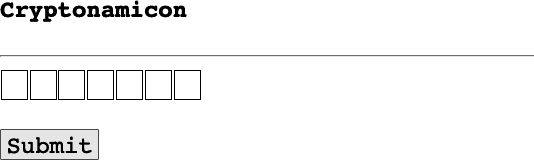
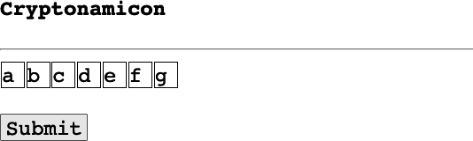
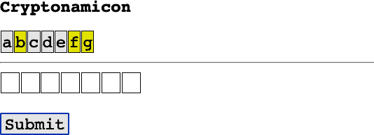
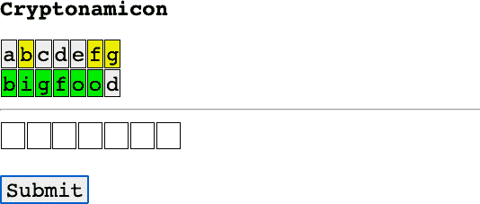
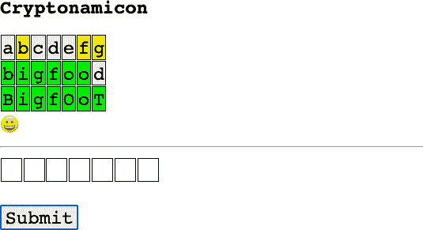

# 第十八章：游戏

# 预览

游戏涵盖了很多领域，从简单的文本到多人 3D 盛宴。本章将演示一个简单的游戏，以及 Web 端点如何在多个步骤中与用户交互。这个过程与你迄今所见的传统的一次性请求-响应 Web 端点有所不同。

# Python 游戏包

如果你真的想深入研究 Python 游戏，这里有一些有用的工具：

+   文本：

    +   [Adventurelib](https://adventurelib.readthedocs.io)

+   图形：

    +   [PyGame](https://www.pygame.org)，[入门](https://realpython.com/pygame-a-primer)

    +   [pyglet](https://pyglet.org)

    +   [Python Arcade](https://api.arcade.academy)

    +   [HARFANG](https://www.harfang3d.com)

    +   [Panda3D](https://docs.panda3d.org)

但在本章中我不会使用这些。示例代码可能变得非常庞大和复杂，而这超出了本书的目标：尽可能简单地创建网站——使用 FastAPI，包括 API 和传统内容。

# 分离游戏逻辑

写游戏的方式有很多种。谁做什么，谁在哪里保存什么——客户端还是服务器？Web 是无状态的，所以每次客户端调用服务器时，服务器都是完全健忘的，并发誓从未见过这个客户端。因此，我们需要在某处保持*状态*：跨游戏步骤保留数据以将它们全部连接在一起。

我们可以完全在客户端 JavaScript 中编写游戏，并在那里保持所有状态。如果你很熟悉 JavaScript，那是一个不错的解决方案，但如果不熟悉（这是可能的，因为你正在阅读一本 Python 书），让我们也给 Python 一些事情可做。

另一方面，我们可以编写一个服务器重型应用程序：在初始 Web 调用中为此特定游戏生成一些独特的 ID，并在后续游戏步骤中将该 ID 与其他数据一起传递到服务器，并在某些服务器端数据存储中维护所有这些变化的状态，如数据库。

最后，我们可以将游戏结构化为一系列客户端-服务器网络端点调用，即所谓的单页应用程序（SPA）。编写 SPA 通常需要 JavaScript 向服务器发出 Ajax 调用，并将 Web 响应定位到页面的部分，而不是整个显示。客户端 JavaScript 和 HTML 会完成部分工作，服务器处理部分逻辑和数据。

# 游戏设计

首先，这款游戏是什么？我们将构建一个简单的[类 Wordle 游戏](https://oreil.ly/PuD-Y)，但只使用来自*cryptid.db*数据库的生物名称。这比 Wordle 要简单得多，尤其是如果你作弊并查看附录 B。

我们将使用上述最终平衡的设计方法：

1.  让我们在客户端使用原生 JavaScript，而不是像 React、Angular 甚至 jQuery 这样著名的 JavaScript 库。

1.  新的 FastAPI 端点，GET `/game`，初始化游戏。它从我们的神秘生物数据库获取一个随机生物名称，并将其作为 HTML、CSS 和 JavaScript 的 Jinja 模板文件中的隐藏值返回。

1.  在客户端上，新返回的 HTML 和 JavaScript 显示类似 Wordle 的界面。一系列框出现，每个框代表隐藏生物名称中的一个字母。

1.  玩家在每个框中输入一个字母，然后将此猜测和隐藏的真实名称提交给服务器。这是通过使用 JavaScript 的`fetch()`函数进行的 AJAX 调用。

1.  第二个新的 FastAPI 端点，POST `/game`，获取此猜测和实际秘密名称，并对该名称进行评分。它将猜测和得分返回给客户端。

1.  客户端在新生成的表格行中使用适当的 CSS 颜色显示猜测和得分：绿色表示字母在正确位置，黄色表示字母在名称中但位置不对，灰色表示隐藏名称中不存在的字母。得分是一串单个字符，这些字符作为 CSS 类名用于显示猜测字母的正确颜色。

1.  如果所有字母都是绿色，则相应庆祝。否则，客户端显示一个新的文本输入框序列用于下一个猜测，并重复步骤 4 及以后，直到猜出名称或放弃。大多数神秘动物名称并不是家喻户晓的词汇，因此根据需要查看附录 B。

这些规则与官方 Wordle 略有不同，它只允许五个字母的词典单词，并限制为六步。

不要抱太大希望。像本书中大多数示例一样，游戏逻辑和设计都很简单——只是足够使各个部件一起工作。在有工作基础的情况下，您可以赋予更多的风格和优雅。

# Web 第一部分：游戏初始化

我们希望有两个新的 Web 端点。我们正在使用生物名称，因此我们可能考虑命名端点为 GET `/creature/game`和 POST `/creature/game`。但这不起作用，因为我们已经有类似的端点 GET `/creature/{name}`和 POST `/creature/{name}`，而 FastAPI 将首先匹配它们。所以让我们创建一个新的顶级路由命名空间`/game`，并将这两个新端点放在其中。

示例 18-1 中的第一个端点初始化游戏。它需要从数据库获取一个随机生物名称，并返回此名称以及实现多步游戏逻辑的所有客户端代码。为此，我们将使用 Jinja 模板（您在第十六章中看到过），其中包含 HTML、CSS 和 JavaScript。

##### 示例 18-1. Web 游戏初始化（web/game.py）

```py
from pathlib import Path

from fastapi import APIRouter, Body, Request
from fastapi.templating import Jinja2Templates

from service import game as service

router = APIRouter(prefix = "/game")

# Initial game request
@router.get("")
def game_start(request: Request):
    name = service.get_word()
    top = Path(__file__).resolve().parents[1] # grandparent
    templates = Jinja2Templates(directory=f"{top}/template")
    return templates.TemplateResponse("game.html",
        {"request": request, "word": name})

# Subsequent game requests
@router.post("")
async def game_step(word: str = Body(), guess: str = Body()):
    score = service.get_score(word, guess)
    return score
```

FastAPI 要求`game_start()`路径函数具有`request`参数，并将其作为参数传递给模板。

接下来，在示例 18-2 中，将这个`/game`子路由钩入到主模块中，该模块已经监视`/explorer`和`/creature`路由。

##### 示例 18-2. 添加/game 子路由（web/main.py）

```py
from fastapi import FastAPI
from web import creature, explorer, game

app = FastAPI()

app.include_router(explorer.router)
app.include_router(creature.router)
app.include_router(game.router)

if __name__ == "__main__":
    import uvicorn
    uvicorn.run("main:app",
        host="localhost", port=8000, reload=True)
```

# Web 第二部分：游戏步骤

客户端模板（HTML、CSS 和 JavaScript）的最大组件可以在示例 18-3 中看到。

##### 示例 18-3. 工作中的 Jinja 模板文件（template/game.html）

```py
<head>
<style>
html * {
  font-size: 20pt;
  font-family: Courier, sans-serif;
}
body {
  margin: 0 auto;
  max-width: 700px;
}
input[type=text] {
  width: 30px;
  margin: 1px;
  padding: 0px;
  border: 1px solid black;
}
td, th {
  cell-spacing: 4pt;
  cell-padding: 4pt;
  border: 1px solid black;
}
.H { background-color: #00EE00; } /* hit (green) */
.C { background-color: #EEEE00; } /* close (yellow) */
.M { background-color: #EEEEEE; } /* miss (gray) */
</style>
</head>
<body>
<script>
function show_score(guess, score){
    var table = document.getElementById("guesses");
    var row = table.insertRow(row);
    for (var i = 0; i < guess.length; i++) {
        var cell = row.insertCell(i);
        cell.innerHTML = guess[i];
        cell.classList.add(score[i]);
    }
    var word = document.getElementById("word").value;
    if (guess.toLowerCase() == word.toLowerCase()) {
        document.getElementById("status").innerHTML = "&#x1F600";
    }
}

async function post_guess() {
    var word = document.getElementById("word").value;
    var vals = document.getElementsByName("guess");
    var guess = "";
    for (var i = 0; i < vals.length; i++) {
        guess += vals[i].value;
    }
    var req = new Request("http://localhost:8000/game", {
        method: "POST",
        headers: {"Content-Type": "application/json"},
        body: JSON.stringify({"guess": guess, "word": word})
        }
     )
     fetch(req)
        .then((resp) => resp.json())
        .then((score) => {
            show_score(guess, score);
            for (var i = 0; i < vals.length; i++) {
                vals[i].value = "";
            }
         });
}
</script>
<h2>Cryptonamicon</h2>

<table id="guesses">
</table>

<span id="status"></span>

<hr>

<div>
<input type=text name="guess">
<input type=hidden id="word" value="{{word}}">
<br><br>
<input type=submit onclick="post_guess()">
</div>

</body>
```

# 服务第一部分：初始化

示例 18-4 展示了连接 Web 层游戏启动功能与数据层提供随机生物名称的服务代码。

##### 示例 18-4\. 计算分数（service/game.py）

```py
import data.game as data

def get_word() -> str:
    return data.get_word()
```

# 服务第二部分：评分

将代码从示例 18-5（下一步）添加到示例 18-4 中。分数是一个由单个字符组成的字符串，指示猜测的字母是否匹配正确位置、匹配其他位置或是失误。为了进行大小写不敏感的匹配，猜测和单词都被转换为小写。如果猜测的长度与隐藏单词不同，将返回空字符串分数。

##### 示例 18-5\. 计算分数（service/game.py）

```py
from collections import Counter, defaultdict

HIT = "H"
MISS = "M"
CLOSE = "C"  # (letter is in the word, but at another position)

def get_score(actual: str, guess: str) -> str:
    length: int = len(actual)
    if len(guess) != length:
        return ERROR
    actual_counter = Counter(actual) #  {letter: count, ...}
    guess_counter = defaultdict(int)
    result = [MISS] * length
    for pos, letter in enumerate(guess):
        if letter == actual[pos]:
            result[pos] = HIT
            guess_counter[letter] += 1
    for pos, letter in enumerate(guess):
        if result[pos] == HIT:
            continue
        guess_counter[letter] += 1
        if (letter in actual and
            guess_counter[letter] <= actual_counter[letter]):
            result[pos] = CLOSE
    result = ''.join(result)
    return result
```

# 测试！

示例 18-6 包含了一些关于服务分数计算的 pytest 练习。它使用 pytest 的`parametrize`特性来传递一系列测试，而不是在测试函数内部编写循环。从示例 18-5 中记得，`H`是直击，`C`是接近（位置错误），`M`是失误。

##### 示例 18-6\. 测试分数计算（test/unit/service/test_game.py）

```py
import pytest
from service import game

word = "bigfoot"
guesses = [
    ("bigfoot", "HHHHHHH"),
    ("abcdefg", "MCMMMCC"),
    ("toofgib", "CCCHCCC"),
    ("wronglength", ""),
    ("", ""),
    ]

@pytest.mark.parametrize("guess,score", guesses)
def test_match(guess, score):
    assert game.get_score(word, guess) == score
```

运行它：

```py
$ pytest -q test_game.py
.....                                               [100%]
5 passed in 0.05s
```

# 数据：初始化

在新的*data/game.py*模块中我们只需要一个函数，如示例 18-7 所示。

##### 示例 18-7\. 获取随机生物名称（data/game.py）

```py
from .init import curs

def get_word() -> str:
    qry = "select name from creature order by random() limit 1"
    curs.execute(qry)
    row = curs.fetchone()
    if row:
        name = row[0]
    else:
        name = "bigfoot"
    return name
```

# 让我们玩 Cryptonomicon

（请有人想出一个更好的名字。）

在你的浏览器中，访问`http://localhost:8000/game`。你应该会看到一个初始显示像这样：



让我们输入一些字母并将它们作为猜测提交，看看会发生什么：



字母*b*、*f*和*g*是黄色的（如果你没有在彩色环境中查看这个，你就只能相信我的话了！），这意味着它们在隐藏名称中，但位置错误：



让我们猜一下这个名字，但是最后一个字母搞错了。我们在第二行看到了很多绿色。哦，差一点！



让我们修正最后一个字母，然后为了好玩，将一些字母大写以确保我们得到大小写不敏感的匹配。现在提交它，哇哦：



# 回顾

我们使用 HTML、JavaScript、CSS 和 FastAPI 构建了一个（非常简单的！）交互式 Wordle 风格的游戏。本章展示了如何使用 JSON 和 Ajax 管理 Web 客户端和服务器之间的多线程对话。
