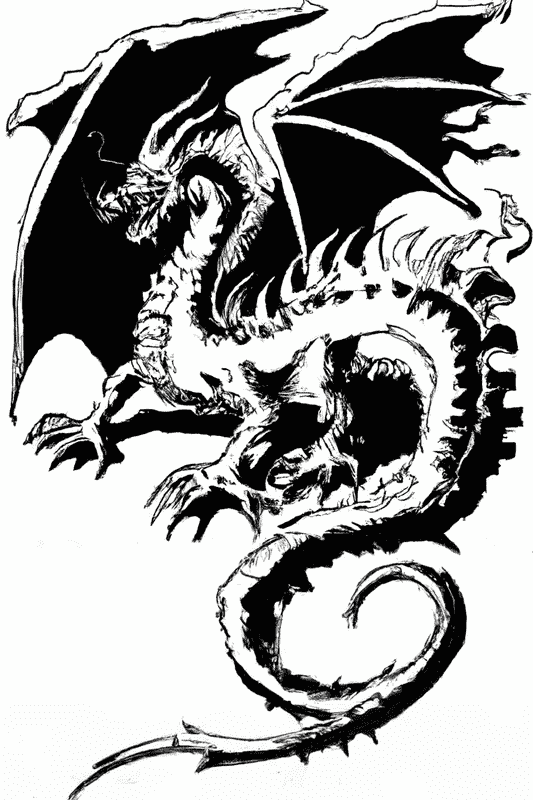
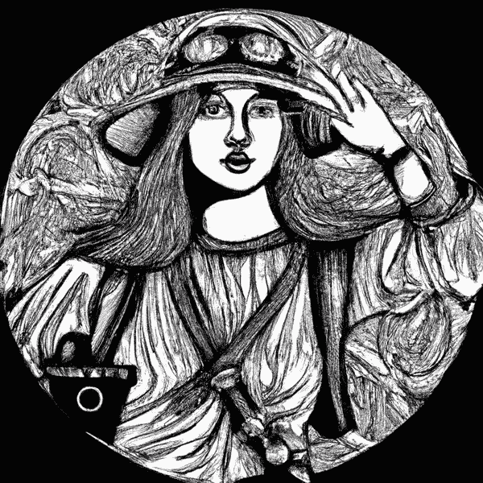

# 附录 B. 生物与人类

> 鬼魅与幽灵
> 
> 还有长腿怪兽
> 
> 还有夜间撞击声
> 
> 天主保佑我们。
> 
> 康沃尔宗教赞美诗中的一节

想象中的生物，或称为*神秘动物*，据报告遍布各地。一些曾被认为是想象的动物——如熊猫、鸭嘴兽和黑天鹅——最终被证明是真实存在的。所以我们不会臆测。无畏的探险家正在寻找它们。它们共同为本书中的例子提供数据。

# 生物

表格 B-1 列出了我们将调查的生物。

表 B-1\. 一本迷你兽群志

| 名称 | 国家 | 地区 | 描述 | AKA |
| --- | --- | --- | --- | --- |
| 阿巴亚 | FJ |  | 湖鳗 |  |
| 阿凡克 | UK | CYM | 威尔士湖怪 |  |
| 阿格罗佩尔特 | US | ME | 森林树枝投掷者 |  |
| 阿科罗卡木 | JP |  | 巨大的阿伊努章鱼 |  |
| 阿尔巴特威奇 | US | PA | 偷苹果的迷你大脚怪 |  |
| 阿利坎托 | CL |  | 吃金的鸟 |  |
| 阿尔塔马塔哈 | US | GA | 沼泽生物 | 奥尔蒂 |
| 阿马洛克 | CA |  | 因纽特人狼灵 |  |
| 奥利 | CY |  | 阿伊亚纳帕海怪 | 友好的怪物 |
| 阿泽班 | CA |  | 恶作剧之灵 | 浣熊 |
| 蝙蝠鬼 | US | WA | 飞行萨斯奎奇 |  |
| 布莱登伯勒野兽 | US | NC | 吸血狗 |  |
| 布雷路斯路怪物 | US | WI | 威斯康星狼人 |  |
| 博斯科野兽 | US | IN | 巨型乌龟 |  |
| 吉沃当野兽 | FR |  | 法国狼人 |  |
| 食海狸者 | CA |  | 筑巢翻转者 | 萨托奇因 |
| 大脚怪 | US |  | 雪人的表兄埃迪 | 萨斯奎奇 |
| 布卡瓦克 | HR |  | 湖泊扼杀者 |  |
| 巴尼普 | AU |  | 水生澳大利亚人 |  |
| 卡多博罗萨鲁斯 | CA | BC | 海蛇 | 卡迪 |
| 小说 | US | VT | 钱普莱恩湖潜伏者 | 钱普 |
| 切帕卡布拉 | MX |  | 吸血山羊 |  |
| 达胡 | FR |  | 瓦姆帕胡弗斯的法国表兄 |  |
| 多亚尔祖 | IE |  | 狗獭 | 爱尔兰鳄鱼 |
| 龙 | * |  | 翅膀！火焰！ |  |
| 落树熊 | AU |  | 肉食性树袋熊 |  |
| 邓加文胡特 | US |  | 将猎物磨成蒸汽，然后吸入 |  |
| 恩坎塔多 | BR |  | 调皮的河豚 |  |
| 福克怪物 | US | AR | 臭大脚 | 波吉克里克怪物 |
| 格洛斯特鬼怪 | US | RI | 罗得岛龙 |  |
| 格洛斯特海蛇 | US | MA | 美国尼斯湖怪 |  |
| 伊戈波戈 | CA | ON | 加拿大尼斯湖怪 |  |
| 伊什伊 | JP |  | 湖怪 | 伊西 |
| 独角兔 | US | * | 鹿角兔 |  |
| 杰西魔鬼 | US | NJ | 雪顶屋顶跳跃者 |  |
| 科迪亚克恐龙 | US | AK | 巨大的海洋蜥蜴 |  |
| 海怪 | * |  | 巨型乌贼 |  |
| 蜥蜴人 | US | SC | 沼泽生物 |  |
| LLaammaa | CL |  | 美洲驼的头，美洲驼的身体。但不是同一只美洲驼。 |  |
| 尼斯湖怪^(a) | UK | SC | 著名的洛克湖怪 | 尼西 |
| 卢斯卡 | BS |  | 巨型章鱼 |  |
| 马埃罗 | NZ |  | 巨人 |  |
| 梅内胡内 | US | HI | 夏威夷小精灵 |  |
| 莫克莱姆贝贝 | CG |  | 沼泽怪物 |  |
| 蒙古死亡虫 | MN |  | 阿拉克访客 |  |
| 蛾人 | US | WV | 仅限理查德·杰尔电影中的神秘动物 |  |
| Snarly Yow | US | MD | 地狱猎犬 |  |
| 吸血鬼 | * |  | 吸血鬼 |  |
| 弗拉德·伊瓜拉 | KE |  | 乡村吸血鬼 |  |
| 温迪戈 | CA |  | 食人大脚怪 |  |
| 狼人 | * |  | 变形者 | 狼人, 森林鬼怪^(b) |
| 翼龙 | UK |  | 后腿无龙 |  |
| 旋足兽 | US | VT | 不对称山地居民 | 侧山搅土怪 |
| 雪人 | CN |  | 多毛的喜马拉雅人 | 雪人 |
| ^(a) 我曾与彼得·麦克纳布见过面，他拍摄了尼斯湖水怪的照片之一。^(b) 法国。或者说：史酷比：“Ruh-roh！Rougarou！” |

# 探险家

我们的调查团队，从四面八方，详见 表 B-2。

表 B-2\. 人类

| 名称 | 国家 | 描述 |
| --- | --- | --- |
| 克劳德·汉德 | UK | 满月时稀少 |
| 海伦娜·汉德·巴斯凯特 | UK | 女爵士^(a) 名声在外 |
| 波·巴菲特 | US | 永远不摘他的帽子 |
| O. B. Juan Cannoli | MX | 森林智者 |
| 西蒙·N·格洛芬戴尔 | FR | 卷发，精于林间 |
| “帕”·图希 | IE | 探险家/吐痰者 |
| 拉达·图希 | IN | 神秘的大地母亲 |
| 诺亚·韦瑟 | DE | 近视的砍刀手 |
| ^(a) 在*贵族*，而不是*年*。 |

# 探险家出版物

这里是我们假想探险家的虚构出版物：

+   *鼠岛的秘密* 作者 B. Buffette

+   *我在想什么？* 作者 O. B. J. Cannoli

+   “蜘蛛从不睡眠,” *令人不安的结果杂志*, 作者 N. Weiser

+   “Sehr Böse Spinnen,” *比较神秘动物学期刊*, 作者 N. Weiser

# 其他来源

神秘动物传说有许多来源。一些神秘动物可能被归类为虚构生物，而有些可能只能在远处拍摄的模糊照片中看到。我的来源包括以下内容：

+   [“神秘动物列表” Wikipedia 页面](https://oreil.ly/7e1ED)

+   [“按类型列出的传奇生物” Wikipedia 页面](https://oreil.ly/1AVfx)

+   [神秘动物园：神秘动物学的一种动物园](http://www.newanimal.org)

+   *美国的神秘动物* 作者 J. W. Ocker（Quirk Books）

+   *在海蛇的尾巴后面* 作者 Bernard Heuvelmans（Hill & Wang）

+   *雪人：传奇复活* 作者 Ivan T. Sanderson（Chilton）

+   [“每个国家都有一个怪物”](https://oreil.ly/yQP7Q) 由神秘科学电影院（Mystery Science Theater）创作

+   大脚怪目击资源

    +   [Tim Renner 的大脚怪目击数据](https://oreil.ly/1wMDb)

    +   [大脚怪目击 Dash 应用](https://oreil.ly/b5IKt)

    +   用 Dash 寻找大脚怪 [第一部分](https://oreil.ly/0gjCT), [第二部分](https://oreil.ly/Lespw), [第三部分](https://oreil.ly/aDV8K)

    +   [“如果它在那里，它会是一只熊吗？”](https://oreil.ly/TlYn7) 作者 Floe Foxon
