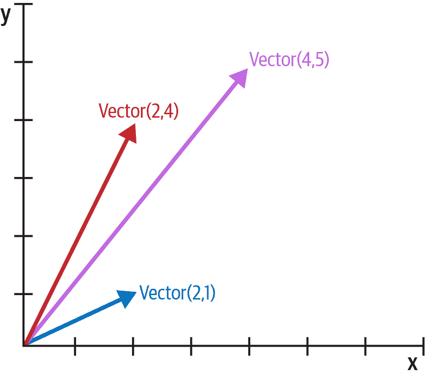

# 第一章：Python 数据模型

> Guido 在语言设计美学方面的感觉令人惊叹。我遇到过许多优秀的语言设计师，他们能构建理论上漂亮但无人会使用的语言，但 Guido 是为数不多的能够构建一门理论上略微欠缺但编写程序时充满乐趣的语言的人。
> 
> Jim Hugunin，Jython 的创建者，AspectJ 的联合创建者，以及.Net DLR¹的架构师

Python 最大的优点之一是其一致性。使用 Python 一段时间后，你能够开始对新接触到的特性做出有根据的、正确的猜测。

然而，如果你在学 Python 之前学过其他面向对象语言，你可能会觉得使用`len(collection)`而不是`collection.len()`很奇怪。这个明显的奇怪之处只是冰山一角，一旦正确理解，它就是我们称之为*Pythonic*的一切的关键。这个冰山被称为 Python 数据模型，它是我们用来使自己的对象与最符合语言习惯的特性很好地配合的 API。

你可以将数据模型视为对 Python 作为框架的描述。它规范了语言本身的构建块的接口，例如序列、函数、迭代器、协程、类、上下文管理器等。

使用框架时，我们会花费大量时间编写被框架调用的方法。在利用 Python 数据模型构建新类时也会发生同样的情况。Python 解释器调用特殊方法来执行基本的对象操作，通常由特殊语法触发。特殊方法名总是以双下划线开头和结尾。例如，语法`obj[key]`由`__getitem__`特殊方法支持。为了计算`my_collection[key]`，解释器会调用`my_collection.__getitem__(key)`。

当我们希望对象支持并与基本语言结构交互时，我们会实现特殊方法，例如：

+   集合

+   属性访问

+   迭代（包括使用`async for`进行的异步迭代）

+   运算符重载

+   函数和方法调用

+   字符串表示和格式化

+   使用`await`进行异步编程

+   对象的创建和销毁

+   使用`with`或`async with`语句管理上下文

# Magic 和 Dunder

"魔术方法"是特殊方法的俚语，但我们如何谈论像`__getitem__`这样的特定方法呢？我从作者和教师 Steve Holden 那里学会了说"dunder-getitem"。"Dunder"是"前后双下划线"的缩写。这就是为什么特殊方法也被称为*dunder 方法*。*Python 语言参考*的["词法分析"](https://fpy.li/1-3)章节警告说，"在任何上下文中，任何不遵循明确记录的`__*__`名称的使用都可能在没有警告的情况下被破坏。" 

# 本章的新内容

本章与第一版相比变化不大，因为它是对 Python 数据模型的介绍，而数据模型相当稳定。最重要的变化是：

+   支持异步编程和其他新特性的特殊方法，已添加到"特殊方法概述"的表格中。

+   图 1-2 展示了在"集合 API"中特殊方法的使用，包括 Python 3.6 中引入的`collections.abc.Collection`抽象基类。

此外，在第二版中，我采用了 Python 3.6 引入的*f-string*语法，它比旧的字符串格式化表示法（`str.format()`方法和`%`运算符）更具可读性，通常也更方便。

###### 提示

仍然使用 `my_fmt.format()` 的一个原因是，当 `my_fmt` 的定义必须在代码中与格式化操作需要发生的地方不同的位置时。例如，当 `my_fmt` 有多行并且最好在常量中定义时，或者当它必须来自配置文件或数据库时。这些都是真正的需求，但不会经常发生。

# Python 风格的纸牌

示例 1-1 很简单，但它展示了仅实现两个特殊方法 `__getitem__` 和 `__len__` 的强大功能。

##### 示例 1-1\. 一副扑克牌序列

```py
import collections

Card = collections.namedtuple('Card', ['rank', 'suit'])

class FrenchDeck:
    ranks = [str(n) for n in range(2, 11)] + list('JQKA')
    suits = 'spades diamonds clubs hearts'.split()

    def __init__(self):
        self._cards = [Card(rank, suit) for suit in self.suits
                                        for rank in self.ranks]

    def __len__(self):
        return len(self._cards)

    def __getitem__(self, position):
        return self._cards[position]
```

首先要注意的是使用 `collections.namedtuple` 构造一个简单的类来表示单个牌。我们使用`namedtuple` 来构建只有属性而没有自定义方法的对象类，就像数据库记录一样。在示例中，我们使用它为牌组中的牌提供了一个很好的表示，如控制台会话所示：

```py
>>> beer_card = Card('7', 'diamonds')
>>> beer_card
Card(rank='7', suit='diamonds')
```

但这个例子的重点是 `FrenchDeck` 类。它很短，但却很有冲击力。首先，像任何标准 Python 集合一样，牌组响应 `len()` 函数并返回其中的牌数：

```py
>>> deck = FrenchDeck()
>>> len(deck)
52
```

读取牌组中的特定牌（例如第一张或最后一张）很容易，这要归功于 `__getitem__` 方法：

```py
>>> deck[0]
Card(rank='2', suit='spades')
>>> deck[-1]
Card(rank='A', suit='hearts')
```

我们应该创建一个方法来随机抽取一张牌吗？没有必要。Python 已经有一个从序列中获取随机项的函数：`random.choice`。我们可以在一个 deck 实例上使用它：

```py
>>> from random import choice
>>> choice(deck)
Card(rank='3', suit='hearts')
>>> choice(deck)
Card(rank='K', suit='spades')
>>> choice(deck)
Card(rank='2', suit='clubs')
```

我们刚刚看到了利用 Python 数据模型使用特殊方法的两个优点：

+   你的类的用户不必记住标准操作的任意方法名称。（"如何获得项目数？是 `.size()`、`.length()` 还是什么？"）

+   从丰富的 Python 标准库中受益并避免重新发明轮子更容易，比如 `random.choice` 函数。

但它变得更好了。

因为我们的 `__getitem__` 将工作委托给 `self._cards` 的 `[]` 运算符，所以我们的牌组自动支持切片。以下是我们如何查看全新牌组中的前三张牌，然后从索引 12 开始每次跳过 13 张牌来选出四张 A：

```py
>>> deck[:3]
[Card(rank='2', suit='spades'), Card(rank='3', suit='spades'),
Card(rank='4', suit='spades')]
>>> deck[12::13]
[Card(rank='A', suit='spades'), Card(rank='A', suit='diamonds'),
Card(rank='A', suit='clubs'), Card(rank='A', suit='hearts')]
```

只需实现 `__getitem__` 特殊方法，我们的牌组也是可迭代的：

```py
>>> for card in deck:  # doctest: +ELLIPSIS
...   print(card)
Card(rank='2', suit='spades')
Card(rank='3', suit='spades')
Card(rank='4', suit='spades')
...
```

我们还可以反向迭代牌组：

```py
>>> for card in reversed(deck):  # doctest: +ELLIPSIS
...   print(card)
Card(rank='A', suit='hearts')
Card(rank='K', suit='hearts')
Card(rank='Q', suit='hearts')
...
```

# doctest 中的省略号

只要有可能，我就会从 [`doctest`](https://fpy.li/doctest) 中提取本书中的 Python 控制台列表以确保准确性。当输出太长时，省略部分用省略号（`...`）标记，就像前面代码中的最后一行。在这种情况下，我使用 `# doctest: +ELLIPSIS` 指令来使 doctest 通过。如果你在交互式控制台中尝试这些示例，你可以完全忽略 doctest 注释。

迭代通常是隐式的。如果一个集合没有 `__contains__` 方法，`in` 运算符会进行顺序扫描。恰好：`in` 适用于我们的 `FrenchDeck` 类，因为它是可迭代的。看看这个：

```py
>>> Card('Q', 'hearts') in deck
True
>>> Card('7', 'beasts') in deck
False
```

那么排序呢？一个常见的牌的排名系统是先按点数（A 最高），然后按花色顺序：黑桃（最高）、红心、方块和梅花（最低）。这是一个函数，它根据该规则对牌进行排名，梅花 2 返回`0`，黑桃 A 返回`51`：

```py
suit_values = dict(spades=3, hearts=2, diamonds=1, clubs=0)

def spades_high(card):
    rank_value = FrenchDeck.ranks.index(card.rank)
    return rank_value * len(suit_values) + suit_values[card.suit]
```

有了 `spades_high`，我们现在可以按点数递增的顺序列出我们的牌组：

```py
>>> for card in sorted(deck, key=spades_high):  # doctest: +ELLIPSIS
...      print(card)
Card(rank='2', suit='clubs')
Card(rank='2', suit='diamonds')
Card(rank='2', suit='hearts')
... (46 cards omitted)
Card(rank='A', suit='diamonds')
Card(rank='A', suit='hearts')
Card(rank='A', suit='spades')
```

虽然 `FrenchDeck` 隐式继承自 `object` 类，但其大部分功能不是继承而来的，而是通过利用数据模型和组合来实现的。通过实现特殊方法 `__len__` 和 `__getitem__`，我们的 `FrenchDeck` 表现得像一个标准的 Python 序列，允许它从核心语言特性（例如迭代和切片）和标准库中受益，如使用 `random.choice`、`reversed` 和 `sorted` 的示例所示。得益于组合，`__len__` 和 `__getitem__` 实现可以将所有工作委托给一个 `list` 对象 `self._cards`。

# 那么洗牌呢？

到目前为止，`FrenchDeck`无法被洗牌，因为它是*不可变的*：卡片及其位置不能被改变，除非违反封装并直接处理`_cards`属性。在第十三章中，我们将通过添加一行`__setitem__`方法来解决这个问题。

# 特殊方法的使用方式

关于特殊方法需要知道的第一件事是，它们是由 Python 解释器调用的，而不是由你调用的。你不会写`my_object.__len__()`。你写的是`len(my_object)`，如果`my_object`是一个用户定义类的实例，那么 Python 会调用你实现的`__len__`方法。

但是当处理内置类型如`list`、`str`、`bytearray`，或者像 NumPy 数组这样的扩展类型时，解释器会采取一种快捷方式。用 C 语言编写的可变长度 Python 集合包括一个名为`PyVarObject`的结构体²，其中有一个`ob_size`字段，用于保存集合中的项数。因此，如果`my_object`是这些内置类型之一的实例，那么`len(my_object)`会直接获取`ob_size`字段的值，这比调用一个方法要快得多。

通常情况下，特殊方法的调用是隐式的。例如，语句`for i in x:`实际上会调用`iter(x)`，如果`x`有`__iter__()`方法，则会调用它，否则会像`FrenchDeck`示例那样使用`x.__getitem__()`。

通常，你的代码不应该有太多直接调用特殊方法的地方。除非你在做大量的元编程，否则你应该更多地实现特殊方法，而不是显式地调用它们。唯一经常被用户代码直接调用的特殊方法是`__init__`，用于在你自己的`__init__`实现中调用超类的初始化方法。

如果你需要调用一个特殊方法，通常最好调用相关的内置函数（例如`len`、`iter`、`str`等）。这些内置函数会调用相应的特殊方法，但通常还提供其他服务，并且对于内置类型来说，比方法调用更快。例如，参见第十七章中的"与可调用对象一起使用 iter"。

在接下来的部分中，我们将看到特殊方法的一些最重要的用途：

+   模拟数值类型

+   对象的字符串表示

+   对象的布尔值

+   实现集合类

## 模拟数值类型

几个特殊方法允许用户对象响应诸如`+`之类的运算符。我们将在第十六章中更详细地介绍这一点，但这里我们的目标是通过另一个简单的例子来进一步说明特殊方法的使用。

我们将实现一个类来表示二维向量——即数学和物理中使用的欧几里得向量（参见图 1-1）。

###### 小贴士

内置的`complex`类型可以用来表示二维向量，但我们的类可以扩展为表示*n*维向量。我们将在第十七章中实现这一点。



###### 图 1-1\. 二维向量加法示例；Vector(2, 4) + Vector(2, 1) 的结果是 Vector(4, 5)。

我们将通过编写一个模拟控制台会话来开始设计这个类的 API，稍后我们可以将其用作文档测试。下面的代码片段测试了图 1-1 中所示的向量加法：

```py
>>> v1 = Vector(2, 4)
>>> v2 = Vector(2, 1)
>>> v1 + v2
Vector(4, 5)
```

请注意`+`运算符如何生成一个新的`Vector`，并以友好的格式显示在控制台上。

内置函数`abs`返回整数和浮点数的绝对值，以及`complex`数的模，所以为了保持一致，我们的 API 也使用`abs`来计算向量的模：

```py
>>> v = Vector(3, 4)
>>> abs(v)
5.0
```

我们还可以实现`*`运算符来执行标量乘法（即，将一个向量乘以一个数来得到一个新的向量，其方向相同，但大小被乘以该数）：

```py
>>> v * 3
Vector(9, 12)
>>> abs(v * 3)
15.0
```

示例 1-2 是一个`Vector`类，通过使用特殊方法`__repr__`、`__abs__`、`__add__`和`__mul__`实现了刚才描述的操作。

##### 示例 1-2\. 一个简单的二维向量类

```py
"""
vector2d.py: a simplistic class demonstrating some special methods

It is simplistic for didactic reasons. It lacks proper error handling,
especially in the ``__add__`` and ``__mul__`` methods.

This example is greatly expanded later in the book.

Addition::

 >>> v1 = Vector(2, 4)
 >>> v2 = Vector(2, 1)
 >>> v1 + v2
 Vector(4, 5)

Absolute value::

 >>> v = Vector(3, 4)
 >>> abs(v)
 5.0

Scalar multiplication::

 >>> v * 3
 Vector(9, 12)
 >>> abs(v * 3)
 15.0

"""

import math

class Vector:

    def __init__(self, x=0, y=0):
        self.x = x
        self.y = y

    def __repr__(self):
        return f'Vector({self.x!r}, {self.y!r})'

    def __abs__(self):
        return math.hypot(self.x, self.y)

    def __bool__(self):
        return bool(abs(self))

    def __add__(self, other):
        x = self.x + other.x
        y = self.y + other.y
        return Vector(x, y)

    def __mul__(self, scalar):
        return Vector(self.x * scalar, self.y * scalar)
```

除了熟悉的`__init__`之外，我们还实现了五个特殊方法。请注意，在类中或 doctests 所说明的类的典型用法中，没有一个方法是直接调用的。如前所述，Python 解释器是大多数特殊方法的唯一频繁调用者。

示例 1-2 实现了两个操作符：`+`和`*`，以展示`__add__`和`__mul__`的基本用法。在这两种情况下，方法都会创建并返回`Vector`的新实例，而不会修改任何一个操作数——`self`或`other`只是被读取。这是中缀操作符的预期行为：创建新对象而不接触其操作数。我将在第十六章中对此有更多说明。

###### 警告

按照实现，示例 1-2 允许`Vector`乘以一个数，但不允许数乘以`Vector`，这违反了标量乘法的交换律。我们将在第十六章中用特殊方法`__rmul__`来解决这个问题。

在接下来的部分中，我们将讨论`Vector`中的其他特殊方法。

## 字符串表示

内置的`repr`函数会调用特殊方法`__repr__`来获取对象的字符串表示，以便检查。如果没有自定义`__repr__`，Python 控制台会显示`Vector`实例`<Vector object at 0x10e100070>`。

交互式控制台和调试器对计算结果调用`repr`，经典的`%`操作符格式化中的`%r`占位符以及*f-strings*中新的[格式字符串语法](https://fpy.li/1-4)使用的`!r`转换字段中的`str.format`方法也是如此。

请注意，我们`__repr__`中的*f-string*使用`!r`来获取要显示的属性的标准表示。这是个好习惯，因为它展示了`Vector(1, 2)`和`Vector('1', '2')`之间的关键区别——在这个例子中，后者不起作用，因为构造函数的参数应该是数字，而不是`str`。

`__repr__`返回的字符串应该是明确的，如果可能的话，应该与重新创建所表示对象所需的源代码相匹配。这就是为什么我们的`Vector`表示看起来像调用类的构造函数（例如`Vector(3, 4)`）。

相比之下，内置的`str()`函数会调用`__str__`，`print`函数也会隐式地使用它。它应该返回一个适合向终端用户显示的字符串。

有时`__repr__`返回的相同字符串对用户友好，你不需要编写`__str__`，因为从`object`类继承的实现会调用`__repr__`作为后备。示例 5-2 是本书中有自定义`__str__`的几个示例之一。

###### 提示

有其他语言`toString`方法使用经验的程序员倾向于实现`__str__`而不是`__repr__`。如果你在 Python 中只实现这两个特殊方法之一，选择`__repr__`。

["Python 中`__str__`和`__repr__`有什么区别？"](https://fpy.li/1-5)是一个 Stack Overflow 的问题，Python 专家 Alex Martelli 和 Martijn Pieters 对此做出了精彩的贡献。

## 自定义类型的布尔值

尽管 Python 有`bool`类型，但它在布尔上下文中接受任何对象，例如控制`if`或`while`语句的表达式，或者作为`and`、`or`和`not`的操作数。为了确定一个值`x`是*truthy*还是*falsy*，Python 会应用`bool(x)`，它返回`True`或`False`。

默认情况下，用户定义类的实例被视为真值，除非实现了`__bool__`或`__len__`。基本上，`bool(x)`调用`x.__bool__()`并使用结果。如果没有实现`__bool__`，Python 会尝试调用`x.__len__()`，如果返回零，`bool`返回`False`。否则`bool`返回`True`。

我们对`__bool__`的实现在概念上很简单：如果向量的大小为零，则返回`False`，否则返回`True`。我们使用`bool(abs(self))`将大小转换为布尔值，因为`__bool__`期望返回布尔值。在`__bool__`方法之外，很少需要显式调用`bool()`，因为任何对象都可以用在布尔上下文中。

注意特殊方法`__bool__`如何允许你的对象遵循*Python 标准库*文档的["内置类型"章节](https://fpy.li/1-6)中定义的真值测试规则。

###### 注意

`Vector.__bool__`的更快实现是：

```py
    def __bool__(self):
        return bool(self.x or self.y)
```

这更难阅读，但避免了通过`abs`、`__abs__`、平方和平方根的旅程。需要显式转换为`bool`，因为`__bool__`必须返回布尔值，而`or`会原样返回任一操作数：如果`x`为真值，则`x or y`求值为`x`，否则结果为`y`，无论是什么。

## Collection API

图 1-2 展示了该语言中基本集合类型的接口。图中所有的类都是*抽象基类*（ABC）。第十三章涵盖了 ABC 和`collections.abc`模块。本节的目标是全面概览 Python 最重要的集合接口，展示它们是如何由特殊方法构建而成的。

  

###### 图 1-2. 包含基本集合类型的 UML 类图。*斜体*方法名是抽象的，因此必须由具体子类如`list`和`dict`实现。其余方法有具体实现，因此子类可以继承它们。

每个顶层 ABC 都有一个单独的特殊方法。`Collection` ABC（Python 3.6 新增）统一了每个集合应该实现的三个基本接口：

+   `Iterable`支持`for`、[解包](https://fpy.li/1-7)和其他形式的迭代

+   `Sized`支持内置函数`len`

+   `Container`支持`in`运算符

Python 并不要求具体类实际继承任何这些 ABC。任何实现了`__len__`的类都满足`Sized`接口。

`Collection`的三个非常重要的特化是：

+   `Sequence`，形式化了`list`和`str`等内置类型的接口

+   `Mapping`，由`dict`、`collections.defaultdict`等实现。

+   `Set`，内置类型`set`和`frozenset`的接口

只有`Sequence`是`Reversible`的，因为序列支持任意顺序的内容，而映射和集合则不支持。

###### 注意

从 Python 3.7 开始，`dict`类型正式"有序"，但这只意味着保留了键的插入顺序。你不能随意重新排列`dict`中的键。

`Set` ABC 中的所有特殊方法都实现了中缀运算符。例如，`a & b`计算集合`a`和`b`的交集，在`__and__`特殊方法中实现。

接下来两章将详细介绍标准库序列、映射和集合。

现在让我们考虑 Python 数据模型中定义的主要特殊方法类别。

# 特殊方法概览

*Python 语言参考*的["数据模型"章节](https://fpy.li/dtmodel)列出了 80 多个特殊方法名。其中一半以上实现了算术、位运算和比较运算符。关于可用内容的概览，请参见下表。

表 1-1 展示了特殊方法名，不包括用于实现中缀运算符或核心数学函数（如`abs`）的方法名。本书将涵盖其中大部分方法，包括最新增加的：异步特殊方法如 `__anext__`（Python 3.5 新增），以及类定制钩子 `__init_subclass__`（Python 3.6 新增）。

表 1-1. 特殊方法名（不包括运算符）

| 类别 | 方法名 |
| --- | --- |
| 字符串/字节表示 | `__repr__ __str__ __format__ __bytes__ __fspath__` |
| 转换为数字 | `__bool__ __complex__ __int__ __float__ __hash__ __index__` |
| 模拟集合 | `__len__ __getitem__ __setitem__ __delitem__` `__contains__` |
| 迭代 | `__iter__ __aiter__ __next__ __anext__ __reversed__` |
| 可调用对象或协程执行 | `__call__ __await__` |
| 上下文管理 | `__enter__ __exit__ __aexit__ __aenter__` |
| 实例创建和销毁 | `__new__ __init__ __del__` |
| 属性管理 | `__getattr__ __getattribute__ __setattr__ __delattr__ __dir__` |
| 属性描述符 | `__get__ __set__ __delete__ __set_name__` |
| 抽象基类 | `__instancecheck__ __subclasscheck__` |
| 类元编程 | `__prepare__ __init_subclass__ __class_getitem__ __mro_entries__` |

表 1-2 列出了中缀和数值运算符支持的特殊方法。其中最新的名称是 `__matmul__`、`__rmatmul__` 和 `__imatmul__`，于 Python 3.5 新增，用于支持 `@` 作为矩阵乘法的中缀运算符，我们将在第十六章看到。

表 1-2. 运算符的特殊方法名和符号

| 运算符类别 | 符号 | 方法名 |
| --- | --- | --- |
| 一元数值运算 | `- + abs()` | `__neg__ __pos__ __abs__` |
| 富比较 | `< <= == != > >=` | `__lt__ __le__ __eq__ __ne__ __gt__ __ge__` |
| 算术运算 | `+ - * / // % @ divmod() round() ** pow()` | `__add__ __sub__ __mul__` `__truediv__` `__floordiv__ __mod__` `__matmul__` `__divmod__ __round__ __pow__` |
| 反向算术运算 | （交换运算数的算术运算符） | `__radd__ __rsub__ __rmul__ __rtruediv__ __rfloordiv__ __rmod__ __rmatmul__ __rdivmod__ __rpow__` |
| 增强赋值算术运算 | `+= -= *= /= //= %= @= **=` | `__iadd__ __isub__ __imul__ __itruediv__ __ifloordiv__ __imod__ __imatmul__ __ipow__` |
| 位运算 | `& &#124; ^ << >> ~` | `__and__ __or__ __xor__ __lshift__ __rshift__ __invert__` |
| 反向位运算 | （交换运算数的位运算符） | `__rand__ __ror__ __rxor__ __rlshift__ __rrshift__` |
| 增强赋值位运算 | `&= &#124;= ^= <<= >>=` | `__iand__ __ior__ __ixor__ __ilshift__ __irshift__` |

###### 注意

当第一个操作数的相应特殊方法无法使用时，Python 会在第二个操作数上调用反向运算符特殊方法。增强赋值是将中缀运算符与变量赋值组合的简写形式，例如 `a += b`。

第十六章详细解释了反向运算符和增强赋值。

# 为什么 len 不是一个方法

我在 2013 年向核心开发者 Raymond Hettinger 提出了这个问题，他回答的关键是引用了["Python 之禅"](https://fpy.li/1-8)中的一句话："实用性胜过纯粹性。"在"特殊方法的使用方式"中，我描述了当 `x` 是内置类型的实例时，`len(x)` 的运行速度非常快。对于 CPython 的内置对象，不调用任何方法：长度直接从 C 结构体中的一个字段读取。获取集合中的项数是一种常见操作，必须为 `str`、`list`、`memoryview` 等基本且多样的类型高效地工作。

换句话说，`len` 之所以不作为方法调用，是因为它作为 Python 数据模型的一部分，与 `abs` 一样得到特殊对待。但是，借助特殊方法 `__len__`，你也可以让 `len` 适用于你自己的自定义对象。这在内置对象的效率需求和语言的一致性之间取得了合理的平衡。正如"Python 之禅"所言："特例不足以打破规则。"

###### 注意

如果你认为 `abs` 和 `len` 是一元运算符，那么相比于在面向对象语言中期望的方法调用语法，你可能更倾向于原谅它们的函数外观和感觉。事实上，ABC 语言（Python 的直接祖先，开创了其许多特性）有一个相当于 `len` 的 `#` 运算符（你会写成 `#s`）。当用作中缀运算符时，写作 `x#s`，它会计算 `x` 在 `s` 中出现的次数，在 Python 中，对于任何序列 `s`，都可以用 `s.count(x)` 获得。

# 章节总结

通过实现特殊方法，你的对象可以表现得像内置类型一样，从而实现社区认为 Pythonic 的表达性编码风格。

Python 对象的一个基本要求是提供自身的可用字符串表示，一个用于调试和日志记录，另一个用于呈现给终端用户。这就是为什么数据模型中存在特殊方法 `__repr__` 和 `__str__` 的原因。

如 `FrenchDeck` 示例所展示的，模拟序列是特殊方法最常见的用途之一。例如，数据库库通常以类序列集合的形式返回查询结果。第二章的主题是充分利用现有的序列类型。第十二章将介绍如何实现自己的序列，届时我们将创建 `Vector` 类的多维扩展。

得益于运算符重载，Python 提供了丰富的数值类型选择，从内置类型到 `decimal.Decimal`、`fractions.Fraction`，都支持中缀算术运算符。*NumPy* 数据科学库支持对矩阵和张量使用中缀运算符。第十六章将通过增强 `Vector` 示例来演示如何实现运算符，包括反向运算符和增强赋值。 

本书贯穿始终介绍了 Python 数据模型中大多数剩余特殊方法的使用和实现。

# 延伸阅读

["数据模型"一章](https://fpy.li/dtmodel)，摘自*Python 语言参考手册*，是本章以及本书大部分内容的权威来源。

Alex Martelli、Anna Ravenscroft 和 Steve Holden 合著的[*Python in a Nutshell*, 3rd ed.](https://fpy.li/pynut3)（O'Reilly 出版）对数据模型有极佳的阐述。除了实际的 CPython C 源代码外，他们对属性访问机制的描述是我所见过最权威的。Martelli 也是 Stack Overflow 上的高产贡献者，贴出了超过 6,200 个答案。可以在 [Stack Overflow](https://fpy.li/1-9) 上看到他的用户资料。

David Beazley 有两本书在 Python 3 的背景下详细介绍了数据模型：[*Python Essential Reference*](https://dabeaz.com/per.html)，第 4 版（Addison-Wesley 出版），以及与 Brian K. Jones 合著的[*Python Cookbook*，第 3 版](https://fpy.li/pycook3)（O'Reilly 出版）。

Gregor Kiczales、Jim des Rivieres 和 Daniel G. Bobrow 合著的[*The Art of the Metaobject Protocol*](https://mitpress.mit.edu/books/art-metaobject-protocol)（MIT 出版社）解释了元对象协议的概念，Python 数据模型就是其中一个例子。

¹ ["Jython 的故事"](https://fpy.li/1-1)，作为 Samuele Pedroni 和 Noel Rappin 合著的 [*Jython Essentials*](https://fpy.li/1-2)（O'Reilly 出版）的前言。

² C 结构体是一种带有命名字段的记录类型。
