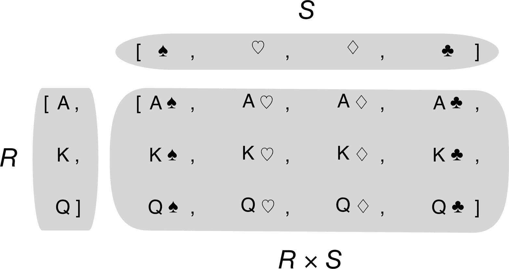
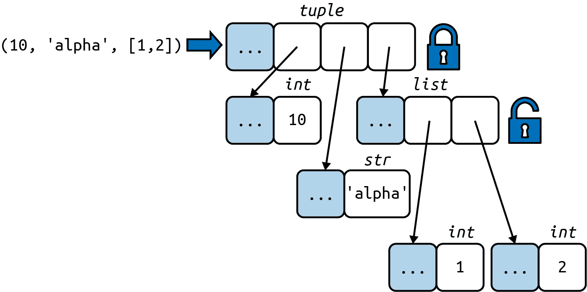
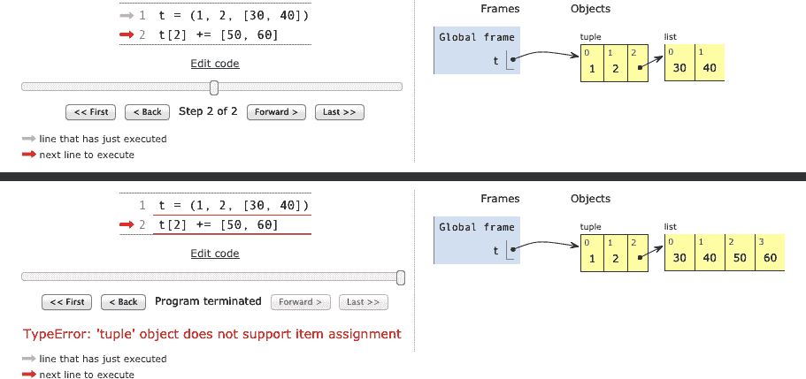

# 第二章：序列之阵

> 你可能已经注意到，提到的几个操作同样适用于文本、列表和表格。文本、列表和表格统称为 "序列"。[...] `FOR` 命令也可以通用地作用于序列。
> 
> Leo Geurts、Lambert Meertens 和 Steven Pembertonm，*ABC Programmer's Handbook*¹

在创建 Python 之前，Guido 曾是 ABC 语言的贡献者——一个为初学者设计编程环境的 10 年研究项目。ABC 引入了许多我们现在认为 "Pythonic" 的想法：对不同类型序列的通用操作、内置元组和映射类型、缩进结构、无需变量声明的强类型等等。Python 如此用户友好并非偶然。

Python 从 ABC 继承了对序列的统一处理。字符串、列表、字节序列、数组、XML 元素和数据库结果共享一组丰富的通用操作，包括迭代、切片、排序和连接。

了解 Python 中可用的各种序列可以节省我们重复发明轮子的时间，它们的通用接口激励我们创建正确支持和利用现有和未来序列类型的 API。

本章大部分讨论适用于一般的序列，从熟悉的 `list` 到 Python 3 中新增的 `str` 和 `bytes` 类型。这里还涵盖了列表、元组、数组和队列的具体主题，但 Unicode 字符串和字节序列的详细信息出现在 第四章。此外，这里的想法是涵盖已准备好使用的序列类型。创建你自己的序列类型是 第十二章 的主题。

本章将主要涵盖以下主题：

+   列表推导式和生成器表达式基础

+   将元组用作记录与将元组用作不可变列表

+   序列解包和序列模式

+   从切片读取和向切片写入

+   专门的序列类型，如数组和队列

# 本章的更新内容

本章最重要的更新是 "使用序列进行模式匹配"。这是 Python 3.10 的新模式匹配特性在第二版中首次出现。

其他变化不是更新，而是对第一版的改进：

+   序列内部结构的新图和描述，对比容器和扁平序列

+   简要比较 `list` 和 `tuple` 的性能和存储特性

+   包含可变元素的元组的注意事项，以及如何在需要时检测它们

我将命名元组的介绍移至 第五章 的 "经典命名元组"，在那里它们与 `typing.NamedTuple` 和 `@dataclass` 进行了比较。

###### 注意

为了给新内容腾出空间并将页数控制在合理范围内，第一版中的 "使用 Bisect 管理有序序列" 一节现在是 [*fluentpython.com*](http://fluentpython.com) 配套网站中的一篇[文章](https://fpy.li/bisect)。

# 内置序列概述

标准库提供了丰富的用 C 实现的序列类型选择：

容器序列

可以容纳不同类型的项目，包括嵌套容器。一些示例：`list`、`tuple` 和 `collections.deque`。

扁平序列

持有一种简单类型的项目。一些示例：`str`、`bytes` 和 `array.array`。

*容器序列*存储对其所包含的对象的引用，这些对象可以是任何类型，而*扁平序列*则在其自身的内存空间中存储其内容的值，而不是作为独立的 Python 对象。参见图 2-1。


###### 图 2-1\. 一个`tuple`和一个`array`的简化内存图，每个包含三个项目。灰色单元格表示每个 Python 对象的内存头——没有按比例绘制。`tuple`有一个对其项目的引用数组。每个项目都是一个单独的 Python 对象，可能包含对其他 Python 对象的引用，比如那个两个项目的列表。相比之下，Python `array`是一个单一的对象，包含一个 C 语言的三个 double 数组。

因此，扁平序列更紧凑，但它们仅限于保存字节、整数和浮点数等原始机器值。

###### 注意

内存中的每个 Python 对象都有一个带有元数据的头部。最简单的 Python 对象`float`有一个值字段和两个元数据字段：

+   `ob_refcnt`：对象的引用计数

+   `ob_type`：指向对象类型的指针

+   `ob_fval`：一个 C `double`，用于保存`float`的值

在 64 位 Python 构建中，这些字段中的每一个都占用 8 个字节。这就是为什么一个浮点数组比一个浮点元组更紧凑：数组是一个单一的对象，包含浮点数的原始值，而元组由多个对象组成——元组本身和其中包含的每个`float`对象。

对序列类型进行分组的另一种方式是按可变性：

可变序列

例如，`list`、`bytearray`、`array.array`和`collections.deque`。  

不可变序列

例如，`tuple`、`str`和`bytes`。

图 2-2 有助于可视化可变序列如何继承不可变序列的所有方法，并实现几个额外的方法。内置的具体序列类型实际上并没有子类化`Sequence`和`MutableSequence`抽象基类（ABC），但它们是注册到这些 ABC 的*虚拟子类*——我们将在第十三章中看到。作为虚拟子类，`tuple`和`list`通过了这些测试：

```py
>>> from collections import abc
>>> issubclass(tuple, abc.Sequence)
True
>>> issubclass(list, abc.MutableSequence)
True
```


###### 图 2-2\.collections.abc 中一些类的简化 UML 类图（超类在左侧；继承箭头从子类指向超类；斜体名称是抽象类和抽象方法）。

记住这些共同特征：可变与不可变；容器与扁平。它们有助于将你对一种序列类型的了解推广到其他类型。

最基本的序列类型是`list`：一个可变容器。我希望你非常熟悉列表，所以我们将直接进入列表推导式，这是一种构建列表的强大方式，但有时会因为语法一开始看起来不寻常而被低估。掌握列表推导式为生成器表达式打开了大门，生成器表达式除了其他用途外，还可以生成元素来填充任何类型的序列。这两者都是下一节的主题。

# 列表推导式和生成器表达式

构建序列的一个快速方法是使用列表推导式（如果目标是`list`）或生成器表达式（对于其他类型的序列）。如果你没有每天使用这些语法形式，我敢打赌你正在错失编写更易读且通常更快的代码的机会。

如果你怀疑我声称这些构造"更具可读性"，请继续阅读。我会试着说服你。

###### 提示

为了简洁起见，许多 Python 程序员将列表推导式称为*listcomps*，将生成器表达式称为*genexps*。我也会使用这些词。

## 列表推导式和可读性

这里有一个测试：你觉得示例 2-1 和示例 2-2 哪个更易读？

##### 示例 2-1\. 从字符串构建 Unicode 码点列表

```py
>>> symbols = '$¢£¥€¤'
>>> codes = []
>>> for symbol in symbols:
...     codes.append(ord(symbol))
...
>>> codes
[36, 162, 163, 165, 8364, 164]
```

##### 示例 2-2\. 使用列表推导式从字符串构建 Unicode 码点列表

```py
>>> symbols = '$¢£¥€¤'
>>> codes = [ord(symbol) for symbol in symbols]
>>> codes
[36, 162, 163, 165, 8364, 164]
```

任何稍微了解 Python 的人都可以读懂示例 2-1。然而，在学习了列表推导式之后，我发现示例 2-2 更具可读性，因为它的意图很明确。

`for`循环可用于执行许多不同的事情：扫描序列以计数或选择项目、计算聚合（总和、平均值）或任何其他任务。示例 2-1 中的代码正在构建一个列表。相比之下，列表推导式更加明确。它的目标总是构建一个新列表。

当然，也可能滥用列表推导式来编写真正难以理解的代码。我见过 Python 代码，其中列表推导式仅用于重复代码块以产生副作用。如果你不对生成的列表做任何事情，就不应该使用该语法。此外，尽量保持简短。如果列表推导式跨越两行以上，最好将其拆开或重写为普通的`for`循环。运用你的最佳判断：对于 Python，就像对于英语一样，没有明确的清晰写作规则。

# 语法提示

在 Python 代码中，在`[]`、`{}`或`()`对之间的换行符会被忽略。因此，你可以构建多行列表、列表推导式、元组、字典等，而无需使用`\`换行转义符，如果不小心在其后键入空格，它将不起作用。此外，当这些分隔符对用于定义包含以逗号分隔的一系列项的字面量时，尾随逗号将被忽略。因此，例如，在编写多行列表字面量时，在最后一项后面加上逗号是很周到的，这会让下一个编码者更容易向该列表添加一个项目，并在阅读差异时减少噪音。

列表推导式通过过滤和转换项目从序列或任何其他可迭代类型构建列表。内置的`filter`和`map`可以组合起来做同样的事情，但可读性会受到影响，我们接下来会看到。

## 列表推导式与 map 和 filter 的对比

列表推导式可以完成`map`和`filter`函数所做的一切，而无需功能受限的 Python `lambda`的扭曲。考虑示例 2-3。  

##### 示例 2-3. 通过列表推导式和 map/filter 组合构建的相同列表

```py
>>> symbols = '$¢£¥€¤'
>>> beyond_ascii = [ord(s) for s in symbols if ord(s) > 127]
>>> beyond_ascii
[162, 163, 165, 8364, 164]
>>> beyond_ascii = list(filter(lambda c: c > 127, map(ord, symbols)))
>>> beyond_ascii
[162, 163, 165, 8364, 164]
```

我曾经认为`map`和`filter`比等效的列表推导式更快，但 Alex Martelli 指出事实并非如此——至少在前面的示例中不是。[*Fluent Python*代码仓库](https://fpy.li/code)中的[*02-array-seq/listcomp_speed.py*](https://fpy.li/2-1)脚本是一个简单的速度测试，比较了列表推导式与`filter/map`。

在第七章中，我将对`map`和`filter`进行更多说明。现在我们来看看如何使用列表推导式计算笛卡尔积：一个包含由两个或多个列表中所有项构建的元组的列表。

## 笛卡尔积

列表推导式可以从两个或多个可迭代对象的笛卡尔积构建列表。构成笛卡尔积的项是由每个输入可迭代对象的项构成的元组。结果列表的长度等于输入可迭代对象的长度相乘。参见图 2-3。

  

###### 图 2-3. 3 个牌面和 4 个花色的笛卡尔积是由 12 对组成的序列。

例如，假设你需要生成一个包含两种颜色和三种尺寸的 T 恤列表。示例 2-4 展示了如何使用列表推导式生成该列表。结果有六个项目。

##### 示例 2-4. 使用列表推导式的笛卡尔积

```py
>>> colors = ['black', 'white']
>>> sizes = ['S', 'M', 'L']
>>> tshirts = [(color, size) for color in colors for size in sizes]  # ①
>>> tshirts
[('black', 'S'), ('black', 'M'), ('black', 'L'), ('white', 'S'),
 ('white', 'M'), ('white', 'L')] >>> for color in colors:  # ②
...     for size in sizes:
...         print((color, size))
...
('black', 'S') ('black', 'M') ('black', 'L') ('white', 'S') ('white', 'M') ('white', 'L') >>> tshirts = (color, size) for size in sizes      ![3
...                          for color in colors]
>>> tshirts
[('black', 'S'), ('white', 'S'), ('black', 'M'), ('white', 'M'),
 ('black', 'L'), ('white', 'L')]
```

①

这会生成一个按颜色再按大小排列的元组列表。

②

注意结果列表的排列方式，就好像`for`循环按照它们在列表推导式中出现的顺序嵌套一样。

③

要按大小再按颜色排列项目，只需重新排列`for`子句；在列表推导式中添加一个换行，可以更容易地看出结果的排序方式。

在示例 1-1（第一章）中，我使用以下表达式初始化一副由 4 种花色的 13 种牌面组成的 52 张牌的扑克牌，按花色和点数排序：

```py
        self._cards = [Card(rank, suit) for suit in self.suits
                                        for rank in self.ranks]
```

列表推导式是一招鲜吃遍天：它们构建列表。要为其他序列类型生成数据，生成器表达式是不二之选。下一节将简要介绍在构建非列表序列的上下文中使用生成器表达式。

## 生成器表达式

要初始化元组、数组和其他类型的序列，你也可以从列表推导式开始，但生成器表达式可以节省内存，因为它使用迭代器协议一个接一个地产生项目，而不是构建一个完整的列表来馈送另一个构造函数。

生成器表达式使用与列表推导式相同的语法，但用括号括起来，而不是方括号。

示例 2-5 展示了使用生成器表达式构建元组和数组的基本用法。

##### 示例 2-5. 从生成器表达式初始化元组和数组

```py
>>> symbols = '$¢£¥€¤'
>>> tuple(ord(symbol) for symbol in symbols)  # ①
(36, 162, 163, 165, 8364, 164) >>> import array
>>> array.array('I', (ord(symbol) for symbol in symbols))  # ②
array('I', [36, 162, 163, 165, 8364, 164])
```

①

如果生成器表达式是函数调用中的唯一参数，则不需要复制括号。

②

`array` 构造函数接受两个参数，因此生成器表达式周围的括号是必需的。`array` 构造函数的第一个参数定义了用于数组中数字的存储类型，我们将在"数组"中看到。

示例 2-6 使用笛卡尔积中的生成器表达式打印出三种尺寸两种颜色的 T 恤衫名册。与示例 2-4 相比，这里从未在内存中构建六个 T 恤衫的列表：生成器表达式每次产生一个项目来馈送 `for` 循环。如果笛卡尔积中使用的两个列表每个都有一千个项目，使用生成器表达式就可以节省构建一个包含一百万个项目的列表的成本，而这个列表只是用来馈送 `for` 循环。

##### 示例 2-6. 生成器表达式中的笛卡尔积

```py
>>> colors = ['black', 'white']
>>> sizes = ['S', 'M', 'L']
>>> for tshirt in (f'{c} {s}' for c in colors for s in sizes):  # ①
...     print(tshirt)
...
black S black M black L white S white M white L
```

① 

生成器表达式一个接一个地产生项目；在此示例中，从未生成包含所有六种 T 恤衫变体的列表。

###### 注意

第十七章详细解释了生成器的工作原理。这里的想法只是展示如何使用生成器表达式来初始化列表以外的序列，或生成不需要保存在内存中的输出。

现在我们继续讨论 Python 中另一个基本的序列类型：元组。

# 元组不仅仅是不可变的列表

一些介绍 Python 的入门文本将元组描述为"不可变的列表"，但这并没有充分利用它们。元组具有双重功能：它们可以用作不可变列表，也可以用作没有字段名的记录。这种用法有时会被忽略，所以我们将从这里开始。

## 元组作为记录

元组保存记录：元组中的每一项保存一个字段的数据，项目的位置赋予了它含义。

如果将元组视为不可变列表，则根据上下文，项目的数量和顺序可能重要，也可能不重要。但是在将元组用作字段集合时，项目的数量通常是固定的，它们的顺序始终很重要。

示例 2-7 显示了用作记录的元组。请注意，在每个表达式中，对元组进行排序都会破坏信息，因为每个字段的含义由其在元组中的位置给出。

##### 示例 2-7. 元组用作记录

```py
>>> lax_coordinates = (33.9425, -118.408056)  # ①
>>> city, year, pop, chg, area = ('Tokyo', 2003, 32_450, 0.66, 8014)  # ②
>>> traveler_ids = ('USA', '31195855'), ('BRA', 'CE342567'),  ![3
...     ('ESP', 'XDA205856')]
>>> for passport in sorted(traveler_ids):  # ④
...     print('%s/%s' % passport)   # ⑤
...
BRA/CE342567 ESP/XDA205856 USA/31195855 >>> for country, _ in traveler_ids:  # ⑥
...     print(country)
...
USA BRA ESP
```

①

洛杉矶国际机场的纬度和经度。

②

关于东京的数据：名称、年份、人口（千人）、人口变化（%）和面积（平方公里）。

③

形式为 `(country_code, passport_number)` 的元组列表。

④

当我们遍历列表时，`passport`绑定到每个元组。

⑤

`%`格式化运算符理解元组，并将每个项视为单独的字段。

⑥  

`for`循环知道如何分别检索元组的项，这称为"解包"。这里我们对第二个项不感兴趣，所以将其赋值给虚拟变量`_`。  

###### 提示

通常，使用`_`作为虚拟变量只是一种约定。它只是一个奇怪但有效的变量名。但是，在`match/case`语句中，`_`是一个通配符，可以匹配任何值，但不会绑定到一个值。参见"使用序列进行模式匹配"。在 Python 控制台中，前一个命令的结果被赋值给`_`，除非结果是`None`。

我们通常认为记录是具有命名字段的数据结构。第五章介绍了两种创建具有命名字段的元组的方法。

但通常没有必要费力创建一个类来命名字段，尤其是如果你利用解包并避免使用索引访问字段。在示例 2-7 中，我们在一条语句中将`('Tokyo', 2003, 32_450, 0.66, 8014)`赋值给`city, year, pop, chg, area`。然后，`%`运算符将`passport`元组中的每一项分配给`print`参数中格式字符串的相应位置。这是*元组解包*的两个例子。

###### 注意

术语*元组解包*被 Pythonista 广泛使用，但*可迭代解包*正在获得关注，如[PEP 3132 — 扩展可迭代解包](https://fpy.li/2-2)的标题所示。

"解包序列和可迭代对象"不仅详细介绍了元组的解包，还包括序列和可迭代对象的解包。

现在让我们将`tuple`类视为`list`类的不可变变体。

## 元组作为不可变列表

Python 解释器和标准库广泛使用元组作为不可变列表，你也应该这样做。这带来了两个主要好处：

清晰度

当你在代码中看到`tuple`时，你知道它的长度永远不会改变。

性能

与相同长度的`list`相比，`tuple`使用更少的内存，并允许 Python 进行一些优化。

但是，请注意`tuple`的不可变性仅适用于它所包含的引用。元组中的引用不能被删除或替换。但是，如果其中一个引用指向一个可变对象，并且该对象发生了变化，那么`tuple`的值就会改变。下面的代码片段通过创建两个最初相等的元组`a`和`b`来说明这一点。图 2-4 表示内存中`b`元组的初始布局。

 

###### 图 2-4。元组本身的内容是不可变的，但这只意味着元组持有的引用将始终指向相同的对象。但是，如果其中一个引用对象是可变的（如列表），其内容可能会发生变化。

当`b`中的最后一项发生变化时，`b`和`a`变得不同：

```py
>>> a = (10, 'alpha', [1, 2])
>>> b = (10, 'alpha', [1, 2])
>>> a == b
True
>>> b[-1].append(99)
>>> a == b
False
>>> b
(10, 'alpha', [1, 2, 99])
```

包含可变项的元组可能是 bug 的根源。正如我们将在"什么是可哈希的"中看到的，一个对象只有在其值不能改变时才是可哈希的。不可哈希的元组不能插入为`dict`键或`set`元素。 

如果你想明确确定一个元组（或任何对象）是否具有固定值，可以使用内置的`hash`创建一个`fixed`函数，如下所示：

```py
>>> def fixed(o):
...     try:
...         hash(o)
...     except TypeError:
...         return False
...     return True
...
>>> tf = (10, 'alpha', (1, 2))
>>> tm = (10, 'alpha', [1, 2])
>>> fixed(tf)
True
>>> fixed(tm)
False
```

我们在"元组的相对不可变性"中进一步探讨了这个问题。  

尽管有这个警告，元组仍然被广泛用作不可变列表。Python 核心开发者 Raymond Hettinger 在 StackOverflow 回答["在 Python 中元组比列表更高效吗？"](https://fpy.li/2-3)时解释了元组提供的一些性能优势。总结一下，Hettinger 写道：

+   为了评估元组字面量，Python 编译器在一个操作中为元组常量生成字节码；但是对于列表字面量，生成的字节码将每个元素作为单独的常量推送到数据栈，然后构建列表。

+   给定元组`t`，`tuple(t)`只是返回对同一个`t`的引用。没有必要复制。相比之下，给定列表`l`，`list(l)`构造函数必须创建`l`的新副本。

+   由于具有固定长度，`tuple`实例分配它需要的确切内存空间。另一方面，`list`的实例分配时会留有余地，以分摊将来追加的成本。

+   元组中元素的引用存储在元组结构中的数组中，而列表在其他地方保存指向引用数组的指针。当列表增长超过当前分配的空间时，Python 需要重新分配引用数组以腾出空间，因此需要间接寻址。额外的间接寻址使 CPU 缓存效率降低。

## 比较元组和列表方法

当使用元组作为`list`的不可变变体时，了解它们的 API 有多相似是很好的。如表 2-1 所示，除了一个例外，`tuple`支持所有不涉及添加或删除元素的`list`方法——`tuple`缺少`__reversed__`方法。但是，这只是为了优化；`reversed(my_tuple)`可以在没有它的情况下工作。

表 2-1. 在`list`或`tuple`中找到的方法和属性（为简洁起见，省略了对象实现的方法）

|  | list | tuple |   |
| --- | --- | --- | --- |
| `s.__add__(s2)` | ● | ● | `s + s2`—连接 |
| `s.__iadd__(s2)` | ● |  | `s += s2`—原地连接 |
| `s.append(e)` | ● |  | 在最后追加一个元素 |
| `s.clear()` | ● |  | 删除所有元素 |
| `s.__contains__(e)` | ● | ● | `e in s` |
| `s.copy()` | ● |  | 列表的浅拷贝 |
| `s.count(e)` | ● | ● | 计算元素出现的次数 |
| `s.__delitem__(p)` | ● |  | 移除位置`p`处的元素 |
| `s.extend(it)` | ● |  | 从可迭代对象`it`追加元素 |
| `s.__getitem__(p)` | ● | ● | `s[p]`—获取位置`p`处的元素 |
| `s.__getnewargs__()` |  | ● | 支持使用`pickle`进行优化的序列化 |
| `s.index(e)` | ● | ● | 查找`e`第一次出现的位置 |
| `s.insert(p, e)` | ● |  | 在位置`p`的元素之前插入元素`e` |
| `s.__iter__()` | ● | ● | 获取迭代器 |
| `s.__len__()` | ● | ● | `len(s)`—元素的数量 |
| `s.__mul__(n)` | ● | ● | `s * n`—重复连接 |
| `s.__imul__(n)` | ● |  | `s *= n`—原地重复连接 |
| `s.__rmul__(n)` | ● | ● | `n * s`—反向重复连接^(a) |
| `s.pop([p])` | ● |  | 移除并返回最后一个元素或位置`p`处的可选元素 |
| `s.remove(e)` | ● |  | 按值移除元素`e`的第一次出现 |
| `s.reverse()` | ● |  | 原地反转元素的顺序 |
| `s.__reversed__()` | ● |  | 获取从最后到第一个元素的迭代器 |
| `s.__setitem__(p, e)` | ● |  | `s[p] = e`—将`e`放在位置`p`，覆盖现有元素^(b) |
| `s.sort([key], [reverse])` | ● |  | 原地排序，可选关键字参数`key`和`reverse` |
| ^(a)反向运算符在第十六章中解释。^(b)也用于覆盖子序列。参见"赋值给切片"。 |

现在让我们切换到 Python 编程中一个重要的主题：元组、列表和可迭代对象解包。

# 解包序列和可迭代对象

解包很重要，因为它避免了不必要的和容易出错的使用索引从序列中提取元素。此外，解包可以与任何可迭代对象作为数据源一起使用，包括不支持索引表示法(`[]`)的迭代器。唯一的要求是，可迭代对象在接收端为每个变量只产生一个项，除非你使用星号(`*`)来捕获多余的项，如"使用*捕获多余的项"中所解释的。

解包最明显的形式是*并行赋值*；也就是说，将可迭代对象中的项赋值给一个元组变量，如下例所示：

```py
>>> lax_coordinates = (33.9425, -118.408056)
>>> latitude, longitude = lax_coordinates  # unpacking
>>> latitude
33.9425
>>> longitude
-118.408056
```

解包的一个优雅应用是在不使用临时变量的情况下交换变量的值：

```py
>>> b, a = a, b
```

解包的另一个例子是在调用函数时在参数前面加上`*`：

```py
>>> divmod(20, 8)
(2, 4)
>>> t = (20, 8)
>>> divmod(*t)
(2, 4)
>>> quotient, remainder = divmod(*t)
>>> quotient, remainder
(2, 4)
```

前面的代码展示了解包的另一个用途：允许函数以一种对调用者很方便的方式返回多个值。另一个例子是，`os.path.split()`函数从文件系统路径构建一个元组`(path, last_part)`：

```py
>>> import os
>>> _, filename = os.path.split('/home/luciano/.ssh/id_rsa.pub')
>>> filename
'id_rsa.pub'
```

另一种在解包时只使用部分项的方式是使用`*`语法，我们马上就会看到。

## 使用*捕获多余的项

使用`*args`定义函数参数以捕获任意多余的参数是 Python 的一个经典特性。

在 Python 3 中，这个想法也被扩展到并行赋值：

```py
>>> a, b, *rest = range(5)
>>> a, b, rest
(0, 1, [2, 3, 4])
>>> a, b, *rest = range(3)
>>> a, b, rest
(0, 1, [2])
>>> a, b, *rest = range(2)
>>> a, b, rest
(0, 1, [])
```

在并行赋值的上下文中，`*`前缀只能应用于一个变量，但它可以出现在任何位置：

```py
>>> a, *body, c, d = range(5)
>>> a, body, c, d
(0, [1, 2], 3, 4)
>>> *head, b, c, d = range(5)
>>> head, b, c, d
([0, 1], 2, 3, 4)
```

## 在函数调用和序列字面量中使用*解包

[PEP 448—Additional Unpacking Generalizations](https://fpy.li/pep448)引入了更灵活的可迭代对象解包语法，在["What's New In Python 3.5"](https://fpy.li/2-4)中总结得最好。

在函数调用中，我们可以多次使用`*`：

```py
>>> def fun(a, b, c, d, *rest):
...     return a, b, c, d, rest
...
>>> fun(*[1, 2], 3, *range(4, 7))
(1, 2, 3, 4, (5, 6))
```

在定义`list`、`tuple`或`set`字面量时也可以使用`*`，如["What's New In Python 3.5"](https://fpy.li/2-4)中的这些例子所示：

```py
>>> *range(4), 4
(0, 1, 2, 3, 4)
>>> [*range(4), 4]
[0, 1, 2, 3, 4]
>>> {*range(4), 4, *(5, 6, 7)}
{0, 1, 2, 3, 4, 5, 6, 7}
```

PEP 448 为`**`引入了类似的新语法，我们将在"Unpacking Mappings"中看到。

最后，元组解包的一个强大功能是它可以与嵌套结构一起使用。

## 嵌套解包

解包的目标可以使用嵌套，例如`(a, b, (c, d))`。如果值具有相同的嵌套结构，Python 会做正确的事情。示例 2-8 展示了嵌套解包的实际应用。

##### 示例 2-8\.解包嵌套元组以访问经度

```py
metro_areas = 
    ('Tokyo', 'JP', 36.933, (35.689722, 139.691667)),  ![1
    ('Delhi NCR', 'IN', 21.935, (28.613889, 77.208889)),
    ('Mexico City', 'MX', 20.142, (19.433333, -99.133333)),
    ('New York-Newark', 'US', 20.104, (40.808611, -74.020386)),
    ('São Paulo', 'BR', 19.649, (-23.547778, -46.635833)),
]

def main():
    print(f'{"":15} | {"latitude":>9} | {"longitude":>9}')
    for name, _, _, (lat, lon) in metro_areas:  # ②
        if lon <= 0:  # ③
            print(f'{name:15} | {lat:9.4f} | {lon:9.4f}')

if __name__ == '__main__':
    main()
```

① 

每个元组都包含一个有四个字段的记录，最后一个字段是一对坐标。

②

通过将最后一个字段赋值给嵌套元组，我们解包了坐标。

③

`lon <= 0:`测试只选择西半球的城市。

示例 2-8 的输出是：

```py
                |  latitude | longitude
Mexico City     |   19.4333 |  -99.1333
New York-Newark |   40.8086 |  -74.0204
São Paulo       |  -23.5478 |  -46.6358
```

解包赋值的目标也可以是一个列表，但好的用例很少见。这是我知道的唯一一个：如果你有一个数据库查询只返回一条记录（例如，SQL 代码中有一个`LIMIT 1`子句），那么你可以解包并同时确保只有一个结果，代码如下：

```py
>>> [record] = query_returning_single_row()
```

如果记录只有一个字段，你可以直接获取它，像这样：

```py
>>> [[field]] = query_returning_single_row_with_single_field()
```

这两种情况都可以用元组来写，但不要忘记单项元组必须用尾随逗号来写的语法怪癖。所以第一个目标应该是`(record,)`，第二个应该是`((field,),)`。在这两种情况下，如果你忘记了逗号，你会得到一个无声的错误。³

现在让我们研究模式匹配，它支持更强大的序列解包方式。

# 序列模式匹配

Python 3.10 中最明显的新特性是[PEP 634—Structural Pattern Matching: Specification](https://fpy.li/pep634)中提议的带有`match/case`语句的模式匹配。

###### 注意

Python 核心开发者 Carol Willing 在 ["What's New In Python 3.10"](https://fpy.li/2-7) 的 ["Structural Pattern Matching"](https://fpy.li/2-6) 部分中写了关于模式匹配的精彩介绍。你可能需要阅读那个快速概述。在本书中，我选择根据模式类型将模式匹配的内容分散在不同的章节中："Pattern Matching with Mappings" 和 "Pattern Matching Class Instances"。一个扩展示例在 "Pattern Matching in lis.py: A Case Study" 中。

这是一个 `match/case` 处理序列的第一个例子。想象你正在设计一个机器人，它接受以单词和数字序列发送的命令，如 `BEEPER 440 3`。在分割成部分并解析数字后，你会得到一条像 `['BEEPER', 440, 3]` 这样的消息。你可以使用如下方法来处理这样的消息：

##### 示例 2-9\. 一个虚构的 `Robot` 类的方法

```py
    def handle_command(self, message):
        match message:  # ①
            case ['BEEPER', frequency, times]:  # ②
                self.beep(times, frequency)
            case ['NECK', angle]:  # ③
                self.rotate_neck(angle)
            case ['LED', ident, intensity]:  # ④
                self.leds[ident].set_brightness(ident, intensity)
            case ['LED', ident, red, green, blue]:  # ⑤
                self.leds[ident].set_color(ident, red, green, blue)
            case _:  # ⑥
                raise InvalidCommand(message)
```

①

`match` 关键字后面的表达式是*主题*。主题是 Python 将尝试与每个 `case` 子句中的模式匹配的数据。

②

这个模式匹配任何包含三个元素的序列主题。第一个元素必须是字符串 `'BEEPER'`。第二个和第三个元素可以是任何内容，它们将按顺序绑定到变量 `frequency` 和 `times`。

③

这将匹配任何包含两个元素的主题，第一个元素是 `'NECK'`。

④

这将匹配一个以 `'LED'` 开头的三个元素的主题。如果元素数量不匹配，Python 将继续执行下一个 `case`。

⑤

另一个以 `'LED'` 开头的序列模式，现在有五个元素，包括常量 `'LED'`。

⑥

这是默认的 `case`。它将匹配任何没有匹配前面模式的主题。`_` 变量是特殊的，我们很快就会看到。

从表面上看，`match/case` 可能类似于 C 语言中的 `switch/case` 语句 —— 但那只是故事的一半。⁴ `match` 相对于 `switch` 的一个关键改进是*解构* —— 一种更高级的解包形式。解构是 Python 词汇表中的一个新词，但在支持模式匹配的语言（如 Scala 和 Elixir）的文档中常用。

作为解构的第一个示例，示例 2-10 展示了用 `match/case` 重写的 示例 2-8 的一部分。

##### 示例 2-10\. 解构嵌套元组 —— 需要 Python ≥ 3.10

```py
metro_areas = [
    ('Tokyo', 'JP', 36.933, (35.689722, 139.691667)),
    ('Delhi NCR', 'IN', 21.935, (28.613889, 77.208889)),
    ('Mexico City', 'MX', 20.142, (19.433333, -99.133333)),
    ('New York-Newark', 'US', 20.104, (40.808611, -74.020386)),
    ('São Paulo', 'BR', 19.649, (-23.547778, -46.635833)),
]

def main():
    print(f'{"":15} | {"latitude":>9} | {"longitude":>9}')
    for record in metro_areas:
        match record:  # ①
            case [name, _, _, (lat, lon)] if lon <= 0:  # ②
                print(f'{name:15} | {lat:9.4f} | {lon:9.4f}')
```

①

这个 `match` 的主题是 `record`，即 `metro_areas` 中的每个元组。

②

`case` 子句有两个部分：一个模式和一个可选的带有 `if` 关键字的守卫。

通常，序列模式在以下情况下匹配主题：

1.  主题是一个序列*并且*；

1.  主题和模式具有相同数量的元素*并且*；

1.  每个对应的元素都匹配，包括嵌套元素。

例如，示例 2-10 中的模式 `[name, _, _, (lat, lon)]` 匹配一个包含四个元素的序列，最后一个元素必须是一个包含两个元素的序列。

序列模式可以写成元组或列表，或者任何嵌套元组和列表的组合，但使用哪种语法并不重要：在序列模式中，方括号和括号的含义相同。我将模式写成带有嵌套 2 元组的列表，只是为了避免在 示例 2-10 中重复使用括号。

序列模式可以匹配`collections.abc.Sequence`的大多数实际或虚拟子类的实例，但`str`、`bytes`和`bytearray`除外。

###### 警告

在`match/case`的上下文中，`str`、`bytes`和`bytearray`的实例不会被处理为序列。这些类型的`match`主题被视为"原子"值——就像整数 987 被视为一个值，而不是一个数字序列。将这三种类型视为序列可能会因意外匹配而导致错误。如果要将这些类型的对象视为序列主题，请在`match`子句中进行转换。例如，请参见以下内容中的`tuple(phone)`：

```py
    match tuple(phone):
        case ['1', *rest]:  # North America and Caribbean
            ...
        case ['2', *rest]:  # Africa and some territories
            ...
        case ['3' | '4', *rest]:  # Europe
            ...
```

在标准库中，这些类型与序列模式兼容：

```py
list     memoryview    array.array
tuple    range         collections.deque
```

与解包不同，模式不会解构非序列的可迭代对象（如迭代器）。

`_`符号在模式中很特殊：它匹配该位置的任何单个项，但永远不会绑定到匹配项的值。此外，`_`是唯一可以在模式中多次出现的变量。

你可以使用`as`关键字将模式的任何部分绑定到一个变量：

```py
        case [name, _, _, (lat, lon) as coord]:
```

给定主题`['Shanghai', 'CN', 24.9, (31.1, 121.3)]`，前面的模式将匹配，并设置以下变量：

| 变量 | 设置值 |
| --- | --- |
| `name` | `'Shanghai'` |
| `lat` | `31.1` |
| `lon` | `121.3` |
| `coord` | `(31.1, 121.3)` |

我们可以通过添加类型信息来使模式更具体。例如，以下模式匹配与前面示例相同的嵌套序列结构，但第一项必须是`str`的实例，而 2 元组中的两个项都必须是`float`的实例：

```py
        case [str(name), _, _, (float(lat), float(lon))]:
```

###### 提示

表达式`str(name)`和`float(lat)`看起来像构造函数调用，我们会用它们将`name`和`lat`转换为`str`和`float`。但在模式的上下文中，该语法执行运行时类型检查：前面的模式将匹配一个四项序列，其中第 0 项必须是`str`，第 3 项必须是一对浮点数。此外，第 0 项中的`str`将绑定到`name`变量，第 3 项中的浮点数将分别绑定到`lat`和`lon`。所以，尽管`str(name)`借用了构造函数调用的语法，但在模式的上下文中，语义完全不同。在"模式匹配类实例"中介绍了在模式中使用任意类。

另一方面，如果我们想匹配任何以`str`开头并以两个浮点数的嵌套序列结尾的主题序列，我们可以这样写：

```py
        case [str(name), *_, (float(lat), float(lon))]:
```

`*_`匹配任意数量的项，而不将它们绑定到变量。使用`*extra`而不是`*_`会将项绑定到`extra`作为一个包含 0 个或多个项的`list`。

可选的以`if`开头的保护子句只在模式匹配时求值，并且可以引用模式中绑定的变量，如示例 2-10 所示：

```py
        match record:
            case [name, _, _, (lat, lon)] if lon <= 0:
                print(f'{name:15} | {lat:9.4f} | {lon:9.4f}')
```

只有在模式匹配且保护表达式为*真*时，才会运行包含`print`语句的嵌套块。

###### 提示

使用模式进行解构是如此富有表现力，以至于有时只有一个`case`的`match`就可以使代码更简单。Guido van Rossum 有一个`case/match`示例集合，其中有一个他标题为["一个非常深层的可迭代对象和类型匹配与提取"](https://fpy.li/2-10)。

示例 2-10 并不比示例 2-8 有改进。它只是一个示例，用于对比做同一件事的两种方式。下一个示例展示了模式匹配如何有助于清晰、简洁和有效的代码。

## 解释器中的序列模式匹配

斯坦福大学的 Peter Norvig 编写了[*lis.py*](https://fpy.li/2-11)：一个 Lisp 编程语言的 Scheme 方言子集的解释器，用 132 行优美、易读的 Python 代码实现。我采用了 Norvig 的 MIT 许可源代码，并将其更新到 Python 3.10，以展示模式匹配。在本节中，我们将比较 Norvig 代码的一个关键部分（使用`if/elif`和解包）与使用`match/case`重写的版本。

*lis.py*的两个主要函数是`parse`和`evaluate`。⁵ 解析器接受 Scheme 的括号表达式并返回 Python 列表。这里有两个例子：

```py
>>> parse('(gcd 18 45)')
['gcd', 18, 45]
>>> parse('''
... (define double
...     (lambda (n)
...         (* n 2)))
... ''')
['define', 'double', ['lambda', ['n'], ['*', 'n', 2]]]
```

求值器接受这样的列表并执行它们。第一个例子是用`18`和`45`作为参数调用`gcd`函数。求值时，它计算参数的最大公约数：9。第二个例子是定义一个名为`double`的函数，带有一个参数`n`。函数体是表达式`(* n 2)`。在 Scheme 中调用函数的结果是函数体中最后一个表达式的值。 

我们这里重点关注序列的解构，所以我不会解释求值器的动作。想了解更多关于*lis.py*如何工作的信息，请参阅"lis.py 中的模式匹配：一个案例研究"。

示例 2-11 显示了 Norvig 的求值器，经过略微修改，仅显示序列模式。 

##### 示例 2-11\. 不使用`match/case`匹配模式

```py
def evaluate(exp: Expression, env: Environment) -> Any:
    "Evaluate an expression in an environment."
    if isinstance(exp, Symbol):      # variable reference
        return env[exp]
    # ... lines omitted
    elif exp[0] == 'quote':          # (quote exp)
        (_, x) = exp
        return x
    elif exp[0] == 'if':             # (if test conseq alt)
        (_, test, consequence, alternative) = exp
        if evaluate(test, env):
            return evaluate(consequence, env)
        else:
            return evaluate(alternative, env)
    elif exp[0] == 'lambda':         # (lambda (parm…) body…)
        (_, parms, *body) = exp
        return Procedure(parms, body, env)
    elif exp[0] == 'define':
        (_, name, value_exp) = exp
        env[name] = evaluate(value_exp, env)
    # ... more lines omitted
```

注意每个`elif`子句是如何检查列表的第一个元素，然后解包列表，忽略第一个元素的。广泛使用解包表明 Norvig 是模式匹配的粉丝，但他最初是为 Python 2 编写那段代码的（尽管它现在适用于任何 Python 3）。

使用 Python ≥ 3.10 中的`match/case`，我们可以重构`evaluate`，如示例 2-12 所示。

##### 示例 2-12\. 使用`match/case`进行模式匹配——需要 Python ≥ 3.10 

```py
def evaluate(exp: Expression, env: Environment) -> Any:
    "Evaluate an expression in an environment."
    match exp:
    # ... lines omitted
        case ['quote', x]:  # ①
            return x
        case ['if', test, consequence, alternative]:  # ②
            if evaluate(test, env):
                return evaluate(consequence, env)
            else:
                return evaluate(alternative, env)
        case ['lambda', [*parms], *body] if body:  # ③
            return Procedure(parms, body, env)
        case ['define', Symbol() as name, value_exp]:  # ④
            env[name] = evaluate(value_exp, env)
        # ... more lines omitted
        case _:  # ⑤
            raise SyntaxError(lispstr(exp))
```

①

匹配是否是以`'quote'`开头的两元素序列。

②

匹配是否是以`'if'`开头的四元素序列。

③

匹配是否是以`'lambda'`开头的三个或更多元素的序列。guard 确保`body`不为空。

④

匹配是否是以`'define'`开头的三元素序列，后面跟着一个`Symbol`的实例。

⑤

将所有的`case`语句写一个兜底是一个很好的实践。在这个例子中，如果`exp`不匹配任何模式，表达式就是有问题的，我会抛出`SyntaxError`。

如果没有兜底语句，当主体不匹配任何 case 时，整个`match`语句都不会执行任何操作——而这可能是一个静默的失败。

Norvig 故意避免在*lis.py*中进行错误检查，以保持代码易于理解。使用模式匹配，我们可以添加更多检查，同时保持可读性。例如，在`'define'`模式中，原始代码不确保`name`是`Symbol`的实例——这需要一个`if`块、一个`isinstance`调用和更多代码。示例 2-12 比示例 2-11 更简洁、更安全。

### lambda 的替代模式

这是 Scheme 中`lambda`的语法，使用语法约定：后缀`…`表示元素可能出现零次或多次：

```py
(lambda (parms…) body1 body2…)
```

lambda case `'lambda'`的一个简单模式是：

```py
       case ['lambda', parms, *body] if body:
```

然而，这会匹配`parms`位置的任何值，包括这个无效主体中的第一个`'x'`：

```py
['lambda', 'x', ['*', 'x', 2]]
```

Scheme 中`lambda`关键字后面的嵌套列表包含函数的形式参数名称，即使它只有一个元素也必须是一个列表。如果函数不接受任何参数，它也可以是一个空列表——就像 Python 的`random.random()`。

在 示例 2-12 中，我使用嵌套序列模式使 `'lambda'` 模式更加安全：

```py
        case ['lambda', [*parms], *body] if body:
            return Procedure(parms, body, env)
```

在序列模式中，`*` 在每个序列中只能出现一次。这里我们有两个序列：外部序列和内部序列。

在 `parms` 周围添加 `[*]` 字符使模式看起来更像它所处理的 Scheme 语法，并为我们提供了额外的结构检查。

### 函数定义的简写语法

Scheme 有一种替代的 `define` 语法，可以在不使用嵌套 `lambda` 的情况下创建命名函数。语法如下：

```py
(define (name parm…) body1 body2…)
```

`define` 关键字后面跟着一个列表，其中包含新函数的 `name` 以及零个或多个参数名称。在该列表之后是函数体，其中包含一个或多个表达式。

将这两行添加到 `match` 中就可以完成实现：

```py
        case ['define', [Symbol() as name, *parms], *body] if body:
            env[name] = Procedure(parms, body, env)
```

我会将该 `case` 放在 示例 2-12 中另一个 `define` case 之后。在这个示例中，`define` case 的顺序无关紧要，因为没有主体可以同时匹配这两个模式：在原始的 `define` case 中第二个元素必须是 `Symbol`，但在用于函数定义的 `define` 简写中，它必须是以 `Symbol` 开头的序列。

现在考虑一下，如果没有 示例 2-11 中模式匹配的帮助，为第二个 `define` 语法添加支持需要做多少工作。`match` 语句比类 C 语言中的 `switch` 做的事情要多得多。

模式匹配是声明式编程的一个例子：代码描述了你想要匹配的"什么"，而不是"如何"匹配。代码的形状遵循数据的形状，如 表 2-2 所示。

表 2-2\. 一些 Scheme 语法形式和用于处理它们的 `case` 模式

| Scheme 语法 | 序列模式 |
| --- | --- |
| `(quote exp)` | `['quote', exp]` |
| `(if test conseq alt)` | `['if', test, conseq, alt]` |
| `(lambda (parms…) body1 body2…)` | `['lambda', [*parms], *body] if body` |
| `(define name exp)` | `['define', Symbol() as name, exp]` |
| `(define (name parms…) body1 body2…)` | `['define', [Symbol() as name, *parms], *body] if body` |

我希望用模式匹配重构 Norvig 的 `evaluate` 能让你相信 `match/case` 可以使你的代码更具可读性和安全性。

###### 注意

在"lis.py 中的模式匹配：案例研究"一节中，当我们回顾 `evaluate` 中完整的 `match/case` 示例时，我们将看到更多关于 *lis.py* 的内容。如果你想了解更多关于 Norvig 的 *lis.py*，请阅读他精彩的文章["（如何用 Python 编写一个 Lisp 解释器）"](https://fpy.li/2-12)。

以上就是我们对序列解包、解构和模式匹配的首次介绍。我们将在后面的章节中介绍其他类型的模式。

每个 Python 程序员都知道可以使用 `s[a:b]` 语法对序列进行切片。我们现在来看一些关于切片的鲜为人知的事实。

# 切片

Python 中 `list`、`tuple`、`str` 以及所有序列类型的一个共同特性是支持切片操作，其功能比大多数人意识到的要强大得多。

在本节中，我们描述了这些高级切片形式的*使用*。它们在用户定义类中的实现将在 第十二章中介绍，这与我们在本书这一部分中介绍现成可用的类，并在 第 III 部分中创建新类的理念保持一致。

## 为什么切片和范围要排除最后一项

在 Python、C 语言以及许多其他语言中使用的基于 0 的索引，与 Python 中切片和范围排除最后一项的约定能够很好地配合。这个约定有一些方便的特性：

+   当只给出停止位置时，很容易看出切片或范围的长度：`range(3)` 和 `my_list[:3]` 都会产生三个项目。

+   当给出起始位置和停止位置时，计算切片或范围的长度很容易：只需计算 `stop - start`。

+   在任意索引`x`处轻松将序列分为两部分，不重叠：只需获取`my_list[:x]`和`my_list[x:]`。例如：

    ```py
    >>> l = [10, 20, 30, 40, 50, 60]
    >>> l[:2]  # split at 2
    [10, 20]
    >>> l[2:]
    [30, 40, 50, 60]
    >>> l[:3]  # split at 3
    [10, 20, 30]
    >>> l[3:]
    [40, 50, 60]
    ```

这种约定的最佳论据是由荷兰计算机科学家 Edsger W. Dijkstra 撰写的（请参阅“进一步阅读”中的最后一个参考文献）。

现在让我们仔细看看 Python 如何解释切片表示法。

## 切片对象

这并不是秘密，但值得重复一遍：`s[a:b:c]`可用于指定步长或步进`c`，导致生成的切片跳过项目。步长也可以是负数，返回相反顺序的项目。三个示例清楚地说明了这一点：

```py
>>> s = 'bicycle'
>>> s[::3]
'bye'
>>> s[::-1]
'elcycib'
>>> s[::-2]
'eccb'
```

另一个示例在第一章中展示，当我们使用`deck[12::13]`来获取未洗牌牌组中的所有 A 时：

```py
>>> deck[12::13]
[Card(rank='A', suit='spades'), Card(rank='A', suit='diamonds'),
Card(rank='A', suit='clubs'), Card(rank='A', suit='hearts')]
```

符号`a:b:c`仅在作为索引或下标运算符使用时在`[]`内有效，并产生一个切片对象：`slice(a, b, c)`。正如我们将在“切片工作原理”中看到的，为了评估表达式`seq[start:stop:step]`，Python 调用`seq.__getitem__(slice(start, stop, step))`。即使您不是在实现自己的序列类型，了解切片对象也是有用的，因为它允许您为切片分配名称，就像电子表格允许命名单元格范围一样。

假设您需要解析像示例 2-13 中显示的发票那样的平面文件数据。您可以为它们命名，而不是在代码中填充硬编码切片。看看这如何使示例末尾的`for`循环变得更易读。

##### 示例 2-13。来自平面文件发票的行项目

```py
>>> invoice = """
... 0.....6.................................40........52...55........
... 1909  Pimoroni PiBrella                     $17.50    3    $52.50
... 1489  6mm Tactile Switch x20                 $4.95    2     $9.90
... 1510  Panavise Jr. - PV-201                 $28.00    1    $28.00
... 1601  PiTFT Mini Kit 320x240                $34.95    1    $34.95
... """
>>> SKU = slice(0, 6)
>>> DESCRIPTION = slice(6, 40)
>>> UNIT_PRICE = slice(40, 52)
>>> QUANTITY =  slice(52, 55)
>>> ITEM_TOTAL = slice(55, None)
>>> line_items = invoice.split('\n')[2:]
>>> for item in line_items:
...     print(item[UNIT_PRICE], item[DESCRIPTION])
...
 $17.50   Pimoroni PiBrella
 $4.95   6mm Tactile Switch x20
 $28.00   Panavise Jr. - PV-201
 $34.95   PiTFT Mini Kit 320x240
```

当我们讨论在“向量接收器#2：可切片序列”中创建自己的集合时，我们将回到`slice`对象。与此同时，从用户角度来看，切片包括额外的功能，如多维切片和省略号（`...`）表示法。继续阅读。

## 多维切片和省略号

`[]`运算符还可以接受用逗号分隔的多个索引或切片。处理`[]`运算符的`__getitem__`和`__setitem__`特殊方法简单地将`a[i, j]`中的索引作为元组接收。换句话说，为了评估`a[i, j]`，Python 调用`a.__getitem__((i, j))`。 

例如，在外部 NumPy 包中使用，可以使用语法`a[i, j]`获取二维`numpy.ndarray`的项目，并使用表达式`a[m:n, k:l]`获取二维切片。本章后面的示例 2-22 展示了此表示法的用法。

除了`memoryview`，Python 中的内置序列类型是一维的，因此它们仅支持一个索引或切片，而不是它们的元组。⁶

省略号——用三个完整的句号（`...`）而不是`…`（Unicode U+2026）编写——被 Python 解析器识别为一个标记。它是`Ellipsis`对象的别名，`ellipsis`类的单个实例。⁷因此，它可以作为参数传递给函数，并作为切片规范的一部分，如`f(a, ..., z)`或`a[i:...]`。NumPy 在对许多维度的数组进行切片时使用`...`作为快捷方式；例如，如果`x`是一个四维数组，则`x[i, ...]`是`x[i, :, :, :,]`的快捷方式。查看[“NumPy 快速入门”](https://fpy.li/2-13)以了解更多信息。

在撰写本文时，我不知道 Python 标准库中使用`Ellipsis`或多维索引和切片的用途。如果您发现了，请告诉我。这些语法特性存在是为了支持用户定义的类型和扩展，如 NumPy。

切片不仅有助于从序列中提取信息；它们还可以用于就地更改可变序列，即不需要从头开始重建它们。

## 分配到切片

可变序列可以通过在赋值语句的左侧使用切片表示法或作为`del`语句的目标来进行嫁接、切除和其他修改。接下来的几个示例展示了这种表示法的强大之处：

```py
>>> l = list(range(10))
>>> l
[0, 1, 2, 3, 4, 5, 6, 7, 8, 9] >>> l[2:5] = [20, 30]
>>> l
[0, 1, 20, 30, 5, 6, 7, 8, 9] >>> del l[5:7]
>>> l
[0, 1, 20, 30, 5, 8, 9] >>> l[3::2] = [11, 22]
>>> l
[0, 1, 20, 11, 5, 22, 9] >>> l[2:5] = 100  # ①
Traceback (most recent call last):
 File "<stdin>", line 1, in <module>
TypeError: can only assign an iterable
>>> l[2:5] = [100]
>>> l
[0, 1, 100, 22, 9]
```

①

当赋值的目标是一个切片时，右侧必须是一个可迭代对象，即使它只有一个项目。

每个程序员都知道连接序列是一种常见操作。Python 入门教程解释了如何使用`+`和`*`来实现这一目的，但它们的工作原理有一些微妙之处，我们接下来会详细介绍。

# 使用+和*处理序列

Python 程序员期望序列支持`+`和`*`。通常，`+`的两个操作数必须是相同的序列类型，并且它们都不会被修改，但作为连接结果会创建一个相同类型的新序列。

要连接同一序列的多个副本，可以将其乘以一个整数。同样，会创建一个新序列：

```py
>>> l = [1, 2, 3]
>>> l * 5
[1, 2, 3, 1, 2, 3, 1, 2, 3, 1, 2, 3, 1, 2, 3]
>>> 5 * 'abcd'
'abcdabcdabcdabcdabcd'
```

`+`和`*`都会创建一个新对象，并且不会改变它们的操作数。

###### 警告

当包含可变项的序列`a`尝试执行`a * n`时要小心，因为结果可能会让你感到惊讶。例如，尝试将一个列表的列表初始化为`my_list = [[]] * 3`将导致一个包含对同一内部列表的三个引用的列表，这可能不是你想要的。

下一节将介绍尝试使用`*`初始化列表的陷阱。

## 构建列表的列表

有时我们需要使用一定数量的嵌套列表来初始化一个列表，例如，将学生分配到团队列表中或表示游戏棋盘上的方块。最好的方法是使用列表推导式，就像示例 2-14 中那样。

##### 示例 2-14. 一个包含三个长度为 3 的列表的列表可以表示一个井字棋棋盘

```py
>>> board = [['_'] * 3 for i in range(3)]  # ①
>>> board
[['_', '_', '_'], ['_', '_', '_'], ['_', '_', '_']] >>> board[1][2] = 'X'  # ②
>>> board
[['_', '_', '_'], ['_', '_', 'X'], ['_', '_', '_']]
```

①

创建一个包含三个每个三个项目的列表的列表。检查结构。

②

在第 1 行第 2 列放置一个标记，然后查看结果。

一个诱人但错误的快捷方式是像示例 2-15 那样做。

##### 示例 2-15. 一个包含对同一列表的三个引用的列表是无用的

```py
>>> weird_board = [['_'] * 3] * 3  # ①
>>> weird_board
[['_', '_', '_'], ['_', '_', '_'], ['_', '_', '_']] >>> weird_board[1][2] = 'O' # ②
>>> weird_board
[['_', '_', 'O'], ['_', '_', 'O'], ['_', '_', 'O']]
```

①

外部列表由三个对同一内部列表的引用组成。当它保持不变时，一切似乎都正确。

②

在第 1 行第 2 列放置一个标记，揭示所有行都是指向同一对象的别名。

示例 2-15 的问题在于，本质上它的行为类似于以下代码：

```py
row = ['_'] * 3
board = []
for i in range(3):
    board.append(row)  # ①
```

①

相同的`row`被三次附加到`board`上。

另一方面，来自示例 2-14 的列表推导式等同于以下代码：

```py
>>> board = []
>>> for i in range(3):
...     row = ['_'] * 3  # ①
...     board.append(row)
...
>>> board
[['_', '_', '_'], ['_', '_', '_'], ['_', '_', '_']]
>>> board[2][0] = 'X'
>>> board  # ②
[['_', '_', '_'], ['_', '_', '_'], ['X', '_', '_']]
```

①

每次迭代都会构建一个新的`row`并将其附加到`board`上。

②

只有第 2 行被更改，这是预期的结果。

###### 提示

如果本节中的问题或解决方案对您来说不清楚，请放心。第六章旨在澄清引用和可变对象的机制和陷阱。

到目前为止，我们已经讨论了在序列中使用普通的`+`和`*`运算符，但还有`+=`和`*=`运算符，它们会根据目标序列的可变性产生非常不同的结果。接下来的部分将解释其工作原理。

## 序列的增强赋值

增强赋值运算符`+=`和`*=`的行为取决于第一个操作数。为了简化讨论，我们将首先关注增强加法(`+=`)，但这些概念也适用于`*=`和其他增强赋值运算符。

使 `+=` 生效的特殊方法是 `__iadd__`（代表“就地加法”）。

然而，如果未实现 `__iadd__`，Python 将退而求其次调用 `__add__`。考虑这个简单的表达式：

```py
>>> a += b
```

如果 `a` 实现了 `__iadd__`，那么将会调用它。对于可变序列（例如 `list`、`bytearray`、`array.array`），`a` 将会就地更改（即效果类似于 `a.extend(b)`）。然而，当 `a` 没有实现 `__iadd__` 时，表达式 `a += b` 的效果与 `a = a + b` 相同：首先计算表达式 `a + b`，产生一个新对象，然后将其绑定到 `a`。换句话说，取决于是否有 `__iadd__`，绑定到 `a` 的对象的标识可能会改变或不会改变。

一般来说，对于可变序列，可以肯定会实现 `__iadd__`，并且 `+=` 会就地发生。对于不可变序列，显然不可能发生这种情况。

我刚刚写的关于 `+=` 的内容也适用于 `*=`，它是通过 `__imul__` 实现的。`__iadd__` 和 `__imul__` 特殊方法在 第十六章 中有讨论。这里展示了对可变序列和不可变序列使用 `*=` 的演示：

```py
>>> l = [1, 2, 3]
>>> id(l)
4311953800 # ①
>>> l *= 2
>>> l
[1, 2, 3, 1, 2, 3] >>> id(l)
4311953800 # ②
>>> t = (1, 2, 3)
>>> id(t)
4312681568 # ③
>>> t *= 2
>>> id(t)
4301348296 # ④
```

①

初始列表的 ID。

②

经过乘法运算后，列表仍然是同一个对象，只是附加了新项。

③

初始元组的 ID。

④

经过乘法运算后，创建了一个新的元组。

对不可变序列的重复连接是低效的，因为解释器不仅仅是附加新项，还必须复制整个目标序列，以创建一个新的序列，其中包含新附加的项。⁸

我们已经看到了 `+=` 的常见用法。下一节将展示一个引人入胜的特殊情况，突显了在元组上“不可变”在实际中意味着什么。

## A += 赋值谜题

尝试在不使用控制台的情况下回答：评估 示例 2-16 中的两个表达式的结果是什么？⁹

##### 示例 2-16\. 一个谜题

```py
>>> t = (1, 2, [30, 40])
>>> t[2] += [50, 60]
```

接下来会发生什么？选择最佳答案： 

1.  `t` 变成了 `(1, 2, [30, 40, 50, 60])`。

1.  引发 `TypeError`，消息为 `'tuple' object does not support item assignment`。

1.  无。

1.  A 和 B 都是。

当我看到这个时，我非常确定答案是 B，但实际上是 D，“A 和 B 都是”！示例 2-17 是来自 Python 3.9 控制台的实际输出。¹⁰

##### 示例 2-17\. 意外结果：项目 t2 被更改 *并且* 引发异常

```py
>>> t = (1, 2, [30, 40])
>>> t[2] += [50, 60]
Traceback (most recent call last):
  File "<stdin>", line 1, in <module>
TypeError: 'tuple' object does not support item assignment
>>> t
(1, 2, [30, 40, 50, 60])
```

[在线 Python Tutor](https://fpy.li/2-14) 是一个很棒的在线工具，可以详细展示 Python 的工作原理。图 2-5 是两个截图的组合，显示了来自 示例 2-17 的元组 `t` 的初始状态和最终状态。



###### 图 2-5\. 元组赋值谜题的初始状态和最终状态（由在线 Python Tutor 生成的图表）。

当你查看 Python 为表达式 `s[a] += b` 生成的字节码时（示例 2-18），就会清楚这是如何发生的。

##### 示例 2-18\. 表达式 `s[a] += b` 的字节码

```py
>>> dis.dis('s[a] += b')
 1           0 LOAD_NAME                0 (s) 3 LOAD_NAME                1 (a) 6 DUP_TOP_TWO 7 BINARY_SUBSCR # ①
 8 LOAD_NAME                2 (b) 11 INPLACE_ADD # ②
 12 ROT_THREE 13 STORE_SUBSCR # ③
 14 LOAD_CONST               0 (None) 17 RETURN_VALUE
```

①

将 `s[a]` 的值放在 `TOS`（栈顶）上。

②

执行 `TOS += b`。如果 `TOS` 指向一个可变对象（就像在 示例 2-17 中的列表），那么这将成功。

③

将 `s[a] = TOS`。如果 `s` 是不可变的（例如 示例 2-17 中的元组 `t`），则此操作失败。

这个例子是一个非常特殊的情况，在使用 Python 20 年中，我从未见过这种奇怪的行为实际上影响到任何人。

我从中得到了三个教训：

+   避免将可变项放入元组中。

+   增强赋值不是一个原子操作——我们刚刚看到它在完成部分工作后抛出异常。

+   检查 Python 字节码并不太困难，而且可以帮助我们了解底层发生了什么。

在见识了使用`+`和`*`进行连接的微妙之后，我们可以将话题转向另一个与序列相关的重要操作：排序。

# `list.sort`与内置的`sorted`的比较

`list.sort`方法原地对列表进行排序，即不创建副本。它返回`None`以提醒我们它改变了接收者¹¹，并且没有创建新列表。这是一个重要的 Python API 约定：在原地更改对象的函数或方法应该返回`None`，以明确告诉调用者接收者已被更改，没有创建新对象。例如，`random.shuffle(s)`函数也表现出类似的行为，它原地对可变序列`s`进行洗牌，并返回`None`。

###### 注意

返回`None`以表示原地更改的约定存在一个缺点：我们无法级联调用这些方法。相反，返回新对象的方法（例如，所有`str`方法）可以以流畅接口风格级联。请参阅维基百科的[“流畅接口”条目](https://fpy.li/2-15)以进一步描述这个主题。

相反，内置函数`sorted`创建一个新列表并返回它。它接受任何可迭代对象作为参数，包括不可变序列和生成器（参见第十七章）。无论给`sorted`的可迭代对象的类型是什么，它总是返回一个新创建的列表。

`list.sort`和`sorted`都接受两个可选的、仅限关键字的参数：

`reverse`

如果为`True`，则按降序（即，通过反转项目的比较）返回项目。默认值为`False`。

`key`

一个参数函数，将被应用于每个项目以生成其排序键。例如，当对字符串列表进行排序时，可以使用`key=str.lower`执行不区分大小写的排序，`key=len`将按字符长度对字符串进行排序。默认是恒等函数（即，比较项目本身）。

###### 提示

您还可以在`min()`和`max()`内置函数以及标准库中的其他函数（例如`itertools.groupby()`和`heapq.nlargest()`）中使用可选的关键字参数`key`。

这里有一些示例来澄清这些函数和关键字参数的使用。这些示例还演示了 Python 的排序算法是稳定的（即，它保留了相等比较的项目的相对顺序）：¹²

```py
>>> fruits = ['grape', 'raspberry', 'apple', 'banana']
>>> sorted(fruits)
['apple', 'banana', 'grape', 'raspberry'] # ①
>>> fruits
['grape', 'raspberry', 'apple', 'banana'] # ②
>>> sorted(fruits, reverse=True)
['raspberry', 'grape', 'banana', 'apple'] # ③
>>> sorted(fruits, key=len)
['grape', 'apple', 'banana', 'raspberry'] # ④
>>> sorted(fruits, key=len, reverse=True)
['raspberry', 'banana', 'grape', 'apple'] # ⑤
>>> fruits
['grape', 'raspberry', 'apple', 'banana'] # ⑥
>>> fruits.sort()                          # ⑦
>>> fruits
['apple', 'banana', 'grape', 'raspberry'] # ⑧
```

①

这将产生一个按字母顺序排序的新字符串列表。¹³

②

检查原始列表，我们看到它没有改变。

③

这是之前的“字母顺序”，但是反转了。

④

一个按长度排序的新字符串列表。由于排序算法是稳定的，“葡萄”和“苹果”，长度均为 5，按原始顺序排列。

⑤

这些是按长度降序排序的字符串。这不是前一个结果的反转，因为排序是稳定的，所以“葡萄”再次出现在“苹果”之前。

⑥

到目前为止，原始`fruits`列表的顺序没有改变。

⑦

这会原地对列表进行排序，并返回`None`（控制台省略了这一点）。

⑧

现在`fruits`已经排序。

###### 警告

默认情况下，Python 按字符代码按字典顺序对字符串进行排序。这意味着 ASCII 大写字母将排在小写字母之前，非 ASCII 字符不太可能以合理的方式排序。“对 Unicode 文本进行排序”介绍了按人类期望的方式对文本进行排序的正确方法。

一旦您的序列被排序，它们可以被非常高效地搜索。Python 标准库的`bisect`模块中已经提供了二分搜索算法。该模块还包括`bisect.insort`函数，您可以使用它来确保您的排序序列保持排序。您可以在[*fluentpython.com*](http://fluentpython.com)伴随网站的[“使用 Bisect 管理有序序列”](https://fpy.li/bisect)文章中找到`bisect`模块的图解介绍。

到目前为止，在本章中所看到的大部分内容都适用于一般序列，而不仅仅是列表或元组。Python 程序员有时会过度使用`list`类型，因为它非常方便——我知道我曾经这样做过。例如，如果您正在处理大量数字列表，应考虑改用数组。本章的其余部分致力于列表和元组的替代方案。

# 当列表不是答案时

`list`类型灵活且易于使用，但根据具体要求，有更好的选择。例如，当需要处理数百万个浮点值时，`array`可以节省大量内存。另一方面，如果您不断地向列表的两端添加和删除项目，那么了解`deque`（双端队列）是一种更高效的 FIFO¹⁴数据结构是很有用的。

###### 提示

如果您的代码经常检查集合中是否存在某个项目（例如，`item in my_collection`），请考虑使用`set`代替`my_collection`，特别是如果它包含大量项目。集合针对快速成员检查进行了优化。它们也是可迭代的，但它们不是序列，因为集合项的顺序是未指定的。我们将在第三章中介绍它们。

在本章的其余部分中，我们将讨论可以在许多情况下替代列表的可变序列类型，从数组开始。

## 数组

如果列表只包含数字，`array.array`是更高效的替代品。数组支持所有可变序列操作（包括`.pop`、`.insert`和`.extend`），以及用于快速加载和保存的附加方法，如`.frombytes`和`.tofile`。

Python 数组与 C 数组一样精简。如图 2-1 所示，`float`值的`array`不保存完整的`float`实例，而只保存代表其机器值的打包字节——类似于 C 语言中的`double`数组。创建`array`时，您提供一个类型码，一个用于确定数组中每个项目存储的基础 C 类型的字母。例如，`b`是 C 中称为`signed char`的类型码，一个范围从-128 到 127 的整数。如果创建一个`array('b')`，那么每个项目将存储在一个字节中，并解释为整数。对于大量数字序列，这可以节省大量内存。Python 不会让您放入与数组类型不匹配的任何数字。

示例 2-19 展示了创建、保存和加载一个包含 1000 万个浮点随机数的数组。

##### 示例 2-19\. 创建、保存和加载大量浮点数的数组

```py
>>> from array import array  # ①
>>> from random import random
>>> floats = array('d', (random() for i in range(10**7)))  # ②
>>> floats[-1]  # ③
0.07802343889111107 >>> fp = open('floats.bin', 'wb')
>>> floats.tofile(fp)  # ④
>>> fp.close()
>>> floats2 = array('d')  # ⑤
>>> fp = open('floats.bin', 'rb')
>>> floats2.fromfile(fp, 10**7)  # ⑥
>>> fp.close()
>>> floats2[-1]  # ⑦
0.07802343889111107 >>> floats2 == floats  # ⑧
True
```

①

导入`array`类型。

②

从任何可迭代对象（在本例中是生成器表达式）创建双精度浮点数（类型码`'d'`）的数组。

③

检查数组中的最后一个数字。

④

将数组保存到二进制文件。

⑤

创建一个空的双精度数组。

⑥

从二进制文件中读取 1000 万个数字。

⑦

检查数组中的最后一个数字。

⑧

验证数组内容是否匹配。

如您所见，`array.tofile`和`array.fromfile`非常易于使用。如果尝试示例，您会注意到它们也非常快速。一个快速实验显示，`array.fromfile`从使用`array.tofile`创建的二进制文件中加载 1000 万个双精度浮点数大约需要 0.1 秒。这几乎比从文本文件中读取数字快 60 倍，后者还涉及使用内置的`float`解析每一行。使用`array.tofile`保存的速度大约比在文本文件中每行写一个浮点数快七倍。此外，具有 1000 万个双精度浮点数的二进制文件的大小为 80000000 字节（每个双精度浮点数 8 字节，零开销），而相同数据的文本文件大小为 181515739 字节。

对于表示二进制数据的数字数组的特定情况，例如光栅图像，Python 中有`bytes`和`bytearray`类型，详见第四章。

我们通过表 2-3 总结了数组部分，比较了`list`和`array.array`的特性。

表 2-3。`list`或`array`中找到的方法和属性（为简洁起见，省略了已弃用的数组方法和对象也实现的方法）

|  | 列表 | 数组 |   |
| --- | --- | --- | --- |
| `s.__add__(s2)` | ● | ● | `s + s2`—连接 |
| `s.__iadd__(s2)` | ● | ● | `s += s2`—原地连接 |
| `s.append(e)` | ● | ● | 在最后一个元素后追加一个元素 |
| `s.byteswap()` |  | ● | 交换数组中所有项目的字节以进行字节顺序转换 |
| `s.clear()` | ● |  | 删除所有项目 |
| `s.__contains__(e)` | ● | ● | `e in s` |
| `s.copy()` | ● |  | 列表的浅拷贝 |
| `s.__copy__()` |  | ● | 支持`copy.copy` |
| `s.count(e)` | ● | ● | 计算元素的出现次数 |
| `s.__deepcopy__()` |  | ● | 优化支持`copy.deepcopy` |
| `s.__delitem__(p)` | ● | ● | 移除位置`p`处的项目 |
| `s.extend(it)` | ● | ● | 从可迭代对象`it`中追加项目 |
| `s.frombytes(b)` |  | ● | 从字节序列中解释为打包的机器值追加项目 |
| `s.fromfile(f, n)` |  | ● | 从解释为打包的机器值的二进制文件`f`追加`n`个项目 |
| `s.fromlist(l)` |  | ● | 从列表追加项目；如果一个导致`TypeError`，则不追加任何项目 |
| `s.__getitem__(p)` | ● | ● | `s[p]`—获取位置处的项目或切片 |
| `s.index(e)` | ● | ● | 查找`e`的第一个出现位置 |
| `s.insert(p, e)` | ● | ● | 在位置`p`的项目之前插入元素`e` |
| `s.itemsize` |  | ● | 每个数组项的字节长度 |
| `s.__iter__()` | ● | ● | 获取迭代器 |
| `s.__len__()` | ● | ● | `len(s)`—项目数 |
| `s.__mul__(n)` | ● | ● | `s * n`—重复连接 |
| `s.__imul__(n)` | ● | ● | `s *= n`—原地重复连接 |
| `s.__rmul__(n)` | ● | ● | `n * s`—反向重复连接^(a) |
| `s.pop([p])` | ● | ● | 移除并返回位置`p`处的项目（默认为最后一个） |
| `s.remove(e)` | ● | ● | 通过值删除元素`e`的第一个出现 |
| `s.reverse()` | ● | ● | 原地反转项目的顺序 |
| `s.__reversed__()` | ● |  | 获取从最后到第一个扫描项目的迭代器 |
| `s.__setitem__(p, e)` | ● | ● | `s[p] = e`—将`e`放在位置`p`，覆盖现有项目或切片 |
| `s.sort([key], [reverse])` | ● |  | 使用可选关键字参数`key`和`reverse`原地对项目进行排序 |
| `s.tobytes()` |  | ● | 以`bytes`对象的形式返回打包的机器值 |
| `s.tofile(f)` |  | ● | 将项目保存为打包的机器值到二进制文件`f` |
| `s.tolist()` |  | ● | 以`list`中的数值对象形式返回项目 |
| `s.typecode` |  | ● | 用于标识项目的 C 类型的单字符字符串 |
| ^(a) 反向运算符在 第十六章 中有解释。 |

###### 提示

截至 Python 3.10，`array` 类型没有像 `list.sort()` 那样的原地 `sort` 方法。如果需要对数组进行排序，请使用内置的 `sorted` 函数重新构建数组：

```py
a = array.array(a.typecode, sorted(a))
```

要在向数组添加项目时保持已排序数组的排序，请使用 [`bisect.insort`](https://fpy.li/2-16) 函数。

如果您经常使用数组并且不了解 `memoryview`，那么您会错过很多。请看下一个主题。

## 内存视图

内置的 `memoryview` 类是一个共享内存序列类型，允许您处理数组的切片而无需复制字节。它受到 NumPy 库的启发（我们将在 “NumPy” 中讨论）。NumPy 的首席作者 Travis Oliphant 对于何时应该使用 `memoryview` 的问题的回答是这样的：[“何时应该使用 memoryview？”](https://fpy.li/2-17)

> 内存视图本质上是 Python 中的一个广义 NumPy 数组结构（不涉及数学）。它允许您在不复制字节的情况下在数据结构之间共享内存（例如 PIL 图像、SQLite 数据库、NumPy 数组等）。这对于大型数据集非常重要。

使用类似于 `array` 模块的符号，`memoryview.cast` 方法允许您更改多个字节的读取或写入方式，而无需移动位。`memoryview.cast` 总是返回另一个共享相同内存的 `memoryview` 对象。

示例 2-20 展示了如何在相同的 6 个字节数组上创建替代视图，以便将其视为 2×3 矩阵或 3×2 矩阵进行操作。

##### 示例 2-20\. 将 6 个字节的内存处理为 1×6、2×3 和 3×2 视图

```py
>>> from array import array
>>> octets = array('B', range(6))  # ①
>>> m1 = memoryview(octets)  # ②
>>> m1.tolist()
[0, 1, 2, 3, 4, 5] >>> m2 = m1.cast('B', [2, 3])  # ③
>>> m2.tolist()
[[0, 1, 2], [3, 4, 5]] >>> m3 = m1.cast('B', [3, 2])  # ④
>>> m3.tolist()
[[0, 1], [2, 3], [4, 5]] >>> m2[1,1] = 22  # ⑤
>>> m3[1,1] = 33  # ⑥
>>> octets  # ⑦
array('B', [0, 1, 2, 33, 22, 5])
```

①

构建包含 6 个字节的数组（类型码为 `'B'`）。

②

从该数组构建 `memoryview`，然后将其导出为列表。

③

从先前的 `memoryview` 创建新的 `memoryview`，但具有 `2` 行和 `3` 列。

④

另一个 `memoryview`，现在有 `3` 行和 `2` 列。

⑤

在 `m2` 的第 `1` 行、第 `1` 列覆盖字节为 `22`。

⑥

在 `m3` 的第 `1` 行、第 `1` 列覆盖字节为 `33`。

⑦

显示原始数组，证明内存在 `octets`、`m1`、`m2` 和 `m3` 之间共享。

`memoryview` 的强大之处也可以用来损坏。示例 2-21 展示了如何更改 16 位整数数组中一个项目的单个字节。

##### 示例 2-21\. 通过修改一个字节来更改 16 位整数数组项的值

```py
>>> numbers = array.array('h', [-2, -1, 0, 1, 2])
>>> memv = memoryview(numbers)  # ①
>>> len(memv)
5 >>> memv[0]  # ②
-2 >>> memv_oct = memv.cast('B')  # ③
>>> memv_oct.tolist()  # ④
[254, 255, 255, 255, 0, 0, 1, 0, 2, 0] >>> memv_oct[5] = 4  # ⑤
>>> numbers
array('h', [-2, -1, 1024, 1, 2]) # ⑥
```

①

从包含 5 个 16 位有符号整数的数组（类型码为 `'h'`）构建 `memoryview`。

②

`memv` 在数组中看到相同的 5 个项目。

③

通过将 `memv` 的元素转换为字节（类型码为 `'B'`）来创建 `memv_oct`。

④

将 `memv_oct` 的元素导出为包含 10 个字节的列表，以供检查。

⑤

将值 `4` 分配给字节偏移 `5`。

⑥

注意 `numbers` 的变化：2 字节无符号整数的最高有效字节中的 `4` 是 `1024`。

###### 注意

您将在 [*fluentpython.com*](http://fluentpython.com) 上找到使用 `struct` 包检查 `memoryview` 的示例：[“使用 struct 解析二进制记录”](https://fpy.li/2-18)。

同时，如果您在数组中进行高级数值处理，应该使用 NumPy 库。我们将立即简要介绍它们。

## NumPy

在本书中，我强调了 Python 标准库中已经存在的内容，以便您能充分利用它。但是 NumPy 如此强大，值得一提。

对于高级的数组和矩阵操作，NumPy 是 Python 在科学计算应用中变得流行的原因。NumPy 实现了多维、同质数组和矩阵类型，不仅保存数字，还保存用户定义的记录，并提供高效的逐元素操作。

SciPy 是一个库，建立在 NumPy 之上，提供许多来自线性代数、数值微积分和统计学的科学计算算法。SciPy 快速可靠，因为它利用了来自[Netlib Repository](https://fpy.li/2-19)的广泛使用的 C 和 Fortran 代码库。换句话说，SciPy 为科学家提供了最佳的两种选择：交互式提示符和高级 Python API，以及在 C 和 Fortran 中优化的工业强度数值计算函数。

作为一个非常简短的 NumPy 演示，示例 2-22 展示了一些关于二维数组的基本操作。

##### 示例 2-22。在`numpy.ndarray`中进行行和列的基本操作

```py
>>> import numpy as np # ①
>>> a = np.arange(12)  # ②
>>> a
array([ 0,  1,  2,  3,  4,  5,  6,  7,  8,  9, 10, 11]) >>> type(a)
<class 'numpy.ndarray'> >>> a.shape  # ③
(12,) >>> a.shape = 3, 4  # ④
>>> a
array([[ 0,  1,  2,  3],
 [ 4,  5,  6,  7], [ 8,  9, 10, 11]]) >>> a[2]  # ⑤
array([ 8,  9, 10, 11]) >>> a[2, 1]  # ⑥
9 >>> a[:, 1]  # ⑦
array([1, 5, 9]) >>> a.transpose()  # ⑧
array([[ 0,  4,  8],
 [ 1,  5,  9], [ 2,  6, 10], [ 3,  7, 11]])
```

①

导入 NumPy，在安装后（不在 Python 标准库中）。按照惯例，将`numpy`导入为`np`。

②

构建并检查一个包含整数`0`到`11`的`numpy.ndarray`。

③

检查数组的维度：这是一个一维的，包含 12 个元素的数组。

④

改变数组的形状，增加一个维度，然后检查结果。

⑤

获取索引为`2`的行。

⑥

获取索引为`2, 1`的元素。

⑦

获取索引为`1`的列。

⑧

通过转置（交换列和行）创建一个新的数组。

NumPy 还支持用于加载、保存和操作`numpy.ndarray`的高级操作：

```py
>>> import numpy
>>> floats = numpy.loadtxt('floats-10M-lines.txt')  # ①
>>> floats[-3:]  # ②
array([ 3016362.69195522,   535281.10514262,  4566560.44373946]) >>> floats *= .5  # ③
>>> floats[-3:]
array([ 1508181.34597761,   267640.55257131,  2283280.22186973]) >>> from time import perf_counter as pc # ④
>>> t0 = pc(); floats /= 3; pc() - t0 # ⑤
0.03690556302899495 >>> numpy.save('floats-10M', floats)  # ⑥
>>> floats2 = numpy.load('floats-10M.npy', 'r+')  # ⑦
>>> floats2 *= 6
>>> floats2[-3:]  # ⑧
memmap([ 3016362.69195522,   535281.10514262,  4566560.44373946])
```

①

从文本文件中加载 1000 万个浮点数。

②

使用序列切片表示法检查最后三个数字。

③

将`floats`数组中的每个元素乘以`.5`，然后再次检查最后三个元素。

④

导入高分辨率性能测量计时器（自 Python 3.3 起可用）。

⑤

将每个元素除以`3`；对于 1000 万个浮点数，经过的时间不到 40 毫秒。

⑥

将数组保存为*.npy*二进制文件。

⑦

将数据作为内存映射文件加载到另一个数组中；这允许对数组的切片进行高效处理，即使它不能完全放入内存中。

⑧

将每个元素乘以`6`后，检查最后三个元素。

这只是一个开胃菜。

NumPy 和 SciPy 是强大的库，是其他出色工具的基础，比如 [Pandas](https://fpy.li/2-20) — 实现了可以容纳非数值数据的高效数组类型，并提供了许多不同格式的导入/导出功能，如 *.csv*、*.xls*、SQL dumps、HDF5 等 — 以及 [scikit-learn](https://fpy.li/2-21)，目前是最广泛使用的机器学习工具集。大多数 NumPy 和 SciPy 函数是用 C 或 C++ 实现的，并且可以利用所有 CPU 核心，因为它们释放了 Python 的 GIL（全局解释器锁）。[Dask](https://fpy.li/dask) 项目支持在机器群集上并行处理 NumPy、Pandas 和 scikit-learn。这些包值得写一整本书来介绍。但这不是那本书。但是，没有至少简要介绍 NumPy 数组的 Python 序列概述是不完整的。

在查看了平面序列 — 标准数组和 NumPy 数组之后，我们现在转向一组完全不同的替代品，用于替代普通的 `list`：队列。

## Deques 和其他队列

`.append` 和 `.pop` 方法使得 `list` 可以用作堆栈或队列（如果使用 `.append` 和 `.pop(0)`，则获得 FIFO 行为）。但是，在列表头部（0 索引端）插入和删除是昂贵的，因为整个列表必须在内存中移动。

类 `collections.deque` 是一个线程安全的双端队列，旨在快速从两端插入和删除。如果需要保留“最近看到的项目”列表或类似内容，`deque` 也是一个不错的选择，因为 `deque` 可以是有界的 — 即，创建时具有固定的最大长度。如果有界 `deque` 已满，在添加新项目时，它会从相反端丢弃一个项目。示例 2-23 展示了在 `deque` 上执行的一些典型操作。

##### 示例 2-23\. 使用 `deque`

```py
>>> from collections import deque
>>> dq = deque(range(10), maxlen=10)  # ①
>>> dq
deque([0, 1, 2, 3, 4, 5, 6, 7, 8, 9], maxlen=10) >>> dq.rotate(3)  # ②
>>> dq
deque([7, 8, 9, 0, 1, 2, 3, 4, 5, 6], maxlen=10) >>> dq.rotate(-4)
>>> dq
deque([1, 2, 3, 4, 5, 6, 7, 8, 9, 0], maxlen=10) >>> dq.appendleft(-1)  # ③
>>> dq
deque([-1, 1, 2, 3, 4, 5, 6, 7, 8, 9], maxlen=10) >>> dq.extend([11, 22, 33])  # ④
>>> dq
deque([3, 4, 5, 6, 7, 8, 9, 11, 22, 33], maxlen=10) >>> dq.extendleft([10, 20, 30, 40])  # ⑤
>>> dq
deque([40, 30, 20, 10, 3, 4, 5, 6, 7, 8], maxlen=10)
```

①

可选的 `maxlen` 参数设置了此 `deque` 实例中允许的最大项目数；这将设置一个只读的 `maxlen` 实例属性。

②

使用 `n > 0` 旋转会从右端获取项目并将其前置到左端；当 `n < 0` 时，项目从左端获取并附加到右端。

③

向已满的 `deque`（`len(d) == d.maxlen`）添加元素会丢弃另一端的项目；请注意下一行中的 `0` 被丢弃了。

④

向右侧添加三个项目会推出最左侧的 `-1`、`1` 和 `2`。

⑤

请注意，`extendleft(iter)` 的工作方式是将 `iter` 参数的每个连续项目附加到 `deque` 的左侧，因此项目的最终位置是反转的。

Table 2-4 比较了 `list` 和 `deque` 中特定的方法（删除了也出现在 `object` 中的方法）。

请注意，`deque` 实现了大多数 `list` 方法，并添加了一些特定于其设计的方法，如 `popleft` 和 `rotate`。但是存在隐藏成本：从 `deque` 中间删除项目不够快。它真正优化于从两端附加和弹出。

`append` 和 `popleft` 操作是原子性的，因此在多线程应用程序中，`deque` 可以安全地用作 FIFO 队列，无需使用锁。

表 2-4\. 在 `list` 或 `deque` 中实现的方法（省略了那些也由 `object` 实现的方法）

|  | list | deque |   |
| --- | --- | --- | --- |
| `s.__add__(s2)` | ● |  | `s + s2`—连接 |
| `s.__iadd__(s2)` | ● | ● | `s += s2`—原地连接 |
| `s.append(e)` | ● | ● | 向右侧附加一个元素（在最后之后） |
| `s.appendleft(e)` |  | ● | 向左侧附加一个元素（在第一个之前） |
| `s.clear()` | ● | ● | 删除所有项目 |
| `s.__contains__(e)` | ● |  | `e in s` |
| `s.copy()` | ● |  | 列表的浅复制 |
| `s.__copy__()` |  | ● | 支持 `copy.copy`（浅复制） |
| `s.count(e)` | ● | ● | 计算元素出现的次数 |
| `s.__delitem__(p)` | ● | ● | 删除位置 `p` 处的项目 |
| `s.extend(i)` | ● | ● | 将可迭代对象 `i` 中的项目添加到右侧 |
| `s.extendleft(i)` |  | ● | 将可迭代对象 `i` 中的项目添加到左侧 |
| `s.__getitem__(p)` | ● | ● | `s[p]`—获取位置处的项目或切片 |
| `s.index(e)` | ● |  | 查找第一个出现的 `e` 的位置 |
| `s.insert(p, e)` | ● |  | 在位置 `p` 的项目之前插入元素 `e` |
| `s.__iter__()` | ● | ● | 获取迭代器 |
| `s.__len__()` | ● | ● | `len(s)`—项目数量 |
| `s.__mul__(n)` | ● |  | `s * n`—重复连接 |
| `s.__imul__(n)` | ● |  | `s *= n`—原地重复连接 |
| `s.__rmul__(n)` | ● |  | `n * s`—反向重复连接 |
| `s.pop()` | ● | ● | 移除并返回最后一个项目 |
| `s.popleft()` |  | ● | 移除并返回第一个项目 |
| `s.remove(e)` | ● | ● | 按值删除第一个出现的元素 `e` |
| `s.reverse()` | ● | ● | 原地反转项目顺序 |
| `s.__reversed__()` | ● | ● | 获取迭代器以从后向前扫描项目 |
| `s.rotate(n)` |  | ● | 将 `n` 个项目从一端移动到另一端 |
| `s.__setitem__(p, e)` | ● | ● | `s[p] = e`—将 `e` 放在位置 `p`，覆盖现有的项目或切片 |
| `s.sort([key], [reverse])` | ● |  | 使用可选关键字参数 `key` 和 `reverse` 原地对项目进行排序 |
| ^(a) 反向操作符在 第十六章 中有解释。^(b) `a_list.pop(p)` 允许从位置 `p` 处移除项目，但 `deque` 不支持该选项。 |

除了 `deque`，其他 Python 标准库包实现了队列：

`queue`

这提供了同步（即线程安全）的类 `SimpleQueue`、`Queue`、`LifoQueue` 和 `PriorityQueue`。这些可以用于线程之间的安全通信。除了 `SimpleQueue` 外，通过向构造函数提供大于 0 的 `maxsize` 参数，其他队列都可以被限制大小。然而，它们不会像 `deque` 那样丢弃项目以腾出空间。相反，当队列已满时，插入新项目会被阻塞—即等待直到其他线程通过从队列中取出项目来腾出空间，这对于限制活动线程数量很有用。

`multiprocessing`

实现了自己的无界 `SimpleQueue` 和有界 `Queue`，与 `queue` 包中的类非常相似，但设计用于进程间通信。提供了专门的 `multiprocessing.JoinableQueue` 用于任务管理。

`asyncio`

提供了受 `queue` 和 `multiprocessing` 模块中类启发的 `Queue`、`LifoQueue`、`PriorityQueue` 和 `JoinableQueue`，但适用于管理异步编程中的任务。

`heapq`

与前三个模块不同，`heapq` 不实现队列类，而是提供函数如 `heappush` 和 `heappop`，让您可以使用可变序列作为堆队列或优先队列。

这结束了我们对 `list` 类型的替代品以及对序列类型的一般探索—除了 `str` 和二进制序列的细节，它们有自己的章节（第四章）。

# 章节总结

精通标准库的序列类型是编写简洁、高效和惯用的 Python 代码的先决条件。

Python 序列通常被归类为可变或不可变，但考虑一个不同的维度也是有用的：扁平序列和容器序列。前者更紧凑、更快速、更易于使用，但仅限于存储数字、字符和字节等原子数据。容器序列更灵活，但当它们持有可变对象时可能会让您感到惊讶，因此您需要小心地在嵌套数据结构中正确使用它们。

不幸的是，Python 没有绝对可靠的不可变容器序列类型：即使“不可变”元组中包含可变项（如列表或用户定义对象），其值也可能被更改。

列表推导和生成器表达式是构建和初始化序列的强大表示法。如果您尚未熟悉它们，请花时间掌握它们的基本用法。这并不难，很快您就会上瘾。

在 Python 中，元组扮演两个角色：作为具有未命名字段的记录和作为不可变列表。当将元组用作不可变列表时，请记住，仅当其中所有项也是不可变时，元组值才被保证固定。在元组上调用 `hash(t)` 是一种快速断言其值固定的方法。如果 `t` 包含可变项，则会引发 `TypeError`。

当元组用作记录时，元组解包是提取元组字段的最安全、最可读的方式。除了元组外，`*` 在许多上下文中与列表和可迭代对象一起使用，并且在 Python 3.5 中出现了一些用例，其中包括 [PEP 448—Additional Unpacking Generalizations](https://fpy.li/pep448)。Python 3.10 引入了带有 `match/case` 的模式匹配，支持更强大的解包，称为解构。

序列切片是 Python 中一个受欢迎的语法特性，比许多人意识到的要更强大。多维切片和省略号（`...`）符号，如 NumPy 中使用的方式，也可能受到用户定义序列的支持。对切片赋值是编辑可变序列的一种非常表达性的方式。

如 `seq * n` 中的重复连接很方便，并且经过小心处理，可以用于初始化包含不可变项的列表列表。对于可变和不可变序列，使用 `+=` 和 `*=` 的增强赋值行为不同。在后一种情况下，这些运算符必然构建新序列。但如果目标序列是可变的，则通常会就地更改它，但并非总是，这取决于序列的实现方式。

`sort` 方法和 `sorted` 内置函数易于使用且灵活，这要归功于可选的 `key` 参数：用于计算排序标准的函数。顺便说一句，`key` 也可以与 `min` 和 `max` 内置函数一起使用。

除了列表和元组外，Python 标准库还提供了 `array.array`。虽然 NumPy 和 SciPy 不是标准库的一部分，但如果您对大量数据进行任何类型的数值处理，学习这些库的一小部分甚至可以让您走得更远。

我们最后讨论了多才多艺且线程安全的 `collections.deque`，将其 API 与 `list` 在表 2-4 中进行了比较，并提到了标准库中的其他队列实现。

# 进一步阅读

第一章“数据结构”来自[*Python Cookbook*，第 3 版](https://fpy.li/pycook3)（O’Reilly），作者是 David Beazley 和 Brian K. Jones，其中包含许多关于序列的技巧，包括“Recipe 1.11. 命名切片”，我从中学到了将切片赋值给变量以提高可读性的技巧，在我们的示例 2-13 中有所展示。

*Python Cookbook* 的第二版是为 Python 2.4 编写的，但其中的许多代码也适用于 Python 3，并且第五章和第六章中的许多技巧涉及序列。该书由 Alex Martelli、Anna Ravenscroft 和 David Ascher 编辑，其中包括数十位 Python 爱好者的贡献。第三版是从头开始重写的，更侧重于语言的语义，特别是 Python 3 中发生了什么变化，而旧版则更强调实用性（即如何将语言应用于实际问题）。尽管第二版的一些解决方案不再是最佳方法，但我真诚地认为值得同时拥有*Python Cookbook* 的两个版本。

官方 Python [“排序 HOW TO”](https://fpy.li/2-22) 中有几个关于使用 `sorted` 和 `list.sort` 的高级技巧示例。

[PEP 3132—扩展可迭代解包](https://fpy.li/2-2)是阅读关于在并行赋值的左侧使用`*extra`语法的新用法的权威来源。如果你想一窥 Python 的发展，[“缺失*-解包泛化”](https://fpy.li/2-24)是一个提出增强可迭代解包符号的 bug 跟踪器问题。[PEP 448—额外解包泛化](https://fpy.li/pep448)是从该问题的讨论中产生的。

正如我在“使用序列进行模式匹配”中提到的，Carol Willing 的[“结构化模式匹配”](https://fpy.li/2-6)部分在[“Python 3.10 有什么新特性”](https://fpy.li/2-7)中是对这一重要新功能的很好介绍，大约有 1400 字（当 Firefox 从 HTML 生成 PDF 时，这不到 5 页）。[PEP 636—结构化模式匹配：教程](https://fpy.li/pep636)也不错，但更长。同样的 PEP 636 包括[“附录 A—快速介绍”](https://fpy.li/2-27)。它比 Willing 的介绍短，因为它省略了关于为什么模式匹配对你有好处的高层考虑。如果你需要更多论据来说服自己或他人模式匹配对 Python 有好处，那么阅读 22 页的[PEP 635—结构化模式匹配：动机和原理](https://fpy.li/pep635)。

Eli Bendersky 的博客文章[“使用缓冲区协议和 memoryviews 在 Python 中减少拷贝”](https://fpy.li/2-28)包含了关于`memoryview`的简短教程。

市场上有许多涵盖 NumPy 的书籍，许多书名中并未提及“NumPy”。两个例子是 Jake VanderPlas 的开放获取书籍[*Python 数据科学手册*](https://fpy.li/2-29)，以及 Wes McKinney 的第二版[*Python 数据分析*](https://fpy.li/2-30)。

“NumPy 的全部内容都关乎向量化。”这是 Nicolas P. Rougier 的开放获取书籍[*从 Python 到 NumPy*](https://fpy.li/2-31)的开篇语句。向量化操作将数学函数应用于数组的所有元素，而无需在 Python 中编写显式循环。它们可以并行操作，使用现代 CPU 中的特殊向量指令，利用多个核心或委托给 GPU，具体取决于库。Rougier 的书中的第一个例子展示了通过将一个漂亮的 Python 类使用生成器方法重构为调用几个 NumPy 向量函数的精简函数后，速度提高了 500 倍。

要学习如何使用`deque`（以及其他集合），请参阅 Python 文档中[“容器数据类型”](https://fpy.li/collec)中的示例和实用配方。

Python 惯例中排除范围和切片中的最后一项的最佳辩护是由 Edsger W. Dijkstra 亲自撰写的，标题为[“为什么编号应该从零开始”](https://fpy.li/2-32)的短备忘录。备忘录的主题是数学符号，但与 Python 相关，因为 Dijkstra 以严谨和幽默解释了为什么像 2, 3, …, 12 这样的序列应该始终表示为 2 ≤ i < 13。所有其他合理的惯例都被驳斥，以及让每个用户选择惯例的想法。标题指的是基于零的索引，但备忘录实际上是关于为什么`'ABCDE'[1:3]`意味着`'BC'`而不是`'BCD'`，以及为什么写`range(2, 13)`来生成 2, 3, 4, …, 12 是完全合理的。顺便说一句，备忘录是一张手写的便条，但它非常漂亮且完全可读。Dijkstra 的笔迹非常清晰，以至于有人根据他的笔记创建了一个[字体](https://fpy.li/2-33)。

¹ Leo Geurts，Lambert Meertens 和 Steven Pemberton，*ABC 程序员手册*，第 8 页。 (Bosko Books)。

² 感谢读者 Tina Lapine 指出这一点。

³ 感谢技术审阅员 Leonardo Rochael 提供此示例。

⁴ 在我看来，一系列的`if/elif/elif/.../else`块是对`switch/case`的一个很好的替代。它不会受到一些语言设计者在几十年后仍然无谓地从 C 语言中复制的[贯穿](https://fpy.li/2-8)和[悬空 else](https://fpy.li/2-9)问题的困扰，这些问题已经被广泛认为是导致无数错误的原因。

⁵ 后者在 Norvig 的代码中被命名为`eval`；我将其重命名以避免与 Python 的`eval`内置函数混淆。

⁶ 在“内存视图”中，我们展示了特别构造的内存视图可以具有多个维度。

⁷ 不，我没有搞错：`ellipsis`类名确实全小写，而实例是一个名为`Ellipsis`的内置对象，就像`bool`是小写但其实例是`True`和`False`一样。

⁸ `str`是这个描述的一个例外。因为在实际代码库中，在循环中使用`+=`进行字符串构建是如此普遍，CPython 对这种用例进行了优化。`str`的实例在内存中分配了额外的空间，因此连接不需要每次都复制整个字符串。

⁹ 感谢 Leonardo Rochael 和 Cesar Kawakami 在 2013 年 PythonBrasil 大会上分享这个谜题。

¹⁰ 读者建议在示例中的操作可以用`t[2].extend([50,60])`来完成，而不会出错。我知道这一点，但我的目的是展示在这种情况下`+=`运算符的奇怪行为。

¹¹ 接收者是方法调用的目标，是方法体中绑定到`self`的对象。

¹² Python 的主要排序算法以其创造者 Tim Peters 命名为 Timsort。有关 Timsort 的一些趣闻，参见“讲台”。

¹³ 这个例子中的单词按字母顺序排序，因为它们完全由小写 ASCII 字符组成。请参见示例后的警告。

¹⁴ 先进先出——队列的默认行为。
