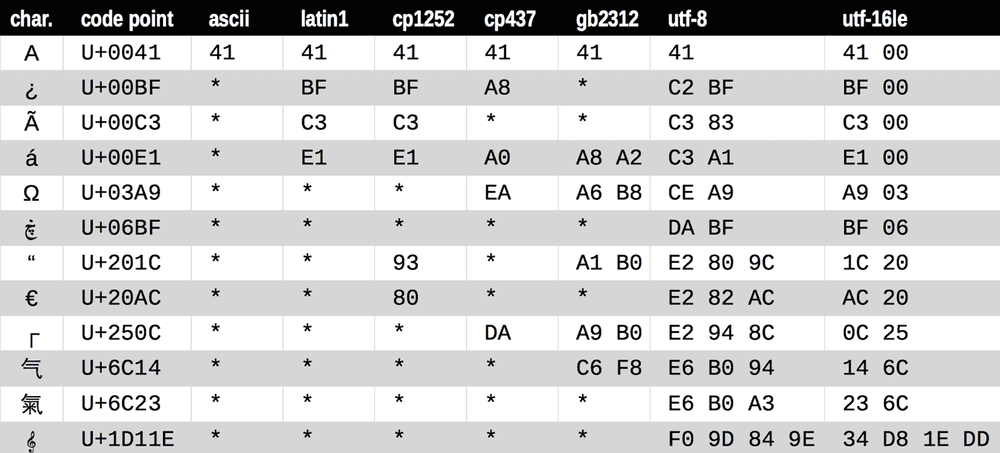
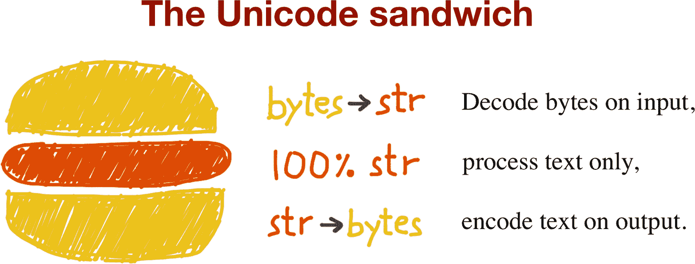
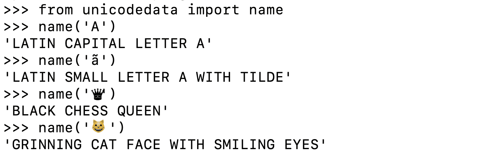
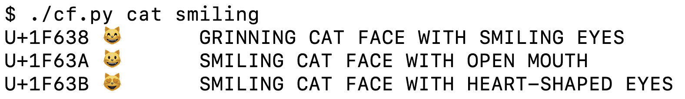
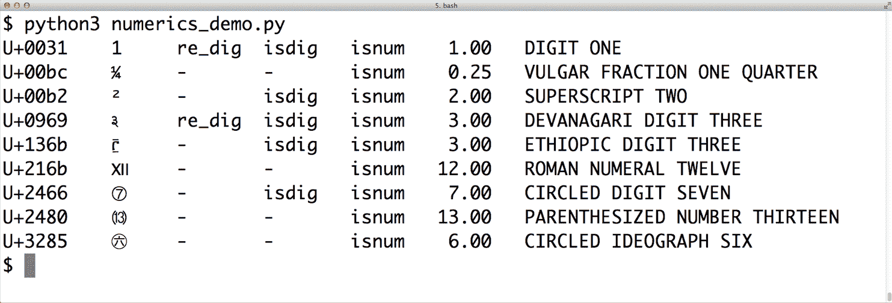
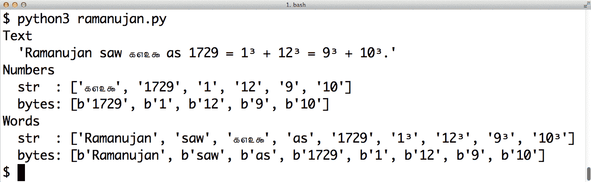

# 第四章：Unicode 文本与字节

> 人类使用文本。计算机使用字节。
> 
> Esther Nam 和 Travis Fischer，“Python 中的字符编码和 Unicode”¹

Python 3 引入了人类文本字符串和原始字节序列之间的明显区别。将字节序列隐式转换为 Unicode 文本已经成为过去。本章涉及 Unicode 字符串、二进制序列以及用于在它们之间转换的编码。

根据您在 Python 中的工作类型，您可能认为理解 Unicode 并不重要。这不太可能，但无论如何，无法避免`str`与`byte`之间的分歧。作为奖励，您会发现专门的二进制序列类型提供了 Python 2 通用`str`类型没有的功能。

在本章中，我们将讨论以下主题：

+   字符、代码点和字节表示

+   二进制序列的独特特性：`bytes`、`bytearray`和`memoryview`

+   完整 Unicode 和传统字符集的编码

+   避免和处理编码错误

+   处理文本文件时的最佳实践

+   默认编码陷阱和标准 I/O 问题

+   使用规范化进行安全的 Unicode 文本比较

+   用于规范化、大小写折叠和强制去除变音符号的实用函数

+   使用`locale`和*pyuca*库正确对 Unicode 文本进行排序

+   Unicode 数据库中的字符元数据

+   处理`str`和`bytes`的双模式 API

# 本章新内容

Python 3 中对 Unicode 的支持是全面且稳定的，因此最值得注意的新增内容是“按名称查找字符”，描述了一种用于搜索 Unicode 数据库的实用程序——这是从命令行查找带圈数字和微笑猫的好方法。

值得一提的一项较小更改是关于 Windows 上的 Unicode 支持，自 Python 3.6 以来更好且更简单，我们将在“注意编码默认值”中看到。

让我们从不那么新颖但基础的概念开始，即字符、代码点和字节。

###### 注意

对于第二版，我扩展了关于`struct`模块的部分，并在[*fluentpython.com*](http://fluentpython.com)的伴随网站上发布了在线版本[“使用 struct 解析二进制记录”](https://fpy.li/4-3)。

在那里，您还会发现[“构建多字符表情符号”](https://fpy.li/4-4)，描述如何通过组合 Unicode 字符制作国旗、彩虹旗、不同肤色的人以及多样化家庭图标。

# 字符问题

“字符串”的概念足够简单：字符串是字符序列。问题在于“字符”的定义。

在 2021 年，我们对“字符”的最佳定义是 Unicode 字符。因此，我们从 Python 3 的`str`中获取的项目是 Unicode 字符，就像在 Python 2 中的`unicode`对象中获取的项目一样——而不是从 Python 2 的`str`中获取的原始字节。

Unicode 标准明确将字符的身份与特定字节表示分开：

+   字符的身份——其*代码点*——是从 0 到 1,114,111（十进制）的数字，在 Unicode 标准中显示为带有“U+”前缀的 4 到 6 位十六进制数字，从 U+0000 到 U+10FFFF。例如，字母 A 的代码点是 U+0041，欧元符号是 U+20AC，音乐符号 G 谱号分配给代码点 U+1D11E。在 Unicode 13.0.0 中，约 13%的有效代码点有字符分配给它们，这是 Python 3.10.0b4 中使用的标准。 

+   表示字符的实际字节取决于正在使用的*编码*。编码是一种将代码点转换为字节序列及其反向转换的算法。字母 A（U+0041）的代码点在 UTF-8 编码中被编码为单个字节`\x41`，在 UTF-16LE 编码中被编码为两个字节`\x41\x00`。另一个例子，UTF-8 需要三个字节—`\xe2\x82\xac`—来编码欧元符号（U+20AC），但在 UTF-16LE 中，相同的代码点被编码为两个字节：`\xac\x20`。

从代码点转换为字节是*编码*；从字节转换为代码点是*解码*。参见 示例 4-1。

##### 示例 4-1\. 编码和解码

```py
>>> s = 'café'
>>> len(s)  # ①
4
>>> b = s.encode('utf8')  # ②
>>> b
b'caf\xc3\xa9'  # ③
>>> len(b)  # ④
5
>>> b.decode('utf8')  # ⑤
'café'
```

①

`str` `'café'` 有四个 Unicode 字符。

②

使用 UTF-8 编码将 `str` 编码为 `bytes`。

③

`bytes` 字面量有一个 `b` 前缀。

④

`bytes` `b` 有五个字节（“é”的代码点在 UTF-8 中编码为两个字节）。

⑤

使用 UTF-8 编码将 `bytes` 解码为 `str`。

###### 提示

如果你需要一个记忆辅助来帮助区分 `.decode()` 和 `.encode()`，说服自己字节序列可以是晦涩的机器核心转储，而 Unicode `str` 对象是“人类”文本。因此，将 `bytes` *解码* 为 `str` 以获取可读文本是有意义的，而将 `str` *编码* 为 `bytes` 用于存储或传输也是有意义的。

尽管 Python 3 的 `str` 在很大程度上就是 Python 2 的 `unicode` 类型换了个新名字，但 Python 3 的 `bytes` 并不仅仅是旧的 `str` 更名，还有与之密切相关的 `bytearray` 类型。因此，在进入编码/解码问题之前，值得看一看二进制序列类型。

# 字节要点

新的二进制序列类型在许多方面与 Python 2 的 `str` 不同。首先要知道的是，有两种基本的内置二进制序列类型：Python 3 中引入的不可变 `bytes` 类型和早在 Python 2.6 中添加的可变 `bytearray`。² Python 文档有时使用通用术语“字节字符串”来指代 `bytes` 和 `bytearray`。我避免使用这个令人困惑的术语。

`bytes` 或 `bytearray` 中的每个项都是从 0 到 255 的整数，而不是像 Python 2 的 `str` 中的单个字符字符串。然而，二进制序列的切片始终产生相同类型的二进制序列，包括长度为 1 的切片。参见 示例 4-2。

##### 示例 4-2\. 作为 `bytes` 和 `bytearray` 的五字节序列

```py
>>> cafe = bytes('café', encoding='utf_8')  # ①
>>> cafe
b'caf\xc3\xa9' >>> cafe[0]  # ②
99 >>> cafe[:1]  # ③
b'c' >>> cafe_arr = bytearray(cafe)
>>> cafe_arr  # ④
bytearray(b'caf\xc3\xa9') >>> cafe_arr[-1:]  # ⑤
bytearray(b'\xa9')
```

①

可以从 `str` 构建 `bytes`，并给定一个编码。

②

每个项都是 `range(256)` 中的整数。

③

`bytes` 的切片也是 `bytes` ——即使是单个字节的切片。

④

`bytearray` 没有字面量语法：它们显示为带有 `bytes` 字面量作为参数的 `bytearray()`。

⑤

`bytearray` 的切片也是 `bytearray`。

###### 警告

`my_bytes[0]` 检索一个 `int`，但 `my_bytes[:1]` 返回长度为 1 的 `bytes` 序列，这只是因为我们习惯于 Python 的 `str` 类型，其中 `s[0] == s[:1]`。对于 Python 中的所有其他序列类型，1 项不等于长度为 1 的切片。

尽管二进制序列实际上是整数序列，但它们的字面值表示反映了 ASCII 文本经常嵌入其中的事实。因此，根据每个字节值的不同，使用四种不同的显示方式：

+   对于十进制代码为 32 到 126 的字节——从空格到 `~`（波浪号）——使用 ASCII 字符本身。

+   对于制表符、换行符、回车符和 `\` 对应的字节，使用转义序列 `\t`、`\n`、`\r` 和 `\\`。

+   如果字节序列中同时出现字符串定界符 `'` 和 `"`，则整个序列由 `'` 定界，并且任何 `'` 都会被转义为 `\'`。³

+   对于其他字节值，使用十六进制转义序列（例如，`\x00` 是空字节）。

这就是为什么在 示例 4-2 中你会看到 `b'caf\xc3\xa9'`：前三个字节 `b'caf'` 在可打印的 ASCII 范围内，而最后两个不在范围内。

`bytes`和`bytearray`都支持除了依赖于 Unicode 数据的格式化方法（`format`，`format_map`）和那些依赖于 Unicode 数据的方法（包括`casefold`，`isdecimal`，`isidentifier`，`isnumeric`，`isprintable`和`encode`）之外的所有`str`方法。这意味着您可以使用熟悉的字符串方法，如`endswith`，`replace`，`strip`，`translate`，`upper`等，与二进制序列一起使用——只使用`bytes`而不是`str`参数。此外，如果正则表达式是从二进制序列而不是`str`编译而成，则`re`模块中的正则表达式函数也适用于二进制序列。自 Python 3.5 以来，`%`运算符再次适用于二进制序列。⁴

二进制序列有一个`str`没有的类方法，称为`fromhex`，它通过解析以空格分隔的十六进制数字对构建二进制序列：

```py
>>> bytes.fromhex('31 4B CE A9')
b'1K\xce\xa9'
```

构建`bytes`或`bytearray`实例的其他方法是使用它们的构造函数，并提供：

+   一个`str`和一个`encoding`关键字参数

+   一个可提供值从 0 到 255 的项目的可迭代对象

+   一个实现缓冲区协议的对象（例如，`bytes`，`bytearray`，`memoryview`，`array.array`），它将源对象的字节复制到新创建的二进制序列中

###### 警告

直到 Python 3.5，还可以使用单个整数调用`bytes`或`bytearray`来创建一个以空字节初始化的该大小的二进制序列。这个签名在 Python 3.5 中被弃用，并在 Python 3.6 中被移除。请参阅[PEP 467—二进制序列的次要 API 改进](https://fpy.li/pep467)。

从类似缓冲区的对象构建二进制序列是一个涉及类型转换的低级操作。在示例 4-3 中看到演示。

##### 示例 4-3。从数组的原始数据初始化字节

```py
>>> import array
>>> numbers = array.array('h', [-2, -1, 0, 1, 2])  # ①
>>> octets = bytes(numbers)  # ②
>>> octets
b'\xfe\xff\xff\xff\x00\x00\x01\x00\x02\x00' # ③
```

①

类型码`'h'`创建一个短整数（16 位）的`array`。

②

`octets`保存构成`numbers`的字节的副本。

③

这是代表 5 个短整数的 10 个字节。

从任何类似缓冲区的源创建`bytes`或`bytearray`对象将始终复制字节。相反，`memoryview`对象允许您在二进制数据结构之间共享内存，正如我们在“内存视图”中看到的那样。

在这对 Python 中二进制序列类型的基本探索之后，让我们看看它们如何转换为/从字符串。

# 基本编码器/解码器

Python 发行版捆绑了 100 多个*编解码器*（编码器/解码器），用于文本到字节的转换以及反之。每个编解码器都有一个名称，如`'utf_8'`，通常还有别名，如`'utf8'`，`'utf-8'`和`'U8'`，您可以将其用作函数中的`encoding`参数，如`open()`，`str.encode()`，`bytes.decode()`等。示例 4-4 展示了相同文本编码为三种不同的字节序列。

##### 示例 4-4。使用三种编解码器对字符串“El Niño”进行编码，生成非常不同的字节序列

```py
>>> for codec in ['latin_1', 'utf_8', 'utf_16']:
...     print(codec, 'El Niño'.encode(codec), sep='\t')
...
latin_1 b'El Ni\xf1o'
utf_8   b'El Ni\xc3\xb1o'
utf_16  b'\xff\xfeE\x00l\x00 \x00N\x00i\x00\xf1\x00o\x00'
```

图 4-1 展示了各种编解码器从字符（如字母“A”到 G 大调音符）生成字节的情况。请注意，最后三种编码是可变长度的多字节编码。



###### 图 4-1。十二个字符，它们的代码点以及它们在 7 种不同编码中的字节表示（星号表示该字符无法在该编码中表示）。

图 4-1 中所有那些星号清楚地表明，一些编码，如 ASCII 甚至多字节 GB2312，无法表示每个 Unicode 字符。然而，UTF 编码被设计用于处理每个 Unicode 代码点。

在图 4-1 中显示的编码被选为代表性样本：

`latin1`又称`iso8859_1`

重要，因为它是其他编码的基础，例如`cp1252`和 Unicode 本身（注意`latin1`字节值如何出现在`cp1252`字节和代码点中）。

`cp1252`

由 Microsoft 创建的有用的`latin1`超集，添加了诸如弯引号和€（欧元）等有用符号；一些 Windows 应用程序称其为“ANSI”，但它从未是真正的 ANSI 标准。

`cp437`

IBM PC 的原始字符集，带有绘制框线字符。与`latin1`不兼容，后者出现得更晚。

`gb2312`

用于编码中国大陆使用的简体中文汉字的传统标准；亚洲语言的几种广泛部署的多字节编码之一。

`utf-8`

截至 2021 年 7 月，网络上最常见的 8 位编码远远是 UTF-8，[“W³Techs：网站字符编码使用统计”](https://fpy.li/4-5)声称 97% 的网站使用 UTF-8，这比我在 2014 年 9 月第一版书中写这段话时的 81.4% 要高。

`utf-16le`

UTF 16 位编码方案的一种形式；所有 UTF-16 编码通过称为“代理对”的转义序列支持 U+FFFF 之上的代码点。

###### 警告

UTF-16 在 1996 年取代了原始的 16 位 Unicode 1.0 编码——UCS-2。尽管 UCS-2 自上个世纪以来已被弃用，但仍在许多系统中使用，因为它仅支持到 U+FFFF 的代码点。截至 2021 年，超过 57% 的分配代码点在 U+FFFF 以上，包括所有重要的表情符号。

现在完成了对常见编码的概述，我们将转向处理编码和解码操作中的问题。

# 理解编码/解码问题

尽管存在一个通用的`UnicodeError`异常，Python 报告的错误通常更具体：要么是`UnicodeEncodeError`（将`str`转换为二进制序列时），要么是`UnicodeDecodeError`（将二进制序列读入`str`时）。加载 Python 模块时，如果源编码意外，则还可能引发`SyntaxError`。我们将在接下来的部分展示如何处理所有这些错误。

###### 提示

当遇到 Unicode 错误时，首先要注意异常的确切类型。它是`UnicodeEncodeError`、`UnicodeDecodeError`，还是提到编码问题的其他错误（例如`SyntaxError`）？要解决问题，首先必须理解它。

## 处理 UnicodeEncodeError

大多数非 UTF 编解码器仅处理 Unicode 字符的一小部分。将文本转换为字节时，如果目标编码中未定义字符，则会引发`UnicodeEncodeError`，除非通过向编码方法或函数传递`errors`参数提供了特殊处理。错误处理程序的行为显示在示例 4-5 中。

##### 示例 4-5\. 编码为字节：成功和错误处理

```py
>>> city = 'São Paulo'
>>> city.encode('utf_8')  # ①
b'S\xc3\xa3o Paulo' >>> city.encode('utf_16')
b'\xff\xfeS\x00\xe3\x00o\x00 \x00P\x00a\x00u\x00l\x00o\x00' >>> city.encode('iso8859_1')  # ②
b'S\xe3o Paulo' >>> city.encode('cp437')  # ③
Traceback (most recent call last):
 File "<stdin>", line 1, in <module>
 File "/.../lib/python3.4/encodings/cp437.py", line 12, in encode
    return codecs.charmap_encode(input,errors,encoding_map)
UnicodeEncodeError: 'charmap' codec can't encode character '\xe3' in
position 1: character maps to <undefined> >>> city.encode('cp437', errors='ignore')  # ④
b'So Paulo' >>> city.encode('cp437', errors='replace')  # ⑤
b'S?o Paulo' >>> city.encode('cp437', errors='xmlcharrefreplace')  # ⑥
b'S&#227;o Paulo'
```

①

UTF 编码处理任何`str`。

②

`iso8859_1`也适用于`'São Paulo'`字符串。

③

`cp437` 无法编码`'ã'`（带有波浪符号的“a”）。默认错误处理程序`'strict'`会引发`UnicodeEncodeError`。

④

`error='ignore'`处理程序跳过无法编码的字符；这通常是一个非常糟糕的主意，会导致数据悄悄丢失。

⑤

在编码时，`error='replace'`用`'?'`替换无法编码的字符；数据也会丢失，但用户会得到提示有问题的线索。

⑥

`'xmlcharrefreplace'`用 XML 实体替换无法编码的字符。如果不能使用 UTF，也不能承受数据丢失，这是唯一的选择。

###### 注意

`codecs`错误处理是可扩展的。您可以通过向`codecs.register_error`函数传递名称和错误处理函数来为`errors`参数注册额外的字符串。请参阅[the `codecs.register_error` documentation](https://fpy.li/4-6)。

ASCII 是我所知的所有编码的一个常见子集，因此如果文本完全由 ASCII 字符组成，编码应该总是有效的。Python 3.7 添加了一个新的布尔方法[`str.isascii()`](https://fpy.li/4-7)来检查您的 Unicode 文本是否是 100% 纯 ASCII。如果是，您应该能够在任何编码中将其编码为字节，而不会引发`UnicodeEncodeError`。

## 处理 UnicodeDecodeError

并非每个字节都包含有效的 ASCII 字符，并非每个字节序列都是有效的 UTF-8 或 UTF-16；因此，当您在将二进制序列转换为文本时假定其中一个编码时，如果发现意外字节，则会收到`UnicodeDecodeError`。

另一方面，许多传统的 8 位编码，如`'cp1252'`、`'iso8859_1'`和`'koi8_r'`，能够解码任何字节流，包括随机噪音，而不报告错误。因此，如果您的程序假定了错误的 8 位编码，它将悄悄地解码垃圾数据。

###### 提示

乱码字符被称为 gremlins 或 mojibake（文字化け—日语中的“转换文本”）。

Example 4-6 说明了使用错误的编解码器可能会产生乱码或`UnicodeDecodeError`。

##### 示例 4-6\. 从`str`解码为字节：成功和错误处理

```py
>>> octets = b'Montr\xe9al'  # ①
>>> octets.decode('cp1252')  # ②
'Montréal' >>> octets.decode('iso8859_7')  # ③
'Montrιal' >>> octets.decode('koi8_r')  # ④
'MontrИal' >>> octets.decode('utf_8')  # ⑤
Traceback (most recent call last):
 File "<stdin>", line 1, in <module>
UnicodeDecodeError: 'utf-8' codec can't decode byte 0xe9 in position 5:
invalid continuation byte >>> octets.decode('utf_8', errors='replace')  # ⑥
'Montr�al'
```

①

编码为`latin1`的单词“Montréal”；`'\xe9'`是“é”的字节。

②

使用 Windows 1252 解码有效，因为它是`latin1`的超集。

③

ISO-8859-7 用于希腊语，因此`'\xe9'`字节被错误解释，不会发出错误。

④

KOI8-R 用于俄语。现在`'\xe9'`代表西里尔字母“И”。

⑤

`'utf_8'`编解码器检测到`octets`不是有效的 UTF-8，并引发`UnicodeDecodeError`。

⑥

使用`'replace'`错误处理，`\xe9`会被“�”（代码点 U+FFFD）替换，这是官方的 Unicode `REPLACEMENT CHARACTER`，用于表示未知字符。

## 加载具有意外编码的模块时出现 SyntaxError

UTF-8 是 Python 3 的默认源编码，就像 ASCII 是 Python 2 的默认编码一样。如果加载包含非 UTF-8 数据且没有编码声明的 *.py* 模块，则会收到如下消息：

```py
SyntaxError: Non-UTF-8 code starting with '\xe1' in file ola.py on line
  1, but no encoding declared; see https://python.org/dev/peps/pep-0263/
  for details
```

由于 UTF-8 在 GNU/Linux 和 macOS 系统中被广泛部署，一个可能的情况是在 Windows 上用`cp1252`打开一个 *.py* 文件。请注意，即使在 Windows 的 Python 中，这种错误也会发生，因为 Python 3 源代码在所有平台上的默认编码都是 UTF-8。

要解决这个问题，在文件顶部添加一个魔术`coding`注释，如 Example 4-7 所示。

##### 示例 4-7\. *ola.py*：葡萄牙语中的“Hello, World!”

```py
# coding: cp1252

print('Olá, Mundo!')
```

###### 提示

现在 Python 3 源代码不再限于 ASCII，并且默认使用优秀的 UTF-8 编码，因此对于像`'cp1252'`这样的遗留编码的源代码，最好的“修复”方法是将它们转换为 UTF-8，并且不再使用`coding`注释。如果您的编辑器不支持 UTF-8，那么是时候换一个了。

假设您有一个文本文件，无论是源代码还是诗歌，但您不知道其编码。如何检测实际的编码？答案在下一节中。

## 如何发现字节序列的编码

如何找到字节序列的编码？简短回答：你无法。你必须被告知。

一些通信协议和文件格式，比如 HTTP 和 XML，包含明确告诉我们内容如何编码的头部。你可以确定一些字节流不是 ASCII，因为它们包含超过 127 的字节值，而 UTF-8 和 UTF-16 的构建方式也限制了可能的字节序列。

然而，考虑到人类语言也有其规则和限制，一旦假定一系列字节是人类*纯文本*，可能可以通过启发式和统计方法来嗅探其编码。例如，如果`b'\x00'`字节很常见，那么它可能是 16 位或 32 位编码，而不是 8 位方案，因为纯文本中的空字符是错误的。当字节序列`b'\x20\x00'`经常出现时，更可能是 UTF-16LE 编码中的空格字符（U+0020），而不是晦涩的 U+2000 `EN QUAD`字符—不管那是什么。

这就是包[“Chardet—通用字符编码检测器”](https://fpy.li/4-8)是如何工作的，猜测其中的一个支持的 30 多种编码。*Chardet*是一个你可以在程序中使用的 Python 库，但也包括一个命令行实用程序，`chardetect`。这是它在本章源文件上报告的内容：

```py
$ chardetect 04-text-byte.asciidoc
04-text-byte.asciidoc: utf-8 with confidence 0.99
```

尽管编码文本的二进制序列通常不包含其编码的明确提示，但 UTF 格式可能在文本内容前面添加字节顺序标记。接下来将对此进行解释。

## BOM：一个有用的小精灵

在示例 4-4 中，你可能已经注意到 UTF-16 编码序列开头有一对额外的字节。这里再次展示：

```py
>>> u16 = 'El Niño'.encode('utf_16')
>>> u16
b'\xff\xfeE\x00l\x00 \x00N\x00i\x00\xf1\x00o\x00'
```

这些字节是`b'\xff\xfe'`。这是一个*BOM*—字节顺序标记—表示进行编码的 Intel CPU 的“小端”字节顺序。

在小端机器上，对于每个代码点，最低有效字节先出现：字母`'E'`，代码点 U+0045（十进制 69），在字节偏移 2 和 3 中编码为`69`和`0`：

```py
>>> list(u16)
[255, 254, 69, 0, 108, 0, 32, 0, 78, 0, 105, 0, 241, 0, 111, 0]
```

在大端 CPU 上，编码会被颠倒；`'E'`会被编码为`0`和`69`。

为了避免混淆，UTF-16 编码在要编码的文本前面加上特殊的不可见字符`零宽不换行空格`（U+FEFF）。在小端系统上，它被编码为`b'\xff\xfe'`（十进制 255，254）。因为按设计，Unicode 中没有 U+FFFE 字符，字节序列`b'\xff\xfe'`必须表示小端编码中的`零宽不换行空格`，所以编解码器知道要使用哪种字节顺序。

有一种 UTF-16 的变体——UTF-16LE，明确是小端的，另一种是明确是大端的，UTF-16BE。如果使用它们，就不会生成 BOM：

```py
>>> u16le = 'El Niño'.encode('utf_16le')
>>> list(u16le)
[69, 0, 108, 0, 32, 0, 78, 0, 105, 0, 241, 0, 111, 0]
>>> u16be = 'El Niño'.encode('utf_16be')
>>> list(u16be)
[0, 69, 0, 108, 0, 32, 0, 78, 0, 105, 0, 241, 0, 111]
```

如果存在 BOM，应该由 UTF-16 编解码器过滤，这样你只会得到文件的实际文本内容，而不包括前导的`零宽不换行空格`。Unicode 标准规定，如果一个文件是 UTF-16 且没有 BOM，应该假定为 UTF-16BE（大端）。然而，Intel x86 架构是小端的，因此在实际中有很多没有 BOM 的小端 UTF-16。

这整个字节序问题只影响使用多字节的编码，比如 UTF-16 和 UTF-32。UTF-8 的一个重要优势是，无论机器的字节序如何，它都会产生相同的字节序列，因此不需要 BOM。然而，一些 Windows 应用程序（特别是记事本）仍然会向 UTF-8 文件添加 BOM—Excel 依赖 BOM 来检测 UTF-8 文件，否则它会假定内容是用 Windows 代码页编码的。Python 的编解码器注册表中称带有 BOM 的 UTF-8 编码为 UTF-8-SIG。UTF-8-SIG 中编码的字符 U+FEFF 是三字节序列`b'\xef\xbb\xbf'`。因此，如果一个文件以这三个字节开头，很可能是带有 BOM 的 UTF-8 文件。

# Caleb 关于 UTF-8-SIG 的提示

技术审查员之一 Caleb Hattingh 建议在读取 UTF-8 文件时始终使用 UTF-8-SIG 编解码器。这是无害的，因为 UTF-8-SIG 可以正确读取带或不带 BOM 的文件，并且不会返回 BOM 本身。在写入时，我建议为了一般的互操作性使用 UTF-8。例如，如果 Python 脚本以 `#!/usr/bin/env python3` 开头，可以在 Unix 系统中使其可执行。文件的前两个字节必须是 `b'#!'` 才能正常工作，但 BOM 打破了这个约定。如果有特定要求需要将数据导出到需要 BOM 的应用程序中，请使用 UTF-8-SIG，但请注意 Python 的 [编解码器文档](https://fpy.li/4-9) 表示：“在 UTF-8 中，不鼓励使用 BOM，通常应避免使用。”

现在我们转向在 Python 3 中处理文本文件。

# 处理文本文件

处理文本 I/O 的最佳实践是“Unicode 三明治”（图 4-2）。⁵ 这意味着 `bytes` 应尽早解码为 `str`（例如，在打开文件进行读取时）。三明治的“馅料”是程序的业务逻辑，在这里文本处理完全在 `str` 对象上进行。您永远不应该在其他处理过程中进行编码或解码。在输出时，`str` 应尽可能晚地编码为 `bytes`。大多数 Web 框架都是这样工作的，当使用它们时我们很少接触 `bytes`。例如，在 Django 中，您的视图应输出 Unicode `str`；Django 本身负责将响应编码为 `bytes`，默认使用 UTF-8。

Python 3 更容易遵循 Unicode 三明治的建议，因为内置的 `open()` 在读取和写入文本模式文件时进行必要的解码和编码，因此从 `my_file.read()` 获取的内容并传递给 `my_file.write(text)` 的都是 `str` 对象。

因此，使用文本文件似乎很简单。但是，如果依赖默认编码，您将受到影响。



###### 图 4-2\. Unicode 三明治：文本处理的当前最佳实践。

考虑 示例 4-8 中的控制台会话。您能发现 bug 吗？

##### 示例 4-8\. 平台编码问题（如果您在自己的计算机上尝试此操作，可能会看到问题，也可能不会）

```py
>>> open('cafe.txt', 'w', encoding='utf_8').write('café')
4
>>> open('cafe.txt').read()
'café'
```

Bug：我在写入文件时指定了 UTF-8 编码，但在读取文件时未这样做，因此 Python 假定 Windows 默认文件编码为代码页 1252，并且文件中的尾随字节被解码为字符 `'é'` 而不是 `'é'`。

我在 Windows 10（版本 18363）上运行了 Python 3.8.1 64 位上的 示例 4-8。在最近的 GNU/Linux 或 macOS 上运行相同的语句完全正常，因为它们的默认编码是 UTF-8，给人一种一切正常的假象。如果在打开文件进行写入时省略了编码参数，将使用区域设置的默认编码，我们将使用相同的编码正确读取文件。但是，这个脚本将根据平台或甚至相同平台中的区域设置生成具有不同字节内容的文件，从而创建兼容性问题。

###### 提示

必须在多台机器上运行或在多个场合上运行的代码绝不能依赖于编码默认值。在打开文本文件时始终传递显式的 `encoding=` 参数，因为默认值可能会从一台机器变为另一台机器，或者从一天变为另一天。

示例 4-8 中一个有趣的细节是，第一条语句中的 `write` 函数报告写入了四个字符，但在下一行读取了五个字符。示例 4-9 是 示例 4-8 的扩展版本，解释了这个问题和其他细节。

##### 示例 4-9\. 仔细检查在 Windows 上运行的 示例 4-8 中的 bug 以及如何修复它

```py
>>> fp = open('cafe.txt', 'w', encoding='utf_8')
>>> fp  # ①
<_io.TextIOWrapper name='cafe.txt' mode='w' encoding='utf_8'> >>> fp.write('café')  # ②
4 >>> fp.close()
>>> import os
>>> os.stat('cafe.txt').st_size  # ③
5 >>> fp2 = open('cafe.txt')
>>> fp2  # ④
<_io.TextIOWrapper name='cafe.txt' mode='r' encoding='cp1252'> >>> fp2.encoding  # ⑤
'cp1252' >>> fp2.read() # ⑥
'café' >>> fp3 = open('cafe.txt', encoding='utf_8')  # ⑦
>>> fp3
<_io.TextIOWrapper name='cafe.txt' mode='r' encoding='utf_8'> >>> fp3.read() # ⑧
'café' >>> fp4 = open('cafe.txt', 'rb')  # ⑨
>>> fp4                           # ⑩
<_io.BufferedReader name='cafe.txt'> >>> fp4.read()  ⑪
b'caf\xc3\xa9'
```

①

默认情况下，`open`使用文本模式并返回一个具有特定编码的`TextIOWrapper`对象。

②

`TextIOWrapper`上的`write`方法返回写入的 Unicode 字符数。

③

`os.stat`显示文件有 5 个字节；UTF-8 将`'é'`编码为 2 个字节，0xc3 和 0xa9。

④

打开一个没有明确编码的文本文件会返回一个`TextIOWrapper`，其编码设置为来自区域设置的默认值。

⑤

`TextIOWrapper`对象有一个编码属性，可以进行检查：在这种情况下是`cp1252`。

⑥

在 Windows 的`cp1252`编码中，字节 0xc3 是“Ô（带波浪符的 A），0xa9 是版权符号。

⑦

使用正确的编码打开相同的文件。

⑧

预期结果：对于`'café'`相同的四个 Unicode 字符。

⑨

`'rb'`标志以二进制模式打开文件进行读取。

⑩

返回的对象是`BufferedReader`而不是`TextIOWrapper`。

⑪

读取返回的是字节，符合预期。

###### 提示

除非需要分析文件内容以确定编码，否则不要以二进制模式打开文本文件——即使这样，你应该使用 Chardet 而不是重复造轮子（参见“如何发现字节序列的编码”）。普通代码应该只使用二进制模式打开二进制文件，如光栅图像。

Example 4-9 中的问题涉及依赖默认设置打开文本文件。如下一节所示，有几个来源可以提供这些默认值。

## 警惕编码默认值

几个设置影响 Python 中 I/O 的编码默认值。查看 Example 4-10 中的*default_encodings.py*脚本。

##### Example 4-10\. 探索编码默认值

```py
import locale
import sys

expressions = """
 locale.getpreferredencoding()
 type(my_file)
 my_file.encoding
 sys.stdout.isatty()
 sys.stdout.encoding
 sys.stdin.isatty()
 sys.stdin.encoding
 sys.stderr.isatty()
 sys.stderr.encoding
 sys.getdefaultencoding()
 sys.getfilesystemencoding()
 """

my_file = open('dummy', 'w')

for expression in expressions.split():
    value = eval(expression)
    print(f'{expression:>30} -> {value!r}')
```

Example 4-10 在 GNU/Linux（Ubuntu 14.04 至 19.10）和 macOS（10.9 至 10.14）上的输出是相同的，显示`UTF-8`在这些系统中随处可用：

```py
$ python3 default_encodings.py
 locale.getpreferredencoding() -> 'UTF-8'
                 type(my_file) -> <class '_io.TextIOWrapper'>
              my_file.encoding -> 'UTF-8'
           sys.stdout.isatty() -> True
           sys.stdout.encoding -> 'utf-8'
            sys.stdin.isatty() -> True
            sys.stdin.encoding -> 'utf-8'
           sys.stderr.isatty() -> True
           sys.stderr.encoding -> 'utf-8'
      sys.getdefaultencoding() -> 'utf-8'
   sys.getfilesystemencoding() -> 'utf-8'
```

然而，在 Windows 上，输出是 Example 4-11。

##### Example 4-11\. Windows 10 PowerShell 上的默认编码（在 cmd.exe 上输出相同）

```py
> chcp  # ①
Active code page: 437
> python default_encodings.py  # ②
 locale.getpreferredencoding() -> 'cp1252'  # ③
                 type(my_file) -> <class '_io.TextIOWrapper'>
              my_file.encoding -> 'cp1252'  # ④
           sys.stdout.isatty() -> True      # ⑤
           sys.stdout.encoding -> 'utf-8'   # ⑥
            sys.stdin.isatty() -> True
            sys.stdin.encoding -> 'utf-8'
           sys.stderr.isatty() -> True
           sys.stderr.encoding -> 'utf-8'
      sys.getdefaultencoding() -> 'utf-8'
   sys.getfilesystemencoding() -> 'utf-8'
```

①

`chcp`显示控制台的活动代码页为`437`。

②

运行*default_encodings.py*并输出到控制台。

③

`locale.getpreferredencoding()`是最重要的设置。

④

文本文件默认使用`locale.getpreferredencoding()`。

⑤

输出将发送到控制台，因此`sys.stdout.isatty()`为`True`。

⑥

现在，`sys.stdout.encoding`与`chcp`报告的控制台代码页不同！

Windows 本身以及 Python 针对 Windows 的 Unicode 支持在我写这本书的第一版之后变得更好了。示例 4-11 曾经在 Windows 7 上的 Python 3.4 中报告了四种不同的编码。`stdout`、`stdin`和`stderr`的编码曾经与`chcp`命令报告的活动代码页相同，但现在由于 Python 3.6 中实现的[PEP 528—将 Windows 控制台编码更改为 UTF-8](https://fpy.li/pep528)，以及*cmd.exe*中的 PowerShell 中的 Unicode 支持（自 2018 年 10 月的 Windows 1809 起）。⁶ 当`stdout`写入控制台时，`chcp`和`sys.stdout.encoding`说不同的事情是很奇怪的，但现在我们可以在 Windows 上打印 Unicode 字符串而不会出现编码错误——除非用户将输出重定向到文件，正如我们很快将看到的。这并不意味着所有你喜欢的表情符号都会出现在控制台中：这也取决于控制台使用的字体。

另一个变化是[PEP 529—将 Windows 文件系统编码更改为 UTF-8](https://fpy.li/pep529)，也在 Python 3.6 中实现，将文件系统编码（用于表示目录和文件名称）从微软专有的 MBCS 更改为 UTF-8。

然而，如果示例 4-10 的输出被重定向到文件，就像这样：

```py
Z:\>python default_encodings.py > encodings.log
```

然后，`sys.stdout.isatty()`的值变为`False`，`sys.stdout.encoding`由`locale.getpreferredencoding()`设置，在该机器上为`'cp1252'`—但`sys.stdin.encoding`和`sys.stderr.encoding`仍然为`utf-8`。

###### 提示

在示例 4-12 中，我使用`'\N{}'`转义来表示 Unicode 文字，其中我们在`\N{}`内写入字符的官方名称。这样做相当冗长，但明确且安全：如果名称不存在，Python 会引发`SyntaxError`——比起写一个可能错误的十六进制数，这样做要好得多，但你只能在很久以后才会发现。你可能想要写一个解释字符代码的注释，所以`\N{}`的冗长是容易接受的。

这意味着像示例 4-12 这样的脚本在打印到控制台时可以正常工作，但在输出被重定向到文件时可能会出现问题。

##### 示例 4-12\. stdout_check.py

```py
import sys
from unicodedata import name

print(sys.version)
print()
print('sys.stdout.isatty():', sys.stdout.isatty())
print('sys.stdout.encoding:', sys.stdout.encoding)
print()

test_chars = [
    '\N{HORIZONTAL ELLIPSIS}',       # exists in cp1252, not in cp437
    '\N{INFINITY}',                  # exists in cp437, not in cp1252
    '\N{CIRCLED NUMBER FORTY TWO}',  # not in cp437 or in cp1252
]

for char in test_chars:
    print(f'Trying to output {name(char)}:')
    print(char)
```

示例 4-12 显示了`sys.stdout.isatty()`的结果，`sys.​stdout.encoding`的值，以及这三个字符：

+   `'…'` `HORIZONTAL ELLIPSIS`—存在于 CP 1252 中，但不存在于 CP 437 中。

+   `'∞'` `INFINITY`—存在于 CP 437 中，但不存在于 CP 1252 中。

+   `'㊷'` `CIRCLED NUMBER FORTY TWO`—在 CP 1252 或 CP 437 中不存在。

当我在 PowerShell 或*cmd.exe*上运行*stdout_check.py*时，它的运行情况如图 4-3 所示。


###### 图 4-3\. 在 PowerShell 上运行*stdout_check.py*。

尽管`chcp`报告活动代码为 437，但`sys.stdout.encoding`为 UTF-8，因此`HORIZONTAL ELLIPSIS`和`INFINITY`都能正确输出。`CIRCLED NUMBER FORTY TWO`被一个矩形替换，但不会引发错误。可能它被识别为有效字符，但控制台字体没有显示它的字形。

然而，当我将*stdout_check.py*的输出重定向到文件时，我得到了图 4-4。


###### 图 4-4\. 在 PowerShell 上运行*stdout_check.py*，重定向输出。

图 4-4 展示的第一个问题是`UnicodeEncodeError`，提到字符`'\u221e'`，因为`sys.stdout.encoding`是`'cp1252'`—一个不包含`INFINITY`字符的代码页。

使用`type`命令读取*out.txt*，或者使用 Windows 编辑器如 VS Code 或 Sublime Text，显示的不是水平省略号，而是`'à'`（带重音的拉丁小写字母 A）。事实证明，在 CP 1252 中，字节值 0x85 表示`'…'`，但在 CP 437 中，相同的字节值代表`'à'`。因此，似乎活动代码页确实很重要，但并不是以明智或有用的方式，而是作为糟糕的 Unicode 经历的部分解释。

###### 注意

我使用配置为美国市场的笔记本电脑，运行 Windows 10 OEM 来运行这些实验。为其他国家本地化的 Windows 版本可能具有不同的编码配置。例如，在巴西，Windows 控制台默认使用代码页 850，而不是 437。

为了总结这个令人疯狂的默认编码问题，让我们最后看一下示例 4-11 中的不同编码：

+   如果在打开文件时省略`encoding`参数，则默认值由`locale.getpreferredencoding()`给出（在示例 4-11 中为`'cp1252'`）。

+   在 Python 3.6 之前，`sys.stdout|stdin|stderr`的编码是由[`PYTHONIOENCODING`](https://fpy.li/4-12)环境变量设置的，现在该变量被忽略，除非[`PYTHONLEGACYWINDOWSSTDIO`](https://fpy.li/4-13)设置为非空字符串。否则，标准 I/O 的编码对于交互式 I/O 是 UTF-8，或者如果输出/输入被重定向到/从文件，则由`locale.getpreferredencoding()`定义。

+   `sys.getdefaultencoding()`在 Python 中用于二进制数据与`str`之间的隐式转换。不支持更改此设置。

+   `sys.getfilesystemencoding()`用于对文件名进行编码/解码（而不是文件内容）。当`open()`以`str`参数作为文件名时使用它；如果文件名以`bytes`参数给出，则不做更改地传递给操作系统 API。

###### 注意

在 GNU/Linux 和 macOS 上，默认情况下，所有这些编码都设置为 UTF-8，已经有好几年了，因此 I/O 处理所有 Unicode 字符。在 Windows 上，不仅在同一系统中使用不同的编码，而且通常是像`'cp850'`或`'cp1252'`这样只支持 ASCII 的代码页，还有 127 个额外字符，这些字符在不同编码之间并不相同。因此，Windows 用户更有可能遇到编码错误，除非他们特别小心。

总结一下，最重要的编码设置是由`locale.getpreferredencoding()`返回的：它是打开文本文件和当`sys.stdout/stdin/stderr`被重定向到文件时的默认值。然而，[文档](https://fpy.li/4-14)部分内容如下：

> `locale.getpreferredencoding(do_setlocale=True)`
> 
> 根据用户偏好返回用于文本数据的编码。用户偏好在不同系统上表达方式不同，有些系统可能无法以编程方式获取，因此此函数只返回一个猜测。[…]

因此，关于编码默认值的最佳建议是：不要依赖于它们。

如果您遵循 Unicode 三明治的建议并始终明确指定程序中的编码，您将避免很多痛苦。不幸的是，即使您将您的`bytes`正确转换为`str`，Unicode 也是令人头痛的。接下来的两节涵盖了在 ASCII 领域简单的主题，在 Unicode 行星上变得非常复杂的文本规范化（即将文本转换为用于比较的统一表示）和排序。

# 为了可靠比较而规范化 Unicode

字符串比较变得复杂的原因在于 Unicode 具有组合字符：附加到前一个字符的变音符号和其他标记，在打印时会显示为一个字符。

例如，单词“café”可以用四个或五个代码点组成，但结果看起来完全相同：

```py
>>> s1 = 'café'
>>> s2 = 'cafe\N{COMBINING ACUTE ACCENT}'
>>> s1, s2
('café', 'café')
>>> len(s1), len(s2)
(4, 5)
>>> s1 == s2
False
```

在“e”后面放置`COMBINING ACUTE ACCENT`（U+0301）会呈现“é”。在 Unicode 标准中，像`'é'`和`'e\u0301'`这样的序列被称为“规范等价物”，应用程序应将它们视为相同。但是 Python 看到两个不同的代码点序列，并认为它们不相等。

解决方案是`unicodedata.normalize()`。该函数的第一个参数是四个字符串之一：`'NFC'`，`'NFD'`，`'NFKC'`和`'NFKD'`。让我们从前两个开始。

规范化形式 C（NFC）将代码点组合以生成最短等效字符串，而 NFD 将分解，将组合字符扩展为基本字符和单独的组合字符。这两种规范化使比较按预期工作，如下一个示例所示：

```py
>>> from unicodedata import normalize
>>> s1 = 'café'
>>> s2 = 'cafe\N{COMBINING ACUTE ACCENT}'
>>> len(s1), len(s2)
(4, 5)
>>> len(normalize('NFC', s1)), len(normalize('NFC', s2))
(4, 4)
>>> len(normalize('NFD', s1)), len(normalize('NFD', s2))
(5, 5)
>>> normalize('NFC', s1) == normalize('NFC', s2)
True
>>> normalize('NFD', s1) == normalize('NFD', s2)
True
```

键盘驱动程序通常生成组合字符，因此用户输入的文本默认情况下将是 NFC。但是，为了安全起见，在保存之前最好使用`normalize('NFC', user_text)`对字符串进行规范化。NFC 也是 W3C 在[“全球网络字符模型：字符串匹配和搜索”](https://fpy.li/4-15)中推荐的规范化形式。

一些单个字符被 NFC 规范化为另一个单个字符。电阻单位欧姆（Ω）的符号被规范化为希腊大写 omega。它们在视觉上是相同的，但它们比较不相等，因此规范化是必不可少的，以避免意外：

```py
>>> from unicodedata import normalize, name
>>> ohm = '\u2126'
>>> name(ohm)
'OHM SIGN'
>>> ohm_c = normalize('NFC', ohm)
>>> name(ohm_c)
'GREEK CAPITAL LETTER OMEGA'
>>> ohm == ohm_c
False
>>> normalize('NFC', ohm) == normalize('NFC', ohm_c)
True
```

另外两种规范化形式是 NFKC 和 NFKD，其中字母 K 代表“兼容性”。这些是更强的规范化形式，影响所谓的“兼容性字符”。尽管 Unicode 的一个目标是为每个字符有一个单一的“规范”代码点，但一些字符出现多次是为了与现有标准兼容。例如，`MICRO SIGN`，`µ`（`U+00B5`），被添加到 Unicode 以支持与包括它在内的`latin1`的往返转换，即使相同的字符是希腊字母表的一部分，具有代码点`U+03BC`（`GREEK SMALL LETTER MU`）。因此，微符号被视为“兼容性字符”。

在 NFKC 和 NFKD 形式中，每个兼容字符都被一个或多个字符的“兼容分解”替换，这些字符被认为是“首选”表示，即使存在一些格式损失——理想情况下，格式应该由外部标记负责，而不是 Unicode 的一部分。举例来说，一个半分数`'½'`（`U+00BD`）的兼容分解是三个字符的序列`'1/2'`，而微符号`'µ'`（`U+00B5`）的兼容分解是小写的希腊字母 mu`'μ'`（`U+03BC`）。⁷

下面是 NFKC 在实践中的工作方式：

```py
>>> from unicodedata import normalize, name
>>> half = '\N{VULGAR FRACTION ONE HALF}'
>>> print(half)
½
>>> normalize('NFKC', half)
'1⁄2'
>>> for char in normalize('NFKC', half):
...     print(char, name(char), sep='\t')
...
1	DIGIT ONE
⁄	FRACTION SLASH
2	DIGIT TWO
>>> four_squared = '4²'
>>> normalize('NFKC', four_squared)
'42'
>>> micro = 'µ'
>>> micro_kc = normalize('NFKC', micro)
>>> micro, micro_kc
('µ', 'μ')
>>> ord(micro), ord(micro_kc)
(181, 956)
>>> name(micro), name(micro_kc)
('MICRO SIGN', 'GREEK SMALL LETTER MU')
```

尽管`'1⁄2'`是`'½'`的一个合理替代品，而微符号实际上是一个小写希腊字母 mu，但将`'4²'`转换为`'42'`会改变含义。一个应用程序可以将`'4²'`存储为`'4<sup>2</sup>'`，但`normalize`函数对格式一无所知。因此，NFKC 或 NFKD 可能会丢失或扭曲信息，但它们可以生成方便的中间表示形式用于搜索和索引。

不幸的是，对于 Unicode 来说，一切总是比起初看起来更加复杂。对于`VULGAR FRACTION ONE HALF`，NFKC 规范化产生了用`FRACTION SLASH`连接的 1 和 2，而不是`SOLIDUS`，即“斜杠”—ASCII 代码十进制 47 的熟悉字符。因此，搜索三字符 ASCII 序列`'1/2'`将找不到规范化的 Unicode 序列。

###### 警告

NFKC 和 NFKD 规范会导致数据丢失，应仅在特殊情况下如搜索和索引中应用，而不是用于文本的永久存储。

当准备文本进行搜索或索引时，另一个有用的操作是大小写折叠，我们的下一个主题。

## 大小写折叠

大小写折叠基本上是将所有文本转换为小写，还有一些额外的转换。它由`str.casefold()`方法支持。

对于只包含 `latin1` 字符的任何字符串 `s`，`s.casefold()` 产生与 `s.lower()` 相同的结果，只有两个例外——微符号 `'µ'` 被更改为希腊小写 mu（在大多数字体中看起来相同），德语 Eszett 或 “sharp s”（ß）变为 “ss”：

```py
>>> micro = 'µ'
>>> name(micro)
'MICRO SIGN'
>>> micro_cf = micro.casefold()
>>> name(micro_cf)
'GREEK SMALL LETTER MU'
>>> micro, micro_cf
('µ', 'μ')
>>> eszett = 'ß'
>>> name(eszett)
'LATIN SMALL LETTER SHARP S'
>>> eszett_cf = eszett.casefold()
>>> eszett, eszett_cf
('ß', 'ss')
```

有将近 300 个代码点，`str.casefold()` 和 `str.lower()` 返回不同的结果。

和 Unicode 相关的任何事物一样，大小写折叠是一个困难的问题，有很多语言特殊情况，但 Python 核心团队努力提供了一个解决方案，希望能适用于大多数用户。

在接下来的几节中，我们将利用我们的规范化知识开发实用函数。

## 用于规范化文本匹配的实用函数

正如我们所见，NFC 和 NFD 是安全的，并允许在 Unicode 字符串之间进行明智的比较。对于大多数应用程序，NFC 是最佳的规范化形式。`str.casefold()` 是进行不区分大小写比较的方法。

如果您使用多种语言的文本，像 示例 4-13 中的 `nfc_equal` 和 `fold_equal` 这样的一对函数对您的工具箱是有用的补充。

##### 示例 4-13\. normeq.py: 规范化的 Unicode 字符串比较

```py
"""
Utility functions for normalized Unicode string comparison.

Using Normal Form C, case sensitive:

 >>> s1 = 'café'
 >>> s2 = 'cafe\u0301'
 >>> s1 == s2
 False
 >>> nfc_equal(s1, s2)
 True
 >>> nfc_equal('A', 'a')
 False

Using Normal Form C with case folding:

 >>> s3 = 'Straße'
 >>> s4 = 'strasse'
 >>> s3 == s4
 False
 >>> nfc_equal(s3, s4)
 False
 >>> fold_equal(s3, s4)
 True
 >>> fold_equal(s1, s2)
 True
 >>> fold_equal('A', 'a')
 True

"""

from unicodedata import normalize

def nfc_equal(str1, str2):
    return normalize('NFC', str1) == normalize('NFC', str2)

def fold_equal(str1, str2):
    return (normalize('NFC', str1).casefold() ==
            normalize('NFC', str2).casefold())
```

超出 Unicode 标准中的规范化和大小写折叠之外，有时候进行更深层次的转换是有意义的，比如将 `'café'` 改为 `'cafe'`。我们将在下一节看到何时以及如何进行。

## 极端的“规范化”：去除变音符号

谷歌搜索的秘密酱包含许多技巧，但其中一个显然是忽略变音符号（例如，重音符号、锐音符等），至少在某些情况下是这样。去除变音符号并不是一种适当的规范化形式，因为它经常改变单词的含义，并且在搜索时可能产生误报。但它有助于应对生活中的一些事实：人们有时懒惰或无知于正确使用变音符号，拼写规则随时间变化，这意味着重音符号在活语言中来来去去。

除了搜索之外，去除变音符号还可以使 URL 更易读，至少在基于拉丁语言的语言中是这样。看看关于圣保罗市的维基百科文章的 URL：

```py
https://en.wikipedia.org/wiki/S%C3%A3o_Paulo
```

`%C3%A3` 部分是 URL 转义的，UTF-8 渲染的单个字母 “ã”（带有波浪符的 “a”）。即使拼写不正确，以下内容也更容易识别：

```py
https://en.wikipedia.org/wiki/Sao_Paulo
```

要从 `str` 中移除所有变音符号，可以使用类似 示例 4-14 的函数。

##### 示例 4-14\. simplify.py: 用于移除所有组合标记的函数

```py
import unicodedata
import string

def shave_marks(txt):
    """Remove all diacritic marks"""
    norm_txt = unicodedata.normalize('NFD', txt)  # ①
    shaved = ''.join(c for c in norm_txt
                     if not unicodedata.combining(c))  # ②
    return unicodedata.normalize('NFC', shaved)  # ③
```

①

将所有字符分解为基本字符和组合标记。

②

过滤掉所有组合标记。

③

重新组合所有字符。

示例 4-15 展示了几种使用 `shave_marks` 的方法。

##### 示例 4-15\. 使用 `shave_marks` 的两个示例，来自 示例 4-14

```py
>>> order = '“Herr Voß: • ½ cup of Œtker™ caffè latte • bowl of açaí.”'
>>> shave_marks(order)
'“Herr Voß: • ½ cup of Œtker™ caffe latte • bowl of acai.”' # ①
>>> Greek = 'Ζέφυρος, Zéfiro'
>>> shave_marks(Greek)
'Ζεφυρος, Zefiro' # ②
```

①

仅字母 “è”、“ç” 和 “í” 被替换。

②

“έ” 和 “é” 都被替换了。

来自 示例 4-14 的函数 `shave_marks` 运行良好，但也许它做得太过了。通常移除变音符号的原因是将拉丁文本更改为纯 ASCII，但 `shave_marks` 也会改变非拉丁字符，比如希腊字母，这些字母仅仅通过失去重音就不会变成 ASCII。因此，有必要分析每个基本字符，并仅在基本字符是拉丁字母时才移除附加标记。这就是 示例 4-16 的作用。

##### 示例 4-16\. 从拉丁字符中移除组合标记的函数（省略了导入语句，因为这是来自 示例 4-14 的 simplify.py 模块的一部分）

```py
def shave_marks_latin(txt):
    """Remove all diacritic marks from Latin base characters"""
    norm_txt = unicodedata.normalize('NFD', txt)  # ①
    latin_base = False
    preserve = []
    for c in norm_txt:
        if unicodedata.combining(c) and latin_base:   # ②
            continue  # ignore diacritic on Latin base char
        preserve.append(c)                            # ③
        # if it isn't a combining char, it's a new base char
        if not unicodedata.combining(c):              # ④
            latin_base = c in string.ascii_letters
    shaved = ''.join(preserve)
    return unicodedata.normalize('NFC', shaved)   # ⑤
```

①

将所有字符分解为基本字符和组合标记。

②

当基本字符为拉丁字符时，跳过组合标记。

③

否则，保留当前字符。

④

检测新的基本字符，并确定它是否为拉丁字符。

⑤

重新组合所有字符。

更激进的一步是将西方文本中的常见符号（例如，卷曲引号、破折号、项目符号等）替换为`ASCII`等效符号。这就是示例 4-17 中的`asciize`函数所做的。

##### 示例 4-17\. 将一些西方排版符号转换为 ASCII（此片段也是示例 4-14 中`simplify.py`的一部分）

```py
single_map = str.maketrans("""‚ƒ„ˆ‹‘’“”•–—˜›""",  # ①
                           """'f"^<''""---~>""")

multi_map = str.maketrans({  # ②
    '€': 'EUR',
    '…': '...',
    'Æ': 'AE',
    'æ': 'ae',
    'Œ': 'OE',
    'œ': 'oe',
    '™': '(TM)',
    '‰': '<per mille>',
    '†': '**',
    '‡': '***',
})

multi_map.update(single_map)  # ③

def dewinize(txt):
    """Replace Win1252 symbols with ASCII chars or sequences"""
    return txt.translate(multi_map)  # ④

def asciize(txt):
    no_marks = shave_marks_latin(dewinize(txt))     # ⑤
    no_marks = no_marks.replace('ß', 'ss')          # ⑥
    return unicodedata.normalize('NFKC', no_marks)  # ⑦
```

①

为字符替换构建映射表。

②

为字符到字符串替换构建映射表。

③

合并映射表。

④

`dewinize`不影响`ASCII`或`latin1`文本，只影响`cp1252`中的 Microsoft 附加内容。

⑤

应用`dewinize`并移除变音符号。

⑥

用“ss”替换 Eszett（我们这里不使用大小写折叠，因为我们想保留大小写）。

⑦

对具有其兼容性代码点的字符进行 NFKC 规范化以组合字符。

示例 4-18 展示了`asciize`的使用。

##### 示例 4-18\. 使用示例 4-17 中的`asciize`的两个示例

```py
>>> order = '“Herr Voß: • ½ cup of Œtker™ caffè latte • bowl of açaí.”'
>>> dewinize(order)
'"Herr Voß: - ½ cup of OEtker(TM) caffè latte - bowl of açaí."' # ①
>>> asciize(order)
'"Herr Voss: - 1⁄2 cup of OEtker(TM) caffe latte - bowl of acai."' # ②
```

①

`dewinize`替换卷曲引号、项目符号和™（商标符号）。

②

`asciize`应用`dewinize`，删除变音符号，并替换`'ß'`。

###### 警告

不同语言有自己的去除变音符号的规则。例如，德语将`'ü'`改为`'ue'`。我们的`asciize`函数不够精细，因此可能不适合您的语言。但对葡萄牙语来说，它的效果还可以接受。

总结一下，在`simplify.py`中的函数远远超出了标准规范化，并对文本进行了深度处理，有可能改变其含义。只有您可以决定是否走得这么远，了解目标语言、您的用户以及转换后的文本将如何使用。

这就结束了我们对规范化 Unicode 文本的讨论。

现在让我们来解决 Unicode 排序问题。

# 对 Unicode 文本进行排序

Python 通过逐个比较每个序列中的项目来对任何类型的序列进行排序。对于字符串，这意味着比较代码点。不幸的是，这对于使用非 ASCII 字符的人来说产生了无法接受的结果。

考虑对在巴西种植的水果列表进行排序：

```py
>>> fruits = ['caju', 'atemoia', 'cajá', 'açaí', 'acerola']
>>> sorted(fruits)
['acerola', 'atemoia', 'açaí', 'caju', 'cajá']
```

不同区域设置的排序规则不同，但在葡萄牙语和许多使用拉丁字母表的语言中，重音符号和塞迪利亚很少在排序时产生差异。⁸ 因此，“cajá”被排序为“caja”，并且必须位于“caju”之前。

排序后的`fruits`列表应为：

```py
['açaí', 'acerola', 'atemoia', 'cajá', 'caju']
```

在 Python 中对非 ASCII 文本进行排序的标准方法是使用`locale.strxfrm`函数，根据[`locale`模块文档](https://fpy.li/4-16)，“将一个字符串转换为可用于区域设置感知比较的字符串”。

要启用`locale.strxfrm`，您必须首先为您的应用程序设置一个合适的区域设置，并祈祷操作系统支持它。示例 4-19 中的命令序列可能适用于您。

##### 示例 4-19\. *locale_sort.py*：使用`locale.strxfrm`函数作为排序键

```py
import locale
my_locale = locale.setlocale(locale.LC_COLLATE, 'pt_BR.UTF-8')
print(my_locale)
fruits = ['caju', 'atemoia', 'cajá', 'açaí', 'acerola']
sorted_fruits = sorted(fruits, key=locale.strxfrm)
print(sorted_fruits)
```

在 GNU/Linux（Ubuntu 19.10）上运行 示例 4-19，安装了 `pt_BR.UTF-8` 区域设置，我得到了正确的结果：

```py
'pt_BR.UTF-8'
['açaí', 'acerola', 'atemoia', 'cajá', 'caju']
```

因此，在排序时需要在使用 `locale.strxfrm` 作为键之前调用 `setlocale(LC_COLLATE, «your_locale»)`。

不过，还有一些注意事项：

+   因为区域设置是全局的，不建议在库中调用 `setlocale`。您的应用程序或框架应该在进程启动时设置区域设置，并且不应该在之后更改它。

+   操作系统必须安装区域设置，否则 `setlocale` 会引发 `locale.Error: unsupported locale setting` 异常。

+   您必须知道如何拼写区域设置名称。

+   区域设置必须由操作系统的制造商正确实现。我在 Ubuntu 19.10 上成功了，但在 macOS 10.14 上没有成功。在 macOS 上，调用 `setlocale(LC_COLLATE, 'pt_BR.UTF-8')` 返回字符串 `'pt_BR.UTF-8'` 而没有任何投诉。但 `sorted(fruits, key=locale.strxfrm)` 产生了与 `sorted(fruits)` 相同的不正确结果。我还在 macOS 上尝试了 `fr_FR`、`es_ES` 和 `de_DE` 区域设置，但 `locale.strxfrm` 从未起作用。⁹

因此，标准库提供的国际化排序解决方案有效，但似乎只在 GNU/Linux 上得到很好的支持（也许在 Windows 上也是如此，如果您是专家的话）。即使在那里，它也依赖于区域设置，会带来部署上的麻烦。

幸运的是，有一个更简单的解决方案：*pyuca* 库，可以在 *PyPI* 上找到。

## 使用 Unicode Collation Algorithm 进行排序

James Tauber，多产的 Django 贡献者，一定感受到了痛苦，并创建了 [*pyuca*](https://fpy.li/4-17)，这是 Unicode Collation Algorithm（UCA）的纯 Python 实现。示例 4-20 展示了它的易用性。

##### 示例 4-20。使用 `pyuca.Collator.sort_key` 方法

```py
>>> import pyuca
>>> coll = pyuca.Collator()
>>> fruits = ['caju', 'atemoia', 'cajá', 'açaí', 'acerola']
>>> sorted_fruits = sorted(fruits, key=coll.sort_key)
>>> sorted_fruits
['açaí', 'acerola', 'atemoia', 'cajá', 'caju']
```

这个方法简单易行，在 GNU/Linux、macOS 和 Windows 上都可以运行，至少在我的小样本中是这样的。

`pyuca` 不考虑区域设置。如果需要自定义排序，可以向 `Collator()` 构造函数提供自定义排序表的路径。默认情况下，它使用 [*allkeys.txt*](https://fpy.li/4-18)，这是项目捆绑的。这只是 [来自 *Unicode.org* 的默认 Unicode Collation Element Table 的副本](https://fpy.li/4-19)。

# PyICU：Miro 的 Unicode 排序推荐

（技术审阅员 Miroslav Šedivý 是一位多语言使用者，也是 Unicode 方面的专家。这是他对 *pyuca* 的评价。）

*pyuca* 有一个排序算法，不考虑各个语言中的排序顺序。例如，在德语中 Ä 在 A 和 B 之间，而在瑞典语中它在 Z 之后。看看 [PyICU](https://fpy.li/4-20)，它像区域设置一样工作，而不会更改进程的区域设置。如果您想要在土耳其语中更改 iİ/ıI 的大小写，也需要它。PyICU 包含一个必须编译的扩展，因此在某些系统中安装可能比只是 Python 的 *pyuca* 更困难。

顺便说一句，那个排序表是组成 Unicode 数据库的许多数据文件之一，我们下一个主题。

# Unicode 数据库

Unicode 标准提供了一个完整的数据库，以几个结构化的文本文件的形式存在，其中不仅包括将代码点映射到字符名称的表，还包括有关各个字符及其相关性的元数据。例如，Unicode 数据库记录了字符是否可打印、是否为字母、是否为十进制数字，或者是否为其他数字符号。这就是 `str` 方法 `isalpha`、`isprintable`、`isdecimal` 和 `isnumeric` 的工作原理。`str.casefold` 也使用了来自 Unicode 表的信息。

###### 注意

`unicodedata.category(char)` 函数从 Unicode 数据库返回 `char` 的两个字母类别。更高级别的 `str` 方法更容易使用。例如，[`label.isalpha()`](https://fpy.li/4-21) 如果 `label` 中的每个字符属于以下类别之一，则返回 `True`：`Lm`、`Lt`、`Lu`、`Ll` 或 `Lo`。要了解这些代码的含义，请参阅英文维基百科的 [“Unicode 字符属性”文章](https://fpy.li/4-23) 中的 [“通用类别”](https://fpy.li/4-22)。 

## 按名称查找字符

`unicodedata` 模块包括检索字符元数据的函数，包括 `unicodedata.name()`，它返回标准中字符的官方名称。图 4-5 展示了该函数的使用。¹⁰



###### 图 4-5\. 在 Python 控制台中探索 `unicodedata.name()`。

您可以使用 `name()` 函数构建应用程序，让用户可以按名称搜索字符。图 4-6 展示了 *cf.py* 命令行脚本，它接受一个或多个单词作为参数，并列出具有这些单词在官方 Unicode 名称中的字符。*cf.py* 的完整源代码在 示例 4-21 中。



###### 图 4-6\. 使用 *cf.py* 查找微笑的猫。

###### 警告

表情符号在各种操作系统和应用程序中的支持差异很大。近年来，macOS 终端提供了最好的表情符号支持，其次是现代 GNU/Linux 图形终端。Windows *cmd.exe* 和 PowerShell 现在支持 Unicode 输出，但截至我在 2020 年 1 月撰写本节时，它们仍然不显示表情符号——至少不是“开箱即用”。技术评论员莱昂纳多·罗查尔告诉我有一个新的、由微软推出的开源 [Windows 终端](https://fpy.li/4-24)，它可能比旧的微软控制台具有更好的 Unicode 支持。我还没有时间尝试。

在 示例 4-21 中，请注意 `find` 函数中的 `if` 语句，使用 `.issubset()` 方法快速测试 `query` 集合中的所有单词是否出现在从字符名称构建的单词列表中。由于 Python 丰富的集合 API，我们不需要嵌套的 `for` 循环和另一个 `if` 来实现此检查。

##### 示例 4-21\. cf.py：字符查找实用程序

```py
#!/usr/bin/env python3
import sys
import unicodedata

START, END = ord(' '), sys.maxunicode + 1           # ①

def find(*query_words, start=START, end=END):       # ②
    query = {w.upper() for w in query_words}        # ③
    for code in range(start, end):
        char = chr(code)                            # ④
        name = unicodedata.name(char, None)         # ⑤
        if name and query.issubset(name.split()):   # ⑥
            print(f'U+{code:04X}\t{char}\t{name}')  # ⑦

def main(words):
    if words:
        find(*words)
    else:
        print('Please provide words to find.')

if __name__ == '__main__':
    main(sys.argv[1:])
```

①

设置搜索的代码点范围的默认值。

②

`find` 接受 `query_words` 和可选的关键字参数来限制搜索范围，以便进行测试。

③

将 `query_words` 转换为大写字符串集合。

④

获取 `code` 的 Unicode 字符。

⑤

获取字符的名称，如果代码点未分配，则返回 `None`。

⑥

如果有名称，将其拆分为单词列表，然后检查 `query` 集合是否是该列表的子集。

⑦

打印出以 `U+9999` 格式的代码点、字符和其名称的行。

`unicodedata` 模块还有其他有趣的函数。接下来，我们将看到一些与获取具有数字含义的字符信息相关的函数。

## 字符的数字含义

`unicodedata` 模块包括函数，用于检查 Unicode 字符是否表示数字，如果是，则返回其人类的数值，而不是其代码点数。示例 4-22 展示了 `unicodedata.name()` 和 `unicodedata.numeric()` 的使用，以及 `str` 的 `.isdecimal()` 和 `.isnumeric()` 方法。

##### 示例 4-22\. Unicode 数据库数字字符元数据演示（标注描述输出中的每列）

```py
import unicodedata
import re

re_digit = re.compile(r'\d')

sample = '1\xbc\xb2\u0969\u136b\u216b\u2466\u2480\u3285'

for char in sample:
    print(f'U+{ord(char):04x}',                       # ①
          char.center(6),                             # ②
          're_dig' if re_digit.match(char) else '-',  # ③
          'isdig' if char.isdigit() else '-',         # ④
          'isnum' if char.isnumeric() else '-',       # ⑤
          f'{unicodedata.numeric(char):5.2f}',        # ⑥
          unicodedata.name(char),                     # ⑦
          sep='\t')
```

①

以`U+0000`格式的代码点。

②

字符在长度为 6 的`str`中居中。

③

如果字符匹配`r'\d'`正则表达式，则显示`re_dig`。

④

如果`char.isdigit()`为`True`，则显示`isdig`。

⑤

如果`char.isnumeric()`为`True`，则显示`isnum`。

⑥

数值格式化为宽度为 5 和 2 位小数。

⑦

Unicode 字符名称。

运行示例 4-22 会给你图 4-7，如果你的终端字体有所有这些字形。



###### 图 4-7\. macOS 终端显示数字字符及其元数据；`re_dig`表示字符匹配正则表达式`r'\d'`。

图 4-7 的第六列是在字符上调用`unicodedata.numeric(char)`的结果。它显示 Unicode 知道代表数字的符号的数值。因此，如果你想创建支持泰米尔数字或罗马数字的电子表格应用程序，就去做吧！

图 4-7 显示正则表达式`r'\d'`匹配数字“1”和梵文数字 3，但不匹配一些其他被`isdigit`函数视为数字的字符。`re`模块对 Unicode 的了解不如它本应该的那样深入。PyPI 上提供的新`regex`模块旨在最终取代`re`，并提供更好的 Unicode 支持。¹¹我们将在下一节回到`re`模块。

在本章中，我们使用了几个`unicodedata`函数，但还有许多我们没有涉及的函数。查看标准库文档中的[`unicodedata`模块](https://fpy.li/4-25)。 

接下来我们将快速查看双模式 API，提供接受`str`或`bytes`参数的函数，并根据类型进行特殊处理。

# 双模式 str 和 bytes API

Python 标准库有接受`str`或`bytes`参数并根据类型表现不同的函数。一些示例可以在`re`和`os`模块中找到。

## 正则表达式中的 str 与 bytes

如果用`bytes`构建正则表达式，模式如`\d`和`\w`只匹配 ASCII 字符；相反，如果这些模式给定为`str`，它们将匹配 ASCII 之外的 Unicode 数字或字母。示例 4-23 和图 4-8 比较了`str`和`bytes`模式如何匹配字母、ASCII 数字、上标和泰米尔数字。

##### 示例 4-23\. ramanujan.py：比较简单`str`和`bytes`正则表达式的行为

```py
import re

re_numbers_str = re.compile(r'\d+')     # ①
re_words_str = re.compile(r'\w+')
re_numbers_bytes = re.compile(rb'\d+')  # ②
re_words_bytes = re.compile(rb'\w+')

text_str = ("Ramanujan saw \u0be7\u0bed\u0be8\u0bef"  # ③
            " as 1729 = 1³ + 12³ = 9³ + 10³.")        # ④

text_bytes = text_str.encode('utf_8')  # ⑤

print(f'Text\n {text_str!r}')
print('Numbers')
print(' str  :', re_numbers_str.findall(text_str))      # ⑥
print(' bytes:', re_numbers_bytes.findall(text_bytes))  # ⑦
print('Words')
print(' str  :', re_words_str.findall(text_str))        # ⑧
print(' bytes:', re_words_bytes.findall(text_bytes))    # ⑨
```

①

前两个正则表达式是`str`类型。

②

最后两个是`bytes`类型。

③

Unicode 文本搜索，包含泰米尔数字`1729`（逻辑行一直延续到右括号标记）。

④

此字符串在编译时与前一个字符串连接（参见[“2.4.2\. 字符串文字连接”](https://fpy.li/4-26)中的*Python 语言参考*）。

⑤

需要使用`bytes`正则表达式来搜索`bytes`字符串。

⑥](#co_unicode_text_versus_bytes_CO15-6)

`str`模式`r'\d+'`匹配泰米尔和 ASCII 数字。

⑦

`bytes`模式`rb'\d+'`仅匹配数字的 ASCII 字节。

⑧

`str`模式`r'\w+'`匹配字母、上标、泰米尔语和 ASCII 数字。

⑨

`bytes`模式`rb'\w+'`仅匹配字母和数字的 ASCII 字节。



###### 图 4-8。从示例 4-23 运行 ramanujan.py 的屏幕截图。

示例 4-23 是一个简单的例子，用来说明一个观点：你可以在`str`和`bytes`上使用正则表达式，但在第二种情况下，ASCII 范围之外的字节被视为非数字和非单词字符。

对于`str`正则表达式，有一个`re.ASCII`标志，使得`\w`、`\W`、`\b`、`\B`、`\d`、`\D`、`\s`和`\S`只执行 ASCII 匹配。详细信息请参阅[re 模块的文档](https://fpy.li/4-27)。

另一个重要的双模块是`os`。

## `os`函数中的 str 与 bytes

GNU/Linux 内核不支持 Unicode，因此在现实世界中，您可能会发现由字节序列组成的文件名，这些文件名在任何明智的编码方案中都无效，并且无法解码为`str`。使用各种操作系统的客户端的文件服务器特别容易出现这个问题。

为了解决这个问题，所有接受文件名或路径名的`os`模块函数都以`str`或`bytes`形式接受参数。如果调用这样的函数时使用`str`参数，参数将自动使用`sys.getfilesystemencoding()`命名的编解码器进行转换，并且 OS 响应将使用相同的编解码器进行解码。这几乎总是您想要的，符合 Unicode 三明治最佳实践。

但是，如果您必须处理（或者可能修复）无法以这种方式处理的文件名，您可以将`bytes`参数传递给`os`函数以获得`bytes`返回值。这个功能让您可以处理任何文件或路径名，无论您可能遇到多少小精灵。请参阅示例 4-24。

##### 示例 4-24。`listdir`使用`str`和`bytes`参数和结果

```py
>>> os.listdir('.')  # ①
['abc.txt', 'digits-of-π.txt'] >>> os.listdir(b'.')  # ②
[b'abc.txt', b'digits-of-\xcf\x80.txt']
```

①

第二个文件名是“digits-of-π.txt”（带有希腊字母π）。

②

给定一个`byte`参数，`listdir`以字节形式返回文件名：`b'\xcf\x80'`是希腊字母π的 UTF-8 编码。

为了帮助处理作为文件名或路径名的`str`或`bytes`序列，`os`模块提供了特殊的编码和解码函数`os.fsencode(name_or_path)`和`os.fsdecode(name_or_path)`。自 Python 3.6 起，这两个函数都接受`str`、`bytes`或实现`os.PathLike`接口的对象作为参数。

Unicode 是一个深奥的领域。是时候结束我们对`str`和`bytes`的探索了。

# 章节总结

我们在本章开始时否定了`1 个字符 == 1 个字节`的概念。随着世界采用 Unicode，我们需要将文本字符串的概念与文件中表示它们的二进制序列分开，而 Python 3 强制执行这种分离。

在简要概述二进制序列数据类型——`bytes`、`bytearray`和`memoryview`后，我们开始了编码和解码，列举了一些重要的编解码器，然后介绍了如何防止或处理由 Python 源文件中错误编码引起的臭名昭著的`UnicodeEncodeError`、`UnicodeDecodeError`和`SyntaxError`。

在没有元数据的情况下考虑编码检测的理论和实践：理论上是不可能的，但实际上 Chardet 软件包对一些流行的编码做得相当不错。然后介绍了字节顺序标记作为 UTF-16 和 UTF-32 文件中唯一常见的编码提示，有时也会在 UTF-8 文件中找到。

在下一节中，我们演示了如何打开文本文件，这是一个简单的任务，除了一个陷阱：当你打开文本文件时，`encoding=` 关键字参数不是强制的，但应该是。如果你未指定编码，你最终会得到一个在不同平台上不兼容的“纯文本”生成程序，这是由于冲突的默认编码。然后我们揭示了 Python 使用的不同编码设置作为默认值以及如何检测它们。对于 Windows 用户来说，一个令人沮丧的认识是这些设置在同一台机器内往往具有不同的值，并且这些值是相互不兼容的；相比之下，GNU/Linux 和 macOS 用户生活在一个更幸福的地方，UTF-8 几乎是默认编码。

Unicode 提供了多种表示某些字符的方式，因此规范化是文本匹配的先决条件。除了解释规范化和大小写折叠外，我们还提供了一些实用函数，您可以根据自己的需求进行调整，包括像删除所有重音这样的彻底转换。然后我们看到如何通过利用标准的 `locale` 模块正确对 Unicode 文本进行排序——带有一些注意事项——以及一个不依赖于棘手的 locale 配置的替代方案：外部的 *pyuca* 包。

我们利用 Unicode 数据库编写了一个命令行实用程序，通过名称搜索字符——感谢 Python 的强大功能，只需 28 行代码。我们还简要介绍了其他 Unicode 元数据，并对一些双模式 API 进行了概述，其中一些函数可以使用 `str` 或 `bytes` 参数调用，产生不同的结果。

# 进一步阅读

Ned Batchelder 在 2012 年 PyCon US 的演讲[“实用 Unicode，或者，我如何停止痛苦？”](https://fpy.li/4-28)非常出色。Ned 是如此专业，他提供了演讲的完整文本以及幻灯片和视频。

“Python 中的字符编码和 Unicode：如何（╯°□°）╯︵ ┻━┻ 有尊严地处理”（[幻灯片](https://fpy.li/4-1)，[视频](https://fpy.li/4-2)）是 Esther Nam 和 Travis Fischer 在 PyCon 2014 上的出色演讲，我在这个章节中找到了这个简洁的题记：“人类使用文本。计算机使用字节。”

Lennart Regebro——本书第一版的技术审查者之一——在短文[“澄清 Unicode：什么是 Unicode？”](https://fpy.li/4-31)中分享了他的“Unicode 有用的心智模型（UMMU）”。Unicode 是一个复杂的标准，所以 Lennart 的 UMMU 是一个非常有用的起点。

Python 文档中官方的[“Unicode HOWTO”](https://fpy.li/4-32)从多个不同角度探讨了这个主题，从一个很好的历史介绍，到语法细节，编解码器，正则表达式，文件名，以及 Unicode-aware I/O 的最佳实践（即 Unicode 三明治），每个部分都有大量额外的参考链接。Mark Pilgrim 的精彩书籍[*Dive into Python 3*](https://fpy.li/4-34)（Apress）的[第四章，“字符串”](https://fpy.li/4-33)也提供了 Python 3 中 Unicode 支持的很好介绍。在同一本书中，[第十五章](https://fpy.li/4-35)描述了 Chardet 库是如何从 Python 2 移植到 Python 3 的，这是一个有价值的案例研究，因为从旧的 `str` 到新的 `bytes` 的转换是大多数迁移痛点的原因，这也是一个设计用于检测编码的库的核心关注点。

如果你了解 Python 2 但是对 Python 3 感到陌生，Guido van Rossum 的[“Python 3.0 有什么新特性”](https://fpy.li/4-36)列出了 15 个要点，总结了发生的变化，并提供了许多链接。Guido 以直率的话语开始：“你所知道的关于二进制数据和 Unicode 的一切都发生了变化。”Armin Ronacher 的博客文章[“Python 中 Unicode 的更新指南”](https://fpy.li/4-37)深入探讨了 Python 3 中 Unicode 的一些陷阱（Armin 不是 Python 3 的铁粉）。

第三版的[*Python Cookbook*](https://fpy.li/pycook3)（O’Reilly）中的第二章“字符串和文本”，由大卫·比兹利和布莱恩·K·琼斯编写，包含了几个处理 Unicode 标准化、文本清理以及在字节序列上执行面向文本操作的示例。第五章涵盖了文件和 I/O，并包括“第 5.17 节 写入字节到文本文件”，展示了在任何文本文件下始终存在一个可以在需要时直接访问的二进制流。在后续的食谱中，`struct`模块被用于“第 6.11 节 读取和写入二进制结构数组”。

尼克·科格兰的“Python 笔记”博客有两篇与本章非常相关的文章：[“Python 3 和 ASCII 兼容的二进制协议”](https://fpy.li/4-38)和[“在 Python 3 中处理文本文件”](https://fpy.li/4-39)。强烈推荐。

Python 支持的编码列表可在`codecs`模块文档中的[“标准编码”](https://fpy.li/4-40)中找到。如果需要以编程方式获取该列表，请查看随 CPython 源代码提供的[*/Tools/unicode/listcodecs.py*](https://fpy.li/4-41)脚本。

书籍[*Unicode Explained*](https://fpy.li/4-42)由尤卡·K·科尔佩拉（O’Reilly）和[*Unicode Demystified*](https://fpy.li/4-43)由理查德·吉拉姆（Addison-Wesley）撰写，虽然不是针对 Python 的，但在我学习 Unicode 概念时非常有帮助。[*Programming with Unicode*](https://fpy.li/4-44)由维克多·斯汀纳自由出版，涵盖了 Unicode 的一般概念，以及主要操作系统和几种编程语言的工具和 API。

W3C 页面[“大小写折叠：简介”](https://fpy.li/4-45)和[“全球网络字符模型：字符串匹配”](https://fpy.li/4-15)涵盖了标准化概念，前者是一个简单的介绍，后者是一个以干燥标准语言撰写的工作组说明书—与[“Unicode 标准附录＃15—Unicode 标准化形式”](https://fpy.li/4-47)相同的语调。[*Unicode.org*](https://fpy.li/4-49)的[“常见问题，标准化”](https://fpy.li/4-48)部分更易读，马克·戴维斯的[“NFC FAQ”](https://fpy.li/4-50)也是如此—他是几个 Unicode 算法的作者，也是本文撰写时 Unicode 联盟的主席。

2016 年，纽约现代艺术博物馆（MoMA）将 1999 年由 NTT DOCOMO 的栗田茂高设计的原始表情符号[加入了其收藏品](https://fpy.li/4-51)。回顾历史，[*Emojipedia*](https://fpy.li/4-52)发表了[“关于第一个表情符号集的纠正”](https://fpy.li/4-53)，将日本的 SoftBank 归功于已知最早的表情符号集，于 1997 年在手机上部署。SoftBank 的集合是 Unicode 中 90 个表情符号的来源，包括 U+1F4A9（`PILE OF POO`）。马修·罗森伯格的[*emojitracker.com*](https://fpy.li/4-54)是一个实时更新的 Twitter 表情符号使用计数仪表板。在我写这篇文章时，`FACE WITH TEARS OF JOY`（U+1F602）是 Twitter 上最受欢迎的表情符号，记录的出现次数超过 3,313,667,315 次。

¹ PyCon 2014 演讲“Python 中的字符编码和 Unicode”（[幻灯片](https://fpy.li/4-1)，[视频](https://fpy.li/4-2)）的第 12 张幻灯片。

² Python 2.6 和 2.7 也有`bytes`，但它只是`str`类型的别名。

³ 小知识：Python 默认使用的 ASCII“单引号”字符实际上在 Unicode 标准中被命名为 APOSTROPHE。真正的单引号是不对称的：左边是 U+2018，右边是 U+2019。

⁴ 在 Python 3.0 到 3.4 中不起作用，给处理二进制数据的开发人员带来了很多痛苦。这种逆转在[PEP 461—为 bytes 和 bytearray 添加%格式化](https://fpy.li/pep461)中有记录。

⁵ 我第一次看到“Unicode 三明治”这个术语是在 Ned Batchelder 在 2012 年美国 PyCon 大会上的优秀[“务实的 Unicode”演讲](https://fpy.li/4-10)中。

⁶ 来源：[“Windows 命令行：Unicode 和 UTF-8 输出文本缓冲区”](https://fpy.li/4-11)。

⁷ 有趣的是，微符号被认为是一个“兼容字符”，但欧姆符号不是。最终结果是 NFC 不会触及微符号，但会将欧姆符号更改为大写希腊字母 omega，而 NFKC 和 NFKD 会将欧姆符号和微符号都更改为希腊字符。

⁸ 重音符号只在两个单词之间唯一的区别是它们时才会影响排序—在这种情况下，带有重音符号的单词会在普通单词之后排序。

⁹ 再次，我找不到解决方案，但发现其他人报告了相同的问题。其中一位技术审阅者 Alex Martelli 在他的 Macintosh 上使用`setlocale`和`locale.strxfrm`没有问题，他的 macOS 版本是 10.9。总结：结果可能有所不同。

¹⁰ 那是一张图片—而不是代码清单—因为在我写这篇文章时，O’Reilly 的数字出版工具链对表情符号的支持不佳。

¹¹ 尽管在这个特定样本中，它并不比`re`更擅长识别数字。
