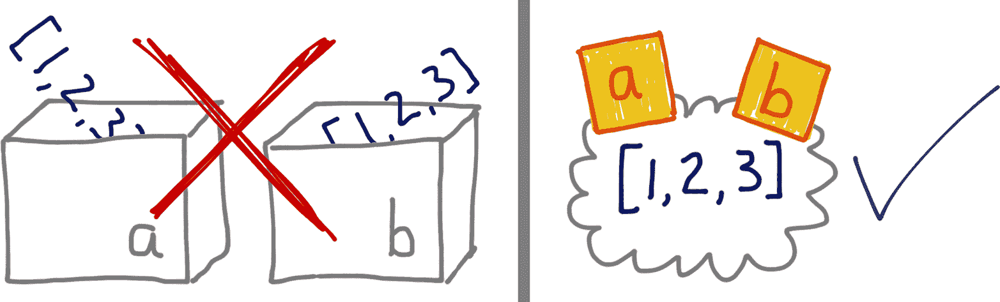
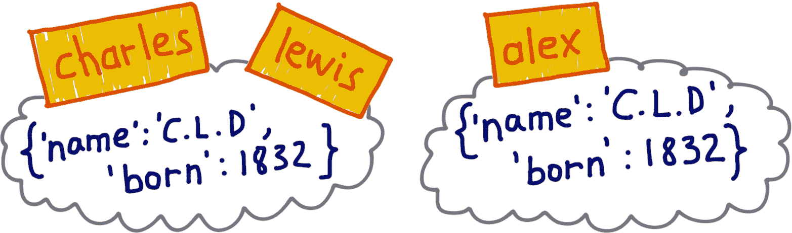
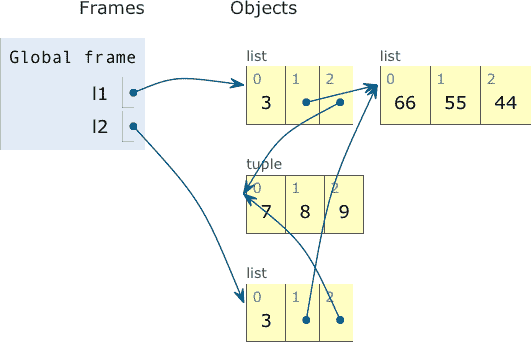
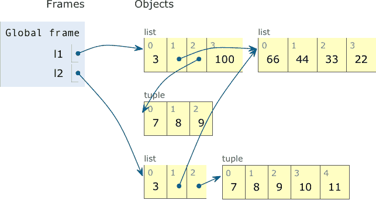

# 第六章：对象引用、可变性和回收

> “你很伤心，”骑士焦急地说：“让我唱首歌来安慰你。[…] 这首歌的名字叫‘鳕鱼的眼睛’。”
> 
> “哦，那就是歌的名字吗？”爱丽丝试图表现出兴趣。
> 
> “不，你没理解，”骑士说，看起来有点恼火。“那就是名字的称呼。名字真的就是‘老老老人’。”
> 
> 改编自刘易斯·卡罗尔，《镜中世界》

爱丽丝和骑士设定了我们在本章中将看到的基调。主题是对象和它们的名称之间的区别。一个名称不是对象；一个名称是一个独立的东西。

我们通过提出一个关于 Python 中变量的比喻来开始本章：变量是标签，而不是盒子。如果引用变量对你来说是老生常谈，这个类比可能仍然有用，如果你需要向他人解释别名问题。

然后我们讨论对象标识、值和别名的概念。元组的一个令人惊讶的特性被揭示出来：它们是不可变的，但它们的值可能会改变。这引发了对浅复制和深复制的讨论。引用和函数参数是我们接下来的主题：可变参数默认值的问题以及如何安全处理客户端传递的可变参数。

本章的最后几节涵盖了垃圾回收、`del`命令以及 Python 对不可变对象玩弄的一些技巧。

这是一个相当枯燥的章节，但它的主题是许多真实 Python 程序中微妙错误的核心。

# 本章新内容

这里涵盖的主题非常基础和稳定。在第二版中没有值得一提的变化。

我添加了一个使用`is`测试哨兵对象的示例，并在“选择==还是 is”的末尾警告了`is`运算符的误用。

这一章曾经在本书的第四部分，但我决定将其提前，因为它作为第二部分“数据结构”的结尾要比作为“面向对象习语”的开头更好。

###### 注意

这本书第一版中关于“弱引用”的部分现在是[*fluentpython.com*](https://fpy.li/weakref)上的一篇文章。

让我们从忘掉变量就像存储数据的盒子开始。

# 变量不是盒子

1997 年，我在麻省理工学院参加了一门关于 Java 的暑期课程。教授琳恩·斯坦¹指出，通常的“变量就像盒子”比喻实际上阻碍了理解面向对象语言中引用变量的理解。Python 变量就像 Java 中的引用变量；一个更好的比喻是，变量视为附加到对象的名称的标签。下一个示例和图将帮助您理解为什么。

示例 6-1 是一个简单的互动，而“变量就像盒子”这个想法无法解释。图 6-1 说明了为什么盒子的比喻对于 Python 是错误的，而便利贴提供了一个有助于理解变量实际工作方式的图像。

##### 示例 6-1。变量`a`和`b`持有对同一列表的引用，而不是列表的副本

```py
>>> a = [1, 2, 3]  # ①
>>> b = a          # ②
>>> a.append(4)    # ③
>>> b              # ④
[1, 2, 3, 4]
```

①

创建一个列表`[1, 2, 3]`，并将变量`a`绑定到它。

②

将变量`b`绑定到与`a`引用相同的值。

③

通过向`a`引用的列表追加另一个项目来修改列表。

④

你可以通过变量`b`看到效果。如果我们把`b`看作是一个盒子，里面存放着从`a`盒子中复制的`[1, 2, 3]`，这种行为就毫无意义了。



###### 图 6-1。如果你把变量想象成箱子，就无法理解 Python 中的赋值；相反，把变量想象成便利贴，示例 6-1 就变得容易解释了。

因此，`b = a`语句并不会复制箱子`a`的内容到箱子`b`中。它将标签`b`附加到已经有标签`a`的对象上。

Stein 教授也非常谨慎地谈到了赋值。例如，在谈论模拟中的一个跷跷板对象时，她会说：“变量*s*被赋给了跷跷板”，但从不说“跷跷板被赋给了变量*s*”。对于引用变量，更合理的说法是变量被赋给了对象，而不是反过来。毕竟，对象在赋值之前就已经创建了。示例 6-2 证明了赋值的右侧先发生。

由于动词“赋值”被以矛盾的方式使用，一个有用的替代方法是“绑定”：Python 的赋值语句`x = …`将`x`名称绑定到右侧创建或引用的对象上。对象必须在名称绑定到它之前存在，正如示例 6-2 所证明的那样。

##### 示例 6-2。只有在对象创建后，变量才会绑定到对象上。

```py
>>> class Gizmo:
...    def __init__(self):
...         print(f'Gizmo id: {id(self)}')
...
>>> x = Gizmo()
Gizmo id: 4301489152 # ①
>>> y = Gizmo() * 10  # ②
Gizmo id: 4301489432 # ③
Traceback (most recent call last):
 File "<stdin>", line 1, in <module>
TypeError: unsupported operand type(s) for *: 'Gizmo' and 'int'
>>> >>> dir()  # ④
['Gizmo', '__builtins__', '__doc__', '__loader__', '__name__', '__package__', '__spec__', 'x']
```

①

输出`Gizmo id: …`是创建`Gizmo`实例的副作用。

②

乘以`Gizmo`实例会引发异常。

③

这里有证据表明在尝试乘法之前实际上实例化了第二个`Gizmo`。

④

但变量`y`从未被创建，因为异常发生在赋值的右侧正在被评估时。

###### 提示

要理解 Python 中的赋值，首先阅读右侧：那里是创建或检索对象的地方。之后，左侧的变量将绑定到对象上，就像贴在上面的标签一样。只需忘记箱子。

因为变量只是标签，所以一个对象可以有多个标签分配给它。当发生这种情况时，就会出现*别名*，这是我们下一个主题。

# 身份、相等性和别名

路易斯·卡罗尔是查尔斯·卢特维奇·道奇森教授的笔名。卡罗尔先生不仅等同于道奇森教授，他们是一体的。示例 6-3 用 Python 表达了这个想法。

##### 示例 6-3。`charles`和`lewis`指向同一个对象。

```py
>>> charles = {'name': 'Charles L. Dodgson', 'born': 1832}
>>> lewis = charles  # ①
>>> lewis is charles
True >>> id(charles), id(lewis)  # ②
(4300473992, 4300473992) >>> lewis['balance'] = 950  # ③
>>> charles
{'name': 'Charles L. Dodgson', 'born': 1832, 'balance': 950}
```

①

`lewis`是`charles`的别名。

②

`is`运算符和`id`函数证实了这一点。

③

向`lewis`添加一个项目等同于向`charles`添加一个项目。

然而，假设有一个冒名顶替者——我们称他为亚历山大·佩达琴科博士——声称自己是查尔斯·L·道奇森，出生于 1832 年。他的证件可能相同，但佩达琴科博士不是道奇森教授。图 6-2 说明了这种情况。



###### 图 6-2。`charles`和`lewis`绑定到同一个对象；`alex`绑定到一个相等值的单独对象。

示例 6-4 实现并测试了图 6-2 中所示的`alex`对象。

##### 示例 6-4。`alex`和`charles`比较相等，但`alex`*不是*`charles`。

```py
>>> alex = {'name': 'Charles L. Dodgson', 'born': 1832, 'balance': 950}  # ①
>>> alex == charles  # ②
True >>> alex is not charles  # ③
True
```

①

`alex`指的是一个与分配给`charles`的对象相同的对象的复制品。

②

这些对象之所以相等是因为`dict`类中的`__eq__`实现。

③

但它们是不同的对象。这是写负身份比较的 Pythonic 方式：`a is not b`。

示例 6-3 是*别名*的一个例子。在那段代码中，`lewis`和`charles`是别名：两个变量绑定到同一个对象。另一方面，`alex`不是`charles`的别名：这些变量绑定到不同的对象。绑定到`alex`和`charles`的对象具有相同的*值*—这是`==`比较的内容—但它们具有不同的身份。

在*Python 语言参考*中，[“3.1\. 对象、值和类型”](https://fpy.li/6-2)中指出：

> 一个对象的身份一旦创建就不会改变；您可以将其视为对象在内存中的地址。`is`运算符比较两个对象的身份；`id()`函数返回表示其身份的整数。

对象的 ID 的真正含义取决于实现。在 CPython 中，`id()`返回对象的内存地址，但在另一个 Python 解释器中可能是其他内容。关键点是 ID 保证是唯一的整数标签，并且在对象的生命周期内永远不会更改。

在实践中，我们编程时很少使用`id()`函数。通常使用`is`运算符进行身份检查，该运算符比较对象的 ID，因此我们的代码不需要显式调用`id()`。接下来，我们将讨论`is`与`==`的区别。

###### 提示

对于技术审阅员 Leonardo Rochael，最常见使用`id()`的情况是在调试时，当两个对象的`repr()`看起来相似，但您需要了解两个引用是别名还是指向不同的对象。如果引用在不同的上下文中—比如不同的堆栈帧—使用`is`运算符可能不可行。

## 选择`==`和`is`之间

`==`运算符比较对象的值（它们持有的数据），而`is`比较它们的身份。

在编程时，我们通常更关心对象的值而不是对象的身份，因此在 Python 代码中，`==`比`is`出现得更频繁。

但是，如果您要将变量与单例进行比较，则使用`is`是有意义的。到目前为止，最常见的情况是检查变量是否绑定到`None`。这是建议的做法：

```py
x is None
```

而其否定的正确方式是：

```py
x is not None
```

`None`是我们用`is`测试的最常见的单例。哨兵对象是我们用`is`测试的另一个单例的例子。以下是创建和测试哨兵对象的一种方法：

```py
END_OF_DATA = object()
# ... many lines
def traverse(...):
    # ... more lines
    if node is END_OF_DATA:
        return
    # etc.
```

`is`运算符比`==`更快，因为它无法被重载，所以 Python 不必查找和调用特殊方法来评估它，计算就像比较两个整数 ID 一样简单。相反，`a == b`是`a.__eq__(b)`的语法糖。从`object`继承的`__eq__`方法比较对象 ID，因此它产生与`is`相同的结果。但大多数内置类型使用更有意义的实现覆盖`__eq__`，实际上考虑对象属性的值。相等性可能涉及大量处理—例如，比较大型集合或深层嵌套结构时。

###### 警告

通常我们更关心对象的相等性而不是身份。检查`None`是`is`运算符的*唯一*常见用例。我在审查代码时看到的大多数其他用法都是错误的。如果不确定，请使用`==`。这通常是您想要的，并且也适用于`None`—尽管不如`is`快。

总结一下关于身份与相等性的讨论，我们会看到著名的不可变`tuple`并不像您期望的那样不变。

## 元组的相对不可变性

元组，像大多数 Python 集合（列表、字典、集合等）一样，都是容器：它们保存对对象的引用。² 如果所引用的项是可变的，即使元组本身不变，它们也可能发生变化。换句话说，元组的不可变性实际上是指`tuple`数据结构的物理内容（即它保存的引用），而不是扩展到所引用的对象。

示例 6-5 说明了元组的值因所引用的可变对象的更改而发生变化的情况。元组中永远不会改变的是它包含的项的标识。

##### 示例 6-5。`t1`和`t2`最初比较相等，但在元组`t1`内更改可变项后，它们变得不同

```py
>>> t1 = (1, 2, [30, 40])  # ①
>>> t2 = (1, 2, [30, 40])  # ②
>>> t1 == t2  # ③
True >>> id(t1[-1])  # ④
4302515784 >>> t1[-1].append(99)  # ⑤
>>> t1
(1, 2, [30, 40, 99]) >>> id(t1[-1])  # ⑥
4302515784 >>> t1 == t2  # ⑦
False
```

①

`t1`是不可变的，但`t1[-1]`是可变的。

②

构建一个元组`t2`，其项与`t1`的项相等。

③

尽管是不同的对象，`t1`和`t2`比较相等，正如预期的那样。

④

检查`t1[-1]`列表的标识。

⑤

在原地修改`t1[-1]`列表。

⑥

`t1[-1]`的标识没有改变，只是它的值改变了。

⑦

`t1`和`t2`现在是不同的。

这种相对不可变性是谜题“A += Assignment Puzzler”背后的原因。这也是为什么一些元组是不可哈希的，正如我们在“什么是可哈希的”中所看到的。

在需要复制对象时，相等性和标识之间的区别会产生进一步的影响。副本是一个具有不同 ID 的相等对象。但是，如果一个对象包含其他对象，副本是否也应该复制内部对象，还是可以共享它们？这并没有单一的答案。继续阅读以了解讨论。

# 默认情况下是浅拷贝

复制列表（或大多数内置的可变集合）的最简单方法是使用类型本身的内置构造函数。例如：

```py
>>> l1 = [3, [55, 44], (7, 8, 9)]
>>> l2 = list(l1)  # ①
>>> l2
[3, [55, 44], (7, 8, 9)] >>> l2 == l1  # ②
True >>> l2 is l1  # ③
False
```

①

`list(l1)`创建了`l1`的一个副本。

②

这些拷贝是相等的…

③

…但是指向两个不同的对象。

对于列表和其他可变序列，使用快捷方式`l2 = l1[:]`也会创建一个副本。

然而，使用构造函数或`[:]`会产生一个*浅拷贝*（即，最外层容器被复制，但副本填充的是对原始容器持有的相同项的引用）。这节省内存，并且如果所有项都是不可变的，则不会出现问题。但是，如果有可变项，这可能会导致令人不快的惊喜。

在示例 6-6 中，我们创建了一个包含另一个列表和一个元组的列表的浅拷贝，然后进行更改以查看它们对所引用对象的影响。

###### 提示

如果你手头有一台连接的电脑，我强烈推荐观看示例 6-6 的交互式动画，网址为[Online Python Tutor](https://fpy.li/6-3)。就我所知，直接链接到*pythontutor.com*上的准备好的示例并不总是可靠，但这个工具非常棒，所以抽出时间复制粘贴代码是值得的。

##### 示例 6-6\. 对包含另一个列表的列表进行浅复制；复制并粘贴此代码以在 Online Python Tutor 中查看动画

```py
l1 = [3, [66, 55, 44], (7, 8, 9)]
l2 = list(l1)      # ①
l1.append(100)     # ②
l1[1].remove(55)   # ③
print('l1:', l1)
print('l2:', l2)
l2[1] += [33, 22]  # ④
l2[2] += (10, 11)  # ⑤
print('l1:', l1)
print('l2:', l2)
```

①

`l2`是`l1`的浅复制。这个状态在图 6-3 中描述。

②

在`l1`后添加`100`对`l2`没有影响。

③

在这里我们从内部列表`l1[1]`中移除`55`。这会影响到`l2`，因为`l2[1]`与`l1[1]`绑定到同一个列表。

④

对于像`l2[1]`引用的列表这样的可变对象，运算符`+=`会就地修改列表。这种变化在`l1[1]`上可见，因为`l1[1]`是`l2[1]`的别名。

⑤

在元组上使用`+=`会创建一个新的元组并重新绑定变量`l2[2]`。这等同于执行`l2[2] = l2[2] + (10, 11)`。现在`l1`和`l2`中最后位置的元组不再是同一个对象。参见图 6-4。



###### 图 6-3\. 在示例 6-6 中赋值`l2 = list(l1)`后的程序状态。`l1`和`l2`指向不同的列表，但这些列表共享对同一内部列表对象`[66, 55, 44]`和元组`(7, 8, 9)`的引用。 (图示由 Online Python Tutor 生成。)

示例 6-6 的输出是示例 6-7，对象的最终状态在图 6-4 中描述。

##### 示例 6-7\. 示例 6-6 的输出

```py
l1: [3, [66, 44], (7, 8, 9), 100]
l2: [3, [66, 44], (7, 8, 9)]
l1: [3, [66, 44, 33, 22], (7, 8, 9), 100]
l2: [3, [66, 44, 33, 22], (7, 8, 9, 10, 11)]
```



###### 图 6-4\. `l1`和`l2`的最终状态：它们仍然共享对同一列表对象的引用，现在包含`[66, 44, 33, 22]`，但操作`l2[2] += (10, 11)`创建了一个新的元组，内容为`(7, 8, 9, 10, 11)`，与`l1[2]`引用的元组`(7, 8, 9)`无关。 (图示由 Online Python Tutor 生成。)

现在应该清楚了，浅复制很容易实现，但可能并不是你想要的。如何进行深复制是我们下一个话题。

## 任意对象的深复制和浅复制

使用浅复制并不总是问题，但有时你需要进行深复制（即不共享嵌入对象引用的副本）。`copy`模块提供了`deepcopy`和`copy`函数，用于返回任意对象的深复制和浅复制。

为了说明`copy()`和`deepcopy()`的用法，示例 6-8 定义了一个简单的类`Bus`，代表一辆载有乘客的校车，然后在路线上接送乘客。

##### 示例 6-8\. 公共汽车接送乘客

```py
class Bus:

    def __init__(self, passengers=None):
        if passengers is None:
            self.passengers = []
        else:
            self.passengers = list(passengers)

    def pick(self, name):
        self.passengers.append(name)

    def drop(self, name):
        self.passengers.remove(name)
```

现在，在交互式示例 6-9 中，我们将创建一个`bus`对象（`bus1`）和两个克隆体—一个浅复制（`bus2`）和一个深复制（`bus3`）—来观察当`bus1`放下一个学生时会发生什么。

##### 示例 6-9\. 使用`copy`和`deepcopy`的效果

```py
>>> import copy
>>> bus1 = Bus(['Alice', 'Bill', 'Claire', 'David'])
>>> bus2 = copy.copy(bus1)
>>> bus3 = copy.deepcopy(bus1)
>>> id(bus1), id(bus2), id(bus3)
(4301498296, 4301499416, 4301499752) # ①
>>> bus1.drop('Bill')
>>> bus2.passengers
['Alice', 'Claire', 'David'] # ②
>>> id(bus1.passengers), id(bus2.passengers), id(bus3.passengers)
(4302658568, 4302658568, 4302657800) # ③
>>> bus3.passengers
['Alice', 'Bill', 'Claire', 'David'] # ④
```

①

使用`copy`和`deepcopy`，我们创建了三个不同的`Bus`实例。

②

在`bus1`删除`'Bill'`后，`bus2`也缺少了他。

③

检查`passengers`属性显示`bus1`和`bus2`共享相同的列表对象，因为`bus2`是`bus1`的浅拷贝。

④

`bus3`是`bus1`的深拷贝，因此其`passengers`属性引用另一个列表。

请注意，在一般情况下，制作深拷贝并不是一件简单的事情。对象可能具有导致天真算法陷入无限循环的循环引用。`deepcopy`函数记住已复制的对象，以优雅地处理循环引用。这在示例 6-10 中有演示。

##### 示例 6-10。循环引用：`b`引用`a`，然后附加到`a`；`deepcopy`仍然成功复制`a`

```py
>>> a = [10, 20]
>>> b = [a, 30]
>>> a.append(b)
>>> a
[10, 20, [[...], 30]]
>>> from copy import deepcopy
>>> c = deepcopy(a)
>>> c
[10, 20, [[...], 30]]
```

此外，在某些情况下，深拷贝可能太深。例如，对象可能引用不应复制的外部资源或单例。您可以通过实现`__copy__()`和`__deepcopy__()`特殊方法来控制`copy`和`deepcopy`的行为，如[`copy`模块文档](https://fpy.li/6-4)中所述。

通过别名共享对象也解释了 Python 中参数传递的工作原理，以及在参数默认值中使用可变类型的问题。接下来将介绍这些问题。

# 函数参数作为引用

Python 中的唯一参数传递模式是*共享调用*。这是大多数面向对象语言使用的模式，包括 JavaScript、Ruby 和 Java（这适用于 Java 引用类型；基本类型使用按值调用）。共享调用意味着函数的每个形式参数都会得到每个参数中引用的副本。换句话说，函数内部的参数成为实际参数的别名。

这种方案的结果是函数可以更改作为参数传递的任何可变对象，但它不能更改这些对象的标识（即，它不能完全用另一个对象替换对象）。示例 6-11 展示了一个简单函数在其中一个参数上使用`+=`的情况。当我们将数字、列表和元组传递给函数时，传递的实际参数会以不同的方式受到影响。

##### 示例 6-11。一个函数可以更改它接收到的任何可变对象

```py
>>> def f(a, b):
...     a += b
...     return a
...
>>> x = 1
>>> y = 2
>>> f(x, y)
3 >>> x, y  # ①
(1, 2) >>> a = [1, 2]
>>> b = [3, 4]
>>> f(a, b)
[1, 2, 3, 4] >>> a, b  # ②
([1, 2, 3, 4], [3, 4]) >>> t = (10, 20)
>>> u = (30, 40)
>>> f(t, u)  # ③
(10, 20, 30, 40) >>> t, u
((10, 20), (30, 40))
```

①

数字`x`保持不变。

②

列表`a`已更改。

③

元组`t`保持不变。

与函数参数相关的另一个问题是在默认情况下使用可变值，如下所述。

## 将可变类型用作参数默认值：不好的主意

具有默认值的可选参数是 Python 函数定义的一个很好的特性，允许我们的 API 在保持向后兼容的同时发展。但是，应避免将可变对象作为参数的默认值。

为了说明这一点，在示例 6-12 中，我们从示例 6-8 中获取`Bus`类，并将其`__init__`方法更改为创建`HauntedBus`。在这里，我们试图聪明地避免在以前的`__init__`中使用`passengers=None`的默认值，而是使用`passengers=[]`，从而避免了`if`。这种“聪明”让我们陷入了麻烦。

##### 示例 6-12。一个简单的类来说明可变默认值的危险

```py
class HauntedBus:
    """A bus model haunted by ghost passengers"""

    def __init__(self, passengers=[]):  # ①
        self.passengers = passengers  # ②

    def pick(self, name):
        self.passengers.append(name)  # ③

    def drop(self, name):
        self.passengers.remove(name)
```

①

当未传递`passengers`参数时，此参数绑定到默认的空列表对象。

②

这个赋值使得`self.passengers`成为`passengers`的别名，而`passengers`本身是默认列表的别名，当没有传递`passengers`参数时。

③

当使用`.remove()`和`.append()`方法与`self.passengers`一起使用时，实际上是在改变函数对象的属性的默认列表。

示例 6-13 展示了`HauntedBus`的诡异行为。

##### 示例 6-13\. 被幽灵乘客缠身的公交车

```py
>>> bus1 = HauntedBus(['Alice', 'Bill'])  # ①
>>> bus1.passengers
['Alice', 'Bill'] >>> bus1.pick('Charlie')
>>> bus1.drop('Alice')
>>> bus1.passengers  # ②
['Bill', 'Charlie'] >>> bus2 = HauntedBus()  # ③
>>> bus2.pick('Carrie')
>>> bus2.passengers
['Carrie'] >>> bus3 = HauntedBus()  # ④
>>> bus3.passengers  # ⑤
['Carrie'] >>> bus3.pick('Dave')
>>> bus2.passengers  # ⑥
['Carrie', 'Dave'] >>> bus2.passengers is bus3.passengers  # ⑦
True >>> bus1.passengers  # ⑧
['Bill', 'Charlie']
```

①

`bus1`从一个有两名乘客的列表开始。

②

到目前为止，`bus1`没有什么意外。

③

`bus2`从空开始，所以默认的空列表被分配给了`self.passengers`。

④

`bus3`也是空的，再次分配了默认列表。

⑤

默认值不再是空的！

⑥

现在被`bus3`选中的`Dave`出现在了`bus2`中。

⑦

问题在于`bus2.passengers`和`bus3.passengers`指向同一个列表。

⑧

但`bus1.passengers`是一个独立的列表。

问题在于没有初始乘客列表的`HauntedBus`实例最终共享同一个乘客列表。

这类 bug 可能很微妙。正如示例 6-13 所展示的，当使用乘客实例化`HauntedBus`时，它的表现如预期。只有当`HauntedBus`从空开始时才会发生奇怪的事情，因为这时`self.passengers`变成了`passengers`参数的默认值的别名。问题在于每个默认值在函数定义时被计算—即通常在模块加载时—并且默认值变成函数对象的属性。因此，如果默认值是一个可变对象，并且你对其进行更改，这种更改将影响到函数的每次未来调用。

在运行示例 6-13 中的代码后，你可以检查`HauntedBus.__init__`对象，并看到幽灵学生缠绕在其`__defaults__`属性中：

```py
>>> dir(HauntedBus.__init__)  # doctest: +ELLIPSIS
['__annotations__', '__call__', ..., '__defaults__', ...]
>>> HauntedBus.__init__.__defaults__
(['Carrie', 'Dave'],)
```

最后，我们可以验证`bus2.passengers`是绑定到`HauntedBus.__init__.__defaults__`属性的第一个元素的别名：

```py
>>> HauntedBus.__init__.__defaults__[0] is bus2.passengers
True
```

可变默认值的问题解释了为什么`None`通常被用作可能接收可变值的参数的默认值。在示例 6-8 中，`__init__`检查`passengers`参数是否为`None`。如果是，`self.passengers`绑定到一个新的空列表。如果`passengers`不是`None`，正确的实现将该参数的副本绑定到`self.passengers`。下一节将解释为什么复制参数是一个好的实践。

## 使用可变参数进行防御性编程

当你编写一个接收可变参数的函数时，你应该仔细考虑调用者是否希望传递的参数被更改。

例如，如果你的函数接收一个`dict`并在处理过程中需要修改它，那么这种副作用是否应该在函数外部可见？实际上这取决于上下文。这实际上是对函数编写者和调用者期望的一种调整。

本章中最后一个公交车示例展示了`TwilightBus`如何通过与其客户共享乘客列表来打破期望。在研究实现之前，看看示例 6-14 中`TwilightBus`类如何从类的客户的角度工作。

##### 示例 6-14。当被`TwilightBus`放下时，乘客消失了

```py
>>> basketball_team = ['Sue', 'Tina', 'Maya', 'Diana', 'Pat']  # ①
>>> bus = TwilightBus(basketball_team)  # ②
>>> bus.drop('Tina')  # ③
>>> bus.drop('Pat')
>>> basketball_team  # ④
['Sue', 'Maya', 'Diana']
```

①

`basketball_team`拥有五个学生名字。

②

一个`TwilightBus`装载着球队。

③

公交车放下一个学生，然后又一个。

④

被放下的乘客从篮球队中消失了！

`TwilightBus`违反了“最少惊讶原则”，这是接口设计的最佳实践。³ 当公交车放下一个学生时，他们的名字从篮球队名单中被移除，这确实令人惊讶。

示例 6-15 是`TwilightBus`的实现以及问题的解释。

##### 示例 6-15。一个简单的类，展示了修改接收参数的危险性

```py
class TwilightBus:
    """A bus model that makes passengers vanish"""

    def __init__(self, passengers=None):
        if passengers is None:
            self.passengers = []  # ①
        else:
            self.passengers = passengers  # ②

    def pick(self, name):
        self.passengers.append(name)

    def drop(self, name):
        self.passengers.remove(name)  # ③
```

①

当`passengers`为`None`时，我们小心地创建一个新的空列表。

②

然而，这个赋值使`self.passengers`成为`passengers`的别名，而`passengers`本身是传递给`__init__`的实际参数的别名（即示例 6-14 中的`basketball_team`）。

③

当使用`.remove()`和`.append()`方法与`self.passengers`一起使用时，实际上是在修改作为构造函数参数传递的原始列表。

这里的问题是公交车别名化了传递给构造函数的列表。相反，它应该保留自己的乘客列表。修复方法很简单：在`__init__`中，当提供`passengers`参数时，应该用其副本初始化`self.passengers`，就像我们在示例 6-8 中正确做的那样：

```py
    def __init__(self, passengers=None):
        if passengers is None:
            self.passengers = []
        else:
            self.passengers = list(passengers) # ①
```

①

复制`passengers`列表，或者如果它不是列表，则将其转换为`list`。

现在我们对乘客列表的内部处理不会影响用于初始化公交车的参数。作为一个额外的好处，这个解决方案更加灵活：现在传递给`passengers`参数的参数可以是一个`tuple`或任何其他可迭代对象，比如一个`set`甚至是数据库结果，因为`list`构造函数接受任何可迭代对象。当我们创建自己的列表来管理时，我们确保它支持我们在`.pick()`和`.drop()`方法中使用的必要的`.remove()`和`.append()`操作。

###### 提示

除非一个方法明确意图修改作为参数接收的对象，否则在类中简单地将其分配给实例变量会导致别名化参数对象。如果有疑问，请复制。你的客户会更加满意。当然，复制并非免费：在 CPU 和内存方面会有成本。然而，导致微妙错误的 API 通常比稍慢或使用更多资源的 API 更大的问题。

现在让我们谈谈 Python 语句中最被误解的之一：`del`。

# del 和 垃圾回收

> 对象永远不会被显式销毁；然而，当它们变得不可达时，它们可能被垃圾回收。
> 
> *The Python Language Reference* 中 “Data Model” 章节

`del` 的第一个奇怪之处在于它不是一个函数，而是一个语句。我们写 `del x` 而不是 `del(x)`—尽管后者也可以工作，但只是因为在 Python 中表达式 `x` 和 `(x)` 通常表示相同的东西。

第二个令人惊讶的事实是 `del` 删除的是引用，而不是对象。Python 的垃圾收集器可能会间接地将对象从内存中丢弃，作为 `del` 的间接结果，如果被删除的变量是对象的最后一个引用。重新绑定一个变量也可能导致对象的引用数达到零，从而导致其销毁。

```py
>>> a = [1, 2]  # ①
>>> b = a       # ②
>>> del a       # ③
>>> b           # ④
[1, 2] >>> b = [3]     # ⑤
```

①

创建对象 `[1, 2]` 并将 `a` 绑定到它。

②

将 `b` 绑定到相同的 `[1, 2]` 对象。

③

删除引用 `a`。

④

`[1, 2]` 没有受到影响，因为 `b` 仍然指向它。

⑤

将 `b` 重新绑定到不同的对象会移除对 `[1, 2]` 的最后一个引用。现在垃圾收集器可以丢弃该对象。

###### 警告

有一个 `__del__` 特殊方法，但它不会导致实例的销毁，并且不应该被您的代码调用。`__del__` 在实例即将被销毁时由 Python 解释器调用，以便让它有机会释放外部资源。您很少需要在自己的代码中实现 `__del__`，但一些 Python 程序员却花时间编写它却没有好的理由。正确使用 `__del__` 是相当棘手的。请参阅 *The Python Language Reference* 中 “Data Model” 章节的 [`__del__` 特殊方法文档](https://fpy.li/6-6)。

在 CPython 中，垃圾回收的主要算法是引用计数。基本上，每个对象都会记录指向它的引用计数。一旦该 *refcount* 达到零，对象立即被销毁：CPython 调用对象的 `__del__` 方法（如果定义了）然后释放为对象分配的内存。在 CPython 2.0 中，添加了一种分代垃圾回收算法，用于检测涉及引用循环的对象组—即使有指向它们的未解除引用，当所有相互引用都包含在组内时。Python 的其他实现具有更复杂的垃圾收集器，不依赖于引用计数，这意味着当没有更多引用指向对象时，`__del__` 方法可能不会立即被调用。请参阅 A. Jesse Jiryu Davis 的 [“PyPy、垃圾回收和死锁”](https://fpy.li/6-7) 讨论 `__del__` 的不当和适当使用。

为了演示对象生命周期的结束，示例 6-16 使用 `weakref.finalize` 注册一个回调函数，当对象被销毁时将被调用。

##### 示例 6-16\. 当没有更多引用指向对象时观察对象结束

```py
>>> import weakref
>>> s1 = {1, 2, 3}
>>> s2 = s1         # ①
>>> def bye():      # ②
...     print('...like tears in the rain.')
...
>>> ender = weakref.finalize(s1, bye)  # ③
>>> ender.alive  # ④
True >>> del s1
>>> ender.alive  # ⑤
True >>> s2 = 'spam'  # ⑥
...like tears in the rain. >>> ender.alive
False
```

①

`s1` 和 `s2` 是指向相同集合 `{1, 2, 3}` 的别名。

②

此函数不得是即将被销毁的对象的绑定方法或以其他方式保留对它的引用。

③

在`s1`引用的对象上注册`bye`回调。

④

在调用`finalize`对象之前，`.alive`属性为`True`。

⑤

正如讨论的那样，`del`并没有删除对象，只是删除了对它的`s1`引用。

⑥

重新绑定最后一个引用`s2`会使`{1, 2, 3}`变得不可访问。它被销毁，`bye`回调被调用，`ender.alive`变为`False`。

示例 6-16 的重点在于明确`del`并不会删除对象，但对象可能在使用`del`后变得不可访问而被删除。

你可能想知道为什么在示例 6-16 中`{1, 2, 3}`对象被销毁。毕竟，`s1`引用被传递给`finalize`函数，该函数必须保持对它的引用以便监视对象并调用回调。这是因为`finalize`持有对`{1, 2, 3}`的*弱引用*。对对象的弱引用不会增加其引用计数。因此，弱引用不会阻止目标对象被垃圾回收。弱引用在缓存应用中很有用，因为你不希望缓存的对象因为被缓存引用而保持活动状态。

###### 注意

弱引用是一个非常专业的主题。这就是为什么我选择在第二版中跳过它。相反，我在*fluentpython.com*上发布了[“弱引用”](https://fpy.li/weakref)。

# Python 对不可变对象的戏法

###### 注意

这个可选部分讨论了一些对 Python 的*用户*来说并不重要的细节，可能不适用于其他 Python 实现甚至未来的 CPython 版本。尽管如此，我看到有人遇到这些边缘情况，然后开始错误地使用`is`运算符，所以我觉得值得一提。

令人惊讶的是，对于元组`t`，`t[:]`并不会创建一个副本，而是返回对同一对象的引用。如果写成`tuple(t)`也会得到对同一元组的引用。⁴ 示例 6-17 证明了这一点。

##### 示例 6-17\. 从另一个元组构建的元组实际上是完全相同的元组

```py
>>> t1 = (1, 2, 3)
>>> t2 = tuple(t1)
>>> t2 is t1  # ①
True >>> t3 = t1[:]
>>> t3 is t1  # ②
True
```

①

`t1`和`t2`绑定到同一个对象。

②

`t3`也是如此。

相同的行为也可以观察到`str`、`bytes`和`frozenset`的实例。请注意，`frozenset`不是一个序列，因此如果`fs`是一个`frozenset`，`fs[:]`不起作用。但`fs.copy()`具有相同的效果：它欺骗性地返回对同一对象的引用，根本不是副本，正如示例 6-18 所示。⁵

##### 示例 6-18\. 字符串字面量可能创建共享对象

```py
>>> t1 = (1, 2, 3)
>>> t3 = (1, 2, 3)  # ①
>>> t3 is t1  # ②
False >>> s1 = 'ABC'
>>> s2 = 'ABC'  # ③
>>> s2 is s1 # ④
True
```

①

从头开始创建一个新元组。

②

`t1`和`t3`相等，但不是同一个对象。

③

从头开始创建第二个`str`。

④

令人惊讶：`a`和`b`指向同一个`str`！

共享字符串字面量是一种名为*内部化*的优化技术。CPython 使用类似的技术来避免程序中频繁出现的数字（如 0、1、-1 等）的不必要重复。请注意，CPython 并不会对所有字符串或整数进行内部化，它用于执行此操作的标准是一个未记录的实现细节。

###### 警告

永远不要依赖于`str`或`int`的内部化！始终使用`==`而不是`is`来比较字符串或整数的相等性。内部化是 Python 解释器内部使用的优化。

本节讨论的技巧，包括`frozenset.copy()`的行为，是无害的“谎言”，可以节省内存并使解释器更快。不要担心它们，它们不应该给你带来任何麻烦，因为它们只适用于不可变类型。也许这些琐事最好的用途是与其他 Python 爱好者打赌。⁶

# 章节总结

每个 Python 对象都有一个标识、一个类型和一个值。对象的值随时间可能会改变，只有对象的值可能会随时间改变。⁷

如果两个变量引用具有相等值的不可变对象（`a == b`为`True`），实际上很少关心它们是引用副本还是别名引用相同对象，因为不可变对象的值不会改变，只有一个例外。这个例外是不可变集合，例如元组：如果不可变集合保存对可变项的引用，那么当可变项的值发生变化时，其值实际上可能会改变。在实践中，这种情况并不常见。在不可变集合中永远不会改变的是其中对象的标识。`frozenset`类不会受到这个问题的影响，因为它只能保存可散列的元素，可散列对象的值根据定义永远不会改变。

变量保存引用在 Python 编程中有许多实际后果：

+   简单赋值不会创建副本。

+   使用`+=`或`*=`进行增强赋值会在左侧变量绑定到不可变对象时创建新对象，但可能会就地修改可变对象。

+   将新值分配给现有变量不会更改先前绑定到它的对象。这被称为重新绑定：变量现在绑定到不同的对象。如果该变量是先前对象的最后一个引用，那么该对象将被垃圾回收。

+   函数参数作为别名传递，这意味着函数可能会改变作为参数接收的任何可变对象。除了制作本地副本或使用不可变对象（例如，传递元组而不是列表）外，没有其他方法可以阻止这种情况发生。

+   使用可变对象作为函数参数的默认值是危险的，因为如果参数在原地更改，则默认值也会更改，影响到依赖默认值的每个未来调用。

在 CPython 中，对象一旦引用数达到零就会被丢弃。如果它们形成具有循环引用但没有外部引用的组，它们也可能被丢弃。

在某些情况下，保留对一个对象的引用可能是有用的，这个对象本身不会保持其他对象的存活。一个例子是一个类想要跟踪其所有当前实例。这可以通过弱引用来实现，这是更有用的集合`WeakValueDictionary`、`WeakKeyDictionary`、`WeakSet`以及`weakref`模块中的`finalize`函数的基础机制。有关更多信息，请参阅[*fluentpython.com*](https://fpy.li/weakref)上的[“弱引用”章节](https://fpy.li/weakref)。

# 进一步阅读

*Python 语言参考*的[“数据模型”章节](https://fpy.li/dtmodel)以清晰的方式解释了对象的标识和值。

Wesley Chun，*Core Python* 系列书籍的作者，在 2011 年的 EuroPython 上做了题为[Understanding Python’s Memory Model, Mutability, and Methods](https://fpy.li/6-8)的演讲，不仅涵盖了本章的主题，还涉及了特殊方法的使用。

Doug Hellmann 撰写了关于“copy – Duplicate Objects”和“weakref—Garbage-Collectable References to Objects”的帖子，涵盖了我们刚讨论过的一些主题。

更多关于 CPython 分代垃圾收集器的信息可以在[gc 模块文档](https://fpy.li/6-11)中找到，其中以“此模块提供了一个可选垃圾收集器的接口。”开头。这里的“可选”修饰词可能令人惊讶，但[“数据模型”章节](https://fpy.li/dtmodel)也指出：

> 实现可以延迟垃圾收集或完全省略它——垃圾收集的实现质量如何取决于实现，只要不收集仍然可达的对象。

Pablo Galindo 在[*Python 开发者指南*](https://fpy.li/6-13)中深入探讨了 Python 的 GC 设计，针对 CPython 实现的新手和有经验的贡献者。

CPython 3.4 垃圾收集器改进了具有`__del__`方法的对象的处理，如[PEP 442—Safe object finalization](https://fpy.li/6-14)中所述。

维基百科有一篇关于[string interning](https://fpy.li/6-15)的文章，提到了这种技术在几种语言中的使用，包括 Python。

维基百科还有一篇关于[“Haddocks’ Eyes”](https://fpy.li/6-16)的文章，这是我在本章开头引用的 Lewis Carroll 的歌曲。维基百科编辑写道，这些歌词被用于逻辑和哲学作品中“阐述*名称*概念的符号地位：名称作为识别标记可以分配给任何东西，包括另一个名称，从而引入不同级别的符号化。”

¹ Lynn Andrea Stein 是一位屡获殊荣的计算机科学教育家，[目前在奥林工程学院任教](https://fpy.li/6-1)。

² 相比之下，像`str`、`bytes`和`array.array`这样的扁平序列不包含引用，而是直接保存它们的内容——字符、字节和数字——在连续的内存中。

³ 在英文维基百科中查看[*最少惊讶原则*](https://fpy.li/6-5)。

⁴ 这是明确记录的。在 Python 控制台中键入`help(tuple)`以阅读：“如果参数是一个元组，则返回值是相同的对象。”在写这本书之前，我以为我对元组了解一切。

⁵ 使`copy`方法不复制任何内容的无害谎言是为了接口兼容性：它使`frozenset`更兼容`set`。无论两个相同的不可变对象是相同的还是副本，对最终用户都没有影响。

⁶ 这些信息的可怕用途是在面试候选人或为“认证”考试编写问题时询问。有无数更重要和更有用的事实可用于检查 Python 知识。

⁷ 实际上，通过简单地将不同的类分配给其`__class__`属性，对象的类型可以更改，但这是纯粹的邪恶，我后悔写下这个脚注。
