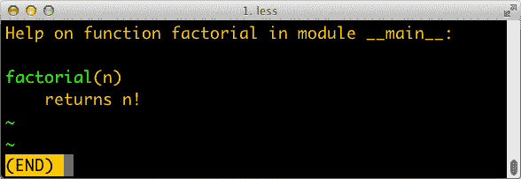

# 第七章：函数作为一等对象

> 我从未认为 Python 受到函数式语言的重大影响，无论人们说什么或想什么。我更熟悉命令式语言，如 C 和 Algol 68，尽管我将函数作为一等对象，但我并不认为 Python 是一种函数式编程语言。
> 
> Guido van Rossum，Python BDFL¹

Python 中的函数是一等对象。编程语言研究人员将“一等对象”定义为一个程序实体，可以：

+   在运行时创建

+   赋值给变量或数据结构中的元素

+   作为参数传递给函数

+   作为函数的结果返回

在 Python 中，整数、字符串和字典是函数的一等对象的其他示例——这里没有什么花哨的东西。将函数作为一等对象是函数式语言（如 Clojure、Elixir 和 Haskell）的一个重要特性。然而，一等函数非常有用，以至于它们被流行的语言（如 JavaScript、Go 和 Java（自 JDK 8 起））采用，这些语言都不声称自己是“函数式语言”。

本章和第三部分的大部分内容探讨了将函数视为对象的实际应用。

###### 提示

术语“一等函数”被广泛用作“函数作为一等对象”的简称。这并不理想，因为它暗示了函数中的“精英”。在 Python 中，所有函数都是一等对象。

# 本章的新内容

部分“可调用对象的九种类型”在本书第一版中标题为“可调用对象的七种类型”。新的可调用对象是原生协程和异步生成器，分别在 Python 3.5 和 3.6 中引入。它们都在第二十一章中介绍，但为了完整起见，它们与其他可调用对象一起提及在这里。

“仅位置参数” 是一个新的部分，涵盖了 Python 3.8 中添加的一个特性。

我将运行时访问函数注解的讨论移到了“在运行时读取类型提示”。在我写第一版时，[PEP 484—类型提示](https://fpy.li/pep484) 仍在考虑中，人们以不同的方式使用注解。自 Python 3.5 起，注解应符合 PEP 484。因此，在讨论类型提示时，最好的地方是在这里。

###### 注意

本书的第一版有关函数对象内省的部分过于低级，分散了本章的主题。我将这些部分合并到了一个名为[“函数参数内省”在 *fluentpython.com*](https://fpy.li/7-2)的帖子中。

现在让我们看看为什么 Python 函数是完整的对象。

# 将函数视为对象

示例 7-1 中的控制台会话显示了 Python 函数是对象。在这里，我们创建一个函数，调用它，读取其 `__doc__` 属性，并检查函数对象本身是否是 `function` 类的一个实例。

##### 示例 7-1。创建和测试一个函数，然后读取其 `__doc__` 并检查其类型

```py
>>> def factorial(n):  # ①
...     """returns n!"""
...     return 1 if n < 2 else n * factorial(n - 1)
...
>>> factorial(42)
1405006117752879898543142606244511569936384000000000 >>> factorial.__doc__  # ②
'returns n!' >>> type(factorial)  # ③
<class 'function'>
```

①

这是一个控制台会话，所以我们在“运行时”创建一个函数。

②

`__doc__` 是函数对象的几个属性之一。

③

`factorial` 是 `function` 类的一个实例。

`__doc__` 属性用于生成对象的帮助文本。在 Python 控制台中，命令 `help(factorial)` 将显示类似于 图 7-1 的屏幕。



###### 图 7-1。`factorial` 的帮助屏幕；文本是从函数的 `__doc__` 属性构建的。

示例 7-2 展示了函数对象的“第一类”特性。我们可以将其赋值给变量`fact`，并通过该名称调用它。我们还可以将`factorial`作为参数传递给[`map`](https://fpy.li/7-3)函数。调用`map(function, iterable)`会返回一个可迭代对象，其中每个项目都是调用第一个参数（一个函数）对第二个参数（一个可迭代对象）中的连续元素的结果，本例中为`range(10)`。

##### 示例 7-2\. 通过不同名称使用`factorial`，并将`factorial`作为参数传递

```py
>>> fact = factorial
>>> fact
<function factorial at 0x...>
>>> fact(5)
120
>>> map(factorial, range(11))
<map object at 0x...>
>>> list(map(factorial, range(11)))
[1, 1, 2, 6, 24, 120, 720, 5040, 40320, 362880, 3628800]
```

拥有头等函数使得以函数式风格编程成为可能。[函数式编程](https://fpy.li/7-4)的一个特点是使用高阶函数，我们的下一个主题。

# 高阶函数

一个将函数作为参数或返回函数作为结果的函数是*高阶函数*。一个例子是`map`，如示例 7-2 所示。另一个是内置函数`sorted`：可选的`key`参数允许您提供一个要应用于每个项目以进行排序的函数，正如我们在“list.sort 与 sorted 内置函数”中看到的。例如，要按长度对单词列表进行排序，可以将`len`函数作为`key`传递，如示例 7-3 所示。

##### 示例 7-3\. 按长度对单词列表进行排序

```py
>>> fruits = ['strawberry', 'fig', 'apple', 'cherry', 'raspberry', 'banana']
>>> sorted(fruits, key=len)
['fig', 'apple', 'cherry', 'banana', 'raspberry', 'strawberry']
>>>
```

任何一个参数为一个参数的函数都可以用作键。例如，为了创建一个韵典，将每个单词倒着拼写可能很有用。在示例 7-4 中，请注意列表中的单词根本没有改变；只有它们的反向拼写被用作排序标准，以便浆果出现在一起。

##### 示例 7-4\. 按单词的反向拼写对单词列表进行排序

```py
>>> def reverse(word):
...     return word[::-1]
>>> reverse('testing')
'gnitset'
>>> sorted(fruits, key=reverse)
['banana', 'apple', 'fig', 'raspberry', 'strawberry', 'cherry']
>>>
```

在函数式编程范式中，一些最著名的高阶函数包括`map`、`filter`、`reduce`和`apply`。`apply`函数在 Python 2.3 中已被弃用，并在 Python 3 中移除，因为它不再必要。如果需要使用动态参数集调用函数，可以编写`fn(*args, **kwargs)`，而不是`apply(fn, args, kwargs)`。

`map`、`filter`和`reduce`高阶函数仍然存在，但对于它们的大多数用例，都有更好的替代方案，如下一节所示。

## map、filter 和 reduce 的现代替代品

函数式语言通常提供`map`、`filter`和`reduce`高阶函数（有时使用不同的名称）。`map`和`filter`函数在 Python 3 中仍然是内置函数，但自列表推导式和生成器表达式引入以来，它们变得不再那么重要。列表推导式或生成器表达式可以完成`map`和`filter`的工作，但更易读。考虑示例 7-5。

##### 示例 7-5\. 使用`map`和`filter`生成的阶乘列表与编码为列表推导式的替代方案进行比较

```py
>>> list(map(factorial, range(6)))  # ①
[1, 1, 2, 6, 24, 120] >>> [factorial(n) for n in range(6)]  # ②
[1, 1, 2, 6, 24, 120] >>> list(map(factorial, filter(lambda n: n % 2, range(6))))  # ③
[1, 6, 120] >>> [factorial(n) for n in range(6) if n % 2]  # ④
[1, 6, 120] >>>
```

①

从 0!到 5!构建一个阶乘列表。

②

使用列表推导式进行相同的操作。

③

列出了奇数阶乘数的列表，直到 5!，同时使用`map`和`filter`。

④

列表推导式可以完成相同的工作，取代`map`和`filter`，使得`lambda`变得不再必要。

在 Python 3 中，`map`和`filter`返回生成器——一种迭代器形式，因此它们的直接替代品现在是生成器表达式（在 Python 2 中，这些函数返回列表，因此它们最接近的替代品是列表推导式）。

`reduce`函数从 Python 2 中的内置函数降级为 Python 3 中的`functools`模块。它最常见的用例，求和，更适合使用自 2003 年发布 Python 2.3 以来可用的`sum`内置函数。这在可读性和性能方面是一个巨大的胜利（参见示例 7-6）。

##### 示例 7-6\. 使用 `reduce` 和 `sum` 对整数求和，直到 99

```py
>>> from functools import reduce  # ①
>>> from operator import add  # ②
>>> reduce(add, range(100))  # ③
4950 >>> sum(range(100))  # ④
4950 >>>
```

①

从 Python 3.0 开始，`reduce` 不再是内置函数。

②

导入 `add` 来避免创建一个仅用于添加两个数字的函数。

③

对整数求和，直到 99。

④

使用 `sum` 完成相同的任务—无需导入和调用 `reduce` 和 `add`。

###### 注意

`sum` 和 `reduce` 的共同思想是对系列中的连续项目应用某种操作，累积先前的结果，从而将一系列值减少为单个值。

其他减少内置函数是 `all` 和 `any`：

`all(iterable)`

如果可迭代对象中没有假值元素，则返回 `True`；`all([])` 返回 `True`。

`any(iterable)`

如果可迭代对象中有任何元素为真，则返回 `True`；`any([])` 返回 `False`。

我在 “向量取 #4：哈希和更快的 ==” 中对 `reduce` 进行了更详细的解释，在那里，一个持续的示例为使用这个函数提供了有意义的上下文。在本书后面的部分，当重点放在可迭代对象上时，将总结减少函数，见 “可迭代对象减少函数”。

为了使用高阶函数，有时创建一个小的、一次性的函数是很方便的。这就是匿名函数存在的原因。我们将在下面介绍它们。

# 匿名函数

`lambda` 关键字在 Python 表达式中创建一个匿名函数。

然而，Python 的简单语法限制了 `lambda` 函数的主体必须是纯表达式。换句话说，主体不能包含其他 Python 语句，如 `while`、`try` 等。赋值语句 `=` 也是一个语句，因此不能出现在 `lambda` 中。可以使用新的赋值表达式语法 `:=`，但如果你需要它，你的 `lambda` 可能太复杂和难以阅读，应该重构为使用 `def` 的常规函数。

匿名函数的最佳用法是在作为高阶函数的参数列表的上下文中。例如，示例 7-7 是从 示例 7-4 重写的韵脚索引示例，使用 `lambda`，而不定义一个 `reverse` 函数。

##### 示例 7-7\. 使用 `lambda` 按照它们的反向拼写对单词列表进行排序

```py
>>> fruits = ['strawberry', 'fig', 'apple', 'cherry', 'raspberry', 'banana']
>>> sorted(fruits, key=lambda word: word[::-1])
['banana', 'apple', 'fig', 'raspberry', 'strawberry', 'cherry']
>>>
```

在高阶函数的参数的有限上下文之外，匿名函数在 Python 中很少有用。语法限制往往使得非平凡的 `lambda` 要么难以阅读，要么无法工作。如果一个 `lambda` 难以阅读，我强烈建议您遵循 Fredrik Lundh 的重构建议。

`lambda` 语法只是一种语法糖：`lambda` 表达式创建一个函数对象，就像 `def` 语句一样。这只是 Python 中几种可调用对象中的一种。下一节将回顾所有这些对象。

# 可调用对象的九种类型

调用运算符 `()` 可以应用于除函数以外的其他对象。要确定对象是否可调用，请使用内置函数 `callable()`。截至 Python 3.9，[数据模型文档](https://fpy.li/7-6) 列出了九种可调用类型：

用户定义的函数

使用 `def` 语句或 `lambda` 表达式创建。

内置函数

在 C 中实现的函数（对于 CPython），如 `len` 或 `time.strftime`。

内置方法

在 C 中实现的方法，比如 `dict.get`。

方法

在类的主体中定义的函数。

类

当调用一个类时，它运行其 `__new__` 方法来创建一个实例，然后运行 `__init__` 来初始化它，最后将实例返回给调用者。因为 Python 中没有 `new` 运算符，调用一个类就像调用一个函数一样。²

类实例

如果一个类定义了 `__call__` 方法，那么它的实例可以被调用为函数—这是下一节的主题。

生成器函数

在其主体中使用`yield`关键字的函数或方法。调用时，它们返回一个生成器对象。

本机协程函数

使用`async def`定义的函数或方法。调用时，它们返回一个协程对象。在 Python 3.5 中添加。

异步生成器函数

使用`async def`定义的函数或方法，在其主体中有`yield`。调用时，它们返回一个用于与`async for`一起使用的异步生成器。在 Python 3.6 中添加。

生成器、本机协程和异步生成器函数与其他可调用对象不同，它们的返回值永远不是应用程序数据，而是需要进一步处理以产生应用程序数据或执行有用工作的对象。生成器函数返回迭代器。这两者在第十七章中有所涉及。本机协程函数和异步生成器函数返回的对象只能在异步编程框架（如*asyncio*）的帮助下使用。它们是第二十一章的主题。

###### 提示

鉴于 Python 中存在各种可调用类型，确定对象是否可调用的最安全方法是使用`callable()`内置函数：

```py
>>> abs, str, 'Ni!'
(<built-in function abs>, <class 'str'>, 'Ni!')
>>> [callable(obj) for obj in (abs, str, 'Ni!')]
[True, True, False]
```

我们现在开始构建作为可调用对象的类实例。

# 用户定义的可调用类型

Python 函数不仅是真实对象，而且任意 Python 对象也可以被制作成类似函数的行为。实现`__call__`实例方法就是全部所需。

示例 7-8 实现了一个`BingoCage`类。可以从任何可迭代对象构建一个实例，并且以随机顺序存储内部项目的`list`。调用实例会弹出一个项目。³

##### 示例 7-8\. bingocall.py：`BingoCage`只做一件事：从一个打乱顺序的列表中挑选项目

```py
import random

class BingoCage:

    def __init__(self, items):
        self._items = list(items)  # ①
        random.shuffle(self._items)  # ②

    def pick(self):  # ③
        try:
            return self._items.pop()
        except IndexError:
            raise LookupError('pick from empty BingoCage')  # ④

    def __call__(self):  # ⑤
        return self.pick()
```

①

`__init__`接受任何可迭代对象；构建本地副本可防止对作为参数传递的任何`list`产生意外副作用。

②

`shuffle`能够正常工作，因为`self._items`是一个`list`。

③

主要方法。

④

如果`self._items`为空，则使用自定义消息引发异常。

⑤

`bingo.pick()`的快捷方式：`bingo()`。

这里是示例 7-8 的简单演示。请注意`bingo`实例如何被调用为函数，并且`callable()`内置函数将其识别为可调用对象：

```py
>>> bingo = BingoCage(range(3))
>>> bingo.pick()
1
>>> bingo()
0
>>> callable(bingo)
True
```

实现`__call__`的类是创建类似函数的对象的简单方法，这些对象具有必须在调用之间保持的一些内部状态，例如`BingoCage`中剩余项目的情况。`__call__`的另一个很好的用例是实现装饰器。装饰器必须是可调用的，有时方便在装饰器的调用之间“记住”一些东西（例如，用于记忆化的缓存昂贵计算的结果以供以后使用）或将复杂实现拆分为单独的方法。

使用闭包是创建具有内部状态的函数的功能方法。闭包以及装饰器是第九章的主题。

现在让我们探索 Python 提供的强大语法，用于声明函数参数并将参数传递给它们。

# 从位置参数到仅关键字参数

Python 函数最好的特性之一是极其灵活的参数处理机制。与之密切相关的是在调用函数时使用`*`和`**`将可迭代对象和映射解包为单独的参数。要查看这些功能的实际应用，请参见示例 7-9 的代码以及在示例 7-10 中展示其用法的测试。

##### 示例 7-9。`tag`生成 HTML 元素；一个关键字参数`class_`用于传递`class`属性，因为`class`是 Python 中的关键字

```py
def tag(name, *content, class_=None, **attrs):
    """Generate one or more HTML tags"""
    if class_ is not None:
        attrs['class'] = class_
    attr_pairs = (f' {attr}="{value}"' for attr, value
                    in sorted(attrs.items()))
    attr_str = ''.join(attr_pairs)
    if content:
        elements = (f'<{name}{attr_str}>{c}</{name}>'
                    for c in content)
        return '\n'.join(elements)
    else:
        return f'<{name}{attr_str} />'
```

`tag`函数可以以许多方式调用，就像示例 7-10 所示。

##### 示例 7-10。从示例 7-9 调用`tag`函数的许多方法

```py
>>> tag('br')  # ①
'<br />'
>>> tag('p', 'hello')  # ②
'<p>hello</p>'
>>> print(tag('p', 'hello', 'world'))
<p>hello</p>
<p>world</p>
>>> tag('p', 'hello', id=33)  # ③
'<p id="33">hello</p>'
>>> print(tag('p', 'hello', 'world', class_='sidebar'))  # ④
<p class="sidebar">hello</p>
<p class="sidebar">world</p>
>>> tag(content='testing', name="img")  # ⑤
''
>>> my_tag = {'name': 'img', 'title': 'Sunset Boulevard',
...           'src': 'sunset.jpg', 'class': 'framed'}
>>> tag(**my_tag)  # ⑥
''
```

①

单个位置参数会生成一个具有该名称的空`tag`。

②

第一个参数之后的任意数量的参数将被`*content`捕获为一个`tuple`。

③

在`tag`签名中未明确命名的关键字参数将被`**attrs`捕获为一个`dict`。

④

`class_`参数只能作为关键字参数传递。

⑤

第一个位置参数也可以作为关键字传递。

⑥

使用`**`前缀`my_tag` `dict`将其所有项作为单独的参数传递，然后绑定到命名参数，其余参数由`**attrs`捕获。在这种情况下，我们可以在参数`dict`中有一个`'class'`键，因为它是一个字符串，不会与 Python 中的`class`保留字冲突。

关键字参数是 Python 3 的一个特性。在示例 7-9 中，`class_`参数只能作为关键字参数给出，永远不会捕获未命名的位置参数。要在定义函数时指定关键字参数，请在参数前加上`*`命名它们。如果您不想支持可变位置参数但仍想要关键字参数，请在签名中放置一个单独的`*`，就像这样：

```py
>>> def f(a, *, b):
...     return a, b
...
>>> f(1, b=2)
(1, 2)
>>> f(1, 2)
Traceback (most recent call last):
  File "<stdin>", line 1, in <module>
TypeError: f() takes 1 positional argument but 2 were given
```

请注意，关键字参数不需要具有默认值：它们可以是强制性的，就像前面示例中的`b`一样。

## 仅限位置参数

自 Python 3.8 以来，用户定义的函数签名可以指定位置参数。这个特性在内置函数中一直存在，比如`divmod(a, b)`，它只能使用位置参数调用，而不能像`divmod(a=10, b=4)`那样调用。

要定义一个需要位置参数的函数，请在参数列表中使用`/`。

这个来自[“Python 3.8 有什么新特性”](https://fpy.li/7-7)的示例展示了如何模拟`divmod`内置函数：

```py
def divmod(a, b, /):
    return (a // b, a % b)
```

`/`左侧的所有参数都是仅限位置的。在`/`之后，您可以指定其他参数，它们的工作方式与通常一样。

###### 警告

参数列表中的`/`在 Python 3.7 或更早版本中是语法错误。

例如，考虑来自示例 7-9 的`tag`函数。如果我们希望`name`参数是仅限位置的，我们可以在函数签名中的它后面添加`/`，就像这样：

```py
def tag(name, /, *content, class_=None, **attrs):
    ...
```

您可以在[“Python 3.8 有什么新特性”](https://fpy.li/7-7)和[PEP 570](https://fpy.li/pep570)中找到其他仅限位置参数的示例。

在深入研究 Python 灵活的参数声明功能后，本章的其余部分将介绍标准库中用于以函数式风格编程的最有用的包。

# 函数式编程包

尽管 Guido 明确表示他并没有设计 Python 成为一个函数式编程语言，但由于头等函数、模式匹配以及像`operator`和`functools`这样的包的支持，函数式编码风格可以被很好地使用，我们将在接下来的两节中介绍它们。

## 运算符模块

在函数式编程中，使用算术运算符作为函数很方便。例如，假设您想要乘以一系列数字以计算阶乘而不使用递归。要执行求和，您可以使用 `sum`，但没有相应的乘法函数。您可以使用 `reduce`——正如我们在 “map、filter 和 reduce 的现代替代品” 中看到的那样——但这需要一个函数来将序列的两个项相乘。示例 7-11 展示了如何使用 `lambda` 解决这个问题。

##### 示例 7-11\. 使用 `reduce` 和匿名函数实现阶乘

```py
from functools import reduce

def factorial(n):
    return reduce(lambda a, b: a*b, range(1, n+1))
```

`operator` 模块提供了几十个运算符的函数等效版本，因此您不必编写像 `lambda a, b: a*b` 这样的琐碎函数。有了它，我们可以将 示例 7-11 重写为 示例 7-12。

##### 示例 7-12\. 使用 `reduce` 和 `operator.mul` 实现阶乘

```py
from functools import reduce
from operator import mul

def factorial(n):
    return reduce(mul, range(1, n+1))
```

`operator` 替换的另一组单一用途的 `lambda` 是用于从序列中选择项或从对象中读取属性的函数：`itemgetter` 和 `attrgetter` 是构建自定义函数的工厂来执行这些操作。

示例 7-13 展示了 `itemgetter` 的一个常见用法：按一个字段的值对元组列表进行排序。在示例中，城市按国家代码（字段 1）排序打印。本质上，`itemgetter(1)` 创建一个函数，给定一个集合，返回索引 1 处的项。这比编写和阅读 `lambda fields: fields[1]` 更容易，后者执行相同的操作。

##### 示例 7-13\. 使用 `itemgetter` 对元组列表进行排序（数据来自 示例 2-8）

```py
>>> metro_data = [
...     ('Tokyo', 'JP', 36.933, (35.689722, 139.691667)),
...     ('Delhi NCR', 'IN', 21.935, (28.613889, 77.208889)),
...     ('Mexico City', 'MX', 20.142, (19.433333, -99.133333)),
...     ('New York-Newark', 'US', 20.104, (40.808611, -74.020386)),
...     ('São Paulo', 'BR', 19.649, (-23.547778, -46.635833)),
... ]
>>>
>>> from operator import itemgetter
>>> for city in sorted(metro_data, key=itemgetter(1)):
...     print(city)
...
('São Paulo', 'BR', 19.649, (-23.547778, -46.635833))
('Delhi NCR', 'IN', 21.935, (28.613889, 77.208889))
('Tokyo', 'JP', 36.933, (35.689722, 139.691667))
('Mexico City', 'MX', 20.142, (19.433333, -99.133333))
('New York-Newark', 'US', 20.104, (40.808611, -74.020386))
```

如果将多个索引参数传递给 `itemgetter`，则它构建的函数将返回提取的值的元组，这对于按多个键排序很有用：

```py
>>> cc_name = itemgetter(1, 0)
>>> for city in metro_data:
...     print(cc_name(city))
...
('JP', 'Tokyo')
('IN', 'Delhi NCR')
('MX', 'Mexico City')
('US', 'New York-Newark')
('BR', 'São Paulo')
>>>
```

因为 `itemgetter` 使用 `[]` 运算符，它不仅支持序列，还支持映射和任何实现 `__getitem__` 的类。

`itemgetter` 的姐妹是 `attrgetter`，它通过名称创建提取对象属性的函数。如果将多个属性名称作为参数传递给 `attrgetter`，它还会返回一个值元组。此外，如果任何参数名称包含 `.`（点），`attrgetter` 将浏览嵌套对象以检索属性。这些行为在 示例 7-14 中展示。这不是最短的控制台会话，因为我们需要构建一个嵌套结构来展示 `attrgetter` 处理带点属性的方式。

##### 示例 7-14\. 使用 `attrgetter` 处理先前定义的 `namedtuple` 列表 `metro_data`（与 示例 7-13 中出现的相同列表）

```py
>>> from collections import namedtuple
>>> LatLon = namedtuple('LatLon', 'lat lon')  # ①
>>> Metropolis = namedtuple('Metropolis', 'name cc pop coord')  # ②
>>> metro_areas = Metropolis(name, cc, pop, LatLon(lat, lon))  ![3
...     for name, cc, pop, (lat, lon) in metro_data]
>>> metro_areas[0]
Metropolis(name='Tokyo', cc='JP', pop=36.933, coord=LatLon(lat=35.689722, lon=139.691667)) >>> metro_areas[0].coord.lat  # ④
35.689722 >>> from operator import attrgetter
>>> name_lat = attrgetter('name', 'coord.lat')  # ⑤
>>> >>> for city in sorted(metro_areas, key=attrgetter('coord.lat')):  # ⑥
...     print(name_lat(city))  # ⑦
...
('São Paulo', -23.547778) ('Mexico City', 19.433333) ('Delhi NCR', 28.613889) ('Tokyo', 35.689722) ('New York-Newark', 40.808611)
```

①

使用 `namedtuple` 定义 `LatLon`。

②

还要定义 `Metropolis`。

③

使用 `Metropolis` 实例构建 `metro_areas` 列表；注意嵌套元组解包以提取 `(lat, lon)` 并将其用于构建 `Metropolis` 的 `coord` 属性的 `LatLon`。

④

访问元素 `metro_areas[0]` 以获取其纬度。

⑤

定义一个 `attrgetter` 来检索 `name` 和 `coord.lat` 嵌套属性。

⑥

再次使用 `attrgetter` 按纬度对城市列表进行排序。

⑦

使用 ⑤ 中定义的 `attrgetter` 仅显示城市名称和纬度。

这是在 `operator` 中定义的函数的部分列表（以 `_` 开头的名称被省略，因为它们主要是实现细节）：

```py
>>> [name for name in dir(operator) if not name.startswith('_')]
['abs', 'add', 'and_', 'attrgetter', 'concat', 'contains',
'countOf', 'delitem', 'eq', 'floordiv', 'ge', 'getitem', 'gt',
'iadd', 'iand', 'iconcat', 'ifloordiv', 'ilshift', 'imatmul',
'imod', 'imul', 'index', 'indexOf', 'inv', 'invert', 'ior',
'ipow', 'irshift', 'is_', 'is_not', 'isub', 'itemgetter',
'itruediv', 'ixor', 'le', 'length_hint', 'lshift', 'lt', 'matmul',
'methodcaller', 'mod', 'mul', 'ne', 'neg', 'not_', 'or_', 'pos',
'pow', 'rshift', 'setitem', 'sub', 'truediv', 'truth', 'xor']
```

列出的 54 个名称中大多数都是不言自明的。以`i`为前缀的名称组和另一个运算符的名称，例如`iadd`、`iand`等，对应于增强赋值运算符，例如`+=`、`&=`等。如果第一个参数是可变的，这些会在原地更改第一个参数；如果不是，该函数的工作方式类似于没有`i`前缀的函数：它只是返回操作的结果。

在剩余的`operator`函数中，`methodcaller`是我们将要介绍的最后一个。它在某种程度上类似于`attrgetter`和`itemgetter`，因为它会即时创建一个函数。它创建的函数会按名称在给定的对象上调用一个方法，就像示例 7-15 中所示的那样。

##### 示例 7-15。`methodcaller`的演示：第二个测试显示了额外参数的绑定

```py
>>> from operator import methodcaller
>>> s = 'The time has come'
>>> upcase = methodcaller('upper')
>>> upcase(s)
'THE TIME HAS COME'
>>> hyphenate = methodcaller('replace', ' ', '-')
>>> hyphenate(s)
'The-time-has-come'
```

示例 7-15 中的第一个测试只是为了展示`methodcaller`的工作原理，但如果您需要将`str.upper`作为一个函数使用，您可以直接在`str`类上调用它，并传递一个字符串作为参数，就像这样：

```py
>>> str.upper(s)
'THE TIME HAS COME'
```

示例 7-15 中的第二个测试表明，`methodcaller`也可以进行部分应用，冻结一些参数，就像`functools.partial`函数一样。这是我们下一个主题。*Bold Text*opmod07

## 使用`functools.partial`冻结参数

`functools`模块提供了几个高阶函数。我们在“map、filter 和 reduce 的现代替代品”中看到了`reduce`。另一个是`partial`：给定一个可调用对象，它会生成一个新的可调用对象，其中原始可调用对象的一些参数绑定为预定值。这对于将接受一个或多个参数的函数适应需要较少参数的回调函数的 API 很有用。示例 7-16 是一个微不足道的演示。

##### 示例 7-16。使用`partial`在需要一个参数可调用对象的地方使用两个参数函数

```py
>>> from operator import mul
>>> from functools import partial
>>> triple = partial(mul, 3)  # ①
>>> triple(7)  # ②
21 >>> list(map(triple, range(1, 10)))  # ③
[3, 6, 9, 12, 15, 18, 21, 24, 27]
```

①

从`mul`创建新的`triple`函数，将第一个位置参数绑定为`3`。

②

测试它。

③

使用`triple`与`map`；在这个例子中，`mul`无法与`map`一起使用。

一个更有用的示例涉及到我们在“为可靠比较标准化 Unicode”中看到的`unicode.normalize`函数。如果您使用来自许多语言的文本，您可能希望在比较或存储之前对任何字符串`s`应用`unicode.normalize('NFC', s)`。如果您经常这样做，最好有一个`nfc`函数来执行，就像示例 7-17 中那样。

##### 示例 7-17。使用`partial`构建一个方便的 Unicode 标准化函数

```py
>>> import unicodedata, functools
>>> nfc = functools.partial(unicodedata.normalize, 'NFC')
>>> s1 = 'café'
>>> s2 = 'cafe\u0301'
>>> s1, s2
('café', 'café')
>>> s1 == s2
False
>>> nfc(s1) == nfc(s2)
True
```

`partial`以可调用对象作为第一个参数，后跟要绑定的任意数量的位置参数和关键字参数。

示例 7-18 展示了`partial`与示例 7-9 中的`tag`函数一起使用，冻结一个位置参数和一个关键字参数。

##### 示例 7-18。演示`partial`应用于示例 7-9 中的`tag`函数

```py
>>> from tagger import tag
>>> tag
<function tag at 0x10206d1e0> # ①
>>> from functools import partial
>>> picture = partial(tag, 'img', class_='pic-frame')  # ②
>>> picture(src='wumpus.jpeg')
'' # ③
>>> picture
functools.partial(<function tag at 0x10206d1e0>, 'img', class_='pic-frame') # ④
>>> picture.func  # ⑤
<function tag at 0x10206d1e0> >>> picture.args
('img',) >>> picture.keywords
{'class_': 'pic-frame'}
```

①

从示例 7-9 导入`tag`并显示其 ID。

②

通过使用`tag`从`tag`创建`picture`函数，通过使用`'img'`固定第一个位置参数和`'pic-frame'`关键字参数。

③

`picture`按预期工作。

④

`partial()`返回一个`functools.partial`对象。⁴

⑤

一个`functools.partial`对象具有提供对原始函数和固定参数的访问的属性。

`functools.partialmethod` 函数与 `partial` 执行相同的工作，但设计用于与方法一起使用。

`functools` 模块还包括设计用作函数装饰器的高阶函数，例如 `cache` 和 `singledispatch` 等。这些函数在第九章中有介绍，该章还解释了如何实现自定义装饰器。

# 章节总结

本章的目标是探索 Python 中函数的头等性质。主要思想是你可以将函数分配给变量，将它们传递给其他函数，将它们存储在数据结构中，并访问函数属性，从而使框架和工具能够根据这些信息进行操作。

高阶函数，作为函数式编程的基本要素，在 Python 中很常见。`sorted`、`min` 和 `max` 内置函数，以及 `functools.partial` 都是该语言中常用的高阶函数的例子。使用 `map`、`filter` 和 `reduce` 不再像以前那样常见，这要归功于列表推导式（以及类似的生成器表达式）以及新增的归约内置函数如 `sum`、`all` 和 `any`。

自 Python 3.6 起，可调用对象有九种不同的类型，从使用 `lambda` 创建的简单函数到实现 `__call__` 的类实例。生成器和协程也是可调用的，尽管它们的行为与其他可调用对象非常不同。所有可调用对象都可以通过内置函数 `callable()` 进行检测。可调用对象提供了丰富的语法来声明形式参数，包括仅限关键字参数、仅限位置参数和注释。

最后，我们介绍了 `operator` 模块和 `functools.partial` 中的一些函数，通过最小化对功能受限的 `lambda` 语法的需求，促进了函数式编程。

# 进一步阅读

接下来的章节将继续探讨使用函数对象进行编程。第八章专注于函数参数和返回值中的类型提示。第九章深入探讨了函数装饰器——一种特殊的高阶函数，以及使其工作的闭包机制。第十章展示了头等函数如何简化一些经典的面向对象设计模式。

在*Python 语言参考*中，[“3.2\. 标准类型层次结构”](https://fpy.li/7-10)介绍了九种可调用类型，以及所有其他内置类型。

*[Python Cookbook](https://fpy.li/pycook3)* 第 3 版（O’Reilly）的第七章，由 David Beazley 和 Brian K. Jones 撰写，是对当前章节以及本书的第九章的极好补充，主要涵盖了相同概念但采用不同方法。

如果你对关键字参数的原理和用例感兴趣，请参阅[PEP 3102—关键字参数](https://fpy.li/pep3102)。

了解 Python 中函数式编程的绝佳入门是 A. M. Kuchling 的[“Python 函数式编程 HOWTO”](https://fpy.li/7-5)。然而，该文本的主要焦点是迭代器和生成器的使用，这是第十七章的主题。

StackOverflow 上的问题[“Python: 为什么 functools.partial 是必要的？”](https://fpy.li/7-12)有一篇由经典著作*Python in a Nutshell*（O’Reilly）的合著者 Alex Martelli 所撰写的高度信息化（且有趣）的回答。

思考问题“Python 是一种函数式语言吗？”，我创作了我最喜欢的演讲之一，“超越范式”，我在 PyCaribbean、PyBay 和 PyConDE 上做过演讲。请查看我在柏林演讲中遇到本书两位技术审阅者 Miroslav Šedivý 和 Jürgen Gmach 的[幻灯片](https://fpy.li/7-13)和[视频](https://fpy.li/7-14)。

¹ 来自 Guido 的*Python 的起源*博客的[“Python‘函数式’特性的起源”](https://fpy.li/7-1)。

² 调用一个类通常会创建该类的一个实例，但通过重写`__new__`可以实现其他行为。我们将在“使用 __new__ 实现灵活的对象创建”中看到一个例子。

³ 既然我们已经有了`random.choice`，为什么要构建一个`BingoCage`？`choice`函数可能多次返回相同的项，因为选定的项未从给定的集合中移除。调用`BingoCage`永远不会返回重复的结果——只要实例填充了唯一的值。

⁴ *functools.py*的[源代码](https://fpy.li/7-9)显示，`functools.partial`是用 C 实现的，并且默认情况下使用。 如果不可用，自 Python 3.4 起提供了`partial`的纯 Python 实现。

⁵ 在将代码粘贴到网络论坛时，还存在缩进丢失的问题，但我岔开了话题。
