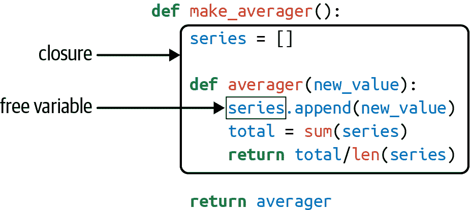

# 第九章：装饰器和闭包

> 有人对将这个功能命名为“装饰器”的选择提出了一些抱怨。主要的抱怨是该名称与其在 GoF 书中的用法不一致。¹ 名称 *decorator* 可能更多地归因于其在编译器领域的用法—语法树被遍历并注释。
> 
> PEP 318—函数和方法的装饰器

函数装饰器让我们在源代码中“标记”函数以增强其行为。这是强大的东西，但要掌握它需要理解闭包—当函数捕获在其体外定义的变量时，我们就得到了闭包。

Python 中最晦涩的保留关键字是 `nonlocal`，引入于 Python 3.0。如果你遵循严格的以类为中心的面向对象编程规范，作为 Python 程序员可以过上富有成效的生活而永远不使用它。然而，如果你想要实现自己的函数装饰器，你必须理解闭包，然后 `nonlocal` 的必要性就显而易见了。

除了在装饰器中的应用外，闭包在使用回调函数的任何类型编程和在适当时以函数式风格编码时也是必不可少的。

本章的最终目标是准确解释函数装饰器的工作原理，从最简单的注册装饰器到更复杂的带参数装饰器。然而，在达到这个目标之前，我们需要涵盖：

+   Python 如何评估装饰器语法

+   Python 如何确定变量是局部的

+   闭包的存在及工作原理

+   `nonlocal` 解决了什么问题

有了这个基础，我们可以进一步探讨装饰器的主题：

+   实现一个行为良好的装饰器

+   标准库中强大的装饰器：`@cache`、`@lru_cache` 和 `@singledispatch`

+   实现一个带参数的装饰器

# 本章新内容

Python 3.9 中新增的缓存装饰器 `functools.cache` 比传统的 `functools.lru_cache` 更简单，因此我首先介绍它。后者在“使用 lru_cache”中有介绍，包括 Python 3.8 中新增的简化形式。

“单分派泛型函数”进行了扩展，现在使用类型提示，这是自 Python 3.7 以来使用 `functools.singledispatch` 的首选方式。

“带参数的装饰器”现在包括一个基于类的示例，示例 9-27。

我将第十章，“具有头等函数的设计模式”移到了第 II 部分的末尾，以改善书籍的流畅性。“装饰器增强策略模式”现在在该章节中，以及使用可调用对象的策略设计模式的其他变体。

我们从一个非常温和的装饰器介绍开始，然后继续进行章节开头列出的其余项目。

# 装饰器 101

装饰器是一个可调用对象，接受另一个函数作为参数（被装饰的函数）。

装饰器可能对被装饰的函数进行一些处理，并返回它或用另一个函数或可调用对象替换它。²

换句话说，假设存在一个名为 `decorate` 的装饰器，这段代码：

```py
@decorate
def target():
    print('running target()')
```

与编写以下内容具有相同的效果：

```py
def target():
    print('running target()')

target = decorate(target)
```

最终结果是一样的：在这两个片段的末尾，`target` 名称绑定到 `decorate(target)` 返回的任何函数上—这可能是最初命名为 `target` 的函数，也可能是另一个函数。

要确认被装饰的函数是否被替换，请查看示例 9-1 中的控制台会话。

##### 示例 9-1\. 装饰器通常会用不同的函数替换一个函数

```py
>>> def deco(func):
...     def inner():
...         print('running inner()')
...     return inner  # ①
...
>>> @deco
... def target():  # ②
...     print('running target()')
...
>>> target()  # ③
running inner() >>> target  # ④
<function deco.<locals>.inner at 0x10063b598>
```

①

`deco` 返回其 `inner` 函数对象。

②

`target` 被 `deco` 装饰。

③

调用被装饰的 `target` 实际上运行 `inner`。

④

检查发现 `target` 现在是对 `inner` 的引用。

严格来说，装饰器只是一种语法糖。正如我们刚才看到的，你总是可以像调用任何常规可调用对象一样简单地调用装饰器，传递另一个函数。有时这实际上很方便，特别是在进行 *元编程* 时——在运行时更改程序行为。

三个关键事实概括了装饰器的要点：

+   装饰器是一个函数或另一个可调用对象。

+   装饰器可能会用不同的函数替换被装饰的函数。

+   装饰器在模块加载时立即执行。

现在让我们专注于第三点。

# Python 执行装饰器时

装饰器的一个关键特点是它们在被装饰的函数定义后立即运行。通常是在 *导入时间*（即 Python 加载模块时）运行。考虑 示例 9-2 中的 *registration.py*。

##### 示例 9-2\. registration.py 模块

```py
registry = []  # ①

def register(func):  # ②
    print(f'running register({func})')  # ③
    registry.append(func)  # ④
    return func  # ⑤

@register  # ⑥
def f1():
    print('running f1()')

@register
def f2():
    print('running f2()')

def f3():  # ⑦
    print('running f3()')

def main():  # ⑧
    print('running main()')
    print('registry ->', registry)
    f1()
    f2()
    f3()

if __name__ == '__main__':
    main()  # ⑨
```

①

`registry` 将保存被 `@register` 装饰的函数的引用。

②

`register` 接受一个函数作为参数。

③

显示正在被装饰的函数，以供演示。

④

在 `registry` 中包含 `func`。

⑤

返回 `func`：我们必须返回一个函数；在这里我们返回接收到的相同函数。

⑥

`f1` 和 `f2` 被 `@register` 装饰。

⑦

`f3` 没有被装饰。

⑧

`main` 显示 `registry`，然后调用 `f1()`、`f2()` 和 `f3()`。

⑨

只有当 *registration.py* 作为脚本运行时才会调用 `main()`。

将 *registration.py* 作为脚本运行的输出如下：

```py
$ python3 registration.py
running register(<function f1 at 0x100631bf8>)
running register(<function f2 at 0x100631c80>)
running main()
registry -> [<function f1 at 0x100631bf8>, <function f2 at 0x100631c80>]
running f1()
running f2()
running f3()
```

注意，`register` 在任何模块中的其他函数之前运行（两次）。当调用 `register` 时，它接收被装饰的函数对象作为参数，例如 `<function f1 at 0x100631bf8>`。

模块加载后，`registry` 列表保存了两个被装饰函数 `f1` 和 `f2` 的引用。这些函数以及 `f3` 只有在被 `main` 显式调用时才会执行。

如果 *registration.py* 被导入（而不是作为脚本运行），输出如下：

```py
>>> import registration
running register(<function f1 at 0x10063b1e0>)
running register(<function f2 at 0x10063b268>)
```

此时，如果检查 `registry`，你会看到：

```py
>>> registration.registry
[<function f1 at 0x10063b1e0>, <function f2 at 0x10063b268>]
```

示例 9-2 的主要观点是强调函数装饰器在模块导入时立即执行，但被装饰的函数只有在显式调用时才运行。这突出了 Python 程序员所称的 *导入时间* 和 *运行时* 之间的区别。

# 注册装饰器

考虑到装饰器在实际代码中通常的应用方式，示例 9-2 在两个方面都有些不同寻常：

+   装饰器函数在与被装饰函数相同的模块中定义。真正的装饰器通常在一个模块中定义，并应用于其他模块中的函数。

+   `register` 装饰器返回与传入的相同函数。实际上，大多数装饰器定义一个内部函数并返回它。

即使 示例 9-2 中的 `register` 装饰器返回未更改的装饰函数，这种技术也不是无用的。许多 Python 框架中使用类似的装饰器将函数添加到某个中央注册表中，例如将 URL 模式映射到生成 HTTP 响应的函数的注册表。这些注册装饰器可能会或可能不会更改被装饰的函数。

我们将在 “装饰器增强的策略模式”（第十章）中看到一个注册装饰器的应用。

大多数装饰器确实会改变被装饰的函数。它们通常通过定义内部函数并返回它来替换被装饰的函数来实现。几乎总是依赖闭包才能正确运行使用内部函数的代码。要理解闭包，我们需要退一步，回顾一下 Python 中变量作用域的工作原理。

# 变量作用域规则

在示例 9-3 中，我们定义并测试了一个函数，该函数读取两个变量：一个局部变量`a`—定义为函数参数—和一个在函数中任何地方都未定义的变量`b`。

##### 示例 9-3\. 读取局部变量和全局变量的函数

```py
>>> def f1(a):
...     print(a)
...     print(b)
...
>>> f1(3)
3
Traceback (most recent call last):
  File "<stdin>", line 1, in <module>
  File "<stdin>", line 3, in f1
NameError: global name 'b' is not defined
```

我们得到的错误并不令人惊讶。继续从示例 9-3 中，如果我们为全局`b`赋值然后调用`f1`，它可以工作：

```py
>>> b = 6
>>> f1(3)
3
6
```

现在，让我们看一个可能会让你惊讶的例子。

查看示例 9-4 中的`f2`函数。它的前两行与示例 9-3 中的`f1`相同，然后对`b`进行赋值。但在赋值之前的第二个`print`失败了。

##### 示例 9-4\. 变量`b`是局部的，因为它在函数体中被赋值

```py
>>> b = 6
>>> def f2(a):
...     print(a)
...     print(b)
...     b = 9
...
>>> f2(3)
3
Traceback (most recent call last):
  File "<stdin>", line 1, in <module>
  File "<stdin>", line 3, in f2
UnboundLocalError: local variable 'b' referenced before assignment
```

请注意，输出以`3`开头，这证明了`print(a)`语句已执行。但第二个`print(b)`从未运行。当我第一次看到这个时，我感到惊讶，认为应该打印`6`，因为有一个全局变量`b`，并且在`print(b)`之后对局部`b`进行了赋值。

但事实是，当 Python 编译函数体时，它决定将`b`视为局部变量，因为它是在函数内部赋值的。生成的字节码反映了这个决定，并将尝试从局部作用域获取`b`。稍后，当调用`f2(3)`时，`f2`的函数体获取并打印局部变量`a`的值，但在尝试获取局部变量`b`的值时，它发现`b`是未绑定的。

这不是一个错误，而是一个设计选择：Python 不要求您声明变量，但假设在函数体中分配的变量是局部的。这比 JavaScript 的行为要好得多，后者也不需要变量声明，但如果您忘记声明变量是局部的（使用`var`），您可能会在不知情的情况下覆盖全局变量。

如果我们希望解释器将`b`视为全局变量，并且仍然在函数内部为其赋新值，我们使用`global`声明：

```py
>>> b = 6
>>> def f3(a):
...     global b
...     print(a)
...     print(b)
...     b = 9
...
>>> f3(3)
3
6
>>> b
9
```

在前面的示例中，我们可以看到两个作用域的运作：

模块全局作用域

由分配给任何类或函数块之外的值的名称组成。

f3 函数的局部作用域

由分配给参数的值或直接在函数体中分配的名称组成。

另一个变量可能来自的作用域是*非局部*，对于闭包是至关重要的；我们稍后会看到它。

在更深入地了解 Python 中变量作用域工作原理之后，我们可以在下一节“闭包”中讨论闭包。如果您对示例 9-3 和 9-4 中的函数之间的字节码差异感兴趣，请参阅以下侧边栏。

# 闭包

在博客圈中，有时会混淆闭包和匿名函数。许多人会因为这两个特性的平行历史而混淆它们：在函数内部定义函数并不那么常见或方便，直到有了匿名函数。而只有在有嵌套函数时闭包才重要。因此，很多人会同时学习这两个概念。

实际上，闭包是一个函数—我们称之为`f`—具有扩展作用域，包含在`f`的函数体中引用的不是全局变量或`f`的局部变量的变量。这些变量必须来自包含`f`的外部函数的局部作用域。

函数是匿名的与否并不重要；重要的是它可以访问在其函数体之外定义的非全局变量。

这是一个难以理解的概念，最好通过一个例子来解释。

考虑一个`avg`函数来计算不断增长的数值序列的平均值；例如，商品的整个历史上的平均收盘价。每天都会添加一个新的价格，并且平均值是根据到目前为止的所有价格计算的。

从一张干净的画布开始，这就是如何使用`avg`：

```py
>>> avg(10)
10.0
>>> avg(11)
10.5
>>> avg(12)
11.0
```

`avg`是从哪里来的，它在哪里保留了先前值的历史记录？

起步时，示例 9-7 是基于类的实现。

##### 示例 9-7\. average_oo.py：用于计算移动平均值的类

```py
class Averager():

    def __init__(self):
        self.series = []

    def __call__(self, new_value):
        self.series.append(new_value)
        total = sum(self.series)
        return total / len(self.series)
```

`Averager`类创建可调用的实例：

```py
>>> avg = Averager()
>>> avg(10)
10.0
>>> avg(11)
10.5
>>> avg(12)
11.0
```

现在，示例 9-8 是一个功能实现，使用高阶函数`make_averager`。

##### 示例 9-8\. average.py：用于计算移动平均值的高阶函数

```py
def make_averager():
    series = []

    def averager(new_value):
        series.append(new_value)
        total = sum(series)
        return total / len(series)

    return averager
```

当调用时，`make_averager`返回一个`averager`函数对象。每次调用`averager`时，它都会将传递的参数附加到序列中，并计算当前平均值，如示例 9-9 所示。

##### 示例 9-9\. 测试示例 9-8

```py
>>> avg = make_averager()
>>> avg(10)
10.0
>>> avg(11)
10.5
>>> avg(15)
12.0
```

注意示例的相似之处：我们调用`Averager()`或`make_averager()`来获取一个可调用对象`avg`，它将更新历史序列并计算当前平均值。在示例 9-7 中，`avg`是`Averager`的一个实例，在示例 9-8 中，它是内部函数`averager`。无论哪种方式，我们只需调用`avg(n)`来将`n`包含在序列中并获得更新后的平均值。

很明显，`Averager`类的`avg`保留历史记录的地方：`self.series`实例属性。但第二个示例中的`avg`函数从哪里找到`series`呢？

请注意，`series`是`make_averager`的局部变量，因为赋值`series = []`发生在该函数的主体中。但当调用`avg(10)`时，`make_averager`已经返回，并且它的局部作用域早已消失。

在`averager`中，`series`是一个*自由变量*。这是一个技术术语，意味着一个在局部作用域中未绑定的变量。参见图 9-1。



###### 图 9-1\. `averager`的闭包将该函数的作用域扩展到包括自由变量`series`的绑定。

检查返回的`averager`对象显示了 Python 如何在`__code__`属性中保存局部和自由变量的名称，该属性表示函数的编译体。示例 9-10 展示了这些属性。

##### 示例 9-10\. 检查由示例 9-8 创建的函数

```py
>>> avg.__code__.co_varnames
('new_value', 'total')
>>> avg.__code__.co_freevars
('series',)
```

`series`的值保存在返回的函数`avg`的`__closure__`属性中。`avg.__closure__`中的每个项目对应于`avg.​__code__​.co_freevars`中的一个名称。这些项目是`cells`，它们有一个名为`cell_contents`的属性，其中可以找到实际值。示例 9-11 展示了这些属性。

##### 示例 9-11\. 从示例 9-9 继续

```py
>>> avg.__code__.co_freevars
('series',)
>>> avg.__closure__
(<cell at 0x107a44f78: list object at 0x107a91a48>,)
>>> avg.__closure__[0].cell_contents
[10, 11, 12]
```

总结一下：闭包是一个函数，保留在函数定义时存在的自由变量的绑定，以便在函数被调用时使用，而定义作用域不再可用时可以使用它们。

请注意，函数可能需要处理非全局外部变量的唯一情况是当它嵌套在另一个函数中并且这些变量是外部函数的局部作用域的一部分时。

# 非局部声明

我们先前的`make_averager`实现效率不高。在示例 9-8 中，我们将所有值存储在历史序列中，并且每次调用`averager`时都计算它们的`sum`。更好的实现方式是只存储总和和到目前为止的项目数，并从这两个数字计算平均值。

示例 9-12 是一个有问题的实现，只是为了说明一个观点。你能看出它在哪里出错了吗？

##### 示例 9-12\. 一个破损的高阶函数，用于计算不保留所有历史记录的运行平均值

```py
def make_averager():
    count = 0
    total = 0

    def averager(new_value):
        count += 1
        total += new_value
        return total / count

    return averager
```

如果尝试 示例 9-12，你会得到以下结果：

```py
>>> avg = make_averager()
>>> avg(10)
Traceback (most recent call last):
  ...
UnboundLocalError: local variable 'count' referenced before assignment
>>>
```

问题在于语句 `count += 1` 实际上意味着与 `count = count + 1` 相同，当 `count` 是一个数字或任何不可变类型时。因此，我们实际上是在 `averager` 的主体中对 `count` 赋值，这使其成为一个局部变量。同样的问题也影响到 `total` 变量。

我们在 示例 9-8 中没有这个问题，因为我们从未给 `series` 赋值；我们只调用了 `series.append` 并在其上调用了 `sum` 和 `len`。所以我们利用了列表是可变的这一事实。

但对于像数字、字符串、元组等不可变类型，你只能读取，而不能更新。如果尝试重新绑定它们，比如 `count = count + 1`，那么实际上是隐式创建了一个局部变量 `count`。它不再是一个自由变量，因此不会保存在闭包中。

为了解决这个问题，Python 3 中引入了 `nonlocal` 关键字。它允许你将一个变量声明为自由变量，即使它在函数内部被赋值。如果向 `nonlocal` 变量赋予新值，闭包中存储的绑定将会改变。我们最新的 `make_averager` 的正确实现看起来像 示例 9-13。

##### 示例 9-13\. 计算不保留所有历史记录的运行平均值（使用 `nonlocal` 修复）

```py
def make_averager():
    count = 0
    total = 0

    def averager(new_value):
        nonlocal count, total
        count += 1
        total += new_value
        return total / count

    return averager
```

在学习了 `nonlocal` 的使用之后，让我们总结一下 Python 的变量查找工作原理。

## 变量查找逻辑

当定义一个函数时，Python 字节码编译器根据以下规则确定如何获取其中出现的变量 `x`：³

+   如果有 `global x` 声明，`x` 来自并被赋值给模块的 `x` 全局变量。⁴

+   如果有 `nonlocal x` 声明，`x` 来自并被赋值给最近的周围函数的 `x` 局部变量，其中 `x` 被定义。

+   如果 `x` 是参数或在函数体中被赋值，则 `x` 是局部变量。

+   如果引用了 `x` 但未被赋值且不是参数：

    +   `x` 将在周围函数体的本地作用域（非本地作用域）中查找。

    +   如果在周围作用域中找不到，将从模块全局作用域中读取。

    +   如果在全局作用域中找不到，将从 `__builtins__.__dict__` 中读取。

现在我们已经介绍了 Python 闭包，我们可以有效地使用嵌套函数实现装饰器。

# 实现一个简单的装饰器

示例 9-14 是一个装饰器，用于记录装饰函数的每次调用并显示经过的时间、传递的参数以及调用的结果。

##### 示例 9-14\. *clockdeco0.py*: 显示函数运行时间的简单装饰器

```py
import time

def clock(func):
    def clocked(*args):  # ①
        t0 = time.perf_counter()
        result = func(*args)  # ②
        elapsed = time.perf_counter() - t0
        name = func.__name__
        arg_str = ', '.join(repr(arg) for arg in args)
        print(f'[{elapsed:0.8f}s] {name}({arg_str}) -> {result!r}')
        return result
    return clocked  # ③
```

①

定义内部函数 `clocked` 来接受任意数量的位置参数。

②

这行代码之所以有效，是因为 `clocked` 的闭包包含了 `func` 自由变量。

③

返回内部函数以替换装饰的函数。

示例 9-15 演示了 `clock` 装饰器的使用。

##### 示例 9-15\. 使用 `clock` 装饰器

```py
import time
from clockdeco0 import clock

@clock
def snooze(seconds):
    time.sleep(seconds)

@clock
def factorial(n):
    return 1 if n < 2 else n*factorial(n-1)

if __name__ == '__main__':
    print('*' * 40, 'Calling snooze(.123)')
    snooze(.123)
    print('*' * 40, 'Calling factorial(6)')
    print('6! =', factorial(6))
```

运行 示例 9-15 的输出如下所示：

```py
$ python3 clockdeco_demo.py
**************************************** Calling snooze(.123)
[0.12363791s] snooze(0.123) -> None
**************************************** Calling factorial(6)
[0.00000095s] factorial(1) -> 1
[0.00002408s] factorial(2) -> 2
[0.00003934s] factorial(3) -> 6
[0.00005221s] factorial(4) -> 24
[0.00006390s] factorial(5) -> 120
[0.00008297s] factorial(6) -> 720
6! = 720
```

## 工作原理

记住这段代码：

```py
@clock
def factorial(n):
    return 1 if n < 2 else n*factorial(n-1)
```

实际上是这样的：

```py
def factorial(n):
    return 1 if n < 2 else n*factorial(n-1)

factorial = clock(factorial)
```

因此，在这两个示例中，`clock`将`factorial`函数作为其`func`参数（参见示例 9-14）。然后创建并返回`clocked`函数，Python 解释器将其分配给`factorial`（在第一个示例中，在幕后）。实际上，如果导入`clockdeco_demo`模块并检查`factorial`的`__name__`，您会得到以下结果：

```py
>>> import clockdeco_demo
>>> clockdeco_demo.factorial.__name__
'clocked'
>>>
```

所以`factorial`现在实际上持有对`clocked`函数的引用。从现在开始，每次调用`factorial(n)`，都会执行`clocked(n)`。实质上，`clocked`执行以下操作：

1.  记录初始时间`t0`。

1.  调用原始`factorial`函数，保存结果。

1.  计算经过的时间。

1.  格式化并显示收集的数据。

1.  返回第 2 步保存的结果。

这是装饰器的典型行为：它用新函数替换装饰函数，新函数接受相同的参数并（通常）返回装饰函数应该返回的内容，同时还进行一些额外处理。

###### 提示

在 Gamma 等人的*设计模式*中，装饰器模式的简短描述以“动态地为对象附加额外的责任”开始。函数装饰器符合这一描述。但在实现层面上，Python 装饰器与原始*设计模式*作品中描述的经典装饰器几乎没有相似之处。“讲台”有更多相关内容。

示例 9-14 中实现的`clock`装饰器存在一些缺陷：它不支持关键字参数，并且掩盖了装饰函数的`__name__`和`__doc__`。示例 9-16 使用`functools.wraps`装饰器从`func`复制相关属性到`clocked`。此外，在这个新版本中，关键字参数被正确处理。

##### 示例 9-16\. *clockdeco.py*：改进的时钟装饰器

```py
import time
import functools

def clock(func):
    @functools.wraps(func)
    def clocked(*args, **kwargs):
        t0 = time.perf_counter()
        result = func(*args, **kwargs)
        elapsed = time.perf_counter() - t0
        name = func.__name__
        arg_lst = [repr(arg) for arg in args]
        arg_lst.extend(f'{k}={v!r}' for k, v in kwargs.items())
        arg_str = ', '.join(arg_lst)
        print(f'[{elapsed:0.8f}s] {name}({arg_str}) -> {result!r}')
        return result
    return clocked
```

`functools.wraps`只是标准库中可用的装饰器之一。在下一节中，我们将介绍`functools`提供的最令人印象深刻的装饰器：`cache`。

# 标准库中的装饰器

Python 有三个内置函数专门用于装饰方法：`property`、`classmethod`和`staticmethod`。我们将在“使用属性进行属性验证”中讨论`property`，并在“classmethod 与 staticmethod”中讨论其他内容。

在示例 9-16 中，我们看到另一个重要的装饰器：`functools.wraps`，一个用于构建行为良好的装饰器的辅助工具。标准库中一些最有趣的装饰器是`cache`、`lru_cache`和`singledispatch`，它们都来自`functools`模块。我们将在下一节中介绍它们。

## 使用`functools.cache`进行记忆化

`functools.cache`装饰器实现了*记忆化*：⁵一种通过保存先前调用昂贵函数的结果来优化的技术，避免对先前使用的参数进行重复计算。

###### 提示

`functools.cache`在 Python 3.9 中添加。如果需要在 Python 3.8 中运行这些示例，请将`@cache`替换为`@lru_cache`。对于 Python 的早期版本，您必须调用装饰器，写成`@lru_cache()`，如“使用 lru_cache”中所述。

一个很好的演示是将`@cache`应用于痛苦缓慢的递归函数，以生成斐波那契数列中的第*n*个数字，如示例 9-17 所示。

##### 示例 9-17\. 计算斐波那契数列中第 n 个数字的非常昂贵的递归方式

```py
from clockdeco import clock

@clock
def fibonacci(n):
    if n < 2:
        return n
    return fibonacci(n - 2) + fibonacci(n - 1)

if __name__ == '__main__':
    print(fibonacci(6))
```

运行*fibo_demo.py*的结果如下。除了最后一行外，所有输出都是由`clock`装饰器生成的：

```py
$ python3 fibo_demo.py
[0.00000042s] fibonacci(0) -> 0
[0.00000049s] fibonacci(1) -> 1
[0.00006115s] fibonacci(2) -> 1
[0.00000031s] fibonacci(1) -> 1
[0.00000035s] fibonacci(0) -> 0
[0.00000030s] fibonacci(1) -> 1
[0.00001084s] fibonacci(2) -> 1
[0.00002074s] fibonacci(3) -> 2
[0.00009189s] fibonacci(4) -> 3
[0.00000029s] fibonacci(1) -> 1
[0.00000027s] fibonacci(0) -> 0
[0.00000029s] fibonacci(1) -> 1
[0.00000959s] fibonacci(2) -> 1
[0.00001905s] fibonacci(3) -> 2
[0.00000026s] fibonacci(0) -> 0
[0.00000029s] fibonacci(1) -> 1
[0.00000997s] fibonacci(2) -> 1
[0.00000028s] fibonacci(1) -> 1
[0.00000030s] fibonacci(0) -> 0
[0.00000031s] fibonacci(1) -> 1
[0.00001019s] fibonacci(2) -> 1
[0.00001967s] fibonacci(3) -> 2
[0.00003876s] fibonacci(4) -> 3
[0.00006670s] fibonacci(5) -> 5
[0.00016852s] fibonacci(6) -> 8
8
```

浪费是显而易见的：`fibonacci(1)`被调用了八次，`fibonacci(2)`被调用了五次，等等。但只需添加两行代码来使用`cache`，性能就得到了很大改善。参见示例 9-18。

##### 示例 9-18\. 使用缓存实现更快的方法

```py
import functools

from clockdeco import clock

@functools.cache  # ①
@clock  # ②
def fibonacci(n):
    if n < 2:
        return n
    return fibonacci(n - 2) + fibonacci(n - 1)

if __name__ == '__main__':
    print(fibonacci(6))
```

①

这行代码适用于 Python 3.9 或更高版本。有关支持较早 Python 版本的替代方法，请参阅“使用 lru_cache”。

②

这是堆叠装饰器的一个示例：`@cache`应用于`@clock`返回的函数。

# 堆叠装饰器

要理解堆叠装饰器的意义，回想一下`@`是将装饰器函数应用于其下方的函数的语法糖。如果有多个装饰器，它们的行为类似于嵌套函数调用。这个：

```py
@alpha
@beta
def my_fn():
    ...
```

与此相同：

```py
my_fn = alpha(beta(my_fn))
```

换句话说，首先应用`beta`装饰器，然后将其返回的函数传递给`alpha`。

在示例 9-18 中使用`cache`，`fibonacci`函数仅对每个`n`值调用一次：

```py
$ python3 fibo_demo_lru.py
[0.00000043s] fibonacci(0) -> 0
[0.00000054s] fibonacci(1) -> 1
[0.00006179s] fibonacci(2) -> 1
[0.00000070s] fibonacci(3) -> 2
[0.00007366s] fibonacci(4) -> 3
[0.00000057s] fibonacci(5) -> 5
[0.00008479s] fibonacci(6) -> 8
8
```

在另一个测试中，计算`fibonacci(30)`时，示例 9-18 在 0.00017 秒内完成了所需的 31 次调用（总时间），而未缓存的示例 9-17 在 Intel Core i7 笔记本上花费了 12.09 秒，因为它调用了`fibonacci(1)`832,040 次，总共 2,692,537 次调用。

被装饰函数接受的所有参数必须是*可散列*的，因为底层的`lru_cache`使用`dict`来存储结果，键是由调用中使用的位置和关键字参数生成的。

除了使愚蠢的递归算法可行外，`@cache`在需要从远程 API 获取信息的应用程序中表现出色。

###### 警告

如果缓存条目数量非常大，`functools.cache`可能会消耗所有可用内存。我认为它更适合用于短暂的命令本。在长时间运行的进程中，我建议使用适当的`maxsize`参数使用`functools.lru_cache`，如下一节所述。

## 使用 lru_cache

`functools.cache`装饰器实际上是围绕旧的`functools.lru_cache`函数的简单包装器，后者更灵活，与 Python 3.8 及更早版本兼容。

`@lru_cache`的主要优势在于其内存使用受`maxsize`参数限制，其默认值相当保守，为 128，这意味着缓存最多同时保留 128 个条目。

LRU 的首字母缩写代表最近最少使用，意味着长时间未被读取的旧条目将被丢弃，以腾出空间给新条目。

自 Python 3.8 以来，`lru_cache`可以以两种方式应用。这是最简单的使用方法：

```py
@lru_cache
def costly_function(a, b):
    ...
```

另一种方式——自 Python 3.2 起可用——是将其作为函数调用，使用`()`：

```py
@lru_cache()
def costly_function(a, b):
    ...
```

在这两种情况下，将使用默认参数。这些是：

`maxsize=128`

设置要存储的条目的最大数量。缓存满后，最近最少使用的条目将被丢弃以为新条目腾出空间。为了获得最佳性能，`maxsize`应为 2 的幂。如果传递`maxsize=None`，LRU 逻辑将被禁用，因此缓存工作速度更快，但条目永远不会被丢弃，这可能会消耗过多内存。这就是`@functools.cache`的作用。

`typed=False`

确定不同参数类型的结果是否分开存储。例如，在默认设置中，被视为相等的浮点数和整数参数仅存储一次，因此对`f(1)`和`f(1.0)`的调用将只有一个条目。如果`typed=True`，这些参数将产生不同的条目，可能存储不同的结果。

这是使用非默认参数调用`@lru_cache`的示例：

```py
@lru_cache(maxsize=2**20, typed=True)
def costly_function(a, b):
    ...
```

现在让我们研究另一个强大的装饰器：`functools.singledispatch`。

## 单分发通用函数

想象我们正在创建一个用于调试 Web 应用程序的工具。我们希望为不同类型的 Python 对象生成 HTML 显示。

我们可以从这样的函数开始：

```py
import html

def htmlize(obj):
    content = html.escape(repr(obj))
    return f'<pre>{content}</pre>'
```

这将适用于任何 Python 类型，但现在我们想扩展它以生成一些类型的自定义显示。一些示例：

`str`

用`'<br/>\n'`替换嵌入的换行符，并使用`<p>`标签代替`<pre>`。

`int`

以十进制和十六进制形式显示数字（对 `bool` 有特殊情况）。

`list`

输出一个 HTML 列表，根据其类型格式化每个项目。

`float` 和 `Decimal`

通常输出值，但也以分数形式呈现（为什么不呢？）。

我们想要的行为在 Example 9-19 中展示。

##### Example 9-19\. `htmlize()` 生成针对不同对象类型定制的 HTML

```py
>>> htmlize({1, 2, 3})  # ①
'<pre>{1, 2, 3}</pre>' >>> htmlize(abs)
'<pre>&lt;built-in function abs&gt;</pre>' >>> htmlize('Heimlich & Co.\n- a game')  # ②
'<p>Heimlich &amp; Co.<br/>\n- a game</p>' >>> htmlize(42)  # ③
'<pre>42 (0x2a)</pre>' >>> print(htmlize(['alpha', 66, {3, 2, 1}]))  # ④
<ul> <li><p>alpha</p></li> <li><pre>66 (0x42)</pre></li> <li><pre>{1, 2, 3}</pre></li> </ul> >>> htmlize(True)  # ⑤
'<pre>True</pre>' >>> htmlize(fractions.Fraction(2, 3))  # ⑥
'<pre>2/3</pre>' >>> htmlize(2/3)   # ⑦
'<pre>0.6666666666666666 (2/3)</pre>' >>> htmlize(decimal.Decimal('0.02380952'))
'<pre>0.02380952 (1/42)</pre>'
```

①

原始函数为 `object` 注册，因此它作为一个通用函数来处理与其他实现不匹配的参数类型。

②

`str` 对象也会进行 HTML 转义，但会被包裹在 `<p></p>` 中，并在每个 `'\n'` 前插入 `<br/>` 换行符。

③

`int` 以十进制和十六进制的形式显示，在 `<pre></pre>` 中。

④

每个列表项根据其类型进行格式化，并将整个序列呈现为 HTML 列表。

⑤

尽管 `bool` 是 `int` 的子类型，但它得到了特殊处理。

⑥

以分数形式展示 `Fraction`。

⑦

以近似分数等价形式展示 `float` 和 `Decimal`。

### 函数 singledispatch

因为在 Python 中我们没有 Java 风格的方法重载，所以我们不能简单地为我们想要以不同方式处理的每种数据类型创建 `htmlize` 的变体。在 Python 中的一个可能的解决方案是将 `htmlize` 转变为一个分发函数，使用一系列的 `if/elif/…` 或 `match/case/…` 调用专门函数，如 `htmlize_str`，`htmlize_int` 等。这种方法对我们模块的用户来说是不可扩展的，而且很笨重：随着时间的推移，`htmlize` 分发器会变得太大，它与专门函数之间的耦合会非常紧密。

`functools.singledispatch` 装饰器允许不同模块为整体解决方案做出贡献，并让您轻松为属于第三方包的类型提供专门函数，而这些包您无法编辑。如果您用 `@singledispatch` 装饰一个普通函数，它将成为一个*通用函数*的入口点：一组函数以不同方式执行相同操作，取决于第一个参数的类型。这就是所谓的*单分派*。如果使用更多参数来选择特定函数，我们将有*多分派*。Example 9-20 展示了如何实现。

###### 警告

`functools.singledispatch` 自 Python 3.4 起存在，但自 Python 3.7 起才支持类型提示。Example 9-20 中的最后两个函数展示了在 Python 3.4 以来所有版本中都有效的语法。

##### Example 9-20\. `@singledispatch` 创建一个自定义的 `@htmlize.register` 来将几个函数捆绑成一个通用函数

```py
from functools import singledispatch
from collections import abc
import fractions
import decimal
import html
import numbers

@singledispatch  # ①
def htmlize(obj: object) -> str:
    content = html.escape(repr(obj))
    return f'<pre>{content}</pre>'

@htmlize.register  # ②
def _(text: str) -> str:  # ③
    content = html.escape(text).replace('\n', '<br/>\n')
    return f'<p>{content}</p>'

@htmlize.register  # ④
def _(seq: abc.Sequence) -> str:
    inner = '</li>\n<li>'.join(htmlize(item) for item in seq)
    return '<ul>\n<li>' + inner + '</li>\n</ul>'

@htmlize.register  # ⑤
def _(n: numbers.Integral) -> str:
    return f'<pre>{n} (0x{n:x})</pre>'

@htmlize.register  # ⑥
def _(n: bool) -> str:
    return f'<pre>{n}</pre>'

@htmlize.register(fractions.Fraction)  # ⑦
def _(x) -> str:
    frac = fractions.Fraction(x)
    return f'<pre>{frac.numerator}/{frac.denominator}</pre>'

@htmlize.register(decimal.Decimal)  # ⑧
@htmlize.register(float)
def _(x) -> str:
    frac = fractions.Fraction(x).limit_denominator()
    return f'<pre>{x} ({frac.numerator}/{frac.denominator})</pre>'
```

①

`@singledispatch` 标记了处理 `object` 类型的基本函数。

②

每个专门函数都使用 `@«base».register` 进行装饰。

③

运行时给定的第一个参数的类型决定了何时使用这个特定的函数定义。专门函数的名称并不重要；`_` 是一个很好的选择，可以让这一点清晰明了。⁶

④

为了让每个额外的类型得到特殊处理，需要注册一个新的函数，并在第一个参数中使用匹配的类型提示。

⑤

`numbers` ABCs 对于与 `singledispatch` 一起使用很有用。⁷

⑥

`bool`是`numbers.Integral`的*子类型*，但`singledispatch`逻辑寻找具有最具体匹配类型的实现，而不考虑它们在代码中出现的顺序。

⑦

如果您不想或无法向装饰的函数添加类型提示，可以将类型传递给`@«base».register`装饰器。这种语法适用于 Python 3.4 或更高版本。

⑧

`@«base».register`装饰器返回未装饰的函数，因此可以堆叠它们以在同一实现上注册两个或更多类型。⁸

在可能的情况下，注册专门的函数以处理抽象类（ABCs）如`numbers.Integral`和`abc.MutableSequence`，而不是具体实现如`int`和`list`。这样可以使您的代码支持更多兼容类型的变化。例如，Python 扩展可以提供`numbers.Integral`的子类作为`int`类型的替代方案。

###### 提示

使用 ABCs 或`typing.Protocol`与`@singledispatch`允许您的代码支持现有或未来的类，这些类是这些 ABCs 的实际或虚拟子类，或者实现了这些协议。ABCs 的使用和虚拟子类的概念是第十三章的主题。

`singledispatch`机制的一个显著特点是，您可以在系统中的任何模块中注册专门的函数。如果以后添加了一个具有新用户定义类型的模块，您可以轻松提供一个新的自定义函数来处理该类型。您可以为您没有编写且无法更改的类编写自定义函数。

`singledispatch`是标准库中经过深思熟虑的添加，它提供的功能比我在这里描述的要多。[PEP 443—单分派通用函数](https://fpy.li/pep443)是一个很好的参考，但它没有提到后来添加的类型提示的使用。`functools`模块文档已经改进，并在其[`singledispatch`](https://fpy.li/9-4)条目中提供了更多最新的覆盖范例。

###### 注意

`@singledispatch`并非旨在将 Java 风格的方法重载引入 Python。一个具有许多重载方法变体的单个类比具有一长串`if/elif/elif/elif`块的单个函数更好。但这两种解决方案都有缺陷，因为它们在单个代码单元（类或函数）中集中了太多责任。`@singledispatch`的优势在于支持模块化扩展：每个模块可以为其支持的每种类型注册一个专门的函数。在实际用例中，您不会像示例 9-20 中那样将所有通用函数的实现放在同一个模块中。

我们已经看到一些接受参数的装饰器，例如`@lru_cache()`和`htmlize.register(float)`，由`@singledispatch`在示例 9-20 中创建。下一节将展示如何构建接受参数的装饰器。

# 参数化装饰器

在源代码中解析装饰器时，Python 将装饰的函数作为第一个参数传递给装饰器函数。那么如何使装饰器接受其他参数呢？答案是：创建一个接受这些参数并返回装饰器的装饰器工厂，然后将其应用于要装饰的函数。令人困惑？当然。让我们从基于我们看到的最简单的装饰器`register`的示例开始：示例 9-21。

##### 示例 9-21\. 来自示例 9-2 的简化 registration.py 模块，这里为方便起见重复显示

```py
registry = []

def register(func):
    print(f'running register({func})')
    registry.append(func)
    return func

@register
def f1():
    print('running f1()')

print('running main()')
print('registry ->', registry)
f1()
```

## 一个参数化注册装饰器

为了方便启用或禁用`register`执行的函数注册，我们将使其接受一个可选的`active`参数，如果为`False`，则跳过注册被装饰的函数。示例 9-22 展示了如何。从概念上讲，新的`register`函数不是一个装饰器，而是一个装饰器工厂。当调用时，它返回将应用于目标函数的实际装饰器。

##### 示例 9-22\. 要接受参数，新的`register`装饰器必须被调用为一个函数

```py
registry = set()  # ①

def register(active=True):  # ②
    def decorate(func):  # ③
        print('running register'
              f'(active={active})->decorate({func})')
        if active:   # ④
            registry.add(func)
        else:
            registry.discard(func)  # ⑤

        return func  # ⑥
    return decorate  # ⑦

@register(active=False)  # ⑧
def f1():
    print('running f1()')

@register()  # ⑨
def f2():
    print('running f2()')

def f3():
    print('running f3()')
```

①

`registry`现在是一个`set`，因此添加和移除函数更快。

②

`register`接受一个可选的关键字参数。

③

`decorate`内部函数是实际的装饰器；注意它如何将一个函数作为参数。

④

仅在`active`参数（从闭包中检索）为`True`时注册`func`。

⑤

如果`not active`并且`func in registry`，则移除它。

⑥

因为`decorate`是一个装饰器，所以它必须返回一个函数。

⑦

`register`是我们的装饰器工厂，因此它返回`decorate`。

⑧

必须将`@register`工厂作为一个函数调用，带上所需的参数。

⑨

如果没有传递参数，则必须仍然调用`register`作为一个函数—`@register()`—即，返回实际装饰器`decorate`。

主要点是`register()`返回`decorate`，然后应用于被装饰的函数。

示例 9-22 中的代码位于*registration_param.py*模块中。如果我们导入它，我们会得到这个：

```py
>>> import registration_param
running register(active=False)->decorate(<function f1 at 0x10063c1e0>)
running register(active=True)->decorate(<function f2 at 0x10063c268>)
>>> registration_param.registry
[<function f2 at 0x10063c268>]
```

注意只有`f2`函数出现在`registry`中；`f1`没有出现，因为`active=False`被传递给`register`装饰器工厂，所以应用于`f1`的`decorate`没有将其添加到`registry`中。

如果我们不使用`@`语法，而是将`register`作为一个常规函数使用，装饰一个函数`f`所需的语法将是`register()(f)`来将`f`添加到`registry`中，或者`register(active=False)(f)`来不添加它（或移除它）。查看示例 9-23 了解如何向`registry`添加和移除函数的演示。

##### 示例 9-23\. 使用示例 9-22 中列出的 registration_param 模块

```py
>>> from registration_param import *
running register(active=False)->decorate(<function f1 at 0x10073c1e0>) running register(active=True)->decorate(<function f2 at 0x10073c268>) >>> registry  # ①
{<function f2 at 0x10073c268>} >>> register()(f3)  # ②
running register(active=True)->decorate(<function f3 at 0x10073c158>) <function f3 at 0x10073c158> >>> registry  # ③
{<function f3 at 0x10073c158>, <function f2 at 0x10073c268>} >>> register(active=False)(f2)  # ④
running register(active=False)->decorate(<function f2 at 0x10073c268>) <function f2 at 0x10073c268> >>> registry  # ⑤
{<function f3 at 0x10073c158>}
```

①

当模块被导入时，`f2`在`registry`中。

②

`register()`表达式返回`decorate`，然后应用于`f3`。

③

前一行将`f3`添加到`registry`中。

④

这个调用从`registry`中移除了`f2`。

⑤

确认只有`f3`保留在`registry`中。

参数化装饰器的工作方式相当复杂，我们刚刚讨论的比大多数都要简单。参数化装饰器通常会替换被装饰的函数，它们的构建需要另一层嵌套。现在我们将探讨这样一个函数金字塔的架构。

## 带参数的时钟装饰器

在本节中，我们将重新访问`clock`装饰器，添加一个功能：用户可以传递一个格式字符串来控制时钟函数报告的输出。参见示例 9-24。

###### 注意

为简单起见，示例 9-24 基于初始`clock`实现示例 9-14，而不是使用`@functools.wraps`改进的实现示例 9-16，后者添加了另一个函数层。

##### 示例 9-24\. 模块 clockdeco_param.py：带参数时钟装饰器

```py
import time

DEFAULT_FMT = '[{elapsed:0.8f}s] {name}({args}) -> {result}'

def clock(fmt=DEFAULT_FMT):  # ①
    def decorate(func):      # ②
        def clocked(*_args): # ③
            t0 = time.perf_counter()
            _result = func(*_args)  # ④
            elapsed = time.perf_counter() - t0
            name = func.__name__
            args = ', '.join(repr(arg) for arg in _args)  # ⑤
            result = repr(_result)  # ⑥
            print(fmt.format(**locals()))  # ⑦
            return _result  # ⑧
        return clocked  # ⑨
    return decorate  # ⑩

if __name__ == '__main__':

    @clock()  ⑪
    def snooze(seconds):
        time.sleep(seconds)

    for i in range(3):
        snooze(.123)
```

①

`clock`是我们的带参数装饰器工厂。

②

`decorate`是实际的装饰器。

③

`clocked`包装了被装饰的函数。

④

`_result`是被装饰函数的实际结果。

⑤

`_args`保存了`clocked`的实际参数，而`args`是用于显示的`str`。

⑥

`result`是`_result`的`str`表示，用于显示。

⑦

在这里使用`**locals()`允许引用`clocked`的任何局部变量在`fmt`中。¹⁰

⑧

`clocked`将替换被装饰的函数，因此它应该返回该函数返回的任何内容。

⑨

`decorate`返回`clocked`。

⑩

`clock`返回`decorate`。

⑪

在这个自测中，`clock()`被无参数调用，因此应用的装饰器将使用默认格式`str`。

如果你在 shell 中运行示例 9-24，你会得到这个结果：

```py
$ python3 clockdeco_param.py
[0.12412500s] snooze(0.123) -> None
[0.12411904s] snooze(0.123) -> None
[0.12410498s] snooze(0.123) -> None
```

为了练习新功能，让我们看一下示例 9-25 和 9-26，它们是使用`clockdeco_param`的另外两个模块以及它们生成的输出。

##### 示例 9-25\. clockdeco_param_demo1.py

```py
import time
from clockdeco_param import clock

@clock('{name}: {elapsed}s')
def snooze(seconds):
    time.sleep(seconds)

for i in range(3):
    snooze(.123)
```

示例 9-25 的输出：

```py
$ python3 clockdeco_param_demo1.py
snooze: 0.12414693832397461s
snooze: 0.1241159439086914s
snooze: 0.12412118911743164s
```

##### 示例 9-26\. clockdeco_param_demo2.py

```py
import time
from clockdeco_param import clock

@clock('{name}({args}) dt={elapsed:0.3f}s')
def snooze(seconds):
    time.sleep(seconds)

for i in range(3):
    snooze(.123)
```

示例 9-26 的输出：

```py
$ python3 clockdeco_param_demo2.py
snooze(0.123) dt=0.124s
snooze(0.123) dt=0.124s
snooze(0.123) dt=0.124s
```

###### 注意

第一版的技术审阅员 Lennart Regebro 认为装饰器最好编写为实现`__call__`的类，而不是像本章示例中的函数那样。我同意这种方法对于复杂的装饰器更好，但为了解释这种语言特性的基本思想，函数更容易理解。参见“进一步阅读”，特别是 Graham Dumpleton 的博客和`wrapt`模块，用于构建装饰器的工业级技术。

下一节展示了 Regebro 和 Dumpleton 推荐风格的示例。

## 基于类的时钟装饰器

最后一个例子，示例 9-27 列出了一个作为类实现的带参数`clock`装饰器的实现，其中使用了`__call__`。对比示例 9-24 和示例 9-27。你更喜欢哪一个？

##### 示例 9-27\. 模块 clockdeco_cls.py：作为类实现的带参数时钟装饰器

```py
import time

DEFAULT_FMT = '[{elapsed:0.8f}s] {name}({args}) -> {result}'

class clock:  # ①

    def __init__(self, fmt=DEFAULT_FMT):  # ②
        self.fmt = fmt

    def __call__(self, func):  # ③
        def clocked(*_args):
            t0 = time.perf_counter()
            _result = func(*_args)  # ④
            elapsed = time.perf_counter() - t0
            name = func.__name__
            args = ', '.join(repr(arg) for arg in _args)
            result = repr(_result)
            print(self.fmt.format(**locals()))
            return _result
        return clocked
```

①

与`clock`外部函数不同，`clock`类是我们的带参数装饰器工厂。我用小写字母`c`命名它，以明确表明这个实现是示例 9-24 中的一个可替换项。

②

在`clock(my_format)`中传入的参数被分配给了这里的`fmt`参数。类构造函数返回一个`clock`的实例，其中`my_format`存储在`self.fmt`中。

③

`__call__`使`clock`实例可调用。当调用时，实例将用`clocked`替换被装饰的函数。

④

`clocked`包装了被装饰的函数。

我们的函数装饰器探索到此结束。我们将在第二十四章中看到类装饰器。

# 章节总结

我们在本章涵盖了一些困难的领域。我尽力使旅程尽可能顺利，但我们确实进入了元编程的领域。

我们从一个没有内部函数的简单`@register`装饰器开始，最后完成了一个涉及两个嵌套函数级别的参数化`@clock()`。

虽然注册装饰器在本质上很简单，但在 Python 框架中有真正的应用。我们将在第十章中将注册思想应用于策略设计模式的一个实现。

理解装饰器实际工作原理需要涵盖*导入时间*和*运行时*之间的差异，然后深入研究变量作用域、闭包和新的`nonlocal`声明。掌握闭包和`nonlocal`不仅有助于构建装饰器，还有助于为 GUI 或异步 I/O 编写事件导向的程序，并在有意义时采用函数式风格。

参数化装饰器几乎总是涉及至少两个嵌套函数，如果您想使用`@functools.wraps`来生成提供更好支持更高级技术的装饰器，则可能涉及更多嵌套函数。其中一种技术是堆叠装饰器，我们在示例 9-18 中看到了。对于更复杂的装饰器，基于类的实现可能更易于阅读和维护。

作为标准库中参数化装饰器的示例，我们访问了`functools`模块中强大的`@cache`和`@singledispatch`。

# 进一步阅读

Brett Slatkin 的[*Effective Python*第 2 版](https://fpy.li/effectpy)（Addison-Wesley）的第 26 条建议了函数装饰器的最佳实践，并建议始终使用`functools.wraps`——我们在示例 9-16 中看到的。¹¹

Graham Dumpleton 在他的[一系列深入的博客文章](https://fpy.li/9-5)中介绍了实现行为良好的装饰器的技术，从[“你实现的 Python 装饰器是错误的”](https://fpy.li/9-6)开始。他在这方面的深厚专业知识也很好地包含在他编写的[`wrapt`](https://fpy.li/9-7)模块中，该模块简化了装饰器和动态函数包装器的实现，支持内省，并在进一步装饰、应用于方法以及用作属性描述符时表现正确。第 III 部分的第二十三章是关于描述符的。

《Python Cookbook》第 3 版（O’Reilly）的第九章[“元编程”](https://fpy.li/9-8)，作者是 David Beazley 和 Brian K. Jones，包含了从基本装饰器到非常复杂的装饰器的几个示例，其中包括一个可以作为常规装饰器或装饰器工厂调用的示例，例如，`@clock`或`@clock()`。这在该食谱书中是“食谱 9.6\. 定义一个带有可选参数的装饰器”。

Michele Simionato 编写了一个旨在“简化普通程序员对装饰器的使用，并通过展示各种非平凡示例来普及装饰器”的软件包。它在 PyPI 上作为[decorator 软件包](https://fpy.li/9-9)提供。

当装饰器在 Python 中仍然是一个新功能时创建的，[Python 装饰器库维基页面](https://fpy.li/9-10)有数十个示例。由于该页面多年前开始，一些显示的技术已经过时，但该页面仍然是一个极好的灵感来源。

[“Python 中的闭包”](https://fpy.li/9-11)是 Fredrik Lundh 的一篇简短博客文章，解释了闭包的术语。

[PEP 3104—访问外部作用域中的名称](https://fpy.li/9-12) 描述了引入 `nonlocal` 声明以允许重新绑定既不是本地的也不是全局的名称。它还包括了如何在其他动态语言（Perl、Ruby、JavaScript 等）中解决这个问题的优秀概述，以及 Python 可用的设计选项的利弊。

在更理论层面上，[PEP 227—静态嵌套作用域](https://fpy.li/9-13) 记录了在 Python 2.1 中引入词法作用域作为一个选项，并在 Python 2.2 中作为标准的过程，解释了在 Python 中实现闭包的原因和设计选择。

[PEP 443](https://fpy.li/9-14) 提供了单分派通用函数的理由和详细描述。Guido van Rossum 在 2005 年 3 月的一篇博客文章 [“Python 中的五分钟多方法”](https://fpy.li/9-15) 通过使用装饰器实现了通用函数（又称多方法）。他的代码支持多分派（即基于多个位置参数的分派）。Guido 的多方法代码很有趣，但这只是一个教学示例。要了解现代、适用于生产的多分派通用函数的实现，请查看 Martijn Faassen 的 [Reg](https://fpy.li/9-16)—作者是面向模型驱动和 REST 专业的 [Morepath](https://fpy.li/9-17) web 框架的作者。

¹ 这是 1995 年的*设计模式*一书，由所谓的四人帮（Gamma 等，Addison-Wesley）撰写。

² 如果你在前一句中将“函数”替换为“类”，你就得到了类装饰器的简要描述。类装饰器在 第二十四章 中有介绍。

³ 感谢技术审阅者 Leonardo Rochael 提出这个总结。

⁴ Python 没有程序全局作用域，只有模块全局作用域。

⁵ 为了澄清，这不是一个打字错误：[*memoization*](https://fpy.li/9-2) 是一个与“memorization”模糊相关的计算机科学术语，但并不相同。

⁶ 不幸的是，当 Mypy 0.770 看到多个同名函数时会报错。

⁷ 尽管在 “数值塔的崩塌” 中有警告，`number` ABCs 并没有被弃用，你可以在 Python 3 代码中找到它们。

⁸ 也许有一天你也能用单个无参数的 `@htmlize.register` 和使用 `Union` 类型提示来表达这个，但当我尝试时，Python 报错，提示 `Union` 不是一个类。因此，尽管 `@singledispatch` 支持 PEP 484 的*语法*，但*语义*还没有实现。

⁹ 例如，NumPy 实现了几种面向机器的[整数和浮点数](https://fpy.li/9-3)类型。

¹⁰ 技术审阅者 Miroslav Šedivý 指出：“这也意味着代码检查工具会抱怨未使用的变量，因为它们倾向于忽略对 `locals()` 的使用。” 是的，这是静态检查工具如何阻止我和无数程序员最初被 Python 吸引的动态特性的又一个例子。为了让代码检查工具满意，我可以在调用中两次拼写每个本地变量：`fmt.format(elapsed=​elapsed, name=name, args=args, result=result)`。我宁愿不这样做。如果你使用静态检查工具，非常重要的是要知道何时忽略它们。

¹¹ 我想尽可能简化代码，所以我并没有在所有示例中遵循 Slatkin 的优秀建议。
