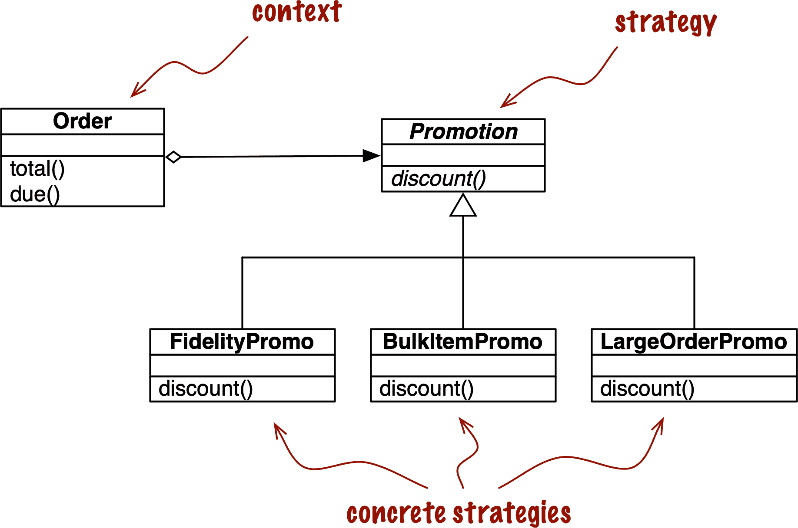
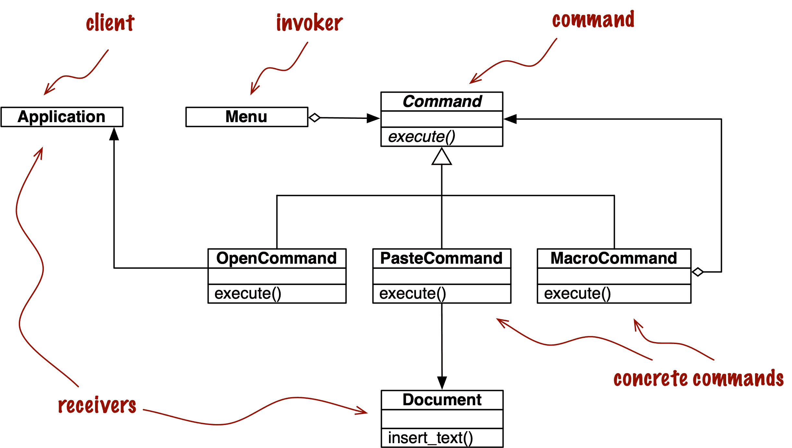

# 第十章：具有一等函数的设计模式

> 符合模式并不是好坏的衡量标准。
> 
> 拉尔夫·约翰逊，*设计模式*经典著作的合著者¹

在软件工程中，[*设计模式*](https://fpy.li/10-1)是解决常见设计问题的通用配方。你不需要了解设计模式来阅读本章。我将解释示例中使用的模式。

编程中设计模式的使用被*设计模式：可复用面向对象软件的元素*（Addison-Wesley）一书所推广，作者是 Erich Gamma、Richard Helm、Ralph Johnson 和 John Vlissides，也被称为“四人组”。这本书是一个包含 23 种模式的目录，其中有用 C++代码示例的类排列，但也被认为在其他面向对象语言中也很有用。

尽管设计模式是与语言无关的，但这并不意味着每种模式都适用于每种语言。例如，第十七章将展示在 Python 中模拟[Iterator](https://fpy.li/10-2)模式的配方是没有意义的，因为该模式已嵌入在语言中，并以生成器的形式准备好使用，不需要类来工作，并且比经典配方需要更少的代码。

*设计模式*的作者在介绍中承认，实现语言决定了哪些模式是相关的：

> 编程语言的选择很重要，因为它影响一个人的观点。我们的模式假设具有 Smalltalk/C++级别的语言特性，这种选择决定了什么可以轻松实现，什么不能。如果我们假设过程式语言，我们可能会包括称为“继承”、“封装”和“多态性”的设计模式。同样，一些我们的模式直接受到不太常见的面向对象语言的支持。例如，CLOS 具有多方法，这减少了像 Visitor 这样的模式的需求²

在他 1996 年的演讲中，[“动态语言中的设计模式”](https://fpy.li/norvigdp)，Peter Norvig 指出原始*设计模式*书中的 23 种模式中有 16 种在动态语言中变得“不可见或更简单”（幻灯片 9）。他谈到的是 Lisp 和 Dylan 语言，但许多相关的动态特性也存在于 Python 中。特别是在具有一等函数的语言环境中，Norvig 建议重新思考被称为 Strategy、Command、Template Method 和 Visitor 的经典模式。

本章的目标是展示如何——在某些情况下——函数可以像类一样完成工作，代码更易读且更简洁。我们将使用函数作为对象重构 Strategy 的实现，消除大量样板代码。我们还将讨论简化 Command 模式的类似方法。

# 本章的新内容

我将这一章移到第三部分的末尾，这样我就可以在“装饰增强的 Strategy 模式”中应用注册装饰器，并在示例中使用类型提示。本章中使用的大多数类型提示并不复杂，它们确实有助于可读性。

# 案例研究：重构 Strategy

Strategy 是一个很好的设计模式示例，在 Python 中，如果你利用函数作为一等对象，它可能会更简单。在接下来的部分中，我们使用*设计模式*中描述的“经典”结构来描述和实现 Strategy。如果你熟悉经典模式，可以直接跳到“面向函数的 Strategy”，我们将使用函数重构代码，显著减少行数。

## 经典 Strategy

图 10-1 中的 UML 类图描述了展示 Strategy 模式的类排列。



###### 图 10-1\. 使用策略设计模式实现订单折扣处理的 UML 类图。

*设计模式* 中对策略模式的总结如下：

> 定义一组算法家族，封装每个算法，并使它们可以互换。策略让算法独立于使用它的客户端变化。

在电子商务领域中应用策略的一个明显例子是根据客户属性或订购商品的检查计算订单折扣。

考虑一个在线商店，具有以下折扣规则：

+   拥有 1,000 或更多忠诚积分的顾客每个订单可以获得全局 5% 的折扣。

+   每个订单中有 20 个或更多单位的行项目都会获得 10% 的折扣。

+   至少有 10 个不同商品的订单可以获得 7% 的全局折扣。

为简洁起见，假设订单只能应用一个折扣。

策略模式的 UML 类图在 图 10-1 中描述。参与者有：

上下文

通过将一些计算委托给实现替代算法的可互换组件来提供服务。在电子商务示例中，上下文是一个 `Order`，它被配置为根据几种算法之一应用促销折扣。

策略

实现不同算法的组件之间的公共接口。在我们的例子中，这个角色由一个名为 `Promotion` 的抽象类扮演。

具体策略

Strategy 的具体子类之一。`FidelityPromo`、`BulkPromo` 和 `LargeOrderPromo` 是实现的三个具体策略。

示例 10-1 中的代码遵循 图 10-1 中的蓝图。如 *设计模式* 中所述，具体策略由上下文类的客户端选择。在我们的例子中，在实例化订单之前，系统会以某种方式选择促销折扣策略并将其传递给 `Order` 构造函数。策略的选择超出了模式的范围。

##### 示例 10-1\. 实现具有可插入折扣策略的 `Order` 类

```py
from abc import ABC, abstractmethod
from collections.abc import Sequence
from decimal import Decimal
from typing import NamedTuple, Optional

class Customer(NamedTuple):
    name: str
    fidelity: int

class LineItem(NamedTuple):
    product: str
    quantity: int
    price: Decimal

    def total(self) -> Decimal:
        return self.price * self.quantity

class Order(NamedTuple):  # the Context
    customer: Customer
    cart: Sequence[LineItem]
    promotion: Optional['Promotion'] = None

    def total(self) -> Decimal:
        totals = (item.total() for item in self.cart)
        return sum(totals, start=Decimal(0))

    def due(self) -> Decimal:
        if self.promotion is None:
            discount = Decimal(0)
        else:
            discount = self.promotion.discount(self)
        return self.total() - discount

    def __repr__(self):
        return f'<Order total: {self.total():.2f} due: {self.due():.2f}>'

class Promotion(ABC):  # the Strategy: an abstract base class
    @abstractmethod
    def discount(self, order: Order) -> Decimal:
        """Return discount as a positive dollar amount"""

class FidelityPromo(Promotion):  # first Concrete Strategy
    """5% discount for customers with 1000 or more fidelity points"""

    def discount(self, order: Order) -> Decimal:
        rate = Decimal('0.05')
        if order.customer.fidelity >= 1000:
            return order.total() * rate
        return Decimal(0)

class BulkItemPromo(Promotion):  # second Concrete Strategy
    """10% discount for each LineItem with 20 or more units"""

    def discount(self, order: Order) -> Decimal:
        discount = Decimal(0)
        for item in order.cart:
            if item.quantity >= 20:
                discount += item.total() * Decimal('0.1')
        return discount

class LargeOrderPromo(Promotion):  # third Concrete Strategy
    """7% discount for orders with 10 or more distinct items"""

    def discount(self, order: Order) -> Decimal:
        distinct_items = {item.product for item in order.cart}
        if len(distinct_items) >= 10:
            return order.total() * Decimal('0.07')
        return Decimal(0)
```

请注意，在 示例 10-1 中，我将 `Promotion` 编码为抽象基类（ABC），以使用 `@abstractmethod` 装饰器并使模式更加明确。

示例 10-2 展示了用于演示和验证实现前述规则的模块操作的 doctests。

##### 示例 10-2\. 应用不同促销策略的 `Order` 类的示例用法

```py
 >>> joe = Customer('John Doe', 0) # ①
 >>> ann = Customer('Ann Smith', 1100) >>> cart = (LineItem('banana', 4, Decimal('.5')), # ②
 ...         LineItem('apple', 10, Decimal('1.5')), ...         LineItem('watermelon', 5, Decimal(5))) >>> Order(joe, cart, FidelityPromo()) # ③
 <Order total: 42.00 due: 42.00> >>> Order(ann, cart, FidelityPromo()) # ④
 <Order total: 42.00 due: 39.90> >>> banana_cart = (LineItem('banana', 30, Decimal('.5')), # ⑤
 ...                LineItem('apple', 10, Decimal('1.5'))) >>> Order(joe, banana_cart, BulkItemPromo()) # ⑥
 <Order total: 30.00 due: 28.50> >>> long_cart = tuple(LineItem(str(sku), 1, Decimal(1)) # ⑦
 ...                  for sku in range(10)) >>> Order(joe, long_cart, LargeOrderPromo()) # ⑧
 <Order total: 10.00 due: 9.30> >>> Order(joe, cart, LargeOrderPromo()) <Order total: 42.00 due: 42.00>
```

①

两位顾客：`joe` 没有忠诚积分，`ann` 有 1,100 积分。

②

一个购物车有三个行项目。

③

`FidelityPromo` 促销不给 `joe` 任何折扣。

④

`ann` 因为拥有至少 1,000 积分，所以可以获得 5% 的折扣。

⑤

`banana_cart` 有 30 个单位的 `"banana"` 产品和 10 个苹果。

⑥

由于 `BulkItemPromo`，`joe` 在香蕉上获得 $1.50 的折扣。

⑦

`long_cart` 有 10 个不同的商品，每个商品价格为 $1.00。

⑧

`joe` 因为 `LargerOrderPromo` 而获得整个订单 7% 的折扣。

示例 10-1 可以完美地运行，但是在 Python 中可以使用函数作为对象来实现相同的功能，代码更少。下一节将展示如何实现。

## 面向函数的策略

示例 10-1 中的每个具体策略都是一个只有一个方法`discount`的类。此外，策略实例没有状态（没有实例属性）。你可以说它们看起来很像普通函数，你说得对。示例 10-3 是示例 10-1 的重构，用简单函数替换具体策略并移除`Promo`抽象类。在`Order`类中只需要做出小的调整。³

##### 示例 10-3。`Order`类中实现的折扣策略作为函数

```py
from collections.abc import Sequence
from dataclasses import dataclass
from decimal import Decimal
from typing import Optional, Callable, NamedTuple

class Customer(NamedTuple):
    name: str
    fidelity: int

class LineItem(NamedTuple):
    product: str
    quantity: int
    price: Decimal

    def total(self):
        return self.price * self.quantity

@dataclass(frozen=True)
class Order:  # the Context
    customer: Customer
    cart: Sequence[LineItem]
    promotion: Optional[Callable[['Order'], Decimal]] = None  # ①

    def total(self) -> Decimal:
        totals = (item.total() for item in self.cart)
        return sum(totals, start=Decimal(0))

    def due(self) -> Decimal:
        if self.promotion is None:
            discount = Decimal(0)
        else:
            discount = self.promotion(self)  # ②
        return self.total() - discount

    def __repr__(self):
        return f'<Order total: {self.total():.2f} due: {self.due():.2f}>'

# ③

def fidelity_promo(order: Order) -> Decimal:  # ④
    """5% discount for customers with 1000 or more fidelity points"""
    if order.customer.fidelity >= 1000:
        return order.total() * Decimal('0.05')
    return Decimal(0)

def bulk_item_promo(order: Order) -> Decimal:
    """10% discount for each LineItem with 20 or more units"""
    discount = Decimal(0)
    for item in order.cart:
        if item.quantity >= 20:
            discount += item.total() * Decimal('0.1')
    return discount

def large_order_promo(order: Order) -> Decimal:
    """7% discount for orders with 10 or more distinct items"""
    distinct_items = {item.product for item in order.cart}
    if len(distinct_items) >= 10:
        return order.total() * Decimal('0.07')
    return Decimal(0)
```

①

这个类型提示说：`promotion`可能是`None`，也可能是一个接受`Order`参数并返回`Decimal`的可调用对象。

②

要计算折扣，请调用`self.promotion`可调用对象，并传递`self`作为参数。请查看下面的提示原因。

③

没有抽象类。

④

每个策略都是一个函数。

# 为什么是 self.promotion(self)?

在`Order`类中，`promotion`不是一个方法。它是一个可调用的实例属性。因此，表达式的第一部分`self.promotion`检索到了可调用对象。要调用它，我们必须提供一个`Order`实例，而在这种情况下是`self`。这就是为什么在表达式中`self`出现两次的原因。

“方法是描述符”将解释将方法自动绑定到实例的机制。这不适用于`promotion`，因为它不是一个方法。

示例 10-3 中的代码比示例 10-1 要短。使用新的`Order`也更简单，如示例 10-4 中的 doctests 所示。

##### 示例 10-4。`Order`类使用函数作为促销的示例用法

```py
 >>> joe = Customer('John Doe', 0) # ①
 >>> ann = Customer('Ann Smith', 1100) >>> cart = [LineItem('banana', 4, Decimal('.5')), ...         LineItem('apple', 10, Decimal('1.5')), ...         LineItem('watermelon', 5, Decimal(5))] >>> Order(joe, cart, fidelity_promo) # ②
 <Order total: 42.00 due: 42.00> >>> Order(ann, cart, fidelity_promo) <Order total: 42.00 due: 39.90> >>> banana_cart = [LineItem('banana', 30, Decimal('.5')), ...                LineItem('apple', 10, Decimal('1.5'))] >>> Order(joe, banana_cart, bulk_item_promo) # ③
 <Order total: 30.00 due: 28.50> >>> long_cart = [LineItem(str(item_code), 1, Decimal(1)) ...               for item_code in range(10)] >>> Order(joe, long_cart, large_order_promo) <Order total: 10.00 due: 9.30> >>> Order(joe, cart, large_order_promo) <Order total: 42.00 due: 42.00>
```

①

与示例 10-1 相同的测试固定装置。

②

要将折扣策略应用于`Order`，只需将促销函数作为参数传递。

③

这里和下一个测试中使用了不同的促销函数。

注意示例 10-4 中的标注——每个新订单不需要实例化一个新的促销对象：这些函数已经准备好使用。

有趣的是，在*设计模式*中，作者建议：“策略对象通常是很好的享元。”⁴ 该作品的另一部分中对享元模式的定义是：“享元是一个可以在多个上下文中同时使用的共享对象。”⁵ 建议共享以减少在每个新上下文中重复应用相同策略时创建新具体策略对象的成本——在我们的例子中，每个新的`Order`实例。因此，为了克服策略模式的一个缺点——运行时成本——作者建议应用另一种模式。同时，您的代码行数和维护成本正在积累。

一个更棘手的用例，具有内部状态的复杂具体策略可能需要将策略和享元设计模式的所有部分结合起来。但通常具体策略没有内部状态；它们只处理来自上下文的数据。如果是这种情况，那么请务必使用普通的函数，而不是编写实现单方法接口的单方法类的单方法类。函数比用户定义类的实例更轻量级，而且不需要享元，因为每个策略函数在 Python 进程加载模块时只创建一次。一个普通函数也是“一个可以同时在多个上下文中使用的共享对象”。

现在我们已经使用函数实现了策略模式，其他可能性也出现了。假设您想创建一个“元策略”，为给定的`Order`选择最佳可用折扣。在接下来的几节中，我们研究了使用各种方法利用函数和模块作为对象实现此要求的额外重构。

## 选择最佳策略：简单方法

在示例 10-4 中的测试中给定相同的顾客和购物车，我们现在在示例 10-5 中添加了三个额外的测试。

##### 示例 10-5。`best_promo`函数应用所有折扣并返回最大值

```py
    >>> Order(joe, long_cart, best_promo)  # ①
    <Order total: 10.00 due: 9.30>
    >>> Order(joe, banana_cart, best_promo)  # ②
    <Order total: 30.00 due: 28.50>
    >>> Order(ann, cart, best_promo)  # ③
    <Order total: 42.00 due: 39.90>
```

①

`best_promo`为顾客`joe`选择了`larger_order_promo`。

②

这里`joe`因为订购了大量香蕉而从`bulk_item_promo`获得了折扣。

③

使用一个简单的购物车结账，`best_promo`为忠实顾客`ann`提供了`fidelity_promo`的折扣。

`best_promo`的实现非常简单。参见示例 10-6。

##### 示例 10-6。`best_promo`在函数列表上迭代找到最大折扣

```py
promos = [fidelity_promo, bulk_item_promo, large_order_promo]  # ①

def best_promo(order: Order) -> Decimal:  # ②
    """Compute the best discount available"""
    return max(promo(order) for promo in promos)  # ③
```

①

`promos`：作为函数实现的策略列表。

②

`best_promo`接受`Order`的实例作为参数，其他`*_promo`函数也是如此。

③

使用生成器表达式，我们将`promos`中的每个函数应用于`order`，并返回计算出的最大折扣。

示例 10-6 很简单：`promos`是一个函数列表。一旦您习惯于函数是一等对象的概念，自然而然地会发现构建包含函数的数据结构通常是有意义的。

尽管示例 10-6 有效且易于阅读，但存在一些重复代码可能导致微妙的错误：要添加新的促销策略，我们需要编写该函数并记得将其添加到`promos`列表中，否则新的促销将在显式传递给`Order`时起作用，但不会被`best_promotion`考虑。

继续阅读解决此问题的几种解决方案。

## 在模块中查找策略

Python 中的模块也是头等对象，标准库提供了几个函数来处理它们。Python 文档中对内置的`globals`描述如下：

`globals()`

返回表示当前全局符号表的字典。这始终是当前模块的字典（在函数或方法内部，这是定义它的模块，而不是调用它的模块）。

示例 10-7 是一种有些巧妙的使用`globals`来帮助`best_promo`自动找到其他可用的`*_promo`函数的方法。

##### 示例 10-7。`promos`列表是通过检查模块全局命名空间构建的

```py
from decimal import Decimal
from strategy import Order
from strategy import (
    fidelity_promo, bulk_item_promo, large_order_promo  # ①
)

promos = promo for name, promo in globals().items()  ![2                if name.endswith('_promo') and        # ③
                   name != 'best_promo'               # ④
]

def best_promo(order: Order) -> Decimal:              # ⑤
    """Compute the best discount available"""
    return max(promo(order) for promo in promos)
```

①

导入促销函数，以便它们在全局命名空间中可用。⁶

②

遍历 `globals()` 返回的 `dict` 中的每个项目。

③

仅选择名称以 `_promo` 结尾的值，并…

④

…过滤掉 `best_promo` 本身，以避免在调用 `best_promo` 时出现无限递归。

⑤

`best_promo` 没有变化。

收集可用促销的另一种方法是创建一个模块，并将所有策略函数放在那里，除了 `best_promo`。

在 示例 10-8 中，唯一的显著变化是策略函数列表是通过内省一个名为 `promotions` 的单独模块构建的。请注意，示例 10-8 依赖于导入 `promotions` 模块以及提供高级内省函数的 `inspect`。

##### 示例 10-8\. `promos` 列表通过检查新的 `promotions` 模块进行内省构建

```py
from decimal import Decimal
import inspect

from strategy import Order
import promotions

promos = [func for _, func in inspect.getmembers(promotions, inspect.isfunction)]

def best_promo(order: Order) -> Decimal:
    """Compute the best discount available"""
    return max(promo(order) for promo in promos)
```

函数 `inspect.getmembers` 返回对象的属性—在本例中是 `promotions` 模块—可选择通过谓词（布尔函数）进行过滤。我们使用 `inspect.isfunction` 仅从模块中获取函数。

示例 10-8 不受函数名称的影响；重要的是 `promotions` 模块只包含计算订单折扣的函数。当然，这是代码的一个隐含假设。如果有人在 `promotions` 模块中创建一个具有不同签名的函数，那么在尝试将其应用于订单时，`best_promo` 将会出错。

我们可以添加更严格的测试来过滤函数，例如检查它们的参数。示例 10-8 的重点不是提供一个完整的解决方案，而是强调模块内省的一个可能用法。

一个更明确的动态收集促销折扣函数的替代方法是使用一个简单的装饰器。接下来就是这个。

# 装饰器增强策略模式

回想一下我们对 示例 10-6 的主要问题是在函数定义中重复函数名称，然后在 `promos` 列表中重复使用这些名称，供 `best_promo` 函数确定适用的最高折扣。重复是有问题的，因为有人可能会添加一个新的促销策略函数，并忘记手动将其添加到 `promos` 列表中——在这种情况下，`best_promo` 将悄悄地忽略新策略，在系统中引入一个微妙的错误。示例 10-9 使用了 “注册装饰器” 中介绍的技术解决了这个问题。

##### 示例 10-9\. `promos` 列表由 `Promotion` 装饰器填充

```py
Promotion = Callable[[Order], Decimal]

promos: list[Promotion] = []  # ①

def promotion(promo: Promotion) -> Promotion:  # ②
    promos.append(promo)
    return promo

def best_promo(order: Order) -> Decimal:
    """Compute the best discount available"""
    return max(promo(order) for promo in promos)  # ③

@promotion  # ④
def fidelity(order: Order) -> Decimal:
    """5% discount for customers with 1000 or more fidelity points"""
    if order.customer.fidelity >= 1000:
        return order.total() * Decimal('0.05')
    return Decimal(0)

@promotion
def bulk_item(order: Order) -> Decimal:
    """10% discount for each LineItem with 20 or more units"""
    discount = Decimal(0)
    for item in order.cart:
        if item.quantity >= 20:
            discount += item.total() * Decimal('0.1')
    return discount

@promotion
def large_order(order: Order) -> Decimal:
    """7% discount for orders with 10 or more distinct items"""
    distinct_items = {item.product for item in order.cart}
    if len(distinct_items) >= 10:
        return order.total() * Decimal('0.07')
    return Decimal(0)
```

①

`promos` 列表是一个模块全局变量，并且初始为空。

②

`Promotion` 是一个注册装饰器：它返回未更改的 `promo` 函数，并将其附加到 `promos` 列表中。

③

`best_promo` 不需要更改，因为它依赖于 `promos` 列表。

④

任何被 `@promotion` 装饰的函数都将被添加到 `promos` 中。

这种解决方案比之前提出的其他解决方案有几个优点：

+   促销策略函数不必使用特殊名称—不需要 `_promo` 后缀。

+   `@promotion`装饰器突出了被装饰函数的目的，并且使得暂时禁用促销变得容易：只需注释掉装饰器。

+   促销折扣策略可以在系统中的任何其他模块中定义，只要对它们应用`@promotion`装饰器。

在下一节中，我们将讨论命令——另一个设计模式，有时通过单方法类实现，而普通函数也可以胜任。

# 命令模式

命令是另一个设计模式，可以通过将函数作为参数传递来简化。图 10-2 显示了命令模式中类的排列。



###### 图 10-2。使用命令设计模式实现的菜单驱动文本编辑器的 UML 类图。每个命令可能有不同的接收者：实现动作的对象。对于`PasteCommand`，接收者是文档。对于`OpenCommand`，接收者是应用程序。

命令的目标是将调用操作的对象（调用者）与实现它的提供对象（接收者）解耦。在《设计模式》中的示例中，每个调用者是图形应用程序中的菜单项，而接收者是正在编辑的文档或应用程序本身。

思路是在两者之间放置一个`Command`对象，实现一个具有单个方法`execute`的接口，该方法调用接收者中的某个方法执行所需的操作。这样，调用者不需要知道接收者的接口，不同的接收者可以通过不同的`Command`子类进行适配。调用者配置具体命令并调用其`execute`方法来操作它。请注意，在图 10-2 中，`MacroCommand`可以存储一系列命令；其`execute()`方法调用存储的每个命令中的相同方法。

引用自《设计模式》，“命令是回调的面向对象替代品。”问题是：我们是否需要回调的面向对象替代品？有时是，但并非总是。

我们可以简单地给调用者一个函数，而不是给一个`Command`实例。调用者可以直接调用`command()`，而不是调用`command.execute()`。`MacroCommand`可以用实现`__call__`的类来实现。`MacroCommand`的实例将是可调用对象，每个对象都保存着未来调用的函数列表，就像在示例 10-10 中实现的那样。

##### 示例 10-10。每个`MacroCommand`实例都有一个内部命令列表

```py
class MacroCommand:
    """A command that executes a list of commands"""

    def __init__(self, commands):
        self.commands = list(commands)  # ①

    def __call__(self):
        for command in self.commands:  # ②
            command()
```

①

从`commands`参数构建列表确保它是可迭代的，并在每个`MacroCommand`实例中保留命令引用的本地副本。

②

当调用`MacroCommand`的实例时，`self.commands`中的每个命令按顺序调用。

命令模式的更高级用法——支持撤销，例如——可能需要更多于简单回调函数的内容。即使如此，Python 提供了几种值得考虑的替代方案：

+   像示例 10-10 中的`MacroCommand`一样的可调用实例可以保持必要的任何状态，并提供除`__call__`之外的额外方法。

+   闭包可以用来在函数调用之间保存内部状态。

这里我们重新思考了使用一等函数的命令模式。在高层次上，这里的方法与我们应用于策略模式的方法类似：用可调用对象替换实现单方法接口的参与者类的实例。毕竟，每个 Python 可调用对象都实现了单方法接口，而该方法被命名为`__call__`。

# 章节总结

正如 Peter Norvig 在经典《设计模式》书籍出现几年后指出的，“23 个模式中有 16 个模式在 Lisp 或 Dylan 中的某些用法上比在 C++ 中具有质量上更简单的实现”（Norvig 的 [“动态语言中的设计模式”演示文稿第 9 页](https://fpy.li/10-4)）。Python 共享 Lisp 和 Dylan 语言的一些动态特性，特别是一流函数，这是我们在本书的这部分关注的重点。

从本章开头引用的同一次演讲中，在反思《设计模式：可复用面向对象软件的元素》20 周年时，Ralph Johnson 表示该书的一个失败之处是：“过分强调模式作为设计过程中的终点而不是步骤。”⁷ 在本章中，我们以策略模式作为起点：一个我们可以使用一流函数简化的工作解决方案。

在许多情况下，函数或可调用对象提供了在 Python 中实现回调的更自然的方式，而不是模仿 Gamma、Helm、Johnson 和 Vlissides 在《设计模式》中描述的策略或命令模式。本章中策略的重构和命令的讨论是更一般洞察的例子：有时你可能会遇到一个设计模式或一个需要组件实现一个具有单一方法的接口的 API，而该方法具有一个泛泛的名称，如“execute”、“run”或“do_it”。在 Python 中，这种模式或 API 通常可以使用函数作为一流对象来实现，减少样板代码。

# 进一步阅读

在《Python Cookbook，第三版》中，“配方 8.21 实现访问者模式”展示了一个优雅的访问者模式实现，其中一个 `NodeVisitor` 类处理方法作为一流对象。

在设计模式的一般主题上，Python 程序员的阅读选择并不像其他语言社区那样广泛。

*Learning Python Design Patterns*，作者是 Gennadiy Zlobin（Packt），是我见过的唯一一本完全致力于 Python 中模式的书。但 Zlobin 的作品相当简短（100 页），涵盖了原始 23 个设计模式中的 8 个。

*Expert Python Programming*，作者是 Tarek Ziadé（Packt），是市场上最好的中级 Python 书籍之一，其最后一章“有用的设计模式”从 Python 视角呈现了几个经典模式。

Alex Martelli 关于 Python 设计模式的几次演讲。有他的一个 [EuroPython 2011 演讲视频](https://fpy.li/10-5) 和一个 [他个人网站上的幻灯片集](https://fpy.li/10-6)。多年来我发现了不同长度的幻灯片和视频，所以值得彻底搜索他的名字和“Python 设计模式”这几个词。一位出版商告诉我 Martelli 正在撰写一本关于这个主题的书。当它出版时，我一定会买。

在 Java 上下文中有许多关于设计模式的书籍，但其中我最喜欢的是*Head First Design Patterns*，第二版，作者是埃里克·弗里曼和伊丽莎白·罗布森（O’Reilly）。它解释了 23 个经典模式中的 16 个。如果你喜欢*Head First*系列的古怪风格，并需要对这个主题有一个介绍，你会喜欢这部作品。它以 Java 为中心，但第二版已经更新，以反映 Java 中添加了一流函数，使得一些示例更接近我们在 Python 中编写的代码。

从动态语言的角度，具有鸭子类型和一流函数的视角重新审视模式，《Design Patterns in Ruby》作者是 Russ Olsen（Addison-Wesley）提供了许多见解，这些见解也适用于 Python。尽管它们在语法上有许多差异，在语义层面上，Python 和 Ruby 更接近于彼此，而不是 Java 或 C++。

在[“动态语言中的设计模式”](https://fpy.li/norvigdp)（幻灯片）中，彼得·诺维格展示了头等函数（和其他动态特性）如何使原始设计模式中的一些模式变得更简单或不再必要。

原著*设计模式*书的介绍由 Gamma 等人撰写，其价值超过了书中的 23 种模式目录，其中包括从非常重要到很少有用的配方。广为引用的设计原则，“针对接口编程，而不是实现”和“优先使用对象组合而非类继承”，都来自该介绍部分。

将模式应用于设计最初源自建筑师克里斯托弗·亚历山大等人，在书籍*模式语言*（牛津大学出版社）中展示。亚历山大的想法是创建一个标准词汇，使团队在设计建筑时能够共享共同的设计决策。M. J. 多米努斯撰写了[“‘设计模式’并非如此”](https://fpy.li/10-7)，一个引人入胜的幻灯片和附录文本，论证了亚历山大原始模式的愿景更加深刻，更加人性化，也适用于软件工程。

¹ 来自拉尔夫·约翰逊在 IME/CCSL，圣保罗大学，2014 年 11 月 15 日展示的“设计模式中一些故障的根本原因分析”演讲中的幻灯片。

² 引自*设计模式*第 4 页。

³ 由于 Mypy 中的一个错误，我不得不使用`@dataclass`重新实现`Order`。您可以忽略这个细节，因为这个类与`NamedTuple`一样工作，就像示例 10-1 中一样。如果`Order`是一个`NamedTuple`，当检查`promotion`的类型提示时，Mypy 0.910 会崩溃。我尝试在特定行添加`# type ignore`，但 Mypy 仍然崩溃。如果使用`@dataclass`构建`Order`，Mypy 会正确处理相同的类型提示。截至 2021 年 7 月 19 日，[问题＃9397](https://fpy.li/10-3)尚未解决。希望在您阅读此文时已经修复。

⁴ 请参阅*设计模式*第 323 页。

⁵ 同上，第 196 页。

⁶ flake8 和 VS Code 都抱怨这些名称被导入但未被使用。根据定义，静态分析工具无法理解 Python 的动态特性。如果我们听从这些工具的每一个建议，我们很快就会用 Python 语法编写冗长且令人沮丧的类似 Java 的代码。

⁷ “设计模式中一些故障的根本原因分析”，由约翰逊在 IME-USP 于 2014 年 11 月 15 日展示。
