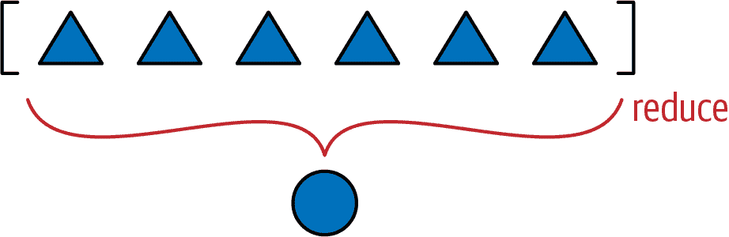
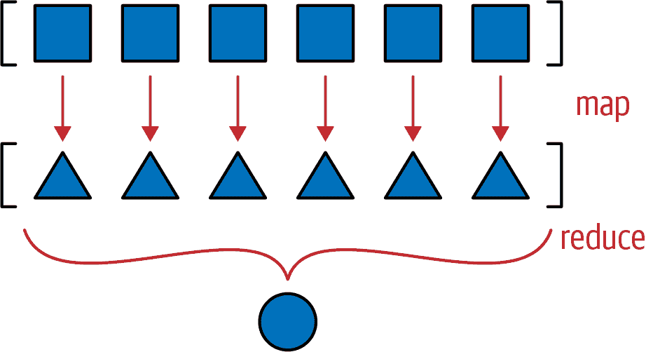

# 第十二章：序列的特殊方法

> 不要检查它是否是一只鸭子：检查它是否像一只鸭子一样*嘎嘎叫*，*走路*，等等，具体取决于你需要与之进行语言游戏的鸭子行为子集。(`comp.lang.python`，2000 年 7 月 26 日)
> 
> Alex Martelli

在本章中，我们将创建一个表示多维`Vector`类的类——这是从第十一章的二维`Vector2d`中迈出的重要一步。`Vector`将表现得像一个标准的 Python 不可变的扁平序列。它的元素将是浮点数，并且在本章结束时将支持以下功能：

+   基本序列协议：`__len__`和`__getitem__`

+   安全表示具有许多项目的实例

+   适当的切片支持，生成新的`Vector`实例

+   聚合哈希，考虑每个包含元素的值

+   自定义格式化语言扩展

我们还将使用`__getattr__`实现动态属性访问，以替换我们在`Vector2d`中使用的只读属性——尽管这不是序列类型的典型做法。

代码密集的展示将被一个关于协议作为非正式接口的概念讨论所打断。我们将讨论协议和*鸭子类型*的关系，以及当你创建自己的类型时的实际影响。

# 本章的新内容

本章没有重大变化。在“协议和鸭子类型”末尾附近的提示框中有一个新的`typing.Protocol`的简短讨论。

在“一个切片感知的 __getitem__”中，示例 12-6 中`__getitem__`的实现比第一版更简洁和健壮，这要归功于鸭子类型和`operator.index`。这种变化延续到了本章和第十六章中对`Vector`的后续实现。

让我们开始吧。

# Vector：用户定义的序列类型

我们实现`Vector`的策略将是使用组合，而不是继承。我们将把分量存储在一个浮点数的数组中，并将实现`Vector`所需的方法，使其表现得像一个不可变的扁平序列。

但在我们实现序列方法之前，让我们确保我们有一个基线实现的`Vector`，它与我们先前的`Vector2d`类兼容——除非这种兼容性没有意义。

# Vector 第一版：与 Vector2d 兼容

`Vector`的第一个版本应尽可能与我们先前的`Vector2d`类兼容。

但是，按设计，`Vector`构造函数与`Vector2d`构造函数不兼容。我们可以通过在`__init__`中使用`*args`来接受任意数量的参数使`Vector(3, 4)`和`Vector(3, 4, 5)`起作用，但是序列构造函数的最佳实践是在构造函数中将数据作为可迭代参数接受，就像所有内置序列类型一样。示例 12-1 展示了实例化我们新的`Vector`对象的一些方法。

##### 示例 12-1。`Vector.__init__`和`Vector.__repr__`的测试

```py
>>> Vector([3.1, 4.2])
Vector([3.1, 4.2])
>>> Vector((3, 4, 5))
Vector([3.0, 4.0, 5.0])
>>> Vector(range(10))
Vector([0.0, 1.0, 2.0, 3.0, 4.0, ...])
```

除了一个新的构造函数签名外，我确保了我对`Vector2d`（例如，`Vector2d(3, 4)`）进行的每个测试都通过并产生了与两个分量`Vector([3, 4])`相同的结果。

###### 警告

当一个`Vector`有超过六个分量时，`repr()`产生的字符串会被缩写为`...`，就像在示例 12-1 的最后一行中看到的那样。这在可能包含大量项目的任何集合类型中至关重要，因为`repr`用于调试，你不希望一个大对象在控制台或日志中跨越数千行。使用`reprlib`模块生成有限长度的表示，就像示例 12-2 中那样。`reprlib`模块在 Python 2.7 中被命名为`repr`。

示例 12-2 列出了我们第一个版本的`Vector`的实现（此示例基于示例 11-2 和 11-3 中显示的代码）。

##### 示例 12-2\. vector_v1.py：派生自 vector2d_v1.py

```py
from array import array
import reprlib
import math

class Vector:
    typecode = 'd'

    def __init__(self, components):
        self._components = array(self.typecode, components)  # ①

    def __iter__(self):
        return iter(self._components)  # ②

    def __repr__(self):
        components = reprlib.repr(self._components)  # ③
        components = components[components.find('['):-1]  # ④
        return f'Vector({components})'

    def __str__(self):
        return str(tuple(self))

    def __bytes__(self):
        return (bytes([ord(self.typecode)]) +
                bytes(self._components))  # ⑤

    def __eq__(self, other):
        return tuple(self) == tuple(other)

    def __abs__(self):
        return math.hypot(*self)  # ⑥

    def __bool__(self):
        return bool(abs(self))

    @classmethod
    def frombytes(cls, octets):
        typecode = chr(octets[0])
        memv = memoryview(octets[1:]).cast(typecode)
        return cls(memv)  # ⑦
```

①

`self._components`实例“受保护”的属性将保存带有`Vector`组件的`array`。

②

为了允许迭代，我们返回一个`self._components`上的迭代器。¹

③

使用`reprlib.repr()`获取`self._components`的有限长度表示（例如，`array('d', [0.0, 1.0, 2.0, 3.0, 4.0, ...])`）。

④

在将字符串插入`Vector`构造函数调用之前，删除`array('d',`前缀和尾随的`)`。

⑤

直接从`self._components`构建一个`bytes`对象。

⑥

自 Python 3.8 起，`math.hypot`接受 N 维点。我之前使用过这个表达式：`math.sqrt(sum(x * x for x in self))`。

⑦

与之前的`frombytes`唯一需要更改的地方在于最后一行：我们直接将`memoryview`传递给构造函数，而不像之前那样使用`*`进行解包。

我使用`reprlib.repr`的方式值得一提。该函数通过限制输出字符串的长度并用`'...'`标记截断来生成大型或递归结构的安全表示。我希望`Vector`的`repr`看起来像`Vector([3.0, 4.0, 5.0])`而不是`Vector(array('d', [3.0, 4.0, 5.0]))`，因为`Vector`内部有一个`array`是一个实现细节。因为这些构造函数调用构建了相同的`Vector`对象，我更喜欢使用带有`list`参数的更简单的语法。

在编写`__repr__`时，我本可以使用这个表达式生成简化的`components`显示：`reprlib.repr(list(self._components))`。然而，这样做是浪费的，因为我需要将每个项从`self._components`复制到一个`list`中，只是为了使用`list`的`repr`。相反，我决定直接将`reprlib.repr`应用于`self._components`数组，并在`[]`之外截断字符。这就是示例 12-2 中`__repr__`的第二行所做的事情。

###### 提示

由于在调试中的作用，对对象调用`repr()`不应引发异常。如果在`__repr__`的实现中出现问题，您必须处理该问题，并尽力产生一些可用的输出，以便用户有机会识别接收者（`self`）。

请注意，`__str__`、`__eq__`和`__bool__`方法与`Vector2d`中保持不变，`frombytes`中只有一个字符发生了变化（最后一行删除了一个`*`）。这是使原始`Vector2d`可迭代的好处之一。

顺便说一句，我们本可以从`Vector2d`中派生`Vector`，但出于两个原因我选择不这样做。首先，不兼容的构造函数确实使得子类化不可取。我可以通过在`__init__`中进行一些巧妙的参数处理来解决这个问题，但第二个原因更重要：我希望`Vector`是一个独立的实现序列协议的类的示例。这就是我们接下来要做的事情，在讨论术语*协议*之后。

# 协议和鸭子类型

早在第一章中，我们就看到在 Python 中创建一个完全功能的序列类型并不需要继承任何特殊类；你只需要实现满足序列协议的方法。但我们在谈论什么样的协议呢？

在面向对象编程的上下文中，协议是一种非正式接口，仅在文档中定义，而不在代码中定义。例如，在 Python 中，序列协议仅包括`__len__`和`__getitem__`方法。任何实现这些方法的类`Spam`，具有标准签名和语义，都可以在期望序列的任何地方使用。`Spam`是这个或那个的子类无关紧要；重要的是它提供了必要的方法。我们在示例 1-1 中看到了这一点，在示例 12-3 中重现。

##### 示例 12-3。示例 1-1 中的代码，这里为方便起见重现

```py
import collections

Card = collections.namedtuple('Card', ['rank', 'suit'])

class FrenchDeck:
    ranks = [str(n) for n in range(2, 11)] + list('JQKA')
    suits = 'spades diamonds clubs hearts'.split()

    def __init__(self):
        self._cards = [Card(rank, suit) for suit in self.suits
                                        for rank in self.ranks]

    def __len__(self):
        return len(self._cards)

    def __getitem__(self, position):
        return self._cards[position]
```

示例 12-3 中的`FrenchDeck`类利用了许多 Python 的功能，因为它实现了序列协议，即使在代码中没有声明。有经验的 Python 编程人员会查看它并理解它*是*一个序列，即使它是`object`的子类。我们说它*是*一个序列，因为它*行为*像一个序列，这才是重要的。

这被称为*鸭子类型*，源自亚历克斯·马特利在本章开头引用的帖子。

因为协议是非正式且不受强制执行的，所以如果您知道类将被使用的特定上下文，通常可以只实现协议的一部分。例如，为了支持迭代，只需要`__getitem__`；不需要提供`__len__`。

###### 提示

使用[PEP 544—Protocols: Structural subtyping (static duck typing)](https://fpy.li/pep544)，Python 3.8 支持*协议类*：`typing`构造，我们在“静态协议”中学习过。Python 中这个新用法的“协议”一词具有相关但不同的含义。当我需要区分它们时，我会写*静态协议*来指代协议类中规范化的协议，而*动态协议*则指传统意义上的协议。一个关键区别是静态协议实现必须提供协议类中定义的所有方法。第十三章的“两种协议”有更多细节。

我们现在将在`Vector`中实现序列协议，最初没有适当的切片支持，但稍后会添加。

# Vector 第二版：可切片序列

正如我们在`FrenchDeck`示例中看到的，如果您可以将对象中的序列属性委托给一个序列属性，比如我们的`self._components`数组，那么支持序列协议就非常容易。这些`__len__`和`__getitem__`一行代码是一个很好的开始：

```py
class Vector:
    # many lines omitted
    # ...

    def __len__(self):
        return len(self._components)

    def __getitem__(self, index):
        return self._components[index]
```

有了这些补充，现在所有这些操作都可以正常工作：

```py
>>> v1 = Vector([3, 4, 5])
>>> len(v1)
3
>>> v1[0], v1[-1]
(3.0, 5.0)
>>> v7 = Vector(range(7))
>>> v7[1:4]
array('d', [1.0, 2.0, 3.0])
```

如您所见，即使支持切片，但并不是很好。如果`Vector`的切片也是`Vector`实例而不是`array`，那将更好。旧的`FrenchDeck`类也有类似的问题：当您对其进行切片时，会得到一个`list`。在`Vector`的情况下，当切片产生普通数组时，会丢失很多功能。

考虑内置序列类型：每一个，在切片时，都会产生自己类型的新实例，而不是其他类型的实例。

要使`Vector`生成`Vector`实例作为切片，我们不能简单地将切片委托给`array`。我们需要分析在`__getitem__`中获得的参数并做正确的事情。

现在，让我们看看 Python 如何将语法`my_seq[1:3]`转换为`my_seq.__getitem__(...)`的参数。

## 切片的工作原理

一个示例胜过千言万语，所以看看示例 12-4。

##### 示例 12-4。检查`__getitem__`和切片的行为

```py
>>> class MySeq:
...     def __getitem__(self, index):
...         return index  # ①
...
>>> s = MySeq()
>>> s[1]  # ②
1 >>> s[1:4]  # ③
slice(1, 4, None) >>> s[1:4:2]  # ④
slice(1, 4, 2) >>> s[1:4:2, 9]  # ⑤
(slice(1, 4, 2), 9) >>> s[1:4:2, 7:9]  # ⑥
(slice(1, 4, 2), slice(7, 9, None))
```

①

对于这个演示，`__getitem__`只是返回传递给它的任何内容。

②

单个索引，没什么新鲜事。

③

表示`1:4`变为`slice(1, 4, None)`。

④

`slice(1, 4, 2)`意味着从 1 开始，到 4 结束，步长为 2。

⑤

惊喜：`[]`内部有逗号意味着`__getitem__`接收到一个元组。

⑥

元组甚至可以包含多个`slice`对象。

现在让我们更仔细地看看`slice`本身在示例 12-5 中。

##### 示例 12-5。检查`slice`类的属性

```py
>>> slice  # ①
<class 'slice'> >>> dir(slice) # ②
['__class__', '__delattr__', '__dir__', '__doc__', '__eq__',
 '__format__', '__ge__', '__getattribute__', '__gt__', '__hash__', '__init__', '__le__', '__lt__', '__ne__', '__new__', '__reduce__', '__reduce_ex__', '__repr__', '__setattr__', '__sizeof__', '__str__', '__subclasshook__', 'indices', 'start', 'step', 'stop']
```

①

`slice`是一个内置类型（我们在“切片对象”中首次看到它）。

②

检查一个`slice`，我们发现数据属性`start`、`stop`和`step`，以及一个`indices`方法。

在示例 12-5 中调用`dir(slice)`会显示一个`indices`属性，这个属性实际上是一个非常有趣但鲜为人知的方法。以下是`help(slice.indices)`的内容：

`S.indices(len) -> (start, stop, stride)`

假设长度为`len`的序列，计算由`S`描述的扩展切片的`start`和`stop`索引以及`stride`长度。超出边界的索引会像在正常切片中一样被截断。

换句话说，`indices`暴露了内置序列中实现的复杂逻辑，以优雅地处理缺失或负索引以及比原始序列长的切片。这个方法生成针对给定长度序列的非负`start`、`stop`和`stride`整数的“标准化”元组。

这里有几个例子，考虑一个长度为`len == 5`的序列，例如，`'ABCDE'`：

```py
>>> slice(None, 10, 2).indices(5)  # ①
(0, 5, 2) >>> slice(-3, None, None).indices(5)  # ②
(2, 5, 1)
```

①

`'ABCDE'[:10:2]`等同于`'ABCDE'[0:5:2]`。

②

`'ABCDE'[-3:]`等同于`'ABCDE'[2:5:1]`。

在我们的`Vector`代码中，我们不需要使用`slice.indices()`方法，因为当我们得到一个切片参数时，我们将把它的处理委托给`_components`数组。但是如果你不能依赖底层序列的服务，这个方法可以节省大量时间。

现在我们知道如何处理切片了，让我们看看改进的`Vector.__getitem__`实现。

## 一个了解切片的`__getitem__`

示例 12-6 列出了使`Vector`表现为序列所需的两个方法：`__len__`和`__getitem__`（后者现在已实现以正确处理切片）。

##### 示例 12-6。vector_v2.py 的一部分：向`Vector`类添加了`__len__`和`__getitem__`方法，这些方法来自 vector_v1.py（参见示例 12-2）

```py
    def __len__(self):
        return len(self._components)

    def __getitem__(self, key):
        if isinstance(key, slice):  # ①
            cls = type(self)  # ②
            return cls(self._components[key])  # ③
        index = operator.index(key)  # ④
        return self._components[index]  # ⑤
```

①

如果`key`参数是一个`slice`…

②

…获取实例的类（即`Vector`）并…

③

…调用该类以从`_components`数组的切片构建另一个`Vector`实例。

④

如果我们可以从`key`中得到一个`index`…

⑤

…返回`_components`中的特定项。

`operator.index()`函数调用`__index__`特殊方法。该函数和特殊方法在[PEP 357—允许任何对象用于切片](https://fpy.li/pep357)中定义，由 Travis Oliphant 提出，允许 NumPy 中的众多整数类型用作索引和切片参数。`operator.index()`和`int()`之间的关键区别在于前者是为此特定目的而设计的。例如，`int(3.14)`返回`3`，但`operator.index(3.14)`会引发`TypeError`，因为`float`不应该用作索引。

###### 注意

过度使用`isinstance`可能是糟糕的面向对象设计的迹象，但在`__getitem__`中处理切片是一个合理的用例。在第一版中，我还对`key`进行了`isinstance`测试，以测试它是否为整数。使用`operator.index`避免了这个测试，并且如果无法从`key`获取`index`，则会引发带有非常详细信息的`Type​Error`。请参见示例 12-7 中的最后一个错误消息。

一旦将示例 12-6 中的代码添加到`Vector`类中，我们就具有了适当的切片行为，正如示例 12-7 所示。

##### 示例 12-7。增强的`Vector.__getitem__`的测试，来自示例 12-6

```py
 >>> v7 = Vector(range(7)) >>> v7[-1] # ①
 6.0 >>> v7[1:4] # ②
 Vector([1.0, 2.0, 3.0]) >>> v7[-1:] # ③
 Vector([6.0]) >>> v7[1,2] # ④
 Traceback (most recent call last): ... TypeError: 'tuple' object cannot be interpreted as an integer
```

①

整数索引仅检索一个分量值作为`float`。

②

切片索引会创建一个新的`Vector`。

③

长度为 1 的切片也会创建一个`Vector`。

④

`Vector`不支持多维索引，因此索引或切片的元组会引发错误。

# 向量第三版：动态属性访问

从`Vector2d`到`Vector`的演变中，我们失去了通过名称访问向量分量的能力（例如，`v.x`，`v.y`）。我们现在正在处理可能具有大量分量的向量。尽管如此，使用快捷字母（如`x`，`y`，`z`）而不是`v[0]`，`v[1]`和`v[2]`访问前几个分量可能更方便。

这是我们想要提供的用于读取向量前四个分量的替代语法：

```py
>>> v = Vector(range(10))
>>> v.x
0.0
>>> v.y, v.z, v.t
(1.0, 2.0, 3.0)
```

在`Vector2d`中，我们使用`@property`装饰器提供了对`x`和`y`的只读访问（示例 11-7）。我们可以在`Vector`中编写四个属性，但这样做会很繁琐。`__getattr__`特殊方法提供了更好的方法。

当属性查找失败时，解释器会调用`__getattr__`方法。简单来说，给定表达式`my_obj.x`，Python 会检查`my_obj`实例是否有名为`x`的属性；如果没有，搜索会到类（`my_obj.__class__`）然后沿着继承图向上走。² 如果未找到`x`属性，则会调用`my_obj`类中定义的`__getattr__`方法，传入`self`和属性名称作为字符串（例如，`'x'`）。

示例 12-8 列出了我们的`__getattr__`方法。基本上，它检查正在寻找的属性是否是字母`xyzt`中的一个，如果是，则返回相应的向量分量。

##### 示例 12-8。*vector_v3.py*的一部分：`Vector`类中添加的`__getattr__`方法

```py
    __match_args__ = ('x', 'y', 'z', 't')  # ①

    def __getattr__(self, name):
        cls = type(self)  # ②
        try:
            pos = cls.__match_args__.index(name)  # ③
        except ValueError:  # ④
            pos = -1
        if 0 <= pos < len(self._components):  # ⑤
            return self._components[pos]
        msg = f'{cls.__name__!r} object has no attribute {name!r}'  # ⑥
        raise AttributeError(msg)
```

①

设置`__match_args__`以允许在`__getattr__`支持的动态属性上进行位置模式匹配。³

②

获取`Vector`类以备后用。

③

尝试获取`__match_args__`中`name`的位置。

④

`.index(name)`在未找到`name`时引发`ValueError`；将`pos`设置为`-1`。（我更愿意在这里使用类似`str.find`的方法，但`tuple`没有实现它。）

⑤

如果`pos`在可用分量的范围内，则返回该分量。

⑥

如果执行到这一步，请引发带有标准消息文本的`AttributeError`。

实现`__getattr__`并不难，但在这种情况下还不够。考虑示例 12-9 中的奇怪交互。

##### 示例 12-9。不当行为：对`v.x`赋值不会引发错误，但会引入不一致性。

```py
>>> v = Vector(range(5))
>>> v
Vector([0.0, 1.0, 2.0, 3.0, 4.0]) >>> v.x  # ①
0.0 >>> v.x = 10  # ②
>>> v.x  # ③
10 >>> v
Vector([0.0, 1.0, 2.0, 3.0, 4.0]) # ④
```

①

将元素 `v[0]` 作为 `v.x` 访问。

②

将新值分配给 `v.x`。这应该引发异常。

③

读取 `v.x` 显示新值 `10`。

④

然而，矢量组件没有发生变化。

你能解释发生了什么吗？特别是，如果向矢量组件数组中没有的值尝试 `v.x` 返回 `10`，那么为什么第二次会这样？如果你一时不知道，那就仔细研究一下在示例 12-8 之前给出的 `__getattr__` 解释。这有点微妙，但是是理解本书后面内容的重要基础。

经过一番思考后，继续进行，我们将详细解释发生了什么。

示例 12-9 中的不一致性是由于 `__getattr__` 的工作方式引入的：Python 仅在对象没有命名属性时才调用该方法作为后备。然而，在我们分配 `v.x = 10` 后，`v` 对象现在有一个 `x` 属性，因此 `__getattr__` 将不再被调用来检索 `v.x`：解释器将直接返回绑定到 `v.x` 的值 `10`。另一方面，我们的 `__getattr__` 实现不关心除 `self._components` 外的实例属性，从中检索列在 `__match_args__` 中的“虚拟属性”的值。

我们需要自定义在我们的 `Vector` 类中设置属性的逻辑，以避免这种不一致性。

回想一下，在第十一章中关于最新 `Vector2d` 示例的情况，尝试分配给 `.x` 或 `.y` 实例属性会引发 `AttributeError`。在 `Vector` 中，我们希望任何尝试分配给所有单个小写字母属性名称时都引发相同的异常，以避免混淆。为此，我们将实现 `__setattr__`，如示例 12-10 中所列。

##### 示例 12-10\. `Vector` 类中的 `__setattr__` 方法的一部分，位于 `vector_v3.py` 中。

```py
    def __setattr__(self, name, value):
        cls = type(self)
        if len(name) == 1:  # ①
            if name in cls.__match_args__:  # ②
                error = 'readonly attribute {attr_name!r}'
            elif name.islower():  # ③
                error = "can't set attributes 'a' to 'z' in {cls_name!r}"
            else:
                error = ''  # ④
            if error:  # ⑤
                msg = error.format(cls_name=cls.__name__, attr_name=name)
                raise AttributeError(msg)
        super().__setattr__(name, value)  # ⑥
```

①

对单个字符属性名称进行特殊处理。

②

如果 `name` 是 `__match_args__` 中的一个，设置特定的错误消息。

③

如果 `name` 是小写的，设置关于所有单个字母名称的错误消息。

④

否则，设置空白错误消息。

⑤

如果存在非空错误消息，则引发 `AttributeError`。

⑥

默认情况：调用超类上的 `__setattr__` 以获得标准行为。

###### 提示

`super()` 函数提供了一种动态访问超类方法的方式，在像 Python 这样支持多重继承的动态语言中是必不可少的。它用于将某些任务从子类中的一个方法委托给超类中的一个合适的方法，就像在示例 12-10 中所看到的那样。关于 `super` 还有更多内容，请参阅“多重继承和方法解析顺序”。

在选择与 `AttributeError` 一起显示的错误消息时，我的第一个检查对象是内置的 `complex` 类型的行为，因为它们是不可变的，并且有一对数据属性，`real` 和 `imag`。尝试更改 `complex` 实例中的任一属性都会引发带有消息 `"can't set attribute"` 的 `AttributeError`。另一方面，尝试设置只读属性（如我们在“可散列的 Vector2d”中所做的）会产生消息 `"read-only attribute"`。我从这两个措辞中汲取灵感，以设置 `__setitem__` 中的 `error` 字符串，但对于被禁止的属性更加明确。

注意，我们并不禁止设置所有属性，只是单个字母、小写属性，以避免与支持的只读属性`x`、`y`、`z`和`t`混淆。

###### 警告

知道在类级别声明`__slots__`可以防止设置新的实例属性，很容易就会想要使用这个特性，而不是像我们之前那样实现`__setattr__`。然而，正如在“总结与`__slots__`相关的问题”中讨论的所有注意事项，仅仅为了防止实例属性创建而使用`__slots__`是不推荐的。`__slots__`应该仅用于节省内存，而且只有在这是一个真正的问题时才使用。

即使不支持写入`Vector`分量，这个示例中有一个重要的要点：当你实现`__getattr__`时，很多时候你需要编写`__setattr__`，以避免对象中的不一致行为。

如果我们想允许更改分量，我们可以实现`__setitem__`以启用`v[0] = 1.1`和/或`__setattr__`以使`v.x = 1.1`起作用。但`Vector`将保持不可变，因为我们希望在接下来的部分使其可哈希。

# Vector 第四版：哈希和更快的==

再次我们要实现一个`__hash__`方法。连同现有的`__eq__`，这将使`Vector`实例可哈希。

`Vector2d`中的`__hash__`（示例 11-8）计算了由两个分量`self.x`和`self.y`构建的`tuple`的哈希值。现在我们可能正在处理成千上万个分量，因此构建`tuple`可能成本太高。相反，我将对每个分量的哈希值依次应用`^`（异或）运算符，就像这样：`v[0] ^ v[1] ^ v[2]`。这就是`functools.reduce`函数的用途。之前我说过`reduce`不像以前那样流行，⁴但计算所有向量分量的哈希值是一个很好的使用案例。图 12-1 描述了`reduce`函数的一般思想。



###### 图 12-1。减少函数——`reduce`、`sum`、`any`、`all`——从序列或任何有限可迭代对象中产生单个聚合结果。

到目前为止，我们已经看到`functools.reduce()`可以被`sum()`替代，但现在让我们正确解释它的工作原理。关键思想是将一系列值减少为单个值。`reduce()`的第一个参数是一个二元函数，第二个参数是一个可迭代对象。假设我们有一个二元函数`fn`和一个列表`lst`。当你调用`reduce(fn, lst)`时，`fn`将被应用于第一对元素——`fn(lst[0], lst[1])`——产生第一个结果`r1`。然后`fn`被应用于`r1`和下一个元素——`fn(r1, lst[2])`——产生第二个结果`r2`。现在`fn(r2, lst[3])`被调用以产生`r3` … 依此类推，直到最后一个元素，当返回一个单一结果`rN`。

这是如何使用`reduce`计算`5!`（5 的阶乘）的方法：

```py
>>> 2 * 3 * 4 * 5  # the result we want: 5! == 120
120
>>> import functools
>>> functools.reduce(lambda a,b: a*b, range(1, 6))
120
```

回到我们的哈希问题，示例 12-11 展示了通过三种方式计算累积异或的想法：使用一个`for`循环和两个`reduce`调用。

##### 示例 12-11。计算从 0 到 5 的整数的累积异或的三种方法

```py
>>> n = 0
>>> for i in range(1, 6):  # ①
...     n ^= i
...
>>> n
1 >>> import functools
>>> functools.reduce(lambda a, b: a^b, range(6))  # ②
1 >>> import operator
>>> functools.reduce(operator.xor, range(6))  # ③
1
```

①

使用`for`循环和一个累加变量进行聚合异或。

②

使用匿名函数的`functools.reduce`。

③

使用`functools.reduce`用`operator.xor`替换自定义`lambda`。

在示例 12-11 中的备选方案中，最后一个是我最喜欢的，`for`循环排在第二位。你更喜欢哪种？

正如在“operator 模块”中所看到的，`operator`以函数形式提供了所有 Python 中缀运算符的功能，减少了对`lambda`的需求。

要按照我喜欢的风格编写`Vector.__hash__`，我们需要导入`functools`和`operator`模块。示例 12-12 展示了相关的更改。

##### 示例 12-12。vector_v4.py 的一部分：从 vector_v3.py 添加两个导入和`Vector`类的`__hash__`方法

```py
from array import array
import reprlib
import math
import functools  # ①
import operator  # ②

class Vector:
    typecode = 'd'

    # many lines omitted in book listing...

    def __eq__(self, other):  # ③
        return tuple(self) == tuple(other)

    def __hash__(self):
        hashes = (hash(x) for x in self._components)  # ④
        return functools.reduce(operator.xor, hashes, 0)  # ⑤

    # more lines omitted...
```

①

导入`functools`以使用`reduce`。

②

导入`operator`以使用`xor`。

③

对`__eq__`没有更改；我在这里列出它是因为在源代码中保持`__eq__`和`__hash__`靠近是一个好习惯，因为它们需要一起工作。

④

创建一个生成器表达式，以惰性计算每个组件的哈希值。

⑤

将`hashes`传递给`reduce`，使用`xor`函数计算聚合哈希码；第三个参数`0`是初始化器（参见下一个警告）。

###### 警告

使用`reduce`时，最好提供第三个参数，`reduce(function, iterable, initializer)`，以防止出现此异常：`TypeError: reduce() of empty sequence with no initial value`（出色的消息：解释了问题以及如何解决）。`initializer`是如果序列为空时返回的值，并且作为减少循环中的第一个参数使用，因此它应该是操作的身份值。例如，对于`+`，`|`，`^`，`initializer`应该是`0`，但对于`*`，`&`，它应该是`1`。

如示例 12-12 中实现的`__hash__`方法是一个完美的 map-reduce 计算示例（图 12-2）。



###### 图 12-2。Map-reduce：将函数应用于每个项目以生成新系列（map），然后计算聚合（reduce）。

映射步骤为每个组件生成一个哈希值，减少步骤使用`xor`运算符聚合所有哈希值。使用`map`而不是*genexp*使映射步骤更加可见：

```py
    def __hash__(self):
        hashes = map(hash, self._components)
        return functools.reduce(operator.xor, hashes)
```

###### 提示

在 Python 2 中，使用`map`的解决方案效率较低，因为`map`函数会构建一个包含结果的新`list`。但在 Python 3 中，`map`是惰性的：它创建一个生成器，按需产生结果，从而节省内存——就像我们在示例 12-8 的`__hash__`方法中使用的生成器表达式一样。

当我们谈论减少函数时，我们可以用另一种更便宜的方式来替换我们快速实现的`__eq__`，至少对于大向量来说，在处理和内存方面更便宜。正如示例 11-2 中介绍的，我们有这个非常简洁的`__eq__`实现：

```py
    def __eq__(self, other):
        return tuple(self) == tuple(other)
```

这适用于`Vector2d`和`Vector`——甚至将`Vector([1, 2])`视为`(1, 2)`相等，这可能是一个问题，但我们暂时忽略这一点。⁵ 但对于可能有数千个组件的`Vector`实例来说，这是非常低效的。它构建了两个元组，复制了操作数的整个内容，只是为了使用`tuple`类型的`__eq__`。对于`Vector2d`（只有两个组件），这是一个很好的快捷方式，但对于大型多维向量来说不是。比较一个`Vector`和另一个`Vector`或可迭代对象的更好方法将是示例 12-13。

##### 示例 12-13。使用`for`循环中的`zip`实现的`Vector.__eq__`方法，用于更高效的比较

```py
    def __eq__(self, other):
        if len(self) != len(other):  # ①
            return False
        for a, b in zip(self, other):  # ②
            if a != b:  # ③
                return False
        return True  # ④
```

①

如果对象的长度不同，则它们不相等。

②

`zip`生成一个由每个可迭代参数中的项目组成的元组生成器。如果您对`zip`不熟悉，请参阅“了不起的 zip”。在①中，需要进行`len`比较，因为`zip`在其中一个输入耗尽时会停止生成值而没有警告。

③

一旦两个分量不同，立即返回`False`。

④

否则，对象相等。

###### 提示

`zip`函数的命名是根据拉链拉链器而来，因为物理设备通过相互锁定来自拉链两侧的牙齿对来工作，这与`zip(left, right)`所做的事情是一个很好的视觉类比。与压缩文件无关。

示例 12-13 是高效的，但`all`函数可以在一行中产生与`for`循环相同的聚合计算：如果操作数中对应分量之间的所有比较都为`True`，则结果为`True`。一旦有一个比较为`False`，`all`就返回`False`。示例 12-14 展示了使用`all`的`__eq__`的外观。

##### 示例 12-14\. 使用`zip`和`all`实现的`Vector.__eq__`：与示例 12-13 相同的逻辑

```py
    def __eq__(self, other):
        return len(self) == len(other) and all(a == b for a, b in zip(self, other))
```

请注意，我们首先检查操作数的长度是否相等，因为`zip`将停止在最短的操作数处。

示例 12-14 是我们在*vector_v4.py*中选择的`__eq__`的实现。

我们通过将`Vector2d`的`__format__`方法重新引入到`Vector`中来结束本章。

# Vector Take #5: Formatting

`Vector`的`__format__`方法将类似于`Vector2d`的方法，但不是提供极坐标的自定义显示，而是使用球坐标——也称为“超球面”坐标，因为现在我们支持*n*维，而在 4D 及以上的维度中，球体是“超球体”。⁶ 因此，我们将自定义格式后缀从`'p'`改为`'h'`。

###### 提示

正如我们在“Formatted Displays”中看到的，当扩展[格式规范迷你语言](https://fpy.li/fmtspec)时，最好避免重用内置类型支持的格式代码。特别是，我们扩展的迷你语言还使用浮点数格式代码`'eEfFgGn%'`的原始含义，因此我们绝对必须避免这些。整数使用`'bcdoxXn'`，字符串使用`'s'`。我选择了`'p'`来表示`Vector2d`的极坐标。代码`'h'`表示超球面坐标是一个不错的选择。

例如，给定 4D 空间中的`Vector`对象（`len(v) == 4`），`'h'`代码将产生类似于`<r, Φ₁, Φ₂, Φ₃>`的显示，其中`r`是大小（`abs(v)`），其余数字是角分量Φ₁，Φ₂，Φ₃。

这里是来自*vector_v5.py*的 doctests 中 4D 空间中球坐标格式的一些示例（参见示例 12-16）：

```py
>>> format(Vector([-1, -1, -1, -1]), 'h')
'<2.0, 2.0943951023931957, 2.186276035465284, 3.9269908169872414>'
>>> format(Vector([2, 2, 2, 2]), '.3eh')
'<4.000e+00, 1.047e+00, 9.553e-01, 7.854e-01>'
>>> format(Vector([0, 1, 0, 0]), '0.5fh')
'<1.00000, 1.57080, 0.00000, 0.00000>'
```

在我们可以实现`__format__`中所需的微小更改之前，我们需要编写一对支持方法：`angle(n)`用于计算一个角坐标（例如，Φ₁），以及`angles()`用于返回所有角坐标的可迭代对象。我不会在这里描述数学内容；如果你感兴趣，维基百科的[“*n*-sphere”条目](https://fpy.li/nsphere)有我用来从`Vector`的分量数组中计算球坐标的公式。

示例 12-16 是*vector_v5.py*的完整清单，汇总了自从“Vector Take #1: Vector2d Compatible”以来我们实现的所有内容，并引入了自定义格式。

##### 示例 12-16\. vector_v5.py：包含最终`Vector`类的 doctests 和所有代码；标注突出显示了支持`__format__`所需的添加内容

```py
"""
A multidimensional ``Vector`` class, take 5

A ``Vector`` is built from an iterable of numbers::

    >>> Vector([3.1, 4.2])
    Vector([3.1, 4.2])
    >>> Vector((3, 4, 5))
    Vector([3.0, 4.0, 5.0])
    >>> Vector(range(10))
    Vector([0.0, 1.0, 2.0, 3.0, 4.0, ...])

Tests with two dimensions (same results as ``vector2d_v1.py``)::

    >>> v1 = Vector([3, 4])
    >>> x, y = v1
    >>> x, y
    (3.0, 4.0)
    >>> v1
    Vector([3.0, 4.0])
    >>> v1_clone = eval(repr(v1))
    >>> v1 == v1_clone
    True
    >>> print(v1)
    (3.0, 4.0)
    >>> octets = bytes(v1)
    >>> octets
    b'd\\x00\\x00\\x00\\x00\\x00\\x00\\x08@\\x00\\x00\\x00\\x00\\x00\\x00\\x10@'
    >>> abs(v1)
    5.0
    >>> bool(v1), bool(Vector([0, 0]))
    (True, False)

Test of ``.frombytes()`` class method:

    >>> v1_clone = Vector.frombytes(bytes(v1))
    >>> v1_clone
    Vector([3.0, 4.0])
    >>> v1 == v1_clone
    True

Tests with three dimensions::

    >>> v1 = Vector([3, 4, 5])
    >>> x, y, z = v1
    >>> x, y, z
    (3.0, 4.0, 5.0)
    >>> v1
    Vector([3.0, 4.0, 5.0])
    >>> v1_clone = eval(repr(v1))
    >>> v1 == v1_clone
    True
    >>> print(v1)
    (3.0, 4.0, 5.0)
    >>> abs(v1)  # doctest:+ELLIPSIS
    7.071067811...
    >>> bool(v1), bool(Vector([0, 0, 0]))
    (True, False)

Tests with many dimensions::

    >>> v7 = Vector(range(7))
    >>> v7
    Vector([0.0, 1.0, 2.0, 3.0, 4.0, ...])
    >>> abs(v7)  # doctest:+ELLIPSIS
    9.53939201...

Test of ``.__bytes__`` and ``.frombytes()`` methods::

    >>> v1 = Vector([3, 4, 5])
    >>> v1_clone = Vector.frombytes(bytes(v1))
    >>> v1_clone
    Vector([3.0, 4.0, 5.0])
    >>> v1 == v1_clone
    True

Tests of sequence behavior::

    >>> v1 = Vector([3, 4, 5])
    >>> len(v1)
    3
    >>> v1[0], v1[len(v1)-1], v1[-1]
    (3.0, 5.0, 5.0)

Test of slicing::

    >>> v7 = Vector(range(7))
    >>> v7[-1]
    6.0
    >>> v7[1:4]
    Vector([1.0, 2.0, 3.0])
    >>> v7[-1:]
    Vector([6.0])
    >>> v7[1,2]
    Traceback (most recent call last):
      ...
    TypeError: 'tuple' object cannot be interpreted as an integer

Tests of dynamic attribute access::

    >>> v7 = Vector(range(10))
    >>> v7.x
    0.0
    >>> v7.y, v7.z, v7.t
    (1.0, 2.0, 3.0)

Dynamic attribute lookup failures::

    >>> v7.k
    Traceback (most recent call last):
      ...
    AttributeError: 'Vector' object has no attribute 'k'
    >>> v3 = Vector(range(3))
    >>> v3.t
    Traceback (most recent call last):
      ...
    AttributeError: 'Vector' object has no attribute 't'
    >>> v3.spam
    Traceback (most recent call last):
      ...
    AttributeError: 'Vector' object has no attribute 'spam'

Tests of hashing::

    >>> v1 = Vector([3, 4])
    >>> v2 = Vector([3.1, 4.2])
    >>> v3 = Vector([3, 4, 5])
    >>> v6 = Vector(range(6))
    >>> hash(v1), hash(v3), hash(v6)
    (7, 2, 1)

Most hash codes of non-integers vary from a 32-bit to 64-bit CPython build::

    >>> import sys
    >>> hash(v2) == (384307168202284039 if sys.maxsize > 2**32 else 357915986)
    True

Tests of ``format()`` with Cartesian coordinates in 2D::

    >>> v1 = Vector([3, 4])
    >>> format(v1)
    '(3.0, 4.0)'
    >>> format(v1, '.2f')
    '(3.00, 4.00)'
    >>> format(v1, '.3e')
    '(3.000e+00, 4.000e+00)'

Tests of ``format()`` with Cartesian coordinates in 3D and 7D::

    >>> v3 = Vector([3, 4, 5])
    >>> format(v3)
    '(3.0, 4.0, 5.0)'
    >>> format(Vector(range(7)))
    '(0.0, 1.0, 2.0, 3.0, 4.0, 5.0, 6.0)'

Tests of ``format()`` with spherical coordinates in 2D, 3D and 4D::

    >>> format(Vector([1, 1]), 'h')  # doctest:+ELLIPSIS
    '<1.414213..., 0.785398...>'
    >>> format(Vector([1, 1]), '.3eh')
    '<1.414e+00, 7.854e-01>'
    >>> format(Vector([1, 1]), '0.5fh')
    '<1.41421, 0.78540>'
    >>> format(Vector([1, 1, 1]), 'h')  # doctest:+ELLIPSIS
    '<1.73205..., 0.95531..., 0.78539...>'
    >>> format(Vector([2, 2, 2]), '.3eh')
    '<3.464e+00, 9.553e-01, 7.854e-01>'
    >>> format(Vector([0, 0, 0]), '0.5fh')
    '<0.00000, 0.00000, 0.00000>'
    >>> format(Vector([-1, -1, -1, -1]), 'h')  # doctest:+ELLIPSIS
    '<2.0, 2.09439..., 2.18627..., 3.92699...>'
    >>> format(Vector([2, 2, 2, 2]), '.3eh')
    '<4.000e+00, 1.047e+00, 9.553e-01, 7.854e-01>'
    >>> format(Vector([0, 1, 0, 0]), '0.5fh')
    '<1.00000, 1.57080, 0.00000, 0.00000>'
"""

from array import array
import reprlib
import math
import functools
import operator
import itertools  # ①

class Vector:
    typecode = 'd'

    def __init__(self, components):
        self._components = array(self.typecode, components)

    def __iter__(self):
        return iter(self._components)

    def __repr__(self):
        components = reprlib.repr(self._components)
        components = components[components.find('['):-1]
        return f'Vector({components})'

    def __str__(self):
        return str(tuple(self))

    def __bytes__(self):
        return (bytes([ord(self.typecode)]) +
                bytes(self._components))

    def __eq__(self, other):
        return (len(self) == len(other) and
                all(a == b for a, b in zip(self, other)))

    def __hash__(self):
        hashes = (hash(x) for x in self)
        return functools.reduce(operator.xor, hashes, 0)

    def __abs__(self):
        return math.hypot(*self)

    def __bool__(self):
        return bool(abs(self))

    def __len__(self):
        return len(self._components)

    def __getitem__(self, key):
        if isinstance(key, slice):
            cls = type(self)
            return cls(self._components[key])
        index = operator.index(key)
        return self._components[index]

    __match_args__ = ('x', 'y', 'z', 't')

    def __getattr__(self, name):
        cls = type(self)
        try:
            pos = cls.__match_args__.index(name)
        except ValueError:
            pos = -1
        if 0 <= pos < len(self._components):
            return self._components[pos]
        msg = f'{cls.__name__!r} object has no attribute {name!r}'
        raise AttributeError(msg)

    def angle(self, n):  # ②
        r = math.hypot(*self[n:])
        a = math.atan2(r, self[n-1])
        if (n == len(self) - 1) and (self[-1] < 0):
            return math.pi * 2 - a
        else:
            return a

    def angles(self):  # ③
        return (self.angle(n) for n in range(1, len(self)))

    def __format__(self, fmt_spec=''):
        if fmt_spec.endswith('h'):  # hyperspherical coordinates
            fmt_spec = fmt_spec[:-1]
            coords = itertools.chain([abs(self)],
                                     self.angles())  # ④
            outer_fmt = '<{}>'  # ⑤
        else:
            coords = self
            outer_fmt = '({})'  # ⑥
        components = (format(c, fmt_spec) for c in coords)  # ⑦
        return outer_fmt.format(', '.join(components))  # ⑧

    @classmethod
    def frombytes(cls, octets):
        typecode = chr(octets[0])
        memv = memoryview(octets[1:]).cast(typecode)
        return cls(memv)
```

①

导入`itertools`以在`__format__`中使用`chain`函数。

②

使用从[*n*-sphere article](https://fpy.li/nsphere)调整的公式计算一个角坐标。

③

创建一个生成器表达式，按需计算所有角坐标。

④

使用`itertools.chain`生成*genexp*，以便无缝迭代幅度和角坐标。

⑤

配置带尖括号的球坐标显示。

⑥

配置带括号的笛卡尔坐标显示。

⑦

创建一个生成器表达式，以便按需格式化每个坐标项。

⑧

将格式化的组件用逗号分隔放在方括号或括号内。

###### 注意

在`__format__`、`angle`和`angles`中大量使用生成器表达式，但我们的重点在于提供`__format__`以使`Vector`达到与`Vector2d`相同的实现水平。当我们在第十七章中讨论生成器时，我们将使用`Vector`中的一些代码作为示例，然后详细解释生成器技巧。

这就结束了本章的任务。`Vector`类将在第十六章中通过中缀运算符进行增强，但我们在这里的目标是探索编写特殊方法的技术，这些方法在各种集合类中都很有用。

# 章节总结

本章中的`Vector`示例旨在与`Vector2d`兼容，除了使用接受单个可迭代参数的不同构造函数签名外，就像内置序列类型所做的那样。`Vector`通过仅实现`__getitem__`和`__len__`就表现得像一个序列，这促使我们讨论协议，即鸭子类型语言中使用的非正式接口。

然后我们看了一下`my_seq[a:b:c]`语法在幕后是如何工作的，通过创建一个`slice(a, b, c)`对象并将其传递给`__getitem__`。有了这个知识，我们使`Vector`正确响应切片操作，通过返回新的`Vector`实例，就像预期的 Python 序列一样。

下一步是通过诸如`my_vec.x`这样的表示法为前几个`Vector`组件提供只读访问。我们通过实现`__getattr__`来实现这一点。这样做打开了通过编写`my_vec.x = 7`来为这些特殊组件赋值的可能性，揭示了一个潜在的错误。我们通过实现`__setattr__`来修复这个问题，以禁止向单个字母属性赋值。通常，当你编写`__getattr__`时，你需要添加`__setattr__`，以避免不一致的行为。

实现`__hash__`函数为使用`functools.reduce`提供了完美的背景，因为我们需要对所有`Vector`组件的哈希值连续应用异或运算符`^`，以产生整个`Vector`的聚合哈希码。在`__hash__`中应用`reduce`后，我们使用`all`内置的 reduce 函数来创建一个更高效的`__eq__`方法。

对`Vector`的最后一个增强是通过支持球坐标作为默认笛卡尔坐标的替代来重新实现`Vector2d`中的`__format__`方法。我们使用了相当多的数学和几个生成器来编写`__format__`及其辅助函数，但这些都是实现细节——我们将在第十七章中回到生成器。最后一节的目标是支持自定义格式，从而实现`Vector`能够做到与`Vector2d`一样的一切，甚至更多。

正如我们在第十一章中所做的那样，这里我们经常研究标准 Python 对象的行为，以模拟它们并为`Vector`提供“Pythonic”的外观和感觉。

在第十六章中，我们将在`Vector`上实现几个中缀运算符。数学将比这里的`angle()`方法简单得多，但探索 Python 中中缀运算符的工作方式是面向对象设计的一课。但在我们开始运算符重载之前，我们将暂时离开单个类的工作，转而关注组织多个类的接口和继承，这是第十三章和第十四章的主题。

# 进一步阅读

在`Vector`示例中涵盖的大多数特殊方法也出现在第十一章的`Vector2d`示例中，因此“进一步阅读”中的参考资料在这里都是相关的。

强大的`reduce`高阶函数也被称为 fold、accumulate、aggregate、compress 和 inject。更多信息，请参阅维基百科的[“Fold (higher-order function)”文章](https://fpy.li/12-5)，该文章重点介绍了该高阶函数在递归数据结构的函数式编程中的应用。该文章还包括一张列出了几十种编程语言中类似 fold 函数的表格。

[“Python 2.5 中的新功能”](https://fpy.li/12-6)简要解释了`__index__`，旨在支持`__getitem__`方法，正如我们在“一个支持切片的 __getitem__”中看到的。[PEP 357—允许任何对象用于切片](https://fpy.li/pep357)详细介绍了从 C 扩展的实现者的角度看它的必要性——Travis Oliphant，NumPy 的主要创造者。Oliphant 对 Python 的许多贡献使其成为一种领先的科学计算语言，从而使其在机器学习应用方面处于领先地位。

¹ `iter()`函数在第十七章中有介绍，还有`__iter__`方法。

² 属性查找比这更复杂；我们将在第五部分中看到详细内容。现在，这个简化的解释就足够了。

³ 尽管`__match_args__`存在于支持 Python 3.10 中的模式匹配，但在之前的 Python 版本中设置这个属性是无害的。在本书的第一版中，我将其命名为`shortcut_names`。新名称具有双重作用：支持`case`子句中的位置模式，并保存`__getattr__`和`__setattr__`中特殊逻辑支持的动态属性的名称。

⁴ `sum`、`any`和`all`涵盖了`reduce`的最常见用法。请参阅“map、filter 和 reduce 的现代替代品”中的讨论。

⁵ 我们将认真考虑`Vector([1, 2]) == (1, 2)`这个问题，在“运算符重载 101”中。

⁶ Wolfram Mathworld 网站有一篇关于[超球体](https://fpy.li/12-4)的文章；在维基百科上，“超球体”重定向到[“*n*-球体”条目](https://fpy.li/nsphere)。

⁷ 我为这个演示调整了代码：在 2003 年，`reduce`是内置的，但在 Python 3 中我们需要导入它；此外，我用`my_list`和`sub`替换了`x`和`y`的名称，用于子列表。
