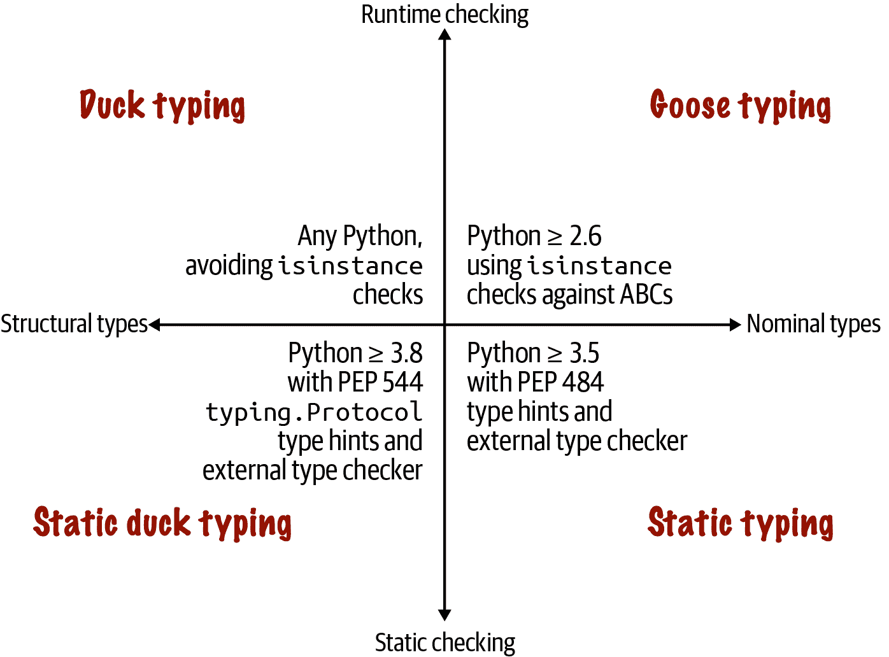
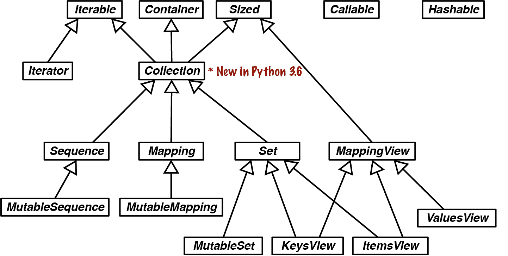
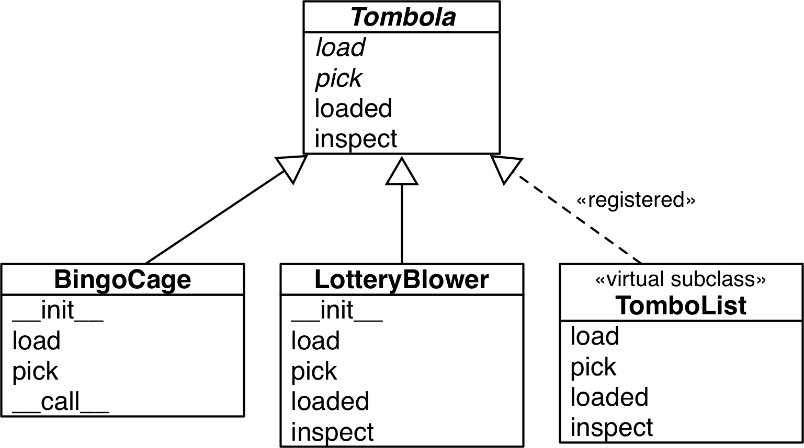
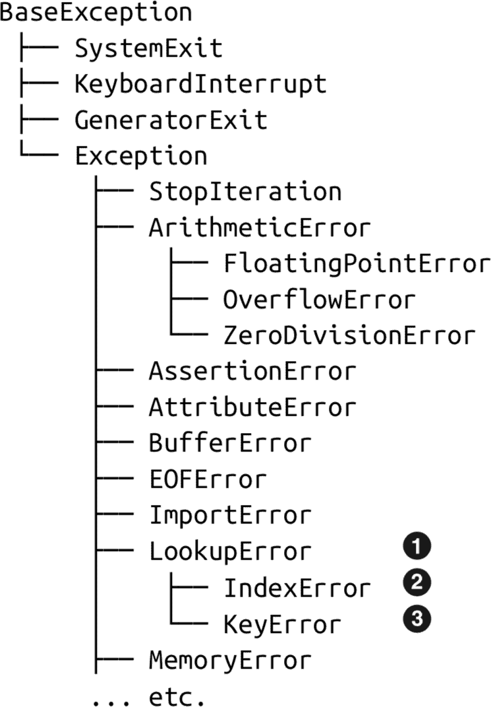
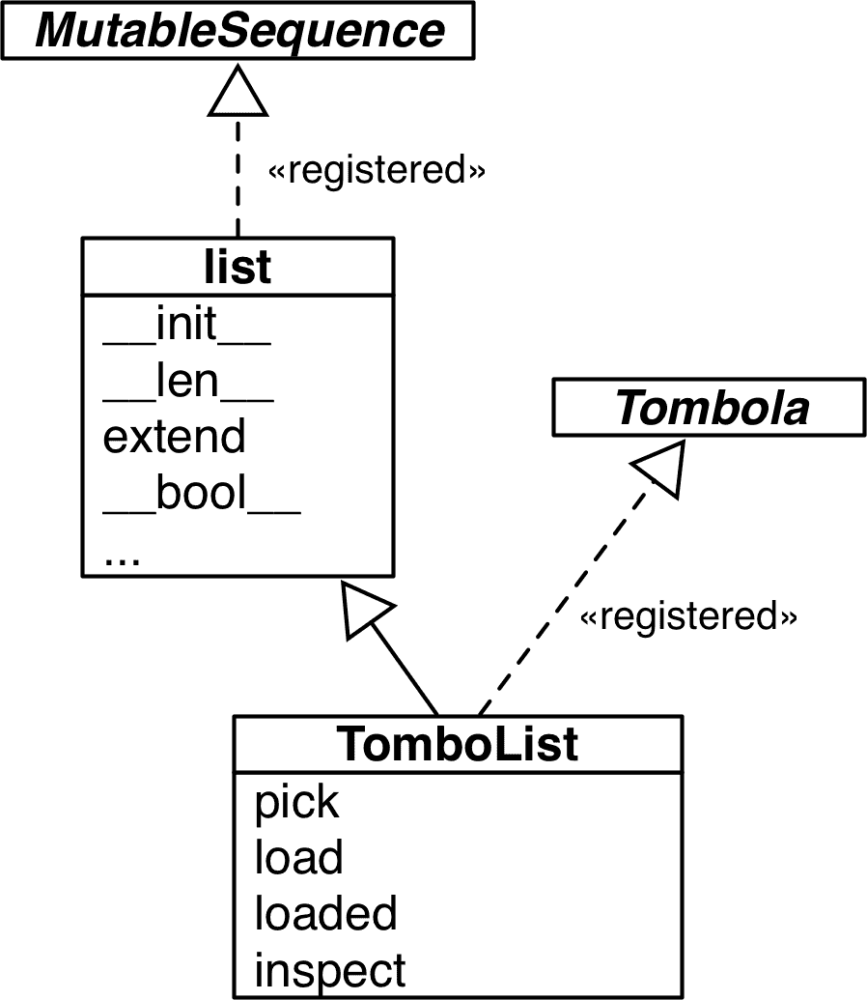

# 第十三章：接口、协议和 ABCs

> 针对接口编程，而不是实现。
> 
> Gamma、Helm、Johnson、Vlissides，《面向对象设计的第一原则》¹

面向对象编程关乎接口。在 Python 中理解类型的最佳方法是了解它提供的方法——即其接口——如 “类型由支持的操作定义”（第八章）中所讨论的。

根据编程语言的不同，我们有一种或多种定义和使用接口的方式。自 Python 3.8 起，我们有四种方式。它们在 *类型映射*（图 13-1）中有所描述。我们可以总结如下：

鸭子类型

Python 从一开始就采用的类型化方法。我们从 第一章 开始学习鸭子类型。

鹅式类型

自 Python 2.6 起由抽象基类（ABCs）支持的方法，依赖于对象与 ABCs 的运行时检查。*鹅式类型* 是本章的一个重要主题。

静态类型

类似 C 和 Java 这样的静态类型语言的传统方法；自 Python 3.5 起由 `typing` 模块支持，并由符合 [PEP 484—类型提示](https://fpy.li/pep484) 的外部类型检查器强制执行。这不是本章的主题。第八章的大部分内容以及即将到来的 第十五章 关于静态类型。

静态鸭子类型

由 Go 语言推广的一种方法；由 `typing.Protocol` 的子类支持——Python 3.8 中新增——也由外部类型检查器强制执行。我们首次在 “静态协议”（第八章）中看到这一点。

# 类型映射

图 13-1 中描述的四种类型化方法是互补的：它们各有优缺点。不应该否定其中任何一种。



###### 图 13-1。上半部分描述了仅使用 Python 解释器进行运行时类型检查的方法；下半部分需要外部静态类型检查器，如 MyPy 或 PyCharm 这样的 IDE。左侧象限涵盖基于对象结构的类型化——即对象提供的方法，而不考虑其类或超类的名称；右侧象限依赖于对象具有明确定义的类型：对象的类名或其超类的名称。

这四种方法都依赖于接口来工作，但静态类型可以通过仅使用具体类型而不是接口抽象，如协议和抽象基类，来实现——这样做效果不佳。本章讨论了鸭子类型、鹅式类型和静态鸭子类型——围绕接口展开的类型学科。

本章分为四个主要部分，涵盖了类型映射中四个象限中的三个：图 13-1。

+   “两种类型协议” 比较了两种结构类型与协议的形式——即类型映射的左侧。

+   “编程鸭子” 深入探讨了 Python 的常规鸭子类型，包括如何使其更安全，同时保持其主要优势：灵活性。

+   “鹅式类型” 解释了使用 ABCs 进行更严格的运行时类型检查。这是最长的部分，不是因为它更重要，而是因为书中其他地方有更多关于鸭子类型、静态鸭子类型和静态类型的部分。

+   “静态协议” 涵盖了 `typing.Protocol` 子类的用法、实现和设计——对于静态和运行时类型检查很有用。

# 本章的新内容

本章经过大幅编辑，比第一版《流畅的 Python》中对应的第十一章长约 24%。虽然有些部分和许多段落是相同的，但也有很多新内容。以下是亮点：

+   本章的介绍和类型映射（图 13-1）是新内容。这是本章和所有涉及 Python ≥ 3.8 中类型的其他章节中大部分新内容的关键。

+   “两种类型的协议”解释了动态协议和静态协议之间的相似之处和不同之处。

+   “防御性编程和‘快速失败’” 主要复制了第一版的内容，但进行了更新，现在有一个部分标题以突出其重要性。

+   “静态协议”是全新的。它在“静态协议”（第八章）的初始介绍基础上进行了扩展。

+   在图 13-2、13-3 和 13-4 中更新了`collections.abc`的类图，包括 Python 3.6 中的`Collection` ABC。

《流畅的 Python》第一版中有一节鼓励使用`numbers` ABCs 进行鹅式类型化。在“数字 ABC 和数值协议”中，我解释了为什么如果您计划同时使用静态类型检查器和鹅式类型检查器的运行时检查，应该使用`typing`模块中的数值静态协议。

# 两种类型的协议

根据上下文，计算机科学中的“协议”一词有不同的含义。诸如 HTTP 之类的网络协议指定了客户端可以发送给服务器的命令，例如`GET`、`PUT`和`HEAD`。我们在“协议和鸭子类型”中看到，对象协议指定了对象必须提供的方法以履行某种角色。第一章中的`FrenchDeck`示例演示了一个对象协议，即序列协议：允许 Python 对象表现为序列的方法。

实现完整的协议可能需要多个方法，但通常只实现部分也是可以的。考虑一下示例 13-1 中的`Vowels`类。

##### 示例 13-1。使用`__getitem__`部分实现序列协议

```py
>>> class Vowels:
...     def __getitem__(self, i):
...         return 'AEIOU'[i]
...
>>> v = Vowels()
>>> v[0]
'A'
>>> v[-1]
'U'
>>> for c in v: print(c)
...
A
E
I
O
U
>>> 'E' in v
True
>>> 'Z' in v
False
```

实现`__getitem__`足以允许按索引检索项目，并支持迭代和`in`运算符。`__getitem__`特殊方法实际上是序列协议的关键。查看[*Python/C API 参考手册*](https://fpy.li/13-1)中的这篇文章，[“序列协议”部分](https://fpy.li/13-2)。

`int PySequence_Check(PyObject *o)`

如果对象提供序列协议，则返回`1`，否则返回`0`。请注意，对于具有`__getitem__()`方法的 Python 类，除非它们是`dict`子类[...]，否则它将返回`1`。

我们期望序列还支持`len()`，通过实现`__len__`来实现。`Vowels`没有`__len__`方法，但在某些情况下仍然表现为序列。这对我们的目的可能已经足够了。这就是为什么我喜欢说协议是一种“非正式接口”。这也是 Smalltalk 中对协议的理解方式，这是第一个使用该术语的面向对象编程环境。

除了关于网络编程的页面外，Python 文档中“协议”一词的大多数用法指的是这些非正式接口。

现在，随着 Python 3.8 中采纳了[PEP 544—协议：结构子类型（静态鸭子类型）](https://fpy.li/pep544)，在 Python 中，“协议”一词有了另一层含义——与之密切相关，但又不同。正如我们在“静态协议”（第八章）中看到的，PEP 544 允许我们创建`typing.Protocol`的子类来定义一个或多个类必须实现（或继承）以满足静态类型检查器的方法。

当我需要具体说明时，我会采用这些术语：

动态协议

Python 一直拥有的非正式协议。动态协议是隐式的，按照约定定义，并在文档中描述。Python 最重要的动态协议由解释器本身支持，并在《Python 语言参考》的[“数据模型”章节](https://fpy.li/dtmodel)中有详细说明。

静态协议

由 [PEP 544—协议：结构子类型（静态鸭子类型）](https://fpy.li/pep544) 定义的协议，自 Python 3.8 起。静态协议有明确的定义：`typing.Protocol` 的子类。

它们之间有两个关键区别：

+   一个对象可能只实现动态协议的一部分仍然是有用的；但为了满足静态协议，对象必须提供协议类中声明的每个方法，即使你的程序并不需要它们。

+   静态协议可以被静态类型检查器验证，但动态协议不能。

这两种协议共享一个重要特征，即类永远不需要声明支持某个协议，即通过继承来支持。

除了静态协议，Python 还提供了另一种在代码中定义显式接口的方式：抽象基类（ABC）。

本章的其余部分涵盖了动态和静态协议，以及 ABC。

# 编程鸭

让我们从 Python 中两个最重要的动态协议开始讨论：序列和可迭代协议。解释器会尽最大努力处理提供了即使是最简单实现的对象，下一节将解释这一点。

## Python 探究序列

Python 数据模型的哲学是尽可能与基本的动态协议合作。在处理序列时，Python 会尽最大努力与即使是最简单的实现一起工作。

图 13-2 显示了 `Sequence` 接口如何被正式化为一个 ABC。Python 解释器和内置序列如 `list`、`str` 等根本不依赖于该 ABC。我只是用它来描述一个完整的 `Sequence` 预期支持的内容。


###### 图 13-2\. `Sequence` ABC 和 `collections.abc` 中相关抽象类的 UML 类图。继承箭头从子类指向其超类。斜体字体的名称是抽象方法。在 Python 3.6 之前，没有 `Collection` ABC——`Sequence` 是 `Container`、`Iterable` 和 `Sized` 的直接子类。

###### 提示

`collections.abc` 模块中的大多数 ABC 存在的目的是为了正式化由内置对象实现并被解释器隐式支持的接口——这两者都早于 ABC 本身。这些 ABC 对于新类是有用的起点，并支持运行时的显式类型检查（又称为 *鹅式类型化*）以及静态类型检查器的类型提示。

研究 图 13-2，我们看到 `Sequence` 的正确子类必须实现 `__getitem__` 和 `__len__`（来自 `Sized`）。`Sequence` 中的所有其他方法都是具体的，因此子类可以继承它们的实现——或提供更好的实现。

现在回想一下 示例 13-1 中的 `Vowels` 类。它没有继承自 `abc.Sequence`，只实现了 `__getitem__`。

没有 `__iter__` 方法，但 `Vowels` 实例是可迭代的，因为——作为后备——如果 Python 发现 `__getitem__` 方法，它会尝试通过调用从 `0` 开始的整数索引的方法来迭代对象。因为 Python 足够聪明以迭代 `Vowels` 实例，所以即使缺少 `__contains__` 方法，它也可以使 `in` 运算符正常工作：它会进行顺序扫描以检查项目是否存在。

总结一下，鉴于类似序列的数据结构的重要性，Python 通过在 `__iter__` 和 `__contains__` 不可用时调用 `__getitem__` 来使迭代和 `in` 运算符正常工作。

第一章中的原始`FrenchDeck`也没有继承`abc.Sequence`，但它实现了序列协议的两种方法：`__getitem__`和`__len__`。参见示例 13-2。

##### 示例 13-2。一叠卡片的序列（与示例 1-1 相同）

```py
import collections

Card = collections.namedtuple('Card', ['rank', 'suit'])

class FrenchDeck:
    ranks = [str(n) for n in range(2, 11)] + list('JQKA')
    suits = 'spades diamonds clubs hearts'.split()

    def __init__(self):
        self._cards = [Card(rank, suit) for suit in self.suits
                                        for rank in self.ranks]

    def __len__(self):
        return len(self._cards)

    def __getitem__(self, position):
        return self._cards[position]
```

第一章中的几个示例之所以有效，是因为 Python 对任何类似序列的东西都给予了特殊处理。Python 中的可迭代协议代表了鸭子类型的极端形式：解释器尝试两种不同的方法来迭代对象。

为了明确起见，我在本节中描述的行为是在解释器本身中实现的，主要是用 C 语言编写的。它们不依赖于`Sequence` ABC 中的方法。例如，`Sequence`类中的具体方法`__iter__`和`__contains__`模拟了 Python 解释器的内置行为。如果你感兴趣，请查看[*Lib/_collections_abc.py*](https://fpy.li/13-3)中这些方法的源代码。

现在让我们研究另一个例子，强调协议的动态性，以及为什么静态类型检查器无法处理它们。

## Monkey Patching：在运行时实现协议

Monkey patching 是在运行时动态更改模块、类或函数，以添加功能或修复错误。例如，gevent 网络库对 Python 的标准库的部分进行了 monkey patching，以允许轻量级并发而无需线程或`async`/`await`。²

来自示例 13-2 的`FrenchDeck`类缺少一个重要特性：它无法被洗牌。几年前，当我第一次编写`FrenchDeck`示例时，我确实实现了一个`shuffle`方法。后来我有了一个 Pythonic 的想法：如果`FrenchDeck`像一个序列一样工作，那么它就不需要自己的`shuffle`方法，因为已经有了`random.shuffle`，[文档](https://fpy.li/13-6)中描述为“原地洗牌序列*x*”。

标准的`random.shuffle`函数的使用方式如下：

```py
>>> from random import shuffle
>>> l = list(range(10))
>>> shuffle(l)
>>> l
[5, 2, 9, 7, 8, 3, 1, 4, 0, 6]
```

###### 提示

当遵循已建立的协议时，你提高了利用现有标准库和第三方代码的机会，这要归功于鸭子类型。

然而，如果我们尝试对`FrenchDeck`实例进行洗牌，就会出现异常，就像示例 13-3 中一样。

##### 示例 13-3。`random.shuffle`无法处理`FrenchDeck`

```py
>>> from random import shuffle
>>> from frenchdeck import FrenchDeck
>>> deck = FrenchDeck()
>>> shuffle(deck)
Traceback (most recent call last):
  File "<stdin>", line 1, in <module>
  File ".../random.py", line 265, in shuffle
    x[i], x[j] = x[j], x[i]
TypeError: 'FrenchDeck' object does not support item assignment
```

错误消息很明确：`'FrenchDeck'对象不支持项目赋值`。问题在于`shuffle`是*原地*操作，通过在集合内部交换项目，而`FrenchDeck`只实现了*不可变*序列协议。可变序列还必须提供`__setitem__`方法。

因为 Python 是动态的，我们可以在运行时修复这个问题，甚至在交互式控制台中也可以。示例 13-4 展示了如何做到这一点。

##### 示例 13-4。Monkey patching `FrenchDeck`使其可变并与`random.shuffle`兼容（继续自示例 13-3）

```py
>>> def set_card(deck, position, card):  # ①
...     deck._cards[position] = card
...
>>> FrenchDeck.__setitem__ = set_card  # ②
>>> shuffle(deck)  # ③
>>> deck[:5]
[Card(rank='3', suit='hearts'), Card(rank='4', suit='diamonds'), Card(rank='4', suit='clubs'), Card(rank='7', suit='hearts'), Card(rank='9', suit='spades')]
```

①

创建一个以`deck`, `position`, 和`card`为参数的函数。

②

将该函数分配给`FrenchDeck`类中名为`__setitem__`的属性。

③

现在`deck`可以被洗牌了，因为我添加了可变序列协议的必要方法。

`__setitem__`特殊方法的签名在*Python 语言参考*中的[“3.3.6\. 模拟容器类型”](https://fpy.li/13-7)中定义。这里我将参数命名为`deck, position, card`，而不是语言参考中的`self, key, value`，以显示每个 Python 方法都是作为普通函数开始的，将第一个参数命名为`self`只是一种约定。在控制台会话中这样做没问题，但在 Python 源文件中最好使用文档中记录的`self`, `key`, 和`value`。

诀窍在于`set_card`知道`deck`对象有一个名为`_cards`的属性，而`_cards`必须是一个可变序列。然后，`set_card`函数被附加到`FrenchDeck`类作为`__setitem__`特殊方法。这是*猴子补丁*的一个例子：在运行时更改类或模块，而不触及源代码。猴子补丁很强大，但实际打补丁的代码与要打补丁的程序非常紧密耦合，通常处理私有和未记录的属性。

除了是猴子补丁的一个例子，示例 13-4 突显了动态鸭子类型协议的动态性：`random.shuffle`不关心参数的类，它只需要对象实现可变序列协议的方法。甚至不用在意对象是否“出生”时就具有必要的方法，或者后来某种方式获得了这些方法。

鸭子类型不需要非常不安全或难以调试。下一节将展示一些有用的代码模式，以检测动态协议，而不需要显式检查。

## 防御性编程和“快速失败”

防御性编程就像防御性驾驶：一套增强安全性的实践，即使面对粗心的程序员或驾驶员。

许多错误只能在运行时捕获——即使在主流的静态类型语言中也是如此。³在动态类型语言中，“快速失败”是更安全、更易于维护的程序的极好建议。快速失败意味着尽快引发运行时错误，例如，在函数体的开头立即拒绝无效参数。

这里有一个例子：当你编写接受要在内部处理的项目序列的代码时，不要通过类型检查强制要求一个`list`参数。相反，接受参数并立即从中构建一个`list`。这种代码模式的一个例子是本章后面的示例 13-10 中的`__init__`方法：

```py
    def __init__(self, iterable):
        self._balls = list(iterable)
```

这样可以使你的代码更灵活，因为`list()`构造函数处理任何适合内存的可迭代对象。如果参数不可迭代，调用将立即失败，并显示一个非常清晰的`TypeError`异常，就在对象初始化时。如果想更明确，可以用`try/except`包装`list()`调用以自定义错误消息——但我只会在外部 API 上使用这些额外的代码，因为问题对于代码库的维护者来说很容易看到。无论哪种方式，有问题的调用将出现在回溯的最后，使得修复问题变得直截了当。如果在类构造函数中没有捕获无效参数，程序将在稍后的某个时刻崩溃，当类的其他方法需要操作`self._balls`时，而它不是一个`list`。那么根本原因将更难找到。

当数据不应该被复制时，例如因为数据太大或者函数设计需要在原地更改数据以使调用者受益时，调用`list()`会很糟糕。在这种情况下，像`isinstance(x, abc.MutableSequence)`这样的运行时检查将是一个好方法。

如果你担心得到一个无限生成器——这不是一个常见问题——你可以先调用`len()`来检查参数。这将拒绝迭代器，同时安全地处理元组、数组和其他现有或将来完全实现`Sequence`接口的类。调用`len()`通常非常便宜，而无效的参数将立即引发错误。

另一方面，如果任何可迭代对象都可以接受，那么尽快调用`iter(x)`以获得一个迭代器，正如我们将在“为什么序列可迭代：iter 函数”中看到的。同样，如果`x`不可迭代，这将快速失败，并显示一个易于调试的异常。

在我刚刚描述的情况下，类型提示可以更早地捕捉一些问题，但并非所有问题。请记住，类型`Any`与其他任何类型都是*一致的*。类型推断可能导致变量被标记为`Any`类型。当发生这种情况时，类型检查器就会一头雾水。此外，类型提示在运行时不会被强制执行。快速失败是最后的防线。

利用鸭子类型的防御性代码也可以包含处理不同类型的逻辑，而无需使用`isinstance()`或`hasattr()`测试。

一个例子是我们如何模拟[`collections.namedtuple`](https://fpy.li/13-8)中的`field_names`参数处理：`field_names`接受一个由空格或逗号分隔的标识符组成的单个字符串，或者一组标识符。示例 13-5 展示了我如何使用鸭子类型来实现它。

##### 示例 13-5\. 鸭子类型处理字符串或字符串可迭代对象

```py
    try:  # ①
        field_names = field_names.replace(',', ' ').split()  # ②
    except AttributeError:  # ③
        pass  # ④
    field_names = tuple(field_names)  # ⑤
    if not all(s.isidentifier() for s in field_names):  # ⑥
        raise ValueError('field_names must all be valid identifiers')
```

①

假设它是一个字符串（EAFP = 宁愿请求原谅，也不要事先获准）。

②

将逗号转换为空格并将结果拆分为名称列表。

③

抱歉，`field_names`不像一个`str`那样嘎嘎叫：它没有`.replace`，或者返回我们无法`.split`的东西。

④

如果引发了`AttributeError`，那么`field_names`不是一个`str`，我们假设它已经是一个名称的可迭代对象。

⑤

为了确保它是可迭代的并保留我们自己的副本，将我们拥有的内容创建为一个元组。`tuple`比`list`更紧凑，还可以防止我的代码误改名称。

⑥

使用`str.isidentifier`来确保每个名称都是有效的。

示例 13-5 展示了一种情况，鸭子类型比静态类型提示更具表现力。没有办法拼写一个类型提示，说“`field_names`必须是由空格或逗号分隔的标识符字符串”。这是`namedtuple`在 typeshed 上的签名的相关部分（请查看[*stdlib/3/collections/__init__.pyi*](https://fpy.li/13-9)的完整源代码）：

```py
    def namedtuple(
        typename: str,
        field_names: Union[str, Iterable[str]],
        *,
        # rest of signature omitted
```

如您所见，`field_names`被注释为`Union[str, Iterable[str]]`，就目前而言是可以的，但不足以捕捉所有可能的问题。

在审查动态协议后，我们转向更明确的运行时类型检查形式：鹅式类型检查。

# 鹅式类型检查

> 抽象类代表一个接口。
> 
> C++的创始人 Bjarne Stroustrup⁴

Python 没有`interface`关键字。我们使用抽象基类（ABCs）来定义接口，以便在运行时进行显式类型检查，同时也受到静态类型检查器的支持。

*Python 术语表*中关于[抽象基类](https://fpy.li/13-10)的条目对它们为鸭子类型语言带来的价值有很好的解释：

> 抽象基类通过提供一种定义接口的方式来补充鸭子类型，当其他技术（如`hasattr()`）显得笨拙或微妙错误时（例如，使用魔术方法）。ABCs 引入虚拟子类，这些子类不继承自一个类，但仍然被`isinstance()`和`issubclass()`所识别；请参阅`abc`模块文档。⁵

鹅式类型检查是一种利用 ABCs 的运行时类型检查方法。我将让 Alex Martelli 在“水禽和 ABCs”中解释。

###### 注

我非常感谢我的朋友 Alex Martelli 和 Anna Ravenscroft。我在 2013 年的 OSCON 上向他们展示了*Fluent Python*的第一个大纲，他们鼓励我将其提交给 O’Reilly 出版。两人后来进行了彻底的技术审查。Alex 已经是本书中被引用最多的人，然后他提出要写这篇文章。请开始，Alex！

总结一下，*鹅打字*包括：

+   从 ABC 继承以明确表明你正在实现先前定义的接口。

+   运行时使用 ABC 而不是具体类作为`isinstance`和`issubclass`的第二个参数进行类型检查。

Alex 指出，从 ABC 继承不仅仅是实现所需的方法：开发人员的意图也是明确声明的。这种意图也可以通过注册虚拟子类来明确表示。

###### 注意

使用`register`的详细信息在“ABC 的虚拟子类”中有介绍，本章后面会详细介绍。现在，这里是一个简短的示例：给定`FrenchDeck`类，如果我希望它通过类似`issubclass(FrenchDeck, Sequence)`的检查，我可以通过以下代码将其作为`Sequence` ABC 的*虚拟子类*：

```py
from collections.abc import Sequence
Sequence.register(FrenchDeck)
```

如果你检查 ABC 而不是具体类，那么使用`isinstance`和`issubclass`会更加可接受。如果与具体类一起使用，类型检查会限制多态性——这是面向对象编程的一个重要特征。但是对于 ABCs，这些测试更加灵活。毕竟，如果一个组件没有通过子类化实现 ABC，但确实实现了所需的方法，那么它总是可以在事后注册，以便通过这些显式类型检查。

然而，即使使用 ABCs，你也应该注意，过度使用`isinstance`检查可能是*代码异味*的表现——这是 OO 设计不佳的症状。

通常情况下，使用`isinstance`检查的`if/elif/elif`链执行不同操作取决于对象类型通常是*不*可以的：你应该使用多态性来实现这一点——即，设计你的类使解释器分派调用到正确的方法，而不是在`if/elif/elif`块中硬编码分派逻辑。

另一方面，如果必须强制执行 API 契约，则对 ABC 执行`isinstance`检查是可以的：“伙计，如果你想调用我，你必须实现这个”，正如技术审查员 Lennart Regebro 所说。这在具有插件架构的系统中特别有用。在框架之外，鸭子类型通常比类型检查更简单、更灵活。

最后，在他的文章中，Alex 多次强调了在创建 ABCs 时需要克制的必要性。过度使用 ABCs 会在一门因其实用性和实用性而流行的语言中引入仪式感。在*流畅的 Python*审查过程中，Alex 在一封电子邮件中写道：

> ABCs 旨在封装由框架引入的非常一般的概念、抽象概念——诸如“一个序列”和“一个确切的数字”。[读者]很可能不需要编写任何新的 ABCs，只需正确使用现有的 ABCs，就可以获得 99.9%的好处，而不会严重风险设计错误。

现在让我们看看鹅打字的实践。

## 从 ABC 继承

遵循 Martelli 的建议，在大胆发明自己之前，我们将利用现有的 ABC，`collections.MutableSequence`。在示例 13-6 中，`FrenchDeck2`明确声明为`collections.MutableSequence`的子类。

##### 示例 13-6\. frenchdeck2.py：`FrenchDeck2`，`collections.MutableSequence`的子类

```py
from collections import namedtuple, abc

Card = namedtuple('Card', ['rank', 'suit'])

class FrenchDeck2(abc.MutableSequence):
    ranks = [str(n) for n in range(2, 11)] + list('JQKA')
    suits = 'spades diamonds clubs hearts'.split()

    def __init__(self):
        self._cards = [Card(rank, suit) for suit in self.suits
                                        for rank in self.ranks]

    def __len__(self):
        return len(self._cards)

    def __getitem__(self, position):
        return self._cards[position]

    def __setitem__(self, position, value):  # ①
        self._cards[position] = value

    def __delitem__(self, position):  # ②
        del self._cards[position]

    def insert(self, position, value):  # ③
        self._cards.insert(position, value)
```

①

`__setitem__`是我们启用洗牌所需的全部…

②

…但是从`MutableSequence`继承会强制我们实现`__delitem__`，该 ABC 的一个抽象方法。

③

我们还需要实现`insert`，`MutableSequence`的第三个抽象方法。

Python 在导入时不会检查抽象方法的实现（当加载和编译 *frenchdeck2.py* 模块时），而是在运行时当我们尝试实例化 `FrenchDeck2` 时才会检查。然后，如果我们未实现任何抽象方法，我们将收到一个 `TypeError` 异常，其中包含类似于 `"Can't instantiate`` abstract class FrenchDeck2 with abstract methods __delitem__, insert"` 的消息。这就是为什么我们必须实现 `__delitem__` 和 `insert`，即使我们的 `FrenchDeck2` 示例不需要这些行为：因为 `MutableSequence` ABC 要求它们。

如 图 13-3 所示，`Sequence` 和 `MutableSequence` ABCs 中并非所有方法都是抽象的。


###### 图 13-3\. `MutableSequence` ABC 及其来自 `collections.abc` 的超类的 UML 类图（继承箭头从子类指向祖先类；斜体名称是抽象类和抽象方法）。

要将 `FrenchDeck2` 写为 `MutableSequence` 的子类，我必须付出实现 `__delitem__` 和 `insert` 的代价，而我的示例并不需要这些。作为回报，`FrenchDeck2` 从 `Sequence` 继承了五个具体方法：`__contains__`, `__iter__`, `__reversed__`, `index`, 和 `count`。从 `MutableSequence` 中，它还获得了另外六个方法：`append`, `reverse`, `extend`, `pop`, `remove`, 和 `__iadd__`—它支持用于原地连接的 `+=` 运算符。

每个 `collections.abc` ABC 中的具体方法都是根据类的公共接口实现的，因此它们可以在不了解实例内部结构的情况下工作。

###### 提示

作为具体子类的编码者，您可能能够用更高效的实现覆盖从 ABCs 继承的方法。例如，`__contains__` 通过对序列进行顺序扫描来工作，但如果您的具体序列保持其项目排序，您可以编写一个更快的 `__contains__`，它使用标准库中的 [`bisect`](https://fpy.li/13-13) 函数进行二分搜索。请查看 *fluentpython.com* 上的 [“使用 Bisect 管理有序序列”](https://fpy.li/bisect) 了解更多信息。

要很好地使用 ABCs，您需要了解可用的内容。接下来我们将回顾 `collections` 中的 ABCs。

## 标准库中的 ABCs

自 Python 2.6 起，标准库提供了几个 ABCs。大多数在 `collections.abc` 模块中定义，但也有其他的。例如，您可以在 `io` 和 `numbers` 包中找到 ABCs。但最常用的在 `collections.abc` 中。

###### 提示

标准库中有两个名为 `abc` 的模块。这里我们谈论的是 `collections.abc`。为了减少加载时间，自 Python 3.4 起，该模块是在 `collections` 包之外实现的—在 [*Lib/_collections_abc.py*](https://fpy.li/13-14)—因此它是单独从 `collections` 导入的。另一个 `abc` 模块只是 `abc`（即 [*Lib/abc.py*](https://fpy.li/13-15)），其中定义了 `abc.ABC` 类。每个 ABC 都依赖于 `abc` 模块，但我们不需要自己导入它，除非要创建全新的 ABC。

图 13-4 是在 `collections.abc` 中定义的 17 个 ABCs 的摘要 UML 类图（不包括属性名称）。`collections.abc` 的文档中有一个很好的表格总结了这些 ABCs，它们之间的关系以及它们的抽象和具体方法（称为“mixin 方法”）。在 图 13-4 中有大量的多重继承。我们将在 第十四章 中专门讨论多重继承，但现在只需说当涉及到 ABCs 时，通常不是问题。⁷



###### 图 13-4\. `collections.abc` 中 ABCs 的 UML 类图。

让我们回顾一下 图 13-4 中的聚类：

`Iterable`, `Container`, `Sized`

每个集合应该继承这些 ABC 或实现兼容的协议。`Iterable` 支持 `__iter__` 迭代，`Container` 支持 `__contains__` 中的 `in` 运算符，`Sized` 支持 `__len__` 中的 `len()`。

`Collection`

这个 ABC 没有自己的方法，但在 Python 3.6 中添加了它，以便更容易从 `Iterable`、`Container` 和 `Sized` 继承。

`Sequence`、`Mapping`、`Set`

这些是主要的不可变集合类型，每种类型都有一个可变的子类。`MutableSequence` 的详细图表在 图 13-3 中；对于 `MutableMapping` 和 `MutableSet`，请参见 第三章 中的图 3-1 和 3-2。

`MappingView`

在 Python 3 中，从映射方法 `.items()`、`.keys()` 和 `.values()` 返回的对象分别实现了 `ItemsView`、`KeysView` 和 `ValuesView` 中定义的接口。前两者还实现了 `Set` 的丰富接口，其中包含我们在 “集合操作” 中看到的所有运算符。

`Iterator`

请注意，迭代器子类 `Iterable`。我们在 第十七章 中进一步讨论这一点。

`Callable`、`Hashable`

这些不是集合，但 `collections.abc` 是第一个在标准库中定义 ABC 的包，这两个被认为是足够重要以被包含在内。它们支持对必须是可调用或可哈希的对象进行类型检查。

对于可调用检测，内置函数 `callable(obj)` 比 `insinstance(obj, Callable)` 更方便。

如果 `insinstance(obj, Hashable)` 返回 `False`，则可以确定 `obj` 不可哈希。但如果返回值为 `True`，可能是一个误报。下一个框解释了这一点。

在查看一些现有的 ABC 后，让我们通过从头开始实现一个 ABC 并将其投入使用来练习鹅子打字。这里的目标不是鼓励每个人开始左右创建 ABC，而是学习如何阅读标准库和其他包中找到的 ABC 的源代码。

## 定义和使用 ABC

这个警告出现在第一版 *Fluent Python* 的“接口”章节中：

> ABC，就像描述符和元类一样，是构建框架的工具。因此，只有少数 Python 开发人员可以创建 ABC，而不会对其他程序员施加不合理的限制和不必要的工作。

现在 ABC 在类型提示中有更多潜在用途，以支持静态类型。如 “抽象基类” 中所讨论的，使用 ABC 而不是具体类型在函数参数类型提示中给调用者更多的灵活性。

为了证明创建一个 ABC 的合理性，我们需要为在框架中使用它作为扩展点提供一个上下文。因此，这是我们的背景：想象一下你需要在网站或移动应用程序上以随机顺序显示广告，但在显示完整广告库之前不重复显示广告。现在让我们假设我们正在构建一个名为 `ADAM` 的广告管理框架。其要求之一是支持用户提供的非重复随机选择类。⁸ 为了让 `ADAM` 用户清楚地知道“非重复随机选择”组件的期望，我们将定义一个 ABC。

在关于数据结构的文献中，“栈”和“队列”描述了抽象接口，以物理对象的实际排列为基础。我将效仿并使用一个现实世界的隐喻来命名我们的 ABC：宾果笼和彩票吹风机是设计用来从有限集合中随机挑选项目，直到集合耗尽而不重复的机器。

ABC 将被命名为 `Tombola`，以宾果的意大利名称和混合数字的翻转容器命名。

`Tombola` ABC 有四个方法。两个抽象方法是：

`.load(…)`

将项目放入容器中。

`.pick()`

从容器中随机移除一个项目，并返回它。

具体方法是：

`.loaded()`

如果容器中至少有一个项目，则返回`True`。

`.inspect()`

返回一个从容器中当前项目构建的`tuple`，而不更改其内容（内部排序不保留）。

图 13-5 展示了`Tombola` ABC 和三个具体实现。



###### 图 13-5\. ABC 和三个子类的 UML 图。`Tombola` ABC 的名称和其抽象方法以*斜体*书写，符合 UML 约定。虚线箭头用于接口实现——这里我用它来显示`TomboList`不仅实现了`Tombola`接口，而且还注册为`Tombola`的*虚拟子类*—正如我们将在本章后面看到的。⁹

示例 13-7 展示了`Tombola` ABC 的定义。

##### 示例 13-7\. tombola.py：`Tombola`是一个具有两个抽象方法和两个具体方法的 ABC

```py
import abc

class Tombola(abc.ABC):  # ①

    @abc.abstractmethod
    def load(self, iterable):  # ②
        """Add items from an iterable."""

    @abc.abstractmethod
    def pick(self):  # ③
        """Remove item at random, returning it.

        This method should raise `LookupError` when the instance is empty.
        """

    def loaded(self):  # ④
        """Return `True` if there's at least 1 item, `False` otherwise."""
        return bool(self.inspect())  # ⑤

    def inspect(self):
        """Return a sorted tuple with the items currently inside."""
        items = []
        while True:  # ⑥
            try:
                items.append(self.pick())
            except LookupError:
                break
        self.load(items)  # ⑦
        return tuple(items)
```

①

要定义一个 ABC，需要继承`abc.ABC`。

②

抽象方法使用`@abstractmethod`装饰器标记，通常其主体除了文档字符串外是空的。¹⁰

③

文档字符串指示实现者在没有项目可挑选时引发`LookupError`。

④

一个 ABC 可以包含具体方法。

⑤

ABC 中的具体方法必须仅依赖于 ABC 定义的接口（即 ABC 的其他具体或抽象方法或属性）。

⑥

我们无法知道具体子类将如何存储项目，但我们可以通过连续调用`.pick()`来构建`inspect`结果来清空`Tombola`…

⑦

…然后使用`.load(…)`将所有东西放回去。

###### 提示

抽象方法实际上可以有一个实现。即使有，子类仍将被强制重写它，但他们可以使用`super()`调用抽象方法，为其添加功能而不是从头开始实现。有关`@abstractmethod`用法的详细信息，请参阅[`abc`模块文档](https://fpy.li/13-18)。

`.inspect()` 方法的代码在示例 13-7 中有些愚蠢，但它表明我们可以依赖`.pick()`和`.load(…)`来检查`Tombola`中的内容——通过挑选所有项目并将它们加载回去，而不知道项目实际上是如何存储的。这个示例的重点是强调在抽象基类（ABCs）中提供具体方法是可以的，只要它们仅依赖于接口中的其他方法。了解它们的内部数据结构后，`Tombola`的具体子类可以始终用更智能的实现覆盖`.inspect()`，但他们不必这样做。

示例 13-7 中的`.loaded()`方法只有一行，但很昂贵：它调用`.inspect()`来构建`tuple`，然后对其应用`bool()`。这样做是有效的，但具体子类可以做得更好，我们将看到。

注意，我们对`.inspect()`的绕道实现要求我们捕获`self.pick()`抛出的`LookupError`。`self.pick()`可能引发`LookupError`也是其接口的一部分，但在 Python 中无法明确表示这一点，除非在文档中（参见示例 13-7 中抽象`pick`方法的文档字符串）。

我选择了`LookupError`异常，因为它在 Python 异常层次结构中与`IndexError`和`KeyError`的关系，这是实现具体`Tombola`时最有可能引发的异常。因此，实现可以引发`LookupError`、`IndexError`、`KeyError`或`LookupError`的自定义子类以符合要求。参见图 13-6。



###### 图 13-6。`Exception`类层次结构的一部分。¹¹

①

`LookupError`是我们在`Tombola.inspect`中处理的异常。

②

`IndexError`是我们尝试从序列中获取超出最后位置的索引时引发的`LookupError`子类。

③

当我们使用不存在的键从映射中获取项时，会引发`KeyError`。

现在我们有了自己的`Tombola` ABC。为了见证 ABC 执行的接口检查，让我们尝试用一个有缺陷的实现来愚弄`Tombola`，参见示例 13-8。

##### 示例 13-8。一个虚假的`Tombola`不会被发现

```py
>>> from tombola import Tombola
>>> class Fake(Tombola):  # ①
...     def pick(self):
...         return 13
...
>>> Fake  # ②
<class '__main__.Fake'> >>> f = Fake()  # ③
Traceback (most recent call last):
 File "<stdin>", line 1, in <module>
TypeError: Can't instantiate abstract class Fake with abstract method load
```

①

将`Fake`声明为`Tombola`的子类。

②

类已创建，目前没有错误。

③

当我们尝试实例化`Fake`时，会引发`TypeError`。消息非常清楚：`Fake`被视为抽象，因为它未能实现`Tombola` ABC 中声明的抽象方法之一`load`。

所以我们定义了我们的第一个 ABC，并让它验证一个类的工作。我们很快将子类化`Tombola` ABC，但首先我们必须了解一些 ABC 编码规则。

## ABC 语法细节

声明 ABC 的标准方式是继承`abc.ABC`或任何其他 ABC。

除了`ABC`基类和`@abstractmethod`装饰器外，`abc`模块还定义了`@abstractclassmethod`、`@abstractstaticmethod`和`@abstractproperty`装饰器。然而，在 Python 3.3 中，这三个装饰器已被弃用，因为现在可以在`@abstractmethod`之上堆叠装饰器，使其他装饰器变得多余。例如，声明抽象类方法的首选方式是：

```py
class MyABC(abc.ABC):
    @classmethod
    @abc.abstractmethod
    def an_abstract_classmethod(cls, ...):
        pass
```

###### 警告

堆叠函数装饰器的顺序很重要，在`@abstractmethod`的情况下，文档是明确的：

> 当`abstractmethod()`与其他方法描述符结合使用时，应将其应用为最内层的装饰器…¹²

换句话说，在`@abstractmethod`和`def`语句之间不得出现其他装饰器。

现在我们已经解决了这些 ABC 语法问题，让我们通过实现两个具体的子类来使用`Tombola`。

## ABC 的子类化

鉴于`Tombola` ABC，我们现在将开发两个满足其接口的具体子类。这些类在图 13-5 中有所描述，以及下一节将讨论的虚拟子类。

示例 13-9 中的`BingoCage`类是示例 7-8 的变体，使用了更好的随机化程序。这个`BingoCage`实现了所需的抽象方法`load`和`pick`。

##### 示例 13-9。bingo.py：`BingoCage`是`Tombola`的具体子类

```py
import random

from tombola import Tombola

class BingoCage(Tombola):  # ①

    def __init__(self, items):
        self._randomizer = random.SystemRandom()  # ②
        self._items = []
        self.load(items)  # ③

    def load(self, items):
        self._items.extend(items)
        self._randomizer.shuffle(self._items)  # ④

    def pick(self):  # ⑤
        try:
            return self._items.pop()
        except IndexError:
            raise LookupError('pick from empty BingoCage')

    def __call__(self):  # ⑥
        self.pick()
```

①

这个`BingoCage`类明确扩展了`Tombola`。

②

假设我们将用于在线游戏。`random.SystemRandom`在`os.urandom(…)`函数之上实现了`random` API，该函数提供了“适用于加密用途”的随机字节，根据[`os`模块文档](https://fpy.li/13-21)。

③

将初始加载委托给`.load(…)`方法。

④

我们使用我们的`SystemRandom`实例的`.shuffle()`方法，而不是普通的`random.shuffle()`函数。

⑤

`pick`的实现如示例 7-8 中所示。

⑥

`__call__`也来自示例 7-8。虽然不需要满足`Tombola`接口，但添加额外的方法也没有坏处。

`BingoCage`继承了`Tombola`的昂贵`loaded`和愚蠢的`inspect`方法。都可以用快得多的一行代码重写，就像示例 13-10 中那样。关键是：我们可以懒惰并只继承来自 ABC 的次优具体方法。从`Tombola`继承的方法对于`BingoCage`来说并不像它们本应该的那样快，但对于任何正确实现`pick`和`load`的`Tombola`子类，它们确实提供了正确的结果。

示例 13-10 展示了`Tombola`接口的一个非常不同但同样有效的实现。`LottoBlower`不是洗“球”并弹出最后一个，而是从随机位置弹出。

##### 示例 13-10。lotto.py：`LottoBlower`是一个具体子类，覆盖了`Tombola`的`inspect`和`loaded`方法。

```py
import random

from tombola import Tombola

class LottoBlower(Tombola):

    def __init__(self, iterable):
        self._balls = list(iterable)  # ①

    def load(self, iterable):
        self._balls.extend(iterable)

    def pick(self):
        try:
            position = random.randrange(len(self._balls))  # ②
        except ValueError:
            raise LookupError('pick from empty LottoBlower')
        return self._balls.pop(position)  # ③

    def loaded(self):  # ④
        return bool(self._balls)

    def inspect(self):  # ⑤
        return tuple(self._balls)
```

①

初始化程序接受任何可迭代对象：该参数用于构建一个列表。

②

`random.randrange(…)`函数在范围为空时会引发`ValueError`，因此我们捕获并抛出`LookupError`，以便与`Tombola`兼容。

③

否则，随机选择的项目将从`self._balls`中弹出。

④

重写`loaded`以避免调用`inspect`（就像示例 13-7 中的`Tombola.loaded`一样）。通过直接使用`self._balls`来工作，我们可以使其更快—不需要构建一个全新的`tuple`。

⑤

用一行代码重写`inspect`。

示例 13-10 展示了一个值得一提的习惯用法：在`__init__`中，`self._balls`存储`list(iterable)`而不仅仅是`iterable`的引用（即，我们并没有简单地赋值`self._balls = iterable`，从而给参数起了个别名）。正如在“防御性编程和‘快速失败’”中提到的，这使得我们的`LottoBlower`灵活，因为`iterable`参数可以是任何可迭代类型。同时，我们确保将其项存储在`list`中，这样我们就可以`pop`项。即使我们总是得到列表作为`iterable`参数，`list(iterable)`也会产生参数的副本，这是一个很好的做法，考虑到我们将从中删除项目，而客户端可能不希望提供的列表被更改。¹³

现在我们来到鹅类型的关键动态特性：使用`register`方法声明虚拟子类。

## 一个 ABC 的虚拟子类

鹅类型的一个重要特征——也是为什么它值得一个水禽名字的原因之一——是能够将一个类注册为 ABC 的*虚拟子类*，即使它没有继承自它。这样做时，我们承诺该类忠实地实现了 ABC 中定义的接口——Python 会相信我们而不进行检查。如果我们撒谎，我们将被通常的运行时异常捕获。

这是通过在 ABC 上调用`register`类方法来完成的。注册的类然后成为 ABC 的虚拟子类，并且将被`issubclass`识别为这样，但它不会继承 ABC 的任何方法或属性。

###### 警告

虚拟子类不会从其注册的 ABC 继承，并且在任何时候都不会检查其是否符合 ABC 接口，即使在实例化时也是如此。此外，静态类型检查器目前无法处理虚拟子类。详情请参阅[Mypy issue 2922—ABCMeta.register support](https://fpy.li/13-22)。

`register`方法通常作为一个普通函数调用（参见“实践中的 register 用法”），但也可以用作装饰器。在示例 13-11 中，我们使用装饰器语法并实现`TomboList`，`Tombola`的虚拟子类，如图 13-7 所示。



###### 图 13-7\. `TomboList`的 UML 类图，`list`的真实子类和`Tombola`的虚拟子类。

##### 示例 13-11\. tombolist.py：类`TomboList`是`Tombola`的虚拟子类

```py
from random import randrange

from tombola import Tombola

@Tombola.register  # ①
class TomboList(list):  # ②

    def pick(self):
        if self:  # ③
            position = randrange(len(self))
            return self.pop(position)  # ④
        else:
            raise LookupError('pop from empty TomboList')

    load = list.extend  # ⑤

    def loaded(self):
        return bool(self)  # ⑥

    def inspect(self):
        return tuple(self)

# Tombola.register(TomboList) # ⑦
```

①

`Tombolist`被注册为`Tombola`的虚拟子类。

②

`Tombolist`扩展了`list`。

③

`Tombolist`从`list`继承其布尔行为，如果列表不为空则返回`True`。

④

我们的`pick`调用`self.pop`，从`list`继承，传递一个随机的项目索引。

⑤

`Tombolist.load`与`list.extend`相同。

⑥

`loaded`委托给`bool`。¹⁴

⑦

总是可以以这种方式调用`register`，当你需要注册一个你不维护但符合接口的类时，这样做是很有用的。

请注意，由于注册，函数`issubclass`和`isinstance`的行为就好像`TomboList`是`Tombola`的子类一样：

```py
>>> from tombola import Tombola
>>> from tombolist import TomboList
>>> issubclass(TomboList, Tombola)
True
>>> t = TomboList(range(100))
>>> isinstance(t, Tombola)
True
```

然而，继承受到一个特殊的类属性`__mro__`的指导——方法解析顺序。它基本上按照 Python 用于搜索方法的顺序列出了类及其超类。¹⁵ 如果你检查`TomboList`的`__mro__`，你会看到它只列出了“真正”的超类——`list`和`object`：

```py
>>> TomboList.__mro__
(<class 'tombolist.TomboList'>, <class 'list'>, <class 'object'>)
```

`Tombola`不在`Tombolist.__mro__`中，所以`Tombolist`不会从`Tombola`继承任何方法。

这结束了我们的`Tombola`ABC 案例研究。在下一节中，我们将讨论`register`ABC 函数在实际中的使用方式。

## 实践中的 register 用法

在示例 13-11 中，我们使用`Tombola.register`作为一个类装饰器。在 Python 3.3 之前，`register` 不能像那样使用——它必须在类定义之后作为一个普通函数调用，就像示例 13-11 末尾的注释建议的那样。然而，即使现在，它更广泛地被用作一个函数来注册在其他地方定义的类。例如，在`collections.abc`模块的[源代码](https://fpy.li/13-24)中，内置类型`tuple`、`str`、`range`和`memoryview`被注册为`Sequence`的虚拟子类，就像这样：

```py
Sequence.register(tuple)
Sequence.register(str)
Sequence.register(range)
Sequence.register(memoryview)
```

其他几种内置类型在*_collections_abc.py*中被注册为 ABC。这些注册只会在导入该模块时发生，这是可以接受的，因为你无论如何都需要导入它来获取 ABC。例如，你需要从`collections.abc`导入`MutableMapping`来执行类似`isinstance(my_dict, MutableMapping)`的检查。

对 ABC 进行子类化或向 ABC 注册都是显式使我们的类通过`issubclass`检查的方法，以及依赖于`issubclass`的`isinstance`检查。但有些 ABC 也支持结构化类型。下一节将解释。

## 带有 ABCs 的结构化类型

ABC 主要与名义类型一起使用。当类`Sub`明确从`AnABC`继承，或者与`AnABC`注册时，`AnABC`的名称与`Sub`类关联起来—这就是在运行时，`issubclass(AnABC, Sub)`返回`True`的原因。

相比之下，结构类型是通过查看对象的公共接口结构来确定其类型的：如果一个对象实现了类型定义中定义的方法，则它与该类型*一致*。动态和静态鸭子类型是结构类型的两种方法。

事实证明，一些 ABC 也支持结构类型。在他的文章“水禽和 ABC”中，Alex 表明一个类即使没有注册也可以被识别为 ABC 的子类。以下是他的例子，增加了使用`issubclass`的测试：

```py
>>> class Struggle:
...     def __len__(self): return 23
...
>>> from collections import abc
>>> isinstance(Struggle(), abc.Sized)
True
>>> issubclass(Struggle, abc.Sized)
True
```

类`Struggle`被`issubclass`函数认为是`abc.Sized`的子类（因此，也被`isinstance`认为是）因为`abc.Sized`实现了一个名为`__subclasshook__`的特殊类方法。

`Sized`的`__subclasshook__`检查类参数是否有名为`__len__`的属性。如果有，那么它被视为`Sized`的虚拟子类。参见示例 13-12。

##### 示例 13-12。来自[Lib/_collections_abc.py](https://fpy.li/13-25)源代码中`Sized`的定义

```py
class Sized(metaclass=ABCMeta):

    __slots__ = ()

    @abstractmethod
    def __len__(self):
        return 0

    @classmethod
    def __subclasshook__(cls, C):
        if cls is Sized:
            if any("__len__" in B.__dict__ for B in C.__mro__):  # ①
                return True  # ②
        return NotImplemented  # ③
```

①

如果在`C.__mro__`中列出的任何类（即`C`及其超类）的`__dict__`中有名为`__len__`的属性…

②

…返回`True`，表示`C`是`Sized`的虚拟子类。

③

否则返回`NotImplemented`以让子类检查继续进行。

###### 注意

如果你对子类检查的细节感兴趣，请查看 Python 3.6 中`ABCMeta.__subclasscheck__`方法的源代码：[*Lib/abc.py*](https://fpy.li/13-26)。注意：它有很多的 if 语句和两次递归调用。在 Python 3.7 中，Ivan Levkivskyi 和 Inada Naoki 为了更好的性能，用 C 重写了`abc`模块的大部分逻辑。参见[Python 问题 #31333](https://fpy.li/13-27)。当前的`ABCMeta.__subclasscheck__`实现只是调用了`_abc_subclasscheck`。相关的 C 源代码在[*cpython/Modules/_abc.c#L605*](https://fpy.li/13-28)中。

这就是`__subclasshook__`如何使 ABC 支持结构类型。你可以用 ABC 规范化一个接口，可以对该 ABC 进行`isinstance`检查，而仍然可以让一个完全不相关的类通过`issubclass`检查，因为它实现了某个方法（或者因为它做了足够的事情来说服`__subclasshook__`为它背书）。

在我们自己的 ABC 中实现`__subclasshook__`是个好主意吗？可能不是。我在 Python 源代码中看到的所有`__subclasshook__`的实现都在像`Sized`这样声明了一个特殊方法的 ABC 中，它们只是检查那个特殊方法的名称。鉴于它们的“特殊”地位，你可以非常确定任何名为`__len__`的方法都会按照你的期望工作。但即使在特殊方法和基本 ABC 的领域，做出这样的假设也是有风险的。例如，映射实现了`__len__`、`__getitem__`和`__iter__`，但它们被正确地不认为是`Sequence`的子类型，因为你不能使用整数偏移或切片检索项目。这就是为什么[`abc.Sequence`](https://fpy.li/13-29)类不实现`__subclasshook__`。

对于你和我可能编写的 ABCs，`__subclasshook__`可能会更不可靠。我不准备相信任何实现或继承`load`、`pick`、`inspect`和`loaded`的`Spam`类都能保证像`Tombola`一样行为。最好让程序员通过将`Spam`从`Tombola`继承或使用`Tombola.register(Spam)`来确认。当然，你的`__subclasshook__`也可以检查方法签名和其他特性，但我认为这并不值得。

# 静态协议

###### 注意

静态协议是在“静态协议”（第八章）中引入的。我考虑延迟对协议的所有覆盖，直到本章，但决定最初在函数中的类型提示的介绍中包括协议，因为鸭子类型是 Python 的一个重要部分，而没有协议的静态类型检查无法很好地处理 Pythonic API。

我们将通过两个简单示例和对数字 ABCs 和协议的讨论来结束本章。让我们首先展示静态协议如何使得我们可以对我们在“类型由支持的操作定义”中首次看到的`double()`函数进行注释和类型检查。

## 有类型的 double 函数

当向更习惯于静态类型语言的程序员介绍 Python 时，我最喜欢的一个例子就是这个简单的`double`函数：

```py
>>> def double(x):
...     return x * 2
...
>>> double(1.5)
3.0
>>> double('A')
'AA'
>>> double([10, 20, 30])
[10, 20, 30, 10, 20, 30]
>>> from fractions import Fraction
>>> double(Fraction(2, 5))
Fraction(4, 5)
```

在引入静态协议之前，没有实际的方法可以为`double`添加类型提示，而不限制其可能的用途。¹⁷

由于鸭子类型的存在，`double`甚至可以与未来的类型一起使用，比如我们将在“为标量乘法重载 *”（第十六章）中看到的增强`Vector`类：

```py
>>> from vector_v7 import Vector
>>> double(Vector([11.0, 12.0, 13.0]))
Vector([22.0, 24.0, 26.0])
```

Python 中类型提示的初始实现是一种名义类型系统：注释中的类型名称必须与实际参数的类型名称或其超类的名称匹配。由于不可能命名所有支持所需操作的协议的类型，因此在 Python 3.8 之前无法通过类型提示描述鸭子类型。

现在，通过`typing.Protocol`，我们可以告诉 Mypy，`double`接受一个支持`x * 2`的参数`x`。示例 13-13 展示了如何实现。

##### 示例 13-13\. *double_protocol.py*: 使用`Protocol`定义`double`的定义

```py
from typing import TypeVar, Protocol

T = TypeVar('T')  # ①

class Repeatable(Protocol):
    def __mul__(self: T, repeat_count: int) -> T: ...  # ②

RT = TypeVar('RT', bound=Repeatable)  # ③

def double(x: RT) -> RT:  # ④
    return x * 2
```

①

我们将在`__mul__`签名中使用这个`T`。

②

`__mul__`是`Repeatable`协议的本质。`self`参数通常不会被注释，其类型被假定为类。在这里，我们使用`T`来确保结果类型与`self`的类型相同。此外，请注意，此协议中的`repeat_count`限制为`int`。

③

`RT`类型变量受`Repeatable`协议的约束：类型检查器将要求实际类型实现`Repeatable`。

④

现在类型检查器能够验证`x`参数是一个可以乘以整数的对象，并且返回值与`x`的类型相同。

本示例说明了为什么[PEP 544](https://fpy.li/pep544)的标题是“协议：结构子类型（静态鸭子类型）”。给定给`double`的实际参数`x`的名义类型是无关紧要的，只要它呱呱叫，也就是说，只要它实现了`__mul__`。

## 可运行时检查的静态协议

在类型映射中（图 13-1），`typing.Protocol`出现在静态检查区域—图表的下半部分。然而，当定义`typing.Protocol`子类时，您可以使用`@runtime_checkable`装饰器使该协议支持运行时的`isinstance/issubclass`检查。这是因为`typing.Protocol`是一个 ABC，因此支持我们在“使用 ABC 进行结构化类型检查”中看到的`__subclasshook__`。

截至 Python 3.9，`typing`模块包含了七个可供直接使用的运行时可检查的协议。以下是其中两个，直接引用自[`typing`文档](https://fpy.li/13-30)：

`class typing.SupportsComplex`

一个具有一个抽象方法`__complex__`的 ABC。

`class typing.SupportsFloat`

一个具有一个抽象方法`__float__`的 ABC。

这些协议旨在检查数值类型的“可转换性”：如果一个对象`o`实现了`__complex__`，那么您应该能够通过调用`complex(o)`来获得一个`complex`——因为`__complex__`特殊方法存在是为了支持`complex()`内置函数。

示例 13-14 展示了`typing.SupportsComplex`协议的[源代码](https://fpy.li/13-31)。

##### 示例 13-14\. `typing.SupportsComplex`协议源代码

```py
@runtime_checkable
class SupportsComplex(Protocol):
    """An ABC with one abstract method __complex__."""
    __slots__ = ()

    @abstractmethod
    def __complex__(self) -> complex:
        pass
```

关键在于`__complex__`抽象方法。¹⁸ 在静态类型检查期间，如果一个对象实现了只接受`self`并返回`complex`的`__complex__`方法，则该对象将被视为与`SupportsComplex`协议*一致*。

由于`@runtime_checkable`类装饰器应用于`SupportsComplex`，因此该协议也可以与`isinstance`检查一起在示例 13-15 中使用。

##### 示例 13-15\. 在运行时使用`SupportsComplex`

```py
>>> from typing import SupportsComplex
>>> import numpy as np
>>> c64 = np.complex64(3+4j)  # ①
>>> isinstance(c64, complex)   # ②
False >>> isinstance(c64, SupportsComplex)  # ③
True >>> c = complex(c64)  # ④
>>> c
(3+4j) >>> isinstance(c, SupportsComplex) # ⑤
False >>> complex(c)
(3+4j)
```

①

`complex64`是 NumPy 提供的五种复数类型之一。

②

NumPy 的任何复数类型都不是内置的`complex`的子类。

③

但 NumPy 的复数类型实现了`__complex__`，因此它们符合`SupportsComplex`协议。

④

因此，您可以从中创建内置的`complex`对象。

⑤

遗憾的是，`complex`内置类型不实现`__complex__`，尽管如果`c`是`complex`，那么`complex(c)`可以正常工作。

由于上述最后一点，如果您想测试对象`c`是否为`complex`或`SupportsComplex`，您可以将类型元组作为`isinstance`的第二个参数提供，就像这样：

```py
isinstance(c, (complex, SupportsComplex))
```

另一种方法是使用`numbers`模块中定义的`Complex` ABC。内置的`complex`类型和 NumPy 的`complex64`和`complex128`类型都注册为`numbers.Complex`的虚拟子类，因此这样可以工作：

```py
>>> import numbers
>>> isinstance(c, numbers.Complex)
True
>>> isinstance(c64, numbers.Complex)
True
```

在第一版的*流畅的 Python*中，我推荐使用`numbers` ABCs，但现在这不再是一个好建议，因为这些 ABCs 不被静态类型检查器识别，正如我们将在“数字 ABC 和数值协议”中看到的那样。

在本节中，我想演示一个运行时可检查的协议如何与`isinstance`一起工作，但事实证明这个示例并不是`isinstance`的一个特别好的用例，因为侧边栏“鸭子类型是你的朋友”解释了这一点。

###### 提示

如果您正在使用外部类型检查器，那么显式的`isinstance`检查有一个优点：当您编写一个条件为`isinstance(o, MyType)`的`if`语句时，那么 Mypy 可以推断在`if`块内，`o`对象的类型与`MyType`*一致*。

现在我们已经看到如何在运行时使用静态协议与预先存在的类型如`complex`和`numpy.complex64`，我们需要讨论运行时可检查协议的限制。

## 运行时协议检查的限制

我们已经看到类型提示通常在运行时被忽略，这也影响了对静态协议进行`isinstance`或`issubclass`检查。

例如，任何具有`__float__`方法的类在运行时被认为是`SupportsFloat`的虚拟子类，即使`__float__`方法不返回`float`。

查看这个控制台会话：

```py
>>> import sys
>>> sys.version
'3.9.5 (v3.9.5:0a7dcbdb13, May  3 2021, 13:17:02) \n[Clang 6.0 (clang-600.0.57)]'
>>> c = 3+4j
>>> c.__float__
<method-wrapper '__float__' of complex object at 0x10a16c590>
>>> c.__float__()
Traceback (most recent call last):
  File "<stdin>", line 1, in <module>
TypeError: can't convert complex to float
```

在 Python 3.9 中，`complex`类型确实有一个`__float__`方法，但它只是为了引发一个带有明确错误消息的`TypeError`。如果那个`__float__`方法有注释，返回类型将是`NoReturn`，我们在`NoReturn`中看到过。

但在*typeshed*上对`complex.__float__`进行类型提示不会解决这个问题，因为 Python 的运行时通常会忽略类型提示，并且无法访问*typeshed*存根文件。

继续前面的 Python 3.9 会话：

```py
>>> from typing import SupportsFloat
>>> c = 3+4j
>>> isinstance(c, SupportsFloat)
True
>>> issubclass(complex, SupportsFloat)
True
```

因此我们有了误导性的结果：针对`SupportsFloat`的运行时检查表明你可以将`complex`转换为`float`，但实际上会引发类型错误。

###### 警告

Python 3.10.0b4 中修复了`complex`类型的特定问题，移除了`complex.__float__`方法。

但总体问题仍然存在：`isinstance`/`issubclass`检查只关注方法的存在或不存在，而不检查它们的签名，更不用说它们的类型注释了。而且这不太可能改变，因为这样的运行时类型检查会带来无法接受的性能成本。¹⁹

现在让我们看看如何在用户定义的类中实现静态协议。

## 支持静态协议

回想一下我们在第十一章中构建的`Vector2d`类。考虑到`complex`数和`Vector2d`实例都由一对浮点数组成，支持从`Vector2d`到`complex`的转换是有意义的。

示例 13-16 展示了`__complex__`方法的实现，以增强我们在示例 11-11 中看到的`Vector2d`的最新版本。为了完整起见，我们可以通过一个`fromcomplex`类方法支持反向操作，从`complex`构建一个`Vector2d`。

##### 示例 13-16\. *vector2d_v4.py*: 转换为和从`complex`的方法

```py
    def __complex__(self):
        return complex(self.x, self.y)

    @classmethod
    def fromcomplex(cls, datum):
        return cls(datum.real, datum.imag)  # ①
```

①

这假设`datum`有`.real`和`.imag`属性。我们将在示例 13-17 中看到一个更好的实现。

鉴于前面的代码，以及`Vector2d`在示例 11-11 中已经有的`__abs__`方法，我们得到了这些特性：

```py
>>> from typing import SupportsComplex, SupportsAbs
>>> from vector2d_v4 import Vector2d
>>> v = Vector2d(3, 4)
>>> isinstance(v, SupportsComplex)
True
>>> isinstance(v, SupportsAbs)
True
>>> complex(v)
(3+4j)
>>> abs(v)
5.0
>>> Vector2d.fromcomplex(3+4j)
Vector2d(3.0, 4.0)
```

对于运行时类型检查，示例 13-16 是可以的，但为了更好的静态覆盖和使用 Mypy 进行错误报告，`__abs__`，`__complex__` 和 `fromcomplex` 方法应该得到类型提示，如示例 13-17 所示。

##### 示例 13-17\. *vector2d_v5.py*: 为研究中的方法添加注释

```py
    def __abs__(self) -> float:  # ①
        return math.hypot(self.x, self.y)

    def __complex__(self) -> complex:  # ②
        return complex(self.x, self.y)

    @classmethod
    def fromcomplex(cls, datum: SupportsComplex) -> Vector2d:  # ③
        c = complex(datum)  # ④
        return cls(c.real, c.imag)
```

①

需要`float`返回注释，否则 Mypy 推断为`Any`，并且不检查方法体。

②

即使没有注释，Mypy 也能推断出这返回一个`complex`。根据您的 Mypy 配置，注释可以避免警告。

③

这里`SupportsComplex`确保`datum`是可转换的。

④

这种显式转换是必要的，因为`SupportsComplex`类型没有声明`.real`和`.imag`属性，这在下一行中使用。例如，`Vector2d`没有这些属性，但实现了`__complex__`。

如果在模块顶部出现`from __future__ import annotations`，`fromcomplex`的返回类型可以是`Vector2d`。这个导入会导致类型提示被存储为字符串，而不会在导入时被评估，当函数定义被评估时。没有`__future__`导入`annotations`，此时`Vector2d`是一个无效的引用（类尚未完全定义），应该写成字符串：`'Vector2d'`，就好像它是一个前向引用一样。这个`__future__`导入是在[PEP 563—注解的延迟评估](https://fpy.li/pep563)中引入的，实现在 Python 3.7 中。这种行为原计划在 3.10 中成为默认值，但该更改被推迟到以后的版本。²⁰ 当这种情况发生时，这个导入将是多余的，但无害的。

接下来，让我们看看如何创建——以及稍后扩展——一个新的静态协议。

## 设计一个静态协议

在学习鹅类型时，我们在“定义和使用 ABC”中看到了`Tombola` ABC。在这里，我们将看到如何使用静态协议定义一个类似的接口。

`Tombola` ABC 指定了两种方法：`pick`和`load`。我们也可以定义一个具有这两种方法的静态协议，但我从 Go 社区中学到，单方法协议使得静态鸭子类型更有用和灵活。Go 标准库有几个类似`Reader`的接口，这是一个仅需要`read`方法的 I/O 接口。过一段时间，如果你意识到需要一个更完整的协议，你可以将两个或更多的协议组合起来定义一个新的协议。

使用随机选择项目的容器可能需要重新加载容器，也可能不需要，但肯定需要一种方法来实际选择，因此这就是我选择最小`RandomPicker`协议的方法。该协议的代码在示例 13-18 中，其使用由示例 13-19 中的测试演示。

##### 示例 13-18。*randompick.py*：`RandomPicker`的定义

```py
from typing import Protocol, runtime_checkable, Any

@runtime_checkable
class RandomPicker(Protocol):
    def pick(self) -> Any: ...
```

###### 注意

`pick`方法返回`Any`。在“实现通用静态协议”中，我们将看到如何使`RandomPicker`成为一个带有参数的通用类型，让协议的使用者指定`pick`方法的返回类型。

##### 示例 13-19。*randompick_test.py*：`RandomPicker`的使用

```py
import random
from typing import Any, Iterable, TYPE_CHECKING

from randompick import RandomPicker  # ①

class SimplePicker:  # ②
    def __init__(self, items: Iterable) -> None:
        self._items = list(items)
        random.shuffle(self._items)

    def pick(self) -> Any:  # ③
        return self._items.pop()

def test_isinstance() -> None:  # ④
    popper: RandomPicker = SimplePicker([1])  # ⑤
    assert isinstance(popper, RandomPicker)  # ⑥

def test_item_type() -> None:  # ⑦
    items = [1, 2]
    popper = SimplePicker(items)
    item = popper.pick()
    assert item in items
    if TYPE_CHECKING:
        reveal_type(item)  # ⑧
    assert isinstance(item, int)
```

①](#co_interfaces__protocols__and_abcs_CO14-1)

定义实现它的类时，不需要导入静态协议。这里我只导入`RandomPicker`是为了稍后在`test_isinstance`中使用它。

②](#co_interfaces__protocols__and_abcs_CO14-2)

`SimplePicker`实现了`RandomPicker`——但它并没有继承它。这就是静态鸭子类型的作用。

③](#co_interfaces__protocols__and_abcs_CO14-3)

`Any`是默认返回类型，因此此注释并不是严格必要的，但它确实使我们正在实现示例 13-18 中定义的`RandomPicker`协议更清晰。

④](#co_interfaces__protocols__and_abcs_CO14-4)

如果你希望 Mypy 查看测试，请不要忘记为你的测试添加`-> None`提示。

⑤](#co_interfaces__protocols__and_abcs_CO14-5)

我为`popper`变量添加了一个类型提示，以显示 Mypy 理解`SimplePicker`是*与之一致*的。

⑥](#co_interfaces__protocols__and_abcs_CO14-6)

这个测试证明了`SimplePicker`的一个实例也是`RandomPicker`的一个实例。这是因为`@runtime_checkable`装饰器应用于`RandomPicker`，并且`SimplePicker`有一个所需的`pick`方法。

⑦](#co_interfaces__protocols__and_abcs_CO14-7)

这个测试调用了`SimplePicker`的`pick`方法，验证它是否返回了给`SimplePicker`的项目之一，然后对返回的项目进行了静态和运行时检查。

⑧

这行代码会在 Mypy 输出中生成一个注释。

正如我们在示例 8-22 中看到的，`reveal_type`是 Mypy 识别的“魔术”函数。这就是为什么它不被导入，我们只能在`typing.TYPE_CHECKING`保护的`if`块内调用它，这个块只有在静态类型检查器的眼中才是`True`，但在运行时是`False`。

示例 13-19 中的两个测试都通过了。Mypy 在该代码中没有看到任何错误，并显示了`pick`返回的`item`上`reveal_type`的结果：

```py
$ mypy randompick_test.py
randompick_test.py:24: note: Revealed type is 'Any'
```

创建了我们的第一个协议后，让我们研究一些相关建议。

## 协议设计的最佳实践

在使用 Go 中的静态鸭子类型 10 年后，很明显，窄协议更有用——通常这样的协议只有一个方法，很少有超过两个方法。Martin Fowler 撰写了一篇定义[*角色接口*](https://fpy.li/13-33)的文章，在设计协议时要记住这个有用的概念。

有时候你会看到一个协议在使用它的函数附近定义——也就是说，在“客户端代码”中定义，而不是在库中定义。这样做可以轻松创建新类型来调用该函数，这对于可扩展性和使用模拟进行测试是有益的。

窄协议和客户端代码协议的实践都避免了不必要的紧密耦合，符合[接口隔离原则](https://fpy.li/13-34)，我们可以总结为“客户端不应被迫依赖于他们不使用的接口”。

页面[“贡献给 typeshed”](https://fpy.li/13-35)推荐了这种静态协议的命名约定（以下三点引用原文）：

+   对于代表清晰概念的协议，请使用简单名称（例如，`Iterator`，`Container`）。

+   对于提供可调用方法的协议，请使用`SupportsX`（例如，`SupportsInt`，`SupportsRead`，`SupportsReadSeek`）。²¹

+   对于具有可读和/或可写属性或 getter/setter 方法的协议，请使用`HasX`（例如，`HasItems`，`HasFileno`）。

Go 标准库有一个我喜欢的命名约定：对于单方法协议，如果方法名是动词，可以添加“-er”或“-or”以使其成为名词。例如，不要使用`SupportsRead`，而是使用`Reader`。更多示例包括`Formatter`，`Animator`和`Scanner`。有关灵感，请参阅 Asuka Kenji 的[“Go（Golang）标准库接口（精选）”](https://fpy.li/13-36)。

创建简约协议的一个好理由是以后可以根据需要扩展它们。我们现在将看到创建一个带有额外方法的派生协议并不困难。

## 扩展协议

正如我在上一节开始时提到的，Go 开发人员在定义接口时倾向于保持最小主义——他们称之为静态协议。许多最广泛使用的 Go 接口只有一个方法。

当实践表明一个具有更多方法的协议是有用的时候，与其向原始协议添加方法，不如从中派生一个新协议。在 Python 中扩展静态协议有一些注意事项，正如示例 13-20 所示。

##### 示例 13-20\. *randompickload.py*: 扩展`RandomPicker`

```py
from typing import Protocol, runtime_checkable
from randompick import RandomPicker

@runtime_checkable  # ①
class LoadableRandomPicker(RandomPicker, Protocol):  # ②
    def load(self, Iterable) -> None: ...  # ③
```

①

如果希望派生协议可以进行运行时检查，必须再次应用装饰器——其行为不会被继承。²²

②

每个协议必须明确将`typing.Protocol`命名为其基类之一，除了我们正在扩展的协议。这与 Python 中继承的方式不同。²³

③

回到“常规”面向对象编程：我们只需要声明这个派生协议中新增的方法。`pick`方法声明是从`RandomPicker`继承的。

这结束了本章中定义和使用静态协议的最终示例。

为了结束本章，我们将讨论数字 ABCs 及其可能被数字协议替代的情况。

## 数字 ABCs 和数字协议

正如我们在“数字塔的崩塌”中看到的，标准库中`numbers`包中的 ABCs 对于运行时类型检查效果很好。

如果需要检查整数，可以使用`isinstance(x, numbers.Integral)`来接受`int`、`bool`（它是`int`的子类）或其他由外部库提供并将其类型注册为`numbers` ABCs 虚拟子类的整数类型。例如，NumPy 有[21 种整数类型](https://fpy.li/13-39)——以及几种浮点类型注册为`numbers.Real`，以及以不同位宽注册为`numbers.Complex`的复数。

###### 提示

令人惊讶的是，`decimal.Decimal`并未注册为`numbers.Real`的虚拟子类。原因是，如果您的程序需要`Decimal`的精度，那么您希望受到保护，以免将精度较低的浮点数与`Decimal`混合。

遗憾的是，数字塔并不适用于静态类型检查。根 ABC——`numbers.Number`——没有方法，因此如果声明`x: Number`，Mypy 将不允许您在`x`上进行算术运算或调用任何方法。

如果不支持`numbers` ABCs，那么还有哪些选项？

寻找类型解决方案的好地方是*typeshed*项目。作为 Python 标准库的一部分，`statistics`模块有一个对应的[*statistics.pyi*](https://fpy.li/13-40)存根文件，其中包含了对*typeshed*上几个函数进行类型提示的定义。在那里，您会找到以下定义，用于注释几个函数：

```py
_Number = Union[float, Decimal, Fraction]
_NumberT = TypeVar('_NumberT', float, Decimal, Fraction)
```

这种方法是正确的，但有限。它不支持标准库之外的数字类型，而`numbers` ABCs 在运行时支持这些数字类型——当数字类型被注册为虚拟子类时。

当前的趋势是推荐`typing`模块提供的数字协议，我们在“可运行时检查的静态协议”中讨论过。

不幸的是，在运行时，数字协议可能会让您失望。正如在“运行时协议检查的限制”中提到的，Python 3.9 中的`complex`类型实现了`__float__`，但该方法仅存在于引发`TypeError`并附带明确消息“无法将复数转换为浮点数”：同样的原因，它也实现了`__int__`。这些方法的存在使得在 Python 3.9 中`isinstance`返回误导性的结果。在 Python 3.10 中，那些无条件引发`TypeError`的`complex`方法被移除了。²⁴

另一方面，NumPy 的复数类型实现了`__float__`和`__int__`方法，只有在第一次使用每个方法时才会发出警告：

```py
>>> import numpy as np
>>> cd = np.cdouble(3+4j)
>>> cd
(3+4j)
>>> float(cd)
<stdin>:1: ComplexWarning: Casting complex values to real
discards the imaginary part
3.0
```

相反的问题也会发生：内置类`complex`、`float`和`int`，以及`numpy.float16`和`numpy.uint8`，都没有`__complex__`方法，因此对于它们，`isinstance(x, SupportsComplex)`返回`False`。²⁵ NumPy 的复数类型，如`np.complex64`，确实实现了`__complex__`以转换为内置的`complex`。

然而，在实践中，`complex()`内置构造函数处理所有这些类型的实例都没有错误或警告：

```py
>>> import numpy as np
>>> from typing import SupportsComplex
>>> sample = [1+0j, np.complex64(1+0j), 1.0, np.float16(1.0), 1, np.uint8(1)]
>>> [isinstance(x, SupportsComplex) for x in sample]
[False, True, False, False, False, False]
>>> [complex(x) for x in sample]
[(1+0j), (1+0j), (1+0j), (1+0j), (1+0j), (1+0j)]
```

这表明`isinstance`检查对`SupportsComplex`的转换表明这些转换为`complex`将失败，但它们都成功了。在 typing-sig 邮件列表中，Guido van Rossum 指出，内置的`complex`接受一个参数，这就是为什么这些转换起作用的原因。

另一方面，Mypy 在定义如下的`to_complex()`函数时接受这六种类型的所有参数：

```py
def to_complex(n: SupportsComplex) -> complex:
    return complex(n)
```

在我写这篇文章时，NumPy 没有类型提示，因此其数值类型都是`Any`。²⁶ 另一方面，Mypy 在某种程度上“意识到”内置的`int`和`float`可以转换为`complex`，尽管在 *typeshed* 中只有内置的`complex`类有一个`__complex__`方法。²⁷

总之，尽管数值类型不应该难以进行类型检查，但目前的情况是：类型提示 PEP 484 [避开](https://fpy.li/cardxvi)了数值塔，并隐含地建议类型检查器硬编码内置`complex`、`float`和`int`之间的子类型关系。Mypy 这样做了，并且还实用地接受`int`和`float`与`SupportsComplex`*一致*，尽管它们没有实现`__complex__`。

###### 提示

当我尝试将数值`Supports*`协议与`complex`进行转换时，使用`isinstance`检查时我只发现了意外结果。如果你不使用复数，你可以依赖这些协议而不是`numbers` ABCs。

本节的主要要点是：

+   `numbers` ABCs 适用于运行时类型检查，但不适用于静态类型检查。

+   数值静态协议`SupportsComplex`、`SupportsFloat`等在静态类型检查时效果很好，但在涉及复数时在运行时类型检查时不可靠。

现在我们准备快速回顾本章内容。

# 章节总结

键盘映射（图 13-1）是理解本章内容的关键。在简要介绍了四种类型方法后，我们对比了动态和静态协议，分别支持鸭子类型和静态鸭子类型。这两种类型的协议共享一个基本特征，即类永远不需要明确声明支持任何特定协议。一个类通过实现必要的方法来支持一个协议。

接下来的主要部分是“编程鸭子”，我们探讨了 Python 解释器为使序列和可迭代动态协议工作所做的努力，包括部分实现两者。然后我们看到一个类如何通过动态添加额外方法来在运行时实现一个协议，通过猴子补丁。鸭子类型部分以防御性编程的提示结束，包括使用`try/except`检测结构类型而无需显式的`isinstance`或`hasattr`检查，并快速失败。

在 Alex Martelli 介绍鹅类型之后“水禽和 ABCs”，我们看到如何对现有的 ABCs 进行子类化，调查了标准库中重要的 ABCs，并从头开始创建了一个 ABC，然后通过传统的子类化和注册来实现。为了结束这一部分，我们看到`__subclasshook__`特殊方法如何使 ABCs 能够通过识别提供符合 ABC 中定义接口的方法的不相关类来支持结构类型。

最后一个重要部分是“静态协议”，我们在这里恢复了静态鸭子类型的覆盖范围，这始于第八章，在“静态协议”中。我们看到`@runtime_checkable`装饰器如何利用`__subclasshook__`来支持运行时的结构化类型，尽管最佳使用静态协议的方式是与静态类型检查器一起使用，这样可以考虑类型提示以使结构化类型更可靠。接下来，我们讨论了静态协议的设计和编码以及如何扩展它。本章以“数字 ABCs 和数字协议”结束，讲述了数字塔的荒废状态以及提出的替代方案存在的一些缺陷：Python 3.8 中添加到`typing`模块的数字静态协议，如`SupportsFloat`等。

本章的主要信息是我们在现代 Python 中有四种互补的接口编程方式，每种方式都有不同的优势和缺点。在任何规模较大的现代 Python 代码库中，您可能会发现每种类型方案都有适用的用例。拒绝这些方法中的任何一种都会使您作为 Python 程序员的工作变得比必要的更加困难。

话虽如此，Python 在仅支持鸭子类型的情况下取得了广泛的流行。其他流行的语言，如 JavaScript、PHP 和 Ruby，以及 Lisp、Smalltalk、Erlang 和 Clojure 等不那么流行但非常有影响力的语言，都通过利用鸭子类型的力量和简单性产生了巨大影响。

# 进一步阅读

要快速了解类型的利弊，以及`typing.Protocol`对于静态检查代码库健康的重要性，我强烈推荐 Glyph Lefkowitz 的帖子[“我想要一个新的鸭子：`typing.Protocol`和鸭子类型的未来”](https://fpy.li/13-42)。我还从他的帖子[“接口和协议”](https://fpy.li/13-43)中学到了很多，比较了`typing.Protocol`和`zope.interface`——一种早期用于在松散耦合的插件系统中定义接口的机制，被[Plone CMS](https://fpy.li/13-44)、[Pyramid web framework](https://fpy.li/13-45)和[Twisted](https://fpy.li/13-46)异步编程框架等项目使用，这是 Glyph 创建的一个项目。²⁸

有关 Python 的优秀书籍几乎可以定义为对鸭子类型的广泛覆盖。我最喜欢的两本 Python 书籍在*Fluent Python*第一版之后发布了更新：Naomi Ceder 的*The Quick Python Book*第 3 版（Manning）和 Alex Martelli、Anna Ravenscroft 和 Steve Holden（O’Reilly）的[*Python in a Nutshell*第 3 版](https://fpy.li/pynut3)。

有关动态类型的利弊讨论，请参阅 Guido van Rossum 与 Bill Venners 的访谈[“Python 中的合同：与 Guido van Rossum 的对话，第四部分”](https://fpy.li/13-47)。Martin Fowler 在他的帖子[“动态类型”](https://fpy.li/13-48)中对这场辩论进行了深入而平衡的探讨。他还写了[“角色接口”](https://fpy.li/13-33)，我在“最佳协议设计实践”中提到过。尽管这不是关于鸭子类型的，但这篇文章对 Python 协议设计非常相关，因为他对比了狭窄的角色接口与一般类的更广泛的公共接口。

Mypy 文档通常是与 Python 中静态类型相关的任何信息的最佳来源，包括他们在[“协议和结构子类型”章节](https://fpy.li/13-50)中讨论的静态鸭子类型。

剩下的参考资料都是关于鹅类型的。Beazley 和 Jones 的*[Python Cookbook](https://fpy.li/pycook3)*，第 3 版（O’Reilly）有一节关于定义 ABC（Recipe 8.12）。这本书是在 Python 3.4 之前编写的，所以他们没有使用现在更受欢迎的通过从`abc.ABC`子类化来声明 ABC 的语法（相反，他们使用了`metaclass`关键字，我们只在第二十四章中真正需要它）。除了这个小细节，这个配方很好地涵盖了主要的 ABC 特性。

Doug Hellmann 的*Python 标准库示例*（Addison-Wesley）中有一章关于`abc`模块。它也可以在 Doug 出色的[*PyMOTW*—Python 本周模块](https://fpy.li/13-51)网站上找到。Hellmann 还使用了旧式的 ABC 声明方式：`PluginBase(metaclass=abc.ABCMeta)`，而不是自 Python 3.4 起可用的更简单的`PluginBase(abc.ABC)`。

在使用 ABCs 时，多重继承不仅很常见，而且几乎是不可避免的，因为每个基本集合 ABCs—`Sequence`、`Mapping`和`Set`—都扩展了`Collection`，而`Collection`又扩展了多个 ABCs（参见图 13-4）。因此，第十四章是本章的一个重要后续。

[PEP 3119—引入抽象基类](https://fpy.li/13-52) 提供了 ABC 的理由。[PEP 3141—数字类型的类型层次结构](https://fpy.li/13-53) 展示了[`numbers`模块](https://fpy.li/13-54)的 ABC，但在 Mypy 问题[#3186 “int is not a Number?”](https://fpy.li/13-55)的讨论中包含了一些关于为什么数字塔不适合静态类型检查的论点。Alex Waygood 在 StackOverflow 上写了一个[全面的答案](https://fpy.li/13-56)，讨论了注释数字类型的方法。我将继续关注 Mypy 问题[#3186](https://fpy.li/13-55)，期待这个传奇的下一章有一个让静态类型和鹅类型兼容的美好结局——因为它们应该是兼容的。

¹ *设计模式：可复用面向对象软件的元素*，“介绍”，p. 18。

² Wikipedia 上的[“猴子补丁”](https://fpy.li/13-4)文章中有一个有趣的 Python 示例。

³ 这就是为什么自动化测试是必要的。

⁴ Bjarne Stroustrup, *C++的设计与演化*, p. 278 (Addison-Wesley)。

⁵ 检索日期为 2020 年 10 月 18 日。

⁶ 当然，你也可以定义自己的 ABCs，但我会劝阻除了最高级的 Pythonista 之外的所有人这样做，就像我会劝阻他们定义自己的自定义元类一样……即使对于那些拥有对语言的每一个折叠和褶皱深度掌握的“最高级的 Pythonista”来说，这些都不是经常使用的工具。这种“深度元编程”，如果适用的话，是为了那些打算由大量独立开发团队扩展的广泛框架的作者而设计的……不到“最高级的 Pythonista”的 1%可能会需要这个！ — *A.M.*

⁷ 多重继承被认为是有害的，并且在 Java 中被排除，除了接口：Java 接口可以扩展多个接口，Java 类可以实现多个接口。

⁸ 或许客户需要审计随机器；或者机构想提供一个作弊的随机器。你永远不知道……

⁹ “注册”和“虚拟子类”不是标准的 UML 术语。我使用它们来表示一个特定于 Python 的类关系。

¹⁰ 在抽象基类存在之前，抽象方法会引发`NotImplementedError`来表示子类负责实现它们。在 Smalltalk-80 中，抽象方法体会调用`subclassResponsibility`，这是从`object`继承的一个方法，它会产生一个带有消息“我的子类应该重写我的消息之一”的错误。

¹¹ 完整的树在《Python 标准库》文档的“5.4\. 异常层次结构”部分中。

¹² [`@abc.abstractmethod`](https://fpy.li/13-19)在[`abc`模块文档](https://fpy.li/13-20)中的条目。

¹³ 第六章中的“使用可变参数进行防御性编程”专门讨论了我们刚刚避免的别名问题。

¹⁴ 我用`load()`的相同技巧无法用于`loaded()`，因为`list`类型没有实现`__bool__`，我必须绑定到`loaded`的方法。`bool()` 内置不需要`__bool__`就能工作，因为它也可以使用`__len__`。请参阅 Python 文档的“内置类型”章节中的[“4.1\. 真值测试”](https://fpy.li/13-23)。

¹⁵ 在“多重继承和方法解析顺序”中有一个完整的解释`__mro__`类属性的部分。现在，这个简短的解释就够了。

¹⁶ 类型一致性的概念在“子类型与一致性”中有解释。

¹⁷ 好吧，`double()` 并不是很有用，除了作为一个例子。但是在 Python 3.8 添加静态协议之前，Python 标准库有许多函数无法正确注释。我通过使用协议添加类型提示来帮助修复了 *typeshed* 中的一些错误。例如，修复[“Mypy 是否应该警告可能无效的 `max` 参数？”](https://fpy.li/shed4051)的拉取请求利用了一个 `_SupportsLessThan` 协议，我用它增强了 `max`、`min`、`sorted` 和 `list.sort` 的注释。

¹⁸ `__slots__` 属性与当前讨论无关—这是我们在“使用 __slots__ 节省内存”中讨论的优化。

¹⁹ 感谢 [PEP 544](https://fpy.li/pep544)（关于协议）的合著者伊万·列夫基夫斯基指出，类型检查不仅仅是检查`x`的类型是否为`T`：它是关于确定`x`的类型与`T`是*一致的*，这可能是昂贵的。难怪 Mypy 即使对短小的 Python 脚本进行类型检查也需要几秒钟的时间。

²⁰ 阅读 Python Steering Council 在 python-dev 上的[决定](https://fpy.li/13-32)。

²¹ 每个方法都是可调用的，所以这个准则并没有说太多。也许“提供一个或两个方法”？无论如何，这只是一个指导方针，不是一个严格的规则。

²² 有关详细信息和原理，请参阅 PEP 544 中关于[`@runtime_checkable`](https://fpy.li/13-37)的部分—协议：结构子类型（静态鸭子类型）。

²³ 再次，请阅读 PEP 544 中关于[“合并和扩展协议”](https://fpy.li/13-38)的详细信息和原理。

²⁴ 请参阅[Issue #41974—删除 `complex.__float__`、`complex.__floordiv__` 等](https://fpy.li/13-41)。

²⁵ 我没有测试 NumPy 提供的所有其他浮点数和整数变体。

²⁶ NumPy 的数字类型都已注册到相应的`numbers` ABCs 中，但 Mypy 忽略了这一点。

²⁷ 这是 typeshed 的一种善意的谎言：截至 Python 3.9，内置的`complex`类型实际上并没有`__complex__`方法。

²⁸ 感谢技术审阅者 Jürgen Gmach 推荐“接口和协议”文章。
