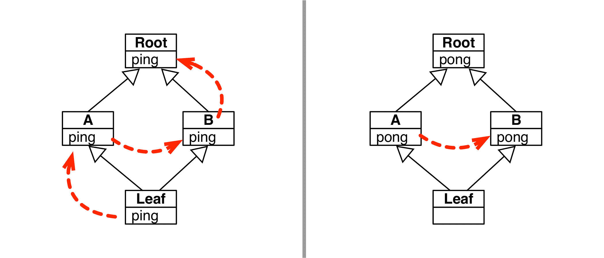
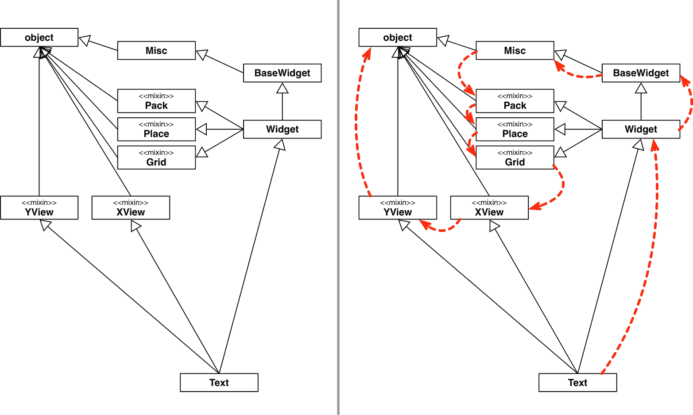
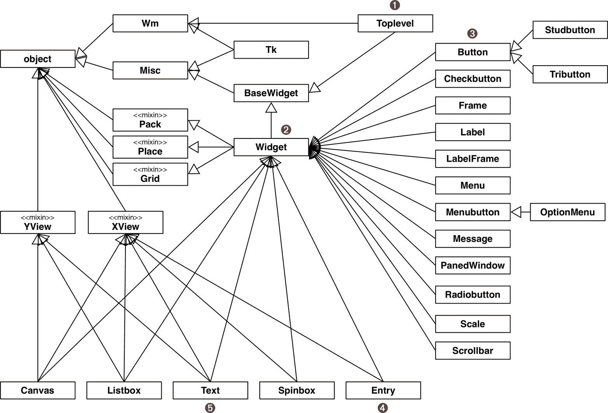

# 第十四章：继承：是好是坏

> [...] 我们需要一个更好的关于继承的理论（现在仍然需要）。例如，继承和实例化（这是一种继承）混淆了实用性（例如为了节省空间而分解代码）和语义（用于太多任务，如：专门化、泛化、种类化等）。
> 
> Alan Kay，“Smalltalk 的早期历史”¹

本章讨论继承和子类化。我假设你对这些概念有基本的了解，你可能从阅读[*Python 教程*](https://fpy.li/14-2)或从其他主流面向对象语言（如 Java、C#或 C++）的经验中了解这些概念。在这里，我们将重点关注 Python 的四个特点：

+   super()函数

+   从内置类型继承的陷阱

+   多重继承和方法解析顺序

+   Mixin 类

多重继承是一个类具有多个基类的能力。C++支持它；Java 和 C#不支持。许多人认为多重继承带来的麻烦不值得。在早期 C++代码库中被滥用后，Java 故意将其排除在外。

本章介绍了多重继承，供那些从未使用过的人，并提供了一些关于如何应对单一或多重继承的指导，如果你必须使用它。

截至 2021 年，对继承的过度使用存在明显的反对意见，不仅仅是多重继承，因为超类和子类之间紧密耦合。紧密耦合意味着对程序的某一部分进行更改可能会在其他部分产生意想不到的深远影响，使系统变得脆弱且难以理解。

然而，我们必须维护设计有复杂类层次结构的现有系统，或者使用强制我们使用继承的框架——有时甚至是多重继承。

我将通过标准库、Django 网络框架和 Tkinter GUI 工具包展示多重继承的实际用途。

# 本章新内容

本章主题没有与 Python 相关的新功能，但我根据第二版技术审阅人员的反馈进行了大量编辑，特别是 Leonardo Rochael 和 Caleb Hattingh。

我写了一个新的开头部分，重点关注`super()`内置函数，并更改了“多重继承和方法解析顺序”中的示例，以更深入地探讨`super()`如何支持*协作式* *多重继承*。

“Mixin 类”也是新内容。“现实世界中的多重继承”已重新组织，并涵盖了标准库中更简单的 mixin 示例，然后是复杂的 Django 和复杂的 Tkinter 层次结构。

正如章节标题所示，继承的注意事项一直是本章的主要主题之一。但越来越多的开发人员认为这是一个问题，我在“章节总结”和“进一步阅读”的末尾添加了几段关于避免继承的内容。

我们将从神秘的`super()`函数的概述开始。

# super()函数

对于可维护的面向对象 Python 程序，一致使用`super()`内置函数至关重要。

当子类重写超类的方法时，通常需要调用超类的相应方法。以下是推荐的方法，来自*collections*模块文档中的一个示例，[“OrderedDict 示例和配方”](https://fpy.li/14-3)部分：²

```py
class LastUpdatedOrderedDict(OrderedDict):
    """Store items in the order they were last updated"""

    def __setitem__(self, key, value):
        super().__setitem__(key, value)
        self.move_to_end(key)
```

为了完成其工作，`LastUpdatedOrderedDict`重写了`__setitem__`以：

1.  使用`super().__setitem__`调用超类上的该方法，让其插入或更新键/值对。

1.  调用`self.move_to_end`以确保更新的`key`位于最后位置。

调用重写的`__init__`方法特别重要，以允许超类在初始化实例时发挥作用。

###### 提示

如果你在 Java 中学习面向对象编程，可能会记得 Java 构造方法会自动调用超类的无参构造方法。Python 不会这样做。你必须习惯编写这种模式：

```py
    def __init__(self, a, b) :
        super().__init__(a, b)
        ...  # more initialization code
```

你可能见过不使用`super()`而是直接在超类上调用方法的代码，就像这样：

```py
class NotRecommended(OrderedDict):
    """This is a counter example!"""

    def __setitem__(self, key, value):
        OrderedDict.__setitem__(self, key, value)
        self.move_to_end(key)
```

这种替代方法在这种特定情况下有效，但出于两个原因不建议使用。首先，它将基类硬编码了。`OrderedDict`的名称出现在`class`语句中，也出现在`__setitem__`中。如果将来有人更改`class`语句以更改基类或添加另一个基类，他们可能会忘记更新`__setitem__`的内容，从而引入错误。

第二个原因是，`super`实现了处理具有多重继承的类层次结构的逻辑。我们将在“多重继承和方法解析顺序”中回顾这一点。为了总结这个关于`super`的复习，回顾一下在 Python 2 中我们如何调用它，因为旧的带有两个参数的签名是具有启发性的：

```py
class LastUpdatedOrderedDict(OrderedDict):
    """This code works in Python 2 and Python 3"""

    def __setitem__(self, key, value):
        super(LastUpdatedOrderedDict, self).__setitem__(key, value)
        self.move_to_end(key)
```

现在`super`的两个参数都是可选的。Python 3 字节码编译器在调用方法中的`super()`时会自动检查周围的上下文并提供这些参数。这些参数是：

`type`

实现所需方法的超类的搜索路径的起始位置。默认情况下，它是包含`super()`调用的方法所属的类。

`object_or_type`

对象（例如方法调用）或类（例如类方法调用）作为方法调用的接收者。默认情况下，如果`super()`调用发生在实例方法中，接收者就是`self`。

无论是你还是编译器提供这些参数，`super()`调用都会返回一个动态代理对象，该对象会在`type`参数的超类中找到一个方法（例如示例中的`__setitem__`），并将其绑定到`object_or_type`，这样在调用方法时就不需要显式传递接收者（`self`）了。

在 Python 3 中，你仍然可以显式提供`super()`的第一个和第二个参数。³ 但只有在特殊情况下才需要，例如跳过部分 MRO 进行测试或调试，或者解决超类中不希望的行为。

现在让我们讨论对内置类型进行子类化时的注意事项。

# 对内置类型进行子类化是棘手的

在 Python 的最早版本中，无法对`list`或`dict`等内置类型进行子类化。自 Python 2.2 起，虽然可以实现，但有一个重要的警告：内置类型的代码（用 C 编写）通常不会调用用户定义类中重写的方法。关于这个问题的一个简短描述可以在 PyPy 文档的“PyPy 和 CPython 之间的区别”部分中找到，[“内置类型的子类”](https://fpy.li/pypydif)。

> 官方上，CPython 没有明确规定子类中重写的方法何时会被隐式调用或不会被调用。作为近似值，这些方法永远不会被同一对象的其他内置方法调用。例如，在`dict`的子类中重写的`__getitem__()`不会被内置的`get()`方法调用。

示例 14-1 说明了这个问题。

##### 示例 14-1\. 我们对`__setitem__`的重写被内置`dict`的`__init__`和`__update__`方法所忽略。

```py
>>> class DoppelDict(dict):
...     def __setitem__(self, key, value):
...         super().__setitem__(key, [value] * 2)  # ①
...
>>> dd = DoppelDict(one=1)  # ②
>>> dd
{'one': 1} >>> dd['two'] = 2  # ③
>>> dd
{'one': 1, 'two': [2, 2]} >>> dd.update(three=3)  # ④
>>> dd
{'three': 3, 'one': 1, 'two': [2, 2]}
```

①

`DoppelDict.__setitem__`在存储时会复制值（没有好理由，只是为了有一个可见的效果）。它通过委托给超类来实现。

②

从`dict`继承的`__init__`方法明显忽略了`__setitem__`的重写：`'one'`的值没有复制。

③

`[]`操作符调用我们的`__setitem__`，并按预期工作：`'two'`映射到重复的值`[2, 2]`。

④

`dict`的`update`方法也没有使用我们的`__setitem__`版本：`'three'`的值没有被复制。

这种内置行为违反了面向对象编程的一个基本规则：方法的搜索应始终从接收者的类（`self`）开始，即使调用发生在一个由超类实现的方法内部。这就是所谓的“后期绑定”，Smalltalk 之父 Alan Kay 认为这是面向对象编程的一个关键特性：在任何形式为`x.method()`的调用中，要调用的确切方法必须在运行时确定，基于接收者`x`的类。⁴ 这种令人沮丧的情况导致了我们在“标准库中 __missing__ 的不一致使用”中看到的问题。

问题不仅限于实例内的调用——无论`self.get()`是否调用`self.__getitem__()`——还会发生在其他类的覆盖方法被内置方法调用时。示例 14-2 改编自[PyPy 文档](https://fpy.li/14-5)。

##### 示例 14-2\. `AnswerDict`的`__getitem__`被`dict.update`绕过。

```py
>>> class AnswerDict(dict):
...     def __getitem__(self, key):  # ①
...         return 42
...
>>> ad = AnswerDict(a='foo')  # ②
>>> ad['a']  # ③
42 >>> d = {}
>>> d.update(ad)  # ④
>>> d['a']  # ⑤
'foo' >>> d
{'a': 'foo'}
```

①

`AnswerDict.__getitem__`总是返回`42`，无论键是什么。

②

`ad`是一个加载了键-值对`('a', 'foo')`的`AnswerDict`。

③

`ad['a']`返回`42`，如预期。

④

`d`是一个普通`dict`的实例，我们用`ad`来更新它。

⑤

`dict.update`方法忽略了我们的`AnswerDict.__getitem__`。

###### 警告

直接对`dict`、`list`或`str`等内置类型进行子类化是容易出错的，因为内置方法大多忽略用户定义的覆盖。不要对内置类型进行子类化，而是从[`collections`](https://fpy.li/14-6)模块派生你的类，使用`UserDict`、`UserList`和`UserString`，这些类设计得易于扩展。

如果你继承`collections.UserDict`而不是`dict`，那么示例 14-1 和 14-2 中暴露的问题都会得到解决。请参见示例 14-3。

##### 示例 14-3\. `DoppelDict2`和`AnswerDict2`按预期工作，因为它们扩展了`UserDict`而不是`dict`。

```py
>>> import collections
>>>
>>> class DoppelDict2(collections.UserDict):
...     def __setitem__(self, key, value):
...         super().__setitem__(key, [value] * 2)
...
>>> dd = DoppelDict2(one=1)
>>> dd
{'one': [1, 1]}
>>> dd['two'] = 2
>>> dd
{'two': [2, 2], 'one': [1, 1]}
>>> dd.update(three=3)
>>> dd
{'two': [2, 2], 'three': [3, 3], 'one': [1, 1]}
>>>
>>> class AnswerDict2(collections.UserDict):
...     def __getitem__(self, key):
...         return 42
...
>>> ad = AnswerDict2(a='foo')
>>> ad['a']
42
>>> d = {}
>>> d.update(ad)
>>> d['a']
42
>>> d
{'a': 42}
```

为了衡量子类化内置类型所需的额外工作，我将示例 3-9 中的`StrKeyDict`类重写为子类化`dict`而不是`UserDict`。为了使其通过相同的测试套件，我不得不实现`__init__`、`get`和`update`，因为从`dict`继承的版本拒绝与覆盖的`__missing__`、`__contains__`和`__setitem__`合作。`UserDict`子类从示例 3-9 开始有 16 行，而实验性的`dict`子类最终有 33 行。⁵

明确一点：本节只涉及内置类型的 C 语言代码中方法委托的问题，只影响直接从这些类型派生的类。如果你子类化了一个用 Python 编写的基类，比如`UserDict`或`MutableMapping`，你就不会受到这个问题的困扰。⁶

现在让我们关注一个在多重继承中出现的问题：如果一个类有两个超类，当我们调用`super().attr`时，Python 如何决定使用哪个属性，但两个超类都有同名属性？

# 多重继承和方法解析顺序

任何实现多重继承的语言都需要处理当超类实现同名方法时可能出现的命名冲突。这称为“菱形问题”，在图 14-1 和示例 14-4 中有所说明。



###### 图 14-1\. 左：`leaf1.ping()`调用的激活顺序。右：`leaf1.pong()`调用的激活顺序。

##### 示例 14-4\. diamond.py：类`Leaf`、`A`、`B`、`Root`形成了图 14-1 中的图形

```py
class Root:  # ①
    def ping(self):
        print(f'{self}.ping() in Root')

    def pong(self):
        print(f'{self}.pong() in Root')

    def __repr__(self):
        cls_name = type(self).__name__
        return f'<instance of {cls_name}>'

class A(Root):  # ②
    def ping(self):
        print(f'{self}.ping() in A')
        super().ping()

    def pong(self):
        print(f'{self}.pong() in A')
        super().pong()

class B(Root):  # ③
    def ping(self):
        print(f'{self}.ping() in B')
        super().ping()

    def pong(self):
        print(f'{self}.pong() in B')

class Leaf(A, B):  # ④
    def ping(self):
        print(f'{self}.ping() in Leaf')
        super().ping()
```

①

`Root`提供`ping`、`pong`和`__repr__`以使输出更易于阅读。

②

类`A`中的`ping`和`pong`方法都调用了`super()`。

③

类`B`中只有`ping`方法调用了`super()`。

④

类`Leaf`只实现了`ping`，并调用了`super()`。

现在让我们看看在`Leaf`的实例上调用`ping`和`pong`方法的效果（示例 14-5）。

##### 示例 14-5\. 在`Leaf`对象上调用`ping`和`pong`的文档测试

```py
    >>> leaf1 = Leaf()  # ①
    >>> leaf1.ping()    # ②
    <instance of Leaf>.ping() in Leaf
    <instance of Leaf>.ping() in A
    <instance of Leaf>.ping() in B
    <instance of Leaf>.ping() in Root

    >>> leaf1.pong()   # ③
    <instance of Leaf>.pong() in A
    <instance of Leaf>.pong() in B
```

①

`leaf1`是`Leaf`的一个实例。

②

调用`leaf1.ping()`会激活`Leaf`、`A`、`B`和`Root`中的`ping`方法，因为前三个类中的`ping`方法都调用了`super().ping()`。

③

调用`leaf1.pong()`通过继承激活了`A`中的`pong`，然后调用`super.pong()`，激活了`B.pong`。

示例 14-5 和图 14-1 中显示的激活顺序由两个因素决定： 

+   `Leaf`类的方法解析顺序。

+   每个方法中使用`super()`

每个类都有一个名为`__mro__`的属性，其中包含一个指向超类的元组，按照方法解析顺序排列，从当前类一直到`object`类。⁷ 对于`Leaf`类，`__mro__`如下：

```py
>>> Leaf.__mro__  # doctest:+NORMALIZE_WHITESPACE
 (<class 'diamond1.Leaf'>, <class 'diamond1.A'>, <class 'diamond1.B'>,
 <class 'diamond1.Root'>, <class 'object'>)
```

###### 注意

查看图 14-1，您可能会认为 MRO 描述了一种[广度优先搜索](https://fpy.li/14-9)，但这只是对于特定类层次结构的一个巧合。 MRO 由一个名为 C3 的已发布算法计算。其在 Python 中的使用详细介绍在 Michele Simionato 的[“Python 2.3 方法解析顺序”](https://fpy.li/14-10)中。这是一篇具有挑战性的阅读，但 Simionato 写道：“除非您大量使用多重继承并且具有非平凡的层次结构，否则您不需要理解 C3 算法，您可以轻松跳过本文。”

MRO 仅确定激活顺序，但每个类中的特定方法是否激活取决于每个实现是否调用了`super()`。

考虑使用`pong`方法的实验。`Leaf`类没有对其进行覆盖，因此调用`leaf1.pong()`会通过继承激活`Leaf.__mro__`的下一个类中的实现：`A`类。方法`A.pong`调用`super().pong()`。接下来是 MRO 中的`B`类，因此激活`B.pong`。但是该方法不调用`super().pong()`，因此激活顺序到此结束。

MRO 不仅考虑继承图，还考虑超类在子类声明中列出的顺序。换句话说，如果在*diamond.py*（示例 14-4）中`Leaf`类声明为`Leaf(B, A)`，那么类`B`会在`Leaf.__mro__`中出现在`A`之前。这会影响`ping`方法的激活顺序，并且会导致`leaf1.pong()`通过继承激活`B.pong`，但`A.pong`和`Root.pong`永远不会运行，因为`B.pong`不调用`super()`。

当一个方法调用`super()`时，它是一个*合作方法*。合作方法实现*合作多重继承*。这些术语是有意的：为了工作，Python 中的多重继承需要涉及方法的积极合作。在`B`类中，`ping`进行合作，但`pong`不进行合作。

###### 警告

一个非合作方法可能导致微妙的错误。许多编码者阅读示例 14-4 时可能期望当方法`A.pong`调用`super.pong()`时，最终会激活`Root.pong`。但如果`B.pong`在之前激活，那就会出错。这就是为什么建议每个非根类的方法`m`都应该调用`super().m()`。

合作方法必须具有兼容的签名，因为你永远不知道`A.ping`是在`B.ping`之前还是之后调用的。激活顺序取决于每个同时继承两者的子类声明中`A`和`B`的顺序。

Python 是一种动态语言，因此`super()`与 MRO 的交互也是动态的。示例 14-6 展示了这种动态行为的一个令人惊讶的结果。

##### 示例 14-6。diamond2.py：演示`super()`动态性质的类

```py
from diamond import A  # ①

class U():  # ②
    def ping(self):
        print(f'{self}.ping() in U')
        super().ping()  # ③

class LeafUA(U, A):  # ④
    def ping(self):
        print(f'{self}.ping() in LeafUA')
        super().ping()
```

①

类`A`来自*diamond.py*（示例 14-4）。

②

类`U`与`diamond`模块中的`A`或`Root`无关。

③

`super().ping()`做什么？答案：这取决于情况。继续阅读。

④

`LeafUA`按照这个顺序子类化`U`和`A`。

如果你创建一个`U`的实例并尝试调用`ping`，你会得到一个错误：

```py
 >>> u = U()
 >>> u.ping()
 Traceback (most recent call last):
 ...
 AttributeError: 'super' object has no attribute 'ping'
```

`super()`返回的`'super'对象`没有属性`'ping'`，因为`U`的 MRO 有两个类：`U`和`object`，而后者没有名为`'ping'`的属性。

然而，`U.ping`方法并非完全没有希望。看看这个：

```py
 >>> leaf2 = LeafUA()
 >>> leaf2.ping()
 <instance of LeafUA>.ping() in LeafUA
 <instance of LeafUA>.ping() in U
 <instance of LeafUA>.ping() in A
 <instance of LeafUA>.ping() in Root
 >>> LeafUA.__mro__  # doctest:+NORMALIZE_WHITESPACE
 (<class 'diamond2.LeafUA'>, <class 'diamond2.U'>,
 <class 'diamond.A'>, <class 'diamond.Root'>, <class 'object'>)
```

`LeafUA`中的`super().ping()`调用激活`U.ping`，后者通过调用`super().ping()`也进行合作，激活`A.ping`，最终激活`Root.ping`。

注意`LeafUA`的基类是`(U, A)`，按照这个顺序。如果基类是`(A, U)`，那么`leaf2.ping()`永远不会到达`U.ping`，因为`A.ping`中的`super().ping()`会激活`Root.ping`，而该方法不调用`super()`。

在一个真实的程序中，类似`U`的类可能是一个*mixin 类*：一个旨在与多重继承中的其他类一起使用，以提供额外功能的类。我们将很快学习这个，在“Mixin Classes”中。

总结一下关于 MRO 的讨论，图 14-2 展示了 Python 标准库中 Tkinter GUI 工具包复杂多重继承图的一部分。



###### 图 14-2。左：Tkinter `Text`小部件类及其超类的 UML 图。右：`Text.__mro__`的漫长曲折路径用虚线箭头绘制。

要研究图片，请从底部的`Text`类开始。`Text`类实现了一个功能齐全的、多行可编辑的文本小部件。它本身提供了丰富的功能，但也继承了许多其他类的方法。左侧显示了一个简单的 UML 类图。右侧用箭头装饰，显示了 MRO，如示例 14-7 中列出的，借助`print_mro`便利函数。

##### 示例 14-7\. `tkinter.Text`的 MRO

```py
>>> def print_mro(cls):
...     print(', '.join(c.__name__ for c in cls.__mro__))
>>> import tkinter
>>> print_mro(tkinter.Text)
Text, Widget, BaseWidget, Misc, Pack, Place, Grid, XView, YView, object
```

现在让我们谈谈混入。

# 混入类

混入类设计为与至少一个其他类一起在多重继承安排中被子类化。混入不应该是具体类的唯一基类，因为它不为具体对象提供所有功能，而只是添加或自定义子类或兄弟类的行为。

###### 注意

混入类是 Python 和 C++中没有明确语言支持的约定。Ruby 允许明确定义和使用作为混入的模块——一组方法，可以包含以添加功能到类。C＃、PHP 和 Rust 实现了特征，这也是混入的一种明确形式。

让我们看一个简单但方便的混入类的示例。

## 不区分大小写的映射

示例 14-8 展示了`UpperCaseMixin`，一个设计用于提供对具有字符串键的映射进行不区分大小写访问的类，通过在添加或查找这些键时将它们大写。

##### 示例 14-8\. uppermixin.py：`UpperCaseMixin`支持不区分大小写的映射

```py
import collections

def _upper(key):  # ①
    try:
        return key.upper()
    except AttributeError:
        return key

class UpperCaseMixin:  # ②
    def __setitem__(self, key, item):
        super().__setitem__(_upper(key), item)

    def __getitem__(self, key):
        return super().__getitem__(_upper(key))

    def get(self, key, default=None):
        return super().get(_upper(key), default)

    def __contains__(self, key):
        return super().__contains__(_upper(key))
```

①

这个辅助函数接受任何类型的`key`，并尝试返回`key.upper()`；如果失败，则返回未更改的`key`。

②

这个混入实现了映射的四个基本方法，总是调用`super()`，如果可能的话，将`key`大写。

由于`UpperCaseMixin`的每个方法都调用`super()`，这个混入取决于一个实现或继承具有相同签名方法的兄弟类。为了发挥其作用，混入通常需要出现在使用它的子类的 MRO 中的其他类之前。实际上，这意味着混入必须首先出现在类声明中基类元组中。示例 14-9 展示了两个示例。

##### 示例 14-9\. uppermixin.py：使用`UpperCaseMixin`的两个类

```py
class UpperDict(UpperCaseMixin, collections.UserDict):  # ①
    pass

class UpperCounter(UpperCaseMixin, collections.Counter):  # ②
    """Specialized 'Counter' that uppercases string keys"""  # ③
```

①

`UpperDict`不需要自己的实现，但`UpperCaseMixin`必须是第一个基类，否则将调用`UserDict`的方法。

②

`UpperCaseMixin`也适用于`Counter`。

③

不要使用`pass`，最好提供一个文档字符串来满足`class`语句语法中需要主体的需求。

这里是[*uppermixin.py*](https://fpy.li/14-11)中的一些 doctests，用于`UpperDict`：

```py
 >>> d = UpperDict([('a', 'letter A'), (2, 'digit two')])
 >>> list(d.keys())
 ['A', 2]
 >>> d['b'] = 'letter B'
 >>> 'b' in d
 True
 >>> d['a'], d.get('B')
 ('letter A', 'letter B')
 >>> list(d.keys())
 ['A', 2, 'B']
```

还有一个关于`UpperCounter`的快速演示：

```py
 >>> c = UpperCounter('BaNanA')
 >>> c.most_common()
 [('A', 3), ('N', 2), ('B', 1)]
```

`UpperDict`和`UpperCounter`看起来几乎像是魔法，但我不得不仔细研究`UserDict`和`Counter`的代码，以使`UpperCaseMixin`与它们一起工作。

例如，我的第一个版本的`UpperCaseMixin`没有提供`get`方法。那个版本可以与`UserDict`一起工作，但不能与`Counter`一起工作。`UserDict`类继承了`collections.abc.Mapping`的`get`方法，而该`get`方法调用了我实现的`__getitem__`。但是，当`UpperCounter`加载到`__init__`时，键并没有大写。这是因为`Counter.__init__`使用了`Counter.update`，而`Counter.update`又依赖于从`dict`继承的`get`方法。然而，`dict`类中的`get`方法并不调用`__getitem__`。这是在“标准库中 __missing__ 的不一致使用”中讨论的问题的核心。这也是对利用继承的程序的脆弱和令人困惑的本质的鲜明提醒，即使在小规模上也是如此。

下一节将涵盖多个多重继承的示例，通常包括 Mixin 类。

# 现实世界中的多重继承

在《设计模式》一书中，⁸几乎所有的代码都是用 C++ 编写的，但多重继承的唯一示例是适配器模式。在 Python 中，多重继承也不是常态，但有一些重要的例子我将在本节中评论。

## ABCs 也是 Mixins

在 Python 标准库中，最明显的多重继承用法是`collections.abc`包。这并不具有争议性：毕竟，即使是 Java 也支持接口的多重继承，而 ABCs 是接口声明，可以选择性地提供具体方法实现。⁹

Python 官方文档中对[`collections.abc`](https://fpy.li/14-13)使用术语*mixin 方法*来表示许多集合 ABCs 中实现的具体方法。提供 mixin 方法的 ABCs 扮演两个角色：它们是接口定义，也是 mixin 类。例如，`collections.UserDict`的[实现](https://fpy.li/14-14)依赖于`collections.abc.MutableMapping`提供的几个 mixin 方法。

## ThreadingMixIn 和 ForkingMixIn

[*http.server*](https://fpy.li/14-15)包提供了`HTTPServer`和`ThreadingHTTPServer`类。后者是在 Python 3.7 中添加的。其文档中说：

类`http.server.ThreadingHTTPServer`(server_address, RequestHandlerClass)

这个类与`HTTPServer`相同，但使用线程来处理请求，使用了`ThreadingMixIn`。这对于处理预先打开套接字的网络浏览器非常有用，对于这些套接字，`HTTPServer`将无限期等待。

这是 Python 3.10 中`ThreadingHTTPServer`类的[完整源代码](https://fpy.li/14-16)：

```py
class ThreadingHTTPServer(socketserver.ThreadingMixIn, HTTPServer):
    daemon_threads = True
```

`socketserver.ThreadingMixIn`的[源代码](https://fpy.li/14-17)有 38 行，包括注释和文档字符串。示例 14-10 展示了其实现的摘要。

##### 示例 14-10\. Python 3.10 中 *Lib/socketserver.py* 的一部分

```py
class ThreadingMixIn:
    """Mixin class to handle each request in a new thread."""

    # 8 lines omitted in book listing

    def process_request_thread(self, request, client_address):  # ①
        ... # 6 lines omitted in book listing

    def process_request(self, request, client_address):  # ②
        ... # 8 lines omitted in book listing

    def server_close(self):  # ③
        super().server_close()
        self._threads.join()
```

①

`process_request_thread` 不调用`super()`，因为它是一个新方法，而不是一个覆盖。它的实现调用了`HTTPServer`提供或继承的三个实例方法。

②

这覆盖了`HTTPServer`从`socketserver.BaseServer`继承的`process_request`方法，启动一个线程，并将实际工作委托给在该线程中运行的`process_request_thread`。它不调用`super()`。

③

`server_close` 调用`super().server_close()`停止接受请求，然后等待`process_request`启动的线程完成其工作。

`ThreadingMixIn`出现在[`socketserver`](https://fpy.li/14-18)模块文档中，旁边是`ForkingMixin`。后者旨在支持基于[`os.fork()`](https://fpy.li/14-19)的并发服务器，这是一种在符合[POSIX](https://fpy.li/14-20)的类 Unix 系统中启动子进程的 API。

## Django 通用视图混合类

###### 注意

您不需要了解 Django 才能阅读本节。我使用框架的一小部分作为多重继承的实际示例，并将尽力提供所有必要的背景知识，假设您在任何语言或框架中具有一些服务器端 Web 开发经验。

在 Django 中，视图是一个可调用对象，接受一个`request`参数——代表一个 HTTP 请求的对象，并返回一个代表 HTTP 响应的对象。我们在这里讨论的是不同的响应。它们可以是简单的重定向响应，没有内容主体，也可以是一个在线商店中的目录页面，从 HTML 模板渲染并列出多个商品，带有购买按钮和到详细页面的链接。

最初，Django 提供了一组称为通用视图的函数，实现了一些常见用例。例如，许多站点需要显示包含来自多个项目的信息的搜索结果，列表跨越多个页面，对于每个项目，都有一个链接到包含有关其详细信息的页面。在 Django 中，列表视图和详细视图被设计为一起解决这个问题：列表视图呈现搜索结果，详细视图为每个单独项目生成一个页面。

然而，最初的通用视图是函数，因此它们是不可扩展的。如果您需要做类似但不完全像通用列表视图的事情，您将不得不从头开始。

类视图的概念是在 Django 1.3 中引入的，连同一组通用视图类，组织为基类、混合类和可直接使用的具体类。在 Django 3.2 中，基类和混合类位于`django.views.generic`包的`base`模块中，如图 14-3 所示。在图表的顶部，我们看到两个负责非常不同职责的类：`View`和`TemplateResponseMixin`。


###### 图 14-3\. `django.views.generic.base`模块的 UML 类图。

###### 提示

学习这些类的一个很好的资源是[*Classy Class-Based Views*](https://fpy.li/14-21)网站，您可以轻松浏览它们，查看每个类中的所有方法（继承的、重写的和添加的方法），查看图表，浏览它们的文档，并跳转到它们在 GitHub 上的[源代码](https://fpy.li/14-22)。

`View`是所有视图的基类（它可以是 ABC），它提供核心功能，如`dispatch`方法，该方法委托给具体子类实现的“处理程序”方法，如`get`、`head`、`post`等，以处理不同的 HTTP 动词。¹⁰ `RedirectView`类仅继承自`View`，您可以看到它实现了`get`、`head`、`post`等。

`View`的具体子类应该实现处理程序方法，那么为什么这些方法不是`View`接口的一部分呢？原因是：子类可以自由地实现它们想要支持的处理程序。`TemplateView`仅用于显示内容，因此它只实现`get`。如果向`TemplateView`发送 HTTP `POST`请求，继承的`View.dispatch`方法会检查是否存在`post`处理程序，并生成 HTTP `405 Method Not Allowed`响应。¹¹

`TemplateResponseMixin`提供的功能只对需要使用模板的视图感兴趣。例如，`RedirectView`没有内容主体，因此不需要模板，也不继承自此混合类。`TemplateResponseMixin`为`TemplateView`和其他模板渲染视图提供行为，如`ListView`、`DetailView`等，定义在`django.views.generic`子包中。图 14-4 描述了`django.views.generic.list`模块和`base`模块的部分。

对于 Django 用户来说，图 14-4 中最重要的类是`ListView`，它是一个聚合类，没有任何代码（其主体只是一个文档字符串）。 当实例化时，`ListView` 通过`object_list`实例属性具有一个可迭代的对象，模板可以通过它来显示页面内容，通常是数据库查询返回多个对象的结果。 生成这些对象的可迭代对象的所有功能来自`MultipleObjectMixin`。 该混合类还提供了复杂的分页逻辑——在一个页面中显示部分结果和链接到更多页面。

假设您想创建一个不会呈现模板，但会以 JSON 格式生成对象列表的视图。 这就是`BaseListView`的存在。 它提供了一个易于使用的扩展点，将`View`和`MultipleObjectMixin`功能结合在一起，而不需要模板机制的开销。

Django 基于类的视图 API 是多重继承的一个更好的例子，比 Tkinter 更好。 特别是，很容易理解其混合类：每个混合类都有一个明确定义的目的，并且它们都以`…Mixin`后缀命名。


###### 图 14-4\. `django.views.generic.list` 模块的 UML 类图。 这里基本模块的三个类已经折叠（参见图 14-3）。 `ListView` 类没有方法或属性：它是一个聚合类。

基于类的视图并不被 Django 用户普遍接受。许多人以一种有限的方式使用它们，作为不透明的盒子，但当需要创建新东西时，许多 Django 程序员继续编写处理所有这些责任的单片视图函数，而不是尝试重用基本视图和混合类。

学习如何利用基于类的视图以及如何扩展它们以满足特定应用程序需求确实需要一些时间，但我发现研究它们是值得的。 它们消除了大量样板代码，使得重用解决方案更容易，甚至改善了团队沟通——例如，通过定义模板的标准名称，以及传递给模板上下文的变量。 基于类的视图是 Django 视图的“轨道”。

## Tkinter 中的多重继承

Python 标准库中多重继承的一个极端例子是[Tkinter GUI 工具包](https://fpy.li/14-24)。 我使用了 Tkinter 小部件层次结构的一部分来说明图 14-2 中的 MRO。 图 14-5 显示了`tkinter`基础包中的所有小部件类（[`tkinter.ttk`子包中有更多小部件](https://fpy.li/14-25)）。



###### 图 14-5\. Tkinter GUI 类层次结构的摘要 UML 图；标记为«mixin»的类旨在通过多重继承为其他类提供具体方法。

当我写这篇文章时，Tkinter 已经有 25 年的历史了。 它并不是当前最佳实践的例子。 但它展示了当编码人员不欣赏其缺点时如何使用多重继承。 当我们在下一节讨论一些良好实践时，它将作为一个反例。

请考虑来自图 14-5 的这些类：

➊ `Toplevel`：Tkinter 应用程序中顶级窗口的类。

➋ `Widget`：可以放置在窗口上的每个可见对象的超类。

➌ `Button`：一个普通的按钮小部件。

➍ `Entry`：一个单行可编辑文本字段。

➎ `Text`：一个多行可编辑文本字段。

这些类的 MRO 是由`print_mro`函数显示的，该函数来自示例 14-7：

```py
>>> import tkinter
>>> print_mro(tkinter.Toplevel)
Toplevel, BaseWidget, Misc, Wm, object
>>> print_mro(tkinter.Widget)
Widget, BaseWidget, Misc, Pack, Place, Grid, object
>>> print_mro(tkinter.Button)
Button, Widget, BaseWidget, Misc, Pack, Place, Grid, object
>>> print_mro(tkinter.Entry)
Entry, Widget, BaseWidget, Misc, Pack, Place, Grid, XView, object
>>> print_mro(tkinter.Text)
Text, Widget, BaseWidget, Misc, Pack, Place, Grid, XView, YView, object
```

###### 注意

按照当前标准，Tkinter 的类层次结构非常深。Python 标准库的很少部分具有超过三到四级的具体类，Java 类库也是如此。然而，有趣的是，Java 类库中一些最深层次的层次结构恰好是与 GUI 编程相关的包：[`java.awt`](https://fpy.li/14-26) 和 [`javax.swing`](https://fpy.li/14-27)。现代、免费的 Smalltalk 版本 Squeak 包括功能强大且创新的 Morphic GUI 工具包，同样具有深层次的类层次结构。根据我的经验，GUI 工具包是继承最有用的地方。

注意这些类与其他类的关系：

+   `Toplevel` 是唯一一个不从 `Widget` 继承的图形类，因为它是顶层窗口，不像一个 widget 那样行为；例如，它不能附加到窗口或框架。`Toplevel` 从 `Wm` 继承，提供了主机窗口管理器的直接访问函数，如设置窗口标题和配置其边框。

+   `Widget` 直接从 `BaseWidget` 和 `Pack`、`Place`、`Grid` 继承。这三个类是几何管理器：它们负责在窗口或框架内排列小部件。每个类封装了不同的布局策略和小部件放置 API。

+   `Button`，像大多数小部件一样，只从 `Widget` 继承，但间接从 `Misc` 继承，为每个小部件提供了数十种方法。

+   `Entry` 从支持水平滚动的 `Widget` 和 `XView` 继承。

+   `Text` 从 `Widget`、`XView` 和 `YView` 继承以支持垂直滚动。

现在我们将讨论一些多重继承的良好实践，并看看 Tkinter 是否符合这些实践。

# 处理继承

阿兰·凯在前言中写道：关于继承还没有能够指导实践程序员的一般理论。我们拥有的是经验法则、设计模式、“最佳实践”、巧妙的首字母缩写、禁忌等。其中一些提供了有用的指导方针，但没有一个是普遍接受的或总是适用的。

使用继承很容易创建难以理解和脆弱的设计，即使没有多重继承。由于我们没有一个全面的理论，这里有一些避免意大利面式类图的提示。

## 偏向对象组合而不是类继承

这个小节的标题是《设计模式》书中的面向对象设计的第二原则¹²，也是我在这里能提供的最好建议。一旦你熟悉了继承，就很容易过度使用它。将对象放在一个整洁的层次结构中符合我们的秩序感；程序员只是为了好玩而这样做。

偏向组合会导致更灵活的设计。例如，在`tkinter.Widget`类的情况下，widget 实例可以持有对几何管理器的引用，并调用其方法，而不是从所有几何管理器继承方法。毕竟，一个`Widget`不应该“是”一个几何管理器，但可以通过委托使用其服务。然后，您可以添加一个新的几何管理器，而不必触及 widget 类层次结构，也不必担心名称冲突。即使在单一继承的情况下，这个原则也增强了灵活性，因为子类化是一种紧密耦合的形式，而高继承树往往是脆弱的。

组合和委托可以替代使用 Mixin 使行为可用于不同类，但不能替代使用接口继承来定义类型层次结构。

## 理解每种情况下为何使用继承

处理多重继承时，有必要清楚地了解在每种特定情况下为何进行子类化。主要原因包括：

+   接口继承创建一个子类型，暗示一个“是一个”关系。这最好通过 ABCs 完成。

+   实现的继承避免了代码重复使用。Mixin 可以帮助实现这一点。

在实践中，这两种用法通常同时存在，但只要您能清楚地表达意图，就应该这样做。继承用于代码重用是一个实现细节，它经常可以被组合和委托替代。另一方面，接口继承是框架的支柱。接口继承应尽可能只使用 ABC 作为基类。

## 使用 ABC 明确接口

在现代 Python 中，如果一个类旨在定义一个接口，它应该是一个明确的 ABC 或`typing.Protocol`子类。ABC 应该仅从`abc.ABC`或其他 ABC 继承。多重继承 ABC 并不成问题。

## 使用明确的混合类进行代码重用

如果一个类旨在为多个不相关的子类提供方法实现以供重用，而不意味着“是一个”关系，则应该是一个明确的*混合类*。从概念上讲，混合类不定义新类型；它只是捆绑方法以供重用。混合类不应该被实例化，具体类不应该仅从混合类继承。每个混合类应提供一个特定的行为，实现少量且非常相关的方法。混合类应避免保留任何内部状态；即混合类不应具有实例属性。

在 Python 中没有正式的方法来声明一个类是混合类，因此强烈建议它们以`Mixin`后缀命名。

## 为用户提供聚合类

> 主要通过从混合项继承而构建的类，不添加自己的结构或行为，被称为*聚合类*。
> 
> Booch 等人¹³

如果某些 ABC 或混合类的组合对客户端代码特别有用，请提供一个以合理方式将它们组合在一起的类。

例如，这里是 Django `ListView`类的完整[源代码](https://fpy.li/14-29)，位于图 14-4 右下角：

```py
class ListView(MultipleObjectTemplateResponseMixin, BaseListView):
    """
 Render some list of objects, set by `self.model` or `self.queryset`.
 `self.queryset` can actually be any iterable of items, not just a queryset.
 """
```

`ListView`的主体是空的，但该类提供了一个有用的服务：它将一个混合类和一个应该一起使用的基类组合在一起。

另一个例子是[`tkinter.Widget`](https://fpy.li/14-30)，它有四个基类，没有自己的方法或属性，只有一个文档字符串。由于`Widget`聚合类，我们可以创建一个新的小部件，其中包含所需的混合项，而无需弄清楚它们应该以何种顺序声明才能按预期工作。

请注意，聚合类不一定要完全为空，但它们通常是。

## 只对设计为可子类化的类进行子类化

在关于本章的一条评论中，技术审阅员 Leonardo Rochael 提出了以下警告。

###### 警告

由于超类方法可能以意想不到的方式忽略子类覆盖，因此从任何复杂类继承并覆盖其方法是容易出错的。尽可能避免覆盖方法，或者至少限制自己只继承易于扩展的类，并且只以设计为可扩展的方式进行扩展。

这是一个很好的建议，但我们如何知道一个类是否被设计为可扩展？

第一个答案是文档（有时以文档字符串或甚至代码注释的形式）。例如，Python 的[`socketserver`](https://fpy.li/14-31)包被描述为“一个网络服务器框架”。它的[`BaseServer`](https://fpy.li/14-32)类被设计为可子类化，正如其名称所示。更重要的是，类的文档和源代码中的[文档字符串](https://fpy.li/14-33)明确指出了哪些方法是打算由子类重写的。

在 Python ≥ 3.8 中，通过[PEP 591—为类型添加 final 修饰符](https://fpy.li/pep591)提供了一种明确制定这些设计约束的新方法。该 PEP 引入了一个[`@final`](https://fpy.li/14-34)装饰器，可应用于类或单独的方法，以便 IDE 或类型检查器可以报告误用尝试对这些类进行子类化或覆盖这些方法的情况。¹⁴

## 避免从具体类继承

从具体类进行子类化比从 ABC 和 mixin 进行子类化更危险，因为具体类的实例通常具有内部状态，当您覆盖依赖于该状态的方法时，很容易破坏该状态。即使您的方法通过调用`super()`来合作，并且内部状态是使用`__x`语法保存在私有属性中，仍然有无数种方法可以通过方法覆盖引入错误。

在“水禽和 ABC”中，Alex Martelli 引用了 Scott Meyer 的*More Effective C++*，其中说：“所有非叶类都应该是抽象的。”换句话说，Meyer 建议只有抽象类应该被子类化。

如果必须使用子类化进行代码重用，则应将用于重用的代码放在 ABC 的 mixin 方法中或明确命名的 mixin 类中。

我们现在将从这些建议的角度分析 Tkinter。

## Tkinter：优点、缺点和丑闻

先前部分中的大多数建议在 Tkinter 中并未遵循，特别例外是“向用户提供聚合类”。即使如此，这也不是一个很好的例子，因为像在“更青睐对象组合而非类继承”中讨论的那样，将几何管理器集成到`Widget`中可能效果更好。

请记住，Tkinter 自 1994 年发布的 Python 1.1 起就是标准库的一部分。Tkinter 是建立在 Tcl 语言的出色 Tk GUI 工具包之上的一层。Tcl/Tk 组合最初并非面向对象，因此 Tk API 基本上是一个庞大的函数目录。但是，该工具包在设计上是面向对象的，尽管在其原始的 Tcl 实现中不是。

`tkinter.Widget`的文档字符串以“内部类”开头。这表明`Widget`可能应该是一个 ABC。尽管`Widget`没有自己的方法，但它确实定义了一个接口。它的含义是：“您可以依赖于每个 Tkinter 小部件提供基本小部件方法（`__init__`、`destroy`和数十个 Tk API 函数），以及所有三个几何管理器的方法。”我们可以同意这不是一个很好的接口定义（它太宽泛了），但它是一个接口，而`Widget`将其“定义”为其超类接口的并集。

`Tk`类封装了 GUI 应用程序逻辑，继承自`Wm`和`Misc`的两者都不是抽象或 mixin（`Wm`不是一个适当的 mixin，因为`TopLevel`仅从它继承）。`Misc`类的名称本身就是一个非常明显的*代码异味*。`Misc`有 100 多个方法，所有小部件都继承自它。为什么每个小部件都需要处理剪贴板、文本选择、定时器管理等方法？您实际上无法将内容粘贴到按钮中或从滚动条中选择文本。`Misc`应该拆分为几个专门的 mixin 类，并且不是所有小部件都应该从每个 mixin 类继承。

公平地说，作为 Tkinter 用户，您根本不需要了解或使用多重继承。这是隐藏在您将在自己的代码中实例化或子类化的小部件类背后的实现细节。但是，当您键入`dir(tkinter.Button)`并尝试在列出的 214 个属性中找到所需的方法时，您将遭受过多多重继承的后果。如果您决定实现一个新的 Tk 小部件，您将需要面对这种复杂性。

###### 提示

尽管存在问题，Tkinter 是稳定的、灵活的，并且如果使用`tkinter.ttk`包及其主题小部件，提供现代外观和感觉。此外，一些原始小部件，如`Canvas`和`Text`，功能强大。你可以在几小时内将`Canvas`对象转换为简单的拖放绘图应用程序。如果你对 GUI 编程感兴趣，Tkinter 和 Tcl/Tk 绝对值得一看。

这标志着我们对继承迷宫的探索结束了。

# 章节总结

本章从单一继承的情况下对`super()`函数进行了回顾。然后我们讨论了子类化内置类型的问题：它们在 C 中实现的原生方法不会调用子类中的重写方法，除了极少数特殊情况。这就是为什么当我们需要自定义`list`、`dict`或`str`类型时，更容易子类化`UserList`、`UserDict`或`UserString`——它们都定义在[`collections`模块](https://fpy.li/collec)中，实际上包装了相应的内置类型并将操作委托给它们——这是标准库中偏向组合而非继承的三个例子。如果期望的行为与内置提供的行为非常不同，可能更容易子类化[`collections.abc`](https://fpy.li/14-13)中的适当 ABC，并编写自己的实现。

本章的其余部分致力于多重继承的双刃剑。首先，我们看到了方法解析顺序，编码在`__mro__`类属性中，解决了继承方法中潜在命名冲突的问题。我们还看到了`super()`内置函数在具有多重继承的层次结构中的行为，有时会出乎意料。`super()`的行为旨在支持混入类，然后我们通过`UpperCaseMixin`对不区分大小写映射的简单示例进行了研究。

我们看到了多重继承和混入方法在 Python 的 ABCs 中的使用，以及在`socketserver`线程和分叉混入中的使用。更复杂的多重继承用法由 Django 的基于类的视图和 Tkinter GUI 工具包示例。尽管 Tkinter 不是现代最佳实践的例子，但它是我们可能在遗留系统中找到的过于复杂的类层次结构的例子。

为了结束本章，我提出了七条应对继承的建议，并在对 Tkinter 类层次结构的评论中应用了其中一些建议。

拒绝继承——甚至是单一继承——是一个现代趋势。21 世纪创建的最成功的语言之一是 Go。它没有名为“类”的构造，但你可以构建作为封装字段结构的类型，并且可以将方法附加到这些结构上。Go 允许定义接口，编译器使用结构化类型检查这些接口，即*静态鸭子类型*，与 Python 3.8 之后的协议类型非常相似。Go 有特殊的语法用于通过组合构建类型和接口，但它不支持继承——甚至不支持接口之间的继承。

所以也许关于继承的最佳建议是：如果可以的话，尽量避免。但通常情况下，我们没有选择：我们使用的框架会强加它们自己的设计选择。

# 进一步阅读

> 在阅读清晰度方面，适当的组合优于继承。由于代码更多地被阅读而不是被编写，一般情况下应避免子类化，尤其不要混合各种类型的继承，并且不要使用子类化进行代码共享。
> 
> Hynek Schlawack，《Python 中的子类化再探》

在这本书的最终审阅期间，技术审阅员 Jürgen Gmach 推荐了 Hynek Schlawack 的帖子[“Subclassing in Python Redux”](https://fpy.li/14-37)—前述引用的来源。Schlawack 是流行的*attrs*包的作者，并且是 Twisted 异步编程框架的核心贡献者，这是 Glyph Lefkowitz 于 2002 年发起的项目。随着时间的推移，核心团队意识到他们在设计中过度使用了子类化，根据 Schlawack 的说法。他的帖子很长，引用了其他重要的帖子和演讲。强烈推荐。

在同样的结论中，Hynek Schlawack 写道：“不要忘记，更多时候，一个函数就是你所需要的。”我同意，这正是为什么在类和继承之前，《Fluent Python》深入讲解函数的原因。我的目标是展示在创建自己的类之前，利用标准库中现有类可以实现多少功能。

Guido van Rossum 的论文[“Unifying types and classes in Python 2.2”](https://fpy.li/descr101)介绍了内置函数的子类型、`super`函数以及描述符和元类等高级特性。这些特性自那时以来并没有发生重大变化。Python 2.2 是语言演进的一个了不起的成就，添加了几个强大的新特性，形成了一个连贯的整体，而不会破坏向后兼容性。这些新特性是 100%选择性的。要使用它们，我们只需显式地子类化`object`——直接或间接地创建所谓的“新样式类”。在 Python 3 中，每个类都是`object`的子类。

David Beazley 和 Brian K. Jones（O’Reilly）的《Python Cookbook》，第三版（https://fpy.li/pycook3）中有几个示例展示了`super()`和 mixin 类的使用。你可以从启发性的部分[“8.7\. Calling a Method on a Parent Class”](https://fpy.li/14-38)开始，然后从那里跟随内部引用。

Raymond Hettinger 的帖子[“Python’s super() considered super!”](https://fpy.li/14-39)从积极的角度解释了 Python 中`super`和多重继承的工作原理。这篇文章是作为对 James Knight 的[“Python’s Super is nifty, but you can’t use it (Previously: Python’s Super Considered Harmful)”](https://fpy.li/14-40)的回应而撰写的。Martijn Pieters 对[“How to use super() with one argument?”](https://fpy.li/14-41)的回应包括对`super`的简明而深入的解释，包括它与描述符的关系，这是我们只会在第二十三章中学习的概念。这就是`super`的本质。在基本用例中使用起来很简单，但它是一个强大且复杂的工具，涉及一些 Python 中最先进的动态特性，很少在其他语言中找到。

尽管这些帖子的标题是关于`super`内置函数的，但问题实际上并不是 Python 3 中不像 Python 2 那样丑陋的`super`内置函数。真正的问题在于多重继承，这本质上是复杂且棘手的。Michele Simionato 在他的[“Setting Multiple Inheritance Straight”](https://fpy.li/14-42)中不仅仅是批评，实际上还提出了一个解决方案：他实现了 traits，这是一种源自 Self 语言的明确形式的 mixin。Simionato 在 Python 中有一系列关于多重继承的博客文章，包括[“The wonders of cooperative inheritance, or using super in Python 3”](https://fpy.li/14-43)；[“Mixins considered harmful,” part 1](https://fpy.li/14-44)和[part 2](https://fpy.li/14-45)；以及[“Things to Know About Python Super,” part 1](https://fpy.li/14-46)、[part 2](https://fpy.li/14-47)和[part 3](https://fpy.li/14-48)。最早的帖子使用了 Python 2 的`super`语法，但仍然具有相关性。

我阅读了 Grady Booch 等人的第三版《面向对象的分析与设计》，强烈推荐它作为独立于编程语言的面向对象思维的通用入门书籍。这是一本罕见的涵盖多重继承而没有偏见的书籍。

现在比以往任何时候都更时尚地避免继承，所以这里有两个关于如何做到这一点的参考资料。Brandon Rhodes 写了 [“组合优于继承原则”](https://fpy.li/14-49)，这是他出色的 [*Python 设计模式*](https://fpy.li/14-50) 指南的一部分。Augie Fackler 和 Nathaniel Manista 在 PyCon 2013 上提出了 [“对象继承的终结与新模块化的开始”](https://fpy.li/14-51)。Fackler 和 Manista 谈到围绕接口和处理实现这些接口的对象的函数来组织系统，避免类和继承的紧密耦合和失败模式。这让我很想起 Go 的方式，但他们为 Python 提倡这种方式。

¹ Alan Kay, “Smalltalk 的早期历史”，发表于 SIGPLAN Not. 28, 3 (1993 年 3 月), 69–95\. 也可在线获取 [链接](https://fpy.li/14-1)。感谢我的朋友 Christano Anderson，在我撰写本章时分享了这个参考资料。

² 我只修改了示例中的文档字符串，因为原文有误导性。它说：“按照键最后添加的顺序存储项目”，但这并不是明确命名的 `LastUpdatedOrderedDict` 所做的。

³ 也可以只提供第一个参数，但这并不实用，可能很快就会被弃用，Guido van Rossum 创建 `super()` 时也表示支持。请参见 [“是时候废弃未绑定的 super 方法了吗？”](https://fpy.li/14-4) 中的讨论。

⁴ 有趣的是，C++ 中有虚方法和非虚方法的概念。虚方法是晚期绑定的，但非虚方法在编译时绑定。尽管我们在 Python 中编写的每个方法都像虚方法一样晚期绑定，但用 C 编写的内置对象似乎默认具有非虚方法，至少在 CPython 中是这样。

⁵ 如果你感兴趣，实验在 [*14-inheritance/strkeydict_dictsub.py*](https://fpy.li/14-7) 文件中的 [*fluentpython/example-code-2e*](https://fpy.li/code) 仓库中。

⁶ 顺便说一句，在这方面，PyPy 的行为比 CPython 更“正确”，但代价是引入了一点不兼容性。详细信息请参见 [“PyPy 和 CPython 之间的差异”](https://fpy.li/14-5)。

⁷ 类还有一个 `.mro()` 方法，但那是元类编程的高级特性，提到了 “类作为对象”。在类的正常使用过程中，`__mro__` 属性的内容才是重要的。

⁸ Erich Gamma, Richard Helm, Ralph Johnson, 和 John Vlissides，*设计模式：可复用面向对象软件的元素* (Addison-Wesley)。

⁹ 正如之前提到的，Java 8 允许接口提供方法实现。这一新特性在官方 Java 教程中称为 [“默认方法”](https://fpy.li/14-12)。

¹⁰ Django 程序员知道 `as_view` 类方法是 `View` 接口中最显著的部分，但在这里对我们并不重要。

¹¹ 如果你对设计模式感兴趣，你会注意到 Django 的调度机制是 [模板方法模式](https://fpy.li/14-23) 的动态变体。它是动态的，因为 `View` 类不强制子类实现所有处理程序，而是 `dispatch` 在运行时检查是否为特定请求提供了具体处理程序。

¹² 这个原则出现在该书的引言第 20 页。

¹³ Grady Booch 等人，*面向对象的分析与设计及应用*，第 3 版 (Addison-Wesley)，第 109 页。

¹⁴ PEP 591 还引入了一个[`Final`](https://fpy.li/14-35)注释，用于标记不应重新赋值或覆盖的变量或属性。

¹⁵ Alan Kay 在 SIGPLAN Not. 28, 3（1993 年 3 月）中写道：“Smalltalk 的早期历史”，69-95 页。也可在线查看[链接](https://fpy.li/14-1)。感谢我的朋友 Christiano Anderson，在我撰写本章时分享了这个参考资料。

¹⁶ 我的朋友和技术审阅员 Leonardo Rochael 解释得比我更好：“Perl 6 的持续存在，但始终未到来，使 Perl 本身的发展失去了意志力。现在 Perl 继续作为一个独立的语言进行开发（截至目前为止已经到了版本 5.34），没有因为曾经被称为 Perl 6 的语言而被废弃的阴影。”
