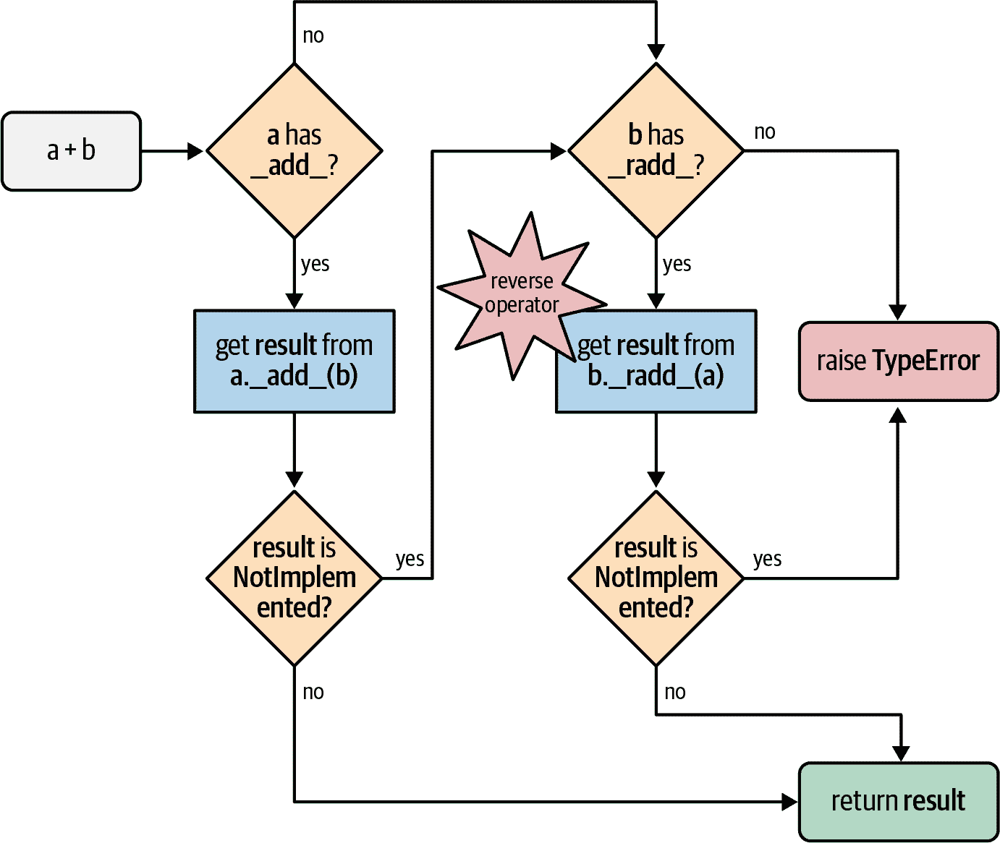

# 第十六章：运算符重载

> 有一些事情让我感到矛盾，比如运算符重载。我在 C++ 中看到太多人滥用它，所以我把运算符重载略去了，这是一个相当个人的选择。
> 
> Java 的创始人詹姆斯·高斯林¹

在 Python 中，你可以使用以下公式计算复利：

```py
interest = principal * ((1 + rate) ** periods - 1)
```

出现在操作数之间的运算符，如 `1 + rate`，是*中缀运算符*。在 Python 中，中缀运算符可以处理任意类型。因此，如果你处理真实货币，你可以确保 `principal`、`rate` 和 `periods` 是精确的数字 —— Python `decimal.Decimal` 类的实例 —— 并且该公式将按照写入的方式工作，产生精确的结果。

但是在 Java 中，如果你从 `float` 切换到 `BigDecimal` 以获得精确的结果，你就不能再使用中缀运算符了，因为它们只适用于原始类型。这是在 Java 中使用 `BigDecimal` 数字编写的相同公式：

```py
BigDecimal interest = principal.multiply(BigDecimal.ONE.add(rate)
                        .pow(periods).subtract(BigDecimal.ONE));
```

显然，中缀运算符使公式更易读。运算符重载是支持用户定义或扩展类型的中缀运算符表示法的必要条件，例如 NumPy 数组。在一个高级、易于使用的语言中具有运算符重载可能是 Python 在数据科学领域取得巨大成功的关键原因，包括金融和科学应用。

在“模拟数值类型”（第一章）中，我们看到了一个简单的 `Vector` 类中运算符的实现。示例 1-2 中的 `__add__` 和 `__mul__` 方法是为了展示特殊方法如何支持运算符重载，但是它们的实现中存在一些微妙的问题被忽略了。此外，在示例 11-2 中，我们注意到 `Vector2d.__eq__` 方法认为这是 `True`：`Vector(3, 4) == [3, 4]` ——这可能有或没有意义。我们将在本章中解决这些问题，以及：

+   中缀运算符方法应如何表示无法处理操作数

+   使用鸭子类型或鹅类型处理各种类型的操作数

+   丰富比较运算符的特殊行为（例如，`==`，`>`，`<=` 等）

+   增强赋值运算符（如 `+=`）的默认处理方式，以及如何对其进行重载

# 本章的新内容

鹅类型是 Python 的一个关键部分，但 `numbers` ABCs 在静态类型中不受支持，因此我改变了示例 16-11 以使用鸭子类型而不是针对 `numbers.Real` 的显式 `isinstance` 检查。²

我在第一版的 *Fluent Python* 中介绍了 `@` 矩阵乘法运算符，当 3.5 版本还处于 alpha 阶段时，它被视为即将到来的变化。因此，该运算符不再是一个旁注，而是在“使用 @ 作为中缀运算符”的章节流中整合了进去。我利用鹅类型使 `__matmul__` 的实现比第一版更安全，而不会影响灵活性。

“进一步阅读” 现在有几个新的参考资料 —— 包括 Guido van Rossum 的一篇博客文章。我还添加了两个展示运算符重载在数学领域之外有效使用的库：`pathlib` 和 `Scapy`。

# 运算符重载 101

运算符重载允许用户定义的对象与中缀运算符（如 `+` 和 `|`）或一元运算符（如 `-` 和 `~`）进行交互。更一般地说，函数调用（`()`）、属性访问（`.`）和项目访问/切片（`[]`）在 Python 中也是运算符，但本章涵盖一元和中缀运算符。

运算符重载在某些圈子里名声不佳。这是一种语言特性，可能会被滥用，导致程序员困惑、错误和意外的性能瓶颈。但如果使用得当，它会导致愉快的 API 和可读的代码。Python 在灵活性、可用性和安全性之间取得了良好的平衡，通过施加一些限制：

+   我们不能改变内置类型的运算符的含义。

+   我们不能创建新的运算符，只能重载现有的运算符。

+   有一些运算符无法重载：`is`，`and`，`or`，`not`（但位运算符`&`，`|`，`~`可以）。

在第十二章中，我们已经在`Vector`中有一个中缀运算符：`==`，由`__eq__`方法支持。在本章中，我们将改进`__eq__`的实现，以更好地处理除`Vector`之外的类型的操作数。然而，富比较运算符（`==`，`!=`，`>`，`<`，`>=`，`<=`）是运算符重载中的特殊情况，因此我们将从重载`Vector`中的四个算术运算符开始：一元`-`和`+`，然后是中缀`+`和`*`。

让我们从最简单的话题开始：一元运算符。

# 一元运算符

*Python 语言参考*，[“6.5\. 一元算术和位运算”](https://fpy.li/16-2)列出了三个一元运算符，这里显示它们及其相关的特殊方法：

`-`，由`__neg__`实现

算术一元取反。如果`x`是`-2`，那么`-x == 2`。

`+`，由`__pos__`实现

算术一元加号。通常`x == +x`，但也有一些情况不成立。如果你感兴趣，可以查看“当 x 和 +x 不相等时”。

`~`，由`__invert__`实现

位取反，或整数的位反，定义为`~x == -(x+1)`。如果`x`是`2`，那么`~x == -3`。³

*Python 语言参考*的[“数据模型”章节](https://fpy.li/16-3)还将`abs()`内置函数列为一元运算符。相关的特殊方法是`__abs__`，正如我们之前看到的。

支持一元运算符很容易。只需实现适当的特殊方法，该方法只接受一个参数：`self`。在类中使用适当的逻辑，但遵循运算符的一般规则：始终返回一个新对象。换句话说，不要修改接收者（`self`），而是创建并返回一个适当类型的新实例。

对于`-`和`+`，结果可能是与`self`相同类的实例。对于一元`+`，如果接收者是不可变的，则应返回`self`；否则，返回`self`的副本。对于`abs()`，结果应该是一个标量数字。

至于`~`，如果不处理整数中的位，很难说会得到什么合理的结果。在[*pandas*](https://fpy.li/pandas)数据分析包中，波浪线对布尔过滤条件取反；请参阅*pandas*文档中的[“布尔索引”](https://fpy.li/16-4)以获取示例。

正如之前承诺的，我们将在第十二章的`Vector`类上实现几个新的运算符。示例 16-1 展示了我们已经在示例 12-16 中拥有的`__abs__`方法，以及新添加的`__neg__`和`__pos__`一元运算符方法。

##### 示例 16-1\. vector_v6.py：一元运算符 - 和 + 添加到示例 12-16

```py
    def __abs__(self):
        return math.hypot(*self)

    def __neg__(self):
        return Vector(-x for x in self)  # ①

    def __pos__(self):
        return Vector(self)  # ②
```

①

要计算`-v`，构建一个新的`Vector`，其中包含`self`的每个分量的取反。

②

要计算`+v`，构建一个新的`Vector`，其中包含`self`的每个分量。

请记住，`Vector`实例是可迭代的，`Vector.__init__`接受一个可迭代的参数，因此`__neg__`和`__pos__`的实现简洁明了。

我们不会实现`__invert__`，因此如果用户在`Vector`实例上尝试`~v`，Python 将引发`TypeError`并显示清晰的消息：“一元~的错误操作数类型：`'Vector'`。”

以下侧边栏涵盖了一个关于一元`+`的好奇心，也许有一天可以帮你赢得一次赌注。

# 重载 + 实现向量加法

`Vector`类是一个序列类型，在官方 Python 文档的“数据模型”章节中的[“3.3.6\. 模拟容器类型”](https://fpy.li/16-6)部分指出，序列应该支持`+`运算符进行连接和`*`进行重复。然而，在这里我们将实现`+`和`*`作为数学向量运算，这有点困难，但对于`Vector`类型更有意义。

###### 提示

如果用户想要连接或重复`Vector`实例，他们可以将其转换为元组或列表，应用运算符，然后再转换回来——这要归功于`Vector`是可迭代的，并且可以从可迭代对象构建：

```py
>>> v_concatenated = Vector(list(v1) + list(v2))
>>> v_repeated = Vector(tuple(v1) * 5)
```

将两个欧几里德向量相加会得到一个新的向量，其中的分量是操作数的分量的成对相加。举例说明：

```py
>>> v1 = Vector([3, 4, 5])
>>> v2 = Vector([6, 7, 8])
>>> v1 + v2
Vector([9.0, 11.0, 13.0])
>>> v1 + v2 == Vector([3 + 6, 4 + 7, 5 + 8])
True
```

如果我们尝试将长度不同的两个`Vector`实例相加会发生什么？我们可以引发一个错误，但考虑到实际应用（如信息检索），最好是用零填充最短的`Vector`。这是我们想要的结果：

```py
>>> v1 = Vector([3, 4, 5, 6])
>>> v3 = Vector([1, 2])
>>> v1 + v3
Vector([4.0, 6.0, 5.0, 6.0])
```

鉴于这些基本要求，我们可以像示例 16-4 中那样实现`__add__`。

##### 示例 16-4\. `Vector.__add__` 方法，第一种情况

```py
    # inside the Vector class

    def __add__(self, other):
        pairs = itertools.zip_longest(self, other, fillvalue=0.0)  # ①
        return Vector(a + b for a, b in pairs)  # ②
```

①

`pairs`是一个生成器，产生元组`(a, b)`，其中`a`来自`self`，`b`来自`other`。如果`self`和`other`的长度不同，`fillvalue`会为最短的可迭代对象提供缺失值。

②

从生成器表达式构建一个新的`Vector`，为`pairs`中的每个`(a, b)`执行一次加法。

注意`__add__`如何返回一个新的`Vector`实例，并且不改变`self`或`other`。

###### 警告

实现一元或中缀运算符的特殊方法永远不应更改操作数的值。带有这些运算符的表达式预期通过创建新对象来产生结果。只有增强赋值运算符可以更改第一个操作数（`self`），如“增强赋值运算符”中所讨论的。

示例 16-4 允许将`Vector`添加到`Vector2d`，以及将`Vector`添加到元组或任何产生数字的可迭代对象，正如示例 16-5 所证明的那样。

##### 示例 16-5\. `Vector.__add__` 第一种情况也支持非`Vector`对象

```py
>>> v1 = Vector([3, 4, 5])
>>> v1 + (10, 20, 30)
Vector([13.0, 24.0, 35.0])
>>> from vector2d_v3 import Vector2d
>>> v2d = Vector2d(1, 2)
>>> v1 + v2d
Vector([4.0, 6.0, 5.0])
```

示例 16-5 中`+`的两种用法都有效，因为`__add__`使用了`zip_longest(…)`，它可以消耗任何可迭代对象，并且用于构建新`Vector`的生成器表达式仅执行`zip_longest(…)`产生的对中的`a + b`，因此产生任意数量项的可迭代对象都可以。

然而，如果我们交换操作数（示例 16-6），混合类型的加法会失败。

##### 示例 16-6\. `Vector.__add__` 第一种情况在非`Vector`左操作数上失败

```py
>>> v1 = Vector([3, 4, 5])
>>> (10, 20, 30) + v1
Traceback (most recent call last):
  File "<stdin>", line 1, in <module>
TypeError: can only concatenate tuple (not "Vector") to tuple
>>> from vector2d_v3 import Vector2d
>>> v2d = Vector2d(1, 2)
>>> v2d + v1
Traceback (most recent call last):
  File "<stdin>", line 1, in <module>
TypeError: unsupported operand type(s) for +: 'Vector2d' and 'Vector'
```

为了支持涉及不同类型对象的操作，Python 为中缀运算符特殊方法实现了一种特殊的调度机制。给定表达式`a + b`，解释器将执行以下步骤（也参见图 16-1）：

1.  如果`a`有`__add__`，则调用`a.__add__(b)`并返回结果，除非它是`NotImplemented`。

1.  如果`a`没有`__add__`，或者调用它返回`NotImplemented`，则检查`b`是否有`__radd__`，然后调用`b.__radd__(a)`并返回结果，除非它是`NotImplemented`。

1.  如果`b`没有`__radd__`，或者调用它返回`NotImplemented`，则引发`TypeError`，并显示*不支持的操作数类型*消息。

###### 提示

`__radd__`方法被称为`__add__`的“反射”或“反转”版本。我更喜欢称它们为“反转”特殊方法。⁴



###### 图 16-1\. 使用`__add__`和`__radd__`计算`a + b`的流程图。

因此，为了使示例 16-6 中的混合类型加法起作用，我们需要实现`Vector.__radd__`方法，如果左操作数不实现`__add__`，或者实现了但返回`NotImplemented`以表示不知道如何处理右操作数，则 Python 将调用它作为后备。

###### 警告

不要混淆`NotImplemented`和`NotImplementedError`。第一个`NotImplemented`是一个特殊的单例值，中缀运算符特殊方法应该`返回`以告诉解释器它无法处理给定的操作数。相反，`NotImplementedError`是一个异常，抽象类中的存根方法可能会`引发`以警告子类必须实现它们。

`__radd__`的最简单的工作实现在示例 16-7 中显示。

##### 示例 16-7. `Vector`方法`__add__`和`__radd__`

```py
    # inside the Vector class

    def __add__(self, other):  # ①
        pairs = itertools.zip_longest(self, other, fillvalue=0.0)
        return Vector(a + b for a, b in pairs)

    def __radd__(self, other):  # ②
        return self + other
```

①

与示例 16-4 中的`__add__`没有变化；这里列出是因为`__radd__`使用它。

②

`__radd__`只是委托给`__add__`。

`__radd__`通常很简单：只需调用适当的运算符，因此在这种情况下委托给`__add__`。这适用于任何可交换的运算符；当处理数字或我们的向量时，`+`是可交换的，但在 Python 中连接序列时不是可交换的。

如果`__radd__`简单地调用`__add__`，那么这是实现相同效果的另一种方法：

```py
    def __add__(self, other):
        pairs = itertools.zip_longest(self, other, fillvalue=0.0)
        return Vector(a + b for a, b in pairs)

    __radd__ = __add__
```

示例 16-7 中的方法适用于`Vector`对象，或具有数字项的任何可迭代对象，例如`Vector2d`，一组整数的`tuple`，或一组浮点数的`array`。但如果提供了一个不可迭代的对象，`__add__`将引发一个带有不太有用消息的异常，就像示例 16-8 中一样。

##### 示例 16-8. `Vector.__add__`方法需要一个可迭代的操作数

```py
>>> v1 + 1
Traceback (most recent call last):
  File "<stdin>", line 1, in <module>
  File "vector_v6.py", line 328, in __add__
    pairs = itertools.zip_longest(self, other, fillvalue=0.0)
TypeError: zip_longest argument #2 must support iteration
```

更糟糕的是，如果一个操作数是可迭代的，但其项无法添加到`Vector`中的`float`项中，则会得到一个误导性的消息。请参见示例 16-9。

##### 示例 16-9. `Vector.__add__`方法需要具有数字项的可迭代对象

```py
>>> v1 + 'ABC'
Traceback (most recent call last):
  File "<stdin>", line 1, in <module>
  File "vector_v6.py", line 329, in __add__
    return Vector(a + b for a, b in pairs)
  File "vector_v6.py", line 243, in __init__
    self._components = array(self.typecode, components)
  File "vector_v6.py", line 329, in <genexpr>
    return Vector(a + b for a, b in pairs)
TypeError: unsupported operand type(s) for +: 'float' and 'str'
```

我尝试添加`Vector`和一个`str`，但消息抱怨`float`和`str`。

示例 16-8 和 16-9 中的问题实际上比晦涩的错误消息更深：如果一个运算符特殊方法由于类型不兼容而无法返回有效结果，它应该返回`NotImplemented`而不是引发`TypeError`。通过返回`NotImplemented`，您为另一个操作数类型的实现者留下了机会，在 Python 尝试调用反向方法时执行操作。

符合鸭子类型的精神，我们将避免测试`other`操作数的类型，或其元素的类型。我们将捕获异常并返回`NotImplemented`。如果解释器尚未颠倒操作数，则将尝试这样做。如果反向方法调用返回`NotImplemented`，那么 Python 将引发`TypeError`，并显示标准错误消息，如“不支持的操作数类型：*Vector*和*str*”。

`Vector`加法的特殊方法的最终实现在示例 16-10 中。

##### 示例 16-10. vector_v6.py：向 vector_v5.py 添加了运算符`+`方法（示例 12-16）

```py
    def __add__(self, other):
        try:
            pairs = itertools.zip_longest(self, other, fillvalue=0.0)
            return Vector(a + b for a, b in pairs)
        except TypeError:
            return NotImplemented

    def __radd__(self, other):
        return self + other
```

注意，`__add__`现在捕获`TypeError`并返回`NotImplemented`。

###### 警告

如果中缀运算符方法引发异常，则会中止运算符分派算法。在`TypeError`的特定情况下，通常最好捕获它并`返回 NotImplemented`。这允许解释器尝试调用反向运算符方法，如果它们是不同类型的，则可能正确处理交换操作数的计算。

到目前为止，我们已经通过编写`__add__`和`__radd__`安全地重载了`+`运算符。现在我们将处理另一个中缀运算符：`*`。

# 为标量乘法重载*

`Vector([1, 2, 3]) * x`是什么意思？如果`x`是一个数字，那将是一个标量乘积，结果将是一个每个分量都乘以`x`的新`Vector`——也被称为逐元素乘法：

```py
>>> v1 = Vector([1, 2, 3])
>>> v1 * 10
Vector([10.0, 20.0, 30.0])
>>> 11 * v1
Vector([11.0, 22.0, 33.0])
```

###### 注意

涉及`Vector`操作数的另一种产品类型将是两个向量的点积，或者矩阵乘法，如果你将一个向量视为 1×N 矩阵，另一个向量视为 N×1 矩阵。我们将在我们的`Vector`类中实现该运算符，详见“使用@作为中缀运算符”。

再次回到我们的标量乘积，我们从可能起作用的最简单的`__mul__`和`__rmul__`方法开始：

```py
    # inside the Vector class

    def __mul__(self, scalar):
        return Vector(n * scalar for n in self)

    def __rmul__(self, scalar):
        return self * scalar
```

这些方法确实有效，除非提供了不兼容的操作数。`scalar`参数必须是一个数字，当乘以一个`float`时产生另一个`float`（因为我们的`Vector`类在内部使用`float`数组）。因此，一个`complex`数是不行的，但标量可以是一个`int`、一个`bool`（因为`bool`是`int`的子类），甚至是一个`fractions.Fraction`实例。在示例 16-11 中，`__mul__`方法没有对`scalar`进行显式类型检查，而是将其转换为`float`，如果失败则返回`NotImplemented`。这是鸭子类型的一个明显例子。

##### 示例 16-11\. vector_v7.py：添加`*`方法

```py
class Vector:
    typecode = 'd'

    def __init__(self, components):
        self._components = array(self.typecode, components)

    # many methods omitted in book listing, see vector_v7.py
    # in https://github.com/fluentpython/example-code-2e

    def __mul__(self, scalar):
        try:
            factor = float(scalar)
        except TypeError:  # ①
            return NotImplemented  # ②
        return Vector(n * factor for n in self)

    def __rmul__(self, scalar):
        return self * scalar  # ③
```

①

如果`scalar`无法转换为`float`…

②

…我们不知道如何处理它，所以我们返回`NotImplemented`，让 Python 尝试在`scalar`操作数上执行`__rmul__`。

③

在这个例子中，`__rmul__`通过执行`self * scalar`来正常工作，委托给`__mul__`方法。

通过示例 16-11，我们可以将`Vectors`乘以通常和不太常见的数值类型的标量值：

```py
>>> v1 = Vector([1.0, 2.0, 3.0])
>>> 14 * v1
Vector([14.0, 28.0, 42.0])
>>> v1 * True
Vector([1.0, 2.0, 3.0])
>>> from fractions import Fraction
>>> v1 * Fraction(1, 3)
Vector([0.3333333333333333, 0.6666666666666666, 1.0])
```

现在我们可以将`Vector`乘以标量，让我们看看如何实现`Vector`乘以`Vector`的乘积。

###### 注意

在*Fluent Python*的第一版中，我在示例 16-11 中使用了鹅类型：我用`isinstance(scalar, numbers.Real)`检查了`__mul__`的`scalar`参数。现在我避免使用`numbers` ABCs，因为它们不受 PEP 484 支持，而且在运行时使用无法静态检查的类型对我来说似乎不是一个好主意。

或者，我可以针对我们在“运行时可检查的静态协议”中看到的`typing.SupportsFloat`协议进行检查。在那个示例中，我选择了鸭子类型，因为我认为精通 Python 的人应该对这种编码模式感到舒适。

另一方面，在示例 16-12 中的`__matmul__`是鹅类型的一个很好的例子，这是第二版中新增的。

# 使用@作为中缀运算符

`@`符号众所周知是函数装饰器的前缀，但自 2015 年以来，它也可以用作中缀运算符。多年来，在 NumPy 中，点积被写为`numpy.dot(a, b)`。函数调用符号使得从数学符号到 Python 的长公式更难以转换，因此数值计算社区游说支持[PEP 465—用于矩阵乘法的专用中缀运算符](https://fpy.li/pep465)，这在 Python 3.5 中实现。今天，你可以写`a @ b`来计算两个 NumPy 数组的点积。

`@`运算符由特殊方法`__matmul__`、`__rmatmul__`和`__imatmul__`支持，命名为“矩阵乘法”。这些方法目前在标准库中没有被使用，但自 Python 3.5 以来，解释器已经认可它们，因此 NumPy 团队——以及我们其他人——可以在用户定义的类型中支持`@`运算符。解析器也已更改以处理新运算符（在 Python 3.4 中，`a @ b`是语法错误）。

这些简单的测试展示了`@`应该如何与`Vector`实例一起工作：

```py
>>> va = Vector([1, 2, 3])
>>> vz = Vector([5, 6, 7])
>>> va @ vz == 38.0  # 1*5 + 2*6 + 3*7
True
>>> [10, 20, 30] @ vz
380.0
>>> va @ 3
Traceback (most recent call last):
...
TypeError: unsupported operand type(s) for @: 'Vector' and 'int'
```

示例 16-12 展示了相关特殊方法的代码。

##### 示例 16-12\. vector_v7.py：操作符`@`方法

```py
class Vector:
    # many methods omitted in book listing

    def __matmul__(self, other):
        if (isinstance(other, abc.Sized) and  # ①
            isinstance(other, abc.Iterable)):
            if len(self) == len(other):  # ②
                return sum(a * b for a, b in zip(self, other))  # ③
            else:
                raise ValueError('@ requires vectors of equal length.')
        else:
            return NotImplemented

    def __rmatmul__(self, other):
        return self @ other
```

①

两个操作数必须实现`__len__`和`__iter__`…

②

…并且具有相同的长度以允许…

③

…`sum`、`zip`和生成器表达式的一个美妙应用。

# Python 3.10 中的新 zip() 特性

`zip` 内置函数自 Python 3.10 起接受一个`strict`关键字参数。当`strict=True`时，当可迭代对象的长度不同时，函数会引发`ValueError`。默认值为`False`。这种新的严格行为符合 Python 的[*快速失败*](https://fpy.li/16-8)哲学。在示例 16-12 中，我会用`try/except ValueError`替换内部的`if`，并在`zip`调用中添加`strict=True`。

示例 16-12 是实践中*鹅类型*的一个很好的例子。如果我们将`other`操作数与`Vector`进行测试，我们将剥夺用户使用列表或数组作为`@`操作数的灵活性。只要一个操作数是`Vector`，我们的`@`实现就支持其他操作数是`abc.Sized`和`abc.Iterable`的实例。这两个 ABC 都实现了`__subclasshook__`，因此任何提供`__len__`和`__iter__`的对象都满足我们的测试——无需实际子类化这些 ABC，甚至无需向它们注册，如“使用 ABC 进行结构化类型检查”中所解释的那样。特别是，我们的`Vector`类既不是`abc.Sized`的子类，也不是`abc.Iterable`的子类，但它通过了对这些 ABC 的`isinstance`检查，因为它具有必要的方法。

在深入讨论“富比较运算符”的特殊类别之前，让我们回顾一下 Python 支持的算术运算符。

# 算术运算符总结

通过实现`+`、`*`和`@`，我们看到了编写中缀运算符的最常见模式。我们描述的技术适用于表 16-1 中列出的所有运算符（就地运算符将在“增强赋值运算符”中介绍）。

表 16-1\. 中缀运算符方法名称（就地运算符用于增强赋值；比较运算符在表 16-2 中）

| 运算符 | 正向 | 反向 | 就地 | 描述 |
| --- | --- | --- | --- | --- |
| `+` | `__add__` | `__radd__` | `__iadd__` | 加法或连接 |
| `-` | `__sub__` | `__rsub__` | `__isub__` | 减法 |
| `*` | `__mul__` | `__rmul__` | `__imul__` | 乘法或重复 |
| `/` | `__truediv__` | `__rtruediv__` | `__itruediv__` | 真除法 |
| `//` | `__floordiv__` | `__rfloordiv__` | `__ifloordiv__` | 地板除法 |
| `%` | `__mod__` | `__rmod__` | `__imod__` | 取模 |
| `divmod()` | `__divmod__` | `__rdivmod__` | `__idivmod__` | 返回地板除法商和模数的元组 |
| `**`, `pow()` | `__pow__` | `__rpow__` | `__ipow__` | 指数运算^(a) |
| `@` | `__matmul__` | `__rmatmul__` | `__imatmul__` | 矩阵乘法 |
| `&` | `__and__` | `__rand__` | `__iand__` | 位与 |
| &#124; | `__or__` | `__ror__` | `__ior__` | 位或 |
| `^` | `__xor__` | `__rxor__` | `__ixor__` | 位异或 |
| `<<` | `__lshift__` | `__rlshift__` | `__ilshift__` | 位左移 |
| `>>` | `__rshift__` | `__rrshift__` | `__irshift__` | 位右移 |
| ^(a) `pow` 接受一个可选的第三个参数，`modulo`：`pow(a, b, modulo)`，在直接调用时也由特殊方法支持（例如，`a.__pow__(b, modulo)`）。 |

富比较运算符使用不同的规则。

# 富比较运算符

Python 解释器对富比较运算符`==`、`!=`、`>`、`<`、`>=`和`<=`的处理与我们刚才看到的类似，但在两个重要方面有所不同：

+   在前向和反向运算符调用中使用相同的方法集。规则总结在表 16-2 中。例如，在`==`的情况下，前向和反向调用都调用`__eq__`，只是交换参数；前向调用`__gt__`后跟着反向调用`__lt__`，参数交换。

+   在`==`和`!=`的情况下，如果缺少反向方法，或者返回`NotImplemented`，Python 会比较对象 ID 而不是引发`TypeError`。

表 16-2\. 富比较运算符：当初始方法调用返回`NotImplemented`时调用反向方法

| 组 | 中缀运算符 | 前向方法调用 | 反向方法调用 | 回退 |
| --- | --- | --- | --- | --- |
| 相等性 | `a == b` | `a.__eq__(b)` | `b.__eq__(a)` | 返回`id(a) == id(b)` |
|  | `a != b` | `a.__ne__(b)` | `b.__ne__(a)` | 返回`not (a == b)` |
| 排序 | `a > b` | `a.__gt__(b)` | `b.__lt__(a)` | 引发`TypeError` |
|  | `a < b` | `a.__lt__(b)` | `b.__gt__(a)` | 引发`TypeError` |
|  | `a >= b` | `a.__ge__(b)` | `b.__le__(a)` | 引发`TypeError` |
|  | `a <= b` | `a.__le__(b)` | `b.__ge__(a)` | 引发`TypeError` |

鉴于这些规则，让我们审查并改进`Vector.__eq__`方法的行为，该方法在*vector_v5.py*中编码如下（示例 12-16）：

```py
class Vector:
    # many lines omitted

    def __eq__(self, other):
        return (len(self) == len(other) and
                all(a == b for a, b in zip(self, other)))
```

该方法产生了示例 16-13 中的结果。

##### 示例 16-13\. 将`Vector`与`Vector`、`Vector2d`和`tuple`进行比较

```py
>>> va = Vector([1.0, 2.0, 3.0])
>>> vb = Vector(range(1, 4))
>>> va == vb  # ①
True >>> vc = Vector([1, 2])
>>> from vector2d_v3 import Vector2d
>>> v2d = Vector2d(1, 2)
>>> vc == v2d  # ②
True >>> t3 = (1, 2, 3)
>>> va == t3  # ③
True
```

①

具有相等数值组件的两个`Vector`实例比较相等。

②

如果它们的组件相等，`Vector`和`Vector2d`也相等。

③

`Vector`也被视为等于包含相同数值的`tuple`或任何可迭代对象。

示例 16-13 中的结果可能不理想。我们真的希望`Vector`被视为等于包含相同数字的`tuple`吗？我对此没有硬性规定；这取决于应用上下文。《Python 之禅》说：

> 面对模棱两可的情况，拒绝猜测的诱惑。

在评估操作数时过于宽松可能导致令人惊讶的结果，程序员讨厌惊喜。

借鉴于 Python 本身，我们可以看到`[1,2] == (1, 2)`是`False`。因此，让我们保守一点并进行一些类型检查。如果第二个操作数是`Vector`实例（或`Vector`子类的实例），那么使用与当前`__eq__`相同的逻辑。否则，返回`NotImplemented`并让 Python 处理。参见示例 16-14。

##### 示例 16-14\. vector_v8.py：改进了`Vector`类中的`__eq__`

```py
    def __eq__(self, other):
        if isinstance(other, Vector):  # ①
            return (len(self) == len(other) and
                    all(a == b for a, b in zip(self, other)))
        else:
            return NotImplemented  # ②
```

①

如果`other`操作数是`Vector`的实例（或`Vector`子类的实例），则像以前一样执行比较。

②

否则，返回`NotImplemented`。

如果您使用来自示例 16-14 的新`Vector.__eq__`运行示例 16-13 中的测试，现在得到的结果如示例 16-15 所示。

##### 示例 16-15\. 与示例 16-13 相同的比较：最后结果改变

```py
>>> va = Vector([1.0, 2.0, 3.0])
>>> vb = Vector(range(1, 4))
>>> va == vb  # ①
True >>> vc = Vector([1, 2])
>>> from vector2d_v3 import Vector2d
>>> v2d = Vector2d(1, 2)
>>> vc == v2d  # ②
True >>> t3 = (1, 2, 3)
>>> va == t3  # ③
False
```

①

与预期一样，与之前相同的结果。

②

与之前相同的结果，但为什么？解释即将到来。

③

不同的结果；这就是我们想要的。但是为什么会起作用？继续阅读…

在 示例 16-15 中的三个结果中，第一个不是新闻，但最后两个是由 示例 16-14 中的 `__eq__` 返回 `NotImplemented` 导致的。以下是在一个 `Vector` 和一个 `Vector2d` 的示例中发生的情况，`vc == v2d`，逐步进行：

1.  要评估 `vc == v2d`，Python 调用 `Vector.__eq__(vc, v2d)`。

1.  `Vector.__eq__(vc, v2d)` 验证 `v2d` 不是 `Vector` 并返回 `NotImplemented`。

1.  Python 得到 `NotImplemented` 的结果，因此尝试 `Vector2d.__eq__(v2d, vc)`。

1.  `Vector2d.__eq__(v2d, vc)` 将两个操作数转换为元组并进行比较：结果为 `True`（`Vector2d.__eq__` 的代码在 示例 11-11 中）。

至于比较 `va == t3`，在 示例 16-15 中的 `Vector` 和 `tuple` 之间，实际步骤如下：

1.  要评估 `va == t3`，Python 调用 `Vector.__eq__(va, t3)`。

1.  `Vector.__eq__(va, t3)` 验证 `t3` 不是 `Vector` 并返回 `NotImplemented`。

1.  Python 得到 `NotImplemented` 的结果，因此尝试 `tuple.__eq__(t3, va)`。

1.  `tuple.__eq__(t3, va)` 不知道什么是 `Vector`，所以返回 `NotImplemented`。

1.  在 `==` 的特殊情况下，如果反向调用返回 `NotImplemented`，Python 将比较对象 ID 作为最后的手段。

对于 `!=` 我们不需要为 `__ne__` 实现，因为从 `object` 继承的 `__ne__` 的后备行为适合我们：当 `__eq__` 被定义且不返回 `NotImplemented` 时，`__ne__` 返回该结果的否定。

换句话说，给定我们在 示例 16-15 中使用的相同对象，`!=` 的结果是一致的：

```py
>>> va != vb
False
>>> vc != v2d
False
>>> va != (1, 2, 3)
True
```

从 `object` 继承的 `__ne__` 的工作方式如下代码所示——只是原始代码是用 C 编写的:⁶

```py
    def __ne__(self, other):
        eq_result = self == other
        if eq_result is NotImplemented:
            return NotImplemented
        else:
            return not eq_result
```

在介绍了中缀运算符重载的基本知识之后，让我们转向另一类运算符：增强赋值运算符。

# 增强赋值运算符

我们的 `Vector` 类已经支持增强赋值运算符 `+=` 和 `*=`。这是因为增强赋值对于不可变接收者通过创建新实例并重新绑定左侧变量来工作。

示例 16-16 展示了它们的运行方式。

##### 示例 16-16\. 使用 `+=` 和 `*=` 与 `Vector` 实例

```py
>>> v1 = Vector([1, 2, 3])
>>> v1_alias = v1  # ①
>>> id(v1)  # ②
4302860128 >>> v1 += Vector([4, 5, 6])  # ③
>>> v1  # ④
Vector([5.0, 7.0, 9.0]) >>> id(v1)  # ⑤
4302859904 >>> v1_alias  # ⑥
Vector([1.0, 2.0, 3.0]) >>> v1 *= 11  # ⑦
>>> v1  # ⑧
Vector([55.0, 77.0, 99.0]) >>> id(v1)
4302858336
```

①

创建一个别名，以便稍后检查 `Vector([1, 2, 3])` 对象。

②

记住绑定到 `v1` 的初始 `Vector` 的 ID。

③

执行增强加法。

④

预期的结果…

⑤

…但是创建了一个新的 `Vector`。

⑥

检查 `v1_alias` 以确认原始的 `Vector` 没有被改变。

⑦

执行增强乘法。

⑧

再次，预期的结果，但是创建了一个新的 `Vector`。

如果一个类没有实现 Table 16-1 中列出的原地操作符，增强赋值运算符将作为语法糖：`a += b` 将被完全解释为 `a = a + b`。这是对于不可变类型的预期行为，如果你有 `__add__`，那么 `+=` 将可以工作而无需额外的代码。

然而，如果你实现了一个原地操作符方法，比如 `__iadd__`，那么该方法将被调用来计算 `a += b` 的结果。正如其名称所示，这些操作符预期会就地更改左操作数，并且不会像结果那样创建一个新对象。

###### 警告

不可变类型如我们的 `Vector` 类不应该实现原地特殊方法。这是相当明显的，但无论如何值得声明。

为了展示就地运算符的代码，我们将扩展`BingoCage`类，从示例 13-9 实现`__add__`和`__iadd__`。

我们将子类称为`AddableBingoCage`。示例 16-17 是我们想要`+`运算符的行为。

##### 示例 16-17。`+`运算符创建一个新的`AddableBingoCage`实例

```py
    >>> vowels = 'AEIOU'
    >>> globe = AddableBingoCage(vowels)  # ①
    >>> globe.inspect()
    ('A', 'E', 'I', 'O', 'U')
    >>> globe.pick() in vowels  # ②
    True
    >>> len(globe.inspect())  # ③
    4
    >>> globe2 = AddableBingoCage('XYZ')  # ④
    >>> globe3 = globe + globe2
    >>> len(globe3.inspect())  # ⑤
    7
    >>> void = globe + [10, 20]  # ⑥
    Traceback (most recent call last):
      ...
    TypeError: unsupported operand type(s) for +: 'AddableBingoCage' and 'list'
```

①

创建一个具有五个项目（每个`vowels`）的`globe`实例。

②

弹出其中一个项目，并验证它是否是`vowels`之一。

③

确认`globe`只剩下四个项目。

④

创建第二个实例，有三个项目。

⑤

通过将前两个实例相加创建第三个实例。这个实例有七个项目。

⑥

尝试将`AddableBingoCage`添加到`list`中会导致`TypeError`。当我们的`__add__`方法返回`NotImplemented`时，Python 解释器会产生该错误消息。

因为`AddableBingoCage`是可变的，示例 16-18 展示了当我们实现`__iadd__`时它将如何工作。

##### 示例 16-18。现有的`AddableBingoCage`可以使用`+=`加载（继续自示例 16-17）

```py
    >>> globe_orig = globe  # ①
    >>> len(globe.inspect())  # ②
    4
    >>> globe += globe2  # ③
    >>> len(globe.inspect())
    7
    >>> globe += ['M', 'N']  # ④
    >>> len(globe.inspect())
    9
    >>> globe is globe_orig  # ⑤
    True
    >>> globe += 1  # ⑥
    Traceback (most recent call last):
      ...
    TypeError: right operand in += must be 'Tombola' or an iterable
```

①

创建一个别名，以便稍后检查对象的标识。

②

这里的`globe`有四个项目。

③

一个`AddableBingoCage`实例可以接收来自同一类的另一个实例的项目。

④

`+=`的右操作数也可以是任何可迭代对象。

⑤

在整个示例中，`globe`一直指的是与`globe_orig`相同的对象。

⑥

尝试将不可迭代的内容添加到`AddableBingoCage`中会失败，并显示适当的错误消息。

注意`+=`运算符相对于第二个操作数更加宽松。对于`+`，我们希望两个操作数的类型相同（在这种情况下为`AddableBingoCage`），因为如果我们接受不同类型，可能会导致对结果类型的混淆。对于`+=`，情况更加清晰：左侧对象在原地更新，因此对结果的类型没有疑问。

###### 提示

通过观察`list`内置类型的工作方式，我验证了`+`和`+=`的对比行为。编写`my_list + x`，你只能将一个`list`连接到另一个`list`，但如果你写`my_list += x`，你可以使用右侧的任何可迭代对象`x`扩展左侧的`list`。这就是`list.extend()`方法的工作方式：它接受任何可迭代的参数。

现在我们清楚了`AddableBingoCage`的期望行为，我们可以查看其在示例 16-19 中的实现。回想一下，`BingoCage`，来自示例 13-9，是`Tombola`ABC 的具体子类，来自示例 13-7。

##### 示例 16-19。bingoaddable.py：`AddableBingoCage`扩展`BingoCage`以支持`+`和`+=`

```py
from tombola import Tombola
from bingo import BingoCage

class AddableBingoCage(BingoCage):  # ①

    def __add__(self, other):
        if isinstance(other, Tombola):  # ②
            return AddableBingoCage(self.inspect() + other.inspect())
        else:
            return NotImplemented

    def __iadd__(self, other):
        if isinstance(other, Tombola):
            other_iterable = other.inspect()  # ③
        else:
            try:
                other_iterable = iter(other)  # ④
            except TypeError:  # ⑤
                msg = ('right operand in += must be '
                       "'Tombola' or an iterable")
                raise TypeError(msg)
        self.load(other_iterable)  # ⑥
        return self  # ⑦
```

①

`AddableBingoCage`扩展`BingoCage`。

②

我们的`__add__`只能与`Tombola`的实例作为第二个操作数一起使用。

③

在`__iadd__`中，从`other`中检索项目，如果它是`Tombola`的实例。

④

否则，尝试从`other`中获取一个迭代器。⁷

⑤

如果失败，引发一个解释用户应该做什么的异常。 在可能的情况下，错误消息应明确指导用户解决方案。

⑥

如果我们走到这一步，我们可以将 `other_iterable` 加载到 `self` 中。

⑦

非常重要：可变对象的增强赋值特殊方法必须返回 `self`。 这是用户的期望。

我们可以通过对比在示例 16-19 中产生结果的 `__add__` 和 `__iadd__` 中的 `return` 语句来总结就地运算符的整个概念：

`__add__`

通过调用构造函数 `AddableBingoCage` 来生成结果以构建一个新实例。

`__iadd__`

通过修改后返回 `self` 生成结果。

结束这个示例时，对示例 16-19 的最后观察：按设计，`AddableBingoCage` 中没有编写 `__radd__`，因为没有必要。 前向方法 `__add__` 仅处理相同类型的右操作数，因此如果 Python 尝试计算 `a + b`，其中 `a` 是 `AddableBingoCage` 而 `b` 不是，则返回 `NotImplemented`—也许 `b` 的类可以使其工作。 但是如果表达式是 `b + a` 而 `b` 不是 `AddableBingoCage`，并且返回 `NotImplemented`，那么最好让 Python 放弃并引发 `TypeError`，因为我们无法处理 `b`。

###### 提示

一般来说，如果一个前向中缀运算符方法（例如 `__mul__`）设计为仅与与 `self` 相同类型的操作数一起使用，那么实现相应的反向方法（例如 `__rmul__`）是没有用的，因为根据定义，只有在处理不同类型的操作数时才会调用它。

我们的 Python 运算符重载探索到此结束。

# 章节总结

我们从回顾 Python 对运算符重载施加的一些限制开始：不能在内置类型本身中重新定义运算符，重载仅限于现有运算符，有一些运算符被排除在外（`is`、`and`、`or`、`not`）。

我们从一元运算符入手，实现了 `__neg__` 和 `__pos__`。 接下来是中缀运算符，从 `+` 开始，由 `__add__` 方法支持。 我们看到一元和中缀运算符应通过创建新对象来生成结果，并且永远不应更改其操作数。 为了支持与其他类型的操作，我们返回 `NotImplemented` 特殊值—而不是异常—允许解释器通过交换操作数并调用该运算符的反向特殊方法（例如 `__radd__`）再次尝试。 Python 用于处理中缀运算符的算法在图 16-1 中总结。

混合操作数类型需要检测我们无法处理的操作数。 在本章中，我们以两种方式实现了这一点：在鸭子类型方式中，我们只是继续尝试操作，如果发生 `TypeError` 异常，则捕获它；稍后，在 `__mul__` 和 `__matmul__` 中，我们通过显式的 `isinstance` 测试来实现。 这些方法各有利弊：鸭子类型更灵活，但显式类型检查更可预测。

一般来说，库应该利用鸭子类型——打开对象的大门，无论它们的类型如何，只要它们支持必要的操作即可。然而，Python 的运算符分发算法可能在与鸭子类型结合时产生误导性的错误消息或意外的结果。因此，在编写用于运算符重载的特殊方法时，使用`isinstance`调用 ABCs 进行类型检查的纪律通常是有用的。这就是亚历克斯·马特利所称的鹅类型技术，我们在“鹅类型”中看到了。鹅类型是灵活性和安全性之间的一个很好的折衷方案，因为现有或未来的用户定义类型可以声明为 ABC 的实际或虚拟子类。此外，如果一个 ABC 实现了`__subclasshook__`，那么对象通过提供所需的方法可以通过该 ABC 的`isinstance`检查—不需要子类化或注册。

我们接下来讨论的话题是丰富的比较运算符。我们用`__eq__`实现了`==`，并发现 Python 在`object`基类中提供了一个方便的`!=`实现，即`__ne__`。Python 评估这些运算符的方式与`>`, `<`, `>=`, 和 `<=`略有不同，对于选择反向方法有特殊逻辑，并且对于`==`和`!=`有后备处理，因为 Python 比较对象 ID 作为最后的手段，从不生成错误。

在最后一节中，我们专注于增强赋值运算符。我们看到 Python 默认将它们处理为普通运算符后跟赋值的组合，即：`a += b`被完全解释为`a = a + b`。这总是创建一个新对象，因此适用于可变或不可变类型。对于可变对象，我们可以实现就地特殊方法，比如`__iadd__`用于`+=`，并改变左操作数的值。为了展示这一点，我们放下了不可变的`Vector`类，开始实现一个`BingoCage`子类，支持`+=`用于向随机池添加项目，类似于`list`内置支持`+=`作为`list.extend()`方法的快捷方式。在这个过程中，我们讨论了`+`相对于接受的类型更为严格的问题。对于序列类型，`+`通常要求两个操作数是相同类型，而`+=`通常接受任何可迭代对象作为右操作数。

# 进一步阅读

Guido van Rossum 在[“为什么运算符有用”](https://fpy.li/16-10)中写了一篇很好的运算符重载辩护。Trey Hunner 在博客[“Python 中的元组排序和深度比较”](https://fpy.li/16-11)中辩称，Python 中的丰富比较运算符比程序员从其他语言转换过来时可能意识到的更灵活和强大。

运算符重载是 Python 编程中一个常见的地方，其中`isinstance`测试很常见。围绕这些测试的最佳实践是鹅类型，详见“鹅类型”。如果你跳过了这部分，请确保阅读一下。

运算符特殊方法的主要参考是 Python 文档中的[“数据模型”章节](https://fpy.li/dtmodel)。另一个相关阅读是*Python 标准库*中`numbers`模块的[“9.1.2.2. 实现算术运算”](https://fpy.li/16-7)。

一个聪明的运算符重载例子出现在 Python 3.4 中添加的[`pathlib`](https://fpy.li/16-13)包中。它的`Path`类重载了`/`运算符，用于从字符串构建文件系统路径，如文档中所示的示例：

```py
>>> p = Path('/etc')
>>> q = p / 'init.d' / 'reboot'
>>> q
PosixPath('/etc/init.d/reboot')
```

另一个非算术运算符重载的例子是[Scapy](https://fpy.li/16-14)库，用于“发送、嗅探、解剖和伪造网络数据包”。在 Scapy 中，`/`运算符通过堆叠来自不同网络层的字段来构建数据包。详见[“堆叠层”](https://fpy.li/16-15)。

如果你即将实现比较运算符，请研究`functools.total_ordering`。这是一个类装饰器，可以自动生成定义了至少一些富比较运算符的类中的所有富比较运算符的方法。请参考[functools 模块文档](https://fpy.li/16-16)。

如果你对动态类型语言中的运算符方法分派感兴趣，两篇开创性的文章是 Dan Ingalls（原 Smalltalk 团队成员）的[“处理多态的简单技术”](https://fpy.li/16-17)，以及 Kurt J. Hebel 和 Ralph Johnson（Johnson 因为是原始《设计模式》书籍的作者之一而出名）的[“Smalltalk-80 中的算术和双重分派”](https://fpy.li/16-18)。这两篇论文深入探讨了动态类型语言（如 Smalltalk、Python 和 Ruby）中多态的强大之处。Python 不使用这些文章中描述的双重分派来处理运算符。Python 算法使用前向和后向运算符对于用户定义的类来说更容易支持，但需要解释器进行特殊处理。相比之下，经典的双重分派是一种通用技术，你可以在 Python 或任何面向对象的语言中使用，超越了中缀运算符的特定上下文，事实上，Ingalls、Hebel 和 Johnson 使用非常不同的例子来描述它。

文章[“C 语言家族：与丹尼斯·里奇、比雅尼·斯特劳斯特鲁普和詹姆斯·高斯林的访谈”](https://fpy.li/16-1)，我引用了本章前言中的摘录，发表于*Java Report*，2000 年 7 月，第 5 卷第 7 期，以及*C++ Report*，2000 年 7 月/8 月，第 12 卷第 7 期，还有本章“讲台”中使用的另外两个片段。如果你对编程语言设计感兴趣，请务必阅读该访谈。

¹ 来源：[“C 语言家族：与丹尼斯·里奇、比雅尼·斯特劳斯特鲁普和詹姆斯·高斯林的访谈”](https://fpy.li/16-1)。

² Python 标准库中剩余的 ABC 对于鹅类型和静态类型仍然有价值。`numbers` ABC 的问题在“数字 ABC 和数值协议”中有解释。

³ 请参考[*https://en.wikipedia.org/wiki/Bitwise_operation#NOT*](https://en.wikipedia.org/wiki/Bitwise_operation#NOT)解释按位非操作。

⁴ Python 文档同时使用这两个术语。[“数据模型”章节](https://fpy.li/dtmodel)使用“reflected”，但`numbers`模块文档中的[“9.1.2.2\. 实现算术运算”](https://fpy.li/16-7)提到“forward”和“reverse”方法，我认为这个术语更好，因为“forward”和“reversed”清楚地命名了每个方向，而“reflected”没有明显的对应词。

⁵ 请参考“讲台”讨论该问题。

⁶ `object.__eq__`和`object.__ne__`的逻辑在 CPython 源代码的[*Objects/typeobject.c*](https://fpy.li/16-9)中的`object_richcompare`函数中。

⁷ `iter`内置函数将在下一章中介绍。在这里，我可以使用`tuple(other)`，它也可以工作，但会建立一个新的`tuple`，而所有`.load(…)`方法需要的只是对其参数进行迭代。
