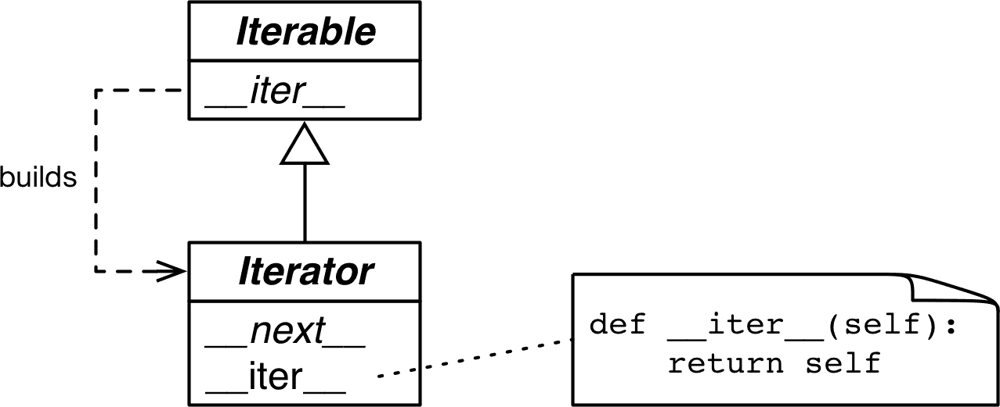

# 第十七章：迭代器、生成器和经典协程

> 当我在我的程序中看到模式时，我认为这是一个麻烦的迹象。程序的形状应该只反映它需要解决的问题。代码中的任何其他规律性对我来说都是一个迹象，至少对我来说，这表明我使用的抽象不够强大——通常是我手动生成我需要编写的某个宏的扩展。
> 
> Paul Graham，Lisp 程序员和风险投资家¹

迭代对于数据处理是基础的：程序将计算应用于数据系列，从像素到核苷酸。如果数据不适合内存，我们需要*惰性*地获取项目——一次一个，并按需获取。这就是迭代器的作用。本章展示了*迭代器*设计模式是如何内置到 Python 语言中的，因此您永远不需要手动编写它。

Python 中的每个标准集合都是*可迭代*的。*可迭代*是提供*迭代器*的对象，Python 使用它来支持诸如：

+   `for`循环

+   列表、字典和集合推导

+   解包赋值

+   集合实例的构建

本章涵盖以下主题：

+   Python 如何使用`iter()`内置函数处理可迭代对象

+   如何在 Python 中实现经典迭代器模式

+   经典迭代器模式如何被生成器函数或生成器表达式替代

+   详细介绍生成器函数的工作原理，逐行描述

+   利用标准库中的通用生成器函数

+   使用`yield from`表达式组合生成器

+   为什么生成器和经典协程看起来相似但用法却截然不同，不应混合使用

# 本章的新内容

“使用 yield from 的子生成器” 从一页发展到六页。现在它包括了演示使用`yield from`生成器行为的更简单实验，以及逐步开发树数据结构遍历的示例。

新的部分解释了`Iterable`、`Iterator`和`Generator`类型的类型提示。

本章的最后一个重要部分，“经典协程”，是对一个主题的介绍，第一版中占据了一个 40 页的章节。我更新并将[“经典协程”](https://fpy.li/oldcoro)章节移至[伴随网站的帖子](https://fpy.li/oldcoro)，因为这是读者最具挑战性的章节，但在 Python 3.5 引入原生协程后，其主题的相关性较小，我们将在第二十一章中学习。

我们将开始学习`iter()`内置函数如何使序列可迭代。

# 一系列单词

我们将通过实现一个`Sentence`类来开始探索可迭代对象：你可以将一些文本传递给它的构造函数，然后逐个单词进行迭代。第一个版本将实现序列协议，并且它是可迭代的，因为所有序列都是可迭代的——正如我们在第一章中所看到的。现在我们将看到确切的原因。

示例 17-1 展示了一个从文本中提取单词的`Sentence`类。

##### 示例 17-1。sentence.py：一个将文本按单词索引提取的`Sentence`类

```py
import re
import reprlib

RE_WORD = re.compile(r'\w+')

class Sentence:

    def __init__(self, text):
        self.text = text
        self.words = RE_WORD.findall(text)  # ①

    def __getitem__(self, index):
        return self.words[index]  # ②

    def __len__(self):  # ③
        return len(self.words)

    def __repr__(self):
        return 'Sentence(%s)' % reprlib.repr(self.text)  # ④
```

①

`.findall` 返回一个字符串列表，其中包含正则表达式的所有非重叠匹配。

②

`self.words`保存了`.findall`的结果，因此我们只需返回给定索引处的单词。

③

为了完成序列协议，我们实现了`__len__`，尽管不需要使其可迭代。

④

`reprlib.repr`是一个实用函数，用于生成数据结构的缩写字符串表示，这些数据结构可能非常庞大。²

默认情况下，`reprlib.repr`将生成的字符串限制为 30 个字符。查看示例 17-2 中的控制台会话，了解如何使用`Sentence`。

##### 示例 17-2。在`Sentence`实例上测试迭代

```py
>>> s = Sentence('"The time has come," the Walrus said,')  # ①
>>> s
Sentence('"The time ha... Walrus said,') # ②
>>> for word in s:  # ③
...     print(word)
The time has come the Walrus said >>> list(s)  # ④
['The', 'time', 'has', 'come', 'the', 'Walrus', 'said']
```

①

从字符串创建一个句子。

②

注意使用`reprlib.repr`生成的`__repr__`输出中的`...`。

③

`Sentence`实例是可迭代的；我们马上就会看到原因。

④

作为可迭代对象，`Sentence`对象可用作构建列表和其他可迭代类型的输入。

在接下来的页面中，我们将开发其他通过示例 17-2 中测试的`Sentence`类。然而，示例 17-1 中的实现与其他实现不同，因为它也是一个序列，所以你可以通过索引获取单词：

```py
>>> s[0]
'The'
>>> s[5]
'Walrus'
>>> s[-1]
'said'
```

Python 程序员知道序列是可迭代的。现在我们将看到具体原因。

# 为什么序列是可迭代的：iter 函数

每当 Python 需要对对象`x`进行迭代时，它会自动调用`iter(x)`。

`iter`内置函数：

1.  检查对象是否实现了`__iter__`，并调用它以获取迭代器。

1.  如果未实现`__iter__`，但实现了`__getitem__`，那么`iter()`会创建一个迭代器，尝试从 0（零）开始按索引获取项目。

1.  如果失败，Python 会引发`TypeError`，通常会显示`'C'对象不可迭代`，其中`C`是目标对象的类。

这就是为什么所有的 Python 序列都是可迭代的：根据定义，它们都实现了`__getitem__`。事实上，标准序列也实现了`__iter__`，你的序列也应该实现，因为通过`__getitem__`进行迭代是为了向后兼容，可能在未来会被移除——尽管在 Python 3.10 中尚未被弃用，我怀疑它会被移除。

如“Python 挖掘序列”中所述，这是一种极端的鸭子类型：一个对象被视为可迭代对象不仅当它实现了特殊方法`__iter__`，还当它实现了`__getitem__`。看一下：

```py
>>> class Spam:
...     def __getitem__(self, i):
...         print('->', i)
...         raise IndexError()
...
>>> spam_can = Spam()
>>> iter(spam_can)
<iterator object at 0x10a878f70>
>>> list(spam_can)
-> 0
[]
>>> from collections import abc
>>> isinstance(spam_can, abc.Iterable)
False
```

如果一个类提供了`__getitem__`，则`iter()`内置函数接受该类的实例作为可迭代对象，并从实例构建迭代器。Python 的迭代机制将从 0 开始调用`__getitem__`，并将`IndexError`作为没有更多项目的信号。

请注意，尽管`spam_can`是可迭代的（其`__getitem__`可以提供项目），但它不被`isinstance`识别为`abc.Iterable`。

在鹅类型方法中，可迭代对象的定义更简单但不够灵活：如果一个对象实现了`__iter__`方法，则被视为可迭代对象。不需要子类化或注册，因为`abc.Iterable`实现了`__subclasshook__`，如“使用 ABC 进行结构化类型”中所示。以下是一个演示：

```py
>>> class GooseSpam:
...     def __iter__(self):
...         pass
...
>>> from collections import abc
>>> issubclass(GooseSpam, abc.Iterable)
True
>>> goose_spam_can = GooseSpam()
>>> isinstance(goose_spam_can, abc.Iterable)
True
```

###### 提示

截至 Python 3.10，检查对象`x`是否可迭代的最准确方法是调用`iter(x)`，如果不可迭代则处理`TypeError`异常。这比使用`isinstance(x, abc.Iterable)`更准确，因为`iter(x)`还考虑了传统的`__getitem__`方法，而`Iterable` ABC 则不考虑。

明确检查对象是否可迭代可能不值得，如果在检查之后立即对对象进行迭代。毕竟，当尝试在不可迭代对象上进行迭代时，Python 引发的异常足够清晰：`TypeError: 'C' object is not iterable`。如果你可以比简单地引发`TypeError`更好，那么在`try/except`块中这样做而不是进行显式检查。显式检查可能在稍后持有对象以进行迭代时是有意义的；在这种情况下，尽早捕获错误会使调试更容易。

`iter()`内置函数更常被 Python 自身使用，而不是我们自己的代码。我们可以用第二种方式使用它，但这并不是广为人知的。

## 使用可调用对象调用 iter

我们可以使用两个参数调用`iter()`来从函数或任何可调用对象创建迭代器。在这种用法中，第一个参数必须是一个可调用对象，以便重复调用（不带参数）以产生值，第二个参数是一个[*sentinel*](https://fpy.li/17-2)：一个标记值，当可调用对象返回该值时，迭代器会引发`StopIteration`而不是产生该标记值。

以下示例展示了如何使用`iter`来掷一个六面骰子，直到掷出`1`：

```py
>>> def d6():
...     return randint(1, 6)
...
>>> d6_iter = iter(d6, 1)
>>> d6_iter
<callable_iterator object at 0x10a245270>
>>> for roll in d6_iter:
...     print(roll)
...
4
3
6
3
```

注意这里的`iter`函数返回一个`callable_iterator`。示例中的`for`循环可能运行很长时间，但永远不会显示`1`，因为那是标记值。与迭代器一样，示例中的`d6_iter`对象在耗尽后变得无用。要重新开始，我们必须通过再次调用`iter()`来重新构建迭代器。

[`iter`的文档](https://fpy.li/17-3)包括以下解释和示例代码：

> `iter()`第二种形式的一个常用应用是构建块读取器。例如，从二进制数据库文件中读取固定宽度的块，直到达到文件末尾：

```py
from functools import partial

with open('mydata.db', 'rb') as f:
    read64 = partial(f.read, 64)
    for block in iter(read64, b''):
        process_block(block)
```

为了清晰起见，我添加了`read64`赋值，这在[原始示例](https://fpy.li/17-3)中没有。`partial()`函数是必需的，因为传递给`iter()`的可调用对象不应该需要参数。在示例中，一个空的`bytes`对象是标记值，因为这就是`f.read`在没有更多字节可读时返回的值。

下一节详细介绍了可迭代对象和迭代器之间的关系。

# 可迭代对象与迭代器

从“为什么序列是可迭代的：iter 函数”中的解释，我们可以推断出一个定义：

可迭代的

任何`iter`内置函数可以获取迭代器的对象。实现返回*迭代器*的`__iter__`方法的对象是可迭代的。序列始终是可迭代的，实现接受基于 0 的索引的`__getitem__`方法的对象也是可迭代的。

重要的是要清楚可迭代对象和迭代器之间的关系：Python 从可迭代对象获取迭代器。

这里是一个简单的`for`循环，遍历一个`str`。这里的可迭代对象是`str` `'ABC'`。你看不到它，但幕后有一个迭代器：

```py
>>> s = 'ABC'
>>> for char in s:
...     print(char)
...
A
B
C
```

如果没有`for`语句，我们必须用`while`循环手动模拟`for`机制，那么我们需要写下面的代码：

```py
>>> s = 'ABC'
>>> it = iter(s)  # ①
>>> while True:
...     try:
...         print(next(it))  # ②
...     except StopIteration:  # ③
...         del it  # ④
...         break  # ⑤
...
A B C
```

①

从可迭代对象构建迭代器`it`。

②

反复调用迭代器上的`next`以获取下一个项目。

③

当没有更多项目时，迭代器会引发`StopIteration`。

④

释放对`it`的引用——迭代器对象被丢弃。

⑤

退出循环。

`StopIteration` 表示迭代器已耗尽。这个异常由`iter()`内置处理，它是`for`循环和其他迭代上下文（如列表推导、可迭代解包等）逻辑的一部分。

Python 的迭代器标准接口有两个方法：

`__next__`

返回系列中的下一个项目，如果没有更多，则引发`StopIteration`。

`__iter__`

返回`self`；这允许迭代器在期望可迭代对象的地方使用，例如在`for`循环中。

该接口在`collections.abc.Iterator` ABC 中得到规范化，它声明了`__next__`抽象方法，并且子类化`Iterable`——在那里声明了抽象的`__iter__`方法。参见图 17-1。



###### 图 17-1。`Iterable`和`Iterator` ABCs。斜体的方法是抽象的。一个具体的`Iterable.__iter__`应返回一个新的`Iterator`实例。一个具体的`Iterator`必须实现`__next__`。`Iterator.__iter__`方法只返回实例本身。

`collections.abc.Iterator`的源代码在示例 17-3 中。

##### 示例 17-3。`abc.Iterator`类；从[*Lib/_collections_abc.py*](https://fpy.li/17-5)中提取

```py
class Iterator(Iterable):

    __slots__ = ()

    @abstractmethod
    def __next__(self):
        'Return the next item from the iterator. When exhausted, raise StopIteration'
        raise StopIteration

    def __iter__(self):
        return self

    @classmethod
    def __subclasshook__(cls, C):  # ①
        if cls is Iterator:
            return _check_methods(C, '__iter__', '__next__')  # ②
        return NotImplemented
```

①

`__subclasshook__`支持使用`isinstance`和`issubclass`进行结构类型检查。我们在“使用 ABC 进行结构类型检查”中看到了它。

②

`_check_methods` 遍历类的`__mro__`以检查方法是否在其基类中实现。它在同一*Lib/_collections_abc.py*模块中定义。如果方法已实现，则`C`类将被识别为`Iterator`的虚拟子类。换句话说，`issubclass(C, Iterable)`将返回`True`。

###### 警告

`Iterator` ABC 的抽象方法在 Python 3 中是`it.__next__()`，在 Python 2 中是`it.next()`。通常情况下，应避免直接调用特殊方法。只需使用`next(it)`：这个内置函数在 Python 2 和 3 中都会执行正确的操作，这对于那些从 2 迁移到 3 的代码库很有用。

Python 3.9 中[*Lib/types.py*](https://fpy.li/17-6)模块源代码中有一条注释说：

```py
# Iterators in Python aren't a matter of type but of protocol.  A large
# and changing number of builtin types implement *some* flavor of
# iterator.  Don't check the type!  Use hasattr to check for both
# "__iter__" and "__next__" attributes instead.
```

实际上，`abc.Iterator`的`__subclasshook__`方法就是这样做的。

###### 提示

根据*Lib/types.py*中的建议和*Lib/_collections_abc.py*中实现的逻辑，检查对象`x`是否为迭代器的最佳方法是调用`isinstance(x, abc.Iterator)`。由于`Iterator.__subclasshook__`，即使`x`的类不是`Iterator`的真实或虚拟子类，此测试也有效。

回到我们的`Sentence`类，从示例 17-1 中，您可以清楚地看到迭代器是如何通过 Python 控制台由`iter()`构建并由`next()`消耗的：

```py
>>> s3 = Sentence('Life of Brian')  # ①
>>> it = iter(s3)  # ②
>>> it  # doctest: +ELLIPSIS
<iterator object at 0x...> >>> next(it)  # ③
'Life' >>> next(it)
'of' >>> next(it)
'Brian' >>> next(it)  # ④
Traceback (most recent call last):
  ...
StopIteration
>>> list(it)  # ⑤
[] >>> list(iter(s3))  # ⑥
['Life', 'of', 'Brian']
```

①

创建一个包含三个单词的句子`s3`。

②

从`s3`获取一个迭代器。

③

`next(it)` 获取下一个单词。

④

没有更多的单词了，所以迭代器会引发`StopIteration`异常。

⑤

一旦耗尽，迭代器将始终引发`StopIteration`，这使其看起来像是空的。

⑥

要再次遍历句子，必须构建一个新的迭代器。

因为迭代器所需的唯一方法是`__next__`和`__iter__`，所以没有办法检查是否还有剩余的项，除非调用`next()`并捕获`StopIteration`。此外，无法“重置”迭代器。如果需要重新开始，必须在第一次构建迭代器的可迭代对象上调用`iter()`。在迭代器本身上调用`iter()`也不会有帮助，因为正如前面提到的，`Iterator.__iter__`是通过返回`self`来实现的，因此这不会重置已耗尽的迭代器。

这种最小接口是合理的，因为实际上，并非所有迭代器都可以重置。例如，如果一个迭代器正在从网络中读取数据包，就无法倒带。³

来自 Example 17-1 的第一个`Sentence`版本之所以可迭代，是因为`iter()`内置函数对序列的特殊处理。接下来，我们将实现`Sentence`的变体，这些变体实现了`__iter__`以返回迭代器。

# 带有`__iter__`的句子类

下一个`Sentence`的变体实现了标准的可迭代协议，首先通过实现迭代器设计模式，然后使用生成器函数。

## 句子接收 #2: 经典迭代器

下一个`Sentence`实现遵循*设计模式*书中经典迭代器设计模式的蓝图。请注意，这不是 Python 的惯用写法，因为接下来的重构将非常清楚地表明。但是，展示可迭代集合和与之一起使用的迭代器之间的区别是有用的。

Example 17-4 中的`Sentence`类是可迭代的，因为它实现了`__iter__`特殊方法，该方法构建并返回一个`SentenceIterator`。这就是可迭代对象和迭代器之间的关系。

##### 示例 17-4\. sentence_iter.py: 使用迭代器模式实现的`Sentence`

```py
import re
import reprlib

RE_WORD = re.compile(r'\w+')

class Sentence:

    def __init__(self, text):
        self.text = text
        self.words = RE_WORD.findall(text)

    def __repr__(self):
        return f'Sentence({reprlib.repr(self.text)})'

    def __iter__(self):  # ①
        return SentenceIterator(self.words)  # ②

class SentenceIterator:

    def __init__(self, words):
        self.words = words  # ③
        self.index = 0  # ④

    def __next__(self):
        try:
            word = self.words[self.index]  # ⑤
        except IndexError:
            raise StopIteration()  # ⑥
        self.index += 1  # ⑦
        return word  # ⑧

    def __iter__(self):  # ⑨
        return self
```

①

`__iter__`方法是对先前`Sentence`实现的唯一补充。这个版本没有`__getitem__`，以明确表明该类之所以可迭代是因为它实现了`__iter__`。

②

`__iter__` 通过实例化并返回一个迭代器来实现可迭代协议。

③

`SentenceIterator` 持有对单词列表的引用。

④

`self.index` 确定下一个要获取的单词。

⑤

获取`self.index`处的单词。

⑥

如果在`self.index`处没有单词，则引发`StopIteration`。

⑦

增加 `self.index`。

⑧

返回单词。

⑨

实现 `self.__iter__`。

Example 17-4 中的代码通过 Example 17-2 中的测试。

注意，在这个示例中，实际上并不需要在`SentenceIterator`中实现`__iter__`，但这样做是正确的：迭代器应该同时实现`__next__`和`__iter__`，这样做可以使我们的迭代器通过`issubclass(SentenceIterator, abc.Iterator)`测试。如果我们从`abc.Iterator`继承`SentenceIterator`，我们将继承具体的`abc.Iterator.__iter__`方法。

这是一项繁重的工作（对于我们这些被宠坏的 Python 程序员来说）。请注意，`SentenceIterator` 中的大部分代码都涉及管理迭代器的内部状态。很快我们将看到如何避免这种繁琐的工作。但首先，让我们简要地讨论一下可能会诱人但却是错误的实现快捷方式。

## 不要将可迭代对象作为自身的迭代器。

在构建可迭代对象和迭代器时常见的错误是混淆两者。明确一点：可迭代对象具有一个 `__iter__` 方法，每次实例化一个新的迭代器。迭代器实现了一个返回单个项的 `__next__` 方法，以及一个返回 `self` 的 `__iter__` 方法。

因此，迭代器也是可迭代的，但可迭代的对象不是迭代器。

可能会诱人在 `Sentence` 类中实现 `__next__` 以及 `__iter__`，使每个 `Sentence` 实例同时成为自身的可迭代器和迭代器。但这很少是一个好主意。根据在 Google 审查 Python 代码方面拥有丰富经验的 Alex Martelli 的说法，这也是一个常见的反模式。

*设计模式* 书中关于迭代器设计模式的“适用性”部分说：

> 使用迭代器模式
> 
> +   访问聚合对象的内容而不暴露其内部表示。
> +   
> +   以支持聚合对象的多次遍历。
> +   
> +   为不同的聚合结构提供统一的遍历接口（即支持多态迭代）。

要“支持多次遍历”，必须能够从同一个可迭代实例中获取多个独立的迭代器，并且每个迭代器必须保持自己的内部状态，因此模式的正确实现要求每次调用 `iter(my_iterable)` 都会创建一个新的独立迭代器。这就是为什么在这个例子中我们需要 `SentenceIterator` 类。

现在经典的迭代器模式已经得到了正确的演示，我们可以放手了。Python 从 Barbara Liskov 的 [CLU 语言](https://fpy.li/17-7) 中引入了 `yield` 关键字，因此我们不需要手动“生成”代码来实现迭代器。

接下来的章节将呈现更符合 Python 习惯的 `Sentence` 版本。

## Sentence Take #3：生成器函数

同样功能的 Python 实现使用了生成器，避免了实现 `SentenceIterator` 类的所有工作。生成器的正确解释就在 Example 17-5 之后。

##### Example 17-5\. sentence_gen.py：使用生成器实现的 `Sentence`

```py
import re
import reprlib

RE_WORD = re.compile(r'\w+')

class Sentence:

    def __init__(self, text):
        self.text = text
        self.words = RE_WORD.findall(text)

    def __repr__(self):
        return 'Sentence(%s)' % reprlib.repr(self.text)

    def __iter__(self):
        for word in self.words:  # ①
            yield word  # ②
        # ③

# done! # ④
```

①

遍历 `self.words`。

②

产出当前的 `word`。

③

明确的 `return` 不是必需的；函数可以“顺利执行”并自动返回。无论哪种方式，生成器函数不会引发 `StopIteration`：当完成生成值时，它只是退出。

④

不需要单独的迭代器类！

这里我们再次看到了一个不同的 `Sentence` 实现，通过了 Example 17-2 中的测试。

回到 Example 17-4 中的 `Sentence` 代码，`__iter__` 调用了 `SentenceIterator` 构造函数来构建一个迭代器并返回它。现在 Example 17-5 中的迭代器实际上是一个生成器对象，在调用 `__iter__` 方法时会自动构建，因为这里的 `__iter__` 是一个生成器函数。

紧随其后是对生成器的全面解释。

## 生成器的工作原理

任何在其主体中具有 `yield` 关键字的 Python 函数都是一个生成器函数：一个在调用时返回生成器对象的函数。换句话说，生成器函数是一个生成器工厂。

###### 提示

区分普通函数和生成器函数的唯一语法是后者的函数体中有一个`yield`关键字。有人认为应该使用新关键字`gen`来声明生成器函数，而不是`def`，但 Guido 不同意。他的论点在[PEP 255 — Simple Generators](https://fpy.li/pep255)中。⁵

示例 17-6 展示了一个简单生成器函数的行为。⁶

##### 示例 17-6\. 一个生成三个数字的生成器函数

```py
>>> def gen_123():
...     yield 1  # ①
...     yield 2
...     yield 3
...
>>> gen_123  # doctest: +ELLIPSIS
<function gen_123 at 0x...>  # ②
>>> gen_123()   # doctest: +ELLIPSIS
<generator object gen_123 at 0x...>  # ③
>>> for i in gen_123():  # ④
...     print(i)
1
2
3
>>> g = gen_123()  # ⑤
>>> next(g)  # ⑥
1
>>> next(g)
2
>>> next(g)
3
>>> next(g)  # ⑦
Traceback (most recent call last):
  ...
StopIteration
```

①

生成器函数的函数体通常在循环中有`yield`，但不一定；这里我只是重复了三次`yield`。

②

仔细观察，我们可以看到`gen_123`是一个函数对象。

③

但是当调用`gen_123()`时，会返回一个生成器对象。

④

生成器对象实现了`Iterator`接口，因此它们也是可迭代的。

⑤

我们将这个新的生成器对象赋给`g`，这样我们就可以对其进行实验。

⑥

因为`g`是一个迭代器，调用`next(g)`会获取`yield`产生的下一个项目。

⑦

当生成器函数返回时，生成器对象会引发`StopIteration`。

生成器函数构建一个包装函数体的生成器对象。当我们在生成器对象上调用`next()`时，执行会前进到函数体中的下一个`yield`，而`next()`调用会评估在函数体暂停时产生的值。最后，由 Python 创建的封闭生成器对象在函数体返回时引发`StopIteration`，符合`Iterator`协议。

###### 提示

我发现在谈论从生成器获得的值时严谨是有帮助的。说生成器“返回”值是令人困惑的。函数返回值。调用生成器函数返回一个生成器。生成器产生值。生成器不以通常的方式“返回”值：生成器函数体中的`return`语句会导致生成器对象引发`StopIteration`。如果在生成器中`return x`，调用者可以从`StopIteration`异常中检索到`x`的值，但通常使用`yield from`语法会自动完成，我们将在“从协程返回值”中看到。

示例 17-7 使`for`循环和函数体之间的交互更加明确。

##### 示例 17-7\. 一个在运行时打印消息的生成器函数

```py
>>> def gen_AB():
...     print('start')
...     yield 'A'          # ①
...     print('continue')
...     yield 'B'          # ②
...     print('end.')      # ③
...
>>> for c in gen_AB():     # ④
...     print('-->', c)    # ⑤
...
start # ⑥
--> A # ⑦
continue # ⑧
--> B # ⑨
end. # ⑩
>>>       ⑪
```

①

在`for`循环中对④的第一次隐式调用`next()`将打印`'start'`并在第一个`yield`处停止，产生值`'A'`。

②

`for`循环中第二次隐式调用`next()`将打印`'continue'`并在第二个`yield`处停止，产生值`'B'`。

③

第三次调用`next()`将打印`'end.'`并穿过函数体的末尾，导致生成器对象引发`StopIteration`。

④

为了迭代，`for`机制执行等效于`g = iter(gen_AB())`以获取一个生成器对象，然后在每次迭代时执行`next(g)`。

⑤

循环打印`-->`和`next(g)`返回的值。这个输出只会在生成器函数内部的`print`调用输出之后出现。

⑥

文本`start`来自生成器体中的`print('start')`。

⑦

生成器体中的`yield 'A'`产生值*A*，被`for`循环消耗，赋给变量`c`，导致输出`--> A`。

⑧

迭代继续，第二次调用`next(g)`，将生成器体从`yield 'A'`推进到`yield 'B'`。第二个`print`在生成器体中输出`continue`。

⑨

`yield 'B'`产生值*B*，被`for`循环消耗，赋给循环变量`c`，因此循环打印`--> B`。

⑩

迭代继续，第三次调用`next(it)`，推进到函数体的末尾。由于生成器体中的第三个`print`，输出中出现了`end.`。

⑪

当生成器函数运行到末尾时，生成器对象会引发`StopIteration`异常。`for`循环机制捕获该异常，循环干净地终止。

现在希望清楚了示例 17-5 中的`Sentence.__iter__`是如何工作的：`__iter__`是一个生成器函数，当调用时，会构建一个实现`Iterator`接口的生成器对象，因此不再需要`SentenceIterator`类。

第二个`Sentence`版本比第一个更简洁，但不像它可以那样懒惰。如今，懒惰被认为是一个好特性，至少在编程语言和 API 中是这样。懒惰的实现将产生值推迟到最后可能的时刻。这样可以节省内存，也可能避免浪费 CPU 周期。

我们将构建懒惰的`Sentence`类。

# 懒惰的句子

`Sentence`的最终变体是懒惰的，利用了`re`模块中的懒惰函数。

## 句子第四次尝试：懒惰生成器

`Iterator`接口被设计为懒惰的：`next(my_iterator)`每次产生一个项目。懒惰的相反是急切：懒惰评估和急切评估是编程语言理论中的技术术语。

到目前为止，我们的`Sentence`实现并不懒惰，因为`__init__`急切地构建了文本中所有单词的列表，并将其绑定到`self.words`属性。这需要处理整个文本，而且列表可能使用的内存和文本本身一样多（可能更多；这取决于文本中有多少非单词字符）。如果用户只迭代前几个单词，大部分工作将是徒劳的。如果你想知道，“在 Python 中有没有一种懒惰的方法？”答案通常是“是的”。

`re.finditer`函数是`re.findall`的惰性版本。`re.finditer`返回一个生成器，按需产生`re.MatchObject`实例，而不是一个列表。如果有很多匹配，`re.finditer`可以节省大量内存。使用它，我们的第三个`Sentence`版本现在是惰性的：只有在需要时才从文本中读取下一个单词。代码在示例 17-8 中。

##### 示例 17-8\. sentence_gen2.py: 使用调用`re.finditer`生成器函数实现的`Sentence`

```py
import re
import reprlib

RE_WORD = re.compile(r'\w+')

class Sentence:

    def __init__(self, text):
        self.text = text  # ①

    def __repr__(self):
        return f'Sentence({reprlib.repr(self.text)})'

    def __iter__(self):
        for match in RE_WORD.finditer(self.text):  # ②
            yield match.group()  # ③
```

①

不需要有一个`words`列表。

②

`finditer`在`self.text`上的`RE_WORD`匹配中构建一个迭代器，产生`MatchObject`实例。

③

`match.group()`从`MatchObject`实例中提取匹配的文本。

生成器是一个很好的快捷方式，但可以用生成器表达式进一步简化代码。

## 第五种句子：惰性生成器表达式

我们可以用生成器表达式替换前一个`Sentence`类中的简单生成器函数（示例 17-8）。就像列表推导式构建列表一样，生成器表达式构建生成器对象。示例 17-9 对比了它们的行为。

##### 示例 17-9\. `gen_AB`生成器函数被列表推导式使用，然后被生成器表达式使用

```py
>>> def gen_AB():  # ①
...     print('start')
...     yield 'A'
...     print('continue')
...     yield 'B'
...     print('end.')
...
>>> res1 = [x*3 for x in gen_AB()]  # ②
start continue end. >>> for i in res1:  # ③
...     print('-->', i)
...
--> AAA --> BBB >>> res2 = (x*3 for x in gen_AB())  # ④
>>> res2
<generator object <genexpr> at 0x10063c240> >>> for i in res2:  # ⑤
...     print('-->', i)
...
start # ⑥
--> AAA continue --> BBB end.
```

①

这是与示例 17-7 中相同的`gen_AB`函数。

②

列表推导式急切地迭代由`gen_AB()`返回的生成器对象产生的项目：`'A'`和`'B'`。注意下面行中的输出：`start`，`continue`，`end.`

③

这个`for`循环迭代由列表推导式构建的`res1`列表。

④

生成器表达式返回`res2`，一个生成器对象。这里生成器没有被消耗。

⑤

只有当`for`循环迭代`res2`时，这个生成器才从`gen_AB`获取项目。`for`循环的每次迭代隐式调用`next(res2)`，进而调用`gen_AB()`返回的生成器对象上的`next()`，将其推进到下一个`yield`。

⑥

注意`gen_AB()`的输出如何与`for`循环中的`print`输出交错。

我们可以使用生成器表达式进一步减少`Sentence`类中的代码量。参见示例 17-10。

##### 示例 17-10\. sentence_genexp.py: 使用生成器表达式实现的`Sentence`

```py
import re
import reprlib

RE_WORD = re.compile(r'\w+')

class Sentence:

    def __init__(self, text):
        self.text = text

    def __repr__(self):
        return f'Sentence({reprlib.repr(self.text)})'

    def __iter__(self):
        return (match.group() for match in RE_WORD.finditer(self.text))
```

与示例 17-8 唯一的区别是`__iter__`方法，在这里不是一个生成器函数（没有`yield`），而是使用生成器表达式构建一个生成器，然后返回它。最终结果是一样的：`__iter__`的调用者得到一个生成器对象。

生成器表达式是一种语法糖：它们总是可以被生成器函数替代，但有时更加方便。下一节将介绍生成器表达式的用法。

# 何时使用生成器表达式

在实现示例 12-16 中的`Vector`类时，我使用了几个生成器表达式。这些方法中的每一个都有一个生成器表达式：`__eq__`、`__hash__`、`__abs__`、`angle`、`angles`、`format`、`__add__`和`__mul__`。在所有这些方法中，列表推导也可以工作，但会使用更多内存来存储中间列表值。

在示例 17-10 中，我们看到生成器表达式是一种创建生成器的语法快捷方式，而无需定义和调用函数。另一方面，生成器函数更加灵活：我们可以使用多个语句编写复杂逻辑，甚至可以将它们用作*协程*，正如我们将在“经典协程”中看到的那样。

对于更简单的情况，一目了然的生成器表达式更易于阅读，就像`Vector`示例所示。

我在选择要使用的语法时的经验法则很简单：如果生成器表达式跨越多行，我更倾向于出于可读性考虑编写生成器函数。

# 语法提示

当将生成器表达式作为函数或构造函数的单个参数传递时，您无需为函数调用编写一组括号，然后再为生成器表达式加上另一组括号。只需一对即可，就像在示例 12-16 中`Vector`调用`__mul__`方法时一样，如下所示：

```py
def __mul__(self, scalar):
    if isinstance(scalar, numbers.Real):
        return Vector(n * scalar for n in self)
    else:
        return NotImplemented
```

但是，如果在生成器表达式之后还有更多的函数参数，您需要将其括在括号中，以避免`SyntaxError`。

我们看到的`Sentence`示例演示了生成器扮演经典迭代器模式的角色：从集合中检索项。但是，我们也可以使用生成器产生独立于数据源的值。下一节将展示一个示例。

但首先，让我们简要讨论*迭代器*和*生成器*之间重叠概念。

# 算术级数生成器

经典的迭代器模式完全关乎遍历：导航某些数据结构。但是，基于一种方法来获取系列中的下一个项的标准接口在项是实时生成的情况下也很有用，而不是从集合中检索。例如，`range`内置函数生成整数的有界算术级数（AP）。如果您需要生成任何类型的数字的算术级数，而不仅仅是整数，该怎么办？

示例 17-11 展示了我们马上将看到的`ArithmeticProgression`类的一些控制台测试。示例 17-11 中构造函数的签名是`ArithmeticProgression(begin, step[, end])`。`range`内置函数的完整签名是`range(start, stop[, step])`。我选择实现不同的签名，因为在算术级数中`step`是必需的，但`end`是可选的。我还将参数名称从`start/stop`更改为`begin/end`，以明确表明我选择了不同的签名。在示例 17-11 的每个测试中，我对结果调用`list()`以检查生成的值。

##### 示例 17-11。`ArithmeticProgression`类演示

```py
    >>> ap = ArithmeticProgression(0, 1, 3)
    >>> list(ap)
    [0, 1, 2]
    >>> ap = ArithmeticProgression(1, .5, 3)
    >>> list(ap)
    [1.0, 1.5, 2.0, 2.5]
    >>> ap = ArithmeticProgression(0, 1/3, 1)
    >>> list(ap)
    [0.0, 0.3333333333333333, 0.6666666666666666]
    >>> from fractions import Fraction
    >>> ap = ArithmeticProgression(0, Fraction(1, 3), 1)
    >>> list(ap)
    [Fraction(0, 1), Fraction(1, 3), Fraction(2, 3)]
    >>> from decimal import Decimal
    >>> ap = ArithmeticProgression(0, Decimal('.1'), .3)
    >>> list(ap)
    [Decimal('0'), Decimal('0.1'), Decimal('0.2')]
```

请注意，生成的算术级数中的数字类型遵循 Python 算术的数字强制转换规则，即`begin + step`的类型。在示例 17-11 中，您会看到`int`、`float`、`Fraction`和`Decimal`数字的列表。示例 17-12 列出了`ArithmeticProgression`类的实现。

##### 示例 17-12。`ArithmeticProgression`类

```py
class ArithmeticProgression:

    def __init__(self, begin, step, end=None):       # ①
        self.begin = begin
        self.step = step
        self.end = end  # None -> "infinite" series

    def __iter__(self):
        result_type = type(self.begin + self.step)   # ②
        result = result_type(self.begin)             # ③
        forever = self.end is None                   # ④
        index = 0
        while forever or result < self.end:          # ⑤
            yield result                             # ⑥
            index += 1
            result = self.begin + self.step * index  # ⑦
```

①

`__init__`需要两个参数：`begin`和`step`；如果`end`是`None`，则序列将是无界的。

②

获取`self.begin`和`self.step`的添加类型。例如，如果一个是`int`，另一个是`float`，`result_type`将是`float`。

③

这一行创建了一个`result`，其数值与`self.begin`相同，但被强制转换为后续加法的类型。⁷

④

为了可读性，如果`self.end`属性为`None`，`forever`标志将为`True`，导致一个无界系列。

⑤

这个循环运行`forever`，或直到结果匹配或超过`self.end`。当这个循环退出时，函数也会退出。

⑥

当前的`result`被生成。

⑦

下一个潜在的结果被计算。它可能永远不会被产生，因为`while`循环可能终止。

在示例 17-12 的最后一行，我选择忽略每次循环中将`self.step`添加到前一个`result`中，而是选择忽略前一个`result`，并通过将`self.begin`添加到`self.step`乘以`index`来添加每个新的`result`。这避免了连续添加后浮点错误的累积效应。这些简单的实验使差异变得明显：

```py
>>> 100 * 1.1
110.00000000000001
>>> sum(1.1 for _ in range(100))
109.99999999999982
>>> 1000 * 1.1
1100.0
>>> sum(1.1 for _ in range(1000))
1100.0000000000086
```

来自示例 17-12 的`ArithmeticProgression`类按预期工作，并且是使用生成器函数实现`__iter__`特殊方法的另一个示例。然而，如果一个类的整个目的是通过实现`__iter__`来构建一个生成器，我们可以用生成器函数替换类。毕竟，生成器函数本质上是一个生成器工厂。

示例 17-13 展示了一个名为`aritprog_gen`的生成器函数，它与`ArithmeticProgression`执行相同的工作，但代码更少。如果只调用`aritprog_gen`而不是`ArithmeticProgression`，则示例 17-11 中的所有测试都会通过。⁸

##### 示例 17-13\. `aritprog_gen`生成器函数

```py
def aritprog_gen(begin, step, end=None):
    result = type(begin + step)(begin)
    forever = end is None
    index = 0
    while forever or result < end:
        yield result
        index += 1
        result = begin + step * index
```

示例 17-13 非常优雅，但请记住：标准库中有大量现成的生成器可供使用，下一节将展示使用`itertools`模块的更短实现。

## 使用`itertools`的算术进度

Python 3.10 中的`itertools`模块有 20 个生成器函数，可以以各种有趣的方式组合。

例如，`itertools.count` 函数返回一个生成器，产生数字。没有参数时，它产生以`0`开头的一系列整数。但是你可以提供可选的`start`和`step`值来实现类似于我们的`aritprog_gen`函数的结果：

```py
>>> import itertools
>>> gen = itertools.count(1, .5)
>>> next(gen)
1
>>> next(gen)
1.5
>>> next(gen)
2.0
>>> next(gen)
2.5
```

###### 警告

`itertools.count`永远不会停止，因此如果调用`list(count())`，Python 将尝试构建一个填满所有已制造的内存芯片的`list`。实际上，在调用失败之前，您的机器会变得非常不高兴。

另一方面，有`itertools.takewhile`函数：它返回一个消耗另一个生成器并在给定谓词评估为`False`时停止的生成器。因此，我们可以将两者结合起来写成这样：

```py
>>> gen = itertools.takewhile(lambda n: n < 3, itertools.count(1, .5))
>>> list(gen)
[1, 1.5, 2.0, 2.5]
```

利用`takehwhile`和`count`，示例 17-14 更加简洁。

##### 示例 17-14\. aritprog_v3.py：这与之前的`aritprog_gen`函数相同

```py
import itertools

def aritprog_gen(begin, step, end=None):
    first = type(begin + step)(begin)
    ap_gen = itertools.count(first, step)
    if end is None:
        return ap_gen
    return itertools.takewhile(lambda n: n < end, ap_gen)
```

请注意，示例 17-14 中的`aritprog_gen`不是一个生成器函数：它的主体中没有`yield`。但它返回一个生成器，就像生成器函数一样。

但是，请记住，`itertools.count`会重复添加`step`，因此它生成的浮点数序列不像示例 17-13 那样精确。

示例 17-14 的要点是：在实现生成器时，要了解标准库中提供了什么，否则很可能会重复造轮子。这就是为什么下一节涵盖了几个可直接使用的生成器函数。

# 标准库中的生成器函数

标准库提供了许多生成器，从提供逐行迭代的纯文本文件对象，到令人惊叹的[`os.walk`](https://fpy.li/17-12)函数，该函数在遍历目录树时产生文件名，使递归文件系统搜索就像一个`for`循环一样简单。

`os.walk`生成器函数令人印象深刻，但在本节中，我想专注于以任意可迭代对象作为参数并返回生成器的通用函数，这些生成器产生选定的、计算的或重新排列的项目。在下面的表格中，我总结了两打这样的函数，来自内置的`itertools`和`functools`模块。为方便起见，我根据高级功能对它们进行了分组，而不管它们在哪里定义。

第一组包含过滤生成器函数：它们产生输入可迭代对象生成的项目子集，而不改变项目本身。像`takewhile`一样，表 17-1 中列出的大多数函数都接受一个`predicate`，这是一个一参数布尔函数，将应用于输入中的每个项目，以确定是否将项目包含在输出中。

表 17-1\. 过滤生成器函数

| 模块 | 函数 | 描述 |
| --- | --- | --- |
| `itertools` | `compress(it, selector_it)` | 并行消耗两个可迭代对象；每当`selector_it`中对应的项目为真时，从`it`中产生项目 |
| `itertools` | `dropwhile(predicate, it)` | 消耗`it`，跳过`predicate`计算为真时的项目，然后产生所有剩余项目（不再进行进一步检查） |
| (内置) | `filter(predicate, it)` | 对`iterable`的每个项目应用`predicate`，如果`predicate(item)`为真，则产生该项目；如果`predicate`为`None`，则只产生真值项目 |
| `itertools` | `filterfalse(predicate, it)` | 与`filter`相同，但`predicate`逻辑取反：每当`predicate`计算为假时产生项目 |
| `itertools` | `islice(it, stop) or islice(it, start, stop, step=1)` | 从`it`的切片中产生项目，类似于`s[:stop]`或`s[start:stop:step]`，除了`it`可以是任何可迭代对象，且操作是惰性的 |
| `itertools` | `takewhile(predicate, it)` | 当`predicate`计算为真时产生项目，然后停止，不再进行进一步检查 |

示例 17-15 中的控制台列表显示了表 17-1 中所有函数的使用。

##### 示例 17-15\. 过滤生成器函数示例

```py
>>> def vowel(c):
...     return c.lower() in 'aeiou'
...
>>> list(filter(vowel, 'Aardvark'))
['A', 'a', 'a']
>>> import itertools
>>> list(itertools.filterfalse(vowel, 'Aardvark'))
['r', 'd', 'v', 'r', 'k']
>>> list(itertools.dropwhile(vowel, 'Aardvark'))
['r', 'd', 'v', 'a', 'r', 'k']
>>> list(itertools.takewhile(vowel, 'Aardvark'))
['A', 'a']
>>> list(itertools.compress('Aardvark', (1, 0, 1, 1, 0, 1)))
['A', 'r', 'd', 'a']
>>> list(itertools.islice('Aardvark', 4))
['A', 'a', 'r', 'd']
>>> list(itertools.islice('Aardvark', 4, 7))
['v', 'a', 'r']
>>> list(itertools.islice('Aardvark', 1, 7, 2))
['a', 'd', 'a']
```

下一组包含映射生成器：它们产生从输入可迭代对象的每个单独项目计算得到的项目，或者在`map`和`starmap`的情况下，产生自输入可迭代对象的项目。表 17-2 中的生成器每个输入可迭代对象产生一个结果。如果输入来自多个可迭代对象，则一旦第一个输入可迭代对象耗尽，输出就会停止。

表 17-2\. 映射生成器函数

| 模块 | 函数 | 描述 |
| --- | --- | --- |
| `itertools` | `accumulate(it, [func])` | 产生累积和；如果提供了`func`，则产生将其应用于第一对项目的结果，然后应用于第一个结果和下一个项目等的结果 |
| (内置) | `enumerate(iterable, start=0)` | 产生形式为`(index, item)`的 2 元组，其中`index`从`start`计数，`item`取自`iterable` |
| (内置) | `map(func, it1, [it2, …, itN])` | 将`func`应用于`it`的每个项目，产生结果；如果给出了 N 个可迭代对象，则`func`必须接受 N 个参数，并且可迭代对象将并行消耗 |
| `itertools` | `starmap(func, it)` | 将`func`应用于`it`的每个项目，产生结果；输入可迭代对象应产生可迭代对象`iit`，并且`func`被应用为`func(*iit)` |

Example 17-16 演示了`itertools.accumulate`的一些用法。

##### 示例 17-16。`itertools.accumulate`生成器函数示例

```py
>>> sample = [5, 4, 2, 8, 7, 6, 3, 0, 9, 1]
>>> import itertools
>>> list(itertools.accumulate(sample))  # ①
[5, 9, 11, 19, 26, 32, 35, 35, 44, 45] >>> list(itertools.accumulate(sample, min))  # ②
[5, 4, 2, 2, 2, 2, 2, 0, 0, 0] >>> list(itertools.accumulate(sample, max))  # ③
[5, 5, 5, 8, 8, 8, 8, 8, 9, 9] >>> import operator
>>> list(itertools.accumulate(sample, operator.mul))  # ④
[5, 20, 40, 320, 2240, 13440, 40320, 0, 0, 0] >>> list(itertools.accumulate(range(1, 11), operator.mul))
[1, 2, 6, 24, 120, 720, 5040, 40320, 362880, 3628800] # ⑤
```

①

运行总和。

②

运行最小值。

③

运行最大值。

④

运行乘积。

⑤

从`1!`到`10!`的阶乘。

Table 17-2 的其余函数显示在 Example 17-17 中。

##### 示例 17-17。映射生成器函数示例

```py
>>> list(enumerate('albatroz', 1))  # ①
[(1, 'a'), (2, 'l'), (3, 'b'), (4, 'a'), (5, 't'), (6, 'r'), (7, 'o'), (8, 'z')] >>> import operator
>>> list(map(operator.mul, range(11), range(11)))  # ②
[0, 1, 4, 9, 16, 25, 36, 49, 64, 81, 100] >>> list(map(operator.mul, range(11), [2, 4, 8]))  # ③
[0, 4, 16] >>> list(map(lambda a, b: (a, b), range(11), [2, 4, 8]))  # ④
[(0, 2), (1, 4), (2, 8)] >>> import itertools
>>> list(itertools.starmap(operator.mul, enumerate('albatroz', 1)))  # ⑤
['a', 'll', 'bbb', 'aaaa', 'ttttt', 'rrrrrr', 'ooooooo', 'zzzzzzzz'] >>> sample = [5, 4, 2, 8, 7, 6, 3, 0, 9, 1]
>>> list(itertools.starmap(lambda a, b: b / a,
...     enumerate(itertools.accumulate(sample), 1)))  # ⑥
[5.0, 4.5, 3.6666666666666665, 4.75, 5.2, 5.333333333333333, 5.0, 4.375, 4.888888888888889, 4.5]
```

①

从`1`开始对单词中的字母编号。

②

从`0`到`10`的整数的平方。

③

并行从两个可迭代对象中相乘的数字：当最短的可迭对象结束时，结果停止。

④

这就是`zip`内置函数的作用。

⑤

根据单词中的位置重复每个字母，从`1`开始。

⑥

运行平均值。

接下来，我们有合并生成器组 - 所有这些都从多个输入可迭代对象中产生项目。`chain`和`chain.from_iterable`按顺序消耗输入可迭代对象（一个接一个地），而`product`、`zip`和`zip_longest`并行消耗输入可迭代对象。参见 Table 17-3。

Table 17-3。合并多个输入可迭代对象的生成器函数

| 模块 | 函数 | 描述 |
| --- | --- | --- |
| `itertools` | `chain(it1, …, itN)` | 从`it1`，然后从`it2`等无缝地产生所有项目 |
| `itertools` | `chain.from_iterable(it)` | 从`it`生成的每个可迭代对象中产生所有项目，一个接一个地无缝地；`it`将是一个可迭代对象，其中项目也是可迭代对象，例如，元组列表 |
| `itertools` | `product(it1, …, itN, repeat=1)` | 笛卡尔积：通过组合来自每个输入可迭代对象的项目生成 N 元组，就像嵌套的`for`循环可以产生的那样；`repeat`允许多次消耗输入可迭代对象 |
| (内置) | `zip(it1, …, itN, strict=False)` | 从并行获取的每个项目构建 N 元组，默默地在第一个可迭代对象耗尽时停止，除非给出`strict=True`^(a) |
| `itertools` | `zip_longest(it1, …, itN, fillvalue=None)` | 从并行获取的每个项目构建 N 元组，仅在最后一个可迭代对象耗尽时停止，用`fillvalue`填充空白 |
| ^(a) `strict`关键字参数是 Python 3.10 中的新参数。当`strict=True`时，如果任何可迭代对象的长度不同，则会引发`ValueError`。默认值为`False`，以确保向后兼容性。 |

示例 17-18 展示了`itertools.chain`和`zip`生成器函数及其相关函数的使用。请记住，`zip`函数是以拉链拉链（与压缩无关）命名的。`zip`和`itertools.zip_longest`都是在“神奇的 zip”中引入的。

##### 示例 17-18\. 合并生成器函数示例

```py
>>> list(itertools.chain('ABC', range(2)))  # ①
['A', 'B', 'C', 0, 1] >>> list(itertools.chain(enumerate('ABC')))  # ②
[(0, 'A'), (1, 'B'), (2, 'C')] >>> list(itertools.chain.from_iterable(enumerate('ABC')))  # ③
[0, 'A', 1, 'B', 2, 'C'] >>> list(zip('ABC', range(5), [10, 20, 30, 40]))  # ④
[('A', 0, 10), ('B', 1, 20), ('C', 2, 30)] >>> list(itertools.zip_longest('ABC', range(5)))  # ⑤
[('A', 0), ('B', 1), ('C', 2), (None, 3), (None, 4)] >>> list(itertools.zip_longest('ABC', range(5), fillvalue='?'))  # ⑥
[('A', 0), ('B', 1), ('C', 2), ('?', 3), ('?', 4)]
```

①

通常使用两个或更多可迭代对象调用`chain`。

②

当使用单个可迭代对象调用`chain`时，它不会产生任何有用的效果。

③

但是`chain.from_iterable`从可迭代对象中获取每个项目，并按顺序链接它们，只要每个项目本身是可迭代的。

④

`zip`可以并行消耗任意数量的可迭代对象，但是生成器总是在第一个可迭代对象结束时停止。在 Python ≥ 3.10 中，如果给定`strict=True`参数并且一个可迭代对象在其他可迭代对象之前结束，则会引发`ValueError`。

⑤

`itertools.zip_longest`的工作原理类似于`zip`，只是它会消耗所有输入的可迭代对象，根据需要用`None`填充输出元组。

⑥

`fillvalue`关键字参数指定自定义填充值。

`itertools.product`生成器是计算笛卡尔积的一种懒惰方式，我们在“笛卡尔积”中使用了多个`for`子句的列表推导式构建。具有多个`for`子句的生成器表达式也可以用于懒惰地生成笛卡尔积。示例 17-19 演示了`itertools.product`。

##### 示例 17-19\. `itertools.product`生成器函数示例

```py
>>> list(itertools.product('ABC', range(2)))  # ①
[('A', 0), ('A', 1), ('B', 0), ('B', 1), ('C', 0), ('C', 1)] >>> suits = 'spades hearts diamonds clubs'.split()
>>> list(itertools.product('AK', suits))  # ②
[('A', 'spades'), ('A', 'hearts'), ('A', 'diamonds'), ('A', 'clubs'), ('K', 'spades'), ('K', 'hearts'), ('K', 'diamonds'), ('K', 'clubs')] >>> list(itertools.product('ABC'))  # ③
[('A',), ('B',), ('C',)] >>> list(itertools.product('ABC', repeat=2))  # ④
[('A', 'A'), ('A', 'B'), ('A', 'C'), ('B', 'A'), ('B', 'B'), ('B', 'C'), ('C', 'A'), ('C', 'B'), ('C', 'C')] >>> list(itertools.product(range(2), repeat=3))
[(0, 0, 0), (0, 0, 1), (0, 1, 0), (0, 1, 1), (1, 0, 0), (1, 0, 1), (1, 1, 0), (1, 1, 1)] >>> rows = itertools.product('AB', range(2), repeat=2)
>>> for row in rows: print(row)
...
('A', 0, 'A', 0) ('A', 0, 'A', 1) ('A', 0, 'B', 0) ('A', 0, 'B', 1) ('A', 1, 'A', 0) ('A', 1, 'A', 1) ('A', 1, 'B', 0) ('A', 1, 'B', 1) ('B', 0, 'A', 0) ('B', 0, 'A', 1) ('B', 0, 'B', 0) ('B', 0, 'B', 1) ('B', 1, 'A', 0) ('B', 1, 'A', 1) ('B', 1, 'B', 0) ('B', 1, 'B', 1)
```

①

一个具有三个字符的`str`和一个具有两个整数的`range`的笛卡尔积产生六个元组（因为`3 * 2`是`6`）。

②

两个卡片等级（`'AK'`）和四个花色的乘积是一系列八元组。

③

给定一个单个可迭代对象，`product`生成一系列单元组，不是很有用。

④

`repeat=N`关键字参数告诉产品消耗每个输入可迭代对象`N`次。

一些生成器函数通过产生每个输入项多个值来扩展输入。它们在表 17-4 中列出。

表 17-4\. 将每个输入项扩展为多个输出项的生成器函数

| 模块 | 函数 | 描述 |
| --- | --- | --- |
| `itertools` | `combinations(it, out_len)` | 从`it`产生的项目中产生`out_len`个项目的组合 |
| `itertools` | `combinations_with_replacement(it, out_len)` | 从`it`产生的项目中产生`out_len`个项目的组合，包括重复的项目的组合 |
| `itertools` | `count(start=0, step=1)` | 从`start`开始，按`step`递增，无限地产生数字 |
| `itertools` | `cycle(it)` | 从`it`中产生项目，存储每个项目的副本，然后无限地重复产生整个序列 |
| `itertools` | `pairwise(it)` | 从输入可迭代对象中获取连续的重叠对^(a) |
| `itertools` | `permutations(it, out_len=None)` | 从`it`产生的项目中产生`out_len`个项目的排列；默认情况下，`out_len`为`len(list(it))` |
| `itertools` | `repeat(item, [times])` | 重复产生给定的项目，除非给定了`times`次数 |
| ^(a) `itertools.pairwise`在 Python 3.10 中添加。 |

`itertools`中的`count`和`repeat`函数返回生成器，从无中生有地产生项目：它们都不接受可迭代对象作为输入。我们在“使用 itertools 进行算术进度”中看到了`itertools.count`。`cycle`生成器备份输入可迭代对象并重复产生其项目。示例 17-20 演示了`count`、`cycle`、`pairwise`和`repeat`的用法。

##### 示例 17-20。`count`、`cycle`、`pairwise`和`repeat`

```py
>>> ct = itertools.count()  # ①
>>> next(ct)  # ②
0 >>> next(ct), next(ct), next(ct)  # ③
(1, 2, 3) >>> list(itertools.islice(itertools.count(1, .3), 3))  # ④
[1, 1.3, 1.6] >>> cy = itertools.cycle('ABC')  # ⑤
>>> next(cy)
'A' >>> list(itertools.islice(cy, 7))  # ⑥
['B', 'C', 'A', 'B', 'C', 'A', 'B'] >>> list(itertools.pairwise(range(7)))  # ⑦
[(0, 1), (1, 2), (2, 3), (3, 4), (4, 5), (5, 6)] >>> rp = itertools.repeat(7)  # ⑧
>>> next(rp), next(rp)
(7, 7) >>> list(itertools.repeat(8, 4))  # ⑨
[8, 8, 8, 8] >>> list(map(operator.mul, range(11), itertools.repeat(5)))  # ⑩
[0, 5, 10, 15, 20, 25, 30, 35, 40, 45, 50]
```

①

构建一个`count`生成器`ct`。

②

从`ct`中检索第一个项目。

③

我无法从`ct`中构建一个`list`，因为`ct`永远不会停止，所以我获取了接下来的三个项目。

④

如果`count`生成器由`islice`或`takewhile`限制，我可以构建一个`list`。

⑤

从'ABC'构建一个`cycle`生成器，并获取其第一个项目，'A'。

⑥

只有通过`islice`限制，才能构建一个`list`；这里检索了接下来的七个项目。

⑦

对于输入中的每个项目，`pairwise`产生一个包含该项目和下一个项目（如果有下一个项目）的 2 元组。在 Python ≥ 3.10 中可用。

⑧

构建一个`repeat`生成器，永远产生数字`7`。

⑨

通过传递`times`参数，可以限制`repeat`生成器：这里数字`8`将产生`4`次。

⑩

`repeat`的常见用法：在`map`中提供一个固定参数；这里提供了`5`的倍数。

`combinations`、`combinations_with_replacement`和`permutations`生成器函数——连同`product`——在[`itertools`文档页面](https://fpy.li/17-13)中被称为*组合生成器*。`itertools.product`与其余*组合*函数之间也有密切关系，正如示例 17-21 所示。

##### 示例 17-21。组合生成器函数从每个输入项目中产生多个值

```py
>>> list(itertools.combinations('ABC', 2))  # ①
[('A', 'B'), ('A', 'C'), ('B', 'C')] >>> list(itertools.combinations_with_replacement('ABC', 2))  # ②
[('A', 'A'), ('A', 'B'), ('A', 'C'), ('B', 'B'), ('B', 'C'), ('C', 'C')] >>> list(itertools.permutations('ABC', 2))  # ③
[('A', 'B'), ('A', 'C'), ('B', 'A'), ('B', 'C'), ('C', 'A'), ('C', 'B')] >>> list(itertools.product('ABC', repeat=2))  # ④
[('A', 'A'), ('A', 'B'), ('A', 'C'), ('B', 'A'), ('B', 'B'), ('B', 'C'), ('C', 'A'), ('C', 'B'), ('C', 'C')]
```

①

从'ABC'中的项目中生成`len()==2`的所有组合；生成的元组中的项目顺序无关紧要（它们可以是集合）。

②

从'ABC'中的项目中生成`len()==2`的所有组合，包括重复项目的组合。

③

从'ABC'中的项目中生成`len()==2`的所有排列；生成的元组中的项目顺序是相关的。

④

从'ABC'和'ABC'中的笛卡尔积（这是`repeat=2`的效果）。

我们将在本节中介绍的最后一组生成器函数旨在以某种方式重新排列输入可迭代对象中的所有项目。以下是返回多个生成器的两个函数：`itertools.groupby`和`itertools.tee`。该组中的另一个生成器函数，`reversed`内置函数，是本节中唯一一个不接受任何可迭代对象作为输入的函数，而只接受序列。这是有道理的：因为`reversed`将从最后到第一个产生项目，所以它只能与已知长度的序列一起使用。但它通过根据需要产生每个项目来避免制作反转副本的成本。我将`itertools.product`函数与表 17-3 中的*合并*生成器放在一起，因为它们都消耗多个可迭代对象，而表 17-5 中的生成器最多只接受一个输入可迭代对象。

表 17-5\. 重新排列生成器函数

| 模块 | 函数 | 描述 |
| --- | --- | --- |
| `itertools` | `groupby(it, key=None)` | 产生形式为`(key, group)`的 2 元组，其中`key`是分组标准，`group`是产生组中项目的生成器 |
| (内置) | `reversed(seq)` | 以从最后到第一个的顺序从`seq`中产生项目；`seq`必须是一个序列或实现`__reversed__`特殊方法 |
| `itertools` | `tee(it, n=2)` | 产生一个元组，其中包含*n*个独立产生输入可迭代对象的项目的生成器 |

示例 17-22 演示了`itertools.groupby`和`reversed`内置函数的使用。请注意，`itertools.groupby`假定输入可迭代对象按分组标准排序，或者至少按照该标准对项目进行了分组，即使不完全排序。技术审阅者 Miroslav Šedivý建议了这种用例：您可以按时间顺序对`datetime`对象进行排序，然后按星期几进行分组，以获取星期一数据组，接着是星期二数据组，依此类推，然后再次是下周的星期一数据组，依此类推。

##### 示例 17-22\. `itertools.groupby`

```py
>>> list(itertools.groupby('LLLLAAGGG'))  # ①
[('L', <itertools._grouper object at 0x102227cc0>), ('A', <itertools._grouper object at 0x102227b38>), ('G', <itertools._grouper object at 0x102227b70>)] >>> for char, group in itertools.groupby('LLLLAAAGG'):  # ②
...     print(char, '->', list(group))
...
L -> ['L', 'L', 'L', 'L'] A -> ['A', 'A',] G -> ['G', 'G', 'G'] >>> animals = ['duck', 'eagle', 'rat', 'giraffe', 'bear',
...            'bat', 'dolphin', 'shark', 'lion']
>>> animals.sort(key=len)  # ③
>>> animals
['rat', 'bat', 'duck', 'bear', 'lion', 'eagle', 'shark', 'giraffe', 'dolphin'] >>> for length, group in itertools.groupby(animals, len):  # ④
...     print(length, '->', list(group))
...
3 -> ['rat', 'bat'] 4 -> ['duck', 'bear', 'lion'] 5 -> ['eagle', 'shark'] 7 -> ['giraffe', 'dolphin'] >>> for length, group in itertools.groupby(reversed(animals), len): # ⑤
...     print(length, '->', list(group))
...
7 -> ['dolphin', 'giraffe'] 5 -> ['shark', 'eagle'] 4 -> ['lion', 'bear', 'duck'] 3 -> ['bat', 'rat'] >>>
```

①

`groupby`产生`(key, group_generator)`的元组。

②

处理`groupby`生成器涉及嵌套迭代：在这种情况下，外部`for`循环和内部`list`构造函数。

③

按长度对`animals`进行排序。

④

再次循环遍历`key`和`group`对，以显示`key`并将`group`扩展为`list`。

⑤

这里`reverse`生成器从右到左迭代`animals`。

该组中最后一个生成器函数是`iterator.tee`，具有独特的行为：它从单个输入可迭代对象产生多个生成器，每个生成器都从输入中产生每个项目。这些生成器可以独立消耗，如示例 17-23 所示。

##### 示例 17-23\. `itertools.tee`生成多个生成器，每个生成器都生成输入生成器的每个项目

```py
>>> list(itertools.tee('ABC'))
[<itertools._tee object at 0x10222abc8>, <itertools._tee object at 0x10222ac08>]
>>> g1, g2 = itertools.tee('ABC')
>>> next(g1)
'A'
>>> next(g2)
'A'
>>> next(g2)
'B'
>>> list(g1)
['B', 'C']
>>> list(g2)
['C']
>>> list(zip(*itertools.tee('ABC')))
[('A', 'A'), ('B', 'B'), ('C', 'C')]
```

请注意，本节中的几个示例使用了生成器函数的组合。这些函数的一个很好的特性是：因为它们接受生成器作为参数并返回生成器，所以它们可以以许多不同的方式组合在一起。

现在我们将回顾标准库中另一组对可迭代对象敏感的函数。

# 可迭代对象减少函数

表 17-6 中的函数都接受一个可迭代对象并返回一个单一结果。它们被称为“reducing”、“folding”或“accumulating”函数。我们可以使用`functools.reduce`实现这里列出的每一个内置函数，但它们作为内置函数存在是因为它们更容易地解决了一些常见的用例。有关`functools.reduce`的更长解释出现在“向量取#4：哈希和更快的==”中。

在`all`和`any`的情况下，有一个重要的优化`functools.reduce`不支持：`all`和`any`短路——即，它们在确定结果后立即停止消耗迭代器。请参见示例 17-24 中`any`的最后一个测试。

表 17-6\. 读取可迭代对象并返回单个值的内置函数

| 模块 | 函数 | 描述 |
| --- | --- | --- |
| (内置) | `all(it)` | 如果`it`中所有项目都为真，则返回`True`，否则返回`False`；`all([])`返回`True` |
| (内置) | `any(it)` | 如果`it`中有任何项目为真，则返回`True`，否则返回`False`；`any([])`返回`False` |
| (内置) | `max(it, [key=,] [default=])` | 返回`it`中项目的最大值；^(a) `key`是一个排序函数，就像`sorted`中一样；如果可迭代对象为空，则返回`default` |
| (内置) | `min(it, [key=,] [default=])` | 返回`it`中项目的最小值。^(b) `key`是一个排序函数，就像`sorted`中一样；如果可迭代对象为空，则返回`default` |
| `functools` | `reduce(func, it, [initial])` | 返回将`func`应用于第一对项目的结果，然后应用于该结果和第三个项目，依此类推；如果给定，`initial`将与第一个项目形成初始对 |
| (内置) | `sum(it, start=0)` | `it`中所有项目的总和，加上可选的`start`值（在添加浮点数时使用`math.fsum`以获得更好的精度） |
| ^(a) 也可以称为`max(arg1, arg2, …, [key=?])`，在这种情况下，返回参数中的最大值。^(b) 也可以称为`min(arg1, arg2, …, [key=?])`，在这种情况下，返回参数中的最小值。 |

`all`和`any`的操作在示例 17-24 中有所体现。

##### 示例 17-24\. 对一些序列使用`all`和`any`的结果

```py
>>> all([1, 2, 3])
True >>> all([1, 0, 3])
False >>> all([])
True >>> any([1, 2, 3])
True >>> any([1, 0, 3])
True >>> any([0, 0.0])
False >>> any([])
False >>> g = (n for n in [0, 0.0, 7, 8])
>>> any(g)  # ①
True >>> next(g)  # ②
8
```

①

`any`在`g`上迭代直到`g`产生`7`；然后`any`停止并返回`True`。

②

这就是为什么`8`仍然保留着。

另一个接受可迭代对象并返回其他内容的内置函数是`sorted`。与生成器函数`reversed`不同，`sorted`构建并返回一个新的`list`。毕竟，必须读取输入可迭代对象的每个单个项目以便对它们进行排序，排序发生在一个`list`中，因此`sorted`在完成后只返回该`list`。我在这里提到`sorted`是因为它消耗任意可迭代对象。

当然，`sorted`和减少函数只适用于最终会停止的可迭代对象。否则，它们将继续收集项目并永远不会返回结果。

###### 注意

如果你已经看到了本章节最重要和最有用的内容，剩下的部分涵盖了大多数人不经常看到或需要的高级生成器功能，比如`yield from`结构和经典协程。

还有关于类型提示可迭代对象、迭代器和经典协程的部分。

`yield from`语法提供了一种组合生成器的新方法。接下来是这个。

# 使用`yield from`的子生成器

`yield from`表达式语法在 Python 3.3 中引入，允许生成器将工作委托给子生成器。

在引入`yield from`之前，当生成器需要产生另一个生成器生成的值时，我们使用`for`循环：

```py
>>> def sub_gen():
...     yield 1.1
...     yield 1.2
...
>>> def gen():
...     yield 1
...     for i in sub_gen():
...         yield i
...     yield 2
...
>>> for x in gen():
...     print(x)
...
1
1.1
1.2
2
```

我们可以使用`yield from`得到相同的结果，就像你在示例 17-25 中看到的那样。

##### 示例 17-25\. 测试驱动`yield from`

```py
>>> def sub_gen():
...     yield 1.1
...     yield 1.2
...
>>> def gen():
...     yield 1
...     yield from sub_gen()
...     yield 2
...
>>> for x in gen():
...     print(x)
...
1
1.1
1.2
2
```

在示例 17-25 中，`for`循环是*客户端代码*，`gen`是*委托生成器*，`sub_gen`是*子生成器*。请注意，`yield from`会暂停`gen`，`sub_gen`接管直到耗尽。由`sub_gen`生成的值直接通过`gen`传递给客户端`for`循环。同时，`gen`被挂起，无法看到通过它传递的值。只有当`sub_gen`完成时，`gen`才会恢复。

当子生成器包含带有值的`return`语句时，该值可以通过在表达式中使用`yield from`在委托生成器中捕获。示例 17-26 演示了这一点。

##### 示例 17-26\. `yield from` 获取子生成器的返回值

```py
>>> def sub_gen():
...     yield 1.1
...     yield 1.2
...     return 'Done!'
...
>>> def gen():
...     yield 1
...     result = yield from sub_gen()
...     print('<--', result)
...     yield 2
...
>>> for x in gen():
...     print(x)
...
1
1.1
1.2
<-- Done!
2
```

现在我们已经了解了`yield from`的基础知识，让我们研究一些简单但实用的用法示例。

## 重塑链

我们在表 17-3 中看到，`itertools`提供了一个`chain`生成器，从多个可迭代对象中产生项目，首先迭代第一个，然后迭代第二个，依此类推，直到最后一个。这是在 Python 中使用嵌套`for`循环实现的`chain`的自制版本：¹⁰

```py
>>> def chain(*iterables):
...     for it in iterables:
...         for i in it:
...             yield i
...
>>> s = 'ABC'
>>> r = range(3)
>>> list(chain(s, r))
['A', 'B', 'C', 0, 1, 2]
```

在前面的代码中，`chain`生成器依次委托给每个可迭代对象`it`，通过驱动内部`for`循环中的每个`it`。该内部循环可以用`yield from`表达式替换，如下一个控制台列表所示：

```py
>>> def chain(*iterables):
...     for i in iterables:
...         yield from i
...
>>> list(chain(s, t))
['A', 'B', 'C', 0, 1, 2]
```

在这个示例中使用`yield from`是正确的，代码读起来更好，但似乎只是一点点语法糖而已。现在让我们开发一个更有趣的示例。

## 遍历树

在本节中，我们将看到在脚本中使用`yield from`来遍历树结构。我将逐步构建它。

本示例的树结构是 Python 的[异常层次结构](https://fpy.li/17-14)。但是该模式可以适应显示目录树或任何其他树结构。

从 Python 3.10 开始，异常层次结构从零级的`BaseException`开始，深达五级。我们的第一步是展示零级。

给定一个根类，在示例 17-27 中的`tree`生成器会生成其名称并停止。

##### 示例 17-27\. tree/step0/tree.py：生成根类的名称并停止

```py
def tree(cls):
    yield cls.__name__

def display(cls):
    for cls_name in tree(cls):
        print(cls_name)

if __name__ == '__main__':
    display(BaseException)
```

示例 17-27 的输出只有一行：

```py
BaseException
```

下一个小步骤将我们带到第 1 级。`tree`生成器将生成根类的名称和每个直接子类的名称。子类的名称缩进以显示层次结构。这是我们想要的输出：

```py
$ python3 tree.py
BaseException
    Exception
    GeneratorExit
    SystemExit
    KeyboardInterrupt
```

示例 17-28 产生了该输出。

##### 示例 17-28\. tree/step1/tree.py：生成根类和直接子类的名称

```py
def tree(cls):
    yield cls.__name__, 0                        # ①
    for sub_cls in cls.__subclasses__():         # ②
        yield sub_cls.__name__, 1                # ③

def display(cls):
    for cls_name, level in tree(cls):
        indent = ' ' * 4 * level                 # ④
        print(f'{indent}{cls_name}')

if __name__ == '__main__':
    display(BaseException)
```

①

为了支持缩进输出，生成类的名称和其在层次结构中的级别。

②

使用`__subclasses__`特殊方法获取子类列表。

③

产出子类和第 1 级的名称。

④

构建缩进字符串，为 `level` 乘以 `4` 个空格。在零级时，这将是一个空字符串。

在 示例 17-29 中，我重构了 `tree`，将根类的特殊情况与子类分开处理，现在在 `sub_tree` 生成器中处理。在 `yield from` 处，`tree` 生成器被挂起，`sub_tree` 接管产出值。

##### 示例 17-29\. tree/step2/tree.py: `tree` 产出根类名称，然后委托给 `sub_tree`

```py
def tree(cls):
    yield cls.__name__, 0
    yield from sub_tree(cls)              # ①

def sub_tree(cls):
    for sub_cls in cls.__subclasses__():
        yield sub_cls.__name__, 1         # ②

def display(cls):
    for cls_name, level in tree(cls):     # ③
        indent = ' ' * 4 * level
        print(f'{indent}{cls_name}')

if __name__ == '__main__':
    display(BaseException)
```

①

委托给 `sub_tree` 产出子类的名称。

②

产出每个子类和第 1 级的名称。由于 `tree` 内部有 `yield from sub_tree(cls)`，这些值完全绕过了 `tree` 生成器函数…

③

… 并直接在这里接收。

为了进行 [深度优先](https://fpy.li/17-15) 树遍历，在产出第 1 级的每个节点后，我想要产出该节点的第 2 级子节点，然后继续第 1 级。一个嵌套的 `for` 循环负责处理这个问题，就像 示例 17-30 中一样。

##### 示例 17-30\. tree/step3/tree.py: `sub_tree` 深度优先遍历第 1 和第 2 级

```py
def tree(cls):
    yield cls.__name__, 0
    yield from sub_tree(cls)

def sub_tree(cls):
    for sub_cls in cls.__subclasses__():
        yield sub_cls.__name__, 1
        for sub_sub_cls in sub_cls.__subclasses__():
            yield sub_sub_cls.__name__, 2

def display(cls):
    for cls_name, level in tree(cls):
        indent = ' ' * 4 * level
        print(f'{indent}{cls_name}')

if __name__ == '__main__':
    display(BaseException)
```

这是从 示例 17-30 运行 *step3/tree.py* 的结果：

```py
$ python3 tree.py
BaseException
    Exception
        TypeError
        StopAsyncIteration
        StopIteration
        ImportError
        OSError
        EOFError
        RuntimeError
        NameError
        AttributeError
        SyntaxError
        LookupError
        ValueError
        AssertionError
        ArithmeticError
        SystemError
        ReferenceError
        MemoryError
        BufferError
        Warning
    GeneratorExit
    SystemExit
    KeyboardInterrupt
```

你可能已经知道这将会发生什么，但我将再次坚持小步慢走：让我们通过添加另一个嵌套的 `for` 循环来达到第 3 级。程序的其余部分没有改变，因此 示例 17-31 仅显示了 `sub_tree` 生成器。

##### 示例 17-31\. *tree/step4/tree.py* 中的 `sub_tree` 生成器

```py
def sub_tree(cls):
    for sub_cls in cls.__subclasses__():
        yield sub_cls.__name__, 1
        for sub_sub_cls in sub_cls.__subclasses__():
            yield sub_sub_cls.__name__, 2
            for sub_sub_sub_cls in sub_sub_cls.__subclasses__():
                yield sub_sub_sub_cls.__name__, 3
```

在 示例 17-31 中有一个明显的模式。我们使用 `for` 循环获取第 *N* 级的子类。每次循环，我们产出第 *N* 级的一个子类，然后开始另一个 `for` 循环访问第 *N*+1 级。

在 “重新发明链” 中，我们看到如何用相同的生成器上的 `yield from` 替换驱动生成器的嵌套 `for` 循环。如果我们使 `sub_tree` 接受一个 `level` 参数，并递归地 `yield from` 它，将当前子类作为新的根类和下一个级别编号传递。参见 示例 17-32。

##### 示例 17-32\. tree/step5/tree.py: 递归的 `sub_tree` 走到内存允许的极限

```py
def tree(cls):
    yield cls.__name__, 0
    yield from sub_tree(cls, 1)

def sub_tree(cls, level):
    for sub_cls in cls.__subclasses__():
        yield sub_cls.__name__, level
        yield from sub_tree(sub_cls, level+1)

def display(cls):
    for cls_name, level in tree(cls):
        indent = ' ' * 4 * level
        print(f'{indent}{cls_name}')

if __name__ == '__main__':
    display(BaseException)
```

示例 17-32 可以遍历任意深度的树，仅受 Python 递归限制。默认限制允许有 1,000 个待处理函数。

任何关于递归的好教程都会强调有一个基本情况以避免无限递归的重要性。基本情况是一个有条件返回而不进行递归调用的条件分支。基本情况通常使用 `if` 语句实现。在 示例 17-32 中，`sub_tree` 没有 `if`，但在 `for` 循环中有一个隐式条件：如果 `cls.__subclasses__()` 返回一个空列表，则循环体不会执行，因此不会发生递归调用。基本情况是当 `cls` 类没有子类时。在这种情况下，`sub_tree` 不产出任何内容。它只是返回。

示例 17-32 按预期工作，但我们可以通过回顾我们在达到第 3 级时观察到的模式来使其更简洁（示例 17-31）：我们产生一个带有级别*N*的子类，然后开始一个嵌套的循环以访问级别*N*+1。在示例 17-32 中，我们用`yield from` 替换了该嵌套循环。现在我们可以将`tree` 和`sub_tree` 合并为一个单一的生成器。示例 17-33 是此示例的最后一步。

##### 示例 17-33\. tree/step6/tree.py：`tree` 的递归调用传递了一个递增的`level` 参数

```py
def tree(cls, level=0):
    yield cls.__name__, level
    for sub_cls in cls.__subclasses__():
        yield from tree(sub_cls, level+1)

def display(cls):
    for cls_name, level in tree(cls):
        indent = ' ' * 4 * level
        print(f'{indent}{cls_name}')

if __name__ == '__main__':
    display(BaseException)
```

在“使用 yield from 的子生成器”开头，我们看到`yield from` 如何将子生成器直接连接到客户端代码，绕过委托生成器。当生成器用作协程并且不仅产生而且从客户端代码消耗值时，这种连接变得非常重要，正如我们将在“经典协程”中看到的那样。

在第一次遇到`yield from` 后，让我们转向对可迭代和迭代器进行类型提示。

# 通用可迭代类型

Python 标准库有许多接受可迭代参数的函数。在您的代码中，这些函数可以像我们在示例 8-15 中看到的`zip_replace` 函数一样进行注释，使用`collections.abc.Iterable`（或者如果必须支持 Python 3.8 或更早版本，则使用`typing.Iterable`，如“遗留支持和已弃用的集合类型”中所解释的那样）。参见示例 17-34。

##### 示例 17-34\. replacer.py 返回一个字符串元组的迭代器

```py
from collections.abc import Iterable

FromTo = tuple[str, str]  # ①

def zip_replace(text: str, changes: Iterable[FromTo]) -> str:  # ②
    for from_, to in changes:
        text = text.replace(from_, to)
    return text
```

①

定义类型别名；虽然不是必需的，但可以使下一个类型提示更易读。从 Python 3.10 开始，`FromTo` 应该具有类型提示`typing.TypeAlias`，以阐明此行的原因：`FromTo: TypeAlias = tuple[str, str]`。

②

注释`changes` 以接受`FromTo` 元组的`Iterable`。

`Iterator` 类型出现的频率不如`Iterable` 类型高，但编写起来也很简单。示例 17-35 展示了熟悉的斐波那契生成器，并加上了注释。

##### 示例 17-35\. *fibo_gen.py*：`fibonacci` 返回一个整数生成器

```py
from collections.abc import Iterator

def fibonacci() -> Iterator[int]:
    a, b = 0, 1
    while True:
        yield a
        a, b = b, a + b
```

注意，类型`Iterator` 用于使用`yield`编写的函数生成器，以及手动编写的作为类的迭代器，具有`__next__`。还有一个`collections.abc.Generator` 类型（以及相应的已弃用`typing.Generator`），我们可以用它来注释生成器对象，但对于用作迭代器的生成器来说，这显得冗长。

示例 17-36，经过 Mypy 检查后，发现`Iterator` 类型实际上是`Generator` 类型的一个简化特例。

##### 示例 17-36\. itergentype.py：注释迭代器的两种方法

```py
from collections.abc import Iterator
from keyword import kwlist
from typing import TYPE_CHECKING

short_kw = (k for k in kwlist if len(k) < 5)  # ①

if TYPE_CHECKING:
    reveal_type(short_kw)  # ②

long_kw: Iterator[str] = (k for k in kwlist if len(k) >= 4)  # ③

if TYPE_CHECKING:  # ④
    reveal_type(long_kw)
```

①

生成器表达式，产生长度小于`5`个字符的 Python 关键字。

②

Mypy 推断：`typing.Generator[builtins.str*, None, None]`。¹¹

③

这也产生字符串，但我添加了一个明确的类型提示。

④

显式类型：`typing.Iterator[builtins.str]`。

`abc.Iterator[str]` 与`abc.Generator[str, None, None]` 一致，因此 Mypy 在示例 17-36 的类型检查中不会发出错误。

`Iterator[T]` 是 `Generator[T, None, None]` 的快捷方式。这两个注释都表示“生成器产生类型为 `T` 的项目，但不消耗或返回值。” 能够消耗和返回值的生成器是协程，我们下一个主题。

# 经典协程

###### 注意

[PEP 342—通过增强生成器实现协程](https://fpy.li/pep342) 引入了 `.send()` 和其他功能，使得可以将生成器用作协程。PEP 342 使用的“协程”一词与我在此处使用的含义相同。

不幸的是，Python 的官方文档和标准库现在使用不一致的术语来指代用作协程的生成器，迫使我采用“经典协程”限定词以与较新的“本机协程”对象形成对比。

Python 3.5 之后，使用“协程”作为“本机协程”的同义词成为趋势。但 PEP 342 并未被弃用，经典协程仍按最初设计的方式工作，尽管它们不再受 `asyncio` 支持。

在 Python 中理解经典协程很令人困惑，因为它们实际上是以不同方式使用的生成器。因此，让我们退一步考虑 Python 中另一个可以以两种方式使用的特性。

我们在 “元组不仅仅是不可变列表” 中看到，我们可以将 `tuple` 实例用作记录或不可变序列。当用作记录时，预期元组具有特定数量的项目，并且每个项目可能具有不同的类型。当用作不可变列表时，元组可以具有任意长度，并且所有项目都预期具有相同的类型。这就是为什么有两种不同的方式使用类型提示注释元组的原因：

```py
# A city record with name, country, and population:
city: tuple[str, str, int]

# An immutable sequence of domain names:
domains: tuple[str, ...]
```

与生成器类似的情况也发生在生成器上。它们通常用作迭代器，但也可以用作协程。*协程* 实际上是一个生成器函数，在其主体中使用 `yield` 关键字创建。*协程对象* 在物理上是一个生成器对象。尽管在 C 中共享相同的底层实现，但在 Python 中生成器和协程的用例是如此不同，以至于有两种方式对它们进行类型提示：

```py
# The `readings` variable can be bound to an iterator
# or generator object that yields `float` items:
readings: Iterator[float]

# The `sim_taxi` variable can be bound to a coroutine
# representing a taxi cab in a discrete event simulation.
# It yields events, receives `float` timestamps, and returns
# the number of trips made during the simulation:
sim_taxi: Generator[Event, float, int]
```

使人困惑的是，`typing` 模块的作者决定将该类型命名为 `Generator`，而实际上它描述了旨在用作协程的生成器对象的 API，而生成器更常用作简单的迭代器。

[`typing` 文档](https://fpy.li/17-17)描述了 `Generator` 的形式类型参数如下：

```py
Generator[YieldType, SendType, ReturnType]
```

当生成器用作协程时，`SendType` 才相关。该类型参数是调用 `gen.send(x)` 中的 `x` 的类型。在对被编码为迭代器而不是协程的生成器调用 `.send()` 是错误的。同样，`ReturnType` 仅对协程进行注释有意义，因为迭代器不像常规函数那样返回值。将生成器用作迭代器的唯一明智操作是直接或间接通过 `for` 循环和其他形式的迭代调用 `next(it)`。`YieldType` 是调用 `next(it)` 返回的值的类型。

`Generator` 类型具有与 [`typing.Coroutine`](https://fpy.li/typecoro) 相同的类型参数：

```py
Coroutine[YieldType, SendType, ReturnType]
```

[`typing.Coroutine` 文档](https://fpy.li/typecoro)实际上说：“类型变量的方差和顺序与 `Generator` 相对应。”但 `typing.Coroutine`（已弃用）和 `collections.abc.Coroutine`（自 Python 3.9 起为通用）旨在仅注释本机协程，而不是经典协程。如果要在经典协程中使用类型提示，您将遭受将它们注释为 `Generator[YieldType, SendType, ReturnType]` 的困惑。

David Beazley 创建了一些关于经典协程的最佳演讲和最全面的研讨会。在他的 [PyCon 2009 课程手册](https://fpy.li/17-18) 中，有一张幻灯片标题为“Keeping It Straight”，内容如下：

> +   生成器产生用于迭代的数据
> +   
> +   协程是数据的消费者
> +   
> +   为了避免大脑爆炸，请不要混淆这两个概念。
> +   
> +   协程与迭代无关。
> +   
> +   注意：在协程中使用`yield`产生一个值是有用的，但它与迭代无关。¹²

现在让我们看看经典协程是如何工作的。

## 示例：计算移动平均值的协程

在讨论闭包时，我们在第九章中研究了用于计算移动平均值的对象。示例 9-7 展示了一个类，而示例 9-13 则展示了一个返回函数的高阶函数，该函数在闭包中跨调用保留`total`和`count`变量。示例 17-37 展示了如何使用协程实现相同的功能。¹³

##### 示例 17-37\. coroaverager.py：计算移动平均值的协程。

```py
from collections.abc import Generator

def averager() -> Generator[float, float, None]:  # ①
    total = 0.0
    count = 0
    average = 0.0
    while True:  # ②
        term = yield average  # ③
        total += term
        count += 1
        average = total/count
```

①

此函数返回一个生成器，产生`float`值，通过`.send()`接受`float`值，并不返回有用的值。¹⁴

②

这个无限循环意味着只要客户端代码发送值，协程就会继续产生平均值。

③

这里的`yield`语句暂停协程，向客户端产生一个结果，然后—稍后—接收调用者发送给协程的值，开始无限循环的另一个迭代。

在协程中，`total`和`count`可以是局部变量：不需要实例属性或闭包来在协程在等待下一个`.send()`时保持上下文。这就是为什么协程在异步编程中是回调的有吸引力替代品——它们在激活之间保持本地状态。

示例 17-38 运行 doctests 以展示`averager`协程的运行情况。

##### 示例 17-38\. coroaverager.py：运行平均值协程的 doctest，参见示例 17-37。

```py
    >>> coro_avg = averager()  # ①
    >>> next(coro_avg)  # ②
    0.0
    >>> coro_avg.send(10)  # ③
    10.0
    >>> coro_avg.send(30)
    20.0
    >>> coro_avg.send(5)
    15.0
```

①

创建协程对象。

②

启动协程。这会产生`average`的初始值：0.0。

③

现在我们可以开始了：每次调用`.send()`都会产生当前的平均值。

在示例 17-38 中，调用`next(coro_avg)`使协程前进到`yield`，产生`average`的初始值。您也可以通过调用`coro_avg.send(None)`来启动协程——这实际上就是`next()`内置函数的作用。但是您不能发送除`None`之外的任何值，因为协程只能在`yield`行处暂停时接受发送的值。调用`next()`或`.send(None)`以前进到第一个`yield`的操作称为“激活协程”。

每次激活后，协程都会在`yield`关键字处精确地暂停，等待发送值。`coro_avg.send(10)`这一行提供了该值，导致协程激活。`yield`表达式解析为值 10，并将其赋给`term`变量。循环的其余部分更新`total`、`count`和`average`变量。`while`循环中的下一次迭代会产生`average`，协程再次在`yield`关键字处暂停。

细心的读者可能急于知道如何终止 `averager` 实例（例如 `coro_avg`）的执行，因为它的主体是一个无限循环。通常我们不需要终止生成器，因为一旦没有更多有效引用，它就会被垃圾回收。如果需要显式终止它，请使用 `.close()` 方法，如 示例 17-39 中所示。

##### 示例 17-39\. coroaverager.py：从 示例 17-38 继续

```py
    >>> coro_avg.send(20)  # ①
    16.25
    >>> coro_avg.close()  # ②
    >>> coro_avg.close()  # ③
    >>> coro_avg.send(5)  # ④
    Traceback (most recent call last):
      ...
    StopIteration
```

①

`coro_avg` 是在 示例 17-38 中创建的实例。

②

`.close()` 方法在挂起的 `yield` 表达式处引发 `GeneratorExit`。如果在协程函数中未处理，异常将终止它。`GeneratorExit` 被包装协程的生成器对象捕获，这就是我们看不到它的原因。

③

对先前关闭的协程调用 `.close()` 没有任何效果。

④

尝试在已关闭的协程上使用 `.send()` 会引发 `StopIteration`。

除了 `.send()` 方法，[PEP 342—通过增强生成器实现协程](https://fpy.li/pep342) 还介绍了一种协程返回值的方法。下一节将展示如何实现。

## 从协程返回一个值

现在我们将学习另一个用于计算平均值的协程。这个版本不会产生部分结果，而是返回一个包含项数和平均值的元组。我将列表分成两部分：示例 17-40 和 示例 17-41。

##### 示例 17-40\. coroaverager2.py：文件顶部

```py
from collections.abc import Generator
from typing import Union, NamedTuple

class Result(NamedTuple):  # ①
    count: int  # type: ignore # ②
    average: float

class Sentinel:  # ③
    def __repr__(self):
        return f'<Sentinel>'

STOP = Sentinel()  # ④

SendType = Union[float, Sentinel]  # ⑤
```

①

示例 17-41 中的 `averager2` 协程将返回一个 `Result` 实例。

②

`Result` 实际上是 `tuple` 的一个子类，它有一个我不需要的 `.count()` 方法。`# type: ignore` 注释防止 Mypy 抱怨有一个 `count` 字段。¹⁵

③

一个用于创建具有可读 `__repr__` 的哨兵值的类。

④

我将使用的哨兵值来使协程停止收集数据并返回结果。

⑤

我将用这个类型别名作为协程 `Generator` 返回类型的第二个类型参数，即 `SendType` 参数。

`SendType` 定义在 Python 3.10 中也有效，但如果不需要支持早期版本，最好在导入 `typing` 后像这样写：

```py
SendType: TypeAlias = float | Sentinel
```

使用 `|` 而不是 `typing.Union` 如此简洁易读，以至于我可能不会创建该类型别名，而是会像这样编写 `averager2` 的签名：

```py
def averager2(verbose: bool=False) -> Generator[None, float | Sentinel, Result]:
```

现在，让我们研究协程代码本身（示例 17-41）。

##### 示例 17-41\. coroaverager2.py：返回结果值的协程

```py
def averager2(verbose: bool = False) -> Generator[None, SendType, Result]:  # ①
    total = 0.0
    count = 0
    average = 0.0
    while True:
        term = yield  # ②
        if verbose:
            print('received:', term)
        if isinstance(term, Sentinel):  # ③
            break
        total += term  # ④
        count += 1
        average = total / count
    return Result(count, average)  # ⑤
```

①

对于这个协程，yield 类型是 `None`，因为它不产生数据。它接收 `SendType` 的数据，并在完成时返回一个 `Result` 元组。

②

像这样使用`yield`只在协程中有意义，它们被设计用来消耗数据。这里产生`None`，但从`.send(term)`接收一个`term`。

③

如果`term`是一个`Sentinel`，就从循环中退出。多亏了这个`isinstance`检查…

④

…Mypy 允许我将`term`添加到`total`中，而不会出现错误，即我无法将`float`添加到可能是`float`或`Sentinel`的对象中。

⑤

只有当`Sentinel`被发送到协程时，这行才会被执行。

现在让我们看看如何使用这个协程，从一个简单的例子开始，实际上并不产生结果（示例 17-42）。

##### 示例 17-42\. coroaverager2.py：展示`.cancel()`

```py
    >>> coro_avg = averager2()
    >>> next(coro_avg)
    >>> coro_avg.send(10)  # ①
    >>> coro_avg.send(30)
    >>> coro_avg.send(6.5)
    >>> coro_avg.close()  # ②
```

①

请记住`averager2`不会产生部分结果。它产生`None`，Python 控制台会忽略它。

②

在这个协程中调用`.close()`会使其停止，但不会返回结果，因为在协程的`yield`行引发了`GeneratorExit`异常，所以`return`语句永远不会被执行。

现在让我们在示例 17-43 中使其工作。

##### 示例 17-43\. coroaverager2.py：展示带有`Result`的`StopIteration`的 doctest

```py
    >>> coro_avg = averager2()
    >>> next(coro_avg)
    >>> coro_avg.send(10)
    >>> coro_avg.send(30)
    >>> coro_avg.send(6.5)
    >>> try:
    ...     coro_avg.send(STOP)  # ①
    ... except StopIteration as exc:
    ...     result = exc.value  # ②
    ...
    >>> result  # ③
    Result(count=3, average=15.5)
```

①

发送`STOP`标记使协程退出循环并返回一个`Result`。包装协程的生成器对象然后引发`StopIteration`。

②

`StopIteration`实例有一个`value`属性，绑定到终止协程的`return`语句的值。

③

信不信由你！

将返回值“偷运”出协程并包装在`StopIteration`异常中的这个想法是一个奇怪的技巧。尽管如此，这个奇怪的技巧是[PEP 342—通过增强生成器实现协程](https://fpy.li/pep342)的一部分，并且在[`StopIteration`异常](https://fpy.li/17-22)和[*Python 语言参考*](https://fpy.li/17-24)第六章的[“Yield 表达式”](https://fpy.li/17-23)部分有记录。

一个委托生成器可以直接使用`yield from`语法获取协程的返回值，如示例 17-44 所示。

##### 示例 17-44\. coroaverager2.py：展示带有`Result`的`StopIteration`的 doctest

```py
    >>> def compute():
    ...     res = yield from averager2(True)  # ①
    ...     print('computed:', res)  # ②
    ...     return res  # ③
    ...
    >>> comp = compute()  # ④
    >>> for v in [None, 10, 20, 30, STOP]:  # ⑤
    ...     try:
    ...         comp.send(v)  # ⑥
    ...     except StopIteration as exc:  # ⑦
    ...         result = exc.value
    received: 10
    received: 20
    received: 30
    received: <Sentinel>
    computed: Result(count=3, average=20.0)
    >>> result  # ⑧
    Result(count=3, average=20.0)
```

①

`res`将收集`averager2`的返回值；`yield from`机制在处理标记协程终止的`StopIteration`异常时检索返回值。当`True`时，`verbose`参数使协程打印接收到的值，以便使其操作可见。

②

当这个生成器运行时，请留意这行的输出。

③

返回结果。这也将被包装在`StopIteration`中。

④

创建委托协程对象。

⑤

这个循环将驱动委托协程。

⑥

第一个发送的值是`None`，用于启动协程；最后一个是停止它的标志。

⑦

捕获`StopIteration`以获取`compute`的返回值。

⑧

在`averager2`和`compute`输出的行之后，我们得到`Result`实例。

尽管这里的示例并没有做太多事情，但代码很难理解。使用`.send()`调用驱动协程并检索结果是复杂的，除非使用`yield from`—但我们只能在委托生成器/协程内部使用该语法，最终必须由一些非平凡的代码驱动，如示例 17-44 所示。

前面的示例表明直接使用协程是繁琐和令人困惑的。添加异常处理和协程`.throw()`方法，示例变得更加复杂。我不会在本书中涵盖`.throw()`，因为—就像`.send()`一样—它只对手动驱动协程有用，但我不建议这样做，除非你正在从头开始创建一个基于协程的新框架。

###### 注意

如果您对经典协程有更深入的了解—包括`.throw()`方法—请查看[*fluentpython.com*](http://fluentpython.com)伴随网站上的[“经典协程”](https://fpy.li/oldcoro)。该文章包括类似 Python 的伪代码，详细说明了`yield from`如何驱动生成器和协程，以及一个小的离散事件模拟，演示了在没有异步编程框架的情况下使用协程实现并发的形式。

在实践中，与协程一起进行有效的工作需要专门框架的支持。这就是 Python 3.3 中`asyncio`为经典协程提供的支持。随着 Python 3.5 中本地协程的出现，Python 核心开发人员正在逐渐淘汰`asyncio`中对经典协程的支持。但底层机制非常相似。`async def`语法使本地协程在代码中更容易识别，这是一个很大的好处。在内部，本地协程使用`await`而不是`yield from`来委托给其他协程。第二十一章就是关于这个的。

现在让我们用一个关于协变和逆变的类型提示对协程进行总结。

## 经典协程的通用类型提示

回到“逆变类型”，我提到`typing.Generator`是少数几个具有逆变类型参数的标准库类型之一。现在我们已经学习了经典协程，我们准备理解这种通用类型。

这是`typing.Generator`在 Python 3.6 的*typing.py*模块中是如何[声明的](https://fpy.li/17-25)的：¹⁶

```py
T_co = TypeVar('T_co', covariant=True)
V_co = TypeVar('V_co', covariant=True)
T_contra = TypeVar('T_contra', contravariant=True)

# many lines omitted

class Generator(Iterator[T_co], Generic[T_co, T_contra, V_co],
                extra=_G_base):
```

通用类型声明意味着`Generator`类型提示需要我们之前看到的那三个类型参数：

```py
my_coro : Generator[YieldType, SendType, ReturnType]
```

从形式参数中的类型变量中，我们看到`YieldType`和`ReturnType`是协变的，但`SendType`是逆变的。要理解原因，考虑到`YieldType`和`ReturnType`是“输出”类型。两者描述了从协程对象—即作为协程对象使用时的生成器对象—输出的数据。

这是合理的，因为任何期望一个产生浮点数的协程的代码可以使用一个产生整数的协程。这就是为什么`Generator`在其`YieldType`参数上是协变的。相同的推理也适用于`ReturnType`参数—也是协变的。

使用在“协变类型”中介绍的符号，第一个和第三个参数的协变性由指向相同方向的`:>`符号表示：

```py
                       float :> int
Generator[float, Any, float] :> Generator[int, Any, int]
```

`YieldType`和`ReturnType`是“方差法则的基本原则”的第一个规则的例子：

> 1.  如果一个形式类型参数定义了对象中出来的数据的类型，它可以是协变的。

另一方面，`SendType`是一个“输入”参数：它是协程对象的`.send(value)`方法的`value`参数的类型。需要向协程发送浮点数的客户端代码不能使用具有`int`作为`SendType`的协程，因为`float`不是`int`的子类型。换句话说，`float`不与`int`*一致*。但客户端可以使用具有`complex`作为`SendType`的协程，因为`float`是`complex`的子类型，因此`float`与`complex`*一致*。

`:>`符号使得第二个参数的逆变性可见：

```py
                     float :> int
Generator[Any, float, Any] <: Generator[Any, int, Any]
```

这是第二个方差法则的一个例子：

> 1.  如果一个形式类型参数定义了对象在初始构造之后进入的数据的类型，它可以是逆变的。

这个关于方差的欢快讨论完成了本书中最长的章节。

# 章节总结

迭代在语言中是如此深入，以至于我喜欢说 Python 理解迭代器。[¹⁷] 在 Python 语义中集成迭代器模式是设计模式在所有编程语言中并非都适用的一个主要例子。在 Python 中，一个经典的手动实现的迭代器，如示例 17-4，除了作为教学示例外，没有实际用途。

在本章中，我们构建了几个版本的一个类，用于迭代可能非常长的文本文件中的单词。我们看到 Python 如何使用`iter()`内置函数从类似序列的对象创建迭代器。我们构建了一个经典的迭代器作为一个带有`__next__()`的类，然后我们使用生成器使得`Sentence`类的每次重构更加简洁和可读。

然后我们编写了一个算术级数的生成器，并展示了如何利用`itertools`模块使其更简单。随后是标准库中大多数通用生成器函数的概述。

然后我们在简单生成器的上下文中研究了`yield from`表达式，使用了`chain`和`tree`示例。

最后一个主要部分是关于经典协程的，这是在 Python 3.5 中添加原生协程后逐渐失去重要性的一个主题。尽管在实践中难以使用，经典协程是原生协程的基础，而`yield from`表达式是`await`的直接前身。

还涵盖了`Iterable`、`Iterator`和`Generator`类型的类型提示—其中后者提供了一个具体且罕见的逆变类型参数的例子。

# 进一步阅读

生成器的详细技术解释出现在*Python 语言参考*中的[“6.2.9\. Yield expressions”](https://fpy.li/17-27)。定义生成器函数的 PEP 是[PEP 255—Simple Generators](https://fpy.li/pep255)。

由于包含了所有示例，[`itertools`模块文档](https://fpy.li/17-28)非常出色。尽管该模块中的函数是用 C 实现的，但文档展示了如何用 Python 编写其中一些函数，通常是通过利用模块中的其他函数。用法示例也很棒；例如，有一个片段展示如何使用`accumulate`函数根据时间给定的付款列表摊销贷款利息。还有一个[“Itertools Recipes”](https://fpy.li/17-29)部分，其中包含使用`itertools`函数作为构建块的其他高性能函数。

除了 Python 标准库之外，我推荐使用[More Itertools](https://fpy.li/17-30)包，它遵循了`itertools`传统，提供了强大的生成器，并附带大量示例和一些有用的技巧。

David Beazley 和 Brian K. Jones（O’Reilly）合著的第三版*Python Cookbook*的第四章“迭代器和生成器”涵盖了这个主题的 16 个配方，从许多不同角度着重于实际应用。其中包括一些使用`yield from`的启发性配方。

Sebastian Rittau，目前是*typeshed*的顶级贡献者，解释了为什么迭代器应该是可迭代的，正如他在 2006 年指出的那样，[“Java：迭代器不可迭代”](https://fpy.li/17-31)。

“Python 3.3 中的新功能”部分在[PEP 380—委托给子生成器的语法](https://fpy.li/17-32)中用示例解释了`yield from`语法。我在[*fluentpython.com*](http://fluentpython.com)上的文章[“经典协程”](https://fpy.li/oldcoro)深入解释了`yield from`，包括其在 C 中实现的 Python 伪代码。

David Beazley 是 Python 生成器和协程的最高权威。他与 Brian Jones 合著的第三版*[Python Cookbook](https://fpy.li/pycook3)*（O’Reilly）中有许多关于协程的示例。Beazley 在 PyCon 上关于这个主题的教程以其深度和广度而闻名。第一个是在 PyCon US 2008 上的[“系统程序员的生成器技巧”](https://fpy.li/17-33)。PyCon US 2009 看到了传奇的[“协程和并发的奇特课程”](https://fpy.li/17-34)（所有三部分的难以找到的视频链接：[part 1](https://fpy.li/17-35)，[part 2](https://fpy.li/17-36)和[part 3](https://fpy.li/17-37)）。他在 2014 年蒙特利尔 PyCon 的教程是[“生成器：最终前沿”](https://fpy.li/17-38)，其中他处理了更多并发示例，因此实际上更多关于第二十一章中的主题。Dave 无法抵制在他的课堂上让大脑爆炸，因此在“最终前沿”的最后部分，协程取代了经典的访问者模式在算术表达式求值器中。

协程允许以新的方式组织代码，就像递归或多态（动态分派）一样，需要一些时间来适应它们的可能性。一个有趣的经典算法被用协程重写的例子在 James Powell 的文章[“使用协程的贪婪算法”](https://fpy.li/17-39)中。

Brett Slatkin 的[*Effective Python*，第 1 版](https://fpy.li/17-40)（Addison-Wesley）有一章标题为“考虑使用协程并发运行多个函数”的精彩短章。该章节不在*Effective Python*的第二版中，但仍然可以作为[在线示例章节](https://fpy.li/17-41)获得。Slatkin 提供了我见过的最好的使用`yield from`驱动协程的示例：约翰·康威的[生命游戏](https://fpy.li/17-42)的实现，其中协程管理游戏运行时每个单元格的状态。我重构了生命游戏示例的代码——将实现游戏的函数和类与 Slatkin 原始代码中使用的测试片段分开。我还将测试重写为文档测试，这样您就可以查看各个协程和类的输出而无需运行脚本。[重构后的示例](https://fpy.li/17-43)发布在[GitHub gist](https://fpy.li/17-44)上。

¹ 来自[“书呆子的复仇”](https://fpy.li/17-1)，一篇博客文章。

² 我们首次在“向量 Take #1：Vector2d 兼容”中使用了`reprlib`。

³ 感谢技术审阅员 Leonardo Rochael 提供这个很好的例子。

⁴ 在审查这段代码时，Alex Martelli 建议这个方法的主体可以简单地是`return iter(self.words)`。他是对的：调用`self.words.__iter__()`的结果也将是一个迭代器，正如应该的那样。然而，在这里我使用了一个带有`yield`的`for`循环来介绍生成器函数的语法，这需要使用`yield`关键字，我们将在下一节中看到。在审查本书第二版时，Leonardo Rochael 建议`__iter__`的主体还有另一个快捷方式：`yield from self.words`。我们稍后也会介绍`yield from`。

⁵ 有时在命名生成器函数时我会添加`gen`前缀或后缀，但这不是一种常见做法。当然，如果您正在实现一个可迭代对象，那么您不能这样做：必需的特殊方法必须命名为`__iter__`。

⁶ 感谢 David Kwast 提出这个例子。

⁷ 在 Python 2 中，有一个名为`coerce()`的内置函数，但在 Python 3 中已经消失了。这被认为是不必要的，因为数值强制转换规则在算术运算符方法中是隐含的。因此，我能想到的将初始值强制转换为与系列其余部分相同类型的最佳方法是执行加法并使用其类型来转换结果。我在 Python-list 中询问了这个问题，并从 Steven D’Aprano 那里得到了一个很好的[回答](https://fpy.li/17-11)。

⁸ [*流畅的 Python*代码库](https://fpy.li/code)中的*17-it-generator/*目录包含了文档测试和一个名为*aritprog_runner.py*的脚本，该脚本针对*aritprog*.py*脚本的所有变体运行测试。

⁹ 这里，“映射”一词与字典无关，而是与`map`内置函数有关。

¹⁰ `chain`和大多数`itertools`函数是用 C 编写的。

¹¹ 截至版本 0.910，Mypy 仍在使用已弃用的`typing`类型。

¹² [“关于协程和并发的一门奇特课程”](https://fpy.li/17-18)中的幻灯片 33，“保持直线”。

¹³ 这个例子受到 Python-ideas 列表中 Jacob Holm 的一段代码片段的启发，标题为[“Yield-From: Finalization guarantees”](https://fpy.li/17-20)。稍后的线程中出现了一些变体，Holm 在[消息 003912](https://fpy.li/17-21)中进一步解释了他的想法。

¹⁴ 实际上，除非某个异常中断循环，否则它永远不会返回。Mypy 0.910 接受 `None` 和 `typing.NoReturn` 作为生成器返回类型参数，但它还接受 `str` 在该位置，因此显然它目前无法完全分析协程代码。

¹⁵ 我考虑过更改字段的名称，但 `count` 是协程中局部变量的最佳名称，并且在书中的类似示例中我也使用了这个变量的名称，因此在 `Result` 字段中使用相同的名称是有道理的。我毫不犹豫地使用 `# type: ignore` 来避免静态类型检查器的限制和烦恼，当提交到工具时会使代码变得更糟或不必要复杂时。

¹⁶ 自 Python 3.7 起，`typing.Generator` 和其他与 `collections.abc` 中的 ABCs 对应的类型被重构，使用了对应 ABC 的包装器，因此它们的泛型参数在 *typing.py* 源文件中不可见。这就是为什么我在这里引用 Python 3.6 源代码的原因。

¹⁷ 根据[Jargon 文件](https://fpy.li/17-26)，*grok* 不仅仅是学习某事，而是吸收它，使其“成为你的一部分，成为你身份的一部分”。

¹⁸ Gamma 等人，《设计模式：可复用面向对象软件的元素》，第 261 页。

¹⁹ 代码是用 Python 2 编写的，因为其中一个可选依赖项是名为 *Bruma* 的 Java 库，我们可以在使用 Jython 运行脚本时导入它——而 Jython 尚不支持 Python 3。

²⁰ 用于读取复杂的 *.mst* 二进制文件的库实际上是用 Java 编写的，因此只有在使用 Jython 解释器（版本为 2.5 或更新版本）执行 *isis2json.py* 时才能使用此功能。有关更多详细信息，请参阅存储库中的 [*README.rst*](https://fpy.li/17-47) 文件。依赖项是在需要它们的生成器函数内导入的，因此即使只有一个外部库可用，脚本也可以运行。
