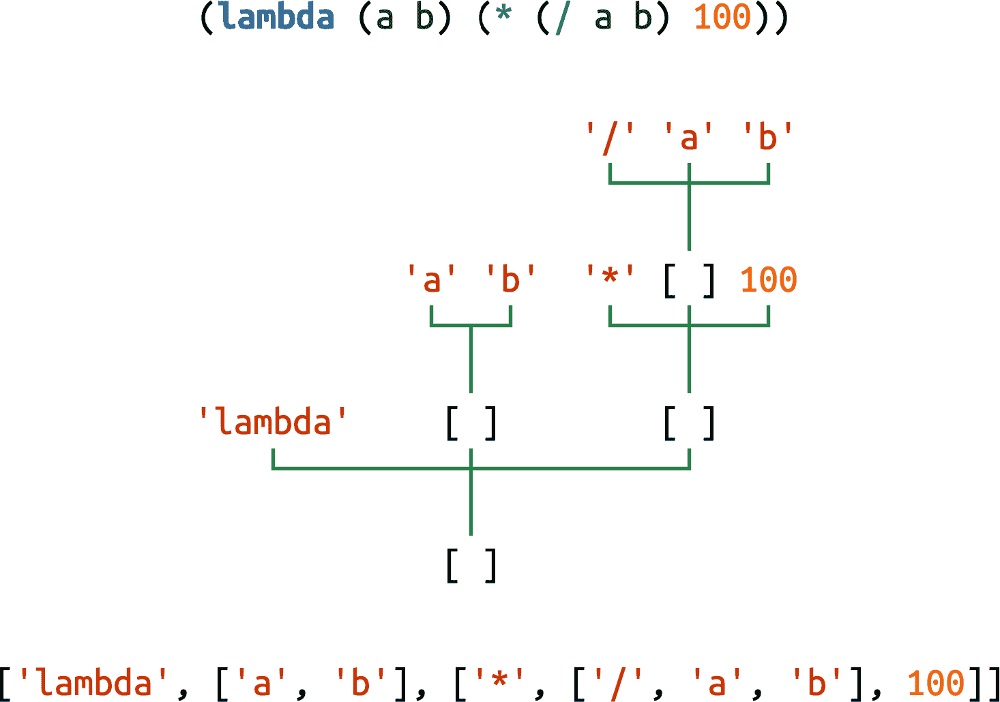

# 第十八章：with、match 和 else 块

> 上下文管理器可能几乎与子例程本身一样重要。我们只是初步了解了它们。[…] Basic 有一个 `with` 语句，在许多语言中都有 `with` 语句。但它们的功能不同，它们都只是做一些非常浅显的事情，它们可以避免重复的点式[属性]查找，但它们不进行设置和拆卸。仅仅因为它们有相同的名称，不要认为它们是相同的东西。`with` 语句是一件大事。
> 
> Raymond Hettinger，Python 雄辩的传道者

本章讨论的是在其他语言中不太常见的控制流特性，因此往往在 Python 中被忽视或未充分利用。它们包括：

+   `with` 语句和上下文管理器协议

+   使用 `match/case` 进行模式匹配

+   `for`、`while` 和 `try` 语句中的 `else` 子句

`with` 语句建立了一个临时上下文，并可靠地在上下文管理器对象的控制下将其拆除。这可以防止错误并减少样板代码，同时使 API 更安全、更易于使用。Python 程序员发现 `with` 块除了自动关闭文件外还有许多其他用途。

我们在之前的章节中已经看到了模式匹配，但在这里我们将看到语言的语法如何可以表示为序列模式。这一观察解释了为什么 `match/case` 是创建易于理解和扩展的语言处理器的有效工具。我们将研究 Scheme 语言的一个小但功能齐全的子集的完整解释器。相同的思想可以应用于开发模板语言或在更大系统中编码业务规则的 DSL（领域特定语言）。

`else` 子句并不是一件大事，但在与 `for`、`while` 和 `try` 一起正确使用时有助于传达意图。

# 本章新内容

“lis.py 中的模式匹配：案例研究” 是一个新的部分。

我更新了“contextlib 实用工具”，涵盖了自 Python 3.6 以来添加到 `contextlib` 模块的一些功能，以及 Python 3.10 中引入的新的带括号的上下文管理器语法。

让我们从强大的 `with` 语句开始。

# 上下文管理器和 with 块

上下文管理器对象存在以控制 `with` 语句，就像迭代器存在以控制 `for` 语句一样。

`with` 语句旨在简化一些常见的 `try/finally` 用法，它保证在代码块结束后执行某些操作，即使代码块由 `return`、异常或 `sys.exit()` 调用终止。`finally` 子句中的代码通常释放关键资源或恢复一些临时更改的先前状态。

Python 社区正在为上下文管理器找到新的创造性用途。标准库中的一些示例包括：

+   在 `sqlite3` 模块中管理事务—参见[“将连接用作上下文管理器”](https://fpy.li/18-2)。

+   安全处理锁、条件和信号量，如[`threading` 模块文档](https://fpy.li/18-3)中所述。

+   为 `Decimal` 对象设置自定义环境进行算术运算—参见[`decimal.localcontext` 文档](https://fpy.li/18-4)。

+   为测试修补对象—参见[`unittest.mock.patch` 函数](https://fpy.li/18-5)。

上下文管理器接口由 `__enter__` 和 `__exit__` 方法组成。在 `with` 的顶部，Python 调用上下文管理器对象的 `__enter__` 方法。当 `with` 块完成或由于任何原因终止时，Python 调用上下文管理器对象的 `__exit__` 方法。

最常见的例子是确保文件对象会关闭。示例 18-1 是使用 `with` 关闭文件的详细演示。

##### 示例 18-1。文件对象作为上下文管理器的演示

```py
>>> with open('mirror.py') as fp:  # ①
...     src = fp.read(60)  # ②
...
>>> len(src)
60 >>> fp  # ③
<_io.TextIOWrapper name='mirror.py' mode='r' encoding='UTF-8'> >>> fp.closed, fp.encoding  # ④
(True, 'UTF-8') >>> fp.read(60)  # ⑤
Traceback (most recent call last):
 File "<stdin>", line 1, in <module>
ValueError: I/O operation on closed file.
```

①

`fp`绑定到打开的文本文件，因为文件的`__enter__`方法返回`self`。

②

从`fp`中读取`60`个 Unicode 字符。

③

`fp`变量仍然可用——`with`块不像函数那样定义新的作用域。

④

我们可以读取`fp`对象的属性。

⑤

但是我们无法从`fp`中读取更多文本，因为在`with`块结束时，调用了`TextIOWrapper.__exit__`方法，它关闭了文件。

示例 18-1 中的第一个标注点提出了一个微妙但至关重要的观点：上下文管理器对象是在评估`with`后的表达式的结果，但绑定到目标变量（在`as`子句中）的值是上下文管理器对象的`__enter__`方法返回的结果。

恰好`open()`函数返回`TextIOWrapper`的一个实例，其`__enter__`方法返回`self`。但在不同的类中，`__enter__`方法也可能返回其他对象，而不是上下文管理器实例。

无论以何种方式退出`with`块的控制流，`__exit__`方法都会在上下文管理器对象上调用，而不是在`__enter__`返回的任何对象上调用。

`with`语句的`as`子句是可选的。在`open`的情况下，我们总是需要它来获得文件的引用，以便我们可以在其上调用方法。但是一些上下文管理器返回`None`，因为它们没有有用的对象可以返回给用户。

示例 18-2 展示了一个完全轻松的上下文管理器的操作，旨在突出上下文管理器和其`__enter__`方法返回的对象之间的区别。

##### 示例 18-2\. 测试`LookingGlass`上下文管理器类

```py
    >>> from mirror import LookingGlass
    >>> with LookingGlass() as what:  # ①
    ...      print('Alice, Kitty and Snowdrop')  # ②
    ...      print(what)
    ...
    pordwonS dna yttiK ,ecilA
    YKCOWREBBAJ
    >>> what  # ③
    'JABBERWOCKY'
    >>> print('Back to normal.')  # ④
    Back to normal.
```

①

上下文管理器是`LookingGlass`的一个实例；Python 在上下文管理器上调用`__enter__`，结果绑定到`what`。

②

打印一个`str`，然后打印目标变量`what`的值。每个`print`的输出都会被反转。

③

现在`with`块已经结束。我们可以看到`__enter__`返回的值，保存在`what`中，是字符串`'JABBERWOCKY'`。

④

程序输出不再被反转。

示例 18-3 展示了`LookingGlass`的实现。

##### 示例 18-3\. mirror.py：`LookingGlass`上下文管理器类的代码

```py
import sys

class LookingGlass:

    def __enter__(self):  # ①
        self.original_write = sys.stdout.write  # ②
        sys.stdout.write = self.reverse_write  # ③
        return 'JABBERWOCKY'  # ④

    def reverse_write(self, text):  # ⑤
        self.original_write(text[::-1])

    def __exit__(self, exc_type, exc_value, traceback):  # ⑥
        sys.stdout.write = self.original_write  # ⑦
        if exc_type is ZeroDivisionError:  # ⑧
            print('Please DO NOT divide by zero!')
            return True  # ⑨
        # ⑩
```

①

Python 会以除`self`之外没有其他参数调用`__enter__`。

②

保留原始的`sys.stdout.write`方法，以便稍后恢复。

③

用我们自己的方法替换`sys.stdout.write`，进行 Monkey-patch。

④

返回`'JABBERWOCKY'`字符串，这样我们就有了一些东西可以放在目标变量`what`中。

⑤

我们替换了`sys.stdout.write`，将`text`参数反转并调用原始实现。

⑥

如果一切顺利，Python 会用`None, None, None`调用`__exit__`；如果引发异常，则三个参数将获得异常数据，如本示例后所述。

⑦

恢复原始方法`sys.stdout.write`。

⑧

如果异常不是`None`且其类型是`ZeroDivisionError`，则打印一条消息…

⑨

…并返回`True`以告诉解释器异常已被处理。

⑩

如果`__exit__`返回`None`或任何*假值*，则`with`块中引发的任何异常都将传播。

###### 提示

当真实应用接管标准输出时，它们通常希望将`sys.stdout`替换为另一个类似文件的对象一段时间，然后再切换回原始状态。[`contextlib.redirect_stdout`](https://fpy.li/18-6)上下文管理器正是这样做的：只需将它传递给将替代`sys.stdout`的文件类对象。

解释器使用无参数—除了隐式的`self`—调用`__enter__`方法。传递给`__exit__`的三个参数是：

`exc_type`

异常类（例如`ZeroDivisionError`）。

`exc_value`

异常实例。有时，传递给异常构造函数的参数—如错误消息—可以在`exc_value.args`中找到。

`traceback`

一个`traceback`对象。²

要详细了解上下文管理器的工作原理，请参见示例 18-4，其中`LookingGlass`在`with`块之外使用，因此我们可以手动调用其`__enter__`和`__exit__`方法。

##### 示例 18-4\. 在没有`with`块的情况下使用`LookingGlass`

```py
    >>> from mirror import LookingGlass
    >>> manager = LookingGlass()  # ①
    >>> manager  # doctest: +ELLIPSIS
    <mirror.LookingGlass object at 0x...>
    >>> monster = manager.__enter__()  # ②
    >>> monster == 'JABBERWOCKY'  # ③
    eurT
    >>> monster
    'YKCOWREBBAJ'
    >>> manager  # doctest: +ELLIPSIS
    >... ta tcejbo ssalGgnikooL.rorrim<
    >>> manager.__exit__(None, None, None)  # ④
    >>> monster
    'JABBERWOCKY'
```

①

实例化并检查`manager`实例。

②

调用管理器的`__enter__`方法并将结果存储在`monster`中。

③

`monster`是字符串`'JABBERWOCKY'`。`True`标识符出现颠倒，因为所有通过`stdout`输出的内容都经过我们在`__enter__`中打补丁的`write`方法。

④

调用`manager.__exit__`以恢复先前的`stdout.write`。

# Python 3.10 中的括号上下文管理器

Python 3.10 采用了[一个新的、更强大的解析器](https://fpy.li/pep617)，允许新的语法超出旧的[LL(1)解析器](https://fpy.li/18-8)所能实现的范围。一个语法增强是允许括号上下文管理器，就像这样：

```py
with (
    CtxManager1() as example1,
    CtxManager2() as example2,
    CtxManager3() as example3,
):
    ...
```

在 3.10 之前，我们必须编写嵌套的`with`块。

标准库包括`contextlib`包，其中包含用于构建、组合和使用上下文管理器的方便函数、类和装饰器。

## `contextlib`实用程序

在自己编写上下文管理器类之前，请查看 Python 文档中的[`contextlib`—“用于`with`语句上下文的实用程序”](https://fpy.li/18-9)。也许您即将构建的内容已经存在，或者有一个类或一些可调用对象可以让您的工作更轻松。

除了在示例 18-3 之后提到的`redirect_stdout`上下文管理器之外，Python 3.5 中还添加了`redirect_stderr`—它的功能与前者相同，但用于指向`stderr`的输出。

`contextlib`包还包括：

`closing`

一个函数，用于从提供`close()`方法但不实现`__enter__/__exit__`接口的对象构建上下文管理器。

`suppress`

一个上下文管理器，用于临时忽略作为参数给出的异常。

`nullcontext`

一个什么都不做的上下文管理器，用于简化围绕可能不实现合适上下文管理器的对象的条件逻辑。当`with`块之前的条件代码可能或可能不为`with`语句提供上下文管理器时，它充当替代品—Python 3.7 中添加。

`contextlib`模块提供的类和装饰器比刚才提到的装饰器更广泛适用：

`@contextmanager`

一个装饰器，让您可以从简单的生成器函数构建上下文管理器，而不是创建一个类并实现接口。参见“使用@contextmanager”。

`AbstractContextManager`

一个正式化上下文管理器接口的 ABC，并通过子类化使得创建上下文管理器类变得更容易——在 Python 3.6 中添加。

`ContextDecorator`

用于定义基于类的上下文管理器的基类，也可以用作函数修饰符，将整个函数在受控上下文中运行。

`ExitStack`

一个允许您进入可变数量上下文管理器的上下文管理器。当`with`块结束时，`ExitStack`以 LIFO 顺序（最后进入，最先退出）调用堆叠的上下文管理器的`__exit__`方法。当您不知道在`with`块中需要进入多少上下文管理器时，请使用此类；例如，当同时打开来自任意文件列表的所有文件时。

在 Python 3.7 中，`contextlib`添加了`AbstractAsyncContextManager`，`@asynccontextmanager`和`AsyncExitStack`。它们类似于名称中不带`async`部分的等效实用程序，但设计用于与新的`async with`语句一起使用，该语句在第二十一章中介绍。

这些实用程序中最常用的是`@contextmanager`修饰符，因此它值得更多关注。该修饰符也很有趣，因为它展示了与迭代无关的`yield`语句的用法。

## 使用`@contextmanager`

`@contextmanager`修饰符是一个优雅且实用的工具，它将三个独特的 Python 特性结合在一起：函数修饰符、生成器和`with`语句。

使用`@contextmanager`减少了创建上下文管理器的样板代码：不需要编写一个具有`__enter__/__exit__`方法的整个类，只需实现一个生成器，其中包含一个应该生成`__enter__`方法返回的内容。

在使用`@contextmanager`修饰的生成器中，`yield`将函数体分为两部分：`yield`之前的所有内容将在解释器调用`__enter__`时在`with`块的开头执行；`yield`之后的代码将在块结束时调用`__exit__`时运行。

示例 18-5 用生成器函数替换了示例 18-3 中的`LookingGlass`类。

##### 示例 18-5\. mirror_gen.py：使用生成器实现的上下文管理器

```py
import contextlib
import sys

@contextlib.contextmanager  # ①
def looking_glass():
    original_write = sys.stdout.write  # ②

    def reverse_write(text):  # ③
        original_write(text[::-1])

    sys.stdout.write = reverse_write  # ④
    yield 'JABBERWOCKY'  # ⑤
    sys.stdout.write = original_write  # ⑥
```

①

应用`contextmanager`修饰符。

②

保留原始的`sys.stdout.write`方法。

③

`reverse_write`稍后可以调用`original_write`，因为它在其闭包中可用。

④

将`sys.stdout.write`替换为`reverse_write`。

⑤

产生将绑定到`with`语句中`as`子句的目标变量的值。生成器在此处暂停，而`with`的主体执行。

⑥

当控制退出`with`块时，执行继续在`yield`之后；这里恢复原始的`sys.stdout.write`。

示例 18-6 展示了`looking_glass`函数的运行。

##### 示例 18-6\. 测试`looking_glass`上下文管理器函数

```py
    >>> from mirror_gen import looking_glass
    >>> with looking_glass() as what:  # ①
    ...      print('Alice, Kitty and Snowdrop')
    ...      print(what)
    ...
    pordwonS dna yttiK ,ecilA
    YKCOWREBBAJ
    >>> what
    'JABBERWOCKY'
    >>> print('back to normal')
    back to normal
```

①

与示例 18-2 唯一的区别是上下文管理器的名称：`looking_glass`而不是`LookingGlass`。

`contextlib.contextmanager`修饰符将函数包装在一个实现`__enter__`和`__exit__`方法的类中。³

该类的`__enter__`方法：

1.  调用生成器函数以获取生成器对象——我们将其称为`gen`。

1.  调用`next(gen)`来驱动它到`yield`关键字。

1.  返回由`next(gen)`产生的值，以允许用户将其绑定到`with/as`形式中的变量。

当`with`块终止时，`__exit__`方法：

1.  检查是否将异常作为`exc_type`传递；如果是，则调用`gen.throw(exception)`，导致异常在生成器函数体内的`yield`行中被引发。

1.  否则，调用`next(gen)`，恢复`yield`后生成器函数体的执行。

示例 18-5 存在一个缺陷：如果在`with`块的主体中引发异常，Python 解释器将捕获它并在`looking_glass`内的`yield`表达式中再次引发它。但那里没有错误处理，因此`looking_glass`生成器将在不恢复原始`sys.stdout.write`方法的情况下终止，使系统处于无效状态。

示例 18-7 添加了对`ZeroDivisionError`异常的特殊处理，使其在功能上等同于基于类的示例 18-3。

##### 示例 18-7\. mirror_gen_exc.py：基于生成器的上下文管理器实现异常处理，与示例 18-3 具有相同的外部行为

```py
import contextlib
import sys

@contextlib.contextmanager
def looking_glass():
    original_write = sys.stdout.write

    def reverse_write(text):
        original_write(text[::-1])

    sys.stdout.write = reverse_write
    msg = ''  # ①
    try:
        yield 'JABBERWOCKY'
    except ZeroDivisionError:  # ②
        msg = 'Please DO NOT divide by zero!'
    finally:
        sys.stdout.write = original_write  # ③
        if msg:
            print(msg)  # ④
```

①

为可能的错误消息创建一个变量；这是与示例 18-5 相关的第一个更改。

②

处理`ZeroDivisionError`，设置一个错误消息。

③

撤消对`sys.stdout.write`的猴子补丁。

④

如果已设置错误消息，则显示错误消息。

回想一下，`__exit__`方法告诉解释器已通过返回一个真值处理了异常；在这种情况下，解释器会抑制异常。另一方面，如果`__exit__`没有显式返回一个值，解释器会得到通常的`None`，并传播异常。使用`@contextmanager`，默认行为被反转：装饰器提供的`__exit__`方法假定任何发送到生成器中的异常都已处理并应该被抑制。

###### 提示

在`yield`周围有一个`try/finally`（或`with`块）是使用`@contextmanager`的不可避免的代价，因为你永远不知道你的上下文管理器的用户会在`with`块内做什么。⁴

`@contextmanager`的一个鲜为人知的特性是，用它装饰的生成器也可以作为装饰器使用。⁵ 这是因为`@contextmanager`是使用`contextlib.ContextDecorator`类实现的。

示例 18-8 展示了从示例 18-5 中使用的`looking_glass`上下文管理器作为装饰器。

##### 示例 18-8\. `looking_glass`上下文管理器也可以作为装饰器使用

```py
    >>> @looking_glass()
    ... def verse():
    ...     print('The time has come')
    ...
    >>> verse()  # ①
    emoc sah emit ehT
    >>> print('back to normal')  # ②
    back to normal
```

①

`looking_glass`在`verse`主体运行之前和之后执行其工作。

②

这证实了原始的`sys.write`已经恢复。

将示例 18-8 与示例 18-6 进行对比，在其中`looking_glass`被用作上下文管理器。

`@contextmanager`在标准库之外的一个有趣的现实生活示例是 Martijn Pieters 的[使用上下文管理器进行原地文件重写](https://fpy.li/18-11)。示例 18-9 展示了它的使用方式。

##### 示例 18-9\. 用于原地重写文件的上下文管理器

```py
import csv

with inplace(csvfilename, 'r', newline='') as (infh, outfh):
    reader = csv.reader(infh)
    writer = csv.writer(outfh)

    for row in reader:
        row += ['new', 'columns']
        writer.writerow(row)
```

`inplace`函数是一个上下文管理器，为您提供两个句柄—在示例中为`infh`和`outfh`—指向同一个文件，允许您的代码同时读取和写入。它比标准库的[`fileinput.input`函数](https://fpy.li/18-12)更容易使用（顺便说一句，它也提供了一个上下文管理器）。

如果您想研究 Martijn 的`inplace`源代码（列在[帖子中](https://fpy.li/18-11)），请查找`yield`关键字：在它之前的所有内容都涉及设置上下文，这包括创建备份文件，然后打开并生成可读和可写文件句柄的引用，这些引用将由`__enter__`调用返回。`yield`后的`__exit__`处理关闭文件句柄，并在出现问题时从备份中恢复文件。

这结束了我们对`with`语句和上下文管理器的概述。让我们转向完整示例中的`match/case`。

# lis.py 中的模式匹配：一个案例研究

在“解释器中的模式匹配序列”中，我们看到了从 Peter Norvig 的*lis.py*解释器的`evaluate`函数中提取的序列模式的示例，该解释器已移植到 Python 3.10。在本节中，我想更广泛地介绍*lis.py*的工作原理，并探讨`evaluate`的所有`case`子句，不仅解释模式，还解释解释器在每个`case`中的操作。

除了展示更多的模式匹配，我写这一部分有三个原因：

1.  Norvig 的*lis.py*是惯用 Python 代码的一个很好的例子。

1.  Scheme 的简单性是语言设计的典范。

1.  了解解释器如何工作让我更深入地理解了 Python 和一般编程语言——无论是解释型还是编译型。

在查看 Python 代码之前，让我们稍微了解一下 Scheme，这样您就可以理解这个案例研究——如果您以前没有见过 Scheme 或 Lisp 的话。

## Scheme 语法

在 Scheme 中，表达式和语句之间没有区别，就像我们在 Python 中所看到的那样。此外，没有中缀运算符。所有表达式都使用前缀表示法，如`(+ x 13)`而不是`x + 13`。相同的前缀表示法用于函数调用—例如，`(gcd x 13)`—和特殊形式—例如，`(define x 13)`，我们在 Python 中会写成赋值语句`x = 13`。Scheme 和大多数 Lisp 方言使用的表示法称为*S 表达式*。⁶

示例 18-10 展示了 Scheme 中的一个简单示例。

##### 示例 18-10\. Scheme 中的最大公约数

```py
(define (mod m n)
    (- m (* n (quotient m n))))

(define (gcd m n)
    (if (= n 0)
        m
        (gcd n (mod m n))))

(display (gcd 18 45))
```

示例 18-10 展示了三个 Scheme 表达式：两个函数定义—`mod`和`gcd`—以及一个调用`display`，它将输出 9，即`(gcd 18 45)`的结果。示例 18-11 是相同的 Python 代码（比递归[*欧几里德算法*](https://fpy.li/18-14)的英文解释更短）。

##### 示例 18-11\. 与示例 18-10 相同，用 Python 编写

```py
def mod(m, n):
    return m - (m // n * n)

def gcd(m, n):
    if n == 0:
        return m
    else:
        return gcd(n, mod(m, n))

print(gcd(18, 45))
```

在惯用 Python 中，我会使用`%`运算符而不是重新发明`mod`，并且使用`while`循环而不是递归会更有效率。但我想展示两个函数定义，并尽可能使示例相似，以帮助您阅读 Scheme 代码。

Scheme 没有像 Python 中那样的迭代控制流命令，如`while`或`for`。迭代是通过递归完成的。请注意，在 Scheme 和 Python 示例中没有赋值。广泛使用递归和最小使用赋值是函数式编程的标志。⁷

现在让我们回顾一下 Python 3.10 版本的*lis.py*代码。完整的源代码和测试位于 GitHub 存储库[*fluentpython/example-code-2e*](https://fpy.li/code)的*18-with-match/lispy/py3.10/*目录中。

## 导入和类型

[示例 18-12 显示了*lis.py*的前几行。`TypeAlias`和`|`类型联合运算符的使用需要 Python 3.10。

##### 示例 18-12\. lis.py：文件顶部

```py
import math
import operator as op
from collections import ChainMap
from itertools import chain
from typing import Any, TypeAlias, NoReturn

Symbol: TypeAlias = str
Atom: TypeAlias = float | int | Symbol
Expression: TypeAlias = Atom | list
```

定义的类型有：

`Symbol`

`str`的别名。在*lis.py*中，`Symbol`用于标识符；没有带有切片、分割等操作的字符串数据类型。⁸

`Atom`

一个简单的句法元素，如数字或 `Symbol`—与由不同部分组成的复合结构相对，如列表。

`表达式`

Scheme 程序的构建块是由原子和列表组成的表达式，可能是嵌套的。

## 解析器

Norvig 的解析器是 36 行代码，展示了 Python 的强大之处，应用于处理 S-表达式的简单递归语法，没有字符串数据、注释、宏和标准 Scheme 的其他特性，这些特性使解析变得更加复杂（示例 18-13）。

##### 示例 18-13\. lis.py：主要解析函数

```py
def parse(program: str) -> Expression:
    "Read a Scheme expression from a string."
    return read_from_tokens(tokenize(program))

def tokenize(s: str) -> list[str]:
    "Convert a string into a list of tokens."
    return s.replace('(', ' ( ').replace(')', ' ) ').split()

def read_from_tokens(tokens: list[str]) -> Expression:
    "Read an expression from a sequence of tokens."
    # more parsing code omitted in book listing
```

该组的主要函数是 `parse`，它接受一个 S-表达式作为 `str` 并返回一个 `Expression` 对象，如 示例 18-12 中定义的：一个 `Atom` 或一个可能包含更多原子和嵌套列表的 `list`。

Norvig 在 `tokenize` 中使用了一个聪明的技巧：他在输入的每个括号前后添加空格，然后拆分它，结果是一个包含 `'('` 和 `')'` 作为单独标记的句法标记列表。这个快捷方式有效，因为在 *lis.py* 的小 Scheme 中没有字符串类型，所以每个 `'('` 或 `')'` 都是表达式分隔符。递归解析代码在 `read_from_tokens` 中，这是一个 14 行的函数，你可以在 [*fluentpython/example-code-2e*](https://fpy.li/18-17) 仓库中阅读。我会跳过它，因为我想专注于解释器的其他部分。

这里是从 [*lispy/py3.10/examples_test.py*](https://fpy.li/18-18) 中提取的一些 doctest：

```py
>>> from lis import parse
>>> parse('1.5')
1.5
>>> parse('ni!')
'ni!'
>>> parse('(gcd 18 45)')
['gcd', 18, 45]
>>> parse('''
... (define double
...     (lambda (n)
...         (* n 2)))
... ''')
['define', 'double', ['lambda', ['n'], ['*', 'n', 2]]]
```

这个 Scheme 子集的解析规则很简单：

1.  看起来像数字的标记被解析为 `float` 或 `int`。

1.  其他任何不是 `'('` 或 `')'` 的内容都被解析为 `Symbol`—一个可用作标识符的 `str`。这包括 Scheme 中有效但不在 Python 中的标识符的源文本，如 `+`、`set!` 和 `make-counter`。

1.  `'('` 和 `')'` 内的表达式被递归解析为包含原子的列表或可能包含原子和更多嵌套列表的嵌套列表。

使用 Python 解释器的术语，`parse` 的输出是一个 AST（抽象语法树）：一个方便的表示 Scheme 程序的嵌套列表形成树状结构，其中最外层列表是主干，内部列表是分支，原子是叶子（图 18-1）。



###### 图 18-1\. 一个 Scheme `lambda` 表达式，表示为源代码（具体语法）、作为树和作为 Python 对象序列（抽象语法）。

## 环境

`Environment` 类扩展了 `collections.ChainMap`，添加了一个 `change` 方法来更新链式字典中的值，`ChainMap` 实例将这些值保存在映射列表中：`self.maps` 属性。`change` 方法用于支持后面描述的 Scheme `(set! …)` 形式；参见 示例 18-14。

##### 示例 18-14\. *lis.py*：`Environment` 类

```py
class Environment(ChainMap[Symbol, Any]):
    "A ChainMap that allows changing an item in-place."

    def change(self, key: Symbol, value: Any) -> None:
        "Find where key is defined and change the value there."
        for map in self.maps:
            if key in map:
                map[key] = value  # type: ignore[index]
                return
        raise KeyError(key)
```

注意，`change` 方法只更新现有键。⁹ 尝试更改未找到的键会引发 `KeyError`。

这个 doctest 展示了 `Environment` 的工作原理：

```py
>>> from lis import Environment
>>> inner_env = {'a': 2}
>>> outer_env = {'a': 0, 'b': 1}
>>> env = Environment(inner_env, outer_env)
>>> env['a']  # ①
2 >>> env['a'] = 111  # ②
>>> env['c'] = 222
>>> env
Environment({'a': 111, 'c': 222}, {'a': 0, 'b': 1}) >>> env.change('b', 333)  # ③
>>> env
Environment({'a': 111, 'c': 222}, {'a': 0, 'b': 333})
```

①

在读取值时，`Environment` 的工作方式类似于 `ChainMap`：键从左到右在嵌套映射中搜索。这就是为什么 `outer_env` 中 `a` 的值被 `inner_env` 中的值遮蔽。

②

使用 `[]` 赋值会覆盖或插入新项，但始终在第一个映射 `inner_env` 中进行，本例中。

③

`env.change('b', 333)` 寻找 `'b'` 键并在 `outer_env` 中就地分配一个新值。

接下来是 `standard_env()` 函数，它构建并返回一个加载了预定义函数的 `Environment`，类似于 Python 的 `__builtins__` 模块，始终可用（示例 18-15）。

##### 示例 18-15\. lis.py：`standard_env()`构建并返回全局环境

```py
def standard_env() -> Environment:
    "An environment with some Scheme standard procedures."
    env = Environment()
    env.update(vars(math))   # sin, cos, sqrt, pi, ...
    env.update({
            '+': op.add,
            '-': op.sub,
            '*': op.mul,
            '/': op.truediv,
            # omitted here: more operator definitions
            'abs': abs,
            'append': lambda *args: list(chain(*args)),
            'apply': lambda proc, args: proc(*args),
            'begin': lambda *x: x[-1],
            'car': lambda x: x[0],
            'cdr': lambda x: x[1:],
            # omitted here: more function definitions
            'number?': lambda x: isinstance(x, (int, float)),
            'procedure?': callable,
            'round': round,
            'symbol?': lambda x: isinstance(x, Symbol),
    })
    return env
```

总结一下，`env`映射加载了：

+   Python 的`math`模块中的所有函数

+   从 Python 的`op`模块中选择的运算符

+   使用 Python 的`lambda`构建的简单但强大的函数

+   Python 内置函数重命名，比如`callable`改为`procedure?`，或者直接映射，比如`round`

## REPL

Norvig 的 REPL（读取-求值-打印-循环）易于理解但不用户友好（参见 Example 18-16）。如果没有向*lis.py*提供命令行参数，则`main()`会调用`repl()`函数—在模块末尾定义。在`lis.py>`提示符下，我们必须输入正确和完整的表达式；如果忘记关闭一个括号，*lis.py*会崩溃。¹⁰

##### 示例 18-16\. REPL 函数

```py
def repl(prompt: str = 'lis.py> ') -> NoReturn:
    "A prompt-read-eval-print loop."
    global_env = Environment({}, standard_env())
    while True:
        ast = parse(input(prompt))
        val = evaluate(ast, global_env)
        if val is not None:
            print(lispstr(val))

def lispstr(exp: object) -> str:
    "Convert a Python object back into a Lisp-readable string."
    if isinstance(exp, list):
        return '(' + ' '.join(map(lispstr, exp)) + ')'
    else:
        return str(exp)
```

这里是关于这两个函数的简要解释：

`repl(prompt: str = 'lis.py> ') -> NoReturn`

调用`standard_env()`为全局环境提供内置函数，然后进入一个无限循环，读取和解析每个输入行，在全局环境中评估它，并显示结果—除非它是`None`。`global_env`可能会被`evaluate`修改。例如，当用户定义新的全局变量或命名函数时，它会存储在环境的第一个映射中—在`repl`的第一行中的`Environment`构造函数调用中的空`dict`中。

`lispstr(exp: object) -> str`

`parse`的反函数：给定表示表达式的 Python 对象，`parse`返回其 Scheme 源代码。例如，给定`['+', 2, 3]`，结果是`'(+ 2 3)'`。

## 评估器

现在我们可以欣赏 Norvig 的表达式求值器的美丽之处—通过`match/case`稍微美化了一下。Example 18-17 中的`evaluate`函数接受由`parse`构建的`Expression`和一个`Environment`。

`evaluate`的主体是一个带有表达式`exp`的单个`match`语句。`case`模式以惊人的清晰度表达了 Scheme 的语法和语义。

##### 示例 18-17\. `evaluate`接受一个表达式并计算其值

```py
KEYWORDS = ['quote', 'if', 'lambda', 'define', 'set!']

def evaluate(exp: Expression, env: Environment) -> Any:
    "Evaluate an expression in an environment."
    match exp:
        case int(x) | float(x):
            return x
        case Symbol(var):
            return env[var]
        case ['quote', x]:
            return x
        case ['if', test, consequence, alternative]:
            if evaluate(test, env):
                return evaluate(consequence, env)
            else:
                return evaluate(alternative, env)
        case ['lambda', [*parms], *body] if body:
            return Procedure(parms, body, env)
        case ['define', Symbol(name), value_exp]:
            env[name] = evaluate(value_exp, env)
        case ['define', [Symbol(name), *parms], *body] if body:
            env[name] = Procedure(parms, body, env)
        case ['set!', Symbol(name), value_exp]:
            env.change(name, evaluate(value_exp, env))
        case [func_exp, *args] if func_exp not in KEYWORDS:
            proc = evaluate(func_exp, env)
            values = [evaluate(arg, env) for arg in args]
            return proc(*values)
        case _:
            raise SyntaxError(lispstr(exp))
```

让我们研究每个`case`子句及其作用。在某些情况下，我添加了注释，显示出一个 S 表达式，当解析为 Python 列表时会匹配该模式。从[*examples_test.py*](https://fpy.li/18-21)提取的 Doctests 展示了每个`case`。

### 评估数字

```py
    case int(x) | float(x):
        return x
```

主题：

`int`或`float`的实例。

操作：

原样返回值。

示例：

```py
>>> from lis import parse, evaluate, standard_env
>>> evaluate(parse('1.5'), {})
1.5
```

### 评估符号

```py
    case Symbol(var):
        return env[var]
```

主题：

`Symbol`的实例，即作为标识符使用的`str`。

操作：

在`env`中查找`var`并返回其值。

示例：

```py
>>> evaluate(parse('+'), standard_env())
<built-in function add>
>>> evaluate(parse('ni!'), standard_env())
Traceback (most recent call last):
    ...
KeyError: 'ni!'
```

### (quote …)

`quote`特殊形式将原子和列表视为数据而不是要评估的表达式。

```py
    # (quote (99 bottles of beer))
    case ['quote', x]:
        return x
```

主题：

以符号`'quote'`开头的列表，后跟一个表达式`x`。

操作：

返回`x`而不对其进行评估。

示例：

```py
>>> evaluate(parse('(quote no-such-name)'), standard_env())
'no-such-name'
>>> evaluate(parse('(quote (99 bottles of beer))'), standard_env())
[99, 'bottles', 'of', 'beer']
>>> evaluate(parse('(quote (/ 10 0))'), standard_env())
['/', 10, 0]
```

没有`quote`，测试中的每个表达式都会引发错误：

+   在环境中查找`no-such-name`，引发`KeyError`

+   `(99 bottles of beer)`无法评估，因为数字 99 不是命名特殊形式、运算符或函数的`Symbol`

+   `(/ 10 0)`会引发`ZeroDivisionError`

### (if …)

```py
    # (if (< x 0) 0 x)
    case ['if', test, consequence, alternative]:
        if evaluate(test, env):
            return evaluate(consequence, env)
        else:
            return evaluate(alternative, env)
```

主题：

以`'if'`开头的列表，后跟三个表达式：`test`、`consequence`和`alternative`。

操作：

评估`test`：

+   如果为真，则评估`consequence`并返回其值。

+   否则，评估`alternative`并返回其值。

示例：

```py
>>> evaluate(parse('(if (= 3 3) 1 0))'), standard_env())
1
>>> evaluate(parse('(if (= 3 4) 1 0))'), standard_env())
0
```

`consequence`和`alternative`分支必须是单个表达式。如果分支中需要多个表达式，可以使用`(begin exp1 exp2…)`将它们组合起来，作为*lis.py*中的一个函数提供—参见 Example 18-15。

### (lambda …)

Scheme 的`lambda`形式定义了匿名函数。它不受 Python 的`lambda`的限制：任何可以用 Scheme 编写的函数都可以使用`(lambda ...)`语法编写。

```py
    # (lambda (a b) (/ (+ a b) 2))
    case ['lambda' [*parms], *body] if body:
        return Procedure(parms, body, env)
```

主题：

以`'lambda'`开头的列表，后跟：

+   零个或多个参数名的列表。

+   一个或多个收集在`body`中的表达式（保证`body`不为空）。

操作：

创建并返回一个新的`Procedure`实例，其中包含参数名称、作为主体的表达式列表和当前环境。

例子：

```py
>>> expr = '(lambda (a b) (* (/ a b) 100))'
>>> f = evaluate(parse(expr), standard_env())
>>> f  # doctest: +ELLIPSIS
<lis.Procedure object at 0x...>
>>> f(15, 20)
75.0
```

`Procedure`类实现了闭包的概念：一个可调用对象，包含参数名称、函数体和函数定义所在环境的引用。我们将很快研究`Procedure`的代码。

### `(define …)`

`define`关键字以两种不同的语法形式使用。最简单的是：

```py
    # (define half (/ 1 2))
    case ['define', Symbol(name), value_exp]:
        env[name] = evaluate(value_exp, env)
```

主题：

以`'define'`开头的列表，后跟一个`Symbol`和一个表达式。

操作：

评估表达式并将其值放入`env`中，使用`name`作为键。

例子：

```py
>>> global_env = standard_env()
>>> evaluate(parse('(define answer (* 7 6))'), global_env)
>>> global_env['answer']
42
```

此`case`的 doctest 创建一个`global_env`，以便我们可以验证`evaluate`将`answer`放入该`Environment`中。

我们可以使用简单的`define`形式来创建变量或将名称绑定到匿名函数，使用`(lambda …)`作为`value_exp`。

标准 Scheme 提供了一种快捷方式来定义命名函数。这是第二种`define`形式：

```py
    # (define (average a b) (/ (+ a b) 2))
    case ['define', [Symbol(name), *parms], *body] if body:
        env[name] = Procedure(parms, body, env)
```

主题：

以`'define'`开头的列表，后跟：

+   以`Symbol(name)`开头的列表，后跟零个或多个收集到名为`parms`的列表中的项目。

+   一个或多个收集在`body`中的表达式（保证`body`不为空）。

操作：

+   创建一个新的`Procedure`实例，其中包含参数名称、作为主体的表达式列表和当前环境。

+   将`Procedure`放入`env`中，使用`name`作为键。

Example 18-18 中的 doctest 定义了一个名为`%`的计算百分比的函数，并将其添加到`global_env`中。

##### 例 18-18\. 定义一个名为`%`的计算百分比的函数

```py
>>> global_env = standard_env()
>>> percent = '(define (% a b) (* (/ a b) 100))'
>>> evaluate(parse(percent), global_env)
>>> global_env['%']  # doctest: +ELLIPSIS
<lis.Procedure object at 0x...>
>>> global_env'%'
85.0
```

调用`evaluate`后，我们检查`%`是否绑定到一个接受两个数值参数并返回百分比的`Procedure`。

第二个`define` `case`的模式不强制要求`parms`中的项目都是`Symbol`实例。我必须在构建`Procedure`之前检查这一点，但我没有这样做——为了使代码像 Norvig 的那样易于理解。

### (set! …)

`set!`形式更改先前定义的变量的值。¹¹

```py
    # (set! n (+ n 1))
    case ['set!', Symbol(name), value_exp]:
        env.change(name, evaluate(value_exp, env))
```

主题：

以`'set!'`开头的列表，后跟一个`Symbol`和一个表达式。

操作：

使用评估表达式的结果更新`env`中的`name`的值。

`Environment.change`方法从本地到全局遍历链接的环境，并用新值更新第一次出现的`name`。如果我们不实现`'set!'`关键字，我们可以在解释器中的任何地方都使用 Python 的`ChainMap`作为`Environment`类型。

现在我们来到一个函数调用。

### 函数调用

```py
    # (gcd (* 2 105) 84)
    case [func_exp, *args] if func_exp not in KEYWORDS:
        proc = evaluate(func_exp, env)
        values = [evaluate(arg, env) for arg in args]
        return proc(*values)
```

主题：

一个或多个项目的列表。

保护确保`func_exp`不是`['quote', 'if', 'define', 'lambda', 'set!']`中的一个——在 Example 18-17 中的`evaluate`之前列出。

模式匹配任何具有一个或多个表达式的列表，将第一个表达式绑定到`func_exp`，其余的绑定到`args`作为列表，可能为空。

操作：

+   评估`func_exp`以获得函数`proc`。

+   评估`args`中的每个项目以构建参数值列表。

+   用值作为单独参数调用`proc`，返回结果。

例子：

```py
>>> evaluate(parse('(% (* 12 14) (- 500 100))'), global_env)
42.0
```

此 doctest 继续自 Example 18-18：假设`global_env`有一个名为`%`的函数。给定给`%`的参数是算术表达式，以强调在调用函数之前对参数进行评估。

此`case`中的保护是必需的，因为`[func_exp, *args]`匹配任何具有一个或多个项目的主题序列。但是，如果`func_exp`是一个关键字，并且主题没有匹配任何先前的情况，那么这实际上是一个语法错误。

### 捕获语法错误

如果主题`exp`不匹配任何先前的情况，通用`case`会引发`SyntaxError`：

```py
    case _:
        raise SyntaxError(lispstr(exp))
```

这是一个作为`SyntaxError`报告的格式不正确的`(lambda …)`的示例：

```py
>>> evaluate(parse('(lambda is not like this)'), standard_env())
Traceback (most recent call last):
    ...
SyntaxError: (lambda is not like this)
```

如果函数调用的 `case` 没有拒绝关键字的保护，`(lambda is not like this)` 表达式将被处理为函数调用，这将引发 `KeyError`，因为 `'lambda'` 不是环境的一部分——就像 `lambda` 不是 Python 内置函数一样。

## Procedure: 实现闭包的类

`Procedure` 类实际上可以被命名为 `Closure`，因为它代表的就是一个函数定义和一个环境。函数定义包括参数的名称和构成函数主体的表达式。当函数被调用时，环境用于提供*自由变量*的值：出现在函数主体中但不是参数、局部变量或全局变量的变量。我们在“闭包”中看到了*闭包*和*自由变量*的概念。

我们学会了如何在 Python 中使用闭包，但现在我们可以更深入地了解闭包是如何在 *lis.py* 中实现的：

```py
class Procedure:
    "A user-defined Scheme procedure."

    def __init__(  # ①
        self, parms: list[Symbol], body: list[Expression], env: Environment
    ):
        self.parms = parms  # ②
        self.body = body
        self.env = env

    def __call__(self, *args: Expression) -> Any:  # ③
        local_env = dict(zip(self.parms, args))  # ④
        env = Environment(local_env, self.env)  # ⑤
        for exp in self.body:  # ⑥
            result = evaluate(exp, env)
        return result  # ⑦
```

①

当函数由 `lambda` 或 `define` 形式定义时调用。

②

保存参数名称、主体表达式和环境以备后用。

③

在 `case [func_exp, *args]` 子句的最后一行由 `proc(*values)` 调用。

④

构建 `local_env`，将 `self.parms` 映射为局部变量名称，将给定的 `args` 映射为值。

⑤

构建一个新的合并 `env`，将 `local_env` 放在首位，然后是 `self.env`—即在函数定义时保存的环境。

⑥

迭代 `self.body` 中的每个表达式，在合并的 `env` 中对其进行评估。

⑦

返回最后一个表达式评估的结果。

在[*lis.py*](https://fpy.li/18-24)中的 `evaluate` 后有几个简单的函数：`run` 读取一个完整的 Scheme 程序并执行它，`main` 调用 `run` 或 `repl`，取决于命令行——类似于 Python 的做法。我不会描述这些函数，因为它们没有什么新内容。我的目标是与你分享 Norvig 的小解释器的美丽之处，更深入地了解闭包的工作原理，并展示 `match/case` 如何成为 Python 的一个很好的补充。

结束这一关于模式匹配的扩展部分，让我们正式定义一下*OR-pattern*的概念。

## 使用 OR-patterns

一系列由 `|` 分隔的模式是一个[*OR-pattern*](https://fpy.li/18-25)：如果任何子模式成功，则它成功。“评估数字”中的模式就是一个 OR-pattern：

```py
    case int(x) | float(x):
        return x
```

OR-pattern 中的所有子模式必须使用相同的变量。这种限制是必要的，以确保变量在匹配的子模式中都是可用的，无论匹配的是哪个子模式。

###### 警告

在 `case` 子句的上下文中，`|` 运算符有特殊的含义。它不会触发 `__or__` 特殊方法，该方法处理其他上下文中的表达式，如 `a | b`，在这些上下文中，它被重载以执行诸如集合并集或整数按位或等操作，具体取决于操作数。

OR-pattern 不限于出现在模式的顶层。你也可以在子模式中使用 `|`。例如，如果我们希望 *lis.py* 接受希腊字母 λ (lambda)¹² 以及 `lambda` 关键字，我们可以像这样重写模式：

```py
    # (λ (a b) (/ (+ a b) 2) )
    case ['lambda' | 'λ', [*parms], *body] if body:
        return Procedure(parms, body, env)
```

现在我们可以转向本章的第三个也是最后一个主题：Python 中出现 `else` 子句的不寻常位置。

# 这样做，然后那样：else 块超出 if

这并不是什么秘密，但是这是一个被低估的语言特性：`else`子句不仅可以用在`if`语句中，还可以用在`for`、`while`和`try`语句中。

`for/else`、`while/else`和`try/else`的语义密切相关，但与`if/else`非常不同。最初，`else`这个词实际上阻碍了我对这些特性的理解，但最终我习惯了它。

这里是规则：

`for`

当`for`循环完成时，`else`块将运行一次（即，如果`for`被`break`中止，则不会运行）。

`while`

当`while`循环退出时，`else`块只会运行一次，因为条件变为*假*（即，如果`while`被`break`中止，则不会运行）。

`try`

当`try`块中没有引发异常时，`else`块将运行。[官方文档](https://fpy.li/18-27)还指出：“`else`子句中的异常不会被前面的`except`子句处理。”

在所有情况下，如果异常或`return`、`break`或`continue`语句导致控制跳出复合语句的主块，则`else`子句也会被跳过。

###### 注意

我认为`else`在除了`if`之外的所有情况下都是一个非常糟糕的关键字选择。它暗示了一个排除性的替代方案，比如，“运行这个循环，否则做那个”。但是在循环中`else`的语义是相反的：“运行这个循环，然后做那个”。这表明`then`是一个更好的关键字选择——这在`try`的上下文中也是有意义的：“尝试这个，然后做那个”。然而，添加一个新关键字会对语言造成破坏性的改变——这不是一个容易做出的决定。

在这些语句中使用`else`通常会使代码更易读，避免设置控制标志或编写额外的`if`语句。

在循环中使用`else`通常遵循以下代码段的模式：

```py
for item in my_list:
    if item.flavor == 'banana':
        break
else:
    raise ValueError('No banana flavor found!')
```

在`try/except`块的情况下，`else`起初可能看起来是多余的。毕竟，在以下代码段中，只有当`dangerous_call()`不引发异常时，`after_call()`才会运行，对吗？

```py
try:
    dangerous_call()
    after_call()
except OSError:
    log('OSError...')
```

然而，这样做将`after_call()`放在`try`块内没有任何好处。为了清晰和正确，`try`块的主体应该只包含可能引发预期异常的语句。这样更好：

```py
try:
    dangerous_call()
except OSError:
    log('OSError...')
else:
    after_call()
```

现在清楚了`try`块是在保护`dangerous_call()`可能出现的错误，而不是在`after_call()`中。明确的是，只有在`try`块中没有引发异常时，`after_call()`才会执行。

在 Python 中，`try/except`通常用于控制流，而不仅仅用于错误处理。甚至在[官方 Python 术语表](https://fpy.li/18-28)中都有一个缩略语/口号来记录这一点：

> EAFP
> 
> 宽恕比许可更容易。这种常见的 Python 编码风格假设存在有效的键或属性，并在假设被证明为假时捕获异常。这种干净且快速的风格的特点是存在许多 try 和 except 语句。这种技术与许多其他语言（如 C）常见的*LBYL*风格形成对比。

然后，术语表定义了 LBYL：

> LBYL
> 
> 三思而后行。这种编码风格在进行调用或查找之前明确测试前提条件。这种风格与*EAFP*方法形成对比，其特点是存在许多 if 语句。在多线程环境中，LBYL 方法可能会在“观察”和“跳转”之间引入竞争条件。例如，如果代码`if key in mapping: return mapping[key]`在测试后，但查找前，另一个线程从映射中删除了键，那么就会失败。这个问题可以通过使用锁或使用 EAFP 方法来解决。

鉴于 EAFP 风格，了解并善于使用`try/except`语句中的`else`块更有意义。

###### 注意

当讨论`match`语句时，一些人（包括我在内）认为它也应该有一个`else`子句。最终决定不需要，因为`case _:`可以完成相同的工作。¹³

现在让我们总结本章。

# 章节总结

本章从上下文管理器和`with`语句的含义开始，迅速超越了其常见用法，自动关闭已打开的文件。我们实现了一个自定义上下文管理器：`LookingGlass`类，具有`__enter__/__exit__`方法，并看到如何在`__exit__`方法中处理异常。雷蒙德·赫廷格在他 2013 年 PyCon 美国大会的主题演讲中强调了一个关键点，即`with`不仅用于资源管理；它是一个用于分解常见设置和拆卸代码，或者需要在另一个过程之前和之后执行的任何一对操作的工具。¹⁴

我们回顾了`contextlib`标准库模块中的函数。其中之一，`@contextmanager`装饰器，使得可以使用一个`yield`的简单生成器实现上下文管理器—这比编写至少两个方法的类更为简洁。我们将`LookingGlass`重新实现为`looking_glass`生成器函数，并讨论了在使用`@contextmanager`时如何处理异常。

然后我们研究了彼得·诺维格优雅的*lis.py*，这是一个用惯用 Python 编写的 Scheme 解释器，重构为在`evaluate`中使用`match/case`—这是任何解释器核心功能的函数。理解`evaluate`如何工作需要回顾一点 Scheme，一个 S 表达式的解析器，一个简单的 REPL，以及通过`collection.ChainMap`的`Environment`子类构建嵌套作用域。最终，*lis.py*成为一个探索远不止模式匹配的工具。它展示了解释器的不同部分如何协同工作，阐明了 Python 本身的核心特性：为什么保留关键字是必要的，作用域规则如何工作，以及闭包是如何构建和使用的。

# 进一步阅读

在*Python 语言参考*的[第八章，“复合语句”](https://fpy.li/18-27)中，几乎涵盖了关于`if`、`for`、`while`和`try`语句中`else`子句的所有内容。关于 Pythonic 使用`try/except`，无论是否有`else`，雷蒙德·赫廷格在 StackOverflow 上对问题[“在 Python 中使用 try-except-else 是一个好习惯吗？”](https://fpy.li/18-31)有一个精彩的回答。*Python 速查手册*，第 3 版，由马特利等人编写，有一章关于异常，对 EAFP 风格进行了出色的讨论，归功于计算先驱格雷斯·霍珀创造了“宽恕比许可更容易”的短语。

*Python 标准库*，第四章，“内置类型”，有一个专门介绍[“上下文管理器类型”](https://fpy.li/18-32)的部分。`__enter__/__exit__`特殊方法也在*Python 语言参考*中的[“With 语句上下文管理器”](https://fpy.li/18-33)中有文档。上下文管理器是在[PEP 343—“with”语句](https://fpy.li/pep343)中引入的。

雷蒙德·赫廷格在他的[PyCon US 2013 主题演讲](https://fpy.li/18-29)中将`with`语句视为“胜利的语言特性”。他还在同一会议上的演讲中展示了一些有趣的上下文管理器应用，标题为[“将代码转变为优美、惯用的 Python”](https://fpy.li/18-35)。

杰夫·普雷辛的博客文章[“Python *with*语句示例”](https://fpy.li/18-36)对使用`pycairo`图形库的上下文管理器示例很有趣。

`contextlib.ExitStack`类基于尼古劳斯·拉特的原始想法，他写了一篇简短的文章解释为什么它很有用：[“关于 Python 的 ExitStack 之美”](https://fpy.li/18-37)。在那篇文章中，拉特认为`ExitStack`类似于但比 Go 语言中的`defer`语句更灵活—我认为这是那种语言中最好的想法之一。

Beazley 和 Jones 在他们的*[Python Cookbook](https://fpy.li/pycook3)*第 3 版中为非常不同的目的设计了上下文管理器。“Recipe 8.3\. 使对象支持上下文管理协议”实现了一个`LazyConnection`类，其实例是上下文管理器，在`with`块中自动打开和关闭网络连接。“Recipe 9.22\. 简单定义上下文管理器”介绍了一个用于计时代码的上下文管理器，以及另一个用于对`list`对象进行事务性更改的上下文管理器：在`with`块内，会创建`list`实例的工作副本，并将所有更改应用于该工作副本。只有当`with`块在没有异常的情况下完成时，工作副本才会替换原始列表。简单而巧妙。

Peter Norvig 在文章中描述了他的小型 Scheme 解释器，分别是[“（如何编写（Lisp）解释器（用 Python））”](https://fpy.li/18-38)和[“（一个（更好的）Lisp 解释器（用 Python））”](https://fpy.li/18-39)。*lis.py*和*lispy.py*的代码在[*norvig/pytudes*](https://fpy.li/18-40)存储库中。我的存储库[*fluentpython/lispy*](https://fpy.li/18-41)包括了*lis.py*的*mylis*分支，更新到 Python 3.10，具有更好的 REPL、命令行集成、示例、更多测试和学习 Scheme 的参考资料。学习和实验的最佳 Scheme 方言和环境是[Racket](https://fpy.li/18-42)。

¹ PyCon US 2013 主题演讲：[“Python 的卓越之处”](https://fpy.li/18-1)；关于`with`的部分从 23:00 开始，到 26:15 结束。

² `self`接收的三个参数正是在`try/finally`语句的`finally`块中调用[`sys.exc_info()`](https://fpy.li/18-7)时得到的内容。这是有道理的，考虑到`with`语句旨在取代大多数`try/finally`的用法，而调用`sys.exc_info()`通常是必要的，以确定需要什么清理操作。

³ 实际的类名是`_GeneratorContextManager`。如果你想确切地了解这是如何工作的，请阅读 Python 3.10 中*Lib/contextlib.py*中的[源代码](https://fpy.li/18-10)。

⁴ 这个提示是从本书的技术审阅员之一 Leonardo Rochael 的评论中直接引用的。说得好，Leo！

⁵ 至少我和其他技术审阅员在 Caleb Hattingh 告诉我们之前并不知道这一点。谢谢，Caleb！

⁶ 人们抱怨 Lisp 中有太多括号，但仔细的缩进和一个好的编辑器大多可以解决这个问题。主要的可读性问题是使用相同的`(f …)`符号来表示函数调用和像`(define …)`、`(if …)`和`(quote …)`这样根本不像函数调用的特殊形式。

⁷ 为了使递归迭代实用和高效，Scheme 和其他函数式语言实现了*proper tail calls*。关于这一点的更多信息，请参见“Soapbox”。

⁸ 但 Norvig 的第二个解释器，[*lispy.py*](https://fpy.li/18-16)，支持字符串作为数据类型，以及高级功能，如语法宏、延续和正确的尾调用。然而，*lispy.py*几乎比*lis.py*长三倍，而且更难理解。

⁹ `# type: ignore[index]`注释是因为*typeshed*问题[#6042](https://fpy.li/18-19)，在我审阅本章时尚未解决。`ChainMap`被注释为`MutableMapping`，但`maps`属性的类型提示表示它是`Mapping`列表，间接地使整个`ChainMap`在 Mypy 看来是不可变的。

¹⁰ 当我研究 Norvig 的 *lis.py* 和 *lispy.py* 时，我开始了一个名为 [*mylis*](https://fpy.li/18-20) 的分支，添加了一些功能，包括一个 REPL，可以接受部分 S-表达式，并提示继续，类似于 Python 的 REPL 知道我们还没有完成并呈现次要提示符（`...`），直到我们输入一个可以评估的完整表达式或语句。*mylis* 也可以优雅地处理一些错误，但仍然很容易崩溃。它远没有 Python 的 REPL 那么健壮。

¹¹ 赋值是许多编程教程中教授的第一个特性之一，但 `set!` 只出现在最知名的 Scheme 书籍[*计算机程序的构造与解释*，第 2 版，](https://fpy.li/18-22) 由 Abelson 等人（麻省理工学院出版社）编写，也称为 SICP 或“巫师书”。以函数式风格编码可以让我们在没有典型的命令式和面向对象编程中的状态更改的情况下走得更远。

¹² λ（U+03BB）的官方 Unicode 名称是 GREEK SMALL LETTER LAMDA。这不是拼写错误：Unicode 数据库中该字符的名称是“lamda”，没有“b”。根据英文维基百科文章[“Lambda”](https://fpy.li/18-26)，Unicode 联盟采用了这种拼写，是因为“希腊国家机构表达的偏好”。

¹³ 在 python-dev 邮件列表中观察讨论时，我认为 `else` 被拒绝的一个原因是在 `match` 中如何缩进它缺乏共识：`else` 应该与 `match` 缩进在同一级别，还是与 `case` 缩进在同一级别？

¹⁴ 请参见[“Python is Awesome”中的第 21 页幻灯片](https://fpy.li/18-29)。
