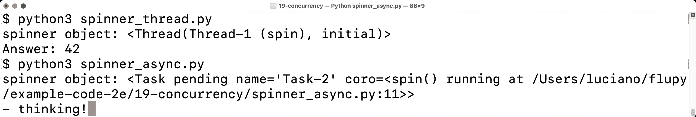
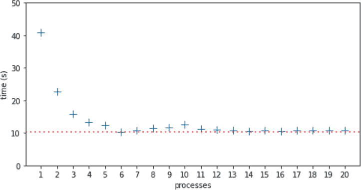
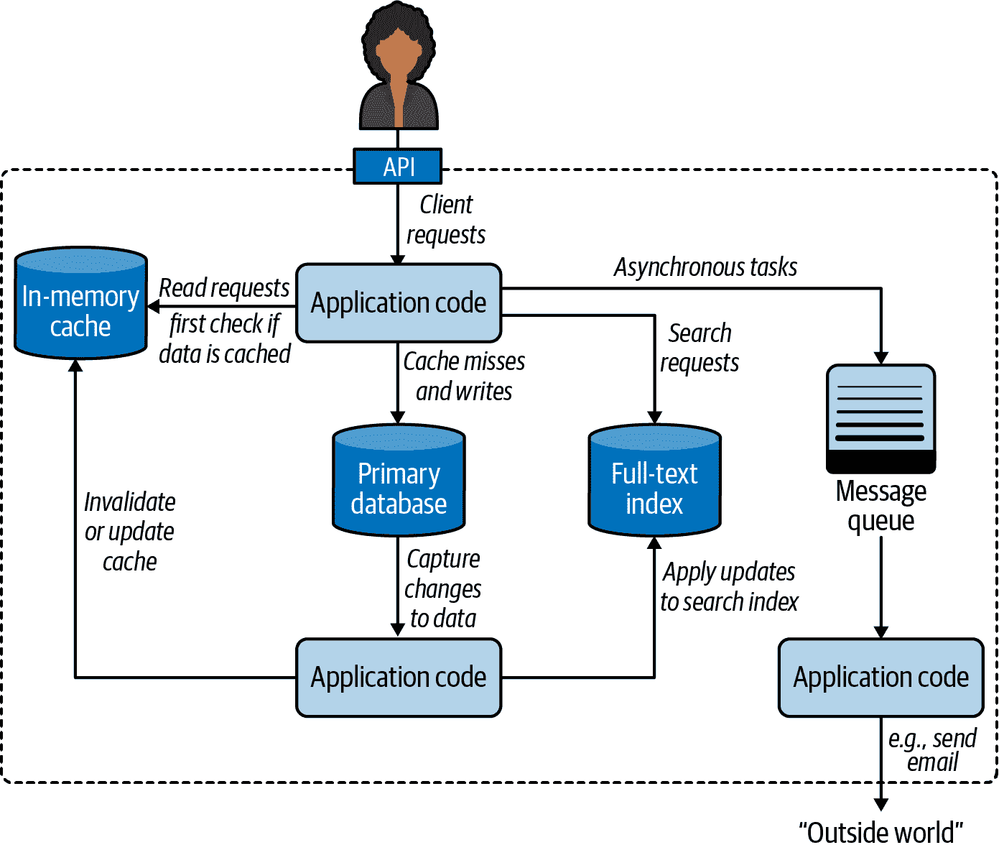
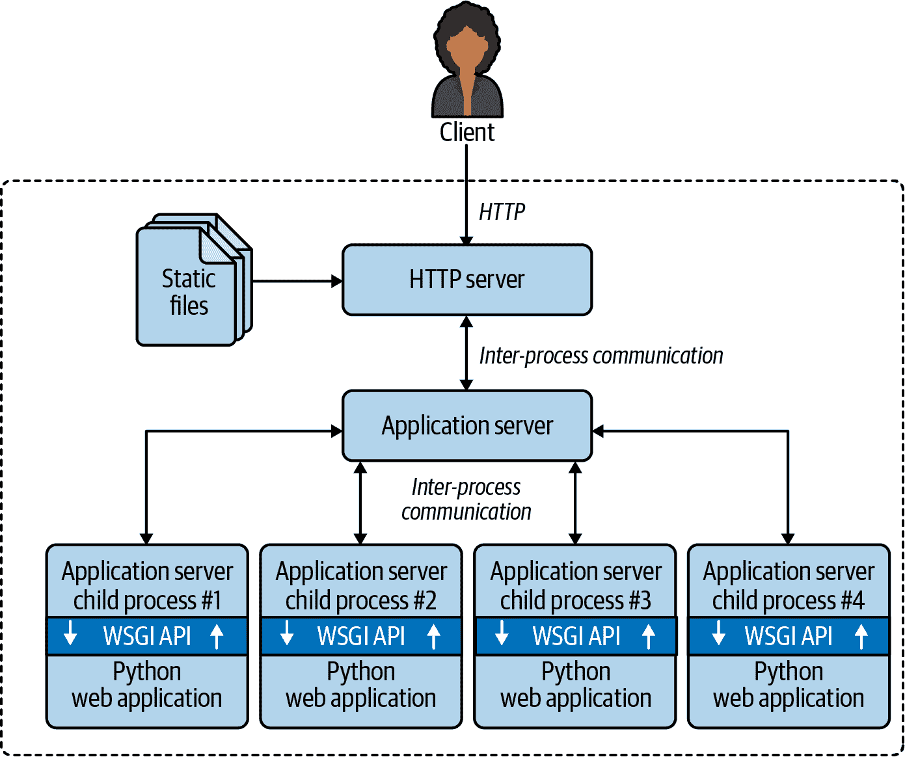

# 第十九章：并发模型在 Python 中

> 并发是关于同时处理许多事情。
> 
> 并行是同时做许多事情的概念。
> 
> 不同，但相关。
> 
> 一个是关于结构，一个是关于执行。
> 
> 并发提供了一种结构解决问题的方法，该问题可能（但不一定）是可并行化的。
> 
> Rob Pike，Go 语言的共同发明人¹

本章是关于如何让 Python 处理“许多事情同时发生”。这可能涉及并发或并行编程，即使对术语敏感的学者们对如何使用这些术语存在分歧。在本章的引言中，我将采用 Rob Pike 的非正式定义，但请注意，我发现有些论文和书籍声称是关于并行计算，但实际上主要是关于并发。²

在 Pike 看来，并行是并发的特例。所有并行系统都是并发的，但并非所有并发系统都是并行的。在 2000 年代初，我们使用单核机器在 GNU Linux 上同时处理 100 个进程。现代笔记本电脑具有 4 个 CPU 核心，在正常的日常使用中通常会同时运行 200 多个进程。要并行执行 200 个任务，您需要 200 个核心。因此，在实践中，大多数计算是并发的而不是并行的。操作系统管理数百个进程，确保每个进程都有机会取得进展，即使 CPU 本身一次只能做四件事。

本章假设您没有并发或并行编程的先前知识。在简要的概念介绍之后，我们将研究简单示例，介绍并比较 Python 的核心包用于并发编程：`threading`，`multiprocessing`和`asyncio`。

本章的最后 30%是对第三方工具，库，应用服务器和分布式任务队列的高级概述，所有这些都可以增强 Python 应用程序的性能和可伸缩性。这些都是重要的主题，但超出了专注于核心 Python 语言特性的书籍的范围。尽管如此，我认为在《流畅的 Python》第二版中解决这些主题很重要，因为 Python 在并发和并行计算方面的适用性不仅限于标准库提供的内容。这就是为什么 YouTube，DropBox，Instagram，Reddit 等在开始时能够实现 Web 规模，使用 Python 作为他们的主要语言，尽管一直有人声称“Python 不具备扩展性”。

# 本章新内容

本章是《流畅的 Python》第二版中的新内容。“一个并发的 Hello World”中的旋转示例以前在关于*asyncio*的章节中。在这里它们得到改进，并提供 Python 处理并发的三种方法的第一个示例：线程，进程和本机协程。

剩下的内容是新的，除了一些最初出现在`concurrent.futures`和*asyncio*章节中的段落。

“Python 在多核世界中”与本书其他部分不同：没有代码示例。目标是提及重要工具，您可能希望学习以实现高性能并发和并行，超越 Python 标准库所能实现的范围。

# 大局观

有许多因素使并发编程变得困难，但我想谈谈最基本的因素：启动线程或进程很容易，但如何跟踪它们呢？³

当您调用一个函数时，调用代码会被阻塞，直到函数返回。因此，您知道函数何时完成，并且可以轻松获取其返回的值。如果函数引发异常，调用代码可以在调用点周围使用`try/except`来捕获错误。

当你启动一个线程或进程时，这些熟悉的选项不可用：你不会自动知道它何时完成，获取结果或错误需要设置一些通信渠道，比如消息队列。

此外，启动线程或进程并不廉价，因此你不希望启动其中一个只是为了执行一个计算然后退出。通常情况下，你希望通过将每个线程或进程变成一个“工作者”，进入一个循环并等待输入来分摊启动成本。这进一步复杂了通信，并引入了更多问题。当你不再需要一个工作者时，如何让它退出？如何让它退出而不中断正在进行的工作，留下半成品数据和未释放的资源—比如打开的文件？再次，通常的答案涉及消息和队列。

协程很容易启动。如果你使用`await`关键字启动一个协程，很容易获得它返回的值，它可以被安全地取消，并且你有一个明确的地方来捕获异常。但协程通常由异步框架启动，这使得它们像线程或进程一样难以监控。

最后，Python 协程和线程不适合 CPU 密集型任务，我们将会看到。

这就是为什么并发编程需要学习新的概念和编码模式。让我们首先确保我们对一些核心概念有共识。

# 一点行话

以下是我将在本章和接下来的两章中使用的一些术语：

并发性

能够处理多个待处理任务，逐个或并行（如果可能）地取得进展，以便每个任务最终成功或失败。如果单核 CPU 运行一个交错执行待处理任务的 OS 调度程序，那么它就具备并发能力。也被称为多任务处理。

并行性

能够同时执行多个计算的能力。这需要一个多核 CPU、多个 CPU、一个[GPU](https://fpy.li/19-2)，或者一个集群中的多台计算机。

执行单元

执行代码并发的通用术语，每个都有独立的状态和调用堆栈。Python 本地支持三种执行单元：*进程*、*线程* 和 *协程*。

进程

计算机程序在运行时的一个实例，使用内存和 CPU 时间片。现代桌面操作系统通常同时管理数百个进程，每个进程都在自己的私有内存空间中隔离。进程通过管道、套接字或内存映射文件进行通信，所有这些通信方式只能传递原始字节。Python 对象必须被序列化（转换）为原始字节才能从一个进程传递到另一个进程。这是昂贵的，而且并非所有的 Python 对象都是可序列化的。一个进程可以生成子进程，每个子进程称为一个子进程。它们也彼此隔离，也与父进程隔离。进程允许*抢占式多任务处理*：操作系统调度程序*抢占*—即暂停—每个运行的进程，以允许其他进程运行。这意味着一个冻结的进程不能冻结整个系统—理论上。

线程

单个进程内的执行单元。当一个进程启动时，它使用一个线程：主线程。一个进程可以通过调用操作系统 API 创建更多线程以并发操作。进程内的线程共享相同的内存空间，其中保存着活跃的 Python 对象。这允许线程之间轻松共享数据，但也可能导致数据损坏，当多个线程同时更新同一对象时。与进程一样，线程也在操作系统调度程序的监督下实现*抢占式多任务处理*。一个线程消耗的资源比执行相同工作的进程少。

协程

一个可以暂停自身并稍后恢复的函数。在 Python 中，*经典协程*是由生成器函数构建的，而*原生协程*则是用`async def`定义的。“经典协程”介绍了这个概念，而第二十一章涵盖了原生协程的使用。Python 协程通常在同一个线程中在*事件循环*的监督下运行，也在同一个线程中。异步编程框架如*asyncio*、*Curio*或*Trio*提供了事件循环和支持非阻塞、基于协程的 I/O 的支持库。协程支持*协作式多任务*：每个协程必须使用`yield`或`await`关键字明确放弃控制，以便另一个可以同时进行（但不是并行）。这意味着协程中的任何阻塞代码都会阻止事件循环和所有其他协程的执行，与进程和线程支持的*抢占式多任务*相反。另一方面，每个协程消耗的资源比执行相同工作的线程或进程少。

队列

一个数据结构，让我们以 FIFO 顺序（先进先出）放置和获取项目。队列允许独立的执行单元交换应用程序数据和控制消息，如错误代码和终止信号。队列的实现根据底层并发模型而变化：Python 标准库中的`queue`包提供了支持线程的队列类，而`multiprocessing`和`asyncio`包实现了自己的队列类。`queue`和`asyncio`包还包括不是 FIFO 的队列：`LifoQueue`和`PriorityQueue`。

锁

一个执行单元可以使用的对象，用于同步它们的操作并避免破坏数据。在更新共享数据结构时，运行的代码应持有相关锁。这会通知程序的其他部分等待，直到锁被释放才能访问相同的数据结构。最简单类型的锁也被称为互斥锁（用于互斥排除）。锁的实现取决于底层并发模型。

争用

争用有限资源。当多个执行单元尝试访问共享资源（如锁或存储）时，资源争用就会发生。还有 CPU 争用，当计算密集型进程或线程必须等待操作系统调度程序为它们分配 CPU 时间时。

现在让我们使用一些行话来理解 Python 中的并发支持。

## 进程、线程和 Python 臭名昭著的 GIL

这就是我们刚刚看到的概念如何应用于 Python 编程的 10 个要点：

1.  Python 解释器的每个实例都是一个进程。您可以使用*multiprocessing*或*concurrent.futures*库启动额外的 Python 进程。Python 的*subprocess*库旨在启动进程来运行外部程序，无论使用何种语言编写。

1.  Python 解释器使用单个线程来运行用户程序和内存垃圾收集器。您可以使用*threading*或*concurrent.futures*库启动额外的 Python 线程。

1.  对象引用计数和其他内部解释器状态的访问受到一个锁的控制，全局解释器锁（GIL）。在任何时候只有一个 Python 线程可以持有 GIL。这意味着无论 CPU 核心数量如何，只有一个线程可以同时执行 Python 代码。

1.  为了防止 Python 线程无限期地持有 GIL，Python 的字节码解释器默认每 5 毫秒暂停当前 Python 线程，释放 GIL。然后线程可以尝试重新获取 GIL，但如果有其他线程在等待，操作系统调度程序可能会选择其中一个继续进行。

1.  当我们编写 Python 代码时，我们无法控制 GIL。但是一个内置函数或用 C 编写的扩展——或者任何与 Python/C API 级别进行接口的语言——可以在运行耗时任务时释放 GIL。

1.  每个调用系统调用的 Python 标准库函数都会释放 GIL。这包括所有执行磁盘 I/O、网络 I/O 和`time.sleep()`的函数。NumPy/SciPy 库中的许多 CPU 密集型函数，以及`zlib`和`bz2`模块中的压缩/解压缩函数也会释放 GIL。

1.  在 Python/C API 级别集成的扩展还可以启动其他不受 GIL 影响的非 Python 线程。这些无 GIL 的线程通常不能更改 Python 对象，但它们可以读取和写入支持[缓冲区协议](https://fpy.li/pep3118)的对象的底层内存，如`bytearray`、`array.array`和*NumPy*数组。

1.  GIL 对使用 Python 线程进行网络编程的影响相对较小，因为 I/O 函数会释放 GIL，并且与读写内存相比，读写网络总是意味着高延迟。因此，每个单独的线程都会花费大量时间在等待上，因此它们的执行可以交错进行，而对整体吞吐量的影响不大。这就是为什么 David Beazley 说：“Python 线程非常擅长无所事事。”

1.  GIL 争用会减慢计算密集型 Python 线程的速度。对于这种任务，顺序、单线程的代码更简单、更快。

1.  要在多个核心上运行 CPU 密集型的 Python 代码，必须使用多个 Python 进程。

这里有来自`threading`模块文档的一个很好的总结：

> **CPython 实现细节**：在 CPython 中，由于全局解释器锁，只有一个线程可以同时执行 Python 代码（尽管某些性能导向的库可能克服这一限制）。如果你希望应用程序更好地利用多核机器的计算资源，建议使用`multiprocessing`或`concurrent.futures.ProcessPoolExecutor`。然而，对于同时运行多个 I/O 密集型任务，线程仍然是一个合适的模型。

前一段以“CPython 实现细节”开头，因为 GIL 不是 Python 语言定义的一部分。Jython 和 IronPython 实现没有 GIL。不幸的是，它们都落后了——仍在追踪 Python 2.7。高性能的[PyPy 解释器](https://fpy.li/19-9)在其 2.7 和 3.7 版本中也有 GIL——截至 2021 年 6 月的最新版本。

###### 注意

这一节没有提到协程，因为默认情况下它们在彼此之间共享同一个 Python 线程，并与异步框架提供的监督事件循环共享，因此 GIL 不会影响它们。在异步程序中可以使用多个线程，但最佳实践是一个线程运行事件循环和所有协程，而其他线程执行特定任务。这将在“委托任务给执行器”中解释。

现在已经足够的概念了。让我们看一些代码。

# 一个并发的 Hello World

在关于线程和如何避免 GIL 的讨论中，Python 贡献者 Michele Simionato[发布了一个示例](https://fpy.li/19-10)，类似于并发的“Hello World”：展示 Python 如何“边走边嚼”的最简单程序。

Simionato 的程序使用了`multiprocessing`，但我对其进行了调整，引入了`threading`和`asyncio`。让我们从`threading`版本开始，如果你学过 Java 或 C 中的线程，这可能看起来很熟悉。

## 使用线程的旋转器

接下来几个示例的想法很简单：启动一个函数，在终端中以动画方式显示字符，同时阻塞 3 秒钟，让用户知道程序在“思考”，而不是停滞不前。

该脚本制作了一个动画旋转器，以相同的屏幕位置显示字符串`"\|/-"`中的每个字符。当慢速计算完成时，旋转器所在行将被清除，并显示结果：`Answer: 42`。

图 19-1 显示了旋转示例的两个版本的输出：首先是使用线程，然后是使用协程。如果你离开电脑，想象最后一行的`\`在旋转。



###### 图 19-1\. 脚本 spinner_thread.py 和 spinner_async.py 产生类似的输出：一个旋转器对象的 repr 和文本“Answer: 42”。在截图中，spinner_async.py 仍在运行，并显示动画消息“/ thinking!”；3 秒后，该行将被替换为“Answer: 42”。

让我们首先回顾*spinner_thread.py*脚本。示例 19-1 列出了脚本中的前两个函数，示例 19-2 显示了其余部分。

##### 示例 19-1\. spinner_thread.py：`spin`和`slow`函数

```py
import itertools
import time
from threading import Thread, Event

def spin(msg: str, done: Event) -> None:  # ①
    for char in itertools.cycle(r'\|/-'):  # ②
        status = f'\r{char} {msg}'  # ③
        print(status, end='', flush=True)
        if done.wait(.1):  # ④
            break  # ⑤
    blanks = ' ' * len(status)
    print(f'\r{blanks}\r', end='')  # ⑥

def slow() -> int:
    time.sleep(3)  # ⑦
    return 42
```

①

这个函数将在一个单独的线程中运行。`done`参数是`threading.Event`的一个实例，用于同步线程。

②

这是一个无限循环，因为`itertools.cycle`每次产生一个字符，永远循环遍历字符串。

③

文本模式动画的技巧：使用回车 ASCII 控制字符(`'\r'`)将光标移回行的开头。

④

`Event.wait(timeout=None)`方法在另一个线程设置事件时返回`True`；如果超时时间到期，则返回`False`。0.1 秒的超时设置了动画的“帧率”为 10 FPS。如果希望旋转器旋转得更快，可以使用较小的超时时间。

⑤

退出无限循环。

⑥

通过用空格覆盖并将光标移回开头来清除状态行。

⑦

`slow()`将被主线程调用。想象这是一个在网络上慢速调用 API。调用`sleep`会阻塞主线程，但 GIL 会被释放，因此旋转器线程可以继续执行。

###### 提示

这个示例的第一个重要见解是`time.sleep()`会阻塞调用线程，但会释放 GIL，允许其他 Python 线程运行。

`spin`和`slow`函数将并发执行。主线程——程序启动时唯一的线程——将启动一个新线程来运行`spin`，然后调用`slow`。按设计，Python 中没有终止线程的 API。你必须发送消息来关闭它。

`threading.Event`类是 Python 中最简单的线程协调机制。`Event`实例有一个内部布尔标志，起始值为`False`。调用`Event.set()`将标志设置为`True`。当标志为 false 时，如果一个线程调用`Event.wait()`，它将被阻塞，直到另一个线程调用`Event.set()`，此时`Event.wait()`返回`True`。如果给`Event.wait(s)`传递了秒数的超时时间，当超时时间到期时，此调用将返回`False`，或者在另一个线程调用`Event.set()`时立即返回`True`。

在示例 19-2 中列出的`supervisor`函数使用`Event`来向`spin`函数发出退出信号。

##### 示例 19-2\. spinner_thread.py：`supervisor`和`main`函数

```py
def supervisor() -> int:  # ①
    done = Event()  # ②
    spinner = Thread(target=spin, args=('thinking!', done))  # ③
    print(f'spinner object: {spinner}')  # ④
    spinner.start()  # ⑤
    result = slow()  # ⑥
    done.set()  # ⑦
    spinner.join()  # ⑧
    return result

def main() -> None:
    result = supervisor()  # ⑨
    print(f'Answer: {result}')

if __name__ == '__main__':
    main()
```

①

`supervisor` 将返回 `slow` 的结果。

②

`threading.Event` 实例是协调 `main` 线程和 `spinner` 线程活动的关键，如下所述。

③

要创建一个新的 `Thread`，请将函数作为 `target` 关键字参数，并通过 `args` 传递的元组提供给 `target` 作为位置参数。

④

显示 `spinner` 对象。输出为 `<Thread(Thread-1, initial)>`，其中 `initial` 是线程的状态，表示它尚未启动。

⑤

启动 `spinner` 线程。

⑥

调用 `slow`，会阻塞 `main` 线程。与此同时，辅助线程正在运行旋转动画。

⑦

将 `Event` 标志设置为 `True`；这将终止 `spin` 函数内的 `for` 循环。

⑧

等待 `spinner` 线程完成。

⑨

运行 `supervisor` 函数。我编写了单独的 `main` 和 `supervisor` 函数，使得这个示例看起来更像示例 19-4 中的 `asyncio` 版本。

当 `main` 线程设置 `done` 事件时，`spinner` 线程最终会注意到并干净地退出。

现在让我们看一个类似的例子，使用 `multiprocessing` 包。

## 使用进程的旋转器

`multiprocessing` 包支持在单独的 Python 进程中运行并发任务，而不是线程。当你创建一个 `multiprocessing.Process` 实例时，一个全新的 Python 解释器会作为后台的子进程启动。由于每个 Python 进程都有自己的 GIL，这使得你的程序可以使用所有可用的 CPU 核心，但最终取决于操作系统调度程序。我们将在“自制进程池”中看到实际效果，但对于这个简单的程序来说，这并没有真正的区别。

本节的重点是介绍 `multiprocessing` 并展示其 API 模仿了 `threading` API，使得将简单程序从线程转换为进程变得容易，如 *spinner_proc.py* 中所示（示例 19-3）。

##### 示例 19-3\. spinner_proc.py：只显示更改的部分；其他所有内容与 spinner_thread.py 相同

```py
import itertools
import time
from multiprocessing import Process, Event  # ①
from multiprocessing import synchronize     # ②

def spin(msg: str, done: synchronize.Event) -> None:  # ③

# [snip] the rest of spin and slow functions are unchanged from spinner_thread.py

def supervisor() -> int:
    done = Event()
    spinner = Process(target=spin,               # ④
                      args=('thinking!', done))
    print(f'spinner object: {spinner}')          # ⑤
    spinner.start()
    result = slow()
    done.set()
    spinner.join()
    return result

# [snip] main function is unchanged as well
```

①

基本的 `multiprocessing` API 模仿了 `threading` API，但类型提示和 Mypy 暴露了这种差异：`multiprocessing.Event` 是一个函数（不像 `threading.Event` 那样是一个类），它返回一个 `synchronize.Event` 实例…

②

…迫使我们导入 `multiprocessing.synchronize`…

③

…来写这个类型提示。

④

`Process` 类的基本用法类似于 `Thread`。

⑤

`spinner` 对象显示为 `<Process name='Process-1' parent=14868 initial>`，其中 `14868` 是运行 *spinner_proc.py* 的 Python 实例的进程 ID。

`threading` 和 `multiprocessing` 的基本 API 相似，但它们的实现非常不同，而 `multiprocessing` 有一个更大的 API 来处理多进程编程的复杂性。例如，从线程转换为进程时的一个挑战是如何在被操作系统隔离且无法共享 Python 对象的进程之间进行通信。这意味着跨进程边界的对象必须进行序列化和反序列化，这会产生额外的开销。在 Example 19-3 中，跨进程边界的唯一数据是 `Event` 状态，它是在支持 `multiprocessing` 模块的 C 代码中实现的低级操作系统信号量。¹⁰

###### 提示

自 Python 3.8 起，标准库中有一个 [`multiprocessing.shared_memory`](https://fpy.li/19-12) 包，但它不支持用户定义类的实例。除了原始字节外，该包允许进程共享 `ShareableList`，这是一个可变序列类型，可以容纳固定数量的 `int`、`float`、`bool` 和 `None` 类型的项目，以及每个项目最多 10 MB 的 `str` 和 `bytes`。请查看 [`ShareableList`](https://fpy.li/19-13) 文档以获取更多信息。

现在让我们看看如何使用协程而不是线程或进程来实现相同的行为。

## 使用协程的旋转器

###### 注意

Chapter 21 完全致力于使用协程进行异步编程。这只是一个高层介绍，用来对比线程和进程并发模型的方法。因此，我们将忽略许多细节。

操作系统调度程序的工作是分配 CPU 时间来驱动线程和进程。相比之下，协程由应用级事件循环驱动，该事件循环管理一个挂起协程的队列，逐个驱动它们，监视由协程发起的 I/O 操作触发的事件，并在每次事件发生时将控制权传递回相应的协程。事件循环和库协程以及用户协程都在单个线程中执行。因此，在协程中花费的任何时间都会减慢事件循环和所有其他协程。

如果我们从 `main` 函数开始，然后研究 `supervisor`，那么协程版本的旋转器程序会更容易理解。这就是 Example 19-4 所展示的内容。

##### Example 19-4\. spinner_async.py：`main` 函数和 `supervisor` 协程

```py
def main() -> None:  # ①
    result = asyncio.run(supervisor())  # ②
    print(f'Answer: {result}')

async def supervisor() -> int:  # ③
    spinner = asyncio.create_task(spin('thinking!'))  # ④
    print(f'spinner object: {spinner}')  # ⑤
    result = await slow()  # ⑥
    spinner.cancel()  # ⑦
    return result

if __name__ == '__main__':
    main()
```

①

`main` 是此程序中唯一定义的常规函数，其他都是协程。

②

`asyncio.run` 函数启动事件循环，驱动最终会启动其他协程的协程。`main` 函数将保持阻塞，直到 `supervisor` 返回。`supervisor` 的返回值将是 `asyncio.run` 的返回值。

③

本机协程使用 `async def` 定义。

④

`asyncio.create_task` 调度了 `spin` 的最终执行，立即返回一个 `asyncio.Task` 实例。

⑤

`spinner` 对象的 `repr` 看起来像 `<Task pending name='Task-2' coro=<spin() running at /path/to/spinner_async.py:11>>`。

⑥

`await` 关键字调用 `slow`，阻塞 `supervisor` 直到 `slow` 返回。`slow` 的返回值将被赋给 `result`。

⑦

`Task.cancel` 方法在 `spin` 协程内部引发 `CancelledError` 异常，我们将在 Example 19-5 中看到。

Example 19-4 展示了运行协程的三种主要方式：

`asyncio.run(coro())`

从常规函数中调用以驱动通常是程序中所有异步代码的入口点的协程对象，就像本示例中的`supervisor`一样。此调用会阻塞，直到`coro`的主体返回。`run()`调用的返回值是`coro`的主体返回的任何内容。

`asyncio.create_task(coro())`

从协程中调用以安排另一个协程最终执行。此调用不会挂起当前协程。它返回一个`Task`实例，一个包装协程对象并提供控制和查询其状态的方法的对象。

`await coro()`

从协程中调用以将控制传递给`coro()`返回的协程对象。这将挂起当前协程，直到`coro`的主体返回。`await`表达式的值是`coro`的主体返回的任何内容。

###### 注意

记住：将协程作为`coro()`调用会立即返回一个协程对象，但不会运行`coro`函数的主体。驱动协程主体的工作是事件循环的工作。

现在让我们研究示例 19-5 中的`spin`和`slow`协程。

##### 示例 19-5\. spinner_async.py：`spin`和`slow`协程

```py
import asyncio
import itertools

async def spin(msg: str) -> None:  # ①
    for char in itertools.cycle(r'\|/-'):
        status = f'\r{char} {msg}'
        print(status, flush=True, end='')
        try:
            await asyncio.sleep(.1)  # ②
        except asyncio.CancelledError:  # ③
            break
    blanks = ' ' * len(status)
    print(f'\r{blanks}\r', end='')

async def slow() -> int:
    await asyncio.sleep(3)  # ④
    return 42
```

①

我们不需要在*spinner_thread.py*中使用的`Event`参数，该参数用于表示`slow`已完成其工作（示例 19-1）。

②

使用`await asyncio.sleep(.1)`代替`time.sleep(.1)`，以暂停而不阻塞其他协程。查看此示例之后的实验。

③

当在控制此协程的`Task`上调用`cancel`方法时，会引发`asyncio.CancelledError`。是时候退出循环了。

④

`slow`协程也使用`await asyncio.sleep`而不是`time.sleep`。

### 实验：打破旋转器以获得洞察

这是我推荐的一个实验，以了解*spinner_async.py*的工作原理。导入`time`模块，然后转到`slow`协程，并将`await asyncio.sleep(3)`替换为调用`time.sleep(3)`，就像在示例 19-6 中一样。

##### 示例 19-6\. spinner_async.py：将`await asyncio.sleep(3)`替换为`time.sleep(3)`

```py
async def slow() -> int:
    time.sleep(3)
    return 42
```

观察行为比阅读有关它的内容更容易记忆。继续，我会等待。

当您运行实验时，您会看到以下内容：

1.  显示了类似于这样的旋转器对象：`<Task pending name='Task-2' coro=<spin() running at /path/to/spinner_async.py:12>>`。

1.  旋转器永远不会出现。程序会在 3 秒钟内挂起。

1.  显示`Answer: 42`，然后程序结束。

要理解发生了什么，请记住，使用`asyncio`的 Python 代码只有一个执行流程，除非您明确启动了额外的线程或进程。这意味着在任何时候只有一个协程在执行。并发是通过控制从一个协程传递到另一个协程来实现的。在示例 19-7 中，让我们关注在拟议实验期间`supervisor`和`slow`协程中发生了什么。

##### 示例 19-7\. spinner_async_experiment.py：`supervisor`和`slow`协程

```py
async def slow() -> int:
    time.sleep(3)  # ④
    return 42

async def supervisor() -> int:
    spinner = asyncio.create_task(spin('thinking!'))  # ①
    print(f'spinner object: {spinner}')  # ②
    result = await slow()  # ③
    spinner.cancel()  # ⑤
    return result
```

①

创建了`spinner`任务，最终驱动`spin`的执行。

②

显示`Task`为“挂起”状态。

③

`await`表达式将控制传递给`slow`协程。

④

`time.sleep(3)`会阻塞 3 秒钟；程序中不会发生任何其他事情，因为主线程被阻塞了，而且它是唯一的线程。操作系统将继续进行其他活动。3 秒后，`sleep`解除阻塞，`slow`返回。

⑤

在`slow`返回后，`spinner`任务被取消。控制流从未到达`spin`协程的主体。

*spinner_async_experiment.py*教导了一个重要的教训，如下警告所述。

###### 警告

除非你想暂停整个程序，否则不要在`asyncio`协程中使用`time.sleep(…)`。如果一个协程需要花一些时间什么都不做，它应该`await asyncio.sleep(DELAY)`。这会将控制权交还给`asyncio`事件循环，它可以驱动其他待处理的协程。

## 并排的监督者

*spinner_thread.py*和*spinner_async.py*的行数几乎相同。`supervisor`函数是这些示例的核心。让我们详细比较一下。示例 19-8 仅列出了示例 19-2 中的`supervisor`。

##### 示例 19-8\. spinner_thread.py：线程化的`supervisor`函数

```py
def supervisor() -> int:
    done = Event()
    spinner = Thread(target=spin,
                     args=('thinking!', done))
    print('spinner object:', spinner)
    spinner.start()
    result = slow()
    done.set()
    spinner.join()
    return result
```

作为比较，示例 19-9 展示了示例 19-4 中的`supervisor`协程。

##### 示例 19-9\. spinner_async.py：异步的`supervisor`协程

```py
async def supervisor() -> int:
    spinner = asyncio.create_task(spin('thinking!'))
    print('spinner object:', spinner)
    result = await slow()
    spinner.cancel()
    return result
```

这里是需要注意的两个`supervisor`实现之间的差异和相似之处的摘要：

+   一个`asyncio.Task`大致相当于一个`threading.Thread`。

+   一个`Task`驱动一个协程对象，而一个`Thread`调用一个可调用对象。

+   一个协程使用`await`关键字显式地让出控制。

+   你不需要自己实例化`Task`对象，你通过将协程传递给`asyncio.create_task(…)`来获取它们。

+   当`asyncio.create_task(…)`返回一个`Task`对象时，它已经被安排运行，但必须显式调用`start`方法来告诉`Thread`实例运行。

+   在线程化的`supervisor`中，`slow`是一个普通函数，由主线程直接调用。在异步的`supervisor`中，`slow`是一个由`await`驱动的协程。

+   没有 API 可以从外部终止一个线程；相反，你必须发送一个信号，比如设置`done` `Event`对象。对于任务，有`Task.cancel()`实例方法，它会在当前挂起协程体中的`await`表达式处引发`CancelledError`。

+   `supervisor`协程必须在`main`函数中使用`asyncio.run`启动。

这个比较应该帮助你理解*asyncio*如何编排并发作业，与使用`Threading`模块的方式相比，后者可能更为熟悉。

关于线程与协程的最后一点：如果你使用线程进行了一些非平凡的编程，你会知道由于调度程序可以随时中断线程，因此理解程序是多么具有挑战性。你必须记住持有锁以保护程序的关键部分，以避免在多步操作的中途被中断，这可能会导致数据处于无效状态。

使用协程，你的代码默认受到保护，不会被中断。你必须显式`await`来让程序的其余部分运行。与持有锁以同步多个线程的操作相反，协程是“同步”的定义：任何时候只有一个协程在运行。当你想放弃控制时，你使用`await`将控制权交还给调度程序。这就是为什么可以安全地取消一个协程：根据定义，只有在协程被挂起在`await`表达式时才能取消协程，因此你可以通过处理`CancelledError`异常来执行清理。

`time.sleep()`调用会阻塞但不执行任何操作。现在我们将尝试使用一个 CPU 密集型调用来更好地理解 GIL，以及 CPU 密集型函数在异步代码中的影响。

# GIL 的真正影响

在线程代码（示例 19-1）中，你可以用你喜欢的库中的 HTTP 客户端请求替换`slow`函数中的`time.sleep(3)`调用，旋转动画将继续旋转。这是因为设计良好的网络库在等待网络时会释放 GIL。

你还可以将`slow`协程中的`asyncio.sleep(3)`表达式替换为等待来自设计良好的异步网络库的响应的`await`，因为这些库提供的协程在等待网络时会将控制权交还给事件循环。与此同时，旋转动画将继续旋转。

对于 CPU 密集型代码，情况就不同了。考虑示例 19-10 中的`is_prime`函数，如果参数是质数则返回`True`，否则返回`False`。

##### 示例 19-10\. primes.py：一个易于阅读的素数检查，来自 Python 的[`ProcessPool​Executor`示例](https://fpy.li/19-19)

```py
def is_prime(n: int) -> bool:
    if n < 2:
        return False
    if n == 2:
        return True
    if n % 2 == 0:
        return False

    root = math.isqrt(n)
    for i in range(3, root + 1, 2):
        if n % i == 0:
            return False
    return True
```

在我现在使用的公司笔记本电脑上，调用`is_prime(5_000_111_000_222_021)`大约需要 3.3 秒。¹²

## 快速测验

鉴于我们迄今所见，请花时间考虑以下三部分问题。答案的一部分有点棘手（至少对我来说是这样）。

> 如果你对旋转动画进行以下更改，假设`n = 5_000_111_000_222_021`——这个让我的机器花费 3.3 秒来验证的质数，那么旋转动画会发生什么变化呢？
> 
> 1.  在*spinner_proc.py*中，用调用`is_prime(n)`替换`time.sleep(3)`？
> 1.  
> 1.  在*spinner_thread.py*中，用调用`is_prime(n)`替换`time.sleep(3)`？
> 1.  
> 1.  在*spinner_async.py*中，用调用`is_prime(n)`替换`await asyncio.sleep(3)`？

在运行代码或继续阅读之前，我建议你自己想出答案。然后，你可能想按照建议复制和修改*spinner_*.py*示例。

现在是答案，从简单到困难。

### 1\. 多进程的答案

旋转动画由一个子进程控制，因此在父进程计算素数测试时它会继续旋转。¹³

### 2\. 线程的答案

旋转动画由一个辅助线程控制，因此在主线程计算素数测试时它会继续旋转。

起初我没有得到这个答案：我预期旋转动画会冻结，因为我高估了 GIL 的影响。

在这个特定示例中，旋转动画会继续旋转，因为 Python 默认每 5ms 挂起运行线程，使 GIL 可供其他挂起线程使用。因此，运行`is_prime`的主线程每 5ms 被中断一次，允许辅助线程唤醒并迭代一次`for`循环，直到调用`done`事件的`wait`方法，此时它将释放 GIL。然后主线程将获取 GIL，并且`is_prime`计算将继续进行 5ms。

这对这个特定示例的运行时间没有明显影响，因为`spin`函数快速迭代一次并在等待`done`事件时释放 GIL，因此对 GIL 的争夺不多。运行`is_prime`的主线程大部分时间都会持有 GIL。

在这个简单的实验中，我们使用线程来处理计算密集型任务，因为只有两个线程：一个占用 CPU，另一个每秒只唤醒 10 次以更新旋转动画。

但是，如果有两个或更多线程争夺大量 CPU 时间，你的程序将比顺序代码慢。

### 3\. asyncio 的答案

如果在 *spinner_async.py* 示例的 `slow` 协程中调用 `is_prime(5_000_111_000_222_021)`，那么旋转器将永远不会出现。效果与我们在 示例 19-6 中替换 `await asyncio.sleep(3)` 为 `time.sleep(3)` 时相同：根本没有旋转。控制流将从 `supervisor` 传递到 `slow`，然后到 `is_prime`。当 `is_prime` 返回时，`slow` 也返回，`supervisor` 恢复，甚至在执行一次旋转器任务之前取消 `spinner` 任务。程序会在约 3 秒钟内冻结，然后显示答案。

到目前为止，我们只尝试了对一个 CPU 密集型函数的单次调用。下一部分将展示多个 CPU 密集型调用的并发执行。

# 自制进程池

###### 注意

我编写这一部分是为了展示多进程用于 CPU 密集型任务的使用，以及使用队列分发任务和收集结果的常见模式。第二十章 将展示一种更简单的方式将任务分发给进程：`concurrent.futures` 包中的 `ProcessPoolExecutor`，它在内部使用队列。

在本节中，我们将编写程序来计算 20 个整数样本的素性，范围从 2 到 9,999,999,999,999,999—即 10¹⁶ – 1，或超过 2⁵³。样本包括小型和大型素数，以及具有小型和大型素数因子的合数。

*sequential.py* 程序提供了性能基准。以下是一个示例运行：

```py
$ python3 sequential.py
               2  P  0.000001s
 142702110479723  P  0.568328s
 299593572317531  P  0.796773s
3333333333333301  P  2.648625s
3333333333333333     0.000007s
3333335652092209     2.672323s
4444444444444423  P  3.052667s
4444444444444444     0.000001s
4444444488888889     3.061083s
5555553133149889     3.451833s
5555555555555503  P  3.556867s
5555555555555555     0.000007s
6666666666666666     0.000001s
6666666666666719  P  3.781064s
6666667141414921     3.778166s
7777777536340681     4.120069s
7777777777777753  P  4.141530s
7777777777777777     0.000007s
9999999999999917  P  4.678164s
9999999999999999     0.000007s
Total time: 40.31
```

结果显示在三列中：

+   要检查的数字。

+   如果是素数，则为 `P`，否则为空。

+   检查该特定数字的素性所花费的经过时间。

在本示例中，总时间大约等于每个检查的时间之和，但是它是单独计算的，正如您在 示例 19-12 中所看到的。

##### 示例 19-12\. sequential.py：小数据集的顺序素性检查

```py
#!/usr/bin/env python3

"""
sequential.py: baseline for comparing sequential, multiprocessing,
and threading code for CPU-intensive work.
"""

from time import perf_counter
from typing import NamedTuple

from primes import is_prime, NUMBERS

class Result(NamedTuple):  # ①
    prime: bool
    elapsed: float

def check(n: int) -> Result:  # ②
    t0 = perf_counter()
    prime = is_prime(n)
    return Result(prime, perf_counter() - t0)

def main() -> None:
    print(f'Checking {len(NUMBERS)} numbers sequentially:')
    t0 = perf_counter()
    for n in NUMBERS:  # ③
        prime, elapsed = check(n)
        label = 'P' if prime else ' '
        print(f'{n:16}  {label} {elapsed:9.6f}s')

    elapsed = perf_counter() - t0  # ④
    print(f'Total time: {elapsed:.2f}s')

if __name__ == '__main__':
    main()
```

①

`check` 函数（在下一个 callout 中）返回一个带有 `is_prime` 调用的布尔值和经过时间的 `Result` 元组。

②

`check(n)` 调用 `is_prime(n)` 并计算经过的时间以返回一个 `Result`。

③

对于样本中的每个数字，我们调用 `check` 并显示结果。

④

计算并显示总经过时间。

## 基于进程的解决方案

下一个示例 *procs.py* 展示了使用多个进程将素性检查分布到多个 CPU 核心上。这是我用 *procs.py* 得到的时间：

```py
$ python3 procs.py
Checking 20 numbers with 12 processes:
               2  P  0.000002s
3333333333333333     0.000021s
4444444444444444     0.000002s
5555555555555555     0.000018s
6666666666666666     0.000002s
 142702110479723  P  1.350982s
7777777777777777     0.000009s
 299593572317531  P  1.981411s
9999999999999999     0.000008s
3333333333333301  P  6.328173s
3333335652092209     6.419249s
4444444488888889     7.051267s
4444444444444423  P  7.122004s
5555553133149889     7.412735s
5555555555555503  P  7.603327s
6666666666666719  P  7.934670s
6666667141414921     8.017599s
7777777536340681     8.339623s
7777777777777753  P  8.388859s
9999999999999917  P  8.117313s
20 checks in 9.58s
```

输出的最后一行显示 *procs.py* 比 *sequential.py* 快了 4.2 倍。

## 理解经过时间

请注意，第一列中的经过时间是用于检查该特定数字的。例如，`is_prime(7777777777777753)` 几乎花费了 8.4 秒才返回 `True`。同时，其他进程正在并行检查其他数字。

有 20 个数字需要检查。我编写了 *procs.py* 来启动与 CPU 核心数量相等的工作进程，这个数量由 `multiprocessing.cpu_count()` 确定。

在这种情况下，总时间远远小于各个检查的经过时间之和。在启动进程和进程间通信中存在一些开销，因此最终结果是多进程版本仅比顺序版本快约 4.2 倍。这很好，但考虑到代码启动了 12 个进程以利用笔记本电脑上的所有核心，有点令人失望。

###### 注意

`multiprocessing.cpu_count()`函数在我用来撰写本章的 MacBook Pro 上返回`12`。实际上是一个 6-CPU Core-i7，但由于超线程技术，操作系统报告有 12 个 CPU，每个核心执行 2 个线程。然而，当一个线程不像同一核心中的另一个线程那样努力工作时，超线程效果更好——也许第一个在缓存未命中后等待数据，而另一个在进行数字计算。无论如何，没有免费午餐：这台笔记本电脑在不使用大量内存的计算密集型工作中表现得像一台 6-CPU 机器，比如简单的素数测试。

## 多核素数检查的代码

当我们将计算委托给线程或进程时，我们的代码不会直接调用工作函数，因此我们不能简单地获得返回值。相反，工作由线程或进程库驱动，并最终产生需要存储的结果。协调工作人员和收集结果是并发编程中常见队列的用途，也是分布式系统中的用途。

*procs.py*中的许多新代码涉及设置和使用队列。文件顶部在示例 19-13 中。

###### 警告

`SimpleQueue`在 Python 3.9 中添加到`multiprocessing`中。如果您使用的是早期版本的 Python，可以在示例 19-13 中用`Queue`替换`SimpleQueue`。

##### 示例 19-13。procs.py：多进程素数检查；导入、类型和函数

```py
import sys
from time import perf_counter
from typing import NamedTuple
from multiprocessing import Process, SimpleQueue, cpu_count  # ①
from multiprocessing import queues  # ②

from primes import is_prime, NUMBERS

class PrimeResult(NamedTuple):  # ③
    n: int
    prime: bool
    elapsed: float

JobQueue = queues.SimpleQueue[int]  # ④
ResultQueue = queues.SimpleQueue[PrimeResult]  # ⑤

def check(n: int) -> PrimeResult:  # ⑥
    t0 = perf_counter()
    res = is_prime(n)
    return PrimeResult(n, res, perf_counter() - t0)

def worker(jobs: JobQueue, results: ResultQueue) -> None:  # ⑦
    while n := jobs.get():  # ⑧
        results.put(check(n))  # ⑨
    results.put(PrimeResult(0, False, 0.0))  # ⑩

def start_jobs(
    procs: int, jobs: JobQueue, results: ResultQueue  ⑪
) -> None:
    for n in NUMBERS:
        jobs.put(n)  ⑫
    for _ in range(procs):
        proc = Process(target=worker, args=(jobs, results))  ⑬
        proc.start()  ⑭
        jobs.put(0)  ⑮
```

①

尝试模拟`threading`，`multiprocessing`提供`multiprocessing.SimpleQueue`，但这是绑定到预定义实例的低级`BaseContext`类的方法。我们必须调用这个`SimpleQueue`来构建一个队列，不能在类型提示中使用它。

②

`multiprocessing.queues`有我们在类型提示中需要的`SimpleQueue`类。

③

`PrimeResult`包括检查素数的数字。将`n`与其他结果字段一起保持简化后续显示结果。

④

这是`main`函数将用于向执行工作的进程发送数字的`SimpleQueue`的类型别名。

⑤

第二个将在`main`中收集结果的`SimpleQueue`的类型别名。队列中的值将是由要测试素数的数字和一个`Result`元组组成的元组。

⑥

这类似于*sequential.py*。

⑦

`worker`获取一个包含要检查的数字的队列，另一个用于放置结果。

⑧

在这段代码中，我使用数字`0`作为*毒丸*：一个信号，告诉工作进程完成。如果`n`不是`0`，则继续循环。¹⁴

⑨

调用素数检查并将`PrimeResult`入队。

⑩

发回一个`PrimeResult(0, False, 0.0)`，以让主循环知道这个工作进程已完成。

⑪

`procs`是将并行计算素数检查的进程数。

⑫

将要检查的数字入队到`jobs`中。

⑬

为每个工作进程分叉一个子进程。每个子进程将在其自己的`worker`函数实例内运行循环，直到从`jobs`队列中获取`0`。

⑭

启动每个子进程。

⑮

为每个进程入队一个`0`，以终止它们。

现在让我们来研究*procs.py*中的`main`函数在示例 19-14 中。

##### 示例 19-14\. procs.py：多进程素数检查；`main`函数

```py
def main() -> None:
    if len(sys.argv) < 2:  # ①
        procs = cpu_count()
    else:
        procs = int(sys.argv[1])

    print(f'Checking {len(NUMBERS)} numbers with {procs} processes:')
    t0 = perf_counter()
    jobs: JobQueue = SimpleQueue()  # ②
    results: ResultQueue = SimpleQueue()
    start_jobs(procs, jobs, results)  # ③
    checked = report(procs, results)  # ④
    elapsed = perf_counter() - t0
    print(f'{checked} checks in {elapsed:.2f}s')  # ⑤

def report(procs: int, results: ResultQueue) -> int: # ⑥
    checked = 0
    procs_done = 0
    while procs_done < procs:  # ⑦
        n, prime, elapsed = results.get()  # ⑧
        if n == 0:  # ⑨
            procs_done += 1
        else:
            checked += 1  # ⑩
            label = 'P' if prime else ' '
            print(f'{n:16}  {label} {elapsed:9.6f}s')
    return checked

if __name__ == '__main__':
    main()
```

①

如果没有给出命令行参数，则将进程数量设置为 CPU 核心数；否则，根据第一个参数创建相同数量的进程。

②

`jobs`和`results`是示例 19-13 中描述的队列。

③

启动`proc`进程来消费`jobs`并发布`results`。

④

检索结果并显示它们；`report`在⑥中定义。

⑤

显示检查的数字数量和总经过时间。

⑥

参数是`procs`的数量和用于发布结果的队列。

⑦

循环直到所有进程完成。

⑧

获取一个`PrimeResult`。在队列上调用`.get()`会阻塞，直到队列中有一个项目。也可以将其设置为非阻塞，或设置超时。有关详细信息，请参阅[`SimpleQueue.get`](https://fpy.li/19-23)文档。

⑨

如果`n`为零，则一个进程退出；增加`procs_done`计数。

⑩

否则，增加`checked`计数（以跟踪检查的数字）并显示结果。

结果将不会按照提交作业的顺序返回。这就是为什么我必须在每个`PrimeResult`元组中放入`n`。否则，我将无法知道哪个结果属于每个数字。

如果主进程在所有子进程完成之前退出，则可能会看到由`multiprocessing`中的内部锁引起的`FileNotFoundError`异常的令人困惑的回溯。调试并发代码总是困难的，而调试`multiprocessing`更加困难，因为在类似线程的外观背后有着复杂性。幸运的是，我们将在第二十章中遇到的`ProcessPoolExecutor`更易于使用且更健壮。

###### 注意

感谢读者 Michael Albert 注意到我在早期发布时发布的代码在示例 19-14 中有一个[*竞争条件*](https://fpy.li/19-24)。竞争条件是一个可能发生也可能不发生的错误，取决于并发执行单元执行操作的顺序。如果“A”发生在“B”之前，一切都很好；但如果“B”先发生，就会出现问题。这就是竞争条件。

如果你感兴趣，这个差异显示了错误以及我如何修复它：[*example-code-2e/commit/2c123057*](https://fpy.li/19-25)—但请注意，我后来重构了示例，将`main`的部分委托给`start_jobs`和`report`函数。在同一目录中有一个[*README.md*](https://fpy.li/19-26)文件解释了问题和解决方案。

## 尝试使用更多或更少的进程

你可能想尝试运行*procs.py*，传递参数来设置工作进程的数量。例如，这个命令…

```py
$ python3 procs.py 2
```

…将启动两个工作进程，几乎比*sequential.py*快两倍—如果您的计算机至少有两个核心并且没有太忙于运行其他程序。

我用 1 到 20 个进程运行了*procs.py* 12 次，总共 240 次运行。然后我计算了相同进程数量的所有运行的中位时间，并绘制了图 19-2。



###### 图 19-2。每个进程数的中位运行时间从 1 到 20。1 个进程的最长中位时间为 40.81 秒。6 个进程的最短中位时间为 10.39 秒，由虚线表示。

在这台 6 核笔记本电脑中，6 个进程的最短中位时间为 10.39 秒，由图 19-2 中的虚线标记。我预计在 6 个进程后运行时间会增加，因为 CPU 争用，而在 10 个进程时达到 12.51 秒的局部最大值。我没有预料到，也无法解释为什么在 11 个进程时性能有所提高，并且从 13 到 20 个进程时几乎保持不变，中位时间仅略高于 6 个进程的最低中位时间。

## 基于线程的非解决方案

我还编写了*threads.py*，这是使用`threading`而不是`multiprocessing`的*procs.py*版本。代码非常相似——在将这两个 API 之间的简单示例转换时通常是这种情况。¹⁶ 由于 GIL 和`is_prime`的计算密集型特性，线程版本比示例 19-12 中的顺序代码慢，并且随着线程数量的增加而变慢，因为 CPU 争用和上下文切换的成本。要切换到新线程，操作系统需要保存 CPU 寄存器并更新程序计数器和堆栈指针，触发昂贵的副作用，如使 CPU 缓存失效，甚至可能交换内存页面。¹⁷

接下来的两章将更多地介绍 Python 中的并发编程，使用高级*concurrent.futures*库来管理线程和进程（第二十章）以及*asyncio*库用于异步编程（第二十一章）。

本章的其余部分旨在回答以下问题：

> 鉴于迄今为止讨论的限制，Python 如何在多核世界中蓬勃发展？

# Python 在多核世界中

请考虑这段引用自广为引用的文章[“软件中的并发：免费午餐已经结束”（作者：Herb Sutter）](https://fpy.li/19-29)：

> 从英特尔和 AMD 到 Sparc 和 PowerPC 等主要处理器制造商和架构，他们几乎用尽了传统方法来提升 CPU 性能的空间。他们不再试图提高时钟速度和直线指令吞吐量，而是大规模转向超线程和多核架构。2005 年 3 月。[在线提供]。

Sutter 所说的“免费午餐”是软件随着时间推移变得更快，而无需额外的开发人员努力的趋势，因为 CPU 一直在以更快的速度执行指令代码。自 2004 年以来，这种情况不再成立：时钟速度和执行优化已经达到瓶颈，现在任何显著的性能提升都必须来自于利用多核或超线程，这些进步只有为并发执行编写的代码才能受益。

Python 的故事始于 20 世纪 90 年代初，当时 CPU 仍在以指令代码执行的方式呈指数级增长。当时除了超级计算机外，几乎没有人谈论多核 CPU。当时，决定使用 GIL 是理所当然的。GIL 使解释器在单核运行时更快，其实现更简单。¹⁸ GIL 还使得通过 Python/C API 编写简单扩展变得更容易。

###### 注意

我之所以写“简单扩展”，是因为扩展根本不需要处理 GIL。用 C 或 Fortran 编写的函数可能比 Python 中的等效函数快几百倍。¹⁹ 因此，在许多情况下，可能不需要释放 GIL 以利用多核 CPU 的增加复杂性。因此，我们可以感谢 GIL 为 Python 提供了许多扩展，这无疑是该语言如今如此受欢迎的关键原因之一。

尽管有全局解释器锁（GIL），Python 在需要并发或并行执行的应用程序中蓬勃发展，这要归功于绕过 CPython 限制的库和软件架构。

现在让我们讨论 Python 在 2021 年多核、分布式计算世界中的系统管理、数据科学和服务器端应用开发中的应用。

## 系统管理

Python 被广泛用于管理大量服务器、路由器、负载均衡器和网络附加存储（NAS）。它也是软件定义网络（SDN）和道德黑客的主要选择。主要的云服务提供商通过由提供者自己或由他们庞大的 Python 用户社区编写的库和教程来支持 Python。

在这个领域，Python 脚本通过向远程机器发出命令来自动化配置任务，因此很少有需要进行 CPU 绑定操作。线程或协程非常适合这样的工作。特别是，我们将在第二十章中看到的`concurrent.futures`包可以用于同时在许多远程机器上执行相同的操作，而不需要太多复杂性。

除了标准库之外，还有一些流行的基于 Python 的项目用于管理服务器集群：像[*Ansible*](https://fpy.li/19-30)和[*Salt*](https://fpy.li/19-31)这样的工具，以及像[*Fabric*](https://fpy.li/19-32)这样的库。

还有越来越多支持协程和`asyncio`的系统管理库。2016 年，Facebook 的[生产工程团队报告](https://fpy.li/19-33)：“我们越来越依赖于 AsyncIO，这是在 Python 3.4 中引入的，并且在将代码库从 Python 2 迁移时看到了巨大的性能提升。”

## 数据科学

数据科学—包括人工智能—和科学计算非常适合 Python。这些领域的应用程序需要大量计算，但 Python 用户受益于一个庞大的用 C、C++、Fortran、Cython 等编写的数值计算库生态系统—其中许多能够利用多核机器、GPU 和/或异构集群中的分布式并行计算。

截至 2021 年，Python 的数据科学生态系统包括令人印象深刻的工具，例如：

[Project Jupyter](https://fpy.li/19-34)

两个基于浏览器的界面—Jupyter Notebook 和 JupyterLab—允许用户在远程机器上运行和记录潜在跨网络运行的分析代码。两者都是混合 Python/JavaScript 应用程序，支持用不同语言编写的计算内核，通过 ZeroMQ 集成—一种用于分布式应用的异步消息传递库。*Jupyter*这个名字实际上来自于 Julia、Python 和 R，这三种是 Notebook 支持的第一批语言。建立在 Jupyter 工具之上的丰富生态系统包括[Bokeh](https://fpy.li/19-35)，一个强大的交互式可视化库，让用户能够浏览和与大型数据集或持续更新的流数据进行交互，得益于现代 JavaScript 引擎和浏览器的性能。

[TensorFlow](https://fpy.li/19-36)和[PyTorch](https://fpy.li/19-37)

根据[O’Reilly 2021 年 1 月报告](https://fpy.li/19-38)，这是两个顶尖的深度学习框架，根据他们在 2020 年学习资源使用情况。这两个项目都是用 C++编写的，并且能够利用多核、GPU 和集群。它们也支持其他语言，但 Python 是它们的主要关注点，也是大多数用户使用的语言。TensorFlow 由 Google 内部创建和使用；PyTorch 由 Facebook 创建。

[Dask](https://fpy.li/dask)

一个并行计算库，可以将工作分配给本地进程或机器集群，“在世界上一些最大的超级计算机上进行了测试”——正如他们的[主页](https://fpy.li/dask)所述。Dask 提供了紧密模拟 NumPy、pandas 和 scikit-learn 的 API——这些是当今数据科学和机器学习中最流行的库。Dask 可以从 JupyterLab 或 Jupyter Notebook 中使用，并利用 Bokeh 不仅用于数据可视化，还用于显示数据和计算在进程/机器之间的流动的交互式仪表板，几乎实时地展示。Dask 如此令人印象深刻，我建议观看像这样的[15 分钟演示视频](https://fpy.li/19-39)，其中项目的维护者之一 Matthew Rocklin 展示了 Dask 在 AWS 上的 8 台 EC2 机器上的 64 个核心上处理数据的情况。

这些只是一些例子，说明数据科学界正在创造利用 Python 最佳优势并克服 CPython 运行时限制的解决方案。

## 服务器端 Web/Mobile 开发

Python 在 Web 应用程序和支持移动应用程序的后端 API 中被广泛使用。谷歌、YouTube、Dropbox、Instagram、Quora 和 Reddit 等公司是如何构建 Python 服务器端应用程序，为数亿用户提供 24x7 服务的？答案远远超出了 Python “开箱即用”提供的范围。

在讨论支持 Python 大规模应用的工具之前，我必须引用 Thoughtworks *Technology Radar* 中的一句警告：

> **高性能嫉妒/Web 规模嫉妒**
> 
> 我们看到许多团队陷入困境，因为他们选择了复杂的工具、框架或架构，因为他们可能需要扩展”。像 Twitter 和 Netflix 这样的公司需要支持极端负载，因此需要这些架构，但他们也有极其熟练的开发团队能够处理复杂性。大多数情况并不需要这种工程壮举；团队应该控制他们对*Web 规模*的嫉妒，而选择简单的解决方案来完成工作[²⁰]。

在*Web 规模*上，关键是允许横向扩展的架构。在那一点上，所有系统都是分布式系统，没有单一的编程语言可能适合解决方案的每个部分。

分布式系统是一个学术研究领域，但幸运的是一些从业者已经写了一些基于扎实研究和实践经验的易懂的书籍。其中之一是 Martin Kleppmann，他是《设计数据密集型应用》（O’Reilly）的作者。

考虑 Kleppmann 的书中的第 19-3 图，这是许多架构图中的第一个。以下是我在参与的 Python 项目中看到或拥有第一手知识的一些组件：

+   应用程序缓存：[²¹] *memcached*，*Redis*，*Varnish*

+   关系型数据库：*PostgreSQL*，*MySQL*

+   文档数据库：*Apache CouchDB*，*MongoDB*

+   全文索引：*Elasticsearch*，*Apache Solr*

+   消息队列：*RabbitMQ*，*Redis*



###### 图 19-3\. 一个可能的结合多个组件的系统架构[²²]

在每个类别中还有其他工业级开源产品。主要云服务提供商也提供了他们自己的专有替代方案。

Kleppmann 的图是通用的，与语言无关——就像他的书一样。对于 Python 服务器端应用程序，通常部署了两个特定组件：

+   一个应用服务器，用于在几个 Python 应用程序实例之间分发负载。应用服务器将出现在图 19-3 中的顶部，处理客户端请求，然后再到达应用程序代码。

+   建立在图 19-3 右侧的消息队列周围的任务队列，提供了一个更高级、更易于使用的 API，将任务分发给在其他机器上运行的进程。

接下来的两节探讨了这些组件，在 Python 服务器端部署中被推荐为最佳实践。

## WSGI 应用程序服务器

WSGI——[Web 服务器网关接口](https://fpy.li/pep3333)——是 Python 框架或应用程序接收来自 HTTP 服务器的请求并向其发送响应的标准 API。²³ WSGI 应用程序服务器管理一个或多个运行应用程序的进程，最大限度地利用可用的 CPU。

图 19-4 说明了一个典型的 WSGI 部署。

###### 提示

如果我们想要合并前面一对图表，图 19-4 中虚线矩形的内容将取代 图 19-3 顶部的实线“应用程序代码”矩形。

Python web 项目中最知名的应用程序服务器有：

+   [*mod_wsgi*](https://fpy.li/19-41)

+   [*uWSGI*](https://fpy.li/19-42)²⁴

+   [*Gunicorn*](https://fpy.li/gunicorn)

+   [*NGINX Unit*](https://fpy.li/19-43)

对于 Apache HTTP 服务器的用户，*mod_wsgi* 是最佳选择。它与 WSGI 一样古老，但仍在积极维护。并且现在提供了一个名为 `mod_wsgi-express` 的命令行启动器，使其更易于配置，并更适合在 Docker 容器中使用。



###### 图 19-4\. 客户端连接到一个 HTTP 服务器，该服务器提供静态文件并将其他请求路由到应用程序服务器，后者分叉子进程来运行应用程序代码，利用多个 CPU 核心。WSGI API 是应用程序服务器和 Python 应用程序代码之间的粘合剂。

*uWSGI* 和 *Gunicorn* 是我所知道的最近项目中的首选。两者通常与 *NGINX* HTTP 服务器一起使用。*uWSGI* 提供了许多额外功能，包括应用程序缓存、任务队列、类似 cron 的定期任务以及许多其他功能。然而，与 *Gunicorn* 相比，*uWSGI* 要难以正确配置得多。²⁵

2018 年发布的 *NGINX Unit* 是著名 *NGINX* HTTP 服务器和反向代理的制造商推出的新产品。

*mod_wsgi* 和 *Gunicorn* 仅支持 Python web 应用程序，而 *uWSGI* 和 *NGINX Unit* 也可以与其他语言一起使用。请浏览它们的文档以了解更多信息。

主要观点：所有这些应用程序服务器都可以通过分叉多个 Python 进程来使用服务器上的所有 CPU 核心，以运行传统的使用旧的顺序代码编写的 Web 应用程序，如 *Django*、*Flask*、*Pyramid* 等。这就解释了为什么可以作为 Python web 开发人员谋生，而无需学习 `threading`、`multiprocessing` 或 `asyncio` 模块：应用程序服务器会透明地处理并发。

# ASGI——异步服务器网关接口

WSGI 是一个同步 API。它不支持使用 `async/await` 实现 WebSockets 或 HTTP 长轮询的协程——这是在 Python 中实现最有效的方法。[ASGI 规范](https://fpy.li/19-46) 是 WSGI 的继任者，专为异步 Python web 框架设计，如 *aiohttp*、*Sanic*、*FastAPI* 等，以及逐渐添加异步功能的 *Django* 和 *Flask*。

现在让我们转向另一种绕过 GIL 以实现更高性能的服务器端 Python 应用程序的方法。

## 分布式任务队列

当应用服务器将请求传递给运行您代码的 Python 进程之一时，您的应用需要快速响应：您希望进程尽快可用以处理下一个请求。但是，某些请求需要执行可能需要较长时间的操作，例如发送电子邮件或生成 PDF。这就是分布式任务队列旨在解决的问题。

[*Celery*](https://fpy.li/19-47) 和 [*RQ*](https://fpy.li/19-48) 是最知名的具有 Python API 的开源任务队列。云服务提供商也提供他们自己的专有任务队列。

这些产品包装了一个消息队列，并提供了一个高级 API，用于将任务委托给工作者，可能在不同的机器上运行。

###### 注意

在任务队列的背景下，使用 *生产者* 和 *消费者* 这两个词，而不是传统的客户端/服务器术语。例如，*Django* 视图处理程序*生成*作业请求，这些请求被放入队列中，以便由一个或多个 PDF 渲染进程*消耗*。

直接引用自 *Celery* 的 [FAQ](https://fpy.li/19-49)，以下是一些典型的用例：

> +   在后台运行某些东西。例如，尽快完成网页请求，然后逐步更新用户页面。这给用户留下了良好性能和“灵敏度”的印象，即使实际工作可能需要一些时间。
> +   
> +   在网页请求完成后运行某些内容。
> +   
> +   确保某事已完成，通过异步执行并使用重试。
> +   
> +   定期调度工作。

除了解决这些直接问题外，任务队列还支持水平扩展。生产者和消费者是解耦的：生产者不调用消费者，而是将请求放入队列中。消费者不需要了解生产者的任何信息（但如果需要确认，则请求可能包含有关生产者的信息）。至关重要的是，随着需求增长，您可以轻松地添加更多的工作者来消耗任务。这就是为什么 *Celery* 和 *RQ* 被称为分布式任务队列。

回想一下，我们简单的*procs.py*（示例 19-13）使用了两个队列：一个用于作业请求，另一个用于收集结果。*Celery* 和 *RQ* 的分布式架构使用了类似的模式。两者都支持使用 [*Redis*](https://fpy.li/19-50) NoSQL 数据库作为消息队列和结果存储。*Celery* 还支持其他消息队列，如 *RabbitMQ* 或 *Amazon SQS*，以及其他数据库用于结果存储。

这就结束了我们对 Python 中并发性的介绍。接下来的两章将继续这个主题，重点关注标准库中的 `concurrent.futures` 和 `asyncio` 包。

# 章节总结

经过一点理论，本章介绍了在 Python 的三种本机并发编程模型中实现的旋转器脚本：

+   线程，使用 `threading` 包

+   进程，使用 `multiprocessing`

+   使用 `asyncio` 进行异步协程

然后，我们通过一个实验探讨了 GIL 的真正影响：将旋转器示例更改为计算大整数的素性，并观察结果行为。这直观地证明了 CPU 密集型函数必须在 `asyncio` 中避免，因为它们会阻塞事件循环。尽管 GIL 的存在，线程版本的实验仍然有效，因为 Python 周期性地中断线程，而且示例仅使用了两个线程：一个执行计算密集型工作，另一个每秒仅驱动动画 10 次。`multiprocessing` 变体绕过了 GIL，为动画启动了一个新进程，而主进程则执行素性检查。

下一个示例，计算多个素数，突出了 `multiprocessing` 和 `threading` 之间的区别，证明只有进程才能让 Python 受益于多核 CPU。Python 的 GIL 使线程比顺序代码更糟糕，用于重型计算。

GIL 主导了关于 Python 并发和并行计算的讨论，但我们不应该过高估计其影响。这就是“Python 在多核世界中的应用”的观点。例如，GIL 并不影响 Python 在系统管理中的许多用例。另一方面，数据科学和服务器端开发社区已经通过针对其特定需求定制的工业级解决方案绕过了 GIL。最后两节提到了支持 Python 服务器端应用程序规模化的两个常见元素：WSGI 应用程序服务器和分布式任务队列。

# 进一步阅读

本章有一个广泛的阅读列表，因此我将其分成了子章节。

## 线程和进程并发

在第二十章中涵盖的*concurrent.futures*库在底层使用线程、进程、锁和队列，但您不会看到它们的单独实例；它们被捆绑并由`ThreadPoolExecutor`和`ProcessPoolExecutor`的更高级抽象管理。如果您想了解更多关于使用这些低级对象进行并发编程的实践，Jim Anderson 的[“Python 中的线程简介”](https://fpy.li/19-51)是一个很好的首次阅读。Doug Hellmann 在他的[网站](https://fpy.li/19-52)和书籍[*The Python 3 Standard Library by Example*](https://fpy.li/19-53)（Addison-Wesley）中有一章标题为“进程、线程和协程并发”的章节。

Brett Slatkin 的[*Effective Python*](https://fpy.li/effectpy)，第 2 版（Addison-Wesley），David Beazley 的*Python Essential Reference*，第 4 版（Addison-Wesley），以及 Martelli 等人的*Python in a Nutshell*，第 3 版（O’Reilly）是其他涵盖`threading`和`multiprocessing`的一般 Python 参考资料。广泛的`multiprocessing`官方文档在其[“编程指南”部分](https://fpy.li/19-54)中包含有用的建议。

Jesse Noller 和 Richard Oudkerk 贡献了`multiprocessing`包，该包在[PEP 371—将 multiprocessing 包添加到标准库](https://fpy.li/pep371)中介绍。该包的官方文档是一个 93 KB 的*.rst*文件，大约 63 页，使其成为 Python 标准库中最长的章节之一。

在[*High Performance Python*，第 2 版，](https://fpy.li/19-56)（O’Reilly）中，作者 Micha Gorelick 和 Ian Ozsvald 包括了一个关于`multiprocessing`的章节，其中包含一个关于使用不同策略检查质数的示例，与我们的*procs.py*示例不同。对于每个数字，他们将可能因子的范围—从 2 到`sqrt(n)`—分成子范围，并让每个工作进程迭代其中一个子范围。他们的分而治之方法是科学计算应用程序的典型特征，其中数据集庞大，工作站（或集群）拥有比用户更多的 CPU 核心。在处理来自许多用户的请求的服务器端系统上，让每个进程从头到尾处理一个计算更简单、更有效—减少了进程之间的通信和协调开销。除了`multiprocessing`，Gorelick 和 Ozsvald 还提出了许多其他开发和部署高性能数据科学应用程序的方法，利用多个核心、GPU、集群、性能分析工具和像 Cython 和 Numba 这样的编译器。他们的最后一章，“实战经验”，是其他高性能 Python 计算从业者贡献的短案例的宝贵收集。

[*Advanced Python Development*](https://fpy.li/19-57)由 Matthew Wilkes（Apress）编写，是一本罕见的书，其中包含简短的示例来解释概念，同时展示如何构建一个准备投入生产的现实应用程序：一个类似于 DevOps 监控系统或用于分布式传感器的 IoT 数据收集器的数据聚合器。*Advanced Python Development*中的两章涵盖了使用`threading`和`asyncio`进行并发编程。

Jan Palach 的[*Parallel Programming with Python*](https://fpy.li/19-58)（Packt，2014）解释了并发和并行背后的核心概念，涵盖了 Python 的标准库以及*Celery*。

“关于线程的真相”是 Caleb Hattingh（O’Reilly）在[*Using Asyncio in Python*](https://fpy.li/hattingh)第二章的标题。该章节涵盖了线程的利弊，其中包括了几位权威来源的引人注目的引用，明确指出线程的基本挑战与 Python 或 GIL 无关。引用自*Using Asyncio in Python*第 14 页的原文：

> 这些主题反复出现：
> 
> +   线程使代码难以理解。
> +   
> +   线程是大规模并发（成千上万个并发任务）的一种低效模型。

如果你想通过艰难的方式了解关于线程和锁的推理有多困难——而又不用担心工作——可以尝试 Allen Downey 的练习册[*The Little Book of Semaphores*](https://fpy.li/19-59)（Green Tea Press）。Downey 书中的练习从简单到非常困难到无法解决，但即使是简单的练习也会让人大开眼界。

## GIL

如果你对 GIL 感兴趣，请记住我们无法从 Python 代码中控制它，因此权威参考在 C-API 文档中：[*Thread State and the Global Interpreter Lock*](https://fpy.li/19-60)。*Python Library and Extension FAQ*回答了：[*“我们不能摆脱全局解释器锁吗？”*](https://fpy.li/19-61)。值得阅读的还有 Guido van Rossum 和 Jesse Noller（`multiprocessing`包的贡献者）的帖子，分别是[“摆脱 GIL 并不容易”](https://fpy.li/19-62)和[“Python 线程和全局解释器锁”](https://fpy.li/19-63)。

[*CPython Internals*](https://fpy.li/19-64)由 Anthony Shaw（Real Python）解释了 CPython 3 解释器在 C 编程层面的实现。 Shaw 最长的章节是“并行性和并发性”：深入探讨了 Python 对线程和进程的本机支持，包括使用 C/Python API 从扩展中管理 GIL。

最后，David Beazley 在[“理解 Python GIL”](https://fpy.li/19-65)中进行了详细探讨。在[演示文稿](https://fpy.li/19-66)的第 54 页中，Beazley 报告了在 Python 3.2 中引入的新 GIL 算法对特定基准测试处理时间的增加。根据 Antoine Pitrou 在 Beazley 提交的错误报告中的[评论](https://fpy.li/19-67)，在真实工作负载中，这个问题并不显著：[Python 问题＃7946](https://fpy.li/19-68)。

## 超越标准库的并发

*Fluent Python*专注于核心语言特性和标准库的核心部分。[*Full Stack Python*](https://fpy.li/19-69)是这本书的绝佳补充：它涵盖了 Python 的生态系统，包括“开发环境”，“数据”，“Web 开发”和“DevOps”等部分。

我已经提到了两本涵盖使用 Python 标准库进行并发的书籍，它们还包括了大量关于第三方库和工具的内容：[*High Performance Python*，第 2 版](https://fpy.li/19-56)和[*Parallel Programming with Python*](https://fpy.li/19-58)。Francesco Pierfederici 的[*Distributed Computing with Python*](https://fpy.li/19-72)（Packt）涵盖了标准库以及云提供商和 HPC（高性能计算）集群的使用。

[“Python，性能和 GPU”](https://fpy.li/19-73)是 Matthew Rocklin 在 2019 年 6 月发布的“关于从 Python 使用 GPU 加速器的最新情况”。

“Instagram 目前拥有世界上最大规模的*Django* Web 框架部署，完全使用 Python 编写。”这是 Instagram 软件工程师 Min Ni 撰写的博文[“在 Instagram 中使用 Python 的 Web 服务效率”](https://fpy.li/19-74)的开头句。该文章描述了 Instagram 用于优化其 Python 代码库效率的指标和工具，以及在每天部署其后端“30-50 次”时检测和诊断性能回归。

由 Harry Percival 和 Bob Gregory（O’Reilly）撰写的[*Architecture Patterns with Python: Enabling Test-Driven Development, Domain-Driven Design, and Event-Driven Microservices*](https://fpy.li/19-75)介绍了 Python 服务器端应用程序的架构模式。作者还在[*cosmicpython.com*](https://fpy.li/19-76)免费提供了这本书的在线版本。

用于在进程之间并行执行任务的两个优雅且易于使用的库是由 João S. O. Bueno 开发的[*lelo*](https://fpy.li/19-77)和由 Nat Pryce 开发的[*python-parallelize*](https://fpy.li/19-78)。*lelo*包定义了一个`@parallel`装饰器，您可以将其应用于任何函数，使其神奇地变为非阻塞：当您调用装饰的函数时，它的执行将在另一个进程中开始。Nat Pryce 的*python-parallelize*包提供了一个`parallelize`生成器，将`for`循环的执行分布到多个 CPU 上。这两个包都构建在*multiprocessing*库上。

Python 核心开发者 Eric Snow 维护着一个[Multicore Python](https://fpy.li/19-79)维基，其中记录了他和其他人努力改进 Python 对并行执行的支持的笔记。Snow 是[PEP 554—Stdlib 中的多个解释器](https://fpy.li/pep554)的作者。如果得到批准并实施，PEP 554 将为未来的增强奠定基础，最终可能使 Python 能够在没有*multiprocessing*开销的情况下使用多个核心。其中最大的障碍之一是多个活动子解释器和假定单个解释器的扩展之间的复杂交互。

Python 维护者 Mark Shannon 还创建了一个[有用的表格](https://fpy.li/19-80)，比较了 Python 中的并发模型，在他、Eric Snow 和其他开发者在[python-dev](https://fpy.li/19-81)邮件列表上讨论子解释器时被引用。在 Shannon 的表格中，“理想的 CSP”列指的是 Tony Hoare 在 1978 年提出的理论[通信顺序进程](https://fpy.li/19-82)模型。Go 也允许共享对象，违反了 CSP 的一个基本约束：执行单元应通过通道进行消息传递。

[*Stackless Python*](https://fpy.li/19-83)（又名*Stackless*）是 CPython 的一个分支，实现了微线程，这些线程是应用级轻量级线程，而不是操作系统线程。大型多人在线游戏[*EVE Online*](https://fpy.li/19-84)是基于*Stackless*构建的，游戏公司[CCP](https://fpy.li/19-85)雇用的工程师一度是*Stackless*的[维护者](https://fpy.li/19-86)。*Stackless*的一些特性在[*Pypy*](https://fpy.li/19-87)解释器和[*greenlet*](https://fpy.li/19-14)包中重新实现，后者是[*gevent*](https://fpy.li/19-17)网络库的核心技术，而后者又是[*Gunicorn*](https://fpy.li/gunicorn)应用服务器的基础。

并发编程的演员模型是高度可扩展的 Erlang 和 Elixir 语言的核心，并且也是 Scala 和 Java 的 Akka 框架的模型。如果你想在 Python 中尝试演员模型，请查看[*Thespian*](https://fpy.li/19-90)和[*Pykka*](https://fpy.li/19-91)库。

我剩下的推荐几乎没有提到 Python，但对于对本章主题感兴趣的读者仍然相关。

## 超越 Python 的并发性和可扩展性

Alvaro Videla 和 Jason J. W. Williams（Manning）的[*RabbitMQ 实战*](https://fpy.li/19-92)是一本非常精心编写的介绍 *RabbitMQ* 和高级消息队列协议（AMQP）标准的书籍，其中包含 Python、PHP 和 Ruby 的示例。无论您的技术堆栈的其余部分如何，即使您计划在幕后使用 *Celery* 与 *RabbitMQ*，我也推荐这本书，因为它涵盖了分布式消息队列的概念、动机和模式，以及在规模上操作和调整 *RabbitMQ*。

阅读 Paul Butcher（Pragmatic Bookshelf）的[*七周七并发模型*](https://fpy.li/19-93)让我受益匪浅，书中有着优美的副标题*当线程解开*。该书的第一章介绍了使用 Java 中的线程和锁编程的核心概念和挑战。该书的其余六章致力于作者认为更好的并发和并行编程的替代方案，支持不同的语言、工具和库。示例使用了 Java、Clojure、Elixir 和 C（用于关于使用[OpenCL 框架](https://fpy.li/19-94)进行并行编程的章节）。CSP 模型以 Clojure 代码为例，尽管 Go 语言值得赞扬，因为它推广了这种方法。Elixir 是用于说明 actor 模型的示例的语言。一个免费提供的[额外章节](https://fpy.li/19-95)关于 actor 使用 Scala 和 Akka 框架。除非您已经了解 Scala，否则 Elixir 是一个更易于学习和实验 actor 模型和 Erlang/OTP 分布式系统平台的语言。

Thoughtworks 的 Unmesh Joshi 为 Martin Fowler 的[博客](https://fpy.li/19-96)贡献了几页关于“分布式系统模式”的文档。[开篇页面](https://fpy.li/19-97)是该主题的绝佳介绍，附有各个模式的链接。Joshi 正在逐步添加模式，但已有的内容蕴含了在关键任务系统中多年辛苦积累的经验。

Martin Kleppmann 的[*设计数据密集型应用*](https://fpy.li/19-98)（O'Reilly）是一本罕见的由具有深厚行业经验和高级学术背景的从业者撰写的书籍。作者在领英和两家初创公司的大规模数据基础设施上工作，然后成为剑桥大学分布式系统研究员。Kleppmann 的每一章都以大量参考文献结尾，包括最新的研究结果。该书还包括许多启发性的图表和精美的概念地图。

我很幸运能够参加 Francesco Cesarini 在 OSCON 2016 上关于可靠分布式系统架构的出色研讨会：“使用 Erlang/OTP 进行可扩展性设计和架构”（在 O'Reilly 学习平台上的[视频](https://fpy.li/19-99)）。尽管标题如此，视频中的 9:35 处，Cesarini 解释道：

> 我即将说的内容很少会是特定于 Erlang 的[...]. 事实仍然是，Erlang 将消除许多制约系统具有弹性、永不失败且可扩展性的偶发困难。因此，如果您使用 Erlang 或在 Erlang 虚拟机上运行的语言，将会更容易。

那个研讨会基于 Francesco Cesarini 和 Steve Vinoski（O'Reilly）的[*使用 Erlang/OTP 进行可扩展性设计*](https://fpy.li/19-100)的最后四章。

编写分布式系统具有挑战性和令人兴奋，但要小心[*web-scale envy*](https://fpy.li/19-40)。[KISS 原则](https://fpy.li/19-102)仍然是可靠的工程建议。

查看 Frank McSherry、Michael Isard 和 Derek G. Murray 撰写的论文[“可扩展性！但以什么代价？”](https://fpy.li/19-103)。作者们在学术研讨会中发现了需要数百个核心才能胜过“胜任的单线程实现”的并行图处理系统。他们还发现了“在所有报告的配置中都不如一个线程表现”的系统。

这些发现让我想起了一个经典的黑客警句：

> 我的 Perl 脚本比你的 Hadoop 集群更快。

¹ 演讲[“并发不等于并行”](https://fpy.li/19-1)的第 8 张幻灯片。

² 我曾与 Imre Simon 教授一起学习和工作，他喜欢说科学中有两个主要的罪过：用不同的词来表示同一件事和用一个词表示不同的事物。Imre Simon（1943-2009）是巴西计算机科学的先驱，对自动机理论做出了重要贡献，并开创了热带数学领域。他还是自由软件和自由文化的倡导者。

³ 这一部分是由我的朋友 Bruce Eckel 提出的，他是有关 Kotlin、Scala、Java 和 C++的书籍的作者。

⁴ 调用[`sys.getswitchinterval()`](https://fpy.li/19-3)以获取间隔；使用[`sys.setswitchinterval(s)`](https://fpy.li/19-4)来更改它。

⁵ 系统调用是用户代码调用操作系统内核函数的一种方式。I/O、定时器和锁是通过系统调用提供的一些内核服务。要了解更多，请阅读维基百科的[“系统调用”文章](https://fpy.li/19-5)。

⁶ `zlib`和`bz2`模块在[Antoine Pitrou 的 python-dev 消息](https://fpy.li/19-6)中被特别提到，他为 Python 3.2 贡献了时间切片 GIL 逻辑。

⁷ 来源：Beazley 的[“生成器：最终领域”教程](https://fpy.li/19-7)第 106 页幻灯片。

⁸ 来源：[“线程对象”部分](https://fpy.li/19-8)的最后一段。

⁹ Unicode 有许多对简单动画有用的字符，比如[盲文图案](https://fpy.li/19-11)。我使用 ASCII 字符`"\|/-"`来保持示例简单。

¹⁰ 信号量是一个基本构件，可用于实现其他同步机制。Python 提供了不同的信号量类，用于线程、进程和协程。我们将在“使用 asyncio.as_completed 和一个线程”中看到`asyncio.Semaphore`（第二十一章）。

¹¹ 感谢技术评论家 Caleb Hattingh 和 Jürgen Gmach，他们让我没有忽视*greenlet*和*gevent*。

¹² 这是一台配备有 6 核、2.2 GHz 英特尔酷睿 i7 处理器的 15 英寸 MacBook Pro 2018。

¹³ 今天这是真实的，因为你可能正在使用具有*抢占式多任务*的现代操作系统。NT 时代之前的 Windows 和 OSX 时代之前的 macOS 都不是“抢占式”的，因此任何进程都可以占用 100%的 CPU 并冻结整个系统。今天我们并没有完全摆脱这种问题，但请相信这位老者：这在 20 世纪 90 年代困扰着每个用户，硬重置是唯一的解决方法。

¹⁴ 在这个例子中，`0`是一个方便的标记。`None`也经常用于这个目的。使用`0`简化了`PrimeResult`的类型提示和`worker`的代码。

¹⁵ 在不失去我们身份的情况下幸存下来是一个相当不错的人生目标。

¹⁶ 请查看[*Fluent Python*代码库](https://fpy.li/code)中的[*19-concurrency/primes/threads.py*](https://fpy.li/19-27)。

¹⁷ 要了解更多，请参阅英文维基百科中的[“上下文切换”](https://fpy.li/19-28)。

¹⁸ 这可能是促使 Ruby 语言创始人松本行弘（Yukihiro Matsumoto）在他的解释器中使用 GIL 的相同原因。

¹⁹ 在大学的一个练习中，我不得不用 C 实现 LZW 压缩算法。但我先用 Python 写了它，以检查我对规范的理解。C 版本大约快了 900 倍。

²⁰ 来源：Thoughtworks 技术咨询委员会，《技术雷达》—2015 年 11 月。

²¹ 对比应用程序缓存—直接被应用程序代码使用—与 HTTP 缓存，它们将放置在图 19-3 的顶部边缘，用于提供静态资产如图像、CSS 和 JS 文件。内容交付网络（CDN）提供另一种类型的 HTTP 缓存，部署在更接近应用程序最终用户的数据中心。

²² 图表改编自马丁·克莱普曼（O'Reilly）的《数据密集型应用设计》第 1-1 图。

²³ 一些演讲者拼写 WSGI 首字母缩写，而其他人则将其发音为一个与“whisky”押韵的单词。

²⁴ *uWSGI*的拼写中“u”是小写的，但发音为希腊字母“µ”，因此整个名称听起来像“micro-whisky”，但“k”换成“g”。

²⁵ 彼得·斯佩尔（Peter Sperl）和本·格林（Ben Green）撰写了[“为生产部署配置 uWSGI”](https://fpy.li/19-44)，解释了*uWSGI*中许多默认设置对许多常见部署场景都不适用。斯佩尔在[2019 年 EuroPython](https://fpy.li/19-45)上介绍了他们建议的摘要。强烈推荐给*uWSGI*的用户。

²⁶ 卡勒布（Caleb）是*Fluent Python*本版的技术审查员之一。

²⁷ 感谢卢卡斯·布鲁尼亚尔蒂（Lucas Brunialti）给我发送了这个演讲链接。

²⁸ Python 的`threading`和`concurrent.futures` API 受到 Java 标准库的重大影响。

²⁹ Erlang 社区将“进程”一词用于 actors。在 Erlang 中，每个进程都是自己循环中的一个函数，因此它们非常轻量级，可以在单台机器上同时激活数百万个进程，与本章其他地方讨论的重量级操作系统进程没有关系。所以这里我们有教授西蒙描述的两种罪行的例子：使用不同的词来表示相同的事物，以及使用一个词来表示不同的事物。
