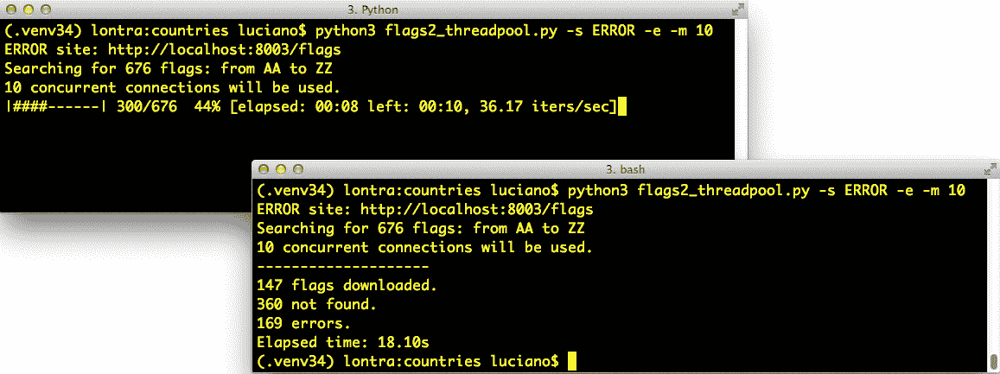

# 第二十章：并发执行器

> 抨击线程的人通常是系统程序员，他们心中有着典型应用程序员终其一生都不会遇到的用例。[...] 在 99%的用例中，应用程序员可能会遇到的情况是，生成一堆独立线程并将结果收集到队列中的简单模式就是他们需要了解的一切。
> 
> 米歇尔·西莫纳托，Python 深思者¹

本章重点介绍了封装“生成一堆独立线程并将结果收集到队列中”模式的`concurrent.futures.Executor`类，这是米歇尔·西莫纳托描述的。并发执行器使得这种模式几乎可以轻松使用，不仅适用于线程，还适用于进程——对于计算密集型任务非常有用。

在这里，我还介绍了*futures*的概念——代表操作异步执行的对象，类似于 JavaScript 的 promises。这个基本概念不仅是`concurrent.futures`的基础，也是`asyncio`包的基础，是第二十一章的主题。

# 本章亮点

我将本章从“使用 Futures 进行并发”改名为“并发执行器”，因为执行器是这里涵盖的最重要的高级特性。Futures 是低级对象，在“Futures 在哪里？”中重点介绍，但在本章的其他部分基本上是不可见的。

所有 HTTP 客户端示例现在都使用新的[*HTTPX*](https://fpy.li/httpx)库，提供同步和异步 API。

在“带有进度显示和错误处理的下载”实验的设置现在更简单了，这要归功于 Python 3.7 中添加到[`http.server`](https://fpy.li/20-2)包中的多线程服务器。以前，标准库只有单线程的`BaseHttpServer`，不适合用于并发客户端的实验，因此我不得不在本书第一版中使用外部工具。

“使用 concurrent.futures 启动进程”现在演示了执行器如何简化我们在“多核素数检查器的代码”中看到的代码。

最后，我将大部分理论内容移至新的第十九章，“Python 中的并发模型”。

# 并发网络下载

并发对于高效的网络 I/O 至关重要：应用程序不应该闲置等待远程机器，而应该在收到响应之前做其他事情。²

为了用代码演示，我编写了三个简单的程序来从网络上下载 20 个国家的国旗图片。第一个*flags.py*按顺序运行：只有在上一个图片下载并保存在本地后才请求下一个图片。另外两个脚本进行并发下载：它们几乎同时请求多个图片，并在图片到达时保存。*flags_threadpool.py*脚本使用`concurrent.futures`包，而*flags_asyncio.py*使用`asyncio`。

示例 20-1 展示了运行三个脚本三次的结果。我还在 YouTube 上发布了一个[73 秒的视频](https://fpy.li/20-3)，这样你就可以看到它们运行时 macOS Finder 窗口显示保存的标志。这些脚本正在从*fluentpython.com*下载图片，该网站位于 CDN 后面，因此在第一次运行时可能会看到较慢的结果。示例 20-1 中的结果是在多次运行后获得的，因此 CDN 缓存已经热了。

##### 示例 20-1 三个脚本 flags.py、flags_threadpool.py 和 flags_asyncio.py 的典型运行结果

```py
$ python3 flags.py
BD BR CD CN DE EG ET FR ID IN IR JP MX NG PH PK RU TR US VN # ① 20 flags downloaded in 7.26s # ② $ python3 flags.py
BD BR CD CN DE EG ET FR ID IN IR JP MX NG PH PK RU TR US VN
20 flags downloaded in 7.20s
$ python3 flags.py
BD BR CD CN DE EG ET FR ID IN IR JP MX NG PH PK RU TR US VN
20 flags downloaded in 7.09s
$ python3 flags_threadpool.py
DE BD CN JP ID EG NG BR RU CD IR MX US PH FR PK VN IN ET TR
20 flags downloaded in 1.37s # ③ $ python3 flags_threadpool.py
EG BR FR IN BD JP DE RU PK PH CD MX ID US NG TR CN VN ET IR
20 flags downloaded in 1.60s
$ python3 flags_threadpool.py
BD DE EG CN ID RU IN VN ET MX FR CD NG US JP TR PK BR IR PH
20 flags downloaded in 1.22s
$ python3 flags_asyncio.py # ④ BD BR IN ID TR DE CN US IR PK PH FR RU NG VN ET MX EG JP CD
20 flags downloaded in 1.36s
$ python3 flags_asyncio.py
RU CN BR IN FR BD TR EG VN IR PH CD ET ID NG DE JP PK MX US
20 flags downloaded in 1.27s
$ python3 flags_asyncio.py
RU IN ID DE BR VN PK MX US IR ET EG NG BD FR CN JP PH CD TR # ⑤ 20 flags downloaded in 1.42s
```

①

每次运行的输出以下载的国旗国家代码开头，并以显示经过的时间的消息结束。

②

*flags.py*下载 20 张图像平均用时 7.18 秒。

③

*flags_threadpool.py*的平均时间为 1.40 秒。

④

对于*flags_asyncio.py*，平均时间为 1.35 秒。

⑤

注意国家代码的顺序：使用并发脚本下载时，每次下载的顺序都不同。

并发脚本之间的性能差异不大，但它们都比顺序脚本快五倍以上——这仅针对下载几千字节的 20 个文件的小任务。如果将任务扩展到数百个下载，那么并发脚本可以比顺序代码快 20 倍或更多。

###### 警告

在针对公共网络服务器测试并发 HTTP 客户端时，您可能会无意中发动拒绝服务（DoS）攻击，或被怀疑这样做。在示例 20-1 的情况下，这样做是可以的，因为这些脚本是硬编码为仅发出 20 个请求。我们将在本章后面使用 Python 的`http.server`包来运行测试。

现在让我们研究示例 20-1 中测试的两个脚本的实现：*flags.py*和*flags_threadpool.py*。第三个脚本*flags_asyncio.py*将在第二十一章中介绍，但我想一起展示这三个脚本以阐明两点：

1.  无论您使用哪种并发构造——线程还是协程——如果正确编码，您将看到网络 I/O 操作的吞吐量大大提高。

1.  对于可以控制发出多少请求的 HTTP 客户端，线程和协程之间的性能差异不大。³

进入代码部分。

## 一个顺序下载脚本

示例 20-2 包含*flags.py*的实现，这是我们在示例 20-1 中运行的第一个脚本。它并不是很有趣，但我们将重用大部分代码和设置来实现并发脚本，因此它值得一提。

###### 注意

为了清晰起见，在示例 20-2 中没有错误处理。我们稍后会处理异常，但这里我想专注于代码的基本结构，以便更容易将此脚本与并发脚本进行对比。

##### 示例 20-2\. flags.py：顺序下载脚本；一些函数将被其他脚本重用

```py
import time
from pathlib import Path
from typing import Callable

import httpx  # ①

POP20_CC = ('CN IN US ID BR PK NG BD RU JP '
            'MX PH VN ET EG DE IR TR CD FR').split()  # ②

BASE_URL = 'https://www.fluentpython.com/data/flags'  # ③
DEST_DIR = Path('downloaded')                         # ④

def save_flag(img: bytes, filename: str) -> None:     # ⑤
    (DEST_DIR / filename).write_bytes(img)

def get_flag(cc: str) -> bytes:  # ⑥
    url = f'{BASE_URL}/{cc}/{cc}.gif'.lower()
    resp = httpx.get(url, timeout=6.1,       # ⑦
                     follow_redirects=True)  # ⑧
    resp.raise_for_status()  # ⑨
    return resp.content

def download_many(cc_list: list[str]) -> int:  # ⑩
    for cc in sorted(cc_list):                 ⑪
        image = get_flag(cc)
        save_flag(image, f'{cc}.gif')
        print(cc, end=' ', flush=True)         ⑫
    return len(cc_list)

def main(downloader: Callable[[list[str]], int]) -> None:  ⑬
    DEST_DIR.mkdir(exist_ok=True)                          ⑭
    t0 = time.perf_counter()                               ⑮
    count = downloader(POP20_CC)
    elapsed = time.perf_counter() - t0
    print(f'\n{count} downloads in {elapsed:.2f}s')

if __name__ == '__main__':
    main(download_many)     ⑯
```

①

导入`httpx`库。它不是标准库的一部分，因此按照惯例，导入应放在标准库模块之后并空一行。

②

ISO 3166 国家代码列表，按人口递减顺序列出前 20 个人口最多的国家。

③

存放国旗图像的目录。⁴

④

图像保存的本地目录。

⑤

将`img`字节保存到`DEST_DIR`中的`filename`。

⑥

给定一个国家代码，构建 URL 并下载图像，返回响应的二进制内容。

⑦

为网络操作添加合理的超时是个好习惯，以避免无故阻塞几分钟。

⑧

默认情况下，*HTTPX*不会遵循重定向。⁵

⑨

这个脚本中没有错误处理，但是如果 HTTP 状态不在 2XX 范围内，此方法会引发异常——强烈建议避免静默失败。

⑩

`download_many`是用于比较并发实现的关键函数。

⑪

按字母顺序循环遍历国家代码列表，以便轻松查看输出中保留了顺序；返回下载的国家代码数量。

⑫

逐个显示一个国家代码，以便我们可以看到每次下载发生时的进度。`end=' '`参数用空格字符替换了通常在每行末尾打印的换行符，因此所有国家代码都逐步显示在同一行中。需要`flush=True`参数，因为默认情况下，Python 输出是行缓冲的，这意味着 Python 仅在换行后显示打印的字符。

⑬

必须使用将进行下载的函数调用`main`；这样，我们可以在`threadpool`和`ascyncio`示例中的其他`download_many`实现中将`main`用作库函数。

⑭

如果需要，创建`DEST_DIR`；如果目录已存在，则不会引发错误。

⑮

运行`downloader`函数后记录并报告经过的时间。

⑯

使用`download_many`函数调用`main`。

###### 提示

[*HTTPX*](https://fpy.li/httpx)库受到 Pythonic [*requests*](https://fpy.li/20-5)包的启发，但建立在更现代的基础上。关键是，*HTTPX*提供同步和异步 API，因此我们可以在本章和下一章的所有 HTTP 客户端示例中使用它。Python 的标准库提供了`urllib.request`模块，但其 API 仅支持同步，并且不够用户友好。

*flags.py* 实际上没有什么新内容。它作为比较其他脚本的基准，并且我在实现它们时将其用作库，以避免冗余代码。现在让我们看看使用`concurrent.futures`重新实现的情况。

## 使用 concurrent.futures 进行下载

`concurrent.futures`包的主要特点是`ThreadPoolExecutor`和`ProcessPoolExecutor`类，它们实现了一个 API，用于在不同线程或进程中提交可调用对象进行执行。这些类透明地管理一组工作线程或进程以及队列来分发作业和收集结果。但接口非常高级，对于像我们的标志下载这样的简单用例，我们不需要了解任何这些细节。

示例 20-3 展示了实现并发下载的最简单方法，使用`ThreadPoolExecutor.map`方法。

##### 示例 20-3\. flags_threadpool.py：使用`futures.ThreadPoolExecutor`的线程下载脚本

```py
from concurrent import futures

from flags import save_flag, get_flag, main  # ①

def download_one(cc: str):  # ②
    image = get_flag(cc)
    save_flag(image, f'{cc}.gif')
    print(cc, end=' ', flush=True)
    return cc

def download_many(cc_list: list[str]) -> int:
    with futures.ThreadPoolExecutor() as executor:         # ③
        res = executor.map(download_one, sorted(cc_list))  # ④

    return len(list(res))                                  # ⑤

if __name__ == '__main__':
    main(download_many)  # ⑥
```

①

从`flags`模块中重用一些函数（示例 20-2)。

②

用于下载单个图像的函数；这是每个工作线程将执行的内容。

③

将`ThreadPoolExecutor`实例化为上下文管理器；`executor​.__exit__`方法将调用`executor.shutdown(wait=True)`，这将阻塞直到所有线程完成。

④

`map`方法类似于内置的`map`，不同之处在于`download_one`函数将并发地从多个线程调用；它返回一个生成器，您可以迭代以检索每个函数调用返回的值—在本例中，每次调用`download_one`都将返回一个国家代码。

⑤

返回获得的结果数量。如果任何线程调用引发异常，当 `list` 构造函数内部的隐式 `next()` 调用尝试从 `executor.map` 返回的迭代器中检索相应的返回值时，异常会在此处引发。

⑥

从 `flags` 模块调用 `main` 函数，传递并发版本的 `download_many`。

请注意，来自 示例 20-3 的 `download_one` 函数本质上是来自 示例 20-2 中的 `download_many` 函数中 `for` 循环的主体。这是在编写并发代码时常见的重构：将顺序 `for` 循环的主体转换为一个要并发调用的函数。

###### 提示

示例 20-3 非常简短，因为我能够重用顺序执行的 *flags.py* 脚本中的大部分函数。`concurrent.futures` 最好的特性之一是使得在传统的顺序代码之上添加并发执行变得简单。

`ThreadPoolExecutor` 构造函数接受几个未显示的参数，但第一个且最重要的是 `max_workers`，设置要执行的工作线程的最大数量。当 `max_workers` 为 `None`（默认值）时，`ThreadPoolExecutor` 使用以下表达式决定其值—自 Python 3.8 起：

```py
max_workers = min(32, os.cpu_count() + 4)
```

这个理念在 [`ThreadPoolExecutor` 文档](https://fpy.li/20-6) 中有解释：

> 这个默认值至少保留了 5 个工作线程用于 I/O 绑定任务。对于释放 GIL 的 CPU 绑定任务，它最多利用 32 个 CPU 核心。它避免在多核机器上隐式使用非常大的资源。
> 
> `ThreadPoolExecutor` 现在在启动 `max_workers` 工作线程之前重用空闲的工作线程。

总之：`max_workers` 的默认计算是合理的，`ThreadPoolExecutor` 避免不必要地启动新的工作线程。理解 `max_workers` 背后的逻辑可能会帮助您决定何时以及如何自行设置它。

这个库被称为 *concurrency.futures*，但在 示例 20-3 中看不到 futures，所以你可能会想知道它们在哪里。接下来的部分会解释。

## 未来在哪里？

Futures 是 `concurrent.futures` 和 `asyncio` 的核心组件，但作为这些库的用户，我们有时看不到它们。示例 20-3 在幕后依赖于 futures，但我编写的代码并没有直接涉及它们。本节是 futures 的概述，其中包含一个展示它们运作的示例。

自 Python 3.4 起，标准库中有两个名为 `Future` 的类：`concurrent.futures.Future` 和 `asyncio.Future`。它们的作用相同：`Future` 类的实例代表一个延迟计算，可能已经完成，也可能尚未完成。这在某种程度上类似于 Twisted 中的 `Deferred` 类、Tornado 中的 `Future` 类以及现代 JavaScript 中的 `Promise`。

Futures 封装了待处理的操作，以便我们可以将它们放入队列，检查它们是否完成，并在结果（或异常）可用时检索结果。

关于 futures 的一个重要事项是，你和我不应该创建它们：它们应该由并发框架专门实例化，无论是 `concurrent.futures` 还是 `asyncio`。原因在于：`Future` 代表着最终会运行的东西，因此必须安排其运行，这是框架的工作。特别是，`concurrent.futures.Future` 实例仅在使用 `concurrent.futures.Executor` 子类提交可调用对象以执行时才会创建。例如，`Executor.submit()` 方法接受一个可调用对象，安排其运行，并返回一个 `Future`。

应用代码不应该改变 future 的状态：当它所代表的计算完成时，并发框架会改变 future 的状态，我们无法控制何时发生这种情况。

两种类型的`Future`都有一个非阻塞的`.done()`方法，返回一个布尔值，告诉你被该`future`包装的可调用是否已执行。然而，客户端代码通常不会反复询问`future`是否完成，而是要求通知。这就是为什么两种`Future`类都有一个`.add_done_callback()`方法：你给它一个可调用对象，当`future`完成时，该可调用对象将以`future`作为唯一参数被调用。请注意，回调可调用对象将在运行包装在`future`中的函数的工作线程或进程中运行。

还有一个`.result()`方法，在`future`完成时两种类中的工作方式相同：它返回可调用对象的结果，或者在执行可调用对象时抛出的任何异常。然而，当`future`未完成时，`result`方法在两种`Future`的行为上有很大不同。在`concurrency.futures.Future`实例中，调用`f.result()`将阻塞调用者的线程，直到结果准备就绪。可以传递一个可选的`timeout`参数，如果在指定时间内`future`未完成，`result`方法将引发`TimeoutError`。`asyncio.Future.result`方法不支持超时，`await`是在`asyncio`中获取`future`结果的首选方式，但`await`不能与`concurrency.futures.Future`实例一起使用。

两个库中的几个函数返回`future`；其他函数在其实现中使用`future`的方式对用户来说是透明的。后者的一个例子是我们在示例 20-3 中看到的`Executor.map`：它返回一个迭代器，其中`__next__`调用每个`future`的`result`方法，因此我们得到`future`的结果，而不是`future`本身。

为了实际查看`future`，我们可以重写示例 20-3 以使用[`concurrent.futures.as_completed`](https://fpy.li/20-7)函数，该函数接受一个`future`的可迭代对象，并返回一个迭代器，按照完成的顺序产生`future`。

使用`futures.as_completed`仅需要更改`download_many`函数。高级`executor.map`调用被两个`for`循环替换：一个用于创建和调度`future`，另一个用于检索它们的结果。在此过程中，我们将添加一些`print`调用来显示每个`future`在完成前后的状态。示例 20-4 展示了新`download_many`函数的代码。`download_many`函数的代码从 5 行增长到 17 行，但现在我们可以检查神秘的`future`。其余函数与示例 20-3 中的相同。

##### 示例 20-4\. flags_threadpool_futures.py: 在`download_many`函数中用`executor.submit`和`futures.as_completed`替换`executor.map`。

```py
def download_many(cc_list: list[str]) -> int:
    cc_list = cc_list[:5]  # ①
    with futures.ThreadPoolExecutor(max_workers=3) as executor:  # ②
        to_do: list[futures.Future] = []
        for cc in sorted(cc_list):  # ③
            future = executor.submit(download_one, cc)  # ④
            to_do.append(future)  # ⑤
            print(f'Scheduled for {cc}: {future}')  # ⑥

        for count, future in enumerate(futures.as_completed(to_do), 1):  # ⑦
            res: str = future.result()  # ⑧
            print(f'{future} result: {res!r}')  # ⑨

    return count
```

①

为了演示，只使用人口最多的前五个国家。

②

将`max_workers`设置为`3`，这样我们可以在输出中看到待处理的`future`。

③

按字母顺序遍历国家代码，以明确结果将无序到达。

④

`executor.submit`调度可调用对象的执行，并返回代表此挂起操作的`future`。

⑤

存储每个`future`，以便稍后使用`as_completed`检索它们。

⑥

显示带有国家代码和相应`future`的消息。

⑦

`as_completed`在`future`完成时产生`future`。

⑧

获取这个`future`的结果。

⑨

显示`future`及其结果。

注意，在这个例子中，`future.result()` 调用永远不会阻塞，因为 `future` 是从 `as_completed` 中出来的。示例 20-5 展示了示例 20-4 的一次运行的输出。

##### 示例 20-5\. flags_threadpool_futures.py 的输出

```py
$ python3 flags_threadpool_futures.py
Scheduled for BR: <Future at 0x100791518 state=running> # ① Scheduled for CN: <Future at 0x100791710 state=running>
Scheduled for ID: <Future at 0x100791a90 state=running>
Scheduled for IN: <Future at 0x101807080 state=pending> # ② Scheduled for US: <Future at 0x101807128 state=pending>
CN <Future at 0x100791710 state=finished returned str> result: 'CN' # ③ BR ID <Future at 0x100791518 state=finished returned str> result: 'BR' # ④ <Future at 0x100791a90 state=finished returned str> result: 'ID'
IN <Future at 0x101807080 state=finished returned str> result: 'IN'
US <Future at 0x101807128 state=finished returned str> result: 'US'

5 downloads in 0.70s
```

①

未来按字母顺序安排；未来的 `repr()` 显示其状态：前三个是 `running`，因为有三个工作线程。

②

最后两个未来是 `pending`，等待工作线程。

③

这里的第一个 `CN` 是在工作线程中的 `download_one` 的输出；其余行是 `download_many` 的输出。

④

在主线程的 `download_many` 显示结果之前，两个线程在输出代码。

###### 提示

我建议尝试 *flags_threadpool_futures.py*。如果你多次运行它，你会看到结果的顺序变化。将 `max_workers` 增加到 `5` 将增加结果顺序的变化。将其减少到 `1` 将使此脚本按顺序运行，结果的顺序将始终是 `submit` 调用的顺序。

我们看到了两个使用 `concurrent.futures` 的下载脚本变体：一个在示例 20-3 中使用 `ThreadPoolExecutor.map`，另一个在示例 20-4 中使用 `futures.as_completed`。如果你对 *flags_asyncio.py* 的代码感兴趣，可以查看第二十一章中的示例 21-3 进行了解。

现在让我们简要看一下使用 `concurrent.futures` 绕过 GIL 处理 CPU 密集型任务的简单方法。

# 使用 `concurrent.futures` 启动进程

[`concurrent.futures` 文档页面](https://fpy.li/20-8) 的副标题是“启动并行任务”。该软件包支持在多核计算机上进行并行计算，因为它支持使用 `ProcessPool​Executor` 类在多个 Python 进程之间分发工作。

`ProcessPoolExecutor` 和 `ThreadPoolExecutor` 都实现了[`Executor`](https://fpy.li/20-9) 接口，因此使用 `concurrent.futures` 从基于线程的解决方案切换到基于进程的解决方案很容易。

对于下载标志示例或任何 I/O 密集型任务，使用 `ProcessPoolExecutor` 没有优势。很容易验证这一点；只需更改示例 20-3 中的这些行：

```py
def download_many(cc_list: list[str]) -> int:
    with futures.ThreadPoolExecutor() as executor:
```

到这里：

```py
def download_many(cc_list: list[str]) -> int:
    with futures.ProcessPoolExecutor() as executor:
```

`ProcessPoolExecutor` 的构造函数也有一个 `max_workers` 参数，默认为 `None`。在这种情况下，执行器将工作进程的数量限制为 `os.cpu_count()` 返回的数量。

进程使用更多内存，启动时间比线程长，所以 `ProcessPoolExecutor` 的真正价值在于 CPU 密集型任务。让我们回到“自制进程池”中的素数检查示例，使用 `concurrent.futures` 重新编写它。

## 多核素数检查器 Redux

在“多核素数检查器的代码”中，我们研究了 *procs.py*，一个使用 `multiprocessing` 检查一些大数的素数性质的脚本。在示例 20-6 中，我们使用 `ProcessPoolExecutor` 在 *proc_pool.py* 程序中解决了相同的问题。从第一个导入到最后的 `main()` 调用，*procs.py* 有 43 行非空代码，而 *proc_pool.py* 只有 31 行，比原来的短了 28%。

##### 示例 20-6\. proc_pool.py: *procs.py* 使用 `ProcessPoolExecutor` 重写

```py
import sys
from concurrent import futures  # ①
from time import perf_counter
from typing import NamedTuple

from primes import is_prime, NUMBERS

class PrimeResult(NamedTuple):  # ②
    n: int
    flag: bool
    elapsed: float

def check(n: int) -> PrimeResult:
    t0 = perf_counter()
    res = is_prime(n)
    return PrimeResult(n, res, perf_counter() - t0)

def main() -> None:
    if len(sys.argv) < 2:
        workers = None      # ③
    else:
        workers = int(sys.argv[1])

    executor = futures.ProcessPoolExecutor(workers)  # ④
    actual_workers = executor._max_workers  # type: ignore # ⑤

    print(f'Checking {len(NUMBERS)} numbers with {actual_workers} processes:')

    t0 = perf_counter()

    numbers = sorted(NUMBERS, reverse=True)  # ⑥
    with executor:  # ⑦
        for n, prime, elapsed in executor.map(check, numbers):  # ⑧
            label = 'P' if prime else ' '
            print(f'{n:16}  {label} {elapsed:9.6f}s')

    time = perf_counter() - t0
    print(f'Total time: {time:.2f}s')

if __name__ == '__main__':
    main()
```

①

不需要导入 `multiprocessing`、`SimpleQueue` 等；`concurrent.futures` 隐藏了所有这些。

②

`PrimeResult`元组和`check`函数与*procs.py*中看到的相同，但我们不再需要队列和`worker`函数。

③

如果没有给出命令行参数，我们不再决定使用多少工作进程，而是将`workers`设置为`None`，让`ProcessPoolExecutor`自行决定。

④

在➐中我在`with`块之前构建了`ProcessPoolExecutor`，这样我就可以在下一行显示实际的工作进程数。

⑤

`_max_workers`是`ProcessPoolExecutor`的一个未记录的实例属性。我决定使用它来显示`workers`变量为`None`时的工作进程数。*Mypy*在我访问它时正确地抱怨，所以我放了`type: ignore`注释来消除警告。

⑥

将要检查的数字按降序排序。这将揭示*proc_pool.py*与*procs.py*在行为上的差异。请参见本示例后的解释。

⑦

使用`executor`作为上下文管理器。

⑧

`executor.map`调用返回由`check`返回的`PrimeResult`实例，顺序与`numbers`参数相同。

如果你运行示例 20-6，你会看到结果严格按降序出现，就像示例 20-7 中所示。相比之下，*procs.py*的输出顺序（在“基于进程的解决方案”中显示）受到检查每个数字是否为质数的难度的影响。例如，*procs.py*在顶部显示了 7777777777777777 的结果，因为它有一个较低的除数 7，所以`is_prime`很快确定它不是质数。

相比之下，7777777536340681 是 88191709²，因此`is_prime`将花费更长的时间来确定它是一个合数，甚至更长的时间来找出 7777777777777753 是质数—因此这两个数字都出现在*procs.py*输出的末尾。

运行*proc_pool.py*，你会观察到结果严格按降序排列，但在显示 9999999999999999 的结果后，程序似乎会卡住。

##### 示例 20-7\. proc_pool.py 的输出

```py
$ ./proc_pool.py
Checking 20 numbers with 12 processes:
9999999999999999     0.000024s # ① 9999999999999917  P  9.500677s # ② 7777777777777777     0.000022s # ③ 7777777777777753  P  8.976933s
7777777536340681     8.896149s
6666667141414921     8.537621s
6666666666666719  P  8.548641s
6666666666666666     0.000002s
5555555555555555     0.000017s
5555555555555503  P  8.214086s
5555553133149889     8.067247s
4444444488888889     7.546234s
4444444444444444     0.000002s
4444444444444423  P  7.622370s
3333335652092209     6.724649s
3333333333333333     0.000018s
3333333333333301  P  6.655039s
 299593572317531  P  2.072723s
 142702110479723  P  1.461840s
               2  P  0.000001s
Total time: 9.65s
```

①

这行出现得非常快。

②

这行需要超过 9.5 秒才能显示出来。

③

所有剩下的行几乎立即出现。

这就是*proc_pool.py*表现出这种方式的原因：

+   如前所述，`executor.map(check, numbers)`返回的结果与给定的`numbers`顺序相同。

+   默认情况下，*proc_pool.py*使用与 CPU 数量相同的工作进程数——当`max_workers`为`None`时，这就是`ProcessPoolExecutor`的做法。在这台笔记本电脑上是 12 个进程。

+   因为我们按降序提交`numbers`，第一个是 9999999999999999；以 9 为除数，它会迅速返回。

+   第二个数字是 9999999999999917，样本中最大的质数。这将比所有其他数字检查花费更长的时间。

+   与此同时，其余的 11 个进程将检查其他数字，这些数字要么是质数，要么是具有大因子的合数，要么是具有非常小因子的合数。

+   当负责 9999999999999917 的工作进程最终确定那是一个质数时，所有其他进程已经完成了最后的工作，因此结果会立即显示出来。

###### 注意

尽管*proc_pool.py*的进度不像*procs.py*那样明显，但对于相同数量的工作进程和 CPU 核心，总体执行时间几乎与图 19-2 中描述的相同。

理解并发程序的行为并不直接，因此这里有第二个实验，可以帮助你可视化`Executor.map`的操作。

# 试验`Executor.map`

让我们来研究`Executor.map`，现在使用一个具有三个工作线程的`ThreadPoolExecutor`运行五个可调用函数，输出带时间戳的消息。代码在示例 20-8 中，输出在示例 20-9 中。

##### 示例 20-8。demo_executor_map.py：`ThreadPoolExecutor`的`map`方法的简单演示。

```py
from time import sleep, strftime
from concurrent import futures

def display(*args):  # ①
    print(strftime('[%H:%M:%S]'), end=' ')
    print(*args)

def loiter(n):  # ②
    msg = '{}loiter({}): doing nothing for {}s...'
    display(msg.format('\t'*n, n, n))
    sleep(n)
    msg = '{}loiter({}): done.'
    display(msg.format('\t'*n, n))
    return n * 10  # ③

def main():
    display('Script starting.')
    executor = futures.ThreadPoolExecutor(max_workers=3)  # ④
    results = executor.map(loiter, range(5))  # ⑤
    display('results:', results)  # ⑥
    display('Waiting for individual results:')
    for i, result in enumerate(results):  # ⑦
        display(f'result {i}: {result}')

if __name__ == '__main__':
    main()
```

①

这个函数简单地打印出它收到的任何参数，前面加上格式为`[HH:MM:SS]`的时间戳。

②

`loiter`除了在开始时显示消息、休眠`n`秒，然后在结束时显示消息外什么也不做；制表符用于根据`n`的值缩进消息。

③

`loiter`返回`n * 10`，因此我们可以看到如何收集结果。

④

创建一个具有三个线程的`ThreadPoolExecutor`。

⑤

向`executor`提交五个任务。由于只有三个线程，因此只有其中三个任务会立即启动：调用`loiter(0)`、`loiter(1)`和`loiter(2)`；这是一个非阻塞调用。

⑥

立即显示调用`executor.map`的`results`：它是一个生成器，正如示例 20-9 中的输出所示。

⑦

`for`循环中的`enumerate`调用将隐式调用`next(results)`，这将进而在（内部的）代表第一个调用`loiter(0)`的`_f` future 上调用`_f.result()`。`result`方法将阻塞直到 future 完成，因此此循环中的每次迭代都必须等待下一个结果准备就绪。

鼓励你运行示例 20-8，看到显示逐步更新。在此过程中，尝试调整`ThreadPoolExecutor`的`max_workers`参数以及产生`executor.map`调用参数的`range`函数，或者用手动选择的值列表替换它以创建不同的延迟。

示例 20-9 展示了示例 20-8 的一个运行示例。

##### 示例 20-9。来自示例 20-8 的 demo_executor_map.py 的示例运行。

```py
$ python3 demo_executor_map.py
[15:56:50] Script starting. # ① [15:56:50] loiter(0): doing nothing for 0s... # ② [15:56:50] loiter(0): done.
[15:56:50]      loiter(1): doing nothing for 1s... # ③ [15:56:50]              loiter(2): doing nothing for 2s...
[15:56:50] results: <generator object result_iterator at 0x106517168> # ④ [15:56:50]                      loiter(3): doing nothing for 3s... # ⑤ [15:56:50] Waiting for individual results:
[15:56:50] result 0: 0 # ⑥ [15:56:51]      loiter(1): done. # ⑦ [15:56:51]                              loiter(4): doing nothing for 4s...
[15:56:51] result 1: 10 # ⑧ [15:56:52]              loiter(2): done. # ⑨ [15:56:52] result 2: 20
[15:56:53]                      loiter(3): done.
[15:56:53] result 3: 30
[15:56:55]                              loiter(4): done. # ⑩ [15:56:55] result 4: 40
```

①

此运行开始于 15:56:50。

②

第一个线程执行`loiter(0)`，因此它将休眠 0 秒并在第二个线程有机会启动之前返回，但结果可能有所不同。⁶

③

`loiter(1)`和`loiter(2)`立即启动（因为线程池有三个工作线程，可以同时运行三个函数）。

④

这表明`executor.map`返回的`results`是一个生成器；到目前为止，无论任务数量和`max_workers`设置如何，都不会阻塞。

⑤

因为`loiter(0)`已经完成，第一个工作线程现在可以开始第四个线程执行`loiter(3)`。

⑥

这是执行可能会阻塞的地方，取决于给`loiter`调用的参数：`results`生成器的`__next__`方法必须等待第一个 future 完成。在这种情况下，它不会阻塞，因为对`loiter(0)`的调用在此循环开始之前已经完成。请注意，到目前为止，所有操作都发生在同一秒内：15:56:50。

⑦

一秒钟后，`loiter(1)`完成，在 15:56:51。线程被释放以启动`loiter(4)`。

⑧

`loiter(1)`的结果显示为：`10`。现在`for`循环将阻塞等待`loiter(2)`的结果。

⑨

模式重复：`loiter(2)`完成，显示其结果；`loiter(3)`也是如此。

⑩

直到`loiter(4)`完成前有 2 秒的延迟，因为它在 15:56:51 开始，并且 4 秒内什么也没做。

`Executor.map`函数易于使用，但通常最好在准备就绪时获取结果，而不考虑提交的顺序。为此，我们需要`Executor.submit`方法和`futures.as_completed`函数的组合，正如我们在 Example 20-4 中看到的那样。我们将在“使用 futures.as_completed”中回到这种技术。

###### 提示

`executor.submit`和`futures.as_completed`的组合比`executor.map`更灵活，因为您可以`submit`不同的可调用函数和参数，而`executor.map`设计为在不同的参数上运行相同的可调用函数。此外，您传递给`futures.as_completed`的 future 集合可能来自多个执行器——也许一些是由`ThreadPoolExecutor`实例创建的，而其他一些来自`ProcessPoolExecutor`。

在下一节中，我们将使用新要求恢复标志下载示例，这将迫使我们迭代`futures.as_completed`的结果，而不是使用`executor.map`。

# 带有进度显示和错误处理的下载

如前所述，“并发 Web 下载”中的脚本没有错误处理，以使其更易于阅读，并对比三种方法的结构：顺序，线程和异步。

为了测试处理各种错误条件，我创建了`flags2`示例：

flags2_common.py

该模块包含所有`flags2`示例中使用的常见函数和设置，包括一个`main`函数，负责命令行解析，计时和报告结果。这实际上是支持代码，与本章主题无直接关系，因此我不会在这里列出源代码，但您可以在[*fluentpython/example-code-2e*](https://fpy.li/code)存储库中阅读：[*20-executors/getflags/flags2_common.py*](https://fpy.li/20-10)。

flags2_sequential.py

具有适当错误处理和进度条显示的顺序 HTTP 客户端。其`download_one`函数也被`flags2_threadpool.py`使用。

flags2_threadpool.py

基于`futures.ThreadPoolExecutor`的并发 HTTP 客户端，用于演示错误处理和进度条的集成。

flags2_asyncio.py

与上一个示例具有相同功能，但使用`asyncio`和`httpx`实现。这将在“增强 asyncio 下载器”中介绍，在第二十一章中。

# 在测试并发客户端时要小心

在公共 Web 服务器上测试并发 HTTP 客户端时，您可能每秒生成许多请求，这就是拒绝服务（DoS）攻击的方式。在命中公共服务器时，请谨慎限制您的客户端。对于测试，请设置本地 HTTP 服务器。有关说明，请参阅“设置测试服务器”。

`flags2`示例最显著的特点是它们具有一个使用[*tqdm*包](https://fpy.li/20-11)实现的动画文本模式进度条。我在 YouTube 上发布了一个[108 秒的视频](https://fpy.li/20-12)来展示进度条，并对比三个`flags2`脚本的速度。在视频中，我从顺序下载开始，但在 32 秒后中断了，因为要花费超过 5 分钟才能访问 676 个 URL 并获取 194 个标志。然后我分别运行了线程和`asyncio`脚本三次，每次都在 6 秒内完成任务（即，速度超过 60 倍）。图 20-1 显示了两个屏幕截图：运行*flags2_threadpool.py*时和脚本完成后。



###### 图 20-1。左上角：flags2_threadpool.py 运行时由 tqdm 生成的实时进度条；右下角：脚本完成后相同的终端窗口。

最简单的*tqdm*示例出现在项目的[*README.md*](https://fpy.li/20-13)中的动画*.gif*中。如果在安装了*tqdm*包后在 Python 控制台中输入以下代码，您将看到一个动画进度条，其中的注释是：

```py
>>> import time
>>> from tqdm import tqdm
>>> for i in tqdm(range(1000)):
...     time.sleep(.01)
...
>>> # -> progress bar will appear here <-
```

除了整洁的效果外，`tqdm`函数在概念上也很有趣：它消耗任何可迭代对象，并生成一个迭代器，当它被消耗时，显示进度条并估计完成所有迭代所需的剩余时间。为了计算这个估计值，`tqdm`需要获得一个具有`len`的可迭代对象，或者另外接收期望的项目数量作为`total=`参数。将`tqdm`与我们的`flags2`示例集成提供了一个机会，深入了解并发脚本的实际工作原理，强制我们使用[`futures.as_completed`](https://fpy.li/20-7)和[`asyncio.as_completed`](https://fpy.li/20-15)函数，以便`tqdm`可以在每个未来完成时显示进度。

`flags2`示例的另一个特点是命令行界面。所有三个脚本都接受相同的选项，您可以通过在任何脚本中使用`-h`选项来查看它们。示例 20-10 显示了帮助文本。

##### 示例 20-10。flags2 系列脚本的帮助界面

```py
$ python3 flags2_threadpool.py -h
usage: flags2_threadpool.py [-h] [-a] [-e] [-l N] [-m CONCURRENT] [-s LABEL]
                            [-v]
                            [CC [CC ...]]

Download flags for country codes. Default: top 20 countries by population.

positional arguments:
  CC                    country code or 1st letter (eg. B for BA...BZ)

optional arguments:
  -h, --help            show this help message and exit
  -a, --all             get all available flags (AD to ZW)
  -e, --every           get flags for every possible code (AA...ZZ)
  -l N, --limit N       limit to N first codes
  -m CONCURRENT, --max_req CONCURRENT
                        maximum concurrent requests (default=30)
  -s LABEL, --server LABEL
                        Server to hit; one of DELAY, ERROR, LOCAL, REMOTE
                        (default=LOCAL)
  -v, --verbose         output detailed progress info
```

所有参数都是可选的。但`-s/--server`对于测试是必不可少的：它让您选择在测试中使用哪个 HTTP 服务器和端口。传递这些不区分大小写的标签之一，以确定脚本将在哪里查找标志：

`本地`

使用`http://localhost:8000/flags`；这是默认设置。您应该配置一个本地 HTTP 服务器以在端口 8000 回答。查看以下说明。

`远程`

使用`http://fluentpython.com/data/flags`；这是我拥有的一个公共网站，托管在共享服务器上。请不要对其进行过多的并发请求。*fluentpython.com*域名由[Cloudflare](https://fpy.li/20-16) CDN（内容交付网络）处理，因此您可能会注意到初始下载速度较慢，但当 CDN 缓存热身时速度会加快。

`延迟`

使用`http://localhost:8001/flags`；一个延迟 HTTP 响应的服务器应该监听端口 8001。我编写了*slow_server.py*来使实验更加容易。您可以在[*Fluent Python*代码库](https://fpy.li/code)的*20-futures/getflags/*目录中找到它。查看以下说明。

`错误`

使用`http://localhost:8002/flags`；一个返回一些 HTTP 错误的服务器应该监听端口 8002。接下来是说明。

# 设置测试服务器

如果您没有用于测试的本地 HTTP 服务器，我在[*fluentpython/example-code-2e*](https://fpy.li/code)代码库的[*20-executors/getflags/README.adoc*](https://fpy.li/20-17)中使用仅 Python ≥ 3.9（无外部库）编写了设置说明。简而言之，*README.adoc*描述了如何使用：

`python3 -m http.server`

`本地`服务器端口 8000

`python3 slow_server.py`

在端口 8001 上的`DELAY`服务器，在每个响应之前增加随机延迟 0.5 秒至 5 秒

`python3 slow_server.py 8002 --error-rate .25`

在端口 8002 上的`ERROR`服务器，除了随机延迟外，还有 25%的几率返回[“418 我是一个茶壶”](https://fpy.li/20-18)错误响应

默认情况下，每个*flags2*.py*脚本将使用默认的并发连接数从`LOCAL`服务器（`http://localhost:8000/flags`）获取人口最多的 20 个国家的标志，这在脚本之间有所不同。示例 20-11 展示了使用所有默认值运行*flags2_sequential.py*脚本的示例。要运行它，您需要一个本地服务器，如“测试并发客户端时要小心”中所解释的那样。

##### 示例 20-11\. 使用所有默认值运行 flags2_sequential.py：`LOCAL 站点`，前 20 个标志，1 个并发连接

```py
$ python3 flags2_sequential.py
LOCAL site: http://localhost:8000/flags
Searching for 20 flags: from BD to VN
1 concurrent connection will be used.
--------------------
20 flags downloaded.
Elapsed time: 0.10s
```

您可以通过多种方式选择要下载的标志。示例 20-12 展示了如何下载所有以字母 A、B 或 C 开头的国家代码的标志。

##### 示例 20-12\. 运行 flags2_threadpool.py 从`DELAY`服务器获取所有以 A、B 或 C 开头的国家代码前缀的标志

```py
$ python3 flags2_threadpool.py -s DELAY a b c
DELAY site: http://localhost:8001/flags
Searching for 78 flags: from AA to CZ
30 concurrent connections will be used.
--------------------
43 flags downloaded.
35 not found.
Elapsed time: 1.72s
```

无论如何选择国家代码，要获取的标志数量都可以通过`-l/--limit`选项限制。示例 20-13 演示了如何运行确切的 100 个请求，结合`-a`选项获取所有标志和`-l 100`。

##### 示例 20-13\. 运行 flags2_asyncio.py 从`ERROR`服务器获取 100 个标志（`-al 100`），使用 100 个并发请求（`-m 100`）

```py
$ python3 flags2_asyncio.py -s ERROR -al 100 -m 100
ERROR site: http://localhost:8002/flags
Searching for 100 flags: from AD to LK
100 concurrent connections will be used.
--------------------
73 flags downloaded.
27 errors.
Elapsed time: 0.64s
```

这是`flags2`示例的用户界面。让我们看看它们是如何实现的。

## flags2 示例中的错误处理

处理 flags2 示例中所有三个示例中 HTTP 错误的常见策略是，404 错误（未找到）由负责下载单个文件的函数（`download_one`）处理。任何其他异常都会传播以由`download_many`函数或`supervisor`协程处理—在`asyncio`示例中。

再次，我们将从研究顺序代码开始，这样更容易跟踪—并且大部分被线程池脚本重用。示例 20-14 展示了在*flags2_sequential.py*和*flags2_threadpool.py*脚本中执行实际下载的函数。

##### 示例 20-14\. flags2_sequential.py：负责下载的基本函数；两者在 flags2_threadpool.py 中都被重用

```py
from collections import Counter
from http import HTTPStatus

import httpx
import tqdm  # type: ignore # ①

from flags2_common import main, save_flag, DownloadStatus  # ②

DEFAULT_CONCUR_REQ = 1
MAX_CONCUR_REQ = 1

def get_flag(base_url: str, cc: str) -> bytes:
    url = f'{base_url}/{cc}/{cc}.gif'.lower()
    resp = httpx.get(url, timeout=3.1, follow_redirects=True)
    resp.raise_for_status()  # ③
    return resp.content

def download_one(cc: str, base_url: str, verbose: bool = False) -> DownloadStatus:
    try:
        image = get_flag(base_url, cc)
    except httpx.HTTPStatusError as exc:  # ④
        res = exc.response
        if res.status_code == HTTPStatus.NOT_FOUND:
            status = DownloadStatus.NOT_FOUND  # ⑤
            msg = f'not found: {res.url}'
        else:
            raise  # ⑥
    else:
        save_flag(image, f'{cc}.gif')
        status = DownloadStatus.OK
        msg = 'OK'

    if verbose:  # ⑦
        print(cc, msg)

    return status
```

①

导入`tqdm`进度条显示库，并告诉 Mypy 跳过检查它。⁷

②

从`flags2_common`模块导入一对函数和一个`Enum`。

③

如果 HTTP 状态码不在`range(200, 300)`中，则引发`HTTPStetusError`。

④

`download_one`捕获`HTTPStatusError`以处理特定的 HTTP 代码 404…

⑤

通过将其本地`status`设置为`DownloadStatus.NOT_FOUND`来处理; `DownloadStatus`是从*flags2_common.py*导入的`Enum`。

⑥

其他任何`HTTPStatusError`异常都会重新引发以传播给调用者。

⑦

如果设置了`-v/--verbose`命令行选项，则显示国家代码和状态消息；这是您在详细模式下看到进度的方式。

示例 20-15 列出了`download_many`函数的顺序版本。这段代码很简单，但值得研究，以与即将出现的并发版本进行对比。关注它如何报告进度，处理错误和统计下载量。

##### 示例 20-15\. flags2_sequential.py：`download_many`的顺序实现

```py
def download_many(cc_list: list[str],
                  base_url: str,
                  verbose: bool,
                  _unused_concur_req: int) -> Counter[DownloadStatus]:
    counter: Counter[DownloadStatus] = Counter()  # ①
    cc_iter = sorted(cc_list)  # ②
    if not verbose:
        cc_iter = tqdm.tqdm(cc_iter)  # ③
    for cc in cc_iter:
        try:
            status = download_one(cc, base_url, verbose)  # ④
        except httpx.HTTPStatusError as exc:  # ⑤
            error_msg = 'HTTP error {resp.status_code} - {resp.reason_phrase}'
            error_msg = error_msg.format(resp=exc.response)
        except httpx.RequestError as exc:  # ⑥
            error_msg = f'{exc} {type(exc)}'.strip()
        except KeyboardInterrupt:  # ⑦
            break
        else:  # ⑧
            error_msg = ''

        if error_msg:
            status = DownloadStatus.ERROR  # ⑨
        counter[status] += 1           # ⑩
        if verbose and error_msg:      ⑪
            print(f'{cc} error: {error_msg}')

    return counter  ⑫
```

①

这个`Counter`将统计不同的下载结果：`DownloadStatus.OK`、`DownloadStatus.NOT_FOUND`或`DownloadStatus.ERROR`。

②

`cc_iter`保存按字母顺序排列的国家代码列表。

③

如果不在详细模式下运行，将`cc_iter`传递给`tqdm`，它会返回一个迭代器，该迭代器会产生`cc_iter`中的项目，并同时显示进度条。

④

连续调用`download_one`。

⑤

由`get_flag`引发的 HTTP 状态码异常，且未被`download_one`处理的异常在此处理。

⑥

其他与网络相关的异常在此处理。任何其他异常都会中止脚本，因为调用`download_many`的`flags2_common.main`函数没有`try/except`。

⑦

如果用户按下 Ctrl-C，则退出循环。

⑧

如果`download_one`没有发生异常，清除错误消息。

⑨

如果发生错误，相应地设置本地`status`。

⑩

为该`status`增加计数。

⑪

在详细模式下，显示当前国家代码的错误消息（如果有）。

⑫

返回`counter`，以便`main`函数可以在最终报告中显示数字。

我们现在将学习重构后的线程池示例，*flags2_threadpool.py*。

## 使用`futures.as_completed`

为了集成*tqdm*进度条并处理每个请求的错误，*flags2_threadpool.py*脚本使用了`futures.ThreadPoolExecutor`和我们已经见过的`futures.as_completed`函数。示例 20-16 是*flags2_threadpool.py*的完整代码清单。只实现了`download_many`函数；其他函数是从*flags2_common.py*和*flags2_sequential.py*中重用的。

##### 示例 20-16\. flags2_threadpool.py：完整代码清单

```py
from collections import Counter
from concurrent.futures import ThreadPoolExecutor, as_completed

import httpx
import tqdm  # type: ignore

from flags2_common import main, DownloadStatus
from flags2_sequential import download_one  # ①

DEFAULT_CONCUR_REQ = 30  # ②
MAX_CONCUR_REQ = 1000  # ③

def download_many(cc_list: list[str],
                  base_url: str,
                  verbose: bool,
                  concur_req: int) -> Counter[DownloadStatus]:
    counter: Counter[DownloadStatus] = Counter()
    with ThreadPoolExecutor(max_workers=concur_req) as executor:  # ④
        to_do_map = {}  # ⑤
        for cc in sorted(cc_list):  # ⑥
            future = executor.submit(download_one, cc,
                                     base_url, verbose)  # ⑦
            to_do_map[future] = cc  # ⑧
        done_iter = as_completed(to_do_map)  # ⑨
        if not verbose:
            done_iter = tqdm.tqdm(done_iter, total=len(cc_list))  # ⑩
        for future in done_iter:  ⑪
            try:
                status = future.result()  ⑫
            except httpx.HTTPStatusError as exc:  ⑬
                error_msg = 'HTTP error {resp.status_code} - {resp.reason_phrase}'
                error_msg = error_msg.format(resp=exc.response)
            except httpx.RequestError as exc:
                error_msg = f'{exc} {type(exc)}'.strip()
            except KeyboardInterrupt:
                break
            else:
                error_msg = ''

            if error_msg:
                status = DownloadStatus.ERROR
            counter[status] += 1
            if verbose and error_msg:
                cc = to_do_map[future]  ⑭
                print(f'{cc} error: {error_msg}')

    return counter

if __name__ == '__main__':
    main(download_many, DEFAULT_CONCUR_REQ, MAX_CONCUR_REQ)
```

①

从`flags2_sequential`中重用`download_one`（示例 20-14）。

②

如果没有给出`-m/--max_req`命令行选项，这将是最大并发请求的数量，实现为线程池的大小；如果要下载的标志数量较少，实际数量可能会更小。

③

`MAX_CONCUR_REQ`限制了最大并发请求的数量，不管要下载的标志数量或`-m/--max_req`命令行选项的值如何。这是为了避免启动过多线程带来的显著内存开销的安全预防措施。

④

使用`max_workers`设置为由`main`函数计算的`concur_req`创建`executor`，`concur_req`是以下两者中较小的一个：`MAX_CONCUR_REQ`、`cc_list`的长度，或者`-m/--max_req`命令行选项的值。这样可以避免创建过多的线程。

⑤

这个`dict`将把每个代表一个下载的`Future`实例与相应的国家代码进行映射，以便进行错误报告。

⑥

按字母顺序遍历国家代码列表。结果的顺序将取决于 HTTP 响应的时间，但如果线程池的大小（由`concur_req`给出）远小于`len(cc_list)`，您可能会注意到按字母顺序批量下载。

⑦

每次调用 `executor.submit` 都会安排一个可调用函数的执行，并返回一个 `Future` 实例。第一个参数是可调用函数，其余参数是它将接收的参数。

⑧

将 `future` 和国家代码存储在 `dict` 中。

⑨

`futures.as_completed` 返回一个迭代器，每当任务完成时就会产生一个 future。

⑩

如果不处于详细模式，将 `as_completed` 的结果用 `tqdm` 函数包装起来以显示进度条；因为 `done_iter` 没有 `len`，我们必须告诉 `tqdm` 预期的项目数量是多少，作为 `total=` 参数，这样 `tqdm` 就可以估计剩余的工作量。

⑪

遍历已完成的 futures。

⑫

在 future 上调用 `result` 方法会返回可调用函数的返回值，或者在执行可调用函数时捕获的任何异常。这个方法可能会阻塞等待解决，但在这个例子中不会，因为 `as_completed` 只返回已完成的 future。

⑬

处理潜在的异常；这个函数的其余部分与示例 20-15)中的顺序 `download_many` 相同，除了下一个 callout。

⑭

为了提供错误消息的上下文，使用当前的 `future` 作为键从 `to_do_map` 中检索国家代码。这在顺序版本中是不必要的，因为我们是在国家代码列表上进行迭代，所以我们知道当前的 `cc`；而在这里我们是在 futures 上进行迭代。

###### 提示

示例 20-16 使用了一个在 `futures.as_completed` 中非常有用的习语：构建一个 `dict` 来将每个 future 映射到在 future 完成时可能有用的其他数据。这里的 `to_do_map` 将每个 future 映射到分配给它的国家代码。这使得很容易对 futures 的结果进行后续处理，尽管它们是无序生成的。

Python 线程非常适合 I/O 密集型应用程序，而 `concurrent.futures` 包使得在某些用例中相对简单地使用它变得可能。通过 `ProcessPoolExecutor`，您还可以在多个核心上解决 CPU 密集型问题——如果计算是[“尴尬地并行”](https://fpy.li/20-19)的话。这结束了我们对 `concurrent.futures` 的基本介绍。

# 章节总结

我们通过比较两个并发的 HTTP 客户端和一个顺序的客户端来开始本章，演示了并发解决方案相对于顺序脚本显示出的显著性能提升。

在学习基于 `concurrent.futures` 的第一个例子之后，我们更仔细地研究了 future 对象，无论是 `concurrent.futures.Future` 的实例还是 `asyncio.Future`，强调了这些类有什么共同之处（它们的差异将在第二十一章中强调）。我们看到如何通过调用 `Executor.submit` 创建 futures，并使用 `concurrent.futures.as_completed` 迭代已完成的 futures。

然后，我们讨论了如何使用 `concurrent.futures.ProcessPoolExecutor` 类与多个进程一起工作，绕过 GIL 并使用多个 CPU 核心来简化我们在第十九章中首次看到的多核素数检查器。

在接下来的部分中，我们看到了 `concurrent.futures.ThreadPoolExecutor` 如何通过一个示教性的例子工作，启动了几个任务，这些任务只是等待几秒钟，除了显示它们的状态和时间戳。

接下来我们回到了下载标志的示例。通过增加进度条和适当的错误处理来增强它们，促使进一步探索`future.as_completed`生成器函数，展示了一个常见模式：在提交时将 futures 存储在`dict`中以将进一步信息链接到它们，这样我们可以在 future 从`as_completed`迭代器中出来时使用该信息。

# 进一步阅读

`concurrent.futures`包是由 Brian Quinlan 贡献的，他在 PyCon Australia 2010 年的一次名为[“未来即将到来！”](https://fpy.li/20-20)的精彩演讲中介绍了它。Quinlan 的演讲没有幻灯片；他通过在 Python 控制台中直接输入代码来展示库的功能。作为一个激励性的例子，演示中展示了一个短视频，其中 XKCD 漫画家/程序员 Randall Munroe 无意中对 Google 地图发起了 DoS 攻击，以构建他所在城市周围的驾驶时间彩色地图。该库的正式介绍是[PEP 3148 - `futures` - 异步执行计算](https://fpy.li/pep3148)。在 PEP 中，Quinlan 写道，`concurrent.futures`库“受到了 Java`java.util.concurrent`包的重大影响。”

有关`concurrent.futures`的其他资源，请参阅第十九章。所有涵盖 Python 的`threading`和`multiprocessing`的参考资料也包括“使用线程和进程进行并发处理”。

¹ 来自 Michele Simionato 的帖子[“Python 中的线程、进程和并发性：一些思考”](https://fpy.li/20-1)，总结为“消除多核（非）革命周围的炒作以及关于线程和其他形式并发性的一些（希望是）明智的评论。”

² 特别是如果您的云服务提供商按秒租用机器，而不管 CPU 有多忙。

³ 对于可能受到许多客户端攻击的服务器，有一个区别：协程比线程更具扩展性，因为它们使用的内存比线程少得多，并且还减少了上下文切换的成本，我在“基于线程的非解决方案”中提到过。

⁴ 这些图片最初来自[CIA 世界概况](https://fpy.li/20-4)，这是一份公共领域的美国政府出版物。我将它们复制到我的网站上，以避免对*cia.gov*发起 DOS 攻击的风险。

⁵ 设置`follow_redirects=True`对于这个示例并不需要，但我想强调*HTTPX*和*requests*之间的这个重要区别。此外，在这个示例中设置`follow_redirects=True`给了我将来在其他地方托管图像文件的灵活性。我认为*HTTPX*默认设置为`follow_redirects=False`是明智的，因为意外的重定向可能掩盖不必要的请求并复杂化错误诊断。

⁶ 你的体验可能有所不同：使用线程，你永远不知道几乎同时发生的事件的确切顺序；在另一台机器上，可能会看到`loiter(1)`在`loiter(0)`完成之前开始，特别是因为`sleep`总是释放 GIL，所以即使你睡眠 0 秒，Python 也可能切换到另一个线程。

⁷ 截至 2021 年 9 月，当前版本的`tdqm`中没有类型提示。没关系。世界不会因此而终结。感谢 Guido 提供可选类型提示！

⁸ 来自 PyCon 2009 年演示的[“关于协程和并发性的一门好奇课程”](https://fpy.li/20-21)教程的幻灯片＃9。
