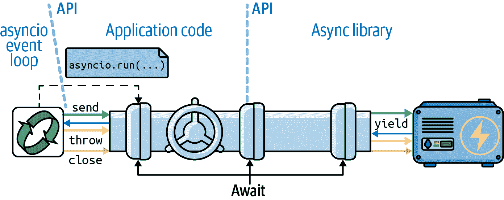
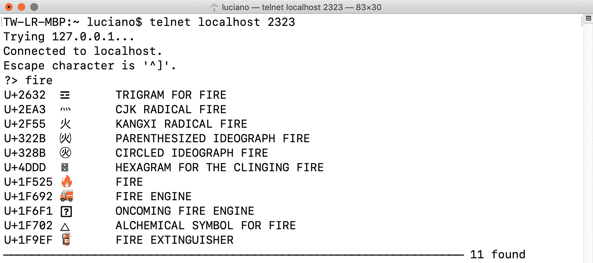

# 第二十一章：异步编程

> 异步编程的常规方法的问题在于它们是全有或全无的命题。你要么重写所有代码以便没有阻塞，要么你只是在浪费时间。
> 
> Alvaro Videla 和 Jason J. W. Williams，《RabbitMQ 实战》¹

本章涉及三个密切相关的主题：

+   Python 的`async def`，`await`，`async with`和`async for`构造

+   支持这些构造的对象：原生协程和异步上下文管理器、可迭代对象、生成器和推导式的异步变体

+   *asyncio*和其他异步库

本章建立在可迭代对象和生成器的思想上（第十七章，特别是“经典协程”），上下文管理器（第十八章），以及并发编程的一般概念（第十九章）。

我们将研究类似于我们在第二十章中看到的并发 HTTP 客户端，使用原生协程和异步上下文管理器进行重写，使用与之前相同的*HTTPX*库，但现在通过其异步 API。我们还将看到如何通过将慢速操作委托给线程或进程执行器来避免阻塞事件循环。

在 HTTP 客户端示例之后，我们将看到两个简单的异步服务器端应用程序，其中一个使用越来越受欢迎的*FastAPI*框架。然后我们将介绍由`async/await`关键字启用的其他语言构造：异步生成器函数，异步推导式和异步生成器表达式。为了强调这些语言特性与*asyncio*无关的事实，我们将看到一个示例被重写以使用*Curio*——由 David Beazley 发明的优雅而创新的异步框架。

最后，我写了一个简短的部分来总结异步编程的优势和陷阱。

这是很多内容要涵盖的。我们只有空间来展示基本示例，但它们将说明每个想法的最重要特点。

###### 提示

[*asyncio*文档](https://fpy.li/21-1)在 Yury Selivanov²重新组织后要好得多，将对应用程序开发者有用的少数函数与用于创建诸如 Web 框架和数据库驱动程序的低级 API 分开。

对于*asyncio*的书籍长度覆盖，我推荐 Caleb Hattingh（O’Reilly）的[*在 Python 中使用 Asyncio*](https://fpy.li/hattingh)。完全透明：Caleb 是本书的技术审阅者之一。

# 本章的新内容

当我写第一版*流畅的 Python*时，*asyncio*库是临时的，`async/await`关键字不存在。因此，我不得不更新本章中的所有示例。我还创建了新的示例：域探测脚本，*FastAPI*网络服务以及与 Python 的新异步控制台模式的实验。

新的章节涵盖了当时不存在的语言特性，如原生协程、`async with`、`async for`以及支持这些构造的对象。

“异步工作原理及其不足之处”中的思想反映了我认为对于任何使用异步编程的人来说都是必读的艰辛经验。它们可能会为你节省很多麻烦——无论你是使用 Python 还是 Node.js。

最后，我删除了关于`asyncio.Futures`的几段内容，这现在被认为是低级*asyncio*API 的一部分。

# 一些定义

在“经典协程”的开头，我们看到 Python 3.5 及更高版本提供了三种协程类型：

原生协程

使用`async def`定义的协程函数。您可以使用`await`关键字从一个本机协程委托到另一个本机协程，类似于经典协程使用`yield from`。`async def`语句始终定义一个本机协程，即使在其主体中未使用`await`关键字。`await`关键字不能在本机协程之外使用。³

经典协程

一个生成器函数，通过`my_coro.send(data)`调用接收发送给它的数据，并通过在表达式中使用`yield`来读取该数据。经典协程可以使用`yield from`委托给其他经典协程。经典协程不能由`await`驱动，并且不再受*asyncio*支持。

基于生成器的协程

使用`@types.coroutine`装饰的生成器函数—在 Python 3.5 中引入。该装饰器使生成器与新的`await`关键字兼容。

在本章中，我们专注于本机协程以及*异步生成器*：

异步生成器

使用`async def`定义的生成器函数，在其主体中使用`yield`。它返回一个提供`__anext__`的异步生成器对象，这是一个用于检索下一个项目的协程方法。

# @asyncio.coroutine 没有未来⁴

对于经典协程和基于生成器的协程，`@asyncio.coroutine`装饰器在 Python 3.8 中已被弃用，并计划在 Python 3.11 中删除，根据[Issue 43216](https://fpy.li/21-2)。相反，根据[Issue 36921](https://fpy.li/21-3)，`@types.coroutine`应该保留。它不再受*asyncio*支持，但在*Curio*和*Trio*异步框架的低级代码中使用。

# 一个异步示例：探测域名

想象一下，你即将在 Python 上开始一个新博客，并计划注册一个使用 Python 关键字和*.DEV*后缀的域名，例如：*AWAIT.DEV.* 示例 21-1 是一个使用*asyncio*检查多个域名的脚本。这是它产生的输出：

```py
$ python3 blogdom.py
  with.dev
+ elif.dev
+ def.dev
  from.dev
  else.dev
  or.dev
  if.dev
  del.dev
+ as.dev
  none.dev
  pass.dev
  true.dev
+ in.dev
+ for.dev
+ is.dev
+ and.dev
+ try.dev
+ not.dev
```

请注意，域名是无序的。如果运行脚本，您将看到它们一个接一个地显示，延迟不同。`+`符号表示您的计算机能够通过 DNS 解析域名。否则，该域名未解析，可能可用。⁵

在*blogdom.py*中，DNS 探测通过本机协程对象完成。由于异步操作是交错进行的，检查这 18 个域名所需的时间远远少于按顺序检查它们所需的时间。实际上，总时间几乎与单个最慢的 DNS 响应的时间相同，而不是所有响应时间的总和。

示例 21-1 显示了*blogdom.py*的代码。

##### 示例 21-1\. blogdom.py：搜索 Python 博客的域名

```py
#!/usr/bin/env python3
import asyncio
import socket
from keyword import kwlist

MAX_KEYWORD_LEN = 4  # ①

async def probe(domain: str) -> tuple[str, bool]:  # ②
    loop = asyncio.get_running_loop()  # ③
    try:
        await loop.getaddrinfo(domain, None)  # ④
    except socket.gaierror:
        return (domain, False)
    return (domain, True)

async def main() -> None:  # ⑤
    names = (kw for kw in kwlist if len(kw) <= MAX_KEYWORD_LEN)  # ⑥
    domains = (f'{name}.dev'.lower() for name in names)  # ⑦
    coros = [probe(domain) for domain in domains]  # ⑧
    for coro in asyncio.as_completed(coros):  # ⑨
        domain, found = await coro  # ⑩
        mark = '+' if found else ' '
        print(f'{mark} {domain}')

if __name__ == '__main__':
    asyncio.run(main())  ⑪
```

①

设置域名关键字的最大长度，因为长度较短更好。

②

`probe`返回一个包含域名和布尔值的元组；`True`表示域名已解析。返回域名将使显示结果更容易。

③

获取对`asyncio`事件循环的引用，以便我们可以在下一步中使用它。

④

[`loop.getaddrinfo(…)`](https://fpy.li/21-4)协程方法返回一个[五部分参数元组](https://fpy.li/21-5)，以使用套接字连接到给定地址。在这个例子中，我们不需要结果。如果我们得到了结果，域名就解析了；否则，它没有解析。

⑤

`main`必须是一个协程，这样我们就可以在其中使用`await`。

⑥

生成器以不超过`MAX_KEYWORD_LEN`长度的 Python 关键字。

⑦

生成器以`.dev`后缀的域名为结果。

⑧

通过使用`probe`协程调用每个`domain`参数来构建协程对象列表。

⑨

`asyncio.as_completed`是一个生成器，按照完成的顺序而不是提交的顺序，产生传递给它的协程的结果。它类似于我们在第二十章中看到的`futures.as_completed`，示例 20-4。

⑩

到这一步，我们知道协程已经完成，因为这就是`as_completed`的工作原理。因此，`await`表达式不会阻塞，但我们需要它来获取`coro`的结果。如果`coro`引发了未处理的异常，它将在这里重新引发。

⑪

`asyncio.run`启动事件循环，并仅在事件循环退出时返回。这是使用`asyncio`的脚本的常见模式：将`main`实现为协程，并在`if __name__ == '__main__':`块中使用`asyncio.run`来驱动它。

###### 提示

`asyncio.get_running_loop`函数在 Python 3.7 中添加，用于在协程内部使用，如`probe`所示。如果没有运行的循环，`asyncio.get_running_loop`会引发`RuntimeError`。它的实现比`asyncio.get_event_loop`更简单更快，后者可能在必要时启动事件循环。自 Python 3.10 起，`asyncio.get_event_loop`已被[弃用](https://fpy.li/21-6)，最终将成为`asyncio.get_running_loop`的别名。

## Guido 的阅读异步代码的技巧

在*asyncio*中有很多新概念需要掌握，但如果你采用 Guido van Rossum 本人建议的技巧：眯起眼睛，假装`async`和`await`关键字不存在，那么你会意识到协程读起来就像普通的顺序函数。

例如，想象一下这个协程的主体…

```py
async def probe(domain: str) -> tuple[str, bool]:
    loop = asyncio.get_running_loop()
    try:
        await loop.getaddrinfo(domain, None)
    except socket.gaierror:
        return (domain, False)
    return (domain, True)
```

…的工作方式类似于以下函数，只是它神奇地永远不会阻塞：

```py
def probe(domain: str) -> tuple[str, bool]:  # no async
    loop = asyncio.get_running_loop()
    try:
        loop.getaddrinfo(domain, None)  # no await
    except socket.gaierror:
        return (domain, False)
    return (domain, True)
```

使用语法`await loop.getaddrinfo(...)`避免阻塞，因为`await`挂起当前协程对象。例如，在执行`probe('if.dev')`协程期间，`getaddrinfo('if.dev', None)`创建了一个新的协程对象。等待它会启动低级`addrinfo`查询，并将控制权返回给事件循环，而不是`suspend`的`probe(‘if.dev’)`协程。事件循环然后可以驱动其他待处理的协程对象，比如`probe('or.dev')`。

当事件循环收到`getaddrinfo('if.dev', None)`查询的响应时，特定的协程对象恢复并将控制返回给`suspend`在`await`处的`probe('if.dev')`，现在可以处理可能的异常并返回结果元组。

到目前为止，我们只看到`asyncio.as_completed`和`await`应用于协程。但它们处理任何*可等待对象*。下面将解释这个概念。

# 新概念：可等待对象

`for` 关键字与*可迭代对象*一起使用。`await` 关键字与*可等待对象*一起使用。

作为*asyncio*的最终用户，这些是你每天会看到的可等待对象：

+   一个*本机协程对象*，通过调用*本机协程函数*来获得

+   一个`asyncio.Task`，通常通过将协程对象传递给`asyncio.create_task()`来获得

然而，最终用户代码并不总是需要在`Task`上`await`。我们使用`asyncio.create_task(one_coro())`来安排`one_coro`以并发执行，而无需等待其返回。这就是我们在*spinner_async.py*中对`spinner`协程所做的事情（示例 19-4）。如果你不打算取消任务或等待它，就没有必要保留从`create_task`返回的`Task`对象。创建任务足以安排协程运行。

相比之下，我们使用`await other_coro()`来立即运行`other_coro`并等待其完成，因为我们需要它的结果才能继续。在*spinner_async.py*中，`supervisor`协程执行了`res = await slow()`来执行`slow`并获取其结果。

在实现异步库或为*asyncio*本身做贡献时，您可能还会处理这些更低级别的可等待对象：

+   具有返回迭代器的`__await__`方法的对象；例如，一个`asyncio.Future`实例（`asyncio.Task`是`asyncio.Future`的子类）

+   使用 Python/C API 编写的对象具有`tp_as_async.am_await`函数，返回一个迭代器（类似于`__await__`方法）

现有的代码库可能还有一种额外的可等待对象：*基于生成器的协程对象*—正在被弃用中。

###### 注意

PEP 492 [指出](https://fpy.li/21-7)，`await`表达式“使用`yield from`实现，并增加了验证其参数的额外步骤”，“`await`只接受可等待对象”。PEP 没有详细解释该实现，但参考了[PEP 380](https://fpy.li/pep380)，该 PEP 引入了`yield from`。我在[*fluentpython.com*](http://fluentpython.com)的[“经典协程”](https://fpy.li/oldcoro)部分的[“yield from 的含义”](https://fpy.li/21-8)中发布了详细解释。

现在让我们来学习一个下载固定一组国旗图像的脚本的*asyncio*版本。

# 使用 asyncio 和 HTTPX 进行下载

*flags_asyncio.py*脚本从*fluentpython.com*下载了一组固定的 20 个国旗。我们在“并发网络下载”中首次提到它，但现在我们将详细研究它，应用我们刚刚看到的概念。

截至 Python 3.10，*asyncio*仅直接支持 TCP 和 UDP，标准库中没有异步 HTTP 客户端或服务器包。我在所有 HTTP 客户端示例中使用[*HTTPX*](https://fpy.li/httpx)。

我们将从底向上探索*flags_asyncio.py*，即首先查看在示例 21-2 中设置操作的函数。

###### 警告

为了使代码更易于阅读，*flags_asyncio.py*没有错误处理。随着我们引入`async/await`，最初专注于“快乐路径”是有用的，以了解如何在程序中安排常规函数和协程。从“增强 asyncio 下载器”开始，示例包括错误处理和更多功能。

本章和第二十章中的*flags_.py*示例共享代码和数据，因此我将它们放在[*example-code-2e/20-executors/getflags*](https://fpy.li/21-9)目录中。

##### 示例 21-2\. flags_asyncio.py：启动函数

```py
def download_many(cc_list: list[str]) -> int:    # ①
    return asyncio.run(supervisor(cc_list))      # ②

async def supervisor(cc_list: list[str]) -> int:
    async with AsyncClient() as client:          # ③
        to_do = [download_one(client, cc)
                 for cc in sorted(cc_list)]      # ④
        res = await asyncio.gather(*to_do)       # ⑤

    return len(res)                              # ⑥

if __name__ == '__main__':
    main(download_many)
```

①

这需要是一个普通函数—而不是协程—这样它就可以被*flags.py*模块的`main`函数传递和调用（示例 20-2）。

②

执行驱动`supervisor(cc_list)`协程对象的事件循环，直到其返回。这将在事件循环运行时阻塞。此行的结果是`supervisor`的返回值。

③

`httpx`中的异步 HTTP 客户端操作是`AsyncClient`的方法，它也是一个异步上下文管理器：具有异步设置和拆卸方法的上下文管理器（有关更多信息，请参阅“异步上下文管理器”）。

④

通过为每个要检索的国旗调用一次`download_one`协程来构建协程对象列表。

⑤

等待`asyncio.gather`协程，它接受一个或多个可等待参数，并等待它们全部完成，按照提交的可等待对象的顺序返回结果列表。

⑥

`supervisor`返回`asyncio.gather`返回的列表的长度。

现在让我们回顾*flags_asyncio.py*的顶部（示例 21-3）。我重新组织了协程，以便我们可以按照它们被事件循环启动的顺序来阅读它们。

##### 示例 21-3\. flags_asyncio.py：导入和下载函数

```py
import asyncio

from httpx import AsyncClient  # ①

from flags import BASE_URL, save_flag, main  # ②

async def download_one(client: AsyncClient, cc: str):  # ③
    image = await get_flag(client, cc)
    save_flag(image, f'{cc}.gif')
    print(cc, end=' ', flush=True)
    return cc

async def get_flag(client: AsyncClient, cc: str) -> bytes:  # ④
    url = f'{BASE_URL}/{cc}/{cc}.gif'.lower()
    resp = await client.get(url, timeout=6.1,
                                  follow_redirects=True)  # ⑤
    return resp.read()  # ⑥
```

①

必须安装`httpx`——它不在标准库中。

②

从*flags.py*（示例 20-2）中重用代码。

③

`download_one`必须是一个原生协程，这样它就可以`await`在`get_flag`上——后者执行 HTTP 请求。然后显示下载标志的代码，并保存图像。

④

`get_flag`需要接收`AsyncClient`来发起请求。

⑤

`httpx.AsyncClient`实例的`get`方法返回一个`ClientResponse`对象，也是一个异步上下文管理器。

⑥

网络 I/O 操作被实现为协程方法，因此它们由`asyncio`事件循环异步驱动。

###### 注意

为了提高性能，`get_flag`内部的`save_flag`调用应该是异步的，以避免阻塞事件循环。然而，*asyncio*目前并没有像 Node.js 那样提供异步文件系统 API。

“使用 asyncio.as_completed 和线程”将展示如何将`save_flag`委托给一个线程。

您的代码通过`await`显式委托给`httpx`协程，或通过异步上下文管理器的特殊方法（如`Async​Client`和`ClientResponse`）隐式委托，正如我们将在“异步上下文管理器”中看到的那样。

## 本地协程的秘密：谦逊的生成器

我们在“经典协程”中看到的经典协程示例与*flags_asyncio.py*之间的一个关键区别是后者中没有可见的`.send()`调用或`yield`表达式。您的代码位于*asyncio*库和您正在使用的异步库（如*HTTPX*）之间，这在图 21-1 中有所说明。



###### 图 21-1\. 在异步程序中，用户的函数启动事件循环，使用`asyncio.run`调度初始协程。每个用户的协程通过`await`表达式驱动下一个协程，形成一个通道，使得像*HTTPX*这样的库与事件循环之间能够进行通信。

在幕后，`asyncio`事件循环进行`.send`调用来驱动您的协程，您的协程`await`其他协程，包括库协程。正如前面提到的，`await`大部分实现来自`yield from`，后者也进行`.send`调用来驱动协程。

`await`链最终会到达一个低级可等待对象，它返回一个生成器，事件循环可以响应诸如计时器或网络 I/O 之类的事件来驱动它。这些`await`链末端的低级可等待对象和生成器深入到库中实现，不是其 API 的一部分，可能是 Python/C 扩展。

使用`asyncio.gather`和`asyncio.create_task`等函数，您可以启动多个并发的`await`通道，实现由单个事件循环在单个线程驱动的多个 I/O 操作的并发执行。

## 一切或无事可做问题

请注意，在 示例 21-3 中，我无法重用 *flags.py* 中的 `get_flag` 函数（示例 20-2）。我必须将其重写为一个协程，以使用 *HTTPX* 的异步 API。为了在 *asyncio* 中获得最佳性能，我们必须用 `await` 或 `asyncio.create_task` 替换每个执行 I/O 操作的函数，以便在函数等待 I/O 时将控制返回给事件循环。如果无法将阻塞函数重写为协程，应该在单独的线程或进程中运行它，正如我们将在 “委托任务给执行器” 中看到的。

这就是我选择本章的引语的原因，其中包括这样的建议：“你需要重写所有的代码，以便没有任何阻塞，否则你只是在浪费时间。”

出于同样的原因，我也无法重用 *flags_threadpool.py* 中的 `download_one` 函数（示例 20-3）。示例 21-3 中的代码使用 `await` 驱动 `get_flag`，因此 `download_one` 也必须是一个协程。对于每个请求，在 `supervisor` 中创建一个 `download_one` 协程对象，并且它们都由 `asyncio.gather` 协程驱动。

现在让我们研究出现在 `supervisor`（示例 21-2）和 `get_flag`（示例 21-3）中的 `async with` 语句。

# 异步上下文管理器

在 “上下文管理器和 with 语句” 中，我们看到一个对象如何在其类提供 `__enter__` 和 `__exit__` 方法的情况下用于在 `with` 块的主体之前和之后运行代码。

现在，考虑来自 [*asyncpg*](https://fpy.li/21-10) *asyncio* 兼容的 PostgreSQL 驱动器[事务文档](https://fpy.li/21-11)中的 示例 21-4。

##### 示例 21-4\. *asyncpg* PostgreSQL 驱动器文档中的示例代码

```py
tr = connection.transaction()
await tr.start()
try:
    await connection.execute("INSERT INTO mytable VALUES (1, 2, 3)")
except:
    await tr.rollback()
    raise
else:
    await tr.commit()
```

数据库事务是上下文管理器协议的自然适用对象：事务必须启动，使用 `connection.execute` 更改数据，然后根据更改的结果进行回滚或提交。

在像 *asyncpg* 这样的异步驱动器中，设置和收尾需要是协程，以便其他操作可以同时进行。然而，经典 `with` 语句的实现不支持协程来执行 `__enter__` 或 `__exit__` 的工作。

这就是为什么 [PEP 492—使用 async 和 await 语法的协程](https://fpy.li/pep492) 引入了 `async with` 语句，它与实现了 `__aenter__` 和 `__aexit__` 方法的异步上下文管理器一起工作。

使用 `async with`，示例 21-4 可以像下面这样从 [*asyncpg* 文档](https://fpy.li/21-11) 中的另一个片段中编写：

```py
async with connection.transaction():
    await connection.execute("INSERT INTO mytable VALUES (1, 2, 3)")
```

在 [`asyncpg.Transaction` 类](https://fpy.li/21-13)中，`__aenter__` 协程方法执行 `await self.start()`，而 `__aexit__` 协程则等待私有的 `__rollback` 或 `__commit` 协程方法，取决于是否发生异常。使用协程来实现 `Transaction` 作为异步上下文管理器，使 *asyncpg* 能够同时处理许多事务。

# Caleb Hattingh 关于 asyncpg

*asyncpg* 的另一个非常棒的地方是，它还解决了 PostgreSQL 缺乏高并发支持的问题（它为每个连接使用一个服务器端进程），通过为内部连接到 Postgres 本身实现了一个连接池。

这意味着你不需要像在 *asyncpg* [文档](https://fpy.li/21-14) 中解释的那样额外使用 *pgbouncer* 这样的工具。⁶

回到 *flags_asyncio.py*，`httpx` 的 `AsyncClient` 类是一个异步上下文管理器，因此它可以在其 `__aenter__` 和 `__aexit__` 特殊协程方法中使用可等待对象。

###### 注意

“异步生成器作为上下文管理器”展示了如何使用 Python 的`contextlib`创建一个异步上下文管理器，而无需编写类。由于先决主题：“异步生成器函数”，这个解释稍后在本章中提供。

现在我们将通过一个进度条增强*asyncio*标志下载示例，这将使我们更深入地探索*asyncio* API。

# 加强 asyncio 下载器

请回顾一下“带进度显示和错误处理的下载”，`flags2`示例集共享相同的命令行界面，并在下载进行时显示进度条。它们还包括错误处理。

###### 提示

我鼓励您尝试使用`flags2`示例来培养对并发 HTTP 客户端性能的直觉。使用`-h`选项查看示例 20-10 中的帮助屏幕。使用`-a`、`-e`和`-l`命令行选项来控制下载数量，使用`-m`选项来设置并发下载数量。针对`LOCAL`、`REMOTE`、`DELAY`和`ERROR`服务器运行测试。发现最大化各服务器吞吐量所需的最佳并发下载数量。根据“设置测试服务器”中的描述调整测试服务器的选项。

例如，示例 21-5 展示了尝试从`ERROR`服务器获取 100 个标志（`-al 100`），使用 100 个并发请求（`-m 100`）。结果中的 48 个错误要么是 HTTP 418 错误，要么是超时错误——*slow_server.py*的预期（误）行为。

##### 示例 21-5。运行 flags2_asyncio.py

```py
$ python3 flags2_asyncio.py -s ERROR -al 100 -m 100
ERROR site: http://localhost:8002/flags
Searching for 100 flags: from AD to LK
100 concurrent connections will be used.
100%|█████████████████████████████████████████| 100/100 [00:03<00:00, 30.48it/s]
--------------------
 52 flags downloaded.
 48 errors.
Elapsed time: 3.31s
```

# 在测试并发客户端时要负责任

即使线程和*asyncio* HTTP 客户端之间的整体下载时间没有太大差异，*asyncio*可以更快地发送请求，因此服务器更有可能怀疑遭受到 DoS 攻击。为了真正全力运行这些并发客户端，请使用本地 HTTP 服务器进行测试，如“设置测试服务器”中所述。

现在让我们看看*flags2_asyncio.py*是如何实现的。

## 使用`asyncio.as_completed`和一个线程

在示例 21-3 中，我们将几个协程传递给`asyncio.gather`，它返回一个列表，其中包含按提交顺序排列的协程的结果。这意味着`asyncio.gather`只有在所有等待完成时才能返回。然而，为了更新进度条，我们需要在完成时获取结果。

幸运的是，`asyncio`中有一个与我们在线程池示例中使用的`as_completed`生成器函数等效的函数。

示例 21-6 显示了*flags2_asyncio.py*脚本的顶部，其中定义了`get_flag`和`download_one`协程。示例 21-7 列出了源代码的其余部分，包括`supervisor`和`download_many`。由于错误处理，此脚本比*flags_asyncio.py*更长。

##### 示例 21-6。flags2_asyncio.py：脚本的顶部部分；其余代码在示例 21-7 中

```py
import asyncio
from collections import Counter
from http import HTTPStatus
from pathlib import Path

import httpx
import tqdm  # type: ignore

from flags2_common import main, DownloadStatus, save_flag

# low concurrency default to avoid errors from remote site,
# such as 503 - Service Temporarily Unavailable
DEFAULT_CONCUR_REQ = 5
MAX_CONCUR_REQ = 1000

async def get_flag(client: httpx.AsyncClient,  # ①
                   base_url: str,
                   cc: str) -> bytes:
    url = f'{base_url}/{cc}/{cc}.gif'.lower()
    resp = await client.get(url, timeout=3.1, follow_redirects=True)   # ②
    resp.raise_for_status()
    return resp.content

async def download_one(client: httpx.AsyncClient,
                       cc: str,
                       base_url: str,
                       semaphore: asyncio.Semaphore,
                       verbose: bool) -> DownloadStatus:
    try:
        async with semaphore:  # ③
            image = await get_flag(client, base_url, cc)
    except httpx.HTTPStatusError as exc:  # ④
        res = exc.response
        if res.status_code == HTTPStatus.NOT_FOUND:
            status = DownloadStatus.NOT_FOUND
            msg = f'not found: {res.url}'
        else:
            raise
    else:
        await asyncio.to_thread(save_flag, image, f'{cc}.gif')  # ⑤
        status = DownloadStatus.OK
        msg = 'OK'
    if verbose and msg:
        print(cc, msg)
    return status
```

①

`get_flag`与示例 20-14 中的顺序版本非常相似。第一个区别：它需要`client`参数。

②

第二和第三个区别：`.get`是`AsyncClient`的方法，它是一个协程，因此我们需要`await`它。

③

使用`semaphore`作为异步上下文管理器，以便整个程序不被阻塞；只有当信号量计数为零时，此协程才会被挂起。有关更多信息，请参阅“Python 的信号量”。

④

错误处理逻辑与`download_one`中的相同，来自示例 20-14。

⑤

保存图像是一个 I/O 操作。为了避免阻塞事件循环，在一个线程中运行`save_flag`。

所有网络 I/O 都是通过*asyncio*中的协程完成的，但文件 I/O 不是。然而，文件 I/O 也是“阻塞的”——因为读取/写入文件比读取/写入 RAM 要花费[数千倍的时间](https://fpy.li/21-15)。如果使用[网络附加存储](https://fpy.li/21-16)，甚至可能涉及网络 I/O。

自 Python 3.9 起，`asyncio.to_thread`协程使得将文件 I/O 委托给*asyncio*提供的线程池变得容易。如果需要支持 Python 3.7 或 3.8，“委托任务给执行器”展示了如何添加几行代码来实现。但首先，让我们完成对 HTTP 客户端代码的研究。

## 使用信号量限制请求

我们正在研究的网络客户端应该被*限制*（即，限制）以避免向服务器发送过多并发请求。

[*信号量*](https://fpy.li/21-17)是一种同步原语，比锁更灵活。信号量可以被多个协程持有，最大数量可配置。这使其成为限制活动并发协程数量的理想选择。“Python 的信号量”有更多信息。

在*flags2_threadpool.py*（示例 20-16）中，通过在`download_many`函数中将所需的`max_workers`参数设置为`concur_req`来完成限流。在*flags2_asyncio.py*中，通过`supervisor`函数创建一个`asyncio.Semaphore`（在示例 21-7 中显示），并将其作为`semaphore`参数传递给示例 21-6 中的`download_one`。

现在让我们看一下示例 21-7 中剩下的脚本。

##### 示例 21-7\. flags2_asyncio.py：脚本从示例 21-6 继续

```py
async def supervisor(cc_list: list[str],
                     base_url: str,
                     verbose: bool,
                     concur_req: int) -> Counter[DownloadStatus]:  # ①
    counter: Counter[DownloadStatus] = Counter()
    semaphore = asyncio.Semaphore(concur_req)  # ②
    async with httpx.AsyncClient() as client:
        to_do = [download_one(client, cc, base_url, semaphore, verbose)
                 for cc in sorted(cc_list)]  # ③
        to_do_iter = asyncio.as_completed(to_do)  # ④
        if not verbose:
            to_do_iter = tqdm.tqdm(to_do_iter, total=len(cc_list))  # ⑤
        error: httpx.HTTPError | None = None  # ⑥
        for coro in to_do_iter:  # ⑦
            try:
                status = await coro  # ⑧
            except httpx.HTTPStatusError as exc:
                error_msg = 'HTTP error {resp.status_code} - {resp.reason_phrase}'
                error_msg = error_msg.format(resp=exc.response)
                error = exc  # ⑨
            except httpx.RequestError as exc:
                error_msg = f'{exc} {type(exc)}'.strip()
                error = exc  # ⑩
            except KeyboardInterrupt:
                break

            if error:
                status = DownloadStatus.ERROR  ⑪
                if verbose:
                    url = str(error.request.url)  ⑫
                    cc = Path(url).stem.upper()   ⑬
                    print(f'{cc} error: {error_msg}')
            counter[status] += 1

    return counter

def download_many(cc_list: list[str],
                  base_url: str,
                  verbose: bool,
                  concur_req: int) -> Counter[DownloadStatus]:
    coro = supervisor(cc_list, base_url, verbose, concur_req)
    counts = asyncio.run(coro)  ⑭

    return counts

if __name__ == '__main__':
    main(download_many, DEFAULT_CONCUR_REQ, MAX_CONCUR_REQ)
```

①

`supervisor`接受与`download_many`函数相同的参数，但不能直接从`main`中调用，因为它是一个协程，不像`download_many`那样是一个普通函数。

②

创建一个`asyncio.Semaphore`，不允许使用此信号量的协程中有超过`concur_req`个活动协程。`concur_req`的值由*flags2_common.py*中的`main`函数根据命令行选项和每个示例中设置的常量计算得出。

③

创建一个协程对象列表，每个调用`download_one`协程对应一个。

④

获取一个迭代器，将会在完成时返回协程对象。我没有直接将这个`as_completed`调用放在下面的`for`循环中，因为根据用户对详细程度的选择，我可能需要用`tqdm`迭代器包装它以显示进度条。

⑤

使用`tqdm`生成器函数包装`as_completed`迭代器以显示进度。

⑥

使用`None`声明和初始化`error`；如果在`try/except`语句之外引发异常，将使用此变量来保存异常。

⑦

迭代完成的协程对象；此循环类似于示例 20-16 中的`download_many`中的循环。

⑧

`await`协程以获取其结果。这不会阻塞，因为`as_completed`只会产生已完成的协程。

⑨

这个赋值是必要的，因为`exc`变量的作用域仅限于这个`except`子句，但我需要保留其值以供以后使用。

⑩

与之前相同。

⑪

如果出现错误，设置`status`。

⑫

在详细模式下，从引发的异常中提取 URL…

⑬

…并提取文件名以显示国家代码。

⑭

`download_many`实例化`supervisor`协程对象，并将其传递给事件循环以使用`asyncio.run`，在事件循环结束时收集`supervisor`返回的计数器。

在示例 21-7 中，我们无法使用我们在示例 20-16 中看到的将未来映射到国家代码的映射，因为`asyncio.as_completed`返回的可等待对象与我们传递给`as_completed`调用的可等待对象相同。在内部，*asyncio*机制可能会用最终产生相同结果的其他可等待对象替换我们提供的可等待对象。⁸

###### 提示

由于在失败的情况下无法使用可等待对象作为键从`dict`中检索国家代码，我不得不从异常中提取国家代码。为此，我将异常保留在`error`变量中，以便在`try/except`语句之外检索。Python 不是块作用域语言：诸如循环和`try/except`之类的语句不会在其管理的块中创建局部作用域。但是，如果`except`子句将异常绑定到变量，就像我们刚刚看到的`exc`变量一样，那个绑定仅存在于该特定`except`子句内部的块中。

这里结束了对与*flags2_threadpool.py*在功能上等效的*asyncio*示例的讨论。

下一个示例演示了使用协程依次执行一个异步任务的简单模式。这值得我们关注，因为有经验的 JavaScript 用户都知道，依次运行一个异步函数是导致嵌套编码模式（称为*doom 金字塔*）的原因。`await`关键字让这个问题消失了。这就是为什么`await`现在成为 Python 和 JavaScript 的一部分。

## 为每个下载进行多个请求

假设您想要保存每个国家的国旗与国家名称和国家代码一起，而不仅仅是国家代码。现在您需要为每个旗帜进行两个 HTTP 请求：一个用于获取国旗图像本身，另一个用于获取与图像相同目录中的*metadata.json*文件，其中记录了国家的名称。

在线程脚本中协调多个请求很容易：只需依次发出一个请求，然后另一个请求，两次阻塞线程，并将两个数据（国家代码和名称）保存在本地变量中，以便在保存文件时使用。如果您需要在具有回调的异步脚本中执行相同操作，则需要嵌套函数，以便在闭包中可用国家代码和名称，直到可以保存文件，因为每个回调在不同的局部作用域中运行。`await`关键字可以解决这个问题，允许您依次驱动异步请求，共享驱动协程的局部作用域。

###### 提示

如果你正在使用现代 Python 进行异步应用程序编程，并且有很多回调，那么你可能正在应用在现代 Python 中没有意义的旧模式。如果你正在编写一个与不支持协程的遗留或低级代码进行交互的库，这是合理的。无论如何，StackOverflow 的问答[“future.add_done_callback()的用例是什么？”](https://fpy.li/21-21)解释了为什么在低级代码中需要回调，但在现代 Python 应用级代码中并不是很有用。

`asyncio`标志下载脚本的第三个变体有一些变化：

`get_country`

这个新协程为国家代码获取*metadata.json*文件，并从中获取国家名称。

`download_one`

这个协程现在使用`await`委托给`get_flag`和新的`get_country`协程，使用后者的结果构建要保存的文件名。

让我们从`get_country`的代码开始（示例 21-8）。请注意，它与示例 21-6 中的`get_flag`非常相似。

##### 示例 21-8\. flags3_asyncio.py：`get_country`协程

```py
async def get_country(client: httpx.AsyncClient,
                      base_url: str,
                      cc: str) -> str:    # ①
    url = f'{base_url}/{cc}/metadata.json'.lower()
    resp = await client.get(url, timeout=3.1, follow_redirects=True)
    resp.raise_for_status()
    metadata = resp.json()  # ②
    return metadata['country']  # ③
```

①

这个协程返回一个包含国家名称的字符串——如果一切顺利的话。

②

`metadata`将从响应的 JSON 内容构建一个 Python `dict`。

③

返回国家名称。

现在让我们看看修改后的`download_one`在示例 21-9 中，与示例 21-6 中的相同协程相比，只有几行代码发生了变化。

##### 示例 21-9\. flags3_asyncio.py：`download_one`协程

```py
async def download_one(client: httpx.AsyncClient,
                       cc: str,
                       base_url: str,
                       semaphore: asyncio.Semaphore,
                       verbose: bool) -> DownloadStatus:
    try:
        async with semaphore:  # ①
            image = await get_flag(client, base_url, cc)
        async with semaphore:  # ②
            country = await get_country(client, base_url, cc)
    except httpx.HTTPStatusError as exc:
        res = exc.response
        if res.status_code == HTTPStatus.NOT_FOUND:
            status = DownloadStatus.NOT_FOUND
            msg = f'not found: {res.url}'
        else:
            raise
    else:
        filename = country.replace(' ', '_')  # ③
        await asyncio.to_thread(save_flag, image, f'{filename}.gif')
        status = DownloadStatus.OK
        msg = 'OK'
    if verbose and msg:
        print(cc, msg)
    return status
```

①

持有`semaphore`以`await`获取`get_flag`…

②

…再次为`get_country`。

③

使用国家名称创建文件名。作为一个命令行用户，我不喜欢在文件名中看到空格。

比嵌套回调好多了！

我将对`get_flag`和`get_country`的调用放在由`semaphore`控制的独立`with`块中，因为尽可能短暂地持有信号量和锁是一个良好的实践。

我可以使用`asyncio.gather`并行调度`get_flag`和`get_country`，但如果`get_flag`引发异常，则没有图像可保存，因此运行`get_country`是没有意义的。但有些情况下，使用`asyncio.gather`同时命中几个 API 而不是等待一个响应再发出下一个请求是有意义的。

在*flags3_asyncio.py*中，`await`语法出现了六次，`async with`出现了三次。希望你能掌握 Python 中的异步编程。一个挑战是要知道何时必须使用`await`以及何时不能使用它。原则上答案很简单：你`await`协程和其他可等待对象，比如`asyncio.Task`实例。但有些 API 很棘手，以看似任意的方式混合协程和普通函数，就像我们将在示例 21-14 中使用的`StreamWriter`类一样。

示例 21-9 总结了*flags*示例集。现在让我们讨论在异步编程中使用线程或进程执行者。

# 将任务委托给执行者

Node.js 相对于 Python 在异步编程方面的一个重要优势是 Node.js 标准库，它为所有 I/O 提供了异步 API，而不仅仅是网络 I/O。在 Python 中，如果不小心，文件 I/O 可能会严重降低异步应用程序的性能，因为在主线程中读取和写入存储会阻塞事件循环。

在示例 21-6 的`download_one`协程中，我使用了这行代码将下载的图像保存到磁盘上：

```py
        await asyncio.to_thread(save_flag, image, f'{cc}.gif')
```

如前所述，`asyncio.to_thread`是在 Python 3.9 中添加的。如果需要支持 3.7 或 3.8，则用示例 21-10 中的行替换那一行。

##### 示例 21-10. 替代`await asyncio.to_thread`的行

```py
        loop = asyncio.get_running_loop()         # ①
        loop.run_in_executor(None, save_flag,     # ②
                             image, f'{cc}.gif')  # ③
```

①

获取事件循环的引用。

②

第一个参数是要使用的执行器；传递`None`会选择`asyncio`事件循环中始终可用的默认`ThreadPoolExecutor`。 

③

你可以向要运行的函数传递位置参数，但如果需要传递关键字参数，则需要使用`functool.partial`，如[`run_in_executor`文档](https://fpy.li/21-22)中所述。

新的`asyncio.to_thread`函数更易于使用，更灵活，因为它还接受关键字参数。

`asyncio`本身的实现在一些地方使用`run_in_executor`。例如，我们在示例 21-1 中看到的`loop.getaddrinfo(…)`协程是通过调用`socket`模块中的`getaddrinfo`函数来实现的——这是一个可能需要几秒钟才能返回的阻塞函数，因为它依赖于 DNS 解析。

异步 API 中的常见模式是使用`run_in_executor`在协程中包装作为实现细节的阻塞调用。这样，您提供了一个一致的协程接口供`await`驱动，并隐藏了出于实用原因需要使用的线程。用于 MongoDB 的[Motor](https://fpy.li/21-23)异步驱动程序具有与`async/await`兼容的 API，实际上是一个围绕与数据库服务器通信的线程核心的外观。Motor 的首席开发人员 A. Jesse Jiryu Davis 在[“异步 Python 和数据库的响应”](https://fpy.li/21-24)中解释了他的理由。剧透：Davis 发现在线程池在数据库驱动程序的特定用例中更高效——尽管有一个关于异步方法总是比网络 I/O 的线程更快的神话。

将显式`Executor`传递给`loop.run_in_executor`的主要原因是，如果要执行的函数对 CPU 密集型，则可以使用`ProcessPoolExecutor`，以便在不同的 Python 进程中运行，避免争用 GIL。由于高启动成本，最好在`supervisor`中启动`ProcessPoolExecutor`，并将其传递给需要使用它的协程。

[《Python 异步编程》](https://fpy.li/hattingh)的作者 Caleb Hattingh（O’Reilly）是本书的技术审阅者之一，并建议我添加关于执行器和*asyncio*的以下警告。

# Caleb 关于 run_in_executors 的警告

使用`run_in_executor`可能会产生难以调试的问题，因为取消操作的工作方式可能不如预期。使用执行器的协程仅仅给出了取消的假象：底层线程（如果是`ThreadPoolExecutor`）没有取消机制。例如，在`run_in_executor`调用内创建的长时间运行的线程可能会阻止您的*asyncio*程序干净地关闭：`asyncio.run`将等待执行器完全关闭才返回，并且如果执行器的作业没有以某种方式停止，它将永远等待。我倾向于希望该函数被命名为`run_in_executor_uncancellable`。

现在我们将从客户端脚本转向使用`asyncio`编写服务器。

# 编写 asyncio 服务器

TCP 服务器的经典玩具示例是[回显服务器](https://fpy.li/21-25)。我们将构建稍微有趣的玩具：首先使用*FastAPI*和 HTTP，然后仅使用`asyncio`和纯 TCP 实现服务器端 Unicode 字符搜索实用程序。

这些服务器允许用户根据我们在“Unicode 数据库”中讨论的`unicodedata`模块中的标准名称中的单词查询 Unicode 字符。图 21-2 展示了与*web_mojifinder.py*进行的会话，这是我们将构建的第一个服务器。


###### 图 21-2\. 浏览器窗口显示来自 web_mojifinder.py 服务的“mountain”搜索结果。

这些示例中的 Unicode 搜索逻辑在[*Fluent Python*代码存储库](https://fpy.li/code)中的*charindex.py*模块中的`InvertedIndex`类中。在那个小模块中没有并发，所以我将在接下来的可选框中简要概述。您可以跳到“一个 FastAPI Web 服务”中的 HTTP 服务器实现。

## 一个 FastAPI Web 服务

我编写了下一个示例—*web_mojifinder.py*—使用[*FastAPI*](https://fpy.li/21-28)：这是“ASGI—异步服务器网关接口”中提到的 Python ASGI Web 框架之一。图 21-2 是前端的屏幕截图。这是一个超级简单的 SPA（单页应用程序）：在初始 HTML 下载后，UI 通过客户端 JavaScript 与服务器通信来更新。

*FastAPI*旨在为 SPA 和移动应用程序实现后端，这些应用程序主要由返回 JSON 响应的 Web API 端点组成，而不是服务器呈现的 HTML。 *FastAPI*利用装饰器、类型提示和代码内省来消除大量用于 Web API 的样板代码，并自动发布交互式 OpenAPI（又名[Swagger](https://fpy.li/21-29)）文档，用于我们创建的 API。图 21-4 展示了*web_mojifinder.py*的自动生成的`/docs`页面。


###### 图 21-4\. `/search`端点的自动生成 OpenAPI 模式。

示例 21-11 是*web_mojifinder.py*的代码，但那只是后端代码。当您访问根 URL`/`时，服务器会发送*form.html*文件，其中包括 81 行代码，其中包括 54 行 JavaScript 代码，用于与服务器通信并将结果填充到表中。如果您有兴趣阅读纯粹的无框架 JavaScript，请在[*Fluent Python*代码存储库](https://fpy.li/code)中找到*21-async/mojifinder/static/form.html*。

要运行*web_mojifinder.py*，您需要安装两个包及其依赖项：*FastAPI*和*uvicorn*。¹⁰ 这是在开发模式下使用*uvicorn*运行示例 21-11 的命令：

```py
$ uvicorn web_mojifinder:app --reload
```

参数为：

`web_mojifinder:app`

包名称、冒号和其中定义的 ASGI 应用程序的名称——`app`是常规名称。

`--reload`

使*uvicorn*监视应用程序源文件的更改并自动重新加载它们。仅在开发过程中有用。

现在让我们研究*web_mojifinder.py*的源代码。

##### 示例 21-11\. web_mojifinder.py：完整源码

```py
from pathlib import Path
from unicodedata import name

from fastapi import FastAPI
from fastapi.responses import HTMLResponse
from pydantic import BaseModel

from charindex import InvertedIndex

STATIC_PATH = Path(__file__).parent.absolute() / 'static'  # ①

app = FastAPI(  # ②
    title='Mojifinder Web',
    description='Search for Unicode characters by name.',
)

class CharName(BaseModel):  # ③
    char: str
    name: str

def init(app):  # ④
    app.state.index = InvertedIndex()
    app.state.form = (STATIC_PATH / 'form.html').read_text()

init(app)  # ⑤

@app.get('/search', response_model=list[CharName])  # ⑥
async def search(q: str):  # ⑦
    chars = sorted(app.state.index.search(q))
    return ({'char': c, 'name': name(c)} for c in chars)  # ⑧

@app.get('/', response_class=HTMLResponse, include_in_schema=False)
def form():  # ⑨
    return app.state.form

# no main funcion # ⑩
```

①

与本章主题无关，但值得注意的是`pathlib`通过重载的`/`运算符的优雅使用。¹¹

②

此行定义了 ASGI 应用程序。它可以简单到`app = FastAPI()`。所示的参数是自动生成文档的元数据。

③

一个带有`char`和`name`字段的 JSON 响应的*pydantic*模式。¹²

④

构建`index`并加载静态 HTML 表单，将两者附加到`app.state`以供以后使用。

⑤

当此模块由 ASGI 服务器加载时运行`init`。

⑥

`/search`端点的路由；`response_model`使用`CharName` *pydantic*模型描述响应格式。

⑦

*FastAPI*假设在函数或协程签名中出现的任何参数，而不在路由路径中的参数将传递到 HTTP 查询字符串中，例如，`/search?q=cat`。由于`q`没有默认值，如果查询字符串中缺少`q`，*FastAPI*将返回 422（无法处理的实体）状态。

⑧

返回与`response_model`模式兼容的`dicts`的可迭代对象允许*FastAPI*根据`@app.get`装饰器中的`response_model`构建 JSON 响应。

⑨

常规函数（即非异步函数）也可以用于生成响应。

⑩

这个模块没有主函数。在这个示例中，它由 ASGI 服务器—*uvicorn*加载和驱动。

示例 21-11 没有直接调用`asyncio`。*FastAPI*是建立在*Starlette* ASGI 工具包之上的，而*Starlette*又使用`asyncio`。

还要注意，`search`的主体不使用`await`、`async with`或`async for`，因此它可以是一个普通函数。我将`search`定义为协程只是为了展示*FastAPI*知道如何处理它。在真实的应用程序中，大多数端点将查询数据库或访问其他远程服务器，因此*FastAPI*支持可以利用异步库进行网络 I/O 的协程是*FastAPI*和 ASGI 框架的关键优势。

###### 提示

我编写的`init`和`form`函数用于加载和提供静态 HTML 表单，这是为了让示例变得简短且易于运行。推荐的最佳实践是在 ASGI 服务器前面放置一个代理/负载均衡器来处理所有静态资产，并在可能的情况下使用 CDN（内容交付网络）。其中一个这样的代理/负载均衡器是[*Traefik*](https://fpy.li/21-32)，一个自称为“边缘路由器”的工具，“代表您的系统接收请求并找出哪些组件负责处理它们”。*FastAPI*有[项目生成](https://fpy.li/21-33)脚本，可以准备您的代码来实现这一点。

爱好类型提示的人可能已经注意到`search`和`form`中没有返回类型提示。相反，*FastAPI*依赖于路由装饰器中的`response_model=`关键字参数。*FastAPI*文档中的[“响应模型”](https://fpy.li/21-34)页面解释了：

> 响应模型在此参数中声明，而不是作为函数返回类型注释，因为路径函数实际上可能不返回该响应模型，而是返回一个 dict、数据库对象或其他模型，然后使用`response_model`执行字段限制和序列化。

例如，在`search`中，我返回了一个`dict`项的生成器，而不是`CharName`对象的列表，但这对于*FastAPI*和*pydantic*来说已经足够验证我的数据并构建与`response_model=list[CharName]`兼容的适当 JSON 响应。

现在我们将专注于*tcp_mojifinder.py*脚本，该脚本正在回答图 21-5 中的查询。

## 一个 asyncio TCP 服务器

*tcp_mojifinder.py*程序使用普通 TCP 与像 Telnet 或 Netcat 这样的客户端通信，因此我可以使用`asyncio`编写它而无需外部依赖项—也无需重新发明 HTTP。图 21-5 展示了基于文本的用户界面。



###### 图 21-5\. 使用 tcp_mojifinder.py 服务器进行 Telnet 会话：查询“fire”。

这个程序比*web_mojifinder.py*长一倍，所以我将演示分为三部分：示例 21-12、示例 21-14 和示例 21-15。*tcp_mojifinder.py*的顶部—包括`import`语句—在示例 21-14 中，但我将从描述`supervisor`协程和驱动程序的`main`函数开始。

##### 示例 21-12\. tcp_mojifinder.py：一个简单的 TCP 服务器；继续查看示例 21-14

```py
async def supervisor(index: InvertedIndex, host: str, port: int) -> None:
    server = await asyncio.start_server(    # ①
        functools.partial(finder, index),   # ②
        host, port)                         # ③

    socket_list = cast(tuple[TransportSocket, ...], server.sockets)  # ④
    addr = socket_list[0].getsockname()
    print(f'Serving on {addr}. Hit CTRL-C to stop.')  # ⑤
    await server.serve_forever()  # ⑥

def main(host: str = '127.0.0.1', port_arg: str = '2323'):
    port = int(port_arg)
    print('Building index.')
    index = InvertedIndex()                         # ⑦
    try:
        asyncio.run(supervisor(index, host, port))  # ⑧
    except KeyboardInterrupt:                       # ⑨
        print('\nServer shut down.')

if __name__ == '__main__':
    main(*sys.argv[1:])
```

①

这个`await`快速获取了一个`asyncio.Server`实例，一个 TCP 套接字服务器。默认情况下，`start_server`创建并启动服务器，因此它已准备好接收连接。

②

`start_server`的第一个参数是`client_connected_cb`，一个在新客户端连接开始时运行的回调函数。回调函数可以是一个函数或一个协程，但必须接受两个参数：一个`asyncio.StreamReader`和一个`asyncio.StreamWriter`。然而，我的`finder`协程还需要获取一个`index`，所以我使用`functools.partial`来绑定该参数并获得一个接受读取器和写入器的可调用对象。将用户函数适配为回调 API 是`functools.partial`的最常见用例。

③

`host`和`port`是`start_server`的第二个和第三个参数。在[`asyncio`文档](https://fpy.li/21-35)中查看完整的签名。

④

这个`cast`是必需的，因为*typeshed*对`Server`类的`sockets`属性的类型提示已过时—截至 2021 年 5 月。参见*typeshed*上的[Issue #5535](https://fpy.li/21-36)。¹³

⑤

显示服务器的第一个套接字的地址和端口。

⑥

尽管`start_server`已经将服务器作为并发任务启动，但我需要在`server_forever`方法上`await`，以便我的`supervisor`在此处暂停。如果没有这行，`supervisor`将立即返回，结束由`asyncio.run(supervisor(…))`启动的循环，并退出程序。[`Server.serve_forever`的文档](https://fpy.li/21-37)中说：“如果服务器已经接受连接，则可以调用此方法。”

⑦

构建倒排索引。¹⁴

⑧

启动运行`supervisor`的事件循环。

⑨

捕获`KeyboardInterrupt`以避免在终止运行它的终端上使用 Ctrl-C 停止服务器时出现令人分心的回溯。

如果您研究服务器控制台上生成的输出，可以更容易地理解*tcp_mojifinder.py*中的控制流程，在示例 21-13 中列出。

##### 示例 21-13\. tcp_mojifinder.py：这是图 21-5 中描述的会话的服务器端

```py
$ python3 tcp_mojifinder.py
Building index. # ① Serving on ('127.0.0.1', 2323). Hit Ctrl-C to stop. # ② From ('127.0.0.1', 58192): 'cat face' # ③ To ('127.0.0.1', 58192): 10 results.
 From ('127.0.0.1', 58192): 'fire' # ④ To ('127.0.0.1', 58192): 11 results.
 From ('127.0.0.1', 58192): '\x00' # ⑤ Close ('127.0.0.1', 58192). # ⑥ ^C # ⑦ Server shut down. # ⑧ $
```

①

`main`输出。在下一行出现之前，我在我的机器上看到了 0.6 秒的延迟，因为正在构建索引。

②

`supervisor`输出。

③

`finder`中`while`循环的第一次迭代。TCP/IP 堆栈将端口 58192 分配给了我的 Telnet 客户端。如果将多个客户端连接到服务器，您将在输出中看到它们的各种端口。

④

`finder`中`while`循环的第二次迭代。

⑤

我在客户端终端上按下了 Ctrl-C；`finder`中的`while`循环退出。

⑥

`finder`协程显示此消息然后退出。与此同时，服务器仍在运行，准备为另一个客户端提供服务。

⑦

我在服务器终端上按下了 Ctrl-C；`server.serve_forever`被取消，结束了`supervisor`和事件循环。

⑧

由`main`输出。

在`main`构建索引并启动事件循环后，`supervisor`快速显示`Serving on…`消息，并在`await server.serve_forever()`行处暂停。此时，控制流进入事件循环并留在那里，偶尔返回到`finder`协程，每当需要等待网络发送或接收数据时，它将控制权交还给事件循环。

当事件循环处于活动状态时，将为连接到服务器的每个客户端启动一个新的`finder`协程实例。通过这种方式，这个简单的服务器可以同时处理许多客户端。直到服务器上发生`KeyboardInterrupt`或其进程被操作系统终止。

现在让我们看看*tcp_mojifinder.py*的顶部，其中包含`finder`协程。

##### 示例 21-14\. tcp_mojifinder.py：续自示例 21-12

```py
import asyncio
import functools
import sys
from asyncio.trsock import TransportSocket
from typing import cast

from charindex import InvertedIndex, format_results  # ①

CRLF = b'\r\n'
PROMPT = b'?> '

async def finder(index: InvertedIndex,          # ②
                 reader: asyncio.StreamReader,
                 writer: asyncio.StreamWriter) -> None:
    client = writer.get_extra_info('peername')  # ③
    while True:  # ④
        writer.write(PROMPT)  # can't await! # ⑤
        await writer.drain()  # must await! # ⑥
        data = await reader.readline()  # ⑦
        if not data:  # ⑧
            break
        try:
            query = data.decode().strip()  # ⑨
        except UnicodeDecodeError:  # ⑩
            query = '\x00'
        print(f' From {client}: {query!r}')  ⑪
        if query:
            if ord(query[:1]) < 32:  ⑫
                break
            results = await search(query, index, writer)  ⑬
            print(f' To {client}: {results} results.')  ⑭

    writer.close()  ⑮
    await writer.wait_closed()  ⑯
    print(f'Close {client}.')  # ⑰
```

①

`format_results`对`InvertedIndex.search`的结果进行显示，在文本界面（如命令行或 Telnet 会话）中非常有用。

②

为了将`finder`传递给`asyncio.start_server`，我使用`functools.partial`对其进行了包装，因为服务器期望一个只接受`reader`和`writer`参数的协程或函数。

③

获取与套接字连接的远程客户端地址。

④

此循环处理一个对话，直到从客户端接收到控制字符为止。

⑤

`StreamWriter.write`方法不是一个协程，只是一个普通函数；这一行发送`?>`提示符。

⑥

`StreamWriter.drain`刷新`writer`缓冲区；它是一个协程，因此必须使用`await`来驱动它。

⑦

`StreamWriter.readline`是一个返回`bytes`的协程。

⑧

如果没有接收到任何字节，则客户端关闭了连接，因此退出循环。

⑨

将`bytes`解码为`str`，使用默认的 UTF-8 编码。

⑩

当用户按下 Ctrl-C 并且 Telnet 客户端发送控制字节时，可能会发生`UnicodeDecodeError`；如果发生这种情况，为简单起见，用空字符替换查询。

⑪

将查询记录到服务器控制台。

⑫

如果接收到控制字符或空字符，则退出循环。

⑬

执行实际的`search`；代码将在下面呈现。

⑭

将响应记录到服务器控制台。

⑮

关闭`StreamWriter`。

⑯

等待`StreamWriter`关闭。这在[`.close()`方法文档](https://fpy.li/21-38)中推荐。

⑰

将此客户端会话的结束记录到服务器控制台。

这个示例的最后一部分是`search`协程，如示例 21-15 所示。

##### 示例 21-15\. tcp_mojifinder.py：`search`协程

```py
async def search(query: str,  # ①
                 index: InvertedIndex,
                 writer: asyncio.StreamWriter) -> int:
    chars = index.search(query)  # ②
    lines = (line.encode() + CRLF for line  # ③
                in format_results(chars))
    writer.writelines(lines)  # ④
    await writer.drain()      # ⑤
    status_line = f'{"─" * 66} {len(chars)} found'  # ⑥
    writer.write(status_line.encode() + CRLF)
    await writer.drain()
    return len(chars)
```

①

`search`必须是一个协程，因为它写入一个`StreamWriter`并必须使用它的`.drain()`协程方法。

②

查询反向索引。

③

这个生成器表达式将产生用 UTF-8 编码的字节字符串，包含 Unicode 代码点、实际字符、其名称和一个`CRLF`序列，例如，`b'U+0039\t9\tDIGIT NINE\r\n'`。

④

发送`lines`。令人惊讶的是，`writer.writelines`不是一个协程。

⑤

但`writer.drain()`是一个协程。不要忘记`await`！

⑥

构建一个状态行，然后发送它。

请注意，*tcp_mojifinder.py*中的所有网络 I/O 都是以`bytes`形式；我们需要解码从网络接收的`bytes`，并在发送之前对字符串进行编码。在 Python 3 中，默认编码是 UTF-8，这就是我在本示例中所有`encode`和`decode`调用中隐式使用的编码。

###### 警告

请注意，一些 I/O 方法是协程，必须使用`await`来驱动，而其他一些是简单的函数。例如，`StreamWriter.write`是一个普通函数，因为它写入缓冲区。另一方面，`StreamWriter.drain`——用于刷新缓冲区并执行网络 I/O 的协程，以及`StreamReader.readline`——但不是`StreamWriter.writelines`！在我写这本书的第一版时，`asyncio` API 文档通过[清晰标记协程](https://fpy.li/21-39)得到了改进。

*tcp_mojifinder.py*代码利用了高级别的`asyncio` [Streams API](https://fpy.li/21-40)，提供了一个可直接使用的服务器，因此你只需要实现一个处理函数，可以是一个普通回调函数或一个协程。还有一个更低级别的[Transports and Protocols API](https://fpy.li/21-41)，受到*Twisted*框架中传输和协议抽象的启发。请参考`asyncio`文档以获取更多信息，包括使用该低级别 API 实现的[TCP 和 UDP 回显服务器和客户端](https://fpy.li/21-42)。

我们下一个主题是`async for`和使其工作的对象。

# 异步迭代和异步可迭代对象

我们在“异步上下文管理器”中看到了`async with`如何与实现`__aenter__`和`__aexit__`方法返回可等待对象的对象一起工作——通常是协程对象的形式。

同样，`async for`适用于*异步可迭代对象*：实现了`__aiter__`的对象。然而，`__aiter__`必须是一个常规方法——不是一个协程方法——并且必须返回一个*异步迭代器*。

异步迭代器提供了一个`__anext__`协程方法，返回一个可等待对象——通常是一个协程对象。它们还应该实现`__aiter__`，通常返回`self`。这反映了我们在“不要让可迭代对象成为自身的迭代器”中讨论的可迭代对象和迭代器的重要区别。

*aiopg*异步 PostgreSQL 驱动程序[文档](https://fpy.li/21-43)中有一个示例，演示了使用`async for`来迭代数据库游标的行：

```py
async def go():
    pool = await aiopg.create_pool(dsn)
    async with pool.acquire() as conn:
        async with conn.cursor() as cur:
            await cur.execute("SELECT 1")
            ret = []
            async for row in cur:
                ret.append(row)
            assert ret == [(1,)]
```

在这个示例中，查询将返回一行，但在实际情况下，你可能会对`SELECT`查询的响应有成千上万行。对于大量响应，游标不会一次性加载所有行。因此，很重要的是`async for row in cur:`不会阻塞事件循环，而游标可能正在等待更多行。通过将游标实现为异步迭代器，*aiopg*可以在每次`__anext__`调用时让出事件循环，并在后来从 PostgreSQL 接收更多行时恢复。

## 异步生成器函数

你可以通过编写一个带有`__anext__`和`__aiter__`的类来实现异步迭代器，但有一种更简单的方法：编写一个使用`async def`声明的函数，并在其体内使用`yield`。这与生成器函数简化经典的迭代器模式的方式相似。

让我们研究一个简单的例子，使用`async for`并实现一个异步生成器。在示例 21-1 中，我们看到了*blogdom.py*，一个探测域名的脚本。现在假设我们找到了我们在那里定义的`probe`协程的其他用途，并决定将其放入一个新模块—*domainlib.py*—与一个新的`multi_probe`异步生成器一起，该生成器接受一个域名列表，并在探测时产生结果。

我们很快将看到*domainlib.py*的实现，但首先让我们看看它如何与 Python 的新异步控制台一起使用。

### 尝试使用 Python 的异步控制台

[自 Python 3.8 起](https://fpy.li/21-44)，你可以使用`-m asyncio`命令行选项运行解释器，以获得一个“异步 REPL”：一个导入`asyncio`，提供运行事件循环，并在顶级提示符接受`await`、`async for`和`async with`的 Python 控制台——否则在外部协程之外使用时会产生语法错误。¹⁵

要尝试*domainlib.py*，请转到你本地[*Fluent Python*代码库](https://fpy.li/code)中的*21-async/domains/asyncio/*目录。然后运行：

```py
$ python -m asyncio
```

你会看到控制台启动，类似于这样：

```py
asyncio REPL 3.9.1 (v3.9.1:1e5d33e9b9, Dec  7 2020, 12:10:52)
[Clang 6.0 (clang-600.0.57)] on darwin
Use "await" directly instead of "asyncio.run()".
Type "help", "copyright", "credits" or "license" for more information.
>>> import asyncio
>>>
```

注意标题中说你可以使用`await`而不是`asyncio.run()`来驱动协程和其他可等待对象。另外：我没有输入`import asyncio`。`asyncio`模块会自动导入，并且该行使用户清楚地了解这一事实。

现在让我们导入*domainlib.py*并尝试其两个协程：`probe`和`multi_probe`（示例 21-16）。

##### 示例 21-16\. 在运行`python3 -m asyncio`后尝试*domainlib.py*

```py
>>> await asyncio.sleep(3, 'Rise and shine!')  # ①
'Rise and shine!' >>> from domainlib import *
>>> await probe('python.org')  # ②
Result(domain='python.org', found=True) # ③
>>> names = 'python.org rust-lang.org golang.org no-lang.invalid'.split()  # ④
>>> async for result in multi_probe(names):  # ⑤
...      print(*result, sep='\t')
...
golang.org      True # ⑥
no-lang.invalid False python.org      True rust-lang.org   True >>>
```

①

尝试一个简单的`await`来看看异步控制台的运行情况。提示：`asyncio.sleep()`接受一个可选的第二个参数，在你`await`它时返回。

②

驱动`probe`协程。

③

`probe`的`domainlib`版本返回一个名为`Result`的命名元组。

④

制作一个域名列表。`.invalid`顶级域名保留用于测试。对于这些域的 DNS 查询总是从 DNS 服务器获得 NXDOMAIN 响应，意味着“该域名不存在”。¹⁶

⑤

使用`async for`迭代`multi_probe`异步生成器以显示结果。

⑥

注意结果不是按照传递给`multiprobe`的域的顺序出现的。它们会在每个 DNS 响应返回时出现。

示例 21-16 表明`multi_probe`是一个异步生成器，因为它与`async for`兼容。现在让我们进行一些更多的实验，从那个示例继续，使用示例 21-17。

##### 示例 21-17\. 更多实验，从示例 21-16 继续

```py
>>> probe('python.org')  # ①
<coroutine object probe at 0x10e313740> >>> multi_probe(names)  # ②
<async_generator object multi_probe at 0x10e246b80> >>> for r in multi_probe(names):  # ③
...    print(r)
...
Traceback (most recent call last):
   ...
TypeError: 'async_generator' object is not iterable
```

①

调用一个原生协程会给你一个协程对象。

②

调用异步生成器会给你一个`async_generator`对象。

③

我们不能使用常规的`for`循环与异步生成器，因为它们实现了`__aiter__`而不是`__iter__`。

异步生成器由`async for`驱动，它可以是一个块语句（如示例 21-16 中所见），它还出现在异步推导式中，我们很快会介绍。

### 实现异步生成器

现在让我们研究*domainlib.py*中的代码，使用`multi_probe`异步生成器（示例 21-18）。

##### 示例 21-18\. domainlib.py：用于探测域的函数

```py
import asyncio
import socket
from collections.abc import Iterable, AsyncIterator
from typing import NamedTuple, Optional

class Result(NamedTuple):  # ①
    domain: str
    found: bool

OptionalLoop = Optional[asyncio.AbstractEventLoop]  # ②

async def probe(domain: str, loop: OptionalLoop = None) -> Result:  # ③
    if loop is None:
        loop = asyncio.get_running_loop()
    try:
        await loop.getaddrinfo(domain, None)
    except socket.gaierror:
        return Result(domain, False)
    return Result(domain, True)

async def multi_probe(domains: Iterable[str]) -> AsyncIterator[Result]:  # ④
    loop = asyncio.get_running_loop()
    coros = [probe(domain, loop) for domain in domains]  # ⑤
    for coro in asyncio.as_completed(coros):  # ⑥
        result = await coro  # ⑦
        yield result  # ⑧
```

①

`NamedTuple`使得从`probe`得到的结果更易于阅读和调试。

②

这个类型别名是为了避免书中列表过长。

③

`probe`现在获得了一个可选的`loop`参数，以避免在此协程由`multi_probe`驱动时重复调用`get_running_loop`。

④

异步生成器函数产生一个异步生成器对象，可以注释为`AsyncIterator[SomeType]`。

⑤

构建包含不同`domain`的`probe`协程对象列表。

⑥

这不是`async for`，因为`asyncio.as_completed`是一个经典生成器。

⑦

等待协程对象以检索结果。

⑧

返回`result`。这一行使`multi_probe`成为一个异步生成器。

###### 注意

示例 21-18 中的`for`循环可以更简洁：

```py
    for coro in asyncio.as_completed(coros):
        yield await coro
```

Python 将其解析为`yield (await coro)`，所以它有效。

我认为在书中第一个异步生成器示例中使用该快捷方式可能会让人困惑，所以我将其拆分为两行。

给定*domainlib.py*，我们可以演示在*domaincheck.py*中使用`multi_probe`异步生成器的方法：一个脚本，接受一个域后缀并搜索由短 Python 关键字组成的域。

这是*domaincheck.py*的一个示例输出：

```py
$ ./domaincheck.py net
FOUND           NOT FOUND
=====           =========
in.net
del.net
true.net
for.net
is.net
                none.net
try.net
                from.net
and.net
or.net
else.net
with.net
if.net
as.net
                elif.net
                pass.net
                not.net
                def.net
```

多亏了*domainlib*，*domaincheck.py*的代码非常简单，如示例 21-19 所示。

##### 示例 21-19\. domaincheck.py：使用 domainlib 探测域的实用程序

```py
#!/usr/bin/env python3
import asyncio
import sys
from keyword import kwlist

from domainlib import multi_probe

async def main(tld: str) -> None:
    tld = tld.strip('.')
    names = (kw for kw in kwlist if len(kw) <= 4)  # ①
    domains = (f'{name}.{tld}'.lower() for name in names)  # ②
    print('FOUND\t\tNOT FOUND')  # ③
    print('=====\t\t=========')
    async for domain, found in multi_probe(domains):  # ④
        indent = '' if found else '\t\t'  # ⑤
        print(f'{indent}{domain}')

if __name__ == '__main__':
    if len(sys.argv) == 2:
        asyncio.run(main(sys.argv[1]))  # ⑥
    else:
        print('Please provide a TLD.', f'Example: {sys.argv[0]} COM.BR')
```

①

生成长度最多为`4`的关键字。

②

生成具有给定后缀作为 TLD 的域名。

③

为表格输出格式化标题。

④

在`multi_probe(domains)`上异步迭代。

⑤

将`indent`设置为零或两个制表符，以将结果放在正确的列中。

⑥

使用给定的命令行参数运行`main`协程。

生成器有一个与迭代无关的额外用途：它们可以转换为上下文管理器。这也适用于异步生成器。

### 异步生成器作为上下文管理器

编写我们自己的异步上下文管理器并不是一个经常出现的编程任务，但如果您需要编写一个，考虑使用 Python 3.7 中添加到`contextlib`模块的[`@asynccontextmanager`](https://fpy.li/21-46)装饰器。这与我们在“使用@contextmanager”中学习的`@contextmanager`装饰器非常相似。

一个有趣的示例结合了`@asynccontextmanager`和`loop.run_in_executor`，出现在 Caleb Hattingh 的书[*Using Asyncio in Python*](https://fpy.li/hattingh)中。示例 21-20 是 Caleb 的代码，只有一个变化和添加的标注。

##### 示例 21-20\. 使用`@asynccontextmanager`和`loop.run_in_executor`的示例

```py
from contextlib import asynccontextmanager

@asynccontextmanager
async def web_page(url):  # ①
    loop = asyncio.get_running_loop()   # ②
    data = await loop.run_in_executor(  # ③
        None, download_webpage, url)
    yield data                          # ④
    await loop.run_in_executor(None, update_stats, url)  # ⑤

async with web_page('google.com') as data:  # ⑥
    process(data)
```

①

被修饰的函数必须是一个异步生成器。

②

对 Caleb 的代码进行了小更新：使用轻量级的`get_running_loop`代替`get_event_loop`。

③

假设`download_webpage`是使用*requests*库的阻塞函数；我们在单独的线程中运行它以避免阻塞事件循环。

④

在此`yield`表达式之前的所有行将成为装饰器构建的异步上下文管理器的`__aenter__`协程方法。`data`的值将在下面的`async with`语句中的`as`子句后绑定到`data`变量。

⑤

`yield`之后的行将成为`__aexit__`协程方法。在这里，另一个阻塞调用被委托给线程执行器。

⑥

使用`web_page`和`async with`。

这与顺序的`@contextmanager`装饰器非常相似。请参阅“使用 @contextmanager”以获取更多详细信息，包括在`yield`行处的错误处理。有关`@asynccontextmanager`的另一个示例，请参阅[`contextlib`文档](https://fpy.li/21-46)。

现在让我们通过将它们与本地协程进行对比来结束异步生成器函数的覆盖范围。

### 异步生成器与本地协程

以下是本地协程和异步生成器函数之间的一些关键相似性和差异：

+   两者都使用`async def`声明。

+   异步生成器的主体中始终包含一个`yield`表达式—这就是使其成为生成器的原因。本地协程永远不包含`yield`。

+   本地协程可能会`return`除`None`之外的某个值。异步生成器只能使用空的`return`语句。

+   本地协程是可等待的：它们可以被`await`表达式驱动或传递给许多接受可等待参数的`asyncio`函数，例如`create_task`。异步生成器不可等待。它们是异步可迭代对象，由`async for`或异步推导驱动。

是时候谈谈异步推导了。

## 异步推导和异步生成器表达式

[PEP 530—异步推导](https://fpy.li/pep530)引入了在 Python 3.6 中开始使用`async for`和`await`语法的推导和生成器表达式。

PEP 530 定义的唯一可以出现在`async def`体外的构造是异步生成器表达式。

### 定义和使用异步生成器表达式

给定来自示例 21-18 的`multi_probe`异步生成器，我们可以编写另一个异步生成器，仅返回找到的域的名称。下面是如何实现的——再次使用启动了`-m asyncio`的异步控制台：

```py
>>> from domainlib import multi_probe
>>> names = 'python.org rust-lang.org golang.org no-lang.invalid'.split()
>>> gen_found = (name async for name, found in multi_probe(names) if found)  # ①
>>> gen_found
<async_generator object <genexpr> at 0x10a8f9700> # ②
>>> async for name in gen_found:  # ③
...     print(name)
...
golang.org python.org rust-lang.org
```

①

使用`async for`使其成为异步生成器表达式。它可以在 Python 模块的任何地方定义。

②

异步生成器表达式构建了一个`async_generator`对象——与`multi_probe`等异步生成器函数返回的对象完全相同。

③

异步生成器对象由`async for`语句驱动，而`async for`语句只能出现在`async def`体内或我在此示例中使用的魔术异步控制台中。

总结一下：异步生成器表达式可以在程序的任何地方定义，但只能在本地协程或异步生成器函数内消耗。

PEP 530 引入的其余构造只能在本地协程或异步生成器函数内定义和使用。

### 异步推导

PEP 530 的作者 Yury Selivanov 通过下面重现的三个简短代码片段证明了异步推导的必要性。

我们都同意我们应该能够重写这段代码：

```py
result = []
async for i in aiter():
    if i % 2:
        result.append(i)
```

就像这样：

```py
result = [i async for i in aiter() if i % 2]
```

此外，给定一个原生协程 `fun`，我们应该能够编写这样的代码：

```py
result = [await fun() for fun in funcs]
```

###### 提示

在列表推导式中使用 `await` 类似于使用 `asyncio.gather`。但是 `gather` 通过其可选的 `return_exceptions` 参数使您对异常处理有更多控制。Caleb Hattingh 建议始终设置 `return_exceptions=True`（默认为 `False`）。请查看 [`asyncio.gather` 文档](https://fpy.li/21-48) 了解更多信息。

回到神奇的异步控制台：

```py
>>> names = 'python.org rust-lang.org golang.org no-lang.invalid'.split()
>>> names = sorted(names)
>>> coros = [probe(name) for name in names]
>>> await asyncio.gather(*coros)
[Result(domain='golang.org', found=True),
Result(domain='no-lang.invalid', found=False),
Result(domain='python.org', found=True),
Result(domain='rust-lang.org', found=True)]
>>> [await probe(name) for name in names]
[Result(domain='golang.org', found=True),
Result(domain='no-lang.invalid', found=False),
Result(domain='python.org', found=True),
Result(domain='rust-lang.org', found=True)]
>>>
```

请注意，我对名称列表进行了排序，以显示结果按提交顺序输出。

PEP 530 允许在列表推导式以及 `dict` 和 `set` 推导式中使用 `async for` 和 `await`。例如，这里是一个在异步控制台中存储 `multi_probe` 结果的 `dict` 推导式：

```py
>>> {name: found async for name, found in multi_probe(names)}
{'golang.org': True, 'python.org': True, 'no-lang.invalid': False,
'rust-lang.org': True}
```

我们可以在 `for` 或 `async for` 子句之前的表达式中使用 `await` 关键字，也可以在 `if` 子句之后的表达式中使用。这里是在异步控制台中的一个集合推导式，仅收集找到的域：

```py
>>> {name for name in names if (await probe(name)).found}
{'rust-lang.org', 'python.org', 'golang.org'}
```

由于 `__getattr__` 运算符 `.`（点）的优先级较高，我不得不在 `await` 表达式周围加上额外的括号。

再次强调，所有这些推导式只能出现在 `async def` 主体内或在增强的异步控制台中。

现在让我们谈谈 `async` 语句、`async` 表达式以及它们创建的对象的一个非常重要的特性。这些构造经常与 *asyncio* 一起使用，但实际上它们是独立于库的。

# 异步超越 asyncio：Curio

Python 的 `async/await` 语言构造与任何特定的事件循环或库无关。¹⁷ 由于特殊方法提供的可扩展 API，任何足够有动力的人都可以编写自己的异步运行时环境和框架，以驱动原生协程、异步生成器等。

这就是大卫·比兹利在他的 [*Curio*](https://fpy.li/21-49) 项目中所做的。他对重新思考如何利用这些新语言特性构建一个从头开始的框架很感兴趣。回想一下，`asyncio` 是在 Python 3.4 中发布的，它使用 `yield from` 而不是 `await`，因此其 API 无法利用异步上下文管理器、异步迭代器以及 `async/await` 关键字所可能实现的一切。因此，与 `asyncio` 相比，*Curio* 具有更清晰的 API 和更简单的实现。

示例 21-21 展示了重新使用 *Curio* 编写的 *blogdom.py* 脚本（示例 21-1）。

##### 示例 21-21\. blogdom.py：示例 21-1，现在使用 *Curio*

```py
#!/usr/bin/env python3
from curio import run, TaskGroup
import curio.socket as socket
from keyword import kwlist

MAX_KEYWORD_LEN = 4

async def probe(domain: str) -> tuple[str, bool]:  # ①
    try:
        await socket.getaddrinfo(domain, None)  # ②
    except socket.gaierror:
        return (domain, False)
    return (domain, True)

async def main() -> None:
    names = (kw for kw in kwlist if len(kw) <= MAX_KEYWORD_LEN)
    domains = (f'{name}.dev'.lower() for name in names)
    async with TaskGroup() as group:  # ③
        for domain in domains:
            await group.spawn(probe, domain)  # ④
        async for task in group:  # ⑤
            domain, found = task.result
            mark = '+' if found else ' '
            print(f'{mark} {domain}')

if __name__ == '__main__':
    run(main())  # ⑥
```

①

`probe` 不需要获取事件循环，因为…

②

…`getaddrinfo` 是 `curio.socket` 的顶级函数，而不是 `loop` 对象的方法—就像在 `asyncio` 中一样。

③

`TaskGroup` 是 *Curio* 中的一个核心概念，用于监视和控制多个协程，并确保它们都被执行和清理。

④

`TaskGroup.spawn` 是启动由特定 `TaskGroup` 实例管理的协程的方法。该协程由一个 `Task` 包装。

⑤

使用 `async for` 在 `TaskGroup` 上迭代会在每个完成时产生 `Task` 实例。这对应于 示例 21-1 中使用 `for … as_completed(…):` 的行。

⑥

*Curio* 开创了这种在 Python 中启动异步程序的明智方式。

要进一步扩展上述观点：如果您查看第一版 *Fluent Python* 中关于 `asyncio` 的代码示例，您会看到反复出现这样的代码行：

```py
    loop = asyncio.get_event_loop()
    loop.run_until_complete(main())
    loop.close()
```

*Curio*的`TaskGroup`是一个异步上下文管理器，替代了`asyncio`中的几个临时 API 和编码模式。我们刚刚看到如何遍历`TaskGroup`使得`asyncio.as_completed(…)`函数变得不再必要。另一个例子：这段来自[“任务组”文档](https://fpy.li/21-50)的代码收集了组中所有任务的结果：

```py
async with TaskGroup(wait=all) as g:
    await g.spawn(coro1)
    await g.spawn(coro2)
    await g.spawn(coro3)
print('Results:', g.results)
```

任务组支持[*结构化并发*](https://fpy.li/21-51)：一种并发编程形式，将一组异步任务的所有活动限制在单个入口和出口点。这类似于结构化编程，它避免了`GOTO`命令，并引入了块语句来限制循环和子程序的入口和出口点。当作为异步上下文管理器使用时，`TaskGroup`确保所有在内部生成的任务在退出封闭块时完成或取消，并处理引发的任何异常。

###### 注意

结构化并发可能会在即将发布的 Python 版本中被`asyncio`采用。在[PEP 654–异常组和 except*](https://fpy.li/pep654)中出现了强烈迹象，该 PEP 已经[获得了 Python 3.11 的批准](https://fpy.li/21-52)。[“动机”部分](https://fpy.li/21-53)提到了*Trio*的“nurseries”，他们对任务组的命名方式：“受 Trio nurseries 启发，在*asyncio*中实现更好的任务生成 API 是这个 PEP 的主要动机。”

*Curio*的另一个重要特性是更好地支持在同一代码库中使用协程和线程进行编程——这在大多数复杂的异步程序中是必需的。使用`await spawn_thread(func, …)`启动线程会返回一个具有类似`Task`接口的`AsyncThread`对象。线程可以调用协程，这要归功于一个特殊的[`AWAIT(coro)`](https://fpy.li/21-54)函数——因为`await`现在是一个关键字，所以用全大写命名。

*Curio*还提供了一个`UniversalQueue`，可用于协调线程、*Curio*协程和`asyncio`协程之间的工作。没错，*Curio*具有允许其在一个线程中与另一个线程中的`asyncio`一起运行的功能，在同一进程中通过`UniversalQueue`和`UniversalEvent`进行通信。这些“通用”类的 API 在协程内外是相同的，但在协程中，您需要在调用前加上`await`前缀。

当我在 2021 年 10 月写这篇文章时，*HTTPX*是第一个与*Curio*兼容的 HTTP 客户端库，但我还不知道有哪些异步数据库库支持它。在*Curio*存储库中有一组令人印象深刻的[网络编程示例](https://fpy.li/21-56)，包括一个使用*WebSocket*的示例，以及实现[RFC 8305—Happy Eyeballs](https://fpy.li/21-57)并发算法的另一个示例，用于连接到 IPv6 端点，如果需要的话快速回退到 IPv4。

*Curio*的设计具有影响力。由 Nathaniel J. Smith 创建的[*Trio*](https://fpy.li/21-58)框架受*Curio*的启发很深。*Curio*可能也促使 Python 贡献者改进了`asyncio` API 的可用性。例如，在最早的版本中，`asyncio`用户经常需要获取并传递`loop`对象，因为一些基本函数要么是`loop`方法，要么需要一个`loop`参数。在 Python 的最新版本中，不再经常需要直接访问循环，实际上，几个接受可选`loop`参数的函数现在正在弃用该参数。

异步类型的类型注释是我们下一个讨论的主题。

# 异步对象的类型提示

本机协程的返回类型描述了在该协程上`await`时会得到什么，这是出现在本机协程函数体中`return`语句的对象类型。¹⁸

本章提供了许多带注释的本机协程示例，包括来自示例 21-21 的`probe`：

```py
async def probe(domain: str) -> tuple[str, bool]:
    try:
        await socket.getaddrinfo(domain, None)
    except socket.gaierror:
        return (domain, False)
    return (domain, True)
```

如果您需要注释一个接受协程对象的参数，则通用类型是：

```py
class typing.Coroutine(Awaitable[V_co], Generic[T_co, T_contra, V_co]):
    ...
```

这种类型以及以下类型是在 Python 3.5 和 3.6 中引入的，用于注释异步对象：

```py
class typing.AsyncContextManager(Generic[T_co]):
    ...
class typing.AsyncIterable(Generic[T_co]):
    ...
class typing.AsyncIterator(AsyncIterable[T_co]):
    ...
class typing.AsyncGenerator(AsyncIterator[T_co], Generic[T_co, T_contra]):
    ...
class typing.Awaitable(Generic[T_co]):
    ...
```

使用 Python ≥ 3.9，使用这些的`collections.abc`等价物。

我想强调这些通用类型的三个方面。

第一点：它们在第一个类型参数上都是协变的，这是从这些对象中产生的项目的类型。回想一下“协变法则”的规则#1：

> 如果一个正式类型参数定义了对象初始构造后传入对象的数据类型，那么它可以是逆变的。

第二点：`AsyncGenerator`和`Coroutine`在倒数第二个参数上是逆变的。这是事件循环调用以驱动异步生成器和协程的低级`.send()`方法的参数类型。因此，它是一个“输入”类型。因此，它可以是逆变的，根据“逆变法则”#2：

> 如果一个正式类型参数定义了对象初始构造后进入对象的数据类型，那么它可以是逆变的。

第三点：`AsyncGenerator`没有返回类型，与我们在“经典协程的通用类型提示”中看到的`typing.Generator`形成对比。通过引发`StopIteration(value)`来返回值是使生成器能够作为协程运行并支持`yield from`的一种技巧，正如我们在“经典协程”中看到的那样。在异步对象之间没有这种重叠：`AsyncGenerator`对象不返回值，并且与用`typing.Coroutine`注释的本机协程对象完全分开。

最后，让我们简要讨论异步编程的优势和挑战。

# 异步工作原理及其不足之处

本章结束部分讨论了关于异步编程的高层思想，无论您使用的是哪种语言或库。

让我们首先解释为什么异步编程如此吸引人的第一个原因，接着是一个流行的神话，以及如何处理它。

## 绕过阻塞调用

Node.js 的发明者 Ryan Dahl 通过说“我们完全错误地进行 I/O”来介绍他的项目的理念。他将*阻塞函数*定义为执行文件或网络 I/O 的函数，并认为我们不能像对待非阻塞函数那样对待它们。为了解释原因，他展示了表 21-1 的第二列中的数字。

表 21-1。从不同设备读取数据的现代计算机延迟；第三列显示了按比例的时间，这样我们这些慢人类更容易理解

| 设备 | CPU 周期 | 比例“人类”尺度 |
| --- | --- | --- |
| L1 缓存 | 3 | 3 秒 |
| L2 缓存 | 14 | 14 秒 |
| RAM | 250 | 250 秒 |
| 磁盘 | 41,000,000 | 1.3 年 |
| 网络 | 240,000,000 | 7.6 年 |

要理解表 21-1 的意义，请记住具有 GHz 时钟的现代 CPU 每秒运行数十亿个周期。假设一个 CPU 每秒运行恰好 10 亿个周期。该 CPU 可以在 1 秒内进行超过 3.33 亿次 L1 缓存读取，或者在同一时间内进行 4 次（四次！）网络读取。表 21-1 的第三列通过将第二列乘以一个常数因子来将这些数字放入透视中。因此，在另一个宇宙中，如果从 L1 缓存读取需要 3 秒，那么从网络读取将需要 7.6 年！

表 21-1 解释了为什么对异步编程采取纪律性方法可以导致高性能服务器。挑战在于实现这种纪律。第一步是认识到“I/O 绑定系统”是一个幻想。

## I/O 绑定系统的神话

一个常见的重复的梗是异步编程对“I/O 绑定系统”有好处。我以艰难的方式学到，没有“I/O 绑定系统”。你可能有 I/O 绑定*函数*。也许你系统中绝大多数函数都是 I/O 绑定的；即它们花费更多时间等待 I/O 而不是处理数据。在等待时，它们将控制权让给事件循环，然后事件循环可以驱动其他挂起的任务。但不可避免地，任何非平凡系统都会有一些部分是 CPU 绑定的。即使是微不足道的系统在压力下也会显露出来。在“讲台”中，我讲述了两个异步程序的故事，它们因 CPU 绑定函数减慢事件循环而严重影响性能。

鉴于任何非平凡系统都会有 CPU 绑定函数，处理它们是异步编程成功的关键。

## 避免 CPU 绑定陷阱

如果你在规模上使用 Python，你应该有一些专门设计用于检测性能回归的自动化测试，一旦它们出现就立即检测到。这在异步代码中至关重要，但也与线程化的 Python 代码相关—因为 GIL。如果你等到减速开始困扰开发团队，那就太晚了。修复可能需要一些重大改变。

当你确定存在 CPU 占用瓶颈时，以下是一些选项：

+   将任务委托给 Python 进程池。

+   将任务委托给外部任务队列。

+   用 Cython、C、Rust 或其他编译为机器码并与 Python/C API 接口的语言重写相关代码，最好释放 GIL。

+   决定你可以承受性能损失并且什么都不做—但记录这个决定以便以后更容易恢复。

外部任务队列应该在项目开始时尽快选择和集成，这样团队中的任何人在需要时都不会犹豫使用它。

最后一个选项—什么都不做—属于[技术债务](https://fpy.li/21-60)类别。

并发编程是一个迷人的话题，我很想写更多关于它的内容。但这不是本书的主要焦点，而且这已经是最长的章节之一，所以让我们结束吧。

# 章节总结

> 对于常规的异步编程方法的问题在于它们都是全有或全无的命题。你要重写所有代码，以便没有任何阻塞，否则你只是在浪费时间。
> 
> Alvaro Videla 和 Jason J. W. Williams，《RabbitMQ 实战》

我选择这个章节的引语有两个原因。在高层次上，它提醒我们通过将慢任务委托给不同的处理单元来避免阻塞事件循环，从简单的线程到分布式任务队列。在较低层次上，它也是一个警告：一旦你写下第一个`async def`，你的程序不可避免地会有越来越多的`async def`、`await`、`async with`和`async for`。并且使用非异步库突然变得具有挑战性。

在第十九章中简单的*spinner*示例之后，我们的主要重点是使用本机协程进行异步编程，从*blogdom.py* DNS 探测示例开始，接着是*awaitables*的概念。在阅读*flags_asyncio.py*的源代码时，我们发现了第一个*异步上下文管理器*的示例。

flag 下载程序的更高级变体引入了两个强大的函数：`asyncio.as_completed` 生成器和`loop.run_in_executor` 协程。我们还看到了使用信号量限制并发下载数量的概念和应用—这是对表现良好的 HTTP 客户端的预期。

服务器端异步编程通过*mojifinder*示例进行展示：一个*FastAPI* web 服务和*tcp_mojifinder.py*—后者仅使用`asyncio`和 TCP 协议。

异步迭代和异步可迭代是接下来的主要话题，包括`async for`、Python 的异步控制台、异步生成器、异步生成器表达式和异步推导式。

本章的最后一个示例是使用*Curio*框架重写的*blogdom.py*，以演示 Python 的异步特性并不局限于`asyncio`包。*Curio*还展示了*结构化并发*的概念，这可能对整个行业产生影响，为并发代码带来更多的清晰度。

最后，在“异步工作原理及其不足之处”下的章节中讨论了异步编程的主要吸引力，对“I/O-bound 系统”的误解，以及如何处理程序中不可避免的 CPU-bound 部分。

# 进一步阅读

大卫·比兹利在 PyOhio 2016 年的主题演讲[“异步中的恐惧和期待”](https://fpy.li/21-61)是一个精彩的、现场编码的介绍，展示了由尤里·谢利万诺夫在 Python 3.5 中贡献的`async/await`关键字所可能带来的语言特性的潜力。在演讲中，比兹利曾抱怨`await`不能在列表推导式中使用，但谢利万诺夫在同年稍后实现了[PEP 530—异步推导式](https://fpy.li/pep530)，并在 Python 3.6 中修复了这个问题。除此之外，比兹利演讲中的其他内容都是永恒的，他演示了本章中我们看到的异步对象是如何工作的，而无需任何框架的帮助——只需一个简单的`run`函数，使用`.send(None)`来驱动协程。仅在最后，比兹利展示了[*Curio*](https://fpy.li/21-62)，这是他在那一年开始的一个实验，看看在没有回调或未来基础的情况下，只使用协程能走多远。事实证明，你可以走得很远——正如*Curio*的演变和后来由纳撒尼尔·J·史密斯创建的[*Trio*](https://fpy.li/21-58)所证明的那样。*Curio*的文档中有[链接](https://fpy.li/21-64)指向比兹利在该主题上的更多讲话。

除了创建*Trio*，纳撒尼尔·J·史密斯还撰写了两篇深度博客文章，我强烈推荐：[“在后 async/await 世界中对异步 API 设计的一些思考”](https://fpy.li/21-65)，对比了*Curio*的设计与*asyncio*的设计，以及[“关于结构化并发的笔记，或者：Go 语句为何有害”](https://fpy.li/21-66)，关于结构化并发。史密斯还在 StackOverflow 上对问题[“asyncio 和 trio 之间的核心区别是什么？”](https://fpy.li/21-67)给出了一篇长而富有信息量的回答。

要了解更多关于*asyncio*包的信息，我在本章开头提到了我所知道的最好的书面资源：由尤里·谢利万诺夫在 2018 年开始的[官方文档](https://fpy.li/21-1)以及卡勒布·哈廷的书籍[*Using Asyncio in Python*](https://fpy.li/hattingh)（O’Reilly）。在官方文档中，请务必阅读[“使用 asyncio 进行开发”](https://fpy.li/21-70)：记录了*asyncio*调试模式，并讨论了常见的错误和陷阱以及如何避免它们。

对于异步编程的一个非常易懂的、30 分钟的介绍，以及*asyncio*，可以观看米格尔·格林伯格在 PyCon 2017 上的[“面向完全初学者的异步 Python”](https://fpy.li/21-71)。另一个很好的介绍是迈克尔·肯尼迪的[“揭秘 Python 的 Async 和 Await 关键字”](https://fpy.li/21-72)，其中我了解到了[*unsync*](https://fpy.li/21-73)库，提供了一个装饰器来将协程、I/O-bound 函数和 CPU-bound 函数的执行委托给`asyncio`、`threading`或`multiprocessing`。

在 EuroPython 2019 上，Lynn Root —— [*PyLadies*](https://fpy.li/21-74) 的全球领导者 —— 呈现了优秀的 [“高级 asyncio：解决实际生产问题”](https://fpy.li/21-75)，这是她在 Spotify 担任工程师的经验所得。

在 2020 年，Łukasz Langa 制作了一系列关于 *asyncio* 的优秀视频，从 [“学习 Python 的 AsyncIO #1—异步生态系统”](https://fpy.li/21-76) 开始。Langa 还制作了非常酷的视频 [“AsyncIO + 音乐”](https://fpy.li/21-77) 为 2020 年的 PyCon，不仅展示了 *asyncio* 在一个非常具体的事件驱动领域中的应用，还从基础开始解释了它。

另一个被事件驱动编程主导的领域是嵌入式系统。这就是为什么 Damien George 在他的 [*MicroPython*](https://fpy.li/21-78) 解释器中为微控制器添加了对 `async/await` 的支持。在 2018 年的澳大利亚 PyCon 上，Matt Trentini 展示了 [*uasyncio*](https://fpy.li/21-79) 库，这是 MicroPython 标准库中 *asyncio* 的一个子集。

想要更深入地思考 Python 中的异步编程，请阅读 Tom Christie 的博文 [“Python 异步框架—超越开发者部落主义”](https://fpy.li/21-80)。

最后，我推荐阅读 Bob Nystrom 的 [“你的函数是什么颜色？”](https://fpy.li/21-81)，讨论了普通函数与异步函数（即协程）在 JavaScript、Python、C# 和其他语言中不兼容的执行模型。剧透警告：Nystrom 的结论是，做对了的语言是 Go，那里所有函数都是同一颜色。我喜欢 Go 的这一点。但我也认为 Nathaniel J. Smith 在他写的 [“Go 语句有害”](https://fpy.li/21-66) 中有一定道理。没有什么是完美的，而并发编程总是困难的。

¹ Videla & Williams 的 *RabbitMQ 实战*（Manning），第四章，“用 Rabbit 解决问题：编码和模式”，第 61 页。

² Selivanov 在 Python 中实现了 `async/await`，并撰写了相关的 PEPs [492](https://fpy.li/pep492)、[525](https://fpy.li/pep525) 和 [530](https://fpy.li/pep530)。

³ 有一个例外：如果你使用 `-m asyncio` 选项运行 Python，你可以直接在 `>>>` 提示符下使用 `await` 驱动本机协程。这在 “使用 Python 的异步控制台进行实验” 中有解释。

⁴ 对不起，我忍不住了。

⁵ 我写这篇文章时，`true.dev` 的年费为 360 美元。我看到 `for.dev` 已注册，但未配置 DNS。

⁶ 这个提示是由技术审阅员 Caleb Hattingh 的评论原文引用。谢谢，Caleb！

⁷ 感谢 Guto Maia 指出，在他阅读本章第一版草稿时，信号量的概念没有得到解释。

⁸ 关于这个问题的详细讨论可以在我在 python-tulip 群组中发起的一个主题中找到，标题为 [“asyncio.as_completed 还可能产生哪些其他 futures？”](https://fpy.li/21-19)。Guido 回应，并就 `as_completed` 的实现以及 *asyncio* 中 futures 和协程之间的密切关系提供了见解。

⁹ 屏幕截图中的带框问号不是你正在阅读的书籍或电子书的缺陷。这是 U+101EC—PHAISTOS DISC SIGN CAT 字符，这个字符在我使用的终端字体中缺失。[Phaistos 圆盘](https://fpy.li/21-26) 是一件古代文物，上面刻有象形文字，发现于克里特岛。

¹⁰ 你可以使用另一个 ASGI 服务器，如 *hypercorn* 或 *Daphne*，而不是 *uvicorn*。查看官方 ASGI 文档中关于 [实现](https://fpy.li/21-30) 的页面获取更多信息。

¹¹ 感谢技术审阅员 Miroslav Šedivý指出在代码示例中使用`pathlib`的好地方。

¹² 如第八章中所述，[*pydantic*](https://fpy.li/21-31)在运行时强制执行类型提示，用于数据验证。

¹³ 截至 2021 年 10 月，问题＃5535 已关闭，但自那时起 Mypy 并没有发布新版本，因此错误仍然存在。

¹⁴ 技术审阅员 Leonardo Rochael 指出，可以使用`loop.run_with_executor()`在`supervisor`协程中将构建索引的工作委托给另一个线程，因此服务器在构建索引的同时即可立即接受请求。这是正确的，但在这个示例中，查询索引是这个服务器唯一要做的事情，所以这并不会带来很大的收益。

¹⁵ 这对于像 Node.js 控制台这样的实验非常有用。感谢 Yury Selivanov 为异步 Python 做出的又一次出色贡献。

¹⁶ 请参阅[RFC 6761—特殊用途域名](https://fpy.li/21-45)。

¹⁷ 这与 JavaScript 相反，其中`async/await`被硬编码到内置事件循环和运行时环境中，即浏览器、Node.js 或 Deno。

¹⁸ 这与经典协程的注解不同，如“经典协程的通用类型提示”中所讨论的。

¹⁹ 视频：[“Node.js 简介”](https://fpy.li/21-59)在 4:55 处。

²⁰ 直到 Go 1.5 发布之前，使用单个线程是默认设置。多年前，Go 已经因为能够实现高度并发的网络系统而赢得了当之无愧的声誉。这是另一个证据，表明并发不需要多个线程或 CPU 核心。

²¹ 不管技术选择如何，这可能是这个项目中最大的错误：利益相关者没有采用 MVP 方法——尽快交付一个最小可行产品，然后以稳定的步伐添加功能。
