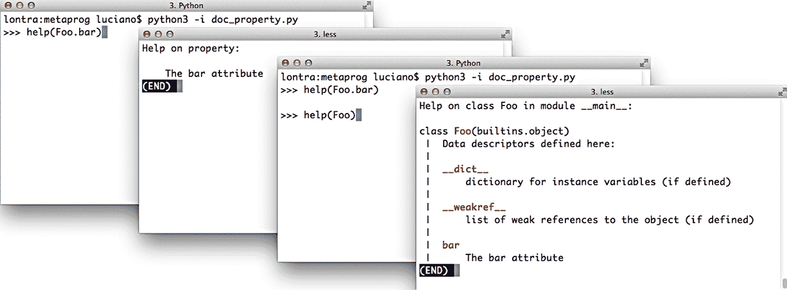

# 第二十二章：动态属性和属性

> 属性的关键重要性在于，它们的存在使得将公共数据属性作为类的公共接口的一部分完全安全且确实可取。
> 
> Martelli、Ravenscroft 和 Holden，“为什么属性很重要”¹

在 Python 中，数据属性和方法统称为*属性*。方法是*可调用*的属性。*动态属性*呈现与数据属性相同的接口——即，`obj.attr`——但是根据需要计算。这遵循 Bertrand Meyer 的*统一访问原则*：

> 模块提供的所有服务都应通过统一的表示法可用，这种表示法不会泄露它们是通过存储还是计算实现的。²

在 Python 中有几种实现动态属性的方法。本章涵盖了最简单的方法：`@property`装饰器和`__getattr__`特殊方法。

实现`__getattr__`的用户定义类可以实现我称之为*虚拟属性*的动态属性变体：这些属性在类的源代码中没有明确声明，也不在实例`__dict__`中存在，但可能在用户尝试读取不存在的属性时在其他地方检索或在需要时动态计算，例如`obj.no_such_attr`。

编写动态和虚拟属性是框架作者所做的元编程。然而，在 Python 中，基本技术很简单，因此我们可以在日常数据整理任务中使用它们。这就是我们将在本章开始的方式。

# 本章的新内容

本章大部分更新的动机来自对`@functools.cached_property`（Python 3.8 中引入）的讨论，以及`@property`与`@functools.cache`（3.9 中新引入）的联合使用。这影响了出现在“计算属性”中的`Record`和`Event`类的代码。我还添加了一项重构以利用[PEP 412—共享键字典](https://fpy.li/pep412)优化。

为了突出更相关的特性，同时保持示例的可读性，我删除了一些非必要的代码——将旧的`DbRecord`类合并到`Record`中，用`dict`替换`shelve.Shelve`，并删除了下载 OSCON 数据集的逻辑——示例现在从[*Fluent Python*代码库](https://fpy.li/code)中的本地文件中读取。

# 使用动态属性进行数据整理

在接下来的几个示例中，我们将利用动态属性处理 O’Reilly 为 OSCON 2014 会议发布的 JSON 数据集。示例 22-1 展示了该数据集中的四条记录。³

##### 示例 22-1。来自 osconfeed.json 的示例记录；一些字段内容已缩写

```
{ 
    "Schedule": { 
        "conferences": [{"serial": 115 }], 
        "events": [ 
            { 
                "serial": 34505, 
                "name": "Why Schools Don´t Use Open Source to Teach Programming", 
                "event_type": "40-minute conference session", 
                "time_start": "2014-07-23 11:30:00", 
                "time_stop": "2014-07-23 12:10:00", 
                "venue_serial": 1462, 
                "description": "Aside from the fact that high school programming...", 
                "website_url": "http://oscon.com/oscon2014/public/schedule/detail/34505", 
                "speakers": [157509], 
                "categories": ["Education"] 
            } 
        ], 
        "speakers": [ 
            { 
                "serial": 157509, 
                "name": "Robert Lefkowitz", 
                "photo": null, 
                "url": "http://sharewave.com/", 
                "position": "CTO", 
                "affiliation": "Sharewave", 
                "twitter": "sharewaveteam", 
                "bio": "Robert ´r0ml´ Lefkowitz is the CTO at Sharewave, a startup..." 
            } 
        ], 
        "venues": [ 
            { 
                "serial": 1462, 
                "name": "F151", 
                "category": "Conference Venues" 
            } 
        ] 
    } 
}
```

示例 22-1 展示了 JSON 文件中的 895 条记录中的 4 条。整个数据集是一个带有键`"Schedule"`的单个 JSON 对象，其值是另一个具有四个键`"conferences"`、`"events"`、`"speakers"`和`"venues"`的映射。这四个键中的每一个都映射到一个记录列表。在完整数据集中，`"events"`、`"speakers"`和`"venues"`列表有几十个或几百个记录，而`"conferences"`只有在示例 22-1 中显示的那一条记录。每条记录都有一个`"serial"`字段，这是记录在列表中的唯一标识符。

我使用 Python 控制台来探索数据集，如示例 22-2 所示。

##### 示例 22-2\. 交互式探索 osconfeed.json

```
>>> import json
>>> with open('data/osconfeed.json') as fp:
...     feed = json.load(fp)  # ①
>>> sorted(feed['Schedule'].keys())  # ②
['conferences', 'events', 'speakers', 'venues'] >>> for key, value in sorted(feed['Schedule'].items()):
...     print(f'{len(value):3} {key}')  # ③
...
 1 conferences 484 events 357 speakers
 53 venues >>> feed['Schedule']['speakers'][-1]['name']  # ④
'Carina C. Zona' >>> feed['Schedule']['speakers'][-1]['serial']  # ⑤
141590 >>> feed['Schedule']['events'][40]['name']
'There *Will* Be Bugs' >>> feed['Schedule']['events'][40]['speakers']  # ⑥
[3471, 5199]
```

①

`feed`是一个包含嵌套字典和列表、字符串和整数值的`dict`。

②

列出`"Schedule"`内的四个记录集合。

③

显示每个集合的记录计数。

④

浏览嵌套的字典和列表以获取最后一个演讲者的姓名。

⑤

获取相同演讲者的序列号。

⑥

每个事件都有一个带有零个或多个演讲者序列号的`'speakers'`列表。

## 使用动态属性探索类似 JSON 的数据

示例 22-2 足够简单，但是`feed['Schedule']['events'][40]['name']`这样的语法很繁琐。在 JavaScript 中，您可以通过编写`feed.Schedule.events[40].name`来获取相同的值。在 Python 中，可以很容易地实现一个类似`dict`的类来做同样的事情——网络上有很多实现。⁴ 我写了`FrozenJSON`，比大多数方案更简单，因为它只支持读取：它只是用于探索数据。`FrozenJSON`也是递归的，自动处理嵌套的映射和列表。

示例 22-3 是`FrozenJSON`的演示，源代码显示在示例 22-4 中。

##### 示例 22-3\. `FrozenJSON`来自示例 22-4，允许读取属性如`name`，并调用方法如`.keys()`和`.items()`

```
    >>> import json
    >>> raw_feed = json.load(open('data/osconfeed.json'))
    >>> feed = FrozenJSON(raw_feed)  # ①
    >>> len(feed.Schedule.speakers)  # ②
    357
    >>> feed.keys()
    dict_keys(['Schedule'])
    >>> sorted(feed.Schedule.keys())  # ③
    ['conferences', 'events', 'speakers', 'venues']
    >>> for key, value in sorted(feed.Schedule.items()): # ④
    ...     print(f'{len(value):3} {key}')
    ...
      1 conferences
    484 events
    357 speakers
     53 venues
    >>> feed.Schedule.speakers[-1].name  # ⑤
    'Carina C. Zona'
    >>> talk = feed.Schedule.events[40]
    >>> type(talk)  # ⑥
    <class 'explore0.FrozenJSON'>
    >>> talk.name
    'There *Will* Be Bugs'
    >>> talk.speakers  # ⑦
    [3471, 5199]
    >>> talk.flavor  # ⑧
    Traceback (most recent call last):
      ...
    KeyError: 'flavor'
```

①

从由嵌套字典和列表组成的`raw_feed`构建一个`FrozenJSON`实例。

②

`FrozenJSON`允许通过属性表示法遍历嵌套字典；这里显示了演讲者列表的长度。

③

也可以访问底层字典的方法，比如`.keys()`，以检索记录集合名称。

④

使用`items()`，我们可以检索记录集合的名称和内容，以显示每个集合的`len()`。

⑤

一个`list`，比如`feed.Schedule.speakers`，仍然是一个列表，但其中的项目如果是映射，则转换为`FrozenJSON`。

⑥

`events`列表中的第 40 项是一个 JSON 对象；现在它是一个`FrozenJSON`实例。

⑦

事件记录有一个带有演讲者序列号的`speakers`列表。

⑧

尝试读取一个不存在的属性会引发`KeyError`，而不是通常的`AttributeError`。

`FrozenJSON`类的关键是`__getattr__`方法，我们已经在“Vector Take #3: Dynamic Attribute Access”中的`Vector`示例中使用过它，通过字母检索`Vector`组件：`v.x`、`v.y`、`v.z`等。需要记住的是，只有在通常的过程无法检索属性时（即，当实例、类或其超类中找不到命名属性时），解释器才会调用`__getattr__`特殊方法。

示例 22-3 的最后一行揭示了我的代码存在一个小问题：尝试读取一个不存在的属性应该引发`AttributeError`，而不是显示的`KeyError`。当我实现错误处理时，`__getattr__`方法变得两倍长，分散了我想展示的最重要的逻辑。考虑到用户会知道`FrozenJSON`是由映射和列表构建的，我认为`KeyError`并不会太令人困惑。

##### 示例 22-4\. explore0.py：将 JSON 数据集转换为包含嵌套`FrozenJSON`对象、列表和简单类型的`FrozenJSON`

```
from collections import abc

class FrozenJSON:
    """A read-only façade for navigating a JSON-like object
       using attribute notation
    """

    def __init__(self, mapping):
        self.__data = dict(mapping)  # ①

    def __getattr__(self, name):  # ②
        try:
            return getattr(self.__data, name)  # ③
        except AttributeError:
            return FrozenJSON.build(self.__data[name])  # ④

    def __dir__(self):  # ⑤
        return self.__data.keys()

    @classmethod
    def build(cls, obj):  # ⑥
        if isinstance(obj, abc.Mapping):  # ⑦
            return cls(obj)
        elif isinstance(obj, abc.MutableSequence):  # ⑧
            return [cls.build(item) for item in obj]
        else:  # ⑨
            return obj
```

①

从`mapping`参数构建一个`dict`。这确保我们得到一个映射或可以转换为映射的东西。`__data`上的双下划线前缀使其成为*私有属性*。

②

只有当没有具有该`name`的属性时才会调用`__getattr__`。

③

如果`name`匹配实例`__data` `dict`中的属性，则返回该属性。这就是处理像`feed.keys()`这样的调用的方式：`keys`方法是`__data` `dict`的一个属性。

④

否则，从`self.__data`中的键`name`获取项目，并返回调用`FrozenJSON.build()`的结果。⁵

⑤

实现`__dir__`支持`dir()`内置函数，这将支持标准 Python 控制台以及 IPython、Jupyter Notebook 等的自动补全。这段简单的代码将基于`self.__data`中的键启用递归自动补全，因为`__getattr__`会动态构建`FrozenJSON`实例——对于交互式数据探索非常有用。

⑥

这是一个替代构造函数，`@classmethod`装饰器的常见用法。

⑦

如果`obj`是一个映射，用它构建一个`FrozenJSON`。这是*鹅类型*的一个例子——如果需要复习，请参阅“鹅类型”。

⑧

如果它是一个`MutableSequence`，它必须是一个列表，⁶因此我们通过递归地将`obj`中的每个项目传递给`.build()`来构建一个`list`。

⑨

如果不是`dict`或`list`，则返回原样。

`FrozenJSON`实例有一个名为`_FrozenJSON__data`的私有实例属性，如“Python 中的私有和‘受保护’属性”中所解释的那样。尝试使用其他名称检索属性将触发`__getattr__`。该方法首先查看`self.__data` `dict`是否具有该名称的属性（而不是键！）；这允许`FrozenJSON`实例处理`dict`方法，比如通过委托给`self.__data.items()`来处理`items`。如果`self.__data`没有具有给定`name`的属性，`__getattr__`将使用`name`作为键从`self.__data`中检索项目，并将该项目传递给`FrozenJSON.build`。这允许通过`build`类方法将 JSON 数据中的嵌套结构转换为另一个`FrozenJSON`实例。

请注意，`FrozenJSON`不会转换或缓存原始数据集。当我们遍历数据时，`__getattr__`会一遍又一遍地创建`FrozenJSON`实例。对于这个大小的数据集和仅用于探索或转换数据的脚本来说，这是可以接受的。

任何生成或模拟来自任意来源的动态属性名称的脚本都必须处理一个问题：原始数据中的键可能不适合作为属性名称。下一节将解决这个问题。

## 无效属性名称问题

`FrozenJSON`代码不处理作为 Python 关键字的属性名称。例如，如果构建一个这样的对象：

```
>>> student = FrozenJSON({'name': 'Jim Bo', 'class': 1982})
```

你无法读取`student.class`，因为`class`是 Python 中的保留关键字：

```
>>> student.class
  File "<stdin>", line 1
    student.class
         ^
SyntaxError: invalid syntax
```

当然你总是可以这样做：

```
>>> getattr(student, 'class')
1982
```

但`FrozenJSON`的理念是提供对数据的便捷访问，因此更好的解决方案是检查传递给`FrozenJSON.__init__`的映射中的键是否是关键字，如果是，则在其末尾添加`_`，这样就可以像这样读取属性：

```
>>> student.class_
1982
```

通过用示例 22-5 中的版本替换示例 22-4 中的一行`__init__`，可以实现这一点。

##### 示例 22-5\. explore1.py：为 Python 关键字添加`_`作为属性名称的后缀

```
    def __init__(self, mapping):
        self.__data = {}
        for key, value in mapping.items():
            if keyword.iskeyword(key):  # ①
                key += '_'
            self.__data[key] = value
```

①

`keyword.iskeyword(…)`函数正是我们需要的；要使用它，必须导入`keyword`模块，这在这个片段中没有显示。

如果 JSON 记录中的键不是有效的 Python 标识符，可能会出现类似的问题：

```
>>> x = FrozenJSON({'2be':'or not'})
>>> x.2be
  File "<stdin>", line 1
    x.2be
      ^
SyntaxError: invalid syntax
```

在 Python 3 中，这些有问题的键很容易检测，因为`str`类提供了`s.isidentifier()`方法，告诉您`s`是否是根据语言语法的有效 Python 标识符。但将一个不是有效标识符的键转换为有效的属性名称并不是简单的。一个解决方案是实现`__getitem__`，允许使用`x['2be']`这样的表示法进行属性访问。为简单起见，我不会担心这个问题。

在考虑动态属性名称之后，让我们转向`FrozenJSON`的另一个重要特性：`build`类方法的逻辑。`Frozen.JSON.build`被`__getattr__`使用，根据正在访问的属性的值返回不同类型的对象：嵌套结构转换为`FrozenJSON`实例或`FrozenJSON`实例列表。

相同的逻辑可以实现为`__new__`特殊方法，而不是类方法，我们将在下面看到。

## 使用`__new__`进行灵活的对象创建

我们经常将`__init__`称为构造方法，但这是因为我们从其他语言中采用了术语。在 Python 中，`__init__`将`self`作为第一个参数，因此当解释器调用`__init__`时，对象已经存在。此外，`__init__`不能返回任何内容。因此，它实际上是一个初始化器，而不是构造函数。

当调用类以创建实例时，Python 在该类上调用的特殊方法来构造实例是`__new__`。它是一个类方法，但得到特殊处理，因此不适用`@classmethod`装饰器。Python 获取`__new__`返回的实例，然后将其作为`__init__`的第一个参数`self`传递。我们很少需要编写`__new__`，因为从`object`继承的实现对绝大多数用例都足够了。

如果必要，`__new__`方法也可以返回不同类的实例。当发生这种情况时，解释器不会调用`__init__`。换句话说，Python 构建对象的逻辑类似于这个伪代码：

```
# pseudocode for object construction
def make(the_class, some_arg):
    new_object = the_class.__new__(some_arg)
    if isinstance(new_object, the_class):
        the_class.__init__(new_object, some_arg)
    return new_object

# the following statements are roughly equivalent
x = Foo('bar')
x = make(Foo, 'bar')
```

示例 22-6 展示了`FrozenJSON`的一个变体，其中前一个`build`类方法的逻辑移至`__new__`。

##### 示例 22-6\. explore2.py：使用`__new__`而不是`build`来构建可能是`FrozenJSON`实例的新对象。

```
from collections import abc
import keyword

class FrozenJSON:
    """A read-only façade for navigating a JSON-like object
       using attribute notation
    """

    def __new__(cls, arg):  # ①
        if isinstance(arg, abc.Mapping):
            return super().__new__(cls)  # ②
        elif isinstance(arg, abc.MutableSequence):  # ③
            return [cls(item) for item in arg]
        else:
            return arg

    def __init__(self, mapping):
        self.__data = {}
        for key, value in mapping.items():
            if keyword.iskeyword(key):
                key += '_'
            self.__data[key] = value

    def __getattr__(self, name):
        try:
            return getattr(self.__data, name)
        except AttributeError:
            return FrozenJSON(self.__data[name])  # ④

    def __dir__(self):
        return self.__data.keys()
```

①

作为类方法，`__new__`的第一个参数是类本身，其余参数与`__init__`得到的参数相同，除了`self`。

②

默认行为是委托给超类的`__new__`。在这种情况下，我们从`object`基类调用`__new__`，将`FrozenJSON`作为唯一参数传递。

③

`__new__`的其余行与旧的`build`方法完全相同。

④

以前调用`FrozenJSON.build`的地方；现在我们只需调用`FrozenJSON`类，Python 会通过调用`FrozenJSON.__new__`来处理。

`__new__`方法将类作为第一个参数，因为通常创建的对象将是该类的实例。因此，在`FrozenJSON.__new__`中，当表达式`super().__new__(cls)`有效地调用`object.__new__(FrozenJSON)`时，由`object`类构建的实例实际上是`FrozenJSON`的实例。新实例的`__class__`属性将保存对`FrozenJSON`的引用，即使实际的构造是由解释器的内部实现的`object.__new__`在 C 中执行。

OSCON JSON 数据集的结构对于交互式探索并不有用。例如，索引为`40`的事件，标题为`'There *Will* Be Bugs'`，有两位演讲者，`3471`和`5199`。查找演讲者的姓名很麻烦，因为那些是序列号，而`Schedule.speakers`列表不是按照它们进行索引的。要获取每位演讲者，我们必须遍历该列表，直到找到一个具有匹配序列号的记录。我们的下一个任务是重组数据，以准备自动检索链接记录。

我们在第十一章“可散列的 Vector2d”中首次看到`@property`装饰器。在示例 11-7 中，我在`Vector2d`中使用了两个属性，只是为了使`x`和`y`属性只读。在这里，我们将看到计算值的属性，从而讨论如何缓存这些值。

OSCON JSON 数据中的`'events'`列表中的记录包含指向`'speakers'`和`'venues'`列表中记录的整数序列号。例如，这是会议演讲的记录（省略了描述）：

```
{ 
    "serial": 33950, 
    "name": "There *Will* Be Bugs", 
    "event_type": "40-minute conference session",
    "time_start": "2014-07-23 14:30:00", 
    "time_stop": "2014-07-23 15:10:00", 
    "venue_serial": 1449, 
    "description": "If you're pushing the envelope of programming...", 
    "website_url": "http://oscon.com/oscon2014/public/schedule/detail/33950", 
    "speakers": [3471, 5199], 
    "categories": ["Python"] 
}
```

我们将实现一个具有`venue`和`speakers`属性的`Event`类，以便自动返回链接数据，换句话说，“解引用”序列号。给定一个`Event`实例，示例 22-7 展示了期望的行为。

##### 示例 22-7。读取`venue`和`speakers`返回`Record`对象

```
 >>> event # ①
 <Event 'There *Will* Be Bugs'> >>> event.venue # ②
 <Record serial=1449> >>> event.venue.name # ③
 'Portland 251' >>> for spkr in event.speakers: # ④
 ...     print(f'{spkr.serial}: {spkr.name}') ... 3471: Anna Martelli Ravenscroft 5199: Alex Martelli
```

①

给定一个`Event`实例…

②

…读取`event.venue`返回一个`Record`对象，而不是一个序列号。

③

现在很容易获取`venue`的名称。

④

`event.speakers`属性返回一个`Record`实例列表。

和往常一样，我们将逐步构建代码，从`Record`类和一个函数开始，该函数读取 JSON 数据并返回一个带有`Record`实例的`dict`。

## 步骤 1：基于数据创建属性

示例 22-8 展示了指导这一步骤的 doctest。

##### 示例 22-8\. 测试 schedule_v1.py（来自示例 22-9）

```
    >>> records = load(JSON_PATH)  # ①
    >>> speaker = records['speaker.3471']  # ②
    >>> speaker  # ③
    <Record serial=3471>
    >>> speaker.name, speaker.twitter  # ④
    ('Anna Martelli Ravenscroft', 'annaraven')
```

①

`load`一个带有 JSON 数据的`dict`。

②

`records`中的键是由记录类型和序列号构建的字符串。

③

`speaker`是在示例 22-9 中定义的`Record`类的实例。

④

可以将原始 JSON 中的字段作为`Record`实例属性检索。

*schedule_v1.py*的代码在示例 22-9 中。

##### 示例 22-9\. schedule_v1.py：重新组织 OSCON 日程数据

```
import json

JSON_PATH = 'data/osconfeed.json'

class Record:
    def __init__(self, **kwargs):
        self.__dict__.update(kwargs)  # ①

    def __repr__(self):
        return f'<{self.__class__.__name__} serial={self.serial!r}>'  # ②

def load(path=JSON_PATH):
    records = {}  # ③
    with open(path) as fp:
        raw_data = json.load(fp)  # ④
    for collection, raw_records in raw_data['Schedule'].items():  # ⑤
        record_type = collection[:-1]  # ⑥
        for raw_record in raw_records:
            key = f'{record_type}.{raw_record["serial"]}' # ⑦
            records[key] = Record(**raw_record)  # ⑧
    return records
```

①

这是一个常见的快捷方式，用关键字参数构建属性的实例（详细解释如下）。

②

使用`serial`字段构建自定义的`Record`表示，如示例 22-8 所示。

③

`load`最终将返回`Record`实例的`dict`。

④

解析 JSON，返回本机 Python 对象：列表、字典、字符串、数字等。

⑤

迭代四个名为`'conferences'`、`'events'`、`'speakers'`和`'venues'`的顶级列表。

⑥

`record_type`是列表名称去掉最后一个字符，所以`speakers`变成`speaker`。在 Python ≥ 3.9 中，我们可以更明确地使用`collection.removesuffix('s')`来做到这一点——参见[PEP 616—删除前缀和后缀的字符串方法](https://fpy.li/pep616)。

⑦

构建格式为`'speaker.3471'`的`key`。

⑧

创建一个`Record`实例，并将其保存在带有`key`的`records`中。

`Record.__init__`方法展示了一个古老的 Python 技巧。回想一下，对象的`__dict__`是其属性所在的地方——除非在类中声明了`__slots__`，就像我们在“使用 __slots__ 节省内存”中看到的那样。因此，使用映射更新实例`__dict__`是一种快速创建该实例中一堆属性的方法。⁷

###### 注意

根据应用程序的不同，`Record`类可能需要处理不是有效属性名称的键，就像我们在“无效属性名称问题”中看到的那样。处理这个问题会分散这个示例的关键思想，并且在我们正在读取的数据集中并不是一个问题。

在示例 22-9 中`Record`的定义是如此简单，以至于你可能会想为什么我没有在之前使用它，而是使用更复杂的`FrozenJSON`。有两个原因。首先，`FrozenJSON`通过递归转换嵌套映射和列表来工作；`Record`不需要这样做，因为我们转换的数据集中没有映射嵌套在映射或列表中。记录只包含字符串、整数、字符串列表和整数列表。第二个原因：`FrozenJSON`提供对嵌入的`__data` `dict`属性的访问——我们用它来调用像`.keys()`这样的方法——现在我们也不需要那个功能了。

###### 注意

Python 标准库提供了类似于`Record`的类，其中每个实例都有一个从给定给`__init__`的关键字参数构建的任意属性集：[`types.SimpleNamespace`](https://fpy.li/22-5)、[`argparse.Namespace`](https://fpy.li/22-6)和[`multiprocessing.managers.Namespace`](https://fpy.li/22-7)。我编写了更简单的`Record`类来突出显示基本思想：`__init__`更新实例`__dict__`。

重新组织日程数据集后，我们可以增强`Record`类，自动检索`event`记录中引用的`venue`和`speaker`记录。我们将在接下来的示例中使用属性来实现这一点。

## 第 2 步：检索链接记录的属性

下一个版本的目标是：给定一个`event`记录，读取其`venue`属性将返回一个`Record`。这类似于 Django ORM 在访问`ForeignKey`字段时的操作：您将获得链接的模型对象，而不是键。

我们将从`venue`属性开始。查看示例 22-10 中的部分交互作为示例。

##### 示例 22-10\. 从 schedule_v2.py 的 doctests 中提取

```
    >>> event = Record.fetch('event.33950')  # ①
    >>> event  # ②
    <Event 'There *Will* Be Bugs'>
    >>> event.venue  # ③
    <Record serial=1449>
    >>> event.venue.name  # ④
    'Portland 251'
    >>> event.venue_serial  # ⑤
    1449
```

①

`Record.fetch`静态方法从数据集中获取一个`Record`或一个`Event`。

②

请注意，`event`是`Event`类的一个实例。

③

访问`event.venue`将返回一个`Record`实例。

④

现在很容易找出`event.venue`的名称。

⑤

`Event`实例还具有来自 JSON 数据的`venue_serial`属性。

`Event`是`Record`的一个子类，添加了一个`venue`来检索链接的记录，以及一个专门的`__repr__`方法。

本节的代码位于[*schedule_v2.py*](https://fpy.li/22-8)模块中，位于[*Fluent Python*代码库](https://fpy.li/code)中。示例有近 60 行，所以我将分部分呈现，从增强的`Record`类开始。

##### 示例 22-11\. schedule_v2.py：具有新`fetch`方法的`Record`类

```
import inspect  # ①
import json

JSON_PATH = 'data/osconfeed.json'

class Record:

    __index = None  # ②

    def __init__(self, **kwargs):
        self.__dict__.update(kwargs)

    def __repr__(self):
        return f'<{self.__class__.__name__} serial={self.serial!r}>'

    @staticmethod  # ③
    def fetch(key):
        if Record.__index is None:  # ④
            Record.__index = load()
        return Record.__index[key]  # ⑤
```

①

`inspect`将在示例 22-13 中使用。

②

`__index`私有类属性最终将保存对`load`返回的`dict`的引用。

③

`fetch`是一个`staticmethod`，明确表示其效果不受调用它的实例或类的影响。

④

如有需要，填充`Record.__index`。

⑤

使用它来检索具有给定`key`的记录。

###### 提示

这是一个使用`staticmethod`的例子。`fetch`方法始终作用于`Record.__index`类属性，即使从子类调用，如`Event.fetch()`—我们很快会探讨。将其编码为类方法会产生误导，因为不会使用`cls`第一个参数。

现在我们来看`Event`类中属性的使用，列在示例 22-12 中。

##### 示例 22-12\. schedule_v2.py：`Event`类

```
class Event(Record):  # ①

    def __repr__(self):
        try:
            return f'<{self.__class__.__name__} {self.name!r}>'  # ②
        except AttributeError:
            return super().__repr__()

    @property
    def venue(self):
        key = f'venue.{self.venue_serial}'
        return self.__class__.fetch(key)  # ③
```

①

`Event`扩展了`Record`。

②

如果实例具有`name`属性，则用于生成自定义表示。否则，委托给`Record`的`__repr__`。

③

`venue`属性从`venue_serial`属性构建一个`key`，并将其传递给从`Record`继承的`fetch`类方法（使用`self.__class__`的原因将很快解释）。

Example 22-12 的`venue`方法的第二行返回`self​.__class__.fetch(key)`。为什么不简单地调用`self.fetch(key)`？简单形式适用于特定的 OSCON 数据集，因为没有带有`'fetch'`键的事件记录。但是，如果事件记录有一个名为`'fetch'`的键，那么在特定的`Event`实例内，引用`self.fetch`将检索该字段的值，而不是`Event`从`Record`继承的`fetch`类方法。这是一个微妙的错误，它很容易在测试中被忽略，因为它取决于数据集。

###### 警告

在从数据创建实例属性名称时，总是存在由于类属性（如方法）的遮蔽或由于意外覆盖现有实例属性而导致的错误风险。这些问题可能解释了为什么 Python 字典一开始就不像 JavaScript 对象。

如果`Record`类的行为更像映射，实现动态的`__getitem__`而不是动态的`__getattr__`，那么就不会有由于覆盖或遮蔽而导致的错误风险。自定义映射可能是实现`Record`的 Pythonic 方式。但是如果我选择这条路，我们就不会研究动态属性编程的技巧和陷阱。

该示例的最后一部分是 Example 22-13 中修改后的`load`函数。

##### 示例 22-13\. schedule_v2.py：`load`函数

```
def load(path=JSON_PATH):
    records = {}
    with open(path) as fp:
        raw_data = json.load(fp)
    for collection, raw_records in raw_data['Schedule'].items():
        record_type = collection[:-1]  # ①
        cls_name = record_type.capitalize()  # ②
        cls = globals().get(cls_name, Record)  # ③
        if inspect.isclass(cls) and issubclass(cls, Record):  # ④
            factory = cls  # ⑤
        else:
            factory = Record  # ⑥
        for raw_record in raw_records:  # ⑦
            key = f'{record_type}.{raw_record["serial"]}'
            records[key] = factory(**raw_record)  # ⑧
    return records
```

①

到目前为止，与*schedule_v1.py*中的`load`没有任何变化（Example 22-9）。

②

将`record_type`大写以获得可能的类名；例如，`'event'`变为`'Event'`。

③

从模块全局范围获取该名称的对象；如果没有这样的对象，则获取`Record`类。

④

如果刚刚检索到的对象是一个类，并且是`Record`的子类…

⑤

…将`factory`名称绑定到它。这意味着`factory`可以是`Record`的任何子类，取决于`record_type`。

⑥

否则，将`factory`名称绑定到`Record`。

⑦

创建`key`并保存记录的`for`循环与以前相同，只是…

⑧

…存储在`records`中的对象由`factory`构造，该`factory`可以是`Record`或根据`record_type`选择的`Event`等子类。

请注意，唯一具有自定义类的`record_type`是`Event`，但如果编写了名为`Speaker`或`Venue`的类，`load`将在构建和保存记录时自动使用这些类，而不是默认的`Record`类。

现在我们将相同的想法应用于`Events`类中的新`speakers`属性。

## 第三步：覆盖现有属性

Example 22-12 中`venue`属性的名称与`"events"`集合中的记录字段名称不匹配。它的数据来自`venue_serial`字段名称。相比之下，`events`集合中的每个记录都有一个`speakers`字段，其中包含一系列序列号。我们希望将该信息作为`Event`实例中的`speakers`属性公开，该属性返回`Record`实例的列表。这种名称冲突需要特别注意，正如 Example 22-14 所示。

##### 示例 22-14\. schedule_v3.py：`speakers`属性

```
    @property
    def speakers(self):
        spkr_serials = self.__dict__['speakers']  # ①
        fetch = self.__class__.fetch
        return [fetch(f'speaker.{key}')
                for key in spkr_serials]  # ②
```

①

我们想要的数据在`speakers`属性中，但我们必须直接从实例`__dict__`中检索它，以避免对`speakers`属性的递归调用。

②

返回一个具有与 `spkr_serials` 中数字对应的键的所有记录列表。

在 `speakers` 方法内部，尝试读取 `self.speakers` 将会快速引发 `RecursionError`。然而，如果通过 `self.__dict__['speakers']` 读取相同的数据，Python 通常用于检索属性的算法将被绕过，属性不会被调用，递归被避免。因此，直接读取或写入对象的 `__dict__` 中的数据是一种常见的 Python 元编程技巧。

###### 警告

解释器通过首先查看 `obj` 的类来评估 `obj.my_attr`。如果类具有与 `my_attr` 名称相同的属性，则该属性会遮蔽同名的实例属性。“属性覆盖实例属性” 中的示例将演示这一点，而 第二十三章 将揭示属性是作为描述符实现的——这是一种更强大和通用的抽象。

当我编写 示例 22-14 中的列表推导式时，我的程序员蜥蜴大脑想到：“这可能会很昂贵。” 实际上并不是，因为 OSCON 数据集中的事件只有少数演讲者，所以编写任何更复杂的东西都会过早优化。然而，缓存属性是一个常见的需求，但也有一些注意事项。让我们在接下来的示例中看看如何做到这一点。

## 步骤 4：定制属性缓存

缓存属性是一个常见的需求，因为人们期望像 `event.venue` 这样的表达式应该是廉价的。⁸ 如果 `Record.fetch` 方法背后的 `Event` 属性需要查询数据库或 Web API，某种形式的缓存可能会变得必要。

在第一版 *Fluent Python* 中，我为 `speakers` 方法编写了自定义缓存逻辑，如 示例 22-15 所示。

##### 示例 22-15\. 使用 `hasattr` 的自定义缓存逻辑会禁用键共享优化

```
    @property
    def speakers(self):
        if not hasattr(self, '__speaker_objs'):  # ①
            spkr_serials = self.__dict__['speakers']
            fetch = self.__class__.fetch
            self.__speaker_objs = [fetch(f'speaker.{key}')
                    for key in spkr_serials]
        return self.__speaker_objs  # ②
```

①

如果实例没有名为 `__speaker_objs` 的属性，则获取演讲者对象并将它们存储在那里。

②

返回 `self.__speaker_objs`。

在 示例 22-15 中手动缓存是直接的，但在实例初始化后创建属性会破坏 [PEP 412—Key-Sharing Dictionary](https://fpy.li/pep412) 优化，如 “dict 工作原理的实际后果” 中所解释的。根据数据集的大小，内存使用量的差异可能很重要。

一个类似的手动解决方案，与键共享优化很好地配合使用，需要为 `Event` 类编写一个 `__init__`，以创建必要的 `__speaker_objs` 并将其初始化为 `None`，然后在 `speakers` 方法中检查这一点。参见 示例 22-16。

##### 示例 22-16\. 在 `__init__` 中定义存储以利用键共享优化

```
class Event(Record):

    def __init__(self, **kwargs):
        self.__speaker_objs = None
        super().__init__(**kwargs)

# 15 lines omitted...
    @property
    def speakers(self):
        if self.__speaker_objs is None:
            spkr_serials = self.__dict__['speakers']
            fetch = self.__class__.fetch
            self.__speaker_objs = [fetch(f'speaker.{key}')
                    for key in spkr_serials]
        return self.__speaker_objs
```

示例 22-15 和 22-16 展示了在传统 Python 代码库中相当常见的简单缓存技术。然而，在多线程程序中，像这样的手动缓存会引入可能导致数据损坏的竞争条件。如果两个线程正在读取以前未缓存的属性，则第一个线程将需要计算缓存属性的数据（示例中的 `__speaker_objs`），而第二个线程可能会读取尚不完整的缓存值。

幸运的是，Python 3.8 引入了 `@functools.cached_property` 装饰器，它是线程安全的。不幸的是，它带来了一些注意事项，接下来会解释。

## 步骤 5：使用 functools 缓存属性

`functools` 模块提供了三个用于缓存的装饰器。我们在 “使用 functools.cache 进行记忆化”（第九章）中看到了 `@cache` 和 `@lru_cache`。Python 3.8 引入了 `@cached_property`。

`functools.cached_property` 装饰器将方法的结果缓存到具有相同名称的实例属性中。例如，在 示例 22-17 中，`venue` 方法计算的值存储在 `self` 中的 `venue` 属性中。之后，当客户端代码尝试读取 `venue` 时，新创建的 `venue` 实例属性将被使用，而不是方法。

##### 示例 22-17\. 使用 `@cached_property` 的简单示例

```
    @cached_property
    def venue(self):
        key = f'venue.{self.venue_serial}'
        return self.__class__.fetch(key)
```

在 “第 3 步：覆盖现有属性的属性” 中，我们看到属性通过相同名称的实例属性进行遮蔽。如果这是真的，那么 `@cached_property` 如何工作呢？如果属性覆盖了实例属性，那么 `venue` 属性将被忽略，`venue` 方法将始终被调用，每次计算 `key` 并运行 `fetch`！

答案有点令人沮丧：`cached_property` 是一个误称。`@cached_property` 装饰器并不创建一个完整的属性，而是创建了一个 *非覆盖描述符*。描述符是一个管理另一个类中属性访问的对象。我们将在 第二十三章 中深入探讨描述符。`property` 装饰器是一个用于创建 *覆盖描述符* 的高级 API。第二十三章 将详细解释 *覆盖* 与 *非覆盖* 描述符的区别。

现在，让我们暂时搁置底层实现，关注从用户角度看 `cached_property` 和 `property` 之间的区别。Raymond Hettinger 在 [Python 文档](https://fpy.li/22-9) 中很好地解释了它们：

> `cached_property()` 的机制与 `property()` 有所不同。普通属性会阻止属性写入，除非定义了 setter。相比之下，`cached_property` 允许写入。
> 
> `cached_property` 装饰器仅在查找时运行，并且仅当同名属性不存在时才运行。当它运行时，`cached_property` 会写入具有相同名称的属性。随后的属性读取和写入优先于 `cached_property` 方法，并且它的工作方式类似于普通属性。
> 
> 缓存的值可以通过删除属性来清除。这允许 `cached_property` 方法再次运行。⁹

回到我们的 `Event` 类：`@cached_property` 的具体行为使其不适合装饰 `speakers`，因为该方法依赖于一个名为 `speakers` 的现有属性，其中包含活动演讲者的序列号。

###### 警告

`@cached_property` 有一些重要的限制：

+   如果装饰的方法已经依赖于同名实例属性，则它不能作为 `@property` 的即插即用替代品。

+   它不能在定义了 `__slots__` 的类中使用。

+   它打败了实例 `__dict__` 的键共享优化，因为它在 `__init__` 之后创建了一个实例属性。

尽管存在这些限制，`@cached_property` 以简单的方式满足了常见需求，并且是线程安全的。它的 [Python 代码](https://fpy.li/22-13) 是使用 [*可重入锁*](https://fpy.li/22-14) 的一个示例。

`@cached_property` 的 [文档](https://fpy.li/22-15) 建议了一个替代解决方案，我们可以在 `speakers` 上使用 `@property` 和 `@cache` 装饰器叠加，就像 示例 22-18 中展示的那样。

##### 示例 22-18\. 在 `@property` 上叠加 `@cache`

```
    @property  # ①
    @cache  # ②
    def speakers(self):
        spkr_serials = self.__dict__['speakers']
        fetch = self.__class__.fetch
        return [fetch(f'speaker.{key}')
                for key in spkr_serials]
```

①

顺序很重要：`@property` 放在最上面…

②

…`@cache`。

从“堆叠装饰器”中回想一下该语法的含义。示例 22-18 的前三行类似于：

```
speakers = property(cache(speakers))
```

`@cache`应用于`speakers`，返回一个新函数。然后，该函数被`@property`装饰，将其替换为一个新构造的属性。

这结束了我们对只读属性和缓存装饰器的讨论，探索 OSCON 数据集。在下一节中，我们将开始一个新系列的示例，创建读/写属性。

# 使用属性进行属性验证

除了计算属性值外，属性还用于通过将公共属性更改为由 getter 和 setter 保护的属性来强制执行业务规则，而不影响客户端代码。让我们通过一个扩展示例来详细讨论。

## LineItem 第一次尝试：订单中的商品类

想象一个销售散装有机食品的商店的应用程序，客户可以按重量订购坚果、干果或谷物。在该系统中，每个订单将包含一系列行项目，每个行项目可以由一个类的实例表示，如示例 22-19 中所示。

##### 示例 22-19。bulkfood_v1.py：最简单的`LineItem`类

```
class LineItem:

    def __init__(self, description, weight, price):
        self.description = description
        self.weight = weight
        self.price = price

    def subtotal(self):
        return self.weight * self.price
```

这很简单明了。也许太简单了。示例 22-20 展示了一个问题。

##### 示例 22-20。负重导致负小计

```
    >>> raisins = LineItem('Golden raisins', 10, 6.95)
    >>> raisins.subtotal()
    69.5
    >>> raisins.weight = -20  # garbage in...
    >>> raisins.subtotal()    # garbage out...
    -139.0
```

这只是一个玩具示例，但并不像你想象的那样幻想。这是亚马逊.com 早期的一个故事：

> 我们发现客户可以订购负数数量的书！然后我们会用价格给他们的信用卡记账，我猜，等待他们发货。
> 
> 亚马逊.com 创始人兼首席执行官杰夫·贝索斯¹⁰

我们如何解决这个问题？我们可以改变`LineItem`的接口，使用 getter 和 setter 来处理`weight`属性。那将是 Java 的方式，这并不是错误的。

另一方面，能够通过简单赋值来设置物品的`weight`是很自然的；也许系统已经在生产中，其他部分已经直接访问`item.weight`。在这种情况下，Python 的做法是用属性替换数据属性。

## LineItem 第二次尝试：一个验证属性

实现一个属性将允许我们使用一个 getter 和一个 setter，但`LineItem`的接口不会改变（即，设置`LineItem`的`weight`仍然写作`raisins.weight = 12`）。

示例 22-21 列出了一个读/写`weight`属性的代码。

##### 示例 22-21。bulkfood_v2.py：带有`weight`属性的`LineItem`

```
class LineItem:

    def __init__(self, description, weight, price):
        self.description = description
        self.weight = weight  # ①
        self.price = price

    def subtotal(self):
        return self.weight * self.price

    @property  # ②
    def weight(self):  # ③
        return self.__weight  # ④

    @weight.setter  # ⑤
    def weight(self, value):
        if value > 0:
            self.__weight = value  # ⑥
        else:
            raise ValueError('value must be > 0')  # ⑦
```

①

这里属性 setter 已经在使用中，确保不会创建带有负`weight`的实例。

②

`@property`装饰 getter 方法。

③

所有实现属性的方法都共享公共属性的名称：`weight`。

④

实际值存储在私有属性`__weight`中。

⑤

装饰的 getter 具有`.setter`属性，这也是一个装饰器；这将 getter 和 setter 绑定在一起。

⑥

如果值大于零，我们设置私有`__weight`。

⑦

否则，将引发`ValueError`。

请注意，现在无法创建具有无效重量的`LineItem`：

```
>>> walnuts = LineItem('walnuts', 0, 10.00)
Traceback (most recent call last):
    ...
ValueError: value must be > 0
```

现在我们已经保护了`weight`免受用户提供负值的影响。尽管买家通常不能设置物品的价格，但是文书错误或错误可能会创建一个具有负`price`的`LineItem`。为了防止这种情况，我们也可以将`price`转换为属性，但这将在我们的代码中产生一些重复。

记住保罗·格雷厄姆在第十七章中的引用：“当我在我的程序中看到模式时，我认为这是一个麻烦的迹象。”重复的治疗方法是抽象。有两种抽象属性定义的方法：使用属性工厂或描述符类。描述符类方法更灵活，我们将在第二十三章中全面讨论它。实际上，属性本身是作为描述符类实现的。但在这里，我们将通过实现一个函数作为属性工厂来继续探讨属性。

但在我们实现属性工厂之前，我们需要更深入地了解属性。

# 对属性进行适当的查看

尽管经常被用作装饰器，但`property`内置实际上是一个类。在 Python 中，函数和类通常是可互换的，因为两者都是可调用的，而且没有用于对象实例化的`new`运算符，因此调用构造函数与调用工厂函数没有区别。并且两者都可以用作装饰器，只要它们返回一个适当替代被装饰的可调用对象。

这是`property`构造函数的完整签名：

```
property(fget=None, fset=None, fdel=None, doc=None)
```

所有参数都是可选的，如果没有为其中一个参数提供函数，则生成的属性对象不允许相应的操作。

`property`类型是在 Python 2.2 中添加的，但`@`装饰器语法只在 Python 2.4 中出现，因此在几年内，属性是通过将访问器函数作为前两个参数来定义的。

用装饰器的方式定义属性的“经典”语法在示例 22-22 中有所说明。

##### 示例 22-22。bulkfood_v2b.py：与示例 22-21 相同，但不使用装饰器

```
class LineItem:

    def __init__(self, description, weight, price):
        self.description = description
        self.weight = weight
        self.price = price

    def subtotal(self):
        return self.weight * self.price

    def get_weight(self):  # ①
        return self.__weight

    def set_weight(self, value):  # ②
        if value > 0:
            self.__weight = value
        else:
            raise ValueError('value must be > 0')

    weight = property(get_weight, set_weight)  # ③
```

①

一个普通的 getter。

②

一个普通的 setter。

③

构建`property`并将其分配给一个公共类属性。

在某些情况下，经典形式比装饰器语法更好；我们将很快讨论的属性工厂的代码就是一个例子。另一方面，在一个有许多方法的类体中，装饰器使得明确哪些是 getter 和 setter，而不依赖于在它们的名称中使用`get`和`set`前缀的约定。

类中存在属性会影响实例中属性的查找方式，这可能一开始会让人感到惊讶。下一节将解释。

## 属性覆盖实例属性

属性始终是类属性，但实际上管理类的实例中的属性访问。

在“覆盖类属性”中，我们看到当一个实例及其类都有相同名称的数据属性时，实例属性会覆盖或遮蔽类属性——至少在通过该实例读取时是这样的。示例 22-23 说明了这一点。

##### 示例 22-23。实例属性遮蔽类`data`属性

```
>>> class Class:  # ①
...     data = 'the class data attr'
...     @property
...     def prop(self):
...         return 'the prop value'
...
>>> obj = Class()
>>> vars(obj)  # ②
{} >>> obj.data  # ③
'the class data attr' >>> obj.data = 'bar' # ④
>>> vars(obj)  # ⑤
{'data': 'bar'} >>> obj.data  # ⑥
'bar' >>> Class.data  # ⑦
'the class data attr'
```

①

使用两个类属性`data`属性和`prop`属性定义`Class`。

②

`vars`返回`obj`的`__dict__`，显示它没有实例属性。

③

从`obj.data`中读取`Class.data`的值。

④

写入 `obj.data` 创建一个实例属性。

⑤

检查实例以查看实例属性。

⑥

现在从 `obj.data` 读取将检索实例属性的值。当从 `obj` 实例读取时，实例 `data` 遮蔽了类 `data`。

⑦

`Class.data` 属性保持不变。

现在，让我们尝试覆盖 `obj` 实例上的 `prop` 属性。继续之前的控制台会话，我们有示例 22-24。

##### 示例 22-24\. 实例属性不会遮蔽类属性（续自示例 22-23)

```
>>> Class.prop  # ①
<property object at 0x1072b7408> >>> obj.prop  # ②
'the prop value' >>> obj.prop = 'foo'  # ③
Traceback (most recent call last):
  ...
AttributeError: can't set attribute
>>> obj.__dict__['prop'] = 'foo'  # ④
>>> vars(obj)  # ⑤
{'data': 'bar', 'prop': 'foo'} >>> obj.prop  # ⑥
'the prop value' >>> Class.prop = 'baz'  # ⑦
>>> obj.prop  # ⑧
'foo'
```

①

直接从 `Class` 中读取 `prop` 会检索属性对象本身，而不会运行其 getter 方法。

②

读取 `obj.prop` 执行属性的 getter。

③

尝试设置实例 `prop` 属性失败。

④

直接将 `'prop'` 放入 `obj.__dict__` 中有效。

⑤

我们可以看到 `obj` 现在有两个实例属性：`data` 和 `prop`。

⑥

然而，读取 `obj.prop` 仍然会运行属性的 getter。属性不会被实例属性遮蔽。

⑦

覆盖 `Class.prop` 会销毁属性对象。

⑧

现在 `obj.prop` 检索实例属性。`Class.prop` 不再是属性，因此不再覆盖 `obj.prop`。

作为最后的演示，我们将向 `Class` 添加一个新属性，并看到它如何覆盖实例属性。示例 22-25 接续了示例 22-24。

##### 示例 22-25\. 新类属性遮蔽现有实例属性（续自示例 22-24)

```
>>> obj.data  # ①
'bar' >>> Class.data  # ②
'the class data attr' >>> Class.data = property(lambda self: 'the "data" prop value')  # ③
>>> obj.data  # ④
'the "data" prop value' >>> del Class.data  # ⑤
>>> obj.data  # ⑥
'bar'
```

①

`obj.data` 检索实例 `data` 属性。

②

`Class.data` 检索类 `data` 属性。

③

用新属性覆盖 `Class.data`。

④

`obj.data` 现在被 `Class.data` 属性遮蔽。

⑤

删除属性。

⑥

`obj.data` 现在再次读取实例 `data` 属性。

本节的主要观点是，像 `obj.data` 这样的表达式并不会从 `obj` 开始搜索 `data`。搜索实际上从 `obj.__class__` 开始，只有在类中没有名为 `data` 的属性时，Python 才会在 `obj` 实例本身中查找。这适用于一般的*覆盖描述符*，其中属性只是一个例子。对描述符的进一步处理必须等到第二十三章。

现在回到属性。每个 Python 代码单元——模块、函数、类、方法——都可以有一个文档字符串。下一个主题是如何将文档附加到属性上。

## 属性文档

当工具如控制台的 `help()` 函数或 IDE 需要显示属性的文档时，它们会从属性的 `__doc__` 属性中提取信息。

如果与经典调用语法一起使用，`property` 可以将文档字符串作为 `doc` 参数：

```
    weight = property(get_weight, set_weight, doc='weight in kilograms')
```

getter 方法的文档字符串——带有 `@property` 装饰器本身——被用作整个属性的文档。图 22-1 展示了从示例 22-26 中的代码生成的帮助屏幕。



###### 图 22-1\. Python 控制台的屏幕截图，当发出命令 `help(Foo.bar)` 和 `help(Foo)` 时。源代码在示例 22-26 中。

##### 示例 22-26\. 属性的文档

```
class Foo:

    @property
    def bar(self):
        """The bar attribute"""
        return self.__dict__['bar']

    @bar.setter
    def bar(self, value):
        self.__dict__['bar'] = value
```

现在我们已经掌握了这些属性的基本要点，让我们回到保护 `LineItem` 的 `weight` 和 `price` 属性只接受大于零的值的问题上来，但不需要手动实现两个几乎相同的 getter/setter 对。

# 编写属性工厂

我们将创建一个工厂来创建 `quantity` 属性，因为受管属性代表应用程序中不能为负或零的数量。示例 22-27 展示了 `LineItem` 类使用两个 `quantity` 属性实例的清晰外观：一个用于管理 `weight` 属性，另一个用于 `price`。

##### 示例 22-27\. bulkfood_v2prop.py：使用 `quantity` 属性工厂

```
class LineItem:
    weight = quantity('weight')  # ①
    price = quantity('price')  # ②

    def __init__(self, description, weight, price):
        self.description = description
        self.weight = weight  # ③
        self.price = price

    def subtotal(self):
        return self.weight * self.price  # ④
```

①

使用工厂定义第一个自定义属性 `weight` 作为类属性。

②

这第二次调用构建了另一个自定义属性 `price`。

③

这里属性已经激活，确保拒绝负数或 `0` 的 `weight`。

④

这些属性也在此处使用，检索存储在实例中的值。

请记住属性是类属性。在构建每个 `quantity` 属性时，我们需要传递将由该特定属性管理的 `LineItem` 属性的名称。在这一行中不得不两次输入单词 `weight` 是不幸的：

```
    weight = quantity('weight')
```

但避免重复是复杂的，因为属性无法知道将绑定到它的类属性名称。记住：赋值语句的右侧首先被评估，因此当调用 `quantity()` 时，`weight` 类属性甚至不存在。

###### 注意

改进 `quantity` 属性，使用户无需重新输入属性名称是一个非常棘手的元编程问题。我们将在第二十三章中解决这个问题。

示例 22-28 列出了 `quantity` 属性工厂的实现。¹¹

##### 示例 22-28\. bulkfood_v2prop.py：`quantity` 属性工厂

```
def quantity(storage_name):  # ①

    def qty_getter(instance):  # ②
        return instance.__dict__[storage_name]  # ③

    def qty_setter(instance, value):  # ④
        if value > 0:
            instance.__dict__[storage_name] = value  # ⑤
        else:
            raise ValueError('value must be > 0')

    return property(qty_getter, qty_setter)  # ⑥
```

①

`storage_name` 参数确定每个属性的数据存储位置；对于 `weight`，存储名称将是 `'weight'`。

②

`qty_getter` 的第一个参数可以命名为 `self`，但这将很奇怪，因为这不是一个类体；`instance` 指的是将存储属性的 `LineItem` 实例。

③

`qty_getter` 引用 `storage_name`，因此它将在此函数的闭包中保留；值直接从 `instance.__dict__` 中检索，以绕过属性并避免无限递归。

④

`qty_setter` 被定义，同时将 `instance` 作为第一个参数。

⑤

`value` 直接存储在 `instance.__dict__` 中，再次绕过属性。

⑥

构建自定义属性对象并返回它。

值得仔细研究的 示例 22-28 部分围绕着 `storage_name` 变量展开。当你以传统方式编写每个属性时，在 getter 和 setter 方法中硬编码了存储值的属性名称。但在这里，`qty_getter` 和 `qty_setter` 函数是通用的，它们依赖于 `storage_name` 变量来知道在实例 `__dict__` 中获取/设置托管属性的位置。每次调用 `quantity` 工厂来构建属性时，`storage_name` 必须设置为一个唯一的值。

函数 `qty_getter` 和 `qty_setter` 将被工厂函数最后一行创建的 `property` 对象包装。稍后，当调用执行它们的职责时，这些函数将从它们的闭包中读取 `storage_name`，以确定从哪里检索/存储托管属性值。

在 示例 22-29 中，我创建并检查一个 `LineItem` 实例，暴露存储属性。

##### 示例 22-29\. bulkfood_v2prop.py：探索属性和存储属性

```
 >>> nutmeg = LineItem('Moluccan nutmeg', 8, 13.95) >>> nutmeg.weight, nutmeg.price # ①
 (8, 13.95) >>> nutmeg.__dict__ # ②
 {'description': 'Moluccan nutmeg', 'weight': 8, 'price': 13.95}
```

①

通过遮蔽同名实例属性的属性来读取 `weight` 和 `price`。

②

使用 `vars` 检查 `nutmeg` 实例：这里我们看到用于存储值的实际实例属性。

注意我们的工厂构建的属性如何利用 “属性覆盖实例属性” 中描述的行为：`weight` 属性覆盖了 `weight` 实例属性，以便每个对 `self.weight` 或 `nutmeg.weight` 的引用都由属性函数处理，而绕过属性逻辑的唯一方法是直接访问实例 `__dict__`。

示例 22-28 中的代码可能有点棘手，但很简洁：它的长度与仅定义 `weight` 属性的装饰的 getter/setter 对相同，如 示例 22-21 中所示。在 示例 22-27 中，`LineItem` 定义看起来更好，没有 getter/setter 的干扰。

在一个真实的系统中，同样类型的验证可能出现在许多字段中，跨越几个类，并且 `quantity` 工厂将被放置在一个实用模块中，以便反复使用。最终，这个简单的工厂可以重构为一个更可扩展的描述符类，具有执行不同验证的专门子类。我们将在 第二十三章 中进行这样的操作。

现在让我们结束对属性的讨论，转向属性删除的问题。

# 处理属性删除

我们可以使用 `del` 语句来删除变量，也可以删除属性：

```
>>> class Demo:
...    pass
...
>>> d = Demo()
>>> d.color = 'green'
>>> d.color
'green'
>>> del d.color
>>> d.color
Traceback (most recent call last):
  File "<stdin>", line 1, in <module>
AttributeError: 'Demo' object has no attribute 'color'
```

在实践中，删除属性并不是我们在 Python 中每天都做的事情，而且要求使用属性处理它更加不寻常。但是它是被支持的，我可以想到一个愚蠢的例子来演示它。

在属性定义中，`@my_property.deleter` 装饰器包装了负责删除属性的方法。正如承诺的那样，愚蠢的 示例 22-30 受到了《Monty Python and the Holy Grail》中黑骑士场景的启发。¹²

##### 示例 22-30\. blackknight.py

```
class BlackKnight:

    def __init__(self):
        self.phrases = [
            ('an arm', "'Tis but a scratch."),
            ('another arm', "It's just a flesh wound."),
            ('a leg', "I'm invincible!"),
            ('another leg', "All right, we'll call it a draw.")
        ]

    @property
    def member(self):
        print('next member is:')
        return self.phrases[0][0]

    @member.deleter
    def member(self):
        member, text = self.phrases.pop(0)
        print(f'BLACK KNIGHT (loses {member}) -- {text}')
```

*blackknight.py* 中的文档测试在 示例 22-31 中。

##### 示例 22-31\. blackknight.py：示例 22-30 的文档测试（黑骑士永不认输）

```
 >>> knight = BlackKnight()
 >>> knight.member
 next member is:
 'an arm'
 >>> del knight.member
 BLACK KNIGHT (loses an arm) -- 'Tis but a scratch.
 >>> del knight.member
 BLACK KNIGHT (loses another arm) -- It's just a flesh wound.
 >>> del knight.member
 BLACK KNIGHT (loses a leg) -- I'm invincible!
 >>> del knight.member
 BLACK KNIGHT (loses another leg) -- All right, we'll call it a draw.
```

使用经典的调用语法而不是装饰器，`fdel` 参数配置了删除函数。例如，在 `BlackKnight` 类的主体中，`member` 属性将被编码为：

```
    member = property(member_getter, fdel=member_deleter)
```

如果您没有使用属性，属性删除也可以通过实现更低级的`__delattr__`特殊方法来处理，如“属性处理的特殊方法”中所述。编写一个带有`__delattr__`的愚蠢类留给拖延的读者作为练习。

属性是一个强大的功能，但有时更简单或更低级的替代方案更可取。在本章的最后一节中，我们将回顾 Python 为动态属性编程提供的一些核心 API。

# 处理属性的基本属性和函数

在本章中，甚至在本书之前，我们已经使用了 Python 提供的一些用于处理动态属性的内置函数和特殊方法。本节将它们的概述放在一个地方，因为它们的文档分散在官方文档中。

## 影响属性处理的特殊属性

下面列出的许多函数和特殊方法的行为取决于三个特殊属性：

`__class__`

对象的类的引用（即`obj.__class__`与`type(obj)`相同）。Python 仅在对象的类中查找`__getattr__`等特殊方法，而不在实例本身中查找。

`__dict__`

存储对象或类的可写属性的映射。具有`__dict__`的对象可以随时设置任意新属性。如果一个类具有`__slots__`属性，则其实例可能没有`__dict__`。请参阅`__slots__`（下一节）。

`__slots__`

可以在类中定义的属性，用于节省内存。`__slots__`是一个命名允许的属性的字符串`tuple`。¹³ 如果`__slots__`中没有`'__dict__'`名称，那么该类的实例将不会有自己的`__dict__`，并且只允许在这些实例中列出的属性。更多信息请参阅“使用 __slots__ 节省内存”。

## 用于属性处理的内置函数

这五个内置函数执行对象属性的读取、写入和内省：

`dir([object])`

列出对象的大多数属性。[官方文档](https://fpy.li/22-18)说`dir`用于交互使用，因此它不提供属性的全面列表，而是提供一个“有趣”的名称集。`dir`可以检查实现了`__dict__`或未实现`__dict__`的对象。`dir`本身不列出`__dict__`属性，但列出`__dict__`键。类的几个特殊属性，如`__mro__`、`__bases__`和`__name__`，也不被`dir`列出。您可以通过实现`__dir__`特殊方法来自定义`dir`的输出，就像我们在示例 22-4 中看到的那样。如果未提供可选的`object`参数，则`dir`列出当前范围中的名称。

`getattr(object, name[, default])`

从`object`中获取由`name`字符串标识的属性。主要用例是检索我们事先不知道的属性（或方法）。这可能会从对象的类或超类中获取属性。如果没有这样的属性存在，则`getattr`会引发`AttributeError`或返回`default`值（如果给定）。一个很好的使用`getattr`的例子是在标准库的`cmd`包中的[`Cmd.onecmd`方法](https://fpy.li/22-19)中，它用于获取和执行用户定义的命令。

`hasattr(object, name)`

如果命名属性存在于`object`中，或者可以通过`object`（例如通过继承）获取，则返回`True`。[文档](https://fpy.li/22-20)解释说：“这是通过调用 getattr(object, name)并查看它是否引发 AttributeError 来实现的。”

`setattr(object, name, value)`

如果`object`允许，将`value`分配给`object`的命名属性。这可能会创建一个新属性或覆盖现有属性。

`vars([object])`

返回`object`的`__dict__`；`vars`无法处理定义了`__slots__`且没有`__dict__`的类的实例（与`dir`相反，后者处理这些实例）。如果没有参数，`vars()`与`locals()`执行相同的操作：返回表示局部作用域的`dict`。

## 用于属性处理的特殊方法

当在用户定义的类中实现时，这里列出的特殊方法处理属性的检索、设置、删除和列出。

使用点符号表示法或内置函数`getattr`、`hasattr`和`setattr`访问属性会触发这里列出的适当的特殊方法。直接在实例`__dict__`中读取和写入属性不会触发这些特殊方法——这是需要绕过它们的常用方式。

章节[“3.3.11\. 特殊方法查找”](https://fpy.li/22-21)中的“数据模型”一章警告：

> 对于自定义类，只有在对象的类型上定义了特殊方法时，隐式调用特殊方法才能保证正确工作，而不是在对象的实例字典中定义。

换句话说，假设特殊方法将在类本身上检索，即使操作的目标是实例。因此，特殊方法不会被具有相同名称的实例属性遮蔽。

在以下示例中，假设有一个名为`Class`的类，`obj`是`Class`的一个实例，`attr`是`obj`的一个属性。

对于这些特殊方法中的每一个，无论是使用点符号表示法还是“用于属性处理的内置函数”中列出的内置函数之一，都没有关系。例如，`obj.attr`和`getattr(obj, 'attr', 42)`都会触发`Class.__getattribute__(obj, 'attr')`。

`__delattr__(self, name)`

当尝试使用`del`语句删除属性时始终调用；例如，`del obj.attr`触发`Class.__delattr__(obj, 'attr')`。如果`attr`是一个属性，则如果类实现了`__delattr__`，则其删除方法永远不会被调用。

`__dir__(self)`

在对象上调用`dir`时调用，以提供属性列表；例如，`dir(obj)`触发`Class.__dir__(obj)`。在所有现代 Python 控制台中，也被用于制表完成。

`__getattr__(self, name)`

仅在尝试检索命名属性失败时调用，之后搜索`obj`、`Class`及其超类。表达式`obj.no_such_attr`、`getattr(obj, 'no_such_attr')`和`hasattr(obj, 'no_such_attr')`可能会触发`Class.__getattr__(obj, 'no_such_attr')`，但仅当在`obj`或`Class`及其超类中找不到该名称的属性时。

`__getattribute__(self, name)`

当尝试直接从 Python 代码中检索命名属性时始终调用（解释器在某些情况下可能会绕过此方法，例如获取`__repr__`方法）。点符号表示法和`getattr`以及`hasattr`内置函数会触发此方法。`__getattr__`仅在`__getattribute__`之后调用，并且仅在`__getattribute__`引发`AttributeError`时才会调用。为了检索实例`obj`的属性而不触发无限递归，`__getattribute__`的实现应该使用`super().__getattribute__(obj, name)`。

`__setattr__(self, name, value)`

当尝试设置命名属性时始终调用。点符号和`setattr`内置触发此方法；例如，`obj.attr = 42`和`setattr(obj, 'attr', 42)`都会触发`Class.__setattr__(obj, 'attr', 42)`。

###### 警告

实际上，因为它们被无条件调用并影响几乎每个属性访问，`__getattribute__`和`__setattr__`特殊方法比`__getattr__`更难正确使用，后者仅处理不存在的属性名称。使用属性或描述符比定义这些特殊方法更不容易出错。

这结束了我们对属性、特殊方法和其他编写动态属性技术的探讨。

# 章节总结

我们通过展示简单类的实际示例来开始动态属性的覆盖。第一个示例是`FrozenJSON`类，它将嵌套的字典和列表转换为嵌套的`FrozenJSON`实例和它们的列表。`FrozenJSON`代码演示了使用`__getattr__`特殊方法在读取属性时动态转换数据结构。`FrozenJSON`的最新版本展示了使用`__new__`构造方法将一个类转换为灵活的对象工厂，不限于自身的实例。

然后，我们将 JSON 数据集转换为存储`Record`类实例的`dict`。`Record`的第一个版本只有几行代码，并引入了“bunch”习惯用法：使用`self.__dict__.update(**kwargs)`从传递给`__init__`的关键字参数构建任意属性。第二次迭代添加了`Event`类，通过属性实现自动检索链接记录。计算属性值有时需要缓存，我们介绍了几种方法。

在意识到`@functools.cached_property`并非总是适用后，我们了解了一种替代方法：按顺序将`@property`与`@functools.cache`结合使用。

属性的覆盖继续在`LineItem`类中进行，其中部署了一个属性来保护`weight`属性免受没有业务意义的负值或零值的影响。在更深入地了解属性语法和语义之后，我们创建了一个属性工厂，以强制在`weight`和`price`上执行相同的验证，而无需编写多个 getter 和 setter。属性工厂利用了微妙的概念——如闭包和属性覆盖实例属性——以使用与手动编码的单个属性定义相同数量的行提供优雅的通用解决方案。

最后，我们简要介绍了使用属性处理属性删除的方法，然后概述了核心 Python 语言中支持属性元编程的关键特殊属性、内置函数和特殊方法。

# 进一步阅读

属性处理和内省内置函数的官方文档位于*Python 标准库*的[第二章，“内置函数”](https://fpy.li/22-22)中。相关的特殊方法和`__slots__`特殊属性在*Python 语言参考*的[“3.3.2\. 自定义属性访问”](https://fpy.li/22-23)中有文档。解释了绕过实例调用特殊方法的语义在[“3.3.9\. 特殊方法查找”](https://fpy.li/22-24)中。在*Python 标准库*的第四章，“内置类型”中，[“4.13\. 特殊属性”](https://fpy.li/22-25)涵盖了`__class__`和`__dict__`属性。

*[Python Cookbook](https://fpy.li/pycook3)*，第 3 版，作者 David Beazley 和 Brian K. Jones（O’Reilly）包含了本章主题的几个示例，但我将重点介绍三个杰出的示例：“Recipe 8.8\. 在子类中扩展属性”解决了从超类继承的属性内部方法覆盖的棘手问题；“Recipe 8.15\. 委托属性访问”实现了一个代理类，展示了本书中“属性处理的特殊方法”中的大多数特殊方法；以及令人印象深刻的“Recipe 9.21\. 避免重复的属性方法”，这是在示例 22-28 中呈现的属性工厂函数的基础。

*[Python in a Nutshell,](https://fpy.li/pynut3)* 第三版，由 Alex Martelli, Anna Ravenscroft, 和 Steve Holden (O’Reilly) 是严谨和客观的。他们只用了三页来讨论属性，但这是因为该书遵循了公理化的展示风格：前面的 15 页左右提供了对 Python 类语义的彻底描述，包括描述符，这是属性在幕后实际上是如何实现的。所以当 Martelli 等人讨论属性时，他们在这三页中包含了许多见解—包括我选择用来开启本章的内容。

Bertrand Meyer—在本章开头引用的统一访问原则定义中—开创了契约式设计方法，设计了 Eiffel 语言，并撰写了优秀的 *面向对象软件构造*，第二版 (Pearson)。前六章提供了我见过的最好的面向对象分析和设计的概念介绍之一。第十一章介绍了契约式设计，第三十五章提供了 Meyer 对一些有影响力的面向对象语言的评估：Simula、Smalltalk、CLOS (Common Lisp Object System)、Objective-C、C++ 和 Java，并简要评论了其他一些语言。直到书的最后一页，他才透露他所使用的易读的伪代码“符号”是 Eiffel。

¹ Alex Martelli, Anna Ravenscroft, 和 Steve Holden, *[Python in a Nutshell,](https://fpy.li/pynut3)* 第三版 (O’Reilly), 第 123 页。

² Bertrand Meyer, *面向对象软件构造*，第二版 (Pearson)，第 57 页。

³ OSCON—O’Reilly 开源大会—成为了 COVID-19 大流行的牺牲品。我用于这些示例的原始 744 KB JSON 文件在 2021 年 1 月 10 日之后不再在线。你可以在[*osconfeed.json* 的示例代码库](https://fpy.li/22-1)中找到一份副本。

⁴ 两个例子分别是[`AttrDict`](https://fpy.li/22-2) 和 [`addict`](https://fpy.li/22-3)。

⁵ 表达式 `self.__data[name]` 是可能发生 `KeyError` 异常的地方。理想情况下，应该处理它并引发 `AttributeError`，因为这是从 `__getattr__` 中期望的。勤奋的读者被邀请将错误处理编码为练习。

⁶ 数据的来源是 JSON，而 JSON 数据中唯一的集合类型是 `dict` 和 `list`。

⁷ 顺便说一句，`Bunch` 是 Alex Martelli 用来分享这个提示的类的名称，这个提示来自于 2001 年的一篇名为[“简单但方便的‘一堆命名东西’类”的食谱](https://fpy.li/22-4)。

⁸ 这实际上是 Meyer 的统一访问原则的一个缺点，我在本章开头提到过。如果你对这个讨论感兴趣，可以阅读可选的“讲台”。

⁹ 来源：[@functools.cached_property](https://fpy.li/22-9) 文档。我知道 Raymond Hettinger 撰写了这份解释，因为他是作为我提出问题的回应而撰写的：[bpo42781—functools.cached_property 文档应该解释它是非覆盖的](https://fpy.li/22-11)。Hettinger 是官方 Python 文档和标准库的主要贡献者。他还撰写了优秀的[“描述符指南”](https://fpy.li/22-12)，这是第二十三章的重要资源。

¹⁰ 杰夫·贝佐斯在 *华尔街日报* 的报道[“一个推销员的诞生”](https://fpy.li/22-16)中的直接引用（2011 年 10 月 15 日）。请注意，截至 2021 年，您需要订阅才能阅读这篇文章。

¹¹ 这段代码改编自《Python Cookbook》第 3 版的“食谱 9.21。避免重复的属性方法”，作者是 David Beazley 和 Brian K. Jones（O’Reilly）。

¹² 这血腥场面在 2021 年 10 月我审阅时在 Youtube 上[可供观看](https://fpy.li/22-17)。

¹³ Alex Martelli 指出，虽然`__slots__`可以编码为一个`list`，但最好明确地始终使用一个`tuple`，因为在类体被处理后更改`__slots__`中的列表没有效果，因此在那里使用可变序列会产生误导。

¹⁴ Alex Martelli，《Python 速查手册》，第 2 版（O’Reilly），第 101 页。

¹⁵ 我即将提到的原因在《Dr. Dobbs Journal》的文章中提到，标题为[“Java 的新特性有害”](https://fpy.li/22-30)，作者是 Jonathan Amsterdam，以及在屡获殊荣的书籍*Effective Java*第 3 版的“考虑使用静态工厂方法代替构造函数”中，作者是 Joshua Bloch（Addison-Wesley）。
