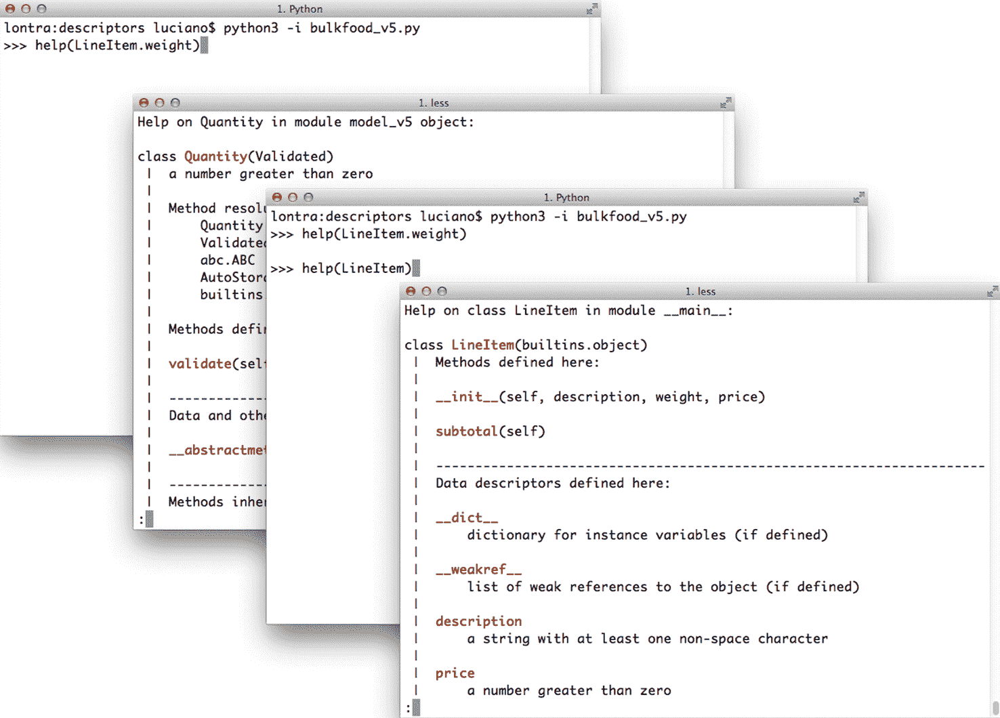

# 第二十三章：属性描述符

> 了解描述符不仅提供了更大的工具集，还深入了解了 Python 的工作原理，并欣赏了其设计的优雅之处。
> 
> Raymond Hettinger，Python 核心开发者和专家¹

描述符是在多个属性中重用相同访问逻辑的一种方式。例如，在 ORM 中，如 Django ORM 和 SQLAlchemy 中的字段类型是描述符，管理数据从数据库记录中的字段流向 Python 对象属性，反之亦然。

描述符是实现由`__get__`、`__set__`和`__delete__`方法组成的动态协议的类。`property`类实现了完整的描述符协议。与动态协议一样，部分实现是可以的。事实上，我们在实际代码中看到的大多数描述符只实现了`__get__`和`__set__`，许多只实现了这些方法中的一个。

描述符是 Python 的一个显著特征，不仅在应用程序级别部署，还在语言基础设施中部署。用户定义的函数是描述符。我们将看到描述符协议如何允许方法作为绑定或非绑定方法运行，具体取决于它们的调用方式。

理解描述符是掌握 Python 的关键。这就是本章的主题。

在本章中，我们将重构我们在“使用属性进行属性验证”中首次看到的大量食品示例，将属性替换为描述符。这将使在不同类之间重用属性验证逻辑变得更容易。我们将解决覆盖和非覆盖描述符的概念，并意识到 Python 函数也是描述符。最后，我们将看到一些关于实现描述符的提示。

# 本章的新内容

由于 Python 3.6 中添加了描述符协议的`__set_name__`特殊方法，“LineItem Take #4: 自动命名存储属性”中的`Quantity`描述符示例得到了极大简化。

我删除了以前在“LineItem Take #4: 自动命名存储属性”中的属性工厂示例，因为它变得无关紧要：重点是展示解决`Quantity`问题的另一种方法，但随着`__set_name__`的添加，描述符解决方案变得简单得多。

以前出现在“LineItem Take #5: 新的描述符类型”中的`AutoStorage`类也消失了，因为`__set_name__`使其变得过时。

# 描述符示例：属性验证

正如我们在“编写属性工厂”中看到的，属性工厂是一种避免重复编写获取器和设置器的方法，通过应用函数式编程模式来实现。属性工厂是一个高阶函数，它创建一个参数化的访问器函数集，并从中构建一个自定义属性实例，使用闭包来保存像`storage_name`这样的设置。解决相同问题的面向对象方式是使用描述符类。

我们将继续之前留下的`LineItem`示例系列，在“编写属性工厂”中，通过将`quantity`属性工厂重构为`Quantity`描述符类来使其更易于使用。

## LineItem Take #3: 一个简单的描述符

正如我们在介绍中所说，实现`__get__`、`__set__`或`__delete__`方法的类是描述符。您通过将其实例声明为另一个类的类属性来使用描述符。

我们将创建一个`Quantity`描述符，`LineItem`类将使用两个`Quantity`实例：一个用于管理`weight`属性，另一个用于`price`。图表有助于理解，所以看一下图 23-1。


###### 图 23-1。`LineItem`使用名为`Quantity`的描述符类的 UML 类图。在 UML 中带有下划线的属性是类属性。请注意，weight 和 price 是附加到`LineItem`类的`Quantity`实例，但`LineItem`实例也有自己的 weight 和 price 属性，其中存储这些值。

请注意，单词`weight`在图 23-1 中出现两次，因为实际上有两个名为`weight`的不同属性：一个是`LineItem`的类属性，另一个是将存在于每个`LineItem`对象中的实例属性。`price`也适用于此。

### 理解描述符的术语

实现和使用描述符涉及几个组件，精确命名这些组件是很有用的。在本章的示例中，我将使用以下术语和定义来描述。一旦看到代码，它们将更容易理解，但我想提前列出这些定义，以便您在需要时可以参考它们。

描述符类

实现描述符协议的类。在图 23-1 中就是`Quantity`。

托管类

声明描述符实例为类属性的类。在图 23-1 中，`LineItem`是托管类。

描述符实例

每个描述符类的实例，声明为托管类的类属性。在图 23-1 中，每个描述符实例由一个带有下划线名称的组合箭头表示（下划线表示 UML 中的类属性）。黑色菱形接触`LineItem`类，其中包含描述符实例。

托管实例

托管类的一个实例。在这个例子中，`LineItem`实例是托管实例（它们没有显示在类图中）。

存储属性

托管实例的属性，保存该特定实例的托管属性的值。在图 23-1 中，`LineItem`实例的属性`weight`和`price`是存储属性。它们与描述符实例不同，后者始终是类属性。

托管属性

托管类中的公共属性，由描述符实例处理，值存储在存储属性中。换句话说，描述符实例和存储属性为托管属性提供基础设施。

重要的是要意识到`Quantity`实例是`LineItem`的类属性。这一关键点在图 23-2 中由磨坊和小玩意突出显示。


###### 图 23-2。使用 MGN（磨坊和小玩意符号）注释的 UML 类图：类是生产小玩意的磨坊。`Quantity`磨坊生成两个带有圆形头部的小玩意，它们附加到`LineItem`磨坊：weight 和 price。`LineItem`磨坊生成具有自己的 weight 和 price 属性的矩形小玩意，其中存储这些值。

现在足够涂鸦了。这里是代码：示例 23-1 展示了`Quantity`描述符类，示例 23-2 列出了使用两个`Quantity`实例的新`LineItem`类。

##### 示例 23-1。bulkfood_v3.py：`Quantity`描述符不接受负值

```py
class Quantity:  # ①

    def __init__(self, storage_name):
        self.storage_name = storage_name  # ②

    def __set__(self, instance, value):  # ③
        if value > 0:
            instance.__dict__[self.storage_name] = value  # ④
        else:
            msg = f'{self.storage_name} must be > 0'
            raise ValueError(msg)

    def __get__(self, instance, owner):  # ⑤
        return instance.__dict__[self.storage_name]
```

①

描述符是基于协议的特性；不需要子类化来实现。

②

每个`Quantity`实例都将有一个`storage_name`属性：这是用于在托管实例中保存值的存储属性的名称。

③

当尝试对托管属性进行赋值时，将调用`__set__`。在这里，`self`是描述符实例（即`LineItem.weight`或`LineItem.price`），`instance`是托管实例（一个`LineItem`实例），`value`是正在分配的值。

④

我们必须直接将属性值存储到`__dict__`中；调用`set​attr​(instance, self.storage_name)`将再次触发`__set__`方法，导致无限递归。

⑤

我们需要实现`__get__`，因为被管理属性的名称可能与`storage_name`不同。`owner`参数将很快解释。

实现`__get__`是必要的，因为用户可能会编写类似于这样的内容：

```py
class House:
    rooms = Quantity('number_of_rooms')
```

在`House`类中，被管理的属性是`rooms`，但存储属性是`number_of_rooms`。给定一个名为`chaos_manor`的`House`实例，读取和写入`chaos_manor.rooms`会通过附加到`rooms`的`Quantity`描述符实例，但读取和写入`chaos_manor.number_of_rooms`会绕过描述符。

请注意，`__get__`接收三个参数：`self`、`instance`和`owner`。`owner`参数是被管理类的引用（例如`LineItem`），如果您希望描述符支持检索类属性以模拟 Python 在实例中找不到名称时检索类属性的默认行为，则很有用。

如果通过类（如`Line​Item.weight`）检索被管理属性（例如`weight`），则描述符`__get__`方法的`instance`参数的值为`None`。

为了支持用户的内省和其他元编程技巧，最好让`__get__`在通过类访问被管理属性时返回描述符实例。为此，我们将像这样编写`__get__`：

```py
    def __get__(self, instance, owner):
        if instance is None:
            return self
        else:
            return instance.__dict__[self.storage_name]
```

示例 23-2 演示了在`LineItem`中使用`Quantity`。

##### 示例 23-2\. bulkfood_v3.py：`Quantity`描述符管理`LineItem`中的属性

```py
class LineItem:
    weight = Quantity('weight')  # ①
    price = Quantity('price')  # ②

    def __init__(self, description, weight, price):  # ③
        self.description = description
        self.weight = weight
        self.price = price

    def subtotal(self):
        return self.weight * self.price
```

①

第一个描述符实例将管理`weight`属性。

②

第二个描述符实例将管理`price`属性。

③

类主体的其余部分与*bulkfood_v1.py*中的原始代码一样简单干净（示例 22-19）。

示例 23-2 中的代码按预期运行，防止以$0 的价格出售松露:³

```py
>>> truffle = LineItem('White truffle', 100, 0)
Traceback (most recent call last):
    ...
ValueError: value must be > 0
```

###### 警告

在编写描述符`__get__`和`__set__`方法时，请记住`self`和`instance`参数的含义：`self`是描述符实例，`instance`是被管理实例。管理实例属性的描述符应将值存储在被管理实例中。这就是为什么 Python 提供`instance`参数给描述符方法的原因。

存储每个被管理属性的值在描述符实例本身中可能很诱人，但是错误的。换句话说，在`__set__`方法中，而不是编写：

```py
    instance.__dict__[self.storage_name] = value
```

诱人但错误的替代方案是：

```py
    self.__dict__[self.storage_name] = value
```

要理解为什么这样做是错误的，请考虑`__set__`的前两个参数的含义：`self`和`instance`。这里，`self`是描述符实例，实际上是被管理类的类属性。您可能在内存中同时拥有成千上万个`LineItem`实例，但只有两个描述符实例：类属性`LineItem.weight`和`LineItem.price`。因此，您存储在描述符实例本身中的任何内容实际上是`LineItem`类属性的一部分，因此在所有`LineItem`实例之间共享。

示例 23-2 的一个缺点是在被管理类主体中实例化描述符时需要重复属性名称。如果`LineItem`类可以这样声明就好了：

```py
class LineItem:
    weight = Quantity()
    price = Quantity()

    # remaining methods as before
```

目前，示例 23-2 需要显式命名每个`Quantity`，这不仅不方便，而且很危险。如果一个程序员复制粘贴代码时忘记编辑两个名称，并写出类似`price = Quantity('weight')`的内容，程序将表现糟糕，每当设置`price`时都会破坏`weight`的值。

问题在于——正如我们在第六章中看到的——赋值的右侧在变量存在之前执行。表达式`Quantity()`被评估为创建一个描述符实例，而`Quantity`类中的代码无法猜测描述符将绑定到的变量的名称（例如`weight`或`price`）。

幸运的是，描述符协议现在支持名为`__set_name__`的特殊方法。我们将看到如何使用它。

###### 注意

描述符存储属性的自动命名曾经是一个棘手的问题。在*流畅的 Python*第一版中，我在本章和下一章中花了几页和几行代码来介绍不同的解决方案，包括使用类装饰器，然后在第二十四章中使用元类。这在 Python 3.6 中得到了极大简化。

## LineItem 第 4 版：自动命名存储属性

为了避免在描述符实例中重新输入属性名称，我们将实现`__set_name__`来设置每个`Quantity`实例的`storage_name`。`__set_name__`特殊方法在 Python 3.6 中添加到描述符协议中。解释器在`class`体中找到的每个描述符上调用`__set_name__`——如果描述符实现了它。⁴

在示例 23-3 中，`LineItem`描述符类不需要`__init__`。相反，`__set_item__`保存了存储属性的名称。

##### 示例 23-3\. bulkfood_v4.py：`__set_name__`为每个`Quantity`描述符实例设置名称

```py
class Quantity:

    def __set_name__(self, owner, name):  # ①
        self.storage_name = name          # ②

    def __set__(self, instance, value):   # ③
        if value > 0:
            instance.__dict__[self.storage_name] = value
        else:
            msg = f'{self.storage_name} must be > 0'
            raise ValueError(msg)

    # no __get__ needed # ④

class LineItem:
    weight = Quantity()  # ⑤
    price = Quantity()

    def __init__(self, description, weight, price):
        self.description = description
        self.weight = weight
        self.price = price

    def subtotal(self):
        return self.weight * self.price
```

①

`self`是描述符实例（而不是托管实例），`owner`是托管类，`name`是`owner`的属性的名称，在`owner`的类体中将此描述符实例分配给的名称。

②

这就是示例 23-1 中的`__init__`所做的事情。

③

这里的`__set__`方法与示例 23-1 中完全相同。

④

实现`__get__`是不必要的，因为存储属性的名称与托管属性的名称匹配。表达式`product.price`直接从`LineItem`实例获取`price`属性。

⑤

现在我们不需要将托管属性名称传递给`Quantity`构造函数。这是这个版本的目标。

查看示例 23-3，您可能会认为这是为了管理几个属性而编写的大量代码，但重要的是要意识到描述符逻辑现在抽象为一个单独的代码单元：`Quantity`类。通常我们不会在使用它的同一模块中定义描述符，而是在一个专门设计用于跨应用程序使用的实用程序模块中定义描述符——即使在许多应用程序中，如果您正在开发一个库或框架。

有了这个想法，示例 23-4 更好地代表了描述符的典型用法。

##### 示例 23-4\. bulkfood_v4c.py：`LineItem`定义简洁；`Quantity`描述符类现在位于导入的`model_v4c`模块中

```py
import model_v4c as model  # ①

class LineItem:
    weight = model.Quantity()  # ②
    price = model.Quantity()

    def __init__(self, description, weight, price):
        self.description = description
        self.weight = weight
        self.price = price

    def subtotal(self):
        return self.weight * self.price
```

①

导入实现`Quantity`的`model_v4c`模块。

②

使用`model.Quantity`。

Django 用户会注意到 示例 23-4 看起来很像一个模型定义。这不是巧合：Django 模型字段就是描述符。

因为描述符是以类的形式实现的，我们可以利用继承来重用一些用于新描述符的代码。这就是我们将在下一节中做的事情。

## LineItem 第五版：一种新的描述符类型

想象中的有机食品店遇到了麻烦：某种方式创建了一个带有空白描述的行项目实例，订单无法完成。为了防止这种情况发生，我们将创建一个新的描述符 `NonBlank`。在设计 `NonBlank` 时，我们意识到它将非常类似于 `Quantity` 描述符，除了验证逻辑。

这促使进行重构，生成 `Validated`，一个覆盖 `__set__` 方法的抽象类，调用必须由子类实现的 `validate` 方法。

然后我们将重写 `Quantity`，并通过继承 `Validated` 并编写 `validate` 方法来实现 `NonBlank`。

`Validated`、`Quantity` 和 `NonBlank` 之间的关系是《设计模式》经典中描述的 *模板方法* 的应用：

> 模板方法以抽象操作的形式定义算法，子类重写这些操作以提供具体行为。⁵

在 示例 23-5 中，`Validated.__set__` 是模板方法，`self.validate` 是抽象操作。

##### 示例 23-5\. model_v5.py：`Validated` 抽象基类

```py
import abc

class Validated(abc.ABC):

    def __set_name__(self, owner, name):
        self.storage_name = name

    def __set__(self, instance, value):
        value = self.validate(self.storage_name, value)  # ①
        instance.__dict__[self.storage_name] = value  # ②

    @abc.abstractmethod
    def validate(self, name, value):  # ③
        """return validated value or raise ValueError"""
```

①

`__set__` 将验证委托给 `validate` 方法…

②

…然后使用返回的 `value` 更新存储的值。

③

`validate` 是一个抽象方法；这就是模板方法。

Alex Martelli 更喜欢将这种设计模式称为 *自委托*，我同意这是一个更具描述性的名称：`__set__` 的第一行自委托给 `validate`。⁶

本示例中的具体 `Validated` 子类是 `Quantity` 和 `NonBlank`，如 示例 23-6 所示。

##### 示例 23-6\. model_v5.py：`Quantity` 和 `NonBlank`，具体的 `Validated` 子类

```py
class Quantity(Validated):
    """a number greater than zero"""

    def validate(self, name, value):  # ①
        if value <= 0:
            raise ValueError(f'{name} must be > 0')
        return value

class NonBlank(Validated):
    """a string with at least one non-space character"""

    def validate(self, name, value):
        value = value.strip()
        if not value:  # ②
            raise ValueError(f'{name} cannot be blank')
        return value  # ③
```

①

实现 `Validated.validate` 抽象方法所需的模板方法。

②

如果前导和尾随空格被剥离后没有剩余内容，则拒绝该值。

③

要求具体的 `validate` 方法返回经过验证的值，这为它们提供了清理、转换或规范化接收到的数据的机会。在这种情况下，`value` 被返回时没有前导或尾随空格。

*model_v5.py* 的用户不需要知道所有这些细节。重要的是他们可以使用 `Quantity` 和 `NonBlank` 来自动验证实例属性。请查看 示例 23-7 中的最新 `LineItem` 类。

##### 示例 23-7\. bulkfood_v5.py：`LineItem` 使用 `Quantity` 和 `NonBlank` 描述符

```py
import model_v5 as model  # ①

class LineItem:
    description = model.NonBlank()  # ②
    weight = model.Quantity()
    price = model.Quantity()

    def __init__(self, description, weight, price):
        self.description = description
        self.weight = weight
        self.price = price

    def subtotal(self):
        return self.weight * self.price
```

①

导入 `model_v5` 模块，并给它一个更友好的名称。

②

将 `model.NonBlank` 投入使用。其余代码保持不变。

我们在本章中看到的 `LineItem` 示例展示了描述符管理数据属性的典型用法。像 `Quantity` 这样的描述符被称为覆盖描述符，因为其 `__set__` 方法覆盖（即拦截和覆盖）了受管实例中同名实例属性的设置。然而，也有非覆盖描述符。我们将在下一节详细探讨这种区别。

# 覆盖与非覆盖描述符

请记住，Python 处理属性的方式存在重要的不对称性。通过实例读取属性通常会返回实例中定义的属性，但如果实例中没有这样的属性，则会检索类属性。另一方面，向实例分配属性通常会在实例中创建属性，而不会对类产生任何影响。

这种不对称性也影响到 descriptors，实际上创建了两种广泛的 descriptors 类别，取决于是否实现了`__set__`方法。如果存在`__set__`，则该类是 overriding descriptor；否则，它是 nonoverriding descriptor。在我们研究下面示例中的 descriptor 行为时，这些术语将会有意义。

观察不同 descriptor 类别需要一些类，因此我们将使用 Example 23-8 中的代码作为接下来章节的测试基础。

###### 提示

Example 23-8 中的每个`__get__`和`__set__`方法都调用`print_args`，以便以可读的方式显示它们的调用。理解`print_args`和辅助函数`cls_name`和`display`并不重要，所以不要被它们分散注意力。

##### 示例 23-8\. descriptorkinds.py：用于研究 descriptor overriding 行为的简单类。

```py
### auxiliary functions for display only ###

def cls_name(obj_or_cls):
    cls = type(obj_or_cls)
    if cls is type:
        cls = obj_or_cls
    return cls.__name__.split('.')[-1]

def display(obj):
    cls = type(obj)
    if cls is type:
        return f'<class {obj.__name__}>'
    elif cls in [type(None), int]:
        return repr(obj)
    else:
        return f'<{cls_name(obj)} object>'

def print_args(name, *args):
    pseudo_args = ', '.join(display(x) for x in args)
    print(f'-> {cls_name(args[0])}.__{name}__({pseudo_args})')

### essential classes for this example ###

class Overriding:  # ①
    """a.k.a. data descriptor or enforced descriptor"""

    def __get__(self, instance, owner):
        print_args('get', self, instance, owner)  # ②

    def __set__(self, instance, value):
        print_args('set', self, instance, value)

class OverridingNoGet:  # ③
    """an overriding descriptor without ``__get__``"""

    def __set__(self, instance, value):
        print_args('set', self, instance, value)

class NonOverriding:  # ④
    """a.k.a. non-data or shadowable descriptor"""

    def __get__(self, instance, owner):
        print_args('get', self, instance, owner)

class Managed:  # ⑤
    over = Overriding()
    over_no_get = OverridingNoGet()
    non_over = NonOverriding()

    def spam(self):  # ⑥
        print(f'-> Managed.spam({display(self)})')
```

①

一个带有`__get__`和`__set__`的 overriding descriptor 类。

②

`print_args`函数被这个示例中的每个 descriptor 方法调用。

③

没有`__get__`方法的 overriding descriptor。

④

这里没有`__set__`方法，因此这是一个 nonoverriding descriptor。

⑤

托管类，使用每个 descriptor 类的一个实例。

⑥

`spam`方法在这里用于比较，因为方法也是 descriptors。

在接下来的章节中，我们将研究对`Managed`类及其一个实例上的属性读取和写入的行为，逐个检查定义的不同 descriptors。

## Overriding Descriptors

实现`__set__`方法的 descriptor 是*overriding descriptor*，因为虽然它是一个类属性，但实现`__set__`的 descriptor 将覆盖对实例属性的赋值尝试。这就是 Example 23-3 的实现方式。属性也是 overriding descriptors：如果您不提供 setter 函数，`property`类的默认`__set__`将引发`AttributeError`，以表示该属性是只读的。通过 Example 23-8 中的代码，可以在 Example 23-9 中看到对 overriding descriptor 的实验。

###### 警告

Python 的贡献者和作者在讨论这些概念时使用不同的术语。我从书籍*Python in a Nutshell*中采用了“overriding descriptor”。官方 Python 文档使用“data descriptor”，但“overriding descriptor”突出了特殊行为。Overriding descriptors 也被称为“enforced descriptors”。非 overriding descriptors 的同义词包括“nondata descriptors”或“shadowable descriptors”。

##### 示例 23-9\. overriding descriptor 的行为

```py
>>> obj = Managed()  # ①
>>> obj.over  # ②
-> Overriding.__get__(<Overriding object>, <Managed object>, <class Managed>)
>>> Managed.over  # ③
-> Overriding.__get__(<Overriding object>, None, <class Managed>)
>>> obj.over = 7  # ④
-> Overriding.__set__(<Overriding object>, <Managed object>, 7)
>>> obj.over  # ⑤
-> Overriding.__get__(<Overriding object>, <Managed object>, <class Managed>)
>>> obj.__dict__['over'] = 8  # ⑥
>>> vars(obj)  # ⑦
{'over': 8}
>>> obj.over  # ⑧
-> Overriding.__get__(<Overriding object>, <Managed object>, <class Managed>)
```

①

为测试创建`Managed`对象。

②

`obj.over`触发 descriptor `__get__` 方法，将托管实例`obj`作为第二个参数传递。

③

`Managed.over`触发 descriptor `__get__` 方法，将`None`作为第二个参数（`instance`）传递。

④

对`obj.over`进行赋值会触发 descriptor `__set__` 方法，将值`7`作为最后一个参数传递。

⑤

读取`obj.over`仍然会调用描述符`__get__`方法。

⑥

绕过描述符，直接将值设置到`obj.__dict__`。

⑦

验证该值是否在`obj.__dict__`中，位于`over`键下。

⑧

然而，即使有一个名为`over`的实例属性，`Managed.over`描述符仍然会覆盖尝试读取`obj.over`。

## 覆盖没有 __get__ 的描述符

属性和其他覆盖描述符，如 Django 模型字段，实现了`__set__`和`__get__`，但也可以只实现`__set__`，就像我们在示例 23-2 中看到的那样。在这种情况下，只有描述符处理写入。通过实例读取描述符将返回描述符对象本身，因为没有`__get__`来处理该访问。如果通过直接访问实例`__dict__`创建了一个同名实例属性，并通过该实例访问设置了一个新值，则`__set__`方法仍将覆盖进一步尝试设置该属性，但读取该属性将简单地从实例中返回新值，而不是返回描述符对象。换句话说，实例属性将遮蔽描述符，但仅在读取时。参见示例 23-10。

##### 示例 23-10\. 没有`__get__`的覆盖描述符

```py
>>> obj.over_no_get  # ①
<__main__.OverridingNoGet object at 0x665bcc>
>>> Managed.over_no_get  # ②
<__main__.OverridingNoGet object at 0x665bcc>
>>> obj.over_no_get = 7  # ③
-> OverridingNoGet.__set__(<OverridingNoGet object>, <Managed object>, 7)
>>> obj.over_no_get  # ④
<__main__.OverridingNoGet object at 0x665bcc>
>>> obj.__dict__['over_no_get'] = 9  # ⑤
>>> obj.over_no_get  # ⑥
9
>>> obj.over_no_get = 7  # ⑦
-> OverridingNoGet.__set__(<OverridingNoGet object>, <Managed object>, 7)
>>> obj.over_no_get  # ⑧
9
```

①

这个覆盖描述符没有`__get__`方法，因此读取`obj.over_no_get`会从类中检索描述符实例。

②

如果我们直接从托管类中检索描述符实例，也会发生同样的事情。

③

尝试将值设置为`obj.over_no_get`会调用`__set__`描述符方法。

④

因为我们的`__set__`不进行更改，再次读取`obj.over_no_get`将从托管类中检索描述符实例。

⑤

通过实例`__dict__`设置一个名为`over_no_get`的实例属性。

⑥

现在`over_no_get`实例属性遮蔽了描述符，但仅用于读取。

⑦

尝试为`obj.over_no_get`分配一个值仍然会通过描述符集。

⑧

但是对于读取，只要有同名实例属性，该描述符就会被遮蔽。

## 非覆盖描述符

一个不实现`__set__`的描述符是一个非覆盖描述符。设置一个同名的实例属性将遮蔽描述符，在该特定实例中无法处理该属性。方法和`@functools.cached_property`被实现为非覆盖描述符。示例 23-11 展示了非覆盖描述符的操作。

##### 示例 23-11\. 非覆盖描述符的行为

```py
>>> obj = Managed()
>>> obj.non_over  # ①
-> NonOverriding.__get__(<NonOverriding object>, <Managed object>, <class Managed>)
>>> obj.non_over = 7  # ②
>>> obj.non_over  # ③
7
>>> Managed.non_over  # ④
-> NonOverriding.__get__(<NonOverriding object>, None, <class Managed>)
>>> del obj.non_over  # ⑤
>>> obj.non_over  # ⑥
-> NonOverriding.__get__(<NonOverriding object>, <Managed object>, <class Managed>)
```

①

`obj.non_over`触发描述符`__get__`方法，将`obj`作为第二个参数传递。

②

`Managed.non_over`是一个非覆盖描述符，因此没有`__set__`干扰此赋值。

③

现在`obj`有一个名为`non_over`的实例属性，它遮蔽了`Managed`类中同名的描述符属性。

④

`Managed.non_over`描述符仍然存在，并通过类捕获此访问。

⑤

如果删除`non_over`实例属性...

⑥

…然后读取`obj.non_over`会触发类中描述符的`__get__`方法，但请注意第二个参数是受控实例。

在之前的示例中，我们看到了对实例属性进行多次赋值，属性名与描述符相同，并根据描述符中是否存在`__set__`方法而产生不同的结果。

类中属性的设置不能由附加到同一类的描述符控制。特别是，这意味着描述符属性本身可以被赋值给类，就像下一节所解释的那样。

## 在类中覆盖描述符

无论描述符是覆盖还是非覆盖的，都可以通过对类的赋值来覆盖。这是一种猴子补丁技术，但在示例 23-12 中，描述符被整数替换，这将有效地破坏任何依赖描述符进行正确操作的类。

##### 示例 23-12\. 任何描述符都可以在类本身上被覆盖

```py
>>> obj = Managed()  # ①
>>> Managed.over = 1  # ②
>>> Managed.over_no_get = 2
>>> Managed.non_over = 3
>>> obj.over, obj.over_no_get, obj.non_over  # ③
(1, 2, 3)
```

①

创建一个新实例以供后续测试。

②

覆盖类中的描述符属性。

③

描述符真的消失了。

示例 23-12 揭示了关于读取和写入属性的另一个不对称性：尽管可以通过附加到受控类的`__get__`的描述符来控制类属性的读取，但是通过附加到同一类的`__set__`的描述符无法处理类属性的写入。

###### 提示

为了控制类中属性的设置，您必须将描述符附加到类的类中，换句话说，元类。默认情况下，用户定义类的元类是`type`，您无法向`type`添加属性。但是在第二十四章中，我们将创建自己的元类。

现在让我们专注于描述符在 Python 中如何用于实现方法。

# 方法是描述符

当在实例上调用时，类中的函数会变成绑定方法，因为所有用户定义的函数都有一个`__get__`方法，因此当附加到类时，它们作为描述符运行。示例 23-13 演示了从示例 23-8 中引入的`Managed`类中读取`spam`方法。

##### 示例 23-13\. 方法是一个非覆盖描述符

```py
>>> obj = Managed()
>>> obj.spam  # ①
<bound method Managed.spam of <descriptorkinds.Managed object at 0x74c80c>>
>>> Managed.spam  # ②
<function Managed.spam at 0x734734>
>>> obj.spam = 7  # ③
>>> obj.spam
7
```

①

从`obj.spam`读取会得到一个绑定的方法对象。

②

但是从`Managed.spam`读取会得到一个函数。

③

给`obj.spam`赋值会隐藏类属性，使得`obj`实例无法从`spam`方法中访问。

函数不实现`__set__`，因为它们是非覆盖描述符，正如示例 23-13 的最后一行所示。

从示例 23-13 中另一个关键点是`obj.spam`和`Managed.spam`检索到不同的对象。与描述符一样，当通过受控类进行访问时，函数的`__get__`返回对自身的引用。但是当访问通过实例进行时，函数的`__get__`返回一个绑定的方法对象：一个可调用对象，包装函数并将受控实例（例如`obj`）绑定到函数的第一个参数（即`self`），就像`functools.partial`函数所做的那样（如“使用 functools.partial 冻结参数”中所示）。要更深入地了解这种机制，请查看示例 23-14。

##### 示例 23-14\. method_is_descriptor.py：一个从`UserString`派生的`Text`类

```py
import collections

class Text(collections.UserString):

    def __repr__(self):
        return 'Text({!r})'.format(self.data)

    def reverse(self):
        return self[::-1]
```

现在让我们来研究`Text.reverse`方法。参见示例 23-15。

##### 示例 23-15\. 使用方法进行实验

```py
    >>> word = Text('forward')
    >>> word  # ①
    Text('forward')
    >>> word.reverse()  # ②
    Text('drawrof')
    >>> Text.reverse(Text('backward'))  # ③
    Text('drawkcab')
    >>> type(Text.reverse), type(word.reverse)  # ④
    (<class 'function'>, <class 'method'>)
    >>> list(map(Text.reverse, ['repaid', (10, 20, 30), Text('stressed')]))  # ⑤
    ['diaper', (30, 20, 10), Text('desserts')]
    >>> Text.reverse.__get__(word)  # ⑥
    <bound method Text.reverse of Text('forward')>
    >>> Text.reverse.__get__(None, Text)  # ⑦
    <function Text.reverse at 0x101244e18>
    >>> word.reverse  # ⑧
    <bound method Text.reverse of Text('forward')>
    >>> word.reverse.__self__  # ⑨
    Text('forward')
    >>> word.reverse.__func__ is Text.reverse  # ⑩
    True
```

①

`Text`实例的`repr`看起来像一个`Text`构造函数调用，可以创建一个相同的实例。

②

`reverse`方法返回拼写颠倒的文本。

③

在类上调用的方法作为一个函数。

④

注意不同类型：一个`function`和一个`method`。

⑤

`Text.reverse`作为一个函数运行，甚至可以处理不是`Text`实例的对象。

⑥

任何函数都是非覆盖描述符。使用实例调用其`__get__`将检索绑定到该实例的方法。

⑦

使用`None`作为`instance`参数调用函数的`__get__`将检索函数本身。

⑧

表达式`word.reverse`实际上调用了`Text.reverse.__get__(word)`，返回绑定方法。

⑨

绑定方法对象有一个`__self__`属性，保存着调用该方法的实例的引用。

⑩

绑定方法的`__func__`属性是指向所管理类中原始函数的引用。

绑定方法对象还有一个`__call__`方法，用于处理实际的调用。这个方法调用`__func__`中引用的原始函数，将方法的`__self__`属性作为第一个参数传递。这就是传统`self`参数的隐式绑定方式的工作原理。

将函数转换为绑定方法的方式是描述符在语言中作为基础设施使用的一个典型例子。

在深入了解描述符和方法的工作原理之后，让我们来看看关于它们使用的一些建议。

# 描述符使用提示

以下列表解决了刚才描述的描述符特性的一些实际后果：

使用`property`保持简单

内置的`property`创建覆盖描述符，实现`__set__`和`__get__`，即使你没有定义一个 setter 方法。⁷ 属性的默认`__set__`会引发`AttributeError: can't set attribute`，因此属性是创建只读属性的最简单方式，避免了下面描述的问题。

只读描述符需要`__set__`

如果你使用描述符类来实现一个只读属性，你必须记得编写`__get__`和`__set__`，否则在实例上设置一个同名属性将会遮蔽描述符。只读属性的`__set__`方法应该只是引发`AttributeError`并附带适当的消息。⁸

验证描述符只能与`__set__`一起使用

在仅用于验证的描述符中，`__set__`方法应该检查其接收到的`value`参数，如果有效，直接在实例的`__dict__`中使用描述符实例名称作为键设置它。这样，从实例中读取具有相同名称的属性将尽可能快，因为它不需要`__get__`。查看示例 23-3 的代码。

使用`__get__`可以高效地进行缓存

如果只编写 `__get__` 方法，则具有非覆盖描述符。 这些对于进行一些昂贵的计算然后通过在实例上设置同名属性来缓存结果很有用。⁹ 同名实例属性将遮蔽描述符，因此对该属性的后续访问将直接从实例 `__dict__` 中获取，而不再触发描述符 `__get__`。 `@functools.cached_property` 装饰器实际上生成一个非覆盖描述符。

非特殊方法可以被实例属性遮蔽

因为函数和方法只实现 `__get__`，它们是非覆盖描述符。 诸如 `my_obj.the_method = 7` 这样的简单赋值意味着通过该实例进一步访问 `the_method` 将检索数字 `7` —— 而不会影响类或其他实例。 但是，这个问题不会干扰特殊方法。 解释器只在类本身中查找特殊方法，换句话说，`repr(x)` 被执行为 `x.__class__.__repr__(x)`，因此在 `x` 中定义的 `__repr__` 属性对 `repr(x)` 没有影响。 出于同样的原因，实例中存在名为 `__getattr__` 的属性不会颠覆通常的属性访问算法。

实例中非特殊方法如此容易被覆盖可能听起来脆弱且容易出错，但在我个人超过 20 年的 Python 编码中从未受到过这方面的影响。 另一方面，如果您正在进行大量的动态属性创建，其中属性名称来自您无法控制的数据（就像我们在本章的前面部分所做的那样），那么您应该意识到这一点，并可能实现一些过滤或转义动态属性名称以保持理智。

###### 注意

`FrozenJSON` 类在 示例 22-5 中受到实例属性遮蔽方法的保护，因为它的唯一方法是特殊方法和 `build` 类方法。 只要始终通过类访问类方法，类方法就是安全的，就像我在 示例 22-5 中使用 `FrozenJSON.build` 一样——后来在 示例 22-6 中被 `__new__` 取代。 “计算属性” 中介绍的 `Record` 和 `Event` 类也是安全的：它们只实现特殊方法、静态方法和属性。 属性是覆盖描述符，因此不会被实例属性遮蔽。

结束本章时，我们将介绍两个我们在属性中看到但在描述符的上下文中尚未解决的功能：文档和处理尝试删除托管属性。

# 描述符文档字符串和覆盖删除

描述符类的文档字符串用于记录托管类中每个描述符的实例。 图 23-4 显示了带有示例 23-6 和 23-7 中的 `Quantity` 和 `NonBlank` 描述符的 `LineItem` 类的帮助显示。

这有点令人不满意。 对于 `LineItem`，例如，添加 `weight` 必须是千克的信息会很好。 这对于属性来说是微不足道的，因为每个属性处理一个特定的托管属性。 但是使用描述符，`Quantity` 描述符类用于 `weight` 和 `price`。¹⁰

我们讨论了与属性一起讨论的第二个细节，但尚未使用描述符处理尝试删除托管属性的尝试。这可以通过在描述符类中实现`__delete__`方法来完成，而不是通常的`__get__`和/或`__set__`。我故意省略了对`__delete__`的覆盖，因为我认为实际使用是罕见的。如果您需要此功能，请参阅[“实现描述符”](https://fpy.li/23-2)部分的[Python 数据模型文档](https://fpy.li/dtmodel)。编写一个带有`__delete__`的愚蠢描述符类留给悠闲的读者作为练习。



###### 图 23-4。在发出命令`help(LineItem.weight)`和`help(LineItem)`时 Python 控制台的屏幕截图。

# 章节总结

本章的第一个示例是从第二十二章的`LineItem`示例中延续的。在示例 23-2 中，我们用描述符替换了属性。我们看到描述符是一个提供实例的类，这些实例被部署为托管类中的属性。讨论这种机制需要特殊术语，引入了诸如*托管实例*和*存储属性*之类的术语。

在“LineItem Take #4: Automatic Naming of Storage Attributes”中，我们取消了要求使用显式`storage_name`声明`Quantity`描述符的要求，这是多余且容易出错的。解决方案是在`Quantity`中实现`__set_name__`特殊方法，将托管属性的名称保存为`self.storage_name`。

“LineItem Take #5: A New Descriptor Type”展示了如何对抽象描述符类进行子类化，以在构建具有一些共同功能的专门描述符时共享代码。

然后，我们研究了提供或省略`__set__`方法的描述符的不同行为，区分了重写和非重写描述符，即数据和非数据描述符。通过详细测试，我们揭示了描述符何时控制何时被遮蔽、绕过或覆盖。

随后，我们研究了一类特定的非重写描述符：方法。控制台实验揭示了当通过实例访问时，附加到类的函数如何通过利用描述符协议成为方法。

结束本章，“描述符使用技巧”提供了实用技巧，而“描述符文档字符串和重写删除”则简要介绍了如何记录描述符。

###### 注意

正如在“本章新内容”中所指出的，本章中的几个示例由于描述符协议中 Python 3.6 中添加的`__set_name__`特殊方法而变得简单得多。这就是语言的进化！

# 进一步阅读

除了对[“数据模型”章节](https://fpy.li/dtmodel)的必要参考外，Raymond Hettinger 的[“描述符指南”](https://fpy.li/23-3)是一个宝贵的资源——它是官方 Python 文档中[HowTo 系列](https://fpy.li/23-4)的一部分。

与 Python 对象模型主题一样，Martelli、Ravenscroft 和 Holden 的*Python in a Nutshell*，第 3 版（O’Reilly）是权威且客观的。Martelli 还有一个名为“Python 的对象模型”的演示，深入介绍了属性和描述符（请参阅[幻灯片](https://fpy.li/23-5)和[视频](https://fpy.li/23-6)）。

###### 警告

请注意，在 2016 年采用 PEP 487 之前编写或记录的描述符覆盖内容可能在今天显得过于复杂，因为在 Python 3.6 之前的版本中不支持`__set_name__`。

对于更多实际示例，《Python Cookbook》，第 3 版，作者 David Beazley 和 Brian K. Jones（O’Reilly）有许多示例说明描述符，其中我想强调“6.12\. 读取嵌套和可变大小的二进制结构”，“8.10\. 使用惰性计算属性”，“8.13\. 实现数据模型或类型系统”和“9.9\. 定义装饰器作为类”。最后一种方法解决了函数装饰器、描述符和方法交互的深层问题，解释了如果将函数装饰器实现为具有`__call__`的类，还需要实现`__get__`以便与装饰方法和函数一起使用。

[PEP 487—更简单的类创建自定义](https://fpy.li/pep487)引入了`__set_name__`特殊方法，并包括一个[验证描述符](https://fpy.li/23-7)的示例。

¹ Raymond Hettinger，《*描述符指南*》(https://fpy.li/descrhow)。

² 在 UML 类图中，类和实例被绘制为矩形。虽然在类图中有视觉差异，但实例很少在类图中显示，因此开发人员可能不会将其识别为实例。

³ 白松露每磅成本数千美元。不允许以 0.01 美元出售松露留给有企图的读者作为练习。我知道一个人实际上因为在线商店的错误（这次不是*Amazon.com*）而以 18 美元购买了一本价值 1800 美元的统计百科全书。

⁴ 更准确地说，`__set_name__`是由`type.__new__`调用的——表示类的对象的构造函数。内置的`type`实际上是一个元类，用户定义类的默认类。这一点一开始很难理解，但请放心：第二十四章专门讨论了类的动态配置，包括元类的概念。

⁵ Gamma 等人，《设计模式：可复用面向对象软件的元素》，第 326 页。

⁶ Alex Martelli 的“Python 设计模式”演讲第 50 页幻灯片(https://fpy.li/23-1)。强烈推荐。

⁷ `property`装饰器还提供了一个`__delete__`方法，即使您没有定义删除方法。

⁸ Python 在这类消息中并不一致。尝试更改`complex`数的`c.real`属性会得到`AttributeError: readonly attribute`，但尝试更改`complex`的方法`c.conjugate`会得到`AttributeError: 'complex' object attribute 'conjugate' is read-only`。甚至“read-only”的拼写也不同。

⁹ 但是，请记住，在`__init__`方法运行后创建实例属性会破坏关键共享内存优化，正如从“dict 工作原理的实际后果”中讨论的那样。

¹⁰ 自定义每个描述符实例的帮助文本实际上是非常困难的。一种解决方案需要为每个描述符实例动态构建一个包装类。
