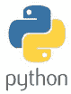
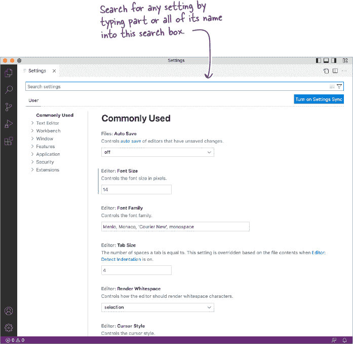
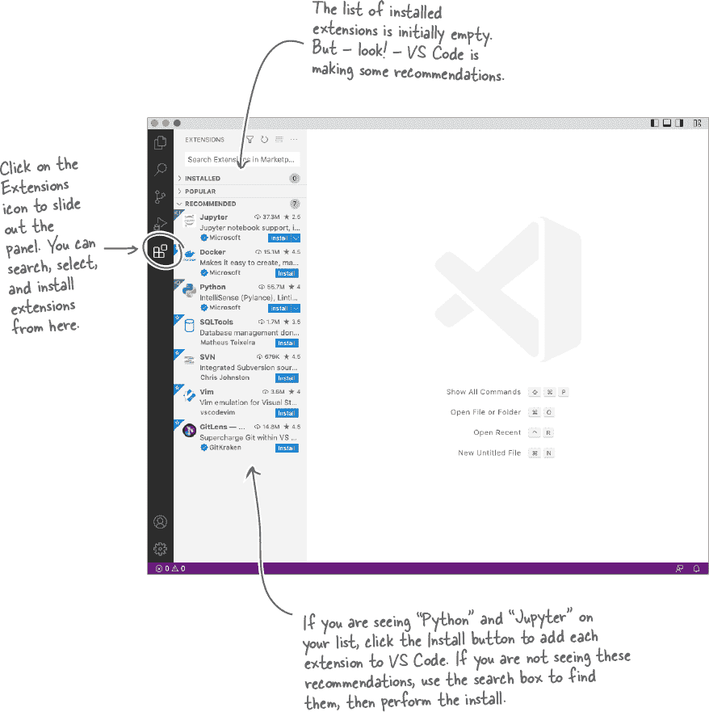
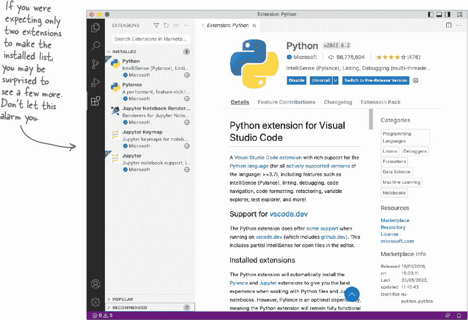
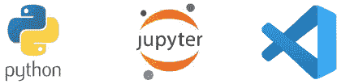

# 序言

# 安装最新的 Python 3

你在这里所做的取决于你正在运行的平台，假定是其中之一的 *Windows*、*macOS* 或 *Linux*。

好消息是所有三个平台都支持最新的 Python，即 3.10 版本。没有坏消息。



如果你已经运行了 3.10 版本或更高版本，请翻到下一页 – 你已准备就绪。如果你尚未安装 Python 或使用的是旧版本，请选择下面适合你的段落，继续阅读。

## 在 Windows 上安装

微软出色的 Python 开发人员通过 *Windows Store* 应用程序确保最新版本的 Python 始终对你可用。打开 Store，搜索“Python”，选择最新版本，然后点击 **Get** 按钮。耐心等待进度指示器从零到 100%，安装完成后，移至下一页 – 你已准备就绪。

## 在 macOS 上安装

最新的 Mac 附带了旧版本的 Python。*不要使用这些版本*。而是前往 Python 的官网 [`www.python.org/`](https://www.python.org/)，然后点击“Downloads”选项。Python 3 的最新版本将开始下载，因为 Python 网站能智能地检测到你是从 Mac 连接过来的。下载完成后，在 Downloads 文件夹中运行等待你的安装程序。点击 **Next** 按钮，直到没有更多 **Next** 按钮可点击，安装完成后，移至下一页 – 你已准备就绪。

###### 注意

**不需要移除 Mac 预安装的旧版本 Python。这次安装将替代它们。**

## 在 Linux 上安装

*Head First Coders* 是一个由技术人员组成的团队，他们的工作是让 *Head First Authors* 走上正确的道路（这可不是一件简单的事）。这些程序员热爱 *Linux* 和 *Ubuntu* 发行版，因此在这里进行了讨论。

没有什么奇怪的，最新的 Ubuntu 已安装并更新了 Python 3。如果是这种情况，很好，你已经准备好了。如果你使用的是除 Ubuntu 外的 Linux 发行版，请使用系统的软件包管理器将 Python 10（或更高版本）安装到你的 Linux 系统中。一旦完成，移至下一页 – 你已准备就绪。

**让我们用两件事完成你的安装：一个是必需的后端依赖，另一个是现代的、Python-aware 文本编辑器。**

# Python 本身并不足够

为了探索、实验和学习 Python，你需要在 Python 中安装一个运行时后端叫做 *Jupyter*。正如你马上会看到的，这很简单。

在创建 Python 代码时，你可以使用几乎 *任何* 程序员的编辑器，但是在阅读本书内容时，我们推荐你使用一个特定的编辑器：微软的 *Visual Studio Code*，全球知名的 **VS Code**。


## 安装最新的 Jupyter Notebook 后端

###### 注意

**别担心，你很快就会了解这是用来做什么的！**

无论你正在运行哪个操作系统，请确保连接到互联网，打开一个终端窗口，然后键入：

```py
python3 -m pip install jupyter
```

屏幕上会快速显示大量的状态消息。如果你看到接近结尾的消息显示“成功安装”，那么你就成功了。如果没有，请查阅 Jupyter 文档并重试。


## 安装最新版本的 VS Code

拿出你最喜欢的浏览器，然后浏览到 VS Code 的下载页面：

[`code.visualstudio.com/Download`](https://code.visualstudio.com/Download)

###### 注意

虽然有替代品可以替代 VS Code，但在我们看来，当涉及到本书的内容时，VS Code 无与伦比。而且，不，我们*不*是某种全球阴谋来推广微软的产品！！

选择与你的环境匹配的下载，然后等待下载完成。按照网站的说明安装 VS Code，然后翻页学习如何完成你的 VS Code 设置。

# 根据你的喜好配置 VS Code


第一次运行 VS Code。从菜单中选择**文件**，然后**首选项**，然后**设置**来访问编辑器的设置偏好。

###### 注意

在 Mac 上，从“Code”菜单开始。

你应该看到类似这样的东西：



直到你熟悉 VS Code 之前，你可能希望配置你的编辑器以匹配*Head First Coders*偏好的设置。以下是本书中使用的设置：

+   *缩进指南*已关闭。

+   编辑器的*外观主题*设置为*Light*。

+   编辑器的*缩略图*已禁用。

+   编辑器的*出现高亮*已关闭。

+   编辑器的*渲染行高亮*设置为**none**。

+   终端和文本编辑器的*字体大小*设置为**14**。

+   笔记本的*显示单元格状态栏*设置为**隐藏**。

+   编辑器的*灯泡*已禁用。

###### 注意

你不必使用这些设置，但是如果你想在屏幕上看到本书中看到的内容，那么建议进行这些调整。

# 添加 2 个必需的 VS Code 扩展


尽管你不必复制推荐的编辑器设置，但你绝对必须安装两个 VS Code 扩展，即**Python**和**Jupyter**。

当你完成调整你首选的编辑器设置后，通过点击 X 关闭设置选项卡。然后，点击主 VS Code 屏幕左侧的扩展图标来搜索、选择和安装扩展：



# VS Code 的 Python 支持是最先进的。

安装 Python 和 Jupyter 扩展实际上会导致安装几个额外的 VS Code 扩展，如下所示：



这些额外的扩展增强了 VS Code 对 Python 和 Jupyter 的支持，超出了标准扩展的内容。虽然目前您不需要知道这些额外扩展的作用，但要知道：它们有助于将 VS Code 打造成一个*功能强大*的 Python 编辑器。



**安装了 Python 3、Jupyter 和 VS Code，您就准备好了！**

###### 注意

**是的，这是关于 Geek Notes 的 Geek Note（我们不会开任何递归笑话，谢谢）。**
