# 第一章：为什么选择 Python？：*相似但不同*

**Python 从零开始计数，这听起来应该很熟悉。** 实际上，Python 与其他编程语言有很多**共同之处**。有**变量**、**循环**、**条件**、**函数**等等。在我们的开篇章节中，我们带你快速浏览 Python 的基础知识，介绍语言而不深入细节。你将学会如何在 VS Code 和 Jupyter Notebook 中**创建**和**运行**代码。你会看到很多编程功能已经**内置**到 Python 中，你将**利用**它们完成工作。你还会了解到虽然 Python 与其他编程语言分享了很多想法，但它们在你的 Python 代码中的体现可能会有所不同。现在，不要误解：我们说的是不同的**好**，而不是不同的*坏*。继续阅读了解更多…

**当然了。但，这还不是全部。**

正如与 Python 的访谈所证实的那样，有很多理由使 Python 受欢迎。我们列出了我们从访谈中得到的要点在本页底部。

当然，还有其他理由可以考虑 Python 作为你下一个最喜爱的编程语言，但我们的列表已经足够现在使用了。

让我们花点时间更详细地考虑这些要点。一旦你调查完我们的列表，拿一支铅笔——是的，一支*铅笔*——到下一页的顶端来见我们！

 **Python 代码易于阅读。**

 **Python 带有标准库。**

 **Python 拥有实用、强大和通用的内置函数（BIFs）。**

 **Python 带有内置数据结构。**

 **Python 拥有 Python 包索引(PyPI)。**

 **Python 并不太认真。**

###### 注意

**不要低估最后一个的重要性。**

# 准备好运行一些代码

在你运行任何代码之前，还有一点点前期工作要做。

为了帮助保持事情井井有条，让我们在你的计算机上创建一个名为`Learning`的文件夹。你可以把这个文件夹放在硬盘的任何地方，只要你记得你把它放在了*哪里*，因为你*经常*会用到它。

创建了你的`Learning`文件夹后，启动 VS Code。

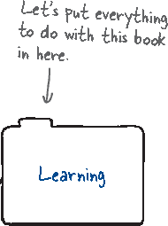

###### 注意

**如果你跳过了介绍而感到难过，不要紧。你不是第一个这样做的，也不会是最后一个。 **

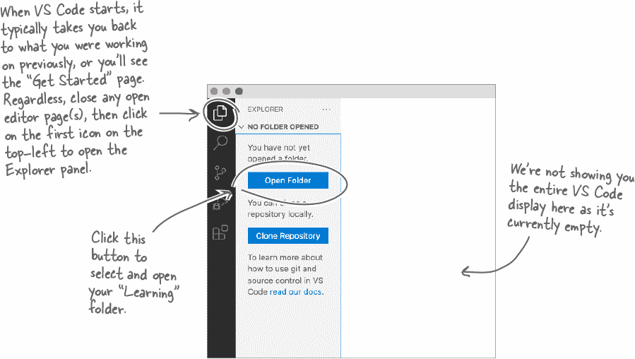

每次在本书中使用 VS Code 时，根据需要打开你的`Learning`文件夹。**现在就这样做**。

# 为你的第一次 Jupyter 体验做准备

好的。您正在运行 VS Code，并且已打开了您的`Learning`文件夹。首先选择**文件**菜单，然后选择**新建文件…**菜单选项来创建一个新的笔记本。您将看到三个选择：

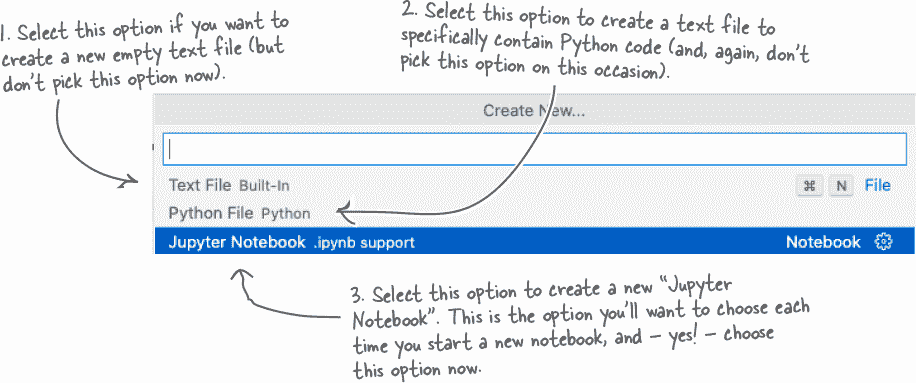

VS Code 创建并打开了一个新的、*无标题*的笔记本，称为`Untitled-1.ipynb`，它会出现在屏幕上，大致如下所示：

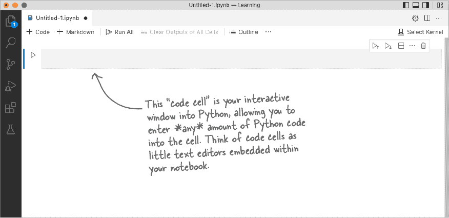

鼓声响起，您现在可以输入并运行一些 Python 代码了。

**没必要，只需按下 Shift+Enter 即可。**

Jupyter 提供了设计精良的键盘快捷键，使您与笔记本的交互变得轻松，比如同时按下**Shift**和**Enter**键。

###### 注意

**当您在本书中看到“Shift+Enter”时，请按住 Shift 键，然后轻按 Enter 键（在释放两者之前）。**

# 按下 Shift+Enter 运行单元格中的代码

当您按下**Shift+Enter**时，当前选定单元格中的代码将运行。然后*焦点*会移动到笔记本中的下一个单元格。如果不存在“下一个单元格”，Jupyter 会为您创建一个新的单元格：

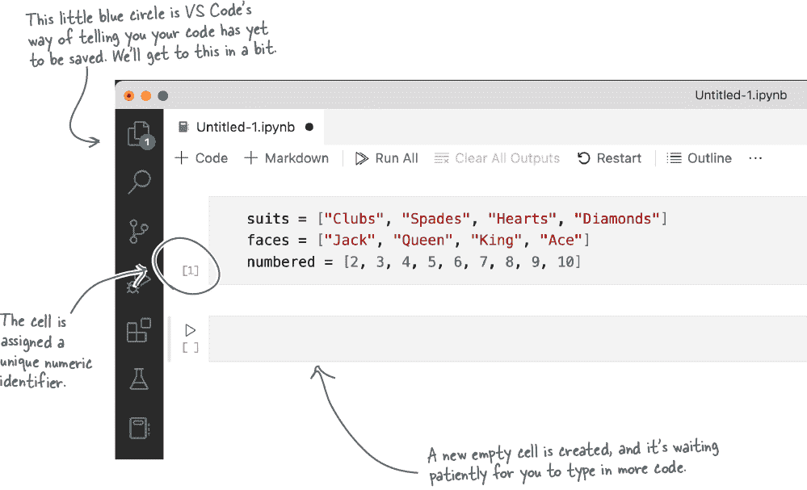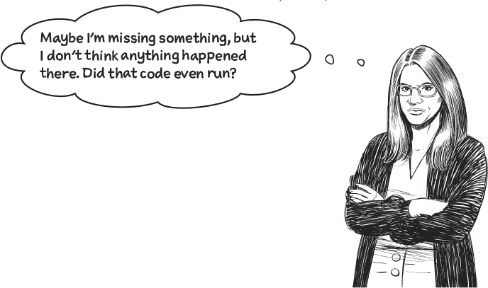

**代码运行了，但没有产生输出。**

这三行代码是 Python 变量赋值的示例。变量的名称在`**=**`运算符的左侧，其值在右侧。

这些变量的值由此代码*定义*。

**仍然没有输出，但是此代码正在执行。**

**导入**语句已引入`random`库，并且**def**语句已定义了`draw`函数。让我们运行一下这个函数，看看会发生什么…

## 所以… Python 代码确实很容易阅读… 和运行

除了 Jupyter，还有其他运行 Python 代码的方式，随着您在本书中的学习，您将了解其中一些方式。但是，在我们看来，使用带有 Jupyter 扩展的 VS Code 是学习该语言时阅读、运行、实验和玩耍 Python 代码的*完美*方式。所以准备好在 Jupyter 和 VS Code 中*花费大量时间*。

继续前进之前，请花一点时间从 VS Code 菜单中选择**文件**然后选择**保存**，将您的笔记本保存为`Cards.ipynb`。

###### 注意

**现在就这么做！**

# 如果您想要一堆卡片怎么办？

您的`draw`函数是一个很好的开始，每次执行该函数时从牌堆中抽取一张牌。但是，如果您想抽取五张牌呢？或者十张？或者二十张？或者所有五十二张呢？

虽然手动多次调用您的`draw`函数可能有点蠢，大多数程序员会选择使用循环。稍后在本书中您将更多了解 Python 的循环。现在，这是如何使用 Python 的**for**循环执行一些代码固定次数的方法：

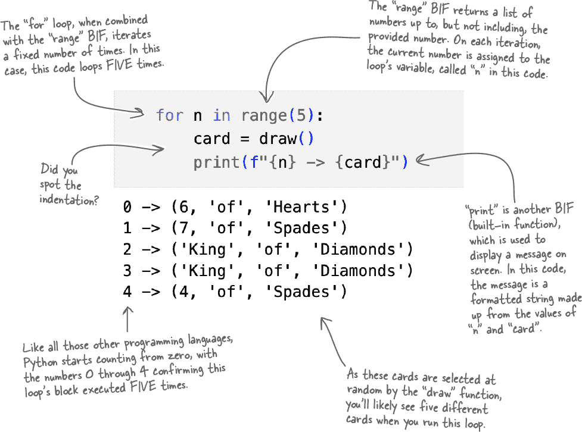

从表面上看，**for**循环的缩进块运行了五次。但是，你能发现输出中的问题吗？

**是的，循环代码画了相同的牌两次。**

当然，这里的假设是抽取的牌不会放回扑克牌堆中。所以... 除非你在玩“魔术牌”（或者有人在搞破坏），否则这段代码随机选择相同的牌不太可能是所需的。

如果你的目标是模拟一副扑克牌，那么当前的`draw`函数显然不够格，对吧？

# **The Big 4: list, tuple, dictionary, and set**

Python 对数据结构的出色内置支持是传奇的，并且通常被认为是大多数 Python 程序员*热爱*Python 的主要原因。

作为你的开篇章节，我们现在不会给你过多深入讨论这些数据结构。后面本书有很多页（实际上是整整的章节）专门讲解*The Big 4*。

虽然我们还没有特别强调它们的使用，但你已经遇到了列表*和*元组。虽然我们稍早有些狡猾地称它们为*数组*，但它们确实是 Python 中的真正，诚实可靠的**列表**：

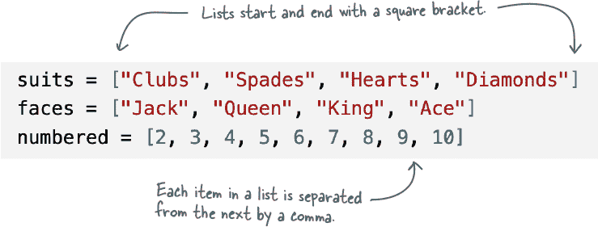

你也见识过不少元组。每次调用`draw`函数时，它都会给你一个**元组**：

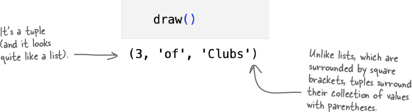

你可能会觉得元组看起来有点奇怪，我们也得承认我们也觉得它们看起来有点奇怪。不过，不要让这担心你。

本书后面你将更多地了解列表和元组。尽管列表和元组各有其用途，但在模拟一副扑克牌时，它们并不是一个很好的选择。这里需要一些其他的数据结构。但是，哪一个呢？

###### 注意

**提示：这一页的标题里有一个重要的线索。**

# 用什么数据结构来模拟你的扑克牌堆呢？

虽然 Python 的**字典**数据结构非常受欢迎，但它主要提供查找功能（这个特性稍后在本书中将会有大量介绍）。尽管如此，和列表以及元组一样，字典并不是模拟你的扑克牌堆的最佳选择。

这留给你的是**set**。

在 Python 中，集合就像数学课上的集合：它们包含一组唯一的值，不允许重复。正如下面的代码片段展示的那样，当你使用 Python 集合时，你会继承一个叫做**add**的方法，这个方法 - 准备好了吗 - 将一个项目添加到现有集合中。

看看这个循环，它使用上一页的三个列表构建一副扑克牌。

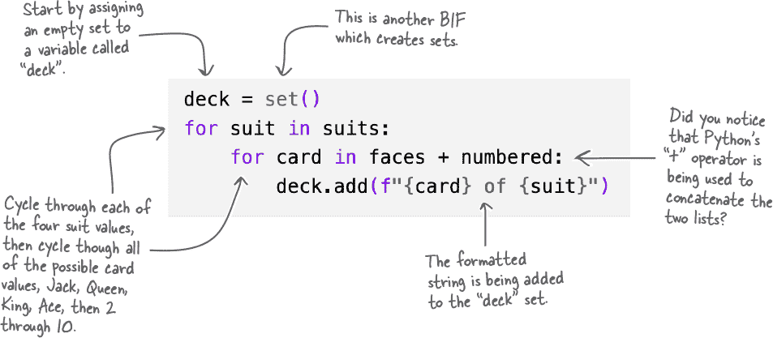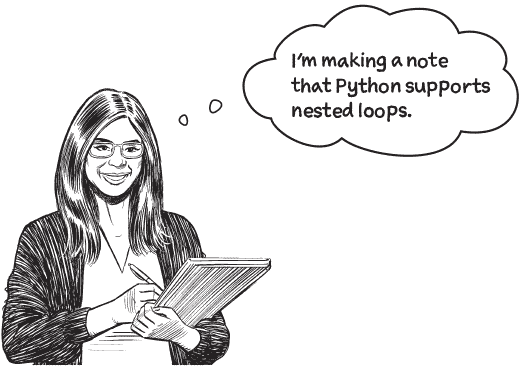

**这应该不会让人感到意外。**

与任何循环相关联的代码块可以包含任何其他代码，包括另一个循环。这是理所当然的。但是，你注意到 Python 使用缩进使得确定哪个块属于哪里变得很容易了吗？

# 使用 BIFs 更多地了解你的变量

Python 的内置函数有很多用途。虽然你在这一章的前二十页中学到的东西还不多，但你已经了解了一些**len**、**print**、**range**和**set**。

我们知道你已经耐心等待了这么久......所以让我们看看**len**的实际效果：

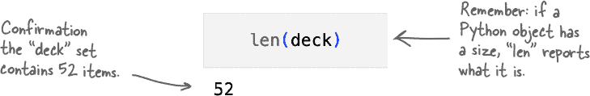

正如你无疑可以想象的那样，**len**被广泛使用。然而，最常用的 BIF 很可能是**print**，它除了其他功能外还能在屏幕上显示对象。让我们看看当**print**被要求显示你的`deck`变量时会发生什么：

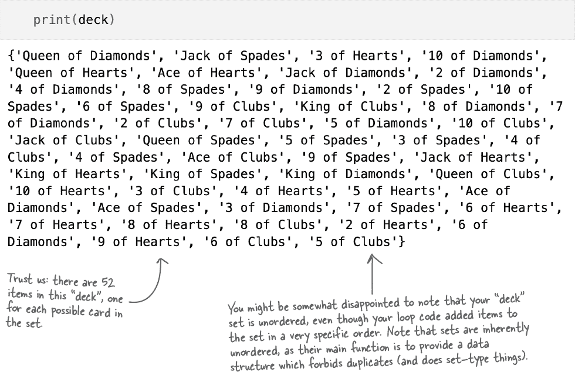

# 链式调用 BIF（Built-in Functions）来完成更多任务

你可以同时使用多个 BIF（如果需要的话）。一个了解的很好的 BIF 是**sorted**，它返回任何对象数据的排序副本。

**sorted** BIF 经常与**print** BIF 结合使用，显示一些数据的有序版本。不过需要注意，**sorted** 返回的有序数据总是一个列表，不管排序的是什么数据。这意味着在集合上使用**sorted**并不会产生一个有序的集合，而是产生一个由原始无序集合数据组成的有序列表。原始集合保持不变，仍然是一个无序集合。

> **记住：“BIF” 是 “built-in function” 的缩写。**

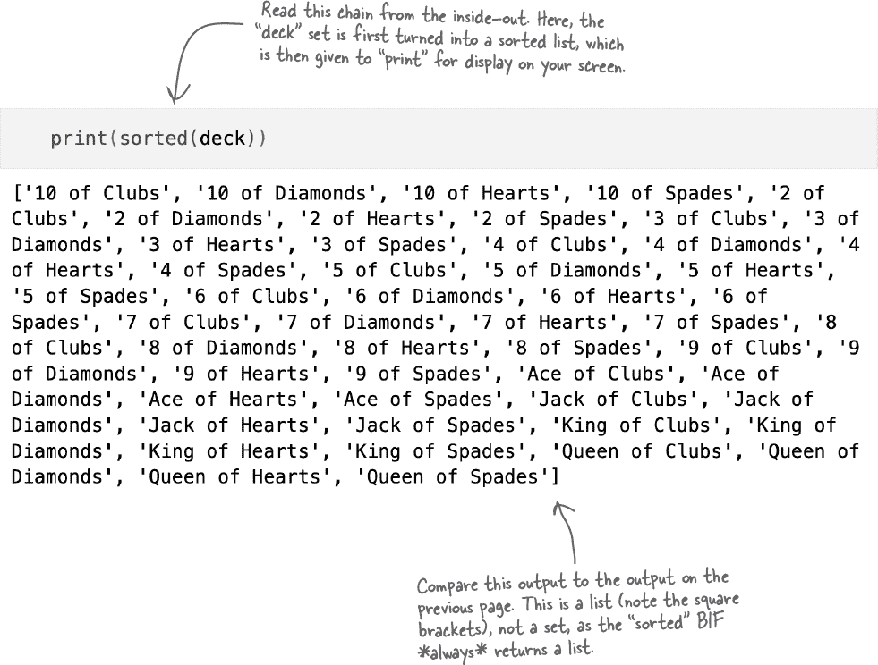

**print** **sorted** 的链式调用是一个很好的组合，但准备好在接下来的链式调用（显示在下一页上）中键入比你想象的更多的次数。这确实是一个常见的组合，而且非常有用。

# 打印和 dir 组合的曼波舞

当提供任何 Python 对象的名称时，**dir** BIF 返回该对象的属性列表，对于`deck`变量来说，这些属性与集合对象相关联。

正如你在下面所见，与 Python 集合相关联的属性非常多。请注意，**dir**的输出与**print** BIF 的调用链接在一起，确保显示的输出横跨你的屏幕而不是向下滚动，从而减少你可怜的手指需要滚动的量。这可能或可能不是一个值得庆祝的事情，但嘿！每一点帮助都是好的。

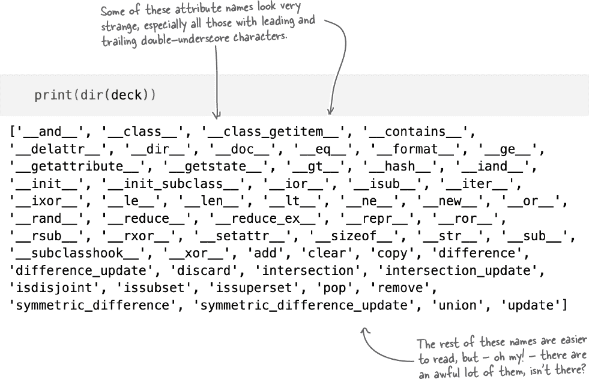

在查看**print** **dir**输出时，有一个简单的规则要遵循：*暂时忽略以双下划线开头和结尾的属性*。稍后在本书中你会了解它们的存在原因，但是暂时忽略，忽略，忽略！

# 使用 dir 输出获取帮助

看上去你可能不会这样认为，但在使用 Python 时，你很可能会比使用其他任何 BIF 更频繁地使用**dir** BIF，特别是在 Jupyter 笔记本中进行实验时。这是因为**dir** 能够列出与任何对象相关联的属性列表。通常，这些属性包括可应用于对象的方法列表。

虽然随机执行与`deck`变量相关的任何方法可能很诱人（尽管有点疯狂），但更明智的方法是阅读与该方法相关的文档...

现在不用担心：我们不会让你去翻阅成千上万页的在线 Python 文档。那是**help** BIF 的工作：

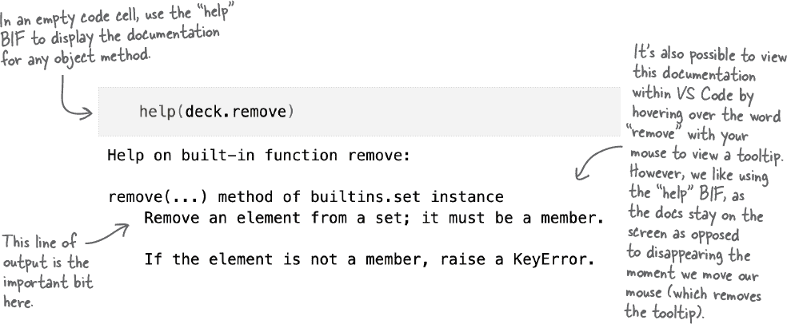

# 现在感觉像是一副卡牌了

现在你的卡牌组已经是一个集合，你可以更好地模拟它的行为。

遗憾的是，从牌堆中随机选择一张卡片变得复杂，因为本章前面介绍的`random.choice`技术在集合中不起作用。这有点令人遗憾，因为希望可以使用`random.choice(deck)`来从你的牌堆中选择一张卡片，但是——遗憾的是——这不会起作用。

###### 注意

**现在，不用担心为什么会这样。原因有点技术性，我们会在本书的后面重新讨论。**

###### 注意

**这是为了确保我们的读者继续阅读，对吧？！？[编辑]。**

不用担心。一个快速的技巧让你首先*将你的卡牌集合*转换为一个列表，然后可以与`random.choice`一起使用。这不能再简单了：

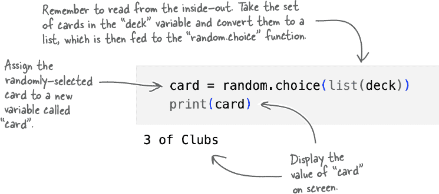

已经选择了一张卡片（对我们来说是*三个梅花*，但如果你在跟随的话可能是另一张卡），我们真的应该将这张卡从牌堆中移除，这样后续的随机选择就不会再选中它了。在前一页的底部显示了一个关键提示，说明了哪个集合方法可以帮助你。

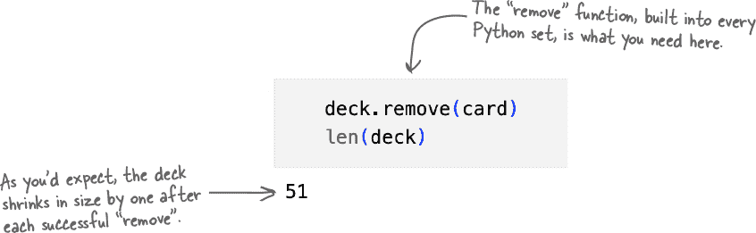

# “card”究竟是什么？

如果你想知道`card`变量是什么，还有另一个 BIF，叫做**type**，它报告当前分配给`card`的值的类型：

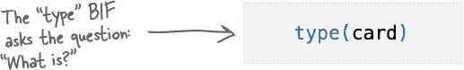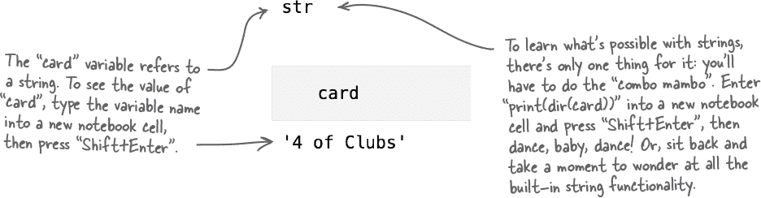

**括号是可选的。**

*你*可以将你的条件语句包裹在括号中，但这样做会使代码难以阅读。大多数 Python 程序员只在需要澄清代码含义时才使用括号。

# 但是，等等！还有更多...

现在你可能已经被 Python 所吸引，因为你已经看到它不仅易于阅读还易于运行你的 Python 代码。但是，你还没有完成。

在本章的其余部分，你将继续快速浏览 Python 的其他显著特性。

由于这是一本*Head First*书籍，我们告诉你这些内容是不够的，我们希望你能*体验*它们。因此，在 VS Code 中，关闭你的`Cards`笔记本，然后创建一个名为`WhyPython.ipynb`的新笔记本。本章剩余部分将在这个新笔记本中进行。

###### 注意

**要在 VS Code 中创建新的笔记本，请选择“文件”，然后从菜单中选择“新建文件...”。选择第三个选项创建一个新的无标题笔记本。执行“文件”，保存以将无标题名称更改为“WhyPython.ipynb”。**

**是的。每一个... 单词。**

哦，我们只是开玩笑。

本章的目标是让您对 Python 有足够的了解，以便了解 Python 为什么如此受欢迎。因此，本章的覆盖范围非常*高级*。

但是，不用担心：稍后在本书中，您将详细*地*回顾所有这些材料。现在，集中精力理解您所看到的主要内容。

**准备好您的新笔记本，在 VS Code 中开始深入研究。**

# Python 附带了一个丰富的标准库

*Python 标准库*（PSL）是指随 Python 捆绑安装的大量 Python 函数、类型、模块、类和包的名称。一旦安装了 Python，这些都是保证存在的。

当您听到程序员把 Python 称为“电池已包含”时，他们部分指的是 PSL。其中有很多内容：[`docs.python.org/3/library/index.xhtml`](https://docs.python.org/3/library/index.xhtml)。

> **在本书中，“PSL”是“Python 标准库”的简称。**

**这确实是一个非常恰当的描述。**

Python 安装包括 PSL，PSL 非常完整，大多数情况下，您可以依赖它提供的功能完成大量工作。这意味着 Python 本身就足够了，标准安装的 Python 可以直接使用，无需额外安装。因此，*电池已包含*。

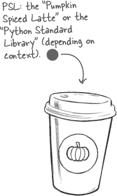

## 顺便说一句：Python 不是“玩具语言”

这是对 Python 的常见批评，认为它并不是“真正”的编程语言，或者某种“玩具”。如果这些观察甚至有一点真实性，您不会期望任何人*任何地方*都在使用 Python 进行任何有用的事情，更不用说依赖 Python 来推动他们的业务了。

Python 可能确实看起来*不同*，但这并不意味着它不能完成工作。Python 很有趣，但这并不意味着它是一个玩具。远非如此。

**那里确实发生了很多事情。**

我们的目标是让您对 PSL 有所了解，而不是让您深入探索它的细节。

您不必知道所有这些内容，也不必记住上一页的内容，尽管有三点您应该考虑。

###### 注意

**明确一点：我们不是在谈论咖啡……**

 **您仅仅触及了表面**

PSL 包含了很多内容，前两页内容提供了最简短的一瞥。在阅读本书时，我们会提到 PSL 的使用，以确保您不会错过任何内容（您还将在附录中找到资源，可以进一步探索 PSL）。

 **PSL 代表一个大量经过测试的代码库，你不需要自己编写，直接使用即可。** 由于 PSL 已存在数十年，其中的模块已经被全球各地的 Python 程序员彻底测试过。因此，你可以放心地使用 PSL 模块。

 **PSL 是可以信赖的，因此你可以依赖它的模块是可用的。**

除了一些非常特定的边缘情况（例如一个微型嵌入式微控制器提供最小的 Python 环境），你可以确信使用任何 PSL 模块的代码将可移植到其他支持 PSL 的系统上。

**让我们使用你的最新笔记本快速查看 PSL 中的两个模块。**

# 使用 Python，你只需编写你需要的代码

PSL 是 Python 努力确保你只在绝对必要时才编写新代码的一个典范。如果 PSL 中的模块解决了你的问题，使用它：*抵制从头开始编码的冲动*。

当涉及到重用代码时，可以挖掘的不仅仅是 PSL。

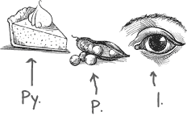

## Python 的包生态系统令人垂涎欲滴

对于 PSL 中已包含的内容并不满足，Python 社区支持第三方模块、类和包的在线集中存储库。这被称为*Python 包索引*，位于这里：[`pypi.org/`](https://pypi.org/)。

称为*PyPI*（发音为“派皮”），这个索引是一个庞大的软件集合。一旦找到你想要的东西，安装就像小菜一碟，而且随着本书的进展，你会得到大量从 PyPI 安装的实践。

现在，花十分钟访问 PyPI 网站（如下所示），四处看看。

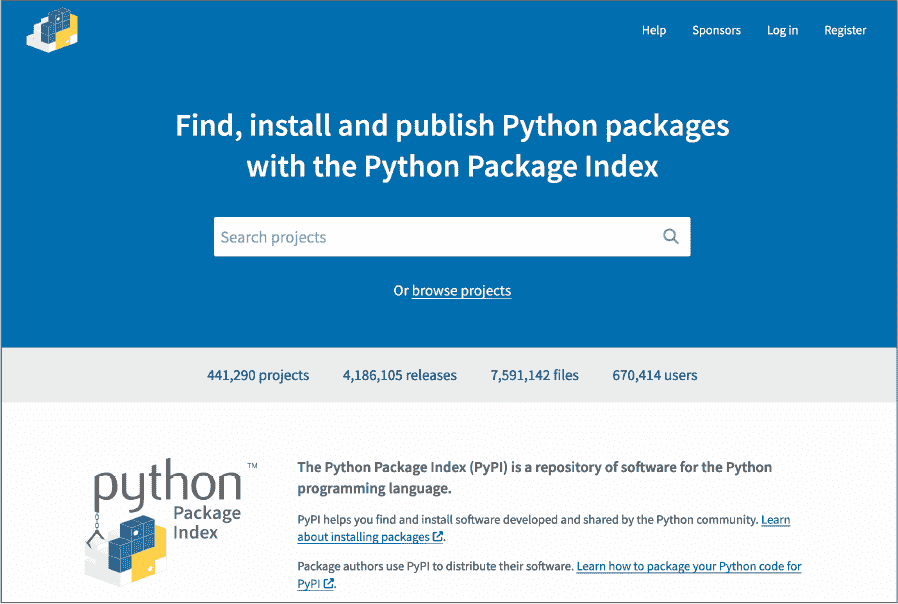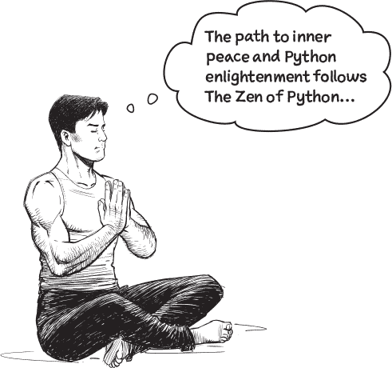

**好的。如果这对你有帮助，当然，遵循你的 Python 之道！**

严肃地说，当一种编程语言以一群喜剧演员的名义命名时，有时事情会变得有点儿荒谬。这并不是一件坏事。

Python 文档中充斥着对*蒙提·派森*的引用（抱歉）。在其他文档偏爱*foo*和*bar*时，Python 文档更偏爱*鹦鹉、垃圾邮件*和*鸡蛋*。或者是*鸡蛋*和*垃圾邮件*？不管怎样，正如文档所述：你不必喜欢*蒙提·派森*才能使用 Python，但喜欢会更好。

Python 带有两个*彩蛋*，展示了 Python 程序员有时并不太认真，而且也不介意其他人对他们开玩笑。要看到我们的意思，请返回你的 WhyPython 笔记本，最后，在两个新的代码单元格中，运行以下每一行代码。享受吧！

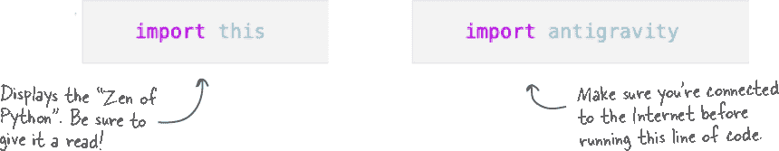

**而且我们可以帮助你。**

在下一章，我们介绍——并且*立即*开始用 Python 代码解决一个现实世界的问题。*在一起*，我们会在需要时更详细地重新访问本章的材料，随着本书的进展来构建一个解决方案。

在继续之前，请花些时间阅读下一页的章节总结，然后通过本章的填字游戏测试你的记忆技能。

见你在下一章，第二章，实际上这是你的*第二*章，因为我们从零开始计数（就像 Python 一样）。

# 卡牌套牌填字游戏

*祝贺你完成了开章的探索，这一章被编号为零，以纪念 Python 和其他许多编程语言一样，从零开始计数。在你深入下一章之前，花几分钟时间尝试这个填字游戏。所有的答案都可以在本章的页面找到，解答在下一页。祝你玩得开心！*

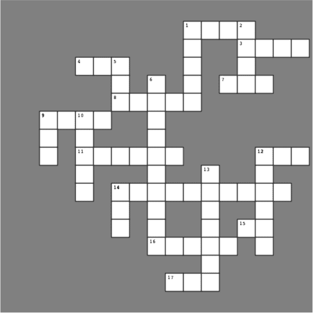

**横向**

2\. A built-in function which tells you what something is.

3\. Objects surrounded by `[` and `]`.

4\. Shorthand for built-in function.

7\. Reports on an object’s size.

8\. Generates collection of numbers.

9\. The Python Package Index.

11\. Includes a module in your code.

12\. Objects surrounded by `{` and `}`.

14\. This chapter’s missing Big 4.

15\. This operator can find things.

16\. Use together with Shift to run.

17\. Enlightenment, Python-style.

**竖向**

1\. Objects surrounded by `(` and `)`, and it is one of the Big 4, too.

2\. The optional part of an `if` statement.

5\. Loops a specific number of times.

6\. The name given to Python’s default variable.

9\. It’s not a *Pumpkin Skinny Latte*, but shares the same acronym

10\. Displays to screen.

12\. It’s what the `card` variable is.

13\. It’s either `True` or `False`.

14\. Makes up the *combo mambo*.

# 卡牌套牌填字游戏解答

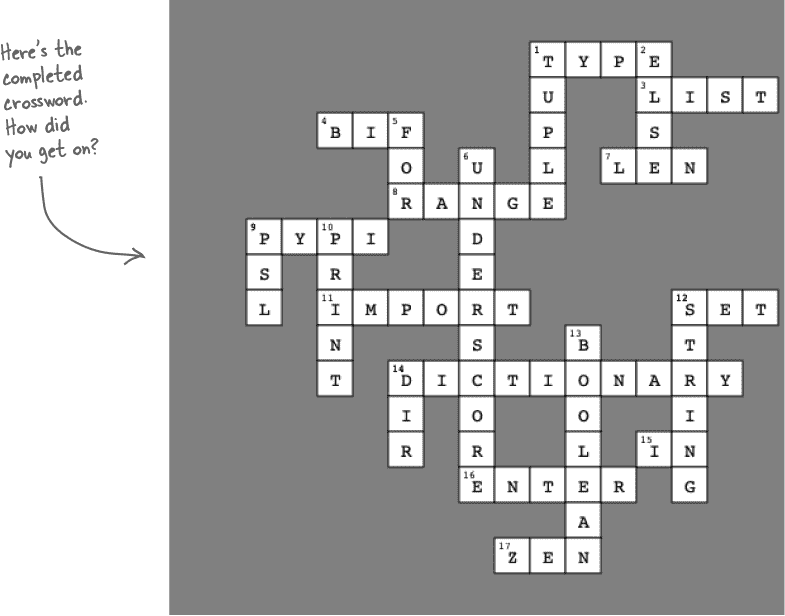

**横向**

2\. A built-in function which tells you what something is.

3\. Objects surrounded by `[` and `]`.

4\. Shorthand for built-in function.

7\. Reports on an object’s size.

8\. Generates collection of numbers.

9\. The Python Package Index.

11\. Includes a module in your code.

12\. Objects surrounded by `{` and `}`.

14\. This chapter’s missing Big 4.

15\. This operator can find things.

16\. Use together with Shift to run.

17\. Enlightenment, Python-style.

**竖向**

1\. Objects surrounded by `(` and `)`, and it is one of the Big 4, too.

2\. The optional part of an `if` statement.

5\. Loops a specific number of times.

6\. The name given to Python’s default variable.

9\. It’s not a *Pumpkin Skinny Latte*, but shares the same acronym

10\. Displays to screen.

12\. It’s what the `card` variable is.

13\. It’s either `True` or `False`.

14\. Makes up the *combo mambo*.

# 就在你以为你已经完成时...

拿起你的剪刀，这里有一个便于剪下来的 Jupyter Notebook 键盘快捷键图表，我们认为这些是*必不可少的*。随着你对 Jupyter 的了解增加，你会开始使用所有这些快捷键。目前，**Shift+Enter** 仍然是最重要的组合键。

###### 注意

**就像我们要求你剪掉背面的内容一样好！**
