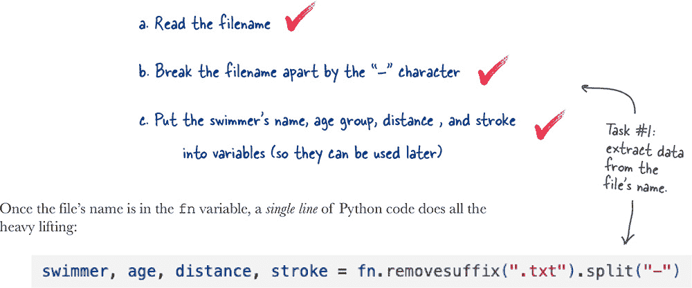

# 第二章：深入：*让我们一起做个浪花*


**学习新语言的最佳方式是编写一些代码。** 如果你打算写一些代码，你将需要一个**真实**的问题。碰巧我们正好有一个这样的问题。在本章中，你将以我们友好的、邻里的**游泳教练**开始你的 Python 应用开发之旅。你将从 Python **字符串**开始，学习如何按照你的意愿**操作**它们，同时朝着用 Python 解决教练问题的方向前进。你还将看到更多 Python 内置的**列表**数据结构，了解**变量**的工作原理，并学会如何阅读 Python 的**错误信息**，而不会深陷其中，所有这些都是通过解决一个*真实*问题和*真实*的 Python 代码来实现的。让我们（冒头）深入…


**这听起来很有趣。**

你随后与教练的聊天开始逐渐揭示一些细节…

当涉及监控年轻游泳者的进展时，教练*手动*完成所有操作。在训练过程中，他在可靠的剪贴板上记录每位游泳者的训练时间，然后在家里*手动*将每位游泳者的时间输入到他最喜爱的电子表格程序中，以进行简单的性能分析。

就目前而言，这个分析是直接的。会话时间被平均，简单的条形图允许快速视觉检查游泳者的表现。教练坦言自己是电脑新手，称他在“折腾电子表格方面”比教小游泳者要好得多。


# 现在的工作情况是怎样的？

目前，教练无法扩展他的游泳俱乐部会员，因为他的行政开销太大。

要理解为什么会这样，请看一下教练为目前 12 岁的达里乌斯（Darius）准备的电子表格，他目前处于 13 岁以下年龄组中游泳：


乍看之下，这看起来并不那么糟糕。直到你考虑到，每次训练后教练都要创建*六十多*这样的电子表格。

俱乐部只有二十二名游泳者，但由于每个人可以游不同的距离/泳姿组合，二十二名游泳者很容易变成超过六十张电子表格。这是大量手动处理电子表格工作。

正如你可以想象的那样，整个过程*极其*缓慢…

# 命运决定对你微笑。

对世界上最大的在线购物网站进行快速搜索，发现了一个描述为*互联网连接的数字智能秒表*的新设备。作为产品名称，这有点啰嗦，但这款智能秒表允许教练记录识别游泳者的游泳时间，然后将其作为带有`.txt`扩展名的 CSV 文件传输到云端。作为这些文件中匹配到达里乌斯的电子表格页面的示例，这里是文件内容：


**上一页的数据看起来很有希望。**

如果你能够解决如何处理一个文件，那么你就可以重复处理任意数量格式相似的文件。

**重要问题是：** ***你从哪里开始？***


# 书房谈话

**Mara:** 好的，伙计们，让我们就如何最佳处理这个数据文件提供一些建议。

**Sam:** 我猜这有两个部分，对吧？

**Alex:** 怎么说？

**Sam:** 首先，我认为文件名中包含一些有用的数据，所以需要处理一下。其次，文件本身中包含的计时数据也需要提取、转换和处理。

**Mara:** “转换”是什么意思？

**Alex:** 这也是我的问题。

**Sam:** 我和教练核实过，“1:27.95”表示一分 27 秒 95 百分之一秒。在处理这些数值时，特别是计算平均值时，需要考虑这一点。因此，需要进行某种数值转换。还要记住文件中的数据是*文本*。

**Alex:** 我会把“转换”加到待办事项列表上。

**Mara:** 我猜文件名需要分解以获取游泳者的详细信息？

**Sam:** 是的。“Darius-13-100m-Fly”前缀可以在“-”字符上分解，从而得到游泳者的姓名（Darius）、他们的年龄组（13 岁以下）、游泳距离（100 米）和泳姿（蝶泳）。

**Alex:** 那是假设我们能读取文件名吗？

**Sam:** 那不是理所当然的吗？

**Mara:** 不是很确定，所以我们仍然需要为此编写代码，尽管我很确定 PSL 可以在这方面提供帮助。

**Alex:** 情况变得有点复杂了……

**Sam:** 只要我们一点点来就好了。

**Mara:** 我们只需要一个行动计划。

**Alex:** 如果我们打算用 Python 完成所有这些工作，我们还需要多学习一点。

**Sam:** 我可以推荐一本很棒的书…… 

# 文件和电子表格是“相关的”

在我们着手处理第一项任务之前，花点时间回顾一下文件名中嵌入的数据，以及文件数据如何与教练的电子表格相关联：


# 我们的第一个任务：提取文件名中的数据

现在的计划是专注于一个文件，具体来说，这个文件包含了达里乌斯在 13 岁以下组别的 100 米蝶泳成绩数据。

回想一下，包含你需要的数据的文件名叫做 `Darius-13-100m-Fly.txt.`

让我们使用 VS Code 创建一个名为 `Darius.ipynb` 的 Jupyter 笔记本，你可以在你的 **Learning** 文件夹中创建它。随着我们一起完成任务 #1，在你的笔记本中跟随着操作。

记住：要在 VS Code 中创建一个新的笔记本，请从主菜单中选择 **文件**，然后选择 **新建文件...**，然后选择 **笔记本选项。**


## 一个字符串并不真的是一个字符串...

在上述代码行中赋值运算符（=）右侧的值看起来确实像一个字符串。毕竟，它是用引号括起来的字符序列，在大多数其他编程语言中，这正是字符串的 *定义*。但在 Python 中不是这样。

在 Python 中，赋值运算符右侧的值是一个 **字符串对象**，这与字符串相差无几。但是，对象在 Python 中不仅仅是数据值。

要理解我们在这里谈论的是什么，你需要借助 combo mambo。

> **在 Python 中，一切都是对象。**


# 一个字符串是一个带有属性的对象

你已经知道如何列出任何对象的属性：使用 **print dir** combo mambo。


## 看看这里你所看到的东西，花点时间欣赏一下

如果你看着那长长的属性列表，觉得这里有很多东西要学习，不妨考虑一下这个：字符串内建了很多功能，你*不需要*为其编写代码。


**没问题。顺便问一下，问题很棒。**

这是 Python 的 **dot** 运算符，允许你在对象上调用方法。这意味着 `fn.upper()` 调用了变量 `fn` 引用的字符串的 **upper** 方法。

这与像函数一样调用的 BIFs 有些不同。例如，`len(fn)` 返回由变量 `fn` 引用的对象的大小。

调用 `fn.len()` 是错误的（因为没有这样的方法），就像尝试 `upper(fn)` 一样是错误的（因为没有这样的 BIF）。

想一下这个：方法是对象特定的，而 BIFs 提供了可应用于*任何*类型对象的*通用*功能。


**是的，没错。**

**upper** 和 **lower** 方法返回的值都是 *new* 字符串对象，它们有自己的 value 部分和 methods 部分。虽然是从变量 `fn` 所引用的数据创建的，但新字符串是 `fn` 引用的字符串的 *copies*。

这一切都是有意设计的：Python 就是应该这样工作。

# 从文件名中提取游泳者的数据

回想一下为任务 #1 提出的三个子任务：


既然你已经把文件名存储在变量 `fn` 中，我们暂时把子任务（a）视为已完成。

通过“`-`”字符分解文件名是子任务（b），你猜想其中的一个字符串方法可能会有所帮助。但是，是哪一个呢？总共有 47 个！

```py
'capitalize', 'casefold', 'center', 'count', 'encode',
'endswith', 'expandtabs', 'find', 'format', 'format_map',
'index', 'isalnum', 'isalpha', 'isascii', 'isdecimal',
'isdigit', 'isidentifier', 'islower', 'isnumeric',
'isprintable', 'isspace', 'istitle', 'isupper', 'join',
'ljust', 'lower', 'lstrip', 'maketrans', 'partition',
'removeprefix', 'removesuffix', 'replace', 'rfind',
'rindex', 'rjust', 'rpartition', 'rsplit', 'rstrip',
'split', 'splitlines', 'startswith', 'strip', 'swapcase',
'title', 'translate', 'upper', 'zfill'
```

###### 注意

**这是一个很长的字符串方法列表。虽然“upper”和“lower”方法的作用很容易猜到，但像“casefold”、“format_map”或“zfill”这些方法的作用就不那么清楚了。你需要的是一个能帮助完成子任务（b）的方法。**


**听起来很有趣。**

让我们看看 **split** 方法对字符串做了什么。你有两个选择：你可以运行 **split** 看看会发生什么，或者你可以阅读 **split** 的文档。

# 不要试图猜测方法的作用...

阅读方法的文档！

当然，大多数程序员宁愿吃玻璃片也不愿意查阅和阅读文档，他们认为生命太短暂，尤其是在需要编写代码时。通常，这项活动最令人讨厌的是查找部分。因此，Python 通过 **help** BIF 实现了方便查找和显示相关文档。

遗憾的是，Python 不能替你阅读文档，所以你还是得自己动手。但是 **help** BIF 能够帮你避免离开 VS Code，打开浏览器，然后搜索文档的过程。

要查看任何方法的文档，请使用 **help** BIF，就像这样：


根据对文档的快速阅读，似乎 **split** 方法就是你需要的。让我们快速试一试。


**你确实阅读了“split”方法的文档，对吧？答案就在那里...**

# split 方法返回一个单词列表...

在这种情况下，你可以将“单词”视为“字符串对象”的同义词。

在 Python 中，列表是用 **方括号** 括起来的数据。

让我们回顾一下刚刚在你最近 *试驾* 中展示的两次调用 **split** 方法的情况。我们不禁要建议你，这样做就像数 1-2-3 那样简单：


# 是时候再做一次勾选了吗？

看着你的子任务列表，拿起笔，在子任务（b）旁边画一个令人满意的勾，这是很诱人的想法，不是吗？


但这样做可能还为时过早。仔细查看你调用 **split** 方法后得到的列表：


**嗯，也许吧...**

让我们花一两分钟时间了解一下 **split**，确保你理解它的工作原理。

# 从底向上读取错误信息

你最近 *练习* 中的最后一个示例出现了运行时错误信息，可能让你百思不得其解：


**哦... 好吧。**

随你喜欢。

只需记住始终从*底部向上*阅读 Python 的错误消息，你就会没事的（魔法药水除外）。此外，请注意 Python 通过名称**traceback**引用它的错误消息。

现在... 这个特定的回溯想要告诉你什么？

# 在链式方法调用时要小心

最后一个例子背后的想法是稳固的：指定一个**split**调用链，在“`-`”和“`.`”处分割字符串对象。


当然，这行代码失败了，这有点令人沮丧，因为这个想法是正确的，你想要尝试将你的字符串*两次*分割，试图分开字符串“`Fly`”和“`txt`”。但是，请看你收到的错误消息：


**是的，这确实是发生的情况。**

第一个**split**正常工作，使用“`-`”分割字符串对象，生成一个列表。然后将此列表传递给链中的下一个方法，这也是**split**。问题是列表没有**split**方法，因此尝试在列表上调用**split**毫无意义，导致 Python 放弃了它的尝试并抛出`**AttributeError**`。

现在你知道了，你要如何修复它？

# 修复破碎的链条

看看*Head First Coders*认为你的选择是什么。


# 小隔间谈话

**Alex**：我认为我们应该暂停开发，同时学习所有关于列表的知识...

**Sam**：嗯，列表在 Python 中很重要，但我不确定这是一个列表问题，尽管回溯告诉我们这样。

**Mara**：我同意。我们正在尝试操作`fn`的*字符串*，而不是列表。回溯提到列表有点令人困惑，因为**split**总是返回一个列表。

**Alex**：而且我们不能在列表上调用**split**，对吧？

**Sam**：不，你不能，因为列表不包括内置的**split**方法，而字符串则包括。这就是回溯告诉你的：列表没有**split**方法。

**Alex**：所以，我们运气不佳？

**Mara**：不，我们只需要稍微重新思考一下...

**Sam**：记住：`fn`是一个字符串。所以首先问问自己字符串中是否有其他有用的东西。

**Alex**：我怎么再次做到这一点？

**Sam**：与你的老朋友**print dir**组合起舞吧。

# 字符串可以做更多事情

正如 Python 训练我们总是从底部向上阅读一样，第一个引起我们注意的方法是**rstrip**。使用**help** BIF 可以在你的 VS Code 笔记本内部了解一些关于**rstrip**的内容：


# 让我们尝试另一个字符串方法

不屈不挠，让我们回到字符串方法列表继续搜索：


与**rstrip**方法一样，询问**help** BIF 以了解**removesuffix**的详细信息：


**让我们在你的笔记本上试试这种方法。**


# 唯一剩下的就是创建一些变量

还有一个最后的子任务要完成，即第（c）部分：


你上一行代码生成了一个包含你需要的四个值的列表，但是如何将这四个值分配给各个单独的变量？


**确实如此。**

在处理列表时，可以使用熟悉的方括号表示法。而且，与大多数其他编程语言一样，Python 从零开始计数，因此`[0]`指的是列表中的第一个元素，`[1]`指第二个，`[2]`指第三个，依此类推。

让我们立即将这些新学到的列表知识付诸实践。

###### 注

**不要忘记跟进！**

# 看起来任务＃1 已经完成。但真的吗？

让我们回顾一下任务＃1 的子任务，即从文件名中提取所需的数据：


考虑到你上次*测试驱动*的代码，你可能已经完成了任务＃1。

使用 VS Code 和 Jupyter 解决了你需要的代码后，将任务＃1 的代码复制粘贴到一个新单元格中就变得很简单。而且你需要复制的代码量并不多，是吗？


我们都准备好开始庆祝达到这一点了，但看起来有人有问题...


**`**parts**`**变量感觉有点关键。**

这么说吧，这是一个合理的问题，因为`parts`被创建来*临时*保存数据项列表，然后与方括号表示法结合使用，以提取单个数据项。完成这些操作后，`parts`列表就不再需要了。

那么，你能不用`parts`吗？

###### 注

**如果“parts”变量不需要，这是否意味着它是多余的？！？（抱歉）。**

# 你能不用 parts 列表吗？

简短回答：是的。

当然，要理解简短答案背后的意义会更复杂一些。但是，别担心，一会儿一切都会明了的。

首先要记住的是，调用链末尾的**split**方法会生成一个列表：


然后将列表分配给`parts`变量名，使你能够使用方括号表示法访问所需的数据：


**split**方法始终会生成一个列表，因此你可以像下面所示那样做，以达到与上面所示相同的效果，从代码中删除`parts`变量：


**虽然**`**parts**`**变量不再存在，你能想到为什么这个版本的代码可能不是最优的吗？**

# 我们可以想到三个原因

最新的代码*确实*可以工作，但代价高昂。

 **最新的代码速度很慢**

原始代码生成列表*一次*，将其分配给 parts 列表，然后根据需要使用该列表。这是高效的。最新的代码生成列表*四次*，这是非常低效的。

 **最新的代码更难阅读**

原始代码在做什么是很清楚的，但对于最新的代码来说就不一定了，尽管它是 Python 的一个聪明之处，但需要一些脑力体操才能弄清楚发生了什么。结果是代码看起来更加复杂。

 **最新的代码是维护的噩梦**

如果要求你将后缀从 `".txt"` 改为 `".py"`，在处理原始代码时这很容易（因为这只需一次编辑）。而对于最新的代码，你需要进行四次编辑（多次编辑），这可能充满风险。


**我们不要太仓促。**

是的，最新的代码不值得那么多麻烦，但是从代码中删除 `parts` 变量的想法仍然有其价值，因为一旦对 `swimmer`、`age`、`distance` 和 `stroke` 进行了赋值，它就再也没有用处了。

这可能还有另一种方法来做这件事……

# 多重赋值（也称为展开）

尽管这个概念不是 Python 独有的，但*多重赋值*的概念是该语言的一个强大特性。在 Python 的世界中，也被称为**展开**，该特性允许你在赋值操作符的左侧同时赋值给多个变量，并且右侧的数据值数量要与左侧变量数量相匹配。

下面是一些示例代码，演示了这个工作原理：


请注意以下内容：你可以将*任意数量*的变量名与值匹配（只要赋值操作符两侧的数量相等）。Python 将右侧的数据值视为一个列表，但不要求你将列表放在方括号中。


**是的，这就是它的含义。**

Python 程序员描述列表在赋值之前被“展开”，这是他们的说法，即列表的数据值逐一取出，并逐一分配给变量名。

单个列表被*展开*，其值被*逐一*分配给*多个*变量名。

# Task #1 完成了！

再次回顾一下子任务清单：



这是一行非常强大的代码。我们告诉教练工作正在进展。


**是的，他们是。我们在路上！**

当然，我们忘了告诉教练还有一点工作要做。让我们提醒大家 Task #2 包含了哪些内容（在下一页显示）。

# Task #2：处理文件中的数据

乍一看，这里似乎有些工作要做。但是，别担心：我们将在下一章节一起处理所有这些子任务：

1.  从文件中读取行

1.  忽略第二行

1.  按“,”拆分第一行以生成时间列表

1.  取每个时间并将其转换为“mins:secs.hundredths”格式的数字

1.  计算平均时间，然后将其转换回“mins:secs.hundredths”格式（用于显示目的）

1.  显示来自任务＃1 的变量，然后显示来自任务＃2 的时间列表和计算出的平均值

在你深入研读第三章之前，你有足够的时间去做一些事情。去泡一杯你最喜欢的茶，吃一块派，浏览一下章节摘要，然后悠闲地解决本章的填字游戏。


# 字符串填字游戏


*本章的所有线索答案都可以在这章的页面找到，并且解决方案在下一页。祝你玩得愉快！*


**横向**

3\. 在拆分字符串时非常方便。

6\. 多重赋值的另一个名称。

11\. 要成为变量，必须具备其中之一。

12\. 万物皆属于此。

13\. 可用于去除文件名的扩展名。

**纵向**

1\. 从字符串末尾删除一组字符。

2\. 就像其他语言中的数组。

4\. 多于一个。

5\. 游泳教练用这个做手脚。

7\. 球和 ________。

8\. “双下划线”的简称。

9\. 我们喜欢的括号。

10\. 对象的内置函数的复数名称。

# 字符串填字游戏解答


**横向**

3\. 在拆分字符串时非常方便。

6\. 多重赋值的另一个名称。

11\. 要成为变量，必须具备其中之一。

12\. 万物皆属于此。

13\. 可用于去除文件名的扩展名。

**纵向**

1\. 从字符串末尾删除一组字符。

2\. 就像其他语言中的数组。

4\. 多于一个。

5\. 游泳教练用这个做手脚。

7\. 球和 ________。

8\. “双下划线”的简称。

9\. 我们喜欢的括号。

10\. 对象的内置函数的复数名称。
