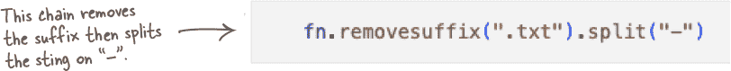
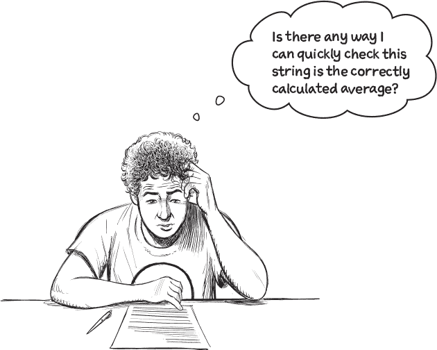

# 第三章：数字列表：*处理列表数据*


**你写的代码越多，你就会变得越好。这就是这么简单。** 在本章中，您将继续创建 Python 代码以帮助教练。您将学习如何从教练提供的数据文件中**读取**数据，将其行读入一个 Python 最强大的内置**数据结构**之一：列表。除了从文件的数据创建列表外，您还将学习如何根据需要**动态**扩展您的列表。并且您将使用 Python 最受欢迎的循环结构之一：**for**循环来处理列表。您将从一种数据格式**转换**为另一种，并且甚至会结交新朋友（您自己的 Python**BFF**）。您已经喝了足够的咖啡和吃了足够的派，所以现在是时候卷起袖子，回到工作中去了。

# 任务#2：处理文件中的数据

完成任务#1 后，是时候转移到任务#2 了。还有一些工作要做，但是，与上一章的活动一样，你可以像上一章详细描述的那样一点一点来处理：

1.  读取文件中的行

1.  忽略第二行

1.  通过“,”拆分第一行以生成时间列表

1.  将每个时间转换为“分：秒.百分之几”的数字格式

1.  计算平均时间，然后将其转换回“分：秒.百分之几”的格式（用于显示目的）

1.  显示来自任务#1 的变量，然后显示来自任务#2 的时间列表和计算出的平均值


**是时候开始工作了。**

当教练完成热身时，你可能还没有完成，但到今天的游泳课结束时，你肯定会有所进展。

在学习 Python 如何从文件中读取数据之前，请先获取本章数据的副本。

# 获取教练的数据副本

如果没有数据可以处理，学习如何从文件中读取数据是没有意义的。因此，请访问本书的支持网站，并获取教练数据文件的最新副本。有 61 个单独的数据文件打包成一个 ZIP 归档文件。从这里获取一份副本：


下载完成后，请解压缩文件，然后将生成的 swimdata 文件夹复制到您的`Learning`文件夹中。这样可以确保接下来的代码能够在已知位置找到数据。

swimdata 文件夹中的每个文件都包含一个游泳者在特定青少年距离/泳姿组合上的记录时间。回顾前一章开头显示的数据文件，显示了达里乌斯在 100 米蝶泳的 13 岁以下比赛中的时间：


**是的，确实。**

有一个称为**open**的 BIF 可以处理文件，打开它们以供读取、写入、追加或以上任意组合。

**open** BIF 本身很强大，但与 Python 的...嗯... **with**语句结合使用时效果更佳。

# open BIF 可以处理文件

无论您的文件包含文本数据还是二进制数据，**open** BIF 都可以打开文件以从中读取、写入或附加数据。默认情况下，**open** 从文本文件读取，这非常完美，因为这正是您想要对 Darius 的数据文件进行的操作。


您可以直接在代码中调用 **open**，打开一个命名文件，处理其数据，然后在完成时关闭文件。无论您使用哪种编程语言，这种打开-处理-关闭的模式都非常常见。事实上，Python 有一种语言语句可以使得处理打开-处理-关闭模式特别方便：**with** 语句。

尽管 **with** 语句有比最初看到的更多，但现在您只需要知道其中一件事：如果您使用 **with** 打开文件，Python 会 *自动* 在完成时关闭文件，无论在文件上执行任何处理时发生了什么。


###### 注

**像往常一样，跟着做。**

# 代码不多，但事情很多...

代码不算很长，但是——正如上一页底部的注解所示——有很多事情发生：


让我们强调三个重要要点：

 **with 语句在其代码块运行 *前* 打开文件。**

您可能会问“哪个代码块？”您是对的。我们还没有告诉您，但 **with** 语句的代码块是所有缩进在其下的代码。在这种情况下，代码块只有一行，这没问题（代码块可以是任意长度）。

###### 注

**如果您是从使用花括号界定代码块的编程语言中转到 Python，那么以这种方式使用缩进可能会让您感到不安。不要让它困扰您，因为这真的不是什么大不了的事。**


**不是我们不想谈论缩进。**

我们觉得 Python 不仅仅是使用缩进（或者更准确地说，*空白*）来界定代码块。是的，这是语言的一个重要方面，但大多数 Python 新手很快就会习惯。当我们需要的时候，我们会提到它，否则我们会继续进行。说了这么多，让我们回到要点上。

 **with 语句在其代码块运行 *后* 关闭文件。**

这是一个很酷的功能，因为我们忘记做这件事了。知道 **with** 语句在你的代码块执行完毕后会收拾残局，这很好。

 **代码创建了两个变量：** `df` **和** `data`**。**

`df`变量指的是通过成功执行**open** BIF 所创建的*文件对象*。`data`变量则指的是通过**readlines**方法从`df`文件对象读取的行列表。尽管`df`变量现在指向一个*关闭*的文件对象，但这两个变量在代码块结束后仍然存在。

# 变量会根据需要动态创建

`df`和`data`变量都是通过赋值创建的。尽管我们很容易看出`data`是如何生成的，多亏了赋值操作符（`=`），但`df`的情况并不那么清楚。


**关键词是“as”。**

多亏了那个**with**语句，**as**关键字获取了**open** BIF 的返回值，并将其赋给了你代码中标识的变量名`df`。这段代码就好像运行了这样一段代码：

```py
df = open(FOLDER+FN)
```

**as**关键字和**with**一起做了同样的事情（而且看起来更好）。

让我们仔细看看`df`是什么，以及了解一下它能做什么：


# 并不是说文件对象就没有吸引力...

只是，在这种情况下，文件对象仅仅是一个手段：将文件的行加载到`data`变量中。那么，`data`是什么，你可以用它做什么？


你已经知道（来自前一章），Python 列表理解方括号表示法。在你深入研究它之前，让我们看看`data`包含什么：

###### 注意

**你可能已经考虑在这里对“data”执行组合曼博，但现在你还不需要。目前，你只需要方括号表示法。**


> **不要忘记按 Shift+Enter 来执行代码单元。**


**是的，借助“with”语句的一点帮助。**

尽管这只是一个单行代码块，但这里发生了很多事情。

不仅已经创建了列表，并将其分配给了你的`data`变量，并填充了包含在游泳者文件中的数据，而且那个`with`语句已经完成了任务＃2 的前两个子任务。这是多么*酷*啊！

看一下（在下一页）。

# 已经开始处理任务＃2

这两行代码产生了很大的影响。这里再次列出它们：


`data`列表中第一个位置的数据值是一个表示游泳者时间的字符串：


你可以安全地忽略文件中的其他内容，因为你所需的数据就在上面的字符串中。现在是时候用一些勾号来表示你在任务＃2 上的进展了：


对于任何已经花费一定时间使用 Python 字符串技术的人来说，第三个子任务不应该太难。碰巧，你刚刚在上一章节中处理了字符串材料，所以你已经准备好了。但在你处理该子任务之前，我们需要讨论**with**语句的一个特定部分：冒号。

# 你的新死党，Python 的冒号

冒号（`**:**`）表示即将*开始*一个代码块。

与许多其他编程语言不同，Python 不使用花括号（`**{**` 和 `**}**`）来界定代码块。相反，Python 使用缩进（或更确切地说是*空白*）。事实上，在 Python 中，花括号界定数据，*不是*代码。

在 Python 中，代码块在缩进结束时结束。

在你的**with**语句中，该块只包含一行代码，但它可能包含任意数量的代码行。缩进到与前一行相同级别的代码属于*同一*代码块。

冒号在这里至关重要（这就是为什么它是你的新死党）。就像现实生活中，如果你忘记了你的好朋友，坏事就会发生。如果你忘记了那行末尾的冒号，Python 就拒绝运行你的代码！

把冒号和缩进看作*相辅相成*：没有其中一个，另一个也无从谈起。

> **FYI：Python 文档将“代码块”称为“套件”。**

###### 注意

**我们也觉得这很奇怪。**


**是的，两个问题都是。**

是的，我们确实在上一章介绍了字符串，而且，是的，我们现在专注于列表。

回想一下**split**方法会从字符串生成一个列表，这正是你现在需要使用它的原因。如果你上面的`times`变量不是一个列表，你可能做错了什么。

当你准备好了，请翻页看我们想出来的代码。


# 那几乎太容易了

由于你在上一章节处理字符串的先前经验，我们希望最近的*Sharpen*不会太费力。

在调用**strip**之前调用*split*非常重要，这会从`data`的第一个槽中的数据值产生一个新列表（`data[0]`）。事实上，你的最新链式代码与上一章的代码非常相似：



将最新链式的结果赋给`times`变量后，你已完成子任务（c）。现在是另一个复核的时候。


# 暂停一下，回顾一下这个任务的代码

下面是如何在 VS Code 中将迄今为止的代码合并到一个单独的代码单元格中：


如果你在笔记本中尝试这两个`with`语句，你会发现它们都用相同的字符串集合填充了`times`引用的列表。那么，为什么不使用两行版本的代码，而不是三行版本呢？毕竟，就像前一章中的`parts`列表一样，一旦`data`列表被使用一次后就不再需要了……


**不，这不难阅读。这是一场噩梦。**

这里链了三种方法，第一种方法创建了一个列表，从中取出第一个槽的数据（使用方括号表示法），然后剥离它再拆分它……但是，“它”再次指的是什么呢？！？

这一行代码很难阅读、理解、解释*和*维护。我们同情未来某个时刻被要求“修复”此代码的可怜程序员（很可能是*你*）。

# 将时间字符串转换为时间值

在上一页的代码运行之后，`times`变量引用的是一个字符串列表：


`times` 列表中的每个槽中的值看起来确实像是游泳时间，但实际上并不是。它们是字符串。要对此列表执行任何数值计算，比如计算平均值，需要将这些字符串转换为数值。

让我们仔细看看只有一个值（第一个）。如果你能想出一个转换这个第一个时间的策略，然后就可以将其应用于列表的其余部分。


###### 注意

**有多种方法可以做到这一点，所以如果你的想法与我们的不同也不用担心（我们的方法在后面详细说明）。**

# 将时间转换为百分之一秒

目前，尽管我们的大脑把它们看作*时间*，所有游泳时间都是*字符串*。但我们的计算机不是这样的（更不用说 Python 了）。我们的数字朋友们在转换时需要一点帮助，以下是我们建议的方法：


将这个转换策略转化为 Python 代码是*非常*简单的。我们来看一下。

# 用 Python 转换为百分之一秒

我们在上一页用了很多视觉效果，并将视觉的步骤转换为 Python 代码几乎是一对一的匹配。下面显示的代码执行了从你的`times`列表中获取的第一个游泳时间的计算，代码输入到了`Average.ipynb`笔记本的单个单元格中。


为了帮助你弄清楚，我们在这段代码中添加了一些注释。当 Python 遇到 `#` 字符时，它会*忽略*直到当前行结束的所有内容（注意 VS Code 如何友好地显示**绿色**的注释）。

将这段代码输入到你的笔记本中，如果你决定排除注释也不要感到内疚（别担心，我们不会告诉）。我们把它们放在那里是为了与预览页面的转换步骤的代码匹配起来。


将这段代码输入笔记本中的空单元格，按下**Shift+Enter**来运行它。屏幕上显示`8795`。棒极了。


**如果您可以转换一个游泳时间...**

您可以将它们全部转换。并且，在此处使用循环是没有额外学分的明智选择。

像大多数编程语言一样，Python 提供了许多循环方式，**for**循环是其中的一个最爱。让我们来看一个简单的循环，它从`times`列表中获取每个字符串并显示在屏幕上。


**酷，不是吗？**

**for**循环足够聪明，可以知道正在处理的列表的全部长度。

使用**len** BIF 来计算列表在被循环前有多大的诱惑总是存在的，但对于**for**来说这是一个不必要的步骤。**for**循环从列表中的第一个值开始，按顺序获取每个值，处理该值，然后移动到下一个值。当列表耗尽时，**for**循环终止。

这就是我们喜欢的魔法。


**Python 确实支持 while。**

但是，在 Python 中，**while**循环的使用远少于等效的**for**循环。

在解决上述练习的解决方案代码之前，让我们花一点时间比较**for**循环和**while**循环。

# 比赛开始... for 循环对抗 while 循环

这是之前的**for**循环，以及它的输出：


这是一个完全相同的**while**循环：


不仅**while**循环的代码行数是**for**循环的两倍，而且看看所有你需要关注的额外内容！与**for**循环不同，**while**循环有很多地方可能会出错。并不是说**while**循环不应该使用，只是在大多数情况下，记得先选择**for**循环。

# 现在您已经行驶如飞！

现在你已经完成了任务＃2 的子任务的中点：


在任务＃2 的子任务(e)的第一部分中，您有选择。


*任何一种方法都可以。*

但是，如果您认为转换后的时间可能会在以后需要，也许创建一个新的转换时间列表是更好的选择...

您认为呢？


# 让我们保留一份转换的副本

老实说，*任何一个*来自上一页底部的两种方法都可以用于任务＃2 的子任务(e)的第一部分：*计算平均时间*。但是，我们猜想这些转换后的值至少还需要使用一次，所以最好在执行转换时将它们放入另一个列表中。

要做到这一点，您需要学习更多关于列表的知识。具体来说，如何创建一个新的空列表，并且在迭代`times`列表时逐步添加数据值。

# 创建一个新的空列表

步骤 1：为你的列表想出一个有意义的变量名。步骤 2：将空列表分配给你的新变量名。

让我们称你的新列表为`converts`。以下是如何在一行代码中执行步骤 1 和 2：


请记住，`type` BIF 用于确定变量引用的*类型*。快速调用`type`确认你正在使用一个列表，并调用`len` BIF 确认你的新列表是*空的*：


**你还记得如何显示你的新列表的内置方法吗？**

# 显示你的列表方法列表

现在是组合舞曲的时候了！

就像 Python 中的任何对象一样，**print dir** 组合会列出对象的内置属性和方法。而在 Python 中，一切皆为对象，列表也是对象！


第一个非双下划线方法名称是**append**。你可能猜到它的作用，但让我们使用**help** BIF 来确认：


啊哈！

最后一行输出（*“将对象附加到列表末尾。”*）就是你需要知道的一切，即使尝试花时间进行实验也是很诱人的，其中一些方法听起来很酷。但是，现在不要这样做。

###### 注意

**当然，如果你想尝试其他方法，我们不会阻止你。**

让我们继续完成构建转换后游泳时间值列表的任务。


**不，你不需要担心。**

在前一章中，我们非常强调 Python 中的列表与其他编程语言中的数组*相似*。这使得我们可以介绍使用方括号标记与列表一起工作的常见技术*和*方法。

然而，*与*数组不同，在那里通常需要声明数组可能会变得多大（例如，1000 个插槽），以及它将包含哪种类型的数据（例如整数），在 Python 列表中无需声明这两者。

Python 列表是*动态的*，这意味着它们按需增长（因此无需预先声明插槽的数量）。Python 列表不包含数据值，它们包含**对象引用**，因此你可以在 Python 列表中放置任何类型的任何数据。你甚至可以混合搭配类型。

# 现在是计算平均值的时候了

你不需要成为程序员才能知道如何在给定数字列表的情况下计算平均值。代码并不复杂，但这个事实本身并不能证明你实际编写它的决定是正确的。当你遇到一个编程需求，感觉好像可能已经有人编写了它，问问自己这个问题：*我想知道 Python 标准库中是否有任何有用的东西可以帮助吗？*

重复使用现有代码没有任何羞耻感，即使对于你认为*简单*的事情也是如此。考虑到这一点，以下是如何从`converts`列表中计算平均值的方法，借助 PSL 的帮助：

> **嘿，还记得那个方便的 PSL 吗？不，不是美味的季节拿铁，是另一个 PSL！**


尽管计算平均值很容易，如上所示，你不必编写循环、维护计数、保持累计总数，也不必执行平均值计算。你只需将数字列表的名称传递给**mean**函数，该函数将返回你的数据的算术平均值（即平均值）。很酷。就这样。


**是的，格式为分:秒.百分之几。**

实际上，你需要反向处理之前的过程，将原始游泳时间字符串转换为其数值等效形式。

这并不难，对吧？

# 将平均值转换为游泳时间字符串

有经验的 Python 程序员足够了解如何在将百分之几秒转换回*分:秒.百分之几*字符串格式时应用一些“技巧”。稍后在本书中，你将学习这些技术，现在展示它们可能会使本章的长度翻倍。因此，现在让我们（大多数时候）坚持你已经掌握的 Python 来执行这个任务。


在笔记本中跟着走，当你通过五个步骤进行转换时。这是你要做的事情：


 **首先将百分之几的值转换为其相应的秒数。**


 **将平均值分解为其组成部分。**


 **计算分钟数。**


 **计算秒数。**


 **现在知道了分钟数、秒数和百分之几，构建游泳时间字符串。**



**是的，比你想象的要容易。**

你可以去学习如何在 Python 中编写自动化测试，然后编写任意数量的测试来检查你的计算结果…

或者你可以简单地再看看游泳教练的电子表格，确认你计算的游泳时间“`1:26.58`”与教练电子表格计算的平均值匹配。

此过程如下所示。


# 距离上次打勾已经有一段时间了…

恭喜！你终于可以对子任务（e）打上实至名归的勾。

所有剩下的就是将上一章节的代码与本章节看到的代码结合起来。一旦完成，子任务（f）也将完成：


# 任务#2（终于）完成了！

干得漂亮！通过创建（和执行）`Times.ipynb`笔记本，前一章节开始时标识的两个任务现在已经完成。所有人都打勾了！

 **从文件名提取数据**


 **处理文件中的数据**


当然，达到这一点并不一定意味着你完成了……


**不，我们没有忘记。**

下一章为达到你可以处理制图需求的基础铺设了基础，因此我们请求教练谅解。

目前，你的代码只能处理一个特定数据文件的数据。教练数据集中还有其他 60 多个文件。如果有一种方式可以根据需要随时使用这些代码，那就太好了。

当你前往下一章时，你可以考虑这样做，届时我们将一起解决这个问题。

现在，让我们用另一个总结和一个超时事话题的纵横字谜来结束这一章节。享受吧！
